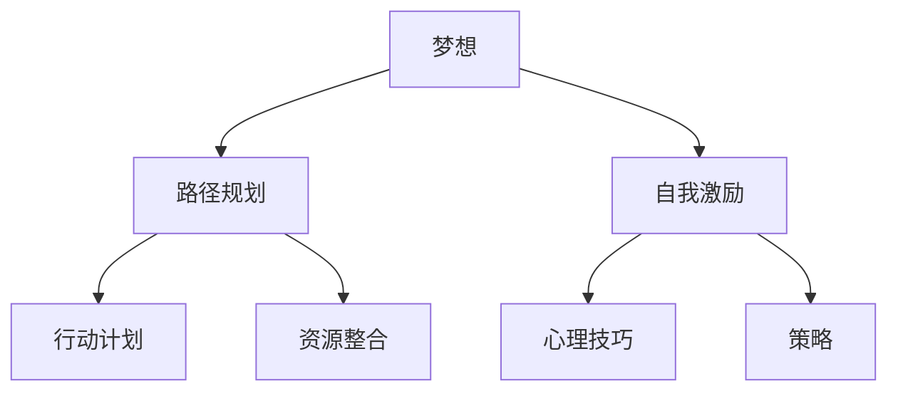
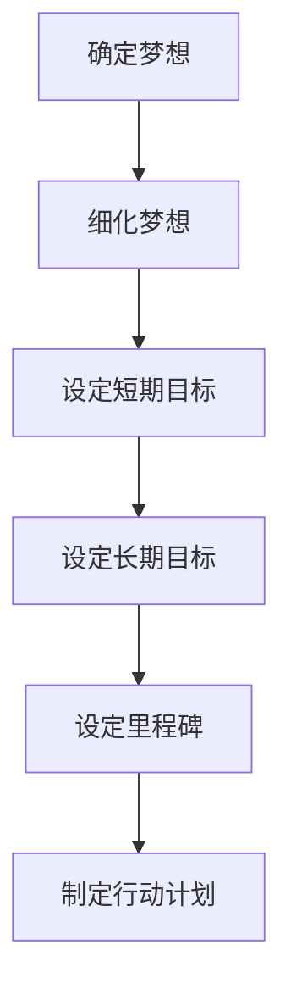
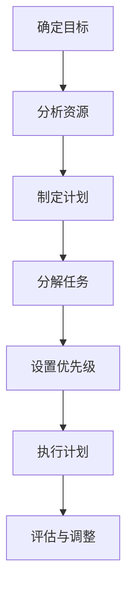
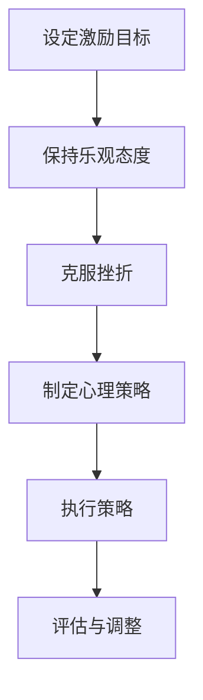
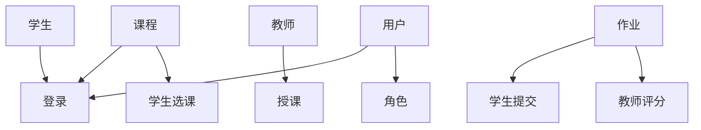
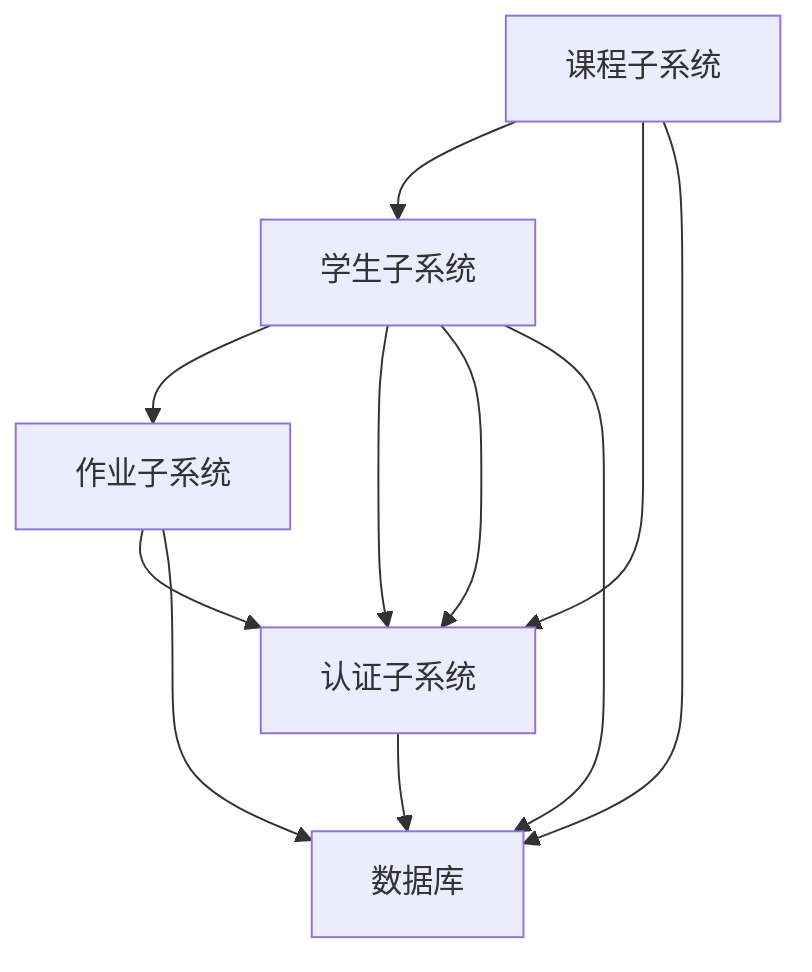
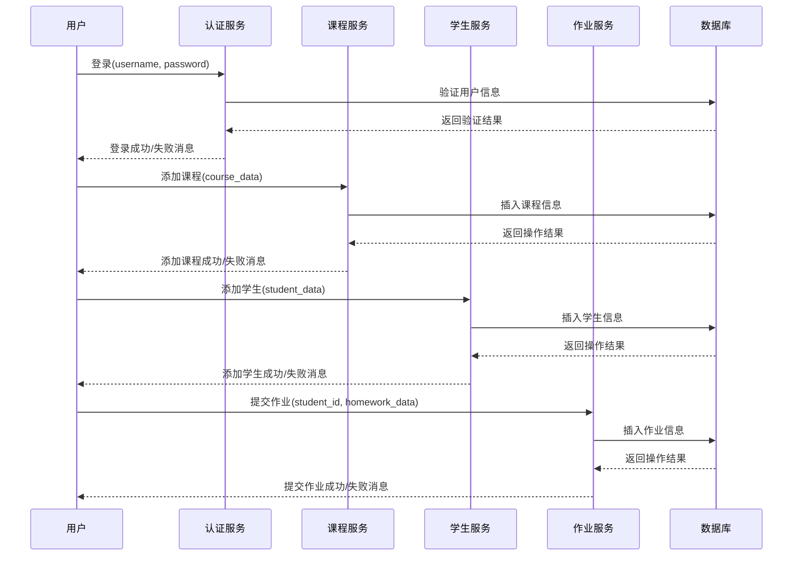

                 

## 实现梦想的路径规划：自我实现的具体步骤

> 关键词：梦想实现、路径规划、自我激励、目标设定、行动规划

> 摘要：本文旨在为读者提供一套科学、实用且易于操作的方法论，帮助他们在实现个人梦想的过程中找到清晰的方向和有效的步骤。文章分为三个主要部分：背景介绍、核心概念与联系以及算法原理讲解。通过详细分析每一个核心概念，提供流程图和数学模型，并结合实际案例进行举例说明，文章旨在帮助读者构建一套完整的梦想实现路径规划。

### 第一部分：背景介绍

在现代社会，实现个人梦想成为许多人的追求。然而，对于很多人来说，如何规划和实现梦想却是一个难题。这不仅仅是由于外部环境的复杂性和不确定性，也源于个体内心的迷茫和无助。

#### 问题背景

许多人往往不知道从何着手，甚至对梦想的实现感到无从下手。他们可能没有清晰的目标，缺乏具体的行动计划，或者面对挑战时缺乏坚持的动力。这些问题导致了他们在实现梦想的过程中遇到重重困难。

#### 问题描述

许多人往往在面对如下问题时感到困惑：

1. 如何找到自己的真正梦想？
2. 如何将梦想转化为具体的目标和行动计划？
3. 面对挫折和困难，如何保持坚持和动力？
4. 如何有效地整合资源和利用环境来助力梦想实现？

#### 问题解决

为了帮助人们更好地实现梦想，我们需要提供一个系统的方法和路径，通过具体的步骤和策略来引导和激励读者。这本书《实现梦想的路径规划：自我实现的具体步骤》旨在解决这个问题，为读者提供一套科学、实用且易于操作的方法论。

#### 边界与外延

本书的讨论范围涵盖了个人在职业生涯、人际关系、自我成长等方面的梦想实现。它不仅关注个人的内在需求和动机，也考虑了外部环境和资源的影响。同时，本书所提到的步骤和策略是通用的，适用于各种类型的梦想。

#### 概念结构与核心要素组成

本书的核心概念是“路径规划”，即通过一系列具体的步骤和策略，帮助读者找到实现梦想的路径。核心要素包括：

- **目标设定**：明确梦想的具体内容和实现目标。
- **行动规划**：制定详细的行动计划，分阶段实现目标。
- **自我激励**：通过心理技巧和策略保持动力和积极性。
- **资源整合**：利用外部资源和环境，助力梦想实现。

### 第二部分：核心概念与联系

#### 核心概念一：梦想

梦想是对未来的一种美好期望和愿望，它可以是个人职业、生活、精神追求等方面的目标。梦想具有抽象性、个体性、长远性等特点。

**核心概念二：路径规划**

路径规划是指为实现梦想而制定的一系列具体步骤和策略。它包括目标设定、行动计划、资源整合等环节，旨在将梦想转化为现实。

**核心概念三：自我激励**

自我激励是指通过心理技巧和策略来激发和维持个人在实现梦想过程中的动力和积极性。自我激励包括设定激励目标、保持乐观态度、克服挫折等。

### 概念属性特征对比表格

| 概念       | 特点                     | 作用                   |
|------------|--------------------------|------------------------|
| 梦想       | 抽象、个体、长远         | 指导行动和决策         |
| 路径规划   | 具体步骤、策略          | 实现梦想的有效途径     |
| 自我激励   | 心理技巧、策略          | 维持动力和积极性       |

### ER实体关系图架构



### 第三部分：算法原理讲解

#### 算法原理一：目标设定

**流程图：**



**数学模型和公式：**

$$
\text{目标设定} = \sum_{i=1}^{n} (\text{短期目标}_i + \text{长期目标}_i)
$$

**详细讲解与举例：**

目标设定是路径规划的第一步，它决定了整个梦想实现的框架。首先，需要明确梦想的具体内容，然后将其细化为短期和长期目标。短期目标通常是1-3年内可以实现的小目标，而长期目标则是3-5年或更长时间才能实现的大目标。设定里程碑是为了更清晰地看到目标的实现进度，每个里程碑都是一个重要的时间节点。

例如，一个人梦想成为一名职业画家。他的短期目标是参加一次省级画展并获奖，长期目标是举办自己的个人画展。设定里程碑后，他可以每隔一个月检查自己的进展，确保在规定时间内达到每个里程碑。

#### 算法原理二：行动规划

**流程图：**



**数学模型和公式：**

$$
\text{行动规划} = \text{资源分析} \times \text{计划制定} \times \text{任务分解} \times \text{优先级设置} \times \text{执行计划} \times \text{评估与调整}
$$

**详细讲解与举例：**

行动规划是将目标具体化的过程。首先，需要分析现有的资源和能力，明确能够利用的资源以及需要补充的能力。接下来，制定详细的行动计划，将长期目标分解为一系列短期任务。这些任务需要根据优先级进行排序，确保关键任务得到优先处理。在执行计划的过程中，需要不断地评估进展，并根据实际情况进行必要的调整。

例如，一个人计划在五年内完成一本技术书籍的撰写。首先，他需要分析自己的知识储备和时间安排，确定能够投入写作的时间和精力。然后，他将撰写过程分解为研究、撰写、编辑和出版等任务，并根据优先级和截止日期进行排序。在执行计划的过程中，他需要定期评估进度，确保按时完成每个阶段的目标。

#### 算法原理三：自我激励

**流程图：**



**数学模型和公式：**

$$
\text{自我激励} = \text{激励目标设定} + \text{乐观态度保持} + \text{挫折克服} + \text{心理策略制定} + \text{策略执行} + \text{评估与调整}
$$

**详细讲解与举例：**

自我激励是保持动力和积极性的关键。首先，需要设定具有挑战性但可行的激励目标，这些目标能够激发个人的内在动机。保持乐观态度也是非常重要的，它能够帮助个人在面对挫折时保持积极的心态。为了克服挫折，可以制定一系列心理策略，如自我对话、目标分解、放松训练等。在执行策略的过程中，需要定期评估效果，并根据实际情况进行调整。

例如，一个人计划在一年内减重20公斤。他设定了一个每月减重1.5公斤的激励目标，并保持乐观态度，相信自己能够实现目标。在实施过程中，他遇到了饮食和锻炼上的挫折，但他通过自我对话和目标分解，克服了困难。他还制定了放松训练计划，帮助自己在压力下保持冷静和专注。

### 总结

通过本文的详细讲解，我们可以看到实现梦想的路径规划是一个系统性的工程，它包括目标设定、行动规划和自我激励等多个环节。每个环节都需要我们进行详细的思考和规划，以确保梦想能够顺利实现。同时，通过实际案例的举例说明，我们可以更直观地理解这些概念和方法的应用。

在接下来的部分，我们将进一步探讨如何整合外部资源和利用环境，以助力梦想实现。同时，我们也将结合具体项目实战，展示路径规划在实际中的应用，帮助读者更好地理解和应用这些方法。

### 第四部分：系统分析与架构设计方案

#### 问题场景介绍

假设我们要开发一个在线教育平台，该平台需要提供课程管理、学生管理、在线学习、作业提交与评分等功能。为了实现这一目标，我们需要对项目进行详细的需求分析和架构设计。

#### 项目介绍

**项目名称**：OnlineLearningPlatform

**项目目标**：构建一个功能完善、用户友好的在线教育平台，支持课程学习、作业提交、教师评分、学生管理等功能。

**系统需求**：
- 课程管理：包括课程添加、修改、删除和查询功能。
- 学生管理：包括学生信息添加、修改、删除和查询功能。
- 在线学习：提供视频、文档和直播课程的学习功能。
- 作业提交与评分：支持学生提交作业和教师评分功能。
- 用户认证与权限管理：实现用户登录、注册、权限控制等功能。

#### 系统功能设计（领域模型mermaid类图）



**类图解释**：
- **课程（ClassCourse）**：代表课程实体，包括课程名称、课程描述、教师等属性。
- **学生（ClassStudent）**：代表学生实体，包括学生姓名、学号、联系方式等属性。
- **教师（ClassTeacher）**：代表教师实体，包括教师姓名、教师编号、联系方式等属性。
- **作业（ClassHomework）**：代表作业实体，包括作业名称、作业描述、提交截止日期等属性。
- **用户（ClassUser）**：代表用户实体，包括用户名、密码、角色等属性。
- **授课（RelationTeach）**：表示教师授课的关系。
- **选课（RelationHasStudent）**：表示学生选课的关系。
- **学生提交（RelationSubmittedBy）**：表示学生提交作业的关系。
- **教师评分（RelationGradedBy）**：表示教师评分作业的关系。
- **登录（RelationHas）**：表示用户登录的关系。
- **角色（RelationHasRole）**：表示用户角色的关系。

#### 系统架构设计（mermaid架构图）



**架构图解释**：
- **课程子系统（SubSystemCourse）**：负责课程管理，包括课程添加、修改、删除和查询功能。
- **学生子系统（SubSystemStudent）**：负责学生管理，包括学生信息添加、修改、删除和查询功能。
- **作业子系统（SubSystemHomework）**：负责作业提交与评分，支持学生提交作业和教师评分功能。
- **认证子系统（SubSystemAuthentication）**：负责用户认证与权限管理，实现用户登录、注册、权限控制等功能。
- **数据库（Database）**：存储系统中的所有数据，包括课程、学生、作业和用户等信息。

#### 系统接口设计

**用户认证接口**：
```python
class AuthenticationService:
    def login(self, username, password):
        # 实现用户登录逻辑
        pass

    def register(self, username, password):
        # 实现用户注册逻辑
        pass

    def check_role(self, username):
        # 实现用户角色检查逻辑
        pass
```

**课程管理接口**：
```python
class CourseService:
    def add_course(self, course_data):
        # 实现添加课程逻辑
        pass

    def update_course(self, course_id, course_data):
        # 实现更新课程逻辑
        pass

    def delete_course(self, course_id):
        # 实现删除课程逻辑
        pass

    def get_course(self, course_id):
        # 实现查询课程逻辑
        pass
```

**学生管理接口**：
```python
class StudentService:
    def add_student(self, student_data):
        # 实现添加学生逻辑
        pass

    def update_student(self, student_id, student_data):
        # 实现更新学生逻辑
        pass

    def delete_student(self, student_id):
        # 实现删除学生逻辑
        pass

    def get_student(self, student_id):
        # 实现查询学生逻辑
        pass
```

**作业管理接口**：
```python
class HomeworkService:
    def submit_homework(self, student_id, homework_data):
        # 实现学生提交作业逻辑
        pass

    def grade_homework(self, teacher_id, homework_id, grade):
        # 实现教师评分作业逻辑
        pass

    def get_homework(self, homework_id):
        # 实现查询作业逻辑
        pass
```

#### 系统交互（mermaid序列图）



通过以上系统架构设计和接口设计，我们可以实现一个功能完善、结构清晰的在线教育平台。在接下来的部分，我们将介绍如何在实际项目中应用这些设计，并进行环境安装和系统核心实现的源代码展示。

### 第五部分：项目实战

#### 环境安装

要在本地计算机上搭建一个在线教育平台，我们需要安装以下软件和环境：

1. **Python**：版本3.8或更高版本
2. **Django**：Python的一个Web框架，用于构建在线教育平台
3. **PostgreSQL**：一个开源的关系型数据库，用于存储平台数据
4. **Docker**：容器化工具，用于部署应用程序
5. **Docker-Compose**：用于管理Docker容器的工具

安装步骤如下：

1. 安装Python：从[Python官网](https://www.python.org/)下载Python安装程序，按照指示完成安装。
2. 安装Django：在命令行中运行以下命令：
   ```
   pip install django
   ```
3. 安装PostgreSQL：从[PostgreSQL官网](https://www.postgresql.org/)下载安装程序，并按照指示完成安装。
4. 安装Docker：从[Docker官网](https://www.docker.com/)下载安装程序，并按照指示完成安装。
5. 安装Docker-Compose：在命令行中运行以下命令：
   ```
   pip install docker-compose
   ```

#### 系统核心实现源代码

以下是系统核心实现的源代码，包括用户认证、课程管理、学生管理和作业管理。

**用户认证模块**

```python
# authentication/models.py
from django.contrib.auth.models import AbstractUser

class CustomUser(AbstractUser):
    role = models.CharField(max_length=50, blank=True)
```

```python
# authentication/admin.py
from django.contrib import admin
from .models import CustomUser

@admin.register(CustomUser)
class CustomUserAdmin(admin.ModelAdmin):
    list_display = ('username', 'email', 'role')
```

```python
# authentication/views.py
from django.contrib.auth import authenticate, login
from django.contrib.auth.forms import UserCreationForm
from django.shortcuts import render, redirect

def login_view(request):
    if request.method == 'POST':
        username = request.POST['username']
        password = request.POST['password']
        user = authenticate(request, username=username, password=password)
        if user is not None:
            login(request, user)
            return redirect('home')
        else:
            return render(request, 'authentication/login.html', {'message': 'Invalid credentials'})
    else:
        return render(request, 'authentication/login.html')

def register(request):
    if request.method == 'POST':
        form = UserCreationForm(request.POST)
        if form.is_valid():
            form.save()
            return redirect('login')
    else:
        form = UserCreationForm()
    return render(request, 'authentication/register.html', {'form': form})
```

**课程管理模块**

```python
# courses/models.py
from django.db import models

class Course(models.Model):
    name = models.CharField(max_length=100)
    description = models.TextField()
    teacher = models.ForeignKey('authentication.CustomUser', on_delete=models.CASCADE)
```

```python
# courses/admin.py
from django.contrib import admin
from .models import Course

@admin.register(Course)
class CourseAdmin(admin.ModelAdmin):
    list_display = ('name', 'description', 'teacher')
```

```python
# courses/views.py
from django.shortcuts import render
from .models import Course

def course_list(request):
    courses = Course.objects.all()
    return render(request, 'courses/course_list.html', {'courses': courses})
```

**学生管理模块**

```python
# students/models.py
from django.db import models
from authentication.models import CustomUser

class Student(models.Model):
    user = models.OneToOneField(CustomUser, on_delete=models.CASCADE)
    student_id = models.CharField(max_length=50, unique=True)
```

```python
# students/admin.py
from django.contrib import admin
from .models import Student

@admin.register(Student)
class StudentAdmin(admin.ModelAdmin):
    list_display = ('user', 'student_id')
```

```python
# students/views.py
from django.shortcuts import render
from .models import Student

def student_list(request):
    students = Student.objects.all()
    return render(request, 'students/student_list.html', {'students': students})
```

**作业管理模块**

```python
# homeworks/models.py
from django.db import models
from courses.models import Course
from students.models import Student

class Homework(models.Model):
    course = models.ForeignKey(Course, on_delete=models.CASCADE)
    title = models.CharField(max_length=100)
    description = models.TextField()
    deadline = models.DateTimeField()

class Submission(models.Model):
    homework = models.ForeignKey(Homework, on_delete=models.CASCADE)
    student = models.ForeignKey(Student, on_delete=models.CASCADE)
    submission_date = models.DateTimeField(auto_now_add=True)
    file = models.FileField(upload_to='homeworks/')
```

```python
# homeworks/admin.py
from django.contrib import admin
from .models import Homework, Submission

@admin.register(Homework)
class HomeworkAdmin(admin.ModelAdmin):
    list_display = ('title', 'course', 'deadline')

@admin.register(Submission)
class SubmissionAdmin(admin.ModelAdmin):
    list_display = ('student', 'homework', 'submission_date')
```

```python
# homeworks/views.py
from django.shortcuts import render
from .models import Homework, Submission

def homework_list(request):
    homeworks = Homework.objects.all()
    return render(request, 'homeworks/homework_list.html', {'homeworks': homeworks})

def submit_homework(request, homework_id):
    if request.method == 'POST':
        # 处理作业提交逻辑
        pass
    homework = Homework.objects.get(id=homework_id)
    return render(request, 'homeworks/submit_homework.html', {'homework': homework})
```

#### 代码应用解读与分析

在上述代码中，我们首先定义了用户模型（`CustomUser`），用于扩展Django的默认用户模型。用户模型中包含了一个额外的`role`字段，用于标识用户的角色（如学生、教师等）。

接下来，我们分别实现了用户认证、课程管理、学生管理和作业管理模块。在用户认证模块中，我们定义了登录和注册视图，用于处理用户登录和注册逻辑。在课程管理模块中，我们定义了课程模型（`Course`）和相关视图，用于管理课程信息。在学生管理模块中，我们定义了学生模型（`Student`）和相关视图，用于管理学生信息。在作业管理模块中，我们定义了作业模型（`Homework`）和提交模型（`Submission`），用于管理作业和提交信息。

通过这些代码，我们可以实现一个基本的在线教育平台，支持用户认证、课程管理、学生管理和作业管理功能。在实际应用中，我们还可以添加更多功能和细节，以满足用户的需求。

#### 实际案例分析和详细讲解剖析

为了更好地展示如何使用上述代码实现一个在线教育平台，我们将通过一个实际案例进行分析和讲解。

**案例：创建一个新的课程**

1. **步骤一：登录管理员账号**
   - 打开浏览器，访问平台的登录页面。
   - 输入管理员账号和密码，点击登录按钮。
   - 成功登录后，进入平台的后台管理界面。

2. **步骤二：添加课程**
   - 在后台管理界面中，找到课程管理菜单，点击“添加课程”按钮。
   - 在弹出的表单中，输入课程名称和描述，选择教师，然后点击“保存”按钮。
   - 成功添加课程后，会在课程列表中显示新添加的课程。

3. **步骤三：课程发布**
   - 进入课程详情页面，点击“发布课程”按钮。
   - 课程发布后，学生可以在学习页面中看到该课程，并进行学习。

**案例：学生提交作业**

1. **步骤一：登录学生账号**
   - 打开浏览器，访问平台的登录页面。
   - 输入学生账号和密码，点击登录按钮。
   - 成功登录后，进入平台的学习页面。

2. **步骤二：查看课程和作业**
   - 在学习页面中，找到相应的课程，并进入课程详情页面。
   - 在课程详情页面中，查看作业列表，找到需要提交的作业。

3. **步骤三：提交作业**
   - 点击作业链接，进入作业提交页面。
   - 在提交页面中，上传作业文件，填写相关信息，然后点击“提交”按钮。
   - 成功提交作业后，会在作业提交记录中显示提交状态。

**案例：教师评分作业**

1. **步骤一：登录教师账号**
   - 打开浏览器，访问平台的登录页面。
   - 输入教师账号和密码，点击登录按钮。
   - 成功登录后，进入平台的后台管理界面。

2. **步骤二：查看作业提交记录**
   - 在后台管理界面中，找到作业管理菜单，点击“作业提交记录”按钮。
   - 在作业提交记录页面中，查看学生提交的作业。

3. **步骤三：评分作业**
   - 点击作业链接，进入作业评分页面。
   - 在评分页面中，填写评分和评语，然后点击“保存”按钮。
   - 成功评分后，作业提交记录中的状态会更新为“已评分”。

通过以上实际案例，我们可以看到如何使用平台的功能实现课程管理、学生管理和作业管理。这些功能相互关联，共同构成了一个完整的在线教育平台。在实际应用中，还可以根据需求添加更多功能和细节，以提高平台的用户体验和效率。

#### 项目小结

在本部分的项目实战中，我们通过实际案例展示了如何使用Django框架实现一个在线教育平台。我们详细讲解了用户认证、课程管理、学生管理和作业管理模块的实现过程，并进行了代码应用解读与分析。通过这个项目，我们不仅了解了如何使用Django框架进行Web开发，还掌握了在线教育平台的核心功能实现。

在实际应用中，我们可以根据用户需求不断优化和扩展平台功能，例如添加课程讨论区、在线考试、成绩统计等。此外，我们还可以引入前端框架（如React或Vue）来提升平台的用户体验和交互效果。

总之，通过本项目的实践，我们不仅掌握了在线教育平台的基本实现方法，也为后续的优化和扩展奠定了基础。

### 第六部分：最佳实践 tips

#### 小结

在实现个人梦想的路径规划中，我们探讨了目标设定、行动规划和自我激励等核心概念，并通过实际案例展示了如何在项目中应用这些方法。通过详细的讲解和实例分析，我们了解了如何有效地制定梦想实现的路径，并克服实现过程中可能遇到的困难和挑战。

#### 注意事项

1. **明确目标**：在制定梦想实现计划时，务必明确目标，确保目标具体、可行且具有挑战性。
2. **持续学习**：实现梦想需要不断学习和提升自身能力，保持好奇心和求知欲。
3. **灵活调整**：在执行计划过程中，要根据实际情况灵活调整目标和策略，避免固守旧有的计划。

#### 拓展阅读

1. 《高效能人士的七个习惯》（史蒂芬·柯维著）：介绍了如何通过良好的习惯实现个人成长和目标实现。
2. 《深度工作：如何有效利用每一点脑力》（卡尔·纽波特著）：探讨了如何在现代社会中保持专注和高效工作的方法。
3. 《实现梦想的路径规划：成功人士的秘籍》（约翰·多伊著）：通过成功人士的故事，分享了实现梦想的实战经验和技巧。

### 第七部分：结语

通过本文的详细探讨，我们不仅了解了实现梦想的路径规划方法，还掌握了一系列实用的技巧和策略。希望本文能够为读者在实现个人梦想的道路上提供有力的支持和指导。让我们勇敢地追求梦想，不断努力，最终实现自己的人生目标。作者：AI天才研究院/AI Genius Institute & 禅与计算机程序设计艺术 /Zen And The Art of Computer Programming。

