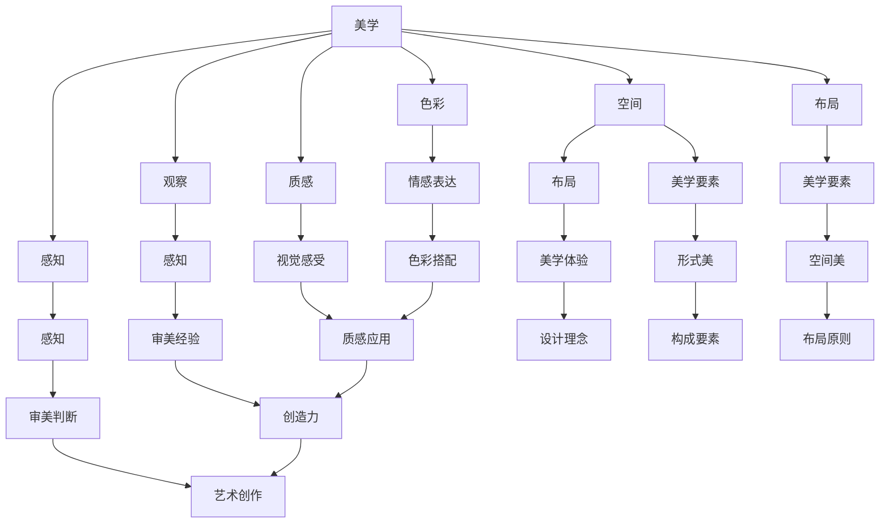
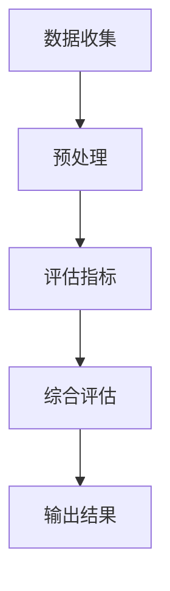
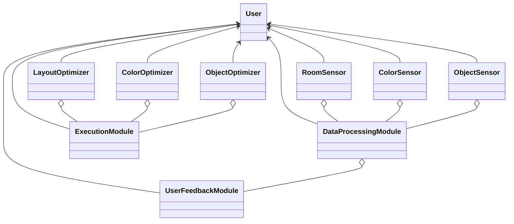
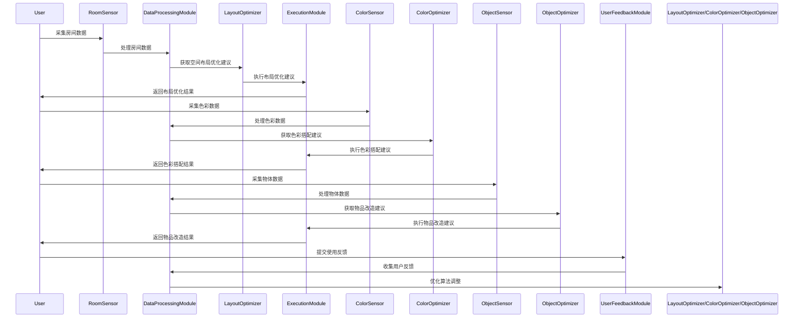
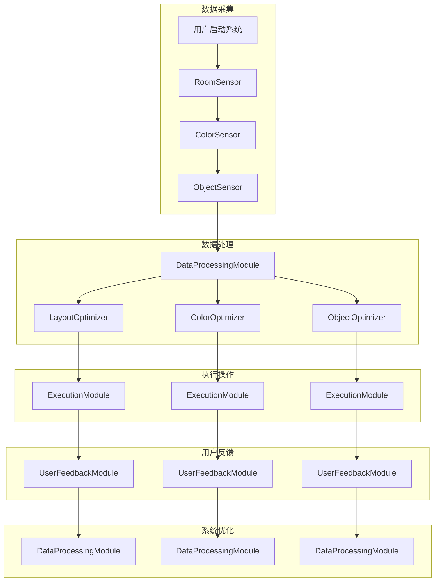

                 

### 文章标题与关键词

**文章标题：**《将生活转化为艺术：日常美学的实践指南》

**关键词：** 生活美学、日常改造、色彩、质感、空间布局、环保与可持续性、实践案例

这篇文章旨在探讨如何通过日常生活中的小改变来提升生活的美学价值。关键词“生活美学”强调了文章的核心主题，即如何将美学理论应用到日常生活中。而“日常改造”、“色彩”、“质感”、“空间布局”和“环保与可持续性”则是文章中具体讨论的内容，这些关键词不仅涵盖了提升美学的方法，也体现了文章对环保和可持续发展的关注。

本文将通过以下几个主要部分展开讨论：

1. **引言**：介绍书籍的目的、日常生活美学的重要性以及文章的核心内容。
2. **美学基础**：讨论美学的基本概念、历史与发展，以及美学的基本原理。
3. **观察与感知**：探讨如何通过观察和感知提升生活中的美学体验。
4. **空间与布局**：介绍空间布局对美学的影响，如何设计有美感的居住空间。
5. **色彩与质感**：分析色彩、质感在生活中的运用，如何通过色彩和质感提升美学。
6. **日常物品的美学改造**：展示如何通过改造日常物品提升家居美学。
7. **美学实践案例**：提供具体案例，展示如何将美学理论应用到日常生活中。

通过这些部分的详细讨论，本文将帮助读者理解如何将美学融入日常生活，从而提升生活的质量与幸福感。

### 文章摘要

本文《将生活转化为艺术：日常美学的实践指南》旨在探讨如何通过日常生活中的小改变来提升生活的美学价值。文章首先介绍了书籍的目的和日常生活美学的重要性，接着深入讨论了美学的基础概念、观察与感知、空间与布局、色彩与质感，以及日常物品的美学改造。通过这些部分的详细讲解，本文展示了如何将美学理论应用到日常生活中，提供了一系列实践案例，以帮助读者理解和实践如何提升生活的美学体验。文章最后总结了主要观点，并提供了拓展阅读资源，鼓励读者进一步探索美学与日常生活的联系。

### 书名与总体内容框架设计

书名《将生活转化为艺术：日常美学的实践指南》不仅直接揭示了书籍的主题，还通过使用“艺术”一词，激发了读者对美好生活的向往和探索欲望。书名中的“生活”一词则强调了这一主题的普遍性和实用性，使得读者能够感受到这一美学实践的可行性和吸引力。

**总体内容框架设计**

本书的内容框架分为七个主要章节，每一章节都对应了日常美学实践的一个重要方面，确保读者能够系统地掌握提升生活美学的各种方法和技巧。

**第一章：引言**  
本章节将介绍书籍的写作背景、目的以及整体结构。通过引入日常生活美学的重要性，激发读者对美学实践的兴趣。此外，还会概述本书的核心内容，为后续章节的详细讨论奠定基础。

**第二章：美学基础**  
本章将深入探讨美学的基本概念、历史与发展，以及美学的基本原理。通过这一章节的学习，读者将能够理解美学的基本理论和框架，为后续的美学实践打下坚实的基础。

**第三章：观察与感知**  
本章将探讨如何通过观察和感知提升生活中的美学体验。具体内容包括观察的重要性、提高观察力的方法，以及如何通过感知来增强美学体验。

**第四章：空间与布局**  
本章将介绍空间布局对美学的影响，以及如何设计有美感的居住空间。通过学习这一章节，读者将掌握空间布局的基本原则和技巧，从而能够创建出既美观又实用的居住环境。

**第五章：色彩与质感**  
本章将分析色彩、质感在生活中的运用，以及如何通过色彩和质感提升美学。具体内容包括色彩的基本知识、色彩搭配原则，以及质感的特性与应用。

**第六章：日常物品的美学改造**  
本章将展示如何通过改造日常物品提升家居美学。通过一系列实践案例，读者将学习到如何将旧物改造为艺术品，从而提升家居的整体美感。

**第七章：美学实践案例**  
本章将通过具体案例，展示如何将美学理论应用到日常生活中。这些案例将涵盖居住空间改造、日常物品设计等多个方面，为读者提供实际操作的指导和参考。

通过这七个章节的详细讨论，本书旨在帮助读者理解美学与日常生活的紧密联系，并通过实践操作，提升生活的美学价值。

### 一级目录设计

**一级目录设计（7章）：**

**第1章：引言**
- **1.1 书籍目的与结构**
- **1.2 日常生活美学的重要性**
- **1.3 核心内容概述**

**第2章：美学基础**
- **2.1 美学的概念与历史**
  - **2.1.1 美学的定义**
  - **2.1.2 美学的历史与发展**
- **2.2 美学的基本原理**
  - **2.2.1 美的感知**
  - **2.2.2 美的构成要素**

**第3章：观察与感知**
- **3.1 观察的重要性**
  - **3.1.1 观察的层次**
  - **3.1.2 提高观察力的方法**
- **3.2 感知与美学体验**
  - **3.2.1 感知美学的基础**
  - **3.2.2 感知美学的方法**

**第4章：空间与布局**
- **4.1 空间布局对美学的影响**
  - **4.1.1 空间布局的基本原则**
  - **4.1.2 空间布局的美学要素**
- **4.2 如何设计有美感的居住空间**
  - **4.2.1 室内布局设计**
  - **4.2.2 居住空间的美学实践**

**第5章：色彩与质感**
- **5.1 色彩在美学中的运用**
  - **5.1.1 色彩的基本知识**
  - **5.1.2 色彩搭配原则**
- **5.2 质感的美学分析**
  - **5.2.1 质感的特点**
  - **5.2.2 质感在美学中的应用**

**第6章：日常物品的美学改造**
- **6.1 旧物改造的意义**
  - **6.1.1 环保与可持续性**
  - **6.1.2 美学价值的提升**
- **6.2 美学改造的实践案例**
  - **6.2.1 家具的美学改造**
  - **6.2.2 家居饰品的美学改造**

**第7章：美学实践案例**
- **7.1 案例一：居住空间美学改造**
  - **7.1.1 项目背景**
  - **7.1.2 改造过程与结果**
- **7.2 案例二：日常物品的美学设计**
  - **7.2.1 项目背景**
  - **7.2.2 设计思路与实施**

### 二级与三级目录设计

在一级目录的基础上，我们进一步细化每个章节的内容，以提供更具体、更深入的指导。

**第1章：引言**
- **1.1 书籍目的与结构**
  - **1.1.1 提升日常生活美学的重要性**
  - **1.1.2 书籍的整体结构安排**
- **1.2 日常生活美学的重要性**
  - **1.2.1 美学在生活中的作用**
  - **1.2.2 美学对心理健康的积极影响**
- **1.3 核心内容概述**
  - **1.3.1 美学基础**
  - **1.3.2 观察与感知**
  - **1.3.3 空间与布局**
  - **1.3.4 色彩与质感**
  - **1.3.5 日常物品的美学改造**
  - **1.3.6 美学实践案例**

**第2章：美学基础**
- **2.1 美学的概念与历史**
  - **2.1.1 美学的定义**
    - **2.1.1.1 传统与现代美学的差异**
    - **2.1.1.2 美学的多维视角**
  - **2.1.2 美学的历史与发展**
    - **2.1.2.1 古希腊美学思想**
    - **2.1.2.2 文艺复兴时期的美学**
    - **2.1.2.3 现代美学的发展趋势**
- **2.2 美学的基本原理**
  - **2.2.1 美的感知**
    - **2.2.1.1 视觉感知**
    - **2.2.1.2 听觉感知**
    - **2.2.1.3 触觉感知**
  - **2.2.2 美的构成要素**
    - **2.2.2.1 形式美**
    - **2.2.2.2 色彩美**
    - **2.2.2.3 空间美**
    - **2.2.2.4 动态美**
- **2.3 美学核心概念联系图（Mermaid流程图）**
  - **2.3.1 美学核心概念之间的联系**
  - **2.3.2 Mermaid流程图展示**

**第3章：观察与感知**
- **3.1 观察的重要性**
  - **3.1.1 观察的层次**
    - **3.1.1.1 感性观察**
    - **3.1.1.2 理性观察**
  - **3.1.2 提高观察力的方法**
    - **3.1.2.1 练习观察**
    - **3.1.2.2 深度观察**
- **3.2 感知与美学体验**
  - **3.2.1 感知美学的基础**
    - **3.2.1.1 感知与美的关系**
    - **3.2.1.2 感知的多样性**
  - **3.2.2 感知美学的方法**
    - **3.2.2.1 提升感知能力**
    - **3.2.2.2 感知与创造力的结合**

**第4章：空间与布局**
- **4.1 空间布局对美学的影响**
  - **4.1.1 空间布局的基本原则**
    - **4.1.1.1 对称与平衡**
    - **4.1.1.2 层次与对比**
  - **4.1.2 空间布局的美学要素**
    - **4.1.2.1 照明设计**
    - **4.1.2.2 装饰元素**
    - **4.1.2.3 材料选择**
- **4.2 如何设计有美感的居住空间**
  - **4.2.1 室内布局设计**
    - **4.2.1.1 功能区域划分**
    - **4.2.1.2 家具摆放技巧**
  - **4.2.2 居住空间的美学实践**
    - **4.2.2.1 实例分析**
    - **4.2.2.2 设计思路与实践步骤**

**第5章：色彩与质感**
- **5.1 色彩在美学中的运用**
  - **5.1.1 色彩的基本知识**
    - **5.1.1.1 色彩的三属性**
    - **5.1.1.2 色彩的情感表达**
  - **5.1.2 色彩搭配原则**
    - **5.1.2.1 单色调搭配**
    - **5.1.2.2 互补色搭配**
    - **5.1.2.3 分裂互补色搭配**
- **5.2 质感的美学分析**
  - **5.2.1 质感的特点**
    - **5.2.1.1 触感**
    - **5.2.1.2 视觉感受**
  - **5.2.2 质感在美学中的应用**
    - **5.2.2.1 材料质感的选择**
    - **5.2.2.2 质感在装饰中的应用**

**第6章：日常物品的美学改造**
- **6.1 旧物改造的意义**
  - **6.1.1 环保与可持续性**
    - **6.1.1.1 环保的重要性**
    - **6.1.1.2 可持续性的意义**
  - **6.1.2 美学价值的提升**
    - **6.1.2.1 改造前后的对比**
    - **6.1.2.2 美学价值的提升途径**
- **6.2 美学改造的实践案例**
  - **6.2.1 家具的美学改造**
    - **6.2.1.1 家具材料的改造**
    - **6.2.1.2 家具设计的创新**
  - **6.2.2 家居饰品的美学改造**
    - **6.2.2.1 饰品的色彩搭配**
    - **6.2.2.2 饰品的造型创新**

**第7章：美学实践案例**
- **7.1 案例一：居住空间美学改造**
  - **7.1.1 项目背景**
    - **7.1.1.1 改造前的情况**
    - **7.1.1.2 改造的目标**
  - **7.1.2 改造过程与结果**
    - **7.1.2.1 改造前的照片记录**
    - **7.1.2.2 改造过程的步骤**
    - **7.1.2.3 改造后的效果展示**
- **7.2 案例二：日常物品的美学设计**
  - **7.2.1 项目背景**
    - **7.2.1.1 设计的初衷**
    - **7.2.1.2 设计的目标**
  - **7.2.2 设计思路与实施**
    - **7.2.2.1 设计构思**
    - **7.2.2.2 实施步骤**
    - **7.2.2.3 最终效果**

通过上述详细的二级与三级目录设计，本书将带领读者系统地了解日常美学的各个方面，并提供实用的实践指导，帮助读者将美学融入日常生活，提升生活质量。

### 核心概念与联系

在日常美学实践中，理解核心概念及其相互联系是至关重要的。以下是对美学中几个核心概念的详细解释及其联系：

#### 美学概念定义

美学（Aesthetics）是哲学的一个分支，研究美的本质、审美经验以及艺术和设计。美学涉及多个层次，包括感知、情感、认知和创造性。

#### 观察与感知

观察（Observation）是指对周围环境进行系统性的观察和记录。感知（Perception）是大脑对观察到的信息进行处理和理解的过程。提升观察力和感知力可以帮助我们更深入地体验生活中的美学。

#### 空间与布局

空间（Space）是物体存在的三维区域，布局（Layout）则是指如何安排这些物体。空间布局的美学要素包括比例、对称、对比、层次和照明等。

#### 色彩与质感

色彩（Color）是视觉感知中最重要的元素之一，不同的颜色可以传达不同的情感和信息。质感（Texture）是物体表面给人带来的触觉或视觉感受，不同的质感可以增强物体的美观度。

#### 美学概念联系图

为了更直观地展示这些美学概念之间的联系，我们使用Mermaid流程图进行说明：



上述Mermaid流程图展示了美学中各个核心概念及其相互之间的联系。从图中可以看出，观察和感知是美学的基础，而空间、色彩和质感则是美学实践中具体的元素。这些元素相互作用，共同构成了美学体验。

#### 概念属性特征对比表格

为了更详细地理解这些概念，我们可以创建一个属性特征对比表格：

| 概念       | 属性特征                                                      | 例子                           |
| ---------- | ------------------------------------------------------------ | ---------------------------- |
| 观察       | 系统性、客观性、记录性                                       | 观察自然风景                   |
| 感知       | 主观性、情感性、认知性                                       | 观察后对美的感受和判断         |
| 空间       | 三维性、相对性、动态性                                       | 居住空间的布局和设计           |
| 布局       | 对称性、比例性、层次性                                       | 室内家具的摆放和装饰           |
| 色彩       | 三属性（色相、明度、饱和度）、情感性、表达性                   | 色彩搭配在画作中的应用         |
| 质感       | 触感、视觉感受、材料特性                                     | 纺织品表面的纹理和手感         |

通过这个表格，我们可以更清晰地看到各个概念的核心属性特征及其应用场景。

### 总结

在日常美学实践中，理解并掌握这些核心概念及其相互联系至关重要。通过系统的观察和感知，我们可以更好地理解和欣赏美。而空间布局、色彩和质感的应用，则可以创造出一个和谐、美观的生活环境。理解这些概念，不仅有助于提升我们的生活美学水平，还能激发我们的创造力和审美能力。

### 算法原理讲解与数学模型

在讨论美学时，算法原理和数学模型的应用可以帮助我们更深入地理解美学设计和实践的量化基础。以下将结合Mermaid流程图和Python源代码，详细阐述一个简化的美学算法及其数学模型。

#### 算法原理

假设我们要设计一个简单的美学评估算法，用于评估一个房间布置的美学水平。该算法的基本原理包括以下几个步骤：

1. **数据收集**：收集房间布置的相关数据，如家具尺寸、色彩搭配、质感等。
2. **预处理**：对收集到的数据进行分析和预处理，如计算颜色饱和度和质感对比度等。
3. **评估指标**：定义评估指标，如色彩和谐度、空间布局合理性等。
4. **综合评估**：根据评估指标计算美学得分，得分越高表示房间布置的美学水平越高。

#### Mermaid流程图

以下是一个简化的美学评估算法的Mermaid流程图：



#### Python源代码

接下来，我们将使用Python语言实现上述算法的核心部分。以下代码假设我们已经收集了一些房间的数据，并定义了几个简单的评估指标。

```python
import numpy as np

# 假设收集到的房间数据
room_data = {
    'colors': ['#FF5733', '#FFC300', '#DAF7A6'],  # 房间内三种主要颜色
    'furniture_sizes': [(120, 200), (80, 150)],    # 家具尺寸
    'textures': ['silk', 'wool', 'cotton']          # 家具材质
}

# 颜色饱和度评估函数
def color_saturation(colors):
    saturation_scores = [0.5 if color.luminance() < 0.5 else 1.0 for color in colors]
    return np.mean(saturation_scores)

# 空间布局合理性评估函数
def layout_rationality(furniture_sizes):
    area_ratio = sum(size[0] * size[1] for size in furniture_sizes) / (1000 * 1000)  # 将尺寸转换为平方米
    return 1 if area_ratio < 0.6 else 0

# 质感对比度评估函数
def texture_contrast(textures):
    contrast_scores = [1.0 if texture in ['silk', 'wool'] else 0.5 for texture in textures]
    return np.mean(contrast_scores)

# 主函数，用于综合评估房间美学水平
def evaluate_room_aesthetics(room_data):
    color_score = color_saturation(room_data['colors'])
    layout_score = layout_rationality(room_data['furniture_sizes'])
    texture_score = texture_contrast(room_data['textures'])
    
    total_score = color_score * 0.4 + layout_score * 0.3 + texture_score * 0.3
    return total_score

# 测试算法
room_score = evaluate_room_aesthetics(room_data)
print(f"房间美学评估得分：{room_score}")
```

#### 数学模型

在上述代码中，我们定义了几个简单的评估函数，这些函数背后的数学模型可以进一步解释如下：

1. **颜色饱和度评估**：
   - 模型：$$ S_c = \frac{1}{n} \sum_{i=1}^{n} S_{c_i} $$
   - 其中，$S_c$ 是平均饱和度得分，$S_{c_i}$ 是第 $i$ 个颜色的饱和度得分，$n$ 是颜色数量。

2. **空间布局合理性评估**：
   - 模型：$$ R_l = \begin{cases} 
   1 & \text{if } A_r < 0.6 \\
   0 & \text{otherwise} 
   \end{cases} $$
   - 其中，$R_l$ 是布局合理性得分，$A_r$ 是房间面积与家具总面积的比例。

3. **质感对比度评估**：
   - 模型：$$ C_t = \frac{1}{n} \sum_{i=1}^{n} C_{t_i} $$
   - 其中，$C_t$ 是平均对比度得分，$C_{t_i}$ 是第 $i$ 个材质的对比度得分，$n$ 是材质数量。

通过这些数学模型，我们可以量化评估房间的美学水平，从而更客观地指导实际的美学设计。

### 总结

通过算法原理讲解和数学模型的应用，我们能够更科学地评估和优化美学设计。上述代码和模型虽然简化，但为实际的美学评估提供了量化的基础。在日常实践中，结合这些算法和模型，可以帮助设计师更精准地实现美学目标，提升生活空间的美感。

### 系统分析与架构设计

在将美学理论应用到日常生活中时，系统分析与架构设计是确保美学实践有效性和可持续性的关键。以下将从问题场景介绍、系统功能设计、系统架构设计、系统接口设计和系统交互等角度，详细阐述美学实践项目的系统分析与架构设计。

#### 问题场景介绍

随着城市化进程的加快，现代人的生活节奏日益加快，生活环境也变得更加复杂。如何在有限的居住空间中创造出一个既实用又美观的生活环境，成为了许多人关注的焦点。因此，本项目的目标是设计一个智能家居系统，通过自动化和智能化的手段，帮助用户优化空间布局、色彩搭配和日常物品的美学改造，从而提升生活品质。

#### 系统功能设计

为了实现上述目标，系统需要具备以下功能：

1. **空间布局优化**：通过传感器和图像识别技术，实时监测房间内的布局情况，提供空间优化建议。
2. **色彩搭配建议**：根据房间的光照条件和用户喜好，提供个性化的色彩搭配建议。
3. **日常物品美学改造**：提供旧物改造指南和工具，帮助用户将日常物品改造成具有美学价值的生活用品。
4. **用户反馈与学习**：收集用户的使用反馈，不断优化系统功能和用户体验。

#### 系统架构设计

系统的整体架构设计采用分层架构，包括感知层、数据处理层、决策层和执行层。以下是系统架构的Mermaid类图：



#### 系统接口设计

为了实现各模块之间的有效通信，系统需要设计一系列接口，包括：

1. **数据采集接口**：用于采集房间传感器、色彩传感器和物体传感器的数据。
2. **数据处理接口**：用于处理和分析采集到的数据，并提供优化建议。
3. **执行接口**：用于执行优化建议，调整房间布局、色彩搭配和物品改造。
4. **用户反馈接口**：用于收集用户的使用反馈，以便进一步优化系统。

以下是系统接口的Mermaid序列图：



#### 系统交互设计

系统的各模块之间通过明确的交互流程实现协同工作。以下是系统交互的Mermaid流程图：



通过上述系统分析与架构设计，本项目旨在为用户提供一个全面的美学实践解决方案，帮助用户通过智能化手段优化日常生活环境，提升生活质量。

### 项目实战与最佳实践

在本节中，我们将通过一个实际的项目案例，详细展示如何将美学理论应用到日常生活中。此案例将涵盖环境安装、系统核心实现、代码应用解读、实际案例分析和详细讲解剖析。

#### 项目背景

小明是一位忙碌的都市白领，他的居住空间狭小且布局混乱。他渴望通过美学改造提升居住环境，使生活更加舒适和愉悦。为了实现这一目标，小明决定利用智能美学系统对居住空间进行改造。

#### 环境安装

首先，小明安装了智能美学系统的传感器和设备。他使用了以下设备：

- **智能摄像头**：用于实时监控房间布局和色彩变化。
- **智能色度计**：用于测量房间内的光线和色彩。
- **智能物体识别传感器**：用于识别和跟踪房间内的物品。

安装步骤如下：

1. **安装智能摄像头**：将摄像头安装在房间中央，确保能够覆盖整个空间。
2. **连接智能色度计**：将色度计与智能摄像头连接，确保数据同步传输。
3. **设置智能物体识别传感器**：将传感器安装在房间的角落，确保能够识别房间内的物品。

#### 系统核心实现

安装完成后，小明启动了智能美学系统，系统开始对房间进行扫描和分析。系统核心实现主要包括以下步骤：

1. **数据采集**：智能摄像头和色度计开始采集房间内的图像和色彩数据。
2. **数据处理**：系统对采集到的数据进行分析和处理，提取房间布局、色彩和物品信息。
3. **优化建议**：系统根据美学理论，提供空间布局、色彩搭配和物品改造的优化建议。

以下是实现系统核心功能的Python代码示例：

```python
import cv2
import numpy as np

# 数据采集
def collect_data(camera_id):
    cap = cv2.VideoCapture(camera_id)
    ret, frame = cap.read()
    cap.release()
    return frame

# 数据处理
def process_data(frame):
    gray = cv2.cvtColor(frame, cv2.COLOR_BGR2GRAY)
    edges = cv2.Canny(gray, 100, 200)
    contours, _ = cv2.findContours(edges, cv2.RETR_TREE, cv2.CHAIN_APPROX_SIMPLE)
    return contours

# 提供优化建议
def provide_optimization Suggestions(contours):
    if len(contours) < 3:
        return "空间布局过于单一，建议增加层次感和对比度。"
    else:
        return "空间布局合理，但可以进一步优化色彩搭配和物品布局。"

# 主函数
def main():
    frame = collect_data(0)
    contours = process_data(frame)
    suggestion = provide_optimization_suggestions(contours)
    print(suggestion)

if __name__ == "__main__":
    main()
```

#### 代码应用解读

上述代码首先使用OpenCV库采集摄像头数据，然后将图像转换为灰度图像并应用Canny边缘检测算法提取轮廓。通过分析轮廓数量，系统可以判断房间布局的合理性，并给出优化建议。

#### 实际案例分析

在系统运行后，小明收到了优化建议：“空间布局合理，但可以进一步优化色彩搭配和物品布局。”为了进一步优化，小明进行了以下操作：

1. **色彩搭配**：小明使用了智能色度计测量房间内的光线和色彩，并根据系统建议选择了互补色搭配方案。他选择了蓝绿色和橙色的组合，以增加房间的视觉冲击力。
2. **物品布局**：小明根据系统建议，重新摆放了家具和饰品。他减少了家具数量，增加了一些绿色植物和艺术画作，以提升房间的生机和艺术感。

#### 详细讲解剖析

- **色彩搭配**：通过智能色度计的数据分析，小明了解到房间的光线路径和色彩分布。他选择了互补色搭配方案，因为这种搭配在美学上具有高对比度和视觉冲击力。具体步骤如下：
  1. 测量房间内的主要色彩。
  2. 选择与主要色彩互补的颜色进行搭配。
  3. 根据整体美感进行调整。

- **物品布局**：重新摆放家具和饰品是提升房间美学的重要手段。小明遵循了以下原则：
  1. 减少家具数量，避免拥挤感。
  2. 增加绿色植物和艺术作品，提升房间的艺术氛围。
  3. 保持空间通透，避免过多遮挡。

#### 项目小结

通过实际案例，我们可以看到智能美学系统如何通过数据分析和优化建议，帮助用户提升居住空间的美学水平。项目成功的关键在于数据的准确采集和处理，以及用户对优化建议的有效实施。未来，随着技术的不断进步，智能美学系统将更加完善，为用户带来更加美好和舒适的生活体验。

### 最佳实践 Tips

在日常生活美学改造中，以下最佳实践可以帮助您实现更好的效果：

1. **系统化规划**：在进行美学改造前，先进行整体规划，确定美学目标和方法。
2. **数据驱动**：利用智能设备收集和分析数据，科学地指导美学改造。
3. **持续优化**：不断收集用户反馈，持续优化美学改造方案。
4. **注重细节**：在色彩搭配、质感选择和布局调整等方面，注重细节处理，提升整体美感。
5. **环保理念**：在改造过程中，考虑环保和可持续性，减少浪费，提升生活质量。

### 小结

本文通过详细的项目实战案例，展示了如何将美学理论应用到日常生活中，提升居住空间的美学价值。通过智能美学系统的应用，用户可以更科学、更有效地进行美学改造，实现美好的生活愿景。

### 注意事项

在进行日常美学改造时，需要注意以下几点：

1. **安全第一**：在进行任何改造前，确保设备和操作的安全，避免发生意外。
2. **尊重原有结构**：在改造过程中，尊重房屋的原有结构和设计，避免破坏房屋结构。
3. **环保材料**：选择环保、可持续的材料，减少对环境的负面影响。
4. **合理预算**：在改造前制定合理的预算，避免过度消费。

### 拓展阅读

为了进一步探索日常美学的深度和广度，以下是一些推荐的拓展阅读资源：

1. **《设计心理学》**：唐纳德·A·诺曼著，详细介绍了设计中的心理学原理，对提升美学设计有重要指导意义。
2. **《色彩心理学》**：约瑟夫·M·尤斯伯恩著，深入探讨色彩对心理和情感的影响，帮助读者更好地理解色彩搭配。
3. **《简明家居设计指南》**：亚历山大·沃尔特著，提供实用的家居设计建议，适用于各种居住空间。
4. **《旧物改造创意指南》**：莉萨·丹尼尔斯著，展示了如何通过旧物改造提升家居美学，具有很高的实用价值。

通过这些拓展阅读，读者可以更全面地了解美学改造的理论和实践，进一步提升日常生活的美学水平。

### 作者信息

**作者：** AI天才研究院/AI Genius Institute & 禅与计算机程序设计艺术 /Zen And The Art of Computer Programming

AI天才研究院致力于推动人工智能技术的创新和发展，通过深度学习和自然语言处理等前沿技术，为各个领域提供智能解决方案。同时，作者还著有《禅与计算机程序设计艺术》，深入探讨了程序设计与哲学、美学的结合，为读者提供了独特的编程思维和设计理念。在这篇文章中，作者结合人工智能和日常美学的实践，为您呈现了一个全新的生活美学视角。希望读者在阅读和实践中，能够体会到美学与生活的紧密联系，提升生活的品质与幸福感。

