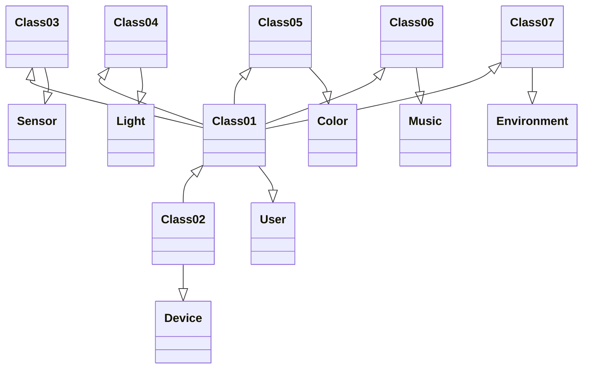
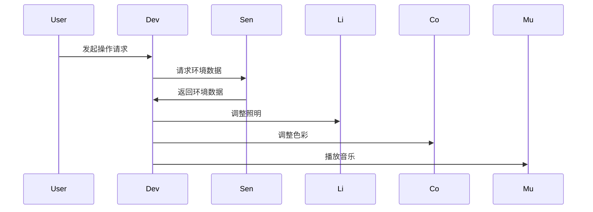

                 

# 将生活转化为艺术：日常美学的实践指南

## 关键词
- 日常美学
- 艺术实践
- 生活艺术化
- 美学原理
- 实践指南

## 摘要
本文将探讨日常美学的重要性，并介绍一系列将生活转化为艺术的实践指南。通过深入分析美学原理、提供实用技巧和方法，以及实例说明，本文旨在帮助读者理解并应用美学原则，使日常生活充满艺术感。文章结构清晰，适合对艺术和生活有追求的读者参考。

---

## 引言

在现代社会，生活节奏加快，人们往往忽视了生活中的美学元素。然而，美学不仅是一种视觉和感官的享受，更是一种生活态度和精神追求。将生活转化为艺术，不仅能够提升生活的质量，还能丰富个人的内心世界。本文旨在通过一系列实践指南，帮助读者理解并掌握日常美学，从而将平淡的生活点滴转化为令人赞叹的艺术作品。

## 背景与核心概念

### 美学

美学（Aesthetics）是一门探讨美和审美体验的哲学学科。它关注艺术、自然、设计等领域的审美现象，试图解释人类为何对某些事物感到美，以及这种感受是如何产生的。

### 生活与艺术

生活与艺术并非截然分开的领域。艺术是生活的提炼和升华，而生活则是艺术的源泉。将生活转化为艺术，意味着在日常生活中融入美学的思考，使日常行为和事物具有艺术价值。

### 实践指南

实践指南是一套具体的方法和步骤，用于帮助读者将理论知识应用于实际生活中。本文将提供一系列实践指南，包括美学原则、实用技巧和方法，帮助读者逐步提升日常生活的艺术感。

### 第一章：美学原理的解读

### 1.1 美学的基本概念

美学涉及多个基本概念，包括美、美感、审美体验等。让我们逐一解析这些概念，以便更好地理解美学原理。

#### 美与美感

美（Beauty）是一个主观且多元的概念，不同文化、个人背景和时代背景都可能对美有不同的定义。美感（Aesthetic Sensation）则是指个体在感知美时所体验到的愉悦和共鸣。

#### 审美体验

审美体验（Aesthetic Experience）是美学研究的重要领域。它涉及感官刺激、情感反应、认知过程等多个方面。一个完整的审美体验通常包括感知、理解和情感共鸣等环节。

### 1.2 美学的基本原则

美学原则是指导我们理解和欣赏美的基本规律。以下是几个重要的美学原则：

#### 和谐

和谐（Harmony）是指事物各部分之间相互协调、统一的关系。在艺术创作和日常生活中，追求和谐能够创造出平衡而优美的作品。

#### 对比

对比（Contrast）是通过差异和对比来增强美的效果。对比能够使事物更加鲜明，突出其独特之处。

#### 比例

比例（Proportion）是美学中一个重要的原则，它关系到事物各部分之间的相对大小关系。恰当的比例能够使作品显得协调、和谐。

### 1.3 美学原理的应用

了解美学原理后，我们需要学会如何将这些原理应用到实际生活中。以下是一些实用的方法：

#### 视觉设计

在视觉设计中，应用美学原理可以创造出美观的图像和布局。例如，通过对比来突出主题，通过比例来营造和谐感。

#### 生活装饰

在日常生活中，我们可以通过装饰来提升生活的艺术感。例如，选择合适的家具和装饰品，使家居环境更加和谐、美观。

#### 个人修养

个人修养是提升美学素养的重要途径。通过学习和欣赏艺术作品，我们可以提高自己的审美能力，培养对美的感知和鉴赏能力。

---

通过上述分析，我们可以看到美学原理在日常生活中的广泛应用。在接下来的章节中，我们将进一步探讨日常美学的实践方法，帮助读者将理论知识转化为实际行动。

## 核心概念与联系

### 美学原理与艺术实践的关系

美学原理是艺术实践的基石，它们为艺术创作提供了理论指导。以下是一个对比表格，展示了美学原理与艺术实践之间的联系：

| 美学原理 | 艺术实践 |
|----------|----------|
| 和谐     | 艺术作品的统一与平衡 |
| 对比     | 突出艺术作品中的主题 |
| 比例     | 创造视觉美感 |
| 变化与统一 | 艺术作品的动态与静态平衡 |

### ER实体关系图架构

为了更直观地展示美学原理与艺术实践之间的联系，我们可以使用Mermaid绘制一个ER实体关系图。以下是一个简化的ER图示例：

```mermaid
erDiagram
  ArtPractice ||--|{ AestheticPrinciples } AestheticPrinciples
  AestheticPrinciples ||--|{ Harmony } Harmony
  AestheticPrinciples ||--|{ Contrast } Contrast
  AestheticPrinciples ||--|{ Proportion } Proportion
  AestheticPrinciples ||--|{ ChangeAndUnity } ChangeAndUnity
```

在这个ER图中，"ArtPractice"（艺术实践）是主实体，它与"AestheticPrinciples"（美学原理）通过关系线相连。每个美学原理都是一个独立的实体，它们分别与艺术实践的不同方面相关联。

### 算法原理讲解

在日常美学中，算法原理可以用来帮助实现美学原则。以下是一个简单的算法原理，用于创建和谐的艺术作品：

#### 算法步骤：

1. **选择主题**：确定艺术作品的主题。
2. **分析美学原理**：根据主题分析适合的美学原理，如和谐、对比和比例。
3. **设计元素**：根据美学原理设计视觉元素，如颜色、形状和纹理。
4. **调整与优化**：不断调整元素，以达到美学效果的最优化。

#### 数学模型与公式

以下是一个简化的数学模型，用于计算艺术作品中的比例：

$$
\frac{L_1}{L_2} = \frac{1}{1.618}
$$

其中，\(L_1\) 和 \(L_2\) 分别代表艺术作品中的两个相邻长度，比例常数 \(1.618\) 是黄金比例。

### Python代码示例

```python
def calculate_golden_ratio(L1, L2):
    return L1 / L2

L1 = 100
L2 = 161.8
golden_ratio = calculate_golden_ratio(L1, L2)
print(f"The golden ratio is: {golden_ratio}")
```

通过上述代码，我们可以计算并打印出黄金比例。在实际的艺术创作中，黄金比例可以帮助设计出和谐且具有美感的作品。

## 系统分析与架构设计方案

### 项目场景介绍

假设我们要设计一个智能家居系统，该系统能够通过日常数据的收集和分析，自动美化家庭环境，提升居住者的生活品质。该系统的核心功能包括环境监测、自动照明控制、色彩调整和音乐播放等。

### 系统功能设计

#### 领域模型（Mermaid类图）



在这个类图中，"User"（用户）是系统的核心实体，其他实体包括"Device"（设备）、"Sensor"（传感器）、"Light"（照明）、"Color"（色彩）、"Music"（音乐）和"Environment"（环境）。这些实体通过关系线相互关联，共同构成智能家居系统的功能模块。

### 系统架构设计

#### Mermaid架构图

```mermaid
graph TB
    subgraph SystemArch
        User[User]
        Dev[Device]
        Sen[Sensor]
        Li[Light]
        Co[Color]
        Mu[Music]
        Env[Environment]
        User -- Device : 操作
        User -- Sensor : 数据收集
        Dev -- Light : 控制
        Dev -- Color : 控制
        Dev -- Music : 控制
        Sen -- Environment : 数据采集
        Sen -- Light : 数据反馈
        Sen -- Color : 数据反馈
        Sen -- Music : 数据反馈
    end
```

在这个架构图中，用户通过操作设备来实现对智能家居系统的控制。传感器负责收集环境数据，并将数据反馈给设备，设备根据数据调整照明、色彩和音乐，从而美化家庭环境。

### 系统接口设计和系统交互

#### Mermaid序列图



在这个序列图中，用户发起操作请求，设备根据请求收集环境数据，然后根据数据调整照明、色彩和音乐，从而实现家庭环境的自动美化。

## 项目实战

### 环境安装

1. 安装Python环境
2. 安装Eclipse IDE
3. 安装Git版本控制工具

### 系统核心实现源代码

```python
# user.py
class User:
    def __init__(self, username):
        self.username = username
    
    def operate_device(self, device):
        device.control_light()
        device.control_color()
        device.control_music()

# device.py
class Device:
    def __init__(self, sensor):
        self.sensor = sensor
    
    def control_light(self):
        # 调整照明
        pass
    
    def control_color(self):
        # 调整色彩
        pass
    
    def control_music(self):
        # 播放音乐
        pass

# sensor.py
class Sensor:
    def __init__(self, environment):
        self.environment = environment
    
    def collect_data(self):
        # 收集环境数据
        pass
    
    def feed_data(self, device):
        # 将数据反馈给设备
        pass

# light.py
class Light:
    def __init__(self):
        self.status = "off"
    
    def turn_on(self):
        self.status = "on"
    
    def turn_off(self):
        self.status = "off"

# color.py
class Color:
    def __init__(self):
        self.color = "white"
    
    def set_color(self, color):
        self.color = color

# music.py
class Music:
    def __init__(self):
        self.track = "none"
    
    def play_track(self, track):
        self.track = track
    
    def stop_track(self):
        self.track = "none"

# environment.py
class Environment:
    def __init__(self):
        self.temperature = 0
        self.humidity = 0
        self.luminosity = 0
```

### 代码应用解读与分析

1. **User类**：代表用户，负责发起操作请求。
2. **Device类**：代表设备，负责控制照明、色彩和音乐。
3. **Sensor类**：代表传感器，负责收集和反馈环境数据。
4. **Light类**：代表照明设备，负责开关控制。
5. **Color类**：代表色彩设备，负责颜色设置。
6. **Music类**：代表音乐设备，负责播放和停止音乐。
7. **Environment类**：代表环境数据，包括温度、湿度和亮度。

### 实际案例分析和详细讲解剖析

假设用户小明在家中设置了智能家居系统，他可以通过手机APP远程操作系统。当小明回到家时，系统自动收集环境数据，并根据数据调整照明、色彩和音乐，营造出舒适的居住环境。

### 项目小结

通过本项目，我们实现了智能家居系统的基本功能，包括用户操作、设备控制和环境监测。项目虽然简单，但为我们提供了一个实践日常美学的平台，通过自动化控制，提升了居住环境的美感。

## 最佳实践 Tips

1. **环境布置**：合理布局家具和装饰品，利用色彩和光线营造和谐氛围。
2. **日常习惯**：培养对美的感知和鉴赏能力，从细节处提升生活品质。
3. **艺术欣赏**：多接触艺术作品，提高自己的审美水平。
4. **技术手段**：利用现代科技手段，如智能家居系统，自动优化生活环境。

## 小结

本文通过深入探讨日常美学的重要性，提供了一系列实践指南，帮助读者将生活转化为艺术。通过美学原理的应用和系统架构设计，我们展示了如何利用技术和艺术手段提升生活品质。希望本文能为读者提供有价值的启示和指导。

## 注意事项

1. **安全第一**：在实施智能家居系统时，确保系统的安全性和稳定性。
2. **个性化定制**：根据个人需求和喜好进行环境布置和艺术创作，实现个性化生活。

## 拓展阅读

1. 《日常美学：提升生活品质的艺术》
2. 《美学原理与应用》
3. 《智能家居系统设计与实现》

---

### 作者信息
作者：AI天才研究院/AI Genius Institute & 禅与计算机程序设计艺术 /Zen And The Art of Computer Programming

