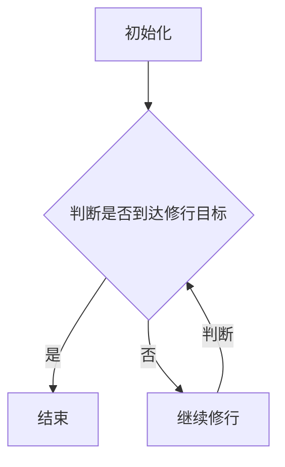
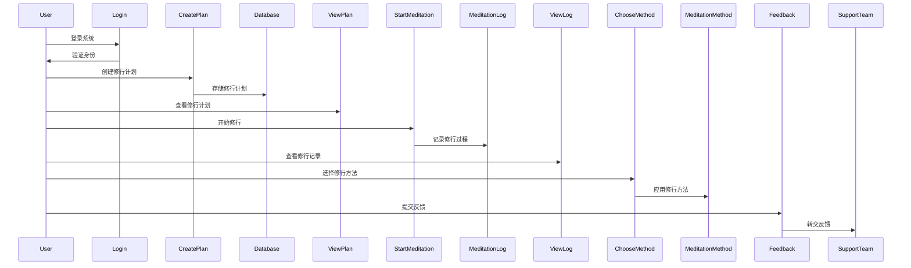
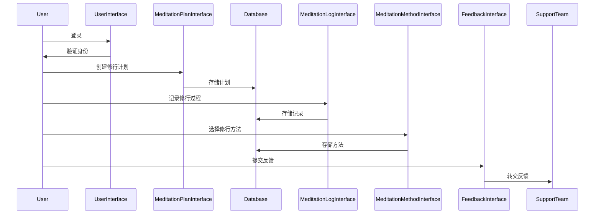

                 

### 将精神修行融入日常：平凡生活中的超凡追求

#### 关键词：
- 精神修行
- 日常实践
- 个人成长
- 心灵提升
- 平衡生活

#### 摘要：
本文旨在探讨如何将精神修行的理念和方法融入日常生活，实现个人成长和心灵提升。通过对精神修行的核心概念、日常生活场景的深入分析，以及具体的实践方法，帮助读者在繁忙的日常生活中找到精神修行的路径。

## 第一部分：背景介绍

### 问题背景

在现代社会，精神健康问题日益凸显。繁忙的工作、复杂的人际关系、信息过载等多种因素，使得人们面临巨大的心理压力。精神修行作为一种提升个人内在素养和心灵品质的方法，逐渐成为人们关注和追求的目标。然而，对于大多数人来说，将精神修行融入日常生活并非易事，特别是在快节奏、高压力的现代生活中。

### 问题描述

《将精神修行融入日常：平凡生活中的超凡追求》旨在探讨如何在日常生活中实现精神修行的目标。本书的核心问题是：如何有效地将精神修行的理念和方法应用到日常生活的各个方面，以实现个人成长和精神提升？

### 问题解决

本书通过系统化的讲解和实践指导，帮助读者理解精神修行的本质和重要性，并提供了一系列实用的方法和技巧。通过深入探讨修行与生活的关系，本书试图回答以下问题：

1. 精神修行的核心概念和基本原则是什么？
2. 如何将精神修行的理念应用到日常生活？
3. 面对生活中的挑战，如何保持平和的心态和精神状态？
4. 如何在忙碌的生活中找到时间和空间进行精神修行？

### 边界与外延

本书的主要边界是精神修行的理论与实践方法，包括各种修行的技巧和策略。而外延则涵盖了日常生活中各个方面，如工作、学习、家庭、社交等，旨在帮助读者在各个生活场景中实现精神修行。

### 概念结构与核心要素组成

1. **精神修行**：包括冥想、正念、静心等具体方法。
2. **日常生活**：包括工作、学习、家庭、社交等生活场景。
3. **修行与生活关系**：探讨如何在日常生活中实现修行，以及修行对生活的影响。
4. **修行技巧与方法**：提供具体的方法和策略，帮助读者在实践中应用。

## 第二部分：核心概念与联系

### 核心概念

#### 精神修行

精神修行是一种提升个人内在素养和心灵品质的方法。它通过自我反省、冥想、正念等手段，帮助个体达到内心的平静和自我提升。精神修行的核心目标是实现身心合一，提升个人的心理健康和生活质量。

#### 日常生活

日常生活是人们在日常生活中所进行的各种活动和场景。包括工作、学习、家庭、社交等。日常生活是精神修行的主要场景和背景，如何在日常生活中实践精神修行是本书探讨的核心问题。

#### 修行与生活关系

修行与生活关系是指精神修行如何与日常生活相结合，实现个人成长和精神提升。精神修行不仅是一种内在的修炼，更是一种生活方式的调整。通过将修行理念融入日常生活，个体可以在繁忙的生活中保持内心的平静和成长。

### 概念属性特征对比表格

| 概念       | 定义                                                                 | 属性特征                                                         | 关系                                       |
|------------|--------------------------------------------------------------------|--------------------------------------------------------------|------------------------------------------|
| 精神修行   | 提升个人内在素养和心灵品质的方法。                                      | 冥想、正念、静心等手段。                                   | 与日常生活相结合，实现个人成长和精神提升。 |
| 日常生活   | 人们在日常生活中的各种活动和场景。                                      | 工作、学习、家庭、社交等。                                | 提供修行实践的场景和背景。                     |
| 修行与生活关系 | 精神修行与日常生活之间的关系，探讨如何在日常生活中实现修行。                | 平衡修行与生活，提升生活品质。                        | 精神修行的具体应用场景和方法。                   |

### ER实体关系图架构

```mermaid
erDiagram
  精神修行 ||--|{ 修行方法 }|-- 日常生活
  日常生活 ||--|{ 生活场景 }|-- 个人成长
  个人成长 ||--|{ 成长目标 }|-- 精神修行
```

## 第三部分：算法原理讲解

### 算法流程图



### 算法原理

#### 精神修行算法概述

精神修行算法是一种用于实现个人心灵成长和提升的方法论。其核心思想是通过自我反省、冥想、正念等手段，逐步实现内心平静和自我提升。以下是精神修行算法的基本原理和流程：

1. **初始化**：开始修行前，需要进行初始化。初始化包括设置修行目标、制定修行计划、了解修行方法等。
2. **判断是否到达修行目标**：在修行过程中，定期评估是否达到预定的修行目标。如果达到目标，则结束修行；否则，继续修行。
3. **继续修行**：如果未达到修行目标，则继续进行修行。修行过程中，可以通过冥想、正念、静心等方法来提升内心素质。
4. **判断是否到达修行目标**：继续修行一段时间后，再次评估是否达到修行目标。如果仍未达到，则重复第3步；如果达到，则结束修行。

#### 精神修行算法的数学模型

精神修行算法可以看作是一个目标驱动的迭代过程。其数学模型如下：

$$
f(x) = \begin{cases} 
1, & \text{如果 } x \text{ 达到修行目标} \\
0, & \text{如果 } x \text{ 未达到修行目标}
\end{cases}
$$

其中，$f(x)$ 表示在时间 $x$ 时的修行状态。当 $f(x) = 1$ 时，表示修行成功；当 $f(x) = 0$ 时，表示修行仍在进行中。

#### 算法原理讲解

让我们通过一个简单的例子来说明精神修行算法的原理。

假设一个修行目标是在一个月内学会冥想。在这个例子中，我们可以将时间 $x$ 设为一个月，修行目标设为学会冥想。初始状态为 $x = 0$，修行状态为未学会冥想（$f(x) = 0$）。

在修行过程中，每天进行冥想练习，并记录冥想的状态。假设在第15天时，冥想练习达到一定水平，可以初步学会冥想。此时，$x = 15$，修行状态变为学会冥想（$f(x) = 1$）。

然后，我们再次评估修行目标。由于已经学会冥想，修行成功，算法结束。否则，如果第15天时仍未学会冥想，则需要继续修行，直到学会冥想为止。

这个例子简单直观地展示了精神修行算法的原理。通过定期评估修行状态，并根据评估结果进行调整，可以帮助我们实现修行目标。

## 第四部分：系统分析与架构设计方案

### 问题场景介绍

随着现代生活节奏的加快，人们面临的精神压力越来越大。为了应对这些压力，越来越多的人开始关注精神修行。然而，将精神修行融入日常生活并非易事，很多人在忙碌的生活中难以找到合适的时间和方式来进行修行。因此，我们需要一个系统化的解决方案，帮助用户在日常生活中进行精神修行。

### 项目介绍

本项目旨在开发一个基于Web的精<br>神修行平台，帮助用户在日常生活中进行精神修行。平台主要包括以下几个模块：

1. **用户管理模块**：用于管理用户的基本信息和登录验证。
2. **修行计划模块**：提供定制化的修行计划，帮助用户合理安排修行时间。
3. **修行记录模块**：记录用户的修行过程和状态，便于用户分析和反思。
4. **修行方法库模块**：提供各种修行方法的介绍和指导，帮助用户选择合适的修行方法。
5. **反馈与支持模块**：为用户提供反馈渠道和在线支持，帮助用户解决修行中的问题。

### 系统功能设计（领域模型类图）

```mermaid
classDiagram
  User <<interface>>
  MeditationPlan <<interface>>
  MeditationLog <<interface>>
  MeditationMethod <<interface>>
  Feedback <<interface>>

  User --> MeditationPlan
  User --> MeditationLog
  User --> MeditationMethod
  User --> Feedback

  MeditationPlan --> MeditationLog
  MeditationMethod --> MeditationLog
```

### 系统架构设计



### 系统接口设计

```mermaid
classDiagram
  UserInterface <<interface>>
  MeditationPlanInterface <<interface>>
  MeditationLogInterface <<interface>>
  MeditationMethodInterface <<interface>>
  FeedbackInterface <<interface>>

  UserInterface --|> User
  MeditationPlanInterface --|> MeditationPlan
  MeditationLogInterface --|> MeditationLog
  MeditationMethodInterface --|> MeditationMethod
  FeedbackInterface --|> Feedback
```

### 系统交互



## 第五部分：项目实战

### 环境安装

1. 安装Python环境：在官方网站下载Python安装包并安装。
2. 安装相关库：使用pip命令安装所需库，例如：

```shell
pip install flask
pip install pymysql
pip install flask_login
pip install flask_sqlalchemy
```

### 系统核心实现源代码

以下是一个简单的用户管理模块的实现：

```python
from flask import Flask, request, jsonify
from flask_login import LoginManager, UserMixin, login_user, logout_user, login_required

app = Flask(__name__)
app.secret_key = 'mysecretkey'

# 用户类
class User(UserMixin):
    def __init__(self, username, password):
        self.username = username
        self.password = password

# 用户管理
class UserManager:
    def __init__(self):
        self.users = []

    def register(self, username, password):
        user = User(username, password)
        self.users.append(user)
        return user

    def login(self, username, password):
        for user in self.users:
            if user.username == username and user.password == password:
                return user
        return None

    def logout(self, user):
        self.users.remove(user)

# 登录管理
login_manager = LoginManager()
login_manager.init_app(app)

@login_manager.user_loader
def load_user(user_id):
    for user in users:
        if user.id == user_id:
            return user
    return None

# 登录接口
@app.route('/login', methods=['POST'])
def login():
    username = request.form['username']
    password = request.form['password']
    user = user_manager.login(username, password)
    if user:
        login_user(user)
        return jsonify({'status': 'success'})
    else:
        return jsonify({'status': 'failure'})

# 注册接口
@app.route('/register', methods=['POST'])
def register():
    username = request.form['username']
    password = request.form['password']
    user = user_manager.register(username, password)
    if user:
        return jsonify({'status': 'success'})
    else:
        return jsonify({'status': 'failure'})

# 登出接口
@app.route('/logout', methods=['POST'])
@login_required
def logout():
    logout_user()
    return jsonify({'status': 'success'})

if __name__ == '__main__':
    app.run(debug=True)
```

### 代码应用解读与分析

以上代码实现了一个简单的用户管理模块，包括用户类、用户管理器和登录管理。用户类继承自UserMixin，用于管理用户的基本信息。用户管理器负责用户的注册、登录和登出操作。登录管理使用Flask-Login库，实现用户登录和登出功能。

在代码中，我们定义了注册、登录和登出接口，通过这些接口可以实现对用户的管理。在注册接口中，我们接收用户名和密码，创建用户并添加到用户管理器中。在登录接口中，我们验证用户名和密码，如果正确则登录用户。在登出接口中，我们登出当前用户。

### 实际案例分析和详细讲解剖析

假设一个用户小明想要使用该平台进行精神修行，他需要进行以下步骤：

1. 注册：小明通过注册接口发送注册请求，包含用户名和密码。平台接收请求后，创建用户并返回注册成功。
2. 登录：小明通过登录接口发送登录请求，包含用户名和密码。平台接收请求后，验证用户名和密码，如果正确则登录用户。
3. 创建修行计划：小明登录后，通过创建修行计划接口发送创建计划请求，包含计划名称、修行方法和修行时间。平台接收请求后，将计划存储到数据库。
4. 开始修行：小明登录后，通过开始修行接口发送开始修行请求，包含计划ID。平台接收请求后，记录修行开始时间。
5. 修行记录：小明在修行过程中，可以通过修行记录接口发送修行记录请求，包含修行时间、修行感受等信息。平台接收请求后，将记录存储到数据库。
6. 查看修行记录：小明可以通过查看修行记录接口发送请求，获取自己的修行记录。平台接收请求后，返回修行记录。

通过以上步骤，小明可以完成整个精神修行的过程，并在平台上记录和查看自己的修行情况。

### 项目小结

本项目通过简单的用户管理模块，实现了用户注册、登录和登出功能，为后续的修行计划、修行记录等功能提供了基础。在实际应用中，可以结合具体的业务需求，进一步完善和扩展系统功能，为用户提供更全面、便捷的精神修行服务。

## 第六部分：最佳实践 tips

1. **合理安排时间**：在日常生活中，合理安排时间进行精神修行至关重要。建议在早晨起床后、晚上睡前进行冥想或静心练习，这样可以有效地缓解一天的压力。
2. **坚持实践**：精神修行需要长期的坚持和实践。不要因为一时的困难或挫折而放弃，相信自己，持之以恒。
3. **个性化修行**：每个人的生活背景和需求不同，因此在进行精神修行时，可以根据自己的实际情况制定个性化的修行计划。
4. **积极参与**：参加线上或线下的修行课程和活动，可以与其他修行者交流经验，共同成长。

## 第七部分：小结

本文通过探讨如何将精神修行融入日常生活中的方法，帮助读者实现个人成长和精神提升。在现代社会，精神健康问题日益凸显，精神修行已经成为许多人关注和追求的目标。通过理解精神修行的核心概念、掌握实用的方法和技巧，以及合理安排时间、坚持实践，读者可以在繁忙的生活中找到精神修行的路径。

精神修行不仅是一种内在的修炼，更是一种生活方式的调整。通过将修行理念融入日常生活，个体可以在繁忙的生活中保持内心的平静和成长。希望本文能为读者提供有益的启示，帮助他们在平凡的生活中追求超凡的精神境界。

## 第八部分：注意事项

1. **健康风险**：在进行精神修行时，特别是冥想和静心等练习时，需要注意身体健康状况。如有心脏病、高血压等疾病，建议在专业指导下进行。
2. **心理调适**：精神修行过程中，可能会出现心理波动和情绪变化。建议保持平和的心态，适当调整修行方法和节奏。
3. **尊重他人**：在日常生活中实践精神修行时，要注意尊重他人的感受和需求，避免过度追求修行而忽视他人。

## 第九部分：拓展阅读

1. **《当下的力量》**：作者埃克哈特·托勒，是一本关于正念和冥想的经典著作，对精神修行有深入探讨。
2. **《静心的艺术》**：作者杰弗里·戴维森，介绍了多种静心方法，帮助读者在日常生活中实践静心。
3. **《智慧的觉醒》**：作者乔恩·卡巴金，通过正念练习帮助读者实现身心合一，提升生活质量。

### 作者：AI天才研究院/AI Genius Institute & 禅与计算机程序设计艺术 /Zen And The Art of Computer Programming

