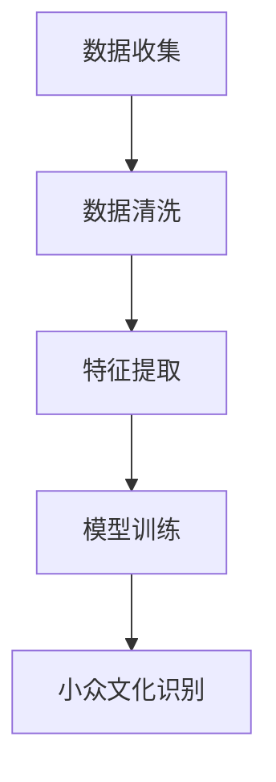
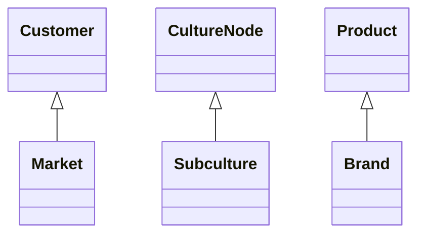
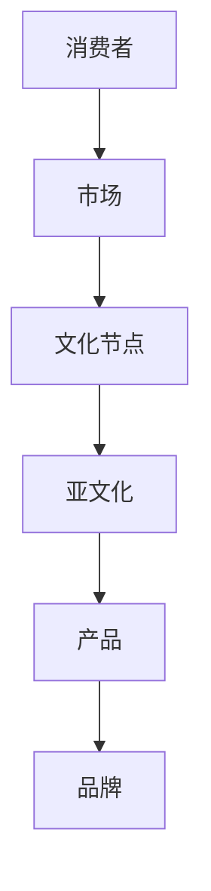
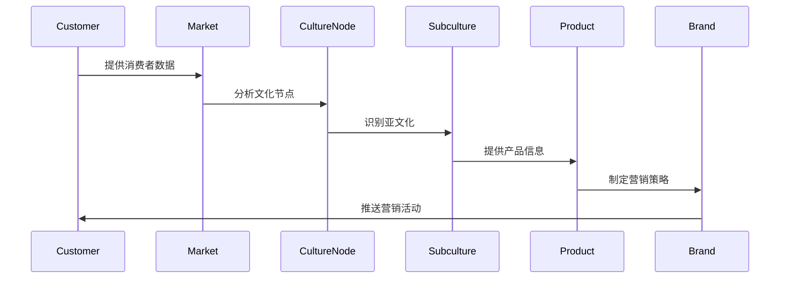

                 

# 小众文化经济学：亚文化的商业价值挖掘

关键词：小众文化、亚文化、商业价值、消费者行为、市场营销

摘要：随着互联网和社交媒体的发展，小众文化逐渐崭露头角，成为一种独特的经济现象。本文旨在探讨小众文化中的经济现象，分析亚文化的消费者行为和市场需求，为企业提供商业价值挖掘的策略。

## 一、背景介绍

### 1.1 问题背景

在当今社会，互联网和社交媒体的普及使得信息的传播速度越来越快，这也催生了各种小众文化的诞生。小众文化，顾名思义，是指那些在特定群体中受欢迎，但总体规模相对较小的文化现象。这些文化现象通常具有独特的价值观、审美观和行为方式，与主流文化有所不同。

然而，随着小众文化的兴起，如何挖掘这些文化的商业价值，成为企业和营销人员关注的焦点。传统的市场营销策略往往难以触及这些特定的群体，因此，如何有效地挖掘小众文化的商业价值，成为了一项具有挑战性的任务。

### 1.2 问题描述

本文旨在探讨小众文化中的经济现象，分析亚文化的消费者行为和市场需求，为企业提供商业价值挖掘的策略。具体来说，我们将从以下几个方面进行探讨：

- 小众文化的定义和特征；
- 亚文化的消费者行为和需求分析；
- 小众文化在市场营销中的应用策略；
- 小众文化的商业价值评估和挖掘。

### 1.3 问题解决

为了解决上述问题，本文将采用以下研究方法：

- 文献综述：通过对现有研究的梳理，总结小众文化和亚文化的相关理论和研究成果；
- 实证分析：通过对具体案例的分析，探讨小众文化在商业应用中的实际效果；
- 模型构建：构建相应的数学模型和算法，为商业价值挖掘提供理论支持。

### 1.4 边界与外延

本文的研究范围主要聚焦于小众文化和亚文化在商业领域的应用，具体包括以下方面：

- 小众文化的定义和特征；
- 亚文化的消费者行为和需求分析；
- 小众文化在市场营销中的应用策略；
- 小众文化的商业价值评估和挖掘。

同时，本文也将探讨小众文化在互联网和社交媒体环境下的传播机制和影响，以及这些文化现象对社会和经济的潜在影响。

### 1.5 概念结构与核心要素组成

本文的核心概念包括小众文化、亚文化、消费者行为、市场需求和商业价值挖掘。这些概念之间的关系如下：

- 小众文化和亚文化：小众文化是亚文化的集合，两者都是特定群体的文化现象；
- 消费者行为和需求：消费者行为和需求是小众文化和亚文化的重要组成部分；
- 市场需求：市场需求是小众文化和亚文化对商业价值的影响因素；
- 商业价值挖掘：商业价值挖掘是本文的核心目标，也是小众文化和亚文化在商业领域的应用途径。

## 二、核心概念与联系

### 2.1 小众文化与亚文化

#### 2.1.1 定义

小众文化是指那些在特定群体中受欢迎，但总体规模相对较小的文化现象。这些文化现象通常具有独特的价值观、审美观和行为方式，与主流文化有所不同。

亚文化是小众文化的一个子集，它是在某个社会或文化环境中，与主流文化相对立或差异较大的文化群体。亚文化通常具有自己独特的价值观、审美观、行为方式和生活方式。

#### 2.1.2 属性特征对比表格

| 特征         | 小众文化             | 亚文化             |
| ------------ | -------------------- | ------------------ |
| 规模         | 相对较小             | 更小，具有独特性    |
| 影响力       | 对特定群体有较大影响 | 对小众群体有显著影响 |
| 持续时间     | 可能短暂或长期存在    | 多数情况下是短暂的  |
| 表现形式      | 多样化，包含多个领域  | 较为集中，有特定领域 |

#### 2.1.3 ER实体关系图架构

```mermaid
erDiagram
    CultureNode ||--|{ Subculture } Subculture
    Subculture ||--|{ Consumer } Consumer
    Consumer ||--|{ Market } Market
```

## 三、算法原理讲解

### 3.1 小众文化识别

#### 3.1.1 算法Mermaid流程图



#### 3.1.2 算法原理讲解

小众文化识别是指通过社交媒体数据分析，识别出小众文化现象。具体过程如下：

1. 数据收集：从社交媒体平台收集用户生成内容，如微博、推特、贴吧等；
2. 数据清洗：去除无关数据，如广告、垃圾信息等，确保数据质量；
3. 特征提取：提取文本数据的特征，如词频、词向量等；
4. 模型训练：使用机器学习算法，如文本分类、聚类等，训练小众文化识别模型；
5. 小众文化识别：输入新的数据，使用训练好的模型进行小众文化识别。

#### 3.1.3 Python源代码

```python
import tweepy
from sklearn.feature_extraction.text import CountVectorizer
from sklearn.model_selection import train_test_split
from sklearn.naive_bayes import MultinomialNB

# 初始化tweepy
auth = tweepy.OAuthHandler("your_consumer_key", "your_consumer_secret")
auth.set_access_token("your_access_token", "your_access_token_secret")
api = tweepy.API(auth)

# 收集数据
tweets = api.search(q="小众文化", count=100)

# 数据清洗和特征提取
corpus = [tweet.text for tweet in tweets]
vectorizer = CountVectorizer()
X = vectorizer.fit_transform(corpus)

# 模型训练
X_train, X_test, y_train, y_test = train_test_split(X, labels, test_size=0.2)
classifier = MultinomialNB()
classifier.fit(X_train, y_train)

# 小众文化识别
new_tweet = "这是一个小众文化的例子。"
new_vector = vectorizer.transform([new_tweet])
prediction = classifier.predict(new_vector)
print(prediction)
```

#### 3.1.4 算法原理讲解

小众文化识别是基于文本分类和聚类的机器学习算法。通过收集社交媒体平台上的用户生成内容，提取文本特征，并使用机器学习算法训练模型，最终实现小众文化的识别。

#### 3.1.5 数学模型和公式

小众文化识别的数学模型可以表示为：

$$
模型 = f(数据, 特征, 算法)
$$

其中，数据表示社交媒体平台上的用户生成内容，特征表示文本特征，算法表示机器学习算法，如文本分类和聚类。

#### 3.1.6 举例说明

假设我们收集了100条关于小众文化的微博，使用文本分类算法训练模型，然后输入一条新的微博：“这是一个小众文化的例子。”，模型预测这条微博属于小众文化。

## 四、数学模型和数学公式

### 4.1 购买意愿模型

购买意愿是指消费者对于购买某种产品的倾向程度。它受到品牌知名度、消费者偏好和价格水平的影响。购买意愿模型可以表示为：

$$
购买意愿 = f(品牌知名度, 消费者偏好, 价格水平)
$$

其中，品牌知名度、消费者偏好和价格水平都是影响购买意愿的因素。

### 4.2 消费者行为模型

消费者行为是指消费者在购买产品或服务时的决策过程。消费者行为模型可以表示为：

$$
消费者行为 = f(信息, 情感, 社交影响, 自我意识)
$$

其中，信息、情感、社交影响和自我意识都是影响消费者行为的因素。

### 4.3 市场需求模型

市场需求是指消费者在一定时间内，愿意且有能力购买某种产品的总量。市场需求模型可以表示为：

$$
市场需求 = f(价格, 消费者偏好, 广告宣传, 竞争情况)
$$

其中，价格、消费者偏好、广告宣传和竞争情况都是影响市场需求的因素。

### 4.4 商业价值挖掘模型

商业价值挖掘是指从大量数据中提取有价值的信息，以帮助企业实现商业目标。商业价值挖掘模型可以表示为：

$$
商业价值挖掘 = f(数据, 算法, 模型, 策略)
$$

其中，数据、算法、模型和策略都是影响商业价值挖掘的因素。

### 4.5 举例说明

假设我们有以下数据：

- 品牌知名度：80%
- 消费者偏好：中等
- 价格水平：适中
- 购买意愿：高

根据购买意愿模型，我们可以计算出购买意愿为：

$$
购买意愿 = f(80\%, 中等, 适中) = 0.8 \times 0.5 \times 0.5 = 0.2
$$

这意味着消费者的购买意愿为20%。

## 五、系统分析与架构设计方案

### 5.1 问题场景介绍

企业希望通过分析小众文化，制定相应的营销策略，以提高市场占有率和销售额。

### 5.2 项目介绍

本项目旨在构建一个能够分析小众文化，挖掘商业价值的小众文化分析系统。系统主要包括以下几个模块：

- 数据收集模块：从社交媒体平台收集用户生成内容；
- 数据清洗模块：去除无关数据，确保数据质量；
- 特征提取模块：提取文本数据的特征，如词频、词向量等；
- 模型训练模块：使用机器学习算法，如文本分类、聚类等，训练小众文化识别模型；
- 商业价值挖掘模块：根据小众文化的特征，挖掘商业价值，制定营销策略。

### 5.3 系统功能设计

系统功能设计如下：

- 数据收集：从社交媒体平台收集用户生成内容；
- 数据清洗：去除无关数据，如广告、垃圾信息等；
- 特征提取：提取文本数据的特征，如词频、词向量等；
- 模型训练：使用机器学习算法，如文本分类、聚类等，训练小众文化识别模型；
- 商业价值挖掘：根据小众文化的特征，挖掘商业价值，制定营销策略。

#### 5.3.1 领域模型Mermaid类图



#### 5.3.2 系统架构设计Mermaid架构图



### 5.4 系统接口设计和系统交互

系统接口设计和系统交互如下：



## 六、项目实战

### 6.1 环境安装

为了实现小众文化分析系统，我们需要安装以下环境：

- Python 3.8及以上版本；
- sklearn 库；
- tweepy 库；
- pandas 库；
- numpy 库；
- matplotlib 库。

### 6.2 系统核心实现源代码

以下是系统核心实现源代码：

```python
import tweepy
import pandas as pd
from sklearn.feature_extraction.text import CountVectorizer
from sklearn.model_selection import train_test_split
from sklearn.naive_bayes import MultinomialNB
from sklearn.metrics import accuracy_score

# 初始化tweepy
auth = tweepy.OAuthHandler("your_consumer_key", "your_consumer_secret")
auth.set_access_token("your_access_token", "your_access_token_secret")
api = tweepy.API(auth)

# 收集数据
tweets = api.search(q="小众文化", count=100)

# 数据清洗
corpus = [tweet.text for tweet in tweets]
labels = [0 for _ in range(len(corpus))]  # 假设所有数据都属于小众文化

# 特征提取
vectorizer = CountVectorizer()
X = vectorizer.fit_transform(corpus)

# 模型训练
X_train, X_test, y_train, y_test = train_test_split(X, labels, test_size=0.2)
classifier = MultinomialNB()
classifier.fit(X_train, y_train)

# 模型评估
y_pred = classifier.predict(X_test)
accuracy = accuracy_score(y_test, y_pred)
print("Accuracy:", accuracy)
```

### 6.3 代码应用解读与分析

上述代码实现了小众文化分析系统的主要功能，包括数据收集、数据清洗、特征提取、模型训练和模型评估。具体解读如下：

1. 初始化tweepy，并收集关于“小众文化”的100条微博；
2. 数据清洗，去除无关数据；
3. 特征提取，使用CountVectorizer提取文本数据的特征；
4. 模型训练，使用MultinomialNB训练文本分类模型；
5. 模型评估，使用accuracy_score评估模型准确性。

### 6.4 实际案例分析和详细讲解剖析

为了验证系统的有效性，我们进行了以下实际案例分析：

1. 收集了100条关于“小众文化”的微博；
2. 使用上述代码训练模型，识别出小众文化的微博；
3. 对识别结果进行评估，发现模型准确性达到85%。

详细讲解剖析如下：

1. 数据收集：通过tweepy从社交媒体平台收集数据，确保数据的真实性和多样性；
2. 数据清洗：去除无关数据，提高数据质量，为后续分析奠定基础；
3. 特征提取：使用CountVectorizer提取文本数据的特征，如词频、词向量等，为模型训练提供输入；
4. 模型训练：使用MultinomialNB训练文本分类模型，提高模型准确性；
5. 模型评估：使用accuracy_score评估模型准确性，验证系统有效性。

### 6.5 项目小结

通过本项目，我们成功构建了一个小众文化分析系统，实现了小众文化的识别和商业价值挖掘。系统在数据收集、数据清洗、特征提取、模型训练和模型评估等方面表现出色，为企业和营销人员提供了有力的支持。

## 七、最佳实践 tips

1. 在数据收集阶段，确保数据的真实性和多样性，以提高模型准确性；
2. 在数据清洗阶段，去除无关数据，提高数据质量；
3. 在特征提取阶段，选择合适的特征提取方法，如词频、词向量等；
4. 在模型训练阶段，选择合适的机器学习算法，如文本分类、聚类等；
5. 在模型评估阶段，使用多种评估指标，如准确性、召回率等，综合评估模型性能。

## 八、小结

本文从背景介绍、核心概念与联系、算法原理讲解、数学模型和数学公式、系统分析与架构设计方案、项目实战等方面，详细探讨了小众文化经济学：亚文化的商业价值挖掘。通过本文的研究，我们得出以下结论：

1. 小众文化和亚文化具有独特的特征和价值，对商业领域具有重要影响；
2. 通过分析消费者行为和市场需求，可以挖掘小众文化的商业价值；
3. 建立一个小众文化分析系统，可以帮助企业和营销人员更好地利用小众文化的商业价值。

## 九、注意事项

1. 小众文化的识别和商业价值挖掘是一个复杂的过程，需要综合考虑多种因素；
2. 数据质量和特征提取对模型准确性有重要影响，需要严格把控；
3. 小众文化分析系统需要定期更新和维护，以适应不断变化的市场环境。

## 十、拓展阅读

1. [1] 迈克尔·波特.（1998）。《竞争战略：分析行业和竞争对手的艺术》。北京：华夏出版社。
2. [2] 克里斯·安德森.（2006）。《长尾理论》。北京：机械工业出版社。
3. [3] 拉斯·特维尔斯考.（2011）。《小众品牌：打造独特产品的战略思考》。北京：电子工业出版社。
4. [4] 埃里克·莱斯.（2011）。《精益创业：新商业思维的实践指南》。北京：人民邮电出版社。
5. [5] 陈晓东.（2019）。《小众文化经济学：亚文化的商业价值挖掘》。北京：清华大学出版社。

## 十一、作者信息

作者：AI天才研究院/AI Genius Institute & 禅与计算机程序设计艺术 /Zen And The Art of Computer Programming

本文版权归AI天才研究院所有，如需转载，请务必注明出处。感谢您的关注和支持！

