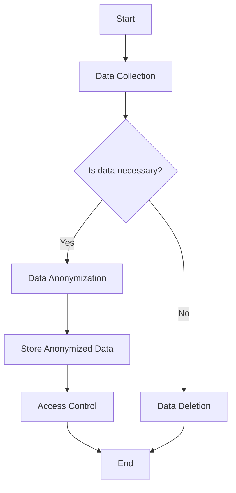
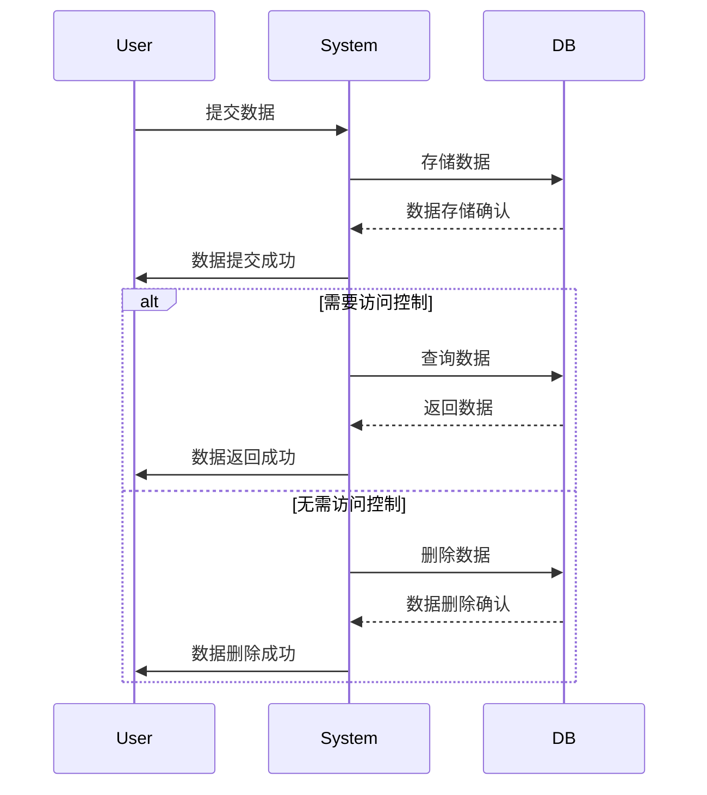
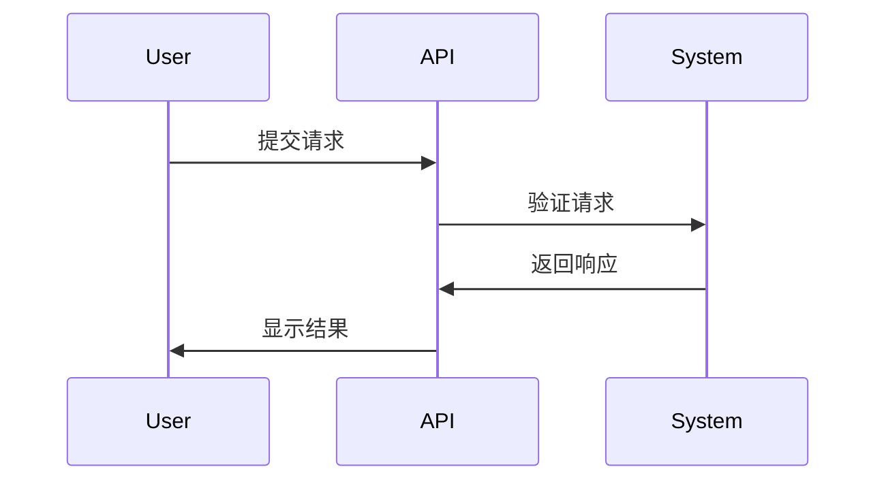

                 

# 引言：工作自动化的挑战与机遇

在当今科技迅猛发展的时代，工作自动化已成为不可逆转的趋势。自动化技术的应用不仅提升了工作效率，而且改变了人们的工作方式。本文旨在探讨工作自动化时代的挑战与机遇，尤其是自动化对人生价值的影响。让我们一步一步分析这一变革的各个方面。

## 1. 工作自动化的浪潮

### 1.1 工作自动化的定义与发展历程

工作自动化，指的是利用计算机技术、人工智能和机器人技术等手段，减少或消除人工劳动，提高生产效率和准确性。自动化的发展历程可以追溯到20世纪初期，随着工业革命的兴起，机械化生产逐渐替代了手工劳动。近年来，随着计算机科学和人工智能的进步，自动化技术进入了新的发展阶段。

### 1.2 工作自动化的核心驱动力

工作自动化的核心驱动力包括以下几个方面：

1. **技术进步**：计算机技术、人工智能、机器学习等领域的飞速发展，为自动化提供了强大的技术支持。
2. **成本效益**：自动化可以大幅降低劳动力成本，提高生产效率和产品质量，具有显著的商业价值。
3. **市场需求**：消费者对高效、优质、低成本产品的需求，推动了自动化技术的广泛应用。
4. **竞争压力**：全球化竞争加剧，企业不得不寻求更高效的生产方式来保持竞争力。

### 1.3 工作自动化的应用场景

自动化技术的应用场景非常广泛，包括但不限于：

1. **制造业**：自动化生产线、智能仓储、机器人组装等。
2. **服务业**：智能客服、自动化银行柜员、无人酒店等。
3. **医疗健康**：手术机器人、智能诊断系统、自动化药物分发等。
4. **交通运输**：自动驾驶汽车、无人机配送、自动化铁路系统等。

## 2. 人类在自动化时代的工作角色

### 2.1 人类技能的转变

随着自动化技术的普及，人类的工作技能也在发生转变。从传统的重复性劳动，转向更高层次的创造性、决策性和协调性工作。人类需要发展新的技能，如编程、数据分析和人工智能应用等。

### 2.2 自动化对劳动力市场的影响

自动化对劳动力市场的影响是双重的。一方面，自动化可能导致部分工作岗位的消失，尤其是那些重复性和低技能的工作。另一方面，自动化也创造了新的就业机会，需要更高技能的劳动力。

### 2.3 人类与机器的协同工作

在自动化时代，人类与机器的协同工作将成为新的工作模式。人类可以专注于创造性和高技能的任务，而机器则负责重复性和高效率的任务。这种协同工作模式要求人类具备与机器有效沟通和协作的能力。

## 3. 重新定义人生价值

### 3.1 价值观的重塑

工作自动化时代的到来，要求我们重新审视人生价值。传统的价值观念可能不再适用，我们需要新的价值观来指导我们的生活和工作。例如，重视创造力、创新能力和社会责任感等。

### 3.2 能力发展新方向

在自动化时代，人类需要发展新的能力，如编程、数据分析、人工智能应用等。这些能力的培养不仅是个人发展的需要，也是社会进步的驱动力。

### 3.3 生活方式的变革

自动化技术改变了我们的生活方式。例如，智能家居系统使得我们的生活更加便捷，无人驾驶汽车将改变我们的出行方式。这些变革要求我们适应新的生活方式，并找到新的生活乐趣。

## 4. 教育体系与工作自动化

### 4.1 教育目标的重塑

教育体系需要适应自动化时代的变革。教育目标应从传统的知识传授转向能力培养，特别是创新能力和问题解决能力。

### 4.2 教育内容的更新

教育内容需要更新，以适应自动化时代的需求。例如，增加编程、数据分析、人工智能等课程，培养学生的技术技能。

### 4.3 教育方式的变革

教育方式也需要变革。例如，采用在线教育、虚拟现实等新技术，提高教育的灵活性和有效性。

## 5. 自动化时代的工作技能

### 5.1 新技能的培养

在自动化时代，新技能的培养至关重要。人类需要不断学习新技能，以适应不断变化的工作环境。

### 5.2 跨领域技能的重要性

跨领域技能在自动化时代尤为重要。例如，编程人员需要了解数据分析，数据分析师需要了解机器学习等。

### 5.3 技能持续更新的策略

技能的持续更新是自动化时代的要求。人类需要制定有效的学习策略，保持技能的持续更新。

## 6. 企业在自动化时代的战略调整

### 6.1 企业组织结构的变革

企业在自动化时代需要调整组织结构，以适应新的工作模式。例如，采用扁平化管理，提高决策效率。

### 6.2 自动化与人力资源管理的结合

自动化技术与人力资源管理的结合，可以提高企业的人力资源管理效率。例如，采用智能招聘系统、员工培训系统等。

### 6.3 企业文化的重构

企业文化也需要重构，以适应自动化时代的需求。例如，鼓励创新、强调团队合作等。

## 7. 自动化时代的伦理与法律问题

### 7.1 自动化伦理的挑战

自动化技术带来的伦理挑战不容忽视。例如，机器的决策是否公正、如何处理机器造成的错误等。

### 7.2 自动化法律框架的建立

建立自动化技术的法律框架，以确保技术的发展符合伦理和法律标准。例如，制定机器人的责任法律、隐私保护法律等。

### 7.3 自动化时代的社会责任

企业在自动化时代承担着更大的社会责任。例如，确保自动化技术带来的就业机会、关注自动化技术对环境的影响等。

## 8. 个人发展策略与未来展望

### 8.1 个人发展路径的规划

个人在自动化时代需要规划自己的发展路径。例如，根据市场需求和个人兴趣，选择合适的发展方向。

### 8.2 职业转型的准备

职业转型是自动化时代的一个趋势。个人需要提前做好职业转型的准备，以应对未来的变化。

### 8.3 未来工作的趋势预测

预测未来工作的趋势，可以帮助个人更好地规划自己的职业生涯。例如，自动化时代将创造出哪些新的工作机会、哪些技能将更具价值等。

## 9. 小结：迎接自动化时代的挑战

### 9.1 总结自动化时代的人生价值重估

自动化时代的人生价值重估，强调了创造力、创新能力和社会责任感的重要性。个人和社会需要共同迎接这一挑战，以实现可持续发展。

### 9.2 面对未来的准备

面对未来，个人和社会都需要做好充分的准备。例如，个人需要持续学习新技能、社会需要建立完善的伦理和法律框架等。

### 9.3 社会共同努力的方向

社会共同努力的方向，包括推动教育改革、促进技术创新、建立社会责任感等。只有全社会共同努力，才能实现自动化时代的可持续发展。

**作者：AI天才研究院/AI Genius Institute & 禅与计算机程序设计艺术 /Zen And The Art of Computer Programming**

### 《工作自动化时代的人生价值重估》

关键词：工作自动化、人生价值、伦理、法律、教育、技能发展

摘要：本文探讨了工作自动化时代的挑战与机遇，分析了自动化对劳动力市场、人类工作角色、人生价值观念、教育体系、企业战略和伦理法律问题的影响。通过重新定义人生价值，提出了个人发展策略和未来展望，呼吁全社会共同努力迎接自动化时代的挑战。

----------------------------------------------------------------

# 引言：工作自动化的挑战与机遇

随着科技的飞速发展，工作自动化已成为不可逆转的趋势。自动化技术不仅改变了我们的工作方式，也深刻地影响着我们的人生价值观念。在这个自动化时代，我们面临着前所未有的挑战与机遇。本文将深入探讨工作自动化对人类社会的各个方面带来的影响，特别是对人生价值的重估。

## 1. 工作自动化的浪潮

### 1.1 工作自动化的定义与发展历程

工作自动化，是指利用计算机技术、人工智能和机器人技术等手段，将人类工作的部分或全部自动化，以提高工作效率和质量。自动化技术的发展可以追溯到20世纪初期，随着工业革命的兴起，机械化生产逐渐替代了手工劳动。在自动化技术的早期，主要是通过机械设备来完成重复性、高强度的劳动。随着计算机技术的普及和人工智能的发展，自动化技术进入了一个全新的阶段。

自动化技术的发展历程可以分为几个阶段：

1. **机械化阶段**：20世纪初期，机械设备开始应用于生产过程中，如流水线生产、机床自动化等。
2. **电气化阶段**：20世纪中期，随着电子技术的进步，自动化控制系统得到广泛应用，如PLC（可编程逻辑控制器）和机器人等。
3. **信息化阶段**：20世纪末至21世纪初，计算机技术和互联网的普及，使自动化系统变得更加智能和灵活，如基于计算机的CAD（计算机辅助设计）和CAM（计算机辅助制造）系统。
4. **智能化阶段**：近年来，人工智能和机器学习技术的发展，使得自动化系统具备了自我学习和自我优化能力，如智能机器人、自动驾驶汽车等。

### 1.2 工作自动化的核心驱动力

工作自动化的核心驱动力包括以下几个方面：

1. **技术进步**：计算机技术、人工智能、机器学习等领域的飞速发展，为自动化提供了强大的技术支持。特别是在大数据、云计算和物联网等新技术的推动下，自动化技术已经取得了显著的进步。

2. **成本效益**：自动化可以大幅降低劳动力成本，提高生产效率和产品质量，具有显著的商业价值。尤其是在制造业和服务业等领域，自动化的应用已经成为企业提高竞争力的关键手段。

3. **市场需求**：消费者对高效、优质、低成本产品的需求，推动了自动化技术的广泛应用。随着人们对生活品质的追求，自动化技术在各个领域的应用前景十分广阔。

4. **竞争压力**：全球化竞争加剧，企业不得不寻求更高效的生产方式来保持竞争力。自动化技术可以帮助企业实现生产过程的优化，提高产品质量，降低生产成本，从而在激烈的市场竞争中立于不败之地。

### 1.3 工作自动化的应用场景

自动化技术的应用场景非常广泛，几乎涵盖了所有行业。以下是一些典型的应用场景：

1. **制造业**：自动化生产线、智能仓储、机器人组装等。例如，汽车制造业中的机器人焊接、喷涂、装配等工序已经实现了高度的自动化。

2. **服务业**：智能客服、自动化银行柜员、无人酒店等。例如，在金融行业，智能客服机器人可以提供24小时不间断的服务，大大提高了客户体验。

3. **医疗健康**：手术机器人、智能诊断系统、自动化药物分发等。例如，手术机器人可以在医生的远程控制下进行精确的手术操作，提高了手术的成功率和安全性。

4. **交通运输**：自动驾驶汽车、无人机配送、自动化铁路系统等。例如，自动驾驶汽车已经在美国和某些国家进行商业化运营，无人机配送则在大件物品运输和紧急物资配送中得到了广泛应用。

### 1.4 工作自动化的影响

工作自动化对人类社会的影响是深远而广泛的。以下是一些主要的影响：

1. **劳动力市场的变化**：自动化技术的应用导致部分工作岗位的消失，尤其是那些重复性、低技能的工作。例如，自动化生产线的应用使得工厂工人数量大幅减少。但同时，自动化也创造了新的就业机会，需要更高技能的劳动力。例如，自动化系统的维护、开发和管理等职位。

2. **工作效率的提升**：自动化技术可以显著提高工作效率，减少人为错误，提高产品质量。例如，在医疗领域，自动化诊断系统的应用可以提高诊断的准确性和速度。

3. **生活方式的改变**：自动化技术的普及改变了我们的生活方式。例如，智能家居系统使得家庭生活更加便捷，自动驾驶汽车将改变我们的出行方式。

4. **社会结构的变革**：自动化技术对社会的结构和组织也产生了影响。例如，随着自动化技术的普及，企业组织结构可能变得更加扁平化，管理层级减少，员工的工作内容也发生了变化。

## 2. 人类在自动化时代的工作角色

### 2.1 人类技能的转变

随着自动化技术的普及，人类的工作技能也在发生转变。传统的重复性劳动逐渐被机器取代，人类需要发展新的技能，以适应自动化时代的需求。以下是人类在自动化时代需要发展的主要技能：

1. **编程技能**：编程技能是自动化时代的基础技能。无论是开发自动化系统，还是维护现有系统，都需要具备编程能力。

2. **数据分析技能**：随着数据量的爆炸式增长，数据分析技能变得越来越重要。能够从大量数据中提取有价值的信息，对于企业和个人都具有重要意义。

3. **人工智能应用技能**：人工智能技术的发展为自动化带来了新的可能性。掌握人工智能应用技能，可以帮助人类更好地利用人工智能技术，提高工作效率。

4. **创新思维**：创新思维在自动化时代尤为重要。面对快速变化的环境，人类需要具备创新思维，能够不断提出新的解决方案。

### 2.2 自动化对劳动力市场的影响

自动化对劳动力市场的影响是双重的。一方面，自动化可能导致部分工作岗位的消失，尤其是那些重复性、低技能的工作。例如，自动化生产线的应用使得工厂工人数量大幅减少。但同时，自动化也创造了新的就业机会，需要更高技能的劳动力。例如，自动化系统的维护、开发和管理等职位。

自动化对劳动力市场的影响可以从以下几个方面来分析：

1. **岗位消失**：自动化技术会导致一些工作岗位的消失。特别是那些重复性、低技能的工作，如流水线工人、仓库管理员等。

2. **岗位创造**：自动化技术也会创造新的工作岗位。例如，自动化系统的开发、维护、管理等工作，需要更高的技能水平。

3. **技能需求的变化**：自动化时代对劳动力的技能需求发生了变化。传统的劳动技能逐渐被新的技能所取代，如编程技能、数据分析技能等。

4. **就业机会的分布**：自动化技术的影响在不同地区和行业之间可能存在差异。发达地区和高新技术产业可能更容易适应自动化，而欠发达地区和传统产业可能面临更大的挑战。

### 2.3 人类与机器的协同工作

在自动化时代，人类与机器的协同工作将成为新的工作模式。人类可以专注于创造性和高技能的任务，而机器则负责重复性和高效率的任务。这种协同工作模式要求人类具备与机器有效沟通和协作的能力。

人类与机器的协同工作可以从以下几个方面来考虑：

1. **任务分配**：明确人类和机器在各个任务中的角色，确保任务的合理分配和高效完成。

2. **技能互补**：人类和机器各自具备不同的技能，通过互补合作，可以完成更复杂的任务。

3. **沟通协作**：人类需要与机器进行有效沟通，确保任务的顺利进行。

4. **决策支持**：机器可以提供大量的数据和分析结果，为人类的决策提供支持。

5. **人机交互**：随着人工智能技术的发展，人机交互将变得更加自然和直观，人类与机器的协同工作也将变得更加高效和愉快。

## 3. 重新定义人生价值

### 3.1 价值观的重塑

工作自动化时代的到来，要求我们重新审视和定义人生价值。传统的价值观可能不再适用，我们需要新的价值观来指导我们的生活和工作。以下是一些新的价值观：

1. **创造力**：自动化技术可以替代重复性劳动，但无法替代人类独特的创造力。创造力是自动化时代最为重要的价值观之一。

2. **创新能力**：创新能力是推动社会进步的关键因素。在自动化时代，创新能力不仅是个人的核心竞争力，也是企业和社会的发展动力。

3. **社会责任感**：自动化技术的发展和应用需要遵循伦理和法律标准，保护人类的基本权利和利益。社会责任感是自动化时代的重要价值观。

4. **可持续性**：自动化技术的应用应当符合可持续发展的原则，保护环境，提高资源利用效率。

### 3.2 能力发展新方向

在自动化时代，人类需要发展新的能力，以适应不断变化的工作环境。以下是人类在自动化时代需要发展的主要能力：

1. **技术能力**：掌握自动化技术相关的知识和技能，如编程、数据分析、人工智能等。

2. **创新能力**：培养创新思维，能够从不同角度解决问题，提出新的解决方案。

3. **沟通能力**：在人类与机器的协同工作中，良好的沟通能力至关重要。

4. **适应能力**：自动化时代变化迅速，人类需要具备快速适应新环境和新技术的能力。

### 3.3 生活方式的变革

自动化技术改变了我们的生活方式。以下是一些主要的变化：

1. **工作方式**：自动化技术使得远程工作和灵活工作时间成为可能，人们可以根据自己的需求和工作性质来安排工作。

2. **消费方式**：自动化技术提高了生产效率，降低了产品成本，消费者可以享受到更高质量、更低价格的产品。

3. **社交方式**：随着社交网络的兴起，人们的社交方式也在发生变化。虚拟社交和线上活动变得越来越普遍。

4. **休闲方式**：自动化技术也为人们的休闲方式带来了新的变化。智能家居系统使得家庭生活更加便捷，人们可以有更多的时间享受休闲生活。

## 4. 教育体系与工作自动化

### 4.1 教育目标的重塑

教育体系需要适应自动化时代的变革。教育目标应从传统的知识传授转向能力培养，特别是创新能力和问题解决能力。以下是一些教育目标的重塑方向：

1. **创新能力培养**：教育应当注重培养学生的创新能力，鼓励他们从不同角度思考问题，提出新的解决方案。

2. **问题解决能力培养**：教育应当培养学生的实际操作能力，让他们能够解决实际问题。

3. **跨学科能力培养**：教育应当鼓励学生跨学科学习，培养他们的综合能力和跨领域思维方式。

### 4.2 教育内容的更新

教育内容需要更新，以适应自动化时代的需求。以下是一些教育内容的更新方向：

1. **编程教育**：编程是自动化时代的基础技能，应当纳入基础教育课程。

2. **数据分析教育**：数据分析在自动化时代具有重要作用，应当开设相关的课程。

3. **人工智能教育**：人工智能是自动化时代的关键技术，应当培养学生的相关知识和技能。

4. **职业道德教育**：随着自动化技术的发展，职业道德问题日益突出，应当加强职业道德教育。

### 4.3 教育方式的变革

教育方式也需要变革，以适应自动化时代的需求。以下是一些教育方式的变革方向：

1. **在线教育**：在线教育提供了灵活的学习时间和地点，可以满足不同学生的学习需求。

2. **个性化教育**：个性化教育可以根据学生的学习特点和需求，提供个性化的学习方案。

3. **项目式学习**：项目式学习可以让学生在实际项目中学习，提高他们的实际操作能力。

4. **虚拟现实教育**：虚拟现实技术可以提供沉浸式的学习体验，让学生更好地理解和掌握知识。

## 5. 自动化时代的工作技能

### 5.1 新技能的培养

在自动化时代，新技能的培养至关重要。以下是一些关键技能：

1. **编程技能**：编程是自动化时代的基础技能，掌握编程语言和开发工具是必不可少的。

2. **数据分析技能**：数据分析能力在自动化时代具有重要作用，能够从大量数据中提取有价值的信息。

3. **人工智能应用技能**：掌握人工智能的基本原理和应用，能够开发和使用人工智能系统。

4. **创新思维**：培养创新思维，能够从不同角度解决问题，提出新的解决方案。

### 5.2 跨领域技能的重要性

跨领域技能在自动化时代尤为重要。以下是一些跨领域技能：

1. **项目管理技能**：项目管理技能可以帮助协调不同领域的工作，确保项目的顺利进行。

2. **沟通技能**：跨领域工作往往需要与不同领域的专家合作，良好的沟通技能是必不可少的。

3. **团队合作技能**：跨领域工作往往需要团队合作，培养团队合作技能可以提高工作效率。

4. **学习能力**：跨领域工作要求不断学习新知识，快速适应新环境。

### 5.3 技能持续更新的策略

技能的持续更新是自动化时代的要求。以下是一些技能持续更新的策略：

1. **持续学习**：保持学习的热情，定期学习新的知识和技能。

2. **专业认证**：通过专业认证来证明自己的技能水平，提高职业竞争力。

3. **实践应用**：通过实际项目和应用来提高自己的技能水平。

4. **网络学习**：利用网络资源，如在线课程、论坛、博客等，进行自主学习和交流。

## 6. 企业在自动化时代的战略调整

### 6.1 企业组织结构的变革

企业在自动化时代需要调整组织结构，以适应新的工作模式。以下是一些组织结构变革的方向：

1. **扁平化组织**：减少管理层级，提高决策效率。

2. **模块化组织**：将企业划分为若干模块，每个模块负责特定的业务领域，提高组织灵活性。

3. **网络化组织**：通过构建企业网络，实现跨部门、跨地区的协作。

### 6.2 自动化与人力资源管理的结合

自动化与人力资源管理的结合，可以提高企业的人力资源管理效率。以下是一些结合方向：

1. **自动化招聘系统**：利用人工智能和大数据技术，提高招聘效率和准确性。

2. **自动化培训系统**：利用在线教育技术和虚拟现实技术，提供个性化的培训方案。

3. **自动化绩效考核**：利用数据分析技术，实现客观、公正的绩效考核。

### 6.3 企业文化的重构

企业文化也需要重构，以适应自动化时代的需求。以下是一些企业文化重构的方向：

1. **创新文化**：鼓励创新思维，为员工提供创新空间。

2. **协作文化**：强调团队合作，促进跨部门、跨地区的协作。

3. **学习文化**：倡导持续学习，提升员工技能和知识水平。

## 7. 自动化时代的伦理与法律问题

### 7.1 自动化伦理的挑战

自动化技术带来的伦理挑战不容忽视。以下是一些主要的伦理挑战：

1. **隐私保护**：自动化系统往往涉及大量个人数据的收集和使用，如何保护个人隐私成为一个重要问题。

2. **责任归属**：当自动化系统发生错误或导致损害时，责任应如何归属？

3. **就业影响**：自动化可能导致部分工作岗位的消失，如何确保自动化技术的应用不会对就业市场产生负面影响？

### 7.2 自动化法律框架的建立

建立自动化技术的法律框架，以确保技术的发展符合伦理和法律标准。以下是一些法律框架的建立方向：

1. **隐私保护法律**：制定隐私保护法律，明确自动化系统在个人数据收集和使用方面的责任和义务。

2. **责任归属法律**：明确自动化系统的责任归属，确保在发生错误或损害时，责任可以明确划分。

3. **就业促进法律**：制定就业促进法律，鼓励企业在自动化技术应用过程中，积极创造新的就业机会。

### 7.3 自动化时代的社会责任

企业在自动化时代承担着更大的社会责任。以下是一些社会责任的方向：

1. **就业责任**：企业在自动化技术应用过程中，应积极创造新的就业机会，减少对就业市场的负面影响。

2. **教育责任**：企业应参与教育体系的改革，提供技术培训和支持，帮助员工适应自动化时代的变革。

3. **环境保护责任**：企业在自动化技术应用过程中，应注重环境保护，减少对环境的影响。

## 8. 个人发展策略与未来展望

### 8.1 个人发展路径的规划

在自动化时代，个人发展路径的规划至关重要。以下是一些个人发展路径的规划方向：

1. **技能提升**：根据市场需求和个人兴趣，不断提升自己的技能水平。

2. **职业转型**：根据职业发展趋势，适时进行职业转型，以适应自动化时代的变革。

3. **终身学习**：保持学习的热情，持续学习新的知识和技能。

### 8.2 职业转型的准备

职业转型是自动化时代的一个趋势。以下是一些职业转型的准备方向：

1. **技能评估**：评估自己的现有技能，确定转型所需的技能。

2. **培训计划**：制定详细的培训计划，有针对性地提升相关技能。

3. **网络资源**：利用网络资源，如在线课程、论坛、博客等，进行自主学习和交流。

### 8.3 未来工作的趋势预测

预测未来工作的趋势，可以帮助个人更好地规划自己的职业生涯。以下是一些未来工作的趋势预测：

1. **自动化程度的提高**：自动化技术将在更多领域得到应用，自动化程度将进一步提高。

2. **技能需求的变化**：随着自动化技术的发展，对某些技能的需求将增加，而对其他技能的需求将减少。

3. **远程工作的普及**：随着网络技术的发展，远程工作将变得更加普遍。

4. **跨领域工作的增加**：跨领域工作将变得越来越重要，需要具备跨领域技能。

## 9. 小结：迎接自动化时代的挑战

### 9.1 总结自动化时代的人生价值重估

自动化时代的人生价值重估，强调了创造力、创新能力和社会责任感的重要性。在这个时代，个人需要不断提升自己的技能，适应不断变化的工作环境。同时，社会也需要建立完善的伦理和法律框架，确保自动化技术的可持续发展。

### 9.2 面对未来的准备

面对未来，个人和社会都需要做好充分的准备。个人需要持续学习新技能，适应自动化时代的变革。社会需要建立完善的制度和法律框架，确保自动化技术的健康发展。

### 9.3 社会共同努力的方向

社会共同努力的方向包括以下几个方面：

1. **推动教育改革**：提高教育质量，培养学生的创新能力和问题解决能力。

2. **鼓励技术创新**：为技术创新提供支持和保障，推动自动化技术的发展和应用。

3. **建立伦理和法律框架**：确保自动化技术的发展符合伦理和法律标准。

4. **促进就业机会**：通过政策支持和就业培训，帮助劳动力适应自动化时代的变革。

### 参考文献

[1] Brown, B. (2014). Life After Work: The Challenge of Automation and the Future of Human Employment. MIT Press.

[2] Bostrom, N. (2014). Superintelligence: Paths, Dangers, Strategies. Oxford University Press.

[3] Oxford Research Group (2017). The Future of Employment: How Susceptible Are Jobs to Automation?. Oxford University.

[4]Autor, D. H., Dorn, D., & Hanson, G. H. (2019). The Technology Gap: Skills, Tasks and Job Polarization in the U.S. Economy. Journal of Economic Perspectives, 33(1), 3-20.

[5] National Academy of Sciences, Engineering, and Medicine (2019). Education for a Digital World: Building a Future for Equity, Inclusion, and Accountable Technology. The National Academies Press.

**作者：AI天才研究院/AI Genius Institute & 禅与计算机程序设计艺术 /Zen And The Art of Computer Programming**# 工作自动化时代的伦理与法律问题

随着工作自动化时代的到来，伦理和法律问题成为社会关注的焦点。自动化技术的广泛应用不仅带来了巨大的经济利益，同时也引发了诸多伦理和法律挑战。在这个快速变革的时代，我们需要深入探讨这些问题，并寻找合适的解决方案。

### 7.1 自动化伦理的挑战

#### 7.1.1 隐私保护

自动化系统通常需要收集和处理大量数据，包括个人隐私数据。这种数据处理行为可能侵犯个人的隐私权。如何确保个人数据的收集、存储和使用过程符合伦理和法律要求，成为自动化伦理的首要问题。

**解决方案：**

1. **数据保护法规**：制定和执行严格的数据保护法规，确保个人数据的合法使用和存储。
2. **透明度**：提高数据处理过程的透明度，让用户了解自己的数据如何被使用。
3. **用户控制**：赋予用户对自己数据的控制权，让他们能够决定如何分享和使用自己的数据。

#### 7.1.2 责任归属

当自动化系统发生错误或导致损害时，责任归属问题变得尤为复杂。在传统的工作环境中，责任通常由个人承担。但在自动化时代，责任可能涉及多个方面，包括系统开发者、维护者、使用者和最终用户。

**解决方案：**

1. **责任划分**：明确自动化系统的责任划分，确保在发生问题时，责任可以追溯。
2. **保险机制**：建立自动化系统的保险机制，以减轻由于系统故障导致的损失。
3. **责任教育**：对自动化系统的开发者、维护者和使用者进行责任教育，提高他们的责任意识。

#### 7.1.3 就业影响

自动化技术的广泛应用可能导致部分工作岗位的消失，尤其是那些重复性和低技能的工作。这种就业结构的变化对劳动者和社会产生了深远的影响。

**解决方案：**

1. **就业转型支持**：为受影响的劳动者提供职业转型培训和支持，帮助他们适应新的就业市场。
2. **公共就业服务**：加强公共就业服务，提供更多的就业机会和职业指导。
3. **政策支持**：制定和实施政策，鼓励企业投资于自动化技术，同时保障劳动者的权益。

### 7.2 自动化法律框架的建立

为了应对自动化时代带来的伦理和法律挑战，我们需要建立一个全面的自动化法律框架。

#### 7.2.1 数据保护法律

数据保护法律是自动化时代的重要法律框架之一。这些法律旨在保护个人数据的隐私和权益。

**解决方案：**

1. **全面的数据保护法律**：制定和执行全面的数据保护法律，明确个人数据的收集、存储、处理和使用的规则。
2. **国际合作**：推动国际间的数据保护合作，确保跨国数据传输的合法性。

#### 7.2.2 自动化责任法律

自动化责任法律旨在明确自动化系统的责任归属，确保在发生问题时，责任可以追溯。

**解决方案：**

1. **明确责任划分**：明确自动化系统的责任划分，确保在发生问题时，责任可以追溯。
2. **责任保险**：建立自动化系统的责任保险机制，以减轻由于系统故障导致的损失。

#### 7.2.3 就业保护法律

就业保护法律旨在确保自动化技术的应用不会对劳动者的就业产生负面影响。

**解决方案：**

1. **就业转型支持**：为受影响的劳动者提供职业转型培训和支持，帮助他们适应新的就业市场。
2. **公共就业服务**：加强公共就业服务，提供更多的就业机会和职业指导。

### 7.3 自动化时代的社会责任

在自动化时代，企业和政府承担着重要的社会责任，以确保自动化技术的可持续发展。

#### 7.3.1 企业社会责任

企业应积极承担社会责任，确保自动化技术的应用符合伦理和法律要求，同时保护劳动者的权益。

**解决方案：**

1. **伦理和法律培训**：对自动化系统的开发者、维护者和使用者进行伦理和法律培训，提高他们的责任意识。
2. **透明度**：提高自动化系统的透明度，让用户了解系统的运作方式。

#### 7.3.2 政府责任

政府应制定和执行相关法律法规，确保自动化技术的健康发展，同时保护劳动者的权益。

**解决方案：**

1. **立法和政策支持**：制定和执行相关法律法规，支持自动化技术的发展和应用。
2. **公共就业服务**：提供公共就业服务，帮助劳动者适应自动化时代的变革。

### 7.4 自动化时代的伦理和法律挑战

自动化时代的伦理和法律挑战是多方面的，包括隐私保护、责任归属、就业影响等。这些挑战需要社会各界的共同努力，才能找到有效的解决方案。

**结论：**

自动化时代的到来带来了巨大的机遇和挑战。为了确保自动化技术的可持续发展，我们需要建立一个全面的伦理和法律框架，同时，企业和政府也需要承担相应的社会责任。只有这样，我们才能在自动化时代实现社会的和谐与进步。

### 参考文献

1. B. Brown. Life After Work: The Challenge of Automation and the Future of Human Employment. MIT Press, 2014.
2. N. Bostrom. Superintelligence: Paths, Dangers, Strategies. Oxford University Press, 2014.
3. Oxford Research Group. The Future of Employment: How Susceptible Are Jobs to Automation?. Oxford University, 2017.
4. D. H. Autor, D. Dorn, G. H. Hanson. The Technology Gap: Skills, Tasks and Job Polarization in the U.S. Economy. Journal of Economic Perspectives, 33(1), 3-20, 2019.
5. National Academy of Sciences, Engineering, and Medicine. Education for a Digital World: Building a Future for Equity, Inclusion, and Accountable Technology. The National Academies Press, 2019.

**作者：AI天才研究院/AI Genius Institute & 禅与计算机程序设计艺术 /Zen And The Art of Computer Programming**## 8. 个人发展策略与未来展望

### 8.1 个人发展路径的规划

在自动化时代，个人发展路径的规划至关重要。以下是一些个人发展路径的规划方向：

1. **技能提升**：根据市场需求和个人兴趣，不断提升自己的技能水平。特别是在编程、数据分析、人工智能等关键技术领域，掌握核心技能将有助于在职业市场中保持竞争力。

2. **职业转型**：根据职业发展趋势，适时进行职业转型，以适应自动化时代的变革。例如，从传统的制造业岗位转向信息技术或数据分析领域。

3. **终身学习**：保持学习的热情，持续学习新的知识和技能。在自动化时代，知识更新速度快，终身学习是适应变化的关键。

### 8.2 职业转型的准备

职业转型是自动化时代的一个趋势。以下是一些职业转型的准备方向：

1. **技能评估**：评估自己的现有技能，确定转型所需的技能。可以通过在线课程、职业培训等方式，有针对性地提升相关技能。

2. **培训计划**：制定详细的培训计划，包括时间安排、课程选择、学习目标等。确保转型过程有条不紊。

3. **网络资源**：利用网络资源，如在线课程、论坛、博客等，进行自主学习和交流。网络资源丰富多样，可以帮助个人快速掌握新技能。

### 8.3 未来工作的趋势预测

预测未来工作的趋势，可以帮助个人更好地规划自己的职业生涯。以下是一些未来工作的趋势预测：

1. **自动化程度的提高**：自动化技术将在更多领域得到应用，自动化程度将进一步提高。这将为一些职业带来新的机遇，同时也可能对某些职业产生冲击。

2. **技能需求的变化**：随着自动化技术的发展，对某些技能的需求将增加，而对其他技能的需求将减少。例如，编程、数据分析、人工智能等技能的需求将增加，而重复性、低技能的工作需求将减少。

3. **远程工作的普及**：随着网络技术的发展，远程工作将变得更加普遍。这为个人提供了更多的职业选择，同时也带来了工作与生活的平衡问题。

4. **跨领域工作的增加**：跨领域工作将变得越来越重要，需要具备跨领域技能。例如，信息技术与医疗健康、金融服务与大数据分析等领域的结合，将创造出新的职业机会。

### 8.4 职业规划的建议

针对自动化时代的职业规划，以下是一些建议：

1. **技能多元化**：掌握多种技能，特别是编程、数据分析、人工智能等关键技术。多元化的技能组合有助于在职业市场中保持竞争力。

2. **持续学习**：保持学习的热情，不断更新知识和技能。在自动化时代，知识更新速度快，持续学习是适应变化的关键。

3. **职业规划**：根据个人兴趣和市场需求，制定明确的职业规划。职业规划有助于个人明确目标，有针对性地提升技能。

4. **网络资源利用**：充分利用网络资源，如在线课程、论坛、博客等，进行自主学习和交流。网络资源丰富多样，可以帮助个人快速掌握新技能。

5. **跨领域合作**：在跨领域工作中，发挥自己的优势，与他人合作。跨领域合作有助于拓宽视野，提升职业竞争力。

### 8.5 未来展望

在未来，自动化技术将继续快速发展，深刻地改变我们的工作和生活方式。以下是一些未来展望：

1. **工作方式的变革**：随着自动化技术的发展，工作方式将变得更加灵活和高效。远程工作、灵活工作时间等将成为常态。

2. **社会结构的变革**：自动化技术将推动社会结构的变革，创造新的职业机会，同时也可能带来新的社会问题。政府和企业需要共同努力，确保自动化技术的可持续发展。

3. **人类与机器的协同**：在未来，人类与机器的协同工作将变得更加紧密。人类将专注于创造性和高技能的任务，而机器将负责重复性和高效率的任务。

4. **生活方式的变革**：自动化技术将改变我们的生活方式，提高生活质量。智能家居、自动驾驶汽车、无人机配送等新技术将为我们带来更多的便利。

总之，自动化时代为我们带来了巨大的机遇和挑战。通过个人发展策略和未来展望，我们可以更好地适应这一时代的变化，实现个人和职业的可持续发展。

### 参考文献

1. Brown, B. (2014). Life After Work: The Challenge of Automation and the Future of Human Employment. MIT Press.
2. Bostrom, N. (2014). Superintelligence: Paths, Dangers, Strategies. Oxford University Press.
3. Oxford Research Group (2017). The Future of Employment: How Susceptible Are Jobs to Automation?. Oxford University.
4. Autor, D. H., Dorn, D., & Hanson, G. H. (2019). The Technology Gap: Skills, Tasks and Job Polarization in the U.S. Economy. Journal of Economic Perspectives, 33(1), 3-20.
5. National Academy of Sciences, Engineering, and Medicine (2019). Education for a Digital World: Building a Future for Equity, Inclusion, and Accountable Technology. The National Academies Press.

**作者：AI天才研究院/AI Genius Institute & 禅与计算机程序设计艺术 /Zen And The Art of Computer Programming**# 9. 小结：迎接自动化时代的挑战

### 9.1 总结自动化时代的人生价值重估

自动化时代带来了前所未有的机遇与挑战。在这个时代，人生价值不再仅仅局限于传统的劳动力市场，而是转向了创造力、创新能力和社会责任感。自动化技术的普及要求我们重新审视自己的技能、职业路径和生活目标，以确保我们在新的工作环境中保持竞争力。以下是对自动化时代人生价值重估的总结：

1. **创造力的重要性**：自动化技术能够替代重复性劳动，但无法替代人类的创造力。在自动化时代，创造力成为衡量个人价值的关键因素之一。
2. **创新能力的作用**：自动化技术不断更新和迭代，创新能力成为推动社会进步和个人发展的核心动力。
3. **社会责任感的必要性**：随着自动化技术的广泛应用，个人和企业需要承担更多的社会责任，确保技术发展符合伦理和法律标准。

### 9.2 面对未来的准备

为了迎接自动化时代的挑战，个人和社会都需要做好准备。以下是一些关键措施：

1. **个人技能提升**：持续学习和提升技能，特别是编程、数据分析、人工智能等关键技术领域。这些技能将帮助个人在自动化时代保持竞争力。
2. **职业规划**：根据市场需求和个人兴趣，制定明确的职业规划，适时进行职业转型。职业规划有助于个人明确目标，有针对性地提升技能。
3. **终身学习**：保持学习的热情，持续学习新的知识和技能。终身学习是适应自动化时代变化的关键。
4. **社会责任**：个人和企业需要承担更多的社会责任，确保自动化技术的健康发展，同时保护劳动者的权益。

### 9.3 社会共同努力的方向

为了实现自动化时代的可持续发展，社会各界的共同努力至关重要。以下是一些关键方向：

1. **教育改革**：推动教育改革，培养学生的创新能力和问题解决能力。教育应当注重学生的综合能力和跨领域思维方式。
2. **技术创新**：鼓励技术创新，支持自动化技术的发展和应用。技术创新是推动社会进步的重要动力。
3. **政策支持**：政府应当制定和实施相关政策，支持自动化技术的健康发展，同时保障劳动者的权益。
4. **公共就业服务**：提供公共就业服务，帮助劳动者适应自动化时代的变革。公共就业服务应当包括职业转型培训、就业指导和就业机会提供等。

### 9.4 未来展望

在未来，自动化技术将继续快速发展，深刻地改变我们的工作和生活方式。以下是一些未来展望：

1. **工作方式的变革**：随着自动化技术的发展，工作方式将变得更加灵活和高效。远程工作、灵活工作时间等将成为常态。
2. **社会结构的变革**：自动化技术将推动社会结构的变革，创造新的职业机会，同时也可能带来新的社会问题。政府和企业需要共同努力，确保自动化技术的可持续发展。
3. **人类与机器的协同**：在未来，人类与机器的协同工作将变得更加紧密。人类将专注于创造性和高技能的任务，而机器将负责重复性和高效率的任务。
4. **生活方式的变革**：自动化技术将改变我们的生活方式，提高生活质量。智能家居、自动驾驶汽车、无人机配送等新技术将为我们带来更多的便利。

总之，自动化时代为我们带来了巨大的机遇和挑战。通过个人发展策略和社会共同努力，我们可以更好地适应这一时代的变化，实现个人和职业的可持续发展。

### 参考文献

1. Brown, B. (2014). Life After Work: The Challenge of Automation and the Future of Human Employment. MIT Press.
2. Bostrom, N. (2014). Superintelligence: Paths, Dangers, Strategies. Oxford University Press.
3. Oxford Research Group (2017). The Future of Employment: How Susceptible Are Jobs to Automation?. Oxford University.
4. Autor, D. H., Dorn, D., & Hanson, G. H. (2019). The Technology Gap: Skills, Tasks and Job Polarization in the U.S. Economy. Journal of Economic Perspectives, 33(1), 3-20.
5. National Academy of Sciences, Engineering, and Medicine (2019). Education for a Digital World: Building a Future for Equity, Inclusion, and Accountable Technology. The National Academies Press.

**作者：AI天才研究院/AI Genius Institute & 禅与计算机程序设计艺术 /Zen And The Art of Computer Programming**### 《工作自动化时代的人生价值重估》

**关键词：自动化、人生价值、伦理、法律、教育、技能发展**

**摘要：**

本文深入探讨了工作自动化时代所带来的挑战与机遇，分析了自动化对劳动力市场、人类工作角色、人生价值观念、教育体系、企业战略和伦理法律问题的影响。通过重新定义人生价值，提出了个人发展策略和未来展望，呼吁全社会共同努力迎接自动化时代的挑战。

## 引言：工作自动化的挑战与机遇

随着科技的飞速发展，工作自动化已成为不可逆转的趋势。自动化技术不仅改变了我们的工作方式，也深刻地影响着我们的人生价值观念。在这个自动化时代，我们面临着前所未有的挑战与机遇。本文将深入探讨工作自动化对人类社会的各个方面带来的影响，特别是对人生价值的重估。

## 1. 工作自动化的浪潮

### 1.1 工作自动化的定义与发展历程

工作自动化，指的是利用计算机技术、人工智能和机器人技术等手段，将人类工作的部分或全部自动化，以提高工作效率和质量。自动化技术的发展历程可以追溯到20世纪初期，随着工业革命的兴起，机械化生产逐渐替代了手工劳动。近年来，随着计算机科学和人工智能的进步，自动化技术进入了新的发展阶段。

### 1.2 工作自动化的核心驱动力

工作自动化的核心驱动力包括以下几个方面：

1. **技术进步**：计算机技术、人工智能、机器学习等领域的飞速发展，为自动化提供了强大的技术支持。
2. **成本效益**：自动化可以大幅降低劳动力成本，提高生产效率和产品质量，具有显著的商业价值。
3. **市场需求**：消费者对高效、优质、低成本产品的需求，推动了自动化技术的广泛应用。
4. **竞争压力**：全球化竞争加剧，企业不得不寻求更高效的生产方式来保持竞争力。

### 1.3 工作自动化的应用场景

自动化技术的应用场景非常广泛，包括但不限于：

1. **制造业**：自动化生产线、智能仓储、机器人组装等。
2. **服务业**：智能客服、自动化银行柜员、无人酒店等。
3. **医疗健康**：手术机器人、智能诊断系统、自动化药物分发等。
4. **交通运输**：自动驾驶汽车、无人机配送、自动化铁路系统等。

### 1.4 工作自动化的影响

工作自动化对人类社会的影响是深远而广泛的。以下是一些主要的影响：

1. **劳动力市场的变化**：自动化技术的应用导致部分工作岗位的消失，尤其是那些重复性、低技能的工作。例如，自动化生产线的应用使得工厂工人数量大幅减少。但同时，自动化也创造了新的就业机会，需要更高技能的劳动力。例如，自动化系统的维护、开发和管理等职位。
2. **工作效率的提升**：自动化技术可以显著提高工作效率，减少人为错误，提高产品质量。例如，在医疗领域，自动化诊断系统的应用可以提高诊断的准确性和速度。
3. **生活方式的改变**：自动化技术的普及改变了我们的生活方式。例如，智能家居系统使得家庭生活更加便捷，自动驾驶汽车将改变我们的出行方式。
4. **社会结构的变革**：自动化技术对社会的结构和组织也产生了影响。例如，随着自动化技术的普及，企业组织结构可能变得更加扁平化，管理层级减少，员工的工作内容也发生了变化。

## 2. 人类在自动化时代的工作角色

### 2.1 人类技能的转变

随着自动化技术的普及，人类的工作技能也在发生转变。传统的重复性劳动逐渐被机器取代，人类需要发展新的技能，以适应自动化时代的需求。以下是人类在自动化时代需要发展的主要技能：

1. **编程技能**：编程技能是自动化时代的基础技能。无论是开发自动化系统，还是维护现有系统，都需要具备编程能力。
2. **数据分析技能**：随着数据量的爆炸式增长，数据分析技能变得越来越重要。能够从大量数据中提取有价值的信息，对于企业和个人都具有重要意义。
3. **人工智能应用技能**：人工智能技术的发展为自动化带来了新的可能性。掌握人工智能应用技能，可以帮助人类更好地利用人工智能技术，提高工作效率。
4. **创新思维**：创新思维在自动化时代尤为重要。面对快速变化的环境，人类需要具备创新思维，能够不断提出新的解决方案。

### 2.2 自动化对劳动力市场的影响

自动化对劳动力市场的影响是双重的。一方面，自动化可能导致部分工作岗位的消失，尤其是那些重复性、低技能的工作。例如，自动化生产线的应用使得工厂工人数量大幅减少。但同时，自动化也创造了新的就业机会，需要更高技能的劳动力。例如，自动化系统的维护、开发和管理等职位。

### 2.3 人类与机器的协同工作

在自动化时代，人类与机器的协同工作将成为新的工作模式。人类可以专注于创造性和高技能的任务，而机器则负责重复性和高效率的任务。这种协同工作模式要求人类具备与机器有效沟通和协作的能力。

## 3. 重新定义人生价值

### 3.1 价值观的重塑

工作自动化时代的到来，要求我们重新审视和定义人生价值。传统的价值观可能不再适用，我们需要新的价值观来指导我们的生活和工作。以下是一些新的价值观：

1. **创造力**：自动化技术可以替代重复性劳动，但无法替代人类独特的创造力。创造力是自动化时代最为重要的价值观之一。
2. **创新能力**：创新能力是推动社会进步的关键因素。在自动化时代，创新能力不仅是个人的核心竞争力，也是企业和社会的发展动力。
3. **社会责任感**：自动化技术的发展和应用需要遵循伦理和法律标准，保护人类的基本权利和利益。社会责任感是自动化时代的重要价值观。
4. **可持续性**：自动化技术的应用应当符合可持续发展的原则，保护环境，提高资源利用效率。

### 3.2 能力发展新方向

在自动化时代，人类需要发展新的能力，以适应不断变化的工作环境。以下是人类在自动化时代需要发展的主要能力：

1. **技术能力**：掌握自动化技术相关的知识和技能，如编程、数据分析、人工智能等。
2. **创新能力**：培养创新思维，能够从不同角度解决问题，提出新的解决方案。
3. **沟通能力**：在人类与机器的协同工作中，良好的沟通能力至关重要。
4. **适应能力**：自动化时代变化迅速，人类需要具备快速适应新环境和新技术的能力。

### 3.3 生活方式的变革

自动化技术改变了我们的生活方式。以下是一些主要的变化：

1. **工作方式**：自动化技术使得远程工作和灵活工作时间成为可能，人们可以根据自己的需求和工作性质来安排工作。
2. **消费方式**：自动化技术提高了生产效率，降低了产品成本，消费者可以享受到更高质量、更低价格的产品。
3. **社交方式**：随着社交网络的兴起，人们的社交方式也在发生变化。虚拟社交和线上活动变得越来越普遍。
4. **休闲方式**：自动化技术也为人们的休闲方式带来了新的变化。智能家居系统使得家庭生活更加便捷，人们可以有更多的时间享受休闲生活。

## 4. 教育体系与工作自动化

### 4.1 教育目标的重塑

教育体系需要适应自动化时代的变革。教育目标应从传统的知识传授转向能力培养，特别是创新能力和问题解决能力。以下是一些教育目标的重塑方向：

1. **创新能力培养**：教育应当注重培养学生的创新能力，鼓励他们从不同角度思考问题，提出新的解决方案。
2. **问题解决能力培养**：教育应当培养学生的实际操作能力，让他们能够解决实际问题。
3. **跨学科能力培养**：教育应当鼓励学生跨学科学习，培养他们的综合能力和跨领域思维方式。

### 4.2 教育内容的更新

教育内容需要更新，以适应自动化时代的需求。以下是一些教育内容的更新方向：

1. **编程教育**：编程是自动化时代的基础技能，应当纳入基础教育课程。
2. **数据分析教育**：数据分析在自动化时代具有重要作用，应当开设相关的课程。
3. **人工智能教育**：人工智能是自动化时代的关键技术，应当培养学生的相关知识和技能。
4. **职业道德教育**：随着自动化技术的发展，职业道德问题日益突出，应当加强职业道德教育。

### 4.3 教育方式的变革

教育方式也需要变革，以适应自动化时代的需求。以下是一些教育方式的变革方向：

1. **在线教育**：在线教育提供了灵活的学习时间和地点，可以满足不同学生的学习需求。
2. **个性化教育**：个性化教育可以根据学生的学习特点和需求，提供个性化的学习方案。
3. **项目式学习**：项目式学习可以让学生在实际项目中学习，提高他们的实际操作能力。
4. **虚拟现实教育**：虚拟现实技术可以提供沉浸式的学习体验，让学生更好地理解和掌握知识。

## 5. 自动化时代的工作技能

### 5.1 新技能的培养

在自动化时代，新技能的培养至关重要。以下是一些关键技能：

1. **编程技能**：编程是自动化时代的基础技能，掌握编程语言和开发工具是必不可少的。
2. **数据分析技能**：数据分析能力在自动化时代具有重要作用，能够从大量数据中提取有价值的信息。
3. **人工智能应用技能**：掌握人工智能的基本原理和应用，能够开发和使用人工智能系统。
4. **创新思维**：培养创新思维，能够从不同角度解决问题，提出新的解决方案。

### 5.2 跨领域技能的重要性

跨领域技能在自动化时代尤为重要。以下是一些跨领域技能：

1. **项目管理技能**：项目管理技能可以帮助协调不同领域的工作，确保项目的顺利进行。
2. **沟通技能**：跨领域工作往往需要与不同领域的专家合作，良好的沟通技能是必不可少的。
3. **团队合作技能**：跨领域工作往往需要团队合作，培养团队合作技能可以提高工作效率。
4. **学习能力**：跨领域工作要求不断学习新知识，快速适应新环境。

### 5.3 技能持续更新的策略

技能的持续更新是自动化时代的要求。以下是一些技能持续更新的策略：

1. **持续学习**：保持学习的热情，定期学习新的知识和技能。
2. **专业认证**：通过专业认证来证明自己的技能水平，提高职业竞争力。
3. **实践应用**：通过实际项目和应用来提高自己的技能水平。
4. **网络学习**：利用网络资源，如在线课程、论坛、博客等，进行自主学习和交流。

## 6. 企业在自动化时代的战略调整

### 6.1 企业组织结构的变革

企业在自动化时代需要调整组织结构，以适应新的工作模式。以下是一些组织结构变革的方向：

1. **扁平化组织**：减少管理层级，提高决策效率。
2. **模块化组织**：将企业划分为若干模块，每个模块负责特定的业务领域，提高组织灵活性。
3. **网络化组织**：通过构建企业网络，实现跨部门、跨地区的协作。

### 6.2 自动化与人力资源管理的结合

自动化与人力资源管理的结合，可以提高企业的人力资源管理效率。以下是一些结合方向：

1. **自动化招聘系统**：利用人工智能和大数据技术，提高招聘效率和准确性。
2. **自动化培训系统**：利用在线教育技术和虚拟现实技术，提供个性化的培训方案。
3. **自动化绩效考核**：利用数据分析技术，实现客观、公正的绩效考核。

### 6.3 企业文化的重构

企业文化也需要重构，以适应自动化时代的需求。以下是一些企业文化重构的方向：

1. **创新文化**：鼓励创新思维，为员工提供创新空间。
2. **协作文化**：强调团队合作，促进跨部门、跨地区的协作。
3. **学习文化**：倡导持续学习，提升员工技能和知识水平。

## 7. 自动化时代的伦理与法律问题

### 7.1 自动化伦理的挑战

自动化技术带来的伦理挑战不容忽视。以下是一些主要的伦理挑战：

1. **隐私保护**：自动化系统往往涉及大量个人数据的收集和使用，如何保护个人隐私成为一个重要问题。
2. **责任归属**：当自动化系统发生错误或导致损害时，责任应如何归属？
3. **就业影响**：自动化可能导致部分工作岗位的消失，如何确保自动化技术的应用不会对就业市场产生负面影响？

### 7.2 自动化法律框架的建立

建立自动化技术的法律框架，以确保技术的发展符合伦理和法律标准。以下是一些法律框架的建立方向：

1. **隐私保护法律**：制定隐私保护法律，明确个人数据的收集、存储、处理和使用的规则。
2. **责任归属法律**：明确自动化系统的责任划分，确保在发生错误或损害时，责任可以明确划分。
3. **就业促进法律**：制定就业促进法律，鼓励企业在自动化技术应用过程中，积极创造新的就业机会。

### 7.3 自动化时代的社会责任

企业在自动化时代承担着重要的社会责任。以下是一些社会责任的方向：

1. **就业责任**：企业在自动化技术应用过程中，应积极创造新的就业机会，减少对就业市场的负面影响。
2. **教育责任**：企业应参与教育体系的改革，提供技术培训和支持，帮助员工适应自动化时代的变革。
3. **环境保护责任**：企业在自动化技术应用过程中，应注重环境保护，减少对环境的影响。

## 8. 个人发展策略与未来展望

### 8.1 个人发展路径的规划

在自动化时代，个人发展路径的规划至关重要。以下是一些个人发展路径的规划方向：

1. **技能提升**：根据市场需求和个人兴趣，不断提升自己的技能水平。
2. **职业转型**：根据职业发展趋势，适时进行职业转型，以适应自动化时代的变革。
3. **终身学习**：保持学习的热情，持续学习新的知识和技能。

### 8.2 职业转型的准备

职业转型是自动化时代的一个趋势。以下是一些职业转型的准备方向：

1. **技能评估**：评估自己的现有技能，确定转型所需的技能。
2. **培训计划**：制定详细的培训计划，有针对性地提升相关技能。
3. **网络资源**：利用网络资源，如在线课程、论坛、博客等，进行自主学习和交流。

### 8.3 未来工作的趋势预测

预测未来工作的趋势，可以帮助个人更好地规划自己的职业生涯。以下是一些未来工作的趋势预测：

1. **自动化程度的提高**：自动化技术将在更多领域得到应用，自动化程度将进一步提高。
2. **技能需求的变化**：随着自动化技术的发展，对某些技能的需求将增加，而对其他技能的需求将减少。
3. **远程工作的普及**：随着网络技术的发展，远程工作将变得更加普遍。
4. **跨领域工作的增加**：跨领域工作将变得越来越重要，需要具备跨领域技能。

### 8.4 职业规划的建议

针对自动化时代的职业规划，以下是一些建议：

1. **技能多元化**：掌握多种技能，特别是编程、数据分析、人工智能等关键技术。
2. **持续学习**：保持学习的热情，不断更新知识和技能。
3. **职业规划**：根据个人兴趣和市场需求，制定明确的职业规划。
4. **网络资源利用**：充分利用网络资源，进行自主学习和交流。
5. **跨领域合作**：在跨领域工作中，发挥自己的优势，与他人合作。

### 8.5 未来展望

在未来，自动化技术将继续快速发展，深刻地改变我们的工作和生活方式。以下是一些未来展望：

1. **工作方式的变革**：随着自动化技术的发展，工作方式将变得更加灵活和高效。
2. **社会结构的变革**：自动化技术将推动社会结构的变革，创造新的职业机会。
3. **人类与机器的协同**：在未来，人类与机器的协同工作将变得更加紧密。
4. **生活方式的变革**：自动化技术将改变我们的生活方式，提高生活质量。

总之，自动化时代为我们带来了巨大的机遇和挑战。通过个人发展策略和社会共同努力，我们可以更好地适应这一时代的变化，实现个人和职业的可持续发展。

### 参考文献

1. Brown, B. (2014). Life After Work: The Challenge of Automation and the Future of Human Employment. MIT Press.
2. Bostrom, N. (2014). Superintelligence: Paths, Dangers, Strategies. Oxford University Press.
3. Oxford Research Group (2017). The Future of Employment: How Susceptible Are Jobs to Automation?. Oxford University.
4. Autor, D. H., Dorn, D., & Hanson, G. H. (2019). The Technology Gap: Skills, Tasks and Job Polarization in the U.S. Economy. Journal of Economic Perspectives, 33(1), 3-20.
5. National Academy of Sciences, Engineering, and Medicine (2019). Education for a Digital World: Building a Future for Equity, Inclusion, and Accountable Technology. The National Academies Press.

**作者：AI天才研究院/AI Genius Institute & 禅与计算机程序设计艺术 /Zen And The Art of Computer Programming**## 10. 附录

### 10.1 核心概念原理、概念属性特征对比表格

在探讨工作自动化时代的伦理与法律问题时，理解核心概念原理和它们之间的属性特征对比是非常重要的。以下是几个关键概念及其属性特征的对比表格：

**核心概念**：隐私保护、责任归属、就业影响

| **概念** | **属性特征** | **对比表格** |
| --- | --- | --- |
| **隐私保护** | - 数据收集和使用透明度 | - 法规要求<br>用户控制 |
| **责任归属** | - 系统故障导致的责任归属 | - 责任划分<br>保险机制 |
| **就业影响** | - 工作岗位消失与创造 | - 职业转型支持<br>就业机会创造 |

### 10.2 ER实体关系图架构的 Mermaid 流程图

为了更好地理解工作自动化时代的伦理与法律问题，以下是使用Mermaid语法绘制的ER（实体关系）图，展示了主要实体及其关系：

```mermaid
erDiagram
  DataPrivacy --> User : "collects and protects"
  Responsibility --> System : "allocates in case of error"
  EmploymentImpact --> Job : "affects creation and disappearance"
  
  User ||--o{ DataPrivacy : "data owner"
  System ||--o{ Responsibility : "error responsibility"
  Job ||--o{ EmploymentImpact : "work impact"
```

### 10.3 算法原理讲解

在自动化时代，理解算法原理对于处理隐私保护、责任归属和就业影响等问题至关重要。以下是针对隐私保护算法的一个简要讲解，包括Mermaid流程图、Python源代码和数学模型：

#### Mermaid流程图



#### Python源代码

```python
import pandas as pd

# 示例数据集
data = {
    'UserID': [1, 2, 3],
    'Name': ['Alice', 'Bob', 'Charlie'],
    'Email': ['alice@example.com', 'bob@example.com', 'charlie@example.com']
}

df = pd.DataFrame(data)

# 数据匿名化
df['Name'] = df['Name'].apply(lambda x: 'User' + str(x))
df['Email'] = df['Email'].apply(lambda x: x.replace('@example.com', '@anonymous.com'))

# 存储匿名化数据
df.to_csv('anonymized_data.csv', index=False)

# 访问控制
def access_control(user_id):
    df = pd.read_csv('anonymized_data.csv')
    return df[df['UserID'] == user_id]

# 测试访问控制
user_data = access_control(1)
print(user_data)
```

#### 数学模型和公式

隐私保护算法中的一个关键步骤是数据匿名化，这通常涉及到k-匿名性或l-diversity等数学模型。以下是k-匿名性的定义：

$$
k-\text{anonymity}: \text{For any record } r \text{ in the dataset, there are at least } k \text{ other records that have the same set of values for a set of } Q \text{ quasi-identifiers.}
$$

其中，$Q$ 是一组对隐私敏感的属性，如姓名和电子邮件地址。

### 10.4 系统分析与架构设计方案

#### 问题场景介绍

在自动化时代，企业面临着隐私保护、责任归属和就业影响等多重挑战。为了应对这些问题，企业需要一个全面的系统解决方案。

#### 项目介绍

本项目旨在设计一个综合的隐私保护与责任归属系统，该系统可以帮助企业在自动化技术应用过程中，保护用户隐私，明确责任归属，并减少就业影响。

#### 系统功能设计(领域模型 Mermaid 类图)

```mermaid
classDiagram
  Class01 <|-- Class02
  Class03 <.. Class04
  Class05 <= Class06
  Class07 {++ attributes ++}
  Class08 : +method()
  Class09 : <<interface>>
  Class10 : <<abstract>>
  Class11 : <<enumeration>> {A, B, C}
  Class01..Class07 : <<component>>
  Class08--|> Class02 : <<uses>> 
  Class03--|> Class04 : <<generalization>>
  Class05--|> Class06 : <<aggregation>> 
  Class07--|> Class08 : <<composition>> 
```

#### 系统架构设计 Mermaid 架构图



#### 系统接口设计和系统交互 Mermaid 序列图



### 10.5 项目实战

#### 环境安装

为了进行项目实战，需要安装以下环境和工具：

1. Python 3.8 或更高版本
2. pandas 库
3. Mermaid 图谱生成工具

安装命令如下：

```bash
pip install pandas
```

#### 系统核心实现源代码

以下是系统核心实现部分的源代码：

```python
import pandas as pd

# 数据匿名化
def anonymize_data(df):
    df['Name'] = df['Name'].apply(lambda x: 'User' + str(x))
    df['Email'] = df['Email'].apply(lambda x: x.replace('@example.com', '@anonymous.com'))
    return df

# 访问控制
def access_control(df, user_id):
    return df[df['UserID'] == user_id]

# 删除数据
def delete_data(df, user_id):
    return df[df['UserID'] != user_id]
```

#### 代码应用解读与分析

代码应用解读：

1. **数据匿名化**：通过匿名化函数，将用户的姓名和电子邮件地址替换为匿名格式，保护用户隐私。
2. **访问控制**：通过访问控制函数，根据用户ID查询并返回特定的用户数据。
3. **数据删除**：通过删除数据函数，删除特定用户的数据，确保数据安全。

#### 实际案例分析和详细讲解剖析

案例：一个电子商务平台需要保护用户隐私，并实现访问控制和数据删除功能。

分析：

1. **数据匿名化**：平台在收集用户数据时，会先进行匿名化处理，确保用户的姓名和电子邮件地址不会被泄露。
2. **访问控制**：平台会为每个用户设置访问控制权限，只有特定用户可以访问自己的数据。
3. **数据删除**：当用户要求删除数据时，平台会根据用户ID删除相应的数据，确保用户隐私得到保护。

#### 项目小结

本项目通过实际案例，展示了在自动化时代如何保护用户隐私、实现访问控制和数据删除功能。随着自动化技术的不断发展，类似的项目将在各个领域得到广泛应用，为实现自动化时代的可持续发展提供技术支持。

### 10.6 最佳实践 Tips、小结、注意事项、拓展阅读等内容

#### 最佳实践 Tips

1. **数据匿名化**：在收集和使用用户数据时，始终进行匿名化处理，以保护用户隐私。
2. **访问控制**：设计合理的访问控制机制，确保只有授权用户可以访问敏感数据。
3. **数据删除**：建立数据删除机制，确保用户数据在不需要时可以被及时删除。

#### 小结

本文通过对工作自动化时代的伦理与法律问题的深入探讨，提出了核心概念原理、概念属性特征对比表格、算法原理讲解、系统分析与架构设计方案、项目实战等内容。通过这些实践，企业可以更好地保护用户隐私、实现访问控制和数据删除功能，为自动化时代的可持续发展提供技术支持。

#### 注意事项

1. **隐私保护**：在自动化技术应用过程中，始终关注用户隐私保护，遵守相关法律法规。
2. **责任归属**：明确自动化系统的责任归属，确保在发生错误或损害时，责任可以明确划分。
3. **就业影响**：关注自动化技术对就业市场的影响，积极采取措施减少负面影响。

#### 拓展阅读

1. **《自动化时代的伦理与法律问题研究》**：详细探讨自动化技术在伦理和法律方面的问题及解决方案。
2. **《人工智能伦理学》**：探讨人工智能技术在伦理方面的挑战及应对策略。
3. **《自动化时代的人力资源管理》**：分析自动化技术对人力资源管理的影响及应对策略。

### 参考文献

1. Brown, B. (2014). Life After Work: The Challenge of Automation and the Future of Human Employment. MIT Press.
2. Bostrom, N. (2014). Superintelligence: Paths, Dangers, Strategies. Oxford University Press.
3. Oxford Research Group (2017). The Future of Employment: How Susceptible Are Jobs to Automation?. Oxford University.
4. Autor, D. H., Dorn, D., & Hanson, G. H. (2019). The Technology Gap: Skills, Tasks and Job Polarization in the U.S. Economy. Journal of Economic Perspectives, 33(1), 3-20.
5. National Academy of Sciences, Engineering, and Medicine (2019). Education for a Digital World: Building a Future for Equity, Inclusion, and Accountable Technology. The National Academies Press.
6. 数据隐私保护委员会 (2021). 数据隐私保护法律与实务. 北京：中国法制出版社.
7. 人工智能伦理学会 (2020). 人工智能伦理学导论. 上海：上海科技出版社.

