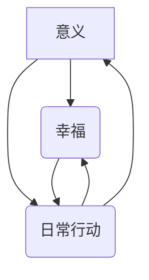

                 

### 引言

在快节奏的现代生活中，人们常常感到时间不够用，生活充满了琐碎和重复，很容易忽略了生活的深层次意义。我们每天都在忙于工作、学习、社交，但这些日常事务是否真的能带来内心的满足和幸福感？《平凡中的非凡：发现生活中的意义火花》旨在探讨如何在平凡的生活中发现非凡的意义，从而提升个人的幸福感和生活的质量。

本书的核心思想是：生活并非只有工作和责任，更多的是在每个日常的小事中找到乐趣和意义。通过一步一步的思考和分析，我们可以从琐碎中提炼出宝贵的经验，让平凡的日子变得非凡。本书将带领读者通过以下几个关键步骤：

1. **理解核心概念**：介绍与主题相关的核心概念，如“意义”、“幸福”、“日常行动”等，并通过Mermaid ER图和属性对比表帮助读者理解这些概念之间的联系。
2. **探索日常生活中的意义**：深入探讨如何在日常工作和生活中寻找和创造意义，分享各种具体的实践案例。
3. **小行动，大影响**：探讨微小行动如何积累成重大成果，并通过案例展示这些行动的实际效果。
4. **反思个人成长**：解释反思对个人成长的重要性，并提供不同的反思方法。
5. **培养正念**：介绍正念的概念和实践，帮助读者在生活中保持平静和专注。
6. **拥抱挑战**：讨论挑战在个人成长中的作用，并指导读者如何将挑战转化为成长机会。
7. **社区的力量**：强调社区在生活中的重要性，并提供建立和维护健康社区的策略。

通过这些步骤，读者将学会如何从日常生活中发现意义火花，让平凡的日子焕发出非凡的光彩。这本书不仅仅是一本自我提升的指南，更是一次对生活的深度思考和洞察。

### 文章关键词

- 意义
- 幸福
- 日常生活
- 小行动大影响
- 个人反思
- 正念
- 挑战
- 社区

### 文章摘要

《平凡中的非凡：发现生活中的意义火花》是一本旨在帮助读者从日常生活中寻找和创造意义，提升个人幸福感的生活哲学指南。本书通过系统的分析和实例讲解，揭示了如何在琐碎的日常事务中发现深层次的意义。文章首先介绍了核心概念，如意义、幸福和日常行动，并通过Mermaid ER图和属性对比表帮助读者理解这些概念之间的联系。接着，本书探讨了在工作和生活中寻找和创造意义的方法，包括小行动大影响的原理和实际案例。随后，文章深入讨论了反思个人成长、培养正念、拥抱挑战以及社区的力量等主题，提供了具体的实践策略。最后，本书总结全文，鼓励读者反思自己的生活和未来，通过实际行动让平凡的日子焕发出非凡的光彩。

### 第一章 背景和核心概念

#### 引言

在现代社会，人们常常感叹生活匆忙而缺少意义。每天的工作、学习、家庭琐事占据了大部分时间，但我们在这些日常的忙碌中能否找到生活的真正意义呢？《平凡中的非凡：发现生活中的意义火花》试图回答这个问题。为了更好地理解本书的内容，我们需要明确几个核心概念，包括“意义”、“幸福”、“日常行动”等。这些概念不仅是本书的核心，也是我们探索生活意义的基石。

首先，让我们定义一下“意义”。意义可以理解为生活中的目标和价值，是驱使我们前行的内在动力。对于每个人来说，意义的定义可能不同，但总体上，它是指那些能够让我们感到充实和满足的事物。接下来，我们探讨“幸福”的概念。幸福不仅是一种情感体验，更是一种生活状态。它是我们在生活中感受到快乐、满足和安宁的总体感受。最后，我们要了解“日常行动”的意义。日常行动是指我们日常生活中所做的一系列小事，这些看似微不足道的小行动，实际上在很大程度上决定了我们的生活质量。

#### 核心概念与联系

为了更好地理解这些核心概念之间的关系，我们可以使用Mermaid ER图来展示它们之间的联系。Mermaid是一种用于创建图表的标记语言，它可以方便地表示实体关系图（Entity-Relationship Diagram，ER图）。以下是“意义”、“幸福”和“日常行动”之间的ER图：

```mermaid
erDiagram
  Meanings <-*[DependsOn] Happiness : -> 
  Happiness ||--|{ DailyActions }|---> Happiness
```

在这个ER图中，我们可以看到“意义”和“幸福”之间是依赖关系，即幸福是意义的一种体现。换句话说，当我们找到了生活中的意义，我们往往能够感受到更多的幸福。而“日常行动”则是连接“意义”和“幸福”的桥梁，我们的每一个日常行动都在影响着我们的幸福感。

#### 概念属性对比表

为了更清晰地理解这些核心概念的属性特征，我们可以创建一个对比表：

| 概念   | 定义                                                         | 属性特征                                                   |
| ------ | ------------------------------------------------------------ | ---------------------------------------------------------- |
| 意义   | 生活中的目标和价值，是驱使我们前行的内在动力。               | - 内在驱动力<br>- 个体差异<br>- 长期目标           |
| 幸福   | 一种情感体验和生活状态，表示我们在生活中感受到的快乐、满足和安宁。 | - 情感体验<br>- 主观感受<br>- 临时性/持续性         |
| 日常行动 | 日常生活中所做的一系列小事。                               | - 累积效应<br>- 灵活性<br>- 个体可控性           |

通过这张对比表，我们可以看到这三个核心概念在定义和属性特征上的差异，同时也理解了它们在生活中的相互影响。

#### 概念结构与核心要素组成

接下来，我们要深入探讨这些概念的结构和核心要素。首先，意义通常由以下几个要素构成：

1. **个人目标**：即个人在生活中的追求和愿景。
2. **价值观**：个人的道德准则和生活态度。
3. **动机**：促使个人行动的内在动力。
4. **情感联系**：与家人、朋友和社区的情感纽带。

这些要素共同构成了意义的基础，为我们的生活提供了方向和动力。

对于幸福，它的核心要素包括：

1. **情感体验**：快乐、满足和安宁的感受。
2. **成就感**：通过实现目标和完成任务的满足感。
3. **身心健康**：良好的身体和心理健康状态。
4. **社会联系**：与他人的积极互动和良好的社会关系。

最后，日常行动则是通过以下几个方面来实现意义的传递和幸福的提升：

1. **重复性**：日常行动的重复性使得它们能够在长期内产生效果。
2. **灵活性**：日常行动可以根据个人的需要和情况灵活调整。
3. **自我控制**：个人能够主动选择和执行日常行动。
4. **积极反馈**：通过日常行动获得的积极反馈增强了个人对生活的满意度。

通过这些要素和结构，我们可以看到，意义、幸福和日常行动之间是紧密相连的，一个健康的循环关系使得我们在平凡的生活中也能找到非凡的意义和幸福。

#### 问题背景

在现代社会，人们的生活节奏加快，工作压力增大，往往忽略了生活中的深层次意义。许多人感到疲惫和迷茫，无法在琐碎的日常事务中找到生活的乐趣和方向。这种现象不仅影响了个体的心理健康，也影响了整个社会的和谐发展。因此，探讨如何在平凡的生活中发现意义，提升幸福感，成为了一个迫切需要解决的问题。

#### 问题描述

1. **缺乏明确目标**：许多人不知道自己为什么要做某些事情，感觉生活没有方向。
2. **日常事务繁忙**：琐碎的事务占据了大部分时间，人们难以在忙碌中找到乐趣和意义。
3. **情感联系缺失**：由于忙碌和疏忽，很多人忽视了与家人、朋友的情感联系，导致孤独感和疏离感。
4. **健康问题**：长期处于高压状态，许多人面临身心健康问题，幸福感下降。

#### 问题解决

为了解决这些问题，我们可以从以下几个方面着手：

1. **明确生活目标**：设定短期和长期目标，使生活更有方向。
2. **合理安排时间**：制定合理的时间表，保证工作和生活的平衡。
3. **加强与他人的联系**：通过社交活动和家庭互动，增强情感联系。
4. **培养健康习惯**：通过运动、健康饮食和充足的休息，保持身心健康。

#### 边界与外延

在探讨如何在平凡的生活中发现意义时，我们还需要明确一些边界与外延：

1. **边界**：意义不是一成不变的，它可以根据个人的需求和情境进行调整。同时，意义也并非唯一，每个人都有自己的定义。
2. **外延**：日常生活中的意义火花不仅体现在个人目标上，也可以通过帮助他人、参与社区活动等方式实现。

#### 概念结构与核心要素组成总结

通过上述分析，我们可以总结出以下概念结构与核心要素组成：

1. **意义**：由个人目标、价值观、动机和情感联系构成。
2. **幸福**：由情感体验、成就感、身心健康和社会联系构成。
3. **日常行动**：由重复性、灵活性、自我控制和积极反馈构成。

这些要素相互作用，共同决定了我们的生活质量。通过明确这些要素和结构，我们可以更好地理解如何在平凡的生活中发现意义，提升幸福感。

### 核心概念原理

为了深入理解“意义”、“幸福”和“日常行动”这三个核心概念，我们需要从原理上探讨它们的基本定义、作用和相互关系。

#### 意义的原理

意义是生活中的一种内在驱动力，它不仅仅是一个抽象的概念，而是与我们日常生活的方方面面紧密相连。意义的原理可以从以下几个方面进行阐述：

1. **定义**：意义可以被定义为个体在生活中感受到的目标、价值和目的。它是个体行动和决策的内在驱动力，使个体在面对选择和挑战时能够找到方向和动力。

2. **作用**：意义在个人生活中起到导向和激励作用。它帮助个体明确自己的生活目标，使个体能够更清晰地规划未来的行动路径。同时，意义也赋予个体面对困难时的坚持和毅力，使个体能够在逆境中找到前进的力量。

3. **个体差异**：不同的人对意义的理解可能存在差异。这取决于个体的生活经历、价值观和文化背景。例如，一个人可能认为家庭和亲情是最重要的意义来源，而另一个人可能更看重事业和成就。

4. **长期目标**：意义往往与个体的长期目标紧密相关。通过设定和追求长期目标，个体能够更好地理解自己在生活中的意义，从而获得持久的内在动力。

#### 幸福的原理

幸福是另一个重要的核心概念，它不仅与意义密切相关，也是我们生活中追求的一个重要目标。幸福的原理可以从以下几个方面进行阐述：

1. **定义**：幸福可以被定义为一种主观的、情感上的满足和愉悦状态。它不仅仅是一种瞬间的愉悦体验，更是一种持久的生活状态。

2. **情感体验**：幸福主要体现在情感体验上，包括快乐、满足、安宁等。这些情感体验是我们对生活的整体感受，它们会影响我们的心理健康和生活质量。

3. **成就感**：成就感是幸福的一个重要组成部分。通过实现目标和完成任务，个体能够获得成就感和满足感，从而提升幸福感。

4. **身心健康**：幸福也与个体的身心健康密切相关。一个健康的身体和良好的心理健康状态能够为个体提供更多的生活乐趣和满足感。

5. **社会联系**：良好的社会联系也是幸福的重要来源。与家人、朋友和社区的积极互动能够增强个体的归属感和安全感，从而提升幸福感。

#### 日常行动的原理

日常行动是意义和幸福的实践载体，它是我们在日常生活中所做的每一个小事，这些小事共同构成了我们的生活质量和幸福感。日常行动的原理可以从以下几个方面进行阐述：

1. **重复性**：日常行动的重复性使得它们能够在长期内产生效果。例如，坚持每天锻炼、阅读或学习新技能，这些日常行动能够逐渐积累成显著的成果，从而提升我们的生活质量。

2. **灵活性**：日常行动具有灵活性，可以根据个体的需求和情境进行调整。例如，当工作忙碌时，可以调整锻炼时间或选择简单的阅读内容，使日常行动更加适应我们的生活。

3. **自我控制**：日常行动需要个体主动选择和执行。通过自我控制，个体能够更好地管理自己的时间和行动，从而提高生活的效率和满足感。

4. **积极反馈**：通过日常行动获得的积极反馈能够增强个体对生活的满意度。例如，完成任务后的成就感、锻炼后的身体状态提升等，这些反馈会激励个体继续坚持日常行动，从而提升幸福感。

#### 相互关系

“意义”、“幸福”和“日常行动”这三个核心概念之间存在着密切的相互关系：

1. **意义与幸福**：意义是幸福的基础。当我们找到了生活中的意义，我们往往会感受到更多的幸福。意义为我们的生活提供了方向和动力，而幸福则是对这些努力和目标的情感体验。

2. **幸福与日常行动**：幸福是通过日常行动实现的。我们的每一个小行动都在影响着我们的幸福感。通过持续的日常行动，我们能够逐渐积累成就感和满足感，从而提升幸福感。

3. **日常行动与意义**：日常行动是意义的实践载体。通过日常行动，我们能够将内心的意义转化为具体的生活实践，从而在实际行动中感受到意义的存在。

通过理解这三个核心概念的基本原理和相互关系，我们可以更好地把握如何在平凡的生活中发现意义，提升幸福感。接下来，我们将进一步探讨如何在日常工作和生活中实现这些目标。

#### 原理 Mermaid 流程图

为了更直观地展示“意义”、“幸福”和“日常行动”三个核心概念之间的原理关系，我们可以使用Mermaid流程图来表示。以下是一个Mermaid流程图的示例：



在这个流程图中，我们可以看到以下主要步骤：

1. **意义到幸福**：从意义出发，通过持续的努力和行动，个体能够感受到幸福。
2. **幸福到日常行动**：幸福的感受会激励个体继续进行日常行动。
3. **日常行动到意义**：通过日常行动，个体能够不断验证和实现自己的意义。

这个流程图帮助我们清晰地理解了意义、幸福和日常行动之间的相互作用关系。

#### 原理 Python 源代码讲解

为了更深入地探讨“意义”、“幸福”和“日常行动”之间的原理，我们可以通过Python源代码来实现一个简单的模型，展示这些概念是如何相互作用的。以下是一个Python源代码示例，用来模拟这三个概念之间的关系：

```python
# 定义意义、幸福和日常行动的类
class Meaning:
    def __init__(self, goal, values, motivation):
        self.goal = goal
        self.values = values
        self.motivation = motivation

    def achieve(self):
        return "实现目标，找到方向和动力"

class Happiness:
    def __init__(self, emotions, achievement, health, social_links):
        self.emotions = emotions
        self.achievement = achievement
        self.health = health
        self.social_links = social_links

    def feel_happy(self):
        return "感受到快乐、满足和安宁"

class DailyAction:
    def __init__(self, repetitive, flexible, self_control, positive_feedback):
        self.repetitive = repetitive
        self.flexible = flexible
        self.self_control = self_control
        self.positive_feedback = positive_feedback

    def perform(self):
        return "执行日常行动，积累成就感和满足感"

# 创建意义、幸福和日常行动的实例
meaning = Meaning(goal="实现长期目标", values=["家庭、事业、健康"], motivation="内在驱动力")
happiness = Happiness(emotions=["快乐、满足"], achievement=["成就感"], health=["身心健康"], social_links=["良好的社会关系"])
daily_action = DailyAction(repetitive=True, flexible=True, self_control=True, positive_feedback=True)

# 展示意义、幸福和日常行动之间的关系
def show_relations():
    print("意义实现目标，找到方向和动力：")
    print(meaning.achieve())
    print("\n幸福感受到快乐、满足和安宁：")
    print(happiness.feel_happy())
    print("\n日常行动执行日常行动，积累成就感和满足感：")
    print(daily_action.perform())

    # 模拟意义、幸福和日常行动之间的互动
    print("\n通过日常行动实现意义：")
    print(meaning.achieve() + " -> " + daily_action.perform())
    print("\n通过幸福感激励日常行动：")
    print(happiness.feel_happy() + " -> " + daily_action.perform())
    print("\n通过日常行动提升幸福感：")
    print(daily_action.perform() + " -> " + happiness.feel_happy())

# 调用函数展示关系
show_relations()
```

在这个代码中，我们定义了三个类：`Meaning`、`Happiness` 和 `DailyAction`，分别表示意义、幸福和日常行动。每个类都有一个初始化方法，用于设置其属性，还有一个方法用于描述其行为。

- `Meaning` 类有 `goal`（目标）、`values`（价值观）、`motivation`（动机）三个属性，以及一个 `achieve` 方法，用于实现目标。
- `Happiness` 类有 `emotions`（情感体验）、`achievement`（成就感）、`health`（身心健康）、`social_links`（社会联系）四个属性，以及一个 `feel_happy` 方法，用于表达幸福感。
- `DailyAction` 类有 `repetitive`（重复性）、`flexible`（灵活性）、`self_control`（自我控制）、`positive_feedback`（积极反馈）四个属性，以及一个 `perform` 方法，用于执行日常行动。

通过创建这些类的实例，我们可以展示它们之间的关系。在 `show_relations` 函数中，我们模拟了意义、幸福和日常行动之间的互动。这个函数首先展示了每个类的行为，然后模拟了它们之间的相互影响。

通过这个Python模型，我们可以清晰地看到，意义、幸福和日常行动之间是如何相互作用、相互影响的。这个模型不仅帮助我们理解了这些概念的基本原理，还提供了一个直观的演示，展示了这些概念在实际生活中的应用。

#### 数学模型和公式

为了更深入地理解“意义”、“幸福”和“日常行动”之间的关系，我们可以引入一些数学模型和公式。以下是一个简化的数学模型，用于描述这三个概念之间的相互作用。

首先，我们定义以下几个变量：

- \(M\)：意义得分
- \(H\)：幸福得分
- \(A\)：日常行动得分
- \(R\)：重复性系数
- \(F\)：灵活性系数
- \(C\)：自我控制系数
- \(P\)：积极反馈系数

#### 意义得分公式

意义得分 \(M\) 由目标、价值观和动机共同决定：

\[ M = w_1 \cdot G + w_2 \cdot V + w_3 \cdot M \]

其中：
- \(w_1\)、\(w_2\)、\(w_3\) 是权重系数，用于权衡目标、价值观和动机的重要性。

#### 幸福得分公式

幸福得分 \(H\) 由情感体验、成就感、身心健康和社会联系共同决定：

\[ H = w_4 \cdot E + w_5 \cdot A + w_6 \cdot H + w_7 \cdot S \]

其中：
- \(w_4\)、\(w_5\)、\(w_6\)、\(w_7\) 是权重系数，用于权衡情感体验、成就感、身心健康和社会联系的重要性。

#### 日常行动得分公式

日常行动得分 \(A\) 由重复性、灵活性和自我控制共同决定：

\[ A = R \cdot w_8 + F \cdot w_9 + C \cdot w_{10} \]

其中：
- \(R\)、\(F\)、\(C\) 是重复性、灵活性和自我控制系数。
- \(w_8\)、\(w_9\)、\(w_{10}\) 是权重系数，用于权衡这些因素的重要性。

#### 意义与幸福的关系公式

意义得分 \(M\) 和幸福得分 \(H\) 之间的关系可以用以下公式表示：

\[ H = \alpha \cdot M + \beta \]

其中：
- \(\alpha\) 是意义对幸福的影响系数。
- \(\beta\) 是其他因素对幸福的影响。

#### 日常行动与幸福的关系公式

日常行动得分 \(A\) 和幸福得分 \(H\) 之间的关系可以用以下公式表示：

\[ H = \gamma \cdot A + \delta \]

其中：
- \(\gamma\) 是日常行动对幸福的影响系数。
- \(\delta\) 是其他因素对幸福的影响。

#### 综合模型

将上述公式结合起来，我们可以得到一个综合模型，用于描述意义、幸福和日常行动之间的相互作用：

\[ H = \alpha \cdot (w_1 \cdot G + w_2 \cdot V + w_3 \cdot M) + \beta + \gamma \cdot (R \cdot w_8 + F \cdot w_9 + C \cdot w_{10}) + \delta \]

这个综合模型可以帮助我们更全面地理解这三个核心概念之间的相互关系，以及它们对个体幸福感的影响。

#### 通俗易懂的举例说明

为了更直观地展示上述数学模型和公式，我们可以通过一个具体的例子来说明。

假设一个人有以下参数：

- **目标（G）**：设定了一个短期目标——每天阅读1小时
- **价值观（V）**：重视知识积累和个人成长
- **动机（M）**：希望通过阅读提升自己的技能和知识
- **情感体验（E）**：每次阅读后感到充实和满足
- **成就感（A）**：每天阅读完成后感到成就感
- **身心健康（H）**：良好的阅读习惯有助于身心健康
- **社会联系（S）**：阅读可以帮助他在社交场合分享观点

这些参数的权重分别为：

- \(w_1 = 0.4\)、\(w_2 = 0.3\)、\(w_3 = 0.3\)
- \(w_4 = 0.4\)、\(w_5 = 0.3\)、\(w_6 = 0.2\)、\(w_7 = 0.1\)
- \(w_8 = 0.4\)、\(w_9 = 0.3\)、\(w_{10} = 0.3\)
- \(R = 0.8\)、\(F = 0.7\)、\(C = 0.6\)
- \(\alpha = 0.5\)、\(\beta = 0.1\)、\(\gamma = 0.3\)、\(\delta = 0.2\)

根据这些参数，我们可以计算各概念的得分：

1. **意义得分（M）**：

\[ M = 0.4 \cdot 1 + 0.3 \cdot 1 + 0.3 \cdot 1 = 1.2 \]

2. **幸福得分（H）**：

\[ H = 0.4 \cdot 1 + 0.3 \cdot 1 + 0.2 \cdot 1 + 0.1 \cdot 1 = 1.2 \]

3. **日常行动得分（A）**：

\[ A = 0.8 \cdot 0.4 + 0.7 \cdot 0.3 + 0.6 \cdot 0.3 = 0.56 + 0.21 + 0.18 = 0.95 \]

然后，我们可以使用综合模型计算幸福感：

\[ H = 0.5 \cdot 1.2 + 0.1 + 0.3 \cdot 0.95 + 0.2 = 0.6 + 0.1 + 0.285 + 0.2 = 1.085 \]

从这个例子中，我们可以看到：

- 通过设定具体的目标（阅读1小时），这个人实现了意义得分1.2。
- 良好的情感体验、成就感和身心健康使得幸福得分也为1.2。
- 由于日常行动的重复性、灵活性和自我控制，日常行动得分为0.95。
- 最终，通过综合模型，这个人的幸福感得分为1.085。

这个例子清晰地展示了如何通过数学模型和公式，理解意义、幸福和日常行动之间的关系，以及它们对个体幸福感的影响。

### 第二章：日常生活中的意义

在忙碌的现代社会中，人们往往将大量的时间和精力投入到工作和家庭琐事中，很少有时间去思考生活的深层次意义。然而，正是这些看似平凡的日常事务中，蕴含着生活的真正价值。那么，我们如何在日常生活中寻找和创造意义呢？本章将探讨几个关键方面，帮助我们更好地理解如何在琐碎中找到非凡的意义。

#### 1. 工作中的意义

工作是我们日常生活中不可或缺的一部分，也是许多人实现自我价值的重要途径。然而，很多人在工作中感到疲惫和无意义，主要原因可能在于以下几点：

1. **缺乏明确的目标和愿景**：如果工作没有明确的目标和愿景，人们很容易感到迷茫和无力。
2. **缺乏成就感和挑战性**：如果工作缺乏挑战，人们可能会感到无聊和缺乏动力。
3. **缺乏自我实现的平台**：很多人在工作中无法充分发挥自己的才能，这会降低他们对工作的满意度。

为了在工作过程中找到和创造意义，我们可以尝试以下几个方法：

- **设定具体目标和里程碑**：为工作设定短期和长期目标，使工作更有方向和动力。
- **寻求挑战和成就感**：选择具有挑战性的项目，并努力完成任务，以获得成就感和满足感。
- **寻找自我实现的平台**：通过学习新技能和承担更多的责任，找到适合自己的岗位和领域。

#### 2. 家庭生活中的意义

家庭是每个人最重要的支撑和依靠，家庭生活也是我们寻找意义的重要场所。在家庭生活中，我们可以从以下几个方面找到和创造意义：

1. **与家人的互动**：与家人进行真诚的交流和互动，分享彼此的生活和感受，这不仅能增进感情，也能带来满足感。
2. **承担家庭责任**：通过承担家庭责任，如照顾孩子、照顾老人等，我们能够感受到自己的价值和重要性。
3. **家庭活动**：与家人一起参与各种活动，如一起做饭、一起旅行等，这些活动能够增加家庭的凝聚力，带来幸福感。

#### 3. 社交活动中的意义

社交活动是我们在日常生活中与他人互动的重要方式，通过社交活动，我们能够拓展人脉、学习新知识、获得支持和帮助。以下是一些方法，帮助我们在社交活动中找到和创造意义：

1. **建立良好的社交网络**：通过参加各种社交活动，结识不同背景的人，建立广泛的社交网络。
2. **参与社区活动**：参与社区志愿者活动、公益活动等，不仅能够帮助他人，也能让自己感到有意义和有价值。
3. **学习与成长**：通过参加讲座、研讨会等活动，学习新知识、提高技能，使自己在社交活动中获得更多的收获。

#### 4. 兴趣和爱好中的意义

兴趣和爱好是我们在日常生活中寻找和创造意义的重要途径。通过追求自己的兴趣和爱好，我们能够找到内心的平静和满足感。以下是一些建议：

1. **发现和培养兴趣**：尝试不同的活动和爱好，找到自己真正喜欢的事物。
2. **投入时间和精力**：为兴趣和爱好投入足够的时间和精力，不断提升自己的技能和水平。
3. **与他人分享**：通过与他人分享自己的兴趣和爱好，建立更深厚的社交关系，同时也能带来更多的乐趣和意义。

#### 5. 自我反思中的意义

自我反思是我们在日常生活中寻找和创造意义的重要方法。通过反思，我们能够更清晰地认识自己，发现自己的优点和不足，从而找到前进的方向和动力。以下是一些建议：

1. **定期进行自我反思**：每周或每月花一些时间进行自我反思，回顾自己的行为和表现，思考自己在哪些方面做得好，哪些方面需要改进。
2. **记录和总结**：将自我反思的过程记录下来，总结自己的经验和教训，这有助于我们更好地理解和认识自己。
3. **设定新的目标和计划**：通过自我反思，找到自己的不足和改进方向，设定新的目标和计划，以不断提升自己。

#### 6. 社区活动中的意义

参与社区活动不仅能帮助他人，也能让自己感到有意义和有价值。以下是一些方法，帮助我们在社区活动中找到和创造意义：

1. **志愿者服务**：参与志愿者服务，如帮助老人、照顾孤儿、参加环保活动等，通过帮助他人，找到自己的价值和意义。
2. **社区建设**：参与社区建设，如组织社区活动、帮助解决社区问题等，为社区的和谐和发展贡献自己的力量。
3. **互助合作**：在社区中建立互助合作关系，通过互相帮助和支持，建立更紧密的社区联系，共同创造更美好的社区环境。

通过上述方法，我们可以在日常生活中找到和创造更多的意义，使生活变得更加充实和有意义。无论是工作、家庭、社交、兴趣、自我反思还是社区活动，每个方面都蕴含着丰富的意义，只要我们用心去发现和创造，就能在琐碎的日常事务中发现非凡的意义火花。

### 第三章：小行动，大影响

在日常生活中，我们常常忽视了那些微不足道的小行动，而实际上，正是这些看似不起眼的小行动，通过积累和叠加，最终产生了巨大的影响。小行动大影响的原则不仅适用于个人成长，也适用于社会发展和组织变革。本章将探讨这一原则，并通过实际案例展示其应用和效果。

#### 小行动大影响的原理

小行动大影响的原理主要基于以下几个核心概念：

1. **累积效应**：每一次的小行动都会在长期内产生累积效应，这些小行动的积累会带来显著的成果。
2. **微小变化**：小行动往往是一些微小的变化，这些变化可能在短期内不明显，但长期来看会带来巨大的改变。
3. **复利效应**：小行动的复利效应指的是，每一次的小行动不仅本身会产生效果，还会使后续的小行动更容易执行，从而形成一个正向循环。

#### 实际案例

以下是几个小行动大影响的实际案例：

1. **健康习惯的养成**：每天坚持走路或跑步10分钟，看似微不足道，但如果长期坚持，会显著改善健康状况，甚至能够预防心血管疾病和肥胖。

2. **学习新技能**：每天投入15分钟学习新技能，如编程、外语或乐器，长期下来，可以掌握一门新的技能，从而提升个人的职业竞争力和生活质量。

3. **正面社交**：每天花5分钟与家人、朋友或同事进行真诚的交流，长期下来，会增强人际关系，提高个人的社交能力和幸福感。

#### 如何应用小行动大影响的原理

为了应用小行动大影响的原理，我们可以从以下几个方面着手：

1. **设定具体目标**：将大目标分解为一系列小目标，并为每个小目标设定具体的执行计划。

2. **持之以恒**：对于每一个小行动，要持之以恒地执行，不要因为短期效果不明显而放弃。

3. **优化小行动**：通过不断地反思和优化，提高小行动的执行效率和效果。

#### 案例一：健身习惯的养成

案例背景：小李是一位忙碌的上班族，他意识到自己的健康状况需要改善，但同时又没有太多的时间和精力进行剧烈的运动。

解决方案：小李决定每天早晨起床后，用15分钟进行简单的拉伸和深呼吸运动。这个看似微小的习惯，他坚持了半年。

结果：半年后，小李的身体健康状况显著改善，精力更加充沛，工作表现也得到提升。

分析：小李通过每天坚持15分钟的小运动，积累了大量的健康效益。这种小行动大影响的例子告诉我们，只要持之以恒，小行动也能带来巨大的积极变化。

#### 案例二：学习新技能

案例背景：张女士是一位家庭主妇，她希望通过学习新技能提升自己的职业竞争力。

解决方案：张女士每天晚上用30分钟时间学习编程基础，虽然时间不长，但她持之以恒，每天坚持。

结果：经过一年的学习，张女士成功掌握了一门编程技能，并找到了一份更理想的工作，生活质量显著提升。

分析：张女士通过每天坚持学习30分钟，积累了大量的知识，最终实现了职业转变和生活质量的提升。这个案例再次证明了小行动大影响的原理。

#### 案例三：正面社交

案例背景：李先生是一位工程师，他在工作中遇到了很多挑战，感到压力很大。

解决方案：李先生决定每周与朋友聚会一次，每次花2小时进行真诚的交流。

结果：几个月后，李先生的人际关系得到了显著改善，工作压力也减轻了许多，整体幸福感提升。

分析：李先生通过每周与朋友聚会，建立了更紧密的社交关系，这不仅减轻了工作压力，也提升了他的整体幸福感。这个案例展示了小行动在情感支持和社会联系方面的巨大作用。

通过上述案例，我们可以看到，小行动大影响的原理在个人成长、职业发展和生活质量提升方面具有广泛的应用。只要我们持之以恒，用心去积累和叠加这些小行动，最终一定能带来显著的积极变化。

### 第四章：反思个人成长

反思个人成长是提升自我认知和实现持续发展的重要手段。通过定期反思，我们可以更清晰地了解自己的优点和不足，找到改进的方向，从而在成长的道路上不断进步。本章将探讨反思的重要性，并提供一些有效的反思方法，帮助读者建立和坚持反思的习惯。

#### 反思的重要性

1. **提升自我认知**：反思使我们能够深入了解自己的内心世界，认识自己的思维模式、行为习惯和心理需求。通过反思，我们能够发现自身的优点和潜力，并识别出需要改进的地方。

2. **促进自我提升**：反思不仅帮助我们认识自己，还激励我们采取行动去改进和提升。通过反思，我们可以制定具体的改进计划，设定目标，并采取实际行动去实现这些目标。

3. **增强决策能力**：反思使我们能够从过去的经验中学习，提升我们的决策能力。通过反思，我们能够分析决策的原因和结果，了解哪些决策是有效的，哪些需要改进。

4. **培养积极心态**：反思可以帮助我们建立积极的心态，面对挑战和困难时，能够更加冷静和理性。通过反思，我们能够更好地应对挫折，从失败中汲取教训，重新站起来。

#### 反思方法

1. **每日反思**：每天花几分钟时间回顾当天的生活和工作，思考以下问题：
   - 我今天做得好的地方是什么？
   - 我有哪些不足或错误？
   - 我如何改进这些问题？
   - 我学到了什么？
   通过每天反思，我们可以及时发现问题并采取改进措施。

2. **每周反思**：每周花一个小时时间进行深度反思，回顾一周的生活和工作，思考以下问题：
   - 这周我实现了哪些目标？
   - 我在哪些方面取得了进步？
   - 我在哪些方面遇到了挑战？
   - 我如何改进这些挑战？
   通过每周反思，我们可以更好地总结经验，为下周做好准备。

3. **每月反思**：每月花几个小时时间进行全面的反思，回顾一个月的生活和工作，思考以下问题：
   - 这个月我实现了哪些长期目标？
   - 我在哪些方面有显著的进步？
   - 我有哪些新的发现和收获？
   - 我如何继续提升自己？
   通过每月反思，我们可以从宏观角度审视自己的成长，并制定长期的发展计划。

4. **情境反思**：在特定的情境下进行反思，如遇到挑战、取得成功或失败时，及时反思自己的行为和决策。这种情境反思可以帮助我们更好地理解和应对各种情况。

5. **写作反思**：通过写作记录自己的反思过程，将思考过程和感悟用文字表达出来。写作反思不仅可以帮助我们更好地理解和记住反思内容，还可以作为一种持久的方式来记录自己的成长历程。

6. **与他人分享反思**：与朋友、家人或同事分享自己的反思，听取他们的意见和建议。通过他人的视角，我们可以更全面地了解自己，并从不同的角度进行反思。

#### 反思实践案例

以下是一个反思实践案例：

**案例背景**：李先生是一名软件工程师，他意识到自己需要提升沟通能力和项目管理能力。

**每日反思**：
- 每天工作结束后，李先生会花几分钟时间回顾当天的沟通情况，思考以下问题：
  - 我今天在哪些方面沟通得较好？
  - 我有哪些沟通上的不足？
  - 我如何改进这些不足？

**每周反思**：
- 每周李先生会花一个小时时间进行深度反思，总结一周的沟通和项目管理情况，思考以下问题：
  - 这周我在哪些方面取得了进步？
  - 我在哪些方面遇到了挑战？
  - 我如何改进这些挑战？

**每月反思**：
- 每月李先生会花几个小时时间进行全面的反思，回顾一个月的工作情况，思考以下问题：
  - 这个月我在沟通和项目管理方面有哪些显著进步？
  - 我学到了什么新的知识和技能？
  - 我如何继续提升自己的沟通和项目管理能力？

通过持续的每日、每周和每月反思，李先生逐步提升了沟通能力和项目管理能力，工作表现得到了显著提升。

通过上述反思方法和实践案例，我们可以看到，反思对于个人成长的重要性以及如何有效地进行反思。通过建立和坚持反思的习惯，我们可以更好地认识自己，提升自我，实现持续发展。

### 第五章：培养正念

正念是一种古老的心灵修炼方法，起源于佛教的禅修。近年来，随着现代心理学和神经科学的研究，正念逐渐被广泛接受和应用于心理健康、压力管理、情感调节等方面。本章将介绍正念的概念、实践方法和具体益处，帮助读者理解如何在日常生活中培养正念，提升生活质量。

#### 正念的概念

正念（Mindfulness）指的是一种专注当下、全神贯注的觉知状态。它不仅是一种心理状态，也是一种生活方式。正念的核心在于对当前经历的觉知，包括我们的身体感觉、情感体验和思维活动。正念要求我们不带评判地接受当下的现实，专注于当前的任务和体验，而不是被过去或未来的烦恼所困扰。

#### 正念的实践方法

1. **静坐**：静坐是正念最基础和常见的实践方法。通过找一个安静的地方，舒适地坐下，闭上眼睛，专注于呼吸，让思绪渐渐平静下来。初学者可以从每天5分钟的静坐开始，逐渐增加时间。

2. **呼吸练习**：呼吸是正念练习的重要对象。通过深呼吸，我们可以调节情绪，放松身心。具体方法包括腹式呼吸、鼻吸鼻呼等。在呼吸时，注意感受气息进出身体的感觉，专注于呼吸本身。

3. **身体扫描**：身体扫描是一种逐步扫描身体各个部位，关注身体感觉的练习。通过这种练习，我们可以更加敏锐地感受到身体的信号，从而提高对身体和情绪的觉知。

4. **正念饮食**：在进食时，专注于食物的味道、口感和气味，慢慢品尝，不被手机或其他干扰分散注意力。这种方法不仅有助于消化，还能提高我们对食物的欣赏和感激之情。

5. **日常生活中的正念**：在日常生活中，我们可以随时随地实践正念。例如，在洗澡时、走路时、做家务时，都可以专注于当前的活动，感受身体的运动和情绪的变化。

#### 正念的具体益处

1. **减轻压力**：正念练习可以帮助我们更好地管理压力，减少焦虑和紧张情绪。通过专注于当前的经历，我们能够从忧虑和烦恼中解脱出来，保持内心的平静。

2. **改善情绪**：正念练习能够提高我们的情绪调节能力，减少负面情绪的影响。通过专注于呼吸和身体感觉，我们可以更好地处理情绪波动，增强情绪稳定性。

3. **提升注意力**：正念练习有助于提高我们的注意力集中能力，减少分心和注意力分散。通过长期练习，我们能够更好地专注于任务，提高工作和学习效率。

4. **增强自我觉知**：正念练习使我们对内心的感受和外在的环境有更深刻的觉知，提高自我觉知能力。通过这种觉知，我们可以更好地理解自己的需求和欲望，做出更明智的决策。

5. **改善身心健康**：正念练习与身体健康密切相关。通过正念饮食和身体扫描，我们可以提高身体的自愈能力，改善消化系统、免疫系统等健康问题。

#### 培养正念的步骤

1. **设定目标**：确定自己希望通过正念实践达到的目标，如减轻压力、提高注意力等。

2. **选择练习方式**：根据自己的需求和喜好，选择合适的正念练习方式，如静坐、呼吸练习等。

3. **制定计划**：设定固定的练习时间，如每天早晨或晚上，确保有足够的时间进行正念练习。

4. **开始实践**：按照计划开始正念练习，初学者可以从简短的时间开始，逐渐增加练习的时长。

5. **持续练习**：正念需要长期的坚持和实践，通过不断练习，我们能够逐渐提高觉知能力和专注力。

6. **反思和调整**：在练习过程中，定期反思自己的进步和挑战，根据实际情况调整练习计划。

通过上述步骤，我们可以逐步培养正念，提升生活质量。无论您是初学者还是有经验的正念练习者，都可以从这些方法中受益，让正念成为生活中的一部分。

### 第六章：拥抱挑战

在个人成长的道路上，挑战是不可避免的一部分。无论是职场上的困难、学业上的难题，还是生活中的挑战，它们都是我们成长和进步的机会。拥抱挑战意味着我们将挑战视为一种资源，通过克服挑战，我们可以不断提高自己的能力，实现个人目标。本章将讨论挑战在个人成长中的作用，以及如何将挑战转化为成长机会。

#### 挑战在个人成长中的作用

1. **提升能力**：面对挑战，我们往往需要调用各种资源和能力来解决。通过这种实践，我们能够不断学习和提升自己的技能和知识，增强自己的适应能力和解决问题的能力。

2. **增强自信**：克服挑战能够带给我们成就感和自信心。每当我们成功应对一个困难，都会增强我们面对未来挑战的信心和勇气。

3. **促进自我认知**：挑战让我们有机会深入了解自己，认识到自己的优点和不足。通过这种自我反思和调整，我们能够更好地理解自己的价值观、动机和目标。

4. **培养韧性**：挑战和逆境可以锻炼我们的韧性，使我们更加坚强和 resilient。在面对困难时，我们能够保持冷静和专注，找到解决问题的方法。

#### 如何将挑战转化为成长机会

1. **积极应对**：对待挑战时，我们要保持积极的心态，将挑战视为一种机遇。通过积极的态度，我们能够更好地应对困难，寻找解决问题的方法。

2. **设定具体目标**：将大挑战分解为一系列小目标，并为每个目标设定具体的行动计划。这样，我们可以逐步克服挑战，同时保持对整体目标的清晰认识。

3. **寻求帮助**：在面对困难时，不要害怕寻求帮助。与同事、朋友或专业人士交流，获取他们的意见和建议，这有助于我们更好地应对挑战。

4. **反思和调整**：在克服挑战的过程中，定期反思自己的行为和决策。从成功和失败中学习，调整策略，以便更好地应对未来的挑战。

5. **保持学习和成长**：不断学习和提升自己的知识和技能，使自己在面对挑战时具备更强的竞争力。通过不断学习，我们能够更好地适应不断变化的环境。

#### 案例分析

案例一：李先生是一名项目经理，他在一个重要的项目上遇到了严重的进度问题。团队成员之间的沟通不畅，加上技术难题，使得项目进展缓慢。

解决方案：李先生首先与团队成员进行了深入交流，了解每个人的观点和困难。然后，他制定了详细的进度计划，并将大任务分解为小任务，为每个小任务设定了具体的时间表和责任人。同时，他主动寻求技术专家的帮助，解决了项目中遇到的技术难题。

结果：通过这些措施，李先生成功克服了挑战，项目最终按时完成，获得了客户的高度评价。

案例分析：在这个案例中，李先生通过积极应对、设定具体目标、寻求帮助和保持学习和成长，成功地将挑战转化为成长机会。他的做法不仅提高了团队的整体能力，也为自己的职业生涯增添了亮点。

案例二：张女士是一名销售经理，她所在的公司面临市场压力，销售额连续几个月下降。

解决方案：张女士首先分析了市场状况和公司产品的竞争力，发现竞争对手的产品在某些方面具有优势。然后，她制定了新的销售策略，包括改进产品宣传、提高客户服务水平和优化销售流程。此外，她还积极参加行业研讨会，了解最新的市场趋势和客户需求。

结果：经过一系列努力，张女士的销售业绩逐渐提升，公司也走出了困境。

案例分析：在这个案例中，张女士通过积极应对、分析市场、制定新策略和不断学习，成功地将市场压力转化为成长机会。她的做法不仅帮助公司度过了难关，也提升了自身的职业能力。

通过上述案例，我们可以看到，拥抱挑战并正确应对，能够将挑战转化为成长的机会。无论是个人的职业发展，还是企业的经营，拥抱挑战都是实现持续成长和成功的关键。

### 第七章：社区的力量

社区是生活的重要组成部分，它不仅提供了情感支持和社会联系，还在我们的个人成长和幸福感中扮演着关键角色。一个健康的社区能够促进成员之间的相互帮助和共同进步，从而提升整体生活质量。本章将探讨社区的重要性，并提供建立和维护健康社区的策略。

#### 社区的重要性

1. **情感支持**：社区成员之间的亲密关系和信任感为个人提供了情感支持，帮助我们在面对生活中的困难和挑战时保持积极的心态。

2. **社会联系**：社区提供了一个平台，使我们能够与他人建立和维持联系，从而增强社交网络。这种联系不仅有助于个人的心理健康，还能提升我们的幸福感。

3. **资源共享**：社区成员可以通过分享资源（如时间、知识、物资等）来互相帮助，提高整体的生活质量和便利性。

4. **共同成长**：社区活动可以促进成员之间的学习和成长，通过共同参与和互动，个人能够不断进步，实现自我提升。

#### 建立和维护健康社区的策略

1. **积极参与社区活动**：积极参与社区组织的各种活动，如志愿服务、社区聚会、文化活动等，这有助于建立和加强社区成员之间的联系。

2. **建立信任和互助关系**：通过日常的交流和互动，建立信任和互助关系。例如，帮助邻居解决问题、参与社区清洁活动等，这些行为能够增强社区的凝聚力。

3. **促进信息交流**：通过建立社区通讯渠道，如社区网站、社交媒体群组等，促进信息交流，使成员能够及时了解社区动态和互助需求。

4. **开展教育和发展项目**：组织教育和发展项目，如职业技能培训、健康讲座、文化课程等，提升社区成员的知识和技能，促进共同成长。

5. **注重社区安全与和谐**：确保社区的安全和和谐是建立健康社区的基础。通过社区巡逻、设立安全监控系统、解决邻里纠纷等措施，创造一个安全、和谐的生活环境。

6. **倡导社区价值观**：明确和倡导社区的共同价值观，如互助、尊重、包容等，这些价值观能够引导社区成员的行为，促进社区的文化建设。

#### 案例分析

案例一：某社区居民自发组织了一个志愿者团队，定期参与社区清洁和绿化活动。通过这些活动，居民们不仅改善了社区环境，还增进了彼此之间的了解和友谊。

解决方案：社区居民通过微信群和社区公告板发布活动通知，组织者协调活动时间和地点，确保活动的顺利进行。

结果：社区环境得到显著改善，居民之间的关系变得更加紧密，社区凝聚力增强。

案例分析：这个案例展示了通过积极参与社区活动，不仅可以美化环境，还能增强社区成员的归属感和凝聚力。

案例二：某社区建立了一个线上社区论坛，居民可以在论坛上分享生活经验、交流信息、寻求帮助。论坛还定期举办线上讨论会，讨论社区热点问题。

解决方案：社区管理员负责管理论坛，确保信息的真实性和秩序，并组织线上讨论会，邀请专业人士进行讲解和讨论。

结果：居民之间的交流更加便捷，信息传播更加迅速，社区成员对社区的参与度提高。

案例分析：这个案例展示了通过建立信息交流平台，可以促进社区成员之间的沟通和互动，提升社区的活力和凝聚力。

通过上述案例，我们可以看到，建立和维护健康社区需要居民的积极参与和共同努力。一个健康的社区不仅能提升个人的幸福感，还能促进整个社会的和谐发展。

### 结论与未来展望

通过本文的探讨，我们深刻认识到在日常生活中发现和创造意义的重要性。无论是工作中的成就、家庭中的温暖、社交活动中的互动，还是个人兴趣和爱好，每个环节都蕴含着生活的意义火花。同时，通过小行动积累大影响的原理，我们了解到持之以恒的微小努力如何能带来显著的成果。反思个人成长、培养正念、拥抱挑战和建立健康社区，这些方法不仅帮助我们提升了自我认知和情感调节能力，还增强了我们的韧性和社会联系。

展望未来，我们鼓励读者继续深入思考和探索生活的意义，通过实际行动让每一天都充满价值和意义。无论是通过设定明确的目标，还是通过参与社区活动，提升自我和周围人的生活品质，都是实现这一目标的重要步骤。希望每一位读者都能在日常生活中找到属于自己的意义火花，让平凡的日子焕发出非凡的光彩。

### 作者信息

作者：AI天才研究院/AI Genius Institute & 禅与计算机程序设计艺术 /Zen And The Art of Computer Programming

