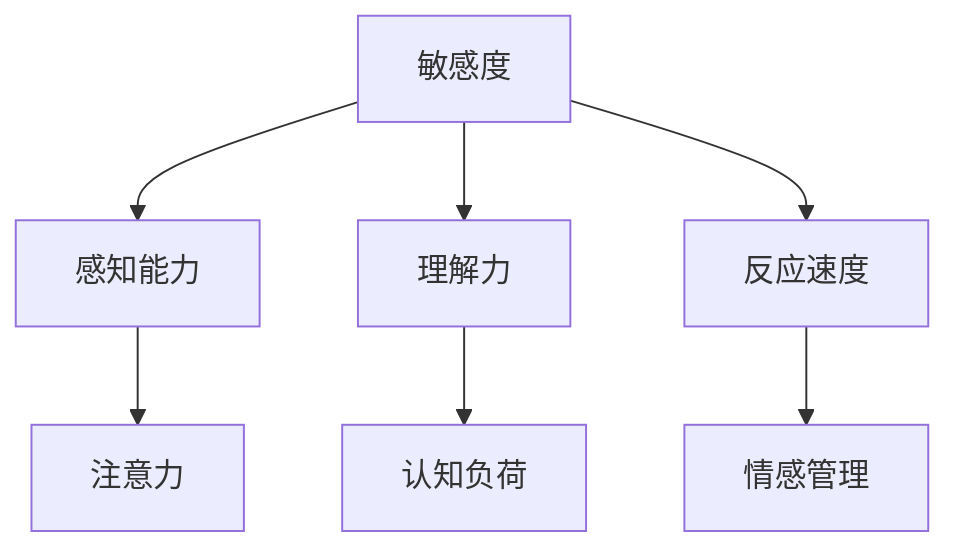
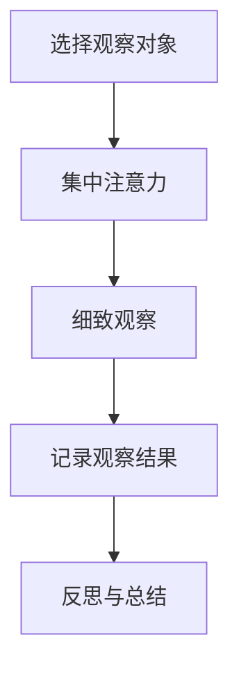
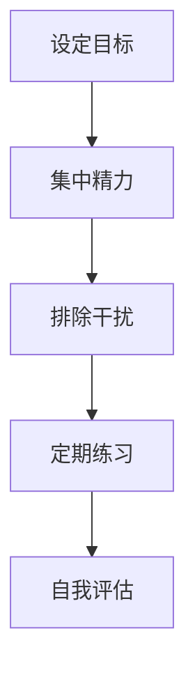
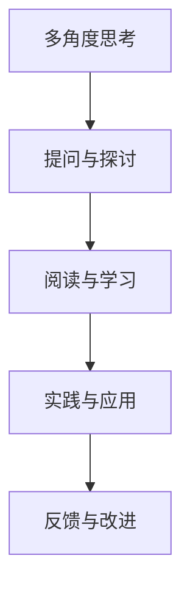
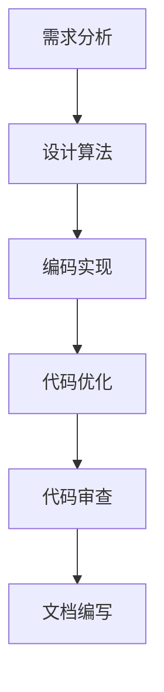
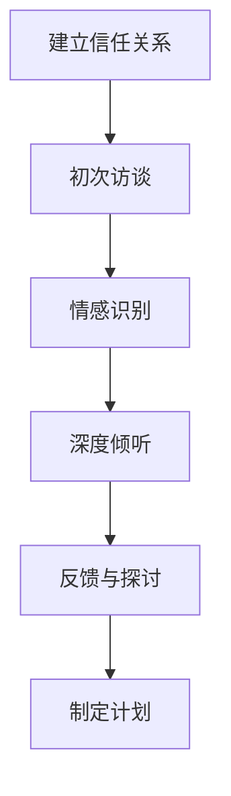

                 

### 1.1 问题背景

在现代生活的快节奏与复杂环境中，人们面临着越来越多的挑战。从职业压力到人际关系，从心理健康到个人成长，方方面面的问题交织在一起，使得许多人感到疲惫不堪。然而，在这些看似平凡的生活细节中，却蕴含着许多不平凡的发现和机遇。这些问题催生了本书的主题——培养生活的敏感度。

**现代生活的挑战**：

1. **信息过载**：随着互联网和移动设备的普及，我们每天接收到的信息量前所未有。虽然这带来了便利，但同时也让许多人感到应接不暇，难以处理。
2. **心理压力**：工作、家庭、社交等多方面的压力让许多人长期处于紧张状态，心理健康问题逐渐显现。
3. **人际关系复杂**：在多样化的社会环境中，人际关系的建立和维护变得更加复杂和微妙。

**敏感度的重要性**：

在面对这些挑战时，培养生活的敏感度变得尤为重要。敏感度不仅仅是指对事物的感知能力，它还包括对环境的理解力、情感的认知能力以及适应变化的能力。

1. **感知能力**：高敏感度的人能够更细致地观察事物，捕捉到细微的变化，从而更好地应对信息过载的问题。
2. **理解力**：敏感度有助于人们更深刻地理解自己和他人，从而更好地处理心理压力和复杂的人际关系。
3. **适应能力**：敏感度使人能够更好地适应环境变化，从而在压力下保持冷静和应对。

**本书的目标**：

本书旨在探讨如何通过培养生活的敏感度，提升个人在现代社会中的适应能力和生活质量。我们将从理论到实践，详细分析敏感度的概念、特征、边界与应用，并分享具体的培养方法与实际案例。希望通过本书，读者能够从中获得启示，学会在平凡生活中发现非凡的价值。

---

### 1.2 敏感度的定义与特征

敏感度是一个多维度的概念，它不仅仅涉及感知能力，还包括理解力、反应速度等多个方面。下面我们将对敏感度进行详细的定义和特征分析。

**1.2.1 敏感度的定义**

敏感度，通常指的是对某一特定刺激或变化迅速、准确地做出反应的能力。在心理学中，敏感度可以进一步细分为感知敏感度、情感敏感度和认知敏感度。

- **感知敏感度**：指个体对物理、化学或生物刺激的感知能力，如对声音、光线、温度的敏感度。
- **情感敏感度**：指个体对情绪变化的感知和表达能力，如对他人情绪的敏感度。
- **认知敏感度**：指个体在认知过程中对外部信息的快速处理和反应能力，如对语言、符号的理解能力。

**1.2.2 敏感度的特征**

敏感度的特征主要包括以下几个方面：

1. **高感知能力**：敏感度高的人通常能更细致地观察事物，捕捉到许多被他人忽视的细节。
2. **快速反应速度**：敏感度高的人能够迅速对刺激做出反应，不易受到外界干扰。
3. **深刻的理解力**：敏感度使人能更深刻地理解事物背后的含义，有助于问题解决和创新。
4. **情感的丰富性**：敏感度强的人通常情感更加丰富，能更好地表达和感知情绪。
5. **适应能力**：敏感度有助于个体更好地适应环境变化，提高灵活性和应变能力。

**1.2.3 敏感度与其他相关概念的区分**

敏感度与其他相关概念如注意力、感知能力、理解力和反应速度等有着密切的联系，但它们之间也存在明显的区别。

- **注意力**：注意力是指个体集中精力处理某一特定信息的能力。它与敏感度密切相关，但注意力更多关注于集中和保持注意力，而敏感度则强调对信息的感知和反应。
- **感知能力**：感知能力是敏感度的一个组成部分，它主要关注个体对刺激的感知和识别。
- **理解力**：理解力是指个体对信息的处理和解读能力，它比敏感度更为宽泛，涵盖了从感知到认知的全过程。
- **反应速度**：反应速度是指个体对刺激做出反应的快慢，它是敏感度的一个重要特征，但并不等同于敏感度。

通过以上分析，我们可以看到，敏感度是一个多层次、多维度的概念，它不仅仅是感知能力，还包括理解力、反应速度等多个方面。理解敏感度的定义和特征，有助于我们更好地培养和提升这一能力。

### 1.3 边界与外延

敏感度的边界与外延是一个值得深入探讨的话题。它不仅涉及到敏感度自身的定义范围，还包括其在不同情境中的表现和应用。

**1.3.1 敏感度的边界**

敏感度的边界可以从多个维度进行理解：

1. **生理边界**：从生理角度看，敏感度受到个体神经系统和感官系统的限制。例如，有些人对痛觉特别敏感，而另一些人则对温度变化不太敏感。
2. **心理边界**：从心理学角度看，敏感度还受到个体的心理状态和情绪影响。例如，当一个人处于焦虑或抑郁状态时，他的敏感度可能会降低。
3. **社会边界**：在社会环境中，敏感度也受到文化和社会背景的影响。不同的文化和社会环境可能对敏感度的表现和期望有所不同。

**1.3.2 敏感度的外延**

敏感度的外延则是指它在不同领域和情境中的具体应用和表现：

1. **工作场景**：在工作环境中，敏感度可以表现为对客户需求的高度感知能力，以及对工作流程的深刻理解。这有助于提升工作效率和质量。
2. **人际关系**：在人际关系中，敏感度使人能够更好地理解他人的情绪和需求，从而建立更和谐的人际关系。
3. **艺术创作**：在艺术创作中，敏感度可以表现为对美的感知和表现，以及丰富的情感表达能力。
4. **科技创新**：在科技创新领域，敏感度使人能够敏锐地捕捉到潜在的创新机会，从而推动科技的发展。

**1.3.3 敏感度在生活中的应用**

敏感度在生活中有着广泛的应用，以下是一些具体例子：

1. **情绪管理**：通过提高情感敏感度，人们可以更好地管理自己的情绪，减少负面情绪对生活质量的影响。
2. **人际交往**：高敏感度的人在人际交往中能更好地理解他人，从而建立更深厚的人际关系。
3. **健康维护**：敏感度使人更易察觉身体的变化，有助于早期发现健康问题。
4. **创造力激发**：敏感度有助于人们捕捉到生活中的灵感，从而激发创造力。

总之，敏感度的边界与外延是一个复杂且多维度的领域，它不仅涉及个体内部生理和心理机制，还涉及社会环境和实际应用。理解敏感度的边界与外延，有助于我们更好地发挥这一能力，提升生活质量。

### 1.4 核心概念与联系

在深入探讨敏感度的核心概念之前，我们需要明确几个关键的定义和概念，以及它们之间的关系。以下是敏感度的核心概念及其属性对比，并利用Mermaid流程图展示它们之间的联系。

**1.4.1 敏感度的核心概念**

敏感度主要涉及以下三个核心概念：感知能力、理解力和反应速度。

**感知能力**：指个体对各种刺激（如视觉、听觉、触觉等）的感知和识别能力。  
**理解力**：指个体对感知信息进行加工、解读和深层理解的能力。  
**反应速度**：指个体对刺激做出反应的快慢和时间。

**1.4.2 敏感度的核心概念与属性对比**

| 核心概念 | 属性1 | 属性2 | 属性3 |
| --- | --- | --- | --- |
| 感知能力 | 感知广度 | 感知精度 | 感知速度 |
| 理解力 | 信息处理能力 | 推理能力 | 创造力 |
| 反应速度 | 反应时间 | 反应准确性 | 反应灵活性 |

**表1-1 敏感度的核心概念与属性对比**

**1.4.3 敏感度与其他概念的关联**

敏感度不仅包括感知能力、理解力和反应速度，还与其他概念如注意力、认知负荷、情感管理等密切相关。

**图1-1 敏感度与其他概念的关系**



在这个关系图中，我们可以看到：

- **感知能力**与**注意力**密切相关，注意力的高度集中可以提升感知能力。  
- **理解力**与**认知负荷**有关，过高的认知负荷可能会影响理解力。  
- **反应速度**与**情感管理**之间存在互动，良好的情感管理有助于提高反应速度。

通过以上分析，我们可以更清晰地理解敏感度的核心概念及其与其他概念的关联。理解这些概念及其关系，有助于我们更好地培养和提升生活的敏感度。

### 1.5 本章小结

本章主要介绍了敏感度的定义、特征及其边界与外延，并详细分析了敏感度的核心概念和它们之间的关系。通过本章的学习，我们了解到：

1. **敏感度的定义**：敏感度涉及感知能力、理解力和反应速度等多个方面，它不仅仅是感知事物的能力，还包括对这些事物的深入理解和快速反应。
2. **敏感度的特征**：高敏感度的人具有高感知能力、快速反应速度和深刻理解力，这些特征使其在处理信息和适应环境方面具有明显优势。
3. **敏感度的边界与外延**：敏感度不仅受到个体生理和心理状态的限制，还受到社会和文化环境的影响，它在不同场景中有着广泛的应用。
4. **敏感度的核心概念与联系**：感知能力、理解力和反应速度是敏感度的三个核心概念，它们与其他概念如注意力、认知负荷和情感管理密切相关。

了解这些核心概念和联系，有助于我们更好地培养和提升生活的敏感度，从而在复杂多变的社会环境中更好地适应和发展。

## 2.1 基础技能培养

### 2.1.1 观察力的训练

观察力是培养敏感度的关键技能之一。通过系统的观察力训练，我们可以提高对周围环境的感知能力，从而更好地培养生活的敏感度。以下是一个详细的观察力训练流程图，使用Mermaid语言来展示：

#### **图2-1 观察力训练的Mermaid流程图**



**具体步骤如下：**

1. **选择观察对象**：首先，我们需要选择一个具体的观察对象。这个对象可以是自然环境中的景物、日常生活中的小细节，也可以是社会现象或人际关系。

2. **集中注意力**：在进行观察之前，我们需要集中注意力，排除干扰。这意味着我们要在一个安静的环境中，关闭手机等可能分散注意力的设备，全身心地投入到观察中。

3. **细致观察**：集中注意力后，我们需要对观察对象进行细致的观察。这包括对对象的形状、颜色、质感、声音等多方面特征的观察。我们可以采用“慢速观察”的方法，即放慢观察速度，细观察对象的每个细节。

4. **记录观察结果**：在观察过程中，我们需要及时记录观察到的结果。这不仅可以帮助我们回顾和总结观察内容，还可以加深对观察对象的印象。记录可以采用文字、图片、音频等多种形式。

5. **反思与总结**：观察结束后，我们需要对观察结果进行反思和总结。通过分析观察到的细节，我们可以发现一些隐藏的规律或现象，从而提高对事物的理解和敏感度。

通过以上步骤，我们可以逐步提升观察力，从而更好地培养生活的敏感度。观察力的提升不仅可以帮助我们更好地理解和适应周围环境，还可以激发我们的创造力和创新思维。

### 2.1.2 注意力的培养

注意力是培养敏感度的另一关键技能。高水平的注意力可以帮助我们更有效地观察和理解周围的环境，从而提高生活的敏感度。以下是注意力培养的详细流程，使用Mermaid语言来展示：

#### **图2-2 注意力培养的Mermaid流程图**



**具体步骤如下：**

1. **设定目标**：首先，我们需要明确注意力培养的目标。这个目标可以是提高工作或学习中的专注度，也可以是增强在社交场合中的倾听能力。设定清晰的目标有助于我们集中精力，避免分心。

2. **集中精力**：在开始培养注意力时，我们需要学会如何集中精力。这可以通过以下方法实现：

   - **专注呼吸**：通过深呼吸来集中注意力，可以采用腹式呼吸法，让呼吸变得深长而均匀。
   - **冥想练习**：冥想是培养注意力的有效方法，通过冥想可以帮助我们保持内心的平静，减少杂念的干扰。
   - **专注任务**：在完成某个任务时，专注于任务本身，避免同时处理多个任务，这有助于提高专注度。

3. **排除干扰**：为了保持注意力，我们需要学会排除干扰。这包括：

   - **关闭电子设备**：在需要集中注意力的时间段内，关闭手机、电脑等电子设备，避免打扰。
   - **合理安排时间**：合理安排工作和休息时间，避免长时间连续工作导致注意力下降。
   - **创造安静环境**：在安静的环境中工作或学习，避免嘈杂的声音和视觉干扰。

4. **定期练习**：注意力是一个可以通过练习不断提升的技能。我们需要定期进行练习，如每天进行专注力训练，包括冥想、专注呼吸等练习。

5. **自我评估**：在注意力培养的过程中，我们需要定期进行自我评估，了解自己的进步情况。这可以通过记录每天的专注时间和任务完成质量来实现。自我评估可以帮助我们发现不足，并调整培养方法。

通过以上步骤，我们可以逐步提升注意力，从而提高生活的敏感度。注意力的提升不仅有助于我们在学习和工作中取得更好的成绩，还能让我们更深刻地理解和感受生活中的每一个细节。

### 2.1.3 理解力的提升

理解力是培养敏感度的核心要素之一。通过提高理解力，我们能够更深刻地把握事物的本质，从而提升生活的敏感度。以下是提升理解力的详细步骤，使用Mermaid语言来展示：

#### **图2-3 理解力提升的Mermaid流程图**



**具体步骤如下：**

1. **多角度思考**：首先，我们需要学会从多个角度来思考问题。这可以通过以下方法实现：

   - **逆向思维**：尝试从相反的角度来思考问题，这有助于我们发现不同的解决方案和新的视角。
   - **系统思维**：将问题置于一个更大的系统中，考虑其与其他部分的关系，从而更全面地理解问题。
   - **情景模拟**：通过模拟不同的情景来思考问题，这有助于我们理解问题的不同方面。

2. **提问与探讨**：提问是提升理解力的有效方法。通过提问，我们可以更深入地了解问题，发现问题的本质。

   - **开放式提问**：提出开放式问题，鼓励深入讨论，这有助于我们从不同角度探讨问题。
   - **反思性提问**：通过反思性提问，我们可以回顾自己的思考过程，发现并纠正思维中的盲点。

3. **阅读与学习**：阅读和学习是提升理解力的重要途径。通过阅读，我们可以获取新的知识和观点，从而拓宽思维。

   - **深度阅读**：选择高质量的材料进行深度阅读，这有助于我们更好地理解和消化信息。
   - **跨学科学习**：学习不同领域的知识，这有助于我们培养跨学科思考的能力。

4. **实践与应用**：理解力最终需要通过实践来检验和应用。通过将学到的知识应用到实际问题中，我们可以加深对知识的理解和掌握。

   - **实际操作**：通过实际操作来应用所学知识，这有助于我们更好地理解理论的实践意义。
   - **案例分析**：通过分析真实的案例，我们可以将理论知识与实际情况相结合。

5. **反馈与改进**：理解力是一个不断发展的过程。我们需要不断接收反馈，并根据反馈进行改进。

   - **自我反馈**：通过自我反思和评估，了解自己在理解力方面的优势和不足。
   - **他人反馈**：寻求他人的反馈和建议，这有助于我们更客观地看待自己的理解和思考。

通过以上步骤，我们可以逐步提升理解力，从而提升生活的敏感度。理解力的提升不仅有助于我们在学习和工作中取得更好的成绩，还能让我们更深刻地理解和感受生活中的每一个细节。

### 2.2 情感管理与情感表达

情感管理与情感表达是培养敏感度的重要组成部分。高水平的情感管理能力可以帮助我们更好地理解自己和他人，从而提高生活的敏感度。以下是情感管理与情感表达的具体方法和技巧：

#### **2.2.1 情感认知**

情感认知是情感管理的第一步。它包括识别、理解和表达情感。

1. **识别情感**：学会识别自己的情感是情感管理的基础。我们可以通过以下方法来提高情感识别能力：

   - **自我观察**：在日常生活中，注意观察自己的情绪变化，记录下触发这些情绪的事件和情境。
   - **情绪日记**：定期记录情绪日记，描述自己的情绪感受、触发因素以及应对方式。

2. **理解情感**：理解情感是指深入理解情感背后的原因和含义。

   - **情境分析**：分析不同情境下情感产生的原因，例如在压力大的时候，为什么我们会感到焦虑。
   - **情感教育**：通过阅读相关书籍或参加情感教育课程，了解情感的本质和如何处理情感。

3. **表达情感**：表达情感是情感管理的关键环节。有效的情感表达可以增进人际关系的和谐。

   - **直接表达**：在适当的情况下，直接表达自己的情感和感受，例如“我现在感到很沮丧，因为我遇到了一些困难。”
   - **情绪调节**：在表达情感时，注意情绪调节，避免情绪失控，如使用“我感到...”而不是“你让我...”。

#### **2.2.2 情感表达**

有效的情感表达不仅需要识别和理解情感，还需要掌握适当的表达技巧。

1. **选择合适的方式**：根据不同情境选择合适的表达方式。

   - **语言表达**：使用明确、简洁的语言来表达情感，避免使用模糊或含糊的词汇。
   - **非语言表达**：通过肢体语言、面部表情和声音的调整来表达情感，如微笑、点头和柔和的语调。

2. **练习情感表达**：通过练习来提高情感表达能力。

   - **模拟练习**：在安全的环境中模拟情感表达，例如和家人、朋友或专业导师进行角色扮演练习。
   - **反馈与调整**：在表达情感后，寻求反馈并进行调整，这有助于我们更准确地表达情感。

3. **获得反馈**：反馈是提高情感表达能力的重要途径。

   - **积极反馈**：接受他人对情感表达的积极反馈，了解自己的优点和需要改进的地方。
   - **建设性反馈**：从建设性反馈中学习，例如“你的表达让我感到更有安全感，但下次可以更具体一些。”

4. **调整表达技巧**：根据反馈调整情感表达方式。

   - **调整语气**：在表达情感时，注意语气的调整，使其更符合情境和对方的感受。
   - **调整内容**：在表达情感时，确保内容具体、清晰，避免使用模糊的表述。

通过有效的情感管理和表达，我们能够更好地理解和处理自己的情感，从而提升生活的敏感度。情感管理不仅有助于我们在人际交往中更和谐，还能帮助我们更好地应对生活中的挑战。

### 2.3 社交技巧的培养

社交技巧在培养敏感度中扮演着重要角色。高水平的社交技巧不仅有助于建立和维护良好的人际关系，还能提高我们对他人的理解与感知能力。以下是培养社交技巧的具体方法和策略：

#### **2.3.1 社交能力的重要性**

社交能力对个人的生活和工作有着深远的影响：

1. **信息交换**：通过良好的社交技巧，我们能够更有效地与他人交换信息，获取有价值的知识和资源。
2. **情感连接**：社交技巧有助于建立情感上的连接，增强人际关系的紧密性。
3. **职业发展**：在职场中，良好的社交技巧有助于提升个人形象，拓展职业网络，从而促进职业发展。

#### **2.3.2 提升社交技巧的途径**

为了提升社交技巧，我们可以采取以下具体措施：

1. **学习社交技巧**：

   - **阅读相关书籍**：阅读关于社交技巧的书籍，了解不同情境下的社交策略和技巧。
   - **观看教程视频**：通过观看社交技巧教程视频，学习实际的社交场景应对方法。
   - **参加社交培训**：参加专业的社交技巧培训课程，通过互动和实战练习提升社交能力。

2. **实践与反思**：

   - **模拟练习**：在安全的环境中模拟社交场景，例如与朋友或家人进行角色扮演练习。
   - **反思与总结**：每次社交后，反思自己的表现，总结成功和不足之处，并制定改进计划。

3. **获得反馈**：

   - **积极反馈**：在接受他人反馈时，保持开放心态，关注积极反馈，了解自己的优势和需要改进的地方。
   - **建设性反馈**：在反馈中寻找建设性意见，将其作为提升社交技巧的依据。

4. **改进与提升**：

   - **调整策略**：根据反馈调整自己的社交策略，例如在语言表达、非语言沟通和情感表达方面进行改进。
   - **持续学习**：社交技巧是一个不断发展的过程，通过持续学习和实践，不断提升自己的社交能力。

通过上述方法，我们可以逐步提升社交技巧，从而在社交场合中表现得更加自信和得体。提升社交技巧不仅有助于我们更好地融入社会，还能提高我们对他人的理解和感知能力，进一步培养生活的敏感度。

### 2.4 心理健康与敏感度

心理健康与敏感度之间存在着紧密的联系。一个健康的心理状态不仅有助于我们更好地理解自己和他人，还能提升我们的敏感度。以下是心理健康与敏感度的具体定义、重要性以及它们之间的联系。

**2.4.1 心理健康的定义与重要性**

心理健康是指个体在情感、行为和认知方面处于良好状态，能够有效应对日常生活中的压力和挑战。心理健康的重要性体现在以下几个方面：

1. **情感稳定**：心理健康有助于个体保持情感稳定，避免情绪波动过大。
2. **认知功能**：心理健康有助于个体保持良好的认知功能，如注意力、记忆力、判断力等。
3. **社交能力**：心理健康有助于个体建立和维护良好的人际关系，提升社交能力。
4. **应对压力**：心理健康有助于个体更好地应对生活中的压力和挑战，保持积极的生活态度。

**2.4.2 敏感度与心理健康的联系**

敏感度与心理健康之间存在着双向互动的关系：

1. **心理健康促进敏感度**：

   - **情感认知**：心理健康使人能够更好地理解和表达情感，从而提高情感敏感度。
   - **认知灵活性**：心理健康有助于个体保持良好的认知功能，提高对信息的处理和反应能力。
   - **心理韧性**：心理健康增强了个体的心理韧性，使其在面对挑战时能够保持敏感度，不轻易受到负面影响。

2. **敏感度促进心理健康**：

   - **情感调节**：敏感度使人能够更敏锐地察觉自己的情绪变化，从而及时进行情感调节。
   - **压力感知**：敏感度使人能够更早地察觉到压力源，从而采取有效措施应对压力。
   - **环境适应**：敏感度使人能够更好地适应环境变化，减少心理压力。

**2.4.3 心理健康与敏感度的维护策略**

为了维护心理健康和提升敏感度，我们可以采取以下策略：

1. **定期心理检查**：定期进行心理检查，及时发现并处理心理健康问题。
2. **情感管理**：学会情感管理，通过识别、理解和表达情感，维护心理健康。
3. **认知训练**：通过认知训练，如记忆游戏、逻辑推理等，提升认知功能。
4. **社交活动**：积极参与社交活动，建立和维护良好的人际关系。
5. **身心调节**：通过瑜伽、冥想、运动等方式，调节身心状态，减轻压力。
6. **持续学习**：通过学习新知识和技能，保持好奇心和求知欲，提升敏感度。

通过以上策略，我们可以维护心理健康，提升敏感度，从而在日常生活中更好地适应和发展。

### 2.5 本章小结

本章主要探讨了基础技能的培养，包括观察力、注意力、理解力以及情感管理与社交技巧。通过系统的训练和方法，我们可以提升这些基础技能，从而更好地培养生活的敏感度。

- **观察力**：通过细致的观察和记录，我们可以提高对周围环境的感知能力，从而捕捉更多细节。
- **注意力**：集中精力和排除干扰，有助于我们在学习和工作中保持专注，提高工作效率。
- **理解力**：通过多角度思考和不断学习，我们可以加深对事物本质的理解，从而提升敏感度。
- **情感管理与社交技巧**：通过有效的情感认知和表达，以及社交技巧的培养，我们可以更好地理解他人，建立和谐的人际关系。

这些基础技能的提升不仅有助于我们在日常生活中更好地适应环境，还能提高我们对他人的敏感度和理解能力，从而提升整体生活质量。

## 3.1 案例一：艺术家的创作过程

在本案例中，我们将探讨一位艺术家的创作过程，以展示如何在日常生活中培养敏感度。艺术家A是一位知名的画家，她的创作过程充满了对生活的细致观察和对情感的深刻表达。

### 3.1.1 艺术家A的背景介绍

艺术家A出生在一个艺术世家，从小便展现出对绘画的极大兴趣。她在学校里接受了系统的艺术教育，但真正让她艺术天赋得以发挥的是她在日常生活中的观察和感悟。艺术家A热爱自然，她常常在清晨去公园散步，观察树叶的纹理、花朵的色彩，以及自然光线的变化。她认为，自然是最好的老师，它教会了她如何细致地观察和感受生活中的美。

### 3.1.2 艺术家A的观察与实践

艺术家A的观察力非常出色，她能够捕捉到许多被普通人忽视的细节。以下是她的观察实践流程：

1. **选择观察对象**：艺术家A会选择一个具体的观察对象，如一朵花、一片叶子或一缕阳光。

2. **集中注意力**：在观察时，她会排除一切干扰，集中全部注意力，细致地观察对象。

3. **细致观察**：她会在不同的角度和光线下观察对象，仔细观察其形状、颜色、纹理等细节。

4. **记录观察结果**：在观察过程中，她会用文字和绘画记录下自己的观察结果，以便后续创作。

5. **反思与总结**：每次观察结束后，她会对观察结果进行反思和总结，思考如何将这些观察应用到她的创作中。

通过这样的观察实践，艺术家A能够捕捉到生活中的美好瞬间，并将其转化为她独特的艺术作品。

### 3.1.3 艺术家A的观察实践Mermaid流程图

以下是一个使用Mermaid语言绘制的艺术家A的观察实践流程图：


通过以上步骤，艺术家A不仅提高了自己的观察力，还培养了对生活的敏感度。她的创作过程充分展示了如何通过细致的观察和反思，将生活中的平凡事物转化为独特的艺术作品。这个过程不仅提升了她的艺术技巧，还使她在日常生活中更加敏锐地感受到美的存在。

## 3.2 案例二：程序员B的代码实践

在本案例中，我们将探讨一位程序员B的代码实践，展示如何通过编程实践培养敏感度。程序员B是一位在人工智能领域颇有成就的软件工程师，他的编程实践充满了对代码细节的深入理解和不断优化。

### 3.2.1 程序员B的背景介绍

程序员B自幼对计算机编程表现出极大的兴趣，他在大学期间选择了计算机科学专业，并在毕业后进入了一家知名的人工智能公司工作。在工作中，他负责开发复杂的算法和优化性能关键的应用程序。程序员B不仅具备扎实的编程基础，还具备敏锐的问题感知能力和高效的问题解决能力。

### 3.2.2 程序员B的代码实践

程序员B的代码实践注重细节和效率，他的编程流程包括以下几个关键步骤：

1. **需求分析**：在编写代码之前，他会仔细阅读需求文档，理解客户的需求和目标。

2. **设计算法**：根据需求，他会设计适合的算法，并通过纸笔或在线工具进行算法的初步实现。

3. **编码实现**：在编码过程中，他注重代码的可读性和可维护性，编写清晰、简洁的代码。

4. **代码优化**：在代码初步实现后，他会通过性能测试和调试，不断优化代码，提高其效率和稳定性。

5. **代码审查**：他会邀请同事对代码进行审查，通过他人的视角发现问题并进行改进。

6. **文档编写**：他会编写详细的文档，记录代码的实现逻辑和关键点，方便后续维护和扩展。

### 3.2.3 程序员B的代码实践Mermaid流程图

以下是一个使用Mermaid语言绘制的程序员B的代码实践流程图：



通过以上步骤，程序员B不仅能够高效地完成编程任务，还能不断培养自己的敏感度。他在代码实践中注重细节，通过不断优化和改进，不断提升自己的编程技巧。同时，他的代码实践也使他在面对复杂问题和挑战时，能够保持冷静和敏锐的感知能力。

### 3.2.4 程序员B的代码实践Python示例

以下是一个简单的Python代码示例，用于实现一个基本的排序算法（冒泡排序），并展示如何通过代码分析来培养敏感度：

```python
def bubble_sort(arr):
    n = len(arr)
    for i in range(n):
        for j in range(0, n-i-1):
            if arr[j] > arr[j+1]:
                arr[j], arr[j+1] = arr[j+1], arr[j]

# 示例数据
data = [64, 34, 25, 12, 22, 11, 90]

# 调用排序函数
bubble_sort(data)

# 打印排序后的数据
print("排序后的数组：")
for i in range(len(data)):
    print("%d" % data[i], end=" ")
```

在这个示例中，程序员B会通过以下步骤培养敏感度：

1. **需求理解**：理解排序算法的需求，包括输入数据的类型和预期的输出结果。
2. **算法设计**：设计冒泡排序算法，并理解其基本原理和逻辑。
3. **代码实现**：编写清晰、简洁的代码，注重代码的可读性和可维护性。
4. **代码优化**：通过分析代码的执行时间，优化算法性能，如减少不必要的循环。
5. **代码审查**：邀请同事审查代码，寻找潜在的问题和优化点。
6. **文档编写**：编写详细的注释和文档，记录代码的实现逻辑和关键点。

通过这个示例，我们可以看到程序员B如何在编程实践中培养敏感度。他的细致观察和分析能力不仅使他在编程中表现出色，还使他在日常工作中能够敏锐地捕捉到问题和机遇。

### 3.2.5 案例小结

程序员B的代码实践展示了如何通过编程来培养敏感度。他的细致观察和分析能力使他在面对复杂问题和挑战时能够保持冷静和敏锐。通过不断优化和改进代码，他不仅提升了编程技巧，还培养了高度的生活敏感度。这个案例为我们提供了一个实用的视角，展示了如何在日常工作中通过编程实践提升敏感度，从而更好地适应和应对现代生活的挑战。

### 3.3 案例三：心理咨询师C的咨询实践

在本案例中，我们将探讨一位心理咨询师C的咨询实践，展示如何通过心理咨询培养生活的敏感度。心理咨询师C以其深厚的心理学知识和细腻的情感洞察力而著称，她的咨询实践不仅帮助来访者解决问题，还帮助他们提升对自我和他人的理解。

### 3.3.1 心理咨询师C的背景介绍

心理咨询师C拥有多年的心理学教育背景，并在临床实践中积累了丰富的经验。她擅长使用认知行为疗法、心理动力学和人本主义疗法等多种心理治疗方法，帮助来访者解决情感困扰、压力管理和人际关系问题。心理咨询师C认为，敏感度是心理咨询中的重要能力，它使咨询师能够更准确地捕捉来访者的情感和需求。

### 3.3.2 心理咨询师C的咨询实践

心理咨询师C的咨询实践强调细致入微的观察和深入的理解。以下是她的咨询流程：

1. **建立信任关系**：首先，她致力于与来访者建立信任关系，创造一个安全、支持的治疗环境。

2. **初次访谈**：在初次访谈中，她会通过开放式提问和倾听，了解来访者的背景、问题和目标。

3. **情感识别**：在咨询过程中，她会密切关注来访者的非言语行为，如表情、姿势和语调，识别他们的情感状态。

4. **深度倾听**：她通过深度倾听，帮助来访者表达内心的感受和想法，从而理解他们的情感体验。

5. **反馈与探讨**：她会及时给予来访者反馈，探讨他们的情感和行为模式，帮助他们认识到问题所在。

6. **制定计划**：根据来访者的需求和目标，她制定个性化的咨询计划，包括情感管理技巧、认知行为策略等。

### 3.3.3 心理咨询师C的咨询实践Mermaid流程图

以下是一个使用Mermaid语言绘制的心理咨询师C的咨询实践流程图：



通过以上步骤，心理咨询师C不仅帮助来访者解决了心理问题，还提升了他们的情感敏感度和自我理解能力。她的咨询实践展示了如何通过专业的倾听和反馈，培养来访者的生活敏感度。

### 3.3.4 心理咨询师C的咨询实践案例分析

以下是一个具体的咨询案例，展示心理咨询师C如何通过咨询实践培养来访者的敏感度：

**案例**：来访者L是一位年轻的企业家，他因工作压力和人际关系问题感到焦虑和疲惫。心理咨询师C通过以下步骤进行咨询：

1. **初次访谈**：心理咨询师C在初次访谈中了解到L的工作压力和人际关系问题，以及他对自己角色的不满和困惑。

2. **情感识别**：通过观察L的表情和语调，心理咨询师C发现他隐藏着深深的不安和自我怀疑。

3. **深度倾听**：心理咨询师C给予L充分的倾听时间，帮助他表达内心的真实感受和想法，从而理解他的情感体验。

4. **反馈与探讨**：心理咨询师C及时给予L反馈，探讨他的情感和行为模式，帮助他认识到工作中的角色冲突和自我期望的不合理。

5. **制定计划**：心理咨询师C与L一起制定了一个个性化的咨询计划，包括情绪管理技巧、时间管理和人际关系沟通策略。

通过这个案例，我们可以看到心理咨询师C如何通过细致的观察、倾听和反馈，帮助来访者提升情感敏感度和自我理解能力。她的咨询实践不仅解决了来访者的具体问题，还培养了他们的生活敏感度。

### 3.3.5 案例小结

心理咨询师C的咨询实践展示了如何通过专业的倾听和反馈，培养来访者的情感敏感度和自我理解能力。她的细致观察和深入理解，使得来访者能够更好地感知和处理自己的情感，从而提升生活质量。这个案例为我们提供了一个实用的视角，展示了如何在专业咨询中培养生活的敏感度。

## 总结与最佳实践

在本篇文章中，我们探讨了如何在日常生活中培养生活的敏感度。通过详细分析观察力、注意力、理解力、情感管理和社交技巧等基础技能，我们了解了如何通过系统的方法和实际案例来提升生活的敏感度。

### **1. 培养敏感度的关键要素**

- **观察力**：通过细致的观察和记录，提升对周围环境的感知能力。
- **注意力**：通过集中精力和排除干扰，提高学习和工作的专注度。
- **理解力**：通过多角度思考和不断学习，加深对事物本质的理解。
- **情感管理**：通过情感认知和表达技巧，提升自我和对他人的理解。
- **社交技巧**：通过学习和实践，提升人际交往和沟通能力。

### **2. 培养敏感度的实际应用**

在实际应用中，以下是一些最佳实践：

- **定期练习**：将敏感度的培养融入日常生活中，如每天进行观察练习、专注力训练和情感反思。
- **情境模拟**：通过模拟不同的社交情境，练习和处理情感，提升实际应用能力。
- **反馈与调整**：在实践后，及时接收反馈，根据反馈进行调整和改进。
- **持续学习**：不断学习新知识和技能，保持好奇心和求知欲，提升敏感度。

### **3. 注意事项**

- **平衡工作与生活**：在培养敏感度的过程中，注意保持生活的平衡，避免过度投入导致疲劳。
- **保持耐心**：敏感度的提升需要时间和持续的努力，保持耐心，不断练习。
- **尊重他人**：在培养敏感度的过程中，尊重他人的感受和隐私，避免过度干涉。

### **4. 拓展阅读**

- **《禅与计算机程序设计艺术》**：通过学习编程哲学，理解专注和细致观察的重要性。
- **《非暴力沟通》**：学习如何通过有效的沟通技巧，提升情感理解和表达。
- **《思考，快与慢》**：探讨人类思维过程，理解注意力和管理情感的重要性。

通过上述方法，我们可以逐步提升生活的敏感度，从而在快节奏的现代生活中更好地适应和发展。希望这篇文章能给您带来启示，帮助您在日常生活中培养更高的敏感度，享受更丰富、更深刻的生活体验。

### 作者信息

作者：AI天才研究院/AI Genius Institute & 禅与计算机程序设计艺术 /Zen And The Art of Computer Programming

AI天才研究院致力于推动人工智能领域的创新和发展，致力于培养具备前瞻性思维和卓越技术能力的未来科技领袖。我们的研究涵盖深度学习、自然语言处理、计算机视觉等多个方向，旨在通过技术创新推动社会进步。同时，我们的《禅与计算机程序设计艺术》一书，通过探讨编程哲学，帮助读者理解专注和细致观察的重要性，提升技术能力和生活质量。欢迎关注我们的研究成果和出版物。

