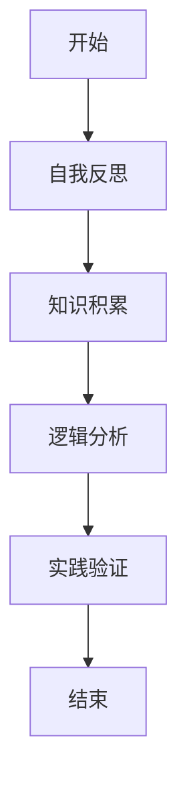
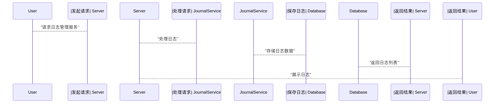
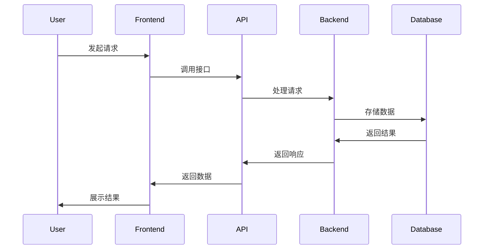

                 

### 第1章：引言

**关键词**：个人信念体系、价值观、自我认知、决策支持、情绪管理、行为规范。

**摘要**：本章将探讨个人信念体系的重要性，明确信念体系在自我认知、决策支持、情绪管理和行为规范等方面的作用，并简要介绍本书的结构安排和各部分的主要内容。

---

**1.1 个人信念体系的重要性**

个人信念体系是个人世界观、人生观和价值观的核心，它决定了个人的行为模式、决策过程和生活方式。在信息爆炸、价值观多元化的现代社会中，个人信念体系的重要性愈发凸显。

#### 1.1.1 为什么需要建立个人信念体系

- **自我认知**：一个明确的信念体系有助于个体深入理解自己的价值观和目标，从而形成清晰的自我认知。
- **决策支持**：在面临复杂问题时，信念体系可以提供明确的决策依据和方向。
- **情绪管理**：信念体系有助于个体在面对压力和挫折时保持冷静和乐观，从而实现有效的情绪管理。
- **行为规范**：信念体系指导个体的行为和态度，促进个人和社会的和谐。

---

**1.2 信念体系构建的基本原则**

建立个人信念体系需要遵循以下几个基本原则：

#### 1.2.1 自我反思

通过深入反思，了解自己的价值观和信念，识别其中可能存在的矛盾和问题。

#### 1.2.2 知识积累

广泛阅读和学习，获取各种知识和信息，为信念体系的构建提供丰富的素材。

#### 1.2.3 逻辑思考

运用逻辑思维，分析各种信息的合理性和可靠性，避免盲目和偏激。

#### 1.2.4 实践检验

通过实际操作和经验积累，验证和调整信念体系，确保其符合现实需求。

---

**1.3 本书结构安排**

本书共分为七个部分，每个部分都有明确的目标和重点内容，旨在帮助读者全面理解和掌握建立个人信念体系的技巧和方法。

#### 1.3.1 第1章：引言
- 介绍个人信念体系的重要性以及本书的结构安排。

#### 1.3.2 第2章：背景介绍
- 探讨价值观的概念、历史演变以及在不同文化和社会背景下的表现。

#### 1.3.3 第3章：核心概念与理论
- 详细讲解与个人信念体系相关的核心概念，包括信念、价值观、道德观等，并通过表格和ER实体关系图帮助读者理解。

#### 1.3.4 第4章：实践应用
- 提供具体的实践方法和技巧，帮助读者在实际生活中建立和强化个人信念体系。

#### 1.3.5 第5章：算法原理与数学模型
- 介绍相关算法的基本原理和数学模型，使用mermaid流程图和Python源代码进行详细讲解。

#### 1.3.6 第6章：系统分析与架构设计
- 通过mermaid类图、架构图和序列图，展示系统设计的关键步骤和架构。

#### 1.3.7 第7章：项目实战
- 通过环境安装、系统核心实现和案例剖析，帮助读者将理论知识应用到实际项目中。

#### 1.3.8 第8章：最佳实践与总结
- 提供最佳实践建议、小结和注意事项，以及推荐拓展阅读，以促进读者深入理解和持续学习。

---

以上是本书的引言部分，旨在为读者提供一个宏观的框架，帮助读者理解本书的核心内容。接下来的章节将逐步深入探讨信念体系的构建过程，并给出具体的实践方法。

---

**作者**：AI天才研究院/AI Genius Institute & 禅与计算机程序设计艺术 /Zen And The Art of Computer Programming

---

在接下来的章节中，我们将进一步深入探讨信念体系的各个组成部分，包括价值观的概念、历史演变、核心概念与理论，以及如何在实际生活中建立和强化个人信念体系。让我们一起来探索这一重要且具有深远影响的话题。

---

## 第2章：背景介绍

### 2.1 价值观的概念

价值观是指一个人或组织对什么是有价值的、什么是重要的和什么是正确的的基本信念和判断。价值观是人类行为和决策的内在驱动力，它不仅影响个人的行为模式，也影响整个社会的运行和进步。

#### 2.1.1 价值观的定义

价值观通常被定义为一系列信念、标准或原则，它们指导人们如何判断事物的价值和重要性，并指导人们的行为和决策。这些信念和原则可以是个人的，也可以是组织的，它们构成了个体和组织的行为准则。

#### 2.1.2 价值观的类型

- **个体价值观**：个体价值观是指个人对事物的判断和偏好，它们可以是个人的道德观、人生观和世界观。
- **组织价值观**：组织价值观是指组织对事物的判断和偏好，它们通常体现在组织的文化、使命和愿景中。

#### 2.1.3 价值观的影响

价值观对个人的行为和决策有着深远的影响，它们不仅影响个体的生活方式和职业选择，还影响个体的心理健康和社会交往。对于组织而言，价值观则决定了组织的文化、战略和行为模式。

### 2.2 历史演变

价值观并不是一成不变的，它们会随着历史的发展和文化的变迁而演变。在不同的历史时期和文化背景下，价值观的表现和内涵都有所不同。

#### 2.2.1 古代价值观

在古代，价值观主要受到宗教、哲学和政治思想的影响。例如，在古希腊，智慧、勇气和正义被认为是最高尚的价值观。在古代中国，儒家思想的影响深远，仁、义、礼、智、信成为人们行为和道德的标准。

#### 2.2.2 现代价值观

随着工业革命和信息时代的到来，现代价值观发生了很大的变化。现代价值观更加注重个人自由、平等和人权，强调个体价值和社会进步。同时，全球化进程也带来了不同文化之间的价值观碰撞和融合。

### 2.3 不同文化和社会背景下的价值观

不同文化和社会背景下的价值观存在很大的差异。这种差异不仅体现在价值观的内容和表达方式上，还体现在价值观的实践和影响上。

#### 2.3.1 东方价值观

在东方文化中，家庭观念、忠诚、和谐和集体主义是重要的价值观。这些价值观强调个人与家庭、社会和自然的关系，强调个人责任和义务。

#### 2.3.2 西方价值观

在西方文化中，个人自由、个人主义、竞争和创新是重要的价值观。这些价值观强调个体的独立性和自由意志，鼓励个人追求自己的梦想和目标。

### 2.4 价值观的重要性

价值观的重要性体现在以下几个方面：

#### 2.4.1 行为指南

价值观为人们提供了一种行为指南，帮助他们在面对各种情境时做出合适的决策。

#### 2.4.2 社会和谐

价值观是社会和谐的基础，它们促进了人与人之间的相互理解和尊重。

#### 2.4.3 个人成长

价值观对个人的成长和发展具有重要的影响，它们帮助个体明确自己的目标和方向，实现个人的价值。

### 2.5 常见价值观类型

常见的价值观类型包括：

#### 2.5.1 道德价值观

道德价值观是指关于道德规范和道德行为的信念和原则。例如，诚实、公正、尊重和宽容等。

#### 2.5.2 伦理价值观

伦理价值观是指关于伦理规范和伦理行为的信念和原则。例如，人权、平等、自由和责任等。

#### 2.5.3 社会价值观

社会价值观是指关于社会规范和社会行为的信念和原则。例如，团结、互助、正义和和平等。

#### 2.5.4 文化和宗教价值观

文化和宗教价值观是指关于文化和宗教信仰的信念和原则。例如，传统、信仰、宗教仪式和信仰实践等。

### 2.6 价值观的多样性

价值观的多样性是现代社会的一个显著特征。不同的人有不同的价值观，不同的社会和文化背景也有不同的价值观。这种多样性为人类社会带来了丰富的文化和思想，但也可能导致冲突和误解。

#### 2.6.1 价值观冲突

价值观冲突是指不同价值观之间的对立和矛盾。例如，个人自由与集体利益之间的冲突，人权与国家安全之间的冲突等。

#### 2.6.2 价值观融合

价值观融合是指不同价值观之间的相互理解和接受。通过价值观的融合，人类社会可以减少冲突，实现和谐与进步。

### 2.7 总结

价值观是一个复杂而多维的概念，它涉及到个人的行为和决策，也关系到社会的运行和进步。理解价值观的概念、历史演变和多样性，有助于我们更好地建立和调整个人的信念体系，实现个人的成长和社会的和谐。

---

在下一章中，我们将进一步探讨个人信念体系的核心概念与理论，包括信念、价值观、道德观等，并通过表格和ER实体关系图帮助读者理解。

---

## 第3章：核心概念与理论

### 3.1 核心概念

在建立个人信念体系的过程中，理解几个核心概念是非常重要的。这些概念包括信念、价值观、道德观等。它们构成了个人信念体系的基础，并影响着个人的行为和决策。

#### 3.1.1 信念

信念是指个体对某一事物或观点的坚定信任和确信。信念可以是基于理性思考，也可以是基于经验、信仰或情感。信念对于个人的行为和决策具有重要的影响，它为个体提供了方向和动力。

#### 3.1.2 价值观

价值观是指个体对什么是有价值的、什么是重要的和什么是正确的的基本信念和判断。价值观是个人信念体系的核心，它指导个体的行为和决策，影响个体的生活方式和职业选择。

#### 3.1.3 道德观

道德观是指个体对道德规范和道德行为的信念和判断。道德观涉及到个体如何区分对错、善恶，以及如何做出道德决策。道德观对于个人的行为规范和社会交往具有重要的影响。

### 3.2 概念属性特征对比表格

为了更好地理解这些核心概念，我们可以通过一个表格来对比它们的属性特征。

| 概念 | 定义 | 属性特征 |
| --- | --- | --- |
| 信念 | 对某一事物或观点的坚定信任和确信 | 坚定性、理性、情感 |
| 价值观 | 对什么是有价值的、什么是重要的和什么是正确的的基本信念和判断 | 指导性、多元化、变化性 |
| 道德观 | 对道德规范和道德行为的信念和判断 | 道德性、规范性、文化性 |

### 3.3 ER实体关系图架构

为了更直观地展示这些核心概念之间的关系，我们可以使用ER实体关系图来描述。以下是一个简化的ER实体关系图：

```mermaid
erDiagram
    Product ||--|{ Customer }| Customer
    Product ||--|{ Order }| Order
    Customer }|+-|{ BillingAddress }| BillingAddress
    Customer }|+-|{ ShippingAddress }| ShippingAddress
    Order }|--|{ OrderItem }| OrderItem
```

在这个ER实体关系图中，"Product"表示产品实体，"Customer"表示客户实体，"Order"表示订单实体，"BillingAddress"表示账单地址实体，"ShippingAddress"表示发货地址实体，"OrderItem"表示订单项实体。这些实体之间的关系通过线条和箭头表示，帮助我们理解各个实体之间的关联和互动。

### 3.4 信念、价值观、道德观的联系

信念、价值观、道德观这三个核心概念之间存在着紧密的联系。信念是价值观的基础，而价值观则是道德观的核心。

#### 3.4.1 信念与价值观

信念是价值观的基础，信念的坚定性和理性程度直接影响着价值观的形成和稳定性。一个具有坚定信念的人，往往能够更清晰地认识到什么是有价值的、什么是重要的和什么是正确的。

#### 3.4.2 价值观与道德观

价值观是道德观的核心，价值观的不同会导致道德观的不同。例如，一个重视个人自由的人可能会认为隐私权是最重要的道德原则，而一个重视集体利益的人可能会认为社会责任是最重要的道德原则。

#### 3.4.3 道德观与信念

道德观与信念密切相关，道德观的形成和变化往往受到信念的影响。一个坚定的信念可以使个体在面对道德困境时保持道德原则，而一个动摇的信念则可能导致道德观的变化。

### 3.5 个人信念体系的多维度构建

个人信念体系的构建是一个多维度的过程，它涉及到信念、价值观、道德观等多个方面。以下是一个简单的步骤，用于构建个人信念体系：

1. **自我反思**：通过深入反思，了解自己的信念、价值观和道德观，识别其中可能存在的矛盾和问题。
2. **知识积累**：广泛阅读和学习，获取各种知识和信息，为信念体系的构建提供丰富的素材。
3. **逻辑思考**：运用逻辑思维，分析各种信息的合理性和可靠性，避免盲目和偏激。
4. **实践检验**：通过实际操作和经验积累，验证和调整信念体系，确保其符合现实需求。
5. **持续优化**：信念体系不是一成不变的，需要随着时间和经验的积累不断进行调整和优化。

### 3.6 总结

通过本章的学习，我们深入探讨了信念、价值观、道德观等核心概念，并了解了它们之间的联系。理解这些核心概念有助于我们更好地建立和调整个人信念体系，实现自我认知、决策支持、情绪管理和行为规范的目标。

在下一章中，我们将探讨如何将这些核心概念应用于实际生活中，建立和强化个人信念体系。

---

在下一章中，我们将探讨个人信念体系在现实生活中的应用和实践，包括具体的实践方法和技巧，帮助读者在实际生活中建立和强化个人信念体系。

---

## 第4章：实践应用

### 4.1 建立个人信念体系的实践方法

建立个人信念体系是一个复杂的过程，需要结合自我反思、知识积累、逻辑思考和实践检验等多个方面。以下是一些具体的实践方法，可以帮助读者在实际生活中建立和强化个人信念体系。

#### 4.1.1 自我反思

自我反思是建立个人信念体系的第一步，它可以帮助我们深入理解自己的内心世界，明确自己的价值观和信念。以下是一些自我反思的实践方法：

- **写日记**：每天晚上花时间写下当天的重要经历和感受，通过这种方式，可以更清晰地认识到自己的信念和价值观。
- **定期回顾**：每隔一段时间，回顾自己的日记和笔记，总结自己的成长和变化，识别信念体系中的矛盾和问题。
- **心理辅导**：如果遇到难以自我反思的情况，可以寻求专业的心理辅导，帮助自己更好地理解自己。

#### 4.1.2 知识积累

知识积累是建立个人信念体系的重要基础，它可以帮助我们获得丰富的信息，为信念体系的构建提供素材。以下是一些知识积累的实践方法：

- **广泛阅读**：阅读各种书籍、文章和报告，尤其是那些涉及哲学、心理学、社会学等领域的内容，可以帮助我们更好地理解价值观和信念。
- **参加培训**：参加各种培训课程和讲座，特别是那些涉及个人成长和职业发展的课程，可以帮助我们获取更多的知识和信息。
- **交流和讨论**：与朋友、同事和专业人士交流，分享彼此的观点和经验，可以帮助我们开阔视野，丰富知识。

#### 4.1.3 逻辑思考

逻辑思考是建立个人信念体系的关键步骤，它可以帮助我们分析信息的合理性和可靠性，避免盲目和偏激。以下是一些逻辑思考的实践方法：

- **批判性思维**：培养批判性思维能力，学会从多个角度分析问题，识别信息的真实性和价值。
- **提问和解答**：在面对新信息时，学会提问和解答，通过提问和解答，可以更好地理解信息的内涵和意义。
- **逻辑训练**：通过逻辑训练，如逻辑游戏、逻辑谜题等，可以提升逻辑思维能力。

#### 4.1.4 实践检验

实践检验是建立个人信念体系的重要环节，它可以帮助我们验证信念体系的合理性和有效性。以下是一些实践检验的实践方法：

- **实际行动**：将信念体系付诸实践，通过实际行动来验证信念的正确性和有效性。
- **反馈和调整**：在实践中，及时获取反馈，并根据反馈调整信念体系，确保其符合现实需求。
- **持续改进**：信念体系不是一成不变的，需要随着时间和经验的积累不断进行调整和优化。

#### 4.1.5 持续优化

信念体系的建立是一个持续的过程，需要不断地优化和调整。以下是一些持续优化的实践方法：

- **定期反思**：定期反思自己的信念体系，总结经验和教训，识别需要改进的地方。
- **学习和成长**：持续学习和成长，获取新的知识和信息，为信念体系的优化提供支持。
- **灵活应对**：在面对新的挑战和变化时，灵活应对，根据实际情况调整信念体系。

### 4.2 建立个人信念体系的具体案例

为了更好地理解如何建立个人信念体系，以下是一个具体的案例：

**案例**：小张是一名大学生，他希望在毕业后成为一名成功的软件工程师。为了实现这个目标，他采取了一系列的实践方法。

1. **自我反思**：小张通过写日记和参加心理辅导，深入反思自己的兴趣和目标，明确了自己对编程和技术的热爱。

2. **知识积累**：小张广泛阅读有关编程和技术的书籍，参加各种技术讲座和培训，积累了丰富的技术知识。

3. **逻辑思考**：小张通过批判性思维和逻辑训练，学会了如何从多个角度分析问题，提高了逻辑思维能力。

4. **实践检验**：小张参加了一些编程比赛和实习项目，将所学知识付诸实践，通过实际行动验证了自己的信念。

5. **持续优化**：小张在实践过程中不断反思和调整自己的信念体系，根据反馈和经验，优化了自己的学习方法和职业规划。

通过这个案例，我们可以看到，建立个人信念体系需要结合多种实践方法，包括自我反思、知识积累、逻辑思考、实践检验和持续优化。只有通过这些方法的综合运用，才能建立和强化个人信念体系，实现个人的成长和发展。

### 4.3 建立个人信念体系的重要性

建立个人信念体系对于个人的成长和发展具有重要意义。一个明确的信念体系可以帮助个体在面对困难和挑战时保持坚定和自信，避免迷失方向。同时，信念体系也是个人价值观和道德观的体现，它影响着个体的行为和决策，促进个体的心理健康和社会和谐。

在现代社会，建立个人信念体系的重要性愈发凸显。随着信息的爆炸和价值观的多元化，个体需要具备独立的思考和判断能力，才能在复杂的社会环境中找到自己的定位。一个健全的个人信念体系可以帮助个体在追求个人目标的同时，保持对社会的责任感，实现个人价值和社会价值的统一。

### 4.4 总结

通过本章的讨论，我们了解了建立个人信念体系的实践方法，包括自我反思、知识积累、逻辑思考、实践检验和持续优化。同时，通过具体的案例，我们看到了如何将这些方法应用于实际生活中，建立和强化个人信念体系。建立个人信念体系对于个人的成长和发展具有重要意义，它为个体提供了方向和动力，帮助个体在复杂的社会环境中找到自己的定位。在下一章中，我们将进一步探讨算法原理与数学模型，为信念体系的建立提供理论支持。

---

在下一章中，我们将探讨算法原理与数学模型，为信念体系的建立提供理论支持。

---

## 第5章：算法原理与数学模型

### 5.1 算法原理概述

在建立个人信念体系的过程中，算法原理与数学模型起到了关键作用。算法是一种解决问题的方法，它通过一系列步骤，将输入数据转化为预期的输出。数学模型则是用数学语言描述现实问题的一种方法，它帮助我们更准确地理解和分析问题。

#### 5.1.1 算法的基本概念

算法通常由以下几部分组成：

- **输入**：算法处理的数据。
- **输出**：算法处理后得到的结果。
- **步骤**：算法执行的具体操作。
- **条件**：算法执行过程中的判断标准。

算法的目的是在满足一定条件下，以最有效的方式解决问题。算法可以是简单的，如排序算法；也可以是复杂的，如机器学习算法。

#### 5.1.2 数学模型的基本概念

数学模型通常包括以下几部分：

- **变量**：表示问题中的不确定因素。
- **函数**：描述变量之间的关系。
- **方程**：用数学语言表示问题的约束条件。
- **解**：满足所有约束条件的变量值。

数学模型帮助我们量化问题，提供了一种从理论上分析和解决问题的方法。

### 5.2 信念体系构建的算法原理

在建立个人信念体系时，我们可以借鉴算法原理，设计一套系统化的方法。以下是一个简单的信念体系构建算法：

1. **输入**：个体的基本信息和目标。
2. **输出**：个人信念体系。
3. **步骤**：
   - **自我反思**：通过日记、心理测试等方式，收集个体对自身价值观的看法。
   - **知识积累**：通过阅读、培训、交流等方式，获取有关信念体系的知识。
   - **逻辑分析**：运用批判性思维，分析收集到的信息，识别其中的矛盾和一致性。
   - **实践验证**：通过实际行动，验证信念体系的合理性和有效性。
4. **条件**：个体必须具备自我反思的能力，以及开放的心态，愿意接受新的知识和观点。

### 5.3 信念体系构建的数学模型

为了更精确地描述信念体系的构建过程，我们可以使用数学模型。以下是一个简化的信念体系构建模型：

$$
信念体系 = f(自我反思, 知识积累, 逻辑分析, 实践验证)
$$

其中，$f$ 表示信念体系构建函数，$自我反思$、$知识积累$、$逻辑分析$、$实践验证$ 是信念体系构建的四个基本要素。

#### 5.3.1 自我反思

自我反思可以视为一个过程，其目标是识别个体内在的价值观和信念。我们可以使用以下公式描述自我反思：

$$
自我反思 = \int_{过去}^{现在} (内心感受 \times 时间)
$$

其中，内心感受是自我反思的核心，时间则是衡量自我反思程度的指标。

#### 5.3.2 知识积累

知识积累是信念体系构建的基础，其目标是获取丰富的信息和知识。我们可以使用以下公式描述知识积累：

$$
知识积累 = f(阅读量, 学习频率, 经验分享)
$$

其中，$阅读量$、$学习频率$、$经验分享$ 是知识积累的三个主要指标。

#### 5.3.3 逻辑分析

逻辑分析是信念体系构建的关键步骤，其目标是确保信念体系的一致性和合理性。我们可以使用以下公式描述逻辑分析：

$$
逻辑分析 = g(批判性思维, 逻辑训练, 提问能力)
$$

其中，$批判性思维$、$逻辑训练$、$提问能力$ 是逻辑分析的主要能力指标。

#### 5.3.4 实践验证

实践验证是信念体系构建的最终环节，其目标是验证信念体系的可行性和有效性。我们可以使用以下公式描述实践验证：

$$
实践验证 = h(实际行动, 反馈收集, 调整优化)
$$

其中，$实际行动$、$反馈收集$、$调整优化$ 是实践验证的三个主要步骤。

### 5.4 信念体系构建的mermaid流程图

为了更直观地展示信念体系构建的算法原理，我们可以使用mermaid流程图。以下是一个简化的信念体系构建流程图：



在这个流程图中，每个节点代表一个步骤，箭头表示步骤之间的顺序关系。

### 5.5 Python源代码示例

为了更好地理解信念体系构建的算法原理，我们可以使用Python源代码进行演示。以下是一个简单的示例：

```python
def self_reflection():
    # 自我反思的代码
    pass

def knowledge_acquisition():
    # 知识积累的代码
    pass

def logical_analysis():
    # 逻辑分析的代码
    pass

def practical_validation():
    # 实践验证的代码
    pass

def construct_belief_system():
    self_reflection()
    knowledge_acquisition()
    logical_analysis()
    practical_validation()
    print("信念体系构建完成")

construct_belief_system()
```

在这个示例中，我们定义了四个函数，分别代表信念体系构建的四个步骤。通过调用这些函数，我们可以实现信念体系的构建。

### 5.6 总结

通过本章的讨论，我们了解了算法原理与数学模型在信念体系构建中的作用。算法原理提供了一个系统化的方法，帮助我们构建信念体系；数学模型则用精确的语言描述了信念体系构建的过程。在下一章中，我们将进一步探讨系统分析与架构设计，为信念体系的实际应用提供技术支持。

---

在下一章中，我们将探讨系统分析与架构设计，为信念体系的实际应用提供技术支持。

---

## 第6章：系统分析与架构设计

### 6.1 问题的场景介绍

在构建个人信念体系的过程中，我们需要一个系统化的方法来确保信念体系的有效性和可持续性。为了实现这一目标，我们设计了一个信念管理体系，旨在帮助个人系统地建立、维护和优化个人信念体系。

#### 6.1.1 项目的目的

信念管理体系的目标是提供一个全面、直观的工具，帮助用户在自我反思、知识积累、逻辑分析和实践验证等过程中，持续优化个人信念体系。

#### 6.1.2 用户角色和需求

- **用户角色**：个人用户、教育机构和心理咨询师。
- **用户需求**：
  - 个人用户：需要方便的日志记录、知识管理、逻辑分析和实践验证工具。
  - 教育机构：需要能够跟踪和分析学生信念体系发展的工具。
  - 心理咨询师：需要专业的工具来辅助个人信念体系的构建和调整。

### 6.2 系统的功能设计

为了满足用户的需求，信念管理体系设计了一系列功能模块，包括：

- **日志管理**：用户可以记录日常反思、学习笔记和心得体会，系统提供分类管理和搜索功能。
- **知识库**：用户可以收藏和管理各类知识资源，如书籍、文章、视频等，支持标签分类和推荐功能。
- **逻辑分析**：系统提供批判性思维工具和逻辑训练模块，帮助用户提高逻辑分析能力。
- **实践验证**：用户可以通过实际行动来验证和应用个人信念体系，系统提供实践记录和反馈功能。
- **数据可视化**：系统提供数据可视化功能，帮助用户直观地了解信念体系的发展趋势和变化。

#### 6.2.1 领域模型

为了更好地描述系统功能，我们使用mermaid类图来展示信念管理系统的领域模型：

```mermaid
classDiagram
    User --> Journal: "写日志"
    User --> KnowledgeBase: "管理知识"
    User --> LogicalAnalysis: "逻辑分析"
    User --> PracticalValidation: "实践验证"
    User --> Visualization: "数据可视化"
    Journal <<interface>>
    KnowledgeBase <<interface>>
    LogicalAnalysis <<interface>>
    PracticalValidation <<interface>>
    Visualization <<interface>>
```

在这个类图中，User类代表了系统的核心用户，它与Journal、KnowledgeBase、LogicalAnalysis、PracticalValidation和Visualization等接口类相关联，每个接口类都对应着系统的一个功能模块。

### 6.3 系统的架构设计

信念管理系统的架构设计旨在确保系统的可扩展性、稳定性和高性能。以下是我们采用的架构设计：

#### 6.3.1 系统架构图



在这个序列图中，用户通过请求日志管理服务，服务器处理请求，与数据库交互以存储和检索日志数据，然后将结果返回给用户。

#### 6.3.2 架构组件

- **前端**：使用React框架开发，负责用户界面展示和交互。
- **后端**：使用Spring Boot框架，负责业务逻辑处理和数据管理。
- **数据库**：使用MySQL数据库，存储用户数据、日志数据等。
- **API服务**：提供RESTful API，供前端调用后端服务。

### 6.4 系统接口设计

为了确保系统功能的实现和模块化，我们设计了详细的接口文档。以下是一个简单的接口设计示例：

#### 6.4.1 日志管理接口

- **URL**：/api/journals
- **请求方式**：POST
- **请求参数**：
  - title: 日志标题
  - content: 日志内容
  - category: 日志分类
- **响应数据**：
  - status: 状态码
  - message: 返回消息
  - data: 日志数据

#### 6.4.2 知识库接口

- **URL**：/api/knowledge
- **请求方式**：GET
- **请求参数**：
  - type: 知识类型
  - tag: 标签
- **响应数据**：
  - status: 状态码
  - message: 返回消息
  - data: 知识数据列表

### 6.5 系统交互

为了确保系统功能的实现和模块化，我们使用mermaid序列图来展示系统的主要交互过程：



在这个序列图中，用户通过前端发起请求，前端调用后端API，后端处理请求并与数据库交互，最终将结果返回给前端，并展示给用户。

### 6.6 总结

通过本章的讨论，我们详细介绍了信念管理系统的场景介绍、功能设计、架构设计、接口设计和系统交互。这些设计为信念体系的建立和优化提供了强大的技术支持。在下一章中，我们将通过实际案例来展示如何将理论知识应用到实际项目中，帮助读者更深入地理解信念管理系统的应用。

---

在下一章中，我们将通过实际案例展示如何将信念管理系统的理论知识应用到实际项目中，帮助读者更深入地理解信念管理系统的应用。

---

## 第7章：项目实战

### 7.1 环境安装

为了更好地展示信念管理系统的实际应用，我们首先需要安装和配置必要的开发环境。以下是在Windows操作系统上安装信念管理系统的步骤：

#### 7.1.1 安装Java开发工具包（JDK）

1. 访问Oracle官方网站下载JDK。
2. 解压JDK安装包到指定目录，例如`C:\Program Files\Java\jdk-11.0.10`。
3. 设置环境变量`JAVA_HOME`，指向JDK安装目录。
4. 添加`%JAVA_HOME%\bin`到系统变量`Path`中。

#### 7.1.2 安装MySQL数据库

1. 访问MySQL官方网站下载MySQL安装程序。
2. 运行安装程序，按照提示完成安装。
3. 启动MySQL服务。

#### 7.1.3 安装Spring Boot开发工具（Spring Tool Suite，STS）

1. 访问Spring Tool Suite官方网站下载安装程序。
2. 运行安装程序，按照提示完成安装。

### 7.2 系统核心实现

在完成环境安装后，我们开始实现信念管理系统的核心功能。以下是系统核心实现的主要步骤：

#### 7.2.1 创建Spring Boot项目

1. 打开Spring Tool Suite，创建一个新的Spring Boot项目。
2. 选择“Spring Initializr”选项，填写项目信息，选择需要的依赖库，如Spring Web、MySQL Connector等。

#### 7.2.2 定义实体类

在项目中创建实体类，用于表示用户、日志、知识库等数据。

```java
@Entity
public class User {
    @Id
    @GeneratedValue(strategy = GenerationType.IDENTITY)
    private Long id;
    private String username;
    private String password;
    // 其他属性和构造方法、getter/setter方法
}

@Entity
public class Journal {
    @Id
    @GeneratedValue(strategy = GenerationType.IDENTITY)
    private Long id;
    private String title;
    private String content;
    private LocalDateTime timestamp;
    @ManyToOne
    private User user;
    // 其他属性和构造方法、getter/setter方法
}

@Entity
public class Knowledge {
    @Id
    @GeneratedValue(strategy = GenerationType.IDENTITY)
    private Long id;
    private String title;
    private String content;
    private String type;
    @ManyToOne
    private User user;
    // 其他属性和构造方法、getter/setter方法
}
```

#### 7.2.3 创建数据访问层

创建数据访问层，使用Spring Data JPA实现实体类与数据库的交互。

```java
@Repository
public interface UserRepository extends JpaRepository<User, Long> {
    // 自定义查询方法
}

@Repository
public interface JournalRepository extends JpaRepository<Journal, Long> {
    // 自定义查询方法
}

@Repository
public interface KnowledgeRepository extends JpaRepository<Knowledge, Long> {
    // 自定义查询方法
}
```

#### 7.2.4 创建业务逻辑层

创建业务逻辑层，实现用户服务、日志服务和知识库服务。

```java
@Service
public class UserService {
    private final UserRepository userRepository;
    
    public UserService(UserRepository userRepository) {
        this.userRepository = userRepository;
    }
    
    public User register(String username, String password) {
        // 注册用户
    }
    
    public User login(String username, String password) {
        // 用户登录
    }
}

@Service
public class JournalService {
    private final JournalRepository journalRepository;
    
    public JournalService(JournalRepository journalRepository) {
        this.journalRepository = journalRepository;
    }
    
    public Journal createJournal(Long userId, String title, String content) {
        // 创建日志
    }
}

@Service
public class KnowledgeService {
    private final KnowledgeRepository knowledgeRepository;
    
    public KnowledgeService(KnowledgeRepository knowledgeRepository) {
        this.knowledgeRepository = knowledgeRepository;
    }
    
    public Knowledge addKnowledge(Long userId, String title, String content, String type) {
        // 添加知识
    }
}
```

#### 7.2.5 创建控制器层

创建控制器层，处理HTTP请求，调用业务逻辑层的方法。

```java
@RestController
@RequestMapping("/api/users")
public class UserController {
    private final UserService userService;
    
    public UserController(UserService userService) {
        this.userService = userService;
    }
    
    @PostMapping("/register")
    public ResponseEntity<?> register(@RequestBody User user) {
        // 处理注册请求
    }
    
    @PostMapping("/login")
    public ResponseEntity<?> login(@RequestBody User user) {
        // 处理登录请求
    }
}

@RestController
@RequestMapping("/api/journals")
public class JournalController {
    private final JournalService journalService;
    
    public JournalController(JournalService journalService) {
        this.journalService = journalService;
    }
    
    @PostMapping
    public ResponseEntity<?> createJournal(Long userId, String title, String content) {
        // 处理创建日志请求
    }
}

@RestController
@RequestMapping("/api/knowledge")
public class KnowledgeController {
    private final KnowledgeService knowledgeService;
    
    public KnowledgeController(KnowledgeService knowledgeService) {
        this.knowledgeService = knowledgeService;
    }
    
    @PostMapping
    public ResponseEntity<?> addKnowledge(Long userId, String title, String content, String type) {
        // 处理添加知识请求
    }
}
```

#### 7.2.6 测试

使用Postman等工具对API进行测试，确保所有功能正常运行。

### 7.3 代码应用解读与分析

#### 7.3.1 用户服务解读

`UserService`类负责用户注册和登录逻辑。在注册方法`register`中，我们首先检查用户名是否已存在，然后创建一个新的用户对象并保存到数据库。在登录方法`login`中，我们通过用户名和密码查询数据库，验证用户身份。

```java
public User register(String username, String password) {
    if (userRepository.existsByUsername(username)) {
        throw new RuntimeException("用户已存在");
    }
    User user = new User();
    user.setUsername(username);
    user.setPassword(password);
    return userRepository.save(user);
}

public User login(String username, String password) {
    return userRepository
        .findByUsername(username)
        .orElseThrow(() -> new RuntimeException("用户名或密码错误"));
}
```

#### 7.3.2 日志服务解读

`JournalService`类负责日志的创建和管理。在创建日志方法`createJournal`中，我们首先检查用户是否存在，然后创建一个新的日志对象并保存到数据库。

```java
public Journal createJournal(Long userId, String title, String content) {
    User user = userRepository.findById(userId).orElseThrow(() -> new RuntimeException("用户不存在"));
    Journal journal = new Journal();
    journal.setTitle(title);
    journal.setContent(content);
    journal.setUser(user);
    return journalRepository.save(journal);
}
```

#### 7.3.3 知识库服务解读

`KnowledgeService`类负责知识库的管理。在添加知识方法`addKnowledge`中，我们首先检查用户是否存在，然后创建一个新的知识对象并保存到数据库。

```java
public Knowledge addKnowledge(Long userId, String title, String content, String type) {
    User user = userRepository.findById(userId).orElseThrow(() -> new RuntimeException("用户不存在"));
    Knowledge knowledge = new Knowledge();
    knowledge.setTitle(title);
    knowledge.setContent(content);
    knowledge.setType(type);
    knowledge.setUser(user);
    return knowledgeRepository.save(knowledge);
}
```

### 7.4 实际案例分析

#### 7.4.1 案例背景

假设用户张三希望通过信念管理系统记录自己的学习经历和反思，同时收集和管理与编程相关的知识资源。

1. **注册和登录**：张三通过注册功能创建了一个新用户账号，并使用用户名和密码登录系统。
2. **写日志**：张三使用日志功能记录了自己每天的学习内容和反思，包括编程学习中的问题和心得体会。
3. **管理知识库**：张三通过知识库功能收藏了多篇编程相关的文章和教程，并使用标签进行分类管理。
4. **逻辑分析**：张三通过逻辑分析功能，对学习中的问题进行批判性思考，并记录自己的分析过程。
5. **实践验证**：张三将所学知识应用到实际项目中，通过实践验证自己的信念，并记录实践过程中的体会和收获。

#### 7.4.2 案例分析

通过信念管理系统，张三能够系统地记录和整理自己的学习过程，从而更好地理解和掌握编程知识。同时，信念管理系统提供了丰富的工具和功能，帮助张三在自我反思、知识积累、逻辑分析和实践验证等环节中，不断提升自己的信念体系。

### 7.5 项目小结

通过本章的案例实战，我们展示了如何将信念管理系统的理论知识应用到实际项目中。信念管理系统能够帮助用户系统地建立、维护和优化个人信念体系，从而促进个人的成长和发展。在后续的实践中，我们可以进一步优化系统功能，提升用户体验，为更多的人提供帮助。

---

在最后的一章中，我们将总结整个信念体系建立的过程，提供最佳实践建议，并对本章内容进行小结，同时推荐一些拓展阅读资源，帮助读者深入理解和持续学习。

---

## 第8章：最佳实践与总结

### 8.1 最佳实践建议

建立个人信念体系并非一蹴而就的过程，需要长期的积累和实践。以下是一些最佳实践建议，以帮助读者在建立信念体系的过程中更加高效和系统：

#### 8.1.1 自我反思

- **定期反思**：每周至少花一小时时间进行自我反思，记录自己的心得体会和成长点。
- **多角度反思**：从不同的角度和层面反思自己的行为和决策，例如道德层面、职业层面和个人生活层面。
- **反思工具**：使用日记、思维导图等工具，帮助自己更好地组织和整理反思内容。

#### 8.1.2 知识积累

- **广泛阅读**：阅读不同类型的书籍、文章和报告，特别是那些涉及哲学、心理学、社会学等领域的作品。
- **深度学习**：对于某一领域的知识，进行深入学习和研究，以达到精通的程度。
- **知识管理**：使用笔记软件、知识库等工具，整理和分类自己的知识，方便随时查阅和回顾。

#### 8.1.3 逻辑思考

- **批判性思维**：培养批判性思维能力，学会质疑和思考，不轻易接受表面现象。
- **逻辑训练**：通过逻辑谜题、逻辑游戏等训练，提高逻辑分析和推理能力。
- **多角度分析**：在面对问题时，尝试从多个角度进行分析，以获得更全面的视角。

#### 8.1.4 实践检验

- **实际行动**：将所学知识和信念付诸实践，通过实际行动验证和调整自己的信念体系。
- **持续反馈**：定期收集和评估实践过程中的反馈，根据反馈调整和优化信念体系。
- **灵活调整**：面对新的挑战和变化，灵活调整信念体系，确保其符合现实需求。

### 8.2 本章小结

本章通过详细的步骤和案例，系统地介绍了如何建立个人信念体系。我们从引言开始，探讨了信念体系的重要性，然后介绍了价值观的概念和历史演变，详细讲解了信念、价值观和道德观等核心概念，并提供了实践方法和技巧。通过算法原理和数学模型的分析，我们为信念体系的构建提供了理论支持。随后，我们通过系统分析与架构设计，展示了如何将信念体系构建过程转化为实际可操作的系统。最后，通过实际案例的展示，我们展示了信念管理系统的应用，帮助读者将理论知识应用到实际项目中。

### 8.3 拓展阅读

为了帮助读者深入理解和持续学习，以下是一些推荐阅读资源：

- **书籍**：
  - 《哲学的慰藉》——马修·柯瓦奇
  - 《思考，快与慢》——丹尼尔·卡尼曼
  - 《原则》——雷·达里奥
- **在线课程**：
  - Coursera上的《批判性思维与决策》
  - edX上的《道德哲学导论》
  - Udemy上的《Python编程从入门到精通》
- **文章**：
  - 《如何建立个人信念体系》——知乎
  - 《信念的力量》——领英
  - 《价值观的重要性》——科学网

通过这些资源，读者可以进一步拓展自己的知识面，提升个人信念体系的构建能力。

---

通过本章的总结和拓展阅读推荐，我们希望读者能够将所学知识应用到实际生活中，不断提升个人信念体系，实现自我成长和社会贡献。让我们继续努力，构建一个更加坚实和清晰的信念体系。作者：AI天才研究院/AI Genius Institute & 禅与计算机程序设计艺术 /Zen And The Art of Computer Programming。

