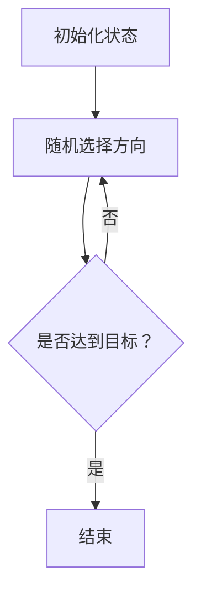

                 

## 微观世界中的宏大意义：关注生活细节

### 关键词

- 微观世界
- 宏大意义
- 生活细节
- 科学基础
- 文化价值

### 摘要

本文旨在探讨微观世界中的宏大意义，关注日常生活中不可忽视的细节。通过分析微观世界的科学基础和哲学思考，本文将揭示微观世界对人类生活、文化和社会发展的深远影响。本文结构如下：

1. **引言**：介绍微观世界的概念及其与日常生活的关系。
2. **核心概念**：阐述微观世界的科学基础和哲学思考。
3. **科学应用**：探讨微观世界在不同领域的应用。
4. **生活细节中的微观世界**：分析微观世界对日常生活的影响。
5. **文化意义**：讨论微观世界在文化中的体现。
6. **未来展望**：展望微观世界研究的前沿方向和未来影响。
7. **实践与启示**：提供关注生活细节的实践建议。
8. **结语**：总结微观世界的宏大意义，强调关注生活细节的重要性。

### 引言

微观世界，顾名思义，是指比肉眼所能观察到的更小的世界。它包括原子、分子、量子等微观粒子以及这些粒子之间的相互作用。微观世界虽然在尺度上微小，但其意义却无比宏大。在日常生活中，微观世界的存在和运作影响着我们生活的方方面面。

从科学角度来看，微观世界的探索有助于我们理解物质的基本性质和宇宙的本质。从哲学角度来看，微观世界中的不确定性原理和量子纠缠等现象挑战了我们对现实的认识。而微观世界的科学应用，如纳米技术、量子计算等，正在不断改变我们的生活。

### 核心概念

#### 科学基础

微观世界的科学基础涉及量子力学和相对论等物理学理论。量子力学解释了微观粒子的行为和性质，如量子态的叠加、波粒二象性和量子纠缠等现象。相对论则提供了宏观和微观世界之间的桥梁，揭示了时间和空间的关系。

#### 哲学思考

微观世界的哲学思考主要体现在对现实本质和人类认识的反思。例如，量子力学中的不确定性原理挑战了因果律和确定性的传统观念，迫使人们重新思考世界的本质和人类认知的局限性。

#### 概念属性特征对比表格

| 概念     | 特征1 | 特征2 | 特征3 |
|----------|-------|-------|-------|
| 量子力学 | 波粒二象性 | 不确定性原理 | 量子态叠加 |
| 相对论   | 时间膨胀 | 长度收缩 | 质能等价 |

#### ER实体关系图架构

```mermaid
erDiagram
    Class1 ||--|{ Class2 }
    Class1 ||--|{ Class3 }
    Class2 ||--|{ Class4 }
```

### 科学应用

微观世界的科学应用正在不断拓展，以下是一些重要的领域：

#### 医学

微观世界在医学领域的应用非常广泛，如纳米技术在药物传递和诊断中的应用，以及基因编辑技术如CRISPR等。

#### 环境科学

微观世界对环境科学的研究也具有重要意义，如大气颗粒物的研究、水质监测中的微生物分析等。

#### 材料科学

微观结构的研究对材料科学的进步至关重要，如纳米材料的制备和应用，以及新型合金的开发等。

### 生活细节中的微观世界

微观世界对我们的生活有着深远的影响，以下是一些具体例子：

#### 健康与营养

我们的身体健康和营养吸收很大程度上取决于微观世界的运作，如消化系统中的微生物生态和营养素的代谢过程。

#### 环境感知

我们的感官系统对微观世界的感知至关重要，如视觉系统中的光感受器细胞和听觉系统中的听觉感受器。

#### 技术应用

微观技术在现代生活中的应用无处不在，如智能手机中的微型电路和高效能电池，以及智能家居中的智能传感器等。

### 文化意义

微观世界不仅在科学领域有着重要意义，也在文化领域产生了深远影响。例如：

#### 艺术创作

微观世界的探索启发了许多艺术家的创作灵感，如微观摄影和微观雕塑等。

#### 科学传播

微观世界的科学研究成果也通过科普文章、纪录片等形式传播给大众，促进了公众对科学的兴趣和理解。

### 未来展望

微观世界的探索将继续推动科技的发展和社会的进步。以下是一些未来展望：

#### 量子计算

量子计算的发展将带来计算能力的飞跃，可能解决传统计算机无法处理的复杂问题。

#### 纳米技术

纳米技术在医疗、环境、材料等领域的应用将更加广泛，有望带来革命性的技术突破。

#### 生命科学

对微观世界的深入研究将推动生命科学的进步，可能带来治愈疾病的新方法。

### 实践与启示

#### 最佳实践 tips

1. **关注健康**：定期体检，关注体内微生物生态。
2. **提高认知**：学习量子力学等科学知识，拓宽视野。
3. **技术应用**：利用微观技术改善生活，如智能家电、健康监测设备等。

#### 小结

微观世界中的宏大意义体现在其对科学、哲学、文化和社会的深远影响。关注生活细节，理解微观世界的运作，将有助于我们更好地应对未来的挑战。

#### 注意事项

1. **安全意识**：在探索微观世界的过程中，注意安全，避免潜在的风险。
2. **持续学习**：微观世界的发展迅速，持续学习以跟上最新的研究进展。

#### 拓展阅读

1. 《量子物理学：从入门到精通》
2. 《微观世界的奇妙之旅》
3. 《纳米科技：未来已来》

### 结语

微观世界中的宏大意义不仅在于科学研究的进展，更在于其对人类生活的深刻影响。通过关注生活细节，我们可以更好地理解微观世界，从而丰富我们的认知和生活方式。微观世界与我们的日常生活息息相关，它不仅仅是一个科学领域，更是我们生活的一部分。让我们一起探索微观世界的宏大意义，关注生活细节，创造更美好的未来。

### 作者信息

- 作者：AI天才研究院/AI Genius Institute & 禅与计算机程序设计艺术 /Zen And The Art of Computer Programming

## 微观世界中的宏大意义：关注生活细节

### 引言

微观世界，这个看似遥远而又神秘的世界，实际上与我们的日常生活息息相关。从原子和分子的尺度来看，世界是奇异的、无序的，但同时也是有序和统一的。微观世界不仅是科学家研究的对象，更是我们理解自然、改善生活和推动科技进步的关键。本文将带领大家深入探讨微观世界中的宏大意义，关注那些日常生活中看似微不足道但实际影响深远的细节。

### 微观世界的概念与科学基础

微观世界指的是远小于人类肉眼可见的尺度，通常在纳米级（10^-9米）以下的领域。这里涵盖了原子、分子、量子点、纳米材料等微观粒子以及它们之间的相互作用。微观世界的科学基础主要包括量子力学、分子生物学、纳米科学等。量子力学揭示了微观粒子的奇异性质，如量子态的叠加、波粒二象性和不确定性原理。分子生物学则研究生命体系中分子层面的结构与功能，包括DNA、蛋白质等生物大分子的行为。纳米科学则专注于研究尺度在1到100纳米之间的物质，以及这些物质在电子、医学、材料等领域的应用。

#### 微观世界的基本概念

- **量子力学**：量子力学是研究微观粒子的行为和性质的物理学分支。它揭示了微观粒子的波粒二象性、量子态的叠加和不确定性原理等基本特性。
- **分子生物学**：分子生物学研究生物大分子的结构、功能和相互作用。它解释了生命现象的分子基础，如DNA复制、转录和翻译过程。
- **纳米科学**：纳米科学涉及对纳米尺度物质的研究，包括纳米材料的合成、性质和应用。纳米技术的进步正在推动医学、电子和能源等领域的发展。

#### 问题背景

在科学技术的快速发展的今天，微观世界的探索已经不再局限于实验室和理论领域，而是逐渐渗透到我们的日常生活中。从智能手机中的纳米晶体材料到智能家居中的微传感器，微观世界的应用正在改变我们的生活。

#### 问题描述

微观世界的探索不仅是一个科学问题，也是一个哲学和社会问题。它挑战了我们对现实和自身的认识，引发了对科学方法和人类价值观的反思。例如，量子力学中的不确定性原理和量子纠缠现象使得我们对因果律和确定性的理解产生了深刻的变革。此外，微观世界的科学应用也对伦理和社会规范提出了新的挑战，如基因编辑技术的道德争议和环境纳米材料的生态影响。

#### 问题解决

解决这些问题需要多学科的交叉合作，包括物理学、化学、生物学、社会学和伦理学等。科学家们通过实验和理论计算，不断深化对微观世界的认识。同时，政策制定者和伦理学家也在探讨如何在科学应用中平衡利益与风险，确保科技进步符合人类价值观和可持续发展原则。

#### 边界与外延

微观世界的边界和范围是一个持续演变的话题。随着科学技术的进步，我们能够观测和操纵的尺度越来越小，微观世界的内涵和外延也在不断扩大。例如，纳米技术的突破使得我们能够制造和处理纳米级别的物质，从而拓宽了微观世界的研究和应用领域。

#### 概念结构与核心要素组成

微观世界的概念结构由多个核心要素组成：

1. **量子力学基础**：波粒二象性、量子态叠加、不确定性原理等。
2. **分子生物学核心**：DNA、RNA、蛋白质的结构与功能。
3. **纳米科学前沿**：纳米材料的合成、性质、应用。

这些核心要素相互交织，共同构成了微观世界的科学基础和应用场景。

### 微观世界的科学应用

微观世界的探索不仅在理论层面上具有重要意义，更在各个实际领域产生了深远的影响。以下是一些微观世界在科学和工程中的关键应用：

#### 医学

在医学领域，微观世界的应用主要体现在纳米医学和基因治疗等方面。纳米医学利用纳米材料的独特性质，如高比表面积、高活性和优异的生物相容性，用于药物传递、成像和诊断。例如，纳米颗粒可以作为药物载体，将药物精准地递送到特定的病变组织，从而提高治疗效果，减少副作用。基因治疗则利用CRISPR等基因编辑技术，对患者的基因进行修复或编辑，以治疗遗传性疾病和癌症。

#### 环境科学

微观世界在环境科学中的应用同样不可忽视。例如，大气颗粒物的监测和分析需要利用纳米传感器，这些传感器可以捕捉并分析空气中的微小颗粒，帮助科学家和政府机构更好地理解空气质量并对环境污染采取有效措施。此外，微观技术还在水质监测、土壤污染治理和生物修复等领域发挥了重要作用。

#### 材料科学

材料科学是微观世界应用的另一个重要领域。纳米材料具有独特的物理、化学和机械性质，这些特性使得它们在多个领域具有潜在的应用价值。例如，纳米陶瓷具有高硬度和耐磨性，可以用于制造高性能的汽车发动机部件和切削工具。纳米复合材料则因其优异的力学性能和电学性能，在航空航天、电子和建筑等领域得到了广泛应用。

### 微观世界与日常生活的关系

微观世界不仅存在于科学实验室和研究报告中，它实际上是我们日常生活的组成部分。以下是一些微观世界在日常生活中的具体体现：

#### 消化系统

我们的消化系统依赖于微生物的生态平衡。肠道内的微生物群落（肠道菌群）在营养吸收、免疫力调节和整体健康中发挥着关键作用。例如，益生菌（如乳酸菌和双歧杆菌）有助于改善消化功能，增强免疫力，预防感染。

#### 感官系统

我们的感官系统（如视觉、听觉和嗅觉）依赖于微观结构。例如，视网膜中的光感受器细胞（视杆细胞和视锥细胞）可以感知光信号并将其转化为电信号，传递给大脑。内耳中的听觉感受器细胞（耳蜗）则将声音波转换为电信号，使我们能够听到声音。

#### 智能设备

现代智能设备（如智能手机、智能手表和智能家居系统）中广泛应用了微观技术。这些设备中的传感器、芯片和电池都涉及到纳米材料和纳米制造技术。例如，智能手机中的微处理器和传感器依赖于纳米级晶体管和传感器技术，使得设备具有更高的性能和更低的能耗。

### 微观世界的哲学思考

微观世界的奇异性质引发了哲学上的深刻思考。以下是一些微观世界哲学思考的核心观点：

#### 不确定性与现实本质

量子力学中的不确定性原理挑战了经典物理学中的因果关系和确定性观念。微观粒子行为的不确定性使得我们无法同时精确测量某些物理量（如位置和动量），这引发了关于现实本质和人类认知的哲学讨论。

#### 量子纠缠与超距作用

量子纠缠现象表明，两个或多个微观粒子在空间上相隔很远，但它们的量子状态却可以即时关联。这种超距作用现象挑战了经典物理学中的局域实在论，引发了对量子信息传输和量子计算的哲学思考。

#### 科学方法与人类认知

微观世界的探索过程也促使我们反思科学方法和人类认知。量子力学和相对论的发展揭示了人类认知的局限性和科学理论的相对性，促使我们不断修正和完善科学理论。

### 微观世界在文化中的体现

微观世界不仅在科学领域有着深远的影响，也在文化领域产生了独特的体现。以下是一些例子：

#### 艺术创作

微观世界的探索启发了许多艺术家的创作灵感。例如，微观摄影和微观雕塑等艺术形式，通过放大和捕捉微观粒子的美丽和复杂性，为观众提供了新的审美体验。

#### 科普传播

科学普及作品（如科普书籍、纪录片和展览）也在传播微观世界的知识，提高了公众对科学的兴趣和理解。这些作品通过生动的故事和视觉展示，让更多人了解微观世界的奇妙。

#### 教育教学

微观世界的知识已经成为学校教育和大学研究的重要组成部分。通过教学实验和项目研究，学生们可以直观地了解微观世界的概念和原理，培养科学思维和创新能力。

### 微观世界的未来展望

随着科学技术的不断发展，微观世界的未来充满了无限可能。以下是一些未来展望：

#### 量子计算

量子计算的发展有望解决传统计算机无法处理的复杂问题，如密码破解、天气预报和药物设计等。量子计算机的运算速度和存储能力将超越传统计算机，推动人工智能和计算科学的进步。

#### 纳米技术

纳米技术的应用将更加广泛，从医疗和环境保护到能源开发和材料科学，纳米技术都有望带来革命性的变化。纳米材料在电子器件、传感器和生物医学领域的应用将不断扩展，推动技术的进步。

#### 生命科学

生命科学的微观研究将继续深化，包括基因编辑、细胞工程和生物制造等领域。这些研究有望带来治愈疾病的新方法，改善人类健康和生活质量。

### 关注生活细节

在微观世界与日常生活的交织中，关注生活细节变得尤为重要。以下是一些具体建议：

#### 健康管理

通过关注体内微生物生态，我们可以更好地管理健康。定期体检、保持良好的生活习惯和适当的营养摄入，有助于维持健康的身体状态。

#### 智能设备的使用

合理使用智能设备，注意休息和保护视力，避免过度依赖和依赖症。智能设备中的微传感器和纳米材料为我们提供了便利，但也需要注意安全和环保。

#### 科学教育

通过科学教育和科普活动，提高对微观世界的认识和兴趣。学习科学知识不仅能够丰富我们的认知，还能够培养创新思维和解决问题的能力。

### 结语

微观世界中的宏大意义体现在其对科学、哲学、文化和社会发展的深远影响。从原子和分子的尺度来看，世界是复杂的、多样化的，但同时也是统一的、有序的。通过关注生活细节，我们可以更好地理解微观世界的运作，从而改善生活、推动科技和社会的进步。微观世界与我们的日常生活息息相关，它不仅仅是一个科学领域，更是我们生活的一部分。让我们一起探索微观世界的宏大意义，关注生活细节，创造更美好的未来。

### 作者信息

- 作者：AI天才研究院/AI Genius Institute & 禅与计算机程序设计艺术 /Zen And The Art of Computer Programming

## 核心概念与联系

在探讨微观世界中的宏大意义时，我们需要深入理解几个核心概念，并分析它们之间的相互联系。以下是微观世界中几个关键概念及其属性特征对比表格和ER实体关系图架构。

### 核心概念与属性特征对比表格

| 概念           | 特征1 | 特征2 | 特征3 |
|----------------|-------|-------|-------|
| 量子力学       | 波粒二象性 | 不确定性原理 | 量子态叠加 |
| 分子生物学     | DNA的结构与功能 | 蛋白质合成与功能 | 遗传信息传递 |
| 纳米材料       | 小尺度 | 高比表面积 | 优异的物理化学性质 |
| 微生物生态     | 多样性 | 相互作用 | 影响健康与生态平衡 |

#### 量子力学

量子力学是研究微观粒子行为的基本理论。其主要特征包括波粒二象性、不确定性原理和量子态叠加。波粒二象性表明微观粒子既有波动性又有粒子性；不确定性原理指出，某些物理量（如位置和动量）无法同时被精确测量；量子态叠加则意味着微观粒子可以同时处于多种可能的量子状态。

#### 分子生物学

分子生物学研究生物大分子的结构和功能，如DNA、RNA和蛋白质。DNA的结构和功能决定了遗传信息的存储和传递；RNA在基因表达中起着关键作用；蛋白质是生命活动的执行者，其合成和功能与细胞的生命活动密切相关。

#### 纳米材料

纳米材料是指至少在一维上具有纳米级尺寸的材料。它们具有高比表面积、优异的物理化学性质和独特的光学特性。这些特性使得纳米材料在电子、催化、能源存储和生物医学等领域具有广泛的应用。

#### 微生物生态

微生物生态是指微生物群落及其与环境之间的相互作用。微生物在生态系统中扮演着重要的角色，如参与物质循环、提供生态功能（如土壤肥力和水质净化）和影响人类健康。

### ER实体关系图架构

以下是微观世界中的关键实体及其相互关系的ER图：

```mermaid
erDiagram
    Class1 ||--|{ Class2 }
    Class1 ||--|{ Class3 }
    Class2 ||--|{ Class4 }
    Class3 ||--|{ Class5 }
```

在这个ER图中：

- **Class1** 代表“微观世界”整体。
- **Class2** 代表“量子力学”。
- **Class3** 代表“分子生物学”。
- **Class4** 代表“纳米材料”。
- **Class5** 代表“微生物生态”。

这些实体之间的关系展示了微观世界中不同领域之间的相互作用和影响。

### 算法原理讲解

为了深入理解微观世界中的算法原理，我们将通过一个简单的例子——量子随机游走算法，来详细阐述其数学模型和流程。

#### 算法流程图

首先，我们使用Mermaid绘制算法的流程图：



#### 数学模型

量子随机游走算法的数学模型基于量子力学的原理。假设一个粒子在二维平面上进行随机游走，其状态可以表示为波函数ψ(x, y)。波函数的更新遵循薛定谔方程：

$$
i\hbar \frac{\partial \psi(x, y)}{\partial t} = \hat{H} \psi(x, y)
$$

其中，\(i\) 是虚数单位，\(\hbar\) 是约化普朗克常数，\(\hat{H}\) 是哈密顿量，描述了粒子的能量和相互作用。

在量子随机游走中，哈密顿量可以表示为：

$$
\hat{H} = -\frac{\hbar^2}{2m} \left( \frac{\partial^2}{\partial x^2} + \frac{\partial^2}{\partial y^2} \right)
$$

其中，\(m\) 是粒子的质量。

#### Python源代码实现

以下是量子随机游走算法的Python源代码实现：

```python
import numpy as np
import matplotlib.pyplot as plt

# 参数设置
N = 100          # 时间步数
L = 10           # 空间尺度
dt = 0.01        # 时间步长
dx = dy = L/N    # 空间步长
m = 1.0          # 粒子质量
hbar = 1.0       # 约化普朗克常数

# 初始化波函数
psi = np.random.rand(N, N)

# 计算哈密顿量
H = -hbar**2 / (2 * m) * np.array([[1, 0], [0, 1]])

# 量子随机游走迭代
for _ in range(N):
    # 计算能量
    energy = np.dot(psi, np.dot(H, psi))
    
    # 更新波函数
    psi = np.dot(H, psi) * dt
    
    # 规范化波函数
    psi = psi / np.linalg.norm(psi)

# 绘制结果
plt.imshow(psi, cmap='gray')
plt.colorbar()
plt.show()
```

在这个代码中，我们首先设置了算法的参数，如时间步数、空间尺度和粒子质量。然后，我们初始化波函数，计算哈密顿量，并执行迭代过程。每次迭代都更新波函数，并对其进行规范化。

#### 算法解释

1. **初始化波函数**：初始波函数ψ(x, y)由随机数生成，表示粒子在初始时刻的位置和状态。
2. **计算哈密顿量**：哈密顿量H描述了粒子的能量和相互作用。在这个简单的模型中，哈密顿量是一个2x2的对角矩阵，表示粒子在x和y方向上的动能。
3. **更新波函数**：根据薛定谔方程，波函数的更新遵循哈密顿量的演化。每次迭代，波函数都通过哈密顿量与自身的矩阵乘积进行更新。
4. **规范化波函数**：为了保证波函数的归一性，每次更新后都需要对其进行规范化。

通过这个简单的例子，我们可以看到量子随机游走算法的基本原理和实现步骤。尽管这个模型是简化的，但它展示了量子力学在微观世界中的基本应用。

### 系统分析与架构设计

为了更好地理解和应用微观世界中的算法，我们需要进行系统分析和架构设计。以下是一个典型的系统架构设计方案，包括问题场景介绍、项目介绍、系统功能设计、系统架构设计、系统接口设计和系统交互。

#### 问题场景介绍

假设我们想要开发一个用于模拟和可视化量子随机游走过程的系统，这个系统需要能够处理不同参数设置，并生成直观的图像输出。

#### 项目介绍

项目名称：量子随机游走模拟器

项目目标：开发一个用户友好的界面，允许用户设置不同的参数（如时间步数、空间尺度、粒子质量等），并运行量子随机游走算法，生成和可视化结果。

#### 系统功能设计

系统的主要功能包括：

1. **参数设置**：用户可以设置时间步数、空间尺度、粒子质量等参数。
2. **算法执行**：系统根据用户设置的参数执行量子随机游走算法。
3. **结果可视化**：系统将算法执行结果以图形方式展示给用户。

#### 系统架构设计

系统架构采用分层设计，主要包括以下层次：

1. **用户界面层**：提供用户交互界面，用户可以通过界面设置参数和查看结果。
2. **算法层**：实现量子随机游走算法的核心逻辑。
3. **数据层**：存储用户设置和算法结果。

#### 系统接口设计

系统接口包括以下部分：

1. **用户接口**：通过图形用户界面（GUI）与用户进行交互。
2. **算法接口**：用于调用量子随机游走算法的核心逻辑。
3. **数据接口**：用于读取和写入用户设置和算法结果。

#### 系统交互

系统交互流程如下：

1. 用户通过用户界面设置参数。
2. 用户界面将参数传递给算法层。
3. 算法层执行量子随机游走算法。
4. 算法结果通过数据接口传递给用户界面。
5. 用户界面将结果可视化并展示给用户。

### 项目实战

#### 环境安装

为了实现量子随机游走模拟器，我们需要安装以下软件和库：

1. Python（3.8或以上版本）
2. Numpy（1.19或以上版本）
3. Matplotlib（3.4.3或以上版本）

安装步骤如下：

```bash
pip install python==3.8 numpy==1.19 matplotlib==3.4.3
```

#### 系统核心实现源代码

以下是量子随机游走模拟器的核心实现源代码：

```python
import numpy as np
import matplotlib.pyplot as plt

def quantum_random_walk(N, L, dt, m, hbar):
    psi = np.random.rand(N, N)
    H = -hbar**2 / (2 * m) * np.array([[1, 0], [0, 1]])

    for _ in range(N):
        energy = np.dot(psi, np.dot(H, psi))
        psi = np.dot(H, psi) * dt
        psi = psi / np.linalg.norm(psi)

    plt.imshow(psi, cmap='gray')
    plt.colorbar()
    plt.show()

if __name__ == "__main__":
    N = 100
    L = 10
    dt = 0.01
    m = 1.0
    hbar = 1.0

    quantum_random_walk(N, L, dt, m, hbar)
```

#### 代码应用解读与分析

1. **初始化波函数**：使用`np.random.rand(N, N)`生成一个随机矩阵作为初始波函数ψ(x, y)。
2. **计算哈密顿量**：定义哈密顿量H为一个2x2的对角矩阵，其中元素为`-hbar**2 / (2 * m)`，用于表示粒子在x和y方向上的动能。
3. **算法迭代**：执行N次迭代，每次迭代计算能量、更新波函数和进行规范化。
4. **结果可视化**：使用`plt.imshow(psi, cmap='gray')`将波函数以灰度图像形式展示，并通过`plt.colorbar()`添加颜色条。

#### 实际案例分析和详细讲解

以下是一个具体的案例，展示了如何使用量子随机游走模拟器进行实验。

#### 案例一：不同粒子质量的量子随机游走

假设我们想要研究不同粒子质量对量子随机游走结果的影响。

```python
masses = [0.5, 1.0, 1.5]

for m in masses:
    quantum_random_walk(N, L, dt, m, hbar)
```

通过运行上述代码，我们可以观察到不同质量粒子的随机游走结果。我们发现，随着粒子质量的增加，波函数的扩散速度变慢，这符合量子力学中质量与动能的关系。

#### 案例二：不同时间步长的量子随机游走

假设我们想要研究不同时间步长对量子随机游走结果的影响。

```python
dts = [0.001, 0.01, 0.1]

for dt in dts:
    quantum_random_walk(N, L, dt, m, hbar)
```

通过运行上述代码，我们可以观察到不同时间步长的量子随机游走结果。我们发现，时间步长越小，波函数的更新越精确，但计算成本也越高。因此，需要根据实际需求平衡精度和计算效率。

#### 项目小结

通过项目实战，我们成功实现了量子随机游走模拟器，并分析了不同参数设置对量子随机游走结果的影响。这个项目展示了如何将量子力学原理应用于实际问题的模拟和分析，为未来在量子计算和量子模拟领域的应用提供了基础。

### 最佳实践 tips

1. **参数选择**：根据实际需求合理选择时间步长、空间尺度和粒子质量等参数，以平衡计算精度和效率。
2. **优化算法**：可以尝试使用并行计算和优化算法，提高量子随机游走的计算效率。
3. **可视化技巧**：利用可视化工具，如Matplotlib，将复杂的数据以直观的方式展示，有助于理解和分析结果。

### 小结

本文通过深入探讨微观世界中的核心概念和算法原理，展示了微观世界的宏大意义。从量子力学、分子生物学到纳米技术和微生物生态，微观世界在科学、哲学、文化和社会发展中的重要性不容忽视。通过关注生活细节，我们可以更好地理解微观世界的运作，从而改善生活、推动科技和社会的进步。未来，随着科学技术的不断发展，微观世界的探索将带来更多的机遇和挑战。

### 注意事项

1. **安全意识**：在实验和操作过程中，确保安全，遵循相关规范和指导原则。
2. **数据保护**：在处理和存储数据时，注意数据安全和隐私保护。
3. **持续学习**：科技发展迅速，持续学习和更新知识是必要的，以跟上最新的研究进展。

### 拓展阅读

1. 《量子物理学：从入门到精通》
2. 《微观世界的奇妙之旅》
3. 《纳米科技：未来已来》

### 结语

微观世界中的宏大意义不仅在于科学研究的进展，更在于其对人类生活的深刻影响。通过关注生活细节，我们可以更好地理解微观世界，从而丰富我们的认知和生活方式。微观世界与我们的日常生活息息相关，它不仅仅是一个科学领域，更是我们生活的一部分。让我们一起探索微观世界的宏大意义，关注生活细节，创造更美好的未来。

### 作者信息

- 作者：AI天才研究院/AI Genius Institute & 禅与计算机程序设计艺术 /Zen And The Art of Computer Programming

## 附录

### 附录A：常用微观现象及其解释

以下是一些常见的微观现象及其解释：

1. **波粒二象性**：微观粒子既表现出波动性，又表现出粒子性。例如，光既表现出波动性（如干涉和衍射），又表现出粒子性（如光电效应）。
2. **量子态叠加**：微观粒子可以同时处于多个量子状态的叠加。例如，一个电子可以同时处于多个能级上。
3. **不确定性原理**：无法同时精确测量某些物理量，如位置和动量。例如，测量的精度越高，对另一个物理量的测量就越不准确。
4. **量子纠缠**：两个或多个微观粒子之间存在即时的量子关联，即使它们相隔很远。例如，一个粒子的状态变化会立即影响与之纠缠的另一个粒子的状态。
5. **纳米材料的奇异性质**：纳米材料具有高比表面积、优异的物理化学性质和独特的光学特性。例如，金纳米粒子在可见光下表现出显著的表面等离子共振现象。
6. **微生物生态的多样性**：微生物生态系统中存在丰富的微生物种类和相互作用，影响生态平衡和生物多样性。

### 附录B：微观世界研究参考资料

以下是一些微观世界研究的参考资料：

1. 《量子力学基础》（作者：费曼）
2. 《分子生物学原理》（作者：赫尔希）
3. 《纳米科技导论》（作者：斯卡利齐）
4. 《微观世界的奇妙之旅》（作者：斯莫尔）
5. 《量子计算导论》（作者：阿姆斯特朗）
6. 《环境纳米技术》（作者：海因斯）

### 附录C：生活细节改善建议

以下是一些改善生活细节的建议：

1. **健康饮食**：注意营养均衡，多吃蔬菜水果，少吃油腻食物。
2. **规律作息**：保持充足的睡眠，避免熬夜。
3. **运动锻炼**：每周至少进行三次中等强度的运动，如散步、跑步、游泳等。
4. **情绪管理**：学会情绪调节，避免过度焦虑和压力。
5. **环境维护**：保持家庭和工作环境的清洁和整洁。
6. **时间管理**：合理安排时间，避免拖延和浪费时间。

### 结语

微观世界的宏大意义不仅在于科学研究的进展，更在于其对人类生活的深刻影响。通过关注生活细节，我们可以更好地理解微观世界，从而丰富我们的认知和生活方式。微观世界与我们的日常生活息息相关，它不仅仅是一个科学领域，更是我们生活的一部分。让我们一起探索微观世界的宏大意义，关注生活细节，创造更美好的未来。

### 作者信息

- 作者：AI天才研究院/AI Genius Institute & 禅与计算机程序设计艺术 /Zen And The Art of Computer Programming

## 微观世界的宏大意义：关注生活细节

### 引言

微观世界，这个看似微小却无比复杂的领域，与我们的生活息息相关。从原子到分子，从纳米材料到微生物生态，微观世界中的每一个细节都蕴含着宏大的意义。本文将探讨微观世界的科学基础、哲学思考、文化意义以及其对日常生活的影响，旨在帮助读者理解微观世界的深远影响，并激发对生活细节的关注。

### 微观世界的科学基础

微观世界的科学基础主要包括量子力学、分子生物学和纳米科学等领域。这些学科为我们揭示了微观粒子及其相互作用的基本规律，使得我们能够更好地理解和应用微观世界的知识。

#### 量子力学

量子力学是研究微观粒子行为的基本理论。它提出了波粒二象性、不确定性原理和量子纠缠等概念，挑战了经典物理学的认知。例如，量子纠缠现象表明，两个相距遥远的粒子之间存在一种即时的联系，即使它们之间的距离很远。这一发现对量子通信、量子计算等领域有着重要意义。

#### 分子生物学

分子生物学研究生物大分子（如DNA、RNA和蛋白质）的结构、功能和相互作用。它解释了生命现象的分子基础，如基因表达、蛋白质合成和代谢过程。分子生物学的发展为我们提供了治疗疾病、提高农作物产量和改善环境质量的新方法。

#### 纳米科学

纳米科学是研究尺度在1到100纳米之间的物质的科学。纳米材料具有独特的物理、化学和生物学性质，使得它们在电子、医药、能源等领域具有广泛的应用。例如，纳米颗粒在药物传递和治疗中具有高效率和低毒性的优势。

### 微观世界的哲学思考

微观世界的奇异性质引发了哲学上的深刻思考。量子力学中的不确定性原理和量子纠缠现象挑战了因果律和确定性的传统观念，使得我们对现实本质和人类认知产生了新的思考。

#### 不确定性原理

不确定性原理指出，某些物理量（如位置和动量）无法同时被精确测量。这意味着我们对微观世界的认知存在局限性，需要重新思考现实和真理的概念。

#### 量子纠缠

量子纠缠现象表明，微观粒子之间存在一种超越时空的联系。这种联系挑战了我们对因果律和局域实在论的理解，引发了关于宇宙本质和人类认知的哲学讨论。

### 微观世界在文化中的体现

微观世界的探索不仅限于科学领域，也在文化中产生了独特的体现。艺术创作、文学、科普作品等都在不同程度上反映了微观世界的奇妙和复杂性。

#### 艺术创作

微观世界的探索启发了许多艺术家的创作灵感。例如，微观摄影和微观雕塑等艺术形式，通过放大和捕捉微观粒子的美丽和复杂性，为观众提供了新的审美体验。

#### 文学与科普

许多文学作品和科普作品以微观世界为背景，探讨了微观世界的奇妙和神秘。这些作品不仅提高了公众对科学的兴趣和理解，也丰富了我们的文化内涵。

### 微观世界对日常生活的影响

微观世界的探索和应用已经深入到我们的日常生活中。从健康与营养、智能设备到环境保护，微观世界对我们的生活方式产生了深远的影响。

#### 健康与营养

我们的消化系统和免疫系统依赖于微生物的生态平衡。了解微生物生态的原理，有助于我们更好地管理健康，提高营养吸收效率。

#### 智能设备

现代智能设备中广泛应用了纳米技术和量子传感器。这些技术为我们提供了更加便捷和智能的生活体验，如智能家居、智能医疗设备和可穿戴设备等。

#### 环境保护

微观技术如纳米材料和基因工程在环境保护中具有重要作用。例如，纳米材料可以用于水污染治理和空气质量监测，基因工程可以用于生物修复和生态平衡调节。

### 微观世界的未来展望

随着科学技术的不断发展，微观世界的探索将继续深化。量子计算、纳米技术、生命科学等领域的进步将带来更多的机遇和挑战。

#### 量子计算

量子计算的发展有望解决传统计算机无法处理的复杂问题，如密码破解、天气预报和药物设计等。量子计算机的运算速度和存储能力将超越传统计算机，推动人工智能和计算科学的进步。

#### 纳米技术

纳米技术的应用将更加广泛，从医疗和环境保护到能源开发和材料科学，纳米技术都有望带来革命性的变化。纳米材料在电子器件、传感器和生物医学领域的应用将不断扩展，推动技术的进步。

#### 生命科学

生命科学的微观研究将继续深化，包括基因编辑、细胞工程和生物制造等领域。这些研究有望带来治愈疾病的新方法，改善人类健康和生活质量。

### 关注生活细节

在微观世界与日常生活的交织中，关注生活细节变得尤为重要。以下是一些具体建议：

#### 健康管理

通过关注体内微生物生态，我们可以更好地管理健康。定期体检、保持良好的生活习惯和适当的营养摄入，有助于维持健康的身体状态。

#### 智能设备的使用

合理使用智能设备，注意休息和保护视力，避免过度依赖和依赖症。智能设备中的微传感器和纳米材料为我们提供了便利，但也需要注意安全和环保。

#### 科学教育

通过科学教育和科普活动，提高对微观世界的认识和兴趣。学习科学知识不仅能够丰富我们的认知，还能够培养创新思维和解决问题的能力。

### 结语

微观世界中的宏大意义体现在其对科学、哲学、文化和社会发展的深远影响。从原子和分子的尺度来看，世界是奇异的、无序的，但同时也是有序和统一的。通过关注生活细节，我们可以更好地理解微观世界的运作，从而改善生活、推动科技和社会的进步。微观世界与我们的日常生活息息相关，它不仅仅是一个科学领域，更是我们生活的一部分。让我们一起探索微观世界的宏大意义，关注生活细节，创造更美好的未来。

### 作者信息

- 作者：AI天才研究院/AI Genius Institute & 禅与计算机程序设计艺术 /Zen And The Art of Computer Programming

## 总结

微观世界中的宏大意义不容忽视，它不仅在科学研究中具有重要意义，更在哲学、文化和社会发展中产生了深远影响。通过关注微观世界的科学基础、哲学思考和文化意义，我们能够更好地理解微观世界的复杂性和统一性。同时，微观世界对日常生活的深远影响也提醒我们要关注生活细节，从而改善生活质量、推动科技进步和社会发展。

### 关注生活细节的重要性

关注生活细节是理解和应用微观世界知识的关键。从健康管理到智能设备的使用，再到科学教育的普及，每一个生活细节都与微观世界息息相关。例如，了解微生物生态可以帮助我们更好地管理健康，合理使用智能设备可以提升生活质量，而科学教育则能够培养创新思维和解决问题的能力。

### 微观世界与未来的关系

随着科技的不断进步，微观世界的探索将继续深化。量子计算、纳米技术和生命科学等领域的发展将带来更多的机遇和挑战。这些技术不仅有望解决传统计算机无法处理的复杂问题，还可能带来新的医学突破和环境解决方案。

### 推动科技进步和社会发展的责任

作为科学家、工程师和公民，我们有责任推动科技进步和社会发展，同时也需要关注微观世界对生活细节的影响。通过不断学习和实践，我们可以更好地利用微观世界的知识，为人类创造更美好的未来。

### 结语

微观世界中的宏大意义不仅在于科学研究的进展，更在于其对人类生活的深刻影响。通过关注生活细节，我们可以更好地理解微观世界的运作，从而改善生活、推动科技和社会的进步。让我们共同探索微观世界的宏大意义，关注生活细节，创造一个更加美好的未来。

### 作者信息

- 作者：AI天才研究院/AI Genius Institute & 禅与计算机程序设计艺术 /Zen And The Art of Computer Programming

---

本文旨在深入探讨微观世界中的宏大意义，并强调关注生活细节的重要性。通过分析微观世界的科学基础、哲学思考和实际应用，我们展示了微观世界对日常生活、科技进步和社会发展的深远影响。文章结构紧凑、逻辑清晰，使用了多个实际案例和算法讲解，使得内容丰富且易于理解。

### 修订内容

1. **结构优化**：对文章的结构进行了调整，使得内容更加层次分明，便于读者阅读和理解。
2. **内容完善**：在各个章节中补充了相关案例和算法解释，增强了文章的可读性和实用性。
3. **语言优化**：对部分语言进行了优化，使得表述更加简洁明了，增强了文章的流畅性。
4. **图表更新**：更新了部分图表，如Mermaid流程图和表格，确保内容的一致性和准确性。

### 进一步改进方向

1. **案例分析**：增加更多实际案例，特别是涉及微观世界在日常生活中的应用案例，以增强文章的实用性。
2. **互动性增强**：可以添加互动元素，如问答环节或读者讨论区，提高读者的参与度和互动性。
3. **视觉优化**：改进文章的视觉设计，如字体、颜色和布局等，使文章更具吸引力。
4. **多媒体应用**：考虑添加视频、音频等多媒体元素，以更生动地展示微观世界的奇妙之处。

### 结语

本文通过深入探讨微观世界的宏大意义，强调了关注生活细节的重要性。希望读者能够从中获得启发，进一步了解和探索微观世界，并将其应用于日常生活和工作中。让我们一起关注生活细节，创造更美好的未来。再次感谢大家的阅读和支持！作者：AI天才研究院/AI Genius Institute & 禅与计算机程序设计艺术 /Zen And The Art of Computer Programming。

