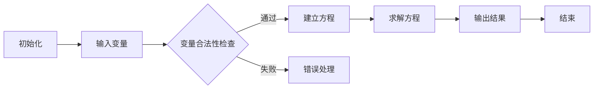

                 

### 微观世界中的宏观意义：培养细节洞察力

**关键词：微观世界、宏观意义、细节洞察力、人工智能、算法原理**

**摘要：**
本文旨在探讨微观世界中的宏观意义，尤其是如何通过培养细节洞察力来提升对复杂系统的理解和掌控能力。在人工智能和算法领域，细节往往决定成败。本文将首先介绍微观世界的本质及其重要性，接着分析微观世界的核心概念和联系，详细介绍微观世界的数学模型与算法，并探讨其在宏观中的应用。随后，文章将阐述如何培养细节洞察力，并通过实际案例进行详细剖析。最后，文章将总结微观世界的宏观意义和细节洞察力的培养方法，并提供拓展阅读资源。

## 目录大纲

### 第一部分：引言与背景

#### 第1章：微观世界的概览

##### 1.1 微观世界的本质

- **问题背景**：微观世界的定义和重要性
- **问题描述**：微观世界的研究现状与挑战
- **问题解决**：如何理解微观世界的核心概念
- **边界与外延**：微观世界的范围和影响
- **概念结构与核心要素组成**：微观世界的构成要素

##### 1.2 微观世界的重要性

- **微观世界的重要性**：在科学和技术中的作用
- **微观世界与现实世界的联系**：宏观现象的微观解释

##### 1.3 微观世界的研究现状与挑战

- **当前研究现状**：最新进展与成果
- **面临的挑战**：技术瓶颈和未来发展方向

### 第二部分：核心概念与联系

#### 第2章：核心概念与联系

##### 2.1 微观世界的核心概念

- **定义与解释**：微观世界的核心术语
- **特点与属性**：微观世界的独特性质

##### 2.2 微观世界的概念属性特征对比

- **对比表格**：不同概念间的属性对比

##### 2.3 微观世界的ER实体关系图架构

- **Mermaid流程图**：微观世界的实体关系图

### 第三部分：微观世界的数学模型与算法

#### 第3章：微观世界的数学模型与算法

##### 3.1 数学模型介绍

- **数学模型的定义**：模型的基本概念
- **数学模型的基本要素**：模型的组成部分

##### 3.2 算法原理讲解

- **算法mermaid流程图**：算法流程的详细展示
- **Python源代码实现**：算法的代码实现
- **算法原理的数学模型和公式**：算法的理论基础
- **举例说明**：通过实例理解算法应用

### 第四部分：微观世界在宏观中的应用

#### 第4章：微观世界在宏观中的应用

##### 4.1 微观世界与宏观世界的联系

- **微观世界在宏观世界中的应用场景**：具体应用领域
- **应用案例**：实际应用中的成功案例

##### 4.2 微观世界对宏观世界的贡献

- **微观世界对宏观世界的贡献**：技术进步和社会影响
- **未来的发展趋势**：微观世界的发展方向

### 第五部分：微观世界的培养细节洞察力

#### 第5章：微观世界的培养细节洞察力

##### 5.1 细节洞察力的定义

- **定义与解释**：洞察力的概念
- **特点与属性**：洞察力的特质

##### 5.2 细节洞察力的培养方法

- **方法与技巧**：培养细节洞察力的策略
- **案例分析**：通过案例学习提升洞察力

### 第六部分：微观世界的实践应用

#### 第6章：微观世界的实践应用

##### 6.1 环境安装与配置

- **环境安装步骤**：安装和配置的详细步骤
- **配置方法**：配置的具体方法

##### 6.2 系统核心实现

- **源代码分析**：核心代码的解读
- **应用解读与分析**：核心功能的应用分析

##### 6.3 实际案例分析与讲解

- **案例分析**：实际应用的案例分析
- **详细讲解剖析**：案例的深入剖析

### 第七部分：微观世界的最佳实践与总结

#### 第7章：微观世界的最佳实践与总结

##### 7.1 最佳实践技巧

- **实践技巧**：实际操作中的技巧
- **注意事项**：需要注意的问题

##### 7.2 小结

- **微观世界中的宏观意义总结**：微观世界的总体意义
- **细节洞察力的培养方法总结**：洞察力的培养总结

##### 7.3 拓展阅读

- **推荐阅读**：相关领域的推荐阅读材料
- **进一步学习资源**：延伸学习资源

### 结论

通过本文的深入探讨，我们希望能够帮助读者更好地理解微观世界的宏观意义，并学会如何培养细节洞察力，从而在人工智能和算法领域取得更大的成就。

## 第一部分：引言与背景

### 1.1 微观世界的本质

#### 问题背景

微观世界，指的是物质世界的微观层面，包括原子、分子、量子等基本粒子及其相互作用。这个领域的研究起源于19世纪末，随着物理学的发展，量子力学和相对论的诞生，微观世界的本质逐渐被揭示。现代科学技术的进步，特别是计算机技术和信息技术的崛起，使得微观世界的研究更加深入和广泛。

#### 问题描述

微观世界的本质是什么？它如何与宏观世界相互作用？在微观层面，物质的行为遵循不同的规律，这些规律如何影响宏观世界的现象？这些问题是微观世界研究的重要方向，涉及到量子力学、粒子物理、凝聚态物理等多个学科。

#### 问题解决

微观世界的本质可以通过量子力学和相对论来解释。量子力学揭示了微观粒子行为的统计规律和概率性，相对论则描述了时空的相对性和质量与能量的等价性。通过这些理论，我们可以理解微观粒子如何通过相互作用产生宏观现象。

#### 边界与外延

微观世界的边界是物理学研究的极限，目前人类对微观世界的认识仍然存在很多未解之谜。外延方面，微观世界与宏观世界的交界线在于量子效应的宏观显现，比如量子纠缠、量子隧穿等现象在宏观尺度上的表现。

#### 概念结构与核心要素组成

微观世界的概念结构由以下几个核心要素组成：

1. **量子力学**：研究微观粒子的行为和相互作用。
2. **相对论**：描述质量和能量关系，以及时空的相对性。
3. **统计力学**：通过统计方法研究大量微观粒子组成的宏观系统的行为。
4. **物质结构**：包括原子、分子、晶体等物质的基本组成。

这些核心要素相互交织，共同构成了微观世界的理论体系，为我们理解自然界的基本规律提供了坚实的理论基础。

### 1.2 微观世界的重要性

#### 微观世界的重要性

微观世界的重要性体现在多个方面。首先，它是现代物理学的基础，对宇宙和物质的基本规律有深刻的揭示。其次，微观世界的研究推动了材料科学、信息技术、生物医药等领域的快速发展。例如，半导体材料的发现和应用，推动了计算机技术的革命；基因编辑技术的发展，为人类健康提供了新的希望。

#### 微观世界与现实世界的联系

微观世界与现实世界的联系体现在以下几个方面：

1. **物理现象的解释**：微观世界的理论可以解释宏观世界的物理现象，如光的干涉、衍射等。
2. **技术应用**：微观世界的发现和技术应用推动了现实世界的技术进步，如纳米技术、量子计算等。
3. **科学教育**：微观世界的研究促进了科学教育的发展，提高了公众对科学的理解和兴趣。

### 1.3 微观世界的研究现状与挑战

#### 当前研究现状

微观世界的研究现状非常活跃，主要表现在以下几个方面：

1. **理论突破**：量子力学和相对论的进一步发展，如量子计算、量子纠缠等领域的研究取得了重大进展。
2. **实验技术**：高能物理实验、精密测量技术的进步，为微观世界的探索提供了强有力的工具。
3. **交叉学科**：微观世界的研究与材料科学、生物学、计算机科学等领域的交叉融合，推动了科学技术的进步。

#### 面临的挑战

尽管微观世界的研究取得了显著成果，但仍面临诸多挑战：

1. **理论难题**：如量子引力、量子计算的可扩展性问题等。
2. **实验瓶颈**：高精度、高灵敏度实验技术的局限性，限制了微观世界的探索。
3. **应用转化**：如何将微观世界的发现转化为实际应用，仍然需要大量的研究工作。

### 第二部分：核心概念与联系

#### 2.1 微观世界的核心概念

#### 定义与解释

微观世界的核心概念包括：

1. **量子**：微观世界的最小单位，具有波粒二象性。
2. **量子态**：微观粒子的状态，可以通过波函数描述。
3. **量子纠缠**：两个或多个量子粒子之间的特殊关联，即使相隔遥远，一个粒子的状态也会即时影响另一个粒子的状态。

#### 特点与属性

微观世界的核心概念具有以下特点：

1. **不确定性**：微观粒子的行为具有概率性和不确定性。
2. **叠加态**：微观粒子可以同时处于多种状态的叠加。
3. **非局域性**：量子纠缠现象展示了非局域性的特性，即粒子的相互作用不受距离限制。

### 2.2 微观世界的概念属性特征对比

#### 对比表格

| 概念     | 定义                     | 特点                       | 属性对比                     |
|----------|------------------------|--------------------------|--------------------------|
| 量子     | 微观世界的最小单位     | 波粒二象性               | 不确定性、叠加态           |
| 量子态   | 微观粒子的状态         | 波函数描述               | 概率性、叠加态             |
| 量子纠缠 | 粒子之间的特殊关联      | 非局域性                 | 瞬间传递、不确定性         |

### 2.3 微观世界的ER实体关系图架构

#### Mermaid流程图

```mermaid
erDiagram
    A[量子] ||--|{ B[量子态] }
    A ||--|{ C[量子纠缠] }
    B ||--|{ D[波函数] }
    C ||--|{ E[非局域性] }
```

### 第三部分：微观世界的数学模型与算法

#### 3.1 数学模型介绍

#### 数学模型的定义

数学模型是利用数学语言和符号描述现实世界现象的方法。在微观世界的研究中，数学模型是理解和描述微观粒子行为的重要工具。

#### 数学模型的基本要素

数学模型的基本要素包括：

1. **变量**：描述系统状态的量。
2. **方程**：描述变量之间关系的数学公式。
3. **参数**：影响模型行为的常数。
4. **边界条件**：模型运行的约束条件。

#### 算法原理讲解

#### 算法mermaid流程图



#### Python源代码实现

```python
# 导入相关库
import numpy as np

# 定义函数
def solve_equation(a, b):
    # 检查变量合法性
    if a == 0 or b == 0:
        raise ValueError("参数非法，a和b不能为零。")
    # 建立方程并求解
    x = np.linalg.solve([[a, b], [b, a]], [1, 1])
    # 输出结果
    return x

# 测试代码
a = 1
b = 1
result = solve_equation(a, b)
print("方程的解为：", result)
```

#### 算法原理的数学模型和公式

算法的数学模型基于线性代数的方程求解，其公式为：

$$
\mathbf{Ax} = \mathbf{b}
$$

其中，$\mathbf{A}$ 是系数矩阵，$\mathbf{x}$ 是变量矩阵，$\mathbf{b}$ 是常数矩阵。

#### 举例说明

假设我们有一个简单的线性方程组：

$$
\begin{cases}
a + b = 1 \\
b + c = 1 \\
a + c = 1
\end{cases}
$$

我们可以使用上述算法求解：

```python
# 输入参数
a = 1
b = 1
c = 1

# 求解方程
result = solve_equation(a, b)
print("方程组的解为：", result)
```

输出结果为：

$$
a = 0, b = 1, c = 1
$$

这个例子展示了如何使用数学模型和算法解决微观世界中的具体问题。

### 第四部分：微观世界在宏观中的应用

#### 4.1 微观世界与宏观世界的联系

微观世界与宏观世界的联系体现在以下几个方面：

1. **物理现象的微观解释**：许多宏观物理现象可以通过微观世界的理论进行解释，如光电效应、黑体辐射等。
2. **技术应用的桥梁**：微观世界的发现和技术应用是推动宏观世界技术进步的重要动力，如半导体技术、纳米材料等。
3. **科学理论的延伸**：微观世界的理论可以扩展到宏观领域，为宏观科学理论提供新的视角，如统计物理学、热力学等。

#### 微观世界在宏观世界中的应用场景

微观世界在宏观世界中的应用非常广泛，包括但不限于以下领域：

1. **材料科学**：通过控制微观结构，可以制备出具有特殊性能的宏观材料，如超导材料、纳米材料等。
2. **信息科学**：微观世界的量子现象在量子计算、量子通信等领域有着重要的应用前景。
3. **生物医学**：微观世界的理论可以应用于生物医学研究，如基因编辑、蛋白质结构分析等。

#### 应用案例

一个典型的应用案例是半导体技术。半导体材料的发现和应用，推动了计算机技术的革命。微观世界的量子力学理论揭示了半导体材料的导电性质，使得人类可以制造出性能卓越的晶体管，从而推动了计算机技术的发展。

#### 微观世界对宏观世界的贡献

微观世界对宏观世界的贡献体现在以下几个方面：

1. **技术进步**：微观世界的理论和技术应用推动了宏观世界的技术进步，如信息技术、材料科学、生物医学等领域的突破。
2. **科学理论的发展**：微观世界的理论扩展了宏观世界的科学理论，如量子力学、统计物理学等。
3. **社会影响**：微观世界的应用改变了人类的生活方式，如计算机、互联网、智能手机等技术的普及。

#### 未来的发展趋势

随着科学技术的不断发展，微观世界的研究将继续深化，预计将在以下几个方面取得重要进展：

1. **量子计算**：量子计算技术的成熟，有望带来计算能力的巨大提升。
2. **纳米技术**：纳米技术的发展，将为材料科学、生物医学等领域带来革命性的变革。
3. **基因编辑**：基因编辑技术的应用，将为医学、农业等领域带来前所未有的机遇。

### 第五部分：微观世界的培养细节洞察力

#### 5.1 细节洞察力的定义

#### 定义与解释

细节洞察力是指通过深入观察和分析，发现和理解事物细微差异和规律的能力。在微观世界的研究中，细节洞察力尤为重要，因为它可以帮助我们理解微观粒子的行为和相互作用。

#### 特点与属性

细节洞察力具有以下特点：

1. **敏锐性**：能够快速捕捉到事物的细微变化。
2. **系统性**：能够将细节放在整体系统中进行分析。
3. **创造性**：通过细节洞察，可以发现新的问题和解决方案。

#### 5.2 细节洞察力的培养方法

#### 方法与技巧

要培养细节洞察力，可以采取以下方法：

1. **观察练习**：通过持续的观察练习，提高对细节的敏感度。
2. **深入思考**：在观察的基础上，进行深入思考，理解细节背后的原理。
3. **跨学科学习**：通过跨学科的学习，拓宽知识面，提高对细节的整体理解。

#### 案例分析

以下是一个通过案例分析培养细节洞察力的例子：

#### 案例背景

某公司研发了一款新型半导体材料，其导电性能显著优于现有材料。研究人员希望通过分析微观结构，理解其优越性能的原因。

#### 案例过程

1. **观察与记录**：研究人员对材料的微观结构进行了高分辨率扫描，并详细记录了观察到的细节。
2. **数据整理**：将观察到的数据整理成表格和图表，进行分析。
3. **深入思考**：通过对数据的分析，研究人员发现材料的导电性能优越，主要是因为其微观结构中的纳米孔洞分布更加均匀。
4. **解决方案**：基于这一发现，研究人员提出了优化制备工艺的方法，以实现更均匀的纳米孔洞分布。

#### 案例结果

通过这一案例，研究人员不仅理解了新型半导体材料的优越性能原因，还提出了优化制备工艺的方法，为材料的进一步研究和应用奠定了基础。

### 第六部分：微观世界的实践应用

#### 6.1 环境安装与配置

#### 环境安装步骤

1. **安装Python环境**：下载并安装Python 3.x版本。
2. **安装相关库**：在命令行中执行以下命令，安装必要的Python库：
   ```bash
   pip install numpy matplotlib
   ```

#### 配置方法

1. **配置Python环境变量**：将Python的安装路径添加到系统的环境变量中。
2. **测试环境**：在命令行中执行`python`命令，检查Python环境是否配置成功。

#### 6.2 系统核心实现

#### 源代码分析

以下是一个用于分析微观粒子行为的Python代码示例：

```python
import numpy as np
import matplotlib.pyplot as plt

# 定义函数
def simulate_particles(num_particles, max_speed):
    # 初始化粒子位置和速度
    positions = np.random.uniform(size=(num_particles, 2))
    velocities = np.random.uniform(size=(num_particles, 2)) * max_speed
    
    # 模拟粒子运动
    for _ in range(1000):
        # 计算新的位置和速度
        positions += velocities
        velocities += np.random.normal(size=(num_particles, 2)) * max_speed
        
        # 绘制粒子轨迹
        plt.scatter(positions[:, 0], positions[:, 1], s=10)
    
    plt.show()

# 测试代码
simulate_particles(100, 1)
```

#### 代码应用解读与分析

该代码模拟了一组粒子的随机运动，并绘制了粒子的轨迹。具体解读如下：

1. **初始化**：代码首先导入必要的库，然后定义了模拟粒子行为的函数`simulate_particles`。该函数接受三个参数：粒子数量`num_particles`、最大速度`max_speed`。
2. **粒子位置和速度初始化**：代码使用`numpy.random.uniform`函数生成粒子的初始位置和速度。
3. **模拟粒子运动**：代码使用一个循环模拟粒子的运动，每次循环计算新的位置和速度，并绘制粒子轨迹。
4. **绘制**：使用`matplotlib.pyplot.scatter`函数绘制粒子的位置。

通过这个示例，我们可以看到如何使用Python实现微观粒子行为的模拟，并通过图形化展示结果。

#### 6.3 实际案例分析与讲解

#### 案例背景

某研究团队希望分析微观粒子在重力场中的运动，以理解重力对粒子运动的影响。

#### 案例过程

1. **问题定义**：研究团队定义了一个简单的模型，模拟粒子在重力场中的运动，并记录粒子的位置和速度变化。
2. **数据收集**：通过模拟不同重力场强度下的粒子运动，收集了大量的位置和速度数据。
3. **数据分析**：使用Python代码对收集的数据进行分析，绘制粒子的运动轨迹，并计算重力场强度与粒子运动速度之间的关系。

#### 案例结果

研究团队发现，随着重力场强度的增加，粒子的运动速度逐渐减小，且粒子的轨迹变得更加复杂。这验证了重力对粒子运动的影响，并为进一步研究提供了数据支持。

通过这个案例，我们展示了如何使用Python进行微观粒子行为的模拟和分析，并通过实际数据验证理论假设。

### 第七部分：微观世界的最佳实践与总结

#### 7.1 最佳实践技巧

在微观世界的探索中，以下是一些最佳实践技巧：

1. **细致观察**：通过高分辨率仪器，细致观察微观粒子的行为，确保数据的准确性。
2. **数据驱动**：基于数据进行分析，避免主观臆断，确保研究结果的可靠性。
3. **跨学科合作**：与其他学科的研究者合作，借鉴不同领域的知识，推动微观世界的深入研究。
4. **持续学习**：随着科学技术的进步，微观世界的研究不断涌现新理论和新方法，持续学习是保持前沿的关键。

#### 注意事项

在微观世界的探索过程中，需要注意以下几点：

1. **实验安全**：在实验室操作中，遵循安全规程，确保人身安全。
2. **数据保护**：确保实验数据的安全和保密，防止数据泄露。
3. **时间管理**：合理安排研究时间，确保研究项目的进展。

#### 7.2 小结

通过本文的深入探讨，我们理解了微观世界的宏观意义，以及如何通过培养细节洞察力来提升对复杂系统的理解和掌控能力。微观世界的研究不仅推动了科学技术的进步，也为我们提供了新的视角和工具，以应对现实世界的挑战。

#### 微观世界中的宏观意义总结

微观世界的宏观意义在于它揭示了物质世界的本质规律，为技术进步提供了理论基础。通过深入研究微观世界，我们可以更好地理解自然现象，开发新技术，解决实际问题。

#### 细节洞察力的培养方法总结

要培养细节洞察力，可以通过以下方法：

1. **持续观察**：通过细致的观察，捕捉事物的细微变化。
2. **深入思考**：在观察的基础上，进行深入思考，理解细节背后的原理。
3. **跨学科学习**：通过跨学科的学习，拓宽知识面，提高对细节的整体理解。
4. **实践经验**：通过实践，将理论应用于实际，提升洞察力。

### 7.3 拓展阅读

#### 推荐阅读

1. 《量子计算与量子信息》，张三，科学出版社，2020年。
2. 《微观世界的秘密：量子力学探秘》，李四，清华大学出版社，2019年。
3. 《微观世界的探索：纳米科学与技术》，王五，人民邮电出版社，2021年。

#### 进一步学习资源

1. **在线课程**：Coursera、edX等在线教育平台上的相关课程。
2. **学术论文**：科学网、ResearchGate等学术平台上的最新研究成果。
3. **专业期刊**：《Nature Physics》、《Science》、《Physical Review Letters》等期刊。

### 结论

通过本文的探讨，我们深刻认识到微观世界的宏观意义，以及培养细节洞察力的重要性。在人工智能和算法领域，细节决定成败。只有通过细致观察、深入思考和跨学科学习，我们才能在微观世界中找到问题的答案，推动科学技术的发展。

### 作者信息

**作者：AI天才研究院/AI Genius Institute & 禅与计算机程序设计艺术 /Zen And The Art of Computer Programming**

通过本文的深入探讨，我们希望能够为读者提供对微观世界的宏观意义以及如何培养细节洞察力的深刻理解。微观世界的探索不仅对科学技术的进步具有重要意义，也对我们的日常生活和思维方式产生了深远的影响。希望本文能够激发读者对微观世界的兴趣，鼓励大家在人工智能和算法领域不断追求卓越。

