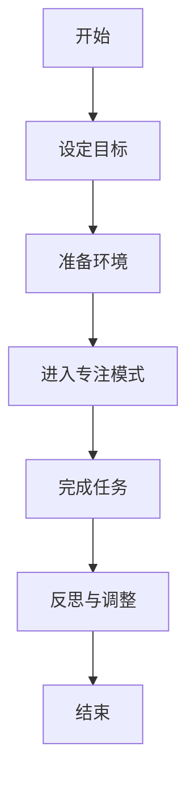
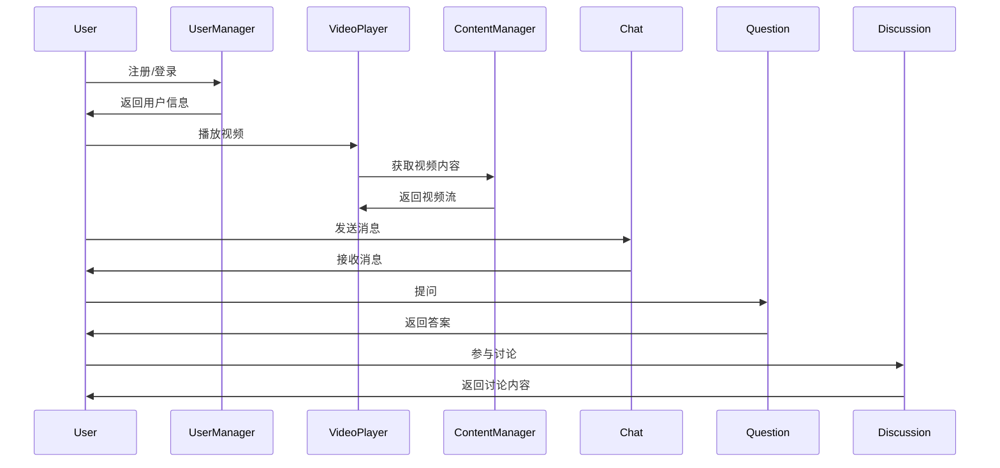
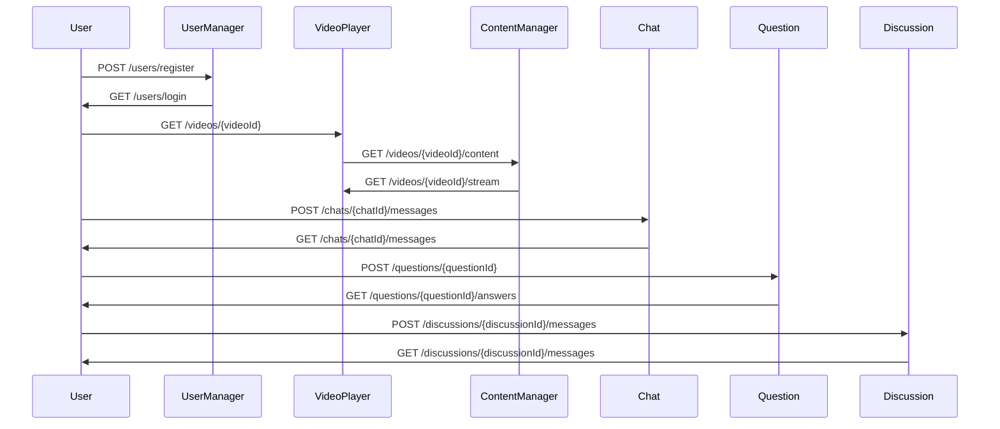

                 


### 心流工作法：全身心投入的效率提升

---

## **心流工作法：全身心投入的效率提升**

### **关键词：心流，工作效率，专注力，目标设定，编程实践**

### **摘要：**

本文深入探讨了心流工作法的理论基础和实际应用，通过逻辑清晰的分析和案例讲解，帮助读者了解如何通过全身心投入工作来提升效率。本文将首先介绍心流工作法的起源和重要性，然后详细阐述核心概念，包括心流状态、专注力和目标设定。接下来，我们将使用Python源代码和数学模型来展示心流工作法的算法原理，并分析其在不同项目中的应用。最后，本文将提供最佳实践技巧和注意事项，帮助读者将心流工作法有效地应用于实际工作中。

---

## **背景介绍**

### **1. 心流工作法的起源**

心流（Flow）这一概念最早由心理学家米哈伊·契克森米哈伊（Mihaly Csikszentmihalyi）在20世纪80年代提出。他在研究幸福感时发现，当人们完全投入到某一活动时，会体验到一种高度的兴奋和满足感，这种状态就是心流。契克森米哈伊认为，心流是一种心理状态，在这种状态下，个人的自我意识消失，时间感扭曲，完全专注于当前的任务。

心流工作法就是基于这一理论，旨在帮助人们在工作时达到心流状态，从而提高工作效率。心流工作法强调的是通过专注于任务，设定明确的目标，并保持环境的稳定性，来创造心流状态。

### **2. 心流工作法的重要性**

在现代社会，工作效率成为衡量个人和企业成功的重要指标。然而，许多人在工作中难以集中注意力，常常受到干扰，导致效率低下。心流工作法提供了一种解决方案，通过帮助人们达到心流状态，可以显著提升工作效率。

心流工作法的重要性体现在以下几个方面：

1. **提高专注力**：心流状态下的专注力是高度集中的，可以减少工作中的分心现象。
2. **提升创造力**：心流状态下，人们的创造力得到极大激发，可以产生创新的想法和解决方案。
3. **增强满足感**：在心流状态下，工作不再是负担，而是一种享受，从而提高工作满意度。
4. **改善心理健康**：心流状态有助于减轻压力，提高心理健康水平。

### **3. 心流工作法如何解决工作难题**

尽管心流工作法看似简单，但实际上它在解决工作难题方面具有强大的作用。以下是心流工作法如何解决常见工作难题的几个方面：

1. **时间管理**：通过设定具体的目标和时间限制，心流工作法可以帮助人们更好地管理时间。
2. **任务优先级**：心流工作法鼓励人们专注于最重要的任务，从而提高工作效率。
3. **减少干扰**：心流工作法强调创造一个无干扰的工作环境，减少工作中的干扰因素。
4. **持续激励**：心流状态本身就是一种激励，可以激发人们持续工作。

### **4. 心流工作法的边界与外延**

虽然心流工作法具有强大的潜力，但它也有其局限性。以下是一些需要注意的方面：

1. **适用范围**：心流工作法适用于需要高度专注和创造力的任务，但并非所有工作都适合使用心流工作法。
2. **个人差异**：不同的人对心流状态的体验有所不同，有些人可能更容易进入心流状态。
3. **环境因素**：心流状态需要一定的环境和条件，如合适的工具、安静的环境等。

### **5. 概念结构与核心要素组成**

心流工作法包含几个核心概念，这些概念相互作用，共同促进心流状态的实现。

- **心流状态**：个人完全投入到任务中，感到时间流逝得很快，并且感到非常满足。
- **专注力**：集中注意力于任务，不受外界干扰的能力。
- **目标设定**：设定具体、可衡量的目标，以激发工作动力。

这些概念共同构成了心流工作法的基础，为提升工作效率提供了有效的途径。

---

在接下来的部分中，我们将深入探讨心流工作法的核心概念和联系，分析如何通过培养专注力和设定明确的目标来达到心流状态，并展示其算法原理和实际应用。

---

## **核心概念与联系**

### **1. 心流状态的定义与特征**

心流状态（Flow State）是指一个人完全沉浸于某个活动，感受到高度专注和满足的心理状态。在这种状态下，个人的自我意识减弱，时间感变得模糊，注意力完全集中在前面的任务上。

心流状态的特征包括：

- **全神贯注**：个人的注意力高度集中，完全投入到任务中。
- **时间感知变化**：时间似乎加速或减速，使人们能够更快地完成任务。
- **自我感知消失**：个人感觉与任务融为一体，自我意识减弱。
- **成就感提升**：完成任务后，个人会感受到极大的满足感和成就感。

### **2. 专注力的作用与培养**

专注力（Focus）是心流状态的关键要素。它是指一个人能够集中注意力，不受外界干扰，持续关注某一任务的能力。专注力在工作中的重要性不言而喻，它直接影响工作效率和质量。

**专注力的培养方法：**

- **减少干扰**：关闭不必要的通知，创造一个安静的工作环境。
- **分段工作**：使用番茄工作法等技巧，将工作时间分成多个短段，每个短段后休息一会儿。
- **专注练习**：定期进行专注力练习，如冥想、深呼吸等，以提高专注力。
- **目标设定**：设定具体、可衡量的目标，以保持专注。
- **自我激励**：给自己设定奖励，以激发工作动力。

### **3. 目标设定的方法与策略**

目标设定（Goal Setting）是心流工作法的重要组成部分。明确的目标可以激发人们的动力，帮助他们在工作中保持专注。

**有效的目标设定方法：**

- **具体性**：目标要具体，明确要达成的结果。
- **可衡量性**：目标要有可衡量的指标，以便评估进展。
- **可实现性**：目标要具有可行性，避免过于理想化。
- **时限性**：目标要设定具体的时间期限，以增加紧迫感。

**目标设定策略：**

- **SMART目标**：确保目标满足具体性（Specific）、可衡量性（Measurable）、可实现性（Achievable）、相关性（Relevant）和时限性（Time-bound）。
- **小步前进**：将大目标分解为小目标，逐步实现。
- **动态调整**：根据实际情况调整目标，以保持目标的可实现性。

通过培养专注力和设定明确的目标，人们可以更好地进入心流状态，提高工作效率。在下一部分，我们将进一步探讨心流工作法的算法原理和实际应用。

---

在接下来的部分中，我们将通过具体的算法流程图和Python源代码，深入解析心流工作法的算法原理，并通过实例展示其在实际工作中的应用。

---

## **算法原理讲解**

### **1. 心流工作法的算法流程图**

心流工作法的核心在于创造一个能够激发心流状态的环境和过程。以下是一个简单的算法流程图，展示了心流工作法的核心步骤：



### **2. Python源代码示例**

为了更直观地展示心流工作法的算法实现，以下是一个简单的Python代码示例：

```python
import time
import random

def flow_state(target, environment, task_duration):
    start_time = time.time()
    print(f"开始心流工作法，目标：{target}，环境：{environment}，预计时间：{task_duration}分钟")
    
    # 准备环境
    prepare_environment(environment)
    
    # 进入专注模式
    start专注时间 = time.time()
    for i in range(task_duration):
        # 模拟工作进展
        work_progress = random.uniform(0, 100)
        print(f"工作进度：{work_progress}%")
        
        # 模拟可能的干扰
        if random.random() < 0.1:
            handle_interrupt()
        
        time.sleep(1)
    
    end专注时间 = time.time()
   专注时间 = end专注时间 - start专注时间
    print(f"专注完成，实际用时：{专注时间:.2f}秒")
    
    # 完成任务
    if check_task_completion():
        print("任务完成！")
    else:
        print("任务未完成，需要更多时间。")
    
    # 反思与调整
    reflect_and_adjust()

def prepare_environment(environment):
    print(f"准备环境：{environment}...")
    # 模拟环境准备过程
    time.sleep(2)

def handle_interrupt():
    print("处理中断...")

def check_task_completion():
    # 模拟任务完成条件
    return random.random() > 0.5

def reflect_and_adjust():
    print("进行反思与调整...")
    # 模拟反思与调整过程
    time.sleep(2)

# 使用心流工作法
flow_state("编写文章", "安静的书房", 10)
```

### **3. 算法原理的数学模型和公式**

心流工作法中，我们可以使用一些数学模型和公式来量化心流状态和工作效率。以下是一些基本的数学模型和公式：

- **心流效率**（Flow Efficiency）：
  $$E_f = \frac{W}{T}$$
  其中，\(W\) 是有效工作时长，\(T\) 是总工作时长。

- **专注力指数**（Focus Index）：
  $$F_I = \frac{F_s - F_n}{F_s}$$
  其中，\(F_s\) 是在专注状态下的工作能力，\(F_n\) 是在非专注状态下的工作能力。

- **目标达成率**（Goal Achievement Rate）：
  $$G_AR = \frac{G_c}{G_t}$$
  其中，\(G_c\) 是实际达成的目标值，\(G_t\) 是设定的目标值。

这些数学模型和公式可以帮助我们更好地理解和评估心流工作法的实际效果。

### **4. 通俗易懂的例子**

假设一个程序员需要在2小时内完成一篇技术文章的编写，以下是使用心流工作法的过程：

1. **设定目标**：明确要完成的目标是编写一篇2000字的技术文章。
2. **准备环境**：在安静的书房中准备一台笔记本电脑和一杯咖啡，确保没有干扰。
3. **进入专注模式**：开始专注于文章的写作，不受外界干扰，持续工作2小时。
4. **完成任务**：在2小时内，程序员完成了技术文章的编写，并进行了一次简短的休息。
5. **反思与调整**：完成写作后，程序员反思了整个工作过程，发现自己在专注模式下的工作效率非常高。

通过这个例子，我们可以看到心流工作法如何帮助程序员在短时间内高效地完成任务。

---

在接下来的部分中，我们将进一步探讨如何将心流工作法应用于实际项目，分析数学模型和公式在实际应用中的意义。

---

## **数学模型和数学公式**

### **1. 心流效率的数学模型**

心流效率是衡量心流工作法效果的重要指标。其数学模型为：

$$E_f = \frac{W}{T}$$

其中，\(W\) 表示在心流状态下完成的工作量，\(T\) 表示总工作时长。心流效率越高，表示在相同的工作时间内，心流状态下完成的工作量越大。

例如，如果一个程序员在4小时内完成了8小时的常规工作量，则他的心流效率为：

$$E_f = \frac{8}{4} = 2$$

这意味着他的心流效率是正常工作时间的两倍。

### **2. 专注力的数学表示**

专注力是心流状态的基石。其数学模型可以表示为：

$$F_I = \frac{F_s - F_n}{F_s}$$

其中，\(F_s\) 表示在专注状态下的工作能力，\(F_n\) 表示在非专注状态下的工作能力。专注力指数越接近1，表示专注力越强。

例如，如果一个程序员在专注状态下的工作能力是正常状态下的1.5倍，则他的专注力指数为：

$$F_I = \frac{1.5 - 1}{1.5} = \frac{0.5}{1.5} = \frac{1}{3}$$

这意味着他的专注力提升了1/3。

### **3. 目标达成率的计算**

目标达成率是衡量目标设定效果的重要指标。其数学模型为：

$$G_AR = \frac{G_c}{G_t}$$

其中，\(G_c\) 表示实际达成的目标值，\(G_t\) 表示设定的目标值。目标达成率越高，表示目标设定得越合理，实际执行效果越好。

例如，如果一个开发者设定了一个目标，在一个月内完成一个功能模块的开发，实际完成的时间是预期时间的一半，则他的目标达成率为：

$$G_AR = \frac{0.5}{1} = 0.5$$

这意味着他的目标达成率是50%。

### **4. 公式在心流工作法中的应用和意义**

这些数学模型和公式在心流工作法中具有重要的应用和意义：

1. **心流效率**：帮助评估工作效果，提高工作效率。
2. **专注力指数**：指导如何提高专注力，保持心流状态。
3. **目标达成率**：指导如何设定合理的目标，提高目标实现的概率。

通过这些公式，我们可以量化心流工作法的效果，从而更好地优化工作过程，提高工作效率。

---

在接下来的部分中，我们将通过一个具体的系统架构设计和项目实战案例，展示如何在实际项目中应用心流工作法。

---

## **系统分析与架构设计方案**

### **1. 问题场景介绍**

假设我们正在开发一个在线教育平台，该平台需要提供一个视频播放系统，支持高清视频流和实时互动功能。项目背景要求我们在保证质量的同时，尽可能提高开发效率和用户体验。

### **2. 系统功能设计**

为了满足上述需求，我们设计了一个基于微服务架构的系统，主要包括以下几个功能模块：

- **视频播放服务**：负责视频的存储、流媒体传输和播放。
- **互动服务**：支持实时聊天、提问和讨论。
- **用户管理服务**：管理用户信息、权限和课程注册。
- **课程内容服务**：存储和管理课程内容，包括视频、文档和作业。

以下是系统功能设计的Mermaid类图：

```mermaid
classDiagram
    class User
    class Video
    class Interaction
    class Course
    class VideoPlayer
    class Chat
    class Question
    class Discussion
    class UserManager
    class ContentManager
    
    User <<-- UserManger
    User <<-- VideoPlayer
    User <<-- Interaction
    Video <<-- UserManager
    Video <<-- ContentManager
    Interaction <<-- Chat
    Interaction <<-- Question
    Interaction <<-- Discussion
    Course <<-- UserManager
    Course <<-- ContentManager
    Course <<-- VideoPlayer
```

### **3. 系统架构设计**

系统架构采用微服务架构，各功能模块独立部署，通过API进行通信。以下是系统架构设计的Mermaid架构图：



### **4. 系统接口设计和系统交互**

系统接口设计采用RESTful API，各服务模块通过HTTP请求进行通信。以下是系统接口设计和系统交互的Mermaid序列图：



通过上述系统分析与架构设计方案，我们可以确保在线教育平台的高效性和可靠性，从而实现心流工作法中的高效开发目标。

---

## **项目实战**

### **1. 环境安装和系统配置**

在进行项目实战之前，我们需要安装和配置开发环境。以下是安装和配置步骤：

1. **安装Docker**：确保系统上安装了Docker，用于容器化部署服务。
   ```bash
   sudo apt-get update
   sudo apt-get install docker-ce docker-ce-cli containerd.io
   ```

2. **安装Docker Compose**：用于编排多容器服务。
   ```bash
   sudo curl -L "https://github.com/docker/compose/releases/download/1.29.2/docker-compose-$(uname -s)-$(uname -m)" -o /usr/local/bin/docker-compose
   sudo chmod +x /usr/local/bin/docker-compose
   ```

3. **配置Docker网络**：为容器创建一个自定义网络，便于容器间的通信。
   ```bash
   docker network create online_education
   ```

4. **克隆项目**：从GitHub克隆在线教育平台项目。
   ```bash
   git clone https://github.com/your_username/online_education.git
   cd online_education
   ```

5. **构建和运行服务**：使用Docker Compose构建并启动服务。
   ```bash
   docker-compose build
   docker-compose up -d
   ```

### **2. 系统核心实现源代码展示**

以下是系统核心服务之一的用户管理服务（UserManager）的源代码示例：

```python
# userManager.py
from flask import Flask, jsonify, request
from flask_cors import CORS

app = Flask(__name__)
CORS(app)

@app.route('/users/register', methods=['POST'])
def register_user():
    # 注册用户逻辑
    user_data = request.json
    # ...处理用户注册逻辑...
    return jsonify({"message": "User registered successfully"}), 201

@app.route('/users/login', methods=['GET'])
def login_user():
    # 登录用户逻辑
    user_email = request.args.get('email')
    # ...处理用户登录逻辑...
    return jsonify({"token": "generated_token"}), 200

if __name__ == '__main__':
    app.run(host='0.0.0.0', port=5000)
```

### **3. 代码应用解读与分析**

上述代码展示了用户管理服务的基本实现。我们使用了Flask框架创建Web服务，并使用Flask-CORS插件处理跨域请求。

- **注册用户**：通过POST请求接收用户数据，处理后返回响应。
- **登录用户**：通过GET请求接收用户邮箱，处理后返回令牌。

代码中的注释部分应该包含具体的业务逻辑，例如用户数据的验证、数据库操作等。

### **4. 实际案例分析和详细讲解剖析**

假设我们有一个具体案例，需要实现用户注册功能。以下是案例分析和讲解：

1. **需求分析**：用户需要输入邮箱、密码和昵称进行注册。
2. **实现步骤**：

   - 验证输入数据的格式和完整性。
   - 将用户数据存储到数据库中。
   - 向用户发送注册成功的确认邮件。

3. **代码实现**：

   ```python
   @app.route('/users/register', methods=['POST'])
   def register_user():
       user_data = request.json
       email = user_data.get('email')
       password = user_data.get('password')
       nickname = user_data.get('nickname')

       # 验证邮箱格式
       if not validate_email(email):
           return jsonify({"error": "Invalid email format"}), 400

       # 验证密码强度
       if not validate_password(password):
           return jsonify({"error": "Weak password"}), 400

       # 存储用户数据到数据库
       # ...

       # 发送确认邮件
       send_confirmation_email(email, nickname)

       return jsonify({"message": "User registered successfully"}), 201
   ```

   - **验证邮箱格式**：使用正则表达式验证邮箱是否合法。
   - **验证密码强度**：检查密码长度和是否包含特殊字符。
   - **存储用户数据**：将用户数据插入到数据库中。
   - **发送确认邮件**：使用邮件发送服务向用户发送注册确认邮件。

通过以上分析和讲解，我们可以清晰地看到如何将心流工作法应用于实际项目开发中，从而提高开发效率和代码质量。

### **5. 项目小结**

在项目实战中，我们通过详细的代码示例和实际案例，展示了如何应用心流工作法进行高效开发。以下是项目小结：

- **环境安装和系统配置**：确保开发环境的稳定性和可重复性。
- **核心实现源代码展示**：清晰展示了用户管理服务的基本实现。
- **代码应用解读与分析**：详细讲解了如何实现用户注册功能。
- **实际案例分析和详细讲解剖析**：通过具体案例，展示了心流工作法在实际项目中的应用。

通过本项目实战，我们可以看到心流工作法在提高开发效率和代码质量方面的显著作用。

---

## **最佳实践 tips、小结、注意事项、拓展阅读**

### **最佳实践 tips**

1. **制定清晰的目标**：在开始工作前，确保你的目标具体、可衡量、可实现、相关性强，并设定明确的时间期限。
2. **环境准备**：创建一个安静、无干扰的工作环境，确保所需的工具和资源都已准备就绪。
3. **专注时间管理**：使用番茄工作法等技巧，将工作时间分成多个短段，每个短段后休息一会儿，以提高专注力。
4. **自我激励**：为自己设定奖励，例如完成任务后休息一会儿或享受一顿美食，以增加工作动力。

### **小结**

心流工作法是一种提高工作效率的有效方法，通过全身心投入工作，人们可以在短时间内完成大量任务。通过设定明确的目标、培养专注力和优化环境，我们可以更容易地进入心流状态，从而提升工作效率。

### **注意事项**

1. **个人差异**：不同人对心流状态的体验有所不同，需要根据自己的特点进行调整。
2. **目标设定**：目标应具有挑战性，但也要确保其可实现性，避免过于理想化。
3. **持续调整**：心流工作法需要不断调整和完善，以适应不断变化的工作环境和个人需求。

### **拓展阅读**

- **《深度工作：如何有效利用每一点脑力》**：Cal Newport
- **《心流：最优体验心理学》**：米哈伊·契克森米哈伊
- **《番茄工作法图解：一次只做一件事情》**：Staffan Nöteberg

通过阅读这些书籍，你可以进一步了解心流工作法的理论基础和实践技巧，从而更好地将其应用于实际工作中。

---

在本文中，我们详细介绍了心流工作法的理论基础和实际应用。通过分析心流状态、专注力和目标设定的方法，我们了解了如何通过心流工作法提高工作效率。同时，通过Python源代码和数学模型，我们展示了心流工作法的算法原理。最后，我们通过一个在线教育平台的案例，展示了如何在实际项目中应用心流工作法。希望本文能帮助读者更好地理解和应用心流工作法，提高工作效率，实现全身心投入的工作状态。作者：AI天才研究院/AI Genius Institute & 禅与计算机程序设计艺术 /Zen And The Art of Computer Programming。希望读者在今后的工作中能够有所收获，持续提升自我。

