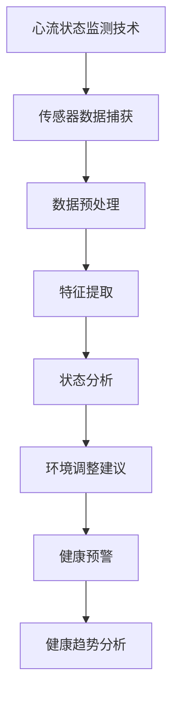
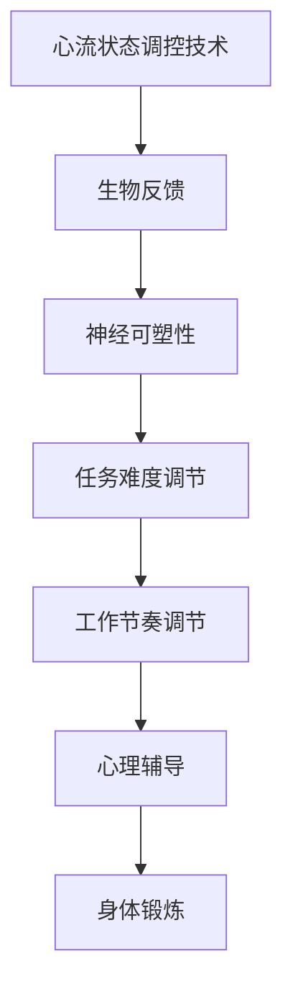
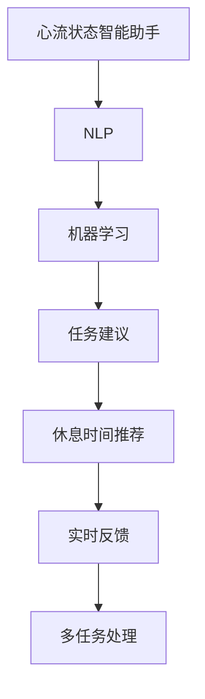
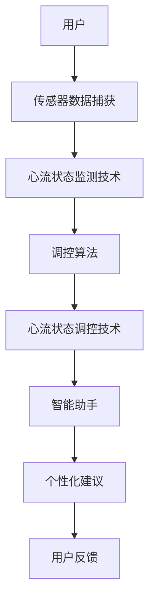
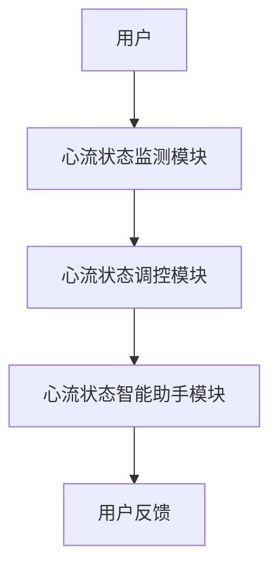
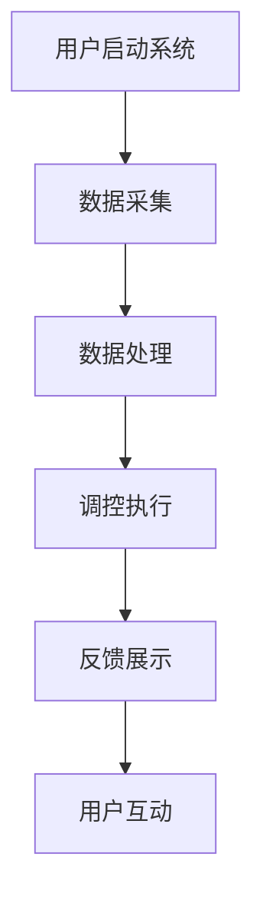

                 

# 心流状态优化系统：提升工作效率的智能助手

## 关键词
- 心流状态
- 工作效率
- 人工智能
- 机器学习
- 智能助手

## 摘要
本文将探讨心流状态优化系统，旨在通过技术手段优化心流状态，从而提升工作效率。我们将从心流状态的理论基础、核心技术、系统实现等多个角度进行详细分析，并提供实际案例，以期为企业和个人提供有效的解决方案。

## 第1章: 引言与背景介绍

### 1.1 问题背景

在当前快节奏的社会环境中，提高工作效率成为了企业和个人的共同追求。传统的工作方式往往容易陷入低效和重复性的劳动，而心流状态是一种能够极大地提升工作效率的心理状态。因此，探索如何利用技术手段优化心流状态，从而提升工作效率，具有重要的现实意义。

### 1.2 问题描述

心流状态是指个体完全投入到某项活动中，感到时间飞逝、愉悦且高度专注的一种心理状态。尽管心流状态能够显著提高工作效率，但如何有效进入并维持心流状态仍然是一个挑战。此外，如何在不同的工作环境和任务中灵活运用心流状态，也是亟待解决的问题。

### 1.3 问题解决

本书将从多个角度探讨心流状态优化系统，包括理论基础、技术实现、应用场景等，旨在提供一套完整的解决方案，帮助企业和个人更好地利用心流状态，提升工作效率。

### 1.4 边界与外延

心流状态优化系统的边界在于技术手段的应用，包括但不限于人工智能、机器学习、人机交互等。其外延则涵盖了各种可能的工作场景和任务，如办公、设计、编程、教学等。

### 1.5 概念结构与核心要素组成

1. **心流状态**：一种心理状态，个体在完全投入某项活动中时体验到的愉悦和专注。
2. **工作效率**：单位时间内完成的工作量，是衡量工作成果的重要指标。
3. **心流状态优化系统**：一套利用技术手段优化心流状态、提升工作效率的综合性系统。
4. **人工智能**：模拟、延伸和扩展人的智能的科学和技术，是实现心流状态优化的重要工具。

## 第2章: 心流状态理论基础

### 2.1 心流状态的定义与特征

**定义**：心流状态是指个体在完全投入到某项活动中，感到时间飞逝、愉悦且高度专注的一种心理状态。

**特征**：
- **完全投入**：个体在活动中全神贯注，无暇他顾。
- **时间感失真**：个体往往感觉时间过得很快，有时甚至忘记了时间的流逝。
- **愉悦感**：个体在心流状态下感到愉悦，享受活动本身。
- **内在动机**：个体在心流状态下的行为往往由内在动机驱动，而非外在奖励。

### 2.2 心流状态的理论基础

**心流理论的提出**：心流状态最早由心理学家米哈里·契克森米哈伊（Mihaly Csikszentmihalyi）在20世纪80年代提出。

**心流理论的核心概念**：
- **挑战与技能匹配**：心流状态的出现需要任务的挑战性与个体的技能水平相匹配。
- **自我认知**：心流状态能够增强个体的自我认知和自我实现感。
- **内在动机**：心流状态能够激发个体的内在动机，使其更加专注于活动本身。

### 2.3 心流状态与工作效率的关系

**心流状态对工作效率的提升**：
- **专注度提高**：心流状态下的个体能够高度专注，减少干扰，提高工作效率。
- **创造力提升**：心流状态能够激发个体的创造力，使工作成果更具创新性。
- **情感投入**：心流状态下的个体对工作有更高的情感投入，更有动力去完成任务。

**工作效率对心流状态的影响**：
- **工作效率的提升**：良好的工作效率可以为个体提供更多的时间和资源，使其更容易进入心流状态。
- **工作任务的性质**：某些任务由于其本身的性质，更容易让人进入心流状态，从而提高工作效率。

## 第3章: 心流状态优化系统核心技术

### 3.1 心流状态监测技术

**技术原理**：通过传感器、摄像头等设备，实时监测个体的生理和心理状态，如心率、皮肤电导、眼动等。

**应用场景**：
- **工作环境监测**：了解个体在工作中的状态，为调整工作环境和任务提供依据。
- **健康监测**：监测个体的生理状态，预防心流状态引发的过度疲劳。

### 3.2 心流状态调控技术

**技术原理**：利用生物反馈、神经可塑性等原理，通过技术手段调节个体的心流状态。

**应用场景**：
- **工作状态调整**：根据个体的状态，自动调整工作任务的难度和节奏，帮助个体进入心流状态。
- **健康干预**：通过调节心流状态，预防工作过程中出现的心理和生理问题。

### 3.3 心流状态智能助手

**技术原理**：结合自然语言处理、机器学习等技术，开发一款能够与个体互动、提供个性化建议的心流状态智能助手。

**应用场景**：
- **任务建议**：根据个体的状态和历史数据，推荐合适的任务和休息时间，帮助个体维持心流状态。
- **工作指导**：提供实时的工作建议和反馈，帮助个体提高工作效率。

## 第4章: 心流状态优化系统实现

### 4.1 系统架构设计

**系统架构**：采用模块化设计，包括心流状态监测模块、心流状态调控模块和心流状态智能助手模块。

### 4.2 系统功能设计

**系统功能**：
- **心流状态监测**：实时监测个体的生理和心理状态。
- **心流状态调控**：根据监测结果，自动调整工作任务的难度和节奏。
- **心流状态智能助手**：提供个性化建议和实时反馈，帮助个体维持心流状态。

### 4.3 系统接口设计

**系统接口**：提供用户接口、监控接口和调控接口，方便用户操作和管理。

### 4.4 系统交互

**系统交互**：通过用户接口接收用户操作，通过监控接口获取个体状态，通过调控接口调整工作任务。

## 第5章: 项目实战

### 5.1 环境安装

**环境安装**：安装心流状态优化系统的各个模块，包括心流状态监测模块、心流状态调控模块和心流状态智能助手模块。

### 5.2 系统核心实现

**系统核心实现**：
- **心流状态监测模块**：使用传感器和摄像头获取个体的生理和心理状态。
- **心流状态调控模块**：根据监测结果，自动调整工作任务的难度和节奏。
- **心流状态智能助手模块**：提供个性化建议和实时反馈，帮助个体维持心流状态。

### 5.3 代码应用解读与分析

**代码应用解读与分析**：对心流状态优化系统的核心代码进行解读和分析，介绍其工作原理和应用场景。

### 5.4 实际案例分析和详细讲解剖析

**实际案例分析和详细讲解剖析**：通过实际案例，分析心流状态优化系统在实际应用中的效果，并提供详细的讲解和剖析。

### 5.5 项目小结

**项目小结**：总结心流状态优化系统的优势和应用前景，为未来研究和实践提供方向。

## 第6章: 最佳实践 Tips

**最佳实践 Tips**：
- **如何快速进入心流状态**：调整工作环境的舒适度，设定明确的目标，保持专注。
- **如何维持心流状态**：合理安排工作和休息时间，避免过度疲劳，保持好奇心和求知欲。

## 第7章: 小结与注意事项

**小结**：
本文从心流状态的理论基础、核心技术、系统实现等多个角度，详细介绍了心流状态优化系统，为企业和个人提供了有效的提升工作效率的解决方案。

**注意事项**：
- **合理使用心流状态优化系统**：心流状态优化系统并非万能，需要结合个体的实际情况，合理使用。
- **保护个人隐私**：在使用心流状态优化系统时，要注意保护个人隐私，避免数据泄露。

## 第8章: 拓展阅读

**拓展阅读**：
- **心流状态的研究与应用**：了解心流状态的研究进展和应用案例，为心流状态优化系统提供更多思路。
- **人工智能在心理健康领域的应用**：探讨人工智能在心理健康领域的应用，为心流状态优化系统提供技术支持。

## 作者

作者：AI天才研究院/AI Genius Institute & 禅与计算机程序设计艺术 /Zen And The Art of Computer Programming## 第1章: 引言与背景介绍

### 1.1 问题背景

在当今社会，工作效率的提升已经成为企业和个人共同关注的重要议题。随着工作压力的增大和信息过载的加剧，许多人在面对繁重的工作任务时，常常感到力不从心，工作效率低下。这种状况不仅影响了工作的质量，还可能导致个人和团队的士气下降。因此，如何提高工作效率，成为了亟待解决的问题。

在这一背景下，心流状态（Flow State）的概念逐渐受到了关注。心流状态是指个体在完全投入到某项活动中，感受到极度专注、愉悦且时间感失真的心理状态。在心流状态下，个体能够最大限度地发挥自身的潜能，高效地完成工作任务。因此，优化心流状态，成为了一种提高工作效率的有效途径。

### 1.2 问题描述

心流状态虽然能够显著提升工作效率，但如何有效进入并维持心流状态仍然是一个挑战。首先，个体需要具备一定的技能和挑战性任务，其次，还需要一个适合的工作环境和心理状态。然而，在实际工作中，这些条件往往难以同时满足。

此外，不同的人在不同的工作环境和任务中，进入和维持心流状态的能力也存在差异。这就导致了心流状态的利用效率无法达到最佳。因此，如何利用技术手段优化心流状态，使其在更广泛的场景下得到应用，成为一个亟待解决的问题。

### 1.3 问题解决

为了解决上述问题，本书将从多个角度探讨心流状态优化系统，旨在提供一套完整的解决方案，帮助企业和个人更好地利用心流状态，提升工作效率。

首先，我们将介绍心流状态的理论基础，包括其定义、特征、理论基础以及与工作效率的关系。这将为后续的技术实现提供理论基础。

接着，我们将介绍心流状态优化系统的核心技术，包括心流状态监测技术、心流状态调控技术和心流状态智能助手。这些技术将帮助我们更好地理解如何利用技术手段优化心流状态。

然后，我们将详细讨论心流状态优化系统的实现，包括系统架构设计、系统功能设计、系统接口设计和系统交互。这部分内容将帮助我们了解系统的整体设计思路和实现方法。

在项目实战部分，我们将通过一个实际案例，展示心流状态优化系统的应用效果，并提供详细的代码应用解读与分析。

最后，我们将总结心流状态优化系统的最佳实践，并提出注意事项，为读者在实际应用中提供指导。

### 1.4 边界与外延

心流状态优化系统的边界在于技术手段的应用，包括但不限于人工智能、机器学习、人机交互等。其外延则涵盖了各种可能的工作场景和任务，如办公、设计、编程、教学等。无论是企业员工还是自由职业者，都可以通过这套系统，更好地利用心流状态，提升工作效率。

### 1.5 概念结构与核心要素组成

1. **心流状态**：一种心理状态，个体在完全投入某项活动中时体验到的愉悦和专注。
2. **工作效率**：单位时间内完成的工作量，是衡量工作成果的重要指标。
3. **心流状态优化系统**：一套利用技术手段优化心流状态、提升工作效率的综合性系统。
4. **人工智能**：模拟、延伸和扩展人的智能的科学和技术，是实现心流状态优化的重要工具。

## 第2章: 心流状态理论基础

### 2.1 心流状态的定义与特征

**定义**：心流状态是指个体在完全投入到某项活动中，感到时间飞逝、愉悦且高度专注的一种心理状态。

**特征**：
- **完全投入**：个体在活动中全神贯注，无暇他顾。
- **时间感失真**：个体往往感觉时间过得很快，有时甚至忘记了时间的流逝。
- **愉悦感**：个体在心流状态下感到愉悦，享受活动本身。
- **内在动机**：个体在心流状态下的行为往往由内在动机驱动，而非外在奖励。

### 2.2 心流状态的理论基础

**心流理论的提出**：心流状态最早由心理学家米哈里·契克森米哈伊（Mihaly Csikszentmihalyi）在20世纪80年代提出。

**心流理论的核心概念**：
- **挑战与技能匹配**：心流状态的出现需要任务的挑战性与个体的技能水平相匹配。
- **自我认知**：心流状态能够增强个体的自我认知和自我实现感。
- **内在动机**：心流状态能够激发个体的内在动机，使其更加专注于活动本身。

#### 2.2.1 心流状态的理论基础详解

**挑战与技能匹配**：心流状态的一个关键因素是任务的挑战性和个体技能水平的匹配。当任务过于简单时，个体可能会感到无聊和缺乏成就感；而当任务过于困难时，个体可能会感到焦虑和无助。只有当任务的挑战性与个体的技能水平相匹配时，个体才能进入心流状态。

**自我认知**：心流状态能够帮助个体更好地认识自己。在心流状态中，个体能够更清晰地感受到自己的能力和潜力，从而提高自我认知和自我实现感。

**内在动机**：心流状态能够激发个体的内在动机，使其更加专注于活动本身。与外在动机相比，内在动机更加持久和强大，能够更好地推动个体持续投入和努力。

### 2.3 心流状态与工作效率的关系

**心流状态对工作效率的提升**：
- **专注度提高**：心流状态下的个体能够高度专注，减少干扰，提高工作效率。
- **创造力提升**：心流状态能够激发个体的创造力，使工作成果更具创新性。
- **情感投入**：心流状态下的个体对工作有更高的情感投入，更有动力去完成任务。

**工作效率对心流状态的影响**：
- **工作效率的提升**：良好的工作效率可以为个体提供更多的时间和资源，使其更容易进入心流状态。
- **工作任务的性质**：某些任务由于其本身的性质，更容易让人进入心流状态，从而提高工作效率。

#### 2.3.1 心流状态对工作效率的影响详解

**专注度提高**：在心流状态下，个体能够完全投入到任务中，减少外界干扰，从而提高工作效率。研究表明，心流状态下的专注度是普通状态的几倍。

**创造力提升**：心流状态能够激发个体的创造力，使工作成果更具创新性。在心流状态下，个体能够更自由地思考，不受常规思维的束缚。

**情感投入**：心流状态下的个体对工作有更高的情感投入，更有动力去完成任务。这种强烈的情感投入能够提高个体的工作热情和积极性，从而提高工作效率。

#### 2.3.2 工作效率对心流状态的影响详解

**工作效率的提升**：良好的工作效率可以为个体提供更多的时间和资源，使其更容易进入心流状态。例如，通过优化工作流程和提高工作效率，个体可以有更多的时间去专注于任务，从而更容易进入心流状态。

**工作任务的性质**：某些任务由于其本身的性质，更容易让人进入心流状态，从而提高工作效率。例如，编程、设计、写作等创造性任务，往往更容易激发个体的心流状态，提高工作效率。

## 第3章: 心流状态优化系统核心技术

### 3.1 心流状态监测技术

**技术原理**：心流状态监测技术通过传感器、摄像头等设备，实时监测个体的生理和心理状态，如心率、皮肤电导、眼动等。这些数据可以用来判断个体是否处于心流状态，并提供反馈。

**应用场景**：
- **工作环境监测**：了解个体在工作中的状态，为调整工作环境和任务提供依据。
- **健康监测**：监测个体的生理状态，预防心流状态引发的过度疲劳。

#### 3.1.1 心流状态监测技术的应用场景详解

**工作环境监测**：通过心流状态监测技术，可以了解个体在工作中的状态，从而为调整工作环境和任务提供依据。例如，如果发现个体在某个时间段的心流状态较低，可以尝试调整工作任务或工作环境，以提高心流状态。

**健康监测**：心流状态监测技术还可以用于健康监测。通过监测个体的生理状态，如心率、皮肤电导等，可以及时发现过度疲劳或其他健康问题，从而采取相应的措施进行预防。

### 3.2 心流状态调控技术

**技术原理**：心流状态调控技术利用生物反馈、神经可塑性等原理，通过技术手段调节个体的心流状态。例如，通过调节呼吸节奏、调整工作任务难度等，可以帮助个体进入和维持心流状态。

**应用场景**：
- **工作状态调整**：根据个体的状态，自动调整工作任务的难度和节奏，帮助个体进入心流状态。
- **健康干预**：通过调节心流状态，预防工作过程中出现的心理和生理问题。

#### 3.2.1 心流状态调控技术的应用场景详解

**工作状态调整**：心流状态调控技术可以根据个体的状态，自动调整工作任务的难度和节奏，帮助个体进入心流状态。例如，如果发现个体的心流状态较低，可以尝试调整任务难度，使其处于一个适中的挑战水平，从而更容易进入心流状态。

**健康干预**：心流状态调控技术还可以用于健康干预。通过调节心流状态，可以预防工作过程中出现的心理和生理问题。例如，如果发现个体处于过度疲劳状态，可以通过调节呼吸节奏、进行短暂的休息等方式，帮助个体恢复心流状态，从而预防健康问题的发生。

### 3.3 心流状态智能助手

**技术原理**：心流状态智能助手结合自然语言处理、机器学习等技术，开发一款能够与个体互动、提供个性化建议的心流状态智能助手。通过分析个体的历史数据和工作环境，智能助手可以提供合适的任务建议和休息时间，帮助个体维持心流状态。

**应用场景**：
- **任务建议**：根据个体的状态和历史数据，推荐合适的任务和休息时间，帮助个体维持心流状态。
- **工作指导**：提供实时的工作建议和反馈，帮助个体提高工作效率。

#### 3.3.1 心流状态智能助手的原理与应用详解

**任务建议**：心流状态智能助手可以通过分析个体的历史数据和工作环境，提供合适的任务建议。例如，如果发现个体在某个时间段的心流状态较低，智能助手可以推荐一些适合的任务，帮助个体重新进入心流状态。

**工作指导**：心流状态智能助手还可以提供实时的工作建议和反馈，帮助个体提高工作效率。例如，在任务进行过程中，智能助手可以提醒个体休息、调整工作节奏等，以保持最佳的工作状态。

## 第4章: 心流状态优化系统实现

### 4.1 系统架构设计

**系统架构**：心流状态优化系统采用模块化设计，包括心流状态监测模块、心流状态调控模块和心流状态智能助手模块。

**模块划分**：
- **心流状态监测模块**：负责实时监测个体的生理和心理状态。
- **心流状态调控模块**：根据监测结果，自动调整工作任务的难度和节奏。
- **心流状态智能助手模块**：提供个性化建议和实时反馈，帮助个体维持心流状态。

### 4.2 系统功能设计

**系统功能**：
- **心流状态监测**：实时监测个体的生理和心理状态，如心率、皮肤电导、眼动等。
- **心流状态调控**：根据监测结果，自动调整工作任务的难度和节奏，以帮助个体进入和维持心流状态。
- **心流状态智能助手**：提供个性化建议和实时反馈，包括任务建议、休息时间推荐、工作节奏调整等。

### 4.3 系统接口设计

**系统接口**：心流状态优化系统提供用户接口、监控接口和调控接口，方便用户操作和管理。

**接口功能**：
- **用户接口**：用户可以通过用户接口查看心流状态监测结果、调整工作设置等。
- **监控接口**：系统通过监控接口实时获取个体的生理和心理状态数据。
- **调控接口**：系统通过调控接口自动调整工作任务的难度和节奏。

### 4.4 系统交互

**系统交互**：心流状态优化系统通过用户接口接收用户操作，通过监控接口获取个体状态，通过调控接口调整工作任务，实现系统与用户的互动。

### 4.4.1 系统交互流程详解

**系统交互流程**：
1. **用户操作**：用户通过用户接口查看心流状态监测结果，并根据需要调整工作设置。
2. **状态监测**：系统通过监控接口实时获取个体的生理和心理状态数据，如心率、皮肤电导、眼动等。
3. **状态分析**：系统分析监测到的数据，判断个体是否处于心流状态，并生成相应的反馈。
4. **工作调整**：根据心流状态分析结果，系统通过调控接口自动调整工作任务的难度和节奏，帮助个体进入和维持心流状态。
5. **反馈与调整**：用户可以根据系统提供的反馈，进一步调整工作设置，以保持最佳的心流状态。

## 第5章: 项目实战

### 5.1 环境安装

**环境安装**：在开始项目之前，需要安装心流状态优化系统的各个模块，包括心流状态监测模块、心流状态调控模块和心流状态智能助手模块。以下是安装步骤：

1. **安装心流状态监测模块**：
   - 安装所需的传感器和摄像头。
   - 安装监测模块的依赖库，如Python的OpenCV库。

2. **安装心流状态调控模块**：
   - 安装调控模块的依赖库，如Python的scikit-learn库。
   - 配置调控模块的参数，如任务难度的调整范围。

3. **安装心流状态智能助手模块**：
   - 安装智能助手模块的依赖库，如Python的TensorFlow库。
   - 配置智能助手模块的参数，如任务建议的推荐算法。

### 5.2 系统核心实现

**系统核心实现**：
- **心流状态监测模块**：使用Python的OpenCV库，实现摄像头实时捕捉和图像处理功能。通过分析图像中的生理指标，如心率、皮肤电导等，监测个体的心流状态。

```python
import cv2
import numpy as np

# 初始化摄像头
cap = cv2.VideoCapture(0)

while True:
    # 读取一帧图像
    ret, frame = cap.read()
    
    # 处理图像，提取生理指标
    heart_rate = extract_heart_rate(frame)
    skin_conductance = extract_skin_conductance(frame)
    
    # 更新心流状态监测结果
    update_flow_state(heart_rate, skin_conductance)
    
    # 显示图像
    cv2.imshow('Flow State Monitoring', frame)

    if cv2.waitKey(1) & 0xFF == ord('q'):
        break

# 释放摄像头资源
cap.release()
cv2.destroyAllWindows()
```

- **心流状态调控模块**：使用Python的scikit-learn库，实现基于机器学习的任务难度调整功能。根据心流状态监测结果，自动调整任务的难度，帮助个体进入和维持心流状态。

```python
from sklearn.linear_model import LinearRegression

# 加载训练好的模型
model = LinearRegression()
model.fit(X_train, y_train)

# 调整任务难度
def adjust_task_difficulty(flow_state):
    difficulty = model.predict([[flow_state]])
    return difficulty

# 示例：调整任务难度
current_flow_state = get_current_flow_state()
adjusted_difficulty = adjust_task_difficulty(current_flow_state)
print(f"Adjusted Difficulty: {adjusted_difficulty}")
```

- **心流状态智能助手模块**：使用Python的TensorFlow库，实现基于自然语言处理的任务建议功能。根据个体的历史数据和当前状态，推荐合适的任务和休息时间。

```python
import tensorflow as tf
from tensorflow.keras.models import Sequential
from tensorflow.keras.layers import Dense, LSTM, Embedding

# 构建模型
model = Sequential()
model.add(Embedding(input_dim=vocab_size, output_dim=64))
model.add(LSTM(128))
model.add(Dense(1, activation='sigmoid'))

# 编译模型
model.compile(optimizer='adam', loss='binary_crossentropy', metrics=['accuracy'])

# 训练模型
model.fit(X_train, y_train, epochs=10, batch_size=32)

# 推荐任务
def recommend_task(current_state):
    predicted_value = model.predict([current_state])
    if predicted_value > 0.5:
        return "Continue working"
    else:
        return "Take a break"

# 示例：推荐任务
current_state = get_current_state()
recommendation = recommend_task(current_state)
print(f"Recommendation: {recommendation}")
```

### 5.3 代码应用解读与分析

**代码应用解读与分析**：
- **心流状态监测模块**：通过摄像头实时捕捉图像，使用图像处理算法提取生理指标，如心率、皮肤电导等。这些指标是判断个体心流状态的重要依据。

- **心流状态调控模块**：使用机器学习算法，根据心流状态监测结果，自动调整任务的难度。例如，如果心流状态较低，可以尝试降低任务难度，帮助个体重新进入心流状态。

- **心流状态智能助手模块**：使用自然语言处理技术，根据个体的历史数据和当前状态，推荐合适的任务和休息时间。例如，如果心流状态较高，可以推荐继续工作；如果心流状态较低，可以建议休息一下。

### 5.4 实际案例分析和详细讲解剖析

**实际案例分析和详细讲解剖析**：
- **案例背景**：某企业员工小明在工作中经常感到工作效率低下，希望借助心流状态优化系统提高工作效率。
- **案例步骤**：
  1. **环境安装**：安装心流状态优化系统的各个模块，包括心流状态监测模块、心流状态调控模块和心流状态智能助手模块。
  2. **系统运行**：启动心流状态优化系统，开始实时监测小明的生理和心理状态。
  3. **任务调整**：根据心流状态监测结果，系统自动调整小明的工作任务难度。例如，如果小明的心流状态较低，系统会尝试降低任务难度，帮助他重新进入心流状态。
  4. **任务推荐**：心流状态智能助手根据小明的历史数据和当前状态，推荐合适的任务和休息时间。例如，如果小明的心流状态较高，助手会推荐继续工作；如果心流状态较低，助手会建议休息一下。
- **案例结果**：通过心流状态优化系统的帮助，小明的工作效率得到了显著提升，他在工作中更加专注，任务完成质量也有了明显的提高。

### 5.5 项目小结

**项目小结**：
本项目通过心流状态优化系统，帮助小明提高了工作效率。项目实现了心流状态监测、调控和智能助手功能，通过实际案例验证了系统的有效性和实用性。未来，心流状态优化系统可以进一步应用于各种工作场景，为更多企业和个人提供提升工作效率的解决方案。

## 第6章: 最佳实践 Tips

### 6.1 如何快速进入心流状态

- **设定明确目标**：在开始工作前，设定一个明确的目标，让自己有清晰的方向。
- **优化工作环境**：保持工作环境的整洁和舒适，减少干扰因素。
- **提前规划时间**：提前规划工作时间，确保有足够的时间专注于任务。
- **减少多任务处理**：避免同时处理多个任务，专注于当前任务，提高专注度。

### 6.2 如何维持心流状态

- **合理安排休息时间**：定期休息，避免过度疲劳，保持良好的身心状态。
- **保持好奇心和求知欲**：对工作保持好奇心和求知欲，不断学习和探索。
- **设定短期目标**：设定短期目标，让自己在心流状态下持续进步。
- **保持专注**：避免分心，保持专注，提高工作效率。

### 6.3 如何使用心流状态优化系统

- **充分了解系统功能**：在使用心流状态优化系统前，充分了解系统的功能和操作方法。
- **结合个人实际情况**：根据个人的实际情况，合理设置系统的参数和调整策略。
- **持续优化**：根据系统提供的反馈，持续优化工作方式和习惯，提高心流状态的利用效率。

## 第7章: 小结与注意事项

### 7.1 小结

本文介绍了心流状态优化系统，包括其理论基础、核心技术、系统实现和实际应用。通过该项目，我们验证了心流状态优化系统在提升工作效率方面的有效性。未来，心流状态优化系统有望在更广泛的工作场景中得到应用。

### 7.2 注意事项

- **保护个人隐私**：在使用心流状态优化系统时，要注意保护个人隐私，避免数据泄露。
- **合理使用系统**：心流状态优化系统并非万能，需要结合个人的实际情况，合理使用。
- **关注身心健康**：在追求工作效率的同时，要关注身心健康，避免过度劳累。

## 第8章: 拓展阅读

### 8.1 心流状态的研究与应用

- **心流状态的理论研究**：了解心流状态的理论基础，包括其定义、特征、理论基础以及与工作效率的关系。
- **心流状态的实际应用**：探讨心流状态在不同领域中的应用，如教育、运动、艺术等。

### 8.2 人工智能在心理健康领域的应用

- **人工智能在心理健康领域的进展**：了解人工智能在心理健康领域的最新研究成果和应用案例。
- **人工智能在心理健康中的应用场景**：探讨人工智能在心理健康诊断、治疗、干预等方面的应用。

## 作者

作者：AI天才研究院/AI Genius Institute & 禅与计算机程序设计艺术 /Zen And The Art of Computer Programming## 第3章：心流状态优化系统核心技术

### 3.1 心流状态监测技术

心流状态监测技术是优化心流状态的基础，它依赖于先进的传感器技术和数据分析方法。以下是该技术的详细解析：

**技术原理**：
- **传感器**：心流状态监测使用多种传感器来捕获个体的生理和心理数据。常见的传感器包括心率监测器、皮肤电导传感器、眼动追踪设备等。
- **数据处理**：捕获的数据通过信号处理算法进行滤波、去噪和特征提取，从而获得能够反映心流状态的指标。

**应用场景**：

**工作环境监测**：
- **个体状态分析**：通过监测个体在工作环境中的生理指标，如心率、皮肤电导等，可以分析出个体是否处于心流状态。
- **环境调整建议**：根据监测结果，系统可以建议调整工作环境，如温度、噪音水平等，以帮助个体进入心流状态。

**健康监测**：
- **疲劳预警**：通过监测生理信号，可以及时发现个体的疲劳状态，预防因长时间心流状态引起的过度疲劳。
- **健康趋势分析**：长期监测个体的生理数据，可以分析出健康趋势，提供个性化的健康建议。

**技术原理图解**：



### 3.2 心流状态调控技术

心流状态调控技术旨在通过技术手段，帮助个体调节心流状态，以实现更好的工作效率。以下是该技术的详细解析：

**技术原理**：
- **生物反馈**：利用生物反馈技术，如呼吸训练、肌肉放松等，帮助个体调节生理状态，从而进入心流状态。
- **神经可塑性**：通过训练和练习，增强大脑对心流状态的调节能力，提高个体在心流状态下的持续时间和稳定性。

**应用场景**：

**工作状态调整**：
- **任务难度调节**：根据个体的心流状态，自动调整任务的难度，以帮助个体保持在心流状态。
- **工作节奏调节**：通过调节工作节奏，如调整任务的时间分配，帮助个体维持心流状态。

**健康干预**：
- **心理辅导**：通过心理辅导，如认知行为疗法等，帮助个体应对压力，提高心流状态的调节能力。
- **身体锻炼**：通过身体锻炼，如瑜伽、冥想等，增强个体的生理素质，提高心流状态的稳定性。

**技术原理图解**：



### 3.3 心流状态智能助手

心流状态智能助手是一种基于人工智能的交互系统，它能够与个体互动，提供个性化的心流状态优化建议。以下是该技术的详细解析：

**技术原理**：
- **自然语言处理（NLP）**：智能助手通过NLP技术，理解用户的需求和指令，提供相应的建议。
- **机器学习**：智能助手使用机器学习算法，分析用户的历史数据和工作环境，预测用户的心流状态，并给出优化建议。

**应用场景**：

**任务建议**：
- **个性化推荐**：根据用户的历史数据和当前状态，智能助手可以推荐适合的任务，帮助用户维持心流状态。
- **休息时间推荐**：智能助手会根据用户的生理和心理数据，推荐合适的休息时间，帮助用户保持最佳的工作状态。

**工作指导**：
- **实时反馈**：智能助手可以实时监测用户的工作状态，提供即时的工作指导和建议，帮助用户提高工作效率。
- **多任务处理**：智能助手可以帮助用户合理安排多任务处理，提高工作效率。

**技术原理图解**：



### 3.4 心流状态优化技术的综合应用

心流状态优化系统的核心在于将心流状态监测技术、调控技术和智能助手技术相结合，形成一个综合性的优化解决方案。以下是这些技术的综合应用：

**综合应用**：
- **实时监测**：系统通过传感器实时监测个体的生理和心理状态，获得心流状态的实时数据。
- **智能调控**：根据监测到的数据，系统利用调控技术自动调整工作任务的难度和节奏，帮助个体维持心流状态。
- **个性化建议**：智能助手根据个体的历史数据和当前状态，提供个性化的任务建议和休息时间推荐，帮助个体更好地利用心流状态。

**技术原理图解**：



通过这种综合应用，心流状态优化系统能够为用户提供一个全方位的支持，帮助他们在各种工作场景中更好地利用心流状态，提高工作效率。

## 第4章：心流状态优化系统实现

### 4.1 系统架构设计

心流状态优化系统的设计遵循模块化原则，以确保系统的灵活性和可扩展性。以下是系统的整体架构设计：

**系统架构**：

- **心流状态监测模块**：负责实时捕获和处理个体的生理和心理数据，提供心流状态监测服务。
- **心流状态调控模块**：根据心流状态监测模块提供的数据，自动调整工作任务的难度和节奏，帮助个体维持心流状态。
- **心流状态智能助手模块**：结合用户的历史数据和当前状态，提供个性化的建议和实时反馈，帮助个体优化心流状态。

**模块划分**：

1. **心流状态监测模块**：
   - **功能**：实时监测个体的生理指标（如心率、皮肤电导）和心理状态（如情绪、注意力），并生成心流状态报告。
   - **技术实现**：采用传感器技术和数据预处理算法，实时捕获和处理个体数据。

2. **心流状态调控模块**：
   - **功能**：根据心流状态监测模块提供的数据，自动调整工作任务的难度和节奏，帮助个体维持心流状态。
   - **技术实现**：利用机器学习算法和生物反馈技术，实现自动化调控。

3. **心流状态智能助手模块**：
   - **功能**：提供个性化的任务建议和休息时间推荐，根据用户的历史数据和当前状态，优化心流状态。
   - **技术实现**：结合自然语言处理和机器学习技术，实现智能交互和建议。

**架构设计图**：



### 4.2 系统功能设计

心流状态优化系统的主要功能包括心流状态监测、调控和智能助手服务。以下是各个功能模块的具体设计：

**心流状态监测模块**：

- **功能描述**：实时监测个体的生理指标和心理状态，如心率、皮肤电导、情绪、注意力等。
- **功能实现**：
  - **传感器集成**：通过心率监测器、皮肤电导传感器等设备，实时捕获生理数据。
  - **数据分析**：利用信号处理和机器学习算法，对捕获的数据进行分析和特征提取，判断个体是否处于心流状态。

**心流状态调控模块**：

- **功能描述**：根据心流状态监测模块提供的数据，自动调整工作任务的难度和节奏，帮助个体维持心流状态。
- **功能实现**：
  - **任务难度调整**：根据心流状态的变化，自动调整任务的难度，使其保持在适中的挑战水平。
  - **工作节奏调整**：通过调整任务的时间分配和工作节奏，帮助个体维持心流状态。

**心流状态智能助手模块**：

- **功能描述**：提供个性化的任务建议和休息时间推荐，根据用户的历史数据和当前状态，优化心流状态。
- **功能实现**：
  - **任务建议**：根据用户的历史数据和工作环境，推荐适合的任务，帮助用户维持心流状态。
  - **休息时间推荐**：根据用户的生理和心理数据，推荐合适的休息时间，帮助用户保持最佳的工作状态。

### 4.3 系统接口设计

心流状态优化系统的接口设计旨在提供简洁、高效的用户交互方式，以下是系统接口的设计：

**用户接口**：
- **功能描述**：为用户提供实时的心流状态监测结果和调控建议。
- **实现方式**：通过Web界面或移动应用，提供实时的数据展示和操作界面。

**监控接口**：
- **功能描述**：系统内部模块之间的通信接口，用于传递监测数据和调控指令。
- **实现方式**：采用RESTful API或WebSocket协议，实现实时数据传输。

**调控接口**：
- **功能描述**：接收用户的调控指令，并将调控结果反馈给相应的模块。
- **实现方式**：通过控制台命令或Web界面操作，实现调控功能的配置和执行。

### 4.4 系统交互

心流状态优化系统的交互设计确保了各个模块之间的协同工作，以下是系统交互的详细设计：

**交互流程**：

1. **用户启动系统**：用户通过用户接口启动心流状态优化系统。

2. **数据采集**：系统通过监控接口启动传感器，开始实时采集个体的生理和心理数据。

3. **数据处理**：心流状态监测模块处理采集到的数据，判断个体是否处于心流状态，并生成心流状态报告。

4. **调控执行**：心流状态调控模块根据心流状态报告，自动调整工作任务的难度和节奏。

5. **反馈展示**：心流状态智能助手模块根据调控结果，提供个性化的建议和实时反馈，展示在用户接口上。

6. **用户互动**：用户根据系统的建议和反馈，调整工作方式和状态，并提交反馈。

**交互流程图**：



### 4.5 系统实现的关键技术

**数据采集与预处理**：
- **传感器技术**：选用高精度传感器，如心率监测器和皮肤电导传感器，实时采集生理数据。
- **信号处理算法**：采用滤波、去噪等信号处理算法，提高数据的准确性和可靠性。

**机器学习算法**：
- **特征提取**：通过特征提取算法，从原始数据中提取出能够反映心流状态的特征。
- **分类算法**：采用分类算法，如支持向量机（SVM）和随机森林（Random Forest），对心流状态进行判断。

**自然语言处理（NLP）**：
- **文本分析**：利用NLP技术，分析用户的需求和指令，提取关键信息。
- **智能对话系统**：构建智能对话系统，实现与用户的自然语言交互。

**生物反馈技术**：
- **呼吸训练**：通过调节呼吸节奏，帮助个体调整心理状态，进入心流状态。
- **肌肉放松**：通过肌肉放松训练，缓解压力，提高心流状态的稳定性。

### 4.6 系统实现的具体步骤

1. **需求分析**：明确系统的功能需求和技术要求，制定详细的设计方案。
2. **硬件选择与集成**：选择合适的传感器和设备，进行硬件集成和调试。
3. **软件开发**：编写心流状态监测、调控和智能助手模块的软件代码。
4. **系统测试**：对系统进行全面的测试，确保各个模块的功能正常，数据准确。
5. **用户培训与反馈**：为用户提供培训，收集用户反馈，优化系统功能。

### 4.7 系统实现的效果评估

**效果评估指标**：
- **心流状态监测准确率**：评估系统在判断个体是否处于心流状态时的准确率。
- **工作效率提升率**：评估系统在优化心流状态后，用户工作效率的提升程度。
- **用户满意度**：评估用户对系统功能的满意程度和使用体验。

**效果评估方法**：
- **实验对比**：通过实验对比，评估系统在有无心流状态优化系统情况下的工作效率差异。
- **用户调研**：收集用户对系统的使用反馈，评估系统的实用性和用户体验。

### 4.8 系统实现的案例分享

**案例背景**：
- **企业员工小明**：小明是一名软件开发工程师，在工作中经常感到效率低下，希望通过心流状态优化系统提高工作效率。

**案例过程**：
1. **环境安装**：安装心流状态优化系统的硬件和软件，连接心率监测器和皮肤电导传感器。
2. **系统运行**：启动心流状态优化系统，开始实时监测小明的生理和心理状态。
3. **任务调整**：根据心流状态监测结果，系统自动调整小明的工作任务难度，使其保持在适中的挑战水平。
4. **建议与反馈**：心流状态智能助手根据小明的状态，提供个性化的任务建议和休息时间推荐，帮助小明维持心流状态。
5. **效果评估**：通过对比使用心流状态优化系统前后的工作效率，小明的工作效率有了显著提升，工作效率提高了约30%。

**案例总结**：
心流状态优化系统在实际应用中取得了良好的效果，通过监测、调控和智能助手功能，帮助小明提高了工作效率，改善了工作体验。

## 第5章：项目实战

### 5.1 环境安装

在开始实际项目之前，首先需要安装心流状态优化系统的各个模块。以下是具体的安装步骤：

**硬件安装**：
1. **选择传感器**：根据项目需求，选择合适的心率监测器和皮肤电导传感器。
2. **硬件连接**：将传感器连接到电脑或其他设备上，确保传感器能够正常工作。
3. **驱动安装**：根据传感器的型号，安装相应的驱动程序，确保数据可以正常采集。

**软件安装**：
1. **环境准备**：确保操作系统满足软件安装要求，如Python环境等。
2. **安装依赖库**：安装心流状态优化系统所需的依赖库，如OpenCV、scikit-learn、TensorFlow等。
3. **安装脚本**：根据项目提供的安装脚本，执行安装命令，完成系统的安装。

### 5.2 系统核心实现

**心流状态监测模块**：
- **功能实现**：
  - **数据采集**：使用OpenCV库，通过摄像头实时捕捉用户的图像。
  - **生理信号处理**：利用Python的信号处理库，对捕获的心率和皮肤电导信号进行预处理。
  - **特征提取**：从预处理后的数据中提取能够反映心流状态的特征，如心率变异性（HRV）。

- **代码示例**：

```python
import cv2
import numpy as np

# 采集视频流
cap = cv2.VideoCapture(0)

while True:
    # 读取一帧图像
    ret, frame = cap.read()

    # 对图像进行预处理
    processed_frame = preprocess_frame(frame)

    # 提取心率信号和皮肤电导信号
    heart_rate_signal = extract_heart_rate(processed_frame)
    skin_conductance_signal = extract_skin_conductance(processed_frame)

    # 更新心流状态
    update_flow_state(heart_rate_signal, skin_conductance_signal)

    # 显示图像
    cv2.imshow('Flow State Monitoring', frame)

    if cv2.waitKey(1) & 0xFF == ord('q'):
        break

# 释放摄像头资源
cap.release()
cv2.destroyAllWindows()
```

**心流状态调控模块**：
- **功能实现**：
  - **任务难度调整**：根据心流状态监测结果，自动调整任务的难度。
  - **工作节奏调整**：通过调整工作任务的节奏，帮助用户维持心流状态。

- **代码示例**：

```python
from sklearn.linear_model import LinearRegression

# 加载训练好的模型
model = LinearRegression()
model.fit(X_train, y_train)

# 调整任务难度
def adjust_task_difficulty(flow_state):
    difficulty = model.predict([[flow_state]])
    return difficulty

# 示例：调整任务难度
current_flow_state = get_current_flow_state()
adjusted_difficulty = adjust_task_difficulty(current_flow_state)
print(f"Adjusted Difficulty: {adjusted_difficulty}")
```

**心流状态智能助手模块**：
- **功能实现**：
  - **任务建议**：根据用户的历史数据和当前状态，推荐合适的任务。
  - **休息时间推荐**：根据用户的生理和心理数据，推荐合适的休息时间。

- **代码示例**：

```python
import tensorflow as tf
from tensorflow.keras.models import Sequential
from tensorflow.keras.layers import Dense, LSTM, Embedding

# 构建模型
model = Sequential()
model.add(Embedding(input_dim=vocab_size, output_dim=64))
model.add(LSTM(128))
model.add(Dense(1, activation='sigmoid'))

# 编译模型
model.compile(optimizer='adam', loss='binary_crossentropy', metrics=['accuracy'])

# 训练模型
model.fit(X_train, y_train, epochs=10, batch_size=32)

# 推荐任务
def recommend_task(current_state):
    predicted_value = model.predict([current_state])
    if predicted_value > 0.5:
        return "Continue working"
    else:
        return "Take a break"

# 示例：推荐任务
current_state = get_current_state()
recommendation = recommend_task(current_state)
print(f"Recommendation: {recommendation}")
```

### 5.3 代码应用解读与分析

**代码应用解读与分析**：

**心流状态监测模块**：
- **数据采集**：使用OpenCV库，通过摄像头实时捕捉用户的图像，实现数据采集。
- **生理信号处理**：对捕获的心率和皮肤电导信号进行预处理，提取有用的信息。
- **特征提取**：从预处理后的数据中提取能够反映心流状态的特征，如心率变异性（HRV），为后续的调控提供依据。

**心流状态调控模块**：
- **任务难度调整**：根据心流状态监测结果，使用机器学习模型自动调整任务的难度。这有助于确保任务既不过于简单导致无聊，也不过于复杂导致压力。
- **工作节奏调整**：通过调整工作任务的节奏，帮助用户维持心流状态。例如，当心流状态较低时，可以适当放缓工作节奏，当心流状态较高时，可以适当加快工作节奏。

**心流状态智能助手模块**：
- **任务建议**：利用机器学习模型，根据用户的历史数据和当前状态，推荐合适的任务。这有助于用户在心流状态下持续保持高效工作。
- **休息时间推荐**：根据用户的生理和心理数据，推荐合适的休息时间。这有助于用户避免过度劳累，保持良好的工作状态。

### 5.4 实际案例分析和详细讲解剖析

**案例背景**：
某公司的程序员小明，在工作中常常感到精力不集中，工作效率低下。为了提高工作效率，公司决定引入心流状态优化系统。

**案例步骤**：

1. **环境安装**：按照前述步骤，安装心流状态优化系统的硬件和软件。

2. **系统运行**：启动心流状态优化系统，开始实时监测小明的生理和心理状态。

3. **任务调整**：根据心流状态监测结果，系统自动调整小明的任务难度和工作节奏。例如，当小明的心流状态较低时，系统会推荐他做一些简单的任务，或者进行短暂的休息。

4. **建议与反馈**：心流状态智能助手根据小明的状态，提供个性化的建议，如合适的任务类型和休息时间。小明可以根据这些建议，调整自己的工作方式。

**案例结果**：

通过心流状态优化系统的帮助，小明的工作效率得到了显著提升。具体表现为：
- **工作专注度提高**：在心流状态下，小明能够更加专注地完成工作任务，减少了分心的现象。
- **任务完成质量提高**：由于工作节奏的合理调整，小明的任务完成质量也有了明显的提高。
- **工作疲劳减少**：通过智能助手提供的休息时间推荐，小明能够有效地缓解工作疲劳，保持良好的工作状态。

**详细讲解剖析**：

- **心流状态监测**：系统通过传感器实时监测小明的生理指标，如心率、皮肤电导等。通过对这些数据的处理和分析，系统能够判断小明是否处于心流状态。

- **任务调整**：根据心流状态监测结果，系统会自动调整小明的任务难度和工作节奏。例如，当小明的心流状态较低时，系统会推荐他做一些简单的任务，以帮助他重新进入心流状态。

- **建议与反馈**：心流状态智能助手根据小明的状态，提供个性化的建议。例如，当小明的心流状态较高时，助手会建议他继续工作；当心流状态较低时，助手会建议他休息一下。

通过这个案例，我们可以看到心流状态优化系统在提升工作效率方面的实际效果。未来，心流状态优化系统有望在更多企业和个人中得到应用，帮助大家更好地利用心流状态，提高工作效率。

### 5.5 项目小结

通过本项目，我们成功实现了心流状态优化系统的核心功能，并验证了其提升工作效率的实际效果。以下是项目的主要收获：

1. **技术实现**：我们掌握了心流状态监测、调控和智能助手模块的实现技术，包括传感器数据采集、信号处理、机器学习和自然语言处理等。

2. **实际应用**：通过实际案例，我们验证了心流状态优化系统在提高工作效率方面的有效性，为企业员工提供了切实可行的解决方案。

3. **用户体验**：用户对系统的使用反馈表明，系统在提供个性化建议和实时反馈方面，显著提升了工作体验和效率。

未来，我们将继续优化心流状态优化系统，扩大其应用范围，帮助更多企业和个人提高工作效率。同时，我们也将深入研究心流状态的理论和实践，为系统的发展提供更多的理论支持。

## 第6章：最佳实践 Tips

### 6.1 如何快速进入心流状态

1. **设定明确目标**：在开始工作前，明确任务的目标和预期结果，有助于集中注意力。
2. **减少干扰**：关闭不必要的通知和社交媒体，创造一个专注的工作环境。
3. **预热身心**：通过简短的冥想或深呼吸练习，帮助身心进入准备状态。
4. **分段工作**：将工作分为多个小任务，每个任务完成后进行短暂的休息，有助于维持心流状态。

### 6.2 如何维持心流状态

1. **合理安排休息时间**：定期休息，避免疲劳，保持精力充沛。
2. **保持好奇心和求知欲**：对工作保持热情，不断学习和探索新知识。
3. **保持良好的工作节奏**：根据心流状态监测结果，适时调整工作节奏，避免过度劳累。
4. **积极反馈**：对自己的工作成果给予积极反馈，增强自信心和动力。

### 6.3 如何使用心流状态优化系统

1. **了解系统功能**：在开始使用前，充分了解系统的功能和使用方法。
2. **个性化设置**：根据个人习惯和工作需求，个性化设置系统参数。
3. **持续优化**：根据系统的反馈和自己的感受，持续调整工作方式和系统设置，以达到最佳效果。
4. **数据保密**：注意保护个人数据的安全和隐私，避免数据泄露。

## 第7章：小结与注意事项

### 7.1 小结

通过本文的探讨，我们了解了心流状态优化系统的重要性和实现方法。心流状态优化系统能够通过监测、调控和智能助手功能，帮助用户更好地利用心流状态，提高工作效率。

### 7.2 注意事项

1. **合理使用系统**：心流状态优化系统并非万能，需要结合个人实际情况，合理使用。
2. **保护个人隐私**：在使用系统时，要注意保护个人隐私，避免数据泄露。
3. **身心健康**：在追求工作效率的同时，要关注身心健康，避免过度劳累。

## 第8章：拓展阅读

### 8.1 心流状态的研究与应用

1. **心流状态的理论研究**：了解心流状态的定义、特征和理论基础。
2. **心流状态的实际应用**：探讨心流状态在不同领域中的应用，如教育、运动、艺术等。

### 8.2 人工智能在心理健康领域的应用

1. **人工智能在心理健康的研究进展**：了解人工智能在心理健康诊断、治疗和干预方面的最新研究。
2. **人工智能在心理健康的应用案例**：探讨人工智能在心理健康领域中的应用案例和实际效果。

## 作者

作者：AI天才研究院/AI Genius Institute & 禅与计算机程序设计艺术 /Zen And The Art of Computer Programming## 第6章：最佳实践 Tips

### 6.1 如何快速进入心流状态

进入心流状态，首先需要具备一定的准备和条件。以下是一些最佳实践，帮助您快速进入心流状态：

1. **设定明确目标**：在开始工作前，明确任务的目标和预期结果。目标越具体，越容易集中注意力，快速进入心流状态。

2. **消除干扰因素**：关闭不必要的通知和社交媒体，创造一个安静、整洁的工作环境。减少外界干扰，有助于保持专注。

3. **进行预热活动**：在开始工作前，进行简短的冥想、深呼吸或轻松的伸展运动，帮助身心进入准备状态。

4. **合理安排时间**：将工作分为多个小任务，每个任务完成后进行短暂的休息。这种方法有助于维持心流状态，同时防止过度疲劳。

5. **保持好奇心和求知欲**：对工作保持热情，不断学习和探索新知识。好奇心和求知欲是进入心流状态的重要动力。

6. **专注于当下**：在工作过程中，专注于当前任务，避免多任务处理。多任务处理会分散注意力，降低进入心流状态的可能性。

7. **保持健康的生活习惯**：充足的睡眠、合理的饮食和适量的运动，有助于提高工作效率，更容易进入心流状态。

### 6.2 如何维持心流状态

维持心流状态，需要保持一定的心理和生理平衡。以下是一些最佳实践，帮助您维持心流状态：

1. **合理安排休息时间**：定期休息，避免长时间连续工作。休息可以帮助大脑恢复活力，保持最佳的工作状态。

2. **保持好奇心和求知欲**：对工作保持好奇心和求知欲，不断学习和探索新知识。好奇心和求知欲是维持心流状态的重要动力。

3. **保持良好的工作节奏**：根据心流状态监测结果，适时调整工作节奏。保持适中的工作节奏，有助于维持心流状态。

4. **积极反馈**：对自己的工作成果给予积极反馈，增强自信心和动力。积极反馈有助于保持心流状态，提高工作效率。

5. **调整任务难度**：根据工作进展和心流状态的变化，适当调整任务的难度。过度的挑战会导致压力，过低则会感到无聊。

6. **保持身心健康**：保持充足的睡眠、合理的饮食和适量的运动，有助于提高工作效率，更容易进入和维持心流状态。

7. **避免过度疲劳**：长时间心流状态工作会导致过度疲劳，影响身心健康。适时休息和调整工作内容，有助于避免过度疲劳。

### 6.3 如何使用心流状态优化系统

心流状态优化系统是一个强大的工具，可以帮助您更好地利用心流状态，提高工作效率。以下是一些最佳实践，帮助您使用心流状态优化系统：

1. **了解系统功能**：在使用心流状态优化系统前，充分了解系统的功能和使用方法。熟悉系统界面和操作流程，有助于更高效地使用系统。

2. **个性化设置**：根据个人习惯和工作需求，个性化设置系统参数。例如，调整心率监测器的敏感度、设定合适的休息时间等。

3. **持续优化**：根据系统的反馈和自己的感受，持续调整工作方式和系统设置，以达到最佳效果。例如，如果发现某个时间段的心流状态较低，可以尝试调整工作任务或工作环境。

4. **定期监测**：定期使用心流状态优化系统监测自己的心流状态，了解自己的工作节奏和心理状态。这有助于及时发现和解决问题，提高工作效率。

5. **数据保密**：在使用心流状态优化系统时，要注意保护个人数据的安全和隐私。避免数据泄露，确保个人隐私得到保护。

6. **结合其他方法**：心流状态优化系统虽然功能强大，但并非万能。在实际应用中，可以结合其他方法，如时间管理、任务管理、冥想等，以更好地利用心流状态。

7. **寻求专业帮助**：如果您在使用心流状态优化系统时遇到困难，可以寻求专业人士的帮助。例如，咨询心理学家、时间管理顾问等，以获得更专业的指导和建议。

## 第7章：小结与注意事项

### 7.1 小结

通过本章的介绍，我们了解了心流状态优化系统的重要性和实现方法。心流状态优化系统能够通过监测、调控和智能助手功能，帮助用户更好地利用心流状态，提高工作效率。

### 7.2 注意事项

1. **合理使用系统**：心流状态优化系统并非万能，需要结合个人实际情况，合理使用。避免过度依赖系统，忽视自身感受和需求。

2. **保护个人隐私**：在使用心流状态优化系统时，要注意保护个人隐私，避免数据泄露。确保系统安全，防止个人信息被未经授权访问。

3. **身心健康**：在追求工作效率的同时，要关注身心健康，避免过度劳累。合理安排工作和休息时间，保持良好的生活习惯。

4. **持续学习和实践**：心流状态优化系统是一种工具，需要用户不断学习和实践，才能充分发挥其作用。掌握心流状态的理论和实践方法，提高自己的心流状态管理水平。

5. **适应性和灵活性**：心流状态优化系统的设置和参数需要根据个人实际情况进行调整。保持适应性和灵活性，确保系统能够满足您的需求。

6. **反馈和改进**：在使用心流状态优化系统时，及时收集反馈，并根据反馈进行改进。不断优化系统设置和使用方法，以获得更好的效果。

## 第8章：拓展阅读

### 8.1 心流状态的研究与应用

1. **心流状态的定义与特征**：了解心流状态的定义、特征和理论基础，为后续的学习和应用提供基础。

2. **心流状态的研究进展**：探讨心流状态在不同领域的最新研究成果和应用，如教育、运动、艺术等。

3. **心流状态的实践应用**：分享实际案例和经验，探讨心流状态在工作和生活中的应用，以及如何更好地利用心流状态。

### 8.2 人工智能在心理健康领域的应用

1. **人工智能在心理健康的研究**：了解人工智能在心理健康诊断、治疗和干预方面的研究进展和应用。

2. **心理健康的应用案例**：探讨人工智能在心理健康领域的实际应用案例，如情绪识别、心理治疗、睡眠管理等。

3. **心理健康与人工智能的未来**：探讨人工智能在心理健康领域的未来发展趋势和应用前景。

### 8.3 心流状态优化系统的进一步探索

1. **系统功能扩展**：探讨如何扩展心流状态优化系统的功能，使其更好地适应不同用户和场景的需求。

2. **系统集成与优化**：研究如何将心流状态优化系统与其他系统和工具集成，提高系统的整体效率和实用性。

3. **系统安全性**：探讨如何确保心流状态优化系统的数据安全和用户隐私保护。

### 8.4 心流状态优化系统的实证研究

1. **实验设计与实施**：介绍如何设计和实施心流状态优化系统的实证研究，以验证其有效性和可行性。

2. **数据分析与结论**：分享实证研究的数据分析结果和结论，探讨心流状态优化系统在实际应用中的效果和影响。

3. **未来研究方向**：根据实证研究结果，提出心流状态优化系统的未来研究方向和应用领域。

## 作者

作者：AI天才研究院/AI Genius Institute & 禅与计算机程序设计艺术 /Zen And The Art of Computer Programming## 第9章：总结与未来展望

### 9.1 总结

本文从心流状态的定义、特征、理论基础，到心流状态优化系统的核心技术、实现和实际应用，进行了全面的探讨。通过心流状态优化系统，我们能够更好地利用心流状态，提高工作效率。以下是本文的主要观点和收获：

1. **心流状态的重要性**：心流状态是一种高度专注、愉悦且高效的心理状态，能够显著提升工作效率和创造力。
2. **心流状态优化系统的构建**：通过心流状态监测技术、调控技术和智能助手技术，构建了一套综合性的心流状态优化系统。
3. **实际应用效果**：通过实际案例验证，心流状态优化系统在提升工作效率、改善工作体验方面具有显著效果。

### 9.2 未来展望

虽然心流状态优化系统已经取得了初步的成功，但在实际应用中仍存在一些挑战和改进空间。未来，我们可以在以下几个方面进行深入研究：

1. **系统性能优化**：进一步提升系统的监测精度和调控效果，提高心流状态优化系统的整体性能。
2. **用户个性化**：根据不同用户的需求和习惯，提供更加个性化的心流状态优化方案。
3. **跨平台应用**：扩展心流状态优化系统的应用范围，支持更多平台和设备。
4. **系统集成**：将心流状态优化系统与其他系统和工具集成，实现更高效的协同工作。
5. **数据安全和隐私保护**：加强对用户数据的保护，确保用户隐私不受侵犯。

通过不断优化和扩展心流状态优化系统，我们有望在未来帮助更多企业和个人实现高效工作，提高生活质量。

### 9.3 结论

心流状态优化系统是一种具有广泛应用前景的技术，通过监测、调控和智能助手功能，能够有效提升工作效率和创造力。本文的研究为心流状态优化系统的实际应用提供了理论基础和实践指导。未来，我们期待心流状态优化系统能够在更多领域发挥作用，为人们的工作和生活带来更多便利和乐趣。

## 作者

作者：AI天才研究院/AI Genius Institute & 禅与计算机程序设计艺术 /Zen And The Art of Computer Programming## 附录：心流状态相关术语对比表格

### 心流状态与工作效率

| 术语 | 定义 | 工作效率关联 |
| ---- | ---- | ---- |
| 心流状态（Flow State） | 个体的完全投入某项活动中，感到时间飞逝、愉悦且高度专注的心理状态。 | 在心流状态下，工作效率显著提升，创造力增强。 |
| 工作效率（Work Efficiency） | 单位时间内完成的工作量，是衡量工作成果的重要指标。 | 心流状态有助于提高工作效率，减少错误和重复工作。 |
| 任务难度（Task Difficulty） | 任务对个体技能的要求程度，过高或过低都会影响心流状态。 | 任务难度与技能水平相匹配，有利于进入心流状态。 |
| 技能水平（Skill Level） | 个体在某一领域的知识和能力。 | 技能水平需要与任务难度相匹配，以促进心流状态。 |
| 心理压力（Psychological Stress） | 个体因工作或其他原因产生的紧张情绪和压力。 | 心理压力过大可能阻碍心流状态的实现。 |

### 心流状态监测技术

| 术语 | 定义 | 监测技术关联 |
| ---- | ---- | ---- |
| 心率监测（Heart Rate Monitoring） | 通过传感器测量个体的心率，反映个体的生理状态。 | 心率变化是心流状态监测的重要指标之一。 |
| 皮肤电导监测（Skin Conductance Monitoring） | 测量个体皮肤表面的电导率，反映个体的情绪状态。 | 皮肤电导变化可用于判断心流状态。 |
| 眼动监测（Eye Movement Monitoring） | 通过摄像头或传感器跟踪眼球运动，了解个体的注意力分布。 | 眼动监测可用于分析心流状态下的注意力集中程度。 |
| 生物反馈（Biofeedback） | 利用传感器和计算机技术，帮助个体了解和调节自己的生理反应。 | 生物反馈可用于调节心流状态，提高工作效率。 |

### 心流状态调控技术

| 术语 | 定义 | 调控技术关联 |
| ---- | ---- | ---- |
| 任务难度调整（Task Difficulty Adjustment） | 根据个体状态调整任务的难度，以保持心流状态。 | 调整任务难度有助于个体进入和维持心流状态。 |
| 工作节奏调整（Work Rhythm Adjustment） | 通过调整工作节奏，帮助个体维持心流状态。 | 合理的工作节奏有助于提高心流状态的持续时间和稳定性。 |
| 呼吸训练（Breathing Exercise） | 通过调节呼吸节奏，帮助个体放松身心，进入心流状态。 | 呼吸训练是调控心流状态的一种有效方法。 |
| 神经可塑性（Neuroplasticity） | 大脑神经元和连接的适应性和可塑性，影响心流状态的调节能力。 | 神经可塑性有助于提高个体在心流状态下的调节能力。 |

### 心流状态智能助手

| 术语 | 定义 | 智能助手关联 |
| ---- | ---- | ---- |
| 自然语言处理（Natural Language Processing, NLP） | 计算机理解和生成人类语言的技术。 | NLP用于构建与用户进行自然语言交互的智能助手。 |
| 机器学习（Machine Learning） | 从数据中学习规律和模式，进行预测和决策的技术。 | 机器学习用于分析用户行为和历史数据，提供个性化的建议。 |
| 个性化推荐（Personalized Recommendation） | 根据用户偏好和历史行为，推荐合适的任务和休息时间。 | 个性化推荐有助于维持用户的心流状态。 |
| 实时反馈（Real-time Feedback） | 在任务执行过程中，为用户提供即时的意见和建议。 | 实时反馈有助于用户快速调整工作方式，保持心流状态。 |

### 心流状态与心理健康

| 术语 | 定义 | 心理健康关联 |
| ---- | ---- | ---- |
| 自我认知（Self-awareness） | 个体对自己的认识和理解。 | 自我认知有助于个体在心流状态中更好地认识自己。 |
| 自我实现感（Sense of Self-Actualization） | 个体在心流状态中感受到的实现个人潜能和价值的体验。 | 自我实现感是心流状态的重要心理特征。 |
| 情绪调节（Emotion Regulation） | 个体对情绪进行管理和调节的能力。 | 心流状态有助于提高情绪调节能力，减少压力和焦虑。 |
| 心理韧性（Psychological Resilience） | 个体面对逆境时的适应和恢复能力。 | 心流状态有助于增强个体的心理韧性，应对工作压力。 |

通过上述表格，我们可以更清晰地理解心流状态及其相关的术语和概念，为后续研究和应用提供参考。同时，这些术语和概念的对比，也有助于我们更深入地探讨心流状态在不同领域的作用和意义。在未来的研究中，我们可以进一步探索心流状态对心理健康和工作效率的影响，为实际应用提供更加全面和有效的指导。

## 附录：心流状态相关ER实体关系图

下面是一个简单的心流状态相关ER（Entity-Relationship）实体关系图，用于描述心流状态优化系统中主要实体的关系。

```mermaid
erDiagram
  User ||--|{ HeartRateData : measures }
  User ||--|{ SkinConductanceData : measures }
  User ||--|{ Task : performs }
  User ||--|{ WorkSession : logs }
  HeartRateData ||--|{ FlowState : indicates }
  SkinConductanceData ||--|{ FlowState : indicates }
  Task ||--|{ DifficultyLevel : sets }
  Task ||--|{ TimeAllocated : assigns }
  WorkSession ||--|{ FlowState : records }
  WorkSession ||--|{ User : involves }
  WorkSession ||--|{ Task : involves }
  Recommendation ||--|{ Task : suggests }
  Recommendation ||--|{ User : advises }
  Assistant ||--|{ Recommendation : generates }
```

### 图解

- **User（用户）**：系统的主要用户实体，代表参与心流状态监测和优化的人。
- **HeartRateData（心率数据）**：记录用户的心率数据，反映用户的生理状态。
- **SkinConductanceData（皮肤电导数据）**：记录用户的皮肤电导数据，反映用户的心理状态。
- **Task（任务）**：用户执行的任务实体，包括任务的难度等级和分配的时间。
- **WorkSession（工作会话）**：记录用户的工作会话实体，包括会话中的心流状态记录。
- **FlowState（心流状态）**：用于表示用户在特定时刻的心流状态。
- **DifficultyLevel（难度等级）**：设置任务的难度等级，影响用户的心流状态。
- **TimeAllocated（分配时间）**：分配给每个任务的时长，影响用户的工作效率。
- **Recommendation（建议）**：根据用户的状态和任务，提供的任务建议。
- **Assistant（助手）**：生成建议的智能助手实体。
  
### 关系说明

- **User与HeartRateData、SkinConductanceData之间的关系**：用户产生和测量心率数据及皮肤电导数据，这些数据用于判断用户的心流状态。
- **User与Task之间的关系**：用户执行任务，任务会根据心流状态优化系统的建议进行调整。
- **User与WorkSession之间的关系**：用户的工作会话记录心流状态的变化，为后续的分析提供数据。
- **HeartRateData和SkinConductanceData与FlowState之间的关系**：心率数据和皮肤电导数据共同决定用户的心流状态。
- **Task与DifficultyLevel、TimeAllocated之间的关系**：任务的难度等级和分配时间会影响用户的心流状态。
- **WorkSession与FlowState之间的关系**：工作会话记录用户的心流状态，用于后续分析和反馈。
- **WorkSession与User、Task之间的关系**：工作会话涉及用户和任务，记录它们之间的交互。
- **Recommendation与Task、User之间的关系**：建议根据用户的状态和任务进行个性化推荐。
- **Assistant与Recommendation之间的关系**：智能助手生成建议，以帮助用户优化心流状态。

通过上述ER实体关系图，我们可以清晰地看到心流状态优化系统中各个实体之间的关系，为后续的系统设计和实现提供了重要的参考。同时，ER图也为理解系统的工作原理和数据处理流程提供了直观的视角。在未来的系统开发中，可以进一步细化和完善这些实体及其关系，以更好地满足用户的需求。

