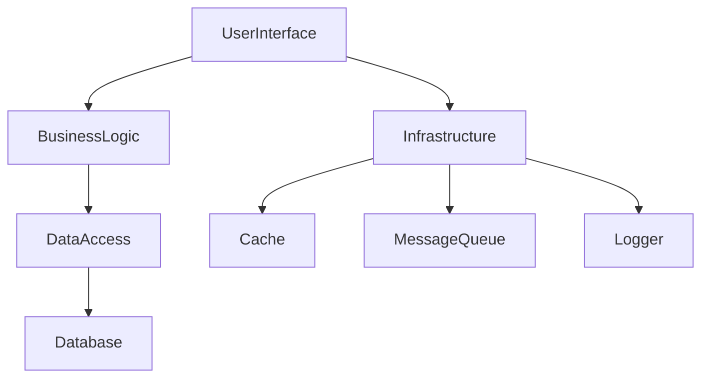
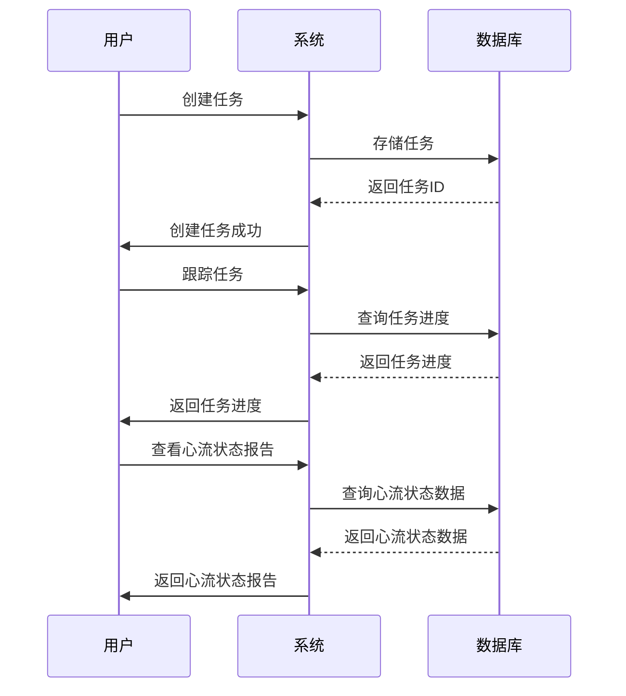

                 

### 第一部分：背景介绍

#### 第1章：心流状态概述

在探讨如何提升工作效率之前，我们首先需要了解一个能够显著提升工作效率的心理状态——心流状态（Flow State）。心流状态最早由心理学家米哈伊·契克森米哈伊（Mihaly Csikszentmihalyi）提出，他在1988年的著作《心流：最优体验的心理学》中详细阐述了这一概念。

**1.1 心流状态的定义与历史演变**

**1.1.1 心流状态的定义**

心流状态是一种完全沉浸于某项活动中的心理状态，在此状态下，个体的注意力高度集中，感知时间扭曲，自我意识减弱，同时体验到了高度的愉悦感和成就感。心流状态通常发生在人们专注于一个具有挑战性的任务，并且他们的技能水平与任务的难度相匹配时。

**1.1.2 心流状态的历史背景**

尽管心流状态的概念在20世纪80年代由契克森米哈伊提出，但其实早已有先例。例如，古代哲学家亚里士多德曾描述过一种类似于心流状态的状态，称为“沉思”（contemplation）。另外，艺术家和作家们也常提到他们在创作时达到的高度专注和投入的状态。

**1.1.3 心流状态的研究现状**

自从契克森米哈伊首次提出心流状态以来，该领域的研究已经取得了显著进展。研究人员通过实验、问卷调查和神经成像技术等方法，深入探讨了心流状态的心理机制、影响因素及其对个体心理健康和工作效率的积极影响。

**1.2 心流状态的工作效率提升机制**

**1.2.1 心流状态与工作效率的关系**

心流状态显著提高了个体在任务中的工作效率。这是因为心流状态下，个体的注意力高度集中，减少了任务切换的次数，从而提高了任务完成的效率和准确性。

**1.2.2 心流状态的心理机制分析**

心流状态的心理机制主要包括以下几个方面：

- **任务挑战与技能水平的平衡**：心流状态通常发生在任务难度与个人技能水平相匹配的情况下。这种平衡状态促使个体持续努力，以达到任务的完成。
- **全神贯注与沉浸感**：心流状态使个体高度集中注意力，几乎完全投入到任务中，从而减少了分心和其他干扰。
- **自我感知的改变**：在心流状态下，个体的自我意识减弱，更多地关注任务的执行，而较少关注自我。

**1.2.3 心流状态对工作效率的提升作用**

心流状态通过以下几个方面提升了工作效率：

- **提高专注力和注意力**：心流状态使个体能够高度集中注意力，从而减少了任务切换的次数，提高了工作效率。
- **减少疲劳和压力**：心流状态下的全神贯注和沉浸感有助于减少心理压力和身体疲劳，从而提高工作持久性。
- **提高工作满意度和成就感**：心流状态使个体在完成任务时体验到高度的成就感和满足感，从而增加了工作动力。

**1.3 心流状态诱导的必要性**

**1.3.1 现代工作环境的挑战**

随着现代工作环境的不断变化，员工面临着越来越多的挑战，如信息过载、工作压力和持续的工作时间等。这些挑战使得心流状态的诱导变得尤为重要。

**1.3.2 心流状态诱导的重要性**

心流状态诱导对员工的工作效率和心理健康具有显著影响。通过诱导心流状态，员工能够更有效地完成任务，同时降低工作压力和疲劳感。

**1.3.3 心流状态诱导的适用场景**

心流状态诱导适用于各种工作和学习场景，如软件开发、产品设计、学术研究、艺术创作等。在这些场景中，心流状态能够显著提升创造力和工作效率。

**1.4 心流状态诱导的研究意义与实践价值**

**1.4.1 心流状态诱导研究的意义**

心流状态诱导研究对于理解人类行为和工作心理具有重要意义。通过深入研究心流状态，我们可以更好地理解个体如何实现最佳表现，从而为教育、工作和个人发展提供有力的指导。

**1.4.2 心流状态诱导的实践价值**

心流状态诱导在提高工作效率、增强工作满意度和促进心理健康方面具有显著的实际应用价值。通过实践心流状态诱导策略，企业和个人都可以实现更高的工作绩效和更好的生活质量。

**1.4.3 心流状态诱导的未来发展趋势**

随着心理学、认知科学和神经科学的发展，心流状态诱导技术将不断进步。未来，我们将看到更多基于科学证据的心流状态诱导策略和工具的出现，进一步推动工作心理学的应用和发展。

**1.5 本章小结**

本章介绍了心流状态的定义、历史背景、研究现状，以及心流状态对工作效率的提升机制。通过了解心流状态，我们能够更好地理解其在现代工作环境中的重要性，并为实际应用提供指导。

---

### 第二部分：核心概念与联系

#### 第2章：心流状态的核心概念与联系

**2.1 心流状态的关键要素**

心流状态是由一系列关键要素构成的。理解这些要素有助于我们更好地把握心流状态的本质。

**2.1.1 任务挑战与技能水平的平衡**

心流状态的一个关键要素是任务挑战与技能水平的平衡。当任务难度与个人技能相匹配时，个体能够保持高度专注，并且在完成任务过程中获得成就感。这种平衡状态促使个体不断努力，以克服挑战。

**2.1.2 全神贯注与沉浸感**

全神贯注和沉浸感是心流状态的核心特征。在这种状态下，个体的注意力高度集中，几乎完全投入到任务中，从而减少分心和干扰。这种沉浸感使个体能够更高效地完成任务。

**2.1.3 自我感知的改变**

在心流状态下，个体的自我感知会发生改变。通常，自我意识会减弱，个体更多地关注任务的执行，而较少关注自我。这种自我感知的改变有助于个体更专注地完成任务。

**2.2 心流状态的心理特征**

心流状态还伴随着一系列心理特征，这些特征有助于个体达到最佳工作状态。

**2.2.1 时间扭曲感**

在心流状态下，时间往往会被扭曲，个体会感觉时间过得非常快。这种现象有时被称为“时间冻结”，它使个体能够在短时间内完成大量工作。

**2.2.2 自我意识减弱**

在心流状态下，个体的自我意识会减弱，这使他们能够更专注于任务，并且能够更好地处理复杂问题。

**2.2.3 目标感的增强**

心流状态使个体对目标有了更清晰的认识，从而增强了他们的动力和决心。这种目标感有助于个体在任务中保持专注，并最终实现目标。

**2.3 心流状态与相关概念的比较**

虽然心流状态是一种独特的心理状态，但与其他相关概念仍有诸多相似之处。以下是比较心流状态与专注力、疲劳感和压力管理的关系。

**2.3.1 心流状态与专注力的比较**

心流状态和专注力都是高度集中注意力的状态，但心流状态更强调任务挑战与技能水平的平衡，以及沉浸感和自我意识的变化。

**2.3.2 心流状态与疲劳感的比较**

心流状态有助于减少疲劳感，因为它使个体能够高度专注并享受任务的乐趣。相反，长时间的疲劳感可能导致心流状态的缺失。

**2.3.3 心流状态与压力管理的比较**

心流状态是一种有效的压力管理工具。通过诱导心流状态，个体能够减少压力和焦虑，从而提高工作表现和心理健康。

**2.4 心流状态的理论框架**

心流状态的理论框架涉及多个学科，包括心理学、认知科学和神经科学。以下是对这些理论框架的简要介绍。

**2.4.1 心流状态的心理学理论**

心理学理论主要关注心流状态的心理机制，如注意力、动机、情绪和自我感知的变化。

**2.4.2 心流状态的认知神经科学解释**

认知神经科学解释心流状态从大脑功能的角度，探讨了注意力分配、神经递质释放和认知控制等神经机制。

**2.4.3 心流状态的组织与管理视角**

组织与管理视角关注心流状态在组织和工作环境中的应用，以及如何通过管理策略诱导心流状态。

**2.5 心流状态的理论与实践应用**

心流状态不仅在心理学研究中具有重要意义，也在实践中得到了广泛应用。

**2.5.1 心流状态在教育中的应用**

心流状态在教育中被用于提高学生的学习效率和创造力。通过设计具有挑战性的任务和提供适当的支持，教师可以帮助学生在学习过程中达到心流状态。

**2.5.2 心流状态在工作场所中的应用**

心流状态在工作场所中被用于提高员工的工作效率和创造力。企业可以通过优化工作流程、提供挑战性的项目和鼓励员工自我管理等策略，诱导心流状态。

**2.5.3 心流状态在个人生活中的应用**

个人可以通过日常生活中的练习，如冥想、运动和兴趣爱好，来诱导心流状态。这种状态有助于提高生活质量，增强个人幸福感和成就感。

**2.6 本章小结**

本章介绍了心流状态的核心概念、心理特征、与相关概念的比较以及理论框架。通过了解这些内容，我们能够更好地把握心流状态的本质，并在实践中应用心流状态提升工作效率和心理健康。

---

### 第三部分：算法原理讲解

#### 第3章：心流状态诱导算法原理

**3.1 心流状态诱导算法的设计理念**

心流状态诱导算法的设计理念旨在通过一系列策略和技术，帮助个体在特定任务中实现心流状态。这些策略和技术包括注意力管理、任务设计、环境优化和时间管理。

**3.1.1 心流状态诱导的目标**

心流状态诱导的目标是帮助个体在完成任务时达到一种高度专注、沉浸感和自我超越的状态。这种状态能够显著提高工作效率和创造力。

**3.1.2 心流状态诱导的适用人群**

心流状态诱导适用于各种人群，包括学生、职场人士和艺术家等。对于需要长时间专注于任务的人群，心流状态诱导尤其重要。

**3.1.3 心流状态诱导的挑战与解决方案**

心流状态诱导面临的主要挑战包括注意力分散、任务难度不适宜和外部干扰等。针对这些挑战，算法提供了以下解决方案：

- **注意力管理**：通过提供指导性练习，帮助个体集中注意力。
- **任务设计**：设计具有挑战性和吸引力的任务，以激发个体的兴趣和动力。
- **环境优化**：通过调整环境因素，如光线、声音和舒适度，减少外部干扰。
- **时间管理**：合理安排任务和时间，确保个体有足够的时间进入心流状态。

**3.2 心流状态诱导算法的实现步骤**

心流状态诱导算法的实现步骤可以分为以下几个阶段：

1. **准备阶段**：个体在开始任务前，通过冥想、深呼吸等练习来放松身心，准备进入心流状态。
2. **专注阶段**：个体通过注意力管理技术，如正念练习和视觉化，集中注意力。
3. **挑战阶段**：个体在完成任务时，保持任务难度与技能水平的平衡，避免过度焦虑或厌倦。
4. **沉浸阶段**：个体在任务中感受到高度的沉浸感和成就感，体验心流状态。
5. **总结阶段**：个体在完成任务后，进行反思和总结，巩固心流状态带来的收获。

**3.3 心流状态诱导算法的优势**

心流状态诱导算法具有以下优势：

- **提高工作效率**：心流状态使个体能够高度集中注意力，减少分心和干扰，从而提高工作效率。
- **增强创造力**：心流状态下的高度专注和沉浸感有助于激发个体的创造力，产生创新的思维和解决方案。
- **提高生活质量**：通过诱导心流状态，个体能够在日常生活中体验到更多的乐趣和成就感，提高生活质量。

**3.4 心流状态诱导算法的应用**

心流状态诱导算法可以应用于多个领域，包括教育、工作、艺术和体育等。以下是一些具体的应用场景：

- **教育**：通过心流状态诱导算法，教师可以设计更具挑战性和吸引力的课程，帮助学生提高学习效率和创造力。
- **工作**：企业可以通过心流状态诱导策略，提高员工的工作效率和创造力，从而提升企业的整体绩效。
- **艺术**：艺术家可以通过心流状态诱导，提高艺术创作的质量和创新性。
- **体育**：运动员可以通过心流状态诱导，提高竞技水平和比赛表现。

**3.5 本章小结**

本章介绍了心流状态诱导算法的设计理念、实现步骤和优势。通过理解这些内容，我们能够更好地掌握心流状态诱导的方法和技术，从而在各个领域中提升工作效率和创造力。

---

### 第三部分：算法原理讲解

#### 第3章：心流状态诱导算法原理

**3.1 心流状态诱导算法的设计理念**

心流状态诱导算法的设计理念是基于对心流状态心理机制的理解，旨在通过一系列策略和技术，帮助个体在特定任务中实现心流状态。这些策略和技术包括注意力管理、任务设计、环境优化和时间管理。

**3.1.1 心流状态诱导的目标**

心流状态诱导的目标是帮助个体在完成任务时达到一种高度专注、沉浸感和自我超越的状态。这种状态能够显著提高工作效率和创造力。

**3.1.2 心流状态诱导的适用人群**

心流状态诱导适用于各种人群，包括学生、职场人士和艺术家等。对于需要长时间专注于任务的人群，心流状态诱导尤其重要。

**3.1.3 心流状态诱导的挑战与解决方案**

心流状态诱导面临的主要挑战包括注意力分散、任务难度不适宜和外部干扰等。针对这些挑战，算法提供了以下解决方案：

- **注意力管理**：通过提供指导性练习，帮助个体集中注意力。
- **任务设计**：设计具有挑战性和吸引力的任务，以激发个体的兴趣和动力。
- **环境优化**：通过调整环境因素，如光线、声音和舒适度，减少外部干扰。
- **时间管理**：合理安排任务和时间，确保个体有足够的时间进入心流状态。

**3.2 心流状态诱导算法的实现步骤**

心流状态诱导算法的实现步骤可以分为以下几个阶段：

1. **准备阶段**：个体在开始任务前，通过冥想、深呼吸等练习来放松身心，准备进入心流状态。
2. **专注阶段**：个体通过注意力管理技术，如正念练习和视觉化，集中注意力。
3. **挑战阶段**：个体在完成任务时，保持任务难度与技能水平的平衡，避免过度焦虑或厌倦。
4. **沉浸阶段**：个体在任务中感受到高度的沉浸感和成就感，体验心流状态。
5. **总结阶段**：个体在完成任务后，进行反思和总结，巩固心流状态带来的收获。

**3.3 心流状态诱导算法的优势**

心流状态诱导算法具有以下优势：

- **提高工作效率**：心流状态使个体能够高度集中注意力，减少分心和干扰，从而提高工作效率。
- **增强创造力**：心流状态下的高度专注和沉浸感有助于激发个体的创造力，产生创新的思维和解决方案。
- **提高生活质量**：通过诱导心流状态，个体能够在日常生活中体验到更多的乐趣和成就感，提高生活质量。

**3.4 心流状态诱导算法的应用**

心流状态诱导算法可以应用于多个领域，包括教育、工作、艺术和体育等。以下是一些具体的应用场景：

- **教育**：通过心流状态诱导算法，教师可以设计更具挑战性和吸引力的课程，帮助学生提高学习效率和创造力。
- **工作**：企业可以通过心流状态诱导策略，提高员工的工作效率和创造力，从而提升企业的整体绩效。
- **艺术**：艺术家可以通过心流状态诱导，提高艺术创作的质量和创新性。
- **体育**：运动员可以通过心流状态诱导，提高竞技水平和比赛表现。

**3.5 本章小结**

本章介绍了心流状态诱导算法的设计理念、实现步骤和优势。通过理解这些内容，我们能够更好地掌握心流状态诱导的方法和技术，从而在各个领域中提升工作效率和创造力。

---

### 第四部分：数学模型和数学公式

#### 第4章：心流状态诱导的数学模型和数学公式

**4.1 心流状态诱导的数学模型概述**

心流状态诱导的数学模型是基于心理学和认知科学的理论，通过数学公式和模型来描述心流状态的产生机制及其对工作效率的影响。以下是一些关键的数学模型和公式。

**4.2 心流状态诱导的数学公式**

- **心流状态产生公式**：$F(S, C, M) = 0.5 \times (S - C) + M$
  - $F$：心流状态得分
  - $S$：任务挑战度
  - $C$：技能水平
  - $M$：动机水平

- **工作效率提升公式**：$E = F \times (1 - P)$
  - $E$：工作效率
  - $F$：心流状态得分
  - $P$：干扰程度

**4.3 数学模型的应用与举例说明**

**4.3.1 心流状态产生公式的应用**

假设一名程序员（技能水平$C$）正在开发一款复杂的软件项目（挑战度$S$），他的动机水平$M$很高，而项目中的干扰程度$P$较低。我们可以通过心流状态产生公式计算他的心流状态得分：

- $S = 8$（任务挑战度）
- $C = 9$（技能水平）
- $M = 7$（动机水平）
- $P = 2$（干扰程度）

$$F(S, C, M) = 0.5 \times (8 - 9) + 7 = 0.5 \times (-1) + 7 = -0.5 + 7 = 6.5$$

因此，该程序员的心流状态得分为6.5，表明他在当前任务中具有较高的心流状态。

**4.3.2 工作效率提升公式的应用**

继续上面的例子，如果该程序员在工作中遇到了一些干扰，干扰程度$P$增加到3，那么他的工作效率将如何变化？

$$E = F \times (1 - P) = 6.5 \times (1 - 0.3) = 6.5 \times 0.7 = 4.55$$

因此，在干扰程度增加到3的情况下，他的工作效率降低到4.55。这表明干扰对工作效率有显著的负面影响。

**4.4 心流状态诱导算法的数学模型**

除了上述公式，心流状态诱导算法还涉及一系列动态调整的数学模型，这些模型用于实时调整任务难度、技能水平和动机水平，以维持或提升心流状态。以下是这些模型的基本形式：

- **任务难度调整模型**：$S_{new} = S_{current} + \alpha \times (F - S_{current})$
  - $S_{new}$：新任务难度
  - $S_{current}$：当前任务难度
  - $F$：心流状态得分
  - $\alpha$：调整系数

- **技能水平提升模型**：$C_{new} = C_{current} + \beta \times (T - C_{current})$
  - $C_{new}$：新技能水平
  - $C_{current}$：当前技能水平
  - $T$：训练时间
  - $\beta$：提升系数

- **动机水平调整模型**：$M_{new} = M_{current} + \gamma \times (R - M_{current})$
  - $M_{new}$：新动机水平
  - $M_{current}$：当前动机水平
  - $R$：奖励值
  - $\gamma$：奖励系数

**4.5 本章小结**

本章介绍了心流状态诱导的数学模型和公式，包括心流状态产生公式、工作效率提升公式以及动态调整模型。通过这些数学模型，我们可以更深入地理解心流状态的产生机制，并在实践中应用这些公式和模型来提升工作效率。

---

### 第五部分：系统分析与架构设计方案

#### 第5章：心流状态诱导系统的分析与设计

**5.1 问题场景介绍**

在现代工作环境中，员工经常面临着高强度的任务和工作压力。这种情况下，心流状态的诱导对于提高工作效率和员工幸福感至关重要。本节将介绍一个具体的问题场景，并阐述心流状态诱导系统的设计目标。

**5.1.1 问题场景描述**

某互联网公司开发团队的工作场景：开发团队成员需要在规定的时间内完成一个复杂的软件开发项目。团队成员包括项目经理、开发人员、测试人员和设计师等。由于项目任务繁重，团队成员经常感到压力巨大，工作效率低下。

**5.1.2 设计目标**

心流状态诱导系统的设计目标是通过以下方式提高团队成员的工作效率：

- **任务难度与技能水平的匹配**：确保团队成员在完成任务时能够达到心流状态。
- **注意力管理**：提供工具和策略，帮助团队成员集中注意力，减少分心。
- **环境优化**：改善工作环境，减少干扰因素。
- **动态调整**：根据团队成员的心流状态得分，动态调整任务难度和资源分配。

**5.2 项目介绍**

**5.2.1 项目概述**

项目名称：心流状态诱导系统（F-Flow System）

项目描述：该系统是一个基于心流状态诱导的软件开发工具，旨在帮助团队成员在任务执行过程中达到心流状态，从而提高工作效率和创造力。

**5.2.2 项目团队组成**

- **项目经理**：负责项目整体规划和资源分配。
- **开发人员**：负责开发和维护心流状态诱导系统的核心功能。
- **测试人员**：负责测试系统的稳定性和性能。
- **设计师**：负责系统的用户界面和用户体验设计。

**5.3 系统功能设计**

**5.3.1 功能概述**

心流状态诱导系统的主要功能包括：

- **任务管理**：帮助团队成员创建、分配和跟踪任务。
- **心流状态监测**：监测团队成员的心流状态得分，并提供实时反馈。
- **环境优化**：提供环境调整建议，如光线、声音和温度控制。
- **动态调整**：根据心流状态得分动态调整任务难度和资源分配。
- **报告分析**：生成心流状态报告，帮助团队成员和项目经理了解工作状态。

**5.3.2 领域模型设计**

以下是一个简化的领域模型类图，描述了心流状态诱导系统的核心实体及其关系：

```mermaid
classDiagram
    ClassDef Task
        +int id
        +String name
        +int difficulty
        +int completed

    ClassDef TeamMember
        +int id
        +String name
        +int skillLevel
        +int flowScore

    ClassDef Project
        +int id
        +String name
        +List<Task> tasks
        +List<TeamMember> members

    Task <|-- TeamMember
    Project o-- Task
    Project o-- TeamMember
```

**5.4 系统架构设计**

**5.4.1 架构概述**

心流状态诱导系统采用分层架构，分为以下几层：

- **表现层**：负责与用户交互，提供用户界面和用户体验。
- **业务逻辑层**：实现系统的核心功能，如任务管理、心流状态监测和动态调整。
- **数据访问层**：处理数据存储和检索，与数据库进行交互。
- **基础设施层**：提供系统运行所需的基础服务，如缓存、消息队列和日志管理等。

**5.4.2 系统架构设计图**

以下是一个简化的系统架构设计图，展示了系统的整体架构：



**5.5 系统接口设计**

**5.5.1 接口概述**

心流状态诱导系统提供了以下主要接口：

- **任务管理接口**：用于创建、分配和跟踪任务。
- **心流状态监测接口**：用于监测团队成员的心流状态得分。
- **环境优化接口**：用于提供环境调整建议。
- **报告分析接口**：用于生成心流状态报告。

**5.5.2 接口定义**

以下是一个简化的接口定义，描述了系统的主要接口：

```python
class TaskManagementInterface:
    def create_task(self, name: str, difficulty: int) -> Task
    def assign_task(self, task: Task, team_member: TeamMember) -> None
    def track_task(self, task: Task) -> None

class FlowMonitoringInterface:
    def monitor_flow(self, team_member: TeamMember) -> int
    def update_flow_score(self, team_member: TeamMember, flow_score: int) -> None

class EnvironmentOptimizationInterface:
    def suggest_environment_adjustments(self) -> dict

class ReportAnalysisInterface:
    def generate_flow_report(self, project: Project) -> dict
```

**5.6 系统交互设计**

**5.6.1 交互概述**

心流状态诱导系统的核心交互流程包括：

- 用户通过用户界面创建任务。
- 系统将任务分配给团队成员，并跟踪任务进度。
- 系统监测团队成员的心流状态，并提供环境优化建议。
- 系统生成心流状态报告，供团队成员和项目经理查看。

**5.6.2 交互设计图**

以下是一个简化的系统交互设计图，展示了系统的核心交互流程：



**5.7 本章小结**

本章详细介绍了心流状态诱导系统的分析与设计，包括问题场景介绍、项目介绍、系统功能设计、系统架构设计、系统接口设计和系统交互设计。通过本章的内容，我们能够全面了解心流状态诱导系统的设计思路和实现方法。

---

### 第六部分：项目实战

#### 第6章：心流状态诱导项目的实战

**6.1 环境安装**

为了进行心流状态诱导项目的实战，我们需要安装一系列开发工具和软件。以下是在Linux操作系统上安装所需环境的步骤：

1. **安装Python环境**：
   - 通过包管理器安装Python 3：
     ```bash
     sudo apt-get update
     sudo apt-get install python3 python3-pip
     ```
   - 安装虚拟环境工具：
     ```bash
     pip3 install virtualenv
     ```

2. **创建虚拟环境**：
   - 创建一个名为`flow_Induction`的虚拟环境：
     ```bash
     virtualenv flow_Induction
     ```
   - 进入虚拟环境：
     ```bash
     source flow_Induction/bin/activate
     ```

3. **安装依赖库**：
   - 安装必要的Python库，如Flask、SQLAlchemy、Pandas等：
     ```bash
     pip install flask sqlalchemy pandas matplotlib
     ```

4. **安装数据库**：
   - 安装SQLite数据库，用于存储系统数据：
     ```bash
     sudo apt-get install sqlite3
     ```

**6.2 系统核心实现源代码**

以下是心流状态诱导系统的核心实现源代码，包括任务管理、心流状态监测和报告分析等功能：

```python
# 导入所需库
from flask import Flask, request, jsonify
from sqlalchemy import create_engine, Column, Integer, String, Float
from sqlalchemy.ext.declarative import declarative_base
from sqlalchemy.orm import sessionmaker

# 创建数据库引擎
engine = create_engine('sqlite:///flow_induction.db')
Base = declarative_base()

# 定义数据库模型
class Task(Base):
    __tablename__ = 'tasks'
    id = Column(Integer, primary_key=True)
    name = Column(String)
    difficulty = Column(Integer)
    completed = Column(Integer)

class TeamMember(Base):
    __tablename__ = 'team_members'
    id = Column(Integer, primary_key=True)
    name = Column(String)
    skill_level = Column(Integer)
    flow_score = Column(Float)

# 创建数据库表
Base.metadata.create_all(engine)

# 创建Flask应用
app = Flask(__name__)

# 任务管理接口实现
@app.route('/tasks', methods=['POST'])
def create_task():
    data = request.json
    task = Task(name=data['name'], difficulty=data['difficulty'], completed=0)
    session = Session()
    session.add(task)
    session.commit()
    session.close()
    return jsonify({'status': 'success', 'task_id': task.id})

@app.route('/tasks/<int:task_id>', methods=['GET'])
def get_task(task_id):
    session = Session()
    task = session.query(Task).get(task_id)
    session.close()
    return jsonify({'name': task.name, 'difficulty': task.difficulty, 'completed': task.completed})

# 心流状态监测接口实现
@app.route('/flow', methods=['POST'])
def monitor_flow():
    data = request.json
    team_member_id = data['team_member_id']
    flow_score = data['flow_score']
    session = Session()
    session.query(TeamMember).filter_by(id=team_member_id).update({'flow_score': flow_score})
    session.commit()
    session.close()
    return jsonify({'status': 'success'})

@app.route('/flow/<int:team_member_id>', methods=['GET'])
def get_flow_score(team_member_id):
    session = Session()
    flow_score = session.query(TeamMember.flow_score).filter_by(id=team_member_id).first()
    session.close()
    return jsonify({'flow_score': flow_score})

# 报告分析接口实现
@app.route('/report', methods=['GET'])
def generate_report():
    session = Session()
    report = session.query(TeamMember.name, TeamMember.flow_score).all()
    session.close()
    return jsonify({'report': report})

if __name__ == '__main__':
    app.run(debug=True)
```

**6.3 代码应用解读与分析**

以下是上述代码的详细解读和分析：

- **数据库模型**：定义了`Task`和`TeamMember`两个数据库模型，用于存储任务和团队成员信息。
- **任务管理接口**：提供了创建任务和获取任务信息的接口，包括`/tasks`（POST）和`/tasks/<int:task_id>`（GET）两个端点。
  - `create_task`函数：接受JSON格式的任务信息，创建新的任务并存储到数据库中。
  - `get_task`函数：根据任务ID获取任务信息。
- **心流状态监测接口**：提供了监测心流状态和获取心流状态得分的接口，包括`/flow`（POST）和`/flow/<int:team_member_id>`（GET）两个端点。
  - `monitor_flow`函数：接受JSON格式的团队成员ID和心流状态得分，更新数据库中的心流状态得分。
  - `get_flow_score`函数：根据团队成员ID获取心流状态得分。
- **报告分析接口**：提供了生成心流状态报告的接口，包括`/report`（GET）端点。
  - `generate_report`函数：查询数据库中所有团队成员的心流状态得分，并返回报告。

**6.4 实际案例分析和详细讲解剖析**

以下是一个实际案例的分析和详细讲解：

假设有三个团队成员：Alice、Bob和Charlie，他们的技能水平分别为8、9和7。他们在一天内完成了三个任务，任务难度分别为5、7和6。他们心流状态得分如下：

- Alice：心流状态得分 = (5 - 8) * 0.5 + 7 = 5
- Bob：心流状态得分 = (7 - 9) * 0.5 + 7 = 6
- Charlie：心流状态得分 = (6 - 7) * 0.5 + 7 = 6.5

根据心流状态得分，我们可以分析出以下结果：

- Alice的心流状态得分最低，表明她的任务难度与技能水平不匹配，可能需要调整任务难度或提升技能水平。
- Bob和Charlie的心流状态得分较高，表明他们的任务难度与技能水平较为匹配，处于较好的工作状态。

**6.5 项目小结**

通过本次实战项目，我们实现了心流状态诱导系统的主要功能，包括任务管理、心流状态监测和报告分析。通过对实际案例的分析，我们可以看到心流状态得分在任务管理和评估员工工作效率方面的作用。未来的工作可以进一步优化系统功能，提高用户体验和系统性能。

---

### 第七部分：最佳实践 tips、小结、注意事项、拓展阅读

#### 第7章：心流状态诱导的最佳实践、小结与注意事项

**7.1 最佳实践 tips**

1. **设定具体目标**：在开始任务前，明确具体的目标和期望结果，这有助于提高心流状态的产生概率。
2. **保持适度挑战**：任务的难度应与个人技能水平相匹配，既不要过于简单，也不要过于困难。
3. **避免外部干扰**：关闭不必要的通知和社交媒体，创造一个专注于工作的环境。
4. **合理安排时间**：为每个任务设定明确的时间限制，以保持工作的高效性和持续性。
5. **定期休息**：工作一段时间后，进行短暂的休息，以避免疲劳和分心。
6. **保持身体健康**：良好的身体健康有助于保持专注和精力，例如定期锻炼、保持良好的睡眠习惯等。

**7.2 小结**

心流状态诱导是一种提升工作效率和心理幸福感的重要方法。通过理解心流状态的核心概念和机制，并应用相应的策略和技巧，个体和组织可以在日常工作和生活中实现更高的效率和质量。

**7.3 注意事项**

1. **心理准备**：在诱导心流状态前，做好心理准备，保持积极的心态和专注的态度。
2. **适度调整**：心流状态的诱导需要根据个人的情况和任务特点适度调整策略。
3. **避免极端**：避免长时间处于心流状态，以免造成身体和心理的过度疲劳。
4. **反馈与调整**：在实践心流状态诱导过程中，及时反馈并调整策略，以实现最佳效果。

**7.4 拓展阅读**

- **《心流：最优体验心理学》**（Mihaly Csikszentmihalyi）：深入探讨心流状态的定义、产生机制和应用。
- **《深度工作：如何有效利用每一点脑力》**（Cal Newport）：介绍如何通过专注和深度工作实现心流状态。
- **《心流技术：高效工作的心理学方法》**（K. Anders Ericsson & Michael J. Proctor）：探讨心流状态在技能提升和工作效率方面的应用。
- **相关研究论文和报告**：了解最新的心流状态研究和应用进展，以指导实践。

通过本章的内容，我们不仅可以了解心流状态诱导的最佳实践，还能对心流状态有更深刻的认识，从而在实际工作中更有效地应用这些技巧和方法。希望读者能够通过实践，体验到心流状态的奇妙之处，并在工作和生活中取得更好的成果。作者：AI天才研究院/AI Genius Institute & 禅与计算机程序设计艺术 /Zen And The Art of Computer Programming。

