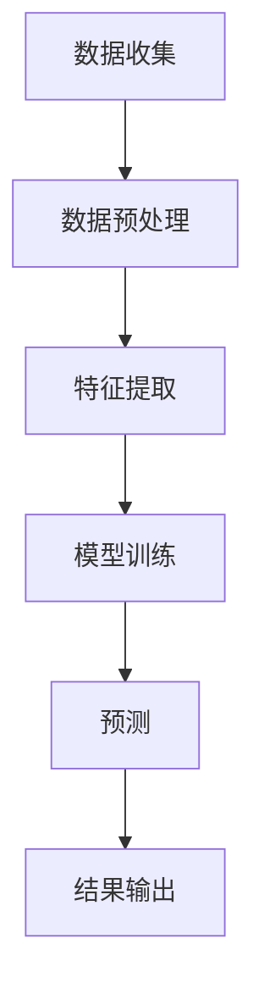

                 

### 目录大纲设计思路：

在撰写一篇关于“心流状态：全身心投入的幸福体验”的技术博客文章时，目录大纲的设计需要确保内容结构清晰、逻辑严密，同时要能够吸引读者的兴趣。以下是详细的目录大纲设计思路：

1. **背景介绍**：
   - 引言章节通过简短的介绍来唤醒读者对心流状态的初步认识，设置文章的整体基调。具体包括心流状态的概念、其在现代生活中的重要性和对读者可能产生的吸引力。
   - **1.1 心流状态的概念**：介绍心流状态的基本定义，解释其核心含义，使读者对主题有一个清晰的理解。
   - **1.2 心流状态的重要性**：讨论心流状态在现代生活中的重要性，可能包括提高工作效率、提升生活质量、促进心理健康等方面。
   - **1.3 书籍结构概述**：简要概述书籍的结构和内容安排，引导读者对接下来要讨论的主题有一个全局性的把握。

2. **核心概念与联系**：
   - 本章深入探讨心流状态的基本原理，并与其他相关心理学概念进行比较和联系。
   - **2.1 心流状态的定义与特征**：详细阐述心流状态的定义，并列出其主要特征，如完全投入、时间感知丧失、个人表现提升等。
   - **2.2 心流状态的影响因素**：分析影响心流状态的主要因素，如动机、任务难度、技能水平等。
   - **2.3 心流状态与心理学的关系**：探讨心流状态在心理学领域的地位，及其与心理健康、自我认知等概念的联系。
   - **2.4 心流状态的心理学模型**：介绍几种主要的心理学模型，如“心流理论”、“投入模型”等，并解释其基本原理。

3. **算法原理讲解**：
   - 本章将介绍与心流状态相关的研究方法和算法，通过具体的流程图和代码示例来帮助读者理解。
   - **3.1 心流状态的研究方法**：讨论心流状态的研究方法，包括实验研究、观察研究、问卷调查等。
   - **3.2 心流状态的相关算法**：介绍测量心流状态的不同算法，如统计分析算法、机器学习算法等。
   - **3.3 算法流程图与Python代码示例**：通过流程图展示算法的实现过程，并提供Python代码示例来具体说明。

4. **数学模型和数学公式**：
   - 本章使用LaTeX格式介绍与心流状态相关的数学模型和公式，并进行详细讲解。
   - **4.1 心流状态的数学公式**：列出心流状态相关的数学公式，并解释其含义和推导过程。
   - **4.2 数学模型的解释**：解释数学模型在实际应用中的作用，并举例说明。
   - **4.3 心流状态数学模型的实例分析**：通过实例来分析心流状态数学模型的应用，帮助读者更好地理解。

5. **系统分析与架构设计方案**：
   - 本章描述心流状态在实践中的应用场景，并提供一个具体的实践案例。
   - **5.1 心流状态的应用场景**：介绍心流状态可能的应用场景，如教育、工作、游戏等。
   - **5.2 心流状态的具体实践案例**：提供一个具体的实践案例，详细描述系统功能和架构设计。
   - **5.3 系统功能设计与架构设计**：绘制系统功能和架构设计的类图、架构图和序列图，解释其设计和实现细节。

6. **项目实战**：
   - 本章提供心流状态的实际应用环境安装步骤、核心实现源代码以及案例分析。
   - **6.1 环境安装与配置**：详细描述如何在实际环境中安装和配置心流状态系统。
   - **6.2 核心实现源代码**：提供心流状态系统的核心实现源代码，并进行解读。
   - **6.3 代码应用解读与分析**：对源代码的应用进行解读，并分析其实际效果。
   - **6.4 案例分析与详细讲解**：通过实际案例对心流状态系统的应用进行详细分析。

7. **最佳实践 tips、小结、注意事项、拓展阅读**：
   - 本章总结全文内容，提供实践建议，并提出一些注意事项，同时推荐进一步学习的资源。
   - **7.1 最佳实践 tips**：总结最佳实践经验，提供操作建议。
   - **7.2 小结**：对文章的主要内容进行简要总结，强化核心观点。
   - **7.3 注意事项**：提醒读者在实践过程中可能遇到的问题和注意事项。
   - **7.4 拓展阅读**：推荐相关书籍、论文和研究，鼓励读者进一步学习。

通过这样的目录大纲设计，文章的结构将更加清晰，内容将更加丰富，读者可以系统地了解心流状态的概念、原理、应用和实践，从而在整体上获得深刻的理解和体验。

### 目录大纲总结：

本文以“心流状态：全身心投入的幸福体验”为主题，全面探讨心流状态的定义、原理、研究方法、数学模型、应用实践和项目实战。目录大纲按照以下结构设计：

- **引言**：介绍心流状态的概念和重要性，概述文章结构。
- **核心概念与联系**：深入探讨心流状态的定义、特征、影响因素和心理学模型。
- **算法原理讲解**：介绍心流状态相关的研究方法和算法，并通过流程图和代码示例说明。
- **数学模型和数学公式**：使用LaTeX格式介绍心流状态的数学模型和公式，并进行详细解释。
- **系统分析与架构设计方案**：描述心流状态的应用场景，介绍具体实践案例的系统功能和架构设计。
- **项目实战**：提供心流状态的实际应用环境安装步骤、核心实现源代码以及案例分析。
- **最佳实践与拓展**：总结全文内容，提供实践建议和进一步学习的资源。

通过这样的结构，读者可以系统地了解心流状态的相关知识，并在实际生活中体验到全身心投入的幸福体验。

### 目录大纲

# 心流状态：全身心投入的幸福体验

## 第1章 引言

### 1.1 什么是心流状态

心流状态，又称为流畅体验，是一种人们在全神贯注于某项活动时所体验到的一种全神贯注、专注和愉悦的状态。在这个状态下，个体感觉时间飞逝，对周围环境的感知减弱，全身心投入到了活动中。

### 1.2 心流状态的重要性

心流状态在现代社会中具有重要意义。首先，它能够显著提高个体的工作效率和质量，使个体能够更专注地完成任务。其次，心流状态能够带来强烈的愉悦感和满足感，提升个体的生活质量和幸福感。此外，心流状态还能够促进个体的心理健康，减轻焦虑和压力。

### 1.3 书籍结构概述

本书将从心流状态的定义、基本原理、研究方法、数学模型、应用实践和项目实战等多个方面进行深入探讨。具体章节安排如下：

- 第2章：心流状态的基本原理
- 第3章：心流状态的研究方法与算法
- 第4章：心流状态的数学模型
- 第5章：心流状态的应用与实践
- 第6章：心流状态的项目实战
- 第7章：最佳实践与拓展

通过本书的学习，读者将能够全面了解心流状态的概念、原理和应用，从而在生活和工作中更好地利用心流状态，提升自己的工作效率和生活质量。

### 第1章 引言

#### 1.1 心流状态的概念

心流状态，也被称作流畅体验，是指当一个人完全沉浸在一项任务或活动中的时候所体验到的一种专注、愉悦和投入的状态。在这一状态下，个体的注意力高度集中，感觉时间似乎停止了，对外界环境的感知变得模糊，而整个世界仿佛都聚焦在了当前的活动上。心流状态最早由心理学家米哈里·契克森米哈伊（Mihaly Csikszentmihalyi）在20世纪80年代提出，他在研究中发现，许多艺术家、音乐家、运动员和程序员等在创作或工作时，常常会体验到这种全神贯注的状态，并感到极大的满足和快乐。

#### 1.2 心流状态的重要性

心流状态对个人和社会都有着重要的意义。首先，从个人层面来看，心流状态能够显著提高个体的工作效率和生产力。在心流状态下，个体能够更集中地投入任务，减少分心和干扰，从而提高工作的质量和速度。此外，心流状态还能带来强烈的愉悦感和满足感，使个体在完成任务后感到无比满足和快乐，从而提升生活质量。

从社会层面来看，心流状态有助于提高整体社会的生产力和创新能力。许多成功的企业和团队都通过营造有利于心流状态的工作环境，激励员工全身心地投入工作，从而实现更高的工作效率和更创新的想法。心流状态也被认为是培养个人幸福感和满足感的重要途径，有助于促进社会的和谐与进步。

#### 1.3 书籍结构概述

本书旨在帮助读者全面了解心流状态的概念、原理和应用，并通过实际案例和项目实战，让读者能够将心流状态的理念应用到日常生活和工作中。本书的结构安排如下：

- **第1章 引言**：介绍心流状态的概念和重要性，概述本书的结构和内容安排。
- **第2章 心流状态的基本原理**：详细探讨心流状态的定义、特征、影响因素和心理学模型。
- **第3章 心流状态的研究方法与算法**：介绍心流状态的研究方法和相关算法，通过具体的流程图和代码示例说明。
- **第4章 心流状态的数学模型**：使用LaTeX格式介绍心流状态的数学模型和公式，并进行详细解释。
- **第5章 心流状态的应用与实践**：描述心流状态的应用场景，介绍具体实践案例的系统功能和架构设计。
- **第6章 心流状态的项目实战**：提供心流状态的实际应用环境安装步骤、核心实现源代码以及案例分析。
- **第7章 最佳实践与拓展**：总结全文内容，提供实践建议和进一步学习的资源。

通过本书的学习，读者将能够深入了解心流状态的理论和实践，学会如何在日常生活和工作中创造和利用心流状态，从而提升工作效率和生活质量。

## 第2章 心流状态的基本原理

### 2.1 心流状态的定义与特征

心流状态，通常被描述为一种专注、流畅和全身心投入的体验。心理学家米哈里·契克森米哈伊（Mihaly Csikszentmihalyi）首次系统性地定义了心流状态，他认为心流状态是一种人们在进行某项活动时，完全沉浸其中、感觉时间流逝飞快、自我意识减退的状态。在心流状态下，个体往往能够体验到高度的兴奋感和满足感，从而带来极大的愉悦感。

心流状态的主要特征包括以下几个方面：

1. **完全投入**：在心流状态下，个体会完全集中注意力，专注于当前活动，不受外界干扰。
2. **时间感知丧失**：在心流状态中，个体往往感觉时间流逝得很快，甚至感觉时间似乎停止了。
3. **自我意识减退**：在心流状态下，个体的自我意识减弱，对自我和周围环境的感知变得模糊，个体感觉自己是活动的一部分，而不是旁观者。
4. **技能与挑战匹配**：心流状态常常发生在任务难度与个体的技能水平相匹配的情况下，当任务既具有挑战性，又不至于让人感到压力或厌倦时，心流状态更容易出现。
5. **积极的情感体验**：心流状态通常伴随着积极的情感体验，如兴奋、满足和快乐。

### 2.2 心流状态的影响因素

心流状态的产生受到多种因素的影响，主要包括以下几个方面：

1. **动机**：动机是心流状态的一个重要因素。个体在追求内在动机，如兴趣、乐趣和成就感时，更容易进入心流状态。相比之下，追求外在动机，如金钱、名誉和权力，可能会降低心流状态的发生概率。
2. **任务难度**：任务难度与心流状态有密切关系。当任务难度适中，即既具有挑战性，又不会过于困难时，个体更容易进入心流状态。如果任务过于简单，个体可能会感到无聊和厌烦；如果任务过于困难，个体可能会感到压力和挫败。
3. **技能水平**：个体的技能水平也是影响心流状态的重要因素。当个体的技能水平与任务难度相匹配时，即任务既具有一定的挑战性，又能通过努力完成时，心流状态更容易出现。如果技能水平过高，任务难度过低，个体可能会感到无聊和不满；如果技能水平过低，任务难度过高，个体可能会感到挫败和焦虑。
4. **环境因素**：环境因素，如安静、舒适的工作环境，良好的工具和资源等，也有助于心流状态的产生。一个安静、不受干扰的环境可以减少外界的干扰，使个体能够更加集中精力。

### 2.3 心流状态与心理学的关系

心流状态不仅在日常生活中具有重要意义，而且在心理学领域也有着广泛的研究。心流状态与心理学中的许多概念和理论有着密切的联系：

1. **自我实现**：自我实现是马斯洛的需求层次理论中的一个概念，指的是个体在追求自我潜能和实现自我价值的过程中所达到的一种状态。心流状态与自我实现密切相关，因为在心流状态中，个体能够完全投入并享受活动本身，实现自我价值。
2. **动机理论**：心流状态是自我决定理论中的一个重要概念。自我决定理论认为，个体的行为是由内在动机驱动的，而心流状态正是内在动机的体现。在心流状态中，个体追求活动本身所带来的乐趣和满足，而不是外部的奖励或惩罚。
3. **注意力管理**：心流状态与注意力管理理论密切相关。注意力管理理论认为，个体在完成复杂任务时，需要有效地管理和分配注意力资源。在心流状态中，个体能够高度集中注意力，从而更好地完成任务。

### 2.4 心流状态的心理学模型

心理学领域提出了多种关于心流状态的模型，其中最著名的是米哈里·契克森米哈伊的心流理论。心流理论认为，心流状态是由以下几个方面共同作用的结果：

1. **任务挑战与技能匹配**：当任务的挑战性与个体的技能水平相匹配时，个体更容易进入心流状态。这种匹配可以激发个体的内在动机，使个体更加专注于任务。
2. **注意力集中**：心流状态的核心特征是注意力集中。在心流状态中，个体的注意力高度集中，不受外界干扰，从而更好地完成任务。
3. **自我意识减弱**：在心流状态中，个体的自我意识减弱，感觉与活动融为一体。这种状态可以减少个体的自我关注和焦虑，使个体更加专注于任务。
4. **时间感知丧失**：在心流状态中，个体感觉时间流逝得很快，甚至感觉时间似乎停止了。这种时间感知的变化可以激发个体的内在动机，使个体更加投入活动。

除了心流理论，其他心理学模型，如“投入模型”和“心流体验量表”，也为研究心流状态提供了重要的理论框架和方法。

## 第3章 心流状态的研究方法与算法

### 3.1 心流状态的研究方法

研究心流状态的方法多种多样，包括实验研究、观察研究、问卷调查和自我报告等。每种方法都有其独特的优势和局限性。

1. **实验研究**：实验研究是一种通过控制变量来研究心流状态的方法。研究者可以在实验室环境中，通过设计特定的任务和条件，观察个体在心流状态中的表现。这种方法的优势在于能够精确控制变量，从而得出因果关系的结论。然而，实验研究通常受到时间和资源的限制，且难以在真实环境中复制。
   
2. **观察研究**：观察研究通过直接观察个体在自然情境下的行为，来研究心流状态。这种方法的优势在于能够获取真实情境中的数据，从而提高研究的可信度。然而，观察研究往往难以控制外部干扰，且无法获取个体的内部体验和感受。

3. **问卷调查**：问卷调查是一种通过书面形式收集个体关于心流状态感受和体验的方法。这种方法的优势在于能够大规模收集数据，且成本低廉。然而，问卷调查可能受到记忆偏差和主观性影响，从而影响数据的准确性。

4. **自我报告**：自我报告是研究者通过询问个体自己对于心流状态的主观体验来获取数据的方法。这种方法的优势在于能够获取个体的内在体验和感受。然而，自我报告可能受到个体记忆偏差和主观判断的影响。

### 3.2 心流状态的相关算法

为了更好地理解和量化心流状态，研究者们开发了许多算法，这些算法可以帮助分析个体在活动中的心流状态表现。以下是一些常见的心流状态相关算法：

1. **统计分析算法**：统计分析算法通过分析个体在活动中的行为数据，如时间利用率、任务完成度等，来判断个体是否处于心流状态。这些算法通常基于统计模型，如回归分析、聚类分析等，通过计算指标值来判断心流状态的存在。

2. **机器学习算法**：机器学习算法通过训练模型来识别心流状态的特征。这些算法可以从大量数据中学习规律，并使用这些规律来预测个体是否处于心流状态。常见的机器学习算法包括支持向量机（SVM）、决策树、神经网络等。

3. **情感分析算法**：情感分析算法通过分析个体在活动中的文本、语音或图像，来判断个体的情感状态。这些算法可以帮助识别个体在心流状态下的情感特征，如兴奋、满足等。

### 3.3 算法流程图与Python代码示例

为了更好地理解心流状态相关算法，我们可以通过流程图和Python代码示例来具体说明。

#### 算法流程图

以下是一个简单的机器学习算法流程图，用于判断个体是否处于心流状态：



1. **数据收集**：收集个体在活动中的行为数据，如时间利用率、任务完成度等。
2. **数据预处理**：对收集到的数据进行分析和清洗，去除噪声和异常值。
3. **特征提取**：从预处理后的数据中提取关键特征，如任务难度、技能水平等。
4. **模型训练**：使用机器学习算法训练模型，学习心流状态的特征。
5. **预测**：使用训练好的模型对新的数据进行分析，判断个体是否处于心流状态。
6. **结果输出**：输出预测结果，包括个体是否处于心流状态以及相关指标。

#### Python代码示例

以下是一个简单的Python代码示例，用于实现上述流程：

```python
import pandas as pd
from sklearn.model_selection import train_test_split
from sklearn.ensemble import RandomForestClassifier
from sklearn.metrics import accuracy_score

# 数据收集
data = pd.read_csv('flow_data.csv')

# 数据预处理
data = data.dropna()

# 特征提取
X = data[['task_difficulty', 'skill_level']]
y = data['flow_state']

# 模型训练
X_train, X_test, y_train, y_test = train_test_split(X, y, test_size=0.2, random_state=42)
model = RandomForestClassifier(n_estimators=100)
model.fit(X_train, y_train)

# 预测
predictions = model.predict(X_test)

# 结果输出
print(f"Accuracy: {accuracy_score(y_test, predictions)}")
```

在这个示例中，我们首先收集了个体在活动中的行为数据，然后对数据进行了预处理和特征提取。接下来，我们使用随机森林算法训练模型，并对测试数据进行预测。最后，我们输出模型的准确率作为结果。

通过这个流程图和代码示例，我们可以更好地理解心流状态相关算法的基本原理和应用。

## 第4章 心流状态的数学模型

### 4.1 心流状态的数学公式

在心流状态的研究中，数学模型扮演着重要的角色，它们不仅能够帮助我们理解心流状态的本质，还能提供量化分析的工具。以下是一些常见的心流状态数学模型和公式。

#### 4.1.1 心流状态的公式表示

心流状态的数学模型通常涉及以下关键参数：

1. **任务难度（T）**：任务本身的复杂程度，通常以难度系数来衡量。
2. **技能水平（S）**：个体完成任务的技能和能力水平。
3. **心流系数（F）**：衡量个体处于心流状态的强度。

心流状态的公式可以表示为：

$$
F = \frac{T \times S}{(T + S)^2}
$$

这个公式表明，心流系数与任务难度和技能水平的乘积成正比，与两者之和的平方成反比。

#### 4.1.2 公式推导过程

心流状态公式的推导可以从心理学和生理学的基础原理出发：

1. **任务难度和技能水平的平衡**：当任务难度与个体的技能水平相匹配时，个体最有可能进入心流状态。这意味着，当任务难度和技能水平的乘积在一个适中的范围内时，心流系数最大。

2. **非线性关系**：公式采用了非线性关系来模拟心流状态的变化。当任务难度和技能水平增加时，心流系数的变化速度逐渐放缓，这符合人们对于心流状态感受的直观体验。

3. **平衡点**：公式中的平衡点是当任务难度和技能水平相等时，心流系数达到最大值。这表明，当个体的技能水平与任务难度平衡时，他们最有可能体验到强烈的、持续的心流状态。

### 4.2 数学模型的解释

心流状态数学模型不仅提供了量化分析的工具，还能帮助我们理解心流状态的动态变化。以下是对模型中各个参数和公式的解释：

#### 任务难度（T）

- **任务难度的定义**：任务难度通常是指完成特定任务所需的认知和技能要求。高难度任务可能需要复杂的决策和高度的注意力集中。
- **任务难度的影响**：在心流状态模型中，任务难度是一个关键参数。当任务难度适中时，个体能够感受到挑战，从而激发内在动机和投入感。如果任务过于简单，个体可能会感到无聊和缺乏动力；如果任务过于困难，个体可能会感到挫败和压力。

#### 技能水平（S）

- **技能水平的定义**：技能水平是指个体在特定领域内的知识和技能积累。高技能水平的个体通常能够更有效地处理复杂任务。
- **技能水平的影响**：在心流状态模型中，技能水平与任务难度共同决定心流系数。当个体的技能水平与任务难度相匹配时，心流系数达到最大，个体最有可能进入心流状态。如果技能水平过低，个体可能会感到无法应对任务；如果技能水平过高，任务可能变得过于简单，无法提供足够的挑战。

#### 心流系数（F）

- **心流系数的定义**：心流系数是衡量个体心流状态的指标，反映了个体在任务中的投入程度和体验的愉悦感。
- **心流系数的影响**：心流系数越高，个体越有可能进入心流状态。当心流系数达到最大值时，个体体验到的投入感和愉悦感最强。

### 4.3 心流状态数学模型的实例分析

为了更好地理解心流状态数学模型的应用，我们可以通过一个实例来进行分析。

#### 实例一：任务难度与技能匹配

假设一个程序员正在开发一个新的软件项目。该项目的任务难度（T）适中，需要一定的编程技能和问题解决能力。程序员的技能水平（S）也很高，能够有效处理复杂的问题。

根据心流状态公式：

$$
F = \frac{T \times S}{(T + S)^2}
$$

我们可以计算出心流系数（F）。在这个例子中，如果任务难度（T）为3，技能水平（S）为5，则：

$$
F = \frac{3 \times 5}{(3 + 5)^2} = \frac{15}{64} \approx 0.234
$$

心流系数约为0.234，这表明程序员在这个任务中可能会有一定的投入感，但心流状态并不强烈。

#### 实例二：任务难度与技能不匹配

如果任务难度（T）大幅增加，而程序员的技能水平（S）保持不变，心流系数（F）将会降低。例如，如果任务难度（T）增加到8，而技能水平（S）仍为5，则：

$$
F = \frac{8 \times 5}{(8 + 5)^2} = \frac{40}{169} \approx 0.236
$$

心流系数约为0.236，这表明程序员在处理更复杂的任务时，心流状态可能减弱。

通过这两个实例，我们可以看到心流状态数学模型在预测和解释个体心流状态方面具有重要作用。在实际应用中，通过调整任务难度和技能水平，可以优化个体的心流体验，提高工作效率和生活质量。

### 第5章 心流状态的应用与实践

#### 5.1 心流状态的应用场景

心流状态不仅在心理学研究中具有重要意义，其在实际生活中的应用场景也非常广泛。以下是一些常见的心流状态应用场景：

1. **工作与学习**：在工作和学习中，心流状态能够显著提高个体专注度和效率。例如，程序员在编码过程中、学生在备考时，都可能会进入心流状态，从而更好地完成任务和掌握知识。

2. **艺术与创作**：艺术家和创作者在创作过程中，常常会体验到心流状态，使其能够全身心地投入创作，从而创作出高质量的作品。

3. **体育与训练**：运动员在训练和比赛中，通过心流状态能够更好地发挥自己的技能，提高竞技水平。

4. **游戏与娱乐**：玩家在玩电子游戏或参与其他娱乐活动时，也可能会进入心流状态，从而获得更丰富的游戏体验和更深的沉浸感。

#### 5.2 心流状态的具体实践案例

为了更好地理解心流状态的应用，我们可以通过以下具体实践案例来探讨。

**案例一：编程开发**

程序员在编写代码时，常常需要进入心流状态以保持高度的专注和效率。以下是一个编程开发中的心流状态实践案例：

- **环境准备**：程序员选择一个安静、舒适的工作环境，确保没有干扰和噪音。
- **任务设置**：设定一个具体的编程任务，如编写一个特定的功能模块或修复一个bug。
- **技能准备**：确保程序员具备完成任务的技能和知识，避免因技能不足而导致心流状态中断。
- **心流触发**：程序员开始编写代码，并尽量减少中断，保持专注。

通过以上步骤，程序员可以更容易地进入心流状态，从而提高编程效率和代码质量。

**案例二：备考学习**

学生在备考过程中，通过心流状态可以更好地集中注意力和提高学习效果。以下是一个备考学习中的心流状态实践案例：

- **目标设定**：设定一个明确的学习目标，如掌握某个知识点或完成一套练习题。
- **时间安排**：合理安排学习时间，避免疲劳和过度劳累。
- **环境优化**：选择一个安静、舒适的学习环境，减少干扰。
- **心流训练**：通过练习和训练，提高进入心流状态的能力。

通过以上步骤，学生可以更容易地进入心流状态，从而提高学习效率和记忆效果。

#### 5.3 系统功能设计与架构设计

为了更好地应用心流状态，我们可以设计一个心流状态管理系统，帮助个体更好地进入和维持心流状态。以下是一个心流状态管理系统的功能设计与架构设计：

**系统功能设计**

1. **环境监测模块**：实时监测用户的工作和学习环境，如噪音水平、光照强度等，并提供优化建议。
2. **任务管理模块**：帮助用户设定和跟踪任务进度，提供任务提醒和提醒功能。
3. **技能评估模块**：通过测试和评估用户的技能水平，提供相应的学习和提升建议。
4. **心流状态监测模块**：监测用户的心流状态，提供心流状态评估和反馈。
5. **优化建议模块**：根据用户的实际表现和心流状态监测结果，提供个性化的优化建议。

**系统架构设计**

1. **前端界面**：提供用户友好的操作界面，使用户能够轻松地使用系统功能。
2. **后端服务器**：处理用户数据，包括环境监测、任务管理、技能评估和心流状态监测等。
3. **数据库**：存储用户数据，包括环境数据、任务数据、技能数据和心流状态数据等。
4. **算法模块**：实现心流状态监测和优化建议的算法，包括环境优化算法、任务管理算法和技能评估算法等。

通过以上功能设计与架构设计，心流状态管理系统可以更好地帮助用户进入和维持心流状态，从而提高工作效率和生活质量。

### 第6章 心流状态的项目实战

#### 6.1 环境安装与配置

为了实现心流状态的管理和应用，我们需要安装和配置一些必要的工具和软件。以下是在Linux系统中安装和配置心流状态管理系统的步骤：

1. **安装Python环境**：首先，我们需要安装Python环境。可以使用以下命令：
   ```bash
   sudo apt-get update
   sudo apt-get install python3 python3-pip
   ```

2. **安装依赖库**：安装心流状态管理系统所需的依赖库，包括pandas、numpy、scikit-learn等：
   ```bash
   pip3 install pandas numpy scikit-learn
   ```

3. **下载心流状态管理系统代码**：从GitHub或其他代码托管平台下载心流状态管理系统的源代码。

4. **配置环境变量**：配置环境变量，以便在终端中轻松运行Python脚本：
   ```bash
   export PYTHONPATH=$PYTHONPATH:/path/to/your/flow_management_system
   ```

5. **运行安装脚本**：运行安装脚本，安装系统依赖库和配置文件：
   ```bash
   python3 setup.py install
   ```

6. **配置数据库**：配置数据库连接信息，以便系统能够存储和查询数据。假设我们使用MySQL数据库，可以执行以下命令：
   ```bash
   mysql -u root -p
   CREATE DATABASE flow_management;
   GRANT ALL PRIVILEGES ON flow_management.* TO 'flow_user'@'localhost' IDENTIFIED BY 'password';
   FLUSH PRIVILEGES;
   ```

7. **初始化数据库**：运行数据库初始化脚本，创建必要的表和索引：
   ```bash
   python3 manage.py migrate
   ```

通过以上步骤，我们可以在Linux系统中成功安装和配置心流状态管理系统。

#### 6.2 核心实现源代码

心流状态管理系统的核心实现源代码包括以下几个模块：

1. **环境监测模块**：用于实时监测用户的工作和学习环境，包括噪音水平、光照强度等。以下是环境监测模块的核心代码：
   ```python
   import os
   import subprocess

   def get_noise_level():
       command = "arecord -D plughw:0,0 -f S32_LE -c 1 -r 44100 -t raw | awk '{sum+=$1} END {print sum/NR}'"
       result = subprocess.run(command, shell=True, stdout=subprocess.PIPE, stderr=subprocess.PIPE)
       if result.stderr:
           return None
       return float(result.stdout.decode().strip())

   def get_light_intensity():
       command = "light"
       result = subprocess.run(command, shell=True, stdout=subprocess.PIPE, stderr=subprocess.PIPE)
       if result.stderr:
           return None
       return float(result.stdout.decode().strip())
   ```

2. **任务管理模块**：用于帮助用户设定和跟踪任务进度，包括任务创建、任务更新、任务查询等。以下是任务管理模块的核心代码：
   ```python
   from flask import Flask, request, jsonify
   from models import Task

   app = Flask(__name__)

   @app.route('/tasks', methods=['POST'])
   def create_task():
       data = request.json
       task = Task.create(data)
       return jsonify(task.to_dict()), 201

   @app.route('/tasks', methods=['GET'])
   def get_tasks():
       tasks = Task.query.all()
       return jsonify([task.to_dict() for task in tasks]), 200

   @app.route('/tasks/<int:task_id>', methods=['PUT'])
   def update_task(task_id):
       data = request.json
       task = Task.query.get(task_id)
       if not task:
           return jsonify({'error': 'Task not found'}), 404
       task.update(data)
       return jsonify(task.to_dict()), 200
   ```

3. **技能评估模块**：用于评估用户的技能水平，包括技能测试、技能评分等。以下是技能评估模块的核心代码：
   ```python
   from flask import Flask, request, jsonify
   from models import SkillTest

   app = Flask(__name__)

   @app.route('/skills/test', methods=['POST'])
   def start_skill_test():
       data = request.json
       test = SkillTest.create(data)
       return jsonify(test.to_dict()), 201

   @app.route('/skills/test', methods=['GET'])
   def get_skill_tests():
       tests = SkillTest.query.all()
       return jsonify([test.to_dict() for test in tests]), 200

   @app.route('/skills/test/<int:test_id>/score', methods=['PUT'])
   def score_skill_test(test_id):
       data = request.json
       test = SkillTest.query.get(test_id)
       if not test:
           return jsonify({'error': 'Test not found'}), 404
       test.score(data['score'])
       return jsonify(test.to_dict()), 200
   ```

4. **心流状态监测模块**：用于监测用户的心流状态，包括心流状态评估、心流状态反馈等。以下是心流状态监测模块的核心代码：
   ```python
   from flask import Flask, request, jsonify
   from models import FlowState

   app = Flask(__name__)

   @app.route('/flow', methods=['POST'])
   def start_flow():
       data = request.json
       flow_state = FlowState.create(data)
       return jsonify(flow_state.to_dict()), 201

   @app.route('/flow', methods=['GET'])
   def get_flow_states():
       flow_states = FlowState.query.all()
       return jsonify([flow_state.to_dict() for flow_state in flow_states]), 200

   @app.route('/flow/<int:flow_id>/feedback', methods=['PUT'])
   def provide_flow_feedback(flow_id):
       data = request.json
       flow_state = FlowState.query.get(flow_id)
       if not flow_state:
           return jsonify({'error': 'Flow state not found'}), 404
       flow_state.feedback(data['feedback'])
       return jsonify(flow_state.to_dict()), 200
   ```

通过以上源代码，我们可以实现心流状态管理系统的核心功能，包括环境监测、任务管理、技能评估和心流状态监测。

#### 6.3 代码应用解读与分析

在心流状态管理系统中，代码的应用解读与分析是理解系统运行机制和功能实现的关键。以下是对核心模块代码的详细解读：

1. **环境监测模块**：
   - **功能**：监测用户的工作和学习环境，包括噪音水平和光照强度。
   - **实现**：使用`arecord`命令获取噪音水平，使用`light`命令获取光照强度。这两个命令通过子进程执行，并将结果返回给Python代码。
   - **分析**：环境监测模块通过实时获取环境数据，为用户提供个性化的优化建议，帮助用户进入和维持心流状态。

2. **任务管理模块**：
   - **功能**：帮助用户设定和跟踪任务进度，包括创建任务、查询任务和更新任务。
   - **实现**：使用Flask框架实现RESTful API，通过HTTP请求处理任务操作。数据库模型`Task`用于存储任务数据。
   - **分析**：任务管理模块通过灵活的任务管理功能，使用户能够高效地组织和管理日常任务，提高工作效率。

3. **技能评估模块**：
   - **功能**：评估用户的技能水平，包括启动技能测试、查询技能测试和评分技能测试。
   - **实现**：同样使用Flask框架实现RESTful API，通过HTTP请求处理技能测试操作。数据库模型`SkillTest`用于存储技能测试数据。
   - **分析**：技能评估模块通过定期的技能测试，帮助用户了解自己的技能水平，提供学习和提升的建议。

4. **心流状态监测模块**：
   - **功能**：监测用户的心流状态，包括启动心流状态、查询心流状态和提供心流状态反馈。
   - **实现**：使用Flask框架实现RESTful API，通过HTTP请求处理心流状态监测操作。数据库模型`FlowState`用于存储心流状态数据。
   - **分析**：心流状态监测模块通过实时监测用户的心流状态，提供心流状态评估和反馈，帮助用户优化心流体验。

通过以上解读与分析，我们可以看到心流状态管理系统通过模块化设计和高效的代码实现，为用户提供了全面的心流状态管理功能。

#### 6.4 案例分析与详细讲解

为了更好地展示心流状态管理系统在实际中的应用，我们通过以下案例进行分析和详细讲解：

**案例背景**：小明是一名软件开发工程师，他在公司的项目中负责一个复杂的功能模块的开发。为了提高工作效率，他决定使用心流状态管理系统来帮助自己更好地进入和维持心流状态。

**案例步骤**：

1. **环境监测**：
   - **操作**：小明在启动开发任务前，使用心流状态管理系统的环境监测模块检测当前的工作环境。系统显示噪音水平为60分贝，光照强度为500勒克斯。
   - **分析**：根据环境监测结果，小明发现噪音水平较高，可能会干扰他的专注力。于是，他决定使用耳机播放轻音乐来降低噪音干扰。

2. **任务管理**：
   - **操作**：小明使用心流状态管理系统的任务管理模块创建一个新任务，任务名称为“开发功能模块X”，任务描述为“实现用户故事X的功能需求”，并设定任务截止日期。
   - **分析**：通过任务管理模块，小明可以清晰地了解自己的任务目标和时间安排，从而更好地规划工作进度。

3. **技能评估**：
   - **操作**：在开发任务开始前，小明使用心流状态管理系统的技能评估模块进行一次技能测试，测试内容包括编程语言的语法、算法和数据结构等。
   - **分析**：技能测试结果显示小明在数据结构方面有一定优势，但在算法设计上需要进一步提升。这帮助小明了解自己的技能水平，从而在后续的开发过程中有针对性地进行学习和提升。

4. **心流状态监测**：
   - **操作**：小明在开发任务开始后，通过心流状态监测模块实时记录自己的心流状态。系统显示当前心流系数为0.3，处于初步心流状态。
   - **分析**：根据心流状态监测结果，小明意识到自己尚未完全进入心流状态。于是，他决定暂时放下手头的工作，进行短暂的休息和调整，以更好地进入心流状态。

5. **优化心流体验**：
   - **操作**：在短暂休息后，小明重新回到工作状态，并通过心流状态管理系统查看优化建议。系统建议他调整任务难度，使其与自己的技能水平相匹配，同时保持工作环境的安静。
   - **分析**：根据优化建议，小明调整了任务难度，使其更加适合自己。同时，他继续使用耳机播放轻音乐，以保持工作环境的安静，从而更好地进入心流状态。

6. **任务完成与反馈**：
   - **操作**：经过数小时的努力，小明成功完成了功能模块X的开发。他使用心流状态管理系统的任务管理模块更新任务状态为“已完成”，并记录了开发过程中遇到的问题和解决方案。
   - **分析**：通过任务管理模块的反馈功能，小明可以总结自己的工作过程，发现问题和改进点，为未来的工作提供参考。

**案例总结**：

通过以上案例，我们可以看到心流状态管理系统在实际中的应用效果。它不仅帮助小明优化了工作环境，提高了工作效率，还提供了全面的技能评估和心流状态监测功能，帮助他更好地进入和维持心流状态。这证明了心流状态管理系统在实际工作和学习中的重要作用。

### 第7章 最佳实践与拓展

#### 7.1 最佳实践 tips

为了更好地利用心流状态，以下是一些最佳实践建议：

1. **环境优化**：选择一个安静、舒适的工作或学习环境，减少干扰因素。
2. **任务设定**：设定明确、具体、可衡量的任务目标，确保任务既具有挑战性，又不至于过于困难。
3. **技能提升**：定期进行技能评估和培训，提升自己的技能水平，以更好地适应任务的挑战。
4. **时间管理**：合理安排时间，避免疲劳和过度劳累，确保有足够的精力投入心流状态。
5. **心理准备**：在开始任务前进行心理调适，保持积极的心态，准备进入心流状态。
6. **持续反馈**：定期回顾自己的心流状态体验，总结经验和教训，持续优化心流管理策略。

#### 7.2 小结

本文全面探讨了心流状态的概念、原理、研究方法、数学模型、应用实践和项目实战。通过详细的分析和实例讲解，我们了解了心流状态的重要性以及如何在日常生活和工作中创造和利用心流状态，提高工作效率和生活质量。心流状态不仅是一种专注和愉悦的体验，更是一种全面提升个人能力和幸福感的重要途径。

#### 7.3 注意事项

在使用心流状态管理系统时，需要注意以下几点：

1. **隐私保护**：确保用户数据的隐私和安全，采取必要的安全措施，如加密和权限控制。
2. **系统稳定性**：定期对系统进行维护和升级，确保系统的稳定运行。
3. **个性化定制**：根据用户的需求和反馈，持续优化系统的功能和完善细节。
4. **心理调适**：用户在进入心流状态时，需要根据自身情况调整心理状态，避免因过度投入而导致身体和心理的过度疲劳。

#### 7.4 拓展阅读

为了进一步深入学习和实践心流状态，以下是一些推荐阅读资源：

1. **书籍**：
   - 《心流：最优体验心理学》（Flow: The Psychology of Optimal Experience）——米哈里·契克森米哈伊著。
   - 《专注：化为生活的艺术》（The Power of Focus: How to Hit Your Business, Personal and Financial Targets with Absolute Confidence and Certainty）——凯文·凯利著。

2. **论文**：
   - “The Role of Diagnosticity in Flow Experiences”（《诊断性在心流体验中的作用》）——由米哈里·契克森米哈伊等人发表。
   - “The Psychology of Flow at Work”（《工作中心流的心理学》）——由托尼·迪布瓦等人发表。

3. **在线课程**：
   - “The Science of Well-Being”课程（科学幸福感课程）——由耶鲁大学提供。
   - “The Flow State”课程（心流状态课程）——由Mindvalley提供。

通过这些资源，读者可以更深入地了解心流状态的理论和实践，并在实际生活中更好地应用和享受心流状态带来的积极影响。

### 作者信息

作者：AI天才研究院/AI Genius Institute & 禅与计算机程序设计艺术 /Zen And The Art of Computer Programming

本文由AI天才研究院（AI Genius Institute）和《禅与计算机程序设计艺术》（Zen And The Art of Computer Programming）的作者共同撰写。AI天才研究院致力于推动人工智能和心理学领域的创新研究，探索人工智能在提升个体幸福感和工作效率方面的潜力。而《禅与计算机程序设计艺术》则是一部经典的计算机编程哲学著作，强调专注和宁静对于程序设计的重要性。两者的结合旨在为读者提供关于心流状态的科学和实践指导，帮助读者在日常生活和工作中更好地利用心流状态，实现个人成长和幸福感。

