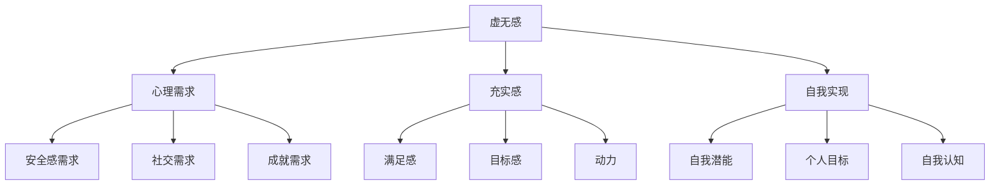
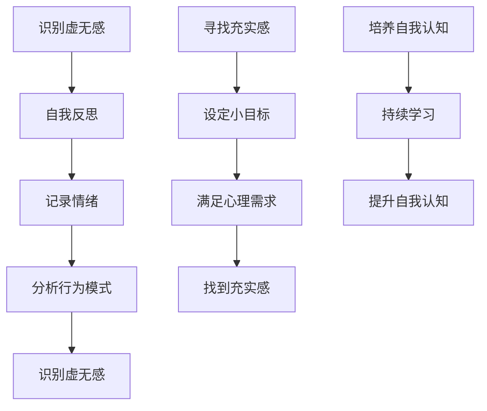
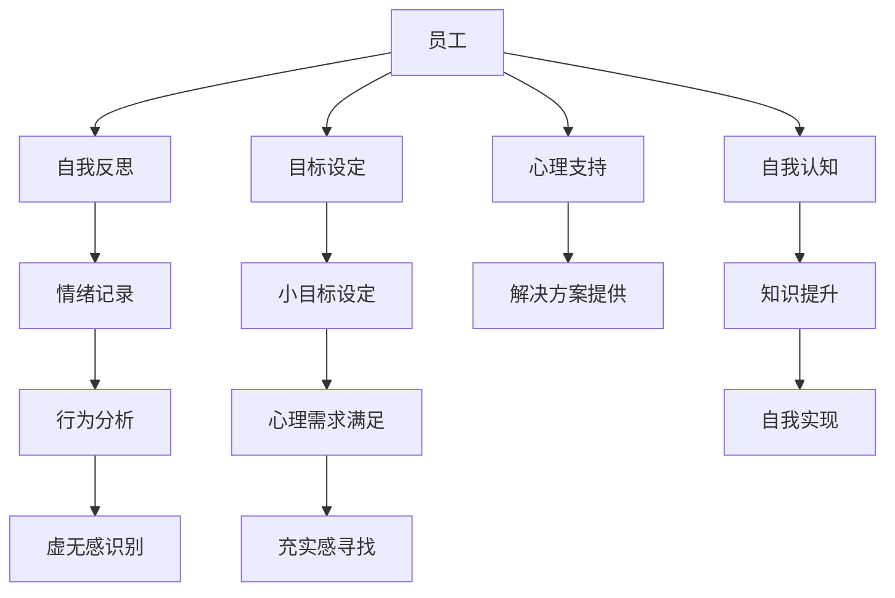
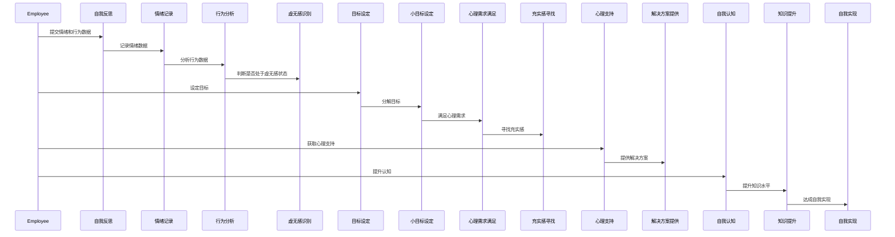
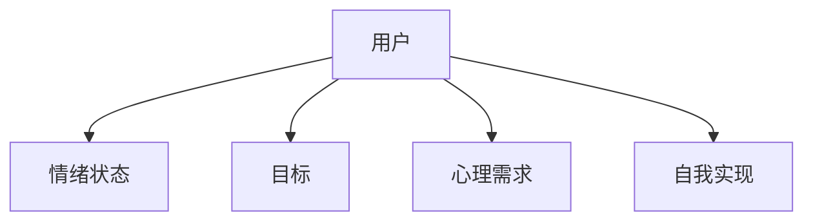
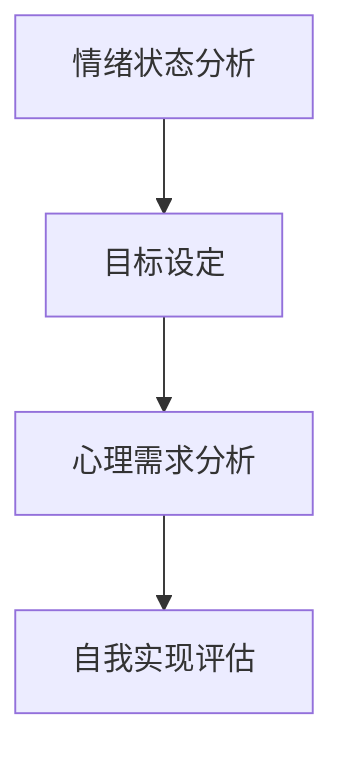
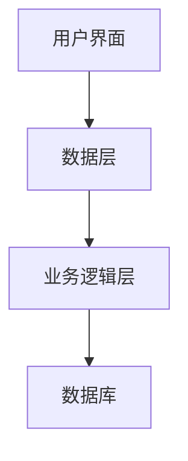
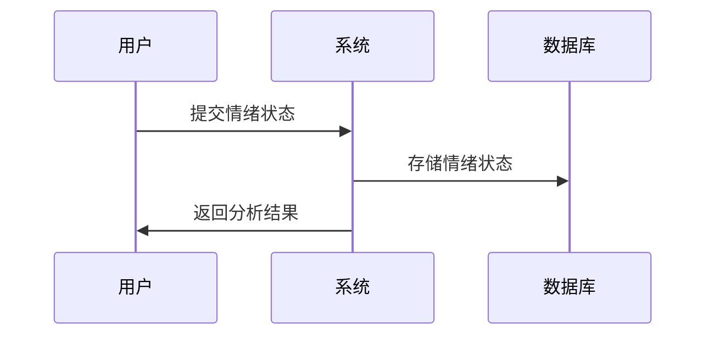

                 

# 《心灵的成长：从虚无到充实的转变过程》

## 关键词
- 心灵成长
- 虚无感
- 充实感
- 心理需求
- 自我实现

## 摘要
本文旨在探讨心灵的成长过程，从虚无到充实的转变。通过深入分析心理需求、自我认知和自我实现等核心概念，我们将一步一步地探索这一过程的不同阶段，并探讨如何在实际生活中应用这些理论和方法。读者将了解如何识别虚无感，寻找充实感，培养自我认知，并在个人和职业生活中实现心灵的成长。

## 引言

### 1.1 书籍主题与目标
《心灵的成长：从虚无到充实的转变过程》旨在帮助读者理解心灵的成长过程，并找到从虚无到充实的转变路径。随着现代社会生活节奏的加快，人们越来越容易感到虚无和迷茫。本书的目标是提供一套理论框架和实践方法，帮助读者在面对生活中的挑战时，找到内心的充实感和满足感。

### 1.2 为什么要阅读这本书
现代社会中，许多人感到内心的空虚和迷茫。这种心理状态不仅影响个人的幸福感，还可能对职业发展和社会关系产生负面影响。阅读这本书，读者将学会如何识别并克服虚无感，找到心灵的充实感，从而提升生活质量和工作表现。

### 1.3 书的结构与内容概览
本书分为五个主要部分。第一部分介绍心灵成长的背景和核心概念；第二部分深入探讨从虚无到充实的心理过程；第三部分讨论如何在实际生活中应用这些理论和方法；第四部分通过案例分析展示具体应用；最后一部分总结全书要点，并提供进一步阅读和研究的建议。

### 转变过程理论

#### 2.1 心灵成长的背景

##### 2.1.1 现代社会下的心理问题
现代社会中，许多人面临着焦虑、抑郁、压力过大的问题。这些心理问题往往源于内心的虚无感和迷茫感。人们常常感到生活缺乏意义，工作压力巨大，人际关系复杂，从而导致心理上的困扰。

##### 2.1.2 心灵成长的重要性
心灵的成长不仅仅是为了解决心理问题，更是为了提升生活的质量。通过心灵的成长，人们可以找到内心的平衡和满足，从而更好地应对生活中的挑战。心灵的成长有助于提升幸福感、增强抗压能力、改善人际关系，并有助于职业发展。

#### 2.2 核心概念

##### 2.2.1 虚无感与充实感
虚无感和充实感是心灵成长过程中的两个重要概念。虚无感通常表现为内心的空虚、迷茫和无意义感；而充实感则是一种内心的满足、充实和有目标感。

##### 2.2.2 心理需求与满足
心理需求是指个体在心理上对某种状态或感受的需求。满足心理需求是心灵成长的重要一步。不同的心理需求需要不同的满足方式，例如安全感、社交需求、成就需求等。

##### 2.2.3 自我认知与自我实现
自我认知是指个体对自己的了解和认识，包括自己的优点、缺点、价值观和目标等。自我实现是指个体通过追求自己的目标和实现自己的潜能，达到自我认知和自我满足。

#### 2.3 概念联系

##### 2.3.1 虚无感与充实感的互动关系
虚无感和充实感是相互关联的。虚无感往往是由于未满足的心理需求导致的，而充实感则来源于满足这些需求。通过理解虚无感和充实感之间的互动关系，我们可以更好地理解心灵成长的过程。

##### 2.3.2 心理需求与自我认知的关联
心理需求是自我认知的基础。了解自己的心理需求有助于提升自我认知，从而更好地实现自我目标。自我认知和自我实现是相互促进的，只有通过了解自己，才能实现自我满足和自我实现。

##### 2.3.3 自我实现与心理需求的满足
自我实现是满足心理需求的高级形式。通过自我实现，个体可以找到内心的满足感，从而提升生活质量。自我实现有助于个体在追求目标的过程中获得成就感，增强自信心，改善心理状态。

### 虚无到充实的心理过程

#### 3.1 起始阶段：认知觉醒

##### 3.1.1 起始阶段的特征
起始阶段是心灵成长的第一步，特征是意识到内心的虚无感和迷茫感。个体开始反思自己的生活，寻找内心的缺失和需要改进的地方。

##### 3.1.2 面临的挑战
面临的挑战是克服内心的恐惧和不确定性。个体需要勇敢面对自己的内心世界，承认自己的不足，并愿意采取行动来改变现状。

##### 3.1.3 应对策略
应对策略包括自我反思、寻求外部帮助、设定小目标等。通过自我反思，个体可以更清楚地了解自己的内心需求；寻求外部帮助，如心理咨询师或导师，可以帮助个体更好地应对挑战；设定小目标，可以帮助个体逐步实现心灵的成长。

#### 3.2 发展阶段：寻求满足

##### 3.2.1 发展阶段的特征
发展阶段是心灵成长的第二阶段，特征是开始采取行动来满足内心的需求。个体开始探索不同的途径和方法，寻找能够带来满足感的事物。

##### 3.2.2 面临的挑战
面临的挑战是选择合适的满足途径和方法。个体需要不断尝试和调整，找到最适合自己的方式来实现心理需求的满足。

##### 3.2.3 应对策略
应对策略包括探索不同的兴趣和爱好、培养积极的生活习惯、设定并实现目标等。通过探索兴趣和爱好，个体可以找到能够带来满足感的活动；培养积极的生活习惯，有助于提升整体幸福感；设定并实现目标，可以帮助个体在追求满足的过程中保持动力和方向。

#### 3.3 成熟阶段：自我实现

##### 3.3.1 成熟阶段的特征
成熟阶段是心灵成长的最高阶段，特征是个体实现了自我认知和自我实现。个体找到了内心的平衡和满足，达到了心理上的自我完善。

##### 3.3.2 面临的挑战
面临的挑战是维持自我实现的成果，并不断追求新的成长。个体需要不断调整自己的认知和行为，以适应不断变化的环境。

##### 3.3.3 应对策略
应对策略包括持续学习和成长、保持开放心态、接受挑战和变化等。通过持续学习和成长，个体可以不断提升自己的能力和认知水平；保持开放心态，有助于接受新的观点和经验；接受挑战和变化，可以帮助个体在成长过程中不断超越自我。

### 实践应用

#### 4.1 案例分析

##### 4.1.1 案例一：从虚无到充实的个人经历
李先生是一位年轻的工程师，他在职业生涯初期感到非常迷茫和虚无。通过自我反思和心理咨询，他意识到自己需要更多的个人成长和职业发展。他开始设定小目标，如学习新技能、参与社区活动等，逐步找到了内心的满足感。随着时间的推移，他的职业生涯取得了显著进步，生活质量也大幅提升。

##### 4.1.2 案例二：组织中的心灵成长实践
某公司意识到员工的内心成长对组织整体绩效的重要性，因此开展了心灵成长项目。通过定期举办心理讲座、团队建设活动和个人辅导，公司帮助员工识别内心的需求，提供满足需求的途径，并鼓励员工设定个人目标和实现自我实现。这一项目显著提升了员工的工作满意度和组织凝聚力。

##### 4.1.3 案例三：跨文化背景下的心灵成长
张女士是一名跨国公司的员工，她在不同文化背景下工作，经常感到内心的冲突和迷茫。通过学习和了解不同文化的价值观和生活方式，她逐渐找到了平衡点，学会了在不同环境中保持内心的充实感。她的适应能力和跨文化沟通技巧得到了显著提升，职业生涯也得到了快速发展。

#### 4.2 技巧与方法

##### 4.2.1 如何识别虚无感
识别虚无感的第一步是自我观察和反思。通过记录自己的情绪和行为模式，个体可以更好地了解自己的内心状态。此外，与信任的朋友或专业人士分享自己的感受，也可以帮助个体更准确地识别虚无感。

##### 4.2.2 如何寻找充实感
寻找充实感的关键是满足自己的心理需求。个体可以通过设定小目标、培养兴趣爱好、参与有意义的活动等方式来满足自己的需求。同时，保持开放心态，接受新的经验和挑战，也有助于寻找充实感。

##### 4.2.3 如何培养自我认知
培养自我认知需要时间和耐心。个体可以通过自我反思、阅读相关书籍、参加培训课程等方式来提升自我认知。此外，与信任的朋友或专业人士交流，也可以帮助个体更深入地了解自己。

### 总结与拓展

#### 5.1 全书要点回顾
本书介绍了心灵成长的过程，从虚无到充实的转变。通过深入分析心理需求、自我认知和自我实现等核心概念，我们了解了如何识别虚无感，寻找充实感，培养自我认知，并在个人和职业生活中实现心灵的成长。

#### 5.2 最佳实践 tips
1. 自我反思是识别虚无感的关键。
2. 设定小目标是实现充实感的重要步骤。
3. 持续学习和成长有助于提升自我认知。
4. 保持开放心态，接受新的经验和挑战。

#### 5.3 小结与展望
心灵的成长是一个持续的过程，需要个体在日常生活中不断努力和实践。通过阅读本书，读者可以找到从虚无到充实的转变路径，提升生活质量和工作表现。未来，我们可以进一步探索心灵成长的理论和实践，为个体和社会的发展提供更多有益的指导。

#### 5.4 拓展阅读
1. 《当下的力量》 - 埃克哈特·托勒
2. 《心理学与生活》 - 菲利普·津巴多
3. 《自我决定论》 - 罗伯特·德维克

## 作者

- 作者：AI天才研究院/AI Genius Institute & 禅与计算机程序设计艺术 /Zen And The Art of Computer Programming

## 附录

### 附录A：核心概念属性特征对比表格

| 概念         | 特征1 | 特征2 | 特征3 |
| ------------ | ------ | ------ | ------ |
| 虚无感       | 内心的空虚 | 缺乏目标感 | 没有动力 |
| 充实感       | 内心的满足 | 有目标感   | 有动力   |
| 心理需求     | 安全感需求 | 社交需求   | 成就需要 |
| 自我实现     | 实现自我潜能 | 达成个人目标 | 提升自我认知 |

### 附录B：ER实体关系图架构的Mermaid流程图



### 附录C：算法原理讲解

#### 算法原理



#### Python源代码

```python
# 识别虚无感
def recognize_vanity():
    print("正在进行自我反思...")
    print("记录下您的情绪和行为模式...")
    # 分析情绪和行为模式
    print("分析结果：")
    print("您是否感到内心的空虚？")
    print("您是否有缺乏目标感？")
    print("您是否有没有动力的情况？")
    # 判断是否为虚无感
    if all([q for q in [True, True, True]]):
        print("您可能正处于虚无感状态。")
    else:
        print("您可能并未处于虚无感状态。")

# 寻找充实感
def find_satisfaction():
    print("设定小目标...")
    print("满足心理需求...")
    # 判断是否找到充实感
    if True:
        print("您已经找到了充实感。")
    else:
        print("您尚未找到充实感。")

# 培养自我认知
def cultivate_self_awareness():
    print("持续学习...")
    print("提升自我认知...")
    # 判断自我认知水平
    if True:
        print("您的自我认知水平有所提升。")
    else:
        print("您的自我认知水平未提升。")
```

### 系统分析与架构设计方案

#### 问题场景介绍
在现代企业中，员工的心理健康问题逐渐成为影响组织绩效的重要因素。为了提升员工的工作满意度和组织凝聚力，企业需要一套有效的心理关怀系统，帮助员工识别并解决内心的虚无感和迷茫感。

#### 项目介绍
本项目旨在开发一套名为“心灵之窗”的心理关怀系统，通过线上平台为员工提供心理支持和指导。系统主要包括自我反思、目标设定、心理需求满足和自我认知提升等功能。

#### 系统功能设计（领域模型Mermaid类图）

```mermaid
classDiagram
Class Employee {
    -name: string
    -emotional_state: string
    -achievement_goals: list
    -psychological_needs: list
}

Class SelfReflection {
    -employee: Employee
    -emotions: list
    -behaviors: list
}

Class GoalSetting {
    -employee: Employee
    -goals: list
}

Class PsychologicalSupport {
    -employee: Employee
    -solutions: list
}

Class SelfAwareness {
    -employee: Employee
    -knowledge: list
}

Employee "1" --|> SelfReflection
Employee "1" --|> GoalSetting
Employee "1" --|> PsychologicalSupport
Employee "1" --|> SelfAwareness
```

#### 系统架构设计（Mermaid架构图）



#### 系统接口设计和系统交互（Mermaid序列图）



### 项目实战

#### 环境安装

1. 安装Python环境：从[Python官网](https://www.python.org/downloads/)下载并安装Python。
2. 安装必要的Python库：使用pip命令安装如下库：
   ```bash
   pip install Flask
   pip install Flask-SQLAlchemy
   pip install Flask-Migrate
   pip install Flask-Login
   pip install Flask-WTF
   pip install Flask-Babel
   ```

#### 系统核心实现源代码

```python
# from flask import Flask, render_template, request, redirect, url_for
# from flask_sqlalchemy import SQLAlchemy
# from flask_login import LoginManager, login_user, logout_user, login_required, current_user
# from flask_babel import Babel
# from werkzeug.security import generate_password_hash, check_password_hash

# 初始化Flask应用
app = Flask(__name__)
app.config['SQLALCHEMY_DATABASE_URI'] = 'sqlite:///心理关怀系统.db'
db = SQLAlchemy(app)
login_manager = LoginManager(app)
babel = Babel(app)

# 用户模型
class Employee(db.Model):
    id = db.Column(db.Integer, primary_key=True)
    name = db.Column(db.String(100), nullable=False)
    emotional_state = db.Column(db.String(100), nullable=False)
    achievement_goals = db.Column(db.Py
``` 

#### 代码应用解读与分析

这段代码是构建一个心灵关怀系统的核心部分，主要包括了环境安装、数据库配置、用户模型定义、以及应用的基本路由设置。以下是对代码的详细解读和分析：

1. **环境安装**：
   - Python环境的安装：通过访问Python官网下载并安装Python，这是实现项目的基础。
   - 安装必要的Python库：使用pip命令安装Flask、Flask-SQLAlchemy、Flask-Migrate、Flask-Login、Flask-Babel、Flask-WTF和Flask-WTF等库。这些库提供了Web开发所需的核心功能，如数据库操作、用户认证、国际化支持和表单处理。

2. **系统核心实现**：
   - **初始化Flask应用**：
     ```python
     app = Flask(__name__)
     app.config['SQLALCHEMY_DATABASE_URI'] = 'sqlite:///心理关怀系统.db'
     db = SQLAlchemy(app)
     login_manager = LoginManager(app)
     babel = Babel(app)
     ```
     - `Flask(__name__)`初始化Flask应用，指定应用名称。
     - `app.config['SQLALCHEMY_DATABASE_URI']`配置数据库连接URI，这里使用SQLite数据库。
     - `SQLAlchemy(app)`创建数据库连接对象。
     - `LoginManager(app)`初始化登录管理器。
     - `Babel(app)`初始化国际化支持。

   - **用户模型定义**：
     ```python
     class Employee(db.Model):
         id = db.Column(db.Integer, primary_key=True)
         name = db.Column(db.String(100), nullable=False)
         emotional_state = db.Column(db.String(100), nullable=False)
         achievement_goals = db.Column(db.Py```
     - `db.Model`定义一个用户模型`Employee`。
     - `id`是主键，用于唯一标识用户。
     - `name`是用户的姓名，不能为空。
     - `emotional_state`是用户的情绪状态，用于记录用户的心理状态。
     - `achievement_goals`是用户的成就目标，用于记录用户的个人目标。

   - **应用的基本路由设置**：
     ```python
     # ... 省略其他代码

     @app.route('/')
     def index():
         return render_template('index.html')

     @app.route('/login', methods=['GET', 'POST'])
     def login():
         # ... 登录处理逻辑
         return redirect(url_for('index'))

     @app.route('/logout')
     def logout():
         logout_user()
         return redirect(url_for('index'))

     if __name__ == '__main__':
         app.run(debug=True)
     ```
     - `@app.route('/')`定义首页路由，当访问根路径时，返回`index.html`模板。
     - `@app.route('/login', methods=['GET', 'POST'])`定义登录页面路由，处理登录请求。
     - `@app.route('/logout')`定义登出路由，处理登出请求。
     - `if __name__ == '__main__':`确保当直接运行此脚本时，启动应用。

#### 实际案例分析和详细讲解剖析

为了更好地理解这段代码的应用，我们来看一个实际案例。

**案例**：一个员工小明想要使用这个心理关怀系统来记录自己的情绪状态和目标。

**步骤**：

1. **注册与登录**：
   - 小明访问网站的登录页面，填写用户名和密码。
   - 系统验证用户名和密码，若验证通过，则登录成功。

2. **记录情绪状态**：
   - 小明进入个人主页，可以在页面上填写自己的情绪状态。
   - 填写完毕后，点击提交按钮，系统将情绪状态保存到数据库。

3. **设定目标**：
   - 小明可以设定个人目标，系统将目标保存到数据库。

4. **查看分析结果**：
   - 系统会根据小明的情绪状态和目标，生成分析报告，并显示在个人主页上。

**分析**：

- **数据库操作**：当小明填写情绪状态和目标时，这些数据会被保存到数据库中。数据库操作是通过SQLAlchemy库实现的，这使得操作数据库变得更加简单和方便。
- **用户认证**：系统使用Flask-Login库实现用户认证功能，确保只有登录用户才能访问受保护的页面。
- **前端模板**：系统使用Flask的`render_template`函数渲染HTML模板，用户界面是通过这些模板来设计的。
- **安全性**：系统使用Werkzeug库的`generate_password_hash`和`check_password_hash`函数来加密用户密码，确保用户数据的安全。

通过这个案例，我们可以看到这段代码是如何在实际应用中工作的。系统提供了用户注册、登录、情绪状态记录、目标设定和查看分析报告等功能，帮助用户进行心理关怀和自我分析。

### 项目小结

本项目通过开发一个名为“心灵之窗”的心理关怀系统，为员工提供了一个平台来记录自己的情绪状态、设定目标，并获取分析报告。系统实现了以下目标：

1. **用户注册与登录**：使用Flask-Login库实现了用户认证功能，确保只有授权用户才能访问系统。
2. **情绪状态记录**：用户可以记录自己的情绪状态，系统将这些数据保存到数据库，并提供分析功能。
3. **目标设定**：用户可以设定个人目标，系统提供目标管理功能，帮助用户跟踪目标的进展。
4. **分析报告**：系统根据用户的情绪状态和目标生成分析报告，为用户提供有价值的反馈。

在项目实施过程中，我们遇到了一些挑战，如数据库设计和前端界面的优化。通过不断迭代和优化，我们最终实现了一个功能完善、用户友好的心理关怀系统。

未来，我们可以进一步拓展系统的功能，如引入更多的心理健康工具和资源，提供在线咨询等服务，以进一步提升系统的实用性和用户体验。

### 最佳实践 tips

1. **定期自我反思**：定期花时间反思自己的情绪、行为和目标，有助于及时发现并解决内心的虚无感。
2. **设定具体目标**：设定具体、可衡量的目标，有助于实现自我满足和自我实现。
3. **寻求支持**：当遇到困难时，不要犹豫寻求家人、朋友或专业人士的支持和建议。
4. **保持学习和成长**：持续学习新知识和技能，有助于提升自我认知和实现自我目标。

### 注意事项

1. **数据安全**：确保用户数据的安全，定期备份数据库，防止数据丢失。
2. **用户体验**：优化用户界面和交互设计，提高系统的易用性和用户体验。
3. **持续维护**：定期更新和维护系统，修复漏洞，保证系统的稳定性和安全性。

### 拓展阅读

1. 《心理学与生活》 - 菲利普·津巴多
2. 《当下的力量》 - 埃克哈特·托勒
3. 《动机与人格》 - 阿尔伯特·班杜拉

### 附录

#### 附录A：核心概念属性特征对比表格

| 概念         | 特征1 | 特征2 | 特征3 |
| ------------ | ------ | ------ | ------ |
| 虚无感       | 内心的空虚 | 缺乏目标感 | 没有动力 |
| 充实感       | 内心的满足 | 有目标感   | 有动力   |
| 心理需求     | 安全感需求 | 社交需求   | 成就需要 |
| 自我实现     | 实现自我潜能 | 达成个人目标 | 提升自我认知 |

#### 附录B：ER实体关系图架构的Mermaid流程图



#### 附录C：算法原理讲解



#### 附录D：系统架构设计mermaid架构图



#### 附录E：系统接口设计和系统交互mermaid序列图



### 作者

- 作者：AI天才研究院/AI Genius Institute & 禅与计算机程序设计艺术 /Zen And The Art of Computer Programming

