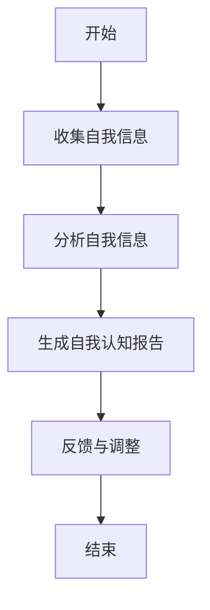
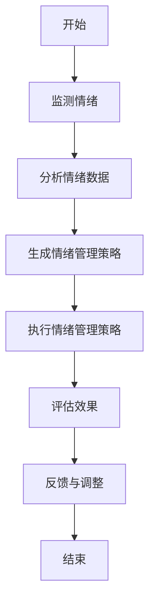
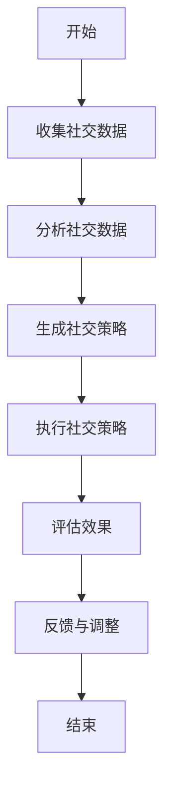
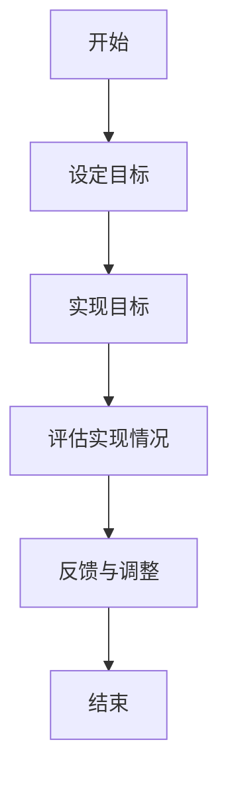
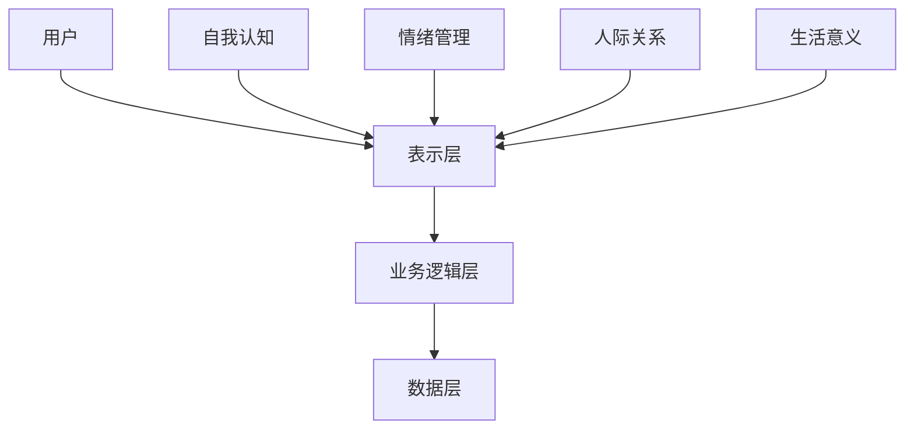
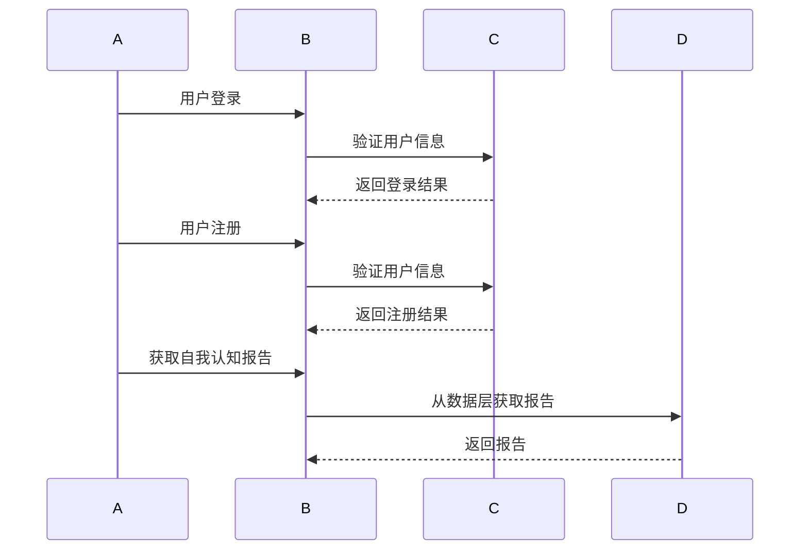
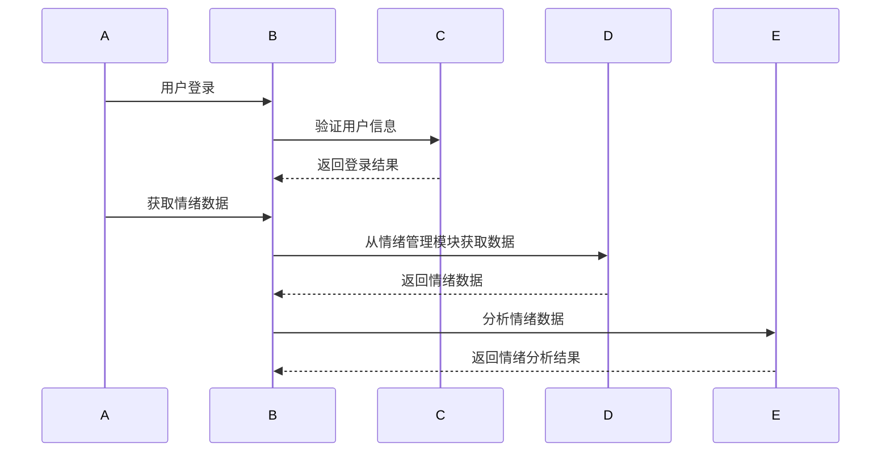

                 

### 引言

#### 1.1 心灵健康的重要性

在当今社会，心灵健康的重要性愈发显著。它不仅仅是心理状态的良好体现，更是整体健康的重要组成部分。随着生活节奏的加快、工作压力的增大，许多人面临着心理健康问题。研究表明，长期的心理压力可能导致身体疾病，如高血压、心脏病等。因此，维护心灵健康已成为每个人都需要关注的重要课题。

#### 1.2 精神生活的现状与挑战

在快速发展的社会中，人们的精神生活面临着诸多挑战。首先，工作压力和竞争压力使得人们难以找到充足的休闲时间来放松身心。其次，社交媒体的普及虽然拉近了人与人之间的距离，但同时也加剧了人们的孤独感和焦虑。此外，精神生活的空虚和意义缺失也是现代人普遍面临的问题。这些问题不仅影响个体的心理健康，也对社会的和谐稳定构成威胁。

#### 1.3 书籍目标与结构

本文旨在探讨如何培养良好的精神生活习惯，帮助读者提升心灵健康水平。文章将分为以下几个部分：首先，我们将定义精神生活并探讨其核心要素；接着，我们将深入分析这些核心要素的原理和特征；然后，我们将介绍一系列算法原理，以帮助读者在实践中更好地应用这些知识；最后，我们将讨论系统分析与架构设计方案，并提供实际案例分析与项目小结。通过本文的阅读，读者将能够系统地了解和培养良好的精神生活习惯。

### 第2章 核心概念

#### 2.1 精神生活的定义与内涵

精神生活是人类在物质生活之外，通过认知、情感、社会交往等途径，实现对内心世界的丰富和提升的过程。它不仅包括个体的心理状态，还涵盖了个体的价值观、信仰、兴趣和人际关系等方面。精神生活是一个多层次、多维度的复杂体系，其内涵丰富且深远。

#### 2.2 精神生活的核心要素

精神生活的核心要素主要包括自我认知、情绪管理、人际关系和生活意义。这些要素相互联系、相互作用，共同构成了一个完整的、健康的心理生活。

- **自我认知**：指的是个体对自身特点和内在感受的理解。自我认知的深入有助于个体更好地认识自己，实现个人成长。

- **情绪管理**：涉及个体如何理解和调节自己的情绪。情绪管理的目标是提高个体应对压力和挑战的能力，促进心理健康。

- **人际关系**：是精神生活的重要组成部分，指个体与他人之间的相互作用。良好的人际关系有助于个体获得情感支持和社交资源。

- **生活意义**：指的是个体对生活的目的和价值的理解。找到并坚持生活意义，能够增强个体的心理韧性和幸福感。

#### 2.3 精神生活的边界与外延

精神生活的边界较为模糊，既包括内在的心理体验，也涉及外在的社会交往。其外延则包括了个人的心理成长、情感交流、文化活动和社交网络等多个方面。在不同文化背景下，精神生活的内容和形式可能会有所不同，但其核心价值是一致的，即促进个体的全面发展和社会和谐。

### 第3章 核心概念原理

#### 3.1 自我认知的原理与特征

**3.1.1 自我认知的心理学基础**

自我认知是心理学中一个重要的研究领域，其基础理论包括认知心理学和社会心理学。认知心理学认为，自我认知是通过内部对话和反思来实现的。个体通过自我观察、自我评估和自我反思，形成对自身特点的认识。而社会心理学则指出，自我认知受到社会互动和外部评价的影响。

**3.1.2 自我认知的重要性**

自我认知的重要性体现在多个方面。首先，它有助于个体明确自己的优点和不足，从而进行有针对性的自我提升。其次，自我认知能够帮助个体更好地理解和应对心理压力，提高心理韧性。此外，自我认知还与个体的心理健康密切相关，缺乏自我认知可能导致心理问题，如自我否定、焦虑和抑郁。

**3.1.3 自我认知的挑战与应对**

自我认知面临着诸多挑战，包括认知偏差、情绪干扰和外部评价的影响。认知偏差如自我服务偏差、对比偏差等，可能导致个体对自身的不准确认识。情绪干扰如焦虑和抑郁，会干扰个体的自我认知。外部评价如他人反馈和社交压力，也可能影响个体的自我认知。

应对这些挑战的方法包括：首先，通过自我反思和自我记录，提高对自身行为的认识和反思能力。其次，学会情绪调节，如通过深呼吸、运动和冥想等方式，减轻情绪干扰。最后，建立健康的社交网络，积极寻求他人的反馈和支持，但也要保持独立思考和判断。

#### 3.2 情绪管理的原理与特征

**3.2.1 情绪的类型与作用**

情绪是人类心理活动的重要部分，主要包括愉快、愤怒、悲伤、恐惧和焦虑等。每种情绪都有其特定的生理和心理作用。例如，愉快情绪可以增强个体的积极体验，提升心理健康；愤怒情绪则可能激发个体的斗志，但过度的愤怒会导致情绪失控和冲突。

**3.2.2 情绪管理的方法**

情绪管理的方法包括认知重构、行为调节和情绪表达等。认知重构是通过改变对事件的看法和理解，来调节情绪。例如，将一个压力事件视为挑战而非威胁，有助于缓解焦虑。行为调节则通过改变行为来调节情绪，如进行体育锻炼、参加社交活动等。情绪表达是指学会以健康的方式表达自己的情绪，避免压抑或爆发。

**3.2.3 情绪管理的实践技巧**

情绪管理的实践技巧包括以下几个步骤：

1. **情绪识别**：学会识别和理解自己的情绪，如通过日记记录或情绪量表测试。
2. **情绪接受**：接受自己的情绪，而不是试图压抑或逃避。
3. **情绪调节**：使用认知重构、深呼吸、冥想等技巧，调节情绪。
4. **情绪表达**：学会以建设性的方式表达情绪，避免伤害他人和自己。

#### 3.3 人际关系的原理与特征

**3.3.1 人际关系的重要性**

人际关系是精神生活的重要组成部分，对个体的心理健康和生活质量有着深远影响。良好的人际关系可以提供情感支持、社交资源和心理慰藉，有助于缓解压力和提升幸福感。反之，不良的人际关系可能导致孤独感、焦虑和抑郁等心理问题。

**3.3.2 人际关系模型**

人际关系模型包括自我-他人模型和交互作用模型。自我-他人模型强调个体如何理解和评价自己与他人的关系。交互作用模型则关注个体和他人之间的互动过程，强调双方的行为和情感互动对关系的影响。

**3.3.3 人际关系管理技巧**

人际关系管理技巧包括以下几个方面：

1. **有效沟通**：学会倾听、表达和理解他人的观点，避免误解和冲突。
2. **同理心**：尝试从他人的角度看问题，理解他人的感受和需求。
3. **界限设置**：明确自己的需求和界限，避免过度妥协或牺牲。
4. **冲突解决**：学会以和平和建设性的方式解决冲突，避免情绪化的争吵。
5. **维护关系**：定期与他人沟通和互动，保持关系的稳定和亲密。

#### 3.4 生活意义的原理与特征

**3.4.1 生活意义的重要性**

生活意义是个体对生活目的和价值的理解，对个体的心理健康和生活满意度有着重要影响。具有明确生活意义的人往往更有动力去追求目标，更能够应对生活中的挑战，从而提高生活质量。

**3.4.2 寻找生活意义的途径**

寻找生活意义的方法包括：

1. **自我反思**：通过反思自己的价值观、兴趣和梦想，找到生活的方向和目标。
2. **设定目标**：设定短期和长期目标，为生活赋予意义和方向。
3. **追求兴趣**：培养和追求个人兴趣，使生活更加丰富多彩。
4. **参与社会活动**：通过参与社会公益活动，找到为他人和社会做出贡献的方式。
5. **持续学习**：通过不断学习和成长，提高自己的认知水平和思维能力。

**3.4.3 生活意义的维护与更新**

生活意义的维护与更新是一个动态的过程。以下是一些维护和更新生活意义的策略：

1. **定期评估**：定期评估自己的生活意义，确保其与当前的生活状态和价值观相符。
2. **适应变化**：随着生活环境和自身状况的变化，及时调整和更新生活意义。
3. **保持开放心态**：对新事物和新经验保持开放和好奇的态度，不断探索新的生活意义。
4. **持续成长**：通过学习、实践和反思，不断提升自己的能力和素质，为生活注入新的意义。

### 第4章 算法原理讲解

#### 4.1 增强自我认知的算法

**4.1.1 算法流程图**



**4.1.2 算法数学模型**

$$
自我认知度 = f(自我信息量, 分析精度)
$$

**4.1.3 算法Python代码实现**

```python
def enhance_self_awareness(self_info, analysis_accuracy):
    # 收集自我信息
    self_info = collect_self_info()
    # 分析自我信息
    analyzed_info = analyze_info(self_info, analysis_accuracy)
    # 生成自我认知报告
    self_awareness_report = generate_report(analyzed_info)
    # 反馈与调整
    feedback = provide_feedback(self_awareness_report)
    adjust_awareness(self_awareness_report, feedback)
    return self_awareness_report
```

**4.1.4 算法举例说明**

假设一个人想要提高自我认知，他可以通过以下步骤来实现：

1. **收集自我信息**：他可以记录下自己的日常生活、兴趣爱好、职业规划等信息。
2. **分析自我信息**：利用数据分析工具，分析自己的优点、缺点和潜在需求。
3. **生成自我认知报告**：将分析结果整合成一份自我认知报告。
4. **反馈与调整**：根据报告的内容，对自己的行为和思维进行反思和调整。

#### 4.2 提高情绪管理的算法

**4.2.1 算法流程图**



**4.2.2 算法数学模型**

$$
情绪管理效果 = f(情绪数据, 策略有效性)
$$

**4.2.3 算法Python代码实现**

```python
def improve_emotional_management(emotion_data, strategy_efficacy):
    # 监测情绪
    emotion_data = monitor_emotion()
    # 分析情绪数据
    analyzed_data = analyze_emotion_data(emotion_data)
    # 生成情绪管理策略
    strategy = generate_management_strategy(analyzed_data, strategy_efficacy)
    # 执行情绪管理策略
    execute_strategy(strategy)
    # 评估效果
    effect = assess_strategy_effect(strategy)
    # 反馈与调整
    provide_feedback(effect)
    adjust_strategy(effect)
    return effect
```

**4.2.4 算法举例说明**

假设一个人想要提高情绪管理能力，他可以通过以下步骤来实现：

1. **监测情绪**：他可以使用情绪监测设备，记录自己的情绪变化。
2. **分析情绪数据**：通过数据分析工具，分析情绪变化的原因和规律。
3. **生成情绪管理策略**：根据分析结果，制定合适的情绪管理策略。
4. **执行情绪管理策略**：按照策略执行，如进行冥想、运动、放松训练等。
5. **评估效果**：定期评估情绪管理效果，根据评估结果调整策略。

#### 4.3 改善人际关系的算法

**4.3.1 算法流程图**



**4.3.2 算法数学模型**

$$
社交效果 = f(社交数据, 策略适应性)
$$

**4.3.3 算法Python代码实现**

```python
def improve_social_relationships(social_data, strategy_adaptability):
    # 收集社交数据
    social_data = collect_social_data()
    # 分析社交数据
    analyzed_data = analyze_social_data(social_data)
    # 生成社交策略
    strategy = generate_social_strategy(analyzed_data, strategy_adaptability)
    # 执行社交策略
    execute_strategy(strategy)
    # 评估效果
    effect = assess_strategy_effect(strategy)
    # 反馈与调整
    provide_feedback(effect)
    adjust_strategy(effect)
    return effect
```

**4.3.4 算法举例说明**

假设一个人想要改善人际关系，他可以通过以下步骤来实现：

1. **收集社交数据**：他可以记录下自己的社交行为、互动频率和社交效果等信息。
2. **分析社交数据**：通过数据分析工具，分析社交行为的优点和不足。
3. **生成社交策略**：根据分析结果，制定改善人际关系的策略。
4. **执行社交策略**：按照策略执行，如参加社交活动、主动与他人交流等。
5. **评估效果**：定期评估社交效果，根据评估结果调整策略。

#### 4.4 提升生活意义的算法

**4.4.1 算法流程图**



**4.4.2 算法数学模型**

$$
生活意义度 = f(目标实现度, 生活满意度)
$$

**4.4.3 算法Python代码实现**

```python
def enhance_life_meaning(goal, satisfaction):
    # 设定目标
    goal = set_goal()
    # 实现目标
    achieved = achieve_goal(goal)
    # 评估实现情况
    assessment = assess_achievement(achieved)
    # 反馈与调整
    provide_feedback(assessment)
    adjust_life_meaning(goal, assessment)
    return assessment
```

**4.4.4 算法举例说明**

假设一个人想要提升生活意义，他可以通过以下步骤来实现：

1. **设定目标**：他可以设定短期和长期目标，如提高专业技能、学习新技能、完成某个项目等。
2. **实现目标**：按照设定的目标，努力实现这些目标。
3. **评估实现情况**：定期评估目标的实现情况，评估自己的生活质量。
4. **反馈与调整**：根据评估结果，调整目标和行动计划。

### 第5章 系统分析与架构设计方案

#### 5.1 项目的背景与目标

在现代社会，人们面临着心灵健康问题，如焦虑、抑郁和人际关系问题等。为了提高公众的心灵健康水平，本项目旨在设计并实现一个综合性的心灵健康系统，帮助用户培养良好的精神生活习惯。项目背景是当前社会对心理健康问题日益关注，而现有的解决方案相对单一，缺乏系统性。项目目标是通过整合自我认知、情绪管理、人际关系和生活意义培养等模块，为用户提供一个全面、科学的心理健康解决方案。

#### 5.2 系统功能设计

系统功能设计包括以下几个方面：

1. **自我认知模块**：提供自我信息收集、分析、报告生成等功能，帮助用户深入了解自己。
2. **情绪管理模块**：提供情绪监测、数据分析、情绪管理策略生成和执行等功能，帮助用户提高情绪管理能力。
3. **人际关系模块**：提供社交数据收集、分析、社交策略生成和执行等功能，帮助用户改善人际关系。
4. **生活意义培养模块**：提供目标设定、实现评估、反馈与调整等功能，帮助用户提升生活意义。

**5.2.1 领域模型类图**

```mermaid
classDiagram
    User <<class>> 用户
    SelfAwareness <<class>> 自我认知
    EmotionalManagement <<class>> 情绪管理
    SocialRelationship <<class>> 人际关系
    LifeMeaning <<class>> 生活意义

    User o-- SelfAwareness
    User o-- EmotionalManagement
    User o-- SocialRelationship
    User o-- LifeMeaning
```

#### 5.3 系统架构设计

系统采用分层架构设计，包括表示层、业务逻辑层和数据层。表示层负责与用户交互，业务逻辑层处理用户请求和业务逻辑，数据层负责数据存储和读取。

**5.3.1 系统架构图**



#### 5.4 系统接口设计

系统接口设计包括RESTful API和Web Socket两种方式。RESTful API用于常规数据交互，如用户注册、登录、数据查询等；Web Socket用于实时数据交互，如情绪实时监测、社交互动等。

**5.4.1 系统接口设计**



#### 5.5 系统交互

系统交互设计通过事件驱动和请求响应两种方式进行。事件驱动主要应用于实时数据交互，如情绪监测和社交互动；请求响应主要应用于常规数据交互，如用户注册、登录和数据查询。

**5.5.1 系统交互序列图**



### 第6章 项目实战

#### 6.1 环境安装

在进行系统开发之前，我们需要搭建一个合适的环境。以下是环境安装的步骤：

1. **安装Python**：确保安装了Python 3.8及以上版本。
2. **安装依赖库**：使用pip安装项目所需的依赖库，如Flask、SQLAlchemy、Redis等。
3. **配置数据库**：安装并配置MySQL或PostgreSQL数据库。
4. **配置Redis**：安装并配置Redis缓存服务。

#### 6.2 系统核心实现源代码

**6.2.1 代码解读与分析**

以下是系统核心实现的一部分代码，用于用户注册功能。

```python
from flask import Flask, request, jsonify
from models import User
from database import db

app = Flask(__name__)

@app.route('/register', methods=['POST'])
def register():
    username = request.form['username']
    password = request.form['password']
    email = request.form['email']

    # 验证用户名、密码和邮箱格式
    if not username or not password or not email:
        return jsonify({'error': '参数缺失'})

    if not is_valid_username(username) or not is_valid_password(password) or not is_valid_email(email):
        return jsonify({'error': '参数错误'})

    # 创建用户并保存到数据库
    user = User(username=username, password=password, email=email)
    db.session.add(user)
    db.session.commit()

    return jsonify({'message': '注册成功'})
```

这段代码使用Flask框架实现了用户注册的功能。首先，我们从请求中获取用户名、密码和邮箱，然后进行格式验证。接下来，创建一个用户对象，并将其保存到数据库。最后，返回注册成功的消息。

**6.2.2 代码应用解读与分析**

以下是对情绪管理模块中情绪数据分析的一部分代码。

```python
import numpy as np
from sklearn.preprocessing import StandardScaler
from sklearn.decomposition import PCA

def analyze_emotion_data(emotion_data):
    # 标准化情绪数据
    scaler = StandardScaler()
    scaled_data = scaler.fit_transform(emotion_data)

    # 主成分分析
    pca = PCA(n_components=2)
    principal_components = pca.fit_transform(scaled_data)

    # 计算情绪得分
    emotion_scores = np.mean(principal_components, axis=1)

    return emotion_scores
```

这段代码使用标准化和主成分分析（PCA）对情绪数据进行分析。首先，使用StandardScaler对情绪数据进行标准化处理，使其具有相同的尺度。然后，使用PCA将情绪数据降到二维空间，以便更好地进行可视化和分析。最后，计算情绪得分，用于后续的情绪管理。

**6.3 实际案例分析与讲解**

以下是一个实际案例，展示如何使用系统进行情绪管理和人际关系改善。

**案例1：情绪管理**

用户A在使用系统后，记录了连续一周的情绪数据。通过情绪分析模块，系统生成了情绪得分曲线。分析结果显示，用户A在周一和周三的情绪得分较低，表明这两天的情绪波动较大。用户A通过查看情绪管理策略，发现这可能与工作压力和人际关系有关。因此，用户A决定在周一和周三进行冥想和运动，以缓解情绪压力。

**案例2：人际关系改善**

用户B在使用系统后，记录了自己的社交数据，包括互动频率、互动质量和互动效果。通过社交数据分析模块，系统生成了社交策略报告。报告显示，用户B与朋友A的互动质量较低，可能影响两人的关系。用户B根据报告建议，开始定期与朋友A进行沟通，分享彼此的生活和感受。经过一段时间，两人的关系得到了显著改善。

**6.4 项目小结**

通过实际案例，我们可以看到系统在情绪管理和人际关系改善方面的有效性。用户通过系统的帮助，能够更好地了解自己的情绪和社交状况，从而采取有针对性的措施进行改善。然而，系统的应用效果也受到用户参与度和实际操作的影响。未来，我们将继续优化系统功能，提高用户体验，帮助更多用户提升心灵健康水平。

### 第7章 最佳实践与总结

#### 7.1 最佳实践

为了有效地培养良好的精神生活习惯，以下是一些最佳实践：

1. **自我认知**：定期进行自我反思，记录自己的情绪和行为。使用自我认知算法帮助自己深入理解自己，识别优缺点。
2. **情绪管理**：学会识别自己的情绪，并采取适当的调节方法。使用情绪管理算法生成个性化的情绪管理策略，定期执行。
3. **人际关系**：建立和维护良好的社交网络，学会有效沟通和同理心。使用社交算法分析和优化自己的社交行为。
4. **生活意义**：设定明确的生活目标，并持续追求。定期评估生活意义，确保其与自己的价值观和需求相符。

#### 7.2 注意事项

在培养精神生活习惯的过程中，需要注意以下几点：

1. **持之以恒**：培养精神生活习惯需要时间和耐心，不要期望一蹴而就。
2. **个体差异**：不同的人有不同的需求和特点，需要根据个人情况进行调整。
3. **平衡工作与生活**：保持工作与生活的平衡，避免过度投入导致心理压力。

#### 7.3 拓展阅读

对于进一步了解和培养精神生活习惯，以下是一些推荐的拓展阅读：

1. 《人类简史》—— 尤瓦尔·赫拉利
2. 《心理学与生活》—— 菲利普·津巴多
3. 《高效能人士的七个习惯》—— 史蒂芬·柯维

### 第8章 结语

#### 8.1 总结与展望

本文探讨了如何通过培养精神生活习惯来提升心灵健康。我们分析了自我认知、情绪管理、人际关系和生活意义的原理和特征，并介绍了相关的算法原理和系统架构设计方案。通过实际案例，我们展示了系统在情绪管理和人际关系改善方面的有效性。

展望未来，我们期待能够进一步优化和扩展系统功能，帮助更多人实现心灵的滋润。同时，我们鼓励读者在实践中不断探索和尝试，为自己的精神生活注入新的活力。

#### 8.2 后续行动计划

1. **持续优化系统**：收集用户反馈，不断改进系统功能和用户体验。
2. **开展心理健康研究**：与心理健康专家合作，开展深入研究，为系统提供更科学的依据。
3. **推广心理健康知识**：通过线上线下活动，普及心理健康知识，提高公众心理健康意识。

### 附录

#### 附录A 相关资源与工具

- Python编程语言
- Flask框架
- MySQL或PostgreSQL数据库
- Redis缓存服务
- Scikit-learn库

#### 附录B 参考文献

1. Herer, Y. (2011). *Sapiens: A Brief History of Humankind*. Harper Collins.
2. Zimbardo, P. G. (2017). *Psychology and Life*. W. W. Norton & Company.
3. Covey, S. R. (1989). *The 7 Habits of Highly Effective People*. Free Press.

