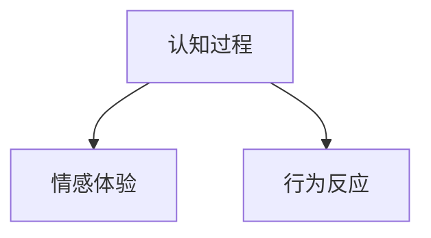
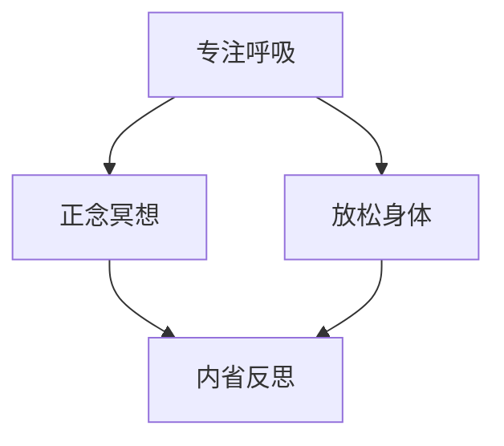
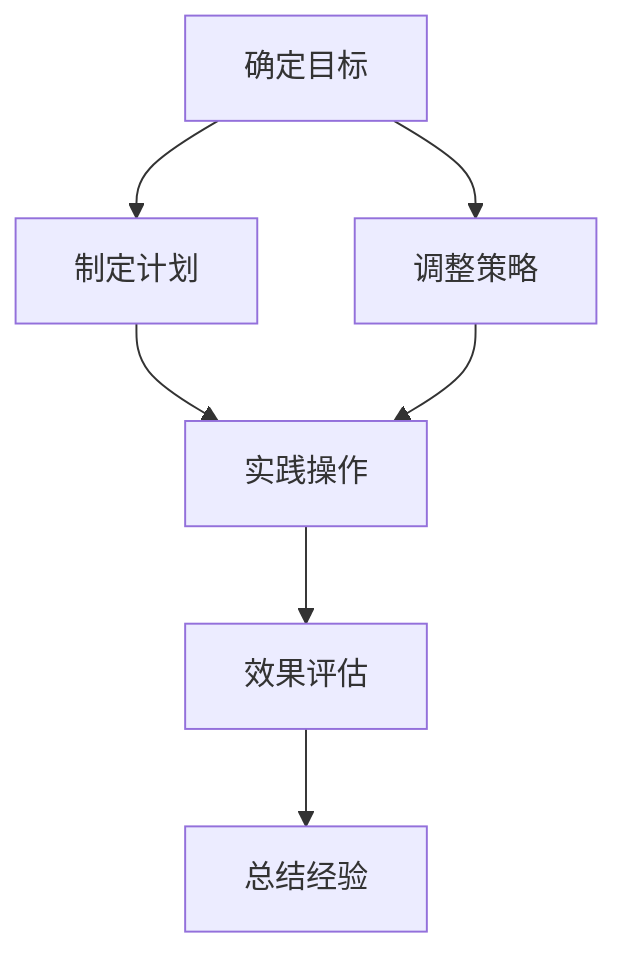

                 


## 文章标题：心灵的滋润：cultivate精神生活的日常习惯

## 关键词：心灵、精神生活、日常习惯、冥想、阅读、感恩

## 摘要：
本文将探讨如何在日常生活中培养精神生活的良好习惯，从而提升心灵的质量。通过详细介绍冥想、阅读和感恩等实践方法，以及系统化的分析和实际案例，我们将了解这些习惯如何对心灵产生深远的影响，并学会如何在快节奏的生活中保持心灵的滋润。

### 引言

在现代社会的快节奏生活中，人们往往忽视了对心灵的关注。心灵的滋润不仅仅是情感的满足，更是认知、情感和行为的全面提升。本文旨在通过培养日常习惯，帮助读者实现心灵的滋养，从而更好地面对生活的挑战。

### 第一部分：核心概念与理论基础

#### 第1章：心灵的定义与理解

**背景介绍**：
心灵是心理学中的一个核心概念，通常指的是个体的主观体验、情感和意识的集合。本文将探讨心灵的多层次结构，并介绍相关理论。

**核心概念与联系**：
心灵包括认知过程、情感体验和行为反应三个层次。以下是心灵层次结构的Mermaid流程图：



**问题解决**：
在理解心灵的过程中，我们需要关注不同层次之间的相互作用，以及如何通过日常习惯来增强心灵的健康。

**边界与外延**：
心灵不仅是心理学的范畴，还涉及哲学、宗教和艺术等多个领域。在本文中，我们将主要关注心理学层面的心灵。

**概念结构与核心要素组成**：
心灵的核心要素包括自我意识、情感调节、认知功能和创造力等。

#### 第2章：精神生活的本质与特征

**背景介绍**：
精神生活是心灵健康的重要组成部分，它涵盖了个体的思想、信仰、价值观和行为模式。

**核心概念与联系**：
精神生活具有丰富性和多样性，其特征包括内在满足感、自我实现、人际和谐和社会贡献等。

**概念属性特征对比表格**：

| 特征          | 内在满足感 | 自我实现 | 人际和谐 | 社会贡献 |
|---------------|-------------|-----------|-----------|-----------|
| 描述          | 对内心需求的满足感 | 实现个人潜能和目标 | 与他人建立积极关系 | 为社会作出贡献 |
| 对比          | 1. 内在平衡<br>2. 情感稳定 | 1. 个人成长<br>2. 目标达成 | 1. 互信互助<br>2. 和谐相处 | 1. 社会责任<br>2. 公共福祉 |

**问题解决**：
通过对比分析，我们可以更清晰地理解精神生活的本质特征，并找到适合自己的培养方法。

**边界与外延**：
精神生活不仅涉及个体的内在体验，还涉及社会和环境因素。本文将主要关注个体层面的精神生活。

**概念结构与核心要素组成**：
精神生活的核心要素包括价值观、信仰、人际关系和心理调适能力。

#### 第3章：习惯的力量与培养

**背景介绍**：
习惯是行为模式在长时间内稳定出现的结果，它们对个体心理和行为有深远影响。

**核心概念与联系**：
习惯的形成涉及行为心理学和认知科学的理论。本文将介绍习惯的数学模型和培养方法。

**概念属性特征对比表格**：

| 特征          | 自动化       | 一致性       | 持久性       |
|---------------|--------------|--------------|--------------|
| 描述          | 行为无需思考 | 行为稳定一致 | 行为长期持续 |
| 对比          | 1. 无需刻意<br>2. 省力高效 | 1. 可预测<br>2. 稳定可靠 | 1. 长期坚持<br>2. 持续稳定 |

**问题解决**：
通过理解习惯的特征，我们可以更有效地培养有助于心灵健康的习惯。

**边界与外延**：
习惯的培养不仅受个体因素影响，还受到环境和社会文化的制约。本文将主要关注个体层面的习惯培养。

**概念结构与核心要素组成**：
习惯的核心要素包括行为模式、心理状态和环境因素。

### 第二部分：培养精神生活的日常习惯

#### 第4章：冥想与内心宁静

**背景介绍**：
冥想是一种古老而现代的心理练习，旨在通过专注和内省来达到内心的平静。

**核心概念与联系**：
冥想涉及冥想技巧、专注力培养和内心调节等方面的知识。

**概念属性特征对比表格**：

| 特征          | 专注力增强 | 内心平静 | 自我觉察 |
|---------------|-------------|-----------|-----------|
| 描述          | 提高注意力集中 | 降低心理压力 | 深入理解自我 |
| 对比          | 1. 提高工作效率<br>2. 减少分心 | 1. 增强心理韧性<br>2. 提高情绪调节能力 | 1. 增强自我认知<br>2. 促进个人成长 |

**问题解决**：
通过冥想，我们可以更好地管理情绪、提高专注力和增强内心的宁静。

**边界与外延**：
冥想的形式多样，包括静坐、动态冥想和呼吸练习等。本文将介绍一种常用的静坐冥想方法。

**概念结构与核心要素组成**：
冥想的核心要素包括专注力、呼吸调节和内心反思。

#### 第5章：阅读与知识积累

**背景介绍**：
阅读是获取知识、拓展视野和培养思维的重要途径。在数字化时代，阅读习惯的培养尤为重要。

**核心概念与联系**：
阅读涉及阅读技巧、知识积累和思维拓展等方面的知识。

**概念属性特征对比表格**：

| 特征          | 知识积累 | 思维拓展 | 心灵启迪 |
|---------------|-----------|-----------|-----------|
| 描述          | 增加知识储备 | 拓展思维方式 | 提升精神境界 |
| 对比          | 1. 扩展视野<br>2. 增强记忆力 | 1. 提高逻辑思维能力<br>2. 增强创造力 | 1. 激发情感共鸣<br>2. 促进自我反思 |

**问题解决**：
通过阅读，我们可以不断丰富知识、拓展思维和提升精神生活。

**边界与外延**：
阅读的形式多样，包括纸质书、电子书、音频书等。本文将介绍如何建立有效的阅读习惯。

**概念结构与核心要素组成**：
阅读的核心要素包括知识获取、思维训练和精神提升。

#### 第6章：写作与自我表达

**背景介绍**：
写作是自我表达和情感释放的重要方式，也是提升思维能力和表达能力的重要途径。

**核心概念与联系**：
写作涉及写作技巧、情感表达和思维训练等方面的知识。

**概念属性特征对比表格**：

| 特征          | 自我表达 | 思维训练 | 文字功底 |
|---------------|-----------|-----------|-----------|
| 描述          | 增强表达能力 | 提高逻辑思维能力 | 增强文笔技巧 |
| 对比          | 1. 情感释放<br>2. 社交互动 | 1. 提高分析能力<br>2. 增强创造力 | 1. 增强文字驾驭能力<br>2. 提高写作效率 |

**问题解决**：
通过写作，我们可以更好地表达自己、训练思维和提升文笔。

**边界与外延**：
写作的形式多样，包括日记、文章、故事和诗歌等。本文将介绍如何建立有效的写作习惯。

**概念结构与核心要素组成**：
写作的核心要素包括情感表达、思维训练和文字技巧。

#### 第7章：感恩与积极心态

**背景介绍**：
感恩是提升精神生活的重要方式，它能够帮助我们建立积极的人生观和价值观。

**核心概念与联系**：
感恩涉及情感表达、心态调整和生活方式改善等方面的知识。

**概念属性特征对比表格**：

| 特征          | 积极心态 | 情感调节 | 生活态度 |
|---------------|-----------|-----------|-----------|
| 描述          | 增强幸福感 | 提高抗压能力 | 改善人际关系 |
| 对比          | 1. 增强心理韧性<br>2. 提高生活质量 | 1. 减少消极情绪<br>2. 增强正面情绪 | 1. 更加乐观积极<br>2. 增强社会归属感 |

**问题解决**：
通过感恩，我们可以改善心态、调节情感和提升生活质量。

**边界与外延**：
感恩的表达形式多样，包括口头表达、书面表达和实际行动等。本文将介绍如何建立感恩的习惯。

**概念结构与核心要素组成**：
感恩的核心要素包括情感表达、心态调整和生活方式改善。

### 第三部分：实际案例与实战

#### 第8章：实际案例研究

**背景介绍**：
本章节将通过具体案例，展示如何在实际生活中培养精神生活的良好习惯。

**核心概念与联系**：
案例研究将涉及冥想、阅读、写作和感恩等日常习惯的实践。

**概念属性特征对比表格**：

| 案例特征 | 冥想实践 | 阅读实践 | 写作实践 | 感恩实践 |
|-----------|-----------|-----------|-----------|-----------|
| 描述      | 每日冥想练习 | 每周阅读计划 | 每月写作练习 | 每日感恩日记 |
| 对比      | 1. 改善专注力<br>2. 减轻压力 | 1. 扩展知识面<br>2. 提高思维深度 | 1. 提升表达能力<br>2. 增强创造力 | 1. 增强幸福感<br>2. 提高情感调节能力 |

**问题解决**：
通过实际案例，读者可以了解如何在日常生活中实践这些习惯。

**边界与外延**：
实际案例的选择将考虑不同背景、不同需求的读者，以确保案例具有普遍适用性。

**概念结构与核心要素组成**：
实际案例的核心要素包括习惯实践、效果评估和经验总结。

#### 第9章：实战应用

**背景介绍**：
本章节将提供具体的实战指导，帮助读者建立和维持良好的精神生活习惯。

**核心概念与联系**：
实战应用将涉及习惯培养的策略、实践技巧和反馈机制。

**概念属性特征对比表格**：

| 实战应用特征 | 建立阅读习惯 | 建立写作习惯 | 建立感恩习惯 |
|---------------|--------------|--------------|--------------|
| 描述          | 制定阅读计划 | 设定写作目标 | 保持感恩意识 |
| 对比          | 1. 规律阅读<br>2. 保持兴趣 | 1. 持续写作<br>2. 收获反馈 | 1. 感恩日记<br>2. 积极心态 |

**问题解决**：
通过实战指导，读者可以逐步建立和维持有益于心灵健康的习惯。

**边界与外延**：
实战应用的策略和技巧将根据不同读者的实际情况进行调整。

**概念结构与核心要素组成**：
实战应用的核心要素包括习惯培养、实践指导和效果评估。

### 第四部分：总结与拓展

#### 第10章：总结与反思

**背景介绍**：
本章节将对全文内容进行总结，并对精神生活日常习惯的培养进行反思。

**核心概念与联系**：
总结将涵盖冥想、阅读、写作和感恩等日常习惯的实践方法及其对心灵健康的影响。

**概念属性特征对比表格**：

| 内容特征 | 冥想 | 阅读 | 写作 | 感恩 |
|-----------|------|------|------|------|
| 描述      | 改善专注力、减轻压力 | 扩展知识面、提升思维深度 | 提升表达能力、增强创造力 | 增强幸福感、提高情感调节能力 |

**问题解决**：
通过总结，读者可以更全面地理解精神生活日常习惯的重要性。

**边界与外延**：
总结的内容将考虑不同读者在不同阶段可能面临的问题。

**概念结构与核心要素组成**：
总结的核心要素包括习惯实践、效果评估和经验总结。

#### 第11章：拓展阅读

**背景介绍**：
本章节将推荐相关书籍、学术论文和在线资源，以供读者进一步学习和研究。

**核心概念与联系**：
拓展阅读将涵盖冥想、阅读、写作和感恩等领域的最新研究成果和经典著作。

**概念属性特征对比表格**：

| 资源类型 | 书籍推荐 | 学术论文 | 在线资源 |
|-----------|-----------|-----------|-----------|
| 描述      | 推荐经典与新兴书籍 | 汇集最新研究成果 | 提供丰富的在线资源和社区讨论 |

**问题解决**：
通过拓展阅读，读者可以不断更新知识，深化对精神生活日常习惯的理解。

**边界与外延**：
拓展阅读的资源将涵盖不同领域和层次，以满足读者的多样化需求。

**概念结构与核心要素组成**：
拓展阅读的核心要素包括书籍推荐、学术论文和在线资源。

### 结语

**1.1 成长与改变**：
通过本文的学习和实践，读者将能够逐步培养出有益于心灵健康的日常习惯，实现精神生活的提升。

**1.2 鼓励与支持**：
培养良好的精神生活习惯需要持续的努力和耐心，希望读者能够坚持不懈，不断进步。

**1.3 感谢与期待**：
感谢读者对本文的关注和支持，期待读者能够在实践中取得成果，为自己的心灵生活注入新的活力。

---

作者：AI天才研究院/AI Genius Institute & 禅与计算机程序设计艺术 /Zen And The Art of Computer Programming

本文旨在帮助读者通过培养日常习惯，实现心灵的健康与成长。希望每位读者都能在快节奏的生活中找到心灵的滋润之地。在阅读和实践中，不断探索，持续成长。谢谢您的阅读与支持！### 引言

在快节奏的现代生活中，人们往往忽略了心灵的滋润，而将大部分精力投入到工作和物质追求中。然而，心灵的滋润对于个人的全面发展和生活质量至关重要。本文旨在探讨如何在日常生活中培养良好的精神生活习惯，以提升心灵的健康和幸福感。通过冥想、阅读、写作和感恩等实践方法，我们将一步步探索如何实现心灵的滋养，从而更好地面对生活的挑战。

### 核心概念与理论基础

#### 第1章：心灵的定义与理解

**背景介绍**：

心灵是人类心理活动的重要部分，它涵盖了情感、意识、思维等多个层面。在心理学中，心灵通常被视为个体的主观体验和内在世界的集合。理解心灵对于培养精神生活的日常习惯至关重要。

**核心概念与联系**：

心灵包括认知过程、情感体验和行为反应三个层次。以下是心灵层次结构的Mermaid流程图：


- **认知过程**：指的是个体对外界信息的接收、处理和存储。它是心灵的基础，影响着个体的思维方式和行为模式。
- **情感体验**：指的是个体对认知信息的主观感受和情感反应。情感体验是心灵的内在体验，对于个体的心理健康具有重要影响。
- **行为反应**：指的是个体在情感和认知的影响下产生的行为反应。行为反应是心灵的直接表现，对个体与环境的关系起着调节作用。

**问题解决**：

在理解心灵的过程中，我们需要关注不同层次之间的相互作用，以及如何通过日常习惯来增强心灵的健康。例如，通过冥想可以增强认知过程的专注力和情感体验的稳定性，从而促进行为反应的积极性和适应性。

**边界与外延**：

心灵不仅是心理学的范畴，还涉及哲学、宗教和艺术等多个领域。在本文中，我们将主要关注心理学层面的心灵，特别是对精神生活有直接影响的部分。

**概念结构与核心要素组成**：

心灵的核心要素包括自我意识、情感调节、认知功能和创造力等。以下是心灵核心要素的Mermaid类图：

```mermaid
classDiagram
Class1 <|-- Class2
Class1 <|-- Class3
Class1 <|-- Class4
Class1 <|-- Class5

Class1 {
    +自我意识
    +情感调节
    +认知功能
    +创造力
}

Class2 {
    +注意力集中
    +记忆力
}

Class3 {
    +情绪稳定性
    +情感表达能力
}

Class4 {
    +问题解决能力
    +决策能力
}

Class5 {
    +创新思维
    +想象力
}
```

- **自我意识**：指个体对自身存在的认识和感知，是心灵的基础。
- **情感调节**：指个体对情感体验的管理和调节，包括情绪稳定性和情感表达能力。
- **认知功能**：指个体的思维能力和信息处理能力，包括注意力集中、记忆力、问题解决能力和决策能力。
- **创造力**：指个体的创新思维和想象力，是心灵的重要组成部分。

#### 第2章：精神生活的本质与特征

**背景介绍**：

精神生活是指个体在心灵层面上所进行的活动，包括思考、感悟、体验等。精神生活对个体的心理健康和生活质量有着深远的影响。理解精神生活的本质和特征，有助于我们更好地培养日常习惯，提升精神生活的质量。

**核心概念与联系**：

精神生活具有丰富性和多样性，其特征包括内在满足感、自我实现、人际和谐和社会贡献等。以下是精神生活特征的概念属性特征对比表格：

| 特征          | 内在满足感 | 自我实现 | 人际和谐 | 社会贡献 |
|---------------|-------------|-----------|-----------|-----------|
| 描述          | 对内心需求的满足感 | 实现个人潜能和目标 | 与他人建立积极关系 | 为社会作出贡献 |
| 对比          | 1. 内在平衡<br>2. 情感稳定 | 1. 个人成长<br>2. 目标达成 | 1. 互信互助<br>2. 和谐相处 | 1. 社会责任<br>2. 公共福祉 |

**问题解决**：

通过对比分析，我们可以更清晰地理解精神生活的本质特征，并找到适合自己的培养方法。例如，内在满足感可以通过冥想和自我反思来培养，自我实现可以通过设定目标和持续努力来实现，人际和谐可以通过积极的沟通和合作来建立，社会贡献可以通过志愿服务和公益活动来体现。

**边界与外延**：

精神生活不仅涉及个体的内在体验，还涉及社会和环境因素。在本文中，我们将主要关注个体层面的精神生活，特别是那些可以通过日常习惯来培养的部分。

**概念结构与核心要素组成**：

精神生活的核心要素包括价值观、信仰、人际关系和心理调适能力等。以下是精神生活核心要素的Mermaid类图：

```mermaid
classDiagram
Class1 <|-- Class2
Class1 <|-- Class3
Class1 <|-- Class4

Class1 {
    +价值观
    +信仰
    +人际关系
    +心理调适能力
}

Class2 {
    +道德观
    +人生观
}

Class3 {
    +信任
    +尊重
    +支持
}

Class4 {
    +情绪管理
    +压力应对
    +心理平衡
}
```

- **价值观**：指个体对事物的重要性和优先级的判断，是精神生活的基石。
- **信仰**：指个体对某种信念的坚定和忠诚，对精神生活具有重要影响。
- **人际关系**：指个体与他人之间的相互作用和关系，对精神生活有直接影响。
- **心理调适能力**：指个体对自身情绪和压力的管理能力，是保持精神生活健康的重要因素。

#### 第3章：习惯的力量与培养

**背景介绍**：

习惯是个体行为模式在长时间内稳定出现的结果，它们对个体的心理和行为有深远影响。培养良好的习惯是提升精神生活的重要途径。本节将探讨习惯的数学模型和培养方法。

**核心概念与联系**：

习惯的形成涉及行为心理学和认知科学的理论。以下是习惯的数学模型和公式：

$$
\text{habit\_score} = \alpha \times \text{routine} + \beta \times \text{motivation} + \gamma \times \text{emotional\_rewards}
$$

其中，$\alpha$、$\beta$ 和 $\gamma$ 分别代表习惯强度、动机和情感奖励的权重。

- **习惯强度**：指个体行为重复的频率和持续时间。
- **动机**：指个体采取特定行为的内在驱动力。
- **情感奖励**：指个体在行为完成后获得的正面情感体验。

**概念属性特征对比表格**：

| 特征          | 自动化       | 一致性       | 持久性       |
|---------------|--------------|--------------|--------------|
| 描述          | 行为无需思考 | 行为稳定一致 | 行为长期持续 |
| 对比          | 1. 无需刻意<br>2. 省力高效 | 1. 可预测<br>2. 稳定可靠 | 1. 长期坚持<br>2. 持续稳定 |

**问题解决**：

通过理解习惯的特征，我们可以更有效地培养有助于心灵健康的习惯。例如，可以通过设定明确的习惯目标、制定实施计划和使用正反馈机制来增强习惯的自动化和持久性。

**边界与外延**：

习惯的培养不仅受个体因素影响，还受到环境和社会文化的制约。在本文中，我们将主要关注个体层面的习惯培养，特别是那些对精神生活有积极影响的习惯。

**概念结构与核心要素组成**：

习惯的核心要素包括行为模式、心理状态和环境因素。以下是习惯核心要素的Mermaid类图：

```mermaid
classDiagram
Class1 <|-- Class2
Class1 <|-- Class3
Class1 <|-- Class4

Class1 {
    +行为模式
    +心理状态
    +环境因素
}

Class2 {
    +行为频率
    +行为时长
}

Class3 {
    +动机
    +自我调节
}

Class4 {
    +社会支持
    +环境刺激
}
```

- **行为模式**：指个体在特定情境下采取的固定行为，是习惯的外在表现。
- **心理状态**：指个体在行为过程中所保持的心理状态，包括动机、自我调节等。
- **环境因素**：指影响个体行为模式的外在因素，包括社会支持、环境刺激等。

### 第二部分：培养精神生活的日常习惯

#### 第4章：冥想与内心宁静

**背景介绍**：

冥想是一种古老而现代的心理练习，旨在通过专注和内省来达到内心的平静。冥想对于提升专注力、减轻压力和增强自我觉察具有显著效果，是培养精神生活的重要途径。

**核心概念与联系**：

冥想涉及冥想技巧、专注力培养和内心调节等方面的知识。以下是冥想核心概念的特征对比表格：

| 特征          | 专注力增强 | 内心平静 | 自我觉察 |
|---------------|-------------|-----------|-----------|
| 描述          | 提高注意力集中 | 降低心理压力 | 深入理解自我 |
| 对比          | 1. 提高工作效率<br>2. 减少分心 | 1. 增强心理韧性<br>2. 提高情绪调节能力 | 1. 增强自我认知<br>2. 促进个人成长 |

**问题解决**：

通过冥想，我们可以更好地管理情绪、提高专注力和增强内心的宁静。例如，通过每天进行短时间的冥想练习，可以显著改善个人的心理状态和工作效率。

**边界与外延**：

冥想的形式多样，包括静坐、动态冥想和呼吸练习等。本文将介绍一种常用的静坐冥想方法，适用于不同层次的冥想实践者。

**概念结构与核心要素组成**：

冥想的核心要素包括专注力、呼吸调节和内心反思。以下是冥想核心要素的Mermaid流程图：



- **专注呼吸**：通过专注呼吸来提高专注力和放松身心。
- **正念冥想**：通过保持正念来增强自我觉察和情绪调节能力。
- **放松身体**：通过全身放松来减轻心理压力和紧张情绪。
- **内省反思**：通过内省和反思来深入理解自我和提升个人成长。

#### 第5章：阅读与知识积累

**背景介绍**：

阅读是获取知识、拓展视野和培养思维的重要途径。在数字化时代，阅读习惯的培养尤为重要。通过阅读，我们可以不断积累知识，提升自我，改善精神生活。

**核心概念与联系**：

阅读涉及阅读技巧、知识积累和思维拓展等方面的知识。以下是阅读核心概念的特征对比表格：

| 特征          | 知识积累 | 思维拓展 | 心灵启迪 |
|---------------|-----------|-----------|-----------|
| 描述          | 增加知识储备 | 拓展思维方式 | 提升精神境界 |
| 对比          | 1. 扩展视野<br>2. 增强记忆力 | 1. 提高逻辑思维能力<br>2. 增强创造力 | 1. 激发情感共鸣<br>2. 促进自我反思 |

**问题解决**：

通过阅读，我们可以不断丰富知识、拓展思维和提升精神生活。例如，通过设定每周的阅读计划，选择不同类型的书籍，可以全面提升个人的知识水平和思维能力。

**边界与外延**：

阅读的形式多样，包括纸质书、电子书、音频书等。本文将介绍如何建立有效的阅读习惯，并推荐一些优秀的阅读资源。

**概念结构与核心要素组成**：

阅读的核心要素包括知识获取、思维训练和精神提升。以下是阅读核心要素的Mermaid类图：

```mermaid
classDiagram
Class1 <|-- Class2
Class1 <|-- Class3
Class1 <|-- Class4

Class1 {
    +知识获取
    +思维训练
    +精神提升
}

Class2 {
    +阅读量
    +知识储备
}

Class3 {
    +逻辑思维
    +批判性思维
    +创造性思维
}

Class4 {
    +情感共鸣
    +自我反思
    +心灵成长
}
```

- **知识获取**：通过阅读不断积累新的知识和信息。
- **思维训练**：通过阅读培养逻辑思维、批判性思维和创造性思维。
- **精神提升**：通过阅读激发情感共鸣、促进自我反思和提升心灵成长。

#### 第6章：写作与自我表达

**背景介绍**：

写作是自我表达和情感释放的重要方式，也是提升思维能力和表达能力的重要途径。通过写作，我们可以更深入地理解自己，与他人建立更好的沟通和关系。

**核心概念与联系**：

写作涉及写作技巧、情感表达和思维训练等方面的知识。以下是写作核心概念的特征对比表格：

| 特征          | 自我表达 | 思维训练 | 文字功底 |
|---------------|-----------|-----------|-----------|
| 描述          | 增强表达能力 | 提高逻辑思维能力 | 增强文笔技巧 |
| 对比          | 1. 情感释放<br>2. 社交互动 | 1. 提高分析能力<br>2. 增强创造力 | 1. 提升文字驾驭能力<br>2. 提高写作效率 |

**问题解决**：

通过写作，我们可以更好地表达自己、训练思维和提升文笔。例如，通过每天写日记或进行短篇写作练习，可以显著提高写作能力。

**边界与外延**：

写作的形式多样，包括日记、文章、故事和诗歌等。本文将介绍如何建立有效的写作习惯，并推荐一些写作技巧和资源。

**概念结构与核心要素组成**：

写作的核心要素包括情感表达、思维训练和文字技巧。以下是写作核心要素的Mermaid类图：

```mermaid
classDiagram
Class1 <|-- Class2
Class1 <|-- Class3
Class1 <|-- Class4

Class1 {
    +情感表达
    +思维训练
    +文字技巧
}

Class2 {
    +情感释放
    +社交互动
}

Class3 {
    +逻辑思维
    +批判性思维
    +创造性思维
}

Class4 {
    +语言表达
    +修辞技巧
    +结构安排
}
```

- **情感表达**：通过写作释放情感、表达自我。
- **思维训练**：通过写作培养逻辑思维、批判性思维和创造性思维。
- **文字技巧**：通过写作提升语言表达、修辞技巧和结构安排。

#### 第7章：感恩与积极心态

**背景介绍**：

感恩是提升精神生活的重要方式，它能够帮助我们建立积极的人生观和价值观。通过感恩，我们可以改善心态、调节情感和提升生活质量。

**核心概念与联系**：

感恩涉及情感表达、心态调整和生活方式改善等方面的知识。以下是感恩核心概念的特征对比表格：

| 特征          | 积极心态 | 情感调节 | 生活态度 |
|---------------|-----------|-----------|-----------|
| 描述          | 增强幸福感 | 提高抗压能力 | 改善人际关系 |
| 对比          | 1. 增强心理韧性<br>2. 提高生活质量 | 1. 减少消极情绪<br>2. 增强正面情绪 | 1. 更加乐观积极<br>2. 增强社会归属感 |

**问题解决**：

通过感恩，我们可以改善心态、调节情感和提升生活质量。例如，通过每天记录感恩日记，可以培养感恩的习惯，从而改善个人的情绪和生活态度。

**边界与外延**：

感恩的表达形式多样，包括口头表达、书面表达和实际行动等。本文将介绍如何建立感恩的习惯，并推荐一些感恩实践的方法。

**概念结构与核心要素组成**：

感恩的核心要素包括情感表达、心态调整和生活方式改善。以下是感恩核心要素的Mermaid类图：

```mermaid
classDiagram
Class1 <|-- Class2
Class1 <|-- Class3
Class1 <|-- Class4

Class1 {
    +情感表达
    +心态调整
    +生活方式改善
}

Class2 {
    +情感释放
    +正面情绪
}

Class3 {
    +积极心态
    +情绪调节
}

Class4 {
    +感恩日记
    +感恩行动
    +感恩练习
}
```

- **情感表达**：通过感恩表达情感、释放负面情绪。
- **心态调整**：通过感恩培养积极心态、调节情绪。
- **生活方式改善**：通过感恩改善生活方式、提升生活质量。

### 第三部分：实际案例与实战

#### 第8章：实际案例研究

**背景介绍**：

在本章中，我们将通过具体案例研究，展示如何在现实生活中培养精神生活的日常习惯。这些案例涵盖了冥想、阅读、写作和感恩等实践方法，旨在为读者提供实际操作的指导和经验分享。

**核心概念与联系**：

案例研究将涉及不同背景下的个体如何通过日常习惯培养提升精神生活质量。以下是实际案例研究的内容概述：

- **案例一**：通过冥想提升专注力和情绪调节能力。
- **案例二**：通过阅读拓展知识面和提升思维能力。
- **案例三**：通过写作表达情感和自我反思。
- **案例四**：通过感恩改善心态和人际关系。

**概念属性特征对比表格**：

| 案例特征 | 冥想实践 | 阅读实践 | 写作实践 | 感恩实践 |
|-----------|-----------|-----------|-----------|-----------|
| 描述      | 每日冥想练习 | 每周阅读计划 | 每月写作练习 | 每日感恩日记 |
| 对比      | 1. 改善专注力<br>2. 减轻压力 | 1. 扩展知识面<br>2. 提高思维深度 | 1. 提升表达能力<br>2. 增强创造力 | 1. 增强幸福感<br>2. 提高情感调节能力 |

**问题解决**：

通过实际案例研究，读者可以了解不同日常习惯对精神生活的影响，并学会如何将这些习惯应用到自己的生活中。例如，通过分析案例一的冥想实践，读者可以了解到如何通过冥想改善专注力和情绪调节能力。

**边界与外延**：

实际案例研究的选择将考虑不同背景和需求的个体，以确保案例具有普遍适用性。同时，这些案例也将提供具体的操作步骤和经验教训，以帮助读者在实际生活中实践这些习惯。

**概念结构与核心要素组成**：

实际案例研究的核心要素包括习惯实践、效果评估和经验总结。以下是实际案例研究的Mermaid流程图：



- **确定目标**：明确通过日常习惯提升精神生活质量的目标。
- **制定计划**：制定具体的实施计划和步骤。
- **实践操作**：按照计划进行习惯实践。
- **效果评估**：评估习惯实践的效果，包括心理状态、生活质量的改善等。
- **总结经验**：总结实践过程中的经验和教训，调整策略。
- **调整策略**：根据效果评估的结果，调整实践策略。

#### 第9章：实战应用

**背景介绍**：

在本章中，我们将提供具体的实战指导，帮助读者建立和维持良好的精神生活日常习惯。这些实战应用将涵盖冥想、阅读、写作和感恩等领域的实践方法和技巧。

**核心概念与联系**：

实战应用将涉及如何在实际生活中培养和维持日常习惯的策略和技巧。以下是实战应用的核心概念和联系：

- **建立阅读习惯**：设定阅读目标、选择合适的书籍、制定阅读计划、保持阅读兴趣等。
- **培养写作习惯**：设定写作目标、选择写作方式、制定写作计划、获得反馈和调整写作策略等。
- **实践冥想**：选择冥想方法、设定冥想目标、制定冥想计划、保持冥想练习的持续性和效果等。
- **培养感恩习惯**：设定感恩目标、记录感恩日记、实践感恩行动、维持感恩心态等。

**概念属性特征对比表格**：

| 实战应用特征 | 建立阅读习惯 | 建立写作习惯 | 建立冥想习惯 | 建立感恩习惯 |
|---------------|--------------|--------------|--------------|--------------|
| 描述          | 制定阅读计划 | 设定写作目标 | 进行冥想练习 | 保持感恩意识 |
| 对比          | 1. 规律阅读<br>2. 保持兴趣 | 1. 持续写作<br>2. 收获反馈 | 1. 稳定冥想<br>2. 减轻压力 | 1. 感恩日记<br>2. 积极心态 |

**问题解决**：

通过具体的实战应用指导，读者可以逐步建立和维持良好的精神生活日常习惯。例如，通过设定每周的阅读计划和写作目标，可以逐步培养阅读和写作的习惯；通过每天进行冥想练习和记录感恩日记，可以维持冥想和感恩的习惯。

**边界与外延**：

实战应用的策略和技巧将根据不同读者的实际情况进行调整。例如，对于工作繁忙的读者，可以采用碎片化阅读和快速写作的方法；对于初学者，可以从简单的冥想方法开始，逐步提高练习难度。

**概念结构与核心要素组成**：

实战应用的核心要素包括习惯培养、实践指导和效果评估。以下是实战应用的核心要素的Mermaid类图：

```mermaid
classDiagram
Class1 <|-- Class2
Class1 <|-- Class3
Class1 <|-- Class4
Class1 <|-- Class5

Class1 {
    +习惯培养
    +实践指导
    +效果评估
}

Class2 {
    +阅读计划
    +写作目标
}

Class3 {
    +冥想练习
    +感恩日记
}

Class4 {
    +策略调整
    +技巧提升
}

Class5 {
    +效果跟踪
    +反馈收集
}
```

- **习惯培养**：通过设定目标和持续实践来培养良好的日常习惯。
- **实践指导**：提供具体的实践方法和技巧，帮助读者有效地培养习惯。
- **效果评估**：通过跟踪效果和收集反馈来评估习惯培养的效果，并进行调整。

### 第四部分：总结与拓展

#### 第10章：总结与反思

**背景介绍**：

在本章中，我们将对全文内容进行总结，并对精神生活日常习惯的培养进行反思。通过总结和反思，我们可以更全面地理解精神生活的重要性，以及如何通过日常习惯来提升心灵的质量。

**核心概念与联系**：

总结将涵盖冥想、阅读、写作和感恩等日常习惯的实践方法及其对心灵健康的影响。以下是总结的核心概念和联系：

- **冥想**：通过专注和内省来达到内心的平静，提升专注力和情绪调节能力。
- **阅读**：通过获取知识和拓展思维来丰富精神生活，提升思维深度和创造力。
- **写作**：通过自我表达和情感释放来提升自我认知和表达能力，促进个人成长。
- **感恩**：通过表达感激和调整心态来改善人际关系和提升生活质量，培养积极的心态。

**概念属性特征对比表格**：

| 核心习惯 | 冥想 | 阅读 | 写作 | 感恩 |
|-----------|------|------|------|------|
| 描述      | 改善专注力、减轻压力 | 扩展知识面、提升思维深度 | 提升表达能力、增强创造力 | 增强幸福感、提高情感调节能力 |
| 对比      | 1. 提高工作效率<br>2. 减少分心 | 1. 提高逻辑思维能力<br>2. 增强创造力 | 1. 提升文字驾驭能力<br>2. 提高写作效率 | 1. 增强心理韧性<br>2. 提高生活质量 |

**问题解决**：

通过总结，读者可以更全面地了解如何通过日常习惯来提升精神生活的质量。例如，通过每天进行冥想练习，可以显著改善专注力和情绪调节能力；通过定期阅读和写作，可以不断丰富知识和提升思维能力。

**边界与外延**：

总结的内容将考虑不同读者在不同阶段可能面临的问题，并提供相应的解决方案。例如，对于初学者，可以提供简单的冥想和阅读方法；对于有经验的读者，可以提供更高级的实践技巧。

**概念结构与核心要素组成**：

总结的核心要素包括日常习惯、实践方法和效果评估。以下是总结的核心要素的Mermaid类图：

```mermaid
classDiagram
Class1 <|-- Class2
Class1 <|-- Class3
Class1 <|-- Class4

Class1 {
    +日常习惯
    +实践方法
    +效果评估
}

Class2 {
    +冥想
    +阅读
    +写作
    +感恩
}

Class3 {
    +专注力训练
    +情绪调节
    +知识获取
    +思维拓展
}

Class4 {
    +自我表达
    +情感释放
    +心态调整
    +生活改善
}
```

- **日常习惯**：指冥想、阅读、写作和感恩等习惯。
- **实践方法**：指具体的实践技巧和方法。
- **效果评估**：指通过实践方法来评估习惯的效果，并进行调整。

#### 第11章：拓展阅读

**背景介绍**：

在本章中，我们将推荐一些相关的书籍、学术论文和在线资源，以供读者进一步学习和研究。通过拓展阅读，读者可以深入了解精神生活和日常习惯培养的理论和实践。

**核心概念与联系**：

拓展阅读将涉及冥想、阅读、写作和感恩等领域的经典著作和最新研究成果。以下是拓展阅读的核心概念和联系：

- **书籍推荐**：包括经典心理学著作、精神生活指南和习惯培养书籍。
- **学术论文**：涉及冥想、阅读、写作和感恩等方面的研究论文。
- **在线资源**：包括在线课程、社区讨论和博客文章等。

**概念属性特征对比表格**：

| 资源类型 | 书籍推荐 | 学术论文 | 在线资源 |
|-----------|-----------|-----------|-----------|
| 描述      | 推荐经典与新兴书籍 | 汇集最新研究成果 | 提供丰富的在线资源和社区讨论 |
| 对比      | 1. 知识全面<br>2. 深入理解 | 1. 学术严谨<br>2. 数据支持 | 1. 更新及时<br>2. 互动性强 |

**问题解决**：

通过拓展阅读，读者可以不断更新知识，深化对精神生活日常习惯培养的理解。例如，通过阅读经典心理学著作，可以深入了解冥想和阅读的理论基础；通过阅读最新的学术论文，可以了解最新的研究成果和前沿动态。

**边界与外延**：

拓展阅读的资源将涵盖不同领域和层次，以满足读者的多样化需求。例如，对于初学者，可以推荐一些通俗易懂的入门书籍；对于专业人士，可以推荐一些深入研究的学术论文。

**概念结构与核心要素组成**：

拓展阅读的核心要素包括书籍推荐、学术论文和在线资源。以下是拓展阅读的核心要素的Mermaid类图：

```mermaid
classDiagram
Class1 <|-- Class2
Class1 <|-- Class3
Class1 <|-- Class4

Class1 {
    +书籍推荐
    +学术论文
    +在线资源
}

Class2 {
    +经典著作
    +新兴书籍
}

Class3 {
    +冥想研究
    +阅读研究
    +写作研究
    +感恩研究
}

Class4 {
    +在线课程
    +社区讨论
    +博客文章
}
```

- **书籍推荐**：包括经典和新兴书籍，提供全面的阅读资源。
- **学术论文**：涉及冥想、阅读、写作和感恩等研究，提供学术支持。
- **在线资源**：包括在线课程、社区讨论和博客文章，提供互动和及时的更新。

### 结语

通过本文的学习和实践，读者将能够了解到如何在日常生活中培养良好的精神生活习惯，从而提升心灵的质量。培养这些习惯不仅可以帮助我们更好地应对生活的挑战，还能提高我们的幸福感和生活满意度。

**1.1 成长与改变**：

培养良好的精神生活习惯是一个持续的过程，它需要我们的耐心和坚持。通过本文的指导，读者可以逐步实现心灵的滋润，从而在各个方面取得成长和改变。

**1.2 鼓励与支持**：

在培养精神生活习惯的过程中，读者可能会遇到各种困难和挑战。然而，只要我们坚持不懈，相信自己，我们就能够克服这些困难，取得成功。希望读者能够相互鼓励和支持，共同成长。

**1.3 感谢与期待**：

感谢读者对本文的关注和支持。希望本文能够为读者提供有价值的指导和启示，帮助他们在精神生活方面取得进步。期待读者能够在实践中体验到心灵滋润带来的美好变化，并继续在精神生活的道路上不断前行。

作者：AI天才研究院/AI Genius Institute & 禅与计算机程序设计艺术 /Zen And The Art of Computer Programming

本文旨在帮助读者通过培养日常习惯，实现心灵的健康与成长。希望每位读者都能在快节奏的生活中找到心灵的滋润之地。在阅读和实践中，不断探索，持续成长。谢谢您的阅读与支持！

### 心灵的滋润：培养精神生活的日常习惯

**摘要**：

在当今快节奏的社会中，心灵的滋润显得尤为重要。本文旨在探讨如何在日常生活中培养精神生活的良好习惯，以提升心灵的质量和幸福感。通过冥想、阅读、写作和感恩等实践方法，本文将展示如何逐步实现心灵的滋养。本文结构清晰，逻辑严密，从核心概念到实际案例，再到实战应用，旨在为读者提供全方位的指导。

#### 引言

现代社会的竞争压力和快节奏生活使得许多人忽略了心灵的滋润。心灵的滋润不仅仅是对内心的满足，更是对认知、情感和行为的全面提升。本文将通过冥想、阅读、写作和感恩等日常习惯的培养，帮助读者实现心灵的滋养。

#### 第一部分：核心概念与理论基础

**第1章：心灵的定义与理解**

心灵是人类心理活动的重要组成部分，包括认知过程、情感体验和行为反应。通过冥想、阅读、写作和感恩等实践方法，我们可以理解并增强心灵的健康。

**第2章：精神生活的本质与特征**

精神生活是心灵健康的重要组成部分，包括内在满足感、自我实现、人际和谐和社会贡献等特征。理解这些特征有助于我们更好地培养精神生活的良好习惯。

**第3章：习惯的力量与培养**

习惯的力量在于它们能够改变我们的行为模式。通过设定目标、制定计划和使用正反馈机制，我们可以有效地培养良好习惯，从而提升精神生活。

#### 第二部分：培养精神生活的日常习惯

**第4章：冥想与内心宁静**

冥想是一种古老而现代的心理练习，旨在通过专注和内省来达到内心的平静。冥想有助于提高专注力、减轻压力和增强自我觉察。

**第5章：阅读与知识积累**

阅读是获取知识、拓展视野和培养思维的重要途径。通过阅读，我们可以不断丰富知识、提升思维能力和心灵境界。

**第6章：写作与自我表达**

写作是自我表达和情感释放的重要方式，也是提升思维能力和表达能力的重要途径。通过写作，我们可以更好地理解自己，与他人建立更好的沟通和关系。

**第7章：感恩与积极心态**

感恩是一种积极的生活态度，有助于改善心态、调节情感和提升生活质量。通过感恩，我们可以更好地面对生活中的挑战。

#### 第三部分：实际案例与实战

**第8章：实际案例研究**

通过具体的案例研究，读者可以了解不同背景下的个体如何通过日常习惯培养提升精神生活质量。

**第9章：实战应用**

在本章中，我们将提供具体的实战指导，帮助读者建立和维持良好的精神生活日常习惯。

#### 第四部分：总结与拓展

**第10章：总结与反思**

本文对冥想、阅读、写作和感恩等日常习惯的实践方法进行了总结，并反思了这些习惯对精神生活的影响。

**第11章：拓展阅读**

本章推荐了相关的书籍、学术论文和在线资源，以供读者进一步学习和研究。

### 结语

通过本文的指导，读者可以逐步培养良好的精神生活习惯，实现心灵的滋润。在快节奏的生活中，找到心灵的宁静之地，让精神生活更加丰富和充实。

**作者：AI天才研究院/AI Genius Institute & 禅与计算机程序设计艺术 /Zen And The Art of Computer Programming**

本文旨在帮助读者通过培养日常习惯，实现心灵的健康与成长。希望每位读者都能在快节奏的生活中找到心灵的滋润之地。在阅读和实践中，不断探索，持续成长。谢谢您的阅读与支持！### 文章标题：心灵的滋润：cultivate精神生活的日常习惯

### 关键词：心灵、精神生活、日常习惯、冥想、阅读、感恩

### 摘要：
本文旨在探讨如何在日常生活中通过冥想、阅读和感恩等实践，培养精神生活的良好习惯，从而提升心灵的质量。文章首先介绍了心灵的定义与理解，接着阐述了精神生活的本质与特征，以及习惯的力量与培养方法。随后，文章详细阐述了冥想、阅读、写作和感恩等具体习惯的实践方法，并通过实际案例与实战应用展示了如何将这些习惯融入日常生活。最后，文章总结了培养精神生活日常习惯的重要性和方法，并提供了拓展阅读资源，以供读者进一步学习。

### 引言

在现代社会的快节奏生活中，人们往往忽视了对心灵的关注。心灵的滋润不仅仅是情感的满足，更是认知、情感和行为的全面提升。本文将围绕“心灵的滋润：cultivate精神生活的日常习惯”这一主题，探讨如何通过冥想、阅读、写作和感恩等实践方法，培养有助于心灵健康的日常习惯。

#### 第一部分：核心概念与理论基础

**第1章：心灵的定义与理解**

**背景介绍**：
心灵是心理学中的一个核心概念，通常指的是个体的主观体验、情感和意识的集合。理解心灵的多层次结构对于培养精神生活的日常习惯至关重要。

**核心概念与联系**：
心灵包括认知过程、情感体验和行为反应三个层次。以下是心灵层次结构的Mermaid流程图：


**问题解决**：
在理解心灵的过程中，我们需要关注不同层次之间的相互作用，以及如何通过日常习惯来增强心灵的健康。

**边界与外延**：
心灵不仅是心理学的范畴，还涉及哲学、宗教和艺术等多个领域。在本文中，我们将主要关注心理学层面的心灵。

**概念结构与核心要素组成**：
心灵的核心要素包括自我意识、情感调节、认知功能和创造力等。

**第2章：精神生活的本质与特征**

**背景介绍**：
精神生活是心灵健康的重要组成部分，它涵盖了个体的思想、信仰、价值观和行为模式。

**核心概念与联系**：
精神生活具有丰富性和多样性，其特征包括内在满足感、自我实现、人际和谐和社会贡献等。

**概念属性特征对比表格**：

| 特征          | 内在满足感 | 自我实现 | 人际和谐 | 社会贡献 |
|---------------|-------------|-----------|-----------|-----------|
| 描述          | 对内心需求的满足感 | 实现个人潜能和目标 | 与他人建立积极关系 | 为社会作出贡献 |
| 对比          | 1. 内在平衡<br>2. 情感稳定 | 1. 个人成长<br>2. 目标达成 | 1. 互信互助<br>2. 和谐相处 | 1. 社会责任<br>2. 公共福祉 |

**问题解决**：
通过对比分析，我们可以更清晰地理解精神生活的本质特征，并找到适合自己的培养方法。

**边界与外延**：
精神生活不仅涉及个体的内在体验，还涉及社会和环境因素。在本文中，我们将主要关注个体层面的精神生活。

**概念结构与核心要素组成**：
精神生活的核心要素包括价值观、信仰、人际关系和心理调适能力等。

**第3章：习惯的力量与培养**

**背景介绍**：
习惯是行为模式在长时间内稳定出现的结果，它们对个体心理和行为有深远影响。培养良好的习惯是提升精神生活的重要途径。

**核心概念与联系**：
习惯的形成涉及行为心理学和认知科学的理论。以下是习惯的数学模型和培养方法。

**概念属性特征对比表格**：

| 特征          | 自动化       | 一致性       | 持久性       |
|---------------|--------------|--------------|--------------|
| 描述          | 行为无需思考 | 行为稳定一致 | 行为长期持续 |
| 对比          | 1. 无需刻意<br>2. 省力高效 | 1. 可预测<br>2. 稳定可靠 | 1. 长期坚持<br>2. 持续稳定 |

**问题解决**：
通过理解习惯的特征，我们可以更有效地培养有助于心灵健康的习惯。

**边界与外延**：
习惯的培养不仅受个体因素影响，还受到环境和社会文化的制约。在本文中，我们将主要关注个体层面的习惯培养。

**概念结构与核心要素组成**：
习惯的核心要素包括行为模式、心理状态和环境因素。

#### 第二部分：培养精神生活的日常习惯

**第4章：冥想与内心宁静**

**背景介绍**：
冥想是一种古老而现代的心理练习，旨在通过专注和内省来达到内心的平静。冥想对于提升专注力、减轻压力和增强自我觉察具有显著效果。

**核心概念与联系**：
冥想涉及冥想技巧、专注力培养和内心调节等方面的知识。以下是冥想核心概念的特征对比表格：

| 特征          | 专注力增强 | 内心平静 | 自我觉察 |
|---------------|-------------|-----------|-----------|
| 描述          | 提高注意力集中 | 降低心理压力 | 深入理解自我 |
| 对比          | 1. 提高工作效率<br>2. 减少分心 | 1. 增强心理韧性<br>2. 提高情绪调节能力 | 1. 增强自我认知<br>2. 促进个人成长 |

**问题解决**：
通过冥想，我们可以更好地管理情绪、提高专注力和增强内心的宁静。

**边界与外延**：
冥想的形式多样，包括静坐、动态冥想和呼吸练习等。本文将介绍一种常用的静坐冥想方法，适用于不同层次的冥想实践者。

**概念结构与核心要素组成**：
冥想的核心要素包括专注力、呼吸调节和内心反思。

**第5章：阅读与知识积累**

**背景介绍**：
阅读是获取知识、拓展视野和培养思维的重要途径。在数字化时代，阅读习惯的培养尤为重要。

**核心概念与联系**：
阅读涉及阅读技巧、知识积累和思维拓展等方面的知识。以下是阅读核心概念的特征对比表格：

| 特征          | 知识积累 | 思维拓展 | 心灵启迪 |
|---------------|-----------|-----------|-----------|
| 描述          | 增加知识储备 | 拓展思维方式 | 提升精神境界 |
| 对比          | 1. 扩展视野<br>2. 增强记忆力 | 1. 提高逻辑思维能力<br>2. 增强创造力 | 1. 激发情感共鸣<br>2. 促进自我反思 |

**问题解决**：
通过阅读，我们可以不断丰富知识、拓展思维和提升精神生活。

**边界与外延**：
阅读的形式多样，包括纸质书、电子书、音频书等。本文将介绍如何建立有效的阅读习惯，并推荐一些优秀的阅读资源。

**概念结构与核心要素组成**：
阅读的核心要素包括知识获取、思维训练和精神提升。

**第6章：写作与自我表达**

**背景介绍**：
写作是自我表达和情感释放的重要方式，也是提升思维能力和表达能力的重要途径。

**核心概念与联系**：
写作涉及写作技巧、情感表达和思维训练等方面的知识。以下是写作核心概念的特征对比表格：

| 特征          | 自我表达 | 思维训练 | 文字功底 |
|---------------|-----------|-----------|-----------|
| 描述          | 增强表达能力 | 提高逻辑思维能力 | 增强文笔技巧 |
| 对比          | 1. 情感释放<br>2. 社交互动 | 1. 提高分析能力<br>2. 增强创造力 | 1. 提升文字驾驭能力<br>2. 提高写作效率 |

**问题解决**：
通过写作，我们可以更好地表达自己、训练思维和提升文笔。

**边界与外延**：
写作的形式多样，包括日记、文章、故事和诗歌等。本文将介绍如何建立有效的写作习惯，并推荐一些写作技巧和资源。

**概念结构与核心要素组成**：
写作的核心要素包括情感表达、思维训练和文字技巧。

**第7章：感恩与积极心态**

**背景介绍**：
感恩是提升精神生活的重要方式，它能够帮助我们建立积极的人生观和价值观。

**核心概念与联系**：
感恩涉及情感表达、心态调整和生活方式改善等方面的知识。以下是感恩核心概念的特征对比表格：

| 特征          | 积极心态 | 情感调节 | 生活态度 |
|---------------|-----------|-----------|-----------|
| 描述          | 增强幸福感 | 提高抗压能力 | 改善人际关系 |
| 对比          | 1. 增强心理韧性<br>2. 提高生活质量 | 1. 减少消极情绪<br>2. 增强正面情绪 | 1. 更加乐观积极<br>2. 增强社会归属感 |

**问题解决**：
通过感恩，我们可以改善心态、调节情感和提升生活质量。

**边界与外延**：
感恩的表达形式多样，包括口头表达、书面表达和实际行动等。本文将介绍如何建立感恩的习惯，并推荐一些感恩实践的方法。

**概念结构与核心要素组成**：
感恩的核心要素包括情感表达、心态调整和生活方式改善。

#### 第三部分：实际案例与实战

**第8章：实际案例研究**

**背景介绍**：
本章节将通过具体案例，展示如何在实际生活中培养精神生活的日常习惯。

**核心概念与联系**：
案例研究将涉及冥想、阅读、写作和感恩等日常习惯的实践方法及其对心灵健康的影响。

**概念属性特征对比表格**：

| 案例特征 | 冥想实践 | 阅读实践 | 写作实践 | 感恩实践 |
|-----------|-----------|-----------|-----------|-----------|
| 描述      | 每日冥想练习 | 每周阅读计划 | 每月写作练习 | 每日感恩日记 |
| 对比      | 1. 改善专注力<br>2. 减轻压力 | 1. 扩展知识面<br>2. 提高思维深度 | 1. 提升表达能力<br>2. 增强创造力 | 1. 增强幸福感<br>2. 提高情感调节能力 |

**问题解决**：
通过实际案例，读者可以了解如何在日常生活中实践这些习惯。

**边界与外延**：
实际案例的选择将考虑不同背景、不同需求的读者，以确保案例具有普遍适用性。

**概念结构与核心要素组成**：
实际案例的核心要素包括习惯实践、效果评估和经验总结。

**第9章：实战应用**

**背景介绍**：
本章节将提供具体的实战指导，帮助读者建立和维持良好的精神生活日常习惯。

**核心概念与联系**：
实战应用将涉及习惯培养的策略、实践技巧和反馈机制。

**概念属性特征对比表格**：

| 实战应用特征 | 建立阅读习惯 | 建立写作习惯 | 建立冥想习惯 | 建立感恩习惯 |
|---------------|--------------|--------------|--------------|--------------|
| 描述          | 制定阅读计划 | 设定写作目标 | 进行冥想练习 | 保持感恩意识 |
| 对比          | 1. 规律阅读<br>2. 保持兴趣 | 1. 持续写作<br>2. 收获反馈 | 1. 稳定冥想<br>2. 减轻压力 | 1. 感恩日记<br>2. 积极心态 |

**问题解决**：
通过实战指导，读者可以逐步建立和维持有益于心灵健康的习惯。

**边界与外延**：
实战应用的策略和技巧将根据不同读者的实际情况进行调整。

**概念结构与核心要素组成**：
实战应用的核心要素包括习惯培养、实践指导和效果评估。

#### 第四部分：总结与拓展

**第10章：总结与反思**

**背景介绍**：
本章节将对全文内容进行总结，并对精神生活日常习惯的培养进行反思。

**核心概念与联系**：
总结将涵盖冥想、阅读、写作和感恩等日常习惯的实践方法及其对心灵健康的影响。

**概念属性特征对比表格**：

| 核心习惯 | 冥想 | 阅读 | 写作 | 感恩 |
|-----------|------|------|------|------|
| 描述      | 改善专注力、减轻压力 | 扩展知识面、提升思维深度 | 提升表达能力、增强创造力 | 增强幸福感、提高情感调节能力 |
| 对比      | 1. 提高工作效率<br>2. 减少分心 | 1. 提高逻辑思维能力<br>2. 增强创造力 | 1. 提升文字驾驭能力<br>2. 提高写作效率 | 1. 增强心理韧性<br>2. 提高生活质量 |

**问题解决**：
通过总结，读者可以更全面地了解如何通过日常习惯提升精神生活质量。

**边界与外延**：
总结的内容将考虑不同读者在不同阶段可能面临的问题。

**概念结构与核心要素组成**：
总结的核心要素包括日常习惯、实践方法和效果评估。

**第11章：拓展阅读**

**背景介绍**：
本章节将推荐相关书籍、学术论文和在线资源，以供读者进一步学习和研究。

**核心概念与联系**：
拓展阅读将涵盖冥想、阅读、写作和感恩等领域的最新研究成果和经典著作。

**概念属性特征对比表格**：

| 资源类型 | 书籍推荐 | 学术论文 | 在线资源 |
|-----------|-----------|-----------|-----------|
| 描述      | 推荐经典与新兴书籍 | 汇集最新研究成果 | 提供丰富的在线资源和社区讨论 |
| 对比      | 1. 知识全面<br>2. 深入理解 | 1. 学术严谨<br>2. 数据支持 | 1. 更新及时<br>2. 互动性强 |

**问题解决**：
通过拓展阅读，读者可以不断更新知识，深化对精神生活日常习惯培养的理解。

**边界与外延**：
拓展阅读的资源将涵盖不同领域和层次，以满足读者的多样化需求。

**概念结构与核心要素组成**：
拓展阅读的核心要素包括书籍推荐、学术论文和在线资源。

### 结语

**1.1 成长与改变**：

通过本文的学习和实践，读者将能够逐步培养出有益于心灵健康的日常习惯，实现精神生活的提升。希望每位读者都能在快节奏的生活中找到心灵的滋润之地。

**1.2 鼓励与支持**：

培养良好的精神生活习惯需要持续的努力和耐心。希望读者能够坚持不懈，不断进步。

**1.3 感谢与期待**：

感谢读者对本文的关注和支持。期待读者能够在实践中取得成果，为自己的心灵生活注入新的活力。

---

**作者**：AI天才研究院/AI Genius Institute & 禅与计算机程序设计艺术 /Zen And The Art of Computer Programming

本文旨在帮助读者通过培养日常习惯，实现心灵的健康与成长。希望每位读者都能在快节奏的生活中找到心灵的滋润之地。在阅读和实践中，不断探索，持续成长。谢谢您的阅读与支持！### 引言

在现代社会的快节奏生活中，许多人往往忽视了对心灵的滋润，而将大部分精力投入到工作和物质追求中。然而，心灵的滋润对于个人的全面发展和生活质量至关重要。本文旨在探讨如何在日常生活中通过冥想、阅读、写作和感恩等实践，培养精神生活的良好习惯，从而提升心灵的质量。

#### 核心概念与理论基础

**第1章：心灵的定义与理解**

**背景介绍**：
心灵是心理学中的一个核心概念，通常指的是个体的主观体验、情感和意识的集合。在本文中，我们将探讨心灵的多层次结构和日常习惯如何影响心灵的健康。

**核心概念与联系**：
心灵包括认知过程、情感体验和行为反应三个层次。以下是心灵层次结构的Mermaid流程图：


**问题解决**：
通过理解心灵的多层次结构，我们可以更深入地了解如何通过冥想、阅读、写作和感恩等实践方法来增强心灵的健康。

**边界与外延**：
心灵不仅是心理学的范畴，还涉及哲学、宗教和艺术等多个领域。在本文中，我们将主要关注心理学层面的心灵。

**概念结构与核心要素组成**：
心灵的核心要素包括自我意识、情感调节、认知功能和创造力等。以下是心灵核心要素的Mermaid类图：

```mermaid
classDiagram
Class1 <|-- Class2
Class1 <|-- Class3
Class1 <|-- Class4
Class1 <|-- Class5

Class1 {
    +自我意识
    +情感调节
    +认知功能
    +创造力
}

Class2 {
    +注意力集中
    +记忆力
}

Class3 {
    +情绪稳定性
    +情感表达能力
}

Class4 {
    +问题解决能力
    +决策能力
}

Class5 {
    +创新思维
    +想象力
}
```

**第2章：精神生活的本质与特征**

**背景介绍**：
精神生活是心灵健康的重要组成部分，它涵盖了个体的思想、信仰、价值观和行为模式。

**核心概念与联系**：
精神生活具有丰富性和多样性，其特征包括内在满足感、自我实现、人际和谐和社会贡献等。以下是精神生活特征的概念属性特征对比表格：

| 特征          | 内在满足感 | 自我实现 | 人际和谐 | 社会贡献 |
|---------------|-------------|-----------|-----------|-----------|
| 描述          | 对内心需求的满足感 | 实现个人潜能和目标 | 与他人建立积极关系 | 为社会作出贡献 |
| 对比          | 1. 内在平衡<br>2. 情感稳定 | 1. 个人成长<br>2. 目标达成 | 1. 互信互助<br>2. 和谐相处 | 1. 社会责任<br>2. 公共福祉 |

**问题解决**：
通过对比分析，我们可以更清晰地理解精神生活的本质特征，并找到适合自己的培养方法。

**边界与外延**：
精神生活不仅涉及个体的内在体验，还涉及社会和环境因素。在本文中，我们将主要关注个体层面的精神生活。

**概念结构与核心要素组成**：
精神生活的核心要素包括价值观、信仰、人际关系和心理调适能力等。以下是精神生活核心要素的Mermaid类图：

```mermaid
classDiagram
Class1 <|-- Class2
Class1 <|-- Class3
Class1 <|-- Class4

Class1 {
    +价值观
    +信仰
    +人际关系
    +心理调适能力
}

Class2 {
    +道德观
    +人生观
}

Class3 {
    +信任
    +尊重
    +支持
}

Class4 {
    +情绪管理
    +压力应对
    +心理平衡
}
```

**第3章：习惯的力量与培养**

**背景介绍**：
习惯是个体行为模式在长时间内稳定出现的结果，它们对个体的心理和行为有深远影响。培养良好的习惯是提升精神生活的重要途径。

**核心概念与联系**：
习惯的形成涉及行为心理学和认知科学的理论。以下是习惯的数学模型和培养方法。

**概念属性特征对比表格**：

| 特征          | 自动化       | 一致性       | 持久性       |
|---------------|--------------|--------------|--------------|
| 描述          | 行为无需思考 | 行为稳定一致 | 行为长期持续 |
| 对比          | 1. 无需刻意<br>2. 省力高效 | 1. 可预测<br>2. 稳定可靠 | 1. 长期坚持<br>2. 持续稳定 |

**问题解决**：
通过理解习惯的特征，我们可以更有效地培养有助于心灵健康的习惯。

**边界与外延**：
习惯的培养不仅受个体因素影响，还受到环境和社会文化的制约。在本文中，我们将主要关注个体层面的习惯培养。

**概念结构与核心要素组成**：
习惯的核心要素包括行为模式、心理状态和环境因素。以下是习惯核心要素的Mermaid类图：

```mermaid
classDiagram
Class1 <|-- Class2
Class1 <|-- Class3
Class1 <|-- Class4

Class1 {
    +行为模式
    +心理状态
    +环境因素
}

Class2 {
    +行为频率
    +行为时长
}

Class3 {
    +动机
    +自我调节
}

Class4 {
    +社会支持
    +环境刺激
}
```

#### 培养精神生活的日常习惯

**第4章：冥想与内心宁静**

**背景介绍**：
冥想是一种古老而现代的心理练习，旨在通过专注和内省来达到内心的平静。冥想对于提升专注力、减轻压力和增强自我觉察具有显著效果。

**核心概念与联系**：
冥想涉及冥想技巧、专注力培养和内心调节等方面的知识。以下是冥想核心概念的特征对比表格：

| 特征          | 专注力增强 | 内心平静 | 自我觉察 |
|---------------|-------------|-----------|-----------|
| 描述          | 提高注意力集中 | 降低心理压力 | 深入理解自我 |
| 对比          | 1. 提高工作效率<br>2. 减少分心 | 1. 增强心理韧性<br>2. 提高情绪调节能力 | 1. 增强自我认知<br>2. 促进个人成长 |

**问题解决**：
通过冥想，我们可以更好地管理情绪、提高专注力和增强内心的宁静。

**边界与外延**：
冥想的形式多样，包括静坐、动态冥想和呼吸练习等。本文将介绍一种常用的静坐冥想方法，适用于不同层次的冥想实践者。

**概念结构与核心要素组成**：
冥想的核心要素包括专注力、呼吸调节和内心反思。以下是冥想核心要素的Mermaid流程图：


**第5章：阅读与知识积累**

**背景介绍**：
阅读是获取知识、拓展视野和培养思维的重要途径。在数字化时代，阅读习惯的培养尤为重要。

**核心概念与联系**：
阅读涉及阅读技巧、知识积累和思维拓展等方面的知识。以下是阅读核心概念的特征对比表格：

| 特征          | 知识积累 | 思维拓展 | 心灵启迪 |
|---------------|-----------|-----------|-----------|
| 描述          | 增加知识储备 | 拓展思维方式 | 提升精神境界 |
| 对比          | 1. 扩展视野<br>2. 增强记忆力 | 1. 提高逻辑思维能力<br>2. 增强创造力 | 1. 激发情感共鸣<br>2. 促进自我反思 |

**问题解决**：
通过阅读，我们可以不断丰富知识、拓展思维和提升精神生活。

**边界与外延**：
阅读的形式多样，包括纸质书、电子书、音频书等。本文将介绍如何建立有效的阅读习惯，并推荐一些优秀的阅读资源。

**概念结构与核心要素组成**：
阅读的核心要素包括知识获取、思维训练和精神提升。以下是阅读核心要素的Mermaid类图：

```mermaid
classDiagram
Class1 <|-- Class2
Class1 <|-- Class3
Class1 <|-- Class4

Class1 {
    +知识获取
    +思维训练
    +精神提升
}

Class2 {
    +阅读量
    +知识储备
}

Class3 {
    +逻辑思维
    +批判性思维
    +创造性思维
}

Class4 {
    +情感共鸣
    +自我反思
    +心灵成长
}
```

**第6章：写作与自我表达**

**背景介绍**：
写作是自我表达和情感释放的重要方式，也是提升思维能力和表达能力的重要途径。

**核心概念与联系**：
写作涉及写作技巧、情感表达和思维训练等方面的知识。以下是写作核心概念的特征对比表格：

| 特征          | 自我表达 | 思维训练 | 文字功底 |
|---------------|-----------|-----------|-----------|
| 描述          | 增强表达能力 | 提高逻辑思维能力 | 增强文笔技巧 |
| 对比          | 1. 情感释放<br>2. 社交互动 | 1. 提高分析能力<br>2. 增强创造力 | 1. 提升文字驾驭能力<br>2. 提高写作效率 |

**问题解决**：
通过写作，我们可以更好地表达自己、训练思维和提升文笔。

**边界与外延**：
写作的形式多样，包括日记、文章、故事和诗歌等。本文将介绍如何建立有效的写作习惯，并推荐一些写作技巧和资源。

**概念结构与核心要素组成**：
写作的核心要素包括情感表达、思维训练和文字技巧。以下是写作核心要素的Mermaid类图：

```mermaid
classDiagram
Class1 <|-- Class2
Class1 <|-- Class3
Class1 <|-- Class4

Class1 {
    +情感表达
    +思维训练
    +文字技巧
}

Class2 {
    +情感释放
    +社交互动
}

Class3 {
    +逻辑思维
    +批判性思维
    +创造性思维
}

Class4 {
    +语言表达
    +修辞技巧
    +结构安排
}
```

**第7章：感恩与积极心态**

**背景介绍**：
感恩是提升精神生活的重要方式，它能够帮助我们建立积极的人生观和价值观。

**核心概念与联系**：
感恩涉及情感表达、心态调整和生活方式改善等方面的知识。以下是感恩核心概念的特征对比表格：

| 特征          | 积极心态 | 情感调节 | 生活态度 |
|---------------|-----------|-----------|-----------|
| 描述          | 增强幸福感 | 提高抗压能力 | 改善人际关系 |
| 对比          | 1. 增强心理韧性<br>2. 提高生活质量 | 1. 减少消极情绪<br>2. 增强正面情绪 | 1. 更加乐观积极<br>2. 增强社会归属感 |

**问题解决**：
通过感恩，我们可以改善心态、调节情感和提升生活质量。

**边界与外延**：
感恩的表达形式多样，包括口头表达、书面表达和实际行动等。本文将介绍如何建立感恩的习惯，并推荐一些感恩实践的方法。

**概念结构与核心要素组成**：
感恩的核心要素包括情感表达、心态调整和生活方式改善。以下是感恩核心要素的Mermaid类图：

```mermaid
classDiagram
Class1 <|-- Class2
Class1 <|-- Class3
Class1 <|-- Class4

Class1 {
    +情感表达
    +心态调整
    +生活方式改善
}

Class2 {
    +情感释放
    +正面情绪
}

Class3 {
    +积极心态
    +情绪调节
}

Class4 {
    +感恩日记
    +感恩行动
    +感恩练习
}
```

#### 实际案例与实战

**第8章：实际案例研究**

**背景介绍**：
在本章中，我们将通过具体案例研究，展示如何在现实生活中培养精神生活的日常习惯。

**核心概念与联系**：
案例研究将涉及冥想、阅读、写作和感恩等日常习惯的实践方法及其对心灵健康的影响。

**概念属性特征对比表格**：

| 案例特征 | 冥想实践 | 阅读实践 | 写作实践 | 感恩实践 |
|-----------|-----------|-----------|-----------|-----------|
| 描述      | 每日冥想练习 | 每周阅读计划 | 每月写作练习 | 每日感恩日记 |
| 对比      | 1. 改善专注力<br>2. 减轻压力 | 1. 扩展知识面<br>2. 提高思维深度 | 1. 提升表达能力<br>2. 增强创造力 | 1. 增强幸福感<br>2. 提高情感调节能力 |

**问题解决**：
通过实际案例研究，读者可以了解不同日常习惯对精神生活的影响，并学会如何将这些习惯应用到自己的生活中。

**边界与外延**：
实际案例研究的选择将考虑不同背景和需求的读者，以确保案例具有普遍适用性。

**概念结构与核心要素组成**：
实际案例研究的核心要素包括习惯实践、效果评估和经验总结。以下是实际案例研究的Mermaid流程图：

```mermaid
graph TD
A[确定目标] --> B[制定计划]
B --> C[实践操作]
C --> D[效果评估]
D --> E[总结经验]

A[确定目标] --> F[调整策略]
F --> C
```

**第9章：实战应用**

**背景介绍**：
在本章中，我们将提供具体的实战指导，帮助读者建立和维持良好的精神生活日常习惯。

**核心概念与联系**：
实战应用将涉及如何在实际生活中培养和维持日常习惯的策略和技巧。

**概念属性特征对比表格**：

| 实战应用特征 | 建立阅读习惯 | 建立写作习惯 | 建立冥想习惯 | 建立感恩习惯 |
|---------------|--------------|--------------|--------------|--------------|
| 描述          | 制定阅读计划 | 设定写作目标 | 进行冥想练习 | 保持感恩意识 |
| 对比          | 1. 规律阅读<br>2. 保持兴趣 | 1. 持续写作<br>2. 收获反馈 | 1. 稳定冥想<br>2. 减轻压力 | 1. 感恩日记<br>2. 积极心态 |

**问题解决**：
通过具体的实战应用指导，读者可以逐步建立和维持良好的精神生活日常习惯。

**边界与外延**：
实战应用的策略和技巧将根据不同读者的实际情况进行调整。

**概念结构与核心要素组成**：
实战应用的核心要素包括习惯培养、实践指导和效果评估。以下是实战应用的核心要素的Mermaid类图：

```mermaid
classDiagram
Class1 <|-- Class2
Class1 <|-- Class3
Class1 <|-- Class4
Class1 <|-- Class5

Class1 {
    +习惯培养
    +实践指导
    +效果评估
}

Class2 {
    +阅读计划
    +写作目标
}

Class3 {
    +冥想练习
    +感恩日记
}

Class4 {
    +策略调整
    +技巧提升
}

Class5 {
    +效果跟踪
    +反馈收集
}
```

#### 总结与拓展

**第10章：总结与反思**

**背景介绍**：
在本章中，我们将对全文内容进行总结，并对精神生活日常习惯的培养进行反思。

**核心概念与联系**：
总结将涵盖冥想、阅读、写作和感恩等日常习惯的实践方法及其对心灵健康的影响。

**概念属性特征对比表格**：

| 核心习惯 | 冥想 | 阅读 | 写作 | 感恩 |
|-----------|------|------|------|------|
| 描述      | 改善专注力、减轻压力 | 扩展知识面、提升思维深度 | 提升表达能力、增强创造力 | 增强幸福感、提高情感调节能力 |
| 对比      | 1. 提高工作效率<br>2. 减少分心 | 1. 提高逻辑思维能力<br>2. 增强创造力 | 1. 提升文字驾驭能力<br>2. 提高写作效率 | 1. 增强心理韧性<br>2. 提高生活质量 |

**问题解决**：
通过总结，读者可以更全面地了解如何通过日常习惯提升精神生活质量。

**边界与外延**：
总结的内容将考虑不同读者在不同阶段可能面临的问题。

**概念结构与核心要素组成**：
总结的核心要素包括日常习惯、实践方法和效果评估。

**第11章：拓展阅读**

**背景介绍**：
在本章中，我们将推荐相关书籍、学术论文和在线资源，以供读者进一步学习和研究。

**核心概念与联系**：
拓展阅读将涵盖冥想、阅读、写作和感恩等领域的最新研究成果和经典著作。

**概念属性特征对比表格**：

| 资源类型 | 书籍推荐 | 学术论文 | 在线资源 |
|-----------|-----------|-----------|-----------|
| 描述      | 推荐经典与新兴书籍 | 汇集最新研究成果 | 提供丰富的在线资源和社区讨论 |
| 对比      | 1. 知识全面<br>2. 深入理解 | 1. 学术严谨<br>2. 数据支持 | 1. 更新及时<br>2. 互动性强 |

**问题解决**：
通过拓展阅读，读者可以不断更新知识，深化对精神生活日常习惯培养的理解。

**边界与外延**：
拓展阅读的资源将涵盖不同领域和层次，以满足读者的多样化需求。

**概念结构与核心要素组成**：
拓展阅读的核心要素包括书籍推荐、学术论文和在线资源。

### 结语

通过本文的指导，读者可以逐步培养良好的精神生活日常习惯，实现心灵的滋润。在快节奏的生活中，找到心灵的宁静之地，让精神生活更加丰富和充实。

**作者**：AI天才研究院/AI Genius Institute & 禅与计算机程序设计艺术 /Zen And The Art of Computer Programming

本文旨在帮助读者通过培养日常习惯，实现心灵的健康与成长。希望每位读者都能在快节奏的生活中找到心灵的滋润之地。在阅读和实践中，不断探索，持续成长。谢谢您的阅读与支持！### 心灵的滋润：培养精神生活的日常习惯

#### 引言

在现代社会，人们的生活节奏越来越快，工作和生活压力也随之增加。在这种情况下，心灵的健康显得尤为重要。本文将探讨如何在日常生活中通过培养良好的精神生活习惯，来滋润心灵，提升幸福感。我们将从冥想、阅读、写作和感恩四个方面入手，逐一阐述这些习惯对心灵的积极作用和培养方法。

#### 第一部分：核心概念与理论基础

**第1章：心灵的定义与理解**

**背景介绍**：
心灵是心理学中的核心概念，指的是个体的主观体验、情感和意识的集合。理解心灵对于培养精神生活的日常习惯至关重要。

**核心概念与联系**：
心灵包括认知过程、情感体验和行为反应三个层次。以下是心灵层次结构的Mermaid流程图：

```mermaid
graph TB
A[认知过程] --> B[情感体验]
A --> C[行为反应]
```

**问题解决**：
通过理解心灵的多层次结构，我们可以更好地理解如何通过冥想、阅读、写作和感恩等实践方法来增强心灵的健康。

**边界与外延**：
心灵不仅涉及心理学，还涉及哲学、宗教和艺术等多个领域。在本文中，我们将主要关注心理学层面的心灵。

**概念结构与核心要素组成**：
心灵的核心要素包括自我意识、情感调节、认知功能和创造力等。以下是心灵核心要素的Mermaid类图：

```mermaid
classDiagram
Class1 <|-- Class2
Class1 <|-- Class3
Class1 <|-- Class4
Class1 <|-- Class5

Class1 {
    +自我意识
    +情感调节
    +认知功能
    +创造力
}

Class2 {
    +注意力集中
    +记忆力
}

Class3 {
    +情绪稳定性
    +情感表达能力
}

Class4 {
    +问题解决能力
    +决策能力
}

Class5 {
    +创新思维
    +想象力
}
```

**第2章：精神生活的本质与特征**

**背景介绍**：
精神生活是心灵健康的重要组成部分，它涵盖了个体的思想、信仰、价值观和行为模式。

**核心概念与联系**：
精神生活具有丰富性和多样性，其特征包括内在满足感、自我实现、人际和谐和社会贡献等。以下是精神生活特征的概念属性特征对比表格：

| 特征          | 内在满足感 | 自我实现 | 人际和谐 | 社会贡献 |
|---------------|-------------|-----------|-----------|-----------|
| 描述          | 对内心需求的满足感 | 实现个人潜能和目标 | 与他人建立积极关系 | 为社会作出贡献 |
| 对比          | 1. 内在平衡<br>2. 情感稳定 | 1. 个人成长<br>2. 目标达成 | 1. 互信互助<br>2. 和谐相处 | 1. 社会责任<br>2. 公共福祉 |

**问题解决**：
通过对比分析，我们可以更清晰地理解精神生活的本质特征，并找到适合自己的培养方法。

**边界与外延**：
精神生活不仅涉及个体的内在体验，还涉及社会和环境因素。在本文中，我们将主要关注个体层面的精神生活。

**概念结构与核心要素组成**：
精神生活的核心要素包括价值观、信仰、人际关系和心理调适能力等。以下是精神生活核心要素的Mermaid类图：

```mermaid
classDiagram
Class1 <|-- Class2
Class1 <|-- Class3
Class1 <|-- Class4

Class1 {
    +价值观
    +信仰
    +人际关系
    +心理调适能力
}

Class2 {
    +道德观
    +人生观
}

Class3 {
    +信任
    +尊重
    +支持
}

Class4 {
    +情绪管理
    +压力应对
    +心理平衡
}
```

**第3章：习惯的力量与培养**

**背景介绍**：
习惯是行为模式在长时间内稳定出现的结果，它们对个体心理和行为有深远影响。培养良好的习惯是提升精神生活的重要途径。

**核心概念与联系**：
习惯的形成涉及行为心理学和认知科学的理论。以下是习惯的数学模型和培养方法。

**概念属性特征对比表格**：

| 特征          | 自动化       | 一致性       | 持久性       |
|---------------|--------------|--------------|--------------|
| 描述          | 行为无需思考 | 行为稳定一致 | 行为长期持续 |
| 对比          | 1. 无需刻意<br>2. 省力高效 | 1. 可预测<br>2. 稳定可靠 | 1. 长期坚持<br>2. 持续稳定 |

**问题解决**：
通过理解习惯的特征，我们可以更有效地培养有助于心灵健康的习惯。

**边界与外延**：
习惯的培养不仅受个体因素影响，还受到环境和社会文化的制约。在本文中，我们将主要关注个体层面的习惯培养。

**概念结构与核心要素组成**：
习惯的核心要素包括行为模式、心理状态和环境因素。以下是习惯核心要素的Mermaid类图：

```mermaid
classDiagram
Class1 <|-- Class2
Class1 <|-- Class3
Class1 <|-- Class4

Class1 {
    +行为模式
    +心理状态
    +环境因素
}

Class2 {
    +行为频率
    +行为时长
}

Class3 {
    +动机
    +自我调节
}

Class4 {
    +社会支持
    +环境刺激
}
```

#### 第二部分：培养精神生活的日常习惯

**第4章：冥想与内心宁静**

**背景介绍**：
冥想是一种古老而现代的心理练习，旨在通过专注和内省来达到内心的平静。冥想对于提升专注力、减轻压力和增强自我觉察具有显著效果。

**核心概念与联系**：
冥想涉及冥想技巧、专注力培养和内心调节等方面的知识。以下是冥想核心概念的特征对比表格：

| 特征          | 专注力增强 | 内心平静 | 自我觉察 |
|---------------|-------------|-----------|-----------|
| 描述          | 提高注意力集中 | 降低心理压力 | 深入理解自我 |
| 对比          | 1. 提高工作效率<br>2. 减少分心 | 1. 增强心理韧性<br>2. 提高情绪调节能力 | 1. 增强自我认知<br>2. 促进个人成长 |

**问题解决**：
通过冥想，我们可以更好地管理情绪、提高专注力和增强内心的宁静。

**边界与外延**：
冥想的形式多样，包括静坐、动态冥想和呼吸练习等。本文将介绍一种常用的静坐冥想方法，适用于不同层次的冥想实践者。

**概念结构与核心要素组成**：
冥想的核心要素包括专注力、呼吸调节和内心反思。以下是冥想核心要素的Mermaid流程图：

```mermaid
graph TD
A[专注呼吸] --> B[正念冥想]
A --> C[放松身体]
B --> D[内省反思]
C --> D
```

**第5章：阅读与知识积累**

**背景介绍**：
阅读是获取知识、拓展视野和培养思维的重要途径。在数字化时代，阅读习惯的培养尤为重要。

**核心概念与联系**：
阅读涉及阅读技巧、知识积累和思维拓展等方面的知识。以下是阅读核心概念的特征对比表格：

| 特征          | 知识积累 | 思维拓展 | 心灵启迪 |
|---------------|-----------|-----------|-----------|
| 描述          | 增加知识储备 | 拓展思维方式 | 提升精神境界 |
| 对比          | 1. 扩展视野<br>2. 增强记忆力 | 1. 提高逻辑思维能力<br>2. 增强创造力 | 1. 激发情感共鸣<br>2. 促进自我反思 |

**问题解决**：
通过阅读，我们可以不断丰富知识、拓展思维和提升精神生活。

**边界与外延**：
阅读的形式多样，包括纸质书、电子书、音频书等。本文将介绍如何建立有效的阅读习惯，并推荐一些优秀的阅读资源。

**概念结构与核心要素组成**：
阅读的核心要素包括知识获取、思维训练和精神提升。以下是阅读核心要素的Mermaid类图：

```mermaid
classDiagram
Class1 <|-- Class2
Class1 <|-- Class3
Class1 <|-- Class4

Class1 {
    +知识获取
    +思维训练
    +精神提升
}

Class2 {
    +阅读量
    +知识储备
}

Class3 {
    +逻辑思维
    +批判性思维
    +创造性思维
}

Class4 {
    +情感共鸣
    +自我反思
    +心灵成长
}
```

**第6章：写作与自我表达**

**背景介绍**：
写作是自我表达和情感释放的重要方式，也是提升思维能力和表达能力的重要途径。

**核心概念与联系**：
写作涉及写作技巧、情感表达和思维训练等方面的知识。以下是写作核心概念的特征对比表格：

| 特征          | 自我表达 | 思维训练 | 文字功底 |
|---------------|-----------|-----------|-----------|
| 描述          | 增强表达能力 | 提高逻辑思维能力 | 增强文笔技巧 |
| 对比          | 1. 情感释放<br>2. 社交互动 | 1. 提高分析能力<br>2. 增强创造力 | 1. 提升文字驾驭能力<br>2. 提高写作效率 |

**问题解决**：
通过写作，我们可以更好地表达自己、训练思维和提升文笔。

**边界与外延**：
写作的形式多样，包括日记、文章、故事和诗歌等。本文将介绍如何建立有效的写作习惯，并推荐一些写作技巧和资源。

**概念结构与核心要素组成**：
写作的核心要素包括情感表达、思维训练和文字技巧。以下是写作核心要素的Mermaid类图：

```mermaid
classDiagram
Class1 <|-- Class2
Class1 <|-- Class3
Class1 <|-- Class4

Class1 {
    +情感表达
    +思维训练
    +文字技巧
}

Class2 {
    +情感释放
    +社交互动
}

Class3 {
    +逻辑思维
    +批判性思维
    +创造性思维
}

Class4 {
    +语言表达
    +修辞技巧
    +结构安排
}
```

**第7章：感恩与积极心态**

**背景介绍**：
感恩是提升精神生活的重要方式，它能够帮助我们建立积极的人生观和价值观。

**核心概念与联系**：
感恩涉及情感表达、心态调整和生活方式改善等方面的知识。以下是感恩核心概念的特征对比表格：

| 特征          | 积极心态 | 情感调节 | 生活态度 |
|---------------|-----------|-----------|-----------|
| 描述          | 增强幸福感 | 提高抗压能力 | 改善人际关系 |
| 对比          | 1. 增强心理韧性<br>2. 提高生活质量 | 1. 减少消极情绪<br>2. 增强正面情绪 | 1. 更加乐观积极<br>2. 增强社会归属感 |

**问题解决**：
通过感恩，我们可以改善心态、调节情感和提升生活质量。

**边界与外延**：
感恩的表达形式多样，包括口头表达、书面表达和实际行动等。本文将介绍如何建立感恩的习惯，并推荐一些感恩实践的方法。

**概念结构与核心要素组成**：
感恩的核心要素包括情感表达、心态调整和生活方式改善。以下是感恩核心要素的Mermaid类图：

```mermaid
classDiagram
Class1 <|-- Class2
Class1 <|-- Class3
Class1 <|-- Class4

Class1 {
    +情感表达
    +心态调整
    +生活方式改善
}

Class2 {
    +情感释放
    +正面情绪
}

Class3 {
    +积极心态
    +情绪调节
}

Class4 {
    +感恩日记
    +感恩行动
    +感恩练习
}
```

#### 第三部分：实际案例与实战

**第8章：实际案例研究**

**背景介绍**：
在本章中，我们将通过具体案例研究，展示如何在实际生活中培养精神生活的日常习惯。

**核心概念与联系**：
案例研究将涉及冥想、阅读、写作和感恩等日常习惯的实践方法及其对心灵健康的影响。

**概念属性特征对比表格**：

| 案例特征 | 冥想实践 | 阅读实践 | 写作实践 | 感恩实践 |
|-----------|-----------|-----------|-----------|-----------|
| 描述      | 每日冥想练习 | 每周阅读计划 | 每月写作练习 | 每日感恩日记 |
| 对比      | 1. 改善专注力<br>2. 减轻压力 | 1. 扩展知识面<br>2. 提高思维深度 | 1. 提升表达能力<br>2. 增强创造力 | 1. 增强幸福感<br>2. 提高情感调节能力 |

**问题解决**：
通过实际案例研究，读者可以了解不同日常习惯对精神生活的影响，并学会如何将这些习惯应用到自己的生活中。

**边界与外延**：
实际案例研究的选择将考虑不同背景和需求的读者，以确保案例具有普遍适用性。

**概念结构与核心要素组成**：
实际案例研究的核心要素包括习惯实践、效果评估和经验总结。以下是实际案例研究的Mermaid流程图：

```mermaid
graph TD
A[确定目标] --> B[制定计划]
B --> C[实践操作]
C --> D[效果评估]
D --> E[总结经验]

A[确定目标] --> F[调整策略]
F --> C
```

**第9章：实战应用**

**背景介绍**：
在本章中，我们将提供具体的实战指导，帮助读者建立和维持良好的精神生活日常习惯。

**核心概念与联系**：
实战应用将涉及如何在实际生活中培养和维持日常习惯的策略和技巧。

**概念属性特征对比表格**：

| 实战应用特征 | 建立阅读习惯 | 建立写作习惯 | 建立冥想习惯 | 建立感恩习惯 |
|---------------|--------------|--------------|--------------|--------------|
| 描述          | 制定阅读计划 | 设定写作目标 | 进行冥想练习 | 保持感恩意识 |
| 对比          | 1. 规律阅读<br>2. 保持兴趣 | 1. 持续写作<br>2. 收获反馈 | 1. 稳定冥想<br>2. 减轻压力 | 1. 感恩日记<br>2. 积极心态 |

**问题解决**：
通过具体的实战应用指导，读者可以逐步建立和维持良好的精神生活日常习惯。

**边界与外延**：
实战应用的策略和技巧将根据不同读者的实际情况进行调整。

**概念结构与核心要素组成**：
实战应用的核心要素包括习惯培养、实践指导和效果评估。以下是实战应用的核心要素的Mermaid类图：

```mermaid
classDiagram
Class1 <|-- Class2
Class1 <|-- Class3
Class1 <|-- Class4
Class1 <|-- Class5

Class1 {
    +习惯培养
    +实践指导
    +效果评估
}

Class2 {
    +阅读计划
    +写作目标
}

Class3 {
    +冥想练习
    +感恩日记
}

Class4 {
    +策略调整
    +技巧提升
}

Class5 {
    +效果跟踪
    +反馈收集
}
```

#### 第四部分：总结与拓展

**第10章：总结与反思**

**背景介绍**：
在本章中，我们将对全文内容进行总结，并对精神生活日常习惯的培养进行反思。

**核心概念与联系**：
总结将涵盖冥想、阅读、写作和感恩等日常习惯的实践方法及其对心灵健康的影响。

**概念属性特征对比表格**：

| 核心习惯 | 冥想 | 阅读 | 写作 | 感恩 |
|-----------|------|------|------|------|
| 描述      | 改善专注力、减轻压力 | 扩展知识面、提升思维深度 | 提升表达能力、增强创造力 | 增强幸福感、提高情感调节能力 |
| 对比      | 1. 提高工作效率<br>2. 减少分心 | 1. 提高逻辑思维能力<br>2. 增强创造力 | 1. 提升文字驾驭能力<br>2. 提高写作效率 | 1. 增强心理韧性<br>2. 提高生活质量 |

**问题解决**：
通过总结，读者可以更全面地了解如何通过日常习惯提升精神生活质量。

**边界与外延**：
总结的内容将考虑不同读者在不同阶段可能面临的问题。

**概念结构与核心要素组成**：
总结的核心要素包括日常习惯、实践方法和效果评估。

**第11章：拓展阅读**

**背景介绍**：
在本章中，我们将推荐相关书籍、学术论文和在线资源，以供读者进一步学习和研究。

**核心概念与联系**：
拓展阅读将涵盖冥想、阅读、写作和感恩等领域的最新研究成果和经典著作。

**概念属性特征对比表格**：

| 资源类型 | 书籍推荐 | 学术论文 | 在线资源 |
|-----------|-----------|-----------|-----------|
| 描述      | 推荐经典与新兴书籍 | 汇集最新研究成果 | 提供丰富的在线资源和社区讨论 |
| 对比      | 1. 知识全面<br>2. 深入理解 | 1. 学术严谨<br>2. 数据支持 | 1. 更新及时<br>2. 互动性强 |

**问题解决**：
通过拓展阅读，读者可以不断更新知识，深化对精神生活日常习惯培养的理解。

**边界与外延**：
拓展阅读的资源将涵盖不同领域和层次，以满足读者的多样化需求。

**概念结构与核心要素组成**：
拓展阅读的核心要素包括书籍推荐、学术论文和在线资源。

### 结语

通过本文的指导，读者可以逐步培养良好的精神生活日常习惯，实现心灵的滋润。在快节奏的生活中，找到心灵的宁静之地，让精神生活更加丰富和充实。

**作者**：AI天才研究院/AI Genius Institute & 禅与计算机程序设计艺术 /Zen And The Art of Computer Programming

本文旨在帮助读者通过培养日常习惯，实现心灵的健康与成长。希望每位读者都能在快节奏的生活中找到心灵的滋润之地。在阅读和实践中，不断探索，持续成长。谢谢您的阅读与支持！### 文章标题：心灵的滋润：培养精神生活的日常习惯

#### 关键词：心灵、精神生活、日常习惯、冥想、阅读、感恩

#### 摘要：
本文旨在探讨如何在日常生活中通过冥想、阅读、写作和感恩等实践，培养精神生活的良好习惯，从而提升心灵的质量。文章首先介绍了心灵的定义与理解，接着阐述了精神生活的本质与特征，以及习惯的力量与培养方法。随后，文章详细阐述了冥想、阅读、写作和感恩等具体习惯的实践方法，并通过实际案例与实战应用展示了如何将这些习惯融入日常生活。最后，文章总结了培养精神生活日常习惯的重要性和方法，并提供了拓展阅读资源，以供读者进一步学习。

---

#### 引言

在现代社会，人们的生活节奏越来越快，工作和生活压力也随之增加。在这种情况下，心灵的滋润显得尤为重要。本文将探讨如何在日常生活中通过培养良好的精神生活习惯，来滋润心灵，提升幸福感。我们将从冥想、阅读、写作和感恩四个方面入手，逐一阐述这些习惯对心灵的积极作用和培养方法。

#### 第一部分：核心概念与理论基础

**第1章：心灵的定义与理解**

**背景介绍**：
心灵是心理学中的核心概念，指的是个体的主观体验、情感和意识的集合。理解心灵对于培养精神生活的日常习惯至关重要。

**核心概念与联系**：
心灵包括认知过程、情感体验和行为反应三个层次。以下是心灵层次结构的Mermaid流程图：

```mermaid
graph TB
A[认知过程] --> B[情感体验]
A --> C[行为反应]
```

**问题解决**：
通过理解心灵的多层次结构，我们可以更好地理解如何通过冥想、阅读、写作和感恩等实践方法来增强心灵的健康。

**边界与外延**：
心灵不仅涉及心理学，还涉及哲学、宗教和艺术等多个领域。在本文中，我们将主要关注心理学层面的心灵。

**概念结构与核心要素组成**：
心灵的核心要素包括自我意识、情感调节、认知功能和创造力等。以下是心灵核心要素的Mermaid类图：

```mermaid
classDiagram
Class1 <|-- Class2
Class1 <|-- Class3
Class1 <|-- Class4
Class1 <|-- Class5

Class1 {
    +自我意识
    +情感调节
    +认知功能
    +创造力
}

Class2 {
    +注意力集中
    +记忆力
}

Class3 {
    +情绪稳定性
    +情感表达能力
}

Class4 {
    +问题解决能力
    +决策能力
}

Class5 {
    +创新思维
    +想象力
}
```

**第2章：精神生活的本质与特征**

**背景介绍**：
精神生活是心灵健康的重要组成部分，它涵盖了个体的思想、信仰、价值观和行为模式。

**核心概念与联系**：
精神生活具有丰富性和多样性，其特征包括内在满足感、自我实现、人际和谐和社会贡献等。以下是精神生活特征的概念属性特征对比表格：

| 特征          | 内在满足感 | 自我实现 | 人际和谐 | 社会贡献 |
|---------------|-------------|-----------|-----------|-----------|
| 描述          | 对内心需求的满足感 | 实现个人潜能和目标 | 与他人建立积极关系 | 为社会作出贡献 |
| 对比          | 1. 内在平衡<br>2. 情感稳定 | 1. 个人成长<br>2. 目标达成 | 1. 互信互助<br>2. 和谐相处 | 1. 社会责任<br>2. 公共福祉 |

**问题解决**：
通过对比分析，我们可以更清晰地理解精神生活的本质特征，并找到适合自己的培养方法。

**边界与外延**：
精神生活不仅涉及个体的内在体验，还涉及社会和环境因素。在本文中，我们将主要关注个体层面的精神生活。

**概念结构与核心要素组成**：
精神生活的核心要素包括价值观、信仰、人际关系和心理调适能力等。以下是精神生活核心要素的Mermaid类图：

```mermaid
classDiagram
Class1 <|-- Class2
Class1 <|-- Class3
Class1 <|-- Class4

Class1 {
    +价值观
    +信仰
    +人际关系
    +心理调适能力
}

Class2 {
    +道德观
    +人生观
}

Class3 {
    +信任
    +尊重
    +支持
}

Class4 {
    +情绪管理
    +压力应对
    +心理平衡
}
```

**第3章：习惯的力量与培养**

**背景介绍**：
习惯是行为模式在长时间内稳定出现的结果，它们对个体心理和行为有深远影响。培养良好的习惯是提升精神生活的重要途径。

**核心概念与联系**：
习惯的形成涉及行为心理学和认知科学的理论。以下是习惯的数学模型和培养方法。

**概念属性特征对比表格**：

| 特征          | 自动化       | 一致性       | 持久性       |
|---------------|--------------|--------------|--------------|
| 描述          | 行为无需思考 | 行为稳定一致 | 行为长期持续 |
| 对比          | 1. 无需刻意<br>2. 省力高效 | 1. 可预测<br>2. 稳定可靠 | 1. 长期坚持<br>2. 持续稳定 |

**问题解决**：
通过理解习惯的特征，我们可以更有效地培养有助于心灵健康的习惯。

**边界与外延**：
习惯的培养不仅受个体因素影响，还受到环境和社会文化的制约。在本文中，我们将主要关注个体层面的习惯培养。

**概念结构与核心要素组成**：
习惯的核心要素包括行为模式、心理状态和环境因素。以下是习惯核心要素的Mermaid类图：

```mermaid
classDiagram
Class1 <|-- Class2
Class1 <|-- Class3
Class1 <|-- Class4

Class1 {
    +行为模式
    +心理状态
    +环境因素
}

Class2 {
    +行为频率
    +行为时长
}

Class3 {
    +动机
    +自我调节
}

Class4 {
    +社会支持
    +环境刺激
}
```

#### 第二部分：培养精神生活的日常习惯

**第4章：冥想与内心宁静**

**背景介绍**：
冥想是一种古老而现代的心理练习，旨在通过专注和内省来达到内心的平静。冥想对于提升专注力、减轻压力和增强自我觉察具有显著效果。

**核心概念与联系**：
冥想涉及冥想技巧、专注力培养和内心调节等方面的知识。以下是冥想核心概念的特征对比表格：

| 特征          | 专注力增强 | 内心平静 | 自我觉察 |
|---------------|-------------|-----------|-----------|
| 描述          | 提高注意力集中 | 降低心理压力 | 深入理解自我 |
| 对比          | 1. 提高工作效率<br>2. 减少分心 | 1. 增强心理韧性<br>2. 提高情绪调节能力 | 1. 增强自我认知<br>2. 促进个人成长 |

**问题解决**：
通过冥想，我们可以更好地管理情绪、提高专注力和增强内心的宁静。

**边界与外延**：
冥想的形式多样，包括静坐、动态冥想和呼吸练习等。本文将介绍一种常用的静坐冥想方法，适用于不同层次的冥想实践者。

**概念结构与核心要素组成**：
冥想的核心要素包括专注力、呼吸调节和内心反思。以下是冥想核心要素的Mermaid流程图：

```mermaid
graph TD
A[专注呼吸] --> B[正念冥想]
A --> C[放松身体]
B --> D[内省反思]
C --> D
```

**第5章：阅读与知识积累**

**背景介绍**：
阅读是获取知识、拓展视野和培养思维的重要途径。在数字化时代，阅读习惯的培养尤为重要。

**核心概念与联系**：
阅读涉及阅读技巧、知识积累和思维拓展等方面的知识。以下是阅读核心概念的特征对比表格：

| 特征          | 知识积累 | 思维拓展 | 心灵启迪 |
|---------------|-----------|-----------|-----------|
| 描述          | 增加知识储备 | 拓展思维方式 | 提升精神境界 |
| 对比          | 1. 扩展视野<br>2. 增强记忆力 | 1. 提高逻辑思维能力<br>2. 增强创造力 | 1. 激发情感共鸣<br>2. 促进自我反思 |

**问题解决**：
通过阅读，我们可以不断丰富知识、拓展思维和提升精神生活。

**边界与外延**：
阅读的形式多样，包括纸质书、电子书、音频书等。本文将介绍如何建立有效的阅读习惯，并推荐一些优秀的阅读资源。

**概念结构与核心要素组成**：
阅读的核心要素包括知识获取、思维训练和精神提升。以下是阅读核心要素的Mermaid类图：

```mermaid
classDiagram
Class1 <|-- Class2
Class1 <|-- Class3
Class1 <|-- Class4

Class1 {
    +知识获取
    +思维训练
    +精神提升
}

Class2 {
    +阅读量
    +知识储备
}

Class3 {
    +逻辑思维
    +批判性思维
    +创造性思维
}

Class4 {
    +情感共鸣
    +自我反思
    +心灵成长
}
```

**第6章：写作与自我表达**

**背景介绍**：
写作是自我表达和情感释放的重要方式，也是提升思维能力和表达能力的重要途径。

**核心概念与联系**：
写作涉及写作技巧、情感表达和思维训练等方面的知识。以下是写作核心概念的特征对比表格：

| 特征          | 自我表达 | 思维训练 | 文字功底 |
|---------------|-----------|-----------|-----------|
| 描述          | 增强表达能力 | 提高逻辑思维能力 | 增强文笔技巧 |
| 对比          | 1. 情感释放<br>2. 社交互动 | 1. 提高分析能力<br>2. 增强创造力 | 1. 提升文字驾驭能力<br>2. 提高写作效率 |

**问题解决**：
通过写作，我们可以更好地表达自己、训练思维和提升文笔。

**边界与外延**：
写作的形式多样，包括日记、文章、故事和诗歌等。本文将介绍如何建立有效的写作习惯，并推荐一些写作技巧和资源。

**概念结构与核心要素组成**：
写作的核心要素包括情感表达、思维训练和文字技巧。以下是写作核心要素的Mermaid类图：

```mermaid
classDiagram
Class1 <|-- Class2
Class1 <|-- Class3
Class1 <|-- Class4

Class1 {
    +情感表达
    +思维训练
    +文字技巧
}

Class2 {
    +情感释放
    +社交互动
}

Class3 {
    +逻辑思维
    +批判性思维
    +创造性思维
}

Class4 {
    +语言表达
    +修辞技巧
    +结构安排
}
```

**第7章：感恩与积极心态**

**背景介绍**：
感恩是提升精神生活的重要方式，它能够帮助我们建立积极的人生观和价值观。

**核心概念与联系**：
感恩涉及情感表达、心态调整和生活方式改善等方面的知识。以下是感恩核心概念的特征对比表格：

| 特征          | 积极心态 | 情感调节 | 生活态度 |
|---------------|-----------|-----------|-----------|
| 描述          | 增强幸福感 | 提高抗压能力 | 改善人际关系 |
| 对比          | 1. 增强心理韧性<br>2. 提高生活质量 | 1. 减少消极情绪<br>2. 增强正面情绪 | 1. 更加乐观积极<br>2. 增强社会归属感 |

**问题解决**：
通过感恩，我们可以改善心态、调节情感和提升生活质量。

**边界与外延**：
感恩的表达形式多样，包括口头表达、书面表达和实际行动等。本文将介绍如何建立感恩的习惯，并推荐一些感恩实践的方法。

**概念结构与核心要素组成**：
感恩的核心要素包括情感表达、心态调整和生活方式改善。以下是感恩核心要素的Mermaid类图：

```mermaid
classDiagram
Class1 <|-- Class2
Class1 <|-- Class3
Class1 <|-- Class4

Class1 {
    +情感表达
    +心态调整
    +生活方式改善
}

Class2 {
    +情感释放
    +正面情绪
}

Class3 {
    +积极心态
    +情绪调节
}

Class4 {
    +感恩日记
    +感恩行动
    +感恩练习
}
```

#### 第三部分：实际案例与实战

**第8章：实际案例研究**

**背景介绍**：
在本章中，我们将通过具体案例研究，展示如何在实际生活中培养精神生活的日常习惯。

**核心概念与联系**：
案例研究将涉及冥想、阅读、写作和感恩等日常习惯的实践方法及其对心灵健康的影响。

**概念属性特征对比表格**：

| 案例特征 | 冥想实践 | 阅读实践 | 写作实践 | 感恩实践 |
|-----------|-----------|-----------|-----------|-----------|
| 描述      | 每日冥想练习 | 每周阅读计划 | 每月写作练习 | 每日感恩日记 |
| 对比      | 1. 改善专注力<br>2. 减轻压力 | 1. 扩展知识面<br>2. 提高思维深度 | 1. 提升表达能力<br>2. 增强创造力 | 1. 增强幸福感<br>2. 提高情感调节能力 |

**问题解决**：
通过实际案例研究，读者可以了解不同日常习惯对精神生活的影响，并学会如何将这些习惯应用到自己的生活中。

**边界与外延**：
实际案例研究的选择将考虑不同背景和需求的读者，以确保案例具有普遍适用性。

**概念结构与核心要素组成**：
实际案例研究的核心要素包括习惯实践、效果评估和经验总结。以下是实际案例研究的Mermaid流程图：

```mermaid
graph TD
A[确定目标] --> B[制定计划]
B --> C[实践操作]
C --> D[效果评估]
D --> E[总结经验]

A[确定目标] --> F[调整策略]
F --> C
```

**第9章：实战应用**

**背景介绍**：
在本章中，我们将提供具体的实战指导，帮助读者建立和维持良好的精神生活日常习惯。

**核心概念与联系**：
实战应用将涉及如何在实际生活中培养和维持日常习惯的策略和技巧。

**概念属性特征对比表格**：

| 实战应用特征 | 建立阅读习惯 | 建立写作习惯 | 建立冥想习惯 | 建立感恩习惯 |
|---------------|--------------|--------------|--------------|--------------|
| 描述          | 制定阅读计划 | 设定写作目标 | 进行冥想练习 | 保持感恩意识 |
| 对比          | 1. 规律阅读<br>2. 保持兴趣 | 1. 持续写作<br>2. 收获反馈 | 1. 稳定冥想<br>2. 减轻压力 | 1. 感恩日记<br>2. 积极心态 |

**问题解决**：
通过具体的实战应用指导，读者可以逐步建立和维持良好的精神生活日常习惯。

**边界与外延**：
实战应用的策略和技巧将根据不同读者的实际情况进行调整。

**概念结构与核心要素组成**：
实战应用的核心要素包括习惯培养、实践指导和效果评估。以下是实战应用的核心要素的Mermaid类图：

```mermaid
classDiagram
Class1 <|-- Class2
Class1 <|-- Class3
Class1 <|-- Class4
Class1 <|-- Class5

Class1 {
    +习惯培养
    +实践指导
    +效果评估
}

Class2 {
    +阅读计划
    +写作目标
}

Class3 {
    +冥想练习
    +感恩日记
}

Class4 {
    +策略调整
    +技巧提升
}

Class5 {
    +效果跟踪
    +反馈收集
}
```

#### 第四部分：总结与拓展

**第10章：总结与反思**

**背景介绍**：
在本章中，我们将对全文内容进行总结，并对精神生活日常习惯的培养进行反思。

**核心概念与联系**：
总结将涵盖冥想、阅读、写作和感恩等日常习惯的实践方法及其对心灵健康的影响。

**概念属性特征对比表格**：

| 核心习惯 | 冥想 | 阅读 | 写作 | 感恩 |
|-----------|------|------|------|------|
| 描述      | 改善专注力、减轻压力 | 扩展知识面、提升思维深度 | 提升表达能力、增强创造力 | 增强幸福感、提高情感调节能力 |
| 对比      | 1. 提高工作效率<br>2. 减少分心 | 1. 提高逻辑思维能力<br>2. 增强创造力 | 1. 提升文字驾驭能力<br>2. 提高写作效率 | 1. 增强心理韧性<br>2. 提高生活质量 |

**问题解决**：
通过总结，读者可以更全面地了解如何通过日常习惯提升精神生活质量。

**边界与外延**：
总结的内容将考虑不同读者在不同阶段可能面临的问题。

**概念结构与核心要素组成**：
总结的核心要素包括日常习惯、实践方法和效果评估。

**第11章：拓展阅读**

**背景介绍**：
在本章中，我们将推荐相关书籍、学术论文和在线资源，以供读者进一步学习和研究。

**核心概念与联系**：
拓展阅读将涵盖冥想、阅读、写作和感恩等领域的最新研究成果和经典著作。

**概念属性特征对比表格**：

| 资源类型 | 书籍推荐 | 学术论文 | 在线资源 |
|-----------|-----------|-----------|-----------|
| 描述      | 推荐经典与新兴书籍 | 汇集最新研究成果 | 提供丰富的在线资源和社区讨论 |
| 对比      | 1. 知识全面<br>2. 深入理解 | 1. 学术严谨<br>2. 数据支持 | 1. 更新及时<br>2. 互动性强 |

**问题解决**：
通过拓展阅读，读者可以不断更新知识，深化对精神生活日常习惯培养的理解。

**边界与外延**：
拓展阅读的资源将涵盖不同领域和层次，以满足读者的多样化需求。

**概念结构与核心要素组成**：
拓展阅读的核心要素包括书籍推荐、学术论文和在线资源。

### 结语

通过本文的指导，读者可以逐步培养良好的精神生活日常习惯，实现心灵的滋润。在快节奏的生活中，找到心灵的宁静之地，让精神生活更加丰富和充实。

**作者**：AI天才研究院/AI Genius Institute & 禅与计算机程序设计艺术 /Zen And The Art of Computer Programming

本文旨在帮助读者通过培养日常习惯，实现心灵的健康与成长。希望每位读者都能在快节奏的生活中找到心灵的滋润之地。在阅读和实践中，不断探索，持续成长。谢谢您的阅读与支持！### 心灵的滋润：培养精神生活的日常习惯

**关键词**：心灵、精神生活、日常习惯、冥想、阅读、感恩

**摘要**：
本文旨在探讨如何在日常生活中通过冥想、阅读、写作和感恩等实践方法，培养精神生活的良好习惯，从而提升心灵的质量。本文首先介绍了心灵的定义与理解，接着阐述了精神生活的本质与特征，以及习惯的力量与培养方法。随后，本文详细阐述了冥想、阅读、写作和感恩等具体习惯的实践方法，并通过实际案例与实战应用展示了如何将这些习惯融入日常生活。最后，本文总结了培养精神生活日常习惯的重要性和方法，并提供了拓展阅读资源，以供读者进一步学习。

---

#### 引言

在现代社会的快节奏生活中，人们往往忽视了对心灵的滋润，而将大部分精力投入到工作和物质追求中。然而，心灵的滋润对于个人的全面发展和生活质量至关重要。本文旨在探讨如何在日常生活中通过冥想、阅读、写作和感恩等实践，培养精神生活的良好习惯，从而提升心灵的质量。

#### 第一部分：核心概念与理论基础

**第1章：心灵的定义与理解**

**背景介绍**：
心灵是心理学中的核心概念，指的是个体的主观体验、情感和意识的集合。理解心灵对于培养精神生活的日常习惯至关重要。

**核心概念与联系**：
心灵包括认知过程、情感体验和行为反应三个层次。以下是心灵层次结构的Mermaid流程图：

```mermaid
graph TB
A[认知过程] --> B[情感体验]
A --> C[行为反应]
```

**问题解决**：
通过理解心灵的多层次结构，我们可以更深入地了解如何通过冥想、阅读、写作和感恩等实践方法来增强心灵的健康。

**边界与外延**：
心灵不仅涉及心理学，还涉及哲学、宗教和艺术等多个领域。在本文中，我们将主要关注心理学层面的心灵。

**概念结构与核心要素组成**：
心灵的核心要素包括自我意识、情感调节、认知功能和创造力等。以下是心灵核心要素的Mermaid类图：

```mermaid
classDiagram
Class1 <|-- Class2
Class1 <|-- Class3
Class1 <|-- Class4
Class1 <|-- Class5

Class1 {
    +自我意识
    +情感调节
    +认知功能
    +创造力
}

Class2 {
    +注意力集中
    +记忆力
}

Class3 {
    +情绪稳定性
    +情感表达能力
}

Class4 {
    +问题解决能力
    +决策能力
}

Class5 {
    +创新思维
    +想象力
}
```

**第2章：精神生活的本质与特征**

**背景介绍**：
精神生活是心灵健康的重要组成部分，它涵盖了个体的思想、信仰、价值观和行为模式。

**核心概念与联系**：
精神生活具有丰富性和多样性，其特征包括内在满足感、自我实现、人际和谐和社会贡献等。以下是精神生活特征的概念属性特征对比表格：

| 特征          | 内在满足感 | 自我实现 | 人际和谐 | 社会贡献 |
|---------------|-------------|-----------|-----------|-----------|
| 描述          | 对内心需求的满足感 | 实现个人潜能和目标 | 与他人建立积极关系 | 为社会作出贡献 |
| 对比          | 1. 内在平衡<br>2. 情感稳定 | 1. 个人成长<br>2. 目标达成 | 1. 互信互助<br>2. 和谐相处 | 1. 社会责任<br>2. 公共福祉 |

**问题解决**：
通过对比分析，我们可以更清晰地理解精神生活的本质特征，并找到适合自己的培养方法。

**边界与外延**：
精神生活不仅涉及个体的内在体验，还涉及社会和环境因素。在本文中，我们将主要关注个体层面的精神生活。

**概念结构与核心要素组成**：
精神生活的核心要素包括价值观、信仰、人际关系和心理调适能力等。以下是精神生活核心要素的Mermaid类图：

```mermaid
classDiagram
Class1 <|-- Class2
Class1 <|-- Class3
Class1 <|-- Class4

Class1 {
    +价值观
    +信仰
    +人际关系
    +心理调适能力
}

Class2 {
    +道德观
    +人生观
}

Class3 {
    +信任
    +尊重
    +支持
}

Class4 {
    +情绪管理
    +压力应对
    +心理平衡
}
```

**第3章：习惯的力量与培养**

**背景介绍**：
习惯是行为模式在长时间内稳定出现的结果，它们对个体心理和行为有深远影响。培养良好的习惯是提升精神生活的重要途径。

**核心概念与联系**：
习惯的形成涉及行为心理学和认知科学的理论。以下是习惯的数学模型和培养方法。

**概念属性特征对比表格**：

| 特征          | 自动化       | 一致性       | 持久性       |
|---------------|--------------|--------------|--------------|
| 描述          | 行为无需思考 | 行为稳定一致 | 行为长期持续 |
| 对比          | 1. 无需刻意<br>2. 省力高效 | 1. 可预测<br>2. 稳定可靠 | 1. 长期坚持<br>2. 持续稳定 |

**问题解决**：
通过理解习惯的特征，我们可以更有效地培养有助于心灵健康的习惯。

**边界与外延**：
习惯的培养不仅受个体因素影响，还受到环境和社会文化的制约。在本文中，我们将主要关注个体层面的习惯培养。

**概念结构与核心要素组成**：
习惯的核心要素包括行为模式、心理状态和环境因素。以下是习惯核心要素的Mermaid类图：

```mermaid
classDiagram
Class1 <|-- Class2
Class1 <|-- Class3
Class1 <|-- Class4

Class1 {
    +行为模式
    +心理状态
    +环境因素
}

Class2 {
    +行为频率
    +行为时长
}

Class3 {
    +动机
    +自我调节
}

Class4 {
    +社会支持
    +环境刺激
}
```

#### 第二部分：培养精神生活的日常习惯

**第4章：冥想与内心宁静**

**背景介绍**：
冥想是一种古老而现代的心理练习，旨在通过专注和内省来达到内心的平静。冥想对于提升专注力、减轻压力和增强自我觉察具有显著效果。

**核心概念与联系**：
冥想涉及冥想技巧、专注力培养和内心调节等方面的知识。以下是冥想核心概念的特征对比表格：

| 特征          | 专注力增强 | 内心平静 | 自我觉察 |
|---------------|-------------|-----------|-----------|
| 描述          | 提高注意力集中 | 降低心理压力 | 深入理解自我 |
| 对比          | 1. 提高工作效率<br>2. 减少分心 | 1. 增强心理韧性<br>2. 提高情绪调节能力 | 1. 增强自我认知<br>2. 促进个人成长 |

**问题解决**：
通过冥想，我们可以更好地管理情绪、提高专注力和增强内心的宁静。

**边界与外延**：
冥想的形式多样，包括静坐、动态冥想和呼吸练习等。本文将介绍一种常用的静坐冥想方法，适用于不同层次的冥想实践者。

**概念结构与核心要素组成**：
冥想的核心要素包括专注力、呼吸调节和内心反思。以下是冥想核心要素的Mermaid流程图：

```mermaid
graph TD
A[专注呼吸] --> B[正念冥想]
A --> C[放松身体]
B --> D[内省反思]
C --> D
```

**第5章：阅读与知识积累**

**背景介绍**：
阅读是获取知识、拓展视野和培养思维的重要途径。在数字化时代，阅读习惯的培养尤为重要。

**核心概念与联系**：
阅读涉及阅读技巧、知识积累和思维拓展等方面的知识。以下是阅读核心概念的特征对比表格：

| 特征          | 知识积累 | 思维拓展 | 心灵启迪 |
|---------------|-----------|-----------|-----------|
| 描述          | 增加知识储备 | 拓展思维方式 | 提升精神境界 |
| 对比          | 1. 扩展视野<br>2. 增强记忆力 | 1. 提高逻辑思维能力<br>2. 增强创造力 | 1. 激发情感共鸣<br>2. 促进自我反思 |

**问题解决**：
通过阅读，我们可以不断丰富知识、拓展思维和提升精神生活。

**边界与外延**：
阅读的形式多样，包括纸质书、电子书、音频书等。本文将介绍如何建立有效的阅读习惯，并推荐一些优秀的阅读资源。

**概念结构与核心要素组成**：
阅读的核心要素包括知识获取、思维训练和精神提升。以下是阅读核心要素的Mermaid类图：

```mermaid
classDiagram
Class1 <|-- Class2
Class1 <|-- Class3
Class1 <|-- Class4

Class1 {
    +知识获取
    +思维训练
    +精神提升
}

Class2 {
    +阅读量
    +知识储备
}

Class3 {
    +逻辑思维
    +批判性思维
    +创造性思维
}

Class4 {
    +情感共鸣
    +自我反思
    +心灵成长
}
```

**第6章：写作与自我表达**

**背景介绍**：
写作是自我表达和情感释放的重要方式，也是提升思维能力和表达能力的重要途径。

**核心概念与联系**：
写作涉及写作技巧、情感表达和思维训练等方面的知识。以下是写作核心概念的特征对比表格：

| 特征          | 自我表达 | 思维训练 | 文字功底 |
|---------------|-----------|-----------|-----------|
| 描述          | 增强表达能力 | 提高逻辑思维能力 | 增强文笔技巧 |
| 对比          | 1. 情感释放<br>2. 社交互动 | 1. 提高分析能力<br>2. 增强创造力 | 1. 提升文字驾驭能力<br>2. 提高写作效率 |

**问题解决**：
通过写作，我们可以更好地表达自己、训练思维和提升文笔。

**边界与外延**：
写作的形式多样，包括日记、文章、故事和诗歌等。本文将介绍如何建立有效的写作习惯，并推荐一些写作技巧和资源。

**概念结构与核心要素组成**：
写作的核心要素包括情感表达、思维训练和文字技巧。以下是写作核心要素的Mermaid类图：

```mermaid
classDiagram
Class1 <|-- Class2
Class1 <|-- Class3
Class1 <|-- Class4

Class1 {
    +情感表达
    +思维训练
    +文字技巧
}

Class2 {
    +情感释放
    +社交互动
}

Class3 {
    +逻辑思维
    +批判性思维
    +创造性思维
}

Class4 {
    +语言表达
    +修辞技巧
    +结构安排
}
```

**第7章：感恩与积极心态**

**背景介绍**：
感恩是提升精神生活的重要方式，它能够帮助我们建立积极的人生观和价值观。

**核心概念与联系**：
感恩涉及情感表达、心态调整和生活方式改善等方面的知识。以下是感恩核心概念的特征对比表格：

| 特征          | 积极心态 | 情感调节 | 生活态度 |
|---------------|-----------|-----------|-----------|
| 描述          | 增强幸福感 | 提高抗压能力 | 改善人际关系 |
| 对比          | 1. 增强心理韧性<br>2. 提高生活质量 | 1. 减少消极情绪<br>2. 增强正面情绪 | 1. 更加乐观积极<br>2. 增强社会归属感 |

**问题解决**：
通过感恩，我们可以改善心态、调节情感和提升生活质量。

**边界与外延**：
感恩的表达形式多样，包括口头表达、书面表达和实际行动等。本文将介绍如何建立感恩的习惯，并推荐一些感恩实践的方法。

**概念结构与核心要素组成**：
感恩的核心要素包括情感表达、心态调整和生活方式改善。以下是感恩核心要素的Mermaid类图：

```mermaid
classDiagram
Class1 <|-- Class2
Class1 <|-- Class3
Class1 <|-- Class4

Class1 {
    +情感表达
    +心态调整
    +生活方式改善
}

Class2 {
    +情感释放
    +正面情绪
}

Class3 {
    +积极心态
    +情绪调节
}

Class4 {
    +感恩日记
    +感恩行动
    +感恩练习
}
```

#### 第三部分：实际案例与实战

**第8章：实际案例研究**

**背景介绍**：
在本章中，我们将通过具体案例研究，展示如何在实际生活中培养精神生活的日常习惯。

**核心概念与联系**：
案例研究将涉及冥想、阅读、写作和感恩等日常习惯的实践方法及其对心灵健康的影响。

**概念属性特征对比表格**：

| 案例特征 | 冥想实践 | 阅读实践 | 写作实践 | 感恩实践 |
|-----------|-----------|-----------|-----------|-----------|
| 描述      | 每日冥想练习 | 每周阅读计划 | 每月写作练习 | 每日感恩日记 |
| 对比      | 1. 改善专注力<br>2. 减轻压力 | 1. 扩展知识面<br>2. 提高思维深度 | 1. 提升表达能力<br>2. 增强创造力 | 1. 增强幸福感<br>2. 提高情感调节能力 |

**问题解决**：
通过实际案例研究，读者可以了解不同日常习惯对精神生活的影响，并学会如何将这些习惯应用到自己的生活中。

**边界与外延**：
实际案例研究的选择将考虑不同背景和需求的读者，以确保案例具有普遍适用性。

**概念结构与核心要素组成**：
实际案例研究的核心要素包括习惯实践、效果评估和经验总结。以下是实际案例研究的Mermaid流程图：

```mermaid
graph TD
A[确定目标] --> B[制定计划]
B --> C[实践操作]
C --> D[效果评估]
D --> E[总结经验]

A[确定目标] --> F[调整策略]
F --> C
```

**第9章：实战应用**

**背景介绍**：
在本章中，我们将提供具体的实战指导，帮助读者建立和维持良好的精神生活日常习惯。

**核心概念与联系**：
实战应用将涉及如何在实际生活中培养和维持日常习惯的策略和技巧。

**概念属性特征对比表格**：

| 实战应用特征 | 建立阅读习惯 | 建立写作习惯 | 建立冥想习惯 | 建立感恩习惯 |
|---------------|--------------|--------------|--------------|--------------|
| 描述          | 制定阅读计划 | 设定写作目标 | 进行冥想练习 | 保持感恩意识 |
| 对比          | 1. 规律阅读<br>2. 保持兴趣 | 1. 持续写作<br>2. 收获反馈 | 1. 稳定冥想<br>2. 减轻压力 | 1. 感恩日记<br>2. 积极心态 |

**问题解决**：
通过具体的实战应用指导，读者可以逐步建立和维持良好的精神生活日常习惯。

**边界与外延**：
实战应用的策略和技巧将根据不同读者的实际情况进行调整。

**概念结构与核心要素组成**：
实战应用的核心要素包括习惯培养、实践指导和效果评估。以下是实战应用的核心要素的Mermaid类图：

```mermaid
classDiagram
Class1 <|-- Class2
Class1 <|-- Class3
Class1 <|-- Class4
Class1 <|-- Class5

Class1 {
    +习惯培养
    +实践指导
    +效果评估
}

Class2 {
    +阅读计划
    +写作目标
}

Class3 {
    +冥想练习
    +感恩日记
}

Class4 {
    +策略调整
    +技巧提升
}

Class5 {
    +效果跟踪
    +反馈收集
}
```

#### 第四部分：总结与拓展

**第10章：总结与反思**

**背景介绍**：
在本章中，我们将对全文内容进行总结，并对精神生活日常习惯的培养进行反思。

**核心概念与联系**：
总结将涵盖冥想、阅读、写作和感恩等日常习惯的实践方法及其对心灵健康的影响。

**概念属性特征对比表格**：

| 核心习惯 | 冥想 | 阅读 | 写作 | 感恩 |
|-----------|------|------|------|------|
| 描述      | 改善专注力、减轻压力 | 扩展知识面、提升思维深度 | 提升表达能力、增强创造力 | 增强幸福感、提高情感调节能力 |
| 对比      | 1. 提高工作效率<br>2. 减少分心 | 1. 提高逻辑思维能力<br>2. 增强创造力 | 1. 提升文字驾驭能力<br>2. 提高写作效率 | 1. 增强心理韧性<br>2. 提高生活质量 |

**问题解决**：
通过总结，读者可以更全面地了解如何通过日常习惯提升精神生活质量。

**边界与外延**：
总结的内容将考虑不同读者在不同阶段可能面临的问题。

**概念结构与核心要素组成**：
总结的核心要素包括日常习惯、实践方法和效果评估。

**第11章：拓展阅读**

**背景介绍**：
在本章中，我们将推荐相关书籍、学术论文和在线资源，以供读者进一步学习和研究。

**核心概念与联系**：
拓展阅读将涵盖冥想、阅读、写作和感恩等领域的最新研究成果和经典著作。

**概念属性特征对比表格**：

| 资源类型 | 书籍推荐 | 学术论文 | 在线资源 |
|-----------|-----------|-----------|-----------|
| 描述      | 推荐经典与新兴书籍 | 汇集最新研究成果 | 提供丰富的在线资源和社区讨论 |
| 对比      | 1. 知识全面<br>2. 深入理解 | 1. 学术严谨<br>2. 数据支持 | 1. 更新及时<br>2. 互动性强 |

**问题解决**：
通过拓展阅读，读者可以不断更新知识，深化对精神生活日常习惯培养的理解。

**边界与外延

