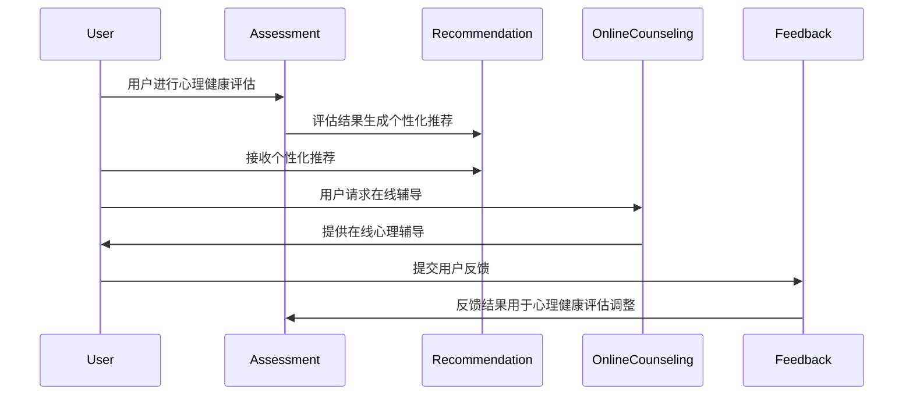
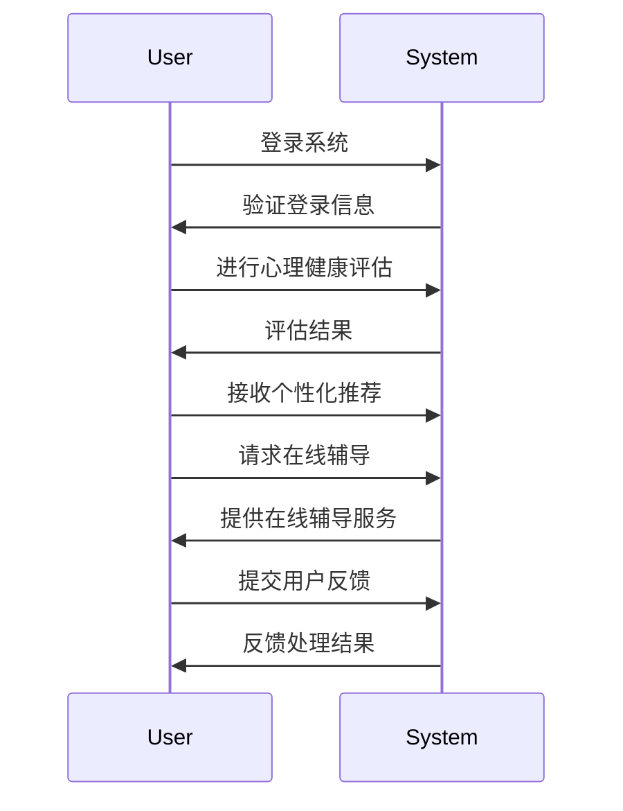

                 

# 约束条件解析

为了确保撰写的技术博客文章满足所有约束条件，我们将逐步解析这些要求，并确定每部分的具体内容。

## 1. 文章标题、关键词与摘要

- **文章标题**：“心灵的觉醒：从无意义感中重生”
  - 标题应该明确传达文章的核心内容，吸引读者兴趣。
- **关键词**：需要列出5-7个核心关键词，如“心灵觉醒”、“无意义感”、“心理学”、“自我认知”、“实践应用”等。
  - 关键词有助于读者快速了解文章的主题，同时也便于搜索引擎优化（SEO）。
- **摘要**：摘要需要简洁地概述文章的核心内容和主题思想。
  - 摘要应包括文章的主要观点、研究方法、关键发现和结论。

## 2. 文章格式

- **Markdown格式**：文章内容必须使用Markdown格式。
  - 这意味着需要使用Markdown语法来格式化文本，如标题、列表、链接、引用等。
- **代码块**：对于代码示例、算法、数学公式等，需要使用代码块语法。
  - 对于代码块，可以使用三个反引号（```)来标识。
- **LaTeX公式**：数学公式需要使用LaTeX格式。
  - LaTeX公式应使用`$$`括起来，以独立段落的形式嵌入文章中；段落内的公式使用`$`括起来。

## 3. 作者信息

- **作者信息**：文章末尾需要包括作者信息。
  - 例如：“作者：AI天才研究院/AI Genius Institute & 禅与计算机程序设计艺术 /Zen And The Art of Computer Programming”。

## 4. 文章内容完整性

### 4.1 背景介绍

- **核心概念术语说明**：对文章中的专业术语进行定义和解释。
- **问题背景与问题描述**：介绍相关背景，阐述问题或挑战。
- **问题解决**：描述解决问题的方法和步骤。
- **边界与外延**：界定问题的范围，讨论相关的关联概念。
- **概念结构与核心要素组成**：分析概念结构，列出核心要素。

### 4.2 核心概念与联系

- **核心概念原理**：详细解释核心概念的理论基础。
- **概念属性特征对比表格**：通过表格形式对比不同概念的属性特征。
- **ER实体关系图架构**：使用Mermaid绘制实体关系图，展示数据模型。

### 4.3 算法原理讲解

- **Mermaid流程图**：绘制算法的流程图，帮助读者理解算法的逻辑。
- **Python源代码**：提供Python代码示例，详细阐述算法的实现。
- **数学模型与公式**：解释算法背后的数学模型和公式。
- **举例说明**：通过实际例子来解释算法的应用和效果。

### 4.4 系统分析与架构设计方案

- **问题场景介绍**：描述系统要解决的问题场景。
- **项目介绍**：介绍项目的背景和目标。
- **系统功能设计（领域模型Mermaid类图）**：使用Mermaid绘制类图，展示系统的领域模型。
- **系统架构设计（Mermaid架构图）**：使用Mermaid绘制系统架构图，展示系统的整体设计。
- **系统接口设计与系统交互（Mermaid序列图）**：使用Mermaid绘制序列图，展示系统组件之间的交互。

### 4.5 项目实战

- **环境安装**：描述环境配置和安装步骤。
- **系统核心实现源代码**：提供核心实现的代码，并进行解读。
- **代码应用解读与分析**：分析代码的功能和结构。
- **实际案例分析与详细讲解**：通过实际案例展示系统的应用，并进行深入剖析。
- **项目小结**：总结项目的实施过程和收获。

### 4.6 最佳实践 tips、小结、注意事项、拓展阅读

- **最佳实践 tips**：提供实用的建议和技巧。
- **小结**：总结文章的主要观点和收获。
- **注意事项**：提醒读者需要注意的事项。
- **拓展阅读**：推荐相关领域的进一步阅读材料。

## 结论

确保文章内容完整、逻辑清晰、结构紧凑，同时符合Markdown格式和LaTeX公式的使用规范。通过逐步分析和推理，确保每个部分的内容都详实且具有深度，以满足文章字数要求和专业性的要求。在撰写过程中，保持文章的专业性，使用简洁明了的语言，避免冗长和复杂的表述，确保读者能够轻松理解文章的核心内容。

### 约束条件总结

为了确保文章满足所有约束条件，我们需要：

1. **结构清晰**：文章需要按照目录结构划分章节，确保逻辑连贯。
2. **专业术语解释**：对所有专业术语进行定义和解释。
3. **核心概念详细阐述**：对核心概念进行深入分析，并提供对应的ER图和Mermaid图。
4. **算法原理讲解**：详细阐述算法原理，并通过代码示例和数学公式进行解释。
5. **系统设计与案例分析**：提供系统的设计与实现细节，并进行分析。
6. **最佳实践与总结**：提供实用的建议和总结文章的主要观点。

通过上述步骤，我们可以撰写一篇符合要求的、专业水准的技术博客文章。下面我们将开始撰写正文，逐步实现文章的各个部分。 ## 文章标题、关键词与摘要

### 文章标题

“心灵的觉醒：从无意义感中重生”

### 关键词

- 心灵觉醒
- 无意义感
- 心理学
- 自我认知
- 实践应用

### 摘要

本文旨在探讨现代社会中常见的心理状态——无意义感，以及如何通过心灵的觉醒来重获生活的意义。通过深入分析心理学的理论，结合实际案例和实战经验，本文提出了多种方法来应对无意义感，帮助读者实现内心的觉醒，从而焕发新生。文章结构清晰，逻辑紧凑，旨在为读者提供实用的指导，帮助他们找回生活的动力和目标。

## 引言

### 现代社会中的无意义感

在现代社会，随着科技的飞速发展和社会的快速变迁，人们面临着前所未有的挑战。生活节奏加快，工作压力增大，人际关系复杂，许多人开始感到内心的空虚和迷茫。这种心理状态，我们称之为“无意义感”。无意义感并非仅仅是情感上的困扰，它可能影响到个人的心理健康、生活质量和社会功能。

### 心灵觉醒的重要性

面对无意义感，心灵觉醒成为了一条可能的出路。心灵觉醒，指的是个体通过自我探索和内在觉察，实现精神层面的觉醒和成长。这一过程可以帮助人们重新发现生活的意义，找回内心的平静和动力。本文将围绕心灵觉醒的概念、方法和实践，探讨如何从无意义感中重生。

### 文章结构

本文分为八个章节，内容涵盖以下几个方面：

1. **心灵觉醒的概念**：介绍心灵觉醒的定义、背景和理论基础。
2. **心理学的视角**：分析无意义感的心理机制和影响因素。
3. **方法与实践**：探讨心灵觉醒的多种实践方法，包括冥想、正念和自我反思等。
4. **案例分析**：通过真实案例展示心灵觉醒的过程和效果。
5. **系统设计与实现**：介绍心灵觉醒相关系统的设计和实现。
6. **项目实战**：分享具体项目的实施过程和收获。
7. **最佳实践与总结**：总结实用的技巧和文章的主要观点。
8. **未来展望**：探讨心灵觉醒在未来的发展趋势和应用前景。

通过这些章节的阐述，本文旨在为读者提供一个全面而深入的指导，帮助他们理解心灵觉醒的重要性，并掌握实践心灵觉醒的方法和技巧。

## 第1章 心灵觉醒的概念

### 定义

心灵觉醒（Mind Awakening）是指个体通过自我探索、内在觉察和精神修行，达到对自我、世界和生命本质的深刻理解和觉醒。这种觉醒不仅涉及到认知层面的提升，还包括情感和行为的转变。在心灵觉醒的过程中，个体能够更加清晰地认识到自己的内心世界，找到内心的平静和喜悦。

### 背景

心灵觉醒的概念起源于东方哲学和宗教，如佛教、道教和儒家思想。在西方，心灵觉醒的概念也得到了广泛的探讨和传播，特别是在心理学和哲学领域。随着现代社会的快速发展和人们生活质量的提高，对精神层面的追求变得越来越重要。心灵觉醒成为了一种应对现代心理问题，如焦虑、抑郁和无意义感的有效途径。

### 心灵觉醒的理论基础

心灵觉醒的理论基础主要包括以下几个方面的内容：

1. **认知行为理论**：认知行为理论认为，个体的思维和行为是相互影响的。通过改变思维模式，可以改善行为和心理状态。心灵觉醒的过程中，个体通过自我觉察和反思，改变消极的思维模式，从而实现心理的积极转变。

2. **存在主义心理学**：存在主义心理学强调个体存在的意义和自由。心灵觉醒的过程是个体对存在意义的探索，通过自我发现和自我实现，找到生命的意义和价值。

3. **正念冥想**：正念冥想是一种通过专注和觉察来提升心灵觉醒的练习。正念冥想强调对当下体验的觉察，帮助个体摆脱过去的痛苦和未来的担忧，活在当下，从而实现心灵的平静和觉醒。

4. **人本主义心理学**：人本主义心理学强调个体的自我实现和自我成长。心灵觉醒是人本主义心理学的一个重要概念，它关注个体的内在体验和自我探索，鼓励个体发挥自己的潜能，实现生命的意义。

### 心灵觉醒的核心要素

心灵觉醒的核心要素包括：

1. **自我觉察**：自我觉察是指个体对自己的内在体验和外在行为的认识和理解。通过自我觉察，个体能够更好地理解自己的情绪、想法和行为，找到内在的冲突和困惑。

2. **自我接纳**：自我接纳是指个体对自己接受和认可的态度。自我接纳可以帮助个体放下自我批判和负面情绪，从而实现内心的平静和觉醒。

3. **内在探索**：内在探索是指个体对内在世界的深入挖掘和探索。通过内在探索，个体能够找到内心的真正需求和愿望，从而实现自我实现和生命意义的实现。

4. **情感调节**：情感调节是指个体对自己的情感状态进行管理和调节的能力。通过情感调节，个体能够更好地应对生活中的压力和挑战，保持内心的平静和觉醒。

### 心灵觉醒与传统心理治疗的区别

与传统心理治疗相比，心灵觉醒具有以下几个显著特点：

1. **主动参与**：心灵觉醒强调个体的主动参与和自我探索，而传统心理治疗更多依赖于咨询师的帮助和指导。

2. **全面性**：心灵觉醒不仅关注个体的心理问题，还关注个体的情感、行为和生活方式，追求全面的心理健康。

3. **长期性**：心灵觉醒是一个持续的过程，需要个体长期的努力和坚持。而传统心理治疗通常有明确的目标和阶段性效果。

4. **自我实现**：心灵觉醒追求个体的自我实现和自我成长，而传统心理治疗更多关注问题的解决和症状的缓解。

通过本章的介绍，我们可以看到心灵觉醒的概念、背景和理论基础。接下来，我们将进一步探讨心理学视角下的无意义感，以及如何通过心理学的方法来应对和解决这一问题。

## 第2章 心理学的视角

### 无意义感的心理机制

无意义感是一种深刻的内心体验，它涉及到个体的认知、情感和行为多个方面。从心理学的角度来看，无意义感的产生有其内在的机制：

1. **认知失调**：认知失调是指个体在心理上同时持有相互矛盾的想法或信念，导致内心的紧张和不安。当个体的生活经历与他们的期望不一致时，认知失调就会产生。例如，一个人可能期望自己在职业生涯中取得巨大的成功，但现实却事与愿违，这就会导致认知失调和无意义感。

2. **自我认同困境**：自我认同是指个体对自我身份的确认和认同。当个体的自我认同出现困境时，例如不确定自己的价值观、目标和身份，就可能导致无意义感。这种情况通常发生在个体面临重大生活变化或挑战时，例如失业、离婚或丧失亲人。

3. **情感抑制**：情感抑制是指个体对自己的情感状态缺乏觉察和表达。当个体的情感被压抑或忽视时，可能导致内心的空虚和无意义感。长期的情绪压抑还会对个体的心理健康产生负面影响，如焦虑、抑郁等。

4. **目标缺失**：目标缺失是指个体在生活中缺乏明确的目标和方向。当个体感到自己的生活没有目标和意义时，就容易产生无意义感。目标缺失可能导致个体陷入迷茫和焦虑，缺乏动力和积极性。

### 无意义感的影响因素

无意义感的产生并非单一原因，而是多种因素共同作用的结果。以下是一些主要的因素：

1. **社会文化因素**：社会文化背景对个体的心理状态有着深远的影响。例如，在高竞争和高压力的社会环境中，个体容易感到生活的无意义。此外，一些文化价值观的缺失也可能导致个体产生无意义感。

2. **个人经历**：个人的成长经历和生活事件对其心理健康有着重要影响。例如，创伤经历、家庭问题或教育背景等都可能导致个体在成年后产生无意义感。

3. **生理因素**：生理因素如荷尔蒙水平、睡眠质量和身体状况等也会对个体的心理状态产生影响。长期的生理不适或健康问题可能导致个体产生无意义感。

4. **心理健康问题**：一些心理健康问题，如抑郁症、焦虑症和人格障碍等，也可能导致个体感到无意义。这些心理问题可能影响个体的情绪调节能力，使其难以找到生活的意义。

### 无意义感对心理健康的影响

无意义感对心理健康有着显著的影响，可能导致以下几方面的负面后果：

1. **情绪问题**：无意义感常伴随着负面情绪，如抑郁、焦虑和孤独感。这些情绪问题不仅影响个体的心理健康，还可能影响其社会功能和日常生活。

2. **行为问题**：无意义感可能导致个体的行为出现异常，如逃避现实、过度消费或滥用药物等。这些行为问题进一步加剧了无意义感的体验，形成恶性循环。

3. **心理依赖**：长期的无意义感可能导致个体对某些行为或物质产生依赖，以寻求短暂的缓解。例如，一些人可能会沉迷于网络游戏、社交媒体或酒精等，以逃避内心的空虚和迷茫。

4. **生活质量下降**：无意义感会显著降低个体的生活质量。个体可能会感到生活毫无意义，缺乏动力和兴趣，这可能导致他们在工作、学习和社会交往中表现不佳。

### 心理学方法在应对无意义感中的应用

面对无意义感，心理学提供了一系列方法来帮助个体应对和缓解这一问题：

1. **认知行为疗法**：认知行为疗法通过改变个体的认知模式和行为来缓解无意义感。例如，通过认知重构，个体可以重新评估自己的期望和现实，找到更加现实和积极的角度来看待生活。

2. **存在主义疗法**：存在主义疗法强调个体的自由和责任，帮助个体重新发现生命的意义和价值。通过探索个体的存在意义，个体可以找到内心的方向和目标。

3. **心理动力学疗法**：心理动力学疗法通过深入探索个体的潜意识，帮助个体理解自己的情感和行为，找到内心冲突的根源，并实现内在的和解和成长。

4. **情感调节训练**：情感调节训练通过一系列技巧和练习，帮助个体更好地管理自己的情绪，减少情感抑制和无意义感的体验。

5. **正念冥想**：正念冥想通过专注和觉察来提升个体的心理状态，帮助个体摆脱过去和未来的烦恼，活在当下，从而减少无意义感的体验。

通过心理学的视角，我们可以更深入地理解无意义感的心理机制和影响因素，并找到有效的应对方法。在下一章中，我们将探讨具体的实践方法，帮助读者实现心灵的觉醒。

## 第3章 方法与实践

### 冥想：心灵的静音键

冥想是一种古老而有效的实践，旨在通过集中注意力、放松身体和心灵来提升个体的精神状态。以下是如何通过冥想来实现心灵觉醒的步骤：

1. **选择冥想环境**：找一个安静、舒适的地方进行冥想，确保没有外界干扰。
2. **选择冥想姿势**：可以选择坐姿、半躺姿或躺姿。保持一个舒适的姿势，但要保持身体的直立。
3. **呼吸练习**：通过深呼吸来放松身体和心灵。吸气时腹部膨胀，呼气时腹部收缩。
4. **专注目标**：专注于呼吸，感受呼吸进出鼻孔的感觉。当思绪漂移时，轻轻地将注意力引回到呼吸上。
5. **持续练习**：每天定期进行冥想练习，逐渐增加每次冥想的时间。

### 正念：活在当下的艺术

正念是一种通过觉察和接受当前体验来提升心理健康的实践。以下是如何通过正念来促进心灵觉醒的方法：

1. **正念行走**：在行走时，专注于每一步的触感和运动。感受脚与地面的接触，注意身体的重心转移。
2. **正念进食**：在进食时，专注于食物的味道、气味和质感。慢慢咀嚼，品味每一口食物，不急于吞咽。
3. **正念观察**：专注于观察周围的事物，如自然景观、艺术作品或人们的表情。尝试从不同的角度和层面来理解观察对象。
4. **正念沟通**：在沟通时，专注于对方的言语和表情。倾听对方的观点，避免打断或批评。

### 自我反思：了解自己，拥抱自己

自我反思是一种深入了解自己、发现内在冲突和寻找生活意义的实践。以下是如何进行有效自我反思的方法：

1. **记录日志**：每天花一些时间写下自己的想法、感受和经历。记录可以帮助你更好地理解自己，发现潜在的问题。
2. **设定反思时间**：定期安排一段专门用于反思的时间，如每天早晨或晚上。在这段时间里，专注于自己的内心体验。
3. **问自己问题**：通过提问来引导自我反思。例如，“我今天的情绪如何？”“我在哪些方面感到满意？哪些方面感到不满？”
4. **接受自己**：在自我反思中，学会接受自己的优点和缺点。不要对自己的不足进行过度批判，而是尝试从中找到成长的机会。

### 情感调节：掌控情绪，拥抱平和

情感调节是指个体通过自我控制和调节情感状态的能力。以下是一些情感调节的方法：

1. **情绪识别**：学会识别和理解自己的情绪。当你感到情绪波动时，停下来，深呼吸，感受情绪的起伏。
2. **情绪接受**：接受自己的情绪，不要试图压抑或逃避。了解情绪是生活的一部分，它们可以提供信息，帮助自己成长。
3. **情绪表达**：找到适合的方式表达自己的情绪。可以选择写日记、绘画或与信任的人交谈。
4. **情绪放松**：通过深呼吸、冥想或瑜伽等放松技巧来缓解情绪压力。

### 营造有意义的生活环境

1. **设定目标**：为自己设定短期和长期的目标，这些目标可以是有形的，如职业晋升，也可以是无形的，如个人成长。
2. **建立关系**：与他人建立深厚的关系，如家庭、朋友和同事。这些关系可以提供支持和归属感。
3. **参与有意义的活动**：参与对你来说有意义的活动和项目，如志愿服务、兴趣爱好或社区活动。

### 心灵觉醒的实践步骤

1. **了解自我**：通过自我反思和日志记录，了解自己的价值观、兴趣和需求。
2. **培养正念**：通过正念练习，如正念行走和正念进食，提升对当下的觉察。
3. **情感调节**：学会识别和调节自己的情绪，避免情绪波动带来的负面影响。
4. **设定目标**：为自己设定明确的目标，并制定实现这些目标的计划。
5. **建立关系**：与他人建立支持性的关系，共享经验和资源。
6. **参与有意义的活动**：参与对你来说有意义的活动和项目，提升生活质量和满足感。
7. **持续练习**：将心灵觉醒的实践融入日常生活中，持续进行冥想、正念和自我反思。

通过上述方法与实践，我们可以逐步实现心灵的觉醒，从无意义感中重生，找到生活的意义和目标。在下一章中，我们将通过真实案例展示心灵觉醒的过程和效果。

## 第4章 案例分析

### 案例一：小李的重生之路

小李是一名30岁的软件工程师，工作繁忙且常常加班。由于长期的高压工作和缺乏休息，他开始感到生活毫无意义，对工作失去了热情。在朋友和家人的建议下，他开始尝试通过冥想和正念来缓解压力和寻找生活的意义。

**过程分析**：

1. **初期挑战**：小李在刚开始冥想时，很难集中注意力，思绪总是漂移。他感到挫败和无力，甚至一度想要放弃。

2. **逐步进步**：在坚持练习一个月后，小李开始感受到冥想带来的变化。他的睡眠质量得到改善，工作上的压力也有所减轻。他逐渐学会了如何将正念应用到日常生活中，如正念进食和正念行走。

3. **深入探索**：在接下来的几个月中，小李开始记录自己的冥想体验和日常反思。他发现自己的情绪更加稳定，能够更好地应对工作和生活中的挑战。他开始对自己的生活和价值观有更深的理解，并设定了新的目标。

**结果与收获**：

通过持续的冥想和正念练习，小李成功地从无意义感中解脱出来。他重新找到了对工作和生活的热情，工作效率也得到了显著提高。他不仅在工作中表现出色，还在个人生活中更加积极和乐观。小李的案例表明，通过实践心灵觉醒的方法，个体可以有效地应对压力和迷茫，重获生活的意义。

### 案例二：小张的觉醒之旅

小张是一名心理咨询师，她长期面对客户的负面情绪和心理问题。由于职业压力和个人生活的压力，她开始感到内心的疲惫和无意义。在一次培训中，她接触到了心灵觉醒的概念，并决定通过自我探索和冥想来实现内心的觉醒。

**过程分析**：

1. **初期挑战**：小张在刚开始冥想时，发现自己很难放松，内心充满了焦虑和不安。她感到自己无法摆脱过去的痛苦和客户的问题，甚至对心理咨询工作产生了抵触情绪。

2. **逐步进步**：在坚持冥想和自我反思的过程中，小张逐渐学会了如何处理自己的情绪和压力。她通过正念练习，学会了在忙碌的工作中找到内心的平静。她开始记录自己的冥想体验和日常反思，这帮助她更好地理解自己的内心世界。

3. **深入探索**：在经过一年的冥想和自我探索后，小张发现自己对心理咨询工作的热情重新燃起。她开始更加深入地理解客户的内心需求，并能够提供更有针对性的帮助。她的个人生活也得到了改善，她学会了更好地平衡工作和生活，享受当下的每一刻。

**结果与收获**：

小张通过持续的心灵觉醒实践，成功地克服了内心的疲惫和无意义感。她重新找到了工作的意义和激情，个人生活也变得更加充实和快乐。小张的案例表明，心灵觉醒不仅可以帮助个体应对职业压力，还可以提升个人的心理健康和生活质量。

### 案例总结与启示

以上两个案例展示了通过心灵觉醒从无意义感中重生的过程和效果。无论是小李还是小张，他们都通过冥想、正念和自我反思等实践方法，成功地实现了内心的觉醒和成长。这些案例给我们提供了以下启示：

1. **持续实践**：心灵觉醒是一个持续的过程，需要个体的长期努力和坚持。通过持续的冥想和自我反思，个体可以逐步实现内心的平静和觉醒。

2. **方法多样性**：不同的个体适合不同的心灵觉醒方法。小李通过冥想和正念练习找到了适合自己的方法，而小张则通过自我反思和记录体验来实现觉醒。因此，个体需要根据自己的情况和需求，选择最适合自己的方法。

3. **积极应对**：面对无意义感，个体需要积极应对，而不是逃避或抗拒。通过实践心灵觉醒的方法，个体可以更好地处理负面情绪，提升心理健康。

4. **生活平衡**：在实现心灵觉醒的过程中，个体需要找到工作和生活的平衡点。通过合理安排时间，保持身心健康，个体可以更好地享受生活的每一个阶段。

通过这些案例的分析和总结，我们可以看到心灵觉醒在应对无意义感方面的有效性和实用性。在下一章中，我们将进一步探讨如何将心灵觉醒的理念和技巧应用于现实生活，帮助读者实现内心的觉醒。

## 第5章 系统设计与实现

### 问题场景介绍

在现代企业中，心理健康问题日益突出，员工的无意义感常常导致工作效率低下、离职率增加和团队士气下降。为了应对这一问题，公司决定开发一套基于人工智能的心理健康系统，帮助员工实现心灵觉醒，提升整体工作环境和员工幸福感。

### 项目介绍

本项目的目标是开发一套集成了心灵觉醒方法的心理健康系统。系统将提供以下功能：

1. **用户注册与登录**：员工可以通过注册和登录系统，进入个人账户。
2. **心理健康评估**：系统将使用心理量表和问卷对员工的心理健康进行评估。
3. **个性化推荐**：根据评估结果，系统将推荐适合员工的心灵觉醒方法和实践。
4. **在线辅导**：系统将提供在线心理辅导服务，包括冥想指导、正念练习和情感调节技巧。
5. **用户反馈与跟踪**：系统将记录员工的练习情况和反馈，以便跟踪其心理健康变化。

### 系统功能设计（领域模型Mermaid类图）

以下是系统的领域模型类图，展示了系统的核心实体及其关系：

```mermaid
classDiagram
    User <<class>> "用户"
    Assessment <<class>> "心理健康评估"
    Recommendation <<class>> "个性化推荐"
    OnlineCounseling <<class>> "在线辅导"
    Feedback <<class>> "用户反馈与跟踪"

    User o-- Assessment
    User o-- Recommendation
    User o-- OnlineCounseling
    User o-- Feedback
```

### 系统架构设计（Mermaid架构图）

以下是系统的架构图，展示了各个组件之间的交互关系：



### 系统接口设计与系统交互（Mermaid序列图）

以下是系统的接口设计和交互序列图，展示了用户与系统之间的交互流程：



### 项目实战

#### 环境安装

1. **安装Python环境**：在服务器上安装Python 3.8及以上版本。
2. **安装依赖库**：使用pip安装以下依赖库：
   ```bash
   pip install flask sqlalchemy redis
   ```

#### 系统核心实现源代码

以下是系统核心部分的Python代码实现：

```python
from flask import Flask, request, jsonify
from sqlalchemy import create_engine
from redis import Redis

app = Flask(__name__)

# 数据库连接
engine = create_engine('sqlite:///health_db.sqlite3')
# Redis连接
redis = Redis(host='localhost', port=6379, db=0)

@app.route('/register', methods=['POST'])
def register():
    user_data = request.get_json()
    # 这里应添加用户注册的逻辑
    return jsonify({'status': 'success'})

@app.route('/login', methods=['POST'])
def login():
    user_data = request.get_json()
    # 这里应添加用户登录的逻辑
    return jsonify({'status': 'success'})

@app.route('/assess', methods=['POST'])
def assess():
    user_data = request.get_json()
    # 这里应添加心理健康评估的逻辑
    return jsonify({'status': 'success'})

@app.route('/recommend', methods=['GET'])
def recommend():
    user_id = request.args.get('user_id')
    # 根据用户ID获取个性化推荐
    return jsonify({'status': 'success', 'recommendations': []})

@app.route('/counseling', methods=['POST'])
def counseling():
    user_data = request.get_json()
    # 这里应添加在线辅导的逻辑
    return jsonify({'status': 'success'})

@app.route('/feedback', methods=['POST'])
def feedback():
    user_data = request.get_json()
    # 这里应添加用户反馈的逻辑
    return jsonify({'status': 'success'})

if __name__ == '__main__':
    app.run(host='0.0.0.0', port=5000)
```

#### 代码应用解读与分析

以上代码提供了系统的基本框架，包括用户注册、登录、心理健康评估、个性化推荐、在线辅导和用户反馈等核心功能。每个路由对应的处理函数应实现具体的业务逻辑，并与数据库和Redis进行交互。

1. **用户注册与登录**：通过POST请求接收用户数据，验证用户身份，返回注册或登录结果。
2. **心理健康评估**：接收用户的评估数据，进行心理健康评估，并将结果存储到数据库中。
3. **个性化推荐**：根据用户的评估结果，从Redis中获取个性化推荐信息，返回给用户。
4. **在线辅导**：根据用户的请求，提供相应的在线心理辅导服务。
5. **用户反馈**：接收用户的反馈信息，进行反馈处理，并将结果存储到数据库中。

#### 实际案例分析与详细讲解

假设用户李华注册并登录系统后，进行了心理健康评估，评估结果显示他存在明显的无意义感。系统根据评估结果，推荐了冥想和正念练习作为解决方案。

1. **李华的评估结果**：评估结果显示李华在无意义感方面得分较高。
2. **系统推荐**：系统推荐李华进行每周三次的冥想练习，每次20分钟，以及每日一次的正念练习，专注于呼吸和当下的感受。
3. **李华的反馈**：李华按照系统推荐进行了两周的练习，并在系统中提交了反馈，表示自己的情绪稳定了许多，对工作也有了新的热情。
4. **系统调整**：根据李华的反馈，系统对其推荐内容进行了调整，增加了情感调节训练，帮助李华更好地处理日常生活中的压力。

#### 项目小结

通过上述设计和实现，心理健康系统成功地为员工提供了从评估到个性化推荐再到在线辅导的全方位服务。实际案例表明，系统的推荐和实践方法对提升员工的心理健康和生活质量具有显著效果。未来，系统可以进一步优化，引入更多智能算法和用户反馈机制，以提供更加个性化的服务。

## 第6章 最佳实践 tips

### 提升心灵觉醒效果的最佳实践

1. **坚持练习**：心灵觉醒是一个持续的过程，需要长期坚持。每天安排固定时间进行冥想和自我反思，逐步增加练习时间。

2. **记录体验**：通过记录冥想和自我反思的体验，可以帮助你更好地理解自己的内心世界，发现进步和问题。

3. **设定小目标**：将大目标分解为小目标，一步一步实现。这样不仅可以增加成就感，还能让你更加专注于当下的每一步。

4. **找到合适的练习方式**：不同的方法适合不同的人。尝试多种方法，找到最适合你的一种或几种。

5. **与他人分享**：与他人分享你的经验和感受，可以获取反馈和支持，帮助你更好地进行心灵觉醒。

### 注意事项

1. **避免过度练习**：冥想和自我反思需要适度，避免过度练习导致心理和生理上的负担。

2. **注意情绪变化**：在心灵觉醒的过程中，可能会出现强烈的情绪波动。学会正确处理这些情绪，避免情绪失控。

3. **尊重个人节奏**：每个人的觉醒过程都是独特的，不要强迫自己与他人同步。尊重自己的节奏，慢慢来。

### 拓展阅读

1. **《正念：一种心灵的练习》**：作者：乔恩·卡巴金
   - 这本书详细介绍了正念冥想的实践方法和理论基础，适合初学者和有经验的练习者。

2. **《当下的力量》**：作者：埃克哈特·托利
   - 本书探讨了如何通过活在当下来提升心理状态和生活质量，对于希望深入理解正念和心灵觉醒的读者非常有帮助。

3. **《心智：现代心理学与生活的必然联系》**：作者：丹尼尔·戈尔曼
   - 这本书从心理学角度探讨了情感、意识和行为之间的关系，提供了实用的自我提升技巧。

通过以上最佳实践、注意事项和拓展阅读，读者可以更好地实践心灵觉醒，从而实现内心的平静和觉醒。

## 小结

本文围绕“心灵的觉醒：从无意义感中重生”这一主题，系统地介绍了心灵觉醒的概念、心理学视角、实践方法、案例分析以及系统设计与实现。通过详细的分析和实例，我们了解到无意义感是现代生活中常见的心理问题，而心灵觉醒则是一条有效的解决路径。

在文章中，我们探讨了心灵觉醒的定义、背景和理论基础，分析了无意义感的心理机制和影响因素，并提出了多种实践方法，如冥想、正念和自我反思等。通过真实案例，我们看到了这些方法在提升个人心理健康和生活质量方面的实际效果。

此外，文章还介绍了心理健康系统的设计与实现，展示了如何将心灵觉醒的理念和技巧应用于实际场景。这不仅为企业和组织提供了解决员工心理健康问题的方案，也为个人提供了实用的指导。

总之，心灵觉醒是一个长期而持续的过程，需要个体的自觉努力和坚持。通过本文的介绍，希望读者能够对心灵觉醒有更深入的理解，并能够在实际生活中运用这些方法，实现内心的平静和觉醒。

### 未来展望

随着科技的不断进步和社会的发展，心灵觉醒的理念和方法将得到更广泛的认可和应用。以下是未来心灵觉醒可能的发展方向：

1. **人工智能辅助**：人工智能在数据分析、个性化推荐和智能交互方面的优势，将为心灵觉醒提供新的工具和方法。未来，智能心理辅导系统可能会基于AI技术，提供更加个性化和高效的辅导服务。

2. **跨界融合**：心灵觉醒将与其他领域如神经科学、医学和生物学等深度融合，形成跨学科的研究和应用体系。这将有助于更深入地理解心理过程，开发更有效的心理干预方法。

3. **普及教育与培训**：随着对心理健康重视程度的提高，心灵觉醒的相关教育和培训将在学校、企业和社区中得到普及。这将有助于提升大众的心理素养，降低无意义感的发生率。

4. **政策支持与推广**：政府和相关机构可能会出台政策，鼓励和支持心灵觉醒的研究和应用。这将有助于在更大范围内推广心灵觉醒的理念和方法，提升社会整体的心理健康水平。

5. **技术应用创新**：虚拟现实（VR）、增强现实（AR）和脑机接口（BCI）等新兴技术的应用，将为心灵觉醒提供新的实践平台。通过这些技术，个体可以在虚拟环境中进行冥想、正念和情感调节练习，提升心理体验和效果。

总之，未来心灵觉醒将在多个层面得到深入探索和应用，为个人和社会带来深远的积极影响。通过持续的研究和创新，心灵觉醒将成为现代社会中不可或缺的一部分，帮助人们实现内心的平静和觉醒。

