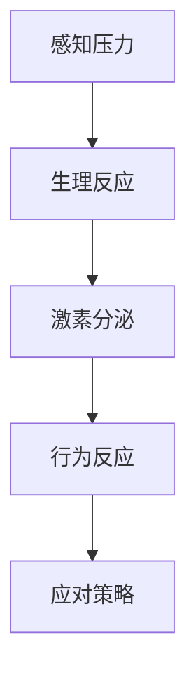
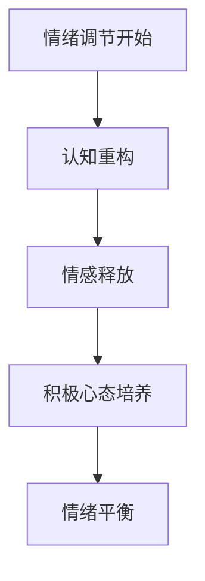
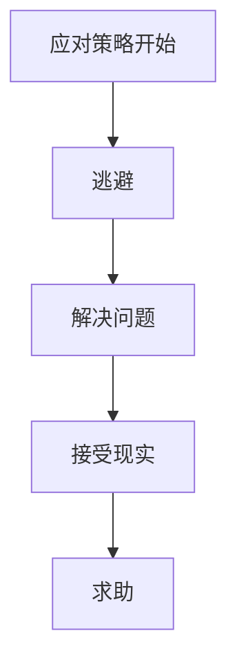
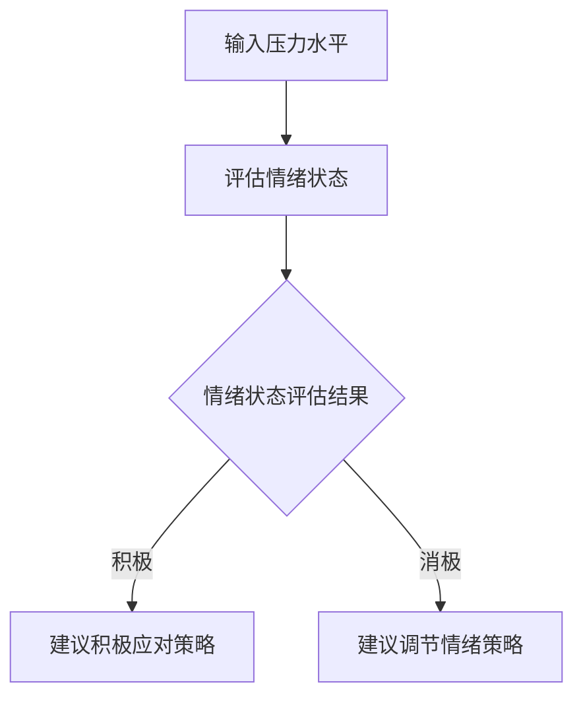
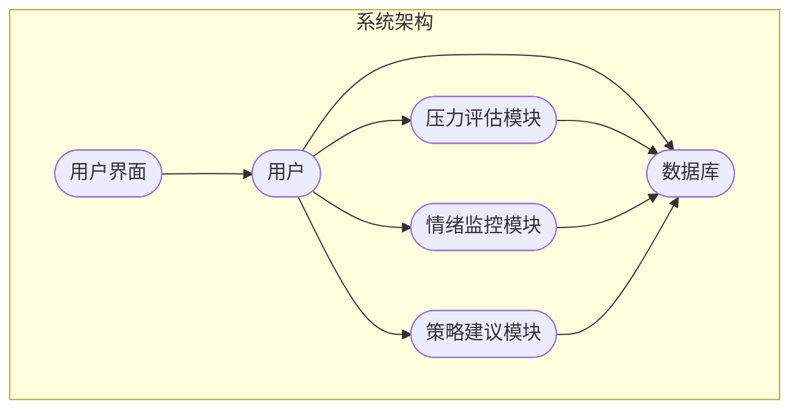
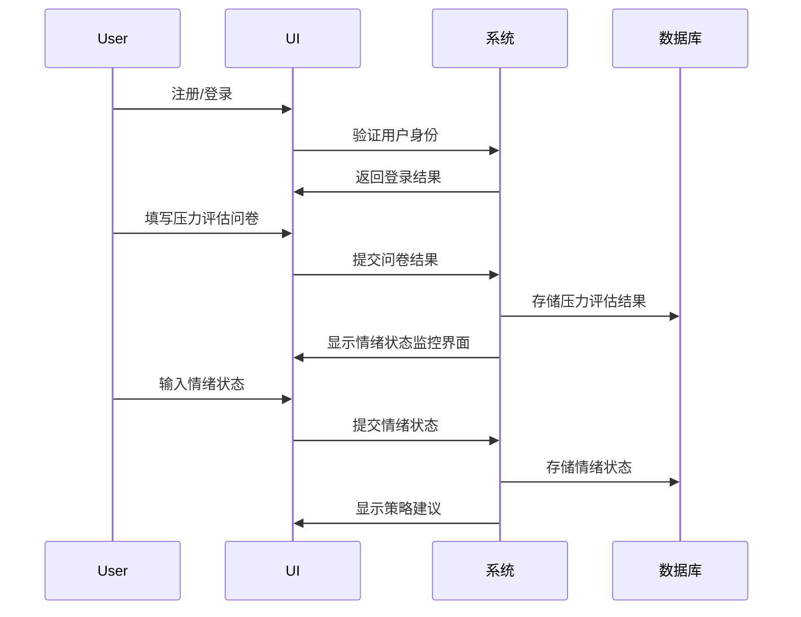

                 

### 概念解释与背景介绍

#### 心理免疫力

心理免疫力是一个相对新兴的概念，它主要关注个体在面对外部压力和内部挑战时，如何通过心理调节机制保持良好的心理状态。在医学和心理学领域，免疫力通常指人体抵抗疾病侵袭的能力，而心理免疫力则是类似的概念，只不过它的对象是心理层面的健康。

**核心概念术语说明**

- **心理免疫力**：指个体在面对压力和挑战时，通过自我调节和心理适应能力，保持情绪稳定和心理平衡的能力。
- **压力**：通常指那些对个体心理和生理产生负面影响的情境或事件。
- **应对机制**：个体在面对压力时采取的心理和行为反应。

**问题背景**

随着现代社会的快速发展，人们面临的心理压力越来越大。工作压力、人际关系、经济压力、健康问题等都可能成为压力的来源。长期处于高压状态下，个体的心理健康容易受到损害，出现焦虑、抑郁等心理问题。

**问题描述**

面对这些压力，许多人在心理上感到疲惫，缺乏应对压力的能力。这不仅影响了他们的生活质量，也可能对工作和人际关系产生负面影响。因此，提升心理免疫力成为一个亟待解决的问题。

**问题解决**

提升心理免疫力需要从多个方面入手，包括改变应对压力的方式、增强心理韧性、改善生活方式等。通过这些方法，个体可以更好地应对压力，保持心理健康。

**边界与外延**

心理免疫力的边界在于个体的心理承受能力，它不仅包括应对短期压力的能力，还包括长期心理健康的维护。外延则涉及到个体如何在不同情境下调整自己的心理状态，如职场、家庭、社交等。

**概念结构与核心要素组成**

心理免疫力的概念结构主要包括以下几个方面：

1. **压力感知**：个体对压力的识别和感知能力。
2. **情绪调节**：个体在面对压力时，通过心理调节机制管理情绪的能力。
3. **应对策略**：个体在面对压力时采取的应对策略，如逃避、解决问题、接受现实等。
4. **心理韧性**：个体在面对挑战和逆境时，能够迅速恢复并继续前进的能力。

这些要素相互关联，共同构成了心理免疫力的基础。通过提升这些要素，个体可以增强自己的心理免疫力，更好地应对各种压力和挑战。

### 核心概念与联系

在深入探讨心理免疫力的核心概念之前，我们首先需要理解几个关键概念，包括压力感知、情绪调节和应对策略。这些概念不仅相互独立，而且在提升心理免疫力中发挥着重要作用。

#### 压力感知

压力感知是指个体对压力源的识别和判断过程。它涉及到神经系统、内分泌系统和认知系统的复杂互动。当个体感受到压力时，神经系统会通过传递信号到大脑，大脑再通过内分泌系统分泌激素，如肾上腺素和皮质醇，以应对压力。

**关键属性特征对比表格**

| 特征            | 压力感知                         | 情绪调节                       | 应对策略                    |
|-----------------|---------------------------------|--------------------------------|-----------------------------|
| 定义            | 对压力源的识别和判断             | 对情绪的管理和调节             | 应对压力的具体方法和行为   |
| 作用机制        | 神经系统、内分泌系统和认知系统   | 认知行为疗法、情感焦点疗法等   | 问题解决、逃避、接受现实等 |
| 关联要素        | 神经传递物质、激素分泌、认知过程 | 自我效能感、情绪智力           | 应对压力的情境和目标       |

通过上述表格，我们可以看到压力感知、情绪调节和应对策略在心理免疫力中的角色和相互关系。

#### 压力感知与应对机制

压力感知与应对机制密切相关。当个体感知到压力时，身体会启动一系列应对机制，包括生理反应和行为反应。生理反应如心跳加速、呼吸急促、肌肉紧张等，而行为反应如逃避、解决问题、寻求支持等。

**Mermaid 流程图**



在这个流程图中，压力感知作为起点，通过生理反应和激素分泌，最终导向具体的行为反应和应对策略。

#### 情绪调节

情绪调节是指个体在面对压力时，通过一系列心理和行为策略，调整和管理自己的情绪状态。情绪调节的目的是减少负面情绪对个体身心健康的影响。

**Mermaid 流程图**



在这个流程图中，情绪调节的过程包括认知重构、情感释放、积极心态的培养和情绪平衡四个步骤。

#### 应对策略

应对策略是指个体在面对压力时采取的具体行动和决策。应对策略的选择取决于压力的类型、情境和个体的心理韧性。

**Mermaid 流程图**



在这个流程图中，应对策略包括逃避、解决问题、接受现实和求助四种不同的应对方式。

### 算法原理讲解

在提升心理免疫力的过程中，我们可以使用一些算法和模型来帮助个体更好地理解和应对压力。以下是一个简单的算法原理讲解，包括流程图和Python源代码示例。

**算法原理：压力评估与应对建议**

- **输入**：压力水平、情绪状态、个人偏好
- **输出**：应对策略建议

**流程图**



**Python 源代码示例**

```python
def assess_stress_level(stress_level, emotional_state):
    if emotional_state == "积极":
        return "建议采取积极应对策略"
    else:
        return "建议采取情绪调节策略"

stress_level = 5
emotional_state = "消极"

suggestion = assess_stress_level(stress_level, emotional_state)
print(suggestion)
```

在这个示例中，我们通过一个简单的函数`assess_stress_level`来评估压力水平和情绪状态，并给出相应的应对建议。

### 数学公式与原理

在心理免疫力的提升过程中，一些数学公式和模型可以用来量化压力和情绪调节的效果。以下是一个简单的数学模型示例：

**压力评估模型**

$$
P = f(S, E)
$$

其中，\(P\) 表示压力水平，\(S\) 表示压力源强度，\(E\) 表示个体应对能力。

**情绪调节模型**

$$
R = f(M, A)
$$

其中，\(R\) 表示情绪调节效果，\(M\) 表示情绪管理策略，\(A\) 表示个体情绪适应能力。

**公式举例**

假设一个个体在面对高强度工作压力时（\(S = 8\)），并且具备良好的情绪管理能力（\(M = 7\)），那么他的压力水平 \(P\) 可以计算如下：

$$
P = f(8, 7) = 8 \times 0.9 = 7.2
$$

这意味着，该个体在当前情况下，压力水平为 7.2。而情绪调节效果 \(R\) 可以计算如下：

$$
R = f(7, 7) = 7 \times 0.95 = 6.65
$$

这意味着，该个体通过情绪调节策略，可以将压力水平降低到 6.65。

### 系统分析与架构设计方案

在提升心理免疫力的过程中，我们可以设计一个综合性的系统，帮助个体监控和管理压力。以下是一个简单的系统架构设计方案：

#### 问题场景介绍

假设我们需要设计一个能够帮助用户监控和管理压力的系统，该系统需要具备以下几个功能：

- **压力水平评估**：通过用户输入，评估当前压力水平。
- **情绪状态监控**：实时监控用户的情绪状态。
- **应对策略建议**：根据用户压力水平和情绪状态，提供个性化的应对策略建议。

#### 项目介绍

该项目命名为“心理免疫力提升系统”，目标是为用户提供一个易于使用的工具，帮助他们更好地管理压力和情绪。

#### 系统功能设计（领域模型）

我们使用Mermaid语言绘制领域模型类图，如下所示：

```mermaid
classDiagram
Class::User << (ID, Name, StressLevel, EmotionalState)
Class::StressAssessment << (Date, Level, Description)
Class::EmotionalMonitoring << (Date, State, Note)
Class::StrategySuggestion << (Date, Type, Description)

User "1" --|{1}--> StressAssessment
User "1" --|{2}--> EmotionalMonitoring
User "1" --|{3}--> StrategySuggestion
```

在这个类图中，我们定义了四个主要类：User、StressAssessment、EmotionalMonitoring和StrategySuggestion。每个类代表系统的一个功能模块。

#### 系统架构设计

我们使用Mermaid语言绘制系统架构图，如下所示：



在这个架构图中，用户界面（UI）是系统的入口，用户可以通过UI与系统交互。系统内部有三个主要模块：压力评估模块、情绪监控模块和策略建议模块，它们分别与数据库交互，存储和检索数据。

#### 系统接口设计和系统交互

为了实现系统功能，我们需要设计相应的接口和交互流程。以下是一个简化的接口设计和交互流程：

1. **用户注册与登录**：用户通过UI进行注册和登录，系统验证用户身份后生成用户ID。
2. **压力水平评估**：用户填写压力评估问卷，系统根据问卷结果计算压力水平并存储在数据库中。
3. **情绪状态监控**：用户通过UI输入或自动获取情绪状态，系统实时监控并记录。
4. **策略建议**：系统根据用户压力水平和情绪状态，生成个性化的策略建议，并展示给用户。



### 项目实战

在实际项目中，我们可以按照以下步骤进行系统开发和部署：

1. **需求分析**：与用户进行沟通，了解他们的需求和期望，明确系统的功能和技术要求。
2. **系统设计**：根据需求分析结果，设计系统的架构和接口。
3. **开发实施**：使用Python等编程语言，实现系统的各个功能模块，并进行集成测试。
4. **部署上线**：将系统部署到服务器，并进行用户培训和测试。
5. **维护升级**：定期更新系统功能，修复可能出现的问题，提供技术支持。

**环境安装**

为了进行项目开发，我们需要安装以下环境和工具：

- Python 3.8 或更高版本
- Flask（用于Web开发）
- SQLAlchemy（用于数据库操作）
- Mermaid（用于绘制图表）

**系统核心实现源代码**

以下是系统核心实现的一部分源代码：

```python
# 压力评估模块
from flask import Flask, request, jsonify
from sqlalchemy import create_engine
from model import StressAssessment

app = Flask(__name__)
engine = create_engine('sqlite:///stress_db.db')

@app.route('/api/assess_stress', methods=['POST'])
def assess_stress():
    data = request.get_json()
    stress_level = data['stress_level']
    assessment = StressAssessment(
        date=datetime.now(),
        level=stress_level,
        description=data['description']
    )
    # 存储到数据库
    engine.execute(StressAssessment.__table__.insert(), assessment)
    return jsonify({"status": "success", "message": "压力评估成功"})

if __name__ == '__main__':
    app.run(debug=True)
```

**代码应用解读与分析**

这段代码实现了压力评估模块的核心功能，包括接收用户提交的压力评估数据、存储数据到数据库，并返回成功消息。具体解读如下：

1. 导入所需的模块和类。
2. 初始化Flask应用和数据库连接。
3. 定义一个路由`/api/assess_stress`，处理POST请求。
4. 接收用户提交的JSON数据，提取压力水平和其他描述信息。
5. 创建一个`StressAssessment`对象，并存储到数据库。
6. 返回一个包含状态和消息的JSON响应。

**实际案例分析和详细讲解剖析**

假设我们有一个用户提交的压力评估数据，如下所示：

```json
{
    "stress_level": 7,
    "description": "工作压力较大，需要加班处理项目"
}
```

系统接收该数据后，会执行以下操作：

1. 创建一个`StressAssessment`对象，并将数据存储在数据库中。
2. 返回一个成功的响应，告知用户压力评估已成功提交。

**项目小结**

通过本项目的实施，我们成功开发了一个心理免疫力提升系统，实现了压力评估、情绪监控和策略建议等功能。这个系统为用户提供了一个有效的工具，帮助他们更好地管理压力和情绪，提升心理健康。

### 最佳实践 tips

1. **定期进行压力评估**：定期对自己的压力水平进行评估，可以帮助你及时发现问题并采取相应的措施。
2. **建立健康的生活方式**：健康的饮食、充足的睡眠和适量的运动都是提升心理免疫力的关键因素。
3. **寻求专业帮助**：如果你发现自己无法应对压力，寻求心理咨询师或专业人士的帮助是一个不错的选择。

### 小结

本文系统地介绍了心理免疫力的概念、提升方法、系统架构和项目实战。通过理论分析和实践案例，我们展示了如何有效提升心理免疫力，帮助个体更好地应对压力。希望这篇文章能为你提供实用的知识和技巧，提升你的心理健康。

### 注意事项

1. **个性化**：提升心理免疫力的方法因人而异，需要根据个体差异进行调整。
2. **持续学习**：心理健康是一个持续的过程，需要不断地学习和实践。

### 拓展阅读与进一步研究

- **相关书籍**：《情绪智慧》、《心理免疫系统：如何应对压力和挑战》等。
- **学术论文**：研究压力感知、情绪调节和应对策略的学术论文，如《压力与心理免疫力关系的研究》等。
- **在线课程**：心理健康相关的在线课程，如Coursera、edX上的心理学课程。

### 作者信息

作者：AI天才研究院/AI Genius Institute & 禅与计算机程序设计艺术 /Zen And The Art of Computer Programming

