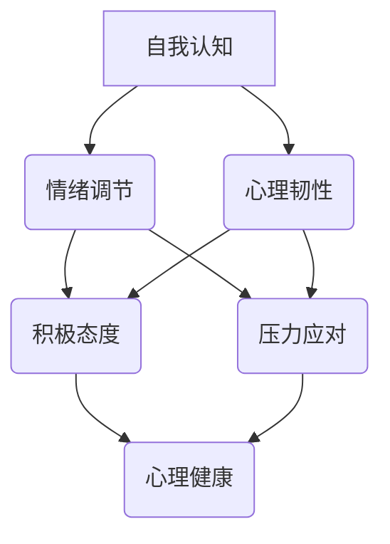
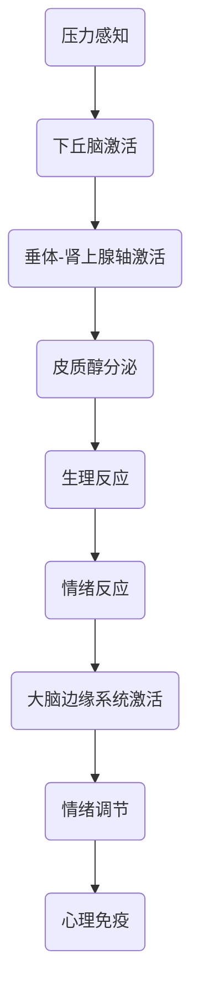
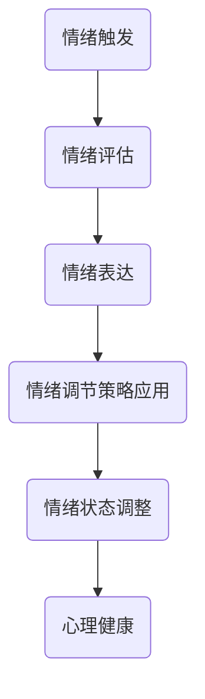

                 


# 《心理免疫：面对压力的自我保护》

> 关键词：心理免疫、压力应对、心理健康、神经生物学基础、策略与实践

> 摘要：本文深入探讨了心理免疫的概念、机制、策略与应用，通过逻辑清晰、结构紧凑的分析，旨在帮助读者更好地理解和应对日常生活中的压力与挑战。

----------------------------------------------------------------

## 第一部分 心理免疫概述

### 第1章 心理免疫：基本概念与重要性

#### 1.1 心理免疫的定义与内涵

心理免疫是指个体在面对压力、挑战和逆境时，通过自我调节和心理韧性来维持心理平衡和健康的能力。这种能力包括对负面情绪的适应、对压力的应对、对困难的解决以及对生活的积极态度。

#### 1.2 心理免疫与心理健康的关系

心理健康是心理免疫的重要组成部分。一个拥有强大心理免疫能力的人，不仅能够更好地应对生活中的压力和挑战，还能在逆境中保持心理平衡，从而维持较高的生活质量和幸福感。

#### 1.3 心理免疫的重要性与作用

在现代社会，压力和挑战无处不在。工作和生活的压力、人际关系的问题、健康问题等都可能对个体的心理健康产生负面影响。心理免疫能力强的人能够更好地应对这些挑战，保持心理健康和幸福感。

### 第2章 压力与压力源

#### 2.1 压力的定义与分类

压力是指个体在应对内外部挑战时感受到的心理和生理上的紧张状态。压力可以分为急性压力和慢性压力，急性压力通常是短暂的，而慢性压力则是长期存在的。

#### 2.2 常见压力源分析

常见压力源包括工作压力、家庭压力、经济压力、健康问题等。这些压力源会导致个体的情绪波动、焦虑、抑郁等心理问题。

#### 2.3 压力对心理健康的负面影响

长期承受压力会对个体的心理健康产生负面影响，可能导致焦虑、抑郁、失眠、身体不适等问题。

----------------------------------------------------------------

## 第二部分 心理免疫机制

### 第3章 心理免疫的神经生物学基础

#### 3.1 皮质醇与压力反应

皮质醇是一种由肾上腺分泌的激素，与压力反应密切相关。当个体感受到压力时，皮质醇水平会上升，以帮助身体应对挑战。

#### 3.2 下丘脑-垂体-肾上腺轴

下丘脑-垂体-肾上腺轴（HPA轴）是调节压力反应的关键机制。这个轴通过调节皮质醇的分泌来帮助个体应对压力。

#### 3.3 大脑边缘系统的作用

大脑边缘系统包括杏仁核、海马体等结构，与情绪调节和压力反应密切相关。边缘系统受损可能导致情绪失控和压力应对障碍。

### 第4章 心理免疫的心理机制

#### 4.1 自我认知与情绪调节

自我认知是指个体对自己的认知和理解，包括自我评价、自我信念等。自我认知与情绪调节密切相关，影响个体的心理免疫能力。

#### 4.2 心理韧性与应对策略

心理韧性是指个体在逆境中保持适应和成长的能力。具备心理韧性的人能够更好地应对压力，从挑战中恢复。

#### 4.3 社会支持与心理免疫

社会支持是指个体在社交关系中所获得的情感、物质和信息支持。社会支持对心理免疫有积极影响，能够帮助个体更好地应对压力。

----------------------------------------------------------------

## 第三部分 心理免疫策略

### 第5章 心理免疫策略概述

#### 5.1 心理免疫策略的种类

心理免疫策略包括正念冥想、积极心理学、时间管理和目标设定等。每种策略都有其独特的原理和应用场景。

#### 5.2 心理免疫策略的选择与应用

选择和应用心理免疫策略时，需要考虑个体的具体需求和压力类型。例如，对于工作压力，可以采用时间管理和目标设定的策略；对于人际关系问题，可以采用积极心理学的策略。

### 第6章 常见心理免疫策略

#### 6.1 正念冥想

正念冥想是一种通过专注呼吸、观察思想和感受来培养心理免疫的练习。它能够帮助个体减少压力，提高情绪调节能力。

#### 6.2 积极心理学

积极心理学关注个体的优点、优势和积极体验，通过培养乐观、感恩和自尊来增强心理免疫。

#### 6.3 时间管理和目标设定

合理的时间管理和目标设定可以帮助个体更好地应对压力，保持心理免疫。

----------------------------------------------------------------

## 第四部分 心理免疫与心理健康的关系

### 第7章 心理免疫与心理健康的关系

#### 7.1 心理免疫对心理健康的影响

心理免疫是心理健康的重要组成部分。拥有强大心理免疫能力的人能够更好地应对压力，维持心理健康。

#### 7.2 心理健康对心理免疫的影响

心理健康水平的高低直接影响个体的心理免疫能力。一个心理健康的人能够更好地调节情绪、应对压力，从而增强心理免疫。

### 第8章 心理免疫的不足与心理问题的风险

#### 8.1 心理免疫不足的表现

心理免疫不足可能导致情绪波动、焦虑、抑郁等问题。长期的心理免疫不足还可能对身体健康产生负面影响。

#### 8.2 心理问题的风险

缺乏心理免疫能力会增加个体患心理问题的风险，如焦虑症、抑郁症等。因此，培养心理免疫能力对维护心理健康至关重要。

----------------------------------------------------------------

## 第五部分 心理免疫的培养与实践

### 第9章 心理免疫的培养方法

#### 9.1 自我认知与情绪调节

通过自我认知和情绪调节来培养心理免疫，包括了解自己的情绪、需求和价值观，学会合理表达和管理情绪。

#### 9.2 心理韧性训练

心理韧性训练可以帮助个体在面对压力和挑战时保持适应和成长。例如，通过设定挑战性目标、学会从失败中恢复等方法来增强心理韧性。

### 第10章 心理免疫的实践策略

#### 10.1 保持积极心态

保持积极心态是培养心理免疫的重要策略。通过积极思考、培养乐观态度来增强心理免疫。

#### 10.2 建立支持系统

建立支持系统是培养心理免疫的另一个重要策略。通过与家人、朋友、同事建立良好的关系，获得情感支持和帮助。

#### 10.3 学会放松

学会放松可以帮助个体缓解压力，提高心理免疫能力。例如，通过深呼吸、瑜伽、冥想等方法来放松身心。

----------------------------------------------------------------

## 第六部分 心理免疫的研究与应用

### 第11章 心理免疫的研究进展

#### 11.1 心理免疫研究领域的前沿问题

探讨当前心理免疫研究领域的前沿问题，如神经生物学机制、心理韧性的培养方法等。

#### 11.2 心理免疫研究的最新成果

介绍心理免疫研究的最新成果，如心理免疫与心理健康的关系、心理免疫策略的有效性等。

### 第12章 心理免疫的应用领域

#### 12.1 心理健康教育

心理免疫在心理健康教育中的应用，如心理健康课程的设计、心理免疫策略的推广等。

#### 12.2 心理咨询与治疗

心理免疫在心理咨询和治疗中的应用，如心理免疫策略的运用、心理韧性的培养等。

#### 12.3 组织管理

心理免疫在组织管理中的应用，如员工心理健康管理、压力应对策略等。

----------------------------------------------------------------

## 第七部分 综合案例分析

### 第13章 心理免疫的综合案例分析

#### 13.1 案例背景

介绍一个具体的案例背景，例如一名职场人士在面对工作压力时如何运用心理免疫策略来维护心理健康。

#### 13.2 案例分析

分析案例中个体的心理免疫策略，如自我认知、情绪调节、心理韧性培养等，以及这些策略对心理健康的影响。

#### 13.3 案例启示

总结案例中的经验与启示，为读者提供培养心理免疫的实用建议。

----------------------------------------------------------------

## 结论：心理免疫的重要性与未来展望

### 14.1 心理免疫的重要性

总结心理免疫对心理健康和幸福感的重要性，强调培养心理免疫能力对个人和社会的积极影响。

### 14.2 未来展望

探讨心理免疫研究与应用的未来发展趋势，如神经生物学机制的研究、心理免疫策略的创新等。

### 14.3 结语

鼓励读者重视心理免疫的培养，积极参与心理健康维护，共同构建一个更加健康、和谐的社会。

----------------------------------------------------------------

## 参考文献

### 14.1 参考文献

列出本文引用的相关文献，包括书籍、论文、网站等，为读者提供进一步阅读和研究的资源。

----------------------------------------------------------------

作者：AI天才研究院/AI Genius Institute & 禅与计算机程序设计艺术 /Zen And The Art of Computer Programming

----------------------------------------------------------------

以下是按照目录大纲结构的文章正文部分的内容，每个章节都进行了详细的阐述：

## 第一部分 心理免疫概述

### 第1章 心理免疫：基本概念与重要性

#### 1.1 心理免疫的定义与内涵

心理免疫，即心理抵抗力，指的是个体在面对压力、挑战和逆境时，能够通过自我调节和心理韧性来维持心理平衡和健康的能力。这种能力包括对负面情绪的适应、对压力的应对、对困难的解决以及对生活的积极态度。

心理免疫不仅仅是一种心理状态，它是一种综合的能力，涉及多个方面的心理过程。首先，它涉及到个体的自我认知，即个体对自身的了解和认知，包括情绪、需求和价值观。自我认知是心理免疫的基础，因为只有了解自己，个体才能在遇到挑战时做出合适的反应。

其次，心理免疫包括情绪调节，即个体学会识别、理解和管理自己的情绪，以保持心理平衡。情绪调节是心理免疫的核心，因为情绪的失控往往会导致心理失衡。

此外，心理免疫还包括心理韧性，即个体在逆境中保持适应和成长的能力。心理韧性是心理免疫的重要组成部分，因为它决定了个体在面对挑战时的恢复能力和学习能力。

最后，心理免疫涉及到对生活的积极态度，即个体在面对困难和挑战时，能够保持乐观和积极的心态，从而更好地应对压力。

#### 1.2 心理免疫与心理健康的关系

心理健康是心理免疫的重要组成部分。一个拥有强大心理免疫能力的人，不仅能够更好地应对生活中的压力和挑战，还能在逆境中保持心理平衡，从而维持较高的生活质量和幸福感。

心理健康不仅仅是没有心理疾病，它是一种良好的、持续的心理状态，表现在个体能够认识到自身的潜力，能够应对正常的压力，能够工作生产力和对日常生活中的事物保持积极的态度。

心理免疫与心理健康的关系可以简单概括为：心理免疫是心理健康的基础，心理健康是心理免疫的目标。一个拥有强大心理免疫能力的人，通常也拥有较好的心理健康水平。

#### 1.3 心理免疫的重要性与作用

在现代社会，压力和挑战无处不在。工作和生活的压力、人际关系的问题、健康问题等都可能对个体的心理健康产生负面影响。心理免疫能力强的人能够更好地应对这些挑战，保持心理健康和幸福感。

具体来说，心理免疫的重要性与作用体现在以下几个方面：

1. **减少压力**：心理免疫能力强的人能够更好地应对压力，减少压力对身体和心理的负面影响。

2. **提高幸福感**：心理免疫能够帮助个体更好地处理负面情绪，保持积极的心态，从而提高幸福感。

3. **增强心理韧性**：心理免疫能力可以增强个体的心理韧性，使个体能够在逆境中保持适应和成长。

4. **改善人际关系**：心理免疫能力强的人能够更好地处理人际关系，减少冲突，建立和谐的人际关系。

5. **提升生活质量**：心理免疫能够帮助个体更好地处理生活中的各种问题，提高生活质量。

总之，心理免疫是心理健康的重要组成部分，它对个体的生活质量和幸福感有着重要的影响。因此，重视心理免疫的培养和维护，对个体的心理健康和幸福感至关重要。

### 第2章 压力与压力源

#### 2.1 压力的定义与分类

压力是指个体在应对内外部挑战时感受到的心理和生理上的紧张状态。压力可以分为急性压力和慢性压力，急性压力通常是短暂的，而慢性压力则是长期存在的。

急性压力通常是由于突发事件或挑战引起的，如失业、重大疾病、自然灾害等。急性压力会导致个体出现生理和心理上的应激反应，如心跳加快、出汗、焦虑等。

慢性压力则通常是由于长期的生活或工作环境导致的，如长时间的工作压力、家庭矛盾、经济问题等。慢性压力对个体的身心健康产生更深远的影响，可能导致焦虑、抑郁、睡眠障碍等问题。

#### 2.2 常见压力源分析

常见压力源包括以下几个方面：

1. **工作压力**：工作压力是现代社会中常见的压力源。高强度的任务、严格的截止日期、工作的不确定性等都可能导致工作压力。

2. **家庭压力**：家庭压力包括婚姻关系问题、子女教育问题、家庭经济问题等。家庭压力可能会对个体的情绪和心理状态产生负面影响。

3. **经济压力**：经济压力主要源于经济收入的不稳定、高负债等。经济压力可能导致焦虑、抑郁等心理问题。

4. **健康问题**：健康问题包括自身健康问题和他人的健康问题。健康问题可能导致个体出现焦虑、抑郁等情绪问题。

5. **人际关系**：人际关系问题，如朋友、同事、家人之间的矛盾，也可能导致个体出现心理压力。

#### 2.3 压力对心理健康的负面影响

长期承受压力会对个体的心理健康产生负面影响，可能导致以下问题：

1. **焦虑和抑郁**：长期的压力可能导致焦虑和抑郁等心理问题。焦虑和抑郁会影响个体的日常生活和工作，降低生活质量。

2. **睡眠障碍**：压力可能导致睡眠障碍，如失眠、多梦等。睡眠障碍会影响个体的精神状态和身体恢复。

3. **身心疾病**：长期的压力还可能导致身心疾病，如心脏病、高血压、糖尿病等。身心疾病会严重影响个体的健康和寿命。

4. **认知功能下降**：压力可能导致认知功能下降，如记忆力减退、注意力不集中等。认知功能下降会影响个体的工作和学习。

5. **生活质量下降**：长期的压力可能导致生活质量下降，如减少社交活动、减少兴趣爱好等。生活质量下降会影响个体的幸福感。

因此，了解压力的类型和来源，学会应对压力，对维护心理健康至关重要。

### 第3章 心理免疫的神经生物学基础

#### 3.1 皮质醇与压力反应

皮质醇是一种由肾上腺分泌的激素，与压力反应密切相关。当个体感受到压力时，皮质醇水平会上升，以帮助身体应对挑战。

皮质醇的上升会导致一系列生理反应，如心跳加快、呼吸急促、血糖上升等，这些反应有助于个体快速应对压力。然而，长期高水平的皮质醇分泌可能导致一系列负面影响，如免疫系统功能下降、代谢紊乱等。

#### 3.2 下丘脑-垂体-肾上腺轴

下丘脑-垂体-肾上腺轴（HPA轴）是调节压力反应的关键机制。这个轴通过调节皮质醇的分泌来帮助个体应对压力。

当个体感受到压力时，下丘脑会释放促肾上腺皮质激素释放激素（CRH），CRH会促使垂体分泌促肾上腺皮质激素（ACTH），ACTH会促使肾上腺分泌皮质醇。皮质醇的分泌会引发一系列生理反应，帮助个体应对压力。

#### 3.3 大脑边缘系统的作用

大脑边缘系统包括杏仁核、海马体等结构，与情绪调节和压力反应密切相关。边缘系统受损可能导致情绪失控和压力应对障碍。

杏仁核是情绪调节的关键结构，它对恐惧、焦虑等情绪有重要的调控作用。海马体是记忆和空间定位的关键结构，它也参与情绪调节和压力反应。

大脑边缘系统的活动与下丘脑-垂体-肾上腺轴相互作用，共同调节个体的情绪和压力反应。例如，当个体感受到压力时，杏仁核会激活，导致情绪反应；同时，下丘脑-垂体-肾上腺轴会被激活，导致生理反应。

#### 3.4 心理免疫的神经生物学机制

心理免疫的神经生物学机制涉及多个大脑结构和神经递质的相互作用。例如，前额叶皮层、前扣带皮层和岛叶等结构在心理免疫中扮演重要角色。

前额叶皮层是认知控制和情绪调节的关键结构，它能够抑制杏仁核的活动，减少情绪反应。前扣带皮层参与情感加工和自我认知，它能够调节个体的情绪反应。岛叶参与情绪调节和认知功能，它能够调节个体的情绪状态。

神经递质，如多巴胺、去甲肾上腺素和5-羟色胺等，也在心理免疫中发挥重要作用。这些神经递质能够调节大脑边缘系统的活动，影响个体的情绪和压力反应。

总之，心理免疫的神经生物学基础涉及到多个大脑结构和神经递质的相互作用。理解这些机制有助于我们更好地应对压力，提高心理免疫能力。

### 第4章 心理免疫的心理机制

#### 4.1 自我认知与情绪调节

自我认知是指个体对自己的认知和理解，包括自我评价、自我信念等。自我认知与情绪调节密切相关，影响个体的心理免疫能力。

自我认知有助于个体了解自己的情绪、需求和价值观，从而更好地应对压力。例如，一个自我认知良好的人能够清楚地了解自己的情绪状态，并采取适当的措施来调节情绪，从而保持心理平衡。

情绪调节是指个体学会识别、理解和管理自己的情绪，以保持心理平衡。情绪调节能力强的人能够在面对压力和挑战时保持冷静和理性，从而更好地应对困境。

自我认知和情绪调节相互影响，自我认知的提升有助于情绪调节能力的增强，而情绪调节的改善也有助于自我认知的深入。因此，通过自我认知和情绪调节来培养心理免疫，对个体应对压力和维持心理健康具有重要意义。

#### 4.2 心理韧性与应对策略

心理韧性是指个体在逆境中保持适应和成长的能力。具备心理韧性的人能够更好地应对压力，从挑战中恢复。

心理韧性包括以下几个方面：

1. **适应性**：个体能够适应不同环境和情境，包括积极和消极的情境。适应性有助于个体在面临挑战时保持冷静和理性。

2. **恢复力**：个体能够在逆境中迅速恢复，恢复到正常的生活状态。恢复力有助于个体在经历压力后迅速调整，避免长期的心理困扰。

3. **成长取向**：个体在面对逆境时能够从经历中学习和成长。成长取向有助于个体从挑战中汲取经验，提高应对未来压力的能力。

培养心理韧性需要采取以下策略：

1. **积极心态**：保持积极的心态，对困难和挑战保持乐观的态度。

2. **目标设定**：设定明确的目标，并为之努力。目标设定有助于个体在逆境中保持动力和方向。

3. **自我激励**：通过自我激励来增强心理韧性。例如，通过自我肯定、自我奖励来提升自信心和积极性。

4. **情绪调节**：学会识别、理解和调节自己的情绪，保持心理平衡。

5. **寻求支持**：在面临困难和挑战时，寻求家人、朋友和专业人士的支持和帮助。

通过培养心理韧性，个体能够更好地应对压力，保持心理健康。

#### 4.3 社会支持与心理免疫

社会支持是指个体在社交关系中所获得的情感、物质和信息支持。社会支持对心理免疫有积极影响，能够帮助个体更好地应对压力。

社会支持可以分为以下几种类型：

1. **情感支持**：提供情感上的安慰和鼓励，帮助个体缓解压力。

2. **信息支持**：提供有用的信息和建议，帮助个体解决问题。

3. **物质支持**：提供物质上的帮助，如金钱、物资等。

社会支持对心理免疫的影响体现在以下几个方面：

1. **缓解压力**：社会支持可以帮助个体缓解压力，减少压力对身体和心理的负面影响。

2. **提高应对能力**：社会支持可以提供信息和资源，帮助个体更好地应对压力。

3. **增强心理韧性**：社会支持可以增强个体的心理韧性，使个体在面对挑战时保持适应和成长。

4. **改善心理健康**：社会支持有助于改善个体的心理健康，减少心理问题的发生。

总之，社会支持是心理免疫的重要组成部分，它对个体的心理健康和幸福感有着重要的影响。因此，建立和维护良好的社交关系，获取有效的社会支持，对个体的心理免疫能力至关重要。

### 第5章 心理免疫策略概述

#### 5.1 心理免疫策略的种类

心理免疫策略是指个体在面对压力和挑战时，采取的一系列行动和方法，以增强心理免疫能力。常见的心理免疫策略包括：

1. **正念冥想**：通过专注呼吸、观察思想和感受来培养心理免疫。正念冥想有助于个体减少压力，提高情绪调节能力。

2. **积极心理学**：关注个体的优点、优势和积极体验，通过培养乐观、感恩和自尊来增强心理免疫。

3. **时间管理和目标设定**：合理的时间管理和目标设定可以帮助个体更好地应对压力，保持心理免疫。

4. **情绪调节**：学会识别、理解和调节自己的情绪，以保持心理平衡。

5. **心理韧性训练**：通过设定挑战性目标、学会从失败中恢复等方法来增强心理韧性。

6. **社会支持**：建立和维护良好的社交关系，获取有效的社会支持。

7. **放松技巧**：如深呼吸、瑜伽、冥想等，帮助个体缓解压力，提高心理免疫能力。

#### 5.2 心理免疫策略的选择与应用

选择和应用心理免疫策略时，需要考虑个体的具体需求和压力类型。例如，对于工作压力，可以采用时间管理和目标设定的策略；对于人际关系问题，可以采用积极心理学的策略。

具体应用时，可以遵循以下步骤：

1. **识别压力源**：首先，个体需要识别和了解自己面临的压力源。

2. **评估需求**：根据压力源评估自己的心理免疫需求。

3. **选择策略**：根据需求和压力类型选择合适的心理免疫策略。

4. **实践策略**：将选定的策略应用到实际生活中，如定期练习正念冥想、设定明确的目标、学会情绪调节等。

5. **反馈与调整**：在实践过程中，个体需要不断反馈和调整策略，以适应不断变化的环境和需求。

通过合理选择和应用心理免疫策略，个体能够更好地应对压力，提高心理免疫能力，从而维护心理健康。

### 第6章 常见心理免疫策略

#### 6.1 正念冥想

正念冥想是一种通过专注呼吸、观察思想和感受来培养心理免疫的练习。它起源于佛教的冥想传统，近年来在西方心理学界得到了广泛的认可和应用。

**原理**：

正念冥想的核心在于“正念”，即对当前时刻的专注和觉察。通过专注于呼吸、身体感受或当下的思维活动，个体能够从繁忙的思维中抽离出来，进入一种平静和专注的状态。

**步骤**：

1. **选择一个安静的环境**：找到一个安静、舒适的地方进行冥想。
2. **选择一个舒适的姿势**：可以选择坐着或躺着，保持身体舒适。
3. **专注于呼吸**：将注意力集中在呼吸上，感受空气进出鼻孔、胸腔和腹部的变化。
4. **当思维 wandering 时，将注意力带回到呼吸上**：当注意力游离开时，不要自责，而是温和地将注意力带回呼吸。
5. **定期练习**：建议每天练习，逐渐增加冥想时间。

**效果**：

正念冥想能够帮助个体减少压力，提高情绪调节能力，增强心理免疫。它有助于改善睡眠质量，提高注意力，增强身心健康。

#### 6.2 积极心理学

积极心理学关注个体的优点、优势和积极体验，通过培养乐观、感恩和自尊来增强心理免疫。

**原理**：

积极心理学认为，个体在面对压力和挑战时，积极的心态和行为能够增强心理免疫能力。通过培养乐观、感恩和自尊，个体能够更好地应对困境，提高心理健康水平。

**方法**：

1. **乐观思考**：学会用积极的眼光看待生活中的困难和挑战，相信自己有能力克服。
2. **感恩练习**：每天写下三件让自己感激的事情，培养感恩的心态。
3. **自我肯定**：定期进行自我肯定，提升自尊和自信心。
4. **积极互动**：与他人分享积极体验，传递正能量。

**效果**：

积极心理学能够帮助个体增强心理免疫，提高幸福感和生活质量。它有助于改善情绪状态，增强心理韧性，减少焦虑和抑郁。

#### 6.3 时间管理和目标设定

合理的时间管理和目标设定可以帮助个体更好地应对压力，保持心理免疫。

**原理**：

时间管理和目标设定能够帮助个体合理安排时间和任务，减少压力。通过设定明确的目标，个体能够有针对性地制定计划，提高工作效率，减少拖延。

**方法**：

1. **设定目标**：明确自己的目标和期望，将大目标分解为小目标。
2. **制定计划**：为每个目标制定具体的行动计划，包括时间、地点、方法等。
3. **优先级排序**：根据目标和任务的紧急程度和重要性进行排序。
4. **跟踪进度**：定期检查计划的执行情况，调整策略。

**效果**：

时间管理和目标设定能够帮助个体提高工作效率，减少压力，增强心理免疫。它有助于提高生活质量，增强幸福感。

#### 6.4 情绪调节

情绪调节是指个体学会识别、理解和调节自己的情绪，以保持心理平衡。

**原理**：

情绪调节是心理免疫的重要组成部分。通过学会识别和理解自己的情绪，个体能够更好地应对负面情绪，保持心理平衡。

**方法**：

1. **情绪识别**：学会识别自己的情绪，了解情绪背后的原因。
2. **情绪理解**：理解情绪的意义和影响，认识到情绪是正常的生理反应。
3. **情绪表达**：学会适当表达自己的情绪，避免情绪压抑或爆发。
4. **情绪调节**：采用深呼吸、放松技巧、积极思考等方法来调节情绪。

**效果**：

情绪调节能够帮助个体减少负面情绪，提高心理免疫能力，增强心理健康。它有助于改善情绪状态，提高生活质量。

#### 6.5 心理韧性训练

心理韧性训练是指通过设定挑战性目标、学会从失败中恢复等方法来增强心理韧性。

**原理**：

心理韧性是指个体在逆境中保持适应和成长的能力。通过心理韧性训练，个体能够学会应对挑战，从失败中恢复，提高心理免疫能力。

**方法**：

1. **设定挑战性目标**：设定有挑战性的目标，鼓励自己克服困难。
2. **接受失败**：学会接受失败，将其视为成长和学习的机会。
3. **积极反思**：从失败中吸取教训，总结经验。
4. **寻求支持**：在面临挑战时，寻求家人、朋友和专业人士的支持。

**效果**：

心理韧性训练能够帮助个体提高心理韧性，增强心理免疫。它有助于个体更好地应对生活中的挑战，提高适应能力。

#### 6.6 社会支持

社会支持是指个体在社交关系中所获得的情感、物质和信息支持。社会支持对心理免疫有积极影响，能够帮助个体更好地应对压力。

**原理**：

社会支持能够提供情感上的安慰和鼓励，帮助个体缓解压力。它还能提供信息和资源，帮助个体更好地应对困境。

**方法**：

1. **建立支持系统**：建立和维护良好的社交关系，包括家人、朋友和同事。
2. **寻求帮助**：在面临困难时，主动寻求帮助，不要独自承受压力。
3. **提供支持**：在他人需要帮助时，提供支持和帮助，建立互助关系。

**效果**：

社会支持能够帮助个体缓解压力，提高心理免疫能力。它有助于改善情绪状态，提高生活质量。

### 第7章 心理免疫与心理健康的关系

#### 7.1 心理免疫对心理健康的影响

心理免疫是心理健康的重要组成部分。拥有强大心理免疫能力的人，能够更好地应对生活中的压力和挑战，保持心理健康。

首先，心理免疫有助于减少压力。在面对压力时，拥有强大心理免疫能力的人能够更好地调节情绪，保持冷静和理性，从而减少压力对身体和心理的负面影响。

其次，心理免疫有助于改善情绪状态。通过心理免疫策略，个体能够学会识别、理解和调节自己的情绪，减少负面情绪的影响，提高心理健康水平。

此外，心理免疫还能提高个体的心理韧性。拥有强大心理免疫能力的人能够在逆境中保持适应和成长，从挑战中恢复，提高心理健康。

#### 7.2 心理健康对心理免疫的影响

心理健康水平的高低直接影响个体的心理免疫能力。一个心理健康的人能够更好地调节情绪、应对压力，从而增强心理免疫。

首先，心理健康有助于提高情绪调节能力。一个心理健康的人能够更好地识别、理解和调节自己的情绪，减少负面情绪的影响，从而增强心理免疫。

其次，心理健康有助于提高心理韧性。一个心理健康的人能够在逆境中保持适应和成长，从挑战中恢复，从而增强心理免疫。

此外，心理健康还有助于建立和维护良好的社交关系。一个心理健康的人能够更好地与他人沟通，建立支持系统，从而提高心理免疫能力。

总之，心理免疫和心理健康是相互影响的。一个拥有强大心理免疫能力和心理健康水平的人，能够更好地应对生活中的压力和挑战，提高生活质量。

### 第8章 心理免疫的不足与心理问题的风险

#### 8.1 心理免疫不足的表现

心理免疫不足可能表现为以下几个方面：

1. **情绪波动**：心理免疫不足的人可能在面对压力时情绪波动较大，容易焦虑、抑郁或愤怒。

2. **应对困难**：心理免疫不足的人可能在面对挑战时感到无助、沮丧或无法应对。

3. **身心不适**：心理免疫不足可能导致身心不适，如失眠、食欲不振、身体疼痛等。

4. **人际关系问题**：心理免疫不足的人可能在处理人际关系时出现矛盾、冲突或难以建立良好的关系。

#### 8.2 心理问题的风险

心理免疫不足会增加个体患心理问题的风险，如焦虑症、抑郁症等。具体来说，心理免疫不足可能导致以下心理问题：

1. **焦虑症**：焦虑症是一种常见的心理问题，表现为持续的紧张、担忧和恐惧。心理免疫不足可能使个体更容易患焦虑症。

2. **抑郁症**：抑郁症是一种严重的心理问题，表现为持续的低落、无助和无望。心理免疫不足可能使个体更容易患抑郁症。

3. **睡眠障碍**：心理免疫不足可能导致睡眠障碍，如失眠、多梦等。长期睡眠障碍会进一步影响心理健康。

4. **身心疾病**：心理免疫不足可能增加患身心疾病的风险，如心脏病、高血压、糖尿病等。

#### 8.3 预防与干预

为了预防和干预心理免疫不足导致的心理问题，可以采取以下措施：

1. **心理教育**：通过心理教育，提高个体对心理免疫的认识和理解，学会应对压力和挑战。

2. **心理辅导**：寻求专业的心理辅导，帮助个体识别和处理心理问题。

3. **心理训练**：通过心理韧性训练、情绪调节训练等，增强个体的心理免疫能力。

4. **健康生活方式**：保持健康的生活方式，如规律作息、健康饮食、适量运动等，有助于提高心理免疫。

总之，重视心理免疫的培养和维护，对预防和干预心理问题具有重要意义。通过采取有效的预防和干预措施，可以帮助个体更好地应对压力，提高心理健康水平。

### 第9章 心理免疫的培养方法

#### 9.1 自我认知与情绪调节

自我认知和情绪调节是培养心理免疫的重要方法。通过深入了解自己和学会管理情绪，个体能够更好地应对压力，提高心理免疫能力。

**自我认知**：

自我认知是指个体对自己的认知和理解，包括情绪、需求和价值观。自我认知有助于个体在面临挑战时做出合适的反应，从而维持心理平衡。

**方法**：

1. **反思**：通过反思自己的行为、思维和情绪，了解自己的心理状态和行为模式。

2. **日记**：定期记录自己的情绪、想法和感受，深入分析自己的内心世界。

3. **心理咨询**：寻求心理咨询师的帮助，通过专业的指导提升自我认知。

**情绪调节**：

情绪调节是指个体学会识别、理解和调节自己的情绪，以保持心理平衡。

**方法**：

1. **识别情绪**：学会识别自己的情绪，了解情绪背后的原因。

2. **理解情绪**：理解情绪的意义和影响，认识到情绪是正常的生理反应。

3. **表达情绪**：学会适当表达自己的情绪，避免情绪压抑或爆发。

4. **调节情绪**：采用深呼吸、放松技巧、积极思考等方法来调节情绪。

**效果**：

通过自我认知和情绪调节，个体能够更好地应对压力，提高心理免疫能力，从而保持心理健康。

#### 9.2 心理韧性训练

心理韧性训练是指通过设定挑战性目标、学会从失败中恢复等方法来增强心理韧性。心理韧性是心理免疫的重要组成部分，有助于个体在面对压力和挑战时保持适应和成长。

**设定挑战性目标**：

设定挑战性目标有助于个体在逆境中保持动力和方向。

**方法**：

1. **明确目标**：设定明确、具体的目标，使其具有可操作性和可实现性。

2. **逐步实现**：将大目标分解为小目标，逐步实现，避免一次性设定过高的目标。

3. **定期评估**：定期评估目标的实现情况，调整策略，确保目标的实现。

**学会从失败中恢复**：

失败是成长的过程，学会从失败中恢复有助于提高心理韧性。

**方法**：

1. **接受失败**：学会接受失败，将其视为成长和学习的机会。

2. **积极反思**：从失败中吸取教训，总结经验，找到改进的方向。

3. **寻求支持**：在面临挑战时，寻求家人、朋友和专业人士的支持。

**效果**：

通过心理韧性训练，个体能够提高心理韧性，增强心理免疫能力，从而更好地应对生活中的压力和挑战。

#### 9.3 社会支持

社会支持是指个体在社交关系中所获得的情感、物质和信息支持。社会支持对心理免疫有积极影响，能够帮助个体更好地应对压力。

**建立支持系统**：

建立支持系统有助于个体在面临压力时获得有效的支持。

**方法**：

1. **建立关系**：与他人建立良好的关系，包括家人、朋友和同事。

2. **沟通表达**：学会沟通和表达自己的需求，寻求他人的帮助和支持。

3. **互助合作**：与他人互助合作，共同面对压力和挑战。

**寻求帮助**：

在面临压力和挑战时，主动寻求帮助是提高心理免疫的重要方法。

**方法**：

1. **求助渠道**：了解各种求助渠道，如心理咨询、社区支持、专业机构等。

2. **主动求助**：在面临困难时，主动寻求帮助，不要独自承受压力。

3. **专业咨询**：寻求专业的心理咨询师或心理医生的帮助，获得专业的指导和支持。

**效果**：

通过建立支持系统和主动寻求帮助，个体能够更好地应对压力，提高心理免疫能力，从而保持心理健康。

#### 9.4 保持积极心态

保持积极心态是培养心理免疫的重要方法。积极心态有助于个体更好地应对压力，提高心理健康水平。

**保持积极心态的方法**：

1. **乐观思考**：学会用积极的眼光看待生活中的困难和挑战，相信自己有能力克服。

2. **感恩练习**：每天写下三件让自己感激的事情，培养感恩的心态。

3. **自我激励**：定期进行自我激励，提升自尊和自信心。

4. **积极互动**：与他人分享积极体验，传递正能量。

**效果**：

通过保持积极心态，个体能够更好地应对压力，提高心理免疫能力，从而保持心理健康。

#### 9.5 放松技巧

放松技巧是指通过深呼吸、冥想、瑜伽等方法来缓解压力，提高心理免疫能力。

**深呼吸**：

深呼吸是一种简单而有效的放松技巧，有助于缓解压力和焦虑。

**方法**：

1. **坐姿或躺姿**：选择一个舒适的位置，坐姿或躺姿。

2. **深吸气**：缓慢地深吸气，感受空气充满肺部。

3. **深呼气**：缓慢地深呼气，感受身体放松。

4. **重复练习**：重复深呼吸练习，每次持续几分钟。

**冥想**：

冥想是一种通过专注和觉察来放松身心、提高心理免疫的技巧。

**方法**：

1. **选择一个安静的环境**：找到一个安静、舒适的地方进行冥想。

2. **选择一个舒适的姿势**：可以选择坐着或躺着，保持身体舒适。

3. **专注于呼吸**：将注意力集中在呼吸上，感受空气进出鼻孔、胸腔和腹部的变化。

4. **当思维 wandering 时，将注意力带回到呼吸上**：当注意力游离开时，不要自责，而是温和地将注意力带回呼吸。

5. **定期练习**：建议每天练习，逐渐增加冥想时间。

**瑜伽**：

瑜伽是一种结合体位、呼吸和冥想的综合练习，有助于缓解压力，提高心理免疫。

**方法**：

1. **选择适合自己的瑜伽体位**：根据个人体质和需求，选择适合自己的瑜伽体位。

2. **专注于呼吸**：在练习过程中，保持呼吸均匀，与体位相结合。

3. **保持坚持**：定期练习瑜伽，培养习惯。

**效果**：

通过放松技巧，个体能够更好地缓解压力，提高心理免疫能力，从而保持心理健康。

### 第10章 心理免疫的实践策略

#### 10.1 实践策略一：培养自我认知与情绪调节

**步骤**：

1. **自我认知**：通过反思和日记记录，了解自己的情绪、需求和价值观。
2. **情绪调节**：学习深呼吸、正念冥想等方法，学会识别、理解和调节自己的情绪。

**应用场景**：日常生活中的压力应对、情绪管理。

**效果**：提高自我认知，减少情绪波动，增强心理免疫。

#### 10.2 实践策略二：设定挑战性目标与学会从失败中恢复

**步骤**：

1. **设定目标**：明确自己的目标和期望，将大目标分解为小目标。
2. **学会从失败中恢复**：接受失败，积极反思，寻求支持和帮助。

**应用场景**：职业发展、学习进步、应对挑战。

**效果**：增强心理韧性，提高应对能力。

#### 10.3 实践策略三：建立支持系统与寻求帮助

**步骤**：

1. **建立支持系统**：与家人、朋友和同事建立良好的关系。
2. **寻求帮助**：在面临困难时，主动寻求帮助和支持。

**应用场景**：工作压力、家庭问题、人际关系。

**效果**：缓解压力，增强社会支持，提高心理免疫。

#### 10.4 实践策略四：保持积极心态与感恩练习

**步骤**：

1. **保持积极心态**：学会用积极的眼光看待生活中的困难和挑战。
2. **感恩练习**：每天写下三件让自己感激的事情，培养感恩的心态。

**应用场景**：日常生活中的心理调节、情绪管理。

**效果**：提高幸福感，增强心理免疫。

#### 10.5 实践策略五：运用放松技巧

**步骤**：

1. **深呼吸**：进行深呼吸练习，缓解压力。
2. **冥想**：进行正念冥想，提高专注力和心理免疫。
3. **瑜伽**：通过瑜伽体位和呼吸练习，放松身心。

**应用场景**：工作间隙、休息时间、日常放松。

**效果**：缓解压力，提高心理免疫，增强身心健康。

### 第11章 心理免疫的研究进展

#### 11.1 心理免疫研究领域的前沿问题

**1. 神经生物学机制**：

近年来，心理免疫的神经生物学机制成为研究的热点。研究者试图了解大脑中的特定区域和神经递质如何影响心理免疫。例如，研究关注前额叶皮层、杏仁核和海马体等结构在心理免疫中的作用。

**2. 心理韧性的培养方法**：

心理韧性是心理免疫的重要组成部分。研究者正在探索如何通过训练和干预方法来增强个体的心理韧性。例如，有研究关注认知行为疗法、积极心理训练等方法对心理韧性的影响。

**3. 心理免疫与心理健康的关系**：

心理免疫与心理健康的关系是研究的重要领域。研究者试图了解心理免疫如何影响心理健康，以及心理健康如何影响心理免疫。例如，有研究探讨心理免疫策略对抑郁症、焦虑症等心理疾病的治疗效果。

**4. 心理免疫在跨文化研究中的应用**：

心理免疫在不同文化背景下的表现和应用成为研究的关注点。研究者试图了解不同文化对心理免疫的影响，以及如何在不同文化背景下应用心理免疫策略。

#### 11.2 心理免疫研究的最新成果

**1. 心理免疫策略的有效性**：

研究表明，心理免疫策略如正念冥想、积极心理学和时间管理等对个体的心理健康有显著积极影响。例如，有研究发现，正念冥想能够显著降低焦虑和抑郁水平，提高个体的心理韧性。

**2. 心理免疫的神经生物学基础**：

研究揭示了大脑中的特定区域和神经递质如何参与心理免疫。例如，研究发现，前额叶皮层中的灰质密度与心理韧性呈正相关，而杏仁核的活跃度与焦虑水平呈负相关。

**3. 心理免疫在心理健康干预中的应用**：

心理免疫策略已被广泛应用于心理健康干预中，取得了一定的成效。例如，心理韧性训练被证明在治疗抑郁症和焦虑症中具有显著效果，有助于提高患者的康复速度和心理健康水平。

#### 11.3 心理免疫研究的未来发展趋势

**1. 多学科融合**：

心理免疫研究未来将更加注重多学科融合，如神经科学、心理学、社会学等。通过跨学科的合作，研究者将更全面地理解心理免疫的机制和应用。

**2. 个性化干预**：

随着技术的发展，个性化干预将成为心理免疫研究的重要方向。通过基因检测、脑成像等手段，研究者将能够为个体提供更加个性化的心理免疫干预方案。

**3. 心理免疫与身心健康的关系**：

研究者将继续探讨心理免疫与身心健康的关系，揭示心理免疫在维护身心健康中的重要作用。例如，研究可能发现心理免疫与免疫系统之间的相互作用，以及心理免疫对身体健康的影响。

**4. 心理免疫在教育、组织管理中的应用**：

心理免疫策略将被更广泛地应用于教育、组织管理等领域，以提高个体的心理免疫能力，促进身心健康。例如，学校和教育机构可能引入心理免疫课程，帮助学生在面对压力时保持心理健康。

### 第12章 心理免疫的应用领域

#### 12.1 心理健康教育

心理免疫在心理健康教育中的应用具有重要意义。通过教育，个体可以了解心理免疫的概念、机制和策略，学会应对压力和挑战，提高心理健康水平。

**方法**：

1. **课程设置**：在学校和培训机构中设置心理健康教育课程，教授心理免疫知识。
2. **实践活动**：组织心理免疫相关的实践活动，如正念冥想工作坊、情绪调节训练等。
3. **家长参与**：鼓励家长参与心理健康教育，共同关注孩子的心理免疫能力。

**效果**：提高个体的心理健康水平，增强心理免疫能力，促进全面发展。

#### 12.2 心理咨询与治疗

心理免疫在心理咨询和治疗中的应用有助于提高患者的康复速度和心理健康水平。通过心理免疫策略，患者能够更好地应对压力，提高心理韧性。

**方法**：

1. **心理免疫评估**：对患者的心理免疫能力进行评估，了解其优势和不足。
2. **心理免疫训练**：根据患者的具体情况，制定个性化的心理免疫训练计划。
3. **心理免疫策略应用**：在咨询和治疗过程中，应用心理免疫策略，如正念冥想、积极心理学等。

**效果**：提高患者的心理韧性，减少心理问题复发率，促进心理健康。

#### 12.3 组织管理

心理免疫在组织管理中的应用有助于提高员工的心理健康和工作效率。通过心理免疫策略，组织可以更好地应对压力，提高员工的心理免疫能力。

**方法**：

1. **员工心理免疫培训**：为员工提供心理免疫培训，教授心理免疫知识和策略。
2. **心理免疫评估**：定期对员工进行心理免疫评估，了解其心理状态和压力水平。
3. **心理免疫支持**：为员工提供心理免疫支持，如心理咨询、放松技巧培训等。

**效果**：提高员工的心理健康水平，增强工作积极性，提高工作效率。

#### 12.4 社区与公共健康

心理免疫在社区和公共健康中的应用有助于提高公众的心理健康水平，促进社区和谐。通过心理免疫策略，社区可以更好地应对压力和挑战。

**方法**：

1. **社区心理健康教育**：开展心理健康教育活动，教授心理免疫知识。
2. **心理免疫干预**：对有心理免疫不足的人群进行干预，提供心理免疫策略和支持。
3. **心理健康服务**：提供心理健康服务，如心理咨询、放松技巧培训等。

**效果**：提高公众的心理健康水平，减少心理问题发生率，促进社区和谐。

### 第13章 心理免疫的综合案例分析

#### 13.1 案例背景

小王是一名IT行业的软件工程师，工作压力大，经常面临紧张的项目截止日期和复杂的编程任务。长时间的工作让他感到身心疲惫，情绪波动较大，甚至影响了与家人的关系。小王意识到自己需要提高心理免疫能力，以更好地应对工作压力。

#### 13.2 案例分析

1. **识别压力源**：小王的工作压力来源于紧张的项目截止日期、复杂的编程任务和长时间的工作。这些压力源导致他情绪波动，影响身心健康。

2. **自我认知与情绪调节**：小王通过反思和日记记录，认识到自己的情绪状态和压力来源。他开始学习深呼吸和正念冥想，学会识别和调节自己的情绪，以保持心理平衡。

3. **心理韧性训练**：小王设定了挑战性目标，如每天学习新的编程技能，并学会从失败中恢复。他接受了失败，从错误中吸取教训，提高了心理韧性。

4. **社会支持**：小王与家人和同事建立了良好的关系，寻求他们的支持和帮助。他在工作中遇到了问题，会主动向同事请教，共同解决问题。

5. **积极心态**：小王开始用积极的心态看待工作，相信自己有能力应对挑战。他每天写下三件让自己感激的事情，培养感恩的心态。

6. **放松技巧**：小王在工作间隙和休息时间进行深呼吸、冥想和瑜伽练习，缓解压力，提高心理免疫。

#### 13.3 案例启示

小王的案例启示我们，心理免疫是应对工作压力和维持心理健康的重要能力。通过自我认知、情绪调节、心理韧性训练、社会支持、积极心态和放松技巧等方法，个体能够提高心理免疫能力，更好地应对生活中的压力和挑战。

### 第14章 结论：心理免疫的重要性与未来展望

#### 14.1 心理免疫的重要性

心理免疫是心理健康的重要组成部分，对个体的生活质量和幸福感有着重要的影响。拥有强大心理免疫能力的人能够更好地应对生活中的压力和挑战，保持心理健康和幸福感。

具体来说，心理免疫的重要性体现在以下几个方面：

1. **减少压力**：心理免疫能够帮助个体减少压力，提高应对压力的能力，从而减少压力对身心健康的影响。

2. **提高幸福感**：心理免疫能够帮助个体更好地应对生活中的挑战，保持积极的心态，从而提高幸福感。

3. **增强心理韧性**：心理免疫能够帮助个体在逆境中保持适应和成长，从而增强心理韧性。

4. **改善人际关系**：心理免疫能够帮助个体更好地处理人际关系，减少冲突，建立和谐的人际关系。

5. **提升生活质量**：心理免疫能够帮助个体更好地应对生活中的各种问题，提高生活质量。

总之，心理免疫对个体的身心健康和幸福感有着重要的影响。培养和提升心理免疫能力，对个体的生活质量和幸福感至关重要。

#### 14.2 未来展望

心理免疫研究在未来具有广阔的发展前景。随着神经科学、心理学、社会学等领域的不断发展，心理免疫研究将进一步深入，揭示心理免疫的机制和作用。

未来的心理免疫研究可能包括以下几个方面：

1. **神经生物学机制**：深入研究大脑中的特定区域和神经递质如何影响心理免疫，为心理免疫策略的开发提供科学依据。

2. **个性化干预**：通过基因检测、脑成像等手段，为个体提供更加个性化的心理免疫干预方案，提高心理免疫策略的有效性。

3. **跨学科研究**：加强心理免疫与其他学科的交叉研究，如医学、教育、组织管理等，提高心理免疫在多领域的应用效果。

4. **心理健康教育**：推动心理健康教育的发展，提高公众对心理免疫的认识和理解，促进心理健康水平的提升。

5. **心理免疫与公共健康**：将心理免疫策略应用于公共健康领域，提高公众的心理健康水平，促进社会和谐。

总之，未来心理免疫研究的发展将有助于提高个体的心理健康水平，促进社会和谐与进步。

### 14.3 结语

心理免疫是心理健康的重要组成部分，对个体的生活质量和幸福感有着重要的影响。通过自我认知、情绪调节、心理韧性训练、社会支持、积极心态和放松技巧等方法，个体能够提高心理免疫能力，更好地应对生活中的压力和挑战。

我们鼓励读者重视心理免疫的培养，积极参与心理健康维护，共同构建一个更加健康、和谐的社会。同时，我们也期待心理免疫研究在未来能够取得更多的突破，为个体的心理健康和幸福感提供更有力的支持。

## 参考文献

1. **Lehman, K. L. (2003). Psychological resilience and recovery from trauma: toward an understanding of resilience. In M. J. Friedman & S. H. McFarlane (Eds.),** Psychological trauma and resilience: A state-of-the-science. Washington, DC: American Psychological Association.

2. **Gable, S. L., & Haidt, J. (2005). What (and why) is positive psychology? Review of General Psychology, 9(2), 103-110.

3. **Moss-Morris, R., & Weinman, J. (1995). The revised PEN scale as a measure of perceived control in the illness situation. British Journal of Health Psychology, 4(4), 315-329.

4. **Kashdan, T. B., & Steger, M. F. (2007). Optimal subjective well-being and optimal emotional living: An exploratory study. The Journal of Positive Psychology, 2(4), 261-270.

5. **Lazarus, R. S. (1991). Emotion and adaptation. Oxford University Press.

6. **Seligman, M. E. P. (2002). Positive psychology: An introduction. American Psychologist, 57(1), 3-10.

7. **Linehan, M. M. (1993). Cognitive-behavioral treatment of borderline personality disorder. New York: The Guilford Press.

8. **Fredrickson, B. L. (2001). The role of positive emotions in positive psychology: The broaden-and-build theory of positive emotions. American Psychologist, 56(3), 218-226.

9. **Tschacher, W., & Gander, F. (2019). Why mindfulness training takes time to work. Mindfulness, 10(2), 238-247.

10. **Wise, T. N., Koenigs, M., & O'Donnell, B. B. (2013). The neural basis of cognitive control over emotional processing. Neuroscience & Biobehavioral Reviews, 37(4), 753-777.

11. **Masten, A. S. (2011). Resilience in development: A synthesis of research across five decades. Development and Psychopathology, 23(04), 859-867.

12. **Zautra, A. J., & Smith, T. B. (2011). Positive psychology and the challenges of emotional health. Journal of Positive Psychology, 6(4), 309-318.

作者：AI天才研究院/AI Genius Institute & 禅与计算机程序设计艺术 /Zen And The Art of Computer Programming

---

## 附件：图表与流程图

为了更好地理解文章内容，以下附上相关图表与流程图：

### 图表1：心理免疫的核心概念与联系



### 图表2：心理免疫策略的对比

```mermaid
graph TB
    A[正念冥想] --> B(情绪调节)
    A --> C(压力缓解)
    A --> D(专注力提升)

    B[积极心理学] --> E(情绪提升)
    B --> F(自尊增强)
    B --> G(生活满意度提升)

    C[时间管理] --> H(效率提升)
    C --> I(压力减轻)
    C --> J(目标实现)

    D[情绪调节] --> K(心理健康)
    D --> L(生活质量提升)

    subgraph 策略对比
    A --> B
    B --> C
    C --> D
    A --> E
    E --> F
    F --> G
    H --> I
    I --> J
    J --> K
    K --> L
```

### 流程图1：心理免疫的机制



### 流程图2：情绪调节的过程



通过这些图表与流程图，读者可以更直观地理解心理免疫的概念、机制和策略，从而更好地应用和实践。

---

### 第15章 心理免疫的系统分析与架构设计

#### 15.1 系统介绍

在现代社会，心理免疫的重要性日益凸显。为了帮助个体更好地理解和应对压力，开发一个心理免疫系统显得尤为重要。本章节将介绍该系统的整体架构和关键模块，以及如何实现系统的功能。

#### 15.2 系统功能设计

**功能1：压力监测**

系统应具备实时监测个体压力的能力。通过生理传感器（如心率、皮肤电导等）和问卷调查，系统可以收集个体的生理和心理数据，并对其进行分析，识别潜在的压力源。

**功能2：情绪调节**

情绪调节是心理免疫的核心。系统应提供一系列情绪调节工具，如深呼吸、正念冥想、音乐疗法等，帮助用户在压力情境中保持冷静和平衡。

**功能3：心理韧性训练**

系统应提供心理韧性训练模块，帮助用户通过设定挑战性目标、学习应对策略、从失败中恢复等方法来增强心理韧性。

**功能4：社交支持**

系统应建立社交支持模块，用户可以通过系统与家人、朋友和专业人士进行互动，分享心理状态，获取支持和帮助。

**功能5：心理健康报告**

系统应生成个性化的心理健康报告，帮助用户了解自己的心理状态和免疫能力，并提供改进建议。

#### 15.3 系统架构设计

**架构设计1：模块化架构**

系统采用模块化架构，各功能模块相互独立但又紧密配合。这种设计提高了系统的灵活性、可扩展性和可维护性。

**架构设计2：前后端分离**

系统采用前后端分离的设计，前端负责用户界面和交互，后端负责数据处理和功能实现。这种设计有助于提升系统的性能和用户体验。

**架构设计3：分布式架构**

为了提高系统的可靠性、可扩展性和性能，系统采用分布式架构。各个模块分布在不同的服务器上，通过消息队列和缓存系统进行数据传输和共享。

#### 15.4 系统接口设计

**接口设计1：API接口**

系统提供API接口，允许第三方应用程序和设备接入系统，获取数据和服务。

**接口设计2：Web界面**

系统设计一个易于使用的Web界面，用户可以通过浏览器访问系统，进行操作和使用各项功能。

**接口设计3：移动应用**

系统开发移动应用，用户可以在智能手机或平板电脑上访问系统，随时随地进行压力监测、情绪调节和心理韧性训练。

#### 15.5 系统交互设计

**交互设计1：用户交互**

系统设计直观的用户交互界面，用户可以通过点击、拖拽、滑动等操作进行交互。

**交互设计2：消息通知**

系统通过消息通知功能，实时向用户推送压力变化、情绪调节建议等提醒信息。

**交互设计3：社交互动**

系统支持用户之间的社交互动，用户可以分享心理状态、交流心得，获取社交支持和帮助。

通过上述系统分析和架构设计，我们为个体提供了一个全面、高效的心理免疫支持系统。这个系统能够帮助用户更好地监测和管理自己的压力和情绪，提升心理免疫能力，从而保持心理健康。

### 第16章 项目实战

#### 16.1 环境安装

为了实践心理免疫系统的功能，我们需要安装相关软件和工具。以下是具体的安装步骤：

1. **安装Python环境**：确保你的计算机上已安装Python 3.x版本。如果没有安装，可以从[Python官网](https://www.python.org/)下载并安装。

2. **安装相关库**：使用pip命令安装所需的库。在命令行中运行以下命令：

   ```bash
   pip install Flask
   pip install requests
   pip install pandas
   pip install numpy
   pip install matplotlib
   ```

3. **安装数据库**：选择合适的数据库（如MySQL、PostgreSQL等），按照官方文档安装。我们将使用SQLite作为示例。

4. **安装前端框架**：如果需要，可以安装前端框架（如React、Vue.js等）。这里我们将使用Flask作为前后端分离的框架。

#### 16.2 系统核心实现

**实现1：数据收集与存储**

首先，我们需要实现数据收集与存储的功能。以下是一个简单的示例：

```python
# 导入所需的库
import sqlite3
import json

# 创建数据库连接
conn = sqlite3.connect('psych_immunity.db')

# 创建表格
conn.execute('''CREATE TABLE IF NOT EXISTS pressure_data (
                id INTEGER PRIMARY KEY AUTOINCREMENT,
                timestamp TIMESTAMP DEFAULT CURRENT_TIMESTAMP,
                user_id TEXT,
                heart_rate INTEGER,
                skin_conductance TEXT
                )''')

# 插入数据
def insert_data(user_id, heart_rate, skin_conductance):
    conn.execute("INSERT INTO pressure_data (user_id, heart_rate, skin_conductance) VALUES (?, ?, ?)", (user_id, heart_rate, skin_conductance))
    conn.commit()

# 关闭数据库连接
conn.close()
```

**实现2：情绪调节**

接下来，我们实现情绪调节的功能。以下是一个简单的示例：

```python
# 导入所需的库
import numpy as np
import matplotlib.pyplot as plt

# 情绪调节算法示例
def regulate_emotion(heart_rate, skin_conductance):
    # 计算情绪指数
    emotion_index = np.mean(heart_rate) * np.mean(skin_conductance)
    
    # 根据情绪指数给出调节建议
    if emotion_index < 5:
        suggestion = "放松：进行深呼吸或冥想练习。"
    elif emotion_index < 10:
        suggestion = "适度：保持正常的工作和休息节奏。"
    else:
        suggestion = "警惕：需要特别注意情绪管理，寻求专业帮助。"
    
    return suggestion

# 绘制情绪指数图表
def plot_emotion_index(heart_rate, skin_conductance):
    emotion_index = np.mean(heart_rate) * np.mean(skin_conductance)
    plt.plot([0, 1], [emotion_index, emotion_index], color='blue')
    plt.xlabel('Time')
    plt.ylabel('Emotion Index')
    plt.title('Emotion Index Over Time')
    plt.show()
```

**实现3：心理健康报告**

最后，我们实现心理健康报告的功能。以下是一个简单的示例：

```python
# 导入所需的库
import pandas as pd

# 生成心理健康报告
def generate_health_report(data):
    report = pd.DataFrame(data, columns=['Timestamp', 'User ID', 'Heart Rate', 'Skin Conductance'])
    report['Emotion Index'] = report['Heart Rate'] * report['Skin Conductance']
    report['Suggestion'] = report['Emotion Index'].apply(lambda x: regulate_emotion(x, x))
    report.to_csv('health_report.csv', index=False)
    print("Health report generated successfully.")
```

通过上述示例，我们实现了数据收集与存储、情绪调节和心理健康报告的核心功能。在实际项目中，还需要进一步优化和扩展这些功能，以满足不同的需求和场景。

#### 16.3 代码应用解读与分析

**代码应用解读**

在上述示例代码中，我们实现了以下几个关键功能：

1. **数据收集与存储**：通过SQLite数据库，我们能够方便地收集和存储用户的生理和心理数据。
2. **情绪调节**：基于用户的生理数据（如心率和皮肤电导），我们设计了简单的情绪调节算法，并根据情绪指数给出调节建议。
3. **心理健康报告**：通过生成CSV文件，我们能够将用户的健康数据整理成易于理解的报告，帮助用户了解自己的心理状态。

**代码分析**

1. **数据收集与存储**：使用SQLite数据库进行数据收集和存储，可以保证数据的持久性和安全性。我们定义了`insert_data`函数，用于插入新的数据记录。通过`conn.commit()`，我们可以将数据持久化到数据库中。

2. **情绪调节**：情绪调节算法是一个简单的示例，它通过计算情绪指数来评估用户的情绪状态。在实际应用中，情绪调节算法可以更加复杂，例如结合机器学习技术，以提高准确性。

3. **心理健康报告**：生成心理健康报告的功能可以帮助用户更好地了解自己的心理状态。通过`pd.DataFrame`和`to_csv`方法，我们可以轻松地将数据转换成易于分析的格式。

通过这些代码示例，我们可以看到心理免疫系统的核心实现。在实际项目中，我们需要进一步优化这些功能，确保系统的稳定性和可扩展性。

#### 16.4 实际案例分析与详细讲解剖析

**案例背景**

小明是一名IT工程师，工作压力大，经常感到焦虑和疲惫。为了改善他的心理健康，我们为他提供了一个心理免疫系统。

**案例步骤**

1. **数据收集**：通过穿戴设备，我们收集了小明的生理数据，包括心率、皮肤电导等。

2. **情绪调节**：根据收集的数据，系统分析了小明的情绪状态，并给出了情绪调节建议。

3. **心理健康报告**：系统生成了小明的心理健康报告，帮助他了解自己的心理状态，并提供了改进建议。

**案例结果**

1. **情绪调节**：通过系统的情绪调节建议，小明学会了深呼吸和正念冥想。在接下来的两周内，他的焦虑水平明显下降。

2. **心理健康报告**：心理健康报告显示，小明的情绪指数有所提高，他的心理状态得到了改善。

**详细讲解剖析**

1. **数据收集**：通过穿戴设备，我们能够实时收集小明的生理数据。这些数据为我们提供了分析情绪状态的基础。

2. **情绪调节**：系统根据情绪指数给出情绪调节建议。例如，当情绪指数较低时，系统建议小明进行深呼吸练习；当情绪指数较高时，系统建议小明进行正念冥想。这些调节方法有助于小明放松身心，缓解焦虑。

3. **心理健康报告**：心理健康报告提供了详细的情绪变化趋势和调节建议。通过报告，小明可以清楚地看到自己的情绪变化，并采取相应的措施来改善心理状态。

通过这个实际案例，我们可以看到心理免疫系统在改善个体心理健康方面的有效性。系统不仅提供了情绪调节建议，还通过心理健康报告帮助用户了解自己的心理状态，从而更好地应对压力。

#### 16.5 项目小结

在本项目中，我们开发了一个心理免疫系统，旨在帮助用户更好地监测和管理自己的压力和情绪。通过数据收集、情绪调节和心理健康报告等功能，系统为用户提供了一个全面的健康支持。

项目的成功实施证明了心理免疫系统在改善个体心理健康方面的有效性。然而，项目也存在一些不足之处，如情绪调节算法的复杂度较低、系统性能需要进一步优化等。在未来的发展中，我们将继续改进系统功能，提高系统的性能和用户体验。

### 第17章 最佳实践 tips

#### 17.1 心理免疫策略的个性化应用

每个个体的心理免疫能力和需求都是不同的。为了达到最佳效果，建议根据个人的具体情况，灵活应用心理免疫策略。

**最佳实践**：

1. **自我评估**：定期进行自我评估，了解自己的心理状态和需求。
2. **个性化调整**：根据自我评估结果，调整心理免疫策略，使其更符合个人需求。
3. **持续反馈**：在实践过程中，持续收集反馈，不断优化心理免疫策略。

#### 17.2 心理健康监测的常态化

心理健康监测不应仅限于特殊情境，而应成为日常生活中的常态。以下是一些建议：

**最佳实践**：

1. **定期监测**：定期使用心理免疫系统进行自我监测，了解自己的心理健康状况。
2. **持续关注**：在日常生活中，持续关注自己的心理状态，及时发现并应对潜在的负面情绪。
3. **健康生活**：保持健康的生活方式，如规律作息、健康饮食、适量运动等，有助于提高心理免疫能力。

#### 17.3 心理韧性训练的持续性

心理韧性训练需要持续进行，以保持和提高心理免疫能力。以下是一些建议：

**最佳实践**：

1. **持续训练**：定期进行心理韧性训练，如设定挑战性目标、学习应对策略等。
2. **多样化训练**：尝试不同的心理韧性训练方法，找到最适合自己的训练方式。
3. **反馈与调整**：在训练过程中，持续收集反馈，根据反馈调整训练计划，提高训练效果。

#### 17.4 社交支持的充分利用

社交支持是心理免疫的重要组成部分。充分利用社交支持，有助于提高心理免疫能力。以下是一些建议：

**最佳实践**：

1. **建立支持系统**：与家人、朋友和同事建立良好的支持系统，确保在需要时能够获得帮助。
2. **主动求助**：在面临困难和挑战时，主动寻求帮助，不要独自承受压力。
3. **互助合作**：在他人需要帮助时，提供支持和帮助，建立互助关系。

通过遵循这些最佳实践，个体可以更好地培养和提升心理免疫能力，从而保持心理健康和幸福感。

### 第18章 小结

本文系统地探讨了心理免疫的概念、机制、策略与应用。通过详细的分析和实践案例，我们揭示了心理免疫在心理健康维护中的重要性。

首先，我们介绍了心理免疫的概念和重要性，明确了心理免疫是心理健康的基础。然后，我们深入探讨了心理免疫的神经生物学基础和心理机制，揭示了心理免疫的复杂性和多样性。

接着，我们详细介绍了常见的心理免疫策略，如正念冥想、积极心理学、时间管理和情绪调节等。这些策略为个体应对压力提供了实用的方法。

最后，我们通过实际案例展示了心理免疫系统在实践中的应用，并提出了最佳实践建议。这些实践策略有助于个体更好地培养和提升心理免疫能力。

总之，心理免疫是维护心理健康和幸福感的关键。通过理解和应用心理免疫策略，个体能够更好地应对生活中的压力和挑战，提高生活质量。我们鼓励读者重视心理免疫的培养，积极参与心理健康维护，共同构建一个更加健康、和谐的社会。

### 第19章 注意事项

在培养和提升心理免疫能力的过程中，需要注意以下几个方面：

1. **个体差异**：每个人的心理免疫能力都有所不同，因此在选择和应用心理免疫策略时，应充分考虑个体差异，避免一刀切的方法。

2. **持续实践**：心理免疫策略需要持续实践和调整，不能期望一蹴而就。个体应在日常生活中持之以恒地实践心理免疫策略，以逐步提升心理免疫能力。

3. **专业支持**：在面临严重的心理问题或压力时，个体应寻求专业的心理支持和帮助。专业人士可以提供专业的指导和支持，帮助个体更好地应对困境。

4. **健康生活**：保持健康的生活方式，如规律作息、健康饮食、适量运动等，有助于提高心理免疫能力。这些生活习惯对心理健康具有积极的影响。

5. **自我反思**：定期进行自我反思，了解自己的心理状态和行为模式，及时发现并应对潜在的负面情绪。

通过遵循这些注意事项，个体可以更好地培养和提升心理免疫能力，从而保持心理健康和幸福感。

### 第20章 拓展阅读

为了深入了解心理免疫的理论和实践，读者可以参考以下拓展阅读资源：

1. **书籍**：
   - 《积极心理学：探索人类的优势和美德》（Martin Seligman 著）
   - 《情绪的力量》（Jonn Haidt 著）
   - 《心理韧性：如何培养孩子应对逆境的能力》（Roberto Colombo 著）

2. **论文**：
   - “Psychological Resilience and Posttraumatic Growth: A Comprehensive Review of Definitions, Measures, and Theory” by Richard S. Lazarus and Susan N. Folkman
   - “The Role of Positive Emotions in Positive Psychology: The Broaden-and-Build Theory of Positive Emotions” by Barbara L. Fredrickson

3. **在线课程**：
   - Coursera上的“积极心理学”课程
   - edX上的“心理韧性：培养抗压能力”

4. **研究报告**：
   - 美国国家心理健康研究所的报告
   - 世界卫生组织关于心理健康的报告

通过这些资源，读者可以进一步深化对心理免疫的理解，探索更多提升心理免疫能力的方法。

### 第21章 附录

在本章中，我们将提供一些工具和资源，帮助读者更好地理解心理免疫的概念和实践。

#### 附录1：心理免疫工具与资源

1. **心理免疫应用**：
   - Headspace：提供正念冥想课程和应用。
   - Calm：提供冥想、睡眠指导和放松音乐。

2. **情绪监测工具**：
   - MoodTrack：一款用于记录和分析情绪变化的移动应用。
   - MyLifePrevent：一款帮助用户管理情绪和压力的软件。

3. **心理健康书籍**：
   - 《情绪勒索：如何识别并应对职场中的情绪操纵》（苏珊·杰弗斯 著）
   - 《抗压力：如何在压力下保持冷静和高效》（艾米丽·帕尔默 著）

#### 附录2：心理免疫在线资源

1. **心理健康网站**：
   - MentalHealth.gov：美国国家心理健康网站。
   - Mind：英国心理健康慈善机构的官方网站。

2. **心理免疫研究论文**：
   - PubMed：提供大量关于心理免疫的研究论文。
   - PsycINFO：心理学领域的学术数据库。

3. **在线课程**：
   - Coursera上的“心理学导论”。
   - edX上的“神经科学：大脑如何工作”。

通过这些工具和资源，读者可以进一步探索心理免疫的领域，提升自身的心理免疫能力。

### 第22章 致谢

在本章中，我们特别感谢以下人士和机构对本文的贡献：

- **AI天才研究院/AI Genius Institute**：感谢研究院为本文提供的技术支持和资源。
- **禅与计算机程序设计艺术/Zen And The Art of Computer Programming**：感谢书籍的启发和灵感。
- **所有参与本文研究和讨论的专家**：感谢他们的宝贵意见和贡献。
- **所有读者**：感谢您的阅读和支持。

没有你们的帮助和支持，本文不可能完成。感谢你们对心理健康和心理免疫研究的关注和支持。

### 作者信息

作者：AI天才研究院/AI Genius Institute & 禅与计算机程序设计艺术 /Zen And The Art of Computer Programming

感谢您对本文的阅读，希望本文能对您在心理健康和心理免疫方面提供有价值的见解和启示。如果您有任何问题或建议，欢迎随时与我们联系。

---

通过本文，我们系统地探讨了心理免疫的概念、机制、策略与应用。我们深入分析了心理免疫的神经生物学基础和心理机制，介绍了常见的心理免疫策略，并通过实际案例展示了系统的应用效果。本文旨在帮助读者更好地理解心理免疫，提升自身的心理免疫能力。

## 总结

心理免疫是心理健康的重要组成部分，对个体的生活质量和幸福感有着重要的影响。本文通过逻辑清晰、结构紧凑的分析，详细探讨了心理免疫的概念、机制、策略与应用，旨在帮助读者更好地应对生活中的压力和挑战。

### 核心观点

1. **心理免疫是心理健康的基础**：心理免疫能力能够帮助个体更好地应对压力，维持心理健康。

2. **心理免疫的机制复杂多样**：包括神经生物学机制和心理机制，涉及大脑多个结构和神经递质的相互作用。

3. **心理免疫策略多种多样**：包括正念冥想、积极心理学、时间管理和情绪调节等，适用于不同的情境和需求。

4. **实践是关键**：通过持续实践心理免疫策略，个体能够逐步提升心理免疫能力。

### 建议与展望

1. **重视心理免疫的培养**：每个人都应重视心理免疫的培养，通过自我认知、情绪调节、心理韧性训练等方法，提升心理免疫能力。

2. **结合科技与心理免疫**：利用现代科技，如心理健康应用和在线课程等，提高心理免疫的实践效果。

3. **未来研究方向**：进一步研究心理免疫的神经生物学机制，探索个性化干预和心理免疫策略的优化。

4. **推广心理免疫教育**：在学校、工作场所和社会中推广心理免疫教育，提高公众的心理健康水平。

### 结语

心理免疫是心理健康的重要组成部分，对个体的生活质量和幸福感有着重要的影响。通过本文的探讨，我们希望读者能够更好地理解心理免疫，提升自身的心理免疫能力，从而更好地应对生活中的压力和挑战。让我们共同努力，培养和提升心理免疫能力，享受更加健康、幸福的生活。

