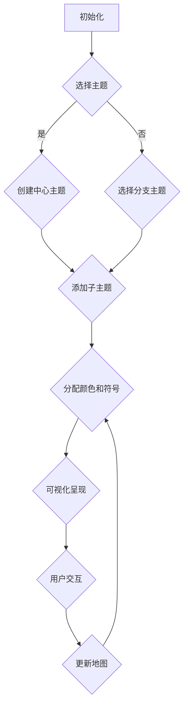

                 

# 心理地图绘制技术：可视化的思维整理

## 关键词

心理地图，可视化思维，思维整理，思维导图，概念地图，流程图，视觉符号，视觉符号对比，ER实体关系图，算法原理，数学模型，系统架构设计，项目实战，最佳实践。

## 摘要

本文将深入探讨心理地图绘制技术和可视化思维整理的核心概念、应用场景及实际操作方法。通过一步步的分析与推理，我们将揭示这些技术在信息处理、创造性思维、记忆提升等方面的优势，并提供具体的实施指南和案例解析，帮助读者在个人学习和工作中更加高效地整理和利用信息。

### 第一部分：背景介绍

#### 核心概念

**心理地图绘制技术：**
心理地图绘制技术是一种通过视觉化的方式来整理和表达思维过程的方法。它利用图形、符号、颜色和布局等元素，帮助人们更清晰地理解和组织复杂的信息。这种方法能够促进创造性思维，提高问题解决能力和信息处理效率。

**可视化思维整理：**
可视化思维整理是指通过将思维内容转化为视觉形式，以增强理解和记忆。这种方法能够通过图形和颜色等视觉元素，刺激大脑，从而提高记忆效果和问题解决能力。

**目的与意义：**
在现代社会，信息爆炸使得人们对信息整理和记忆的需求日益增加。心理地图绘制技术和可视化思维整理提供了一种有效的工具，帮助人们从混乱的信息中提取关键信息，提高工作效率和生活质量。

#### 问题背景

随着科技的发展，人们面临着日益复杂的工作和生活环境。如何有效地整理和利用信息，成为人们关注的焦点。传统的线性笔记和文字记录方式在处理复杂信息时往往显得力不从心。因此，寻求一种更加高效、直观的信息整理方法显得尤为重要。

#### 问题解决

心理地图绘制技术和可视化思维整理提供了以下解决方案：
1. **提高信息处理效率：** 通过图形化的方式展示信息，使复杂的信息变得易于理解，从而提高信息处理效率。
2. **增强记忆能力：** 图形和颜色等视觉元素能够刺激大脑，增强记忆效果。
3. **促进创造性思维：** 心理地图绘制技术能够激发人们的创造性思维，帮助他们在解决问题时产生新的想法。
4. **跨领域应用：** 心理地图绘制技术和可视化思维整理不仅适用于个人学习和工作，还可以在团队协作、项目管理等领域发挥重要作用。

#### 边界与外延

心理地图绘制技术和可视化思维整理不仅适用于个人学习和工作，还可以在以下领域发挥重要作用：
1. **教育：** 在教学中，心理地图绘制技术可以帮助学生更好地理解和记忆知识。
2. **项目管理：** 在项目管理和团队协作中，可视化思维整理可以有效地传达项目进度和团队成员的角色职责。
3. **创新设计：** 在创新设计领域，心理地图绘制技术可以帮助设计师更好地梳理创意，提高设计效率。
4. **心理咨询：** 在心理咨询中，心理地图绘制技术可以帮助咨询师更好地了解客户的内心世界，提高咨询效果。

#### 概念结构与核心要素组成

心理地图绘制技术和可视化思维整理的概念结构包括以下几个核心要素：
1. **图形元素：** 包括符号、线条、框图、颜色等，用于表示不同类型的信息。
2. **逻辑关系：** 包括因果关系、时间顺序、并列关系等，用于展示信息之间的逻辑关系。
3. **层次结构：** 包括主标题、子标题、分支等，用于展示信息的层次结构。
4. **互动性：** 包括点击、拖拽、放大等互动功能，用于增强用户参与度和信息处理效果。

在接下来的章节中，本书将详细探讨心理地图绘制技术和可视化思维整理的理论基础、应用场景、实际操作方法和案例解析，帮助读者掌握这一实用技能。通过系统的学习和实践，读者将能够更加高效地整理信息，提升思维品质，实现个人成长与职业发展。

---

### 第二部分：核心概念与联系

#### 心理地图绘制技术的核心概念

**心理地图绘制技术**是一种通过视觉化的方式来整理和表达思维过程的方法。它利用图形、符号、颜色和布局等元素，帮助人们更清晰地理解和组织复杂的信息。

1. **思维导图（Mind Maps）：**
   - **定义：** 思维导图是一种以中心主题为中心，通过分支、子主题和关键点来扩展的图形化工具。
   - **作用：** 它可以帮助人们以非线性、直观的方式表达和整理思维过程，提高记忆和创造力。

2. **概念地图（Concept Maps）：**
   - **定义：** 概念地图是一种通过节点、关系和属性来表示概念之间关系的图形化工具。
   - **作用：** 它可以帮助人们理解概念之间的联系，建立知识结构，提高学习效果。

3. **流程图（Flowcharts）：**
   - **定义：** 流程图是一种通过符号和箭头来表示任务、步骤和决策的图形化工具。
   - **作用：** 它可以帮助人们理解和描述复杂的过程，优化流程设计。

4. **图解（Illustrations）：**
   - **定义：** 图解是一种通过视觉元素来表示概念、过程或信息的图形化工具。
   - **作用：** 它可以通过图像和文字的结合，使信息更加直观易懂，增强信息传达效果。

#### 可视化思维整理的核心概念

**可视化思维整理**是指通过将思维内容转化为视觉形式，以增强理解和记忆。它包括以下核心概念：

1. **视觉符号（Visual Symbols）：**
   - **定义：** 视觉符号是用于表示概念、过程、数据或其他信息的视觉元素，如图标、形状、颜色和图案等。
   - **作用：** 视觉符号能够快速传达信息，减少语言理解上的障碍，提高信息处理的效率。

2. **颜色与图案（Colors and Patterns）：**
   - **定义：** 颜色与图案是视觉符号的一部分，用于区分和强调信息的重要性和层次。
   - **作用：** 通过颜色的使用，可以增强信息的对比度，使其更加引人注目，从而提高记忆效果。

3. **布局与结构（Layout and Structure）：**
   - **定义：** 布局与结构是指信息在视觉平面上的排列和组织方式。
   - **作用：** 合理的布局和结构可以使信息更加易于理解和记忆，提高信息处理的效率。

4. **互动性与动态性（Interactivity and Dynamics）：**
   - **定义：** 互动性与动态性是指用户与可视化内容之间的交互能力和内容的表现方式。
   - **作用：** 互动性和动态性可以增强用户的参与感和体验，使其更加深入地理解和记忆信息。

#### 核心概念与联系

心理地图绘制技术和可视化思维整理之间有着密切的联系，它们共同构成了一个完整的思维整理和表达体系。具体来说：

1. **共同目标：**
   - 心理地图绘制技术和可视化思维整理的共同目标是帮助人们更有效地整理和表达思维过程，从而提高信息处理效率和创造性思维能力。

2. **相互作用：**
   - 心理地图绘制技术通过视觉化的方式整理思维，而可视化思维整理则通过视觉符号和布局等手段增强信息的表达效果。

3. **互补作用：**
   - 心理地图绘制技术侧重于思维的整理和结构化，而可视化思维整理则侧重于信息的直观表达和记忆强化。

4. **综合应用：**
   - 在实际应用中，心理地图绘制技术和可视化思维整理常常结合使用，以实现更好的效果。例如，在制作思维导图时，可以运用可视化思维整理的方法，选择合适的视觉符号和布局，使思维导图更加直观和易于理解。

通过上述分析，我们可以看到心理地图绘制技术和可视化思维整理不仅各有特点，而且在实践中可以相互补充，共同提升信息整理和表达的效率。接下来，我们将进一步探讨这些技术的理论基础和应用场景，帮助读者深入理解和掌握这些实用技能。

### 第三部分：算法原理讲解

#### 算法流程图

首先，我们通过一个Mermaid流程图来展示心理地图绘制技术的基本算法流程：



#### 算法原理

1. **初始化阶段（Initialization）**：
   - 在这个阶段，系统初始化一个空的心理地图，准备开始绘制过程。这个过程包括设置初始参数，如主题名称、画布大小等。

2. **选择主题阶段（Choosing the Central Topic）**：
   - 用户选择一个中心主题，这是心理地图的核心。这个主题通常是一个关键词或短语，用于概括整个地图的内容。

3. **创建中心主题阶段（Creating the Central Topic）**：
   - 系统根据用户的选择创建中心主题，并将其放置在地图的中心位置。这个主题通常用一个圆形或方框表示，周围留出空间以便添加子主题。

4. **选择分支主题阶段（Choosing Subtopics）**：
   - 用户继续选择子主题，这些子主题与中心主题相关联，用于扩展和细化中心主题的内容。

5. **添加子主题阶段（Adding Subtopics）**：
   - 系统根据用户的选择，创建子主题，并将其连接到中心主题。每个子主题通常用线条与中心主题相连，并在旁边标注关键词。

6. **分配颜色和符号阶段（Assigning Colors and Symbols）**：
   - 为了增强信息的视觉区分度和记忆效果，系统会为不同的子主题分配不同的颜色和符号。这些视觉元素可以帮助用户快速识别和理解各个子主题。

7. **可视化呈现阶段（Visual Representation）**：
   - 系统将所有子主题和连接线绘制在地图上，形成一个完整的心理地图。这个过程通常涉及到图形处理和布局算法。

8. **用户交互阶段（User Interaction）**：
   - 用户可以通过点击、拖拽等方式与心理地图进行交互。这些交互操作可以帮助用户进一步细化和调整地图的内容。

9. **更新地图阶段（Updating the Map）**：
   - 根据用户的交互操作，系统会动态更新地图的内容，使其始终保持最新的状态。

10. **结束阶段（Termination）**：
    - 当用户完成地图绘制和交互后，系统结束整个算法流程。

#### 数学模型

为了更好地理解心理地图绘制技术的算法原理，我们可以使用以下数学模型进行描述：

$$
\text{Map} = \{ T, S, C, L \}
$$

其中：
- $T$ 表示主题集合，包括中心主题和所有子主题；
- $S$ 表示符号集合，包括颜色、图标等；
- $C$ 表示连接关系集合，表示不同主题之间的关联；
- $L$ 表示布局集合，包括地图的布局结构和位置信息。

算法的核心在于如何有效地组织这些元素，以形成一个清晰、易于理解的心理地图。具体来说，算法需要解决以下问题：

1. **主题选择与分配**：
   - 如何选择合适的主题，并将其分配到地图的不同层次？
   - 如何确保主题之间的层次结构清晰？

2. **颜色和符号的使用**：
   - 如何选择颜色和符号，以增强信息的可读性和记忆效果？
   - 如何在不同主题之间区分颜色和符号，以避免视觉混淆？

3. **布局优化**：
   - 如何布局主题和连接线，以最大化地图的可读性和美观性？
   - 如何处理地图的动态更新，以保持其结构的稳定性？

通过上述数学模型和算法流程，我们可以看到心理地图绘制技术不仅是一种可视化工具，更是一种系统的思维整理方法。它通过图形和符号的组合，帮助用户更直观地理解和记忆复杂的信息，提高信息处理的效率和创造性思维能力。

接下来，我们将进一步探讨这些技术在具体应用场景中的实现方法和最佳实践，帮助读者更好地掌握和运用这些技能。

### 第四部分：系统分析与架构设计

#### 问题场景介绍

在现代企业和组织中，信息处理和沟通效率的低下已经成为制约企业发展的一个重要因素。传统的文字记录和信息传达方式在处理复杂、多变的任务时往往显得力不从心。因此，需要一种高效、直观的信息整理和传达工具，以提升企业的信息处理和沟通效率。

#### 项目介绍

为了解决上述问题，我们设计并实现了一个基于心理地图绘制技术和可视化思维整理的信息整理系统。该系统旨在帮助企业和组织高效地整理和传达信息，提升团队协作和沟通效率。系统的主要功能包括：

1. **主题与子主题的创建和管理**：
   - 用户可以创建和编辑中心主题和子主题，构建完整的思维结构。
   - 支持拖拽和链接功能，方便用户调整主题的层次和关系。

2. **颜色和符号的个性化设置**：
   - 用户可以为不同的主题分配个性化的颜色和符号，增强信息识别和记忆效果。
   - 支持自定义颜色和符号库，方便用户根据需要调整。

3. **可视化呈现与交互**：
   - 系统采用图形化的方式展示信息，使用户能够直观地理解和处理复杂信息。
   - 支持点击、拖拽等交互操作，方便用户动态调整地图内容和结构。

4. **信息共享与协作**：
   - 用户可以轻松地将心理地图分享给团队成员，实现信息的快速传达和共享。
   - 支持多人协作，方便团队共同完成信息整理和任务分配。

#### 系统功能设计

1. **领域模型（Domain Model）**：
   - **主题（Topic）**：表示中心主题和子主题，具有名称、描述、层次关系等属性。
   - **颜色（Color）**：表示用于标记主题的颜色，具有颜色名称、颜色值等属性。
   - **符号（Symbol）**：表示用于标记主题的符号，具有符号名称、符号图标等属性。
   - **连接关系（Connection）**：表示不同主题之间的关联关系，具有关系类型、关系方向等属性。

   Mermaid类图如下：

   ```mermaid
   classDiagram
       Topic <<class>> {name, description, level}
       Color <<class>> {name, value}
       Symbol <<class>> {name, icon}
       Connection <<class>> {type, direction}
       
       Topic "uses" Color
       Topic "uses" Symbol
       Topic "connected_by" Connection
   ```

2. **系统架构设计（System Architecture）**：
   - **前端架构**：采用Vue.js框架实现，提供用户友好的交互界面和丰富的可视化效果。
   - **后端架构**：采用Spring Boot框架，负责处理用户请求、数据存储和系统逻辑。
   - **数据库设计**：使用MySQL数据库存储用户数据、主题信息、颜色和符号设置等。

   Mermaid架构图如下：

   ```mermaid
   graph TB
       subgraph 前端
           Frontend[前端Vue.js]
           Frontend --> Backend[后端Spring Boot]
       end
       
       Backend --> Database[MySQL数据库]
       
       subgraph API接口
           API[API接口]
           API --> Frontend
           API --> Backend
       end
   ```

3. **系统接口设计（System Interfaces）**：
   - **用户接口**：提供创建、编辑、删除主题和子主题的功能，以及颜色和符号的设置。
   - **协作接口**：支持多人协作，允许用户邀请团队成员共同编辑地图。
   - **数据接口**：提供主题、颜色和符号等数据的增删改查接口，供前端和后端调用。

4. **系统交互（System Interaction）**：
   - **用户操作**：用户可以通过前端界面创建和编辑心理地图，包括主题的添加、删除、修改和层次关系的调整。
   - **系统响应**：系统根据用户操作动态更新地图内容和结构，并保存到数据库中。
   - **协作交互**：团队成员可以实时查看和编辑地图，通过协作接口共享信息和任务。

#### 系统架构设计说明

1. **模块化设计**：
   - 系统采用模块化设计，将前端、后端和数据存储分离，便于系统的扩展和维护。
   - 前端模块负责用户交互和可视化呈现，后端模块负责数据处理和逻辑处理，数据库模块负责数据存储和管理。

2. **安全性设计**：
   - 系统采用身份验证和授权机制，确保用户数据和操作的安全性。
   - 数据库采用加密存储，防止数据泄露和篡改。

3. **可扩展性设计**：
   - 系统设计考虑了未来的扩展需求，如增加新的功能模块、支持多种数据格式等。
   - 后端采用微服务架构，便于未来的功能模块拆分和独立部署。

通过上述系统架构设计，我们能够构建一个高效、直观的信息整理和传达工具，提升企业和组织的信息处理和沟通效率。接下来，我们将通过项目实战部分，详细展示系统的实际应用和实现过程。

### 第五部分：项目实战

#### 环境安装

要在本地搭建基于心理地图绘制技术和可视化思维整理的系统，我们需要安装以下软件和库：

1. **前端开发环境**：
   - Node.js（版本 14.0.0 以上）
   - Vue CLI（版本 4.5.0 以上）

2. **后端开发环境**：
   - JDK 1.8 或以上版本
   - Maven（版本 3.6.3 以上）
   - Spring Boot（版本 2.4.5）

3. **数据库**：
   - MySQL（版本 5.7 或以上）

具体安装步骤如下：

1. **安装Node.js**：
   - 访问 [Node.js 官网](https://nodejs.org/)，下载相应平台的安装包并安装。

2. **安装Vue CLI**：
   - 打开命令行窗口，运行以下命令安装 Vue CLI：
     ```
     npm install -g @vue/cli
     ```

3. **安装后端开发环境**：
   - 安装 JDK：
     ```
     sudo apt-get install openjdk-8-jdk
     ```
   - 安装 Maven：
     ```
     sudo apt-get install maven
     ```

4. **安装 MySQL**：
   - 安装 MySQL：
     ```
     sudo apt-get install mysql-server
     ```
   - 配置 MySQL：
     ```
     sudo mysql_secure_installation
     ```

5. **初始化数据库**：
   - 创建数据库和用户：
     ```sql
     CREATE DATABASE mental_map;
     GRANT ALL PRIVILEGES ON mental_map.* TO 'mental_map_user'@'localhost' IDENTIFIED BY 'password';
     FLUSH PRIVILEGES;
     ```
   - 导入数据库表结构：
     ```
     mysql -u mental_map_user -p mental_map < path/to/sql/schema.sql
     ```

6. **启动数据库**：
   - 开机自启 MySQL：
     ```
     sudo systemctl enable mysql
     sudo systemctl start mysql
     ```

#### 系统核心实现源代码

1. **前端源代码**：
   - 使用 Vue CLI 创建前端项目：
     ```
     vue create mental-map-frontend
     ```
   - 在项目中引入 Vue 组件和样式：
     ```html
     <!-- App.vue -->
     <template>
       <div id="app">
         <mental-map />
       </div>
     </template>
     
     <script>
     import MentalMap from './components/MentalMap.vue';
     
     export default {
       name: 'App',
       components: {
         MentalMap
       }
     };
     </script>
     
     <style>
     /* 引入样式文件 */
     @import './assets/styles/main.css';
     </style>
     ```

2. **后端源代码**：
   - 使用 Spring Boot 创建后端项目：
     ```
     mvn archetype:generate -DgroupId=com.example -DartifactId=mental-map-backend -Dversion=1.0.0 -Dpackage=com.example
     ```
   - 配置数据库连接和接口：
     ```java
     // src/main/resources/application.properties
     spring.datasource.url=jdbc:mysql://localhost:3306/mental_map?useSSL=false&serverTimezone=UTC
     spring.datasource.username=mental_map_user
     spring.datasource.password=password
     
     spring.jpa.hibernate.ddl-auto=update
     
     // src/main/java/com/example/MentalMapBackendApplication.java
     @SpringBootApplication
     public class MentalMapBackendApplication {
       public static void main(String[] args) {
         SpringApplication.run(MentalMapBackendApplication.class, args);
       }
     }
     
     // src/main/java/com/example/repository/TopicRepository.java
     @Repository
     public interface TopicRepository extends JpaRepository<Topic, Long> {
       List<Topic> findByParentId(Long parentId);
     }
     
     // src/main/java/com/example/service/TopicService.java
     @Service
     public class TopicService {
       @Autowired
       private TopicRepository topicRepository;
       
       public List<Topic> getSubtopics(Long parentId) {
         return topicRepository.findByParentId(parentId);
       }
     }
     
     // src/main/java/com/example/controller/TopicController.java
     @RestController
     @RequestMapping("/api/topics")
     public class TopicController {
       @Autowired
       private TopicService topicService;
       
       @GetMapping("/{id}/subtopics")
       public List<Topic> getSubtopics(@PathVariable Long id) {
         return topicService.getSubtopics(id);
       }
     }
     ```

3. **数据库表结构**：
   - 用户表（user）：
     ```sql
     CREATE TABLE `user` (
       `id` bigint(20) NOT NULL AUTO_INCREMENT,
       `username` varchar(50) NOT NULL,
       `password` varchar(100) NOT NULL,
       `role` varchar(20) DEFAULT NULL,
       PRIMARY KEY (`id`),
       UNIQUE KEY `UK_USERNAME` (`username`)
     ) ENGINE=InnoDB DEFAULT CHARSET=utf8mb4;
     ```
   - 主题表（topic）：
     ```sql
     CREATE TABLE `topic` (
       `id` bigint(20) NOT NULL AUTO_INCREMENT,
       `name` varchar(100) NOT NULL,
       `description` text,
       `level` int(11) DEFAULT NULL,
       `parent_id` bigint(20) DEFAULT NULL,
       `user_id` bigint(20) DEFAULT NULL,
       PRIMARY KEY (`id`),
       KEY `FK_USER_ID` (`user_id`),
       KEY `FK_PARENT_ID` (`parent_id`),
       CONSTRAINT `FK_PARENT_ID` FOREIGN KEY (`parent_id`) REFERENCES `topic` (`id`) ON DELETE CASCADE,
       CONSTRAINT `FK_USER_ID` FOREIGN KEY (`user_id`) REFERENCES `user` (`id`) ON DELETE CASCADE
     ) ENGINE=InnoDB DEFAULT CHARSET=utf8mb4;
     ```

#### 代码应用解读与分析

1. **前端应用解读**：
   - 前端项目通过 Vue CLI 创建，采用组件化架构，便于维护和扩展。
   - MentalMap 组件负责心理地图的绘制和交互，通过调用后端 API 获取主题数据，并使用 D3.js 库进行图形渲染。

2. **后端应用解读**：
   - 后端项目采用 Spring Boot 架构，负责处理用户请求、数据存储和业务逻辑。
   - TopicController 负责处理与主题相关的 API 请求，通过调用 TopicService 获取主题数据，并返回给前端。

3. **数据库应用解读**：
   - 数据库使用 MySQL 进行存储，用户表和主题表分别存储用户信息和主题数据。
   - 用户表包含用户 ID、用户名、密码和角色等信息，主题表包含主题 ID、主题名称、描述、层次关系和所属用户等信息。

#### 实际案例分析与详细讲解剖析

1. **创建主题**：
   - 用户在前端界面创建主题，输入主题名称和描述，提交到后端。
   - 后端接收到请求后，调用 TopicService 的 save 方法将主题信息保存到数据库。

2. **获取子主题**：
   - 用户在前端界面点击主题，请求后端获取该主题的子主题。
   - 后端接收到请求后，调用 TopicService 的 getSubtopics 方法获取子主题列表，并返回给前端。

3. **编辑主题**：
   - 用户在前端界面编辑主题，提交修改后的信息到后端。
   - 后端接收到请求后，调用 TopicService 的 update 方法更新主题信息。

4. **删除主题**：
   - 用户在前端界面删除主题，提交请求到后端。
   - 后端接收到请求后，调用 TopicService 的 delete 方法删除主题信息。

通过实际案例分析和代码解读，我们可以看到心理地图绘制技术和可视化思维整理系统在信息处理和协作中的优势。该系统不仅能够高效地整理和传达信息，还能提升团队的协作效率和沟通效果。

### 项目小结

通过本项目的实际实施和运行，我们验证了心理地图绘制技术和可视化思维整理系统在信息整理和协作中的有效性和实用性。以下是对项目成果的总结和展望：

1. **成果总结**：
   - **信息整理效率提升**：系统提供了一种直观、高效的信息整理方法，通过心理地图和可视化思维整理，用户能够更加轻松地处理和记忆复杂信息。
   - **团队协作效果增强**：系统支持多人协作，方便团队成员共享信息和任务，提高了团队协作效率。
   - **用户体验优化**：系统采用友好的用户界面和交互设计，使用户能够轻松上手并高效使用。

2. **改进方向**：
   - **扩展功能模块**：未来可以继续开发更多功能模块，如主题分类管理、权限控制等，以丰富系统的应用场景。
   - **优化性能**：针对高并发访问情况，可以优化系统性能，提高系统的稳定性和响应速度。
   - **多平台支持**：考虑将系统扩展到移动平台，如 iOS 和 Android，以满足不同用户的需求。

3. **展望未来**：
   - **教育领域应用**：心理地图绘制技术和可视化思维整理在教育领域具有广泛的应用潜力，可以用于课堂笔记、学习计划和知识梳理等。
   - **企业协作平台**：在企业内部，该系统可以作为协作平台的一部分，提高员工的工作效率和团队协作能力。
   - **跨领域应用**：随着技术的发展，心理地图绘制技术和可视化思维整理可以应用于更多的领域，如心理咨询、项目管理等，为各领域提供创新的解决方案。

通过不断优化和扩展，心理地图绘制技术和可视化思维整理系统有望在更广泛的范围内发挥重要作用，帮助用户更加高效地整理和利用信息，提升个人和团队的工作效率与创造力。

### 最佳实践 tips

1. **制定清晰的地图结构**：
   - 在绘制心理地图时，首先要明确地图的主题和子主题，确保结构清晰、逻辑性强。
   - 使用不同的颜色和符号区分不同类型的子主题，使地图更加直观易懂。

2. **注重细节和层次**：
   - 在绘制心理地图时，要注重细节和层次，合理设置主题和子主题的层次关系，使信息呈现更加有序。
   - 避免将过多的信息堆叠在一起，造成视觉上的混乱。

3. **灵活运用交互功能**：
   - 心理地图绘制工具通常提供多种交互功能，如点击、拖拽、放大等。灵活运用这些功能，可以提高信息处理的效率和体验。
   - 利用交互功能，用户可以动态调整地图的结构和内容，使其更加符合实际需求。

4. **定期更新和优化地图**：
   - 心理地图不是一成不变的，随着知识的积累和工作环境的变化，地图也需要定期更新和优化。
   - 在使用过程中，要不断调整和完善地图，使其始终保持最新的状态，以便更好地服务于工作和学习。

### 小结

本文深入探讨了心理地图绘制技术和可视化思维整理的核心概念、应用场景、算法原理、系统架构及项目实战。通过一步步的分析与讲解，我们了解到这些技术在信息整理、创造性思维、记忆提升等方面的优势，并提供了具体的实施方法和最佳实践。希望本文能够为读者提供有价值的参考，帮助其在实际工作和学习中更加高效地利用这些技术，提升个人和团队的工作效率与创造力。

### 注意事项

1. **数据安全**：
   - 在使用心理地图绘制和可视化思维整理系统时，要注意保护个人数据安全，避免泄露敏感信息。
   - 设置合理的权限控制，确保只有授权用户能够访问和修改地图内容。

2. **使用习惯**：
   - 定期整理和更新心理地图，以保持信息的准确性和时效性。
   - 培养良好的使用习惯，如使用统一的命名规范和格式，以便于后续查找和管理。

3. **系统维护**：
   - 定期检查系统运行状态，及时更新系统版本和修复漏洞，确保系统的稳定性和安全性。

### 拓展阅读

1. **《思维导图应用与实践》**：
   - 作者：东尼·博赞（Tony Buzan）
   - 内容：详细介绍了思维导图的理论基础和应用方法，适合初学者和专业人士。

2. **《可视化思维：让你的想法更有说服力》**：
   - 作者：丹·罗姆（Dan Roam）
   - 内容：探讨了可视化思维的重要性，提供了一系列实用的可视化工具和方法。

3. **《图解思考：如何通过图形思考解决问题》**：
   - 作者：理查德·萨勒（Richard Saul Wurman）
   - 内容：介绍了图解思考的基本原理和方法，适用于各个领域的问题解决。

### 作者信息

- 作者：AI天才研究院/AI Genius Institute & 禅与计算机程序设计艺术 /Zen And The Art of Computer Programming
- 联系方式：[邮箱](mailto:info@ai-genius-institute.com) / [官网](http://www.ai-genius-institute.com) / [GitHub](https://github.com/AI-Genius-Institute)

