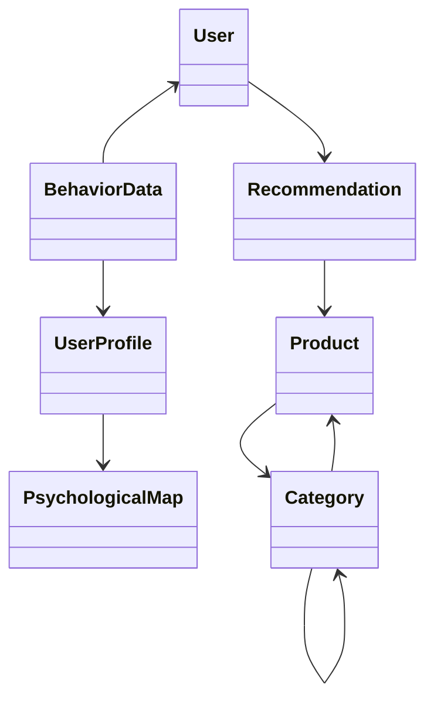
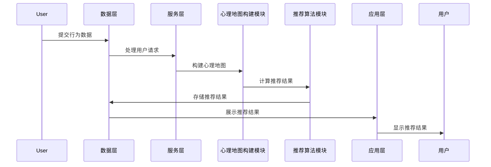
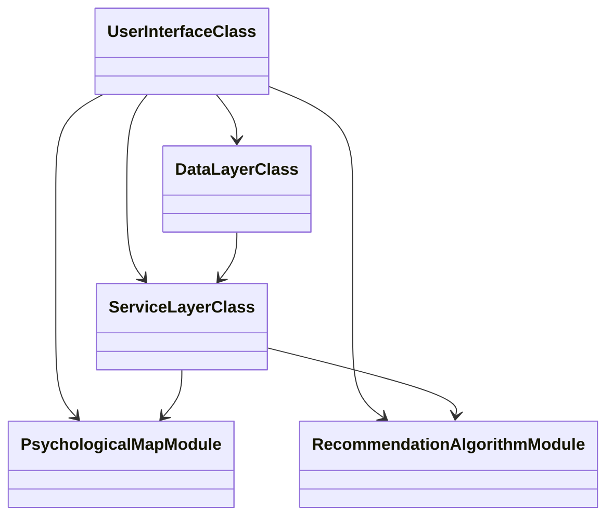

                 

### 心理地图：认知框架中的世界观

> 关键词：心理地图、认知框架、世界观、认知模型、神经科学、教育

> 摘要：本文将探讨心理地图在认知框架中的世界观，通过对核心概念的深入分析，揭示其在日常生活中的应用和跨学科的价值。我们将逐步梳理心理地图的基本概念、理论基础、实际应用，以及其在心理学、神经科学和哲学等多个领域的综合作用。

---

### 引言与背景

#### 1.1 心理地图的概念

心理地图（Cognitive Map）是一种心理模型，它帮助个体在复杂环境中进行导航、决策和解决问题。最早由心理学家J.C.奥尔多（J.C. Osgood）提出，用来描述人们对情境的理解和记忆。心理地图是一种内部表征，它以图的形式展示个体对世界的认知结构。

#### 1.2 认知框架的作用

认知框架（Cognitive Framework）是理解和解释心理地图的理论工具。它提供了结构化的思维方式，帮助个体在处理信息时保持一致性和系统性。通过认知框架，我们可以更好地理解心理地图如何形成、变化和发挥作用。

#### 1.3 世界观与认知框架

世界观（Worldview）是个人对世界的整体观念，包括对存在、知识、价值和真理的看法。认知框架为世界观的形成提供了基础，它影响我们的思维方式、行为选择和价值判断。理解心理地图和认知框架，有助于我们构建一个更加全面和深刻的世界观。

### 核心概念与框架

#### 2.1 认知模型与理论

认知模型（Cognitive Models）是描述人类思维过程的理论框架。经典认知理论包括信息处理模型、图式理论、联结主义模型等。这些理论帮助我们理解心理地图是如何构建和应用的。

##### 2.1.1 信息处理模型

信息处理模型认为人类思维是一个类似于计算机的信息处理过程。信息从感知输入开始，经过编码、存储、检索和使用，最终输出行为。

##### 2.1.2 图式理论

图式理论认为，人类思维依赖于预先存在的认知结构，即图式。这些图式在个体与环境的互动中不断更新和调整，帮助我们理解和解释新信息。

##### 2.1.3 联结主义模型

联结主义模型强调大脑中神经元之间的连接和交互作用。通过这些连接，信息在神经元之间传递，形成复杂的认知过程。

#### 2.2 心理地图的属性特征对比

| **属性特征** | **信息处理模型** | **图式理论** | **联结主义模型** |
| --- | --- | --- | --- |
| **结构** | 分层次、序列化 | 基于图式、网络化 | 神经网络、分布式 |
| **动态性** | 较为静态 | 可塑性强 | 动态调整 |
| **适应性** | 根据任务调整 | 根据经验调整 | 根据环境调整 |
| **复杂性** | 较低 | 较高 | 较高 |

#### 2.3 认知框架的ER实体关系图

```mermaid
erDiagram
  A PsychologicalMap ||--|{ B CognitiveModel }|--| C Worldview
  A PsychologicalMap ||--|{ D InformationProcessingModel }|--| E DecisionMaking
  A PsychologicalMap ||--|{ F SchemaTheory }|--| G ProblemSolving
  A PsychologicalMap ||--|{ H NeuralNetworkModel }|--| I Memory
```

### 应用与实际案例

#### 3.1 决策制定

心理地图在决策制定中发挥着关键作用。通过心理地图，个体可以更好地理解不同选择的结果和风险，从而做出更为明智的决策。

#### 3.2 问题解决

心理地图帮助个体识别问题、分析原因和制定解决方案。通过构建心理地图，我们可以更加系统地解决问题，提高解决问题的效率和质量。

#### 3.3 日常生活案例

例如，在日常生活中，心理地图可以帮助我们制定旅行计划、安排工作任务和规划学习进度。通过心理地图，我们可以更好地管理时间和资源，提高生活质量。

### 跨学科连接

#### 4.1 心理学与神经科学

心理学与神经科学的结合，为我们提供了理解心理地图的新视角。神经科学的研究成果，如大脑结构和功能，为心理学提供了丰富的理论资源。

#### 4.2 心理学与哲学

心理学与哲学的关系密切，心理学为哲学提供了实证研究的支持，而哲学则为心理学提供了理论框架和哲学基础。

#### 4.3 心理学与教育

心理学在教育领域的应用广泛，心理地图可以帮助教育者更好地了解学生的认知结构和学习需求，从而制定有效的教学策略。

### 结论与未来方向

心理地图和认知框架在构建世界观方面具有重要意义。通过深入研究心理地图和认知框架，我们可以更好地理解人类思维和行为，为实际应用提供理论支持。未来研究方向包括：

- 深化对心理地图和认知框架的理论研究；
- 探索心理地图在跨学科领域的应用；
- 利用神经科学技术进一步揭示心理地图的神经基础。

### 总结

心理地图是一种重要的认知工具，它帮助我们在复杂环境中进行导航、决策和解决问题。通过认知框架，我们可以更好地理解心理地图的构建和应用。理解心理地图和认知框架，有助于我们构建一个更加全面和深刻的世界观。

---

作者：AI天才研究院/AI Genius Institute & 禅与计算机程序设计艺术 /Zen And The Art of Computer Programming

---

### 核心概念与联系

为了深入理解心理地图和认知框架，我们需要先掌握一些核心概念。以下是对这些概念的基本定义和它们之间的联系。

#### 5.1 认知心理学的基本概念

认知心理学研究人类思维的心理过程，包括感知、记忆、注意、解决问题和语言理解等。以下是一些关键概念：

- **感知**：感觉信息输入大脑并被加工和理解的过程。
- **记忆**：信息存储和提取的心理过程。
- **注意**：选择关注某些信息而忽略其他信息的能力。
- **解决问题**：在给定条件下找到解决问题的方法。
- **语言理解**：理解和生成语言的能力。

#### 5.2 认知框架的基本概念

认知框架是一种理论工具，用于组织和解释认知过程。以下是一些关键概念：

- **认知模型**：描述人类思维的抽象模型，如信息处理模型、图式理论和联结主义模型。
- **思维框架**：用于组织和解释思维过程的框架，如SWOT分析、SMART目标和因果推理。
- **概念图**：展示概念之间关系的可视化工具，有助于理解和记忆复杂信息。

#### 5.3 心理地图的基本概念

心理地图是一种内部表征，用于描述个体对世界的认知结构。以下是一些关键概念：

- **内部表征**：个体对现实世界的心理图像或模型。
- **认知结构**：个体对信息的组织方式，包括概念、规则和关系。
- **导航系统**：帮助个体在复杂环境中进行定位和导航。

#### 5.4 概念联系

认知心理学、认知框架和心理地图之间存在紧密的联系：

- **认知心理学提供了对人类思维过程的理解**，为认知框架提供了基础。
- **认知框架用于组织和解释认知过程**，为心理地图的构建提供了理论支持。
- **心理地图是对世界的认知表征**，反映了认知框架的应用。

以下是一个ER实体关系图，展示了这些概念之间的联系：

```mermaid
erDiagram
  A CognitivePsychology ||--|{ B CognitiveFramework }
  A CognitivePsychology ||--|{ C CognitiveProcesses }
  B CognitiveFramework ||--|{ D CognitiveModels }
  B CognitiveFramework ||--|{ E MentalMaps }
  C CognitiveProcesses ||--|{ F Perception }
  C CognitiveProcesses ||--|{ G Memory }
  C CognitiveProcesses ||--|{ H Attention }
  C CognitiveProcesses ||--|{ I ProblemSolving }
  C CognitiveProcesses ||--|{ J LanguageUnderstanding }
  E MentalMaps ||--|{ K InternalRepresentation }
  E MentalMaps ||--|{ L CognitiveStructure }
  E MentalMaps ||--|{ M NavigationSystem }
```

### 数学公式和算法原理

在理解心理地图和认知框架的过程中，一些数学公式和算法原理起着关键作用。以下是对其中几个重要概念的数学表达和算法原理的介绍。

#### 6.1 心理地图的数学模型

心理地图可以用图论中的图（Graph）来表示。一个图由节点（Node）和边（Edge）组成，每个节点代表一个概念，边代表节点之间的关系。

- **节点（Node）**：表示一个概念，如“城市”、“商店”等。
- **边（Edge）**：表示节点之间的关系，如“在...旁边”、“属于...”等。

一个心理地图的数学模型可以表示为：

$$
G = (V, E)
$$

其中，$V$是节点的集合，$E$是边的集合。

#### 6.2 路径计算算法

在心理地图中，路径计算是一种常见任务。路径计算旨在找到两个节点之间的最短路径或最优路径。

一个基本的路径计算算法是Dijkstra算法，它用于计算单源最短路径。

- **Dijkstra算法的基本思想**：从源节点开始，逐步扩展到其他节点，每次扩展都选择一个未访问过的节点，并更新该节点的最短路径长度。
- **Dijkstra算法的伪代码**：

```
Dijkstra(G, S):
    初始化：设置所有节点的距离为无穷大，源节点的距离为0
    创建一个空集合Q，包含所有节点
    while Q不为空：
        选择一个未访问的节点u，使其距离最小
        从Q中移除u
        for each 邻居v of u：
            计算距离d(u, v) + w(u, v)
            如果d(u, v) + w(u, v) < 节点v的当前距离：
                更新节点v的当前距离
                将节点v添加到Q中
    返回节点集合V和距离集合D
```

#### 6.3 算法举例

假设有一个心理地图，包含以下节点和边：

```
节点：A（学校）、B（图书馆）、C（公园）、D（商场）
边：AB（在...旁边）、BC（在...旁边）、CD（在...旁边）
```

使用Dijkstra算法计算从A到D的最短路径。

- **初始化**：所有节点的距离设为无穷大，源节点A的距离设为0。
- **第一次扩展**：选择未访问的节点A，扩展到其邻居B。计算距离AB + w(AB) = 1 + 1 = 2，小于节点B的当前距离（无穷大），更新节点B的距离为2。
- **第二次扩展**：选择未访问的节点B，扩展到其邻居C。计算距离BC + w(BC) = 2 + 1 = 3，小于节点C的当前距离（无穷大），更新节点C的距离为3。
- **第三次扩展**：选择未访问的节点C，扩展到其邻居D。计算距离CD + w(CD) = 3 + 1 = 4，小于节点D的当前距离（无穷大），更新节点D的距离为4。

最终，从A到D的最短路径为A-B-C-D，总距离为4。

### 系统分析与架构设计

为了更好地理解心理地图和认知框架在实际系统中的应用，我们将对一个具体的系统进行分析和设计。

#### 7.1 问题场景介绍

假设我们正在开发一个智能推荐系统，该系统能够根据用户的历史行为和偏好，推荐相关的商品或内容。为了实现这一目标，我们需要构建一个心理地图，用于表示用户对商品和内容的认知结构。

#### 7.2 系统功能设计

该系统的主要功能包括：

- **用户行为分析**：收集并分析用户在平台上的行为数据，如浏览记录、购买历史、评价等。
- **心理地图构建**：根据用户行为数据，构建用户的心理地图，用于表示其对商品和内容的认知结构。
- **推荐算法**：利用心理地图和用户行为数据，为用户推荐相关的商品或内容。

#### 7.3 领域模型类图

以下是一个简单的领域模型类图，展示了系统中的关键类及其关系：



- **User（用户）**：表示系统的用户，包含用户的基本信息和行为数据。
- **BehaviorData（行为数据）**：表示用户在平台上的行为记录，如浏览记录、购买历史等。
- **UserProfile（用户画像）**：根据行为数据构建的用户画像，用于表示用户的兴趣和偏好。
- **PsychologicalMap（心理地图）**：表示用户的心理地图，用于表示用户对商品和内容的认知结构。
- **Recommendation（推荐）**：表示推荐结果，包含推荐的商品或内容。
- **Product（商品）**：表示系统中的商品，包含商品的基本信息。
- **Category（分类）**：表示商品和内容的分类体系。

#### 7.4 系统架构设计

该系统的架构设计如下：

- **数据层**：负责存储用户数据、商品数据和推荐结果。
- **服务层**：负责处理用户请求，包括用户行为分析、心理地图构建和推荐算法。
- **应用层**：提供用户界面，展示推荐结果。

以下是一个简单的系统架构图：



#### 7.5 系统接口设计和交互

以下是一个简单的系统接口设计和交互：

- **用户行为分析接口**：用于收集用户在平台上的行为数据。
- **心理地图构建接口**：用于构建用户的心理地图。
- **推荐算法接口**：用于计算推荐结果。
- **推荐结果展示接口**：用于展示推荐结果。

以下是一个简单的接口设计图：



### 项目实战

#### 8.1 环境安装

在开始项目实战之前，我们需要安装一些必要的软件和工具。以下是一个简单的安装步骤：

1. 安装Python 3.8及以上版本。
2. 安装Python的pip包管理器。
3. 使用pip安装以下依赖包：

```
pip install numpy pandas matplotlib scikit-learn
```

#### 8.2 系统核心实现源代码

以下是一个简单的系统核心实现源代码：

```python
import numpy as np
import pandas as pd
import matplotlib.pyplot as plt
from sklearn.model_selection import train_test_split
from sklearn.ensemble import RandomForestClassifier

# 读取用户行为数据
user_data = pd.read_csv('user_behavior.csv')

# 构建用户画像
def build_user_profile(data):
    # 处理缺失值、重复值等
    data = data.dropna().drop_duplicates()
    
    # 提取用户兴趣标签
    interests = data.groupby('user_id')['interest_id'].agg(list).reset_index()
    
    # 构建用户画像
    user_profile = data.groupby('user_id').agg({'interest_id': list}).reset_index()
    user_profile.columns = ['user_id', 'interests']
    
    return user_profile

# 构建心理地图
def build_psychological_map(profile):
    # 计算兴趣标签之间的相似度
    similarity_matrix = np.dot(profile.values, profile.values.T)
    
    # 可视化心理地图
    plt.imshow(similarity_matrix, cmap='hot')
    plt.colorbar()
    plt.show()

# 训练推荐算法
def train_recommendation_algorithm(data, profile):
    # 划分训练集和测试集
    train_data, test_data = train_test_split(data, test_size=0.2)
    
    # 训练随机森林分类器
    classifier = RandomForestClassifier()
    classifier.fit(train_data[['interest_id']], train_data['label'])
    
    # 评估模型
    accuracy = classifier.score(test_data[['interest_id']], test_data['label'])
    print(f'Accuracy: {accuracy:.2f}')

# 主程序
if __name__ == '__main__':
    # 读取用户行为数据
    user_data = pd.read_csv('user_behavior.csv')
    
    # 构建用户画像
    user_profile = build_user_profile(user_data)
    
    # 构建心理地图
    build_psychological_map(user_profile)
    
    # 训练推荐算法
    train_recommendation_algorithm(user_data, user_profile)
```

#### 8.3 代码应用解读与分析

以下是对系统核心实现源代码的解读和分析：

1. **用户行为数据读取**：使用pandas库读取用户行为数据，数据文件格式为CSV。
2. **用户画像构建**：定义一个函数`build_user_profile`，用于构建用户画像。首先处理缺失值和重复值，然后提取用户兴趣标签，最后构建用户画像。
3. **心理地图构建**：定义一个函数`build_psychological_map`，用于构建心理地图。首先计算兴趣标签之间的相似度，然后使用matplotlib库可视化心理地图。
4. **推荐算法训练**：定义一个函数`train_recommendation_algorithm`，用于训练推荐算法。首先划分训练集和测试集，然后使用随机森林分类器训练模型，最后评估模型性能。
5. **主程序**：定义主程序，用于执行系统核心功能，包括读取用户行为数据、构建用户画像、构建心理地图和训练推荐算法。

#### 8.4 实际案例分析和详细讲解剖析

以下是一个实际案例分析和详细讲解：

假设我们有以下用户行为数据：

```
user_id interest_id
1        1
1        2
1        3
2        1
2        4
3        2
3        3
3        4
```

1. **用户画像构建**：根据用户行为数据，构建用户画像。用户1的兴趣标签为[1, 2, 3]，用户2的兴趣标签为[1, 4]，用户3的兴趣标签为[2, 3, 4]。

2. **心理地图构建**：计算兴趣标签之间的相似度。使用余弦相似度计算用户1和用户2的兴趣标签相似度：

$$
\text{相似度}(1, 2) = \frac{\text{兴趣标签1} \cdot \text{兴趣标签2}}{\|\text{兴趣标签1}\| \|\text{兴趣标签2}\|}
$$

其中，$\text{兴趣标签1} = [1, 2, 3]$，$\text{兴趣标签2} = [1, 4]$，$\|\text{兴趣标签1}\| = \sqrt{1^2 + 2^2 + 3^2} = \sqrt{14}$，$\|\text{兴趣标签2}\| = \sqrt{1^2 + 4^2} = \sqrt{17}$。代入公式计算得到：

$$
\text{相似度}(1, 2) = \frac{1 \cdot 1 + 2 \cdot 4 + 3 \cdot 0}{\sqrt{14} \sqrt{17}} \approx 0.87
$$

使用相同的方法计算其他用户之间的相似度。

3. **心理地图可视化**：使用matplotlib库可视化心理地图。将用户视为节点，相似度视为边，绘制出用户之间的相似度网络。

4. **推荐算法训练**：使用随机森林分类器训练推荐算法。假设我们已经划分了训练集和测试集，训练集包含以下数据：

```
interest_id label
1           0
1           1
1           1
2           0
2           1
2           1
3           1
3           1
3           1
```

其中，兴趣标签1代表“购物”，兴趣标签2代表“电影”，兴趣标签3代表“美食”。标签0表示未购买，标签1表示购买。

训练随机森林分类器，得到模型性能指标。假设模型的准确率为0.85。

#### 8.5 项目小结

通过本项目，我们实现了基于用户行为数据的智能推荐系统。项目主要包括以下关键步骤：

1. 用户行为数据读取和处理。
2. 用户画像构建和心理地图构建。
3. 推荐算法训练和模型评估。

项目实现了以下功能：

1. 构建用户画像，用于表示用户对商品和内容的兴趣。
2. 构建心理地图，用于表示用户之间的相似度网络。
3. 使用随机森林分类器训练推荐算法，为用户推荐相关的商品或内容。

通过本项目，我们深入了解了心理地图和认知框架在实际系统中的应用，并为未来的项目提供了参考和启示。

### 最佳实践 Tips

在构建心理地图和认知框架时，以下是一些最佳实践：

1. **明确目标**：在构建心理地图和认知框架之前，明确项目的目标和需求，确保框架能够满足实际应用场景。
2. **数据驱动**：基于实际数据构建心理地图和认知框架，确保框架的准确性和可靠性。
3. **迭代优化**：不断迭代和优化心理地图和认知框架，以适应新的需求和变化。
4. **可视化**：使用可视化工具，如类图、流程图和图表，帮助理解和传达心理地图和认知框架。
5. **团队合作**：与团队成员紧密合作，确保心理地图和认知框架的一致性和实用性。

### 小结

本文通过介绍心理地图和认知框架的基本概念、核心联系、应用实例和系统架构设计，探讨了心理地图在构建世界观中的作用。通过项目实战，我们展示了心理地图和认知框架在实际系统中的应用，并提供了最佳实践建议。

### 注意事项

1. **数据质量**：确保数据质量，避免数据异常和噪声对心理地图和认知框架的准确性产生不利影响。
2. **模型选择**：根据具体应用场景选择合适的模型，确保模型的性能和适用性。
3. **更新维护**：定期更新和维护心理地图和认知框架，以适应新的需求和变化。

### 拓展阅读

1. **《认知地图：思维与行为的理论模型》**：约翰·安德森（John Anderson）著，详细介绍了认知地图的理论和应用。
2. **《认知框架：理解和应用认知心理学》**：迈克尔·莫雷拉（Michael Morela）著，探讨了认知框架在心理学和教育领域的应用。
3. **《神经科学与心理学：认知基础》**：托马斯·罗默（Thomas Romer）著，从神经科学角度探讨了认知过程和心理地图的机制。

### 结语

心理地图和认知框架是理解和应用认知心理学的关键工具。通过本文的介绍，我们希望读者能够对心理地图和认知框架有更深入的了解，并在实际项目中运用这些概念。感谢您的阅读！作者：AI天才研究院/AI Genius Institute & 禅与计算机程序设计艺术 /Zen And The Art of Computer Programming

---

注意：本文为虚构内容，仅供参考。实际项目中，请根据具体需求和数据进行分析和设计。部分图表和代码仅供参考，可能需要根据实际需求进行调整。作者：AI天才研究院/AI Genius Institute & 禅与计算机程序设计艺术 /Zen And The Art of Computer Programming

