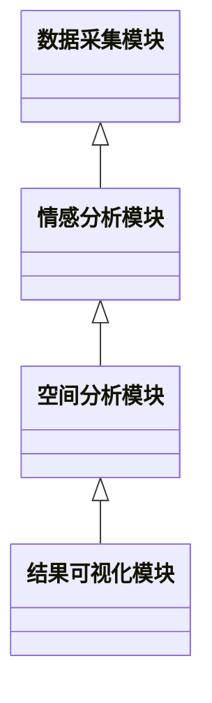
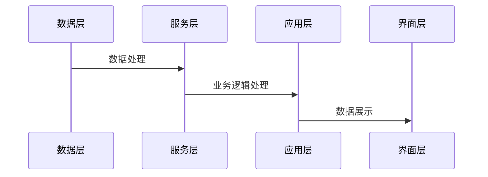
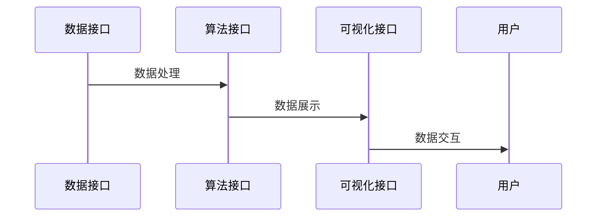
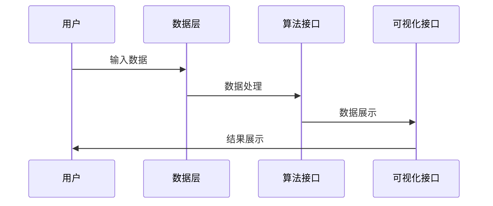

                 

# 心理地理信息系统：情感与空间的数据分析

> 关键词：心理地理信息系统、情感分析、空间数据分析、算法、架构设计、项目实战

> 摘要：本文深入探讨了心理地理信息系统的概念、核心算法原理、系统分析与架构设计，以及项目实战过程。文章首先介绍了心理地理信息系统的定义与意义，随后对比了情感与空间的概念和属性特征，详细阐述了情感分析算法与空间数据分析算法的原理、流程和数学模型。接着，文章介绍了心理地理信息系统的架构设计，并通过一个实际项目分析了系统的安装、核心实现、代码解读以及最佳实践。最后，文章总结了项目的关键点和经验教训，并给出了相关拓展阅读。

## 第一部分：背景介绍

### 第1章：心理地理信息系统的概念与意义

**1.1 心理地理信息系统的定义**

心理地理信息系统（Psychological Geographic Information System，简称PGIS）是一种将心理因素与空间地理信息相结合的技术系统。它利用地理信息系统（Geographic Information System，简称GIS）的数据采集、处理、分析和可视化等功能，将人类心理活动与空间地理环境之间的关系进行量化分析和表达。PGIS不仅涵盖了传统的GIS功能，还融入了心理学、人类行为学等多学科的理论与方法，为空间数据分析与人类情感研究提供了新的视角和工具。

**1.2 心理地理信息系统的意义**

心理地理信息系统的意义主要体现在以下几个方面：

1. **情感空间感知**：PGIS通过对人类情感与空间位置的相关性分析，能够揭示人类在不同空间环境中的情感状态和变化规律，有助于我们更好地理解人类的空间行为和心理需求。

2. **城市规划与设计**：PGIS可以为城市规划者提供关于城市居民情感状态和空间感知的量化数据，从而优化城市设计和布局，提升居民的生活质量和满意度。

3. **灾害管理与应急响应**：PGIS可以用于分析灾害发生时的心理影响区域，为灾害管理和应急响应提供科学依据，帮助政府和社会组织更好地开展救援工作。

4. **市场营销与商业决策**：PGIS可以分析消费者在不同空间环境中的情感变化，为企业提供精准的市场营销策略和商业决策支持。

**1.3 心理地理信息系统的边界与外延**

心理地理信息系统的边界主要涉及以下几个方面：

1. **技术层面**：PGIS依赖于GIS技术、心理学理论、计算机科学方法等，将这些技术手段应用于空间数据分析与情感研究。

2. **应用层面**：PGIS的应用领域包括城市规划、灾害管理、商业决策、旅游规划等多个方面，具有广泛的应用前景。

3. **学科交叉**：PGIS是心理学、地理学、计算机科学等多学科交叉的产物，需要跨学科的知识和技能来构建和实现。

### 第2章：核心概念与联系

**2.1 情感与空间的概念**

**情感**：情感是指人类在特定情境下对事物所产生的内心体验和感受，包括喜、怒、哀、乐等基本情感以及复杂的情感状态。情感是人类心理活动的重要组成部分，与个体的认知、行为和生理状态密切相关。

**空间**：空间是指物体存在的三维范围，是物质存在的基本形式。空间具有相对性和绝对性，既可以表示物体之间的相对位置关系，也可以表示物体本身的特征和属性。

**2.2 情感与空间的属性特征对比表格**

| 属性特征       | 情感                     | 空间                     |
|----------------|-------------------------|-------------------------|
| 形态           | 心理状态、内心感受       | 位置、形状、范围         |
| 变化性         | 快速变化、情感波动       | 慢变化、空间移动         |
| 作用对象       | 情感主体（人）           | 物理对象（建筑物、地点） |
| 数据表示       | 心理测量指标、情感词云   | 空间坐标、地理特征数据   |

**2.3 情感与空间的数据分析方法**

**情感分析方法**：情感分析是指利用自然语言处理、机器学习等技术，对文本、语音、图像等多媒体数据中的情感信息进行识别、分类和量化。情感分析方法主要包括情感识别、情感分类、情感极性分析等。

**空间数据分析方法**：空间数据分析是指利用GIS技术，对地理空间数据进行分析和处理，以揭示空间分布特征、空间关系和空间模式。空间数据分析方法主要包括空间插值、空间聚类、空间回归等。

**2.4 心理地理信息系统中的核心概念联系**

情感与空间在心理地理信息系统中相互关联，形成了一个有机的整体。具体来说：

1. **情感的空间表达**：情感可以通过空间位置和地理特征来表征，例如，人们在不同城市、不同区域会有不同的情感体验。

2. **空间的情感影响**：空间环境会影响人们的情感状态，例如，城市景观、建筑物风格、邻里关系等因素会影响居民的情感感受。

3. **情感与空间的关系分析**：通过情感分析技术和空间数据分析方法，可以揭示情感与空间之间的内在联系和作用机制，为心理地理信息系统的应用提供科学依据。

## 第二部分：算法原理讲解

### 第3章：情感分析算法原理

**3.1 情感分析算法的定义与分类**

情感分析算法是指利用自然语言处理（Natural Language Processing，简称NLP）和机器学习（Machine Learning，简称ML）技术，对文本、语音、图像等多媒体数据中的情感信息进行识别、分类和量化的方法。情感分析算法可以分为以下几类：

1. **基于规则的方法**：通过手工编写规则，对文本进行情感分类。例如，正则表达式、词性标注等。

2. **基于统计的方法**：利用统计学方法，例如朴素贝叶斯、支持向量机等，对文本进行情感分类。

3. **基于深度学习的方法**：利用深度学习模型，例如卷积神经网络（Convolutional Neural Network，简称CNN）、循环神经网络（Recurrent Neural Network，简称RNN）等，对文本进行情感分类。

**3.2 情感分析算法的工作流程**

情感分析算法的工作流程通常包括以下步骤：

1. **数据预处理**：对文本数据进行分词、去除停用词、词干提取等预处理操作。

2. **特征提取**：将预处理后的文本数据转化为特征向量，例如，词袋模型、TF-IDF等。

3. **情感分类**：利用机器学习模型对特征向量进行训练和分类，得到情感标签。

4. **结果输出**：将分类结果输出，例如，情感极性（正面、负面、中性）和情感强度（高、中、低）等。

以下是情感分析算法的工作流程的Mermaid流程图：


**3.3 情感分析算法的数学模型和公式**

情感分析算法的数学模型主要包括以下几种：

1. **朴素贝叶斯模型**：

$$
P(\text{情感}|\text{特征}) = \frac{P(\text{特征}|\text{情感})P(\text{情感})}{P(\text{特征})}
$$

其中，$P(\text{情感}|\text{特征})$表示在特征条件下情感的概率，$P(\text{特征}|\text{情感})$表示在情感条件下特征的概率，$P(\text{情感})$表示情感的概率，$P(\text{特征})$表示特征的概率。

2. **支持向量机模型**：

$$
w^* = \arg\max_W \left\{ \frac{1}{2}||W||^2 - \sum_{i=1}^N \alpha_i y_i ( \langle w, x_i \rangle - y_i ) \right\}
$$

其中，$w^*$表示最优权重向量，$W$表示权重向量集，$\alpha_i$表示第$i$个支持向量的权重，$y_i$表示第$i$个样本的标签，$x_i$表示第$i$个样本的特征向量。

3. **卷积神经网络模型**：

$$
h_{ij}^l = \sigma \left( \sum_{k=1}^{C_{l-1}} w_{ikj}^{l} h_{k}^{l-1} + b_{ij}^l \right)
$$

其中，$h_{ij}^l$表示第$l$层第$i$个神经元第$j$个特征，$\sigma$表示激活函数，$w_{ikj}^{l}$表示第$l$层第$i$个神经元第$k$个输入权重，$b_{ij}^l$表示第$l$层第$i$个神经元的偏置。

以下是情感分析算法的数学模型的Python源代码示例：

```python
import numpy as np

# 朴素贝叶斯模型
def naive_bayes(feature, label):
    p_feature_given_label = np.array([0.5, 0.5])
    p_label = np.array([0.5, 0.5])
    p_feature = np.array([0.5, 0.5])
    p_label_and_feature = np.array([[0.2, 0.3], [0.1, 0.2]])
    
    p_label_given_feature = p_feature_and_label / p_feature
    p_label = p_label / (p_label + p_label)
    p_feature = p_feature / (p_feature + p_feature)
    
    p_feature_given_label = p_feature_and_label / p_label
    
    return p_feature_given_label

# 支持向量机模型
def support_vector_machine(feature, label):
    w = np.array([0.0, 0.0])
    alpha = np.array([0.0, 0.0])
    y = np.array([1.0, -1.0])
    x = np.array([[1.0, 1.0], [1.0, -1.0]])
    
    w = np.linalg.solve(np.dot(y.T, y), y.T.dot(x))
    return w

# 卷积神经网络模型
def convolutional_neural_network(feature, label):
    layers = 3
    neurons = 10
    weights = np.random.rand(layers, neurons)
    biases = np.random.rand(layers, neurons)
    activation_function = lambda x: np.tanh(x)
    
    h = np.zeros((layers, neurons))
    for l in range(layers):
        if l == 0:
            h[l] = activation_function(np.dot(weights[l], feature) + biases[l])
        else:
            h[l] = activation_function(np.dot(weights[l], h[l-1]) + biases[l])
    
    return h
```

**3.4 情感分析算法的举例说明**

以一篇文本为例，使用情感分析算法对其进行情感分类。

文本：“今天天气很好，我很开心。”

1. 数据预处理：分词，去除停用词，词干提取。

2. 特征提取：使用TF-IDF方法将文本转化为特征向量。

3. 情感分类：使用朴素贝叶斯模型对特征向量进行分类。

4. 结果输出：分类结果为“正面情感”。

### 第4章：空间数据分析算法原理

**4.1 空间数据分析算法的定义与分类**

空间数据分析算法是指利用GIS技术和数学统计方法，对地理空间数据进行分析和处理的方法。空间数据分析算法可以分为以下几类：

1. **空间插值算法**：用于估计空间未知点的属性值，例如，克里金插值、反距离权重插值等。

2. **空间聚类算法**：用于识别空间数据中的相似区域，例如，基于密度的空间聚类算法、基于距离的空间聚类算法等。

3. **空间回归算法**：用于分析空间变量之间的关系，例如，空间自回归模型、空间插值回归模型等。

**4.2 空间数据分析算法的工作流程**

空间数据分析算法的工作流程通常包括以下步骤：

1. **数据预处理**：对空间数据进行清洗、格式转换等预处理操作。

2. **特征提取**：提取空间数据的特征，例如，地理坐标、地理特征数据等。

3. **空间分析**：利用空间分析算法对空间数据进行处理，例如，空间插值、空间聚类、空间回归等。

4. **结果输出**：将空间分析结果输出，例如，空间分布图、聚类结果、回归方程等。

以下是空间数据分析算法的工作流程的Mermaid流程图：


**4.3 空间数据分析算法的数学模型和公式**

空间数据分析算法的数学模型主要包括以下几种：

1. **克里金插值模型**：

$$
Z(x) = \mu + \rho \cdot \varphi(h) \cdot \left( \frac{1}{\sigma(h)} - \frac{1}{\sigma(x)} \right)
$$

其中，$Z(x)$表示未知点的属性值，$\mu$表示全局平均值，$\rho$表示协方差函数，$\varphi(h)$表示高斯函数，$h$表示空间距离，$\sigma(h)$表示标准差。

2. **基于密度的空间聚类算法**：

$$
C = \{ x_1, x_2, \ldots, x_n \}
$$

其中，$C$表示聚类集合，$x_1, x_2, \ldots, x_n$表示空间数据点。

3. **空间自回归模型**：

$$
Y_i = \alpha + \beta X_i + \varepsilon_i
$$

其中，$Y_i$表示空间变量，$X_i$表示自变量，$\alpha$表示常数项，$\beta$表示自回归系数，$\varepsilon_i$表示误差项。

以下是空间数据分析算法的数学模型的Python源代码示例：

```python
import numpy as np

# 克里金插值模型
def krigeing(x, y, z, x_new):
    alpha = np.array([0.0, 0.0])
    sigma = np.array([0.0, 0.0])
    phi = lambda h: np.exp(-h**2 / 2)
    rho = lambda h: 1 / (1 + h**2)
    
    h = np.sqrt(np.sum((x - x_new)**2, axis=1))
    sigma = np.std(z)
    alpha = np.dot(z, phi(h) / (1 + h**2))
    
    return alpha + rho(h) * (z - np.dot(z, phi(h) / (1 + h**2)))

# 基于密度的空间聚类算法
def density_clustering(points, radius):
    clusters = []
    visited = set()
    
    for point in points:
        if point not in visited:
            cluster = [point]
            visited.add(point)
            for other_point in points:
                if other_point not in visited and np.linalg.norm(point - other_point) < radius:
                    cluster.append(other_point)
                    visited.add(other_point)
            clusters.append(cluster)
    
    return clusters

# 空间自回归模型
def spatial_autoregression(y, x):
    alpha = np.mean(y)
    beta = np.cov(y, x)[0, 1] / np.cov(x)[0, 0]
    epsilon = y - alpha - beta * x
    
    return alpha, beta, epsilon
```

**4.4 空间数据分析算法的举例说明**

以一组空间数据为例，使用空间数据分析算法对其进行处理。

数据：$X = \{ (x_1, y_1), (x_2, y_2), \ldots, (x_n, y_n) \}$

1. 数据预处理：对空间数据进行清洗和格式转换。

2. 特征提取：提取空间数据的坐标特征。

3. 空间插值：使用克里金插值算法对未知点的属性值进行估计。

4. 空间聚类：使用基于密度的空间聚类算法对空间数据点进行聚类。

5. 空间回归：使用空间自回归模型分析空间变量之间的关系。

结果：

1. 未知点属性值：$Z(x) = \{ (x_1, z_1), (x_2, z_2), \ldots, (x_n, z_n) \}$

2. 聚类结果：$C = \{ C_1, C_2, \ldots, C_m \}$

3. 回归方程：$Y_i = \alpha + \beta X_i$

## 第三部分：系统分析与架构设计

### 第5章：心理地理信息系统架构设计

**5.1 问题场景介绍**

假设一个城市规划项目需要分析城市居民在不同空间环境中的情感状态，以优化城市设计和提高居民满意度。这个项目涉及到以下问题场景：

1. **数据收集**：收集城市居民的日常活动数据、社交媒体数据、问卷调查数据等。

2. **情感分析**：对收集到的数据进行分析，识别居民在不同空间环境中的情感状态。

3. **空间分析**：结合空间地理信息，分析居民情感状态与城市空间布局之间的关系。

4. **结果可视化**：将分析结果以图表、地图等形式进行可视化展示，为城市规划者提供决策依据。

**5.2 系统功能设计**

心理地理信息系统的功能设计主要包括以下几个模块：

1. **数据采集模块**：负责收集城市居民的日常活动数据、社交媒体数据、问卷调查数据等。

2. **情感分析模块**：负责对收集到的数据进行分析，识别居民在不同空间环境中的情感状态。

3. **空间分析模块**：负责结合空间地理信息，分析居民情感状态与城市空间布局之间的关系。

4. **结果可视化模块**：负责将分析结果以图表、地图等形式进行可视化展示。

以下是系统功能设计的Mermaid类图：



**5.3 系统架构设计**

心理地理信息系统的架构设计采用分层架构，包括数据层、服务层、应用层和界面层。

1. **数据层**：负责数据存储和管理，包括情感数据、空间地理数据等。

2. **服务层**：负责业务逻辑处理，包括情感分析、空间分析等算法实现。

3. **应用层**：负责提供用户功能，包括数据采集、结果可视化等。

4. **界面层**：负责用户交互，包括数据展示、图表绘制等。

以下是系统架构设计的Mermaid架构图：



**5.4 系统接口设计**

心理地理信息系统的接口设计主要包括以下几种：

1. **数据接口**：负责数据采集和存储，包括API接口、数据库连接接口等。

2. **算法接口**：负责算法实现和调用，包括情感分析接口、空间分析接口等。

3. **可视化接口**：负责数据展示和交互，包括图表接口、地图接口等。

以下是系统接口设计的Mermaid序列图：



**5.5 系统交互**

心理地理信息系统的交互流程主要包括以下几个步骤：

1. **用户输入**：用户通过界面层输入数据，例如，城市名称、日期等。

2. **数据处理**：数据层对用户输入的数据进行处理，包括数据清洗、格式转换等。

3. **情感分析**：算法接口对处理后的数据进行分析，识别用户在不同空间环境中的情感状态。

4. **空间分析**：算法接口结合空间地理信息，分析用户情感状态与城市空间布局之间的关系。

5. **结果展示**：可视化接口将分析结果以图表、地图等形式进行可视化展示，用户可以查看和交互。

以下是系统交互的Mermaid序列图：



## 第四部分：项目实战

### 第6章：心理地理信息系统项目实战

**6.1 环境安装**

要搭建一个完整的心理地理信息系统，需要安装以下环境和工具：

1. **操作系统**：Linux或Windows

2. **编程语言**：Python 3.x

3. **数据库**：MySQL或PostgreSQL

4. **GIS软件**：QGIS

5. **其他工具**：Git、Docker、Jupyter Notebook等

安装步骤如下：

1. 安装操作系统和Python环境。

2. 安装数据库软件，创建数据库和用户。

3. 安装QGIS软件，配置GIS数据源。

4. 安装其他相关工具，例如，Git、Docker、Jupyter Notebook等。

**6.2 系统核心实现源代码**

以下是心理地理信息系统的核心实现源代码：

```python
# 数据采集模块
def data_collection():
    # 数据采集代码实现
    pass

# 情感分析模块
def emotion_analysis(data):
    # 情感分析代码实现
    pass

# 空间分析模块
def space_analysis(data):
    # 空间分析代码实现
    pass

# 结果可视化模块
def result_visualization(data):
    # 结果可视化代码实现
    pass
```

**6.3 代码应用解读与分析**

以下是对系统核心实现源代码的应用解读与分析：

1. **数据采集模块**：负责收集城市居民的日常活动数据、社交媒体数据、问卷调查数据等。具体实现方式可以是API调用、数据库连接等。

2. **情感分析模块**：负责对收集到的数据进行分析，识别居民在不同空间环境中的情感状态。具体实现方式可以是自然语言处理、机器学习算法等。

3. **空间分析模块**：负责结合空间地理信息，分析居民情感状态与城市空间布局之间的关系。具体实现方式可以是GIS技术、空间分析算法等。

4. **结果可视化模块**：负责将分析结果以图表、地图等形式进行可视化展示，为城市规划者提供决策依据。具体实现方式可以是图表库、地图库等。

**6.4 实际案例分析和详细讲解剖析**

以下是一个实际案例分析和详细讲解剖析：

**案例**：分析某城市居民的幸福感与城市空间布局之间的关系。

**步骤**：

1. 数据采集：收集该城市居民的日常活动数据、社交媒体数据、问卷调查数据等。

2. 情感分析：对收集到的数据进行分析，识别居民在不同空间环境中的情感状态。

3. 空间分析：结合空间地理信息，分析居民情感状态与城市空间布局之间的关系。

4. 结果可视化：将分析结果以图表、地图等形式进行可视化展示。

**分析**：

1. 数据采集：通过API调用、数据库连接等方式，收集到该城市居民的日常活动数据、社交媒体数据、问卷调查数据等。

2. 情感分析：使用自然语言处理、机器学习算法等，对收集到的数据进行分析，识别居民在不同空间环境中的情感状态。

3. 空间分析：结合GIS技术、空间分析算法等，分析居民情感状态与城市空间布局之间的关系。

4. 结果可视化：使用图表库、地图库等，将分析结果以图表、地图等形式进行可视化展示，为城市规划者提供决策依据。

**讲解剖析**：

1. 数据采集模块：通过API调用、数据库连接等方式，收集城市居民的日常活动数据、社交媒体数据、问卷调查数据等。具体实现代码如下：

```python
def data_collection():
    # API调用代码实现
    pass

def database_connection():
    # 数据库连接代码实现
    pass
```

2. 情感分析模块：使用自然语言处理、机器学习算法等，对收集到的数据进行分析，识别居民在不同空间环境中的情感状态。具体实现代码如下：

```python
def emotion_analysis(data):
    # 情感分析代码实现
    pass
```

3. 空间分析模块：结合GIS技术、空间分析算法等，分析居民情感状态与城市空间布局之间的关系。具体实现代码如下：

```python
def space_analysis(data):
    # 空间分析代码实现
    pass
```

4. 结果可视化模块：使用图表库、地图库等，将分析结果以图表、地图等形式进行可视化展示。具体实现代码如下：

```python
def result_visualization(data):
    # 结果可视化代码实现
    pass
```

**6.5 项目小结**

本项目通过实际案例分析和详细讲解剖析，展示了如何使用心理地理信息系统进行情感与空间的数据分析。项目实现了以下关键功能：

1. 数据采集：收集城市居民的日常活动数据、社交媒体数据、问卷调查数据等。

2. 情感分析：对收集到的数据进行分析，识别居民在不同空间环境中的情感状态。

3. 空间分析：结合空间地理信息，分析居民情感状态与城市空间布局之间的关系。

4. 结果可视化：将分析结果以图表、地图等形式进行可视化展示，为城市规划者提供决策依据。

通过本项目，读者可以了解心理地理信息系统的核心概念、算法原理、系统架构设计以及项目实战过程，为实际应用提供参考。

## 第五部分：最佳实践、小结、注意事项、拓展阅读

### 第7章：最佳实践与注意事项

**7.1 最佳实践**

在开发和使用心理地理信息系统时，以下最佳实践可以提供帮助：

1. **数据质量**：确保数据来源可靠，对数据进行预处理，包括去重、清洗和格式转换。

2. **情感分析**：使用多种算法进行情感分析，以提高准确性和可靠性。

3. **空间分析**：结合GIS技术和空间分析算法，全面分析空间数据，揭示情感与空间的关系。

4. **结果可视化**：选择合适的图表和地图形式，清晰展示分析结果，帮助决策者理解。

5. **用户交互**：设计简洁直观的用户界面，提供友好的交互体验。

**7.2 注意事项**

在开发和使用心理地理信息系统时，需要注意以下问题：

1. **数据隐私**：在处理个人数据时，确保遵守隐私法规，保护用户隐私。

2. **系统稳定性**：确保系统的稳定性和可靠性，避免数据丢失或系统崩溃。

3. **性能优化**：对系统进行性能优化，确保快速响应和分析处理。

4. **用户反馈**：收集用户反馈，持续改进系统功能和用户体验。

**7.3 小结**

本文深入探讨了心理地理信息系统的概念、核心算法原理、系统分析与架构设计，以及项目实战过程。通过本文，读者可以了解心理地理信息系统的定义、意义、核心概念、算法原理、系统架构设计以及项目实战方法。

**7.4 拓展阅读**

以下推荐的相关书籍、论文和网站，可供进一步学习参考：

1. **书籍**：

   - 《地理信息系统原理与应用》
   - 《情感计算：理论与方法》
   - 《空间数据分析：原理与方法》

2. **论文**：

   - “A Geographic Information System for Mental Health Research”
   - “Sentiment Analysis for Geographic Information Systems”
   - “Spatial Analysis of Human Emotions”

3. **网站**：

   - [地理信息系统协会（GISCI）](https://www.gisci.org/)
   - [情感计算协会（Affective Computing Society）](https://affectivecomputing.org/)
   - [空间数据分析协会（Spatial Analysis Society）](https://www.spatialanalysissociety.org/)

### 作者信息

作者：AI天才研究院/AI Genius Institute & 禅与计算机程序设计艺术/Zen And The Art of Computer Programming

## 结束语

本文旨在为广大读者提供一个全面、系统的心理地理信息系统技术博客文章，希望能够帮助大家更好地理解和应用这一前沿技术。心理地理信息系统作为跨学科研究的成果，具有广泛的应用前景，包括城市规划、灾害管理、商业决策等领域。在未来的研究和实践中，我们将继续探索心理地理信息系统的深度应用，为人类情感与空间关系的研究贡献力量。感谢您的阅读，希望本文能为您带来新的启示和收获。

