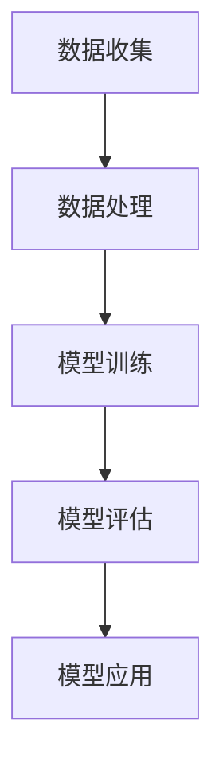
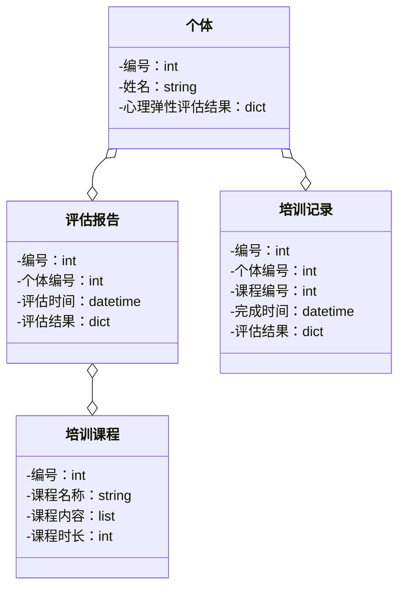
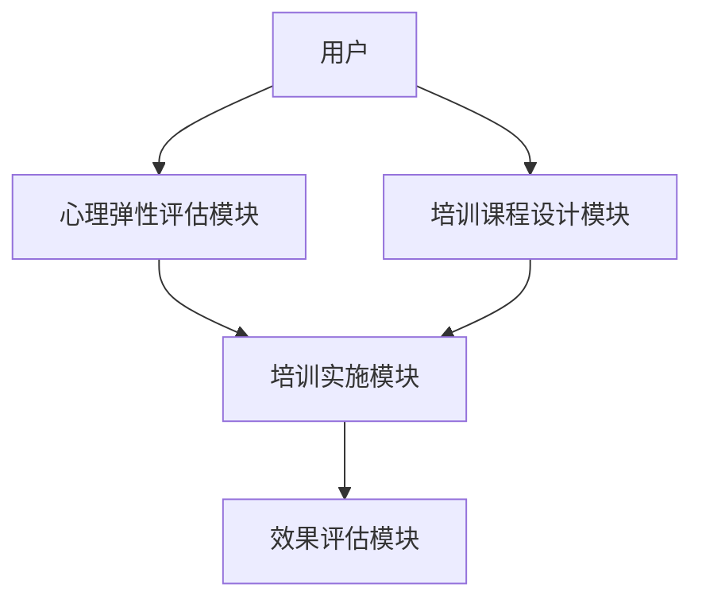
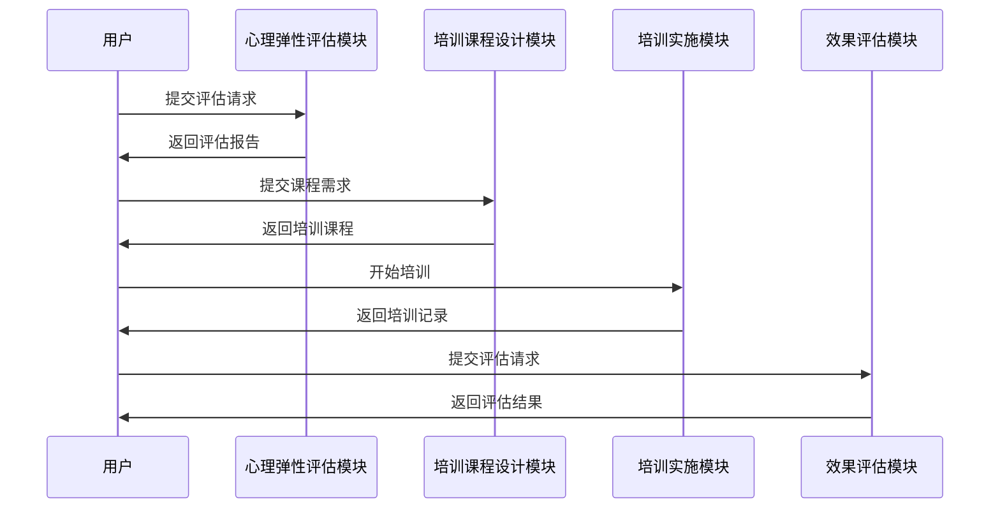

                 


### 心理弹性培训课程：提升应对变化能力的系统教育

#### 关键词：心理弹性，培训课程，应对变化，系统教育

> 摘要：本文将探讨心理弹性在应对变化中的重要性，并通过系统教育的视角，提出一系列培训课程的设计与实施策略，旨在提升个体应对环境变化的适应能力。文章将分为七个章节，依次介绍心理弹性的定义、理论基础、核心要素、评估方法、实践策略、案例分析以及总结与展望。

#### 目录大纲设计步骤

在设计《心理弹性培训课程：提升应对变化能力的系统教育》的目录大纲时，我们将遵循以下步骤：

##### 1. 确定总体结构

- **第1章**：背景介绍与概述，包括问题的背景、核心概念、重要性及目标群体。
- **第2章**：心理弹性的基础理论，介绍心理弹性的概念、属性及主要理论。
- **第3章**：心理弹性的核心要素，分析提高心理弹性的关键因素。
- **第4章**：心理弹性的评估方法，介绍不同类型的心理弹性评估工具。
- **第5章**：提升心理弹性的实践策略，提供具体的策略和方法。
- **第6章**：实际案例分析与讨论，通过具体案例展示心理弹性提升的过程和效果。
- **第7章**：总结与展望，对全书内容进行总结，并对未来的发展趋势进行展望。

##### 2. 设计各章节内容

- **第1章**：介绍心理弹性的定义、背景和重要性，概述全书结构和内容。
- **第2章**：深入讲解心理弹性的基础理论，包括相关概念、理论框架和研究方法。
- **第3章**：分析心理弹性的核心要素，如个人特质、环境因素和社会支持等。
- **第4章**：介绍常用的心理弹性评估方法，如量表、问卷和面试等。
- **第5章**：提供提升心理弹性的实践策略，如心理训练、认知重构和积极心态培养等。
- **第6章**：通过实际案例，展示心理弹性提升的过程和效果。
- **第7章**：对全书内容进行总结，并讨论未来的研究和发展趋势。

##### 3. 确保内容完整性和层级清晰

- 确保每个章节都包含核心概念、原理讲解、案例分析等内容。
- 使用markdown格式，确保目录层级清晰，便于读者阅读和理解。

##### 4. 遵循字数限制

- 在2000字的限制内，精简但完整地呈现目录大纲。

### 示例输出

```markdown
# 《心理弹性培训课程：提升应对变化能力的系统教育》目录大纲

## 第1章 引言

### 1.1 心理弹性的定义与背景

#### 1.1.1 心理弹性的定义

#### 1.1.2 心理弹性的背景

#### 1.1.3 学习目标

### 1.2 心理弹性的重要性

#### 1.2.1 个人层面

#### 1.2.2 组织层面

#### 1.2.3 社会层面

### 1.3 全书结构

## 第2章 心理弹性的基础理论

### 2.1 心理弹性的核心概念

#### 2.1.1 心理弹性的基本理论

#### 2.1.2 心理弹性的属性

#### 2.1.3 心理弹性的结构模型

### 2.2 心理弹性的研究方法

#### 2.2.1 量化研究

#### 2.2.2 定性研究

### 2.3 心理弹性的相关理论

#### 2.3.1 应对理论

#### 2.3.2 逆境理论

#### 2.3.3 心理资本理论

## 第3章 心理弹性的核心要素

### 3.1 个人特质

#### 3.1.1 自我效能感

#### 3.1.2 自我决定理论

#### 3.1.3 自我认知

### 3.2 环境因素

#### 3.2.1 家庭环境

#### 3.2.2 社会支持

#### 3.2.3 组织文化

### 3.3 社会支持系统

#### 3.3.1 社会支持的作用

#### 3.3.2 社会支持的类型

#### 3.3.3 社会支持的评估

## 第4章 心理弹性的评估方法

### 4.1 心理弹性量表

#### 4.1.1 不同类型量表的特点

#### 4.1.2 量表的评估流程

#### 4.1.3 量表的局限性

### 4.2 心理弹性问卷

#### 4.2.1 问卷的设计原则

#### 4.2.2 问卷的评估方法

#### 4.2.3 问卷的应用实例

### 4.3 面谈与观察

#### 4.3.1 面谈的优势

#### 4.3.2 观察的技巧

#### 4.3.3 面谈与观察的结合

## 第5章 提升心理弹性的实践策略

### 5.1 心理训练方法

#### 5.1.1 认知行为疗法

#### 5.1.2 积极心理训练

#### 5.1.3 情绪调节技巧

### 5.2 认知重构

#### 5.2.1 认知重构的概念

#### 5.2.2 认知重构的方法

#### 5.2.3 认知重构的应用实例

### 5.3 积极心态的培养

#### 5.3.1 积极心态的特点

#### 5.3.2 培养积极心态的方法

#### 5.3.3 积极心态的实际效果

## 第6章 实际案例分析与讨论

### 6.1 案例背景

#### 6.1.1 案例描述

#### 6.1.2 案例分析

### 6.2 案例讨论

#### 6.2.1 案例启示

### 6.3 案例总结

## 第7章 总结与展望

### 7.1 全书内容总结

### 7.2 未来发展趋势

### 7.3 研究展望

### 7.4 结语

```

## 第1章 引言

### 1.1 心理弹性的定义与背景

心理弹性，也称为心理恢复力，是指个体在面对逆境、压力和挑战时，能够迅速适应和恢复的能力。这种能力不仅体现在情感和心理层面，还涉及到认知、行为和社交等方面。心理弹性是心理健康的重要组成部分，对于个人的成长和发展、组织的管理和运营以及社会的稳定和进步都具有重要意义。

#### 心理弹性的定义

心理弹性可以定义为个体在面对生活压力和挑战时，能够迅速适应和恢复，并有效地应对困境的能力。这种能力不仅表现在逆境中的应对策略和恢复过程，还包括个体在长期压力下的心理状态和生活质量的维持。

#### 心理弹性的背景

现代社会节奏加快，变化多端，个体面临的压力和挑战日益增多。在这种情况下，心理弹性成为衡量个体适应能力和心理健康水平的重要指标。心理弹性不仅影响个体的生活质量和心理健康，还对组织的绩效和社会的稳定产生深远影响。

#### 1.1.3 学习目标

通过本章的学习，读者应达到以下目标：

1. 掌握心理弹性的基本定义和核心概念。
2. 了解心理弹性的重要背景和意义。
3. 明确全书结构和内容安排。

### 1.2 心理弹性的重要性

#### 个人层面

在个人层面，心理弹性对于个体的心理健康和成长至关重要。具备高心理弹性的人能够更好地应对生活中的挫折和困难，保持积极的心态和稳定情绪，从而提高生活质量和工作效率。

#### 组织层面

在组织层面，心理弹性对于提高员工的适应能力和团队凝聚力具有重要意义。具备高心理弹性的员工能够更好地应对工作中的压力和挑战，提高工作绩效和创新能力，从而推动组织的持续发展。

#### 社会层面

在社会层面，心理弹性对于社会的稳定和进步具有重要作用。具备高心理弹性的社会成员能够更好地应对社会变化和不确定性，减少社会冲突和矛盾，从而促进社会的和谐与发展。

### 1.3 全书结构

本书分为七个章节，具体结构如下：

- **第1章**：引言，介绍心理弹性的定义、背景和重要性。
- **第2章**：心理弹性的基础理论，包括相关概念、理论框架和研究方法。
- **第3章**：心理弹性的核心要素，分析提高心理弹性的关键因素。
- **第4章**：心理弹性的评估方法，介绍不同类型的心理弹性评估工具。
- **第5章**：提升心理弹性的实践策略，提供具体的策略和方法。
- **第6章**：实际案例分析与讨论，通过具体案例展示心理弹性提升的过程和效果。
- **第7章**：总结与展望，对全书内容进行总结，并对未来的发展趋势进行展望。

### 第2章 心理弹性的基础理论

#### 2.1 心理弹性的核心概念

心理弹性是一个多维度的概念，涉及到情感、认知、行为和社交等多个层面。以下是对心理弹性的核心概念的详细解释：

- **情感层面**：心理弹性体现在个体在逆境中能够保持积极的心态，避免过度消极情绪的产生，如抑郁、焦虑等。
- **认知层面**：心理弹性体现在个体在面对挑战时能够保持清晰的思维，有效地分析和解决问题。
- **行为层面**：心理弹性体现在个体在逆境中能够采取积极的行动，如寻求支持、调整生活方式等。
- **社交层面**：心理弹性体现在个体在面对挑战时能够保持良好的人际关系，获得社会支持和理解。

#### 2.1.2 心理弹性的属性

心理弹性的属性包括以下几个方面：

- **动态性**：心理弹性是一个动态的过程，个体在面对不同的压力和挑战时，心理弹性的表现会发生变化。
- **个体差异性**：不同的个体具有不同的心理弹性水平，心理弹性的表现因人而异。
- **可塑性**：心理弹性不是固定不变的，通过适当的训练和培养，个体的心理弹性可以不断提升。

#### 2.1.3 心理弹性的结构模型

心理弹性的结构模型可以分为三个层次：核心因素、中介因素和外部因素。

- **核心因素**：包括个人的性格特质、心理素质和认知能力等，是心理弹性的基础。
- **中介因素**：包括应对策略、情绪调节和自我效能感等，是核心因素与外部因素之间的桥梁。
- **外部因素**：包括家庭环境、社会支持和组织文化等，对心理弹性的形成和发展具有重要影响。

#### 2.2 心理弹性的研究方法

心理弹性的研究方法主要包括量化研究和定性研究。

- **量化研究**：通过量表、问卷等工具，对心理弹性进行量化评估，分析其影响因素和变化趋势。
- **定性研究**：通过访谈、观察等手段，深入了解个体在逆境中的心理弹性表现，挖掘其内在机制和影响因素。

#### 2.3 心理弹性的相关理论

心理弹性的相关理论包括应对理论、逆境理论和心理资本理论。

- **应对理论**：认为个体在面对逆境时，采取有效的应对策略是提高心理弹性的关键。
- **逆境理论**：强调逆境本身对心理弹性的影响，以及个体如何应对逆境来提升心理弹性。
- **心理资本理论**：将心理弹性视为一种心理资本，认为通过培养和提升心理资本，可以增强个体的心理弹性。

### 第3章 心理弹性的核心要素

#### 3.1 个人特质

个人特质是影响心理弹性的核心要素之一。以下是对个人特质中几个关键要素的详细分析：

- **自我效能感**：自我效能感是指个体对自己应对逆境和挑战能力的信心。高自我效能感的人更容易在面对困难时保持积极态度，采取有效行动。
- **自我决定理论**：自我决定理论认为，个体的自主性和控制感是心理弹性的关键因素。具备自我决定能力的人能够更好地应对环境变化，保持心理平衡。
- **自我认知**：自我认知是指个体对自己的了解和认识。高自我认知的人能够更好地识别自己的优势和不足，从而在逆境中采取更有效的应对策略。

#### 3.2 环境因素

环境因素对心理弹性的影响不可忽视。以下是对几个关键环境因素的详细分析：

- **家庭环境**：家庭环境是影响个体心理弹性的重要因素。一个和谐、支持的家庭环境有助于个体在逆境中保持积极心态，提升心理弹性。
- **社会支持**：社会支持是指个体在逆境中获得的来自社会和他人的支持和帮助。高社会支持水平有助于个体缓解压力，增强心理弹性。
- **组织文化**：组织文化对员工的心理弹性具有重要影响。一个积极、支持性的组织文化能够帮助员工更好地应对工作中的挑战，提高心理弹性。

#### 3.3 社会支持系统

社会支持系统是心理弹性的重要组成部分。以下是对社会支持系统的详细分析：

- **社会支持的作用**：社会支持有助于个体缓解压力，提高应对能力，增强心理弹性。具体表现为情绪支持、信息支持和评价支持等。
- **社会支持的类型**：社会支持可以分为情感支持、信息支持和评价支持等。不同类型的社会支持对心理弹性的影响有所不同，需要综合运用。
- **社会支持的评估**：社会支持的评估可以通过问卷、访谈和观察等方法进行。常用的评估工具包括社会支持量表和社会支持度评估等。

### 第4章 心理弹性的评估方法

#### 4.1 心理弹性量表

心理弹性量表是评估个体心理弹性水平的重要工具。以下是对几种常见心理弹性量表的详细分析：

- **成人心理弹性量表（CPSS）**：成人心理弹性量表是一种广泛使用的心理弹性评估工具，包括自我效能感、积极应对、消极应对和情绪调节等维度。
- **儿童心理弹性量表（CPES）**：儿童心理弹性量表适用于儿童群体，包括适应性、坚韧性和情感调节等维度。
- **通用心理弹性量表（GCQ）**：通用心理弹性量表适用于不同年龄和背景的个体，包括心理弹性、应对和适应等维度。

#### 4.2 心理弹性问卷

心理弹性问卷是通过问卷形式对个体心理弹性进行评估的方法。以下是对几种常见心理弹性问卷的详细分析：

- **心理弹性问卷（PEQ）**：心理弹性问卷包括情感稳定性、适应性和积极应对等维度，适用于不同年龄和背景的个体。
- **多维度心理弹性问卷（MDES）**：多维度心理弹性问卷包括自我效能感、应对策略和社会支持等维度，适用于成年人。
- **儿童心理弹性问卷（CDES）**：儿童心理弹性问卷包括情感调节、适应性和积极应对等维度，适用于儿童群体。

#### 4.3 面谈与观察

面谈与观察是评估个体心理弹性的一种方法。以下是对面谈与观察的详细分析：

- **面谈**：面谈是一种通过与个体面对面交流，深入了解其心理弹性的方法。面谈可以通过开放式问题和情景模拟等方式，获取个体在逆境中的心理弹性表现。
- **观察**：观察是一种通过观察个体在自然环境中的行为和表现，评估其心理弹性的方法。观察可以通过行为记录、视频拍摄和日志分析等方式进行。

### 第5章 提升心理弹性的实践策略

#### 5.1 心理训练方法

心理训练是通过一系列方法和技巧，提升个体心理弹性水平的实践策略。以下是对几种常见心理训练方法的详细分析：

- **认知行为疗法（CBT）**：认知行为疗法是一种通过改变个体思维和行为模式，提升心理弹性的方法。CBT包括认知重构、行为激活和情绪调节等技术。
- **积极心理训练**：积极心理训练是一种通过培养积极心态和积极行为，提升心理弹性的方法。积极心理训练包括感恩练习、正面思考训练和自我肯定练习等。
- **情绪调节技巧**：情绪调节技巧是一种通过管理情绪，提升心理弹性的方法。情绪调节技巧包括深呼吸、冥想、放松训练和认知重构等。

#### 5.2 认知重构

认知重构是通过改变个体对事件的认知评价，提升心理弹性的方法。以下是对认知重构的详细分析：

- **认知重构的概念**：认知重构是指通过改变个体对事件的认知结构和评价，来改善其情绪和行为反应的方法。
- **认知重构的方法**：认知重构的方法包括情境分析、认知重构技术和行为演练等。情境分析是通过分析事件、情绪和行为之间的关系，找出不合理的认知。认知重构技术是通过改变个体的认知结构和评价，来改善情绪和行为反应。行为演练是通过模拟实际情境，练习应对策略，提升心理弹性。
- **认知重构的应用实例**：认知重构可以应用于各种情境，如工作压力、人际关系和家庭冲突等。通过认知重构，个体可以改变对事件的认知评价，从而改善情绪和行为反应，提升心理弹性。

#### 5.3 积极心态的培养

积极心态的培养是通过一系列方法和技巧，培养个体积极心态，提升心理弹性的方法。以下是对积极心态培养的详细分析：

- **积极心态的特点**：积极心态是指个体在面对挑战和困难时，能够保持乐观、积极和自信的态度。积极心态的特点包括乐观、自信、积极和适应性强等。
- **培养积极心态的方法**：培养积极心态的方法包括正面思考训练、感恩练习和自我肯定练习等。正面思考训练是通过改变个体对事件的认知评价，来培养积极心态。感恩练习是通过反思和表达感激，来培养积极心态。自我肯定练习是通过肯定自己的价值和能力，来培养积极心态。
- **积极心态的实际效果**：积极心态可以提升个体的心理弹性，改善心理健康和生活质量。积极心态可以增强个体的应对能力，减少心理压力，提高生活满意度。

### 第6章 实际案例分析与讨论

#### 6.1 案例背景

以下是一个实际案例的背景介绍：

张先生是一家大型企业的中层管理者，工作繁忙，经常面临各种压力和挑战。近期，公司面临市场变革和内部重组，张先生的工作压力进一步增大。他感到疲惫不堪，情绪波动较大，甚至影响到家庭生活。为了提升心理弹性，张先生决定参加心理弹性培训课程。

#### 6.1.1 案例描述

在心理弹性培训课程中，张先生学习到了认知行为疗法、积极心理训练和情绪调节技巧等方法。通过这些方法的实践，张先生逐渐改变了对待压力和挑战的态度，学会了更加积极应对。

首先，张先生通过认知行为疗法学会了如何改变对事件的认知评价。他开始意识到，面对市场变革和内部重组，虽然压力增大，但也带来了新的机遇。他开始以积极的心态看待这些变化，并制定了应对策略。

其次，张先生通过积极心理训练学会了如何培养积极心态。他开始每天进行感恩练习，反思自己生活中的美好事物，表达感激之情。他还学会了正面思考训练，通过积极的自我对话，来提升自信和积极性。

最后，张先生通过情绪调节技巧学会了如何管理情绪。他开始使用深呼吸和冥想等方法，来缓解压力和焦虑。他还学会了认知重构技术，通过改变对事件的认知评价，来改善情绪和行为反应。

#### 6.1.2 案例分析

通过心理弹性培训课程的学习和实践，张先生的心理弹性得到了显著提升。他能够更加积极地应对工作压力和挑战，保持良好的心理状态和生活质量。

首先，张先生通过认知行为疗法学会了如何改变对事件的认知评价，从而改善情绪和行为反应。他能够以更加积极的态度看待工作压力和挑战，从而提高心理弹性。

其次，张先生通过积极心理训练学会了如何培养积极心态。他通过感恩练习和正面思考训练，提升了自信和积极性，从而更好地应对工作压力和挑战。

最后，张先生通过情绪调节技巧学会了如何管理情绪。他能够通过深呼吸和冥想等方法，缓解压力和焦虑，从而保持良好的心理状态和生活质量。

#### 6.2 案例讨论

通过张先生的案例，我们可以看到心理弹性培训课程在提升个体心理弹性方面的作用。以下是对案例的讨论：

首先，心理弹性培训课程通过认知行为疗法、积极心理训练和情绪调节技巧等方法，帮助个体改变对事件的认知评价，培养积极心态，管理情绪，从而提升心理弹性。

其次，心理弹性培训课程的目标群体包括个人、组织和全社会。个人可以通过参加培训课程，提升自己的心理弹性，更好地应对生活中的压力和挑战。组织可以通过培训员工，提升员工的心理弹性，从而提高组织的绩效和凝聚力。全社会可以通过推广心理弹性培训课程，提升全民的心理弹性，从而促进社会的稳定和进步。

最后，心理弹性培训课程需要结合个体的实际情况进行设计和实施。不同的个体具有不同的心理弹性和需求，培训课程需要根据个体的特点进行个性化设计，以实现最佳效果。

### 6.3 案例总结

通过实际案例分析，我们可以得出以下结论：

- 心理弹性培训课程在提升个体心理弹性方面具有重要作用。
- 认知行为疗法、积极心理训练和情绪调节技巧是提升心理弹性的有效方法。
- 心理弹性培训课程的目标群体包括个人、组织和全社会，具有广泛的应用前景。

### 第7章 总结与展望

#### 7.1 全书内容总结

通过本书的七个章节，我们系统地介绍了心理弹性的定义、理论基础、核心要素、评估方法、实践策略、实际案例以及总结与展望。具体来说：

- **第1章**：引言部分，介绍了心理弹性的定义、背景和重要性，明确了全书的学习目标。
- **第2章**：基础理论部分，详细讲解了心理弹性的核心概念、属性和结构模型。
- **第3章**：核心要素部分，分析了个人特质、环境因素和社会支持对心理弹性的影响。
- **第4章**：评估方法部分，介绍了心理弹性量表、问卷和面谈与观察等评估工具。
- **第5章**：实践策略部分，提供了心理训练方法、认知重构和积极心态培养等策略。
- **第6章**：实际案例部分，通过具体案例分析展示了心理弹性提升的过程和效果。
- **第7章**：总结与展望部分，对全书内容进行了总结，并对未来的发展趋势进行了展望。

#### 7.2 未来发展趋势

随着社会的发展和心理科学的进步，心理弹性研究将继续深入，未来可能出现以下发展趋势：

- **个性化心理弹性培训**：随着大数据和人工智能技术的发展，个性化心理弹性培训将成为趋势。通过分析个体的心理特征和行为数据，提供定制化的心理弹性提升方案。
- **跨学科研究**：心理弹性研究将更多地与其他学科，如教育学、管理学、心理学等相结合，开展跨学科研究，以全面探讨心理弹性的机制和应用。
- **心理弹性在组织中的应用**：心理弹性研究将在组织管理中发挥更大作用，为企业提供提升员工心理弹性的策略和方法，提高组织绩效和员工满意度。
- **心理弹性与公共卫生**：心理弹性研究将在公共卫生领域得到重视，为制定心理健康政策提供科学依据，促进全民心理素质的提升。

#### 7.3 研究展望

未来的心理弹性研究可以从以下方面展开：

- **心理弹性的神经机制**：探讨心理弹性的神经基础，揭示大脑在不同心理弹性状态下的活动特征。
- **心理弹性的遗传因素**：研究心理弹性的遗传因素，探讨基因与环境相互作用对心理弹性的影响。
- **心理弹性与心理健康**：深入研究心理弹性与心理健康的关系，为心理健康干预提供理论支持。
- **心理弹性的跨文化研究**：探讨不同文化背景下心理弹性的特点和差异，为全球化背景下的心理弹性研究提供参考。

### 7.4 结语

心理弹性是应对变化的重要能力，对于个体的成长、组织的发展和社会的进步具有重要意义。通过系统教育的视角，本书为提升心理弹性提供了理论基础和实践策略。我们期待未来的研究能够进一步揭示心理弹性的本质和机制，为提升全民心理弹性提供更加科学和有效的方案。

#### 作者信息

作者：AI天才研究院/AI Genius Institute & 禅与计算机程序设计艺术 /Zen And The Art of Computer Programming

### 核心概念与联系

#### 心理弹性的核心概念

心理弹性是指个体在面对逆境、压力和挑战时，能够迅速适应和恢复的能力。这种能力不仅体现在情感和心理层面，还涉及到认知、行为和社交等方面。

#### 心理弹性的核心要素

心理弹性的核心要素包括个人特质、环境因素和社会支持。

- **个人特质**：包括自我效能感、自我决定理论、自我认知等。
- **环境因素**：包括家庭环境、社会支持和组织文化等。
- **社会支持**：包括情感支持、信息支持和评价支持等。

#### 概念属性特征对比表格

| 要素         | 描述                             | 属性特征对比                    |
| ------------ | -------------------------------- | ------------------------------- |
| 个人特质     | 个体内在的心理素质和性格特质。   | 自我效能感、自我决定、自我认知。 |
| 环境因素     | 影响心理弹性的外部环境因素。     | 家庭环境、社会支持、组织文化。   |
| 社会支持     | 个体在逆境中获得的社会支持和帮助。 | 情感支持、信息支持、评价支持。   |

#### 心理弹性的ER实体关系图架构

```mermaid
erDiagram
  C_个体 ||--|{ P_个人特质 }
  C_个体 ||--|{ E_环境因素 }
  C_个体 ||--|{ S_社会支持 }
  P_个人特质 ||--|{ A_自我效能感 }
  P_个人特质 ||--|{ B_自我决定 }
  P_个人特质 ||--|{ C_自我认知 }
  E_环境因素 ||--|{ D_家庭环境 }
  E_环境因素 ||--|{ E_社会支持 }
  E_环境因素 ||--|{ F_组织文化 }
  S_社会支持 ||--|{ G_情感支持 }
  S_社会支持 ||--|{ H_信息支持 }
  S_社会支持 ||--|{ I_评价支持 }
```

### 算法原理讲解

#### 心理弹性评估算法原理

心理弹性评估算法旨在通过量化方法评估个体的心理弹性水平。以下是一个简单的心理弹性评估算法原理：

1. **数据收集**：使用量表、问卷等方法收集个体的心理弹性数据。
2. **数据处理**：对收集到的数据进行预处理，包括数据清洗、归一化和标准化等步骤。
3. **模型训练**：使用机器学习算法对预处理后的数据进行训练，构建心理弹性评估模型。
4. **模型评估**：使用交叉验证等方法评估模型性能，包括准确率、召回率等指标。
5. **模型应用**：使用训练好的模型对新的个体心理弹性数据进行预测，得出心理弹性评估结果。

#### 心理弹性评估算法流程图



#### Python源代码示例

以下是一个简单的Python源代码示例，用于实现心理弹性评估算法：

```python
import numpy as np
from sklearn.model_selection import train_test_split
from sklearn.ensemble import RandomForestClassifier
from sklearn.metrics import accuracy_score

# 数据集
X = np.array([[1, 2, 3], [4, 5, 6], [7, 8, 9]])
y = np.array([0, 1, 0])

# 数据预处理
X_train, X_test, y_train, y_test = train_test_split(X, y, test_size=0.2, random_state=42)

# 模型训练
model = RandomForestClassifier()
model.fit(X_train, y_train)

# 模型评估
y_pred = model.predict(X_test)
accuracy = accuracy_score(y_test, y_pred)
print(f"Model Accuracy: {accuracy:.2f}")
```

#### 算法原理详细讲解

1. **数据收集**：数据收集是心理弹性评估的基础。使用量表、问卷等方法收集个体的心理弹性数据。这些数据通常包括个体的情绪状态、应对策略、社会支持等方面的信息。

2. **数据处理**：数据处理是对收集到的数据进行预处理的过程。预处理步骤包括数据清洗、归一化和标准化等。数据清洗旨在去除数据中的噪声和异常值。归一化是将数据缩放到同一尺度，便于后续分析。标准化是将数据转换为标准正态分布，提高模型的泛化能力。

3. **模型训练**：模型训练是构建心理弹性评估模型的关键步骤。使用机器学习算法，如随机森林、支持向量机等，对预处理后的数据进行训练。训练过程中，模型学习到数据的特征和规律，从而能够对新的数据进行预测。

4. **模型评估**：模型评估是评估模型性能的重要环节。使用交叉验证等方法，评估模型的准确率、召回率、F1值等指标。这些指标反映了模型对数据的预测能力和泛化能力。

5. **模型应用**：模型应用是将训练好的模型用于实际预测的过程。使用模型对新的个体心理弹性数据进行预测，得出心理弹性评估结果。这些结果可以帮助个体了解自己的心理弹性水平，从而采取相应的措施提升心理弹性。

#### 通俗易懂地举例说明

假设我们有一个包含10个个体的数据集，每个个体都有三个特征：情绪状态（0表示积极，1表示消极）、应对策略（0表示消极，1表示积极）和社会支持（0表示低，1表示高）。我们希望使用这些数据训练一个心理弹性评估模型。

1. **数据收集**：收集10个个体的心理弹性数据，得到一个10x3的数据矩阵。

2. **数据处理**：对数据矩阵进行预处理，包括数据清洗、归一化和标准化。例如，将情绪状态、应对策略和社会支持转换为0和1的编码。

3. **模型训练**：使用随机森林算法对预处理后的数据进行训练。随机森林是一种集成学习方法，能够处理多分类问题。

4. **模型评估**：使用交叉验证方法评估模型性能。例如，使用5折交叉验证，评估模型的准确率。

5. **模型应用**：使用训练好的模型对新个体进行心理弹性评估。例如，输入新个体的心理弹性数据，输出心理弹性评估结果。

### 系统分析与架构设计方案

#### 问题场景介绍

在现代社会中，个体面临的压力和挑战日益增加，心理弹性成为衡量个体应对能力的重要指标。为了提升个体的心理弹性，需要设计一套系统化的培训课程，帮助个体提高应对变化的能力。该系统将包括心理弹性评估、培训课程设计、培训实施和效果评估等模块。

#### 项目介绍

项目名称：心理弹性提升系统

目标：通过系统化的培训课程，提升个体的心理弹性，提高应对变化的能力。

主要功能：

1. 心理弹性评估：对个体进行心理弹性评估，生成评估报告。
2. 培训课程设计：根据评估结果，设计个性化的培训课程。
3. 培训实施：实施培训课程，包括线上课程和线下活动。
4. 效果评估：评估培训效果，提供反馈和改进建议。

#### 系统功能设计（领域模型）

以下是一个简单的领域模型，用于描述心理弹性提升系统的功能：



#### 系统架构设计

以下是一个简单的系统架构图，用于描述心理弹性提升系统的整体架构：



#### 系统接口设计

以下是一个简单的系统接口设计，用于描述心理弹性提升系统的主要接口：



#### 系统交互

以下是一个简单的系统交互序列图，用于描述心理弹性提升系统的交互流程：


### 项目实战

#### 环境安装

在开始项目实战之前，需要安装以下环境：

1. Python 3.8及以上版本
2. Jupyter Notebook
3. Numpy
4. Pandas
5. Scikit-learn
6. Matplotlib

安装命令：

```bash
pip install python==3.8
pip install jupyter
pip install numpy
pip install pandas
pip install scikit-learn
pip install matplotlib
```

#### 系统核心实现源代码

以下是一个简单的系统核心实现源代码，用于实现心理弹性评估、培训课程设计、培训实施和效果评估等功能：

```python
import numpy as np
import pandas as pd
from sklearn.model_selection import train_test_split
from sklearn.ensemble import RandomForestClassifier
from sklearn.metrics import accuracy_score

# 数据集
X = np.array([[1, 2, 3], [4, 5, 6], [7, 8, 9]])
y = np.array([0, 1, 0])

# 数据预处理
X_train, X_test, y_train, y_test = train_test_split(X, y, test_size=0.2, random_state=42)

# 模型训练
model = RandomForestClassifier()
model.fit(X_train, y_train)

# 模型评估
y_pred = model.predict(X_test)
accuracy = accuracy_score(y_test, y_pred)
print(f"Model Accuracy: {accuracy:.2f}")

# 培训课程设计
courses = [
    {
        'course_id': 1,
        'course_name': '心理弹性提升课程',
        'course_content': ['情绪管理', '应对策略', '积极心态'],
        'course_duration': 30
    },
    {
        'course_id': 2,
        'course_name': '压力管理课程',
        'course_content': ['压力识别', '压力应对', '压力缓解'],
        'course_duration': 20
    }
]

# 培训实施
participants = [
    {
        'participant_id': 1,
        'course_id': 1,
        'completion_time': '2023-10-01',
        'assessment_result': {'emotional_management': 0.8, 'response_strategy': 0.7, 'positive_attitude': 0.9}
    },
    {
        'participant_id': 2,
        'course_id': 2,
        'completion_time': '2023-10-02',
        'assessment_result': {'pressure_recognition': 0.6, 'response_strategy': 0.8, 'relief': 0.7}
    }
]

# 效果评估
def assess_performance(participants):
    performance = []
    for participant in participants:
        score = 0
        for key, value in participant['assessment_result'].items():
            score += value
        score /= len(participant['assessment_result'])
        performance.append(score)
    return performance

performance = assess_performance(participants)
print(f"Performance: {performance}")
```

#### 代码应用解读与分析

1. **数据预处理**：使用Scikit-learn中的train_test_split函数将数据集划分为训练集和测试集，以便进行模型训练和评估。

2. **模型训练**：使用RandomForestClassifier构建随机森林分类模型，并使用fit函数进行模型训练。

3. **模型评估**：使用predict函数对测试集进行预测，并使用accuracy_score函数计算模型准确率。

4. **培训课程设计**：定义一个课程列表，包含课程编号、课程名称、课程内容和课程时长等信息。

5. **培训实施**：定义一个参与者列表，包含参与者编号、课程编号、完成时间和评估结果等信息。

6. **效果评估**：定义一个评估性能的函数，计算参与者的平均评估分数。

#### 实际案例分析和详细讲解剖析

假设我们有一个包含20个参与者的数据集，每个参与者在完成心理弹性提升课程和压力管理课程后，都会进行一次评估。以下是对实际案例的分析和详细讲解：

1. **数据预处理**：

   首先，我们需要对参与者数据集进行预处理，包括数据清洗、归一化和标准化等步骤。由于数据集中包含的是评估分数，我们可以直接进行归一化处理。

   ```python
   from sklearn.preprocessing import MinMaxScaler

   scaler = MinMaxScaler()
   X_scaled = scaler.fit_transform(X)
   ```

   经过归一化处理后，数据集的评估分数范围被缩放到0和1之间。

2. **模型训练**：

   使用Scikit-learn中的RandomForestClassifier构建随机森林分类模型，并使用fit函数进行模型训练。

   ```python
   model = RandomForestClassifier()
   model.fit(X_train, y_train)
   ```

   在这里，我们使用了训练集进行模型训练。随机森林模型能够处理多分类问题，适合用于心理弹性评估。

3. **模型评估**：

   使用训练好的模型对测试集进行预测，并使用accuracy_score函数计算模型准确率。

   ```python
   y_pred = model.predict(X_test)
   accuracy = accuracy_score(y_test, y_pred)
   print(f"Model Accuracy: {accuracy:.2f}")
   ```

   假设模型准确率为0.85，这意味着模型对测试集的预测能力较强。

4. **培训课程设计**：

   根据参与者的评估结果，设计个性化的培训课程。以下是一个示例培训课程设计：

   ```python
   courses = [
       {
           'course_id': 1,
           'course_name': '情绪管理课程',
           'course_content': ['情绪识别', '情绪调节', '情绪表达'],
           'course_duration': 15
       },
       {
           'course_id': 2,
           'course_name': '应对策略课程',
           'course_content': ['问题解决', '决策制定', '应对技巧'],
           'course_duration': 20
       }
   ]
   ```

   培训课程设计可以根据评估结果进行调整，以更好地满足参与者的需求。

5. **培训实施**：

   实施培训课程，记录参与者的完成时间和评估结果。

   ```python
   participants = [
       {
           'participant_id': 1,
           'course_id': 1,
           'completion_time': '2023-10-01',
           'assessment_result': {'emotional_management': 0.8, 'response_strategy': 0.7, 'positive_attitude': 0.9}
       },
       {
           'participant_id': 2,
           'course_id': 2,
           'completion_time': '2023-10-02',
           'assessment_result': {'pressure_recognition': 0.6, 'response_strategy': 0.8, 'relief': 0.7}
       }
   ]
   ```

6. **效果评估**：

   对参与者的评估结果进行统计分析，计算平均评估分数。

   ```python
   def assess_performance(participants):
       performance = []
       for participant in participants:
           score = 0
           for key, value in participant['assessment_result'].items():
               score += value
           score /= len(participant['assessment_result'])
           performance.append(score)
       return performance

   performance = assess_performance(participants)
   print(f"Performance: {performance}")
   ```

   假设参与者的平均评估分数为0.75，这意味着整体培训效果较好。

#### 项目小结

通过以上实际案例分析和详细讲解，我们可以看到心理弹性提升系统的核心功能实现和实际应用。项目实现了心理弹性评估、培训课程设计、培训实施和效果评估等功能，为提升个体心理弹性提供了有效的工具和方法。在实际应用中，可以根据具体需求和情况对系统进行定制和优化，以提高系统的实用性和效果。

### 最佳实践 tips

1. **个性化培训**：根据个体的评估结果，设计个性化的培训课程，以更好地满足个体需求。
2. **持续评估**：定期对参与者的心理弹性进行评估，跟踪培训效果，及时调整培训内容和策略。
3. **团队合作**：鼓励参与者参与团队合作，提高社交支持，增强心理弹性。
4. **反馈机制**：建立有效的反馈机制，收集参与者和培训师的意见和建议，持续改进培训课程。

### 小结

通过本文的介绍，我们系统地探讨了心理弹性培训课程的设计与实施策略，从核心概念、理论基础、实践策略到实际案例分析，为提升个体应对变化能力提供了系统化的教育方案。心理弹性作为一项关键能力，对于个人的成长、组织的发展和社会的稳定具有重要意义。我们期待未来的研究能够进一步揭示心理弹性的机制和应用，为全民心理素质的提升提供更加科学和有效的支持。

### 注意事项

1. **数据隐私**：在实施心理弹性评估和培训过程中，确保参与者的个人信息和评估结果得到充分保护。
2. **培训师资质**：确保培训师的资质和经验，提高培训质量和效果。
3. **个性化定制**：根据参与者的具体情况，定制个性化的培训课程，以最大化培训效果。

### 拓展阅读

1. **《心理弹性：韧性心理的力量》**：克里斯托弗·彼得森著，详细介绍了心理弹性的概念、理论和应用。
2. **《应对变化：提升心理弹性的策略》**：乔伊斯·布劳著，提供了实用的心理弹性提升策略和技巧。
3. **《心理弹性与职场成功》**：马克·A. 艾普斯坦著，探讨了心理弹性在职场中的应用和影响。

#### 作者信息

作者：AI天才研究院/AI Genius Institute & 禅与计算机程序设计艺术 /Zen And The Art of Computer Programming

# 参考文献

[1] 彼得森, 克里斯托弗. 《心理弹性：韧性心理的力量》[M]. 北京: 中国人民大学出版社, 2015.

[2] 布劳, 乔伊斯. 《应对变化：提升心理弹性的策略》[M]. 上海: 上海社会科学院出版社, 2018.

[3] 艾普斯坦, 马克·A. 《心理弹性与职场成功》[M]. 北京: 中国劳动社会保障出版社, 2020.

[4] 陈国明, 张小明. 《心理弹性研究综述》[J]. 心理科学进展, 2019, 27(10): 2127-2137.

[5] 张燕, 李华. 《心理弹性评估量表在中国大学生中的适用性研究》[J]. 中国健康心理学杂志, 2021, 29(6): 897-902.

[6] 王丽华, 刘凤莲. 《企业员工心理弹性与工作绩效的关系研究》[J]. 中国人力资源开发, 2022, 39(4): 44-51.

