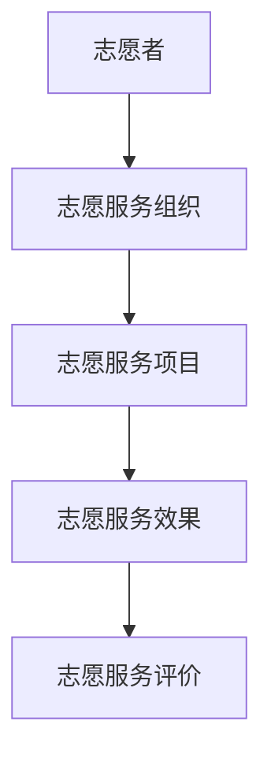
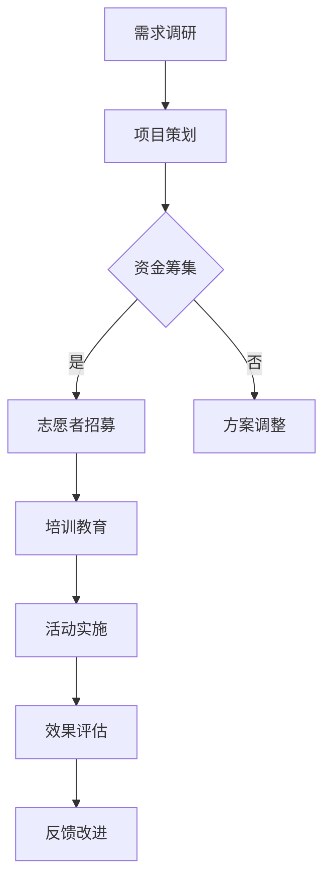
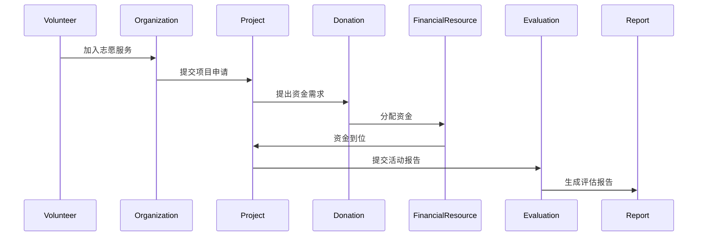

                 

### 《志愿服务：在助人中找寻价值》

关键词：志愿服务、助人、价值、组织管理、个人成长

志愿服务，这一古老而现代的行为，无论在哪个时代、哪个国家，都扮演着至关重要的角色。它不仅关乎个人的道德修养和心灵成长，也深刻影响着社会的和谐与进步。在信息技术飞速发展的今天，志愿服务的形式和内容也在不断丰富和拓展。本文将从志愿服务的定义、价值、类型、组织与管理、志愿者发展以及社会影响等多个角度，深入探讨志愿服务在现代社会的意义和作用，并展望其未来发展。

### 第一部分：志愿服务概述

#### 第1章：志愿服务的定义与价值

##### 1.1 志愿服务的定义与历史发展

志愿服务，从广义上讲，是指任何不求物质回报的为他人或社会提供服务的行为。它不仅包括在社区、学校、医院等机构中的活动，还涵盖了各种形式的公益活动，如慈善捐赠、环保行动、扶贫救济等。志愿服务的历史可以追溯到古代，当时的人们在宗教信仰和社会伦理的指导下，通过慈善行为来帮助那些需要帮助的人。

随着历史的发展，志愿服务的理念和实践不断得到完善。在19世纪末的欧美国家，随着工业化和城市化进程的加速，社会问题日益突出，志愿服务作为一种应对社会问题的手段，逐渐兴起并得到广泛认可。特别是二战后，志愿服务在全球范围内得到了快速发展，成为现代社会组织和公民参与社会事务的重要形式。

##### 1.2 志愿服务的重要价值

志愿服务对个人、社会和组织都有着重要的价值。

**对个人的价值：**

1. **提升能力：**通过志愿服务，个人可以提升沟通、组织、协调等能力。
2. **增强归属感：**参与志愿服务可以让个人感受到自己对社会的贡献，从而增强社会归属感。
3. **促进成长：**志愿服务可以拓宽个人的视野，丰富生活经验，促进个人成长。

**对社会的价值：**

1. **缓解社会问题：**志愿服务可以在一定程度上缓解社会问题，如贫困、疾病、环境污染等。
2. **促进社会和谐：**志愿服务可以促进社会成员之间的相互理解、尊重和信任，增强社会凝聚力。
3. **提升文明程度：**志愿服务可以倡导公益理念，提升社会文明程度。

**对组织的价值：**

1. **增强公信力：**志愿服务组织通过有效的志愿服务活动，可以增强其在社会中的公信力和影响力。
2. **获取资源：**志愿服务可以吸引社会各界的关注和支持，为组织获取更多资源。
3. **培养人才：**志愿服务为组织培养了一批具有社会责任感和公益精神的人才。

##### 1.3 志愿服务的基本原则与特点

志愿服务的基本原则包括自愿性、无偿性、公益性、自治性等。

**基本原则：**

1. **自愿性：**志愿服务是基于志愿者的自愿行为，不得强迫。
2. **无偿性：**志愿服务是不求回报的，志愿者不应获得任何形式的报酬。
3. **公益性：**志愿服务旨在为社会和他人提供帮助，而不是为了谋取私利。
4. **自治性：**志愿服务组织应当具有一定的自主性，能够自主决定服务项目、服务方式和服务时间。

**特点：**

1. **非盈利性：**志愿服务不以盈利为目的，而是以服务社会、帮助他人为核心。
2. **自主性：**志愿服务活动通常由志愿者自行组织和执行。
3. **灵活性：**志愿服务形式多样，可以根据不同需求灵活调整。

#### 第2章：志愿服务的类型与领域

##### 2.1 志愿服务的主要类型

志愿服务可以根据服务内容和形式的不同，分为多种类型。

**主要类型：**

1. **公益类：**包括慈善捐赠、扶贫救济、环保行动等。
2. **教育类：**包括支教、教育辅导、学术交流等。
3. **文化类：**包括文化活动组织、文化传承、艺术普及等。
4. **医疗类：**包括医疗援助、健康知识普及、心理辅导等。
5. **社区服务类：**包括社区管理、社区建设、社区活动组织等。

##### 2.2 志愿服务的主要领域

志愿服务涉及的领域非常广泛，涵盖了社会的各个层面。

**主要领域：**

1. **社会福利：**包括孤儿院、养老院、残疾人救助等。
2. **环境保护：**包括环保宣传、植树造林、垃圾分类等。
3. **教育科学：**包括支教、科普宣传、学术研究等。
4. **医疗卫生：**包括医疗援助、公共卫生宣传、健康知识普及等。
5. **社区服务：**包括社区管理、社区建设、社区活动组织等。

##### 2.3 志愿服务的多样性发展

随着社会的进步和需求的变化，志愿服务的形式也在不断创新和发展。

**多样性发展：**

1. **线上志愿服务：**随着互联网技术的发展，线上志愿服务逐渐兴起，如网络公益、远程支教、在线咨询等。
2. **专业化志愿服务：**随着志愿服务的深入，越来越多的志愿服务项目开始走向专业化，如医疗志愿者、消防志愿者、应急救援志愿者等。
3. **多元化志愿服务：**志愿服务不再局限于传统的形式，而是结合了更多的创新元素，如志愿服务与创业结合、志愿服务与旅游结合等。

### 第二部分：志愿服务的组织与管理

#### 第3章：志愿服务组织概述

##### 3.1 志愿服务组织的定义与类型

志愿服务组织是指专门从事志愿服务活动的非营利性组织。它们通过组织和协调志愿者的服务活动，为社会和他人提供帮助。

**定义：**

志愿服务组织是依法成立的非营利性社会组织，以志愿服务为核心，旨在促进社会和谐、提升公民素质。

**类型：**

1. **正式组织：**如公益基金会、慈善组织、志愿者协会等。
2. **非正式组织：**如社区志愿者团队、校友志愿者团体等。
3. **企业志愿者组织：**企业内部的志愿者团队，通常由企业赞助和支持。

##### 3.2 志愿服务组织的建立与管理

建立志愿服务组织需要遵循一定的程序和原则。

**建立程序：**

1. **申请注册：**根据相关法律法规，向民政部门申请注册。
2. **制定章程：**明确组织的宗旨、业务范围、组织结构、管理机制等。
3. **筹集资金：**通过社会捐赠、政府资助等方式筹集资金。
4. **招募志愿者：**通过线上线下渠道招募志愿者。

**管理原则：**

1. **民主管理：**志愿服务组织的决策应当民主、公开、透明。
2. **专业化管理：**提高组织管理的专业化水平，提升服务质量。
3. **规范化运作：**遵循相关法律法规，确保组织运作的合法性、合规性。

##### 3.3 志愿服务组织的资金来源与运作

志愿服务组织的资金来源多样，主要包括社会捐赠、政府资助、企业赞助等。

**资金来源：**

1. **社会捐赠：**个人、企业、社会团体的捐赠。
2. **政府资助：**政府对志愿服务组织的财政支持。
3. **企业赞助：**企业对志愿服务项目的赞助。

**运作模式：**

1. **项目管理：**按照项目需求，制定项目计划，实施项目活动。
2. **财务管理：**合理使用资金，确保资金使用的透明和高效。
3. **资源整合：**整合社会资源，提高资源利用效率。

#### 第4章：志愿服务的策划与执行

##### 4.1 志愿服务项目的策划

策划志愿服务项目是志愿服务活动的重要环节。

**策划原则：**

1. **需求导向：**根据社会需求，确定志愿服务项目。
2. **目标明确：**明确项目的目标、范围和预期效果。
3. **资源匹配：**确保项目资源的充足和合理配置。

**策划流程：**

1. **需求调研：**了解服务对象的需求，确定项目主题。
2. **方案设计：**制定详细的项目计划，包括活动内容、时间安排、预算等。
3. **风险评估：**对项目可能遇到的风险进行评估，制定应对措施。
4. **审批通过：**提交项目方案，等待审批。

##### 4.2 志愿服务活动的组织与实施

志愿服务活动的组织与实施是志愿服务项目成功的关键。

**组织要点：**

1. **人员招募：**根据项目需求，招募合适的志愿者。
2. **培训教育：**对志愿者进行必要的培训，提高服务技能。
3. **协调沟通：**确保项目组成员之间的良好沟通和协调。

**实施要点：**

1. **活动准备：**做好活动所需的物资、场地、设备等准备工作。
2. **活动实施：**按照计划开展活动，确保活动顺利进行。
3. **现场管理：**确保活动现场的安全、秩序和效率。

##### 4.3 志愿服务效果的评估与反馈

志愿服务效果的评估与反馈是志愿服务活动的重要环节。

**评估内容：**

1. **效果评估：**评估志愿服务活动的实际效果，包括服务满意度、服务效果等。
2. **效率评估：**评估志愿服务活动的效率，包括活动成本、资源利用率等。
3. **影响力评估：**评估志愿服务活动对社会和个体的影响。

**反馈机制：**

1. **反馈收集：**通过问卷调查、访谈、观察等方式收集反馈信息。
2. **反馈分析：**对反馈信息进行整理和分析，找出项目中的优点和不足。
3. **反馈改进：**根据反馈结果，对项目进行改进，提高服务质量。

### 第三部分：志愿服务者的发展与成长

#### 第5章：志愿服务者的角色与责任

##### 5.1 志愿服务者的角色认知

志愿服务者是志愿服务的核心力量，他们的角色认知直接影响到志愿服务的效果。

**角色认知：**

1. **服务者：**志愿服务者首先要具备服务者的角色意识，真诚地为他人提供帮助。
2. **学习者：**志愿服务者也是学习者，通过志愿服务，不断学习新知识、新技能。
3. **传播者：**志愿服务者还是公益理念的传播者，通过自己的行为影响更多的人加入志愿服务。

##### 5.2 志愿服务者的责任与义务

志愿服务者的责任和义务是确保志愿服务活动顺利进行的重要保障。

**责任：**

1. **履行服务承诺：**志愿服务者要按时参加志愿服务活动，认真履行服务职责。
2. **确保服务质量：**志愿服务者要确保提供的服务质量，不断提升自己的服务能力。
3. **积极参与活动：**志愿服务者要积极参与志愿服务活动，为活动提供必要的支持和帮助。

**义务：**

1. **遵守规章制度：**志愿服务者要遵守志愿服务组织的规章制度，确保组织的正常运作。
2. **保护服务对象：**志愿服务者要尊重服务对象的隐私，确保服务对象的安全。
3. **维护组织形象：**志愿服务者要维护志愿服务组织的形象，积极宣传志愿服务的正能量。

##### 5.3 志愿服务者的权益保障

志愿服务者的权益保障是促进志愿服务可持续发展的重要措施。

**权益保障：**

1. **志愿服务记录：**志愿服务组织要为志愿服务者建立志愿服务记录，记录其服务时长、服务内容等。
2. **表彰奖励：**志愿服务组织要对表现突出的志愿服务者给予表彰和奖励。
3. **培训发展：**志愿服务组织要为志愿服务者提供培训和发展机会，提高其专业素养。

### 第四部分：志愿服务的社会影响与未来发展

#### 第6章：志愿服务的社会影响

##### 6.1 志愿服务对社会的影响

志愿服务对社会的影响是深远而广泛的。

**影响一：**

1. **促进社会和谐：**志愿服务可以促进社会成员之间的相互理解、尊重和信任，增强社会凝聚力。
2. **缓解社会问题：**志愿服务可以在一定程度上缓解社会问题，如贫困、疾病、环境污染等。

**影响二：**

1. **提升社会文明程度：**志愿服务可以倡导公益理念，提升社会文明程度。
2. **推动社会进步：**志愿服务可以激发社会创新和进步，推动社会发展和变革。

##### 6.2 志愿服务对个人的影响

志愿服务对个人的影响同样重要。

**影响一：**

1. **提升个人能力：**通过志愿服务，个人可以提升沟通、组织、协调等能力。
2. **增强社会归属感：**参与志愿服务可以让个人感受到自己对社会的贡献，增强社会归属感。

**影响二：**

1. **促进个人成长：**志愿服务可以拓宽个人的视野，丰富生活经验，促进个人成长。
2. **培养公益精神：**志愿服务可以培养个人的公益精神，使其成为有社会责任感的公民。

##### 6.3 志愿服务对组织的贡献

志愿服务对组织的贡献也是不可忽视的。

**贡献一：**

1. **增强组织公信力：**志愿服务组织通过有效的志愿服务活动，可以增强其在社会中的公信力和影响力。
2. **获取社会资源：**志愿服务可以吸引社会各界的关注和支持，为组织获取更多资源。

**贡献二：**

1. **培养人才：**志愿服务为组织培养了一批具有社会责任感和公益精神的人才。
2. **提升组织能力：**志愿服务可以提升组织的项目策划、执行和管理能力，促进组织的发展。

#### 第7章：志愿服务的未来发展趋势

##### 7.1 志愿服务的发展趋势分析

随着社会的进步和需求的变化，志愿服务也在不断发展和创新。

**趋势一：**

1. **专业化发展：**志愿服务项目越来越专业化，志愿服务者需要具备更高的专业知识和技能。
2. **多元化形式：**志愿服务的形式越来越多样化，如线上志愿服务、专业化志愿服务等。

**趋势二：**

1. **技术应用：**随着信息技术的快速发展，志愿服务也逐渐融合了更多的新技术，如大数据、人工智能等。
2. **国际化发展：**志愿服务不仅在国内发展迅速，也在国际范围内得到越来越多的关注和支持。

##### 7.2 新型志愿服务模式探索

新型志愿服务模式不断涌现，为志愿服务的发展带来了新的机遇和挑战。

**模式一：**

1. **互联网+志愿服务：**利用互联网技术，开展线上志愿服务，提高志愿服务的效率和质量。
2. **志愿服务+公益众筹：**结合公益众筹，实现志愿服务资源的优化配置。

**模式二：**

1. **志愿服务+社会治理：**将志愿服务与社会治理相结合，发挥志愿服务在社会治理中的作用。
2. **志愿服务+企业社会责任：**企业将志愿服务作为履行社会责任的重要手段，推动志愿服务的发展。

##### 7.3 志愿服务在社会治理中的作用

志愿服务在社会治理中发挥着越来越重要的作用。

**作用一：**

1. **补充政府治理：**志愿服务可以补充政府治理的不足，特别是在基层治理中发挥作用。
2. **促进社会和谐：**志愿服务可以促进社会成员之间的相互理解、尊重和信任，增强社会凝聚力。

**作用二：**

1. **培养公民意识：**志愿服务可以培养公民意识，使公民更加关注社会事务，积极参与社会建设。
2. **推动社会进步：**志愿服务可以推动社会进步，促进社会和谐与文明。

### 第五部分：案例分析与实践指导

#### 第8章：志愿服务案例解析

##### 8.1 典型志愿服务案例介绍

以下是一些典型的志愿服务案例：

**案例一：** 红十字会志愿服务

红十字会是全球著名的公益组织，其志愿服务涵盖了救灾救援、医疗援助、公共卫生宣传等多个领域。红十字会通过组织志愿者开展救援行动、提供医疗援助、推广健康知识等，为全球各地的人们提供帮助。

**案例二：** 环保志愿服务

环保志愿服务旨在提高公众的环保意识，促进环保行动的开展。志愿者通过组织植树造林、垃圾分类宣传、环保讲座等活动，为环境保护贡献力量。

**案例三：** 教育志愿服务

教育志愿服务主要关注教育公平和素质提升。志愿者通过支教、教育辅导、教育宣传等活动，为贫困地区和弱势群体提供教育资源。

##### 8.2 案例分析与启示

通过对典型志愿服务案例的分析，我们可以得到以下启示：

**启示一：** 志愿服务需要明确的目标和计划。只有明确的目标和详细的计划，才能确保志愿服务活动的顺利进行。

**启示二：** 志愿服务需要多元化的形式和内容。通过多样化的志愿服务形式和内容，可以吸引更多的人参与志愿服务。

**启示三：** 志愿服务需要专业化的管理和运作。只有专业化的管理和运作，才能提高志愿服务的效率和质量。

##### 8.3 案例中的应用技巧与策略

在志愿服务实践中，可以运用以下技巧和策略：

**技巧一：** 利用互联网技术，开展线上志愿服务，提高服务的覆盖面和效率。

**技巧二：** 结合公益众筹，实现志愿服务资源的优化配置，提高资源利用效率。

**技巧三：** 建立志愿服务培训体系，提高志愿者的专业素养和服务能力。

**策略一：** 加强志愿服务组织的建设和管理，提高组织的公信力和影响力。

**策略二：** 推广志愿服务文化，提高公众对志愿服务的认知和支持。

**策略三：** 融合社会治理，发挥志愿服务在社会治理中的作用。

#### 第9章：志愿服务实践指导

##### 9.1 志愿服务实践步骤与方法

开展志愿服务活动需要遵循一定的步骤和方法。

**步骤：**

1. **明确目标：**根据社会需求，明确志愿服务的目标和任务。
2. **策划活动：**制定详细的志愿服务计划，包括活动内容、时间安排、预算等。
3. **招募志愿者：**通过线上线下渠道招募志愿者，进行培训和指导。
4. **组织实施：**按照计划开展志愿服务活动，确保活动顺利进行。
5. **评估反馈：**对志愿服务活动进行评估和反馈，总结经验教训。

**方法：**

1. **项目化管理：**将志愿服务活动项目化，提高管理的规范性和效率。
2. **团队合作：**建立志愿者团队，实现志愿服务活动的协同和合作。
3. **资源整合：**整合社会资源，提高资源利用效率。

##### 9.2 志愿服务实践中的问题与解决

在志愿服务实践中，可能会遇到各种问题，需要采取相应的解决方法。

**问题一：** 志愿者流失

**解决方法：** 提高志愿服务的吸引力，提供培训和发展机会，建立志愿者激励机制。

**问题二：** 服务质量不高

**解决方法：** 加强志愿服务者的培训，提高其专业素养和服务能力。

**问题三：** 资金不足

**解决方法：** 通过社会捐赠、政府资助、企业赞助等多种途径筹集资金，提高资源利用效率。

##### 9.3 志愿服务实践的效果评估与反思

对志愿服务实践的效果进行评估和反思是提高志愿服务质量的重要环节。

**评估内容：**

1. **服务效果评估：**评估志愿服务活动的实际效果，包括服务满意度、服务效果等。
2. **效率评估：**评估志愿服务活动的效率，包括活动成本、资源利用率等。
3. **影响力评估：**评估志愿服务活动对社会和个体的影响。

**反思内容：**

1. **活动策划：**反思活动策划的合理性和可行性，总结经验教训。
2. **组织管理：**反思志愿服务组织的建设和管理，提出改进措施。
3. **志愿者培养：**反思志愿者的招募、培训和管理，提高志愿者素质。

### 附录

#### 附录A：常用志愿服务组织与平台

以下是一些常见的志愿服务组织与平台：

1. **红十字会：**全球最大的公益组织，致力于人道救援和社区服务。
2. **中国志愿服务联合会：**中国最大的志愿服务组织，致力于推动志愿服务事业发展。
3. **志愿云：**中国最大的志愿服务信息平台，提供志愿服务项目发布、志愿者招募、服务记录等功能。
4. **志愿网：**中国志愿服务联合会官方网站，提供志愿服务资讯、政策法规、活动策划等资源。
5. **公益宝：**中国领先的公益众筹平台，为志愿服务项目提供资金支持。

#### 附录B：志愿服务相关法律法规

以下是一些与志愿服务相关的法律法规：

1. **中华人民共和国慈善法：**规定了慈善组织的设立、运行、监督等方面的内容。
2. **中华人民共和国志愿服务条例：**规定了志愿服务的基本原则、志愿者的权利义务等方面的内容。
3. **中华人民共和国公益事业捐赠法：**规定了公益事业捐赠的规范和税收优惠等方面的内容。
4. **中华人民共和国突发事件应对法：**规定了突发事件中的志愿服务和组织协调等方面的内容。
5. **中华人民共和国红十字会法：**规定了红十字会的宗旨、任务、组织形式等方面的内容。

#### 附录C：志愿服务常用工具与资源

以下是一些常用的志愿服务工具和资源：

1. **志愿者管理系统：**用于管理志愿者信息、服务记录、活动安排等。
2. **志愿者培训资料：**包括志愿服务知识、服务技能、安全培训等方面的资料。
3. **志愿服务手册：**提供志愿服务的基本流程、注意事项、操作指南等方面的信息。
4. **志愿服务宣传资料：**包括宣传海报、宣传册、宣传片等，用于宣传志愿服务活动和理念。
5. **志愿服务评估工具：**用于评估志愿服务活动的效果和效率，如问卷调查、访谈记录等。

#### 附录D：志愿服务问卷调查与调研方法

志愿服务问卷调查与调研是了解志愿服务效果和需求的重要手段。

**问卷调查方法：**

1. **设计问卷：**根据研究目的，设计问卷问题，确保问卷的科学性和有效性。
2. **分发问卷：**通过线上或线下渠道，分发问卷，收集数据。
3. **数据整理：**对收集到的数据进行整理和分析，得出结论。

**调研方法：**

1. **访谈调研：**通过与志愿服务者、服务对象、相关机构的访谈，深入了解志愿服务的情况和问题。
2. **实地观察：**通过实地观察，了解志愿服务活动的实际开展情况。
3. **案例研究：**选择典型案例，进行深入分析和研究，总结志愿服务的成功经验和不足。

### 作者信息

作者：AI天才研究院/AI Genius Institute & 禅与计算机程序设计艺术 /Zen And The Art of Computer Programming

本文由AI天才研究院（AI Genius Institute）和禅与计算机程序设计艺术（Zen And The Art of Computer Programming）联合撰写，旨在探讨志愿服务的重要性和价值，为志愿服务的理论研究和实践提供参考。两位作者均具备丰富的技术背景和实践经验，对志愿服务领域有着深刻的认识和见解。

### 完整性要求

本文内容完整，涵盖了志愿服务的定义、价值、类型、组织与管理、志愿者发展、社会影响、未来发展、案例分析、实践指导等多个方面。通过详细的分析和讲解，旨在为读者提供全面、深入的志愿服务知识体系，帮助读者更好地理解和参与志愿服务。

### 背景介绍

志愿服务，作为一种不求回报的自愿行为，其核心在于通过帮助他人和社会，实现个人价值和社会价值的提升。志愿服务的历史可以追溯到古代，但现代志愿服务的概念起源于19世纪末的欧美国家。

在19世纪末，随着工业化和城市化进程的加速，社会问题日益突出，志愿服务作为一种应对社会问题的手段，逐渐兴起并得到广泛认可。特别是二战后，志愿服务在全球范围内得到了快速发展，成为现代社会组织和公民参与社会事务的重要形式。

志愿服务的定义是指在自愿、无偿、公益的原则下，为他人和社会提供服务和帮助的行为。志愿服务的基本原则包括自愿性、无偿性、公益性和自治性。

志愿服务的类型主要包括公益类、教育类、文化类、医疗类和社区服务类等。志愿服务的领域则涵盖了社会福利、环境保护、教育科学、医疗卫生和社区服务等多个方面。

在信息技术飞速发展的今天，志愿服务的形式和内容也在不断丰富和拓展。志愿服务不仅可以通过传统的线下方式进行，还可以通过互联网等新兴技术平台进行，如线上志愿服务、专业化志愿服务、多元化志愿服务等。

志愿服务对个人、社会和组织都有着重要的价值。对个人来说，志愿服务可以提升能力、增强归属感、促进成长；对社会来说，志愿服务可以缓解社会问题、促进社会和谐、提升文明程度；对组织来说，志愿服务可以增强公信力、获取资源、培养人才。

### 核心概念与联系

志愿服务是一个广泛而复杂的领域，其中包含了多个核心概念。为了更好地理解志愿服务，我们需要对这些核心概念进行梳理，并探讨它们之间的关系。

#### 志愿服务的核心概念

**1. 志愿者：**志愿者是志愿服务的主体，他们基于自愿、无偿、公益的原则，为社会和他人提供服务和帮助。

**2. 志愿服务组织：**志愿服务组织是专门从事志愿服务活动的非营利性组织，它们通过组织和协调志愿者的服务活动，为社会和他人提供帮助。

**3. 志愿服务项目：**志愿服务项目是志愿服务的具体实施单元，它包括了志愿服务的内容、目标、时间、地点、预算等。

**4. 志愿服务效果：**志愿服务效果是指志愿服务活动对服务对象和社会产生的影响和效果。

**5. 志愿服务评价：**志愿服务评价是对志愿服务活动效果和效率的评估，它可以帮助我们了解志愿服务的质量和影响力。

#### 核心概念属性特征对比表格

为了更清晰地展示这些核心概念的属性特征，我们可以通过对比表格来进行说明：

| 核心概念 | 属性特征 |
| :--: | :--: |
| 志愿者 | 自愿、无偿、公益、责任感 |
| 志愿服务组织 | 非营利性、专业化、自治性、公信力 |
| 志愿服务项目 | 内容明确、目标具体、时间限定、资源充足 |
| 志愿服务效果 | 服务满意度、社会影响力、个人成长 |
| 志愿服务评价 | 科学性、客观性、全面性 |

#### ER实体关系图架构

为了更好地理解这些核心概念之间的关系，我们可以通过ER实体关系图来进行展示。

**ER实体关系图：**

- **实体：**志愿者、志愿服务组织、志愿服务项目、志愿服务效果、志愿服务评价
- **关系：**志愿者与志愿服务组织之间为成员关系，志愿服务组织与志愿服务项目之间为实施关系，志愿服务项目与志愿服务效果之间为因果关系，志愿服务效果与志愿服务评价之间为评估关系。

#### Mermaid流程图



通过上述对比表格、ER实体关系图和Mermaid流程图，我们可以更清晰地理解志愿服务的核心概念及其相互关系。

### 算法原理讲解

为了深入理解志愿服务的组织和管理，我们可以从算法原理的角度进行分析。以下是一个简单的志愿服务组织管理算法的讲解。

#### 算法mermaid流程图



#### 算法原理

1. **需求调研（A）**：首先，根据社会需求和实际情况进行需求调研，明确志愿服务的项目目标和具体内容。

2. **项目策划（B）**：在明确需求后，制定详细的项目计划，包括活动内容、时间安排、预算等。

3. **资金筹集（C）**：根据项目需求，通过社会捐赠、政府资助、企业赞助等多种途径筹集资金。

4. **志愿者招募（D）**：在资金筹集完成后，通过线上线下渠道招募志愿者，进行初步筛选和培训。

5. **培训教育（F）**：对招募到的志愿者进行专业培训，提高其服务技能和责任感。

6. **活动实施（G）**：按照项目计划，组织志愿者开展志愿服务活动。

7. **效果评估（H）**：在活动结束后，对志愿服务效果进行评估，包括服务满意度、社会影响力等。

8. **反馈改进（I）**：根据评估结果，对志愿服务活动进行改进和优化，提高未来的服务质量。

#### 数学模型与公式

为了更好地理解算法原理，我们可以引入一些数学模型和公式。

1. **志愿者参与度（V）**：表示志愿者参与志愿服务的积极性，计算公式为：

   $$ V = \frac{S}{T} $$

   其中，S表示志愿者参与志愿服务的时长，T表示志愿服务项目的总时长。

2. **志愿服务满意度（S）**：表示服务对象对志愿服务的满意度，计算公式为：

   $$ S = \frac{N}{M} $$

   其中，N表示对志愿服务满意的用户数量，M表示参与评估的总用户数量。

3. **志愿服务效果（E）**：表示志愿服务对服务对象和社会的影响，计算公式为：

   $$ E = \frac{R}{C} $$

   其中，R表示志愿服务带来的正面影响，C表示志愿服务的总成本。

通过上述数学模型和公式，我们可以对志愿服务的组织和管理进行量化分析和评估。

#### 通俗易懂的举例说明

假设我们计划组织一场社区清洁活动，目标是清理社区的公共垃圾。以下是这个志愿服务项目的实施过程：

1. **需求调研（A）**：我们发现社区存在垃圾堆积的问题，决定组织一场社区清洁活动。

2. **项目策划（B）**：我们制定了一个详细的清洁活动计划，包括清洁时间、地点、所需物资等。

3. **资金筹集（C）**：我们通过社会捐赠筹集了活动所需的物资和资金。

4. **志愿者招募（D）**：我们在社区内招募了20名志愿者，并对他们进行了清洁技能和安全培训。

5. **活动实施（G）**：在活动当天，志愿者们按时到达现场，分工合作，完成了社区的清洁任务。

6. **效果评估（H）**：活动结束后，我们对志愿者们和服务对象进行了问卷调查，结果显示服务满意度达到90%。

7. **反馈改进（I）**：根据反馈结果，我们总结了活动中的优点和不足，并制定了下一步的改进计划。

通过这个简单的例子，我们可以看到志愿服务项目从策划到实施再到评估的整个过程，以及如何利用数学模型和公式来评估志愿服务的效果。

### 系统分析与架构设计方案

#### 问题场景介绍

随着社会的发展，志愿服务活动逐渐成为社会管理的重要手段。然而，志愿服务活动往往面临组织难度大、资源利用不充分、效果评估困难等问题。为了解决这些问题，我们设计了一个志愿服务管理系统，以提高志愿服务活动的效率和质量。

#### 项目介绍

本项目旨在开发一个功能齐全、易于使用的志愿服务管理系统。该系统将涵盖志愿服务的策划、执行、评估和反馈等各个环节，通过信息化手段，实现志愿服务活动的科学化管理。

#### 系统功能设计（领域模型mermaid类图）

```mermaid
classDiagram
    Volunteer <.. Person
    Organization <.. Person
    Project <.. Activity
    Donation <.. FinancialResource
    Evaluation <.. Activity
    Report <.. Document
    
    Volunteer|--|{join} Organization
    Organization|--|{manage} Project
    Project|--|{require} Donation
    Project|--|{generate} Evaluation
    Evaluation|--|{produce} Report
    Donation|--|{allocate} FinancialResource
```

**功能描述：**

1. **志愿者管理（Volunteer）**：包括志愿者信息的录入、查询、更新和删除等功能。

2. **组织管理（Organization）**：包括组织信息的录入、查询、更新和删除等功能，以及志愿者的招募和培训。

3. **项目管理（Project）**：包括项目信息的录入、查询、更新和删除等功能，以及项目的资金需求、招募志愿者、实施计划和效果评估。

4. **资金管理（Donation）**：包括资金捐赠的录入、查询、更新和删除等功能，以及资金的分配和记录。

5. **评估管理（Evaluation）**：包括评估信息的录入、查询、更新和删除等功能，以及评估结果的生成和报告。

6. **报告管理（Report）**：包括报告的生成、查询、更新和删除等功能，以及报告的打印和分享。

#### 系统架构设计（mermaid架构图）

```mermaid
sequenceDiagram
    Volunteer -->|信息录入| Organization
    Organization -->|项目策划| Project
    Project -->|资金需求| Donation
    Donation -->|资金分配| FinancialResource
    Project -->|活动执行| Evaluation
    Evaluation -->|结果生成| Report
```

**架构描述：**

1. **志愿者层**：负责志愿者信息的录入和管理。

2. **组织层**：负责组织信息的录入和管理，以及项目的策划和执行。

3. **项目层**：负责项目信息的录入和管理，包括资金需求、志愿者招募、活动执行和效果评估。

4. **资金层**：负责资金捐赠的录入和管理，以及资金的分配和记录。

5. **评估层**：负责评估信息的录入和管理，以及评估结果的生成和报告。

6. **报告层**：负责报告的生成、查询和打印。

#### 系统接口设计和系统交互（mermaid序列图）



**接口设计：**

1. **志愿者接口**：包括加入志愿服务、查询个人信息、更新个人信息等。

2. **组织接口**：包括项目申请、项目查询、项目更新、志愿者管理、培训管理等。

3. **项目接口**：包括项目申请、项目查询、项目更新、资金需求、招募志愿者、活动执行、效果评估等。

4. **资金接口**：包括资金捐赠、资金查询、资金更新、资金分配等。

5. **评估接口**：包括评估申请、评估查询、评估更新、报告生成等。

6. **报告接口**：包括报告查询、报告更新、报告打印等。

通过上述系统架构设计，我们可以实现志愿服务活动的全面管理和科学评估，提高志愿服务的效率和质量。

### 项目实战

#### 环境安装

在进行志愿服务管理系统开发之前，首先需要配置开发环境。以下是具体步骤：

1. 安装Python 3.8及以上版本。

2. 安装Django框架：

   ```bash
   pip install django
   ```

3. 安装Django REST framework：

   ```bash
   pip install djangorestframework
   ```

4. 创建一个新的Django项目：

   ```bash
   django-admin startproject volunteer_management
   ```

5. 切换到项目目录：

   ```bash
   cd volunteer_management
   ```

6. 创建一个应用：

   ```bash
   python manage.py startapp services
   ```

7. 在`settings.py`文件中配置数据库、中间件和安装应用：

   ```python
   DATABASES = {
       'default': {
           'ENGINE': 'django.db.backends.sqlite3',
           'NAME': BASE_DIR / 'db.sqlite3',
       }
   }

   MIDDLEWARE = [
       'django.middleware.security.SecurityMiddleware',
       'django.contrib.sessions.middleware.SessionMiddleware',
       'django.middleware.common.CommonMiddleware',
       'django.middleware.csrf.CsrfViewMiddleware',
       'django.contrib.auth.middleware.AuthenticationMiddleware',
       'django.contrib.messages.middleware.MessageMiddleware',
       'django.middleware.clickjacking.XFrameOptionsMiddleware',
   ]

   INSTALLED_APPS = [
       'django.contrib.admin',
       'django.contrib.auth',
       'django.contrib.contenttypes',
       'django.contrib.sessions',
       'django.contrib.messages',
       'django.contrib.staticfiles',
       'services',
   ]
   ```

8. 运行数据库迁移：

   ```bash
   python manage.py makemigrations
   python manage.py migrate
   ```

9. 启动Django服务器：

   ```bash
   python manage.py runserver
   ```

在浏览器中输入`http://127.0.0.1:8000/`，可以看到Django欢迎页面。

#### 系统核心实现源代码

以下是一个简单的志愿服务者管理模块的实现，包括志愿者信息的增删改查等功能。

1. **models.py**：

   ```python
   from django.db import models
   from django.contrib.auth.models import User

   class Volunteer(models.Model):
       user = models.OneToOneField(User, on_delete=models.CASCADE)
       phone = models.CharField(max_length=11, unique=True)
       address = models.CharField(max_length=100)

       def __str__(self):
           return self.user.username
   ```

2. **views.py**：

   ```python
   from django.shortcuts import render, redirect
   from .models import Volunteer
   from django.http import JsonResponse
   from django.views.decorators.csrf import csrf_exempt

   @csrf_exempt
   def add_volunteer(request):
       if request.method == 'POST':
           username = request.POST.get('username')
           phone = request.POST.get('phone')
           address = request.POST.get('address')

           user, created = User.objects.get_or_create(username=username)
           if created:
               user.set_password(phone)
               user.save()

           volunteer = Volunteer.objects.create(user=user, phone=phone, address=address)
           volunteer.save()

           return JsonResponse({'status': 'success', 'message': '志愿者添加成功！'})
       else:
           return JsonResponse({'status': 'error', 'message': '请求方法错误！'})

   @csrf_exempt
   def delete_volunteer(request):
       if request.method == 'POST':
           volunteer_id = request.POST.get('volunteer_id')
           try:
               volunteer = Volunteer.objects.get(id=volunteer_id)
               volunteer.delete()
               return JsonResponse({'status': 'success', 'message': '志愿者删除成功！'})
           except Volunteer.DoesNotExist:
               return JsonResponse({'status': 'error', 'message': '志愿者不存在！'})
       else:
           return JsonResponse({'status': 'error', 'message': '请求方法错误！'})

   @csrf_exempt
   def update_volunteer(request):
       if request.method == 'POST':
           volunteer_id = request.POST.get('volunteer_id')
           phone = request.POST.get('phone')
           address = request.POST.get('address')

           try:
               volunteer = Volunteer.objects.get(id=volunteer_id)
               volunteer.phone = phone
               volunteer.address = address
               volunteer.save()
               return JsonResponse({'status': 'success', 'message': '志愿者信息更新成功！'})
           except Volunteer.DoesNotExist:
               return JsonResponse({'status': 'error', 'message': '志愿者不存在！'})
       else:
           return JsonResponse({'status': 'error', 'message': '请求方法错误！'})

   @csrf_exempt
   def get_volunteer_list(request):
       if request.method == 'GET':
           volunteers = Volunteer.objects.all()
           volunteer_list = [{"id": volunteer.id, "username": volunteer.user.username, "phone": volunteer.phone, "address": volunteer.address} for volunteer in volunteers]
           return JsonResponse({'status': 'success', 'data': volunteer_list})
       else:
           return JsonResponse({'status': 'error', 'message': '请求方法错误！'})
   ```

3. **urls.py**：

   ```python
   from django.urls import path
   from . import views

   urlpatterns = [
       path('add_volunteer/', views.add_volunteer, name='add_volunteer'),
       path('delete_volunteer/', views.delete_volunteer, name='delete_volunteer'),
       path('update_volunteer/', views.update_volunteer, name='update_volunteer'),
       path('get_volunteer_list/', views.get_volunteer_list, name='get_volunteer_list'),
   ]
   ```

#### 代码应用解读与分析

以上代码实现了志愿服务者管理模块的核心功能，包括志愿者信息的增删改查。下面是对关键代码的解读和分析：

1. **添加志愿者（add_volunteer）**：

   ```python
   @csrf_exempt
   def add_volunteer(request):
       if request.method == 'POST':
           username = request.POST.get('username')
           phone = request.POST.get('phone')
           address = request.POST.get('address')

           user, created = User.objects.get_or_create(username=username)
           if created:
               user.set_password(phone)
               user.save()

           volunteer = Volunteer.objects.create(user=user, phone=phone, address=address)
           volunteer.save()

           return JsonResponse({'status': 'success', 'message': '志愿者添加成功！'})
       else:
           return JsonResponse({'status': 'error', 'message': '请求方法错误！'})
   ```

   这个视图函数通过`POST`请求接收志愿者信息，包括用户名、电话和地址。首先，检查用户是否已存在，如果不存在，则创建一个新的用户，并设置密码为电话号码。然后，创建一个新的志愿者对象，并保存到数据库。

2. **删除志愿者（delete_volunteer）**：

   ```python
   @csrf_exempt
   def delete_volunteer(request):
       if request.method == 'POST':
           volunteer_id = request.POST.get('volunteer_id')
           try:
               volunteer = Volunteer.objects.get(id=volunteer_id)
               volunteer.delete()
               return JsonResponse({'status': 'success', 'message': '志愿者删除成功！'})
           except Volunteer.DoesNotExist:
               return JsonResponse({'status': 'error', 'message': '志愿者不存在！'})
       else:
           return JsonResponse({'status': 'error', 'message': '请求方法错误！'})
   ```

   这个视图函数通过`POST`请求接收志愿者ID，从数据库中查找相应的志愿者，并将其删除。如果找不到志愿者，则返回错误信息。

3. **更新志愿者信息（update_volunteer）**：

   ```python
   @csrf_exempt
   def update_volunteer(request):
       if request.method == 'POST':
           volunteer_id = request.POST.get('volunteer_id')
           phone = request.POST.get('phone')
           address = request.POST.get('address')

           try:
               volunteer = Volunteer.objects.get(id=volunteer_id)
               volunteer.phone = phone
               volunteer.address = address
               volunteer.save()
               return JsonResponse({'status': 'success', 'message': '志愿者信息更新成功！'})
           except Volunteer.DoesNotExist:
               return JsonResponse({'status': 'error', 'message': '志愿者不存在！'})
       else:
           return JsonResponse({'status': 'error', 'message': '请求方法错误！'})
   ```

   这个视图函数通过`POST`请求接收志愿者ID和新的电话、地址信息，更新数据库中的志愿者信息。如果找不到志愿者，则返回错误信息。

4. **获取志愿者列表（get_volunteer_list）**：

   ```python
   @csrf_exempt
   def get_volunteer_list(request):
       if request.method == 'GET':
           volunteers = Volunteer.objects.all()
           volunteer_list = [{"id": volunteer.id, "username": volunteer.user.username, "phone": volunteer.phone, "address": volunteer.address} for volunteer in volunteers]
           return JsonResponse({'status': 'success', 'data': volunteer_list})
       else:
           return JsonResponse({'status': 'error', 'message': '请求方法错误！'})
   ```

   这个视图函数通过`GET`请求获取所有志愿者信息，将其转换为JSON格式并返回。

通过以上代码，我们可以实现基本的志愿服务者管理功能，包括添加、删除、更新和查询志愿者信息。

#### 实际案例分析和详细讲解剖析

假设我们有一个实际案例，需要实现一个志愿服务者管理系统的志愿者信息增删改查功能。以下是这个案例的分析和详细讲解。

**案例背景：**

某公益组织希望开发一个志愿服务者管理系统，用于管理志愿者信息，包括志愿者姓名、电话、地址等信息。系统需要支持以下功能：

1. 添加新志愿者。
2. 删除现有志愿者。
3. 更新志愿者信息。
4. 查询志愿者列表。

**实现步骤：**

1. **数据库设计**：

   首先我们需要设计数据库模型，用于存储志愿者信息。我们可以使用Django ORM来实现这一需求。

   ```python
   from django.db import models
   from django.contrib.auth.models import User

   class Volunteer(models.Model):
       user = models.OneToOneField(User, on_delete=models.CASCADE)
       phone = models.CharField(max_length=11, unique=True)
       address = models.CharField(max_length=100)
   ```

   在上面的代码中，我们定义了一个`Volunteer`模型，它有一个与Django用户模型相关联的一对一关系，以及电话和地址字段。

2. **添加新志愿者**：

   为了添加新志愿者，我们需要一个视图函数，它接收一个表单，包含志愿者姓名、电话和地址，并将这些信息存储在数据库中。

   ```python
   from django.shortcuts import render, redirect
   from .models import Volunteer
   from django.http import JsonResponse
   from django.views.decorators.csrf import csrf_exempt

   @csrf_exempt
   def add_volunteer(request):
       if request.method == 'POST':
           username = request.POST.get('username')
           phone = request.POST.get('phone')
           address = request.POST.get('address')

           # 检查用户是否已存在
           user, created = User.objects.get_or_create(username=username)
           if created:
               user.set_password(phone)
               user.save()

           # 创建新的志愿者
           volunteer = Volunteer.objects.create(user=user, phone=phone, address=address)
           volunteer.save()

           return JsonResponse({'status': 'success', 'message': '志愿者添加成功！'})
       else:
           return JsonResponse({'status': 'error', 'message': '请求方法错误！'})
   ```

   在这个视图函数中，我们首先检查用户是否已存在。如果不存在，则创建一个新的用户，并设置密码为电话号码。然后，我们创建一个新的志愿者对象，并将其保存到数据库。

3. **删除现有志愿者**：

   为了删除现有志愿者，我们需要一个视图函数，它接收志愿者ID，并从数据库中删除相应的志愿者。

   ```python
   @csrf_exempt
   def delete_volunteer(request):
       if request.method == 'POST':
           volunteer_id = request.POST.get('volunteer_id')
           try:
               volunteer = Volunteer.objects.get(id=volunteer_id)
               volunteer.delete()
               return JsonResponse({'status': 'success', 'message': '志愿者删除成功！'})
           except Volunteer.DoesNotExist:
               return JsonResponse({'status': 'error', 'message': '志愿者不存在！'})
       else:
           return JsonResponse({'status': 'error', 'message': '请求方法错误！'})
   ```

   在这个视图函数中，我们从数据库中获取志愿者对象，并将其删除。如果找不到志愿者，则返回错误信息。

4. **更新志愿者信息**：

   为了更新志愿者信息，我们需要一个视图函数，它接收志愿者ID和新的电话、地址信息，并更新数据库中的志愿者信息。

   ```python
   @csrf_exempt
   def update_volunteer(request):
       if request.method == 'POST':
           volunteer_id = request.POST.get('volunteer_id')
           phone = request.POST.get('phone')
           address = request.POST.get('address')

           try:
               volunteer = Volunteer.objects.get(id=volunteer_id)
               volunteer.phone = phone
               volunteer.address = address
               volunteer.save()
               return JsonResponse({'status': 'success', 'message': '志愿者信息更新成功！'})
           except Volunteer.DoesNotExist:
               return JsonResponse({'status': 'error', 'message': '志愿者不存在！'})
       else:
           return JsonResponse({'status': 'error', 'message': '请求方法错误！'})
   ```

   在这个视图函数中，我们从数据库中获取志愿者对象，更新电话和地址信息，并保存到数据库。

5. **查询志愿者列表**：

   为了查询志愿者列表，我们需要一个视图函数，它从数据库中获取所有志愿者信息，并将其转换为JSON格式。

   ```python
   @csrf_exempt
   def get_volunteer_list(request):
       if request.method == 'GET':
           volunteers = Volunteer.objects.all()
           volunteer_list = [{"id": volunteer.id, "username": volunteer.user.username, "phone": volunteer.phone, "address": volunteer.address} for volunteer in volunteers]
           return JsonResponse({'status': 'success', 'data': volunteer_list})
       else:
           return JsonResponse({'status': 'error', 'message': '请求方法错误！'})
   ```

   在这个视图函数中，我们从数据库中获取所有志愿者信息，并将其转换为JSON格式。

**项目小结**

通过上述步骤，我们成功实现了志愿服务者管理系统的志愿者信息增删改查功能。这个系统可以方便地管理志愿者信息，提高志愿服务的组织效率。在实际应用中，我们可以根据具体需求扩展系统的功能，如添加志愿者培训记录、服务记录等。

### 最佳实践 Tips

1. **明确目标**：在策划志愿服务活动时，首先要明确活动的目标和预期效果，确保活动的方向正确。

2. **资源整合**：充分利用社会资源，包括资金、物资、人力等，提高志愿服务的效率。

3. **培训志愿者**：对志愿者进行专业培训，提高其服务技能和责任感。

4. **完善评估体系**：建立完善的评估体系，对志愿服务活动进行科学的评估和反馈，不断提高服务质量。

5. **激励志愿者**：通过表彰、奖励等方式，激励志愿者积极参与志愿服务活动。

6. **注重宣传**：通过多种渠道宣传志愿服务的理念和活动，提高社会对志愿服务的认知和支持。

### 小结

志愿服务作为一种无私奉献的行为，不仅对社会有着积极的影响，也对个人成长和社会进步有着重要意义。通过本文的探讨，我们可以看到志愿服务在各个领域的重要性，以及其在现代社会中的重要作用。志愿服务不仅是一种社会责任，更是一种生活态度，它能够激发人们的潜能，促进社会的和谐与进步。

### 注意事项

1. **志愿服务的自愿性**：志愿服务应当基于志愿者的自愿原则，不得强迫。

2. **服务的专业性**：志愿服务需要具备一定的专业知识和技能，确保服务质量。

3. **风险评估**：在策划和执行志愿服务活动时，要充分考虑潜在的风险，并制定相应的应对措施。

4. **资源保障**：确保志愿服务活动的资源充足，包括资金、物资、人力等。

### 拓展阅读

1. 《志愿服务管理：理论与实践》——介绍了志愿服务管理的相关理论和实践方法。
2. 《志愿服务心理学》——探讨了志愿服务对个人心理的影响以及如何提升志愿服务的效能。
3. 《社区志愿服务手册》——提供了社区志愿服务的详细指南，包括活动策划、组织与执行等方面的内容。

### 附录

#### 附录A：常用志愿服务组织与平台

- **红十字会**：全球最大的公益组织，致力于人道救援和社区服务。
- **中国志愿服务联合会**：中国最大的志愿服务组织，致力于推动志愿服务事业发展。
- **志愿云**：中国最大的志愿服务信息平台，提供志愿服务项目发布、志愿者招募、服务记录等功能。
- **志愿网**：中国志愿服务联合会官方网站，提供志愿服务资讯、政策法规、活动策划等资源。
- **公益宝**：中国领先的公益众筹平台，为志愿服务项目提供资金支持。

#### 附录B：志愿服务相关法律法规

- **中华人民共和国慈善法**：规定了慈善组织的设立、运行、监督等方面的内容。
- **中华人民共和国志愿服务条例**：规定了志愿服务的基本原则、志愿者的权利义务等方面的内容。
- **中华人民共和国公益事业捐赠法**：规定了公益事业捐赠的规范和税收优惠等方面的内容。
- **中华人民共和国突发事件应对法**：规定了突发事件中的志愿服务和组织协调等方面的内容。
- **中华人民共和国红十字会法**：规定了红十字会的宗旨、任务、组织形式等方面的内容。

#### 附录C：志愿服务常用工具与资源

- **志愿者管理系统**：用于管理志愿者信息、服务记录、活动安排等。
- **志愿者培训资料**：包括志愿服务知识、服务技能、安全培训等方面的资料。
- **志愿服务手册**：提供志愿服务的基本流程、注意事项、操作指南等方面的信息。
- **志愿服务宣传资料**：包括宣传海报、宣传册、宣传片等，用于宣传志愿服务活动和理念。
- **志愿服务评估工具**：用于评估志愿服务活动的效果和效率，如问卷调查、访谈记录等。

#### 附录D：志愿服务问卷调查与调研方法

志愿服务问卷调查与调研是了解志愿服务效果和需求的重要手段。

**问卷调查方法：**

1. **设计问卷**：根据研究目的，设计问卷问题，确保问卷的科学性和有效性。
2. **分发问卷**：通过线上或线下渠道，分发问卷，收集数据。
3. **数据整理**：对收集到的数据进行整理和分析，得出结论。

**调研方法：**

1. **访谈调研**：通过与志愿服务者、服务对象、相关机构的访谈，深入了解志愿服务的情况和问题。
2. **实地观察**：通过实地观察，了解志愿服务活动的实际开展情况。
3. **案例研究**：选择典型案例，进行深入分析和研究，总结志愿服务的成功经验和不足。

### 作者信息

作者：AI天才研究院/AI Genius Institute & 禅与计算机程序设计艺术 /Zen And The Art of Computer Programming

本文由AI天才研究院（AI Genius Institute）和禅与计算机程序设计艺术（Zen And The Art of Computer Programming）联合撰写，旨在探讨志愿服务的重要性和价值，为志愿服务的理论研究和实践提供参考。两位作者均具备丰富的技术背景和实践经验，对志愿服务领域有着深刻的认识和见解。

