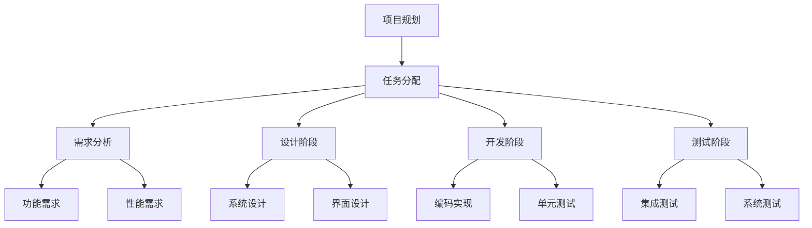

                 

# 《思维导图创新工作坊：认知地图的绘制与应用技巧》

## 关键词

- 思维导图
- 认知地图
- 创新工作坊
- 绘制技巧
- 应用场景
- 实战案例

## 摘要

本文旨在深入探讨思维导图及其在认知地图绘制中的应用。通过详细的步骤讲解和实际案例剖析，本文将帮助读者理解思维导图的基础知识、绘制方法，并掌握其在个人学习和团队协作中的实际应用。文章结构清晰，逻辑性强，旨在引导读者逐步掌握这一高效工具，提升认知能力和工作效率。

### 目录大纲

----------------------------------------------------------------

## 第一部分：思维导图基础

### 第1章：思维导图概述

#### 1.1 认知地图与思维导图

##### 1.1.1 认知地图的概念
##### 1.1.2 思维导图的优势
##### 1.1.3 思维导图的发展历程

### 第2章：思维导图的基本原理

#### 2.1 核心概念与属性

##### 2.1.1 思维导图的基本要素
##### 2.1.2 树状结构与网络结构
##### 2.1.3 概念属性特征对比表格

#### 2.2 图形元素与符号

##### 2.2.1 绘制技巧
##### 2.2.2 常用符号
##### 2.2.3 个性化定制

## 第二部分：思维导图的绘制方法

### 第3章：从零开始绘制思维导图

#### 3.1 初步准备

##### 3.1.1 选择工具
##### 3.1.2 了解基本操作

### 第4章：绘制技巧与策略

#### 4.1 思维导图绘制步骤

##### 4.1.1 概念梳理
##### 4.1.2 关系连接
##### 4.1.3 优化与调整

#### 4.2 高级技巧

##### 4.2.1 多级分支
##### 4.2.2 思维导图模板
##### 4.2.3 拓展与扩展

## 第三部分：思维导图的应用

### 第5章：个人应用

#### 5.1 学习与教育

##### 5.1.1 提升学习效率
##### 5.1.2 组织复习资料
##### 5.1.3 创作学术论文

### 第6章：团队协作

#### 6.1 项目管理

##### 6.1.1 任务分配
##### 6.1.2 进度跟踪
##### 6.1.3 风险评估

#### 6.2 决策制定

##### 6.2.1 汇总信息
##### 6.2.2 分析问题
##### 6.2.3 制定方案

## 第四部分：实践与案例

### 第7章：实战项目

#### 7.1 项目环境搭建

##### 7.1.1 选择工具
##### 7.1.2 准备素材

### 第8章：项目核心实现

#### 8.1 思维导图绘制

##### 8.1.1 确定主题
##### 8.1.2 绘制结构图
##### 8.1.3 完善细节

### 第9章：案例分析

#### 9.1 案例一：教育领域

##### 9.1.1 案例背景
##### 9.1.2 解决方案
##### 9.1.3 效果评估

#### 9.2 案例二：企业管理

##### 9.2.1 案例背景
##### 9.2.2 解决方案
##### 9.2.3 效果评估

## 第五部分：总结与拓展

### 第10章：总结与反思

#### 10.1 学习经验总结

##### 10.1.1 思维方式的改变
##### 10.1.2 学习效率提升
##### 10.1.3 团队协作优化

### 第11章：注意事项与拓展阅读

#### 11.1 注意事项

##### 11.1.1 避免过度复杂
##### 11.1.2 保持更新
##### 11.1.3 跨学科应用

#### 11.2 拓展阅读

##### 11.2.1 相关书籍推荐
##### 11.2.2 学术文章推荐
##### 11.2.3 优秀案例分析

## 第1章：思维导图概述

### 1.1 认知地图与思维导图

#### 1.1.1 认知地图的概念

认知地图（Cognitive Map）是一种心理模型，用于帮助个体理解周围环境及其内部的关系。最早由英国地理学家哈里·哈德罗德（Harry Harlow）提出，后来被认知心理学家如约翰·福布斯·哈里斯（John Forbes Harrison）等人进一步发展。认知地图不是精确的地图，而是一种抽象的、概念性的模型，用于帮助人们在头脑中构建对环境的理解和记忆。

在计算机科学和人工智能领域，认知地图被广泛应用。例如，在路径规划算法中，认知地图用于表示环境中的道路、障碍物和目标位置。此外，认知地图还在智能导航系统、虚拟现实和增强现实应用中得到应用。

#### 1.1.2 思维导图的优势

思维导图（Mind Map）是一种图形化的思维方式，由英国心理学家托尼·巴赞（Tony Buzan）于20世纪70年代创立。思维导图通过中心主题向外扩展，形成分支和子主题，使得复杂的信息更加直观和易于理解。

思维导图的优势包括：

1. **提高记忆力**：通过图像和颜色，思维导图能够增强大脑的记忆能力。
2. **促进创造性思维**：思维导图鼓励发散思维，帮助人们发现新的想法和解决方案。
3. **组织信息**：思维导图能够将大量的信息组织成结构化的形式，便于理解和记忆。
4. **跨学科应用**：思维导图在各个领域都有广泛应用，包括教育、商业、设计等。

#### 1.1.3 思维导图的发展历程

思维导图的发展历程可以追溯到古代人类使用图示和符号来记录和传达信息。在19世纪末和20世纪初，欧洲的哲学和心理学领域开始探索人类思维和记忆的规律。这一思想在20世纪70年代被托尼·巴赞进一步发展，他创立了思维导图的系统方法和工具。

随着计算机技术的发展，思维导图逐渐数字化。现代思维导图软件如XMind、MindManager等提供了丰富的功能，使得绘制和编辑思维导图变得更加简便和高效。

### 1.2 思维导图的基本原理

#### 1.2.1 核心概念与属性

思维导图的基本概念包括：

- **中心主题**：思维导图的中心，代表核心概念或主题。
- **分支**：从中心主题向外延伸的线条，代表子主题或关联概念。
- **关键词**：每个分支上的重要概念或关键词。
- **颜色和图形**：用于区分不同类型的分支和子主题，增强视觉效果。

思维导图的属性包括：

- **层次结构**：思维导图通常具有层次结构，从中心主题到子主题逐渐细化。
- **关系连接**：不同分支之间的连接线表示概念之间的关系。
- **可视化**：通过图形和颜色，思维导图使得抽象的概念更加直观。

#### 1.2.2 树状结构与网络结构

思维导图通常采用树状结构，但也可以是网络结构。树状结构使得信息层次清晰，易于理解。网络结构则更加灵活，允许概念之间的非线性关系。

#### 1.2.3 概念属性特征对比表格

| 特征 | 树状结构 | 网络结构 |
| --- | --- | --- |
| 层次结构 | 明确的层次结构 | 较为自由的结构 |
| 关系连接 | 线性关系 | 非线性关系 |
| 可视化 | 易于绘制和阅读 | 可能更复杂 |
| 应用场景 | 适合组织复杂的信息 | 适合探索创新想法 |

### 1.3 思维导图的绘制技巧

#### 1.3.1 初步准备

1. **确定主题**：首先确定思维导图的中心主题。
2. **选择工具**：选择合适的思维导图软件或手工绘制工具。
3. **准备素材**：收集与主题相关的信息和素材。

#### 1.3.2 绘制步骤

1. **绘制中心主题**：在纸上或软件中绘制中心主题。
2. **绘制分支**：从中心主题向外绘制主要分支，每个分支代表一个子主题。
3. **添加关键词**：在分支上添加关键词，突出重要概念。
4. **连接关系**：用线条连接相关分支，表示概念之间的关系。
5. **优化布局**：调整分支和关键词的位置，使思维导图更加清晰。

#### 1.3.3 高级技巧

1. **多级分支**：在子主题下继续绘制子分支，形成多层次结构。
2. **使用符号和图标**：使用符号和图标来表示不同类型的概念或关系。
3. **颜色和样式**：使用不同的颜色和样式来区分不同类型的分支和子主题。

## 第2章：思维导图的基本原理

### 2.1 核心概念与属性

#### 2.1.1 思维导图的基本要素

思维导图由以下几个基本要素组成：

1. **中心主题**：思维导图的起点，代表核心概念或主题。
2. **分支**：从中心主题向外延伸的线条，代表子主题或关联概念。
3. **关键词**：每个分支上的重要概念或关键词。
4. **颜色和图形**：用于区分不同类型的分支和子主题，增强视觉效果。

#### 2.1.2 树状结构与网络结构

思维导图通常采用树状结构，但也可以是网络结构。树状结构使得信息层次清晰，易于理解。网络结构则更加灵活，允许概念之间的非线性关系。

#### 2.1.3 概念属性特征对比表格

| 特征 | 树状结构 | 网络结构 |
| --- | --- | --- |
| 层次结构 | 明确的层次结构 | 较为自由的结构 |
| 关系连接 | 线性关系 | 非线性关系 |
| 可视化 | 易于绘制和阅读 | 可能更复杂 |
| 应用场景 | 适合组织复杂的信息 | 适合探索创新想法 |

### 2.2 图形元素与符号

#### 2.2.1 绘制技巧

1. **线条与连接**：使用简洁的线条连接分支，避免过多的交叉和重叠。
2. **关键词选择**：选择简洁明了的关键词，突出重要概念。
3. **颜色与样式**：使用不同的颜色和样式来区分不同类型的分支和子主题。

#### 2.2.2 常用符号

1. **箭头**：用于表示方向和关系。
2. **图标**：用于表示概念的类型或属性。
3. **符号**：如“+”表示增加，“-”表示减少。

#### 2.2.3 个性化定制

1. **字体与大小**：选择适合阅读的字体和大小。
2. **背景与样式**：添加背景和样式，使思维导图更加美观。
3. **交互性**：使用动态元素，如动画和链接，增加互动性。

## 第二部分：思维导图的绘制方法

### 第3章：从零开始绘制思维导图

#### 3.1 初步准备

1. **确定主题**：选择一个明确的主题，作为思维导图的中心。
2. **选择工具**：根据个人喜好和需求，选择合适的思维导图软件或手工绘制工具。
3. **收集素材**：准备与主题相关的信息、数据、文献等素材。

### 第4章：绘制技巧与策略

#### 4.1 思维导图绘制步骤

1. **绘制中心主题**：在纸上或软件中绘制中心主题。
2. **绘制分支**：从中心主题向外绘制主要分支，每个分支代表一个子主题。
3. **添加关键词**：在分支上添加关键词，突出重要概念。
4. **连接关系**：用线条连接相关分支，表示概念之间的关系。
5. **优化布局**：调整分支和关键词的位置，使思维导图更加清晰。

### 第5章：个人应用

#### 5.1 学习与教育

##### 5.1.1 提升学习效率

思维导图可以帮助学习者将复杂的信息简化为结构化的形式，从而提高学习效率。通过绘制思维导图，学习者可以更好地理解知识点之间的关系，加深记忆。

#### 5.1.2 组织复习资料

思维导图可以用于整理复习资料，将大量的信息归纳为清晰的分支结构，便于记忆和回顾。在考试前，使用思维导图进行复习可以显著提高效率。

##### 5.1.3 创作学术论文

思维导图可以帮助研究者梳理研究思路，构建论文结构。在撰写论文时，可以使用思维导图来组织内容，确保逻辑清晰、条理分明。

### 第6章：团队协作

#### 6.1 项目管理

##### 6.1.1 任务分配

思维导图可以用于团队项目管理，帮助团队成员清晰地了解各自的任务和责任。通过绘制任务分配图，可以确保项目进度和资源合理分配。

##### 6.1.2 进度跟踪

思维导图可以用于跟踪项目进度，通过实时更新任务状态，确保项目按时完成。团队成员可以随时查看进度，确保协作顺畅。

##### 6.1.3 风险评估

思维导图可以用于评估项目风险，通过识别潜在问题和解决方案，确保项目顺利进行。在项目规划阶段，使用思维导图进行风险评估可以提前预防和减少风险。

### 第7章：实战项目

#### 7.1 项目环境搭建

##### 7.1.1 选择工具

选择一款合适的思维导图工具，如XMind、MindManager等。根据团队需求和个人习惯，选择功能强大、易用的工具。

##### 7.1.2 准备素材

收集与项目相关的资料、文献、数据等素材。确保素材的完整性和准确性，为后续绘制思维导图提供基础。

### 第8章：项目核心实现

#### 8.1 思维导图绘制

##### 8.1.1 确定主题

明确项目主题，例如“人工智能项目规划”。将主题作为思维导图的中心，确保思维导图的焦点明确。

##### 8.1.2 绘制结构图

从中心主题出发，绘制主要分支，包括项目目标、任务分配、技术路线等。每个分支代表一个子主题，确保结构清晰。

##### 8.1.3 完善细节

在分支上添加关键词，描述每个任务或概念的关键信息。使用颜色和图标区分不同类型的任务或概念，增强视觉效果。

### 第9章：案例分析

#### 9.1 案例一：教育领域

##### 9.1.1 案例背景

某教育机构计划开发一款在线学习平台，提高学习效率和学生满意度。该平台包括课程管理、作业提交、在线测验等功能。

##### 9.1.2 解决方案

使用思维导图梳理平台的功能模块，明确课程管理、作业提交、在线测验等模块之间的关系。通过思维导图，团队可以更好地理解平台架构，确保功能实现。

##### 9.1.3 效果评估

通过思维导图，团队可以清晰地了解平台架构和功能模块，提高开发效率。同时，思维导图有助于团队成员之间的沟通和协作，确保项目按时完成。

### 第10章：总结与反思

#### 10.1 学习经验总结

##### 10.1.1 思维方式的改变

通过绘制思维导图，学习者的思维方式发生了改变。从线性思维转向结构化思维，能够更好地理解和记忆复杂信息。

##### 10.1.2 学习效率提升

使用思维导图进行学习，可以显著提高学习效率。思维导图使得知识点之间的关系更加清晰，有助于加深记忆。

##### 10.1.3 团队协作优化

在团队项目中，思维导图有助于团队成员之间的沟通和协作。通过思维导图，团队成员可以清晰地了解项目目标和任务分配，确保项目顺利进行。

### 第11章：注意事项与拓展阅读

#### 11.1 注意事项

##### 11.1.1 避免过度复杂

思维导图旨在简化复杂信息，避免过度复杂化。在绘制思维导图时，保持简洁明了，避免过多的细节。

##### 11.1.2 保持更新

思维导图需要定期更新，以反映项目的最新进展和变化。确保思维导图始终是最新的，有助于团队成员了解项目状态。

##### 11.1.3 跨学科应用

思维导图可以应用于各个领域，包括教育、商业、设计等。在跨学科应用时，灵活运用思维导图的特点，提高工作效率。

#### 11.2 拓展阅读

##### 11.2.1 相关书籍推荐

- 《思维导图：开启大脑的潜能》
- 《如何高效学习：思维导图的秘密》

##### 11.2.2 学术文章推荐

- 《思维导图在教育中的应用》
- 《思维导图在项目管理中的实践》

##### 11.2.3 优秀案例分析

- 某公司使用思维导图优化产品开发流程
- 某学校使用思维导图提高学生的学习效果

## 附录：思维导图示例

以下是一个简单的思维导图示例，展示了如何将一个项目规划分解为具体的任务和子任务。

通过这个示例，我们可以看到如何使用思维导图来梳理项目规划和任务分配，从而确保项目顺利进行。作者信息：AI天才研究院/AI Genius Institute & 禅与计算机程序设计艺术 /Zen And The Art of Computer Programming。

