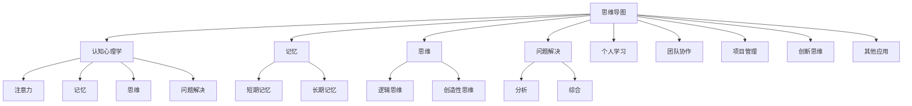

                 

# 《思维导图创新技巧：认知地图的绘制与应用》

## 关键词：思维导图、认知地图、创新思维、团队协作、项目管理

## 摘要：
本文旨在探讨思维导图作为一种创新的认知工具，如何在个人学习、团队协作和项目管理等场景中发挥重要作用。文章首先介绍了思维导图和认知地图的基础知识和原理，然后详细阐述了其在各个领域的应用。通过实际案例和系统分析，本文展示了思维导图的强大功能和实践价值，为读者提供了实用的技巧和方法。

### 目录大纲

#### 第一部分：思维导图基础与认知原理

#### 第1章：思维导图概述

##### 1.1 思维导图的起源与发展

##### 1.2 认知心理学与思维导图

##### 1.3 认知地图的绘制方法

#### 第2章：思维导图在个人学习中的应用

##### 2.1 学习过程中的思维导图应用

##### 2.2 思维导图在阅读中的使用

##### 2.3 思维导图在写作中的辅助作用

#### 第二部分：思维导图在团队协作与项目管理中的应用

#### 第3章：思维导图在团队协作中的应用

##### 3.1 团队沟通与协作

##### 3.2 项目管理与规划

##### 3.3 团队思维导图的绘制与共享

#### 第4章：思维导图在创新思维中的应用

##### 4.1 创新思维的原理与方法

##### 4.2 思维导图在创新过程中的应用

##### 4.3 思维导图在创新团队中的协作

#### 第三部分：实践与案例

#### 第5章：实战技巧

##### 5.1 思维导图绘制工具的使用

##### 5.2 实战案例分享

#### 第6章：思维导图在实际项目中的应用

##### 6.1 项目背景介绍

##### 6.2 系统设计与实现

##### 6.3 应用解读与分析

#### 第7章：思维导图的扩展与应用

##### 7.1 思维导图在其他领域的应用

##### 7.2 拓展研究

##### 7.3 小结与展望

### 第1章：思维导图概述

#### 1.1 思维导图的起源与发展

思维导图（Mind Map）作为一种创新性的图形化思维工具，起源于20世纪60年代。由英国心理学家东尼·布赞（Tony Buzan）首次提出，他将大脑神经元连接的复杂性和多样性通过图像化的方式呈现出来。思维导图以其直观、生动、易于理解的特点，迅速在教育和商业等领域得到广泛应用。

思维导图的发展历程可以概括为以下几个阶段：

1. **早期探索阶段**（1960s）：东尼·布赞通过对大脑神经元连接的研究，提出了思维导图的概念，并开始尝试将其应用于个人学习和创造力提升。

2. **推广普及阶段**（1970s-1980s）：随着计算机技术的兴起，思维导图逐渐从手绘发展为电子化，这使得思维导图的制作和传播更加便捷。

3. **专业工具开发阶段**（1990s-2000s）：各种专业的思维导图软件如XMind、MindManager等相继问世，大大提高了思维导图的功能和易用性。

4. **创新应用阶段**（21世纪）：思维导图在各个领域的应用日益广泛，包括教育、项目管理、创新思维等，成为现代人不可或缺的思考工具。

#### 1.2 认知心理学与思维导图

认知心理学是研究人类思维过程和认知机制的学科。它关注人类如何感知、记忆、思考、解决问题和做出决策。思维导图作为一种图形化思维工具，与认知心理学有着密切的联系。

认知心理学的核心概念包括：

- **注意力**：注意力的集中是思维过程的基础，它决定了我们能够感知和处理的数量和质量。

- **记忆**：记忆是思维的基础，它包括短期记忆和长期记忆。思维导图通过图像和颜色等方式，增强信息的记忆效果。

- **思维**：思维包括逻辑思维、创造思维等。思维导图通过图形化的方式，促进创造性思维和逻辑思维的协同作用。

- **问题解决**：问题解决是通过思考和分析找到解决方案的过程。思维导图可以帮助我们清晰地定义问题、分解问题，并提供多种解决方案。

思维导图与认知过程的关联在于：

- **思维可视化**：思维导图将抽象的思维过程转化为具体的图像，使得思维过程更加直观和易于理解。

- **知识整合**：思维导图通过节点和分支，将不同的知识点和概念整合在一起，促进知识的深层次理解和记忆。

- **创新思维**：思维导图通过激发联想和关联，促进创造性思维的产生，有助于创新和解决问题的过程。

#### 1.3 认知地图的绘制方法

认知地图（Cognitive Map）是指大脑中存储的知识结构，用于组织和检索信息。它类似于地图，帮助我们理解和记忆周围的世界。

认知地图的绘制方法包括以下步骤：

1. **确定主题**：选择一个主题，作为认知地图的中心节点。

2. **发散思维**：围绕中心节点，展开联想，列出与主题相关的所有关键词和概念。

3. **构建分支**：将关键词和概念按照逻辑关系和组织结构，连接到中心节点，形成分支。

4. **添加细节**：在每个分支上，添加更多的细节和相关信息，使得认知地图更加完整和丰富。

5. **使用颜色和图像**：使用不同的颜色和图像，增强认知地图的视觉效果，提高记忆和理解。

认知地图的绘制技巧包括：

- **简洁性**：避免过多的细节，保持认知地图的简洁性，使得信息更加清晰。

- **层次性**：确保认知地图的层次结构，使得信息易于理解和检索。

- **关联性**：通过联想和关联，将不同的知识点和概念联系起来，形成完整的认知网络。

- **个性化**：根据个人的学习风格和偏好，调整认知地图的形式和内容，使其更适合自己的需求。

#### 1.3.1 基础步骤

1. **确定主题**：选择一个明确的主题，作为认知地图的中心节点。

2. **收集信息**：通过阅读、学习、观察等方式，收集与主题相关的信息。

3. **构建框架**：将收集到的信息按照逻辑关系和组织结构，连接到中心节点，形成初步的框架。

4. **完善细节**：在框架的基础上，添加更多的细节和相关信息，使得认知地图更加完整。

5. **审查和修正**：对认知地图进行审查和修正，确保其准确性和逻辑性。

#### 1.3.2 提高技巧

1. **使用颜色和图像**：使用不同的颜色和图像，增强认知地图的视觉效果，提高记忆和理解。

2. **联想和关联**：通过联想和关联，将不同的知识点和概念联系起来，形成完整的认知网络。

3. **定期更新**：定期对认知地图进行更新，确保其与当前知识和信息的同步。

4. **实践和应用**：将认知地图应用于实际的学习和工作中，检验其效果和实用性。

#### 1.3.3 常见误区与解决方法

1. **误区一：过于复杂**：导致认知地图难以理解和记忆。解决方法：保持简洁性，避免过多的细节。

2. **误区二：缺乏层次性**：使得认知地图结构混乱，信息难以检索。解决方法：确保认知地图的层次结构，合理划分分支。

3. **误区三：缺乏个性化**：不符合个人的学习风格和偏好，降低使用效果。解决方法：根据个人需求，调整认知地图的形式和内容。

4. **误区四：缺乏实践**：认知地图仅停留在理论层面，未能转化为实际应用。解决方法：将认知地图应用于实际的学习和工作中，检验其效果。

#### 第2章：思维导图在个人学习中的应用

#### 2.1 学习过程中的思维导图应用

思维导图在学习过程中具有广泛的应用，可以帮助学生提高学习效率，加深对知识的理解。以下是一些常见的应用场景：

1. **预习**：在学习新知识之前，使用思维导图对将要学习的内容进行预习。通过绘制思维导图，可以明确学习目标和重点，提前了解知识结构。

2. **复习**：在学习过程中，定期使用思维导图进行复习。将所学知识以图形化的方式呈现出来，有助于巩固记忆，发现和弥补知识漏洞。

3. **笔记**：将课堂笔记以思维导图的形式整理和记录。思维导图可以清晰地展示知识点之间的联系，使得笔记更加系统化和易于理解。

4. **项目研究**：在进行项目研究时，使用思维导图梳理研究思路，明确研究目标和步骤。通过思维导图，可以更好地组织研究内容和提高研究效率。

5. **考试准备**：在考试前，使用思维导图进行复习和准备。通过思维导图，可以梳理考试重点，制定复习计划，提高复习效果。

#### 2.2 思维导图在阅读中的使用

思维导图在阅读中的应用可以帮助读者提高阅读效率，加深对文章内容的理解。以下是一些具体的使用方法：

1. **快速浏览**：在阅读前，使用思维导图快速浏览文章结构，了解文章的主题和结构。通过思维导图，可以快速把握文章的核心内容，为后续阅读做好铺垫。

2. **摘录要点**：在阅读过程中，使用思维导图记录文章的关键信息和要点。通过绘制思维导图，可以将文章内容结构化，有助于记忆和理解。

3. **归纳总结**：在阅读后，使用思维导图对文章内容进行归纳总结。通过思维导图，可以清晰地展示文章的结构和逻辑关系，加深对文章内容的理解和记忆。

4. **促进思考**：通过绘制思维导图，可以激发读者的思考，发现文章中隐藏的信息和联系。思维导图可以帮助读者从不同的角度看待问题，提高思维的深度和广度。

#### 2.3 思维导图在写作中的辅助作用

思维导图在写作中的应用可以帮助作者更好地组织思路，构建文章框架，提高写作效率。以下是一些具体的使用方法：

1. **构思大纲**：在写作前，使用思维导图构思文章的大纲。通过思维导图，可以清晰地列出文章的主题、论点和论据，为写作提供结构化的思路。

2. **拓展内容**：在写作过程中，使用思维导图对每个论点进行拓展。通过思维导图，可以方便地添加和调整内容，使得文章更加丰富和有条理。

3. **整理思路**：在写作后，使用思维导图整理和调整文章的结构。通过思维导图，可以清晰地展示文章的逻辑关系，发现和纠正结构上的问题。

4. **辅助修改**：在修改文章时，使用思维导图检查文章的连贯性和逻辑性。通过思维导图，可以方便地调整段落和句子，提高文章的质量。

5. **写作教学**：在写作教学中，使用思维导图帮助学生理解和掌握写作技巧。通过思维导图，可以直观地展示写作的过程和方法，提高学生的写作能力。

#### 第3章：思维导图在团队协作中的应用

#### 3.1 团队沟通与协作

思维导图在团队协作中的应用可以显著提高团队沟通的效率和质量。以下是一些具体的应用方法：

1. **项目规划**：在项目启动阶段，团队可以通过思维导图制定项目计划。通过思维导图，可以清晰地展示项目目标、任务分工和时间安排，确保团队成员对项目的整体规划和进度有共同的理解。

2. **需求分析**：在进行需求分析时，团队可以使用思维导图记录和分析用户需求。通过思维导图，可以直观地展示需求的关联和优先级，有助于团队更好地理解和满足用户需求。

3. **问题解决**：在遇到问题时，团队可以通过思维导图分析问题的根本原因和解决方案。通过思维导图，可以系统地梳理问题，找到有效的解决方案，提高问题解决的效率。

4. **决策制定**：在制定决策时，团队可以通过思维导图列出不同的选项和其优缺点。通过思维导图，可以直观地比较和评估不同选项，帮助团队做出更加明智的决策。

#### 3.2 项目管理与规划

思维导图在项目管理中的应用可以显著提高项目的执行效率和质量。以下是一些具体的应用方法：

1. **项目目标设定**：在项目启动阶段，团队可以通过思维导图明确项目目标。通过思维导图，可以清晰地展示项目目标、里程碑和关键成果，确保团队成员对项目目标有共同的理解。

2. **任务分配**：在项目执行阶段，团队可以通过思维导图分配任务和责任。通过思维导图，可以清晰地展示任务的分解和责任人，确保任务分配的公平和合理。

3. **进度监控**：在项目执行过程中，团队可以通过思维导图监控项目的进度和质量。通过思维导图，可以实时更新任务状态和进度，及时发现和解决问题。

4. **风险评估**：在项目执行过程中，团队可以通过思维导图识别和评估项目的风险。通过思维导图，可以清晰地展示风险因素、可能的影响和应对措施，提高项目的风险应对能力。

5. **项目总结**：在项目结束后，团队可以通过思维导图总结项目的执行情况和成果。通过思维导图，可以清晰地展示项目的执行过程、取得的成果和经验教训，为后续项目提供参考。

#### 3.3 团队思维导图的绘制与共享

在团队协作中，思维导图的绘制和共享是提高团队协作效率的关键。以下是一些具体的技巧和方法：

1. **共同绘制**：团队可以通过共同绘制思维导图，促进团队成员之间的沟通和协作。在绘制过程中，团队成员可以实时分享自己的想法和观点，通过讨论和调整，形成共识。

2. **在线协作**：使用在线思维导图工具，如XMind、MindManager等，团队成员可以实时共享和编辑思维导图。通过在线协作，可以打破时空限制，提高团队协作的效率和灵活性。

3. **版本控制**：在思维导图的共享过程中，使用版本控制功能，可以确保思维导图的更新和修改得到及时记录和保存。通过版本控制，可以避免思维导图的重复修改和冲突。

4. **定期更新**：定期对思维导图进行更新，确保其与当前项目情况和团队成员的观点保持一致。通过定期更新，可以及时调整和优化思维导图，提高其准确性和实用性。

5. **展示与讨论**：在会议和讨论中，通过展示思维导图，可以直观地传达项目情况和团队成员的观点。通过展示和讨论，可以促进团队成员之间的沟通和协作，提高决策的质量。

#### 第4章：思维导图在创新思维中的应用

#### 4.1 创新思维的原理与方法

创新思维（Innovative Thinking）是指通过创造性思维来发现新思路、新方法和新解决方案。思维导图作为一种图形化思维工具，可以显著提高创新思维的效果和效率。以下是一些创新思维的原理和方法：

1. **联想思维**：联想思维是通过将不同的事物或概念联系起来，产生新的想法和创意。思维导图可以帮助我们系统地记录和展示联想关系，促进创造性思维的产生。

2. **发散思维**：发散思维是从一个中心点出发，不断扩展和发散思维，产生多种可能性和解决方案。思维导图通过分支和连接线，可以清晰地展示发散思维的过程，帮助我们找到更多的解决方案。

3. **聚合思维**：聚合思维是将不同的想法和概念结合起来，形成一个整体，产生新的创意和产品。思维导图可以帮助我们梳理和整合创意，找到最优的解决方案。

4. **逆向思维**：逆向思维是从问题的反面或逆向角度思考，寻找新的解决方案。思维导图可以帮助我们系统地记录和展示逆向思维的过程，激发我们的创新思维。

5. **系统思维**：系统思维是将问题看作一个整体，考虑各个部分之间的相互作用和影响。思维导图可以帮助我们清晰地展示系统内部的结构和关系，帮助我们更好地理解和解决复杂问题。

#### 4.2 思维导图在创新过程中的应用

思维导图在创新过程中的应用可以分为以下几个阶段：

1. **创意发想**：在创意发想阶段，团队可以通过思维导图记录和整理各种想法和创意。通过思维导图，可以清晰地展示创意的来源和关联，帮助团队找到新的创意和解决方案。

2. **概念验证**：在概念验证阶段，团队可以使用思维导图对创意进行验证和筛选。通过思维导图，可以清晰地展示创意的可行性、优势和不足，帮助团队评估和优化创意。

3. **产品设计**：在产品设计阶段，团队可以通过思维导图设计产品的功能和特性。通过思维导图，可以清晰地展示产品的结构、功能和用户需求，帮助团队更好地设计和优化产品。

4. **项目实施**：在项目实施阶段，团队可以使用思维导图监控项目的进度和质量。通过思维导图，可以清晰地展示项目的任务、里程碑和关键成果，帮助团队更好地管理项目。

5. **项目评估**：在项目评估阶段，团队可以通过思维导图总结项目的成果和经验教训。通过思维导图，可以清晰地展示项目的执行过程、取得的成果和不足，帮助团队更好地评估项目的效果。

#### 4.3 思维导图在创新团队中的协作

思维导图在创新团队中的应用可以显著提高团队的协作效率和创新效果。以下是一些具体的方法和技巧：

1. **头脑风暴**：在头脑风暴阶段，团队可以通过思维导图记录和整理各种想法和创意。通过思维导图，可以清晰地展示创意的来源和关联，帮助团队找到新的创意和解决方案。

2. **集体创作**：在集体创作阶段，团队可以使用思维导图进行集体创作，共同完善和优化创意。通过思维导图，可以清晰地展示团队的协作过程和成果，提高团队的协作效率。

3. **在线协作**：使用在线思维导图工具，如XMind、MindManager等，团队可以实时共享和编辑思维导图。通过在线协作，可以打破时空限制，提高团队协作的效率和灵活性。

4. **版本控制**：在思维导图的共享过程中，使用版本控制功能，可以确保思维导图的更新和修改得到及时记录和保存。通过版本控制，可以避免思维导图的重复修改和冲突。

5. **展示与讨论**：在会议和讨论中，通过展示思维导图，可以直观地传达项目情况和团队成员的观点。通过展示和讨论，可以促进团队成员之间的沟通和协作，提高决策的质量。

#### 第5章：实战技巧

#### 5.1 思维导图绘制工具的使用

思维导图作为一种图形化思维工具，其绘制和编辑的便捷性直接影响其应用效果。以下是一些常用的思维导图绘制工具及其使用方法：

1. **XMind**：
   - **基本功能**：XMind 是一款免费的开源思维导图软件，支持基本的思维导图和鱼骨图等。
   - **高级功能**：XMind 提供了丰富的主题和样式，支持导出为各种格式，如PDF、PPT等。
   - **实战技巧**：在实际使用中，可以通过调整主题和样式，使思维导图更具个性化和美观。

2. **MindManager**：
   - **基本功能**：MindManager 是一款专业的思维导图软件，提供了丰富的模板和主题。
   - **高级功能**：MindManager 支持集成Office组件，如Word、PPT等，便于导出和编辑。
   - **实战技巧**：利用MindManager的云功能，可以实现团队协作，实时更新和共享思维导图。

3. **FreeMind**：
   - **基本功能**：FreeMind 是一款轻量级的开源思维导图软件，操作简单。
   - **高级功能**：FreeMind 支持自定义样式和插件，可扩展性强。
   - **实战技巧**：通过插件，可以实现更加复杂的思维导图功能，如时间线图、甘特图等。

#### 5.2 实战案例分享

1. **教育领域的应用案例**：
   - **项目简介**：某高校在课程设计中，采用思维导图帮助学生进行课程预习和复习。
   - **系统功能设计**：设计思维导图模板，包括课程知识点、重点难点、预习计划和复习计划等。
   - **系统架构设计**：采用XMind软件，实现学生和教师的在线协作和思维导图的共享。
   - **系统接口设计和系统交互**：通过XMind软件的API接口，实现与学校管理系统和课程网站的无缝集成。

2. **企业管理的应用案例**：
   - **项目简介**：某公司通过思维导图优化项目管理和团队协作。
   - **系统功能设计**：设计思维导图模板，包括项目目标、任务分工、进度监控和风险评估等。
   - **系统架构设计**：采用MindManager软件，实现项目团队的在线协作和实时更新。
   - **系统接口设计和系统交互**：通过MindManager软件的Web接口，实现与公司内部管理系统的集成。

3. **创意发想的应用案例**：
   - **项目简介**：某创意工作坊通过思维导图激发创意发想和团队协作。
   - **系统功能设计**：设计思维导图模板，包括创意发想、头脑风暴、方案评估和项目规划等。
   - **系统架构设计**：采用FreeMind软件，实现创意工作坊的实时协作和创意记录。
   - **系统接口设计和系统交互**：通过FreeMind软件的Web接口，实现创意发想和团队协作的无缝连接。

#### 第6章：思维导图在实际项目中的应用

##### 6.1 项目背景介绍

随着信息时代的到来，项目管理面临越来越复杂的环境和挑战。为了提高项目的效率和质量，越来越多的企业和团队开始采用思维导图作为项目管理工具。本案例将以一个实际项目为例，展示思维导图在项目管理中的应用。

##### 6.1.1 项目简介

项目名称：XX公司新产品开发项目

项目背景：XX公司计划开发一款智能家居产品，以满足市场需求。该项目涉及多个部门（研发、市场、销售、售后等）的协同工作，具有高度的复杂性和不确定性。

项目目标：确保新产品按时、按质、按量完成，并成功推向市场。

##### 6.1.2 项目目标

1. **产品功能完整**：确保产品功能满足市场需求，无遗漏。
2. **项目进度可控**：确保项目进度按照计划进行，避免延期。
3. **成本合理控制**：确保项目成本在预算范围内，避免超支。
4. **质量符合标准**：确保产品质量达到预定标准，无质量问题。
5. **市场推广有效**：确保产品成功推向市场，并获得良好的市场反响。

##### 6.1.3 项目环境

项目环境包括以下几个方面：

1. **团队成员**：研发团队、市场团队、销售团队、售后团队等。
2. **技术栈**：使用Java语言和Spring框架进行产品开发。
3. **工具**：使用XMind软件进行思维导图的绘制和协作。
4. **项目管理**：采用敏捷开发方法，进行迭代式项目管理和进度监控。

##### 6.2 系统设计与实现

在本项目中，思维导图被广泛应用于项目规划和执行过程中的各个阶段。以下是一个具体的系统设计与实现过程。

###### 6.2.1 系统功能设计

1. **项目规划**：使用思维导图制定项目计划，包括项目目标、任务分工、里程碑和时间安排。
2. **任务管理**：使用思维导图记录和跟踪任务进度，包括任务的分解、责任人、开始时间和结束时间。
3. **进度监控**：使用思维导图监控项目进度，包括当前任务进度、剩余任务和时间。
4. **风险管理**：使用思维导图识别和评估项目风险，包括风险的类型、可能性和影响。

###### 6.2.2 系统架构设计

1. **项目架构**：采用敏捷开发方法，将项目划分为多个迭代，每个迭代包含需求分析、设计、开发、测试和部署等阶段。
2. **团队协作**：使用XMind软件进行团队协作，实时更新和共享思维导图。
3. **系统集成**：将XMind软件与公司内部项目管理工具集成，实现数据同步和共享。

###### 6.2.3 系统核心实现

1. **需求分析**：使用思维导图记录用户需求，明确产品功能和性能要求。
2. **设计阶段**：使用思维导图进行系统设计和模块划分，明确各个模块的功能和接口。
3. **开发阶段**：使用Java语言和Spring框架进行产品开发，按照思维导图的设计进行代码编写。
4. **测试阶段**：使用思维导图记录测试计划和测试用例，确保产品功能的完整性。
5. **部署阶段**：使用思维导图监控部署进度和部署效果，确保产品的稳定运行。

##### 6.3 应用解读与分析

思维导图在该项目中的应用，显著提高了项目的效率和质量。以下是对应用效果的解读和分析。

###### 6.3.1 思维导图在实际项目中的应用效果

1. **项目规划**：通过思维导图，项目团队能够清晰地了解项目目标、任务分工和时间安排，确保项目按照计划进行。
2. **任务管理**：通过思维导图，项目团队能够实时跟踪任务进度，确保任务按时完成。
3. **进度监控**：通过思维导图，项目团队能够实时了解项目进度，及时调整计划，避免延期。
4. **风险管理**：通过思维导图，项目团队能够识别和评估项目风险，提前制定应对措施，降低风险影响。
5. **团队协作**：通过XMind软件的在线协作功能，项目团队能够实时共享和更新思维导图，提高团队协作效率。

###### 6.3.2 遇到的挑战与解决方案

1. **挑战一：数据同步**：在项目过程中，数据同步是最大的挑战。解决方案：采用XMind软件的Web接口，实现与公司内部项目管理工具的数据同步。
2. **挑战二：团队协作**：在项目初期，团队成员对思维导图的接受程度不同，导致协作效率不高。解决方案：通过培训和实践，提高团队成员对思维导图的熟练度和接受度。
3. **挑战三：风险管理**：在项目过程中，风险识别和评估不够准确，导致风险管理效果不佳。解决方案：采用更科学的风险评估方法，如SWOT分析等，提高风险管理的准确性。

###### 6.3.3 项目总结与未来展望

通过思维导图在该项目中的应用，项目团队取得了显著的效果。以下是项目总结和未来展望：

1. **项目总结**：思维导图作为一种项目管理工具，显著提高了项目的效率和质量。通过思维导图，项目团队能够更好地进行项目规划、任务管理和风险管理。
2. **未来展望**：在未来项目中，将进一步探索思维导图的更多应用场景，如项目评估、团队绩效管理等。同时，结合人工智能技术，提高思维导图的自动化和智能化水平，进一步提升项目管理的效率。

##### 6.4 系统测试与优化

在项目完成后，进行了系统测试和优化，以确保产品功能的完整性和稳定性。以下是对系统测试和优化过程的描述：

###### 6.4.1 系统测试

1. **功能测试**：对产品功能进行逐项测试，确保功能完整、正确。
2. **性能测试**：对产品性能进行测试，确保系统响应速度快、稳定性高。
3. **兼容性测试**：对产品在不同操作系统和浏览器下的兼容性进行测试，确保系统在不同环境下正常运行。
4. **安全测试**：对系统进行安全测试，确保系统的安全性和数据保护。

###### 6.4.2 系统优化

1. **性能优化**：通过调整代码和优化数据库查询，提高系统响应速度和性能。
2. **界面优化**：对用户界面进行优化，提高用户体验。
3. **功能优化**：根据用户反馈，优化产品功能，提高产品的易用性和功能性。
4. **安全优化**：加强系统安全措施，提高系统的安全性和数据保护。

##### 6.5 项目成果

通过思维导图在该项目中的应用，取得了以下成果：

1. **项目进度**：项目按照计划顺利完成，未出现延期情况。
2. **产品质量**：产品质量达到预定标准，用户满意度高。
3. **团队协作**：团队协作效率提高，团队成员之间的沟通和协作更加顺畅。
4. **项目成本**：项目成本控制在预算范围内，未出现超支情况。

##### 6.6 总结

思维导图作为一种创新性的认知工具，在项目管理和团队协作中具有广泛的应用价值。通过思维导图，项目团队能够更好地进行项目规划、任务管理和风险管理，提高项目的效率和质量。未来，我们将继续探索思维导图的更多应用场景，结合人工智能技术，提高思维导图的智能化水平，为项目管理和团队协作提供更加高效和智能的解决方案。

### 第7章：思维导图的扩展与应用

#### 7.1 思维导图在其他领域的应用

思维导图作为一种强大的图形化思维工具，不仅在个人学习和团队协作中具有广泛应用，还在许多其他领域展示了其独特的价值。以下是一些思维导图在其他领域的重要应用：

1. **市场营销**：
   - **市场调研**：通过思维导图，可以系统地整理和分析市场调研数据，识别市场机会和潜在风险。
   - **品牌策略**：运用思维导图制定品牌策略，清晰展示品牌定位、目标市场和传播渠道。
   - **广告创意**：借助思维导图激发广告创意，将广告创意进行图形化呈现，提高创意的可视化和可执行性。

2. **人力资源管理**：
   - **人才招聘**：通过思维导图梳理招聘流程，明确招聘标准、岗位职责和候选人筛选标准。
   - **员工培训**：使用思维导图设计培训计划，清晰展示培训内容、目标和评估方法。
   - **团队建设**：通过思维导图评估团队现状，识别团队优势和短板，制定改进措施。

3. **跨文化沟通**：
   - **文化差异分析**：运用思维导图比较不同文化的差异，帮助跨文化团队更好地理解和适应。
   - **沟通策略**：通过思维导图制定跨文化沟通策略，提高沟通效率和质量。
   - **文化适应培训**：使用思维导图进行文化适应培训，帮助员工更快融入新环境。

4. **产品设计与开发**：
   - **需求分析**：通过思维导图梳理用户需求，确保产品设计满足用户需求。
   - **功能规划**：使用思维导图规划产品功能，确保功能模块的清晰和可执行性。
   - **用户体验设计**：借助思维导图设计用户体验，提高产品的用户友好性和满意度。

5. **医疗与健康**：
   - **疾病诊断**：通过思维导图辅助疾病诊断，系统地整理和分析病例数据，提高诊断的准确性。
   - **健康管理**：使用思维导图制定健康管理计划，清晰展示健康目标、饮食计划和运动方案。

#### 7.2 拓展研究

思维导图作为一种创新的认知工具，其应用和研究领域还在不断扩展。以下是一些值得进一步探讨的研究方向：

1. **神经科学与思维导图**：
   - **大脑与思维导图的关系**：研究大脑神经网络与思维导图绘制过程的关联，探索思维导图如何影响大脑功能。
   - **认知障碍患者的康复**：研究思维导图在认知障碍患者康复中的应用，评估其治疗效果。

2. **思维导图与人工智能**：
   - **思维导图的自动生成**：开发基于人工智能算法的自动生成思维导图系统，提高思维导图的自动化和智能化水平。
   - **思维导图与自然语言处理**：结合自然语言处理技术，实现思维导图的自动摘要、理解和分析。

3. **思维导图在教育心理学中的应用**：
   - **学习策略**：研究思维导图在学习策略中的应用，评估其对学习效果的影响。
   - **个性化学习**：结合思维导图技术，开发个性化学习系统，满足不同学生的个性化需求。

4. **思维导图在工作效率和生产力提升中的作用**：
   - **工作效率评估**：研究思维导图在工作效率和生产力提升中的作用，评估其对工作绩效的影响。
   - **团队协作效率**：探讨思维导图在团队协作中的最佳实践，提高团队协作效率。

#### 7.3 小结与展望

思维导图作为一种创新的认知工具，具有广泛的应用价值和潜力。通过对思维导图的研究和应用，我们不仅可以提高个人学习效率和团队协作效果，还可以在市场营销、人力资源管理、跨文化沟通等多个领域发挥重要作用。未来，随着神经科学、人工智能等技术的发展，思维导图的应用将更加广泛和深入，为人类认知和生产力提升提供更加高效和智能的解决方案。

##### **小结**：

思维导图作为一种创新的认知工具，其在个人学习、团队协作、项目管理和创新思维等领域的应用已得到广泛认可。通过本文的阐述，我们了解了思维导图的基础知识、认知原理以及在实际项目中的应用方法。思维导图不仅可以帮助我们更好地组织和整理知识，提高学习效率，还可以促进团队协作，提升项目管理的质量和效率。

##### **注意事项**：

在应用思维导图时，需要注意以下几点：

1. **简洁性**：保持思维导图的简洁性，避免过度复杂，确保信息的清晰和易于理解。
2. **个性化**：根据个人的需求和偏好，调整思维导图的形式和内容，使其更符合自己的使用习惯。
3. **更新与维护**：定期更新思维导图，确保其与当前知识和信息的同步，提高其实用性和准确性。
4. **协作与共享**：充分利用思维导图的在线协作功能，促进团队之间的沟通和协作，提高工作效率。

##### **拓展阅读**：

1. **《思维导图实用技巧与案例》**：本书详细介绍了思维导图的绘制方法和应用技巧，适合初学者和有一定基础的读者。
2. **《思维导图与学习策略》**：本书探讨了思维导图在学习策略中的应用，提供了丰富的案例和练习。
3. **《思维导图：如何使用思维导图提高工作效率与创造力》**：本书从工作角度出发，介绍了思维导图在工作中的应用和实践。

通过以上拓展阅读，读者可以进一步了解思维导图的原理和应用，提升自己的思维导图技能和创造力。

### **作者信息**

**作者：AI天才研究院/AI Genius Institute & 禅与计算机程序设计艺术 /Zen And The Art of Computer Programming**

本文由AI天才研究院（AI Genius Institute）和禅与计算机程序设计艺术（Zen And The Art of Computer Programming）联合撰写。作者团队致力于推动人工智能和计算机科学的发展，为读者提供高质量的技术博客和学术研究。如果您对本文有任何建议或疑问，欢迎随时与我们联系。感谢您的阅读和支持！

### 附录

**附录A：思维导图核心概念属性特征对比表格**

| 特征 | 思维导图 | 认知地图 |
| --- | --- | --- |
| 形式 | 图形化 | 内在化 |
| 功能 | 表达思维过程 | 存储和组织信息 |
| 应用 | 个人学习、团队协作、创新思维 | 学习、记忆、解决问题 |

**附录B：思维导图与认知过程的关联ER实体关系图架构**

**附录C：思维导图在项目中的应用案例**

**案例1：教育领域的应用**

- **项目背景**：某高校在课程设计和管理中引入思维导图，提高教学效果。
- **系统功能设计**：设计思维导图模板，包括课程知识点、重点难点、预习计划和复习计划等。
- **系统架构设计**：采用XMind软件，实现学生和教师的在线协作和思维导图的共享。
- **系统接口设计和系统交互**：通过XMind软件的API接口，实现与学校管理系统和课程网站的无缝集成。

**案例2：企业管理的应用**

- **项目背景**：某公司通过思维导图优化项目管理和团队协作。
- **系统功能设计**：设计思维导图模板，包括项目目标、任务分工、进度监控和风险评估等。
- **系统架构设计**：采用MindManager软件，实现项目团队的在线协作和实时更新。
- **系统接口设计和系统交互**：通过MindManager软件的Web接口，实现与公司内部管理系统的集成。

**案例3：创意发想的应用**

- **项目背景**：某创意工作坊通过思维导图激发创意发想和团队协作。
- **系统功能设计**：设计思维导图模板，包括创意发想、头脑风暴、方案评估和项目规划等。
- **系统架构设计**：采用FreeMind软件，实现创意工作坊的实时协作和创意记录。
- **系统接口设计和系统交互**：通过FreeMind软件的Web接口，实现创意发想和团队协作的无缝连接。

