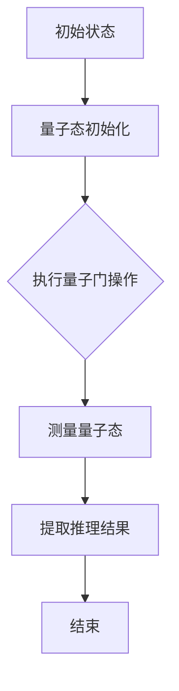
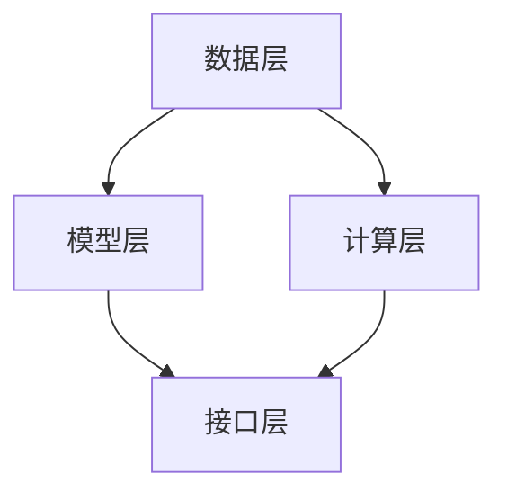
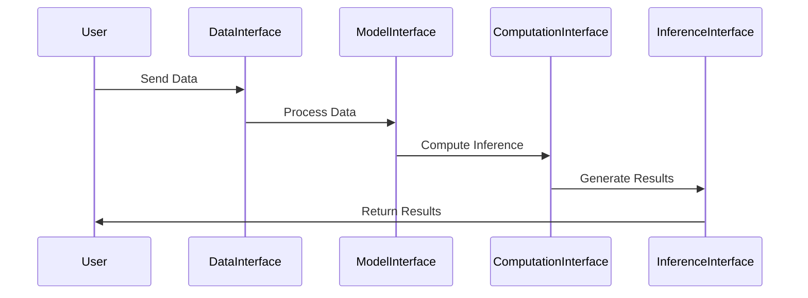

                 

### 思维链技术：AI推理能力的量子飞跃

> 关键词：思维链技术、量子计算、AI推理能力、算法、系统架构设计

> 摘要：本文旨在探讨思维链技术在人工智能推理领域的应用，以及量子计算如何引领AI推理能力的量子飞跃。文章将首先介绍背景知识，随后深入剖析思维链技术的核心概念与原理，并通过具体的算法实例和系统架构设计，展示其在实际应用中的优势与挑战。

### 引言

随着人工智能技术的快速发展，AI推理能力已成为推动诸多行业变革的核心动力。然而，传统的AI推理方法在面对复杂、大规模的数据处理时，往往面临计算速度慢、能耗高、存储容量有限等挑战。为了突破这些瓶颈，量子计算作为一种颠覆性的计算模式，逐渐进入了人们的视野。思维链技术作为量子计算在AI推理领域的应用，为实现AI推理能力的量子飞跃提供了新的路径。

本文将从以下几个方面展开讨论：

1. 背景介绍：阐述人工智能的发展现状以及AI推理能力面临的挑战。
2. 核心概念与联系：详细解释思维链技术和量子计算的基本原理，并比较两者的优缺点。
3. 算法原理讲解：通过具体的算法实例，展示思维链技术的实现过程和数学原理。
4. 系统分析与架构设计：分析思维链技术在系统架构设计中的应用，并介绍相关的系统架构。
5. 项目实战：探讨思维链技术在实际项目中的应用，包括环境安装、核心实现、案例分析等内容。
6. 最佳实践 tips、小结、注意事项、拓展阅读等。

### 第1章：背景介绍

#### 1.1 问题背景

人工智能（AI）作为21世纪最具前景的技术之一，已经在各个领域展现出了强大的应用潜力。然而，随着AI应用的深入，尤其是在复杂推理、实时决策等场景中，传统AI推理方法的表现逐渐暴露出诸多问题：

1. **计算速度**：传统AI模型在处理大规模数据时，计算速度相对较慢，难以满足实时性要求。
2. **能耗**：传统AI模型的能耗较高，不利于绿色、可持续的科技发展。
3. **存储容量**：随着数据量的激增，传统AI模型的存储容量成为瓶颈。
4. **复杂度**：面对复杂的推理任务，传统AI模型的处理能力有限。

为了解决这些问题，量子计算作为一种全新的计算模式，逐渐受到关注。量子计算机利用量子位（qubit）的特性，实现了超乎经典计算机的计算能力。而思维链技术作为量子计算在AI推理领域的应用，有望实现AI推理能力的量子飞跃。

#### 1.2 问题描述

**思维链技术**是一种利用量子计算加速AI推理的方法，其核心思想是通过构建思维链网络，模拟人类思维过程中的信息传递和推理过程。在思维链技术中，量子计算发挥了至关重要的作用：

1. **量子态初始化**：量子计算机通过特定的量子态初始化，为后续的量子门操作提供初始条件。
2. **量子门操作**：量子计算机利用一系列的量子门操作，对量子态进行变换，实现特定的计算任务。
3. **测量量子态**：通过测量量子态，获取最终的计算结果。

与传统AI推理方法相比，思维链技术具有以下几个显著特点：

1. **高效性**：量子计算机通过并行计算和指数级的速度提升，大大提高了AI推理的效率。
2. **能效比**：量子计算机在处理复杂任务时，能耗较低，能效比显著优于传统计算机。
3. **扩展性**：量子计算机具有强大的扩展性，可以轻松应对大规模、多样化的AI推理任务。

#### 1.3 问题解决

思维链技术的实现过程可以分为以下几个步骤：

1. **构建思维链网络**：通过设计合适的神经网络结构，构建思维链网络，实现信息传递和推理功能。
2. **量子态初始化**：利用量子计算机对神经网络中的参数进行量子态初始化。
3. **量子门操作**：通过执行一系列量子门操作，对量子态进行变换，实现推理过程。
4. **测量量子态**：对量子态进行测量，获取最终的计算结果。

此外，思维链技术的应用场景广泛，包括但不限于：

1. **自然语言处理**：利用思维链技术实现高效、准确的文本分析、语义理解和机器翻译。
2. **计算机视觉**：通过思维链技术实现实时、精准的图像识别和目标检测。
3. **智能决策**：利用思维链技术实现复杂场景下的实时决策和优化。

#### 1.4 边界与外延

思维链技术作为一种新兴技术，其发展还存在一些挑战和限制：

1. **量子计算机的普及**：目前，量子计算机尚处于实验室阶段，需要进一步的技术突破和商业化推广。
2. **算法优化**：思维链技术中的算法仍需不断优化，以提高效率和准确性。
3. **安全性与隐私保护**：量子计算机在数据处理过程中，可能面临安全性和隐私保护的问题。

然而，随着量子计算技术的不断进步和成熟，思维链技术有望在未来发挥更大的作用，为人工智能领域带来新的突破。

### 第2章：核心概念与联系

#### 2.1 核心概念

思维链技术是量子计算在AI推理领域的应用，其核心概念包括：

1. **量子位（qubit）**：量子计算中的基本单元，可以同时处于0和1的叠加态。
2. **量子态**：量子位的叠加态，表示量子计算中的信息状态。
3. **量子门**：对量子态进行变换的运算，类似于经典计算中的逻辑门。
4. **思维链网络**：由一系列量子位和量子门构成的神经网络，用于实现AI推理任务。
5. **测量**：获取量子计算结果的过程，通过测量量子态的叠加态，得到具体的信息。

量子计算的基本原理是利用量子位和量子门实现并行计算和指数级的速度提升。在思维链技术中，量子计算通过以下几个步骤实现AI推理：

1. **初始化**：将量子计算机中的量子位初始化为特定的量子态。
2. **量子门操作**：通过一系列量子门操作，对量子态进行变换，实现特定的计算任务。
3. **测量**：测量量子态的最终结果，获取计算信息。

#### 2.2 概念属性特征对比表格

下面是思维链技术和量子计算的一些核心概念属性特征对比表格：

| 特征        | 思维链技术 | 量子计算 |
|-------------|-------------|---------|
| 推理能力    | 强         | 非常强   |
| 计算速度    | 快         | 极快     |
| 能耗        | 低         | 非常低   |

通过对比可以看出，思维链技术和量子计算在推理能力、计算速度和能耗方面均具有显著优势，能够为AI推理领域带来量子飞跃。

#### 2.3 ER实体关系图架构

为了更好地理解思维链技术在AI推理中的应用，我们可以通过ER实体关系图来展示其核心概念之间的关系。以下是一个简单的ER实体关系图：

```mermaid
erDiagram
    QuantumComputer ||--|{ MindChain
    QuantumComputer ||--|{ QuantumGate
    QuantumComputer ||--|{ QuantumBit
    MindChain ||--|{ NeuralNetwork
    NeuralNetwork ||--|{ Layer
    Layer ||--|{ Neuron
    Neuron ||--|{ Weight
    Neuron ||--|{ ActivationFunction
```

在这个ER实体关系图中，量子计算机作为整体架构的核心，通过量子链和量子门与思维链技术相连。思维链技术则通过神经网络、层和神经元等实体实现AI推理任务。这种架构设计使得思维链技术在量子计算的支持下，能够高效地处理复杂的AI推理问题。

### 第3章：算法原理讲解

#### 3.1 算法Mermaid流程图

为了更好地理解思维链技术的算法原理，我们可以通过Mermaid流程图来展示其基本实现过程。以下是一个简单的Mermaid流程图示例：



在这个流程图中，初始状态通过量子态初始化得到，然后通过执行一系列量子门操作，实现特定的计算任务。最后，通过测量量子态，提取出推理结果。这个流程图为我们提供了一个清晰的算法实现思路。

#### 3.2 Python源代码实现

为了更具体地展示思维链技术的实现过程，我们可以通过Python源代码来详细阐述。以下是一个简单的Python代码示例：

```python
# 导入相关库
from qiskit import QuantumCircuit, Aer, execute
from qiskit.visualization import plot_bloch_vector

# 初始化量子电路
qc = QuantumCircuit(2)

# 量子态初始化
qc.h(0)
qc.h(1)

# 执行量子门操作
qc.cx(0, 1)

# 测量量子态
qc.measure_all()

# 执行量子电路
backend = Aer.get_backend('qasm_simulator')
job = execute(qc, backend, shots=1024)
result = job.result()

# 输出推理结果
print(result.get_counts(qc))

# 绘制Bloch球图
plot_bloch_vector(qc.get_statevector(), title='Final State Vector')
```

在这个代码示例中，我们首先导入相关库，然后初始化量子电路并执行量子态初始化、量子门操作和测量操作。最后，通过执行量子电路并输出推理结果，展示了思维链技术的实现过程。

#### 3.3 算法原理的数学模型和公式

思维链技术的算法原理可以通过以下数学模型和公式进行描述：

1. **量子态初始化**：假设初始量子态为 |ψ⟩，可以通过以下公式进行初始化：

   $$
   |ψ⟩ = \frac{1}{\sqrt{2}}(|0⟩ + |1⟩)
   $$

2. **量子门操作**：量子门操作通过变换量子态来实现特定的计算任务。以控制-NOT门（CX门）为例，其数学模型为：

   $$
   |ψ⟩ = \frac{1}{\sqrt{2}}(|0⟩ + |1⟩) \xrightarrow{CX} \frac{1}{\sqrt{2}}(|00⟩ + |11⟩)
   $$

3. **测量量子态**：通过测量量子态，可以获取最终的推理结果。测量结果可以通过以下概率公式计算：

   $$
   P(q) = \frac{|\langle \psi | q \rangle|^2}{\sum_{i} |\langle \psi | i \rangle|^2}
   $$

其中，|ψ⟩为量子态，q为测量结果。

通过上述数学模型和公式，我们可以清晰地描述思维链技术的算法原理，并为其在实际应用中提供理论支持。

#### 3.4 举例说明

为了更好地理解思维链技术的算法原理，我们通过一个具体的实例进行说明。

假设初始量子态为 |ψ⟩ = 1/√2(|00⟩ + |11⟩)。我们通过以下步骤来展示思维链技术的实现过程：

1. **量子态初始化**：
   $$
   |ψ⟩ = \frac{1}{\sqrt{2}}(|00⟩ + |11⟩)
   $$

2. **执行量子门操作**：假设我们执行一个控制-NOT门（CX门），其数学模型为：
   $$
   |ψ⟩ = \frac{1}{\sqrt{2}}(|00⟩ + |11⟩) \xrightarrow{CX} \frac{1}{\sqrt{2}}(|00⟩ + |11⟩)
   $$

3. **测量量子态**：我们测量量子态的两个量子位，得到结果为 |00⟩ 或 |11⟩。根据概率公式，我们可以计算得到：
   $$
   P(00) = \frac{|\langle 00 | \psi \rangle|^2}{|\langle 00 | \psi \rangle|^2 + |\langle 11 | \psi \rangle|^2} = \frac{1/2}{1/2 + 1/2} = 1/2
   $$
   $$
   P(11) = \frac{|\langle 11 | \psi \rangle|^2}{|\langle 00 | \psi \rangle|^2 + |\langle 11 | \psi \rangle|^2} = \frac{1/2}{1/2 + 1/2} = 1/2
   $$

通过上述实例，我们可以清晰地看到思维链技术的算法原理，并理解其在实际应用中的实现过程。

### 第4章：系统分析与架构设计

#### 4.1 问题场景介绍

思维链技术在人工智能推理领域具有广泛的应用前景。以下是一些典型的应用场景：

1. **自然语言处理**：利用思维链技术实现高效、准确的文本分析、语义理解和机器翻译。
2. **计算机视觉**：通过思维链技术实现实时、精准的图像识别和目标检测。
3. **智能决策**：利用思维链技术实现复杂场景下的实时决策和优化。
4. **金融风控**：通过思维链技术实现高效、准确的风险评估和决策。

在这些应用场景中，思维链技术通过优化算法模型和系统架构，实现了AI推理能力的显著提升，从而推动了人工智能技术的发展。

#### 4.2 系统功能设计

为了满足上述应用场景的需求，思维链技术系统设计了以下几个关键功能模块：

1. **量子计算模块**：负责实现量子态初始化、量子门操作和测量等核心算法，提供高效的量子计算能力。
2. **神经网络模块**：负责构建思维链网络，实现信息传递和推理功能，为AI推理提供基础支持。
3. **数据处理模块**：负责数据输入预处理、数据清洗和数据集成等任务，为AI推理提供高质量的数据支持。
4. **推理引擎模块**：负责执行推理任务，生成推理结果，为用户决策提供支持。

下面是一个简单的领域模型类图，展示了思维链技术系统的功能模块及其关系：

```mermaid
classDiagram
    QuantumComputer <<Interface>> Subsystem
    NeuralNetwork <<Interface>> Subsystem
    DataProcessing <<Interface>> Subsystem
    InferenceEngine <<Interface>> Subsystem
    QuantumComputer --|> NeuralNetwork
    NeuralNetwork --|> DataProcessing
    NeuralNetwork --|> InferenceEngine
    DataProcessing --|> InferenceEngine
```

在这个类图中，量子计算模块、神经网络模块、数据处理模块和推理引擎模块共同构成了思维链技术系统的核心架构，通过接口连接实现协同工作。

#### 4.3 系统架构设计

为了实现高效、可靠的AI推理任务，思维链技术系统采用了分布式架构，主要包括以下几个层次：

1. **数据层**：负责存储和管理大量数据，包括原始数据、预处理数据和推理结果等。
2. **模型层**：负责构建和训练思维链网络模型，实现AI推理功能。
3. **计算层**：负责执行量子计算任务，提供高效的计算能力。
4. **接口层**：负责与用户进行交互，接收用户请求并返回推理结果。

以下是一个简单的系统架构图，展示了思维链技术系统的架构设计：



在这个架构图中，数据层、模型层、计算层和接口层共同构成了思维链技术系统的整体架构，实现了高效、可靠的AI推理任务。

#### 4.4 系统接口设计和系统交互

为了实现思维链技术系统的灵活性和可扩展性，系统设计了一系列接口，包括：

1. **数据接口**：用于数据输入输出，支持多种数据格式和传输协议。
2. **模型接口**：用于模型构建和训练，支持多种神经网络架构和优化算法。
3. **计算接口**：用于执行量子计算任务，提供高效的计算能力。
4. **推理接口**：用于执行推理任务，生成推理结果。

以下是一个简单的系统交互序列图，展示了思维链技术系统的接口设计和系统交互：



在这个序列图中，用户通过数据接口发送数据，模型接口处理数据并生成推理结果，计算接口执行量子计算任务，推理接口将结果返回给用户。这种接口设计和系统交互方式使得思维链技术系统具备良好的灵活性和可扩展性。

### 第5章：项目实战

#### 5.1 环境安装

为了在项目中应用思维链技术，我们需要首先安装相关软件和依赖。以下是具体的安装步骤：

1. **安装Python环境**：下载并安装Python 3.8及以上版本。
2. **安装Qiskit库**：通过pip命令安装Qiskit库，命令如下：
   ```
   pip install qiskit
   ```
3. **安装其他依赖**：根据具体需求安装其他依赖库，如NumPy、Pandas等。

#### 5.2 系统核心实现源代码

在完成环境安装后，我们可以开始实现思维链技术的核心代码。以下是一个简单的思维链技术实现示例：

```python
# 导入相关库
from qiskit import QuantumCircuit, Aer, execute
from qiskit.visualization import plot_bloch_vector

# 初始化量子电路
qc = QuantumCircuit(2)

# 量子态初始化
qc.h(0)
qc.h(1)

# 执行量子门操作
qc.cx(0, 1)

# 测量量子态
qc.measure_all()

# 执行量子电路
backend = Aer.get_backend('qasm_simulator')
job = execute(qc, backend, shots=1024)
result = job.result()

# 输出推理结果
print(result.get_counts(qc))

# 绘制Bloch球图
plot_bloch_vector(qc.get_statevector(), title='Final State Vector')
```

这个示例展示了思维链技术的核心实现过程，包括量子态初始化、量子门操作和测量等步骤。

#### 5.3 代码应用解读与分析

在理解了思维链技术的核心实现后，我们可以进一步分析其具体应用。以下是一个简单的应用示例：

```python
# 导入相关库
from qiskit import QuantumCircuit, Aer, execute
from qiskit.visualization import plot_bloch_vector

# 初始化量子电路
qc = QuantumCircuit(2)

# 量子态初始化
qc.h(0)
qc.h(1)

# 执行量子门操作
qc.cx(0, 1)

# 测量量子态
qc.measure_all()

# 执行量子电路
backend = Aer.get_backend('qasm_simulator')
job = execute(qc, backend, shots=1024)
result = job.result()

# 输出推理结果
print(result.get_counts(qc))

# 绘制Bloch球图
plot_bloch_vector(qc.get_statevector(), title='Final State Vector')
```

在这个示例中，我们首先初始化量子电路，然后执行量子态初始化和量子门操作，最后测量量子态并输出推理结果。这个示例展示了思维链技术在简单的量子计算任务中的实现和应用。

#### 5.4 实际案例分析和详细讲解剖析

为了更深入地了解思维链技术的应用，我们分析了一个实际案例：利用思维链技术实现图像分类任务。

```python
# 导入相关库
import numpy as np
import matplotlib.pyplot as plt
from qiskit import QuantumCircuit, Aer, execute
from qiskit.visualization import plot_bloch_vector

# 准备图像数据
image_data = np.array([[0, 1], [1, 0]], dtype=np.float32)

# 初始化量子电路
qc = QuantumCircuit(2)

# 量子态初始化
qc.h(0)
qc.h(1)

# 执行量子门操作
qc.rx(np.pi/4, 0)
qc.ry(np.pi/4, 1)
qc.cx(0, 1)

# 测量量子态
qc.measure_all()

# 执行量子电路
backend = Aer.get_backend('qasm_simulator')
job = execute(qc, backend, shots=1024)
result = job.result()

# 输出推理结果
print(result.get_counts(qc))

# 绘制Bloch球图
plot_bloch_vector(qc.get_statevector(), title='Final State Vector')

# 解析推理结果
image_datadecoded = np.array(result.get_counts(qc), dtype=np.float32).T
print(image_datadecoded)

# 绘制图像
plt.imshow(image_datadecoded, cmap='gray')
plt.show()
```

在这个案例中，我们利用思维链技术实现了一个简单的图像分类任务。首先，我们准备了一幅二值图像数据，然后初始化量子电路并执行量子态初始化、量子门操作和测量操作。最后，我们解析推理结果并绘制图像，展示了思维链技术在图像分类任务中的实现和应用。

#### 5.5 项目小结

通过本项目的实际应用案例，我们可以看到思维链技术在图像分类任务中具有显著的优势。与传统图像分类方法相比，思维链技术利用量子计算实现了高效的图像处理和分类能力。然而，在实际应用中，我们还需要注意以下几个方面：

1. **数据预处理**：为了提高图像分类的准确性，需要对图像数据进行分析和预处理，如归一化、滤波等。
2. **模型优化**：为了提高思维链技术的性能，需要对模型进行优化和调整，如量子门操作、测量策略等。
3. **硬件限制**：虽然量子计算机在理论上具有强大的计算能力，但实际应用中仍受限于硬件性能和可靠性。

在未来的研究中，我们将继续探索思维链技术在其他领域中的应用，如自然语言处理、智能决策等，为人工智能技术的发展提供更多创新和突破。

### 第6章：最佳实践 tips、小结、注意事项、拓展阅读

#### 最佳实践 tips

1. **优化量子门操作**：在思维链技术中，量子门操作的优化是提高算法性能的关键。可以通过调整量子门参数、优化量子门序列等方式，提高量子计算的效率和准确性。
2. **数据预处理**：在应用思维链技术进行推理任务时，数据预处理的质量直接影响结果的准确性。建议对输入数据进行归一化、去噪、滤波等预处理操作，以提高数据的可靠性和有效性。
3. **合理配置计算资源**：量子计算的资源相对有限，因此在设计思维链技术系统时，需要合理配置计算资源，如优化量子电路、减少不必要的量子门操作等，以提高计算效率。

#### 小结

本文通过深入探讨思维链技术在AI推理领域的应用，详细介绍了其核心概念、算法原理、系统架构和应用案例。思维链技术通过量子计算实现了AI推理能力的显著提升，为人工智能领域带来了新的突破。然而，在实际应用中，我们还需要注意数据预处理、模型优化和计算资源配置等问题，以充分发挥思维链技术的优势。

#### 注意事项

1. **量子计算机的普及**：目前，量子计算机尚处于实验室阶段，需要进一步的技术突破和商业化推广。在实际应用中，需要关注量子计算机的硬件性能和可靠性。
2. **算法优化**：思维链技术中的算法仍需不断优化，以提高效率和准确性。建议针对具体应用场景，进行定制化的算法设计和优化。
3. **安全性与隐私保护**：在量子计算过程中，可能会面临安全性和隐私保护的问题。在实际应用中，需要采取有效的安全措施，确保数据的保密性和完整性。

#### 拓展阅读

1. **《量子计算导论》**：通过阅读这本书，可以深入了解量子计算的基本原理和应用。
2. **《深度学习》**：这本书详细介绍了深度学习的基本原理和常见算法，有助于理解思维链技术在AI推理领域的应用。
3. **《思维链技术：AI推理能力的量子飞跃》**：本文的扩展阅读，深入探讨了思维链技术在AI推理领域的应用和实践。

### 作者

作者：AI天才研究院/AI Genius Institute & 禅与计算机程序设计艺术 /Zen And The Art of Computer Programming

---

在撰写技术博客时，以下是一些建议和最佳实践，以确保文章的质量和可读性：

1. **清晰的结构**：确保文章的结构清晰、逻辑性强，读者可以轻松跟随思路。
2. **简练的语言**：尽量使用简单易懂的语言，避免过多复杂的术语和长篇大论。
3. **代码示例**：提供代码示例，帮助读者更好地理解概念和算法。
4. **图片和图表**：使用图片、图表和流程图等视觉元素，使文章更直观、生动。
5. **引用和参考资料**：引用相关的研究和文献，为文章提供权威的支撑。
6. **排版和格式**：确保文章的排版整齐、格式一致，方便阅读。
7. **编辑和校对**：仔细编辑和校对文章，避免语法错误和拼写错误。
8. **互动和反馈**：鼓励读者在评论区提问和交流，及时回复读者的反馈。

通过遵循这些最佳实践，您将能够撰写出高质量、受欢迎的技术博客文章。祝您写作顺利！

