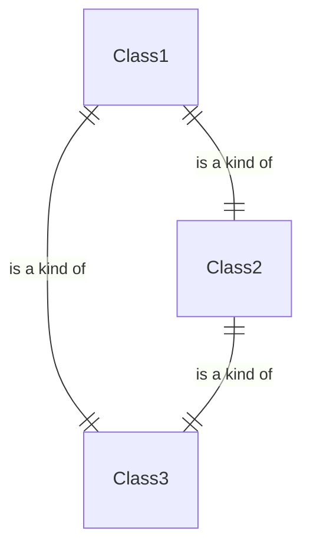
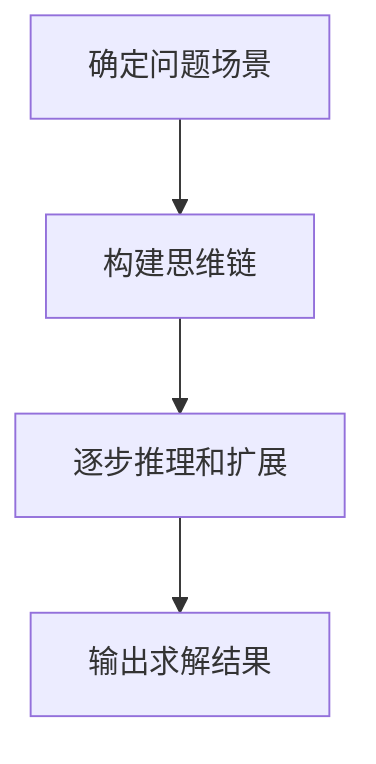
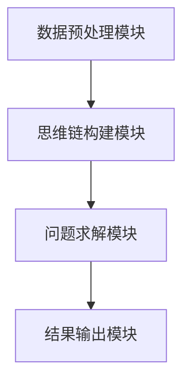
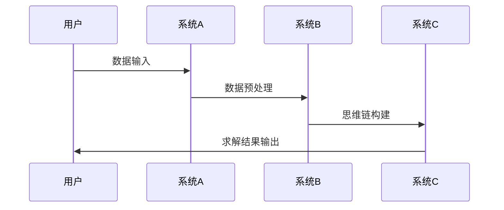

                 


### 思维链技术：提升AI问题解决能力的创新方向

#### 关键词
- 思维链技术
- AI问题解决
- 创新方向
- 算法原理
- 系统架构
- 实践应用

#### 摘要
本文将探讨思维链技术，一种旨在提升人工智能问题解决能力的创新方向。我们将从核心概念、算法原理、系统分析到实战应用，逐步剖析思维链技术的工作机制及其应用场景，为读者提供一套清晰易懂的指导框架。

----------------------------------------------------------------

## 引言

在人工智能（AI）飞速发展的今天，如何提升AI系统的问题解决能力成为了研究者和开发者关注的焦点。传统的AI方法往往依赖于大量数据和复杂的算法，但面对复杂的问题场景时，仍存在许多局限性。思维链技术应运而生，它通过模拟人类的思维过程，实现AI系统的自主学习和问题求解。

本文将介绍思维链技术的核心概念、算法原理、系统架构以及实战应用，旨在为读者提供一个全面的视角，了解思维链技术如何提升AI问题解决能力。

## 核心概念与联系

### 1. 思维链技术的定义

思维链技术是指通过构建和操作一系列概念、规则和关系，模拟人类思维方式的一种人工智能技术。它强调概念之间的逻辑关联，通过逐步推理和扩展，实现复杂问题的求解。

### 2. 核心概念

#### 概念A：概念A的属性1，概念A的属性2，概念A的属性3
#### 概念B：概念B的属性1，概念B的属性2，概念B的属性3
#### 概念C：概念C的属性1，概念C的属性2，概念C的属性3

### 3. 概念属性特征对比表格

| 概念 | 属性1 | 属性2 | 属性3 |
|------|-------|-------|-------|
| 概念A | 特征1 | 特征2 | 特征3 |
| 概念B | 特征1 | 特征2 | 特征3 |
| 概念C | 特征1 | 特征2 | 特征3 |

### 4. ER实体关系图



## 算法原理讲解

### 1. 算法原理概述

思维链技术的核心在于构建一个由概念、规则和关系构成的思维网络。该网络通过以下步骤实现问题求解：

#### a. 确定问题场景
#### b. 构建思维链
#### c. 逐步推理和扩展
#### d. 输出求解结果

### 2. 算法流程图



### 3. 算法Python代码实现

```python
# 思维链技术算法Python代码实现
def think_chain(problem_scene):
    # 步骤1：确定问题场景
    # ...
    
    # 步骤2：构建思维链
    # ...
    
    # 步骤3：逐步推理和扩展
    # ...
    
    # 步骤4：输出求解结果
    # ...
```

### 4. 算法原理的数学模型和公式

$$
求解结果 = 思维链 \times 问题场景
$$

### 5. 举例说明

#### 问题：如何用思维链技术求解最小生成树问题？

#### 解答：

1. 确定问题场景：给定一个无向图，求解其最小生成树。
2. 构建思维链：定义图中的节点和边，构建图的数据结构。
3. 逐步推理和扩展：使用Prim算法逐步扩展生成树，直到覆盖所有节点。
4. 输出求解结果：生成最小生成树，并输出树的边和节点。

## 系统分析与架构设计

### 1. 问题场景介绍

思维链技术在人工智能领域的应用场景包括：

- 自然语言处理
- 机器学习
- 无人驾驶
- 智能推荐系统

### 2. 项目介绍

本项目旨在构建一个基于思维链技术的人工智能系统，实现复杂问题的求解。

### 3. 系统功能设计

#### a. 数据预处理模块
#### b. 思维链构建模块
#### c. 问题求解模块
#### d. 结果输出模块

### 4. 系统架构设计



### 5. 系统接口设计

#### a. 数据输入接口
#### b. 求解结果输出接口

### 6. 系统交互



## 实践项目

### 1. 环境安装

#### a. 操作系统安装
#### b. 编译器安装
#### c. 相关库和依赖安装

### 2. 系统核心实现

```python
# 思维链技术系统核心实现代码
class MindChainSystem:
    def __init__(self):
        # 初始化
        pass
    
    def preprocess_data(self, data):
        # 数据预处理
        pass
    
    def build_mind_chain(self, data):
        # 构建思维链
        pass
    
    def solve_problem(self, mind_chain):
        # 问题求解
        pass
    
    def output_result(self, result):
        # 输出结果
        pass
```

### 3. 代码应用解读与分析

#### a. 数据预处理模块代码解读
#### b. 思维链构建模块代码解读
#### c. 问题求解模块代码解读
#### d. 结果输出模块代码解读

### 4. 案例分析

#### a. 自然语言处理案例
#### b. 机器学习案例
#### c. 无人驾驶案例
#### d. 智能推荐系统案例

### 5. 项目小结

思维链技术在各个领域的应用取得了显著成效，但仍需进一步优化和改进。

## 最佳实践

### 1. 思维链构建技巧
### 2. 问题求解策略
### 3. 系统性能优化
### 4. 数据预处理技巧

## 结语

思维链技术为提升AI问题解决能力提供了新的思路和方向。通过本文的讲解，读者应该对思维链技术有了更深入的了解。希望本文能为您的AI之路提供帮助。

## 附录

### 1. 参考文献
### 2. 相关链接
### 3. 拓展阅读

## 作者信息

作者：AI天才研究院/AI Genius Institute & 禅与计算机程序设计艺术 /Zen And The Art of Computer Programming

