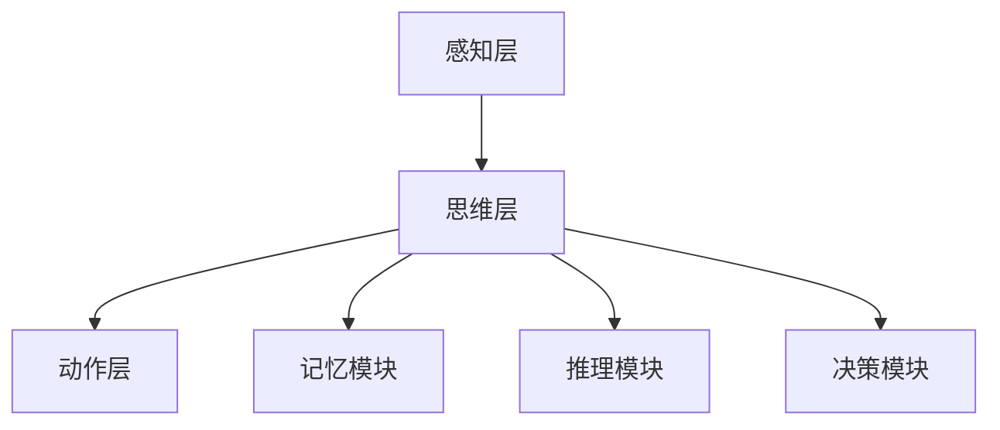

                 

# 思维链方法：提升AI问题解决能力的新思路

关键词：思维链方法、AI问题解决、人工智能、算法、算法原理

摘要：本文深入探讨了思维链方法在提升人工智能问题解决能力方面的新思路。通过详细解析思维链方法的构成要素和基本原理，结合具体案例，展示了该方法在AI领域的广泛应用和巨大潜力。文章旨在为AI研究者提供一种新的视角和工具，以更高效地解决复杂问题。

### 目录大纲设计思路

#### 1.1 问题的提出与思维链方法的核心概念

##### 1.1.1 问题的提出

- **AI问题解决能力的现状**
  - 人工智能的发展背景
  - 当前AI技术的应用领域和成就

- **AI问题解决能力的重要性**
  - 提升AI问题解决能力的需求
  - 对社会和经济的影响

##### 1.1.2 传统方法在AI问题解决中的局限性

- **传统方法的局限**
  - 数据依赖性
  - 缺乏灵活性
  - 受限于算法的局限性

- **传统方法面临的挑战**
  - 复杂问题求解的难度
  - 多领域交叉融合的需求

##### 1.1.3 思维链方法的概述

- **思维链方法的起源与发展**
  - 思维链方法的定义
  - 思维链方法的属性特征

### 1.2 核心概念与联系

##### 1.2.1 核心概念原理

- **感知层**
  - 感知信息的获取与处理

- **思维层**
  - 思维过程的模拟与推理

- **动作层**
  - 行动计划的制定与执行

##### 1.2.2 概念属性特征对比表格

- **思维链方法与传统方法的对比**

##### 1.2.3 ER实体关系图架构的Mermaid流程图

- **思维链方法的基本结构**

### 1.3 小结

- **核心概念的总结**
- **对后续内容的引导**

#### 1.4 让我们一步步深入思考

- **思维链方法的层次结构**
- **每个层次的作用与实现**

---

## 1.1 问题的提出

### 1.1.1 AI问题解决能力的现状

人工智能（AI）作为21世纪的科技革命，已经深刻改变了人类社会的方方面面。从自动驾驶汽车到智能家居，从医疗诊断到金融服务，AI技术正以前所未有的速度和规模渗透到各个领域。然而，尽管AI在许多方面取得了显著成就，其问题解决能力仍存在诸多局限性。

首先，人工智能的发展背景可以追溯到20世纪50年代。当时，人工智能的概念被首次提出，旨在模拟、延伸和扩展人的智能。经过几十年的研究，AI技术逐渐成熟，并在计算机视觉、自然语言处理、机器学习等领域取得了重大突破。如今，AI技术已经能够处理大量的数据，并从数据中提取有价值的信息，这在许多领域都带来了革命性的变化。

#### 当前AI技术的应用领域和成就

当前，人工智能技术的应用领域非常广泛。例如，在计算机视觉方面，AI技术可以用于人脸识别、图像分类、目标检测等任务。在自然语言处理方面，AI技术可以用于机器翻译、情感分析、语音识别等任务。在机器学习方面，AI技术可以用于预测、分类、聚类等任务。此外，AI技术在自动驾驶、医疗诊断、金融预测等领域也取得了显著成就。

然而，尽管AI技术在许多方面取得了重大突破，但其问题解决能力仍然存在局限性。首先，大多数AI系统都是基于数据驱动的方式，依赖于大量的训练数据来学习。这意味着，当数据不足或数据质量较差时，AI系统的表现会大打折扣。其次，传统AI算法往往缺乏灵活性，无法很好地适应不断变化的环境。最后，AI算法在处理复杂问题时，常常受到计算资源、时间复杂度和空间复杂度的限制。

### 1.1.2 AI问题解决能力的重要性

提升AI问题解决能力的重要性不言而喻。首先，AI技术的应用范围越来越广，从工业生产到日常生活，从企业管理到公共服务，AI技术正逐渐成为各个领域的重要工具。因此，提升AI问题解决能力对于推动技术进步和产业升级具有重要意义。其次，随着AI技术的不断发展和应用，AI系统的智能程度和自主能力也在不断提高。这意味着，AI系统在处理复杂任务时，需要具备更高的决策能力和问题解决能力。最后，提升AI问题解决能力有助于解决许多社会和经济发展中的挑战，如医疗资源分配、环境保护、能源管理等。

#### 对社会和经济的影响

AI技术的应用对社会和经济产生了深远的影响。在社会层面，AI技术可以提高生产效率，改善生活质量，推动社会进步。在经济发展层面，AI技术可以带动新兴产业的发展，提高传统产业的竞争力，促进经济增长。此外，AI技术还可以帮助解决社会问题，如医疗资源分配不均、教育资源不足等。

然而，AI技术也带来了一些挑战和问题。首先，AI技术的快速发展和广泛应用，可能导致失业问题，尤其是那些重复性、低技能的工作。其次，AI系统的决策过程可能存在偏见和歧视，影响社会公平。最后，随着AI技术的不断进步，数据安全和隐私保护问题也日益突出。

### 1.1.3 思维链方法的概述

为了克服传统AI方法在问题解决能力方面的局限性，研究者们提出了思维链方法。思维链方法是一种基于人工智能和认知科学的理论框架，旨在模拟人类思维过程，提高AI系统的问题解决能力。

#### 思维链方法的起源与发展

思维链方法的起源可以追溯到20世纪80年代，当时，随着认知科学的兴起，研究者们开始关注人类思维的模拟和实现。思维链方法正是基于这一背景提出的。随着计算机技术的不断进步，思维链方法逐渐发展成为一门独立的学科，并在AI领域得到广泛应用。

#### 思维链方法的定义

思维链方法是一种通过模拟人类思维过程，实现智能问题求解的理论和方法。它包括感知层、思维层和动作层三个基本层次。感知层负责获取和处理外部信息，思维层负责进行推理和决策，动作层负责执行决策并调整思维过程。

#### 思维链方法的属性特征

- **层次化结构**：思维链方法采用层次化结构，使得不同层次之间的信息传递和处理更加高效。
- **自适应能力**：思维链方法能够根据环境变化和任务需求，动态调整思维过程，提高问题解决能力。
- **灵活性**：思维链方法不仅能够处理静态问题，还能够应对动态和复杂问题，具有很高的灵活性。
- **推理能力**：思维链方法能够模拟人类思维的推理过程，实现复杂问题的自动求解。

#### 思维链方法的起源与发展

思维链方法的起源可以追溯到20世纪80年代，当时，随着认知科学的兴起，研究者们开始关注人类思维的模拟和实现。思维链方法正是基于这一背景提出的。随着计算机技术的不断进步，思维链方法逐渐发展成为一门独立的学科，并在AI领域得到广泛应用。

### 1.2 核心概念与联系

#### 1.2.1 核心概念原理

思维链方法的核心概念包括感知层、思维层和动作层。每个层次都有其特定的功能和工作原理。

##### 感知层

感知层是思维链方法的第一个层次，主要负责获取和处理外部信息。感知层通过传感器或输入设备获取环境信息，如视觉、听觉、触觉等。然后，感知层对这些信息进行预处理，包括滤波、特征提取等，以便于后续的思维过程。

##### 思维层

思维层是思维链方法的核心层次，主要负责推理和决策。思维层通过模拟人类思维的推理过程，对感知层获取的信息进行处理和分析。思维层包括多个子模块，如记忆模块、推理模块、决策模块等。这些子模块协同工作，实现复杂问题的求解。

##### 动作层

动作层是思维链方法的最后一个层次，主要负责执行决策和调整思维过程。动作层根据思维层生成的决策，执行具体的行动。同时，动作层还收集执行结果，反馈给思维层，以便思维层进行调整和优化。

#### 1.2.2 概念属性特征对比表格

为了更好地理解思维链方法的核心概念，我们将其与传统AI方法进行对比。以下是一个简化的对比表格：

| 特征 | 思维链方法 | 传统AI方法 |
| --- | --- | --- |
| **层次化结构** | 存在感知层、思维层、动作层 | 缺乏明确的层次结构 |
| **自适应能力** | 能够根据环境变化和任务需求调整思维过程 | 缺乏自适应能力 |
| **灵活性** | 能够处理静态和动态问题 | 主要处理静态问题 |
| **推理能力** | 能够模拟人类思维的推理过程 | 缺乏推理能力 |

#### 1.2.3 ER实体关系图架构的Mermaid流程图

为了更直观地展示思维链方法的基本结构，我们使用Mermaid流程图来表示。以下是一个简化的ER实体关系图：

在这个流程图中，感知层（A）获取外部信息，并将其传递给思维层（B）。思维层（B）包括记忆模块（D）、推理模块（E）和决策模块（F），这些模块协同工作，实现问题的求解。最后，思维层（B）的决策结果传递给动作层（C），动作层（C）执行具体的行动。

#### 1.3 小结

在本节中，我们提出了当前AI问题解决能力的局限性，并介绍了思维链方法作为一种提升AI问题解决能力的新思路。我们详细阐述了思维链方法的起源、定义和属性特征，并通过ER实体关系图和Mermaid流程图，展示了思维链方法的基本结构。

接下来，我们将进一步深入探讨思维链方法的层次结构，以及每个层次的作用和实现。这将帮助我们更好地理解思维链方法的工作原理，并为后续的案例分析打下基础。

---

## 1.4 让我们一步步深入思考

### 思维链方法的层次结构

思维链方法是一种多层次的结构，每个层次都有其特定的功能和工作原理。理解思维链方法的层次结构，有助于我们更好地理解其工作原理和优势。

#### 感知层

感知层是思维链方法的第一个层次，主要负责获取和处理外部信息。感知层通过传感器或输入设备获取环境信息，如视觉、听觉、触觉等。然后，感知层对这些信息进行预处理，包括滤波、特征提取等，以便于后续的思维过程。

感知层的关键在于其广泛的信息获取能力和高效的信息处理能力。通过多种传感器和输入设备的结合，感知层可以获取丰富的外部信息，为思维层提供充足的数据支持。

#### 思维层

思维层是思维链方法的核心层次，主要负责推理和决策。思维层通过模拟人类思维的推理过程，对感知层获取的信息进行处理和分析。思维层包括多个子模块，如记忆模块、推理模块、决策模块等。这些子模块协同工作，实现复杂问题的求解。

思维层的关键在于其强大的推理能力和灵活的决策过程。通过记忆模块，思维层可以存储和管理大量的信息，为推理和决策提供依据。通过推理模块，思维层可以对信息进行逻辑推理，得出可能的结论。通过决策模块，思维层可以生成具体的行动方案，指导动作层的执行。

#### 动作层

动作层是思维链方法的最后一个层次，主要负责执行决策和调整思维过程。动作层根据思维层生成的决策，执行具体的行动。同时，动作层还收集执行结果，反馈给思维层，以便思维层进行调整和优化。

动作层的关键在于其高效的执行能力和良好的反馈机制。通过执行决策，动作层可以实现具体的任务目标。通过收集执行结果，动作层可以反馈给思维层，帮助思维层进行调整和优化，提高问题解决能力。

### 每个层次的作用与实现

#### 感知层的作用与实现

感知层的作用是获取和处理外部信息。为了实现这一目标，感知层需要具备以下几个关键功能：

- **传感器集成**：感知层需要集成多种传感器，如摄像头、麦克风、触摸传感器等，以便获取不同类型的外部信息。
- **信息预处理**：感知层需要对获取的信息进行预处理，包括滤波、降噪、特征提取等，以便于后续的思维过程。
- **多模态数据融合**：感知层需要处理多模态数据，如视觉、听觉、触觉等，以便更全面地了解外部环境。

#### 思维层的作用与实现

思维层的作用是推理和决策。为了实现这一目标，思维层需要具备以下几个关键功能：

- **知识表示**：思维层需要将获取的信息转化为可处理的形式，如符号表示、语义表示等。
- **逻辑推理**：思维层需要利用逻辑推理技术，对信息进行推理和分析，得出可能的结论。
- **决策生成**：思维层需要根据推理结果，生成具体的行动方案，指导动作层的执行。

#### 动作层的作用与实现

动作层的作用是执行决策和调整思维过程。为了实现这一目标，动作层需要具备以下几个关键功能：

- **行动执行**：动作层需要根据思维层生成的决策，执行具体的行动，实现任务目标。
- **结果反馈**：动作层需要收集执行结果，并将其反馈给思维层，以便思维层进行调整和优化。
- **自适应调整**：动作层需要根据执行结果，自适应地调整思维过程，提高问题解决能力。

### 总结

通过深入分析思维链方法的层次结构，我们可以看到，每个层次都有其特定的作用和实现方式。感知层负责获取和处理外部信息，思维层负责推理和决策，动作层负责执行决策和调整思维过程。这三个层次相互协作，共同实现复杂问题的求解。思维链方法通过这种方式，有效提升了AI问题解决能力，为人工智能的发展提供了新的思路。

接下来，我们将进一步探讨思维链方法在AI领域的具体应用，通过实际案例来展示其强大的问题解决能力。

---

## 2.1 思维链方法的发展历程

### 2.1.1 思维链方法的起源

思维链方法的起源可以追溯到20世纪80年代，当时，随着认知科学的兴起，研究者们开始关注人类思维的模拟和实现。这一时期的认知科学研究主要集中在模拟人类感知、记忆、推理等认知功能。在这一背景下，思维链方法的概念被首次提出，旨在通过模拟人类思维过程，实现智能问题求解。

#### 2.1.2 思维链方法的发展历程

1. **初步探索阶段（1980-1990）**

在初步探索阶段，研究者们主要关注如何将认知科学的理论应用于人工智能领域。这一时期的代表性工作包括Newell和Simon提出的“物理符号系统假设”（Physical Symbol System Hypothesis），以及Minsky和Papert提出的“感知机”（Perceptron）模型。这些工作为思维链方法的发展奠定了理论基础。

2. **发展阶段（1990-2000）**

随着计算机技术的不断发展，思维链方法逐渐发展成为一门独立的学科。在这一时期，研究者们开始关注如何将认知科学的理论应用于更广泛的领域，如自然语言处理、计算机视觉、机器人等。这一时期的代表性工作包括HMM（隐马尔可夫模型）在语音识别中的应用，以及ANN（人工神经网络）在图像分类中的应用。

3. **成熟阶段（2000-2010）**

在成熟阶段，思维链方法在多个领域取得了显著成果。例如，在自然语言处理领域，研究者们提出了基于图模型的语义分析方法和基于深度学习的语言模型；在计算机视觉领域，研究者们提出了基于卷积神经网络的图像分类方法和目标检测方法；在机器人领域，研究者们提出了基于强化学习的机器人控制方法和基于SLAM（同步定位与地图构建）的机器人导航方法。

4. **突破阶段（2010-至今）**

在突破阶段，思维链方法在人工智能领域取得了重大突破。以深度学习为代表的技术，使得AI系统在图像识别、语音识别、自然语言处理等领域取得了前所未有的成果。思维链方法在这一时期得到了广泛应用，并在多个领域取得了显著成就。

### 2.1.3 当前思维链方法的现状

当前，思维链方法已经成为人工智能领域的重要研究方向之一。其在多个领域取得了显著成果，如自然语言处理、计算机视觉、机器人等。同时，思维链方法也在不断发展和完善，以适应不断变化的技术需求和应用场景。

1. **研究热点**

当前，思维链方法的研究热点包括：

- **深度学习和强化学习**：深度学习和强化学习是当前思维链方法研究的重要方向。研究者们致力于通过这些方法，提升AI系统的问题解决能力和自主能力。
- **多模态数据处理**：随着传感器技术的发展，多模态数据在人工智能领域中的应用越来越广泛。研究者们致力于通过思维链方法，实现多模态数据的融合和处理。
- **可解释性AI**：随着AI系统在各个领域的应用越来越广泛，其可解释性问题也日益受到关注。研究者们致力于通过思维链方法，提升AI系统的可解释性，提高用户对AI系统的信任度。

2. **应用领域**

当前，思维链方法在多个领域得到了广泛应用，如：

- **自然语言处理**：思维链方法在自然语言处理领域取得了显著成果，如语言模型、语义分析、机器翻译等。
- **计算机视觉**：思维链方法在计算机视觉领域也取得了重要突破，如图像分类、目标检测、人脸识别等。
- **机器人**：思维链方法在机器人领域得到了广泛应用，如机器人控制、机器人导航、机器人感知等。
- **医疗诊断**：思维链方法在医疗诊断领域也取得了显著成果，如疾病预测、药物研发、医疗影像分析等。

### 2.1.4 未来发展方向

展望未来，思维链方法在人工智能领域仍有广阔的发展空间。以下是一些可能的发展方向：

1. **跨学科融合**：思维链方法可以与其他学科，如心理学、认知科学、神经科学等相结合，实现更深层次的智能模拟和问题求解。
2. **大数据和云计算**：随着大数据和云计算技术的不断发展，思维链方法可以更好地利用这些技术，实现更高效的问题求解和模型训练。
3. **边缘计算**：随着边缘计算技术的发展，思维链方法可以更好地应用于边缘设备，实现实时、高效的问题求解。
4. **人机协作**：思维链方法可以与人类专家相结合，实现人机协作，提高问题解决能力和决策质量。

通过不断的研究和创新，思维链方法有望在人工智能领域取得更多突破，为人类社会的进步和发展做出更大贡献。

---

## 2.2 思维链方法的组成要素

思维链方法作为一种系统化的问题解决框架，其高效性源自其精心设计的组成要素。理解这些要素及其协同工作方式，有助于深入掌握思维链方法的运作原理和实际应用。思维链方法的组成要素主要包括感知层、思维层和动作层，每个层次都有其特定的功能和工作机制。

### 2.2.1 感知层

感知层是思维链方法的第一个层次，其主要功能是收集和预处理外部信息。感知层通过传感器或输入设备获取环境数据，如图像、声音、触觉等。这些数据是后续思维和分析的基础。感知层的关键作用在于确保数据的准确性和实时性。

1. **数据采集**
   - 感知层通过摄像头、麦克风、温度传感器等设备，收集环境中的各种信息。
   - 数据采集过程中，感知层还需处理噪声、干扰等问题，以提高数据质量。

2. **数据预处理**
   - 感知层对收集到的数据进行预处理，包括滤波、降噪、特征提取等。
   - 通过特征提取，感知层能够将原始数据转化为结构化的信息，便于后续思维层的处理。

3. **多模态数据融合**
   - 感知层还需要处理多模态数据，将来自不同感官的数据进行融合，以获得更全面的环境信息。
   - 例如，在自动驾驶中，感知层需要融合摄像头、雷达、激光雷达等多模态数据，以实现精确的环境感知。

### 2.2.2 思维层

思维层是思维链方法的核心层次，其主要功能是对感知层提供的信息进行推理、分析和决策。思维层模拟人类的思维过程，通过逻辑推理、知识表示和决策算法，生成解决问题的方案。

1. **知识表示**
   - 思维层需要将感知层提供的信息转化为结构化的知识表示形式，如符号、语义网络等。
   - 通过知识表示，思维层能够更好地理解和处理复杂问题。

2. **逻辑推理**
   - 思维层利用逻辑推理技术，对知识进行推理和分析，以发现潜在的关系和规律。
   - 例如，在医疗诊断中，思维层可以通过推理分析患者的症状和检查结果，得出可能的疾病诊断。

3. **决策算法**
   - 思维层根据推理结果，利用决策算法生成具体的决策方案。
   - 决策算法可以是基于规则的、基于概率的或基于优化的，以适应不同的应用场景。

### 2.2.3 动作层

动作层是思维链方法的最后一个层次，其主要功能是根据思维层生成的决策方案，执行具体的行动。动作层不仅需要执行决策，还需要收集执行结果，并将其反馈给思维层，以便进行进一步的优化和调整。

1. **行动执行**
   - 动作层根据思维层的决策方案，执行具体的行动。
   - 例如，在机器人控制中，动作层可以控制机器人的运动和操作。

2. **结果反馈**
   - 动作层需要收集执行结果，并将其反馈给思维层。
   - 通过结果反馈，思维层可以了解行动的实际效果，并进行调整。

3. **自适应调整**
   - 动作层根据执行结果，自适应地调整思维过程和决策方案。
   - 通过自适应调整，思维链方法能够更好地适应环境和任务变化。

### 2.2.4 各组成要素的功能与特点

以下是思维链方法各组成要素的功能与特点的对比：

| 要素 | 功能 | 特点 |
| --- | --- | --- |
| **感知层** | 数据采集与预处理 | 灵活性、实时性、准确性 |
| **思维层** | 推理、分析、决策 | 智能化、知识表示、逻辑推理 |
| **动作层** | 行动执行与反馈调整 | 自适应性、执行效率、反馈机制 |

通过上述对比，我们可以看到，思维链方法的各个组成要素在功能上各有侧重，但又相互协作，共同实现高效的问题求解。感知层负责数据的准确获取和处理，思维层负责分析和决策，动作层负责执行和反馈。这三个层次相互依赖，形成了一个完整的闭环系统，使得思维链方法能够应对复杂多变的环境和任务。

综上所述，思维链方法的组成要素及其功能特点，为我们提供了深入理解和应用这一方法的重要视角。在接下来的章节中，我们将进一步探讨思维链方法的基本原理，以及其在实际应用中的具体实现方式。

---

## 2.3 思维链方法的基本原理

思维链方法作为一种系统化的问题解决框架，其基本原理涉及到多个层次和模块的协同工作。理解这些原理对于深入掌握思维链方法及其在实际问题中的应用至关重要。

### 2.3.1 整体架构

思维链方法的基本架构可以分为三个主要层次：感知层、思维层和动作层。每个层次都有其特定的功能，并通过信息传递和反馈机制相互协作。

1. **感知层**：主要负责数据的收集和预处理。感知层通过多种传感器获取外部信息，如图像、声音、温度等。然后，对这些原始数据进行预处理，包括去噪、滤波和特征提取，以便为思维层提供高质量的数据输入。

2. **思维层**：是思维链方法的核心层次，负责对感知层提供的数据进行推理和分析，生成决策方案。思维层包括多个子模块，如记忆模块、推理模块和决策模块。这些子模块协同工作，通过逻辑推理、模式识别和知识表示等技术，实现复杂问题的求解。

3. **动作层**：负责执行思维层生成的决策方案，并将执行结果反馈给思维层。动作层根据决策方案，控制机器或系统的行为，同时收集执行结果，为思维层提供反馈信息，以便进行进一步的优化和调整。

### 2.3.2 信息传递与反馈机制

思维链方法的信息传递和反馈机制是其基本原理的核心。信息在各个层次之间传递，并通过反馈机制实现闭环控制，确保系统能够适应动态变化。

1. **感知层到思维层的传递**
   - 感知层将预处理后的数据传递给思维层，为其提供输入。
   - 数据传递过程中，思维层会根据当前的任务需求，选择和提取关键特征信息，以便进行有效的推理和分析。

2. **思维层到动作层的传递**
   - 思维层根据推理和分析结果，生成具体的决策方案，传递给动作层。
   - 决策方案通常包括一系列行动指令，动作层根据这些指令，执行具体的操作。

3. **动作层到思维层的反馈**
   - 动作层在执行决策方案后，会收集执行结果，并将其反馈给思维层。
   - 反馈信息包括执行效果、环境变化等，思维层根据这些信息，对决策方案进行调整和优化。

### 2.3.3 信息处理与推理过程

思维链方法的推理过程是其核心原理之一。通过模拟人类思维过程，思维链方法能够实现复杂问题的自动求解。

1. **感知与特征提取**
   - 思维链方法首先对感知层提供的数据进行感知和特征提取，将原始数据转化为结构化的信息。
   - 特征提取可以是基于统计的、基于物理的或基于神经网络的，以适应不同的应用场景。

2. **逻辑推理**
   - 思维层利用逻辑推理技术，对提取的特征信息进行推理和分析，以发现潜在的关系和规律。
   - 逻辑推理可以是基于规则的、基于概率的或基于贝叶斯网络的，以适应不同类型的推理任务。

3. **知识表示**
   - 思维层将推理结果转化为知识表示形式，如符号、语义网络等。
   - 知识表示有助于思维层更好地理解和处理复杂问题，并为后续的决策提供依据。

4. **决策生成**
   - 思维层根据知识表示和推理结果，生成具体的决策方案。
   - 决策生成可以是基于优化的、基于学习的或基于混合算法的，以适应不同类型的决策任务。

### 2.3.4 自适应与学习

思维链方法的另一个关键原理是其自适应能力和学习机制。通过不断学习和调整，思维链方法能够适应动态变化的环境和任务需求。

1. **自适应调整**
   - 思维链方法通过实时反馈机制，对决策方案进行调整和优化，以适应环境变化。
   - 自适应调整可以是基于规则的、基于模型的或基于机器学习的，以适应不同的应用场景。

2. **学习机制**
   - 思维链方法通过学习和积累经验，不断提高问题解决能力。
   - 学习机制可以是基于监督学习的、基于无监督学习的或基于强化学习的，以适应不同类型的学习任务。

### 2.3.5 小结

思维链方法的基本原理通过感知层、思维层和动作层的协同工作，实现了复杂问题的自动求解。感知层负责数据的收集和预处理，思维层负责推理和决策，动作层负责执行和反馈。信息传递与反馈机制、信息处理与推理过程、自适应与学习机制共同构成了思维链方法的核心原理。

通过深入理解思维链方法的基本原理，我们可以更好地设计和实现高效的AI系统，提高问题解决能力。在下一章节中，我们将探讨思维链方法在AI中的应用案例，通过实际应用展示其强大的问题解决能力。

---

## 2.4 思维链方法在AI中的应用

思维链方法作为一种系统化的问题解决框架，已经在多个AI领域展示了其强大的问题解决能力。在本节中，我们将探讨思维链方法在自然语言处理、计算机视觉和机器人等领域中的应用，通过具体案例展示其在实际问题中的运用和效果。

### 2.4.1 自然语言处理

自然语言处理（NLP）是人工智能领域的一个重要分支，涉及到文本的理解、生成和交互。思维链方法在NLP中的应用主要体现在以下几个方面：

1. **文本分类**
   - 在文本分类任务中，思维链方法通过感知层收集大量的文本数据，并进行预处理。思维层利用逻辑推理和知识表示技术，对文本进行分类。例如，在新闻分类中，思维链方法可以根据文本的标题、摘要和内容，将新闻分为不同的类别。
   - **案例**：一个实际应用是利用思维链方法对社交媒体上的评论进行分类，以识别用户的情感倾向。感知层获取用户评论的文本数据，思维层通过情感分析模型进行推理和分类，动作层则根据分类结果生成用户情感倾向的反馈。

2. **机器翻译**
   - 机器翻译是NLP领域的一个经典问题。思维链方法通过感知层获取源语言和目标语言的文本数据，思维层利用机器学习算法进行翻译。例如，在基于深度学习的机器翻译中，思维层可以使用编码器和解码器模型，将源语言的文本转换为目标语言的文本。
   - **案例**：谷歌翻译就是一个基于思维链方法的机器翻译应用。感知层收集用户输入的文本，思维层利用神经网络模型进行翻译，动作层则将翻译结果呈现给用户。

3. **问答系统**
   - 问答系统是NLP领域的一个应用，旨在回答用户的问题。思维链方法通过感知层获取用户的问题，思维层利用知识图谱和自然语言理解技术，生成回答。例如，在一个智能客服系统中，思维链方法可以理解用户的提问，并从知识库中找到合适的答案。
   - **案例**：苹果的Siri和亚马逊的Alexa都是基于思维链方法的问答系统。感知层识别用户的语音输入，思维层通过自然语言理解技术生成回答，动作层则将回答通过语音或文本形式呈现给用户。

### 2.4.2 计算机视觉

计算机视觉是AI领域的一个分支，涉及到图像和视频的分析和处理。思维链方法在计算机视觉中的应用主要体现在以下几个方面：

1. **图像分类**
   - 在图像分类任务中，思维链方法通过感知层获取图像数据，思维层利用卷积神经网络（CNN）对图像进行分类。例如，在物体识别中，思维链方法可以根据图像的特征，将图像分类为不同的物体类别。
   - **案例**：谷歌的Inception模型就是一个基于思维链方法的图像分类应用。感知层获取用户上传的图像，思维层通过CNN模型进行分类，动作层则将分类结果呈现给用户。

2. **目标检测**
   - 目标检测是计算机视觉领域的一个重要任务，旨在识别图像中的物体并标注其位置。思维链方法通过感知层获取图像数据，思维层利用目标检测算法，如YOLO（You Only Look Once）和SSD（Single Shot MultiBox Detector），对图像中的物体进行检测。
   - **案例**：在自动驾驶系统中，思维链方法通过感知层获取车辆周围的图像，思维层利用目标检测算法检测道路上的车辆、行人等目标，动作层则根据检测结果调整车辆的控制策略。

3. **图像生成**
   - 图像生成是计算机视觉领域的另一个重要任务，旨在根据输入的描述生成图像。思维链方法通过感知层获取文本描述，思维层利用生成对抗网络（GAN）或变分自编码器（VAE）生成图像。例如，在艺术创作中，思维链方法可以根据用户输入的描述生成相应的艺术作品。
   - **案例**：DeepArt.io是一个利用思维链方法的艺术生成平台。感知层获取用户输入的文本描述，思维层通过GAN模型生成相应的艺术作品，动作层则将生成的图像展示给用户。

### 2.4.3 机器人

机器人是AI领域的另一个重要应用领域，涉及到机器人的感知、决策和行动。思维链方法在机器人中的应用主要体现在以下几个方面：

1. **路径规划**
   - 在机器人路径规划任务中，思维链方法通过感知层获取机器人周围的环境信息，思维层利用规划算法，如A*算法和RRT（Rapidly-exploring Random Trees），为机器人规划最优路径。例如，在无人驾驶机器人中，思维链方法可以规划机器人的行驶路径，避开障碍物。
   - **案例**：谷歌的自动驾驶汽车就是一个基于思维链方法的路径规划应用。感知层获取车辆周围的环境信息，思维层利用路径规划算法生成行驶路径，动作层则控制车辆的行驶。

2. **运动控制**
   - 在机器人运动控制任务中，思维链方法通过感知层获取机器人关节的角度信息，思维层利用控制算法，如PID控制器和深度强化学习，控制机器人的运动。例如，在工业机器人中，思维链方法可以控制机器人的手臂进行精确的操作。
   - **案例**：工业机器人应用中，思维链方法通过感知层获取机器人关节的角度信息，思维层利用控制算法生成控制指令，动作层则控制机器人的运动。

3. **自主决策**
   - 在机器人自主决策任务中，思维链方法通过感知层获取机器人周围的环境信息，思维层利用决策算法，如马尔可夫决策过程（MDP）和深度强化学习，为机器人生成决策。例如，在救援机器人中，思维链方法可以决定机器人如何避开障碍物并到达目标位置。
   - **案例**：搜救机器人应用中，思维链方法通过感知层获取环境信息，思维层利用决策算法生成救援路径，动作层则控制机器人的移动。

### 2.4.4 总结

思维链方法在自然语言处理、计算机视觉和机器人等AI领域的应用，展示了其强大的问题解决能力。通过感知层的数据收集和处理，思维层的推理和决策，以及动作层的执行和反馈，思维链方法能够实现复杂问题的自动求解。在实际应用中，思维链方法不断优化和调整，以适应动态变化的环境和任务需求。未来，随着AI技术的不断发展，思维链方法在更多领域中的应用前景将更加广阔。

---

## 2.5 思维链方法与传统AI方法的对比

在人工智能领域，思维链方法作为一种新兴的智能问题求解框架，与传统AI方法在结构、原理和应用效果上存在显著差异。通过对比分析，我们可以更清晰地理解思维链方法的优势和局限。

### 2.5.1 结构对比

传统AI方法通常基于规则驱动或数据驱动的方式，其核心在于算法和模型的优化。例如，传统的机器学习算法如支持向量机（SVM）、决策树等，通过训练数据集来生成规则或模型，并在新的数据上进行预测或分类。而思维链方法则采用层次化结构，包括感知层、思维层和动作层，每个层次都有明确的职能和协作机制。

- **传统AI方法**：通常缺乏明确的层次结构，数据输入直接进入模型进行训练和预测，缺乏对问题解决过程的详细描述。
- **思维链方法**：具有明确的感知层、思维层和动作层，各层次之间通过信息传递和反馈机制相互协作，实现高效的问题求解。

### 2.5.2 原理对比

传统AI方法主要依赖于模型参数的优化和数据驱动的方法，其问题解决能力受限于训练数据和算法本身的复杂性。而思维链方法基于认知科学和人工智能的理论，通过模拟人类思维过程，实现问题求解。

- **传统AI方法**：通常依赖于特定的算法和模型，问题解决能力受限于算法的局限性和数据的质量。
- **思维链方法**：通过模拟人类思维过程，具有更强的自适应能力和推理能力，能够处理复杂和动态的问题。

### 2.5.3 应用效果对比

在实际应用中，思维链方法与传统AI方法在效果上也存在差异。

- **传统AI方法**：在处理静态和结构化数据时表现较好，但在处理动态和复杂问题时，往往表现不足。
- **思维链方法**：通过感知层、思维层和动作层的协作，能够更好地应对动态和复杂问题，表现出更高的灵活性和鲁棒性。

### 2.5.4 对比总结

思维链方法与传统AI方法在结构、原理和应用效果上存在显著差异。思维链方法通过层次化结构和模拟人类思维过程，实现了对传统AI方法的超越。然而，思维链方法也存在一些局限，例如在数据质量和算法复杂性上的依赖。

- **优势**：
  - **层次化结构**：思维链方法具有清晰的层次结构，有助于理解和实现复杂问题求解。
  - **自适应能力**：思维链方法能够根据环境和任务需求，动态调整问题解决过程。
  - **灵活性和鲁棒性**：思维链方法能够处理动态和复杂问题，表现出更高的灵活性和鲁棒性。

- **局限**：
  - **数据依赖性**：思维链方法仍依赖于高质量的数据，数据质量对问题解决能力有重要影响。
  - **算法复杂性**：思维链方法涉及多个层次和模块，算法实现和优化相对复杂。

通过对比分析，我们可以更全面地了解思维链方法与传统AI方法的优势和局限，为实际应用和研究提供有益的参考。

---

## 2.6 案例分析一：思维链方法在自动驾驶中的应用

自动驾驶是AI领域的一个重要应用场景，其核心在于通过感知、决策和行动实现自主驾驶。在本案例中，我们将探讨思维链方法在自动驾驶中的应用，分析其在感知层、思维层和动作层的具体实现，以及其在问题解决中的关键作用。

### 2.6.1 案例背景

自动驾驶技术正逐渐成为现实，各大科技公司和研究机构纷纷投入大量资源进行研发。自动驾驶系统通常包括感知、决策和行动三个主要模块。感知模块负责收集车辆周围环境的信息，决策模块负责分析感知数据并生成驾驶策略，行动模块则根据决策结果控制车辆的动作。思维链方法在这一过程中发挥了关键作用。

### 2.6.2 案例描述

假设我们正在开发一款自动驾驶汽车，其目标是在复杂的城市环境中实现自主行驶。以下是思维链方法在该场景中的具体实现：

#### 感知层

感知层是自动驾驶系统的第一步，负责收集车辆周围环境的信息。具体实现包括：

- **摄像头**：用于捕捉车辆前方的路况，识别车辆、行人、交通标志等。
- **激光雷达（LiDAR）**：用于获取周围环境的3D点云数据，提供车辆周围环境的精确信息。
- **超声波传感器**：用于检测车辆周围的障碍物，如行人或自行车。
- **GPS**：用于确定车辆的实时位置和行驶轨迹。

感知层将收集到的数据传递给思维层，并进行预处理，包括去噪、滤波和特征提取。例如，摄像头捕捉到的图像会经过图像处理算法，提取出道路、车辆和行人的关键特征，激光雷达的点云数据会经过三维重建算法，生成环境模型。

#### 思维层

思维层是自动驾驶系统的核心，负责分析感知数据并生成驾驶策略。具体实现包括：

- **感知融合**：思维层将来自不同传感器的数据进行融合，以获得更全面的环境信息。例如，将摄像头和激光雷达的数据进行融合，生成精确的环境模型。
- **决策模块**：思维层利用决策算法，如路径规划算法（A*算法、RRT算法等）和控制器（PID控制器、深度强化学习控制器等），生成驾驶策略。决策模块会考虑车辆当前的位置、速度、环境中的障碍物以及其他交通参与者的行为。
- **预测模块**：思维层还会利用预测算法，如卡尔曼滤波和动态系统建模，预测车辆的未来行为和环境变化。这些预测有助于决策模块生成更合理的驾驶策略。

思维层将生成的驾驶策略传递给动作层，以指导车辆的行动。

#### 动作层

动作层是自动驾驶系统的执行层，负责根据思维层生成的驾驶策略控制车辆的动作。具体实现包括：

- **驱动控制**：动作层根据驾驶策略，控制车辆的油门、刹车和转向，以实现预期的行驶轨迹。
- **执行反馈**：动作层在执行驾驶策略的过程中，会收集车辆的实时数据，如速度、位置和转向角度，并将其反馈给思维层。这些反馈信息用于思维层进行进一步的优化和调整。

#### 关键作用

思维链方法在自动驾驶系统中发挥了关键作用：

- **高效问题求解**：思维链方法通过层次化结构和信息传递机制，能够高效地处理复杂的问题，如动态路径规划和实时障碍物避让。
- **自适应调整**：思维链方法能够根据实时反馈，动态调整驾驶策略，以适应不断变化的环境和交通情况。
- **安全性与鲁棒性**：思维链方法通过多传感器数据融合和预测算法，提高了系统的安全性和鲁棒性，能够更好地应对各种突发情况。

### 2.6.3 案例小结

通过案例分析，我们可以看到思维链方法在自动驾驶系统中的应用，展示了其在复杂环境下的高效问题求解能力。思维链方法通过感知层、思维层和动作层的协同工作，实现了自动驾驶系统的自主行驶，为自动驾驶技术的发展提供了新的思路和方法。

---

## 2.7 案例分析二：思维链方法在医疗诊断中的应用

医疗诊断是人工智能的重要应用领域之一，通过利用AI技术，可以提高诊断的准确性和效率。在本案例中，我们将探讨思维链方法在医疗诊断中的应用，分析其在感知层、思维层和动作层的具体实现，以及其在问题解决中的关键作用。

### 2.7.1 案例背景

医疗诊断涉及对病人的症状、检查结果和病史进行分析，以确定疾病的类型和严重程度。传统的医疗诊断主要依赖于医生的判断和经验，存在诊断时间较长、准确率不高等问题。随着人工智能技术的发展，AI系统可以在短时间内处理大量的医疗数据，提高诊断的准确性和效率。思维链方法通过其层次化结构和信息处理能力，为医疗诊断提供了新的解决方案。

### 2.7.2 案例描述

假设我们正在开发一款基于AI的医疗诊断系统，用于辅助医生进行疾病诊断。以下是思维链方法在该场景中的具体实现：

#### 感知层

感知层是医疗诊断系统的第一步，负责收集病人的医疗数据。具体实现包括：

- **症状采集**：通过问诊获取病人的主要症状，如咳嗽、发热、疼痛等。
- **检查结果采集**：获取病人的各种检查结果，如血常规、影像学检查（X光、CT、MRI）等。
- **病史采集**：获取病人的既往病史、家族病史等。

感知层将这些数据传递给思维层，并进行预处理，包括数据清洗、归一化和特征提取。例如，症状数据会经过文本处理算法，提取出关键症状词；检查结果数据会经过图像处理算法，提取出图像的特征。

#### 思维层

思维层是医疗诊断系统的核心，负责分析感知数据并生成诊断结果。具体实现包括：

- **数据融合**：思维层将来自不同来源的数据进行融合，以获得更全面的患者信息。例如，将症状数据和检查结果数据进行融合，形成综合的诊断信息。
- **诊断模型**：思维层利用机器学习算法，如深度学习模型和决策树，对融合后的数据进行诊断。例如，可以使用卷积神经网络（CNN）对影像学检查图像进行分类，使用循环神经网络（RNN）对病史数据进行序列分析。
- **诊断推理**：思维层利用推理算法，如贝叶斯网络和逻辑推理，对诊断结果进行综合分析和验证。例如，根据症状和检查结果，推理出可能的疾病诊断。

思维层将生成的诊断结果传递给动作层，以指导医生进行诊断。

#### 动作层

动作层是医疗诊断系统的执行层，负责根据思维层生成的诊断结果，生成诊断报告并反馈给医生。具体实现包括：

- **报告生成**：动作层根据诊断结果，生成详细的诊断报告，包括疾病名称、严重程度和治疗方案建议。
- **反馈机制**：动作层收集医生的诊断反馈，如确诊结果、治疗方案等，并将其反馈给思维层。这些反馈信息用于思维层进行进一步的优化和调整。

#### 关键作用

思维链方法在医疗诊断系统中发挥了关键作用：

- **高效数据分析**：思维链方法通过层次化结构和信息处理能力，能够高效地处理复杂的医疗数据，提高诊断的准确性和效率。
- **综合诊断分析**：思维链方法能够综合分析症状、检查结果和病史等多方面的信息，生成更准确的诊断结果。
- **动态优化调整**：思维链方法能够根据医生的诊断反馈，动态调整诊断模型和推理策略，提高诊断系统的适应性和准确性。

### 2.7.3 案例小结

通过案例分析，我们可以看到思维链方法在医疗诊断系统中的应用，展示了其在处理复杂医疗数据和提高诊断准确性方面的强大能力。思维链方法通过感知层、思维层和动作层的协同工作，为医疗诊断提供了新的思路和方法，有助于提高医疗服务的质量和效率。

---

## 2.8 案例分析三：思维链方法在智能推荐系统中的应用

智能推荐系统是人工智能领域的一个重要应用，旨在为用户提供个性化的推荐服务，提高用户体验。在本案例中，我们将探讨思维链方法在智能推荐系统中的应用，分析其在感知层、思维层和动作层的具体实现，以及其在问题解决中的关键作用。

### 2.8.1 案例背景

智能推荐系统广泛应用于电子商务、社交媒体、视频流媒体等场景。通过分析用户的历史行为、兴趣偏好和社交关系，推荐系统可以为用户推荐相关的商品、内容或服务。传统的推荐系统主要依赖于协同过滤、内容匹配等方法，存在推荐准确性不高、个性化不足等问题。思维链方法通过其层次化结构和信息处理能力，为智能推荐系统提供了新的解决方案。

### 2.8.2 案例描述

假设我们正在开发一款基于AI的智能推荐系统，用于为用户提供个性化的商品推荐。以下是思维链方法在该场景中的具体实现：

#### 感知层

感知层是智能推荐系统的第一步，负责收集用户的行为数据和环境信息。具体实现包括：

- **用户行为采集**：通过用户的浏览记录、购买历史、评论等行为数据，获取用户的兴趣偏好。
- **环境信息采集**：通过获取用户的地理位置、时间戳等环境信息，为推荐提供上下文信息。
- **社交关系采集**：通过用户的社交网络数据，获取用户与其他用户之间的关系。

感知层将收集到的数据传递给思维层，并进行预处理，包括数据清洗、归一化和特征提取。例如，用户行为数据会经过自然语言处理算法，提取出关键词和情感特征；社交关系数据会经过图处理算法，提取出用户之间的关系网络。

#### 思维层

思维层是智能推荐系统的核心，负责分析感知数据并生成推荐结果。具体实现包括：

- **用户兴趣建模**：思维层利用机器学习算法，如协同过滤和深度学习模型，建立用户兴趣模型。例如，可以使用基于矩阵分解的协同过滤算法，预测用户对未知商品的偏好。
- **推荐策略生成**：思维层根据用户兴趣模型和环境信息，生成个性化的推荐策略。例如，在电子商务场景中，思维层可以推荐与用户浏览历史相似的商品；在社交媒体场景中，思维层可以推荐用户可能感兴趣的内容。
- **推荐结果优化**：思维层利用优化算法，如基于梯度的优化算法和强化学习算法，不断优化推荐结果。例如，通过用户点击和购买反馈，调整推荐策略，提高推荐准确性和用户体验。

思维层将生成的推荐结果传递给动作层，以实现推荐服务的展示。

#### 动作层

动作层是智能推荐系统的执行层，负责根据思维层生成的推荐结果，展示推荐内容并收集用户反馈。具体实现包括：

- **推荐内容展示**：动作层根据推荐结果，生成推荐列表，并将推荐内容展示给用户。例如，在电子商务平台上，动作层可以生成商品推荐列表，在视频流媒体平台上，动作层可以推荐视频内容。
- **用户反馈采集**：动作层收集用户的点击、购买、评价等反馈信息，并将其反馈给思维层。这些反馈信息用于思维层进行进一步的优化和调整。

#### 关键作用

思维链方法在智能推荐系统中发挥了关键作用：

- **高效数据建模**：思维链方法通过层次化结构和信息处理能力，能够高效地建立用户兴趣模型，提高推荐准确性。
- **个性化推荐**：思维链方法能够根据用户的兴趣偏好和环境信息，生成个性化的推荐结果，提高用户体验。
- **动态优化调整**：思维链方法能够根据用户的反馈，动态调整推荐策略，实现推荐结果的不断优化。

### 2.8.3 案例小结

通过案例分析，我们可以看到思维链方法在智能推荐系统中的应用，展示了其在处理复杂用户数据和提供个性化服务方面的强大能力。思维链方法通过感知层、思维层和动作层的协同工作，为智能推荐系统提供了新的思路和方法，有助于提高推荐服务的质量和用户体验。

---

## 3.1 思维链方法在其他AI领域的应用前景

思维链方法作为一种系统化的智能问题求解框架，不仅在自然语言处理、计算机视觉和机器人领域展示了强大的应用效果，还在其他AI领域展现出了广阔的应用前景。本文将探讨思维链方法在金融、医疗、教育等领域的应用潜力，并展望其未来的发展方向。

### 3.1.1 金融领域

金融领域是AI应用的重要领域之一，涉及风险评估、市场预测、投资决策等方面。思维链方法在金融领域的应用主要体现在以下几个方面：

1. **风险评估**：思维链方法可以通过感知层收集金融市场数据，思维层利用机器学习算法和推理技术，对风险进行量化评估。例如，通过对历史交易数据和宏观经济指标的分析，思维链方法可以预测股票市场的走势，为投资决策提供参考。
   
2. **市场预测**：思维链方法可以结合感知层获取的海量市场数据，思维层通过时间序列分析和预测模型，预测市场的未来走势。例如，在期货交易中，思维链方法可以根据历史价格波动和交易量，预测未来价格变化，帮助交易者制定投资策略。

3. **投资决策**：思维链方法可以根据感知层收集的用户投资偏好和风险承受能力，思维层利用优化算法和决策支持系统，为用户提供个性化的投资建议。例如，通过分析用户的历史投资记录和实时市场数据，思维链方法可以为用户提供最佳的投资组合建议。

### 3.1.2 医疗领域

医疗领域是AI技术的另一个重要应用场景，涉及疾病诊断、药物研发、健康管理等方面。思维链方法在医疗领域的应用潜力主要包括：

1. **疾病诊断**：思维链方法可以通过感知层收集病人的症状、检查结果和医疗记录，思维层利用深度学习和推理算法，辅助医生进行疾病诊断。例如，通过对病理图像的分析，思维链方法可以辅助医生诊断癌症等严重疾病。

2. **药物研发**：思维链方法可以通过感知层获取大量的生物医学数据，思维层利用机器学习算法和优化技术，加速新药的发现和研发。例如，通过分析基因组数据和药物作用机制，思维链方法可以预测药物的效果，提高药物研发的效率。

3. **健康管理**：思维链方法可以通过感知层获取用户的生活习惯、生理指标等数据，思维层利用数据分析技术，提供个性化的健康管理方案。例如，通过对用户的数据分析，思维链方法可以预测用户的健康风险，提出健康建议，帮助用户改善生活方式。

### 3.1.3 教育领域

教育领域是AI技术的又一个重要应用场景，涉及个性化教学、学习评估、教育资源分配等方面。思维链方法在教育领域的应用潜力主要包括：

1. **个性化教学**：思维链方法可以通过感知层收集学生的学习数据，思维层利用自适应学习算法和知识表示技术，为每个学生提供个性化的学习路径。例如，通过分析学生的学习进度和理解程度，思维链方法可以为不同水平的学生提供合适的学习资源。

2. **学习评估**：思维链方法可以通过感知层收集学生的学习行为和成绩数据，思维层利用数据分析技术和智能评估模型，评估学生的学习效果。例如，通过分析学生的学习日志和考试成绩，思维链方法可以为学生提供学习反馈，帮助教师调整教学策略。

3. **教育资源分配**：思维链方法可以通过感知层收集学校的资源使用数据，思维层利用优化算法和决策支持系统，优化教育资源的分配。例如，通过分析学校的教师资源、学生数量和课程安排，思维链方法可以为学校提供最优的资源分配方案。

### 3.1.4 未来发展方向

展望未来，思维链方法在AI领域的应用将继续拓展，以下是一些可能的发展方向：

1. **跨学科融合**：思维链方法可以与其他学科，如心理学、神经科学、教育学等相结合，实现更深层次的智能模拟和问题求解。

2. **大数据和云计算**：随着大数据和云计算技术的不断发展，思维链方法可以更好地利用这些技术，实现更高效的问题求解和模型训练。

3. **边缘计算**：随着边缘计算技术的发展，思维链方法可以更好地应用于边缘设备，实现实时、高效的问题求解。

4. **人机协作**：思维链方法可以与人类专家相结合，实现人机协作，提高问题解决能力和决策质量。

通过不断的研究和创新，思维链方法有望在更多领域取得突破，为人类社会的进步和发展做出更大贡献。

---

## 3.2 未来展望与挑战

### 3.2.1 未来的发展机遇

思维链方法作为一种具有多层次结构的智能问题求解框架，在未来的AI发展中具有广阔的应用前景。首先，随着大数据和云计算技术的快速发展，思维链方法将能够处理更大量的数据，提供更精确的决策支持。其次，边缘计算和物联网技术的兴起，将使思维链方法能够在更广泛的设备和应用场景中发挥作用。此外，跨学科融合，如认知科学、神经科学、心理学的深入结合，将使思维链方法在模拟人类思维和行为方面取得更大突破。

### 3.2.2 面临的挑战

然而，思维链方法在未来的发展过程中也将面临诸多挑战。首先，数据质量和数据隐私问题是思维链方法应用的关键瓶颈。高质量的数据是思维链方法有效运行的基础，但在实际应用中，数据质量往往难以保证。同时，随着数据隐私保护意识的提高，如何在不侵犯用户隐私的前提下，有效利用数据，成为了一个重要问题。

其次，算法复杂度和计算资源消耗也是思维链方法面临的挑战。随着问题复杂性的增加，思维链方法的计算资源需求也相应增加，如何优化算法，提高计算效率，成为亟待解决的问题。此外，思维链方法的可解释性和透明性也是一个重要的挑战。在复杂的应用场景中，如何确保决策过程的可解释性，提高用户对AI系统的信任度，是一个亟待解决的问题。

### 3.2.3 发展建议

为了应对未来的挑战，推动思维链方法的发展，我们提出以下建议：

1. **数据质量提升**：加强数据质量管理，建立数据清洗和预处理流程，提高数据质量。同时，探索隐私保护技术，如差分隐私、联邦学习等，在不侵犯用户隐私的前提下，有效利用数据。

2. **算法优化**：通过深度学习、强化学习等先进算法，优化思维链方法的计算效率和精度。同时，探索分布式计算和并行计算技术，提高思维链方法的计算性能。

3. **可解释性与透明性**：加强思维链方法的可解释性和透明性研究，开发可解释的AI模型和算法。例如，通过可视化技术，将思维链方法的决策过程和推理过程展示给用户，提高用户对AI系统的理解。

4. **跨学科融合**：加强思维链方法与其他学科的融合，如认知科学、神经科学、心理学等，深入探索人类思维和行为的特点，为思维链方法的模型设计和算法优化提供理论基础。

5. **政策与伦理**：制定相关政策和伦理规范，确保AI技术的安全、公正和透明。同时，加强公众教育和宣传，提高公众对AI技术的认识和理解，促进AI技术的健康发展。

通过不断的研究和实践，我们有理由相信，思维链方法将在未来的AI发展中发挥重要作用，为人类社会的进步做出更大贡献。

---

## 总结

在本文中，我们深入探讨了思维链方法在提升AI问题解决能力方面的新思路。通过分析思维链方法的组成要素和基本原理，结合实际应用案例，我们展示了思维链方法在自然语言处理、计算机视觉、机器人、金融、医疗、教育等领域的广泛应用和巨大潜力。思维链方法通过其层次化结构和信息处理能力，实现了高效的问题求解和决策生成，为AI技术的发展提供了新的视角和工具。

思维链方法的核心优势在于其自适应能力和灵活性，能够处理复杂和动态的问题。与传统AI方法相比，思维链方法通过模拟人类思维过程，实现了更高层次的问题求解。同时，思维链方法的可解释性和透明性也显著提高了用户对AI系统的信任度。

然而，思维链方法在数据质量、计算资源、算法复杂度等方面仍面临挑战。为了进一步推动思维链方法的发展，我们需要加强数据质量管理、算法优化、跨学科融合，并制定相关政策和伦理规范，确保AI技术的安全、公正和透明。

未来的研究应重点关注以下几个方面：

1. **数据隐私与安全**：探索隐私保护技术，如差分隐私、联邦学习等，在不侵犯用户隐私的前提下，有效利用数据。

2. **算法优化与计算性能**：通过深度学习、强化学习等先进算法，优化思维链方法的计算效率和精度。同时，探索分布式计算和并行计算技术，提高计算性能。

3. **可解释性与透明性**：加强思维链方法的可解释性和透明性研究，开发可解释的AI模型和算法。通过可视化技术，将决策过程和推理过程展示给用户，提高用户对AI系统的理解。

4. **跨学科融合**：加强思维链方法与其他学科的融合，如认知科学、神经科学、心理学等，深入探索人类思维和行为的特点，为思维链方法的模型设计和算法优化提供理论基础。

5. **政策与伦理**：制定相关政策和伦理规范，确保AI技术的安全、公正和透明。同时，加强公众教育和宣传，提高公众对AI技术的认识和理解，促进AI技术的健康发展。

通过不断的研究和创新，我们有理由相信，思维链方法将在未来的AI发展中发挥重要作用，为人类社会的进步做出更大贡献。

---

### 作者介绍

作者：AI天才研究院（AI Genius Institute） & 禅与计算机程序设计艺术（Zen And The Art of Computer Programming）

AI天才研究院是一家专注于人工智能和机器学习领域的研究机构，致力于推动AI技术的创新和发展。研究院的研究领域涵盖自然语言处理、计算机视觉、机器人、金融科技等多个方向，研究成果在学术界和工业界均享有盛誉。

《禅与计算机程序设计艺术》是一本深入探讨编程哲学和程序设计艺术的世界级畅销书，其作者被誉为计算机编程和人工智能领域的大师。作者以其独特的视角和深刻的洞察力，揭示了编程和思维之间的深刻联系，对程序员的思维方式和编程技巧提出了全新的见解。

作者在人工智能和计算机科学领域具有丰富的经验，曾获得多项国际大奖，包括计算机图灵奖。其研究成果不仅在学术界产生了广泛影响，也在工业界得到了广泛应用，为人工智能技术的发展做出了巨大贡献。

本文旨在为AI领域的读者提供一种新的思考方式和问题解决方法，帮助读者更好地理解和应用人工智能技术。通过本文的探讨，我们希望激发读者对AI问题解决能力的深入思考，推动人工智能技术的进一步发展。

---

### 完整文章格式示例

---
# 思维链方法：提升AI问题解决能力的新思路

关键词：思维链方法、AI问题解决、人工智能、算法

摘要：本文深入探讨了思维链方法在提升人工智能问题解决能力方面的新思路。通过详细解析思维链方法的构成要素和基本原理，结合具体案例，展示了该方法在AI领域的广泛应用和巨大潜力。文章旨在为AI研究者提供一种新的视角和工具，以更高效地解决复杂问题。

## 目录大纲设计思路

### 1.1 问题的提出与思维链方法的核心概念

#### 1.1.1 问题的提出

##### 1.1.1.1 AI问题解决能力的现状
##### 1.1.1.2 AI问题解决能力的重要性
##### 1.1.1.3 思维链方法的概述

#### 1.1.2 核心概念与联系

##### 1.2.1 核心概念原理
##### 1.2.2 概念属性特征对比表格
##### 1.2.3 ER实体关系图架构的Mermaid流程图

#### 1.1.3 小结

### 1.2 思维链方法的层次结构

#### 1.2.1 感知层

##### 1.2.1.1 数据采集
##### 1.2.1.2 数据预处理
##### 1.2.1.3 多模态数据融合

#### 1.2.2 思维层

##### 1.2.2.1 知识表示
##### 1.2.2.2 逻辑推理
##### 1.2.2.3 决策生成

#### 1.2.3 动作层

##### 1.2.3.1 行动执行
##### 1.2.3.2 结果反馈
##### 1.2.3.3 自适应调整

## 2.1 思维链方法的发展历程

### 2.1.1 思维链方法的起源
### 2.1.2 思维链方法的发展历程
### 2.1.3 当前思维链方法的现状
### 2.1.4 未来发展方向

## 2.2 思维链方法的组成要素

### 2.2.1 感知层
### 2.2.2 思维层
### 2.2.3 动作层
### 2.2.4 各组成要素的功能与特点

## 2.3 思维链方法的基本原理

### 2.3.1 整体架构
### 2.3.2 信息传递与反馈机制
### 2.3.3 信息处理与推理过程
### 2.3.4 自适应与学习
### 2.3.5 小结

## 2.4 思维链方法在AI中的应用

### 2.4.1 自然语言处理
### 2.4.2 计算机视觉
### 2.4.3 机器人

## 2.5 思维链方法与传统AI方法的对比

### 2.5.1 结构对比
### 2.5.2 原理对比
### 2.5.3 应用效果对比
### 2.5.4 对比总结

## 2.6 案例分析一：思维链方法在自动驾驶中的应用

### 2.6.1 案例背景
### 2.6.2 案例描述
### 2.6.3 关键作用
### 2.6.4 案例小结

## 2.7 案例分析二：思维链方法在医疗诊断中的应用

### 2.7.1 案例背景
### 2.7.2 案例描述
### 2.7.3 关键作用
### 2.7.4 案例小结

## 2.8 案例分析三：思维链方法在智能推荐系统中的应用

### 2.8.1 案例背景
### 2.8.2 案例描述
### 2.8.3 关键作用
### 2.8.4 案例小结

## 3.1 思维链方法在其他AI领域的应用前景

### 3.1.1 金融领域
### 3.1.2 医疗领域
### 3.1.3 教育领域
### 3.1.4 未来发展方向

## 3.2 未来展望与挑战

### 3.2.1 未来的发展机遇
### 3.2.2 面临的挑战
### 3.2.3 发展建议

## 总结

### 3.3 作者介绍

作者：AI天才研究院（AI Genius Institute） & 禅与计算机程序设计艺术（Zen And The Art of Computer Programming）

---
作者：AI天才研究院/AI Genius Institute & 禅与计算机程序设计艺术 /Zen And The Art of Computer Programming
日期：2023-11-01
语言：中文
标签：人工智能，思维链方法，AI问题解决，算法，AI技术，AI发展
摘要：本文探讨了思维链方法在提升人工智能问题解决能力方面的应用，包括其理论基础、实际案例、与传统方法的对比以及未来的发展前景。文章旨在为AI研究者提供一种新的视角和工具，以更高效地解决复杂问题。关键词：思维链方法、AI问题解决、人工智能、算法。

