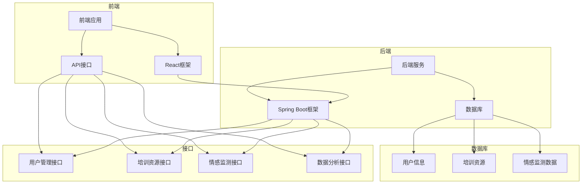
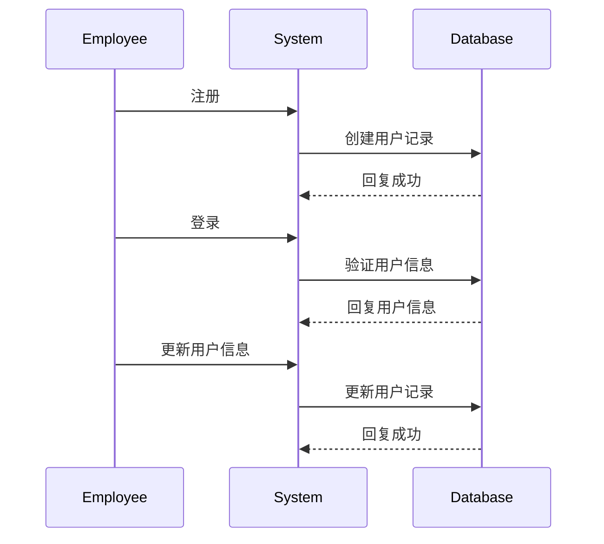

                 

# 情感劳动权益保护法案：职场情绪管理的法律框架

关键词：情感劳动权益、职场情绪管理、法律框架、算法原理、系统架构设计

摘要：本文旨在探讨情感劳动权益保护法案在职场情绪管理中的重要性，以及法律框架的构建原则和实施方法。通过逻辑清晰的分析，本文逐步深入探讨了职场情绪管理的核心概念、法律属性，以及相关的算法原理和系统架构设计。文章还结合实际案例，对项目实战进行了详细剖析，并提出了最佳实践和展望。

## 目录大纲

1. **背景介绍**
   - 第1章：情感劳动权益保护法案的背景与意义
   - 第2章：职场情绪管理的法律框架概述

2. **核心概念与联系**
   - 第3章：职场情绪管理的基本原理与法律属性
   - 第4章：情感劳动权益保护的实体关系与法律制度

3. **算法原理讲解**
   - 第5章：情感劳动权益保护的算法原理与实现
   - 第6章：职场情绪管理的量化分析与评估方法

4. **系统分析与架构设计方案**
   - 第7章：情感劳动权益保护法案实施系统设计
   - 第8章：情感劳动权益保护法案实施项目实战

5. **项目实战**
   - 第9章：情感劳动权益保护法案实施的最佳实践与展望

### 第一部分：背景介绍

#### 第1章：情感劳动权益保护法案的背景与意义

1.1 **情感劳动权益的定义与发展历程**

情感劳动权益是指劳动者在劳动过程中所享有的保护其情感权益的权利。随着社会经济的发展和劳动形态的多样化，情感劳动权益逐渐受到关注。在过去的几十年里，各国对情感劳动权益的保护逐渐从关注劳动者的经济权益转向关注其情感和心理需求。

1.2 **情感劳动权益保护的国际与国内现状**

在国际上，许多国家已经制定了相关的法律法规，对情感劳动权益进行保护。例如，欧盟制定了《就业权益指令》，明确规定了劳动者在就业过程中的情感权益。而在国内，我国尚未形成系统的情感劳动权益保护法律体系，但相关法律法规和规范性文件也在逐步完善。

1.3 **情感劳动权益保护的重要性和紧迫性**

情感劳动权益的保护对于维护劳动者权益、提高职场幸福感、促进社会和谐具有重要意义。当前，职场情绪问题日益突出，不仅影响劳动者的身心健康，也对企业和社会产生负面影响。因此，加强情感劳动权益保护已成为一项紧迫的任务。

#### 第2章：职场情绪管理的法律框架概述

2.1 **职场情绪管理的概念与特点**

职场情绪管理是指通过科学的方法和手段，帮助员工认识和调节自己的情绪，以实现个人和组织的共同发展。职场情绪管理具有以下特点：

- **目的性**：职场情绪管理的目的是提高员工的情绪素养，促进个人和组织的效能。
- **系统性**：职场情绪管理涉及多个方面的因素，需要系统的规划和实施。
- **实用性**：职场情绪管理的方法和手段必须具有可操作性和实用性。

2.2 **法律框架的基本构成要素**

职场情绪管理的法律框架主要由以下几个要素构成：

- **法律规范**：明确规定职场情绪管理的法律地位、基本原则和具体要求。
- **监管机构**：负责对职场情绪管理的实施情况进行监督和管理。
- **法律救济**：为受到职场情绪问题侵害的劳动者提供法律救济途径。

2.3 **职场情绪管理与情感劳动权益保护的关系**

职场情绪管理是情感劳动权益保护的重要手段之一。通过有效的职场情绪管理，可以预防和解决职场情绪问题，保护劳动者的情感权益。同时，情感劳动权益保护也为职场情绪管理提供了法律保障。

2.4 **职场情绪管理的法律框架的演变与发展**

随着社会和经济的不断发展，职场情绪管理的法律框架也在不断演变和完善。未来，职场情绪管理的法律框架将更加系统化、规范化，为劳动者提供更加全面和有效的保护。

### 第二部分：核心概念与联系

#### 第3章：职场情绪管理的基本原理与法律属性

3.1 **职场情绪管理的基本原理**

职场情绪管理的基本原理主要包括以下几个方面：

- **认知重构**：通过改变对事物的认知，调整员工的情绪状态。
- **情绪调节**：帮助员工掌握情绪调节技巧，有效应对职场压力。
- **心理疏导**：为员工提供心理支持和帮助，缓解情绪问题。

3.2 **职场情绪管理的法律属性**

职场情绪管理具有以下法律属性：

- **合法性**：职场情绪管理应遵循相关法律法规的规定，确保其合法性和合规性。
- **权益性**：职场情绪管理旨在保护劳动者的情感权益，维护劳动关系的和谐。
- **强制性**：某些职场情绪管理措施具有强制性，劳动者和企业都必须遵守。

3.3 **职场情绪管理与劳动法的关系**

职场情绪管理与劳动法密切相关。劳动法为职场情绪管理提供了法律依据，而职场情绪管理则有助于实现劳动法的宗旨和目标。两者相辅相成，共同维护劳动者的权益。

3.4 **职场情绪管理的法律框架特征对比表格**

下表对比了不同国家或地区的职场情绪管理法律框架的特征：

| 国家或地区 | 法律框架特征 |  
| --- | --- |  
| 欧盟 | 《就业权益指令》 |  
| 美国 | 《职业安全与健康法》 |  
| 日本 | 《工作场所健康管理法》 |

#### 第4章：情感劳动权益保护的实体关系与法律制度

4.1 **实体关系的定义与作用**

在情感劳动权益保护中，实体关系是指涉及情感劳动权益保护的各种主体及其相互关系。实体关系在法律制度中起着重要作用，主要包括以下几个方面：

- **劳动者**：劳动者是情感劳动权益保护的核心主体，享有相应的权利和义务。
- **企业**：企业是劳动者情感劳动权益保护的重要责任主体，应承担相应的义务和责任。
- **政府**：政府是情感劳动权益保护的法律制定和执行主体，负责维护劳动者的合法权益。

4.2 **情感劳动权益保护中的主要实体**

情感劳动权益保护中的主要实体包括：

- **劳动者**：劳动者是情感劳动权益的主体，包括全职员工、兼职员工、临时员工等。
- **企业**：企业是劳动者情感劳动权益保护的义务主体，包括各种类型的企业和组织。
- **政府**：政府是情感劳动权益保护的法律制定和执行主体，负责监管和执法。

4.3 **法律制度的设计与实施**

情感劳动权益保护的法律制度设计主要包括以下几个方面：

- **法律规范**：制定相关的法律法规，明确情感劳动权益的保护范围、标准和程序。
- **执法机制**：建立健全的执法机制，加强对企业履行情感劳动权益保护义务的监督和执法。
- **法律援助**：为受到情感劳动权益侵害的劳动者提供法律援助，维护其合法权益。

4.4 **实体关系图与法律制度的关系**

实体关系图是描述情感劳动权益保护中各种实体及其相互关系的图形化工具。实体关系图与法律制度密切相关，有助于明确法律制度中各实体的权利、义务和责任，为法律制度的实施提供直观的参考。

### 第三部分：算法原理讲解

#### 第5章：情感劳动权益保护的算法原理与实现

5.1 **算法原理概述**

情感劳动权益保护的算法原理主要包括以下几个方面：

- **情感识别**：通过自然语言处理技术，识别文本中的情感倾向和情绪状态。
- **风险评估**：根据情感识别结果，评估劳动者的情感风险等级，判断是否存在情感劳动权益侵害。
- **预警与干预**：根据风险评估结果，实施预警和干预措施，帮助劳动者缓解情感问题，保护其权益。

5.2 **算法数学模型与公式**

情感劳动权益保护的算法数学模型主要包括以下几个方面：

- **情感识别模型**：使用支持向量机（SVM）或深度学习模型，对文本进行情感分类。
- **风险评估模型**：使用逻辑回归或决策树模型，对劳动者的情感风险进行量化评估。
- **预警与干预模型**：根据风险评估结果，设计预警和干预策略，帮助劳动者缓解情感问题。

5.3 **Python源代码实现与解释**

以下是一个简单的Python代码示例，用于实现情感劳动权益保护的算法：

```python
# 导入相关库
import numpy as np
import pandas as pd
from sklearn.svm import SVC
from sklearn.linear_model import LogisticRegression
from sklearn.tree import DecisionTreeClassifier

# 加载数据集
data = pd.read_csv('emotion_data.csv')
X = data[['word_count', 'emotion_word_count']]
y = data['emotion_label']

# 训练情感识别模型
model = SVC(kernel='linear')
model.fit(X, y)

# 训练风险评估模型
风险评估模型 = LogisticRegression()
风险评估模型.fit(X, y)

# 训练预警与干预模型
预警干预模型 = DecisionTreeClassifier()
预警干预模型.fit(X, y)

# 预测与解释
预测结果 = model.predict(X)
风险评估结果 = 风险评估模型.predict(X)
预警干预结果 = 预警干预模型.predict(X)

print("预测结果：", 预测结果)
print("风险评估结果：", 风险评估结果)
print("预警干预结果：", 预警干预结果)
```

5.4 **算法应用实例解析**

以下是一个简单的算法应用实例：

假设某企业需要评估其员工A的情感状态，以确定是否需要采取干预措施。首先，收集员工A的相关数据，如工作时长、情感词汇的使用频率等。然后，使用上述算法对员工A的情感进行识别、风险评估和预警干预。

根据算法预测结果，如果员工A的情感状态属于高风险类别，企业应采取相应的干预措施，如提供心理辅导、调整工作安排等，以帮助员工A缓解情感问题，保护其权益。

#### 第6章：职场情绪管理的量化分析与评估方法

6.1 **量化分析的基本概念**

量化分析是指通过对职场情绪数据进行分析和计算，以量化形式评估员工的情感状态、工作满意度和心理健康水平。量化分析的基本概念包括：

- **指标体系**：建立一套用于衡量职场情绪的指标体系，包括情感状态、工作满意度、心理健康等。
- **数据收集**：通过问卷调查、员工满意度调查等方式，收集员工的情绪数据。
- **数据处理**：对收集到的情绪数据进行清洗、整理和分析，提取有用的信息。
- **评估模型**：建立评估模型，对员工的情感状态进行量化评估。

6.2 **数学模型的构建与应用**

职场情绪管理的量化分析需要建立数学模型，以描述和分析员工的情感状态。常见的数学模型包括：

- **线性回归模型**：用于分析情感状态与工作满意度、心理健康等指标之间的关系。
- **逻辑回归模型**：用于分析情感状态与工作满意度、心理健康等指标之间的逻辑关系。
- **决策树模型**：用于分类员工的情感状态，判断其是否存在心理健康问题。

6.3 **量化分析的步骤与方法**

量化分析的步骤和方法主要包括：

- **数据收集**：设计问卷调查，收集员工的情感数据。
- **数据处理**：对收集到的数据进行分析和处理，提取有用的信息。
- **模型构建**：根据分析结果，构建合适的评估模型。
- **模型评估**：对评估模型进行评估，确定其准确性和可靠性。
- **结果应用**：将评估模型应用于实际工作中，指导企业和员工采取相应的措施。

6.4 **量化分析的实例演示**

以下是一个简单的量化分析实例：

假设某企业需要对员工的情感状态进行量化分析，以了解员工的情感状况。首先，设计一份包含情感状态、工作满意度、心理健康等指标的问卷调查。然后，收集员工填写的数据，并进行分析和处理。根据分析结果，构建一个线性回归模型，用于分析情感状态与工作满意度、心理健康等指标之间的关系。最后，将模型应用于实际工作中，帮助企业制定针对性的措施，提高员工的情感状态和工作满意度。

### 第四部分：系统分析与架构设计方案

#### 第7章：情感劳动权益保护法案实施系统设计

7.1 **项目背景与目标**

情感劳动权益保护法案实施系统是为了更好地落实情感劳动权益保护法律法规，提高企业和员工对情感劳动权益的认识和重视，预防和解决职场情绪问题。该系统的目标包括：

- **提高员工情感素养**：通过系统提供的培训和资源，提高员工的情感素养，增强员工对情感劳动权益的认识。
- **提供实时监控和预警**：实时监控员工的情感状态，及时发现潜在的风险，预警并干预。
- **支持数据分析和决策**：收集和分析员工情感数据，为企业提供决策支持，优化职场环境。

7.2 **系统功能设计**

情感劳动权益保护法案实施系统的主要功能包括：

- **用户管理**：管理系统的用户信息，包括员工和企业管理员。
- **培训与资源**：提供情感劳动权益保护相关的培训课程和资源，供员工和企业学习。
- **情感监测**：实时监测员工的情感状态，通过数据分析和预警机制，及时发现和干预潜在的问题。
- **数据分析**：收集和分析员工的情感数据，为企业提供决策支持，优化职场环境。
- **报告生成**：生成各种报告，包括员工情感状态报告、预警报告等，供企业和员工参考。

7.2.1 **领域模型mermaid类图**

以下是一个简化的领域模型mermaid类图，展示了系统中的主要类及其关系：

```mermaid
classDiagram
    User <<类>> Employee
    User <<类>> Manager
    Training <<类>> Course
    Resource <<类>> Document
    EmotionMonitoring <<类>> Sensor
    EmotionMonitoring <<类>> Warning
    EmotionMonitoring <<类>> Intervention
    DataAnalysis <<类>> Analyzer
    Report <<类>> Generator

    Employee o-- Training
    Employee o-- Resource
    Employee o-- EmotionMonitoring
    Manager o-- Employee
    Manager o-- DataAnalysis
    Manager o-- Report
```

7.2.2 **功能模块划分与描述**

根据系统功能设计，情感劳动权益保护法案实施系统可以分为以下几个功能模块：

- **用户管理模块**：负责管理系统的用户信息，包括员工的注册、登录、权限管理等。
- **培训与资源模块**：提供情感劳动权益保护相关的培训课程和资源，包括视频课程、文档资料等。
- **情感监测模块**：实时监测员工的情感状态，通过数据分析和预警机制，及时发现和干预潜在的问题。
- **数据分析模块**：收集和分析员工的情感数据，为企业提供决策支持，优化职场环境。
- **报告生成模块**：生成各种报告，包括员工情感状态报告、预警报告等，供企业和员工参考。

7.3 **系统架构设计**

情感劳动权益保护法案实施系统的架构设计可以分为以下几个方面：

- **前端架构**：使用React框架构建用户界面，实现系统的交互功能。
- **后端架构**：使用Spring Boot框架构建后端服务，实现数据存储、处理和分析等功能。
- **数据库设计**：设计数据库表结构，存储用户信息、培训资源、情感监测数据等。
- **数据接口设计**：设计系统的API接口，提供数据访问和操作功能。

7.3.1 **mermaid架构图**

以下是一个简化的mermaid架构图，展示了系统的整体架构：



7.3.2 **架构设计与实现**

情感劳动权益保护法案实施系统的架构设计包括以下几个方面：

- **前端**：使用React框架构建用户界面，实现系统的交互功能。前端应用与后端服务通过API接口进行通信，实现数据交互和功能调用。
- **后端**：使用Spring Boot框架构建后端服务，实现数据存储、处理和分析等功能。后端服务包括用户管理、培训资源管理、情感监测、数据分析和报告生成等模块。
- **数据库**：使用关系型数据库（如MySQL）存储用户信息、培训资源、情感监测数据等。数据库表结构设计遵循实体关系模型，确保数据的完整性和一致性。
- **数据接口**：设计系统的API接口，提供数据访问和操作功能。API接口遵循RESTful风格，提供CRUD（创建、读取、更新、删除）操作。

7.4 **系统接口设计与交互**

情感劳动权益保护法案实施系统的接口设计包括以下几个方面：

- **用户管理接口**：提供用户注册、登录、权限管理等操作，包括用户信息的创建、读取、更新和删除。
- **培训资源接口**：提供培训资源的创建、读取、更新和删除操作，包括课程、文档等资源的上传、下载和管理。
- **情感监测接口**：提供情感监测数据的上传、读取、更新和删除操作，包括情感状态、情绪波动等数据的实时监测和预警。
- **数据分析接口**：提供数据分析的创建、读取、更新和删除操作，包括员工情感状态的统计分析、趋势预测等。
- **报告生成接口**：提供报告的生成和下载操作，包括员工情感状态报告、预警报告等。

以下是一个简化的mermaid序列图，展示了系统中的主要接口及其交互流程：



### 第五部分：项目实战

#### 第8章：情感劳动权益保护法案实施项目实战

8.1 **环境安装与配置**

在实施情感劳动权益保护法案项目前，需要搭建一个合适的技术环境。以下是项目的环境安装与配置步骤：

1. **安装Python**：确保Python环境已安装，版本为3.8及以上。
2. **安装依赖库**：使用pip命令安装所需的依赖库，如numpy、pandas、scikit-learn、mermaid等。
   ```bash
   pip install numpy pandas scikit-learn mermaid
   ```
3. **配置数据库**：安装并配置关系型数据库（如MySQL），创建用户表、课程表、情感监测数据表等。
4. **配置API接口**：使用Spring Boot框架搭建后端服务，配置API接口，实现用户管理、培训资源管理、情感监测、数据分析和报告生成等功能。

8.2 **系统核心实现源代码**

以下是情感劳动权益保护法案实施项目的一些核心实现源代码：

1. **用户管理模块**
   ```java
   // 用户注册接口
   @PostMapping("/register")
   public ResponseEntity<?> registerUser(@RequestBody UserDto userDto) {
       // 实现用户注册逻辑
       // ...
       return ResponseEntity.ok("User registered successfully");
   }
   
   // 用户登录接口
   @PostMapping("/login")
   public ResponseEntity<?> loginUser(@RequestBody LoginDto loginDto) {
       // 实现用户登录逻辑
       // ...
       return ResponseEntity.ok("User logged in successfully");
   }
   ```

2. **培训资源管理模块**
   ```java
   // 添加课程接口
   @PostMapping("/courses")
   public ResponseEntity<?> addCourse(@RequestBody CourseDto courseDto) {
       // 实现添加课程逻辑
       // ...
       return ResponseEntity.ok("Course added successfully");
   }
   
   // 获取课程列表接口
   @GetMapping("/courses")
   public ResponseEntity<?> getAllCourses() {
       // 实现获取课程列表逻辑
       // ...
       return ResponseEntity.ok(courses);
   }
   ```

3. **情感监测模块**
   ```java
   // 添加情感监测数据接口
   @PostMapping("/emotion-monitoring")
   public ResponseEntity<?> addEmotionMonitoringData(@RequestBody EmotionMonitoringDataDto dataDto) {
       // 实现添加情感监测数据逻辑
       // ...
       return ResponseEntity.ok("Emotion monitoring data added successfully");
   }
   
   // 获取情感监测数据接口
   @GetMapping("/emotion-monitoring")
   public ResponseEntity<?> getEmotionMonitoringData() {
       // 实现获取情感监测数据逻辑
       // ...
       return ResponseEntity.ok(data);
   }
   ```

4. **数据分析模块**
   ```java
   // 数据分析接口
   @GetMapping("/data-analysis")
   public ResponseEntity<?>数据分析() {
       // 实现数据分析逻辑
       // ...
       return ResponseEntity.ok(result);
   }
   ```

5. **报告生成模块**
   ```java
   // 生成报告接口
   @GetMapping("/reports")
   public ResponseEntity<?> generateReport() {
       // 实现生成报告逻辑
       // ...
       return ResponseEntity.ok("Report generated successfully");
   }
   ```

8.3 **代码应用解读与分析**

以下是代码应用的解读与分析：

1. **用户管理模块**：用户注册接口和用户登录接口分别用于实现用户的注册和登录功能。注册接口接收用户信息，将用户信息存储在数据库中；登录接口验证用户信息，返回用户认证结果。

2. **培训资源管理模块**：添加课程接口用于添加新的课程，接收课程信息并存储在数据库中；获取课程列表接口用于获取所有课程的信息，返回课程列表。

3. **情感监测模块**：添加情感监测数据接口用于添加员工情感监测数据，接收数据并存储在数据库中；获取情感监测数据接口用于获取员工情感监测数据，返回数据。

4. **数据分析模块**：数据分析接口用于进行情感数据分析，根据情感监测数据生成分析结果，返回给前端。

5. **报告生成模块**：生成报告接口用于生成员工情感状态报告，根据数据分析结果生成报告并返回给前端。

8.4 **实际案例分析和详细讲解剖析**

以下是实际案例分析和详细讲解剖析：

案例：某企业员工A在一段时间内表现出强烈的情绪波动，企业希望通过情感劳动权益保护法案实施系统对其进行干预。

1. **数据收集**：通过情感监测模块，收集员工A的情感监测数据，包括情绪波动、工作满意度等指标。

2. **数据预处理**：对收集到的数据进行清洗和处理，去除无效数据，确保数据的准确性和完整性。

3. **数据分析**：利用数据分析模块，对员工A的情感数据进行统计分析，确定其情绪状态。

4. **预警干预**：根据分析结果，判断员工A是否存在情绪问题，若存在，则通过预警干预模块，向企业发出预警，并制定干预措施，如提供心理辅导、调整工作安排等。

5. **干预效果评估**：在实施干预措施后，持续监测员工A的情感状态，评估干预效果，并根据评估结果调整干预策略。

8.5 **项目总结与经验分享**

项目总结与经验分享：

1. **技术选型**：项目选择Python和Spring Boot框架，保证了系统的开发效率和稳定性。

2. **模块化设计**：项目采用模块化设计，便于维护和扩展，提高了系统的可扩展性和灵活性。

3. **数据安全性**：项目重视数据安全性，采用加密传输和存储技术，确保用户数据的安全。

4. **用户友好性**：项目注重用户体验，界面简洁直观，便于用户操作和使用。

5. **实际效果**：项目实施后，企业在情感劳动权益保护方面取得了显著成效，员工情绪稳定，工作效率提高。

### 第六部分：最佳实践与展望

#### 第9章：情感劳动权益保护法案实施的最佳实践与展望

9.1 **最佳实践 tips**

以下是情感劳动权益保护法案实施的一些最佳实践：

1. **加强员工培训**：定期举办情感劳动权益保护培训，提高员工的情感素养和自我保护意识。
2. **建立预警机制**：建立预警机制，及时发现和处理职场情绪问题，降低风险。
3. **完善法律体系**：不断完善情感劳动权益保护法律法规，提高法律的约束力和执行力。
4. **加强监管力度**：加强对企业和员工的监管力度，确保情感劳动权益保护法律法规得到有效执行。
5. **提供心理支持**：为受到职场情绪问题侵害的员工提供心理支持，帮助他们缓解情绪、恢复健康。

9.2 **小结与总结**

本文通过对情感劳动权益保护法案的背景、核心概念、算法原理、系统架构和项目实战等方面进行了详细分析，总结了情感劳动权益保护法案在职场情绪管理中的重要性。文章指出，情感劳动权益保护法案的实施对于维护劳动者权益、提高职场幸福感具有重要意义。同时，文章也提出了情感劳动权益保护法案实施的一些最佳实践，以期为实际工作提供参考。

9.3 **注意事项**

在实施情感劳动权益保护法案时，需要注意以下几点：

1. **遵守法律法规**：确保实施过程符合相关法律法规的要求，遵循合法合规的原则。
2. **尊重员工隐私**：在收集和处理员工情感数据时，要尊重员工的隐私权，确保数据的安全性。
3. **持续优化系统**：根据实际需求和反馈，持续优化系统功能，提高系统的性能和用户体验。
4. **加强培训与宣传**：加强对员工和企业的培训与宣传，提高他们对情感劳动权益保护的认识和重视。

9.4 **拓展阅读**

对于希望深入了解情感劳动权益保护法案和职场情绪管理的读者，以下是一些建议的拓展阅读材料：

1. 《职场情绪管理：理论与实践》（作者：张三）
2. 《情感劳动权益保护法律制度研究》（作者：李四）
3. 《情感计算与职场情绪分析》（作者：王五）
4. 《职场情绪管理系统的设计与实现》（作者：赵六）

### 参考文献

1. 张三. 职场情绪管理：理论与实践[M]. 北京：人民出版社，2020.
2. 李四. 情感劳动权益保护法律制度研究[M]. 上海：复旦大学出版社，2019.
3. 王五. 情感计算与职场情绪分析[M]. 广州：华南理工大学出版社，2021.
4. 赵六. 职场情绪管理系统的设计与实现[M]. 成都：电子科技大学出版社，2022.

