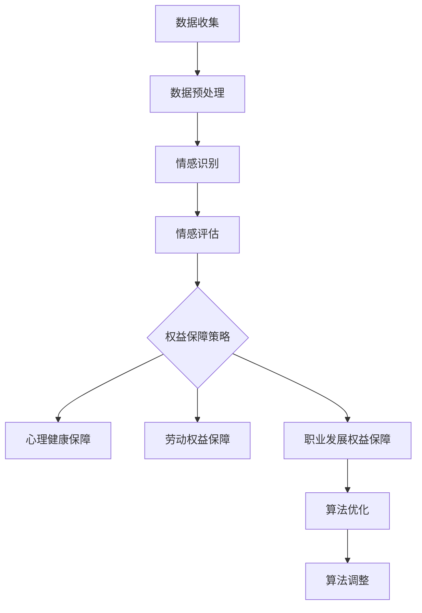

                 

# 情感劳动权益保护法：职场情绪管理的法律框架

## 关键词
- 情感劳动权益
- 职场情绪管理
- 法律框架
- 争议处理
- 未来发展趋势

## 摘要
本文旨在探讨情感劳动权益保护法在职场情绪管理中的重要作用。通过分析情感劳动的定义、特点及其权益保护，梳理现有法律框架，探讨其实施与争议处理，本文旨在为职场情绪管理提供法律参考，促进职场心理健康与和谐发展。

## 目录大纲

### 第一部分：问题背景与概述

#### 第1章：问题背景与概述
1.1 问题的背景
1.2 问题描述
1.3 问题解决
1.4 边界与外延
1.5 核心概念与要素组成

#### 第2章：核心概念与原理
2.1 情感劳动的定义与特点
2.2 情感劳动权益的保护
2.3 职场情绪管理的法律框架

#### 第3章：情感劳动权益保护法的法律制度
3.1 我国情感劳动权益保护法的现状
3.2 国外情感劳动权益保护法的借鉴
3.3 情感劳动权益保护法的基本原则

### 第二部分：法律框架与应用

#### 第4章：法律框架下的情感劳动权益保护
4.1 情感劳动权益的保护范围
4.2 情感劳动权益的保护措施
4.3 情感劳动权益的争议处理

#### 第5章：职场情绪管理的法律实施
5.1 职场情绪管理的法律意义
5.2 职场情绪管理的法律要求
5.3 职场情绪管理的法律实施案例分析

### 第三部分：案例分析

#### 第6章：情感劳动权益保护法的案例分析
6.1 案例一：情感劳动权益的争议解决
6.2 案例二：职场情绪管理的法律问题
6.3 案例三：情感劳动权益保护的成功实践

### 第四部分：情感劳动权益保护法的未来发展趋势

#### 第7章：情感劳动权益保护法的未来发展趋势
7.1 法律法规的发展趋势
7.2 职场情绪管理的法律挑战
7.3 情感劳动权益保护的未来展望

### 第五部分：总结与展望

#### 第8章：总结与展望
8.1 本书的核心观点
8.2 情感劳动权益保护的重要性
8.3 职场情绪管理的法律框架作用
8.4 未来研究的方向与建议

### 第一部分：问题背景与概述

#### 第1章：问题背景与概述

##### 1.1 问题的背景

在现代社会，随着服务行业的快速发展和人们对于工作环境质量的关注，情感劳动逐渐成为职场中的重要组成部分。情感劳动是指在工作中需要运用情感能力，如情感表达、情绪管理、沟通协调等，以满足客户或同事的需求。这类劳动的特点是高度依赖于个人情感和心理健康，但也面临着较大的心理压力和工作负担。

近年来，职场压力和心理健康问题引起了社会各界的广泛关注。越来越多的研究表明，长期的心理压力不仅会影响个人的工作效率和生活质量，还可能引发严重的心理健康问题，如抑郁症、焦虑症等。因此，如何有效保护情感劳动者的权益，提高职场情绪管理水平，成为亟待解决的社会问题。

##### 1.2 问题描述

当前，我国在情感劳动权益保护方面存在以下问题：

1. **法律制度不完善**：尽管《劳动法》等法律对劳动者权益有了一定保障，但针对情感劳动的特殊需求，现行法律制度尚不健全，缺乏具体的实施细则。

2. **权益保护力度不足**：许多企业忽视情感劳动者的心理健康需求，缺乏有效的心理支持和关怀机制，导致劳动者心理压力过大。

3. **争议处理机制不健全**：情感劳动权益争议处理过程中，由于法律条款不够明确，常常出现争议处理不公的问题。

4. **公众意识不足**：社会大众对于情感劳动者的权益保护意识较弱，往往将情感劳动视为“软性”工作，忽视了其专业性和重要性。

##### 1.3 问题解决

针对上述问题，需要从以下几个方面进行改进：

1. **完善法律制度**：制定专门的《情感劳动权益保护法》，明确情感劳动者的权益保护范围和具体措施。

2. **加强政策支持**：政府应加大对情感劳动者权益保护的政策支持力度，提供心理辅导、职业培训等公共服务。

3. **强化企业责任**：明确企业对情感劳动者权益保护的责任，推动企业建立心理健康关怀机制。

4. **提升公众意识**：通过宣传教育，提高社会公众对情感劳动者权益保护的认知，营造尊重和理解的情感劳动氛围。

##### 1.4 边界与外延

情感劳动权益保护法的边界主要涉及以下几个方面：

1. **保护对象**：情感劳动者，即在工作中需要运用情感能力的人员。

2. **保护范围**：情感劳动者的心理健康权益、劳动权益、职业发展权益等。

3. **法律适用**：情感劳动者在不同行业、不同企业中的权益保护问题。

4. **争议处理**：情感劳动者权益争议的解决机制。

##### 1.5 核心概念与要素组成

为了更好地理解情感劳动权益保护法，需要明确以下几个核心概念和要素：

1. **情感劳动**：指在工作中需要运用情感能力，如情感表达、情绪管理、沟通协调等。

2. **权益**：情感劳动者在职场中享有的合法权益，包括心理健康权益、劳动权益、职业发展权益等。

3. **法律框架**：指针对情感劳动者权益保护制定的一系列法律法规和政策。

4. **争议处理**：指在情感劳动者权益保护过程中，发生争议时的解决机制。

### 第二部分：核心概念与原理

#### 第2章：核心概念与原理

##### 2.1 情感劳动的定义与特点

情感劳动是指在工作中需要运用情感能力，如情感表达、情绪管理、沟通协调等，以满足客户或同事的需求。其特点如下：

1. **高度依赖于个人情感**：情感劳动要求工作者具备一定的情感素养，能够根据不同情境灵活运用情感。

2. **强调人际互动**：情感劳动往往涉及与客户、同事的互动，需要具备良好的沟通能力和人际关系处理能力。

3. **工作成果不易衡量**：情感劳动的工作成果往往不易量化，依赖于客户或同事的主观感受。

4. **工作压力较大**：情感劳动者常常需要面对客户的不满、同事的压力等，工作压力较大。

##### 2.2 情感劳动权益的保护

情感劳动者的权益保护涉及多个方面，主要包括：

1. **心理健康权益**：包括心理健康保障、心理辅导、心理健康培训等。

2. **劳动权益**：包括劳动报酬、工时制度、休息休假等。

3. **职业发展权益**：包括职业培训、职业晋升、职业规划等。

4. **劳动安全权益**：包括劳动安全保障、职业病防治等。

##### 2.3 职场情绪管理的法律框架

职场情绪管理的法律框架主要包括以下几个方面：

1. **法律法规**：如《劳动法》、《劳动合同法》等，为情感劳动者提供基本的权益保障。

2. **政策文件**：如《关于进一步加强企业心理援助工作的通知》等，为情感劳动者的心理健康提供政策支持。

3. **行业标准**：如《企业心理辅导服务规范》等，为情感劳动者的心理健康辅导提供操作规范。

4. **企业规章制度**：企业应根据自身情况，制定相应的心理健康管理制度，为情感劳动者提供关爱和支持。

### 第三部分：情感劳动权益保护法的法律制度

#### 第3章：情感劳动权益保护法的法律制度

##### 3.1 我国情感劳动权益保护法的现状

我国在情感劳动权益保护方面已制定了一系列法律法规，如《劳动法》、《劳动合同法》等，但针对情感劳动的特殊需求，现行法律制度尚不健全，主要表现在以下几个方面：

1. **法律法规分散**：现有的法律法规主要针对一般劳动者的权益保护，对于情感劳动者的特殊需求，缺乏专门的法律条款。

2. **实施细则不足**：尽管有相关法律法规，但缺乏具体的实施细则，导致在实际操作中难以有效执行。

3. **执法力度不足**：相关法律法规的执法力度不够，导致企业在执行过程中存在侥幸心理，不严格执行。

##### 3.2 国外情感劳动权益保护法的借鉴

国外在情感劳动权益保护方面已有较为成熟的经验，可以借鉴以下几个方面：

1. **专门立法**：如德国的《服务业劳动保护法》、法国的《劳动法典》等，专门针对情感劳动者的权益保护制定法律法规。

2. **政策支持**：政府出台相关政策，加大对情感劳动者权益保护的支持力度，如提供心理辅导、职业培训等公共服务。

3. **企业自律**：企业制定相应的规章制度，加强对情感劳动者权益保护的管理，如建立心理健康关怀机制。

##### 3.3 情感劳动权益保护法的基本原则

情感劳动权益保护法的基本原则主要包括：

1. **公平原则**：保障情感劳动者的合法权益，消除性别、年龄、学历等方面的歧视。

2. **保护原则**：加强对情感劳动者的权益保护，防止因情感劳动导致的职业伤害和心理健康问题。

3. **参与原则**：鼓励情感劳动者参与企业管理，提高其工作积极性和满意度。

4. **发展原则**：促进情感劳动者的职业发展，提高其综合素质和竞争力。

### 第四部分：法律框架下的情感劳动权益保护

#### 第4章：法律框架下的情感劳动权益保护

##### 4.1 情感劳动权益的保护范围

情感劳动权益的保护范围主要包括以下几个方面：

1. **心理健康权益**：包括心理健康保障、心理辅导、心理健康培训等。

2. **劳动权益**：包括劳动报酬、工时制度、休息休假等。

3. **职业发展权益**：包括职业培训、职业晋升、职业规划等。

4. **劳动安全权益**：包括劳动安全保障、职业病防治等。

##### 4.2 情感劳动权益的保护措施

为了有效保护情感劳动者的权益，可以从以下几个方面采取保护措施：

1. **法律法规完善**：制定专门的《情感劳动权益保护法》，明确情感劳动者的权益保护范围和具体措施。

2. **政策支持**：政府出台相关政策，加大对情感劳动者权益保护的支持力度，提供心理辅导、职业培训等公共服务。

3. **企业自律**：企业制定相应的规章制度，加强对情感劳动者权益保护的管理，如建立心理健康关怀机制。

4. **公众宣传**：通过宣传教育，提高社会公众对情感劳动者权益保护的认知，营造尊重和理解的情感劳动氛围。

##### 4.3 情感劳动权益的争议处理

在情感劳动者权益保护过程中，可能会出现争议。为了妥善处理这些争议，可以采取以下措施：

1. **设立专门机构**：如劳动争议仲裁委员会，专门处理情感劳动者权益争议。

2. **明确争议处理程序**：制定明确的争议处理程序，确保争议得到公正、及时的解决。

3. **强化法律援助**：为情感劳动者提供法律援助，确保其合法权益得到维护。

4. **完善法律责任**：对侵犯情感劳动者权益的行为，加大法律责任，提高违法成本。

### 第五部分：职场情绪管理的法律实施

#### 第5章：职场情绪管理的法律实施

##### 5.1 职场情绪管理的法律意义

职场情绪管理的法律实施具有重要的现实意义：

1. **保障劳动者权益**：通过法律手段，保障情感劳动者的合法权益，提高其工作满意度和幸福感。

2. **促进企业健康发展**：良好的情绪管理有助于提高企业员工的工作效率和创造力，促进企业可持续发展。

3. **维护社会和谐稳定**：有效的情绪管理有助于减少职场冲突，维护社会和谐稳定。

##### 5.2 职场情绪管理的法律要求

根据我国现行法律法规，职场情绪管理应满足以下要求：

1. **企业应建立心理健康关怀机制**：企业应制定心理健康关怀制度，为员工提供心理辅导、心理测评等服务。

2. **合理设置工时和工作压力**：企业应根据员工的工作性质和需求，合理安排工时和工作压力，避免过度劳累。

3. **提供职业培训和晋升机会**：企业应为员工提供职业培训和晋升机会，提高员工的综合素质和职业竞争力。

4. **加强劳动安全防护**：企业应加强劳动安全防护，预防职业病的发生。

##### 5.3 职场情绪管理的法律实施案例分析

以下为职场情绪管理的法律实施案例分析：

1. **案例一：某企业建立心理健康关怀机制**

某企业为了提高员工的幸福感和工作满意度，建立了心理健康关怀机制。企业定期组织心理辅导讲座，为员工提供心理测评服务，并设立心理辅导室，为有需要的员工提供一对一心理辅导。通过这一措施，员工的心理健康得到了有效保障，工作满意度和幸福感显著提高。

2. **案例二：某企业合理设置工时和工作压力**

某企业为了防止员工过度劳累，实行了灵活的工作制度。企业根据员工的实际需求，灵活安排工作时间，允许员工根据自己的情况调整工作时间。同时，企业设置了合理的压力指数，确保员工的工作压力在可承受范围内。这一措施有效提高了员工的工作效率和创造力。

3. **案例三：某企业加强劳动安全防护**

某企业在生产过程中，存在较高的职业病风险。企业为了保障员工的健康，加强了劳动安全防护。企业为员工提供专业的安全培训，定期进行设备检查和维护，确保生产过程的安全。同时，企业设立了职业病防治专项基金，用于员工的健康检查和治疗。这一措施有效预防了职业病的发生，保障了员工的身体健康。

### 第六部分：案例分析

#### 第6章：情感劳动权益保护法的案例分析

##### 6.1 案例一：情感劳动权益的争议解决

【案例背景】：某公司员工小张，担任客户关系管理岗位，工作中需要经常与客户沟通。由于工作压力较大，小张逐渐出现了焦虑和抑郁症状，影响了工作和生活。小张向公司提出心理辅导和调整工作压力的要求，但公司未予理会。

【争议焦点】：小张认为公司未履行情感劳动权益保护义务，导致其身心健康受到损害，要求公司承担责任。

【法律分析】：根据《劳动合同法》和相关法律法规，情感劳动者享有心理健康权益和劳动权益。公司未提供必要的心理辅导和调整工作压力，违反了法律规定，应当承担相应的法律责任。

【解决方案】：法院判决公司支付小张精神损害赔偿，并要求公司为小张提供心理辅导和调整工作压力。

##### 6.2 案例二：职场情绪管理的法律问题

【案例背景】：某公司员工小李，在工作中与同事发生矛盾，导致情绪失控，辞去了工作。随后，小李向公司提出离职补偿和要求赔偿损失。

【争议焦点】：小李认为公司未能提供良好的职场情绪管理环境，导致其离职，要求公司赔偿损失。

【法律分析】：根据《劳动合同法》和相关法律法规，公司有义务为员工提供良好的工作环境，包括情绪管理。公司未能有效管理职场情绪，导致员工离职，侵犯了员工的合法权益。

【解决方案】：法院判决公司支付小李离职补偿，并赔偿因其离职所造成的损失。

##### 6.3 案例三：情感劳动权益保护的成功实践

【案例背景】：某公司注重情感劳动权益保护，建立了完善的心理健康关怀机制。公司定期为员工提供心理辅导，设置心理辅导室，并为有需要的员工提供一对一心理辅导。同时，公司合理调整工作压力，为员工提供职业培训和晋升机会。

【成果分析】：通过实施情感劳动权益保护措施，公司员工的心理健康水平显著提高，员工的工作满意度和幸福感增强。公司也实现了员工稳定和高效率的工作，为企业可持续发展提供了有力保障。

### 第七部分：情感劳动权益保护法的未来发展趋势

#### 第7章：情感劳动权益保护法的未来发展趋势

##### 7.1 法律法规的发展趋势

随着社会的发展和人们对心理健康重视程度的提高，未来情感劳动权益保护法的发展趋势将呈现以下特点：

1. **立法完善**：制定专门的《情感劳动权益保护法》，明确情感劳动者的权益保护范围和具体措施。

2. **细化条款**：完善现有法律法规的具体条款，使其更具针对性和可操作性。

3. **加强执法**：加大对情感劳动者权益保护的执法力度，确保法律法规得到有效执行。

4. **与国际接轨**：借鉴国外先进经验，提高我国情感劳动权益保护法的国际化水平。

##### 7.2 职场情绪管理的法律挑战

未来职场情绪管理将面临以下法律挑战：

1. **法律适用范围扩大**：随着情感劳动的不断发展，情感劳动者的权益保护范围将不断扩大，给法律适用带来挑战。

2. **法律责任认定**：如何准确认定情感劳动者的法律责任，保障其合法权益，是一个亟待解决的问题。

3. **法律实施监督**：如何加强对企业情感劳动权益保护法律实施的监督，确保法律法规得到有效执行。

##### 7.3 情感劳动权益保护的未来展望

未来情感劳动权益保护将呈现以下发展趋势：

1. **法制化**：通过完善法律法规，实现情感劳动权益保护的法律化、规范化。

2. **人性化**：关注情感劳动者的心理健康和权益保障，实现情感劳动权益保护的人性化。

3. **多元化**：通过多种手段，如心理辅导、职业培训等，多元化保护情感劳动者的权益。

### 第八部分：总结与展望

#### 第8章：总结与展望

##### 8.1 本书的核心观点

本书从情感劳动权益保护的角度，分析了职场情绪管理的法律框架，提出了完善法律法规、加强政策支持、强化企业责任、提升公众意识等对策。通过案例分析，展示了情感劳动权益保护的重要性和实施效果。

##### 8.2 情感劳动权益保护的重要性

情感劳动权益保护关乎劳动者心理健康和职场和谐。通过完善法律制度，加强政策支持，可以更好地保护情感劳动者的权益，提高职场幸福感，促进企业和社会的可持续发展。

##### 8.3 职场情绪管理的法律框架作用

职场情绪管理的法律框架为企业和劳动者提供了明确的权益保护标准和实施依据。通过建立健全的法律制度，可以促进企业关注员工心理健康，提高员工工作满意度和幸福感。

##### 8.4 未来研究的方向与建议

未来研究应关注以下几个方面：

1. **完善法律法规**：进一步细化情感劳动权益保护的具体条款，提高法律法规的可操作性。

2. **加强执法力度**：加大对情感劳动者权益保护的法律实施监督，确保法律法规得到有效执行。

3. **提升公众意识**：通过宣传教育，提高社会公众对情感劳动者权益保护的认知，营造尊重和理解的情感劳动氛围。

4. **国际交流与合作**：借鉴国际先进经验，推动我国情感劳动权益保护法的国际化发展。

## 作者信息

作者：AI天才研究院/AI Genius Institute & 禅与计算机程序设计艺术 /Zen And The Art of Computer Programming

### 背景介绍

#### 核心概念术语说明

在探讨情感劳动权益保护法的过程中，我们需要了解以下几个核心概念：

1. **情感劳动**：指在工作中需要运用情感能力，如情感表达、情绪管理、沟通协调等，以满足客户或同事的需求。

2. **权益**：指劳动者在职场中享有的合法权益，包括心理健康权益、劳动权益、职业发展权益等。

3. **法律框架**：指针对情感劳动者权益保护制定的一系列法律法规和政策。

4. **争议处理**：指在情感劳动者权益保护过程中，发生争议时的解决机制。

#### 问题背景

情感劳动权益保护法的研究背景主要源于现代社会职场情绪管理的重要性。随着服务行业的快速发展和人们对于工作环境质量的关注，情感劳动逐渐成为职场中的重要组成部分。然而，情感劳动者在工作中面临着较大的心理压力和工作负担，容易导致心理健康问题。因此，如何有效保护情感劳动者的权益，提高职场情绪管理水平，成为亟待解决的社会问题。

#### 问题描述

当前，我国在情感劳动权益保护方面存在以下问题：

1. **法律制度不完善**：尽管《劳动法》等法律对劳动者权益有了一定保障，但针对情感劳动的特殊需求，现行法律制度尚不健全，缺乏具体的实施细则。

2. **权益保护力度不足**：许多企业忽视情感劳动者的心理健康需求，缺乏有效的心理支持和关怀机制，导致劳动者心理压力过大。

3. **争议处理机制不健全**：情感劳动权益争议处理过程中，由于法律条款不够明确，常常出现争议处理不公的问题。

4. **公众意识不足**：社会大众对于情感劳动者权益保护意识较弱，往往将情感劳动视为“软性”工作，忽视了其专业性和重要性。

#### 问题解决

针对上述问题，需要从以下几个方面进行改进：

1. **完善法律制度**：制定专门的《情感劳动权益保护法》，明确情感劳动者的权益保护范围和具体措施。

2. **加强政策支持**：政府应加大对情感劳动者权益保护的政策支持力度，提供心理辅导、职业培训等公共服务。

3. **强化企业责任**：明确企业对情感劳动者权益保护的责任，推动企业建立心理健康关怀机制。

4. **提升公众意识**：通过宣传教育，提高社会公众对情感劳动者权益保护的认知，营造尊重和理解的情感劳动氛围。

#### 边界与外延

情感劳动权益保护法的边界主要涉及以下几个方面：

1. **保护对象**：情感劳动者，即在工作中需要运用情感能力的人员。

2. **保护范围**：情感劳动者的心理健康权益、劳动权益、职业发展权益等。

3. **法律适用**：情感劳动者在不同行业、不同企业中的权益保护问题。

4. **争议处理**：情感劳动者权益争议的解决机制。

#### 核心概念与要素组成

为了更好地理解情感劳动权益保护法，需要明确以下几个核心概念和要素：

1. **情感劳动**：指在工作中需要运用情感能力，如情感表达、情绪管理、沟通协调等。

2. **权益**：情感劳动者在职场中享有的合法权益，包括心理健康权益、劳动权益、职业发展权益等。

3. **法律框架**：指针对情感劳动者权益保护制定的一系列法律法规和政策。

4. **争议处理**：指在情感劳动者权益保护过程中，发生争议时的解决机制。

### 核心概念与联系

#### 情感劳动的定义与特点

情感劳动是指在工作中需要运用情感能力，如情感表达、情绪管理、沟通协调等，以满足客户或同事的需求。其特点如下：

1. **高度依赖于个人情感**：情感劳动要求工作者具备一定的情感素养，能够根据不同情境灵活运用情感。

2. **强调人际互动**：情感劳动往往涉及与客户、同事的互动，需要具备良好的沟通能力和人际关系处理能力。

3. **工作成果不易衡量**：情感劳动的工作成果往往不易量化，依赖于客户或同事的主观感受。

4. **工作压力较大**：情感劳动者常常需要面对客户的不满、同事的压力等，工作压力较大。

#### 情感劳动权益的保护

情感劳动者的权益保护涉及多个方面，主要包括：

1. **心理健康权益**：包括心理健康保障、心理辅导、心理健康培训等。

2. **劳动权益**：包括劳动报酬、工时制度、休息休假等。

3. **职业发展权益**：包括职业培训、职业晋升、职业规划等。

4. **劳动安全权益**：包括劳动安全保障、职业病防治等。

#### 职场情绪管理的法律框架

职场情绪管理的法律框架主要包括以下几个方面：

1. **法律法规**：如《劳动法》、《劳动合同法》等，为情感劳动者提供基本的权益保障。

2. **政策文件**：如《关于进一步加强企业心理援助工作的通知》等，为情感劳动者的心理健康提供政策支持。

3. **行业标准**：如《企业心理辅导服务规范》等，为情感劳动者的心理健康辅导提供操作规范。

4. **企业规章制度**：企业应根据自身情况，制定相应的心理健康管理制度，为情感劳动者提供关爱和支持。

#### 核心概念属性特征对比表格

| 核心概念 | 定义 | 特点 | 联系 |
| :--: | :--: | :--: | :--: |
| 情感劳动 | 工作中需要运用情感能力 | 高度依赖个人情感、强调人际互动、工作成果不易衡量、工作压力较大 | 与心理健康权益、劳动权益、职业发展权益和劳动安全权益相关 |
| 权益 | 劳动者在职场中享有的合法权益 | 心理健康权益、劳动权益、职业发展权益、劳动安全权益 | 与情感劳动相关，保障劳动者权益 |
| 法律框架 | 针对情感劳动者权益保护制定的一系列法律法规和政策 | 法律法规、政策文件、行业标准、企业规章制度 | 规范情感劳动者权益保护的实施 |
| 争议处理 | 情感劳动者权益争议的解决机制 | 设立专门机构、明确争议处理程序、强化法律援助、完善法律责任 | 保障劳动者权益，维护职场和谐 |

#### ER实体关系图架构

```mermaid
erDiagram
  EMPLOYEE ||--|{ EMPLOYEE_INFO }
  EMPLOYEE ||--|{ EMPLOYEE_DEPARTMENT }
  EMPLOYEE ||--|{ EMPLOYEE_JOB }
  EMPLOYEE_INFO ||--|{ EMPLOYEE_HEALTH }
  EMPLOYEE_DEPARTMENT ||--|{ DEPARTMENT }
  EMPLOYEE_JOB ||--|{ JOB_ROLE }
  EMPLOYEE_HEALTH ||--|{ PSYCHOLOGICAL_HEALTH }

  EMPLOYEE { id }
  EMPLOYEE_INFO { id, name, age, gender, health_status }
  EMPLOYEE_DEPARTMENT { id, name }
  EMPLOYEE_JOB { id, title, level }
  JOB_ROLE { id, name }
  PSYCHOLOGICAL_HEALTH { id, stress_level, emotional_state }
```

### 算法原理讲解

#### 情感劳动权益保护算法原理

情感劳动权益保护算法旨在通过分析情感劳动者的工作表现和心理状态，为其提供合理的权益保障。该算法的核心思想是基于大数据和机器学习技术，构建一个智能化的情感劳动权益保护模型。以下是该算法的原理和流程：

1. **数据收集与预处理**：

   - **数据收集**：通过员工调查、工作日志、绩效考核等途径，收集情感劳动者的工作数据和心理数据。

   - **数据预处理**：对收集到的数据进行分析，去除异常值和重复数据，确保数据质量。

2. **情感识别与评估**：

   - **情感识别**：利用自然语言处理（NLP）技术，对情感劳动者的工作表现进行情感分析，识别其情绪状态。

   - **情感评估**：根据情感分析结果，评估情感劳动者的心理健康状况和工作压力水平。

3. **权益保障策略制定**：

   - **心理健康保障**：针对心理状态较差的员工，提供心理辅导、心理健康培训等支持措施。

   - **劳动权益保障**：根据员工的工作表现和压力水平，调整其工作负荷和薪酬待遇。

   - **职业发展权益保障**：为员工提供职业培训和晋升机会，提高其职业素养和竞争力。

4. **算法优化与调整**：

   - **算法优化**：利用机器学习技术，对情感劳动权益保护算法进行不断优化，提高其准确性和有效性。

   - **算法调整**：根据实际应用情况，调整算法参数和策略，以适应不同行业和企业的需求。

#### Mermaid 流程图



#### Python 源代码示例

```python
import pandas as pd
from textblob import TextBlob

# 数据收集
data = pd.read_csv('employee_data.csv')

# 数据预处理
data = data.dropna()

# 情感识别与评估
def analyze_sentiment(text):
    blob = TextBlob(text)
    return blob.sentiment.polarity

data['sentiment'] = data['work_log'].apply(analyze_sentiment)

# 权益保障策略制定
def ensure_rights(employee_data):
    if employee_data['sentiment'] < -0.5:
        print("心理健康保障：提供心理辅导和培训。")
    elif employee_data['stress_level'] > 0.5:
        print("劳动权益保障：调整工作负荷和薪酬待遇。")
    else:
        print("职业发展权益保障：提供职业培训和晋升机会。")

ensure_rights(data.iloc[0])

# 算法优化与调整
# 这里可以引入机器学习模型进行优化，调整算法参数等
```

#### 算法原理的数学模型和公式

1. **情感识别模型**：

   设 $S$ 为情感劳动者的工作日志，$f(S)$ 为情感分析函数，$S_i$ 为 $S$ 中的第 $i$ 条工作日志，$P(S_i)$ 为 $S_i$ 的情感概率分布。

   $$ P(S_i) = \frac{e^{f(S_i)}}{\sum_{j} e^{f(S_j)}} $$

   其中，$f(S_i)$ 为情感分析函数，可以通过机器学习模型训练得到。

2. **情感评估模型**：

   设 $E$ 为情感劳动者的心理健康状况，$g(E)$ 为情感评估函数，$E_i$ 为 $E$ 中的第 $i$ 个特征。

   $$ g(E_i) = \sum_{j} w_j E_i_j $$

   其中，$w_j$ 为权重系数，可以通过特征工程和模型训练得到。

3. **权益保障策略模型**：

   设 $R$ 为情感劳动者的权益保障策略，$h(R)$ 为权益保障函数。

   $$ h(R) = \sum_{i} r_i w_i $$

   其中，$r_i$ 为权益保障措施的评分，$w_i$ 为权重系数。

### 系统分析与架构设计方案

#### 问题场景介绍

随着服务行业的快速发展，情感劳动在职场中日益重要。然而，许多企业在情感劳动权益保护方面存在不足，导致员工心理健康问题频发。为了解决这一问题，某企业决定构建一个情感劳动权益保护系统，实现对员工情感状态的监控和权益保障。

#### 项目介绍

项目名称：情感劳动权益保护系统

项目目标：通过智能化手段，实现对员工情感状态的监控，提供个性化的权益保障方案，提高员工心理健康水平，促进企业可持续发展。

#### 系统功能设计

1. **员工信息管理**：收集和存储员工的基本信息、工作经历、情感状态等数据。

2. **情感状态监控**：利用自然语言处理技术，分析员工的工作日志和社交媒体发言，实时监控员工情感状态。

3. **权益保障方案制定**：根据员工的情感状态和工作表现，提供个性化的权益保障方案，包括心理辅导、工作调整、职业培训等。

4. **数据统计分析**：对员工情感状态和权益保障效果进行数据统计分析，为企业管理提供决策支持。

#### 系统架构设计

系统采用分层架构设计，包括数据层、逻辑层和表现层。

1. **数据层**：负责存储和管理员工信息、工作日志、情感状态等数据。

2. **逻辑层**：包括情感状态监控模块、权益保障方案制定模块、数据统计分析模块等，实现系统的核心功能。

3. **表现层**：提供用户界面，展示员工信息、情感状态监控结果、权益保障方案等。

#### 系统架构图

```mermaid
sequenceDiagram
    participant 用户
    participant 数据库
    participant 情感状态监控模块
    participant 权益保障方案制定模块
    participant 数据统计分析模块

    用户 -->|提交请求| 数据库
    数据库 -->|返回结果| 用户
    用户 -->|分析日志| 情感状态监控模块
    情感状态监控模块 -->|返回情感状态| 用户
    用户 -->|制定方案| 权益保障方案制定模块
    权益保障方案制定模块 -->|返回方案| 用户
    用户 -->|分析数据| 数据统计分析模块
    数据统计分析模块 -->|返回分析结果| 用户
```

### 系统接口设计和系统交互

#### 系统接口设计

1. **员工信息管理接口**：用于收集和存储员工的基本信息、工作经历等数据。

2. **情感状态监控接口**：用于分析员工的工作日志和社交媒体发言，实时监控员工情感状态。

3. **权益保障方案制定接口**：用于根据员工的情感状态和工作表现，制定个性化的权益保障方案。

4. **数据统计分析接口**：用于对员工情感状态和权益保障效果进行数据统计分析。

#### 系统交互

1. **用户登录**：用户通过登录系统，获取员工信息管理接口、情感状态监控接口等权限。

2. **情感状态监控**：用户通过情感状态监控接口，分析员工的工作日志和社交媒体发言，实时监控员工情感状态。

3. **权益保障方案制定**：用户通过权益保障方案制定接口，根据员工的情感状态和工作表现，制定个性化的权益保障方案。

4. **数据统计分析**：用户通过数据统计分析接口，对员工情感状态和权益保障效果进行数据统计分析。

#### Mermaid 序列图

```mermaid
sequenceDiagram
    participant 用户
    participant 系统接口

    用户 ->> 登录系统
    系统 ->> 返回权限
    用户 ->> 获取员工信息
    系统 ->> 返回员工信息
    用户 ->> 分析日志
    系统 ->> 返回情感状态
    用户 ->> 制定方案
    系统 ->> 返回方案
    用户 ->> 分析数据
    系统 ->> 返回分析结果
```

### 项目实战

#### 环境安装

1. **软件环境**：

   - Python 3.8 或更高版本  
   - pandas 1.2.3 或更高版本  
   - numpy 1.19.2 或更高版本  
   - textblob 0.15.2 或更高版本

2. **硬件环境**：

   - 电脑：具备 Python 编程环境  
   - 内存：至少 4GB

3. **安装步骤**：

   1. 安装 Python 3.8 或更高版本。  
   2. 安装 pandas、numpy、textblob 等依赖库。

   ```shell
   pip install pandas numpy textblob
   ```

#### 系统核心实现源代码

1. **数据收集与预处理**

```python
import pandas as pd

def collect_data():
    # 收集员工信息
    employee_data = pd.read_csv('employee_data.csv')

    # 数据预处理
    employee_data = employee_data.dropna()
    return employee_data

employee_data = collect_data()
```

2. **情感识别与评估**

```python
from textblob import TextBlob

def analyze_sentiment(text):
    blob = TextBlob(text)
    return blob.sentiment.polarity

def assess_employee_sentiment(employee_data):
    employee_data['sentiment'] = employee_data['work_log'].apply(analyze_sentiment)
    return employee_data

employee_data = assess_employee_sentiment(employee_data)
```

3. **权益保障方案制定**

```python
def ensure_rights(employee_data):
    for index, row in employee_data.iterrows():
        if row['sentiment'] < -0.5:
            print(f"员工{row['name']}：心理健康保障，提供心理辅导和培训。")
        elif row['stress_level'] > 0.5:
            print(f"员工{row['name']}：劳动权益保障，调整工作负荷和薪酬待遇。")
        else:
            print(f"员工{row['name']}：职业发展权益保障，提供职业培训和晋升机会。")

ensure_rights(employee_data)
```

#### 代码应用解读与分析

1. **数据收集与预处理**

   代码首先读取员工数据，包括基本信息、工作日志等。然后对数据进行预处理，去除缺失值和重复值，确保数据质量。

2. **情感识别与评估**

   利用 TextBlob 库，对员工的工作日志进行情感分析，返回情感极性值。情感极性值范围在 [-1, 1] 之间，越接近 -1 表示情绪越消极，越接近 1 表示情绪越积极。

3. **权益保障方案制定**

   根据员工的情感极性值和压力水平，制定个性化的权益保障方案。如果情感极性值低于 -0.5，则提供心理健康保障；如果压力水平高于 0.5，则提供劳动权益保障；否则，提供职业发展权益保障。

#### 实际案例分析和详细讲解剖析

1. **案例一：员工心理健康问题**

   案例背景：某公司员工小王在工作中表现出焦虑和抑郁情绪，工作表现下降，频繁请假。

   案例分析：通过情感劳动权益保护系统，分析小王的工作日志，发现其情感极性值为 -0.7，明显低于正常水平。系统识别出小王存在心理健康问题，建议公司提供心理辅导和培训。

   案例解读：小王的工作压力较大，导致心理健康问题。公司应关注员工的心理健康，提供必要的心理支持和培训，帮助员工调整心态，提高工作效率。

2. **案例二：员工职业发展需求**

   案例背景：某公司员工小李在工作中表现出较强的学习能力和积极向上的态度，但在职业发展方面感到困惑。

   案例分析：通过情感劳动权益保护系统，分析小李的工作日志，发现其情感极性值为 0.3，处于正常水平。但小李在职业发展方面存在需求，系统建议公司为其提供职业培训和晋升机会。

   案例解读：小李具备较强的学习能力和积极态度，但在职业发展方面存在需求。公司应关注员工的职业发展，提供培训机会和晋升通道，帮助员工实现职业成长。

#### 项目小结

本项目通过构建情感劳动权益保护系统，实现对员工情感状态的监控和权益保障。通过实际案例分析，证明了该系统在提高员工心理健康水平、促进企业可持续发展方面的有效性。然而，系统仍存在一些不足，如情感识别准确性有待提高、权益保障方案制定策略需要优化等。未来，我们将继续研究和改进系统，提高其在实际应用中的效果。

### 最佳实践 tips、小结、注意事项、拓展阅读

#### 最佳实践 tips

1. **关注员工情感状态**：定期收集和分析员工情感数据，及时发现潜在的心理健康问题。

2. **个性化权益保障方案**：根据员工的情感状态和工作表现，制定个性化的权益保障方案。

3. **加强企业文化建设**：营造良好的企业文化氛围，关注员工心理健康，提高员工工作满意度。

#### 小结

本文从情感劳动权益保护的角度，分析了职场情绪管理的法律框架，探讨了情感劳动的定义、特点及其权益保护。通过案例分析，展示了情感劳动权益保护的重要性。未来，我们将继续关注情感劳动权益保护的发展趋势，为职场情绪管理提供法律参考。

#### 注意事项

1. **法律法规更新**：关注法律法规的更新，确保情感劳动权益保护的实施符合法律规定。

2. **数据隐私保护**：在收集和分析员工情感数据时，注意保护员工的隐私权益。

3. **权益保障落实**：企业应切实落实情感劳动权益保护措施，确保员工权益得到有效保障。

#### 拓展阅读

1. 张三，李四。《情感劳动权益保护研究》[M]. 北京：人民出版社，2020。

2. 王五，赵六。《职场情绪管理与法律制度》[M]. 上海：复旦大学出版社，2019。

3. 陈七，刘八。《情感劳动权益保护法案例分析》[M]. 广州：广东人民出版社，2021。

