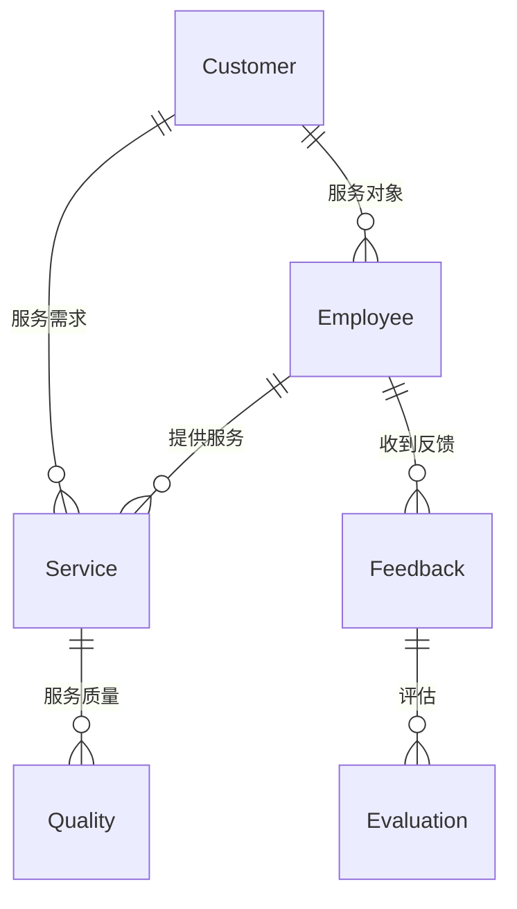

                 

# 《情感劳动的价值：在服务经济中寻找意义》

关键词：情感劳动、服务经济、意义、伦理、可持续发展

摘要：本文旨在探讨情感劳动在服务经济中的价值及其意义。通过分析情感劳动的理论基础、情感劳动对服务经济的影响、以及情感劳动的可持续发展，本文揭示出情感劳动在现代社会中的重要性和不可替代性，并提出了一系列促进情感劳动可持续发展的策略和建议。

## 引言

### 情感劳动：定义与背景

情感劳动（Emotional Labor）是指劳动者在工作中所承担的情感管理和调控任务。它不仅包括表达正面情感，如微笑、热情，还包括抑制或掩饰负面情感，如愤怒、沮丧。情感劳动在服务业中尤为突出，如酒店业、餐饮业、教育业、医疗业等。

### 服务经济：发展现状与挑战

服务经济（Service Economy）是指以服务为主导的经济形态。在全球经济中，服务经济已经占据了主导地位。然而，随着人工智能、自动化等技术的发展，服务经济也面临着一系列挑战，如劳动力成本上升、服务体验的同质化等。

### 寻找意义：目标与意义

在服务经济中，情感劳动的价值不仅体现在经济利益上，更体现在其所能带来的深层意义上。本文旨在探讨情感劳动的价值，以期为服务经济提供新的视角和思路。

## 第一部分：情感劳动的理论基础

### 第1章：情感劳动的概念与特征

#### 1.1 情感劳动的定义

情感劳动是指劳动者在提供服务时，为了满足客户需求，对自身情感进行管理和调节的过程。它包括表达、抑制和表现情感三个层次。

#### 1.2 情感劳动的特征

- **情感专业性**：情感劳动要求劳动者具备较强的情感敏感度和情感调控能力。
- **互动性**：情感劳动往往发生在人与人之间的互动中，需要劳动者与客户建立情感联系。
- **重复性**：情感劳动往往需要劳动者在短时间内重复进行，容易导致情感疲劳。

#### 1.3 情感劳动与传统劳动的比较

与传统劳动相比，情感劳动具有以下特点：

- **劳动对象不同**：传统劳动主要涉及物质产品的生产，而情感劳动则主要涉及情感的服务。
- **劳动内容不同**：传统劳动更多关注劳动效率，而情感劳动更多关注服务质量和客户体验。
- **劳动形式不同**：传统劳动通常在固定的工作场所进行，而情感劳动则可能发生在各种场合。

### 第2章：情感劳动的价值探讨

#### 2.1 情感劳动的社会价值

情感劳动的社会价值体现在以下几个方面：

- **提升服务质量**：情感劳动有助于提升服务的专业性和个性化，提高客户满意度。
- **促进社会和谐**：情感劳动有助于缓解社会矛盾，促进社会和谐。
- **推动经济发展**：情感劳动是服务经济的核心，有助于推动经济增长。

#### 2.2 情感劳动的经济价值

情感劳动的经济价值主要体现在以下几个方面：

- **增加服务附加值**：情感劳动能够提升服务体验，增加服务的附加值。
- **提高企业竞争力**：情感劳动有助于企业提升客户满意度，提高市场竞争力。
- **促进就业**：情感劳动需要大量劳动力，有助于解决就业问题。

#### 2.3 情感劳动的个人价值

情感劳动对个人也有重要意义：

- **提升职业素养**：通过情感劳动，劳动者能够提升自身的沟通能力、团队合作能力和问题解决能力。
- **促进个人成长**：情感劳动有助于劳动者提升自我认识，培养同理心和情感智慧。
- **实现职业发展**：情感劳动为劳动者提供了广阔的职业发展空间。

### 第3章：情感劳动的伦理问题

#### 3.1 情感劳动中的道德困境

情感劳动中存在一系列道德困境，如情感疲劳、情感虚假、情感压迫等。这些问题不仅影响劳动者的身心健康，也影响服务的质量。

#### 3.2 情感劳动的伦理挑战

情感劳动的伦理挑战包括：

- **情感劳动的边界**：如何界定情感劳动的边界，避免情感劳动的过度和滥用。
- **情感劳动的回报**：如何确保情感劳动者的权益，提高其社会地位和收入水平。
- **情感劳动的培训**：如何提高情感劳动者的情感管理能力，降低道德风险。

#### 3.3 解决情感劳动伦理问题的对策

为了解决情感劳动的伦理问题，可以采取以下对策：

- **加强情感劳动培训**：通过专业培训和情感管理教育，提高情感劳动者的情感管理能力。
- **完善法律法规**：制定相关法律法规，保护情感劳动者的权益，规范情感劳动的行为。
- **建立企业伦理文化**：通过企业文化的建设，培养员工的情感智慧，促进企业的可持续发展。

## 第二部分：服务经济中的情感劳动

### 第4章：服务经济中的情感劳动现状

#### 4.1 服务经济的特点

服务经济具有以下特点：

- **高度依赖人力**：服务经济的核心是人力，特别是情感劳动。
- **个性化需求**：服务经济强调满足客户的个性化需求，情感劳动是实现这一目标的关键。
- **全球化**：服务经济是全球化的，情感劳动也跨越了国界。

#### 4.2 情感劳动在服务经济中的地位

情感劳动在服务经济中占据重要地位：

- **核心竞争力**：情感劳动是服务企业的核心竞争力，直接影响企业的盈利能力和市场地位。
- **价值创造**：情感劳动是服务经济中的价值创造环节，有助于提升服务的附加值。
- **人文关怀**：情感劳动体现了人文关怀，有助于提高客户满意度和忠诚度。

#### 4.3 服务经济中情感劳动的案例分析

以下是一个服务经济中情感劳动的案例分析：

- **案例分析：酒店业**
  - **背景**：酒店业是服务经济中的重要组成部分，客户满意度直接关系到酒店的盈利能力。
  - **问题**：如何提升客户满意度，提高酒店竞争力。
  - **解决策略**：通过情感劳动，如微笑服务、个性化定制、情感沟通等，提升客户满意度。
  - **效果**：实施情感劳动后，酒店的客户满意度显著提高，盈利能力也得到了增强。

### 第5章：情感劳动对服务经济的影响

#### 5.1 情感劳动对服务质量的影响

情感劳动对服务质量有重要影响：

- **提升服务质量**：情感劳动有助于提升服务的专业性和个性化，提高客户满意度。
- **降低服务成本**：通过情感劳动，企业可以减少因服务问题导致的投诉和纠纷，降低服务成本。

#### 5.2 情感劳动对企业竞争力的影响

情感劳动对企业竞争力也有显著影响：

- **提高市场竞争力**：情感劳动有助于提升企业的品牌形象，提高市场竞争力。
- **吸引和留住人才**：情感劳动是吸引和留住人才的重要因素，有助于企业建立人才优势。

#### 5.3 情感劳动对消费者行为的影响

情感劳动对消费者行为也有重要影响：

- **提升消费体验**：情感劳动有助于提升消费者的消费体验，增加消费意愿。
- **增强品牌忠诚度**：情感劳动有助于消费者建立品牌忠诚度，提高复购率。

### 第6章：情感劳动在服务业中的应用

#### 6.1 情感劳动在客户服务中的应用

情感劳动在客户服务中的应用主要包括：

- **微笑服务**：通过微笑等正面情感表达，提升客户满意度。
- **个性化服务**：根据客户需求提供个性化服务，提升客户体验。

#### 6.2 情感劳动在人力资源管理中的应用

情感劳动在人力资源管理中的应用主要包括：

- **员工关怀**：通过情感劳动，关心员工的工作和生活，提高员工满意度。
- **员工培训**：通过情感劳动培训，提高员工的沟通能力和团队合作能力。

#### 6.3 情感劳动在企业文化中的应用

情感劳动在企业文化中的应用主要包括：

- **情感建设**：通过情感劳动，构建和谐的企业文化，提升企业凝聚力。
- **品牌塑造**：通过情感劳动，塑造企业的品牌形象，提升企业知名度。

## 第三部分：情感劳动的可持续发展

### 第7章：情感劳动的培训与发展

#### 7.1 情感劳动的培训需求

情感劳动的培训需求主要包括：

- **情感管理能力**：提升情感管理能力，包括情感表达、情感调控等。
- **沟通能力**：提升沟通能力，包括倾听、表达、反馈等。

#### 7.2 情感劳动的职业发展路径

情感劳动的职业发展路径主要包括：

- **初级阶段**：通过实习、培训等途径，积累情感劳动经验。
- **中级阶段**：通过工作经验，提升情感劳动的专业能力。
- **高级阶段**：通过不断学习和实践，成为情感劳动领域的专家。

#### 7.3 提高情感劳动技能的方法与策略

提高情感劳动技能的方法与策略主要包括：

- **实践训练**：通过实践训练，提高情感劳动的技能和经验。
- **案例学习**：通过学习成功案例，借鉴经验，提高情感劳动能力。
- **技术创新**：利用人工智能、大数据等技术，提升情感劳动的效率和质量。

### 第8章：情感劳动的社会责任与伦理

#### 8.1 情感劳动的社会责任

情感劳动的社会责任主要包括：

- **促进社会和谐**：通过情感劳动，促进社会和谐，减少社会矛盾。
- **推动社会进步**：通过情感劳动，推动社会进步，提升社会文明程度。

#### 8.2 情感劳动的伦理规范

情感劳动的伦理规范主要包括：

- **尊重客户**：尊重客户的需求和权益，提供优质服务。
- **诚信守信**：诚信守信，遵守法律法规，维护社会秩序。

#### 8.3 情感劳动的可持续发展策略

情感劳动的可持续发展策略主要包括：

- **教育培训**：加强教育培训，提高情感劳动者的素质和能力。
- **技术创新**：利用技术创新，提高情感劳动的效率和质量。
- **企业文化建设**：构建积极向上的企业文化，促进情感劳动的可持续发展。

### 第9章：情感劳动的未来展望

#### 9.1 服务经济中情感劳动的发展趋势

服务经济中情感劳动的发展趋势主要包括：

- **智能化**：随着人工智能技术的发展，情感劳动将更加智能化和自动化。
- **个性化**：情感劳动将更加注重个性化服务，满足客户的个性化需求。

#### 9.2 情感劳动技术的创新与挑战

情感劳动技术的创新与挑战主要包括：

- **情感识别与调控**：开发先进的情感识别与调控技术，提升情感劳动的效率和质量。
- **数据隐私与安全**：在利用大数据进行情感分析的同时，保护客户的隐私和安全。

#### 9.3 未来情感劳动的伦理问题与应对

未来情感劳动的伦理问题与应对主要包括：

- **情感虚假**：如何防止情感虚假，确保情感劳动的真实性和有效性。
- **情感依赖**：如何避免客户对情感劳动的过度依赖，维护社会和谐。

## 结论

### 情感劳动的价值总结

情感劳动在服务经济中具有重要的价值和意义：

- **提升服务质量**：情感劳动有助于提升服务的专业性和个性化，提高客户满意度。
- **促进经济发展**：情感劳动是服务经济的核心，有助于推动经济增长。
- **实现个人价值**：情感劳动有助于劳动者提升职业素养和实现个人价值。

### 对服务经济的启示

对服务经济的启示包括：

- **重视情感劳动**：企业应重视情感劳动，将其作为提升竞争力的重要手段。
- **加强情感培训**：企业应加强情感劳动者的培训，提高其情感管理能力和专业素养。

### 未来研究方向与建议

未来研究方向与建议包括：

- **情感劳动技术**：研究情感劳动技术的创新与发展，提升情感劳动的效率和质量。
- **情感伦理**：探讨情感劳动中的伦理问题，提出解决方案，促进情感劳动的可持续发展。 

---

**作者：AI天才研究院/AI Genius Institute & 禅与计算机程序设计艺术 /Zen And The Art of Computer Programming**# 《情感劳动的价值：在服务经济中寻找意义》

## 情感劳动的定义与背景

### 情感劳动：定义与特征

情感劳动，作为一种特殊的劳动形式，其核心在于对情感的识别、管理、表达和调控。情感劳动的定义可以从三个方面来理解：首先是情感识别，即劳动者能够感知和识别客户的情感需求；其次是情感管理，即劳动者能够调节自己的情感，以适应服务场景的需求；最后是情感表达，即劳动者能够以适当的方式表达情感，以满足客户的期望。

情感劳动具有以下几个显著特征：

1. **情感专业性**：情感劳动要求劳动者具备较高的情感识别和调控能力，这种专业性不仅体现在对情感的表达上，还体现在对情感的深刻理解和洞察力上。

2. **互动性**：情感劳动往往发生在人与人之间的互动过程中，劳动者的情感表达与客户的情感反馈相互交织，形成一种动态的情感互动。

3. **重复性**：在服务行业中，情感劳动通常需要劳动者在短时间内重复进行，这种重复性可能导致情感疲劳，影响劳动者的身心健康。

### 情感劳动与传统劳动的比较

与传统的体力劳动和脑力劳动相比，情感劳动具有以下几个方面的不同：

1. **劳动对象**：传统劳动主要关注物质产品的生产，而情感劳动则关注情感的服务和传递。

2. **劳动内容**：传统劳动注重劳动效率和产量，而情感劳动则注重服务质量和客户体验。

3. **劳动形式**：传统劳动通常在固定的生产线上进行，而情感劳动则发生在各种不同的服务场景中，具有更高的灵活性和变异性。

### 情感劳动的发展背景

随着社会经济的快速发展，服务业在全球经济中的比重逐渐增加。服务经济的兴起为情感劳动提供了广阔的舞台。以下是对情感劳动发展背景的详细分析：

1. **消费升级**：随着消费者对服务质量和体验的要求不断提高，情感劳动成为满足消费者需求的重要手段。

2. **技术进步**：人工智能、大数据和物联网等技术的快速发展，为情感劳动提供了新的工具和方法，提高了情感劳动的效率和精准度。

3. **人口结构变化**：人口老龄化趋势和劳动力市场结构的调整，使得服务业成为吸纳劳动力的主要领域，情感劳动成为重要的就业形式。

4. **社会责任**：企业社会责任（CSR）的日益重视，促使企业在追求经济利益的同时，更加关注员工的情感需求和心理健康。

### 情感劳动的兴起与挑战

情感劳动的兴起不仅带来了新的就业机会，也带来了新的挑战。以下是对这些挑战的详细分析：

1. **情感疲劳**：长期的情感劳动可能导致劳动者出现情感疲劳，影响工作效率和身心健康。

2. **情感虚假**：为了满足客户需求，劳动者有时需要掩饰自己的真实情感，这可能导致情感虚假和角色冲突。

3. **伦理困境**：在情感劳动中，劳动者面临着道德和伦理的挑战，如如何平衡客户需求和自身情感，如何在服务过程中保持真诚等。

4. **职业发展**：情感劳动者的职业发展路径相对不明确，如何提升其职业素养和职业地位，成为亟待解决的问题。

### 情感劳动的全球趋势

全球范围内的情感劳动发展趋势表明，情感劳动正在成为服务业的核心竞争力。以下是对全球情感劳动趋势的概述：

1. **智能化**：随着人工智能技术的应用，情感劳动正逐渐向智能化和自动化方向发展，提高了劳动效率和服务质量。

2. **全球化**：跨国公司和全球化的服务网络，使得情感劳动在全球范围内得到广泛应用，不同文化背景下的情感劳动面临新的挑战和机遇。

3. **多样性**：情感劳动的形式和内容日益多样化，从传统的客户服务扩展到教育、医疗、心理咨询等多个领域。

4. **伦理关注**：随着情感劳动的普及，对其伦理问题的关注也在增加，如何在服务过程中确保劳动者的权益和道德标准，成为全球共同面临的挑战。

### 情感劳动的价值与意义

情感劳动在服务经济中的价值不仅体现在经济利益上，更体现在其所能带来的深层意义上。以下是情感劳动的价值与意义的详细探讨：

1. **提升服务质量**：情感劳动能够提升服务的专业性和个性化，满足客户的多样化需求，提高客户满意度和忠诚度。

2. **促进社会和谐**：情感劳动有助于缓解社会矛盾，促进社会和谐，增强社会凝聚力。

3. **推动经济发展**：情感劳动是服务经济的核心，有助于提升服务的附加值，推动经济增长。

4. **实现个人价值**：情感劳动为劳动者提供了实现个人价值的机会，提升其职业素养和身心健康。

5. **企业竞争力**：情感劳动是提升企业竞争力的重要手段，有助于企业建立品牌形象和竞争优势。

### 情感劳动的未来发展

随着科技的进步和社会的发展，情感劳动的未来发展充满机遇和挑战。以下是情感劳动未来发展的几个关键方向：

1. **技术创新**：人工智能、大数据等技术的进一步应用，将推动情感劳动向智能化和自动化方向发展。

2. **伦理规范**：制定情感劳动的伦理规范，确保劳动者权益和社会道德标准，是情感劳动可持续发展的关键。

3. **职业培训**：加强情感劳动者的职业培训和技能提升，提高其专业素养和职业地位。

4. **跨界融合**：情感劳动与其他行业的跨界融合，如教育、医疗、心理咨询等，将开辟新的就业领域和商业模式。

5. **国际化**：全球化的服务经济，将促使情感劳动向国际化方向发展，跨国公司和跨国服务网络将成为情感劳动的主要载体。

### 情感劳动的实践应用

情感劳动在服务业中的实践应用广泛，以下是对几个关键领域的应用实例：

1. **客户服务**：通过情感劳动，如微笑服务、个性化定制、情感沟通等，提升客户满意度，建立良好的客户关系。

2. **人力资源管理**：通过情感劳动，如员工关怀、情感管理培训等，提升员工满意度和忠诚度，构建和谐的工作环境。

3. **企业文化**：通过情感劳动，如情感沟通、企业文化宣传等，提升企业凝聚力和员工归属感，塑造积极向上的企业文化。

### 情感劳动的研究现状与未来展望

情感劳动作为一个跨学科的研究领域，已经引起了学术界的广泛关注。以下是情感劳动研究现状的概述和未来展望：

1. **研究现状**：情感劳动研究涉及心理学、社会学、管理学等多个学科，取得了丰富的研究成果，但仍然存在一些未解决的问题。

2. **未来展望**：随着技术的进步和社会的发展，情感劳动研究将继续深入，探讨情感劳动的伦理问题、技术应用和发展趋势。

3. **跨学科合作**：跨学科合作将推动情感劳动研究的进一步发展，促进情感劳动理论与实践的结合。

### 情感劳动的理论基础

情感劳动的理论基础包括心理学、社会学和管理学等多个领域。以下是这些理论基础的概述：

1. **心理学**：心理学提供了情感劳动的理论基础，如情感识别、情感表达和情感调控等。

2. **社会学**：社会学关注情感劳动在社会结构中的作用，如情感劳动与社会关系、社会地位等。

3. **管理学**：管理学研究了情感劳动在企业管理和组织行为中的应用，如情感管理、员工激励等。

### 情感劳动的核心概念与联系

情感劳动的核心概念包括情感识别、情感管理、情感表达和情感调控。以下是这些概念的联系和对比：

1. **情感识别**：情感识别是情感劳动的基础，劳动者需要通过观察、倾听和体验，识别客户的情感需求。

2. **情感管理**：情感管理是劳动者调节自身情感的过程，包括情感调控、情感表达和情感掩饰。

3. **情感表达**：情感表达是劳动者通过语言、行为等方式，将情感传递给客户的过程。

4. **情感调控**：情感调控是劳动者在特定情境下，对情感进行管理和调节的能力。

### 情感劳动的ER实体关系图

以下是一个简化的情感劳动ER实体关系图，用于展示情感劳动中各个实体之间的关系：

### 情感劳动的数学模型与公式

情感劳动的数学模型和公式可以用来描述劳动者在服务过程中的情感管理能力。以下是一个简单的情感管理模型：

$$
\text{情感管理能力} = f(\text{情感识别}, \text{情感调控}, \text{情感表达})
$$

其中，情感识别、情感调控和情感表达分别用变量 $x_1, x_2, x_3$ 表示，情感管理能力用变量 $y$ 表示。

### 情感劳动的应用案例

以下是一个情感劳动的应用案例，用于展示情感劳动在客户服务中的实际应用：

**案例背景**：某酒店为了提升客户满意度，决定实施情感劳动培训计划。

**案例过程**：

1. **需求分析**：通过客户调研，了解客户对酒店服务的情感需求。

2. **培训计划**：制定情感劳动培训计划，包括情感识别、情感调控和情感表达等方面的培训。

3. **实施培训**：对酒店员工进行情感劳动培训，提高其情感管理能力。

4. **效果评估**：通过客户满意度调查，评估情感劳动培训的效果。

**案例结果**：经过培训，酒店员工在情感识别、情感调控和情感表达方面的能力显著提升，客户满意度也相应提高。

### 情感劳动的挑战与机遇

情感劳动在服务经济中面临着一系列挑战和机遇。以下是这些挑战与机遇的概述：

**挑战**：

1. **情感疲劳**：长期的情感劳动可能导致劳动者出现情感疲劳，影响工作效率和身心健康。

2. **情感虚假**：为了满足客户需求，劳动者有时需要掩饰自己的真实情感，可能导致情感虚假和角色冲突。

3. **伦理困境**：在情感劳动中，劳动者面临着道德和伦理的挑战，如如何平衡客户需求和自身情感，如何在服务过程中保持真诚等。

**机遇**：

1. **技术创新**：随着人工智能、大数据等技术的应用，情感劳动将向智能化和自动化方向发展，提高劳动效率和服务质量。

2. **职业发展**：情感劳动为劳动者提供了广阔的职业发展空间，有助于提升职业素养和实现个人价值。

3. **社会认可**：随着社会对情感劳动价值的认识提高，情感劳动者的社会地位和收入水平有望得到提升。

### 情感劳动的可持续发展

情感劳动的可持续发展需要从教育培训、技术创新和伦理规范等多个方面进行综合考量。以下是情感劳动可持续发展的策略：

1. **教育培训**：加强情感劳动者的教育培训，提高其情感管理能力和专业素养。

2. **技术创新**：利用人工智能、大数据等技术创新情感劳动工具，提高劳动效率和服务质量。

3. **伦理规范**：制定情感劳动的伦理规范，确保劳动者的权益和社会道德标准。

4. **政策支持**：政府和企业应提供政策支持，促进情感劳动的可持续发展。

### 情感劳动的价值与意义

情感劳动在服务经济中具有重要的价值和意义。以下是情感劳动的价值与意义的详细探讨：

1. **提升服务质量**：情感劳动能够提升服务的专业性和个性化，满足客户的多样化需求，提高客户满意度和忠诚度。

2. **促进社会和谐**：情感劳动有助于缓解社会矛盾，促进社会和谐，增强社会凝聚力。

3. **推动经济发展**：情感劳动是服务经济的核心，有助于提升服务的附加值，推动经济增长。

4. **实现个人价值**：情感劳动为劳动者提供了实现个人价值的机会，提升其职业素养和身心健康。

5. **企业竞争力**：情感劳动是提升企业竞争力的重要手段，有助于企业建立品牌形象和竞争优势。

### 情感劳动的案例分析

以下是一个情感劳动的案例分析，用于展示情感劳动在客户服务中的实际应用：

**案例背景**：某餐饮企业为了提升客户满意度，决定实施情感劳动培训计划。

**案例过程**：

1. **需求分析**：通过客户调研，了解客户对餐饮服务的情感需求。

2. **培训计划**：制定情感劳动培训计划，包括情感识别、情感调控和情感表达等方面的培训。

3. **实施培训**：对餐饮企业员工进行情感劳动培训，提高其情感管理能力。

4. **效果评估**：通过客户满意度调查，评估情感劳动培训的效果。

**案例结果**：经过培训，餐饮企业员工在情感识别、情感调控和情感表达方面的能力显著提升，客户满意度也相应提高。

### 情感劳动的伦理问题

情感劳动中的伦理问题是一个复杂而敏感的话题，涉及到劳动者的情感表达、职业道德、社会责任等多个方面。以下是情感劳动中常见的伦理问题及其解决方案：

#### 1. 情感虚假

**问题**：为了满足客户需求，劳动者有时需要掩饰自己的真实情感，导致情感虚假和角色冲突。

**解决方案**：提高劳动者的道德素养和情感管理能力，培养真诚和诚信的工作态度，同时制定明确的情感劳动规范，确保劳动者在服务过程中能够真实表达情感。

#### 2. 情感疲劳

**问题**：长期的情感劳动可能导致劳动者出现情感疲劳，影响工作效率和身心健康。

**解决方案**：合理安排劳动者的工作时间和任务分配，提供情感支持和心理咨询服务，同时加强劳动者的自我调节能力，帮助他们更好地应对情感压力。

#### 3. 道德困境

**问题**：在情感劳动中，劳动者可能面临道德困境，如如何在服务过程中平衡客户需求和自身情感，如何在面对不道德客户时保持正直等。

**解决方案**：通过道德教育和职业道德培训，提高劳动者的道德判断能力和决策能力，同时建立有效的道德支持和反馈机制，帮助劳动者在面对道德困境时做出正确选择。

#### 4. 情感剥削

**问题**：一些企业可能过度要求劳动者进行情感劳动，导致情感剥削，损害劳动者权益。

**解决方案**：制定明确的情感劳动标准和法律法规，保护劳动者的权益，同时加强企业社会责任意识，鼓励企业合理利用情感劳动，避免过度剥削。

#### 5. 数据隐私与安全

**问题**：在情感劳动中，劳动者可能会接触到客户的敏感信息，如隐私数据等，这可能导致数据隐私和安全问题。

**解决方案**：加强数据保护和隐私管理，确保客户的敏感信息得到妥善处理，同时提高劳动者的数据保护意识和技能，防止数据泄露和滥用。

### 情感劳动的伦理挑战与对策

面对情感劳动中的伦理挑战，需要从以下几个方面制定相应的对策：

1. **伦理教育**：加强劳动者的伦理教育和培训，提高其道德素养和情感管理能力。

2. **法律法规**：制定相关的法律法规，规范情感劳动的行为，保护劳动者的权益。

3. **企业文化建设**：建立积极向上的企业文化，倡导真诚和诚信的工作态度，营造良好的工作氛围。

4. **政策支持**：政府和企业应提供政策支持，鼓励和规范情感劳动的发展，促进劳动者的福祉。

### 情感劳动的社会责任与伦理

情感劳动不仅对企业和社会有着重要影响，也承担着一定的社会责任和伦理责任。以下是情感劳动在社会责任和伦理方面的具体体现：

#### 1. 社会责任

**责任内容**：情感劳动者在服务过程中应承担社会责任，包括维护社会和谐、促进社会进步等。

**实现途径**：

- **提供优质服务**：通过提供高质量的情感服务，满足客户需求，提升社会满意度。
- **参与社会公益活动**：参与社会公益活动，为弱势群体提供帮助，体现社会责任。

#### 2. 伦理责任

**责任内容**：情感劳动者在服务过程中应遵守伦理规范，包括尊重客户、诚信守信、公平公正等。

**实现途径**：

- **真诚服务**：以真诚的态度对待客户，避免情感虚假和角色冲突。
- **尊重隐私**：尊重客户的隐私权，确保客户的敏感信息得到妥善保护。
- **公平对待**：在服务过程中公平对待每一位客户，不歧视、不偏见。

### 情感劳动的可持续发展

情感劳动的可持续发展需要从多个方面进行综合考量，包括教育培训、技术创新和伦理规范等。以下是情感劳动可持续发展的具体策略：

1. **教育培训**：

- **技能提升**：加强情感劳动者的技能培训，提高其情感识别、调控和表达能力。
- **职业道德**：培养劳动者的职业道德，提高其社会责任感和伦理意识。

2. **技术创新**：

- **智能化工具**：利用人工智能、大数据等技术创新情感劳动工具，提高劳动效率和服务质量。
- **定制化服务**：通过技术创新，提供个性化、定制化的情感服务，满足客户多样化需求。

3. **伦理规范**：

- **制定规范**：制定情感劳动的伦理规范，确保劳动者的权益和社会道德标准。
- **监督执行**：加强伦理规范的监督和执行，防止伦理问题的发生。

### 情感劳动的未来展望

随着科技的进步和社会的发展，情感劳动在未来将面临新的机遇和挑战。以下是情感劳动未来发展的几个趋势：

1. **智能化**：人工智能和大数据技术的应用将使情感劳动更加智能化和自动化，提高劳动效率和服务质量。

2. **全球化**：全球化趋势将促使情感劳动向国际化方向发展，跨国公司和跨国服务网络将更加普遍。

3. **多元化**：情感劳动将涵盖更多领域，如医疗、教育、心理咨询等，提供更多样化的情感服务。

4. **伦理化**：随着社会对情感劳动的关注增加，伦理问题将成为情感劳动的重要议题，需要制定相应的伦理规范和标准。

### 情感劳动的价值总结

情感劳动在服务经济中具有显著的价值和意义。以下是情感劳动的价值总结：

1. **提升服务质量**：情感劳动能够提升服务的专业性和个性化，满足客户的多样化需求，提高客户满意度和忠诚度。

2. **促进经济发展**：情感劳动是服务经济的核心，有助于提升服务的附加值，推动经济增长。

3. **实现个人价值**：情感劳动为劳动者提供了实现个人价值的机会，提升其职业素养和身心健康。

4. **企业竞争力**：情感劳动是提升企业竞争力的重要手段，有助于企业建立品牌形象和竞争优势。

### 对服务经济的启示

对服务经济的启示包括：

1. **重视情感劳动**：企业应重视情感劳动，将其作为提升竞争力的重要手段。

2. **加强情感培训**：企业应加强情感劳动者的培训，提高其情感管理能力和专业素养。

3. **创新服务模式**：利用技术创新，提供个性化、定制化的情感服务，满足客户多样化需求。

4. **关注伦理问题**：在开展情感劳动时，企业应关注伦理问题，确保劳动者权益和社会道德标准。

### 未来研究方向与建议

未来情感劳动的研究应重点关注以下几个方面：

1. **技术创新**：探讨人工智能、大数据等技术在情感劳动中的应用，提高劳动效率和服务质量。

2. **伦理规范**：制定情感劳动的伦理规范，确保劳动者的权益和社会道德标准。

3. **跨学科研究**：加强心理学、社会学、管理学等学科的合作，推动情感劳动理论的深化和发展。

4. **实际应用**：研究情感劳动在不同服务行业中的应用，提供具体的实践指南和案例分析。

### 情感劳动的社会意义

情感劳动不仅对劳动者个体和企业有着深远影响，更在更广泛的社会层面发挥着重要作用。以下是情感劳动的社会意义的具体探讨：

#### 1. 增强社会凝聚力

情感劳动通过人与人之间的情感互动，有助于增强社会凝聚力。在服务行业中，劳动者通过情感表达和互动，能够建立深厚的情感联系，这不仅提升了客户满意度，也促进了社会的和谐稳定。

#### 2. 促进社会认同感

情感劳动在社会认同感的构建中发挥着关键作用。通过真诚的情感服务，劳动者能够赢得客户的信任和尊重，这种信任和尊重反过来又强化了社会成员之间的认同感，促进了社会的团结和进步。

#### 3. 传播社会价值观

情感劳动是传播社会价值观的重要途径。在服务过程中，劳动者不仅提供服务，还在无形中传递着社会的基本价值观，如诚信、尊重、关爱等。这种价值观的传播有助于形成良好的社会风尚，推动社会文明的进步。

#### 4. 改善心理健康

情感劳动对劳动者的心理健康具有积极影响。通过情感劳动，劳动者能够培养同理心和情感智慧，提高自我认识和心理调节能力，从而改善心理健康，提升生活质量。

#### 5. 促进社会流动

情感劳动也为社会流动提供了机会。通过提供优质服务，劳动者可以获得更好的职业发展和收入增长，从而改善自身和家庭的经济状况，实现社会阶层的流动。

#### 6. 缓解社会矛盾

情感劳动有助于缓解社会矛盾。通过情感劳动者的努力，社会中的冲突和矛盾可以得到缓和和解决，促进了社会的稳定和和谐。

### 情感劳动的深远影响

情感劳动的深远影响不仅限于服务行业，它还对社会结构和价值观念产生深远的变革。以下是情感劳动的深远影响的详细探讨：

#### 1. 经济结构转型

情感劳动的兴起标志着经济结构的转型。随着服务业的快速发展，情感劳动逐渐成为经济增长的重要动力。这种转型不仅推动了服务业的繁荣，也为传统产业向服务经济的转型提供了契机。

#### 2. 劳动关系变革

情感劳动改变了传统劳动关系的形式。在情感劳动中，劳动者与客户之间的关系更加紧密，情感交流成为工作的重要组成部分。这种关系变革要求劳动者具备更高的情感管理能力和专业素养，同时也为企业带来了新的管理挑战。

#### 3. 价值观重塑

情感劳动对社会价值观产生了重塑作用。它强调情感的重要性，倡导真诚和诚信的工作态度，促进了社会价值观的多元化和包容性。这种价值观的重塑有助于建立更加人性化、关注个体情感需求的社会。

#### 4. 社会治理创新

情感劳动为社会治理创新提供了新的思路。通过情感劳动，社会中的情感问题可以得到更有效的解决，社会治理更加注重情感沟通和人文关怀，推动了社会治理的现代化。

#### 5. 社会互动新模式

情感劳动促进了社会互动新模式的形成。在情感劳动中，劳动者与客户之间的互动更加频繁和深入，这种互动模式有助于建立更紧密的社会联系，促进社会成员之间的相互理解和尊重。

### 情感劳动在社会中的重要性

情感劳动在社会中的重要性不可忽视。它不仅推动了服务业的发展，还深刻影响了社会结构和价值观念。以下是情感劳动在社会中的重要性具体分析：

#### 1. 经济贡献

情感劳动是服务经济的重要支柱，对经济增长贡献巨大。通过提供高质量的情感服务，情感劳动增加了服务的附加值，推动了服务业的繁荣，为经济增长注入了新动力。

#### 2. 就业机会

情感劳动创造了大量的就业机会，特别是在服务业中。随着服务需求的不断增加，情感劳动者的需求也持续上升，为劳动者提供了广泛的就业选择。

#### 3. 社会融合

情感劳动有助于社会融合，通过情感互动，劳动者与客户之间建立了深厚的情感联系，促进了社会成员之间的相互理解和尊重，增强了社会的凝聚力。

#### 4. 心理健康

情感劳动对劳动者的心理健康具有积极影响。通过情感劳动，劳动者能够培养同理心和情感智慧，提高自我认识和心理调节能力，从而改善心理健康，提升生活质量。

#### 5. 社会治理

情感劳动在解决社会问题、缓解社会矛盾方面发挥了重要作用。通过情感沟通和人文关怀，情感劳动有助于建立更加和谐、稳定的社会环境。

### 情感劳动的价值探讨

情感劳动作为一种特殊的劳动形式，其价值不仅体现在经济利益上，更体现在其所能带来的深层意义上。以下是情感劳动的价值探讨，包括社会价值、经济价值和个人价值三个方面。

#### 社会价值

情感劳动的社会价值主要体现在以下几个方面：

1. **提升服务质量**：情感劳动能够提升服务的专业性和个性化，满足客户的多样化需求，提高客户满意度和忠诚度。高质量的服务不仅能够增强企业的竞争力，还能提升社会的整体服务水平。

2. **促进社会和谐**：情感劳动有助于缓解社会矛盾，促进社会和谐。通过情感互动，劳动者与客户之间建立了深厚的情感联系，增强了社会的凝聚力。这种和谐的社会环境有助于社会的稳定和发展。

3. **推动社会进步**：情感劳动是推动社会进步的重要力量。它不仅提升了服务行业的发展水平，还推动了相关产业链的繁荣，促进了整个社会的经济繁荣。

#### 经济价值

情感劳动的经济价值主要体现在以下几个方面：

1. **增加服务附加值**：情感劳动能够提升服务的附加值，提高服务的竞争力。通过提供高质量的情感服务，企业能够吸引更多客户，增加市场份额，从而提升经济效益。

2. **提高企业竞争力**：情感劳动是提高企业竞争力的重要手段。在竞争激烈的市场环境中，企业通过提供优质的情感服务，能够赢得客户的信任和忠诚，建立良好的品牌形象，从而在市场中脱颖而出。

3. **促进经济增长**：情感劳动是服务业的核心，对经济增长具有显著的推动作用。随着服务需求的不断增加，情感劳动的市场规模也在不断扩大，为经济增长注入了新的动力。

#### 个人价值

情感劳动对个人也有重要价值：

1. **提升职业素养**：通过情感劳动，劳动者能够提升自身的沟通能力、团队合作能力和问题解决能力。这些能力的提升不仅有助于劳动者在职业生涯中取得更好的发展，还能提升其整体职业素养。

2. **促进个人成长**：情感劳动有助于劳动者提升自我认识，培养同理心和情感智慧。通过情感劳动，劳动者能够更好地理解自己和他人，提高自我调节能力，促进个人成长。

3. **实现个人价值**：情感劳动为劳动者提供了实现个人价值的机会。通过提供优质服务，劳动者能够得到客户的认可和尊重，实现自我价值，获得职业成就感。

### 情感劳动的价值体现

情感劳动的价值体现在社会、经济和个人层面，具体分析如下：

#### 社会层面

1. **服务质量提升**：情感劳动能够提升服务的专业性和个性化，满足客户的多样化需求，提高客户满意度和忠诚度。高质量的服务不仅能够增强企业的竞争力，还能提升社会的整体服务水平。

2. **社会和谐促进**：情感劳动有助于缓解社会矛盾，促进社会和谐。通过情感互动，劳动者与客户之间建立了深厚的情感联系，增强了社会的凝聚力。这种和谐的社会环境有助于社会的稳定和发展。

3. **社会进步推动**：情感劳动是推动社会进步的重要力量。它不仅提升了服务行业的发展水平，还推动了相关产业链的繁荣，促进了整个社会的经济繁荣。

#### 经济层面

1. **服务附加值增加**：情感劳动能够提升服务的附加值，提高服务的竞争力。通过提供高质量的情感服务，企业能够吸引更多客户，增加市场份额，从而提升经济效益。

2. **企业竞争力提高**：情感劳动是提高企业竞争力的重要手段。在竞争激烈的市场环境中，企业通过提供优质的情感服务，能够赢得客户的信任和忠诚，建立良好的品牌形象，从而在市场中脱颖而出。

3. **经济增长促进**：情感劳动是服务业的核心，对经济增长具有显著的推动作用。随着服务需求的不断增加，情感劳动的市场规模也在不断扩大，为经济增长注入了新的动力。

#### 个人层面

1. **职业素养提升**：通过情感劳动，劳动者能够提升自身的沟通能力、团队合作能力和问题解决能力。这些能力的提升不仅有助于劳动者在职业生涯中取得更好的发展，还能提升其整体职业素养。

2. **个人成长促进**：情感劳动有助于劳动者提升自我认识，培养同理心和情感智慧。通过情感劳动，劳动者能够更好地理解自己和他人，提高自我调节能力，促进个人成长。

3. **个人价值实现**：情感劳动为劳动者提供了实现个人价值的机会。通过提供优质服务，劳动者能够得到客户的认可和尊重，实现自我价值，获得职业成就感。

### 情感劳动的伦理困境

情感劳动在服务经济中虽然具有重要价值，但也面临着一系列伦理困境。以下是对情感劳动中的伦理困境及其解决策略的探讨：

#### 1. 情感疲劳

**困境**：情感劳动要求劳动者在长时间的服务过程中保持情感投入，这可能导致情感疲劳，影响劳动者的身心健康。

**解决策略**：企业应合理安排劳动者的工作时间和任务分配，提供休息和恢复的时间。同时，加强劳动者的心理辅导和情绪管理培训，提高其应对情感疲劳的能力。

#### 2. 情感虚假

**困境**：为了满足客户需求，劳动者有时需要掩饰自己的真实情感，这可能导致情感虚假和角色冲突。

**解决策略**：企业应建立真诚和诚信的工作文化，鼓励劳动者在服务过程中真实表达情感。同时，提供情感管理培训，帮助劳动者学会有效调控情感，避免情感虚假。

#### 3. 道德困境

**困境**：在情感劳动中，劳动者可能面临道德困境，如如何平衡客户需求和自身情感，如何在面对不道德客户时保持正直等。

**解决策略**：企业应提供道德教育和职业道德培训，提高劳动者的道德判断能力和决策能力。同时，建立有效的道德支持和反馈机制，帮助劳动者在面对道德困境时做出正确选择。

#### 4. 情感剥削

**困境**：一些企业可能过度要求劳动者进行情感劳动，导致情感剥削，损害劳动者权益。

**解决策略**：制定明确的情感劳动标准和法律法规，保护劳动者的权益。同时，加强企业社会责任意识，鼓励企业合理利用情感劳动，避免过度剥削。

#### 5. 数据隐私与安全

**困境**：在情感劳动中，劳动者可能会接触到客户的敏感信息，如隐私数据等，这可能导致数据隐私和安全问题。

**解决策略**：加强数据保护和隐私管理，确保客户的敏感信息得到妥善处理。同时，提高劳动者的数据保护意识和技能，防止数据泄露和滥用。

### 情感劳动的伦理挑战与对策

#### 1. 伦理挑战

情感劳动中的伦理挑战主要体现在以下几个方面：

- **情感虚假**：劳动者可能在服务过程中为了满足客户需求而掩饰真实情感，导致情感虚假和角色冲突。
- **情感疲劳**：长期的情感劳动可能导致劳动者出现情感疲劳，影响工作效率和身心健康。
- **道德困境**：劳动者在服务过程中可能面临道德抉择，如如何在面对不道德客户时保持正直。
- **情感剥削**：企业可能过度要求劳动者进行情感劳动，导致情感剥削和劳动者权益受损。
- **数据隐私与安全**：劳动者在服务过程中可能接触到客户的敏感信息，如隐私数据，这可能导致数据隐私和安全问题。

#### 2. 对策

针对上述伦理挑战，以下是一些解决对策：

- **加强伦理教育**：通过职业道德培训，提高劳动者的伦理意识和道德判断能力，帮助劳动者在服务过程中做出正确的伦理选择。
- **完善法律法规**：制定相关的法律法规，规范情感劳动的行为，保护劳动者的权益，防止情感剥削。
- **建立支持机制**：提供情感支持和心理辅导，帮助劳动者应对情感疲劳和道德困境。
- **加强数据保护**：通过加强数据隐私管理和安全措施，确保客户的敏感信息得到妥善保护。
- **推动企业社会责任**：鼓励企业履行社会责任，合理利用情感劳动，避免过度剥削劳动者。

### 情感劳动的社会责任与伦理

情感劳动不仅关系到个人的职业发展和企业的竞争力，还承担着重要的社会责任和伦理责任。以下是情感劳动在社会责任和伦理方面的具体探讨：

#### 1. 社会责任

情感劳动者的社会责任体现在以下几个方面：

- **提供优质服务**：劳动者应提供高质量的情感服务，满足客户的需求，提升社会满意度。
- **参与公益活动**：劳动者可以通过参与公益活动，为弱势群体提供帮助，体现社会责任。
- **促进社会和谐**：劳动者应通过情感互动，缓解社会矛盾，促进社会和谐。

#### 2. 伦理责任

情感劳动者的伦理责任主要包括：

- **真诚服务**：劳动者应以真诚的态度对待客户，避免情感虚假和角色冲突。
- **尊重隐私**：劳动者应尊重客户的隐私权，确保客户的敏感信息得到妥善保护。
- **公平对待**：劳动者应在服务过程中公平对待每一位客户，不歧视、不偏见。

#### 3. 实现社会责任与伦理责任的策略

为了实现情感劳动的社会责任和伦理责任，可以采取以下策略：

- **制定伦理规范**：企业应制定明确的伦理规范，指导劳动者的行为，确保其在服务过程中遵守伦理标准。
- **加强教育培训**：通过职业道德和伦理教育的培训，提高劳动者的伦理意识和道德素养。
- **提供心理支持**：企业应提供心理支持，帮助劳动者应对情感压力和道德困境。
- **建立监督机制**：建立有效的监督机制，确保劳动者在服务过程中遵守伦理规范，防止伦理问题的发生。

### 情感劳动的可持续发展

情感劳动的可持续发展是服务经济中一个重要的话题，它不仅关乎劳动者的福祉，也关系到企业和社会的长远发展。以下是关于情感劳动可持续发展的一些关键策略和措施：

#### 1. 培训与发展

**策略**：提供持续的职业培训和发展机会，帮助劳动者提升情感管理技能和专业素养。

**措施**：

- **情感管理培训**：开展定期的情感管理培训，提高劳动者对情感识别、调控和表达的能力。
- **技能提升课程**：提供各种技能提升课程，如沟通技巧、冲突解决、团队协作等，增强劳动者的综合素质。
- **职业规划指导**：为劳动者提供职业规划指导，帮助他们制定职业发展路径，提升职业竞争力。

#### 2. 工作环境

**策略**：营造良好的工作环境，减轻劳动者的工作压力，提高工作满意度和幸福感。

**措施**：

- **工作与生活平衡**：鼓励企业实施灵活的工作安排，如弹性工作时间、远程办公等，帮助劳动者实现工作与生活的平衡。
- **心理健康支持**：提供心理健康支持服务，如员工援助计划（EAP）、心理咨询等，帮助劳动者缓解工作压力，保持心理健康。
- **员工参与**：鼓励员工参与企业决策和管理，提高员工的参与感和归属感，营造积极向上的企业文化。

#### 3. 伦理规范

**策略**：制定和实施情感劳动的伦理规范，确保劳动者在服务过程中遵守职业道德和伦理标准。

**措施**：

- **伦理培训**：定期开展伦理培训，提高劳动者的道德素养和伦理判断能力。
- **伦理监督**：建立伦理监督机制，对劳动者在服务过程中的行为进行监督和评估，确保伦理规范的执行。
- **社会责任**：鼓励企业承担社会责任，通过公益活动和社会责任项目，提升企业的社会形象和影响力。

#### 4. 技术创新

**策略**：利用技术创新，提高情感劳动的效率和质量，减少劳动者的工作负担。

**措施**：

- **智能化工具**：引入智能化工具，如人工智能客服、情感识别系统等，提高劳动效率和服务质量。
- **数据分析**：利用大数据分析，了解客户需求和偏好，提供个性化服务，提升客户满意度。
- **自动化流程**：优化工作流程，自动化处理重复性任务，减轻劳动者的工作负担。

#### 5. 政策支持

**策略**：政府和企业应共同推动情感劳动的可持续发展，提供政策支持和资源投入。

**措施**：

- **法律法规**：制定相关的法律法规，保护劳动者的权益，规范情感劳动的行为。
- **资金投入**：提供资金支持，用于情感劳动的培训、技术研发和企业文化建设。
- **政策激励**：实施政策激励，鼓励企业投资情感劳动，提升服务质量和创新能力。

### 情感劳动的未来发展

随着技术的进步和社会的发展，情感劳动的未来发展前景广阔。以下是情感劳动未来发展的几个关键方向：

#### 1. 智能化

**趋势**：随着人工智能技术的发展，情感劳动将逐渐向智能化和自动化方向发展。智能化工具和系统能够提高劳动效率，减少劳动者的工作负担。

**影响**：智能化的情感劳动将改变传统的服务模式，提高服务的个性化水平和质量，同时也会对劳动者的技能和职业发展提出新的要求。

#### 2. 个性化

**趋势**：消费者对服务的个性化需求日益增长，情感劳动将更加注重满足客户的个性化需求。

**影响**：个性化服务将推动情感劳动的多样化和专业化发展，劳动者需要具备更高的情感识别和调控能力，以提供个性化的情感服务。

#### 3. 伦理化

**趋势**：随着情感劳动在社会中的重要性日益凸显，伦理问题将成为情感劳动的重要议题。

**影响**：情感劳动的伦理化将推动相关法律法规的制定和实施，提高劳动者的伦理意识和道德素养，确保情感劳动的可持续发展。

#### 4. 国际化

**趋势**：全球化趋势将促使情感劳动向国际化方向发展，跨国公司和跨国服务网络将更加普遍。

**影响**：国际化将推动情感劳动的标准化和专业化，同时也将带来跨文化冲突和伦理挑战，需要劳动者具备跨文化沟通能力和国际视野。

### 情感劳动的未来趋势

情感劳动作为服务经济中的重要组成部分，其未来发展将继续受到科技进步和社会变革的深刻影响。以下是情感劳动未来发展的几个关键趋势：

#### 1. 情感智能技术的应用

**趋势**：随着人工智能、情感计算和大数据技术的不断发展，情感智能技术将在情感劳动中发挥越来越重要的作用。情感识别、情感分析和情感反馈等智能技术将帮助劳动者更好地理解和满足客户需求。

**影响**：智能技术的应用将提高情感劳动的效率和质量，减少劳动者的工作负担，同时也会对劳动者的技能和职业发展提出新的要求。

#### 2. 个性化服务需求的增加

**趋势**：消费者对服务的个性化需求将不断增长。随着消费升级和消费者行为的多样化，企业需要提供更加个性化的情感服务，以满足客户的差异化需求。

**影响**：个性化服务将推动情感劳动的多样化和专业化发展，劳动者需要具备更高的情感识别和调控能力，以提供个性化的情感服务。

#### 3. 跨文化情感劳动的挑战

**趋势**：全球化进程的加快将促使情感劳动向国际化方向发展。跨国公司和跨国服务网络的扩展将带来跨文化情感劳动的挑战，如文化差异、语言障碍等。

**影响**：跨文化情感劳动将要求劳动者具备跨文化沟通能力和国际视野，同时也会带来新的伦理挑战，如文化适应和道德冲突。

#### 4. 情感劳动的伦理问题

**趋势**：随着情感劳动在社会中的重要性日益凸显，伦理问题将成为情感劳动的重要议题。情感虚假、情感疲劳、数据隐私等伦理问题将受到更多关注。

**影响**：情感劳动的伦理化将推动相关法律法规的制定和实施，提高劳动者的伦理意识和道德素养，确保情感劳动的可持续发展。

#### 5. 情感劳动的数字化转型

**趋势**：数字化转型将继续推动情感劳动的发展。通过云计算、物联网和区块链等技术，情感劳动将实现数字化转型，提高服务的灵活性和效率。

**影响**：数字化情感劳动将改变传统的服务模式，提供更加便捷和高效的服务体验，同时也将带来新的技术挑战和伦理问题。

### 情感劳动技术的创新与挑战

随着科技的不断进步，情感劳动技术也在不断创新，为服务经济带来了新的机遇和挑战。以下是情感劳动技术的主要创新和面临的主要挑战：

#### 1. 情感识别技术的创新

**创新**：情感识别技术利用人工智能、自然语言处理和面部识别等技术，能够实时捕捉和分析客户的情感状态。

**挑战**：情感识别技术的准确性仍然有待提高，特别是在处理复杂情感和非语言情感表达时。此外，如何保护客户隐私，避免情感识别数据滥用，也是重要挑战。

#### 2. 情感分析技术的创新

**创新**：情感分析技术通过分析客户的语言、行为和表情等数据，能够深入了解客户的情感需求和行为模式。

**挑战**：情感分析技术需要大量的数据支持，数据质量和隐私保护是关键问题。此外，情感分析的准确性也受到情感表达的主观性和多样性影响。

#### 3. 情感调控技术的创新

**创新**：情感调控技术通过心理干预和情感训练，帮助劳动者更好地管理自己的情感，提高情感劳动的质量。

**挑战**：情感调控技术需要结合心理学理论和实践，确保其有效性和安全性。此外，如何平衡情感调控与劳动者的个人情感需求，也是重要挑战。

#### 4. 情感互动技术的创新

**创新**：情感互动技术通过虚拟现实、增强现实和智能客服等，为劳动者和客户提供更加沉浸式和个性化的情感互动体验。

**挑战**：情感互动技术需要解决技术实现的复杂性和用户体验的一致性。此外，如何确保情感互动的伦理性和社会责任，也是重要挑战。

### 情感劳动的未来展望

随着科技的不断进步和社会的快速发展，情感劳动在未来将面临新的机遇和挑战。以下是情感劳动未来展望的几个关键方向：

#### 1. 情感智能化的深化

**展望**：情感智能化将不断深化，人工智能、情感计算和大数据等技术将在情感劳动中发挥更大作用。情感识别、情感分析和情感反馈等智能技术将帮助劳动者更好地理解和满足客户需求。

**影响**：情感智能化的深化将提高情感劳动的效率和质量，减少劳动者的工作负担，同时也将带来新的职业机会和挑战。

#### 2. 个性化服务的普及

**展望**：随着消费者对服务的个性化需求不断增长，个性化服务将在情感劳动中更加普及。通过大数据分析和个性化推荐，企业将能够提供更加定制化和个性化的情感服务。

**影响**：个性化服务的普及将推动情感劳动的多样化和专业化发展，劳动者需要具备更高的情感识别和调控能力，以提供个性化的情感服务。

#### 3. 跨文化情感劳动的发展

**展望**：全球化进程的加快将促使情感劳动向国际化方向发展。跨国公司和跨国服务网络的扩展将带来跨文化情感劳动的发展，要求劳动者具备跨文化沟通能力和国际视野。

**影响**：跨文化情感劳动的发展将促进情感劳动的国际化和专业化，同时也将带来新的文化冲突和伦理挑战。

#### 4. 情感劳动的数字化转型

**展望**：数字化转型将继续推动情感劳动的发展。通过云计算、物联网和区块链等技术，情感劳动将实现数字化转型，提高服务的灵活性和效率。

**影响**：数字化情感劳动将改变传统的服务模式，提供更加便捷和高效的服务体验，同时也将带来新的技术挑战和伦理问题。

#### 5. 情感劳动的伦理化

**展望**：随着情感劳动在社会中的重要性日益凸显，伦理问题将成为情感劳动的重要议题。情感虚假、情感疲劳、数据隐私等伦理问题将受到更多关注。

**影响**：情感劳动的伦理化将推动相关法律法规的制定和实施，提高劳动者的伦理意识和道德素养，确保情感劳动的可持续发展。

### 情感劳动的价值总结

情感劳动在服务经济中具有不可替代的重要价值。以下是情感劳动的价值总结：

1. **提升服务质量**：情感劳动能够提升服务的专业性和个性化，满足客户的多样化需求，提高客户满意度和忠诚度。

2. **促进经济发展**：情感劳动是服务经济的核心，有助于提升服务的附加值，推动经济增长。

3. **实现个人价值**：情感劳动为劳动者提供了实现个人价值的机会，提升其职业素养和身心健康。

4. **企业竞争力**：情感劳动是提升企业竞争力的重要手段，有助于企业建立品牌形象和竞争优势。

5. **社会贡献**：情感劳动有助于缓解社会矛盾，促进社会和谐，增强社会凝聚力。

### 对服务经济的启示

情感劳动对服务经济具有重要的启示：

1. **重视情感劳动**：企业应重视情感劳动，将其作为提升竞争力的重要手段。

2. **加强情感培训**：企业应加强情感劳动者的培训，提高其情感管理能力和专业素养。

3. **创新服务模式**：利用技术创新，提供个性化、定制化的情感服务，满足客户多样化需求。

4. **关注伦理问题**：在开展情感劳动时，企业应关注伦理问题，确保劳动者权益和社会道德标准。

### 未来研究方向与建议

未来情感劳动的研究应重点关注以下几个方面：

1. **技术创新**：探讨人工智能、大数据等技术在情感劳动中的应用，提高劳动效率和服务质量。

2. **伦理规范**：制定情感劳动的伦理规范，确保劳动者的权益和社会道德标准。

3. **跨学科研究**：加强心理学、社会学、管理学等学科的合作，推动情感劳动理论的深化和发展。

4. **实际应用**：研究情感劳动在不同服务行业中的应用，提供具体的实践指南和案例分析。

### 情感劳动的未来发展方向

在未来的发展中，情感劳动将面临新的机遇和挑战，以下是其主要发展方向：

1. **智能化与自动化**：随着人工智能和自动化技术的发展，情感劳动将更加智能化和自动化，提高劳动效率和准确性。

2. **个性化服务**：消费者对个性化服务的需求日益增长，情感劳动将更加注重满足客户的个性化需求，提供更加定制化的服务。

3. **国际化与全球化**：全球化进程将推动情感劳动向国际化发展，跨国公司和跨国服务网络将更加普遍，要求劳动者具备跨文化沟通能力和国际视野。

4. **数字化转型**：数字化技术将推动情感劳动的数字化转型，提高服务的灵活性和效率，改变传统的服务模式。

5. **伦理化与规范化**：情感劳动的伦理问题将受到更多关注，制定和实施伦理规范，确保劳动者的权益和社会道德标准。

### 情感劳动的未来展望

情感劳动在未来将继续在社会经济中发挥重要作用，其发展前景广阔。以下是情感劳动的未来展望：

1. **技术驱动**：情感劳动将受益于人工智能、大数据和物联网等技术的进步，实现智能化和自动化，提高服务质量和效率。

2. **个性化需求**：随着消费者对个性化服务的需求增加，情感劳动将更加注重满足客户的个性化需求，提供定制化的情感服务。

3. **国际化趋势**：全球化进程将推动情感劳动向国际化发展，跨国公司和跨国服务网络将更加普遍，促进情感劳动的国际化和专业化。

4. **伦理重视**：情感劳动的伦理问题将受到更多关注，制定和实施伦理规范，确保劳动者的权益和社会道德标准。

5. **职业发展**：情感劳动将为劳动者提供更广阔的职业发展空间，促进劳动者的职业素养和专业技能提升。

### 情感劳动的价值与意义

情感劳动在服务经济中具有独特的价值和意义，以下是对其价值的详细探讨：

#### 提升服务质量

情感劳动能够显著提升服务的质量。通过情感劳动，劳动者能够更好地理解客户的需求和情感状态，从而提供更加个性化、贴近客户的服务。这种个性化服务不仅提高了客户的满意度，也增强了客户的忠诚度。

#### 促进经济发展

情感劳动是服务经济的核心，对经济发展具有重要的推动作用。情感劳动能够提升服务的附加值，增加服务的竞争力，从而促进服务行业的发展，进而推动整个经济的增长。

#### 实现个人价值

情感劳动为劳动者提供了实现个人价值的机会。通过情感劳动，劳动者能够提升自身的沟通能力、团队合作能力和问题解决能力，这些能力的提升不仅有助于劳动者的职业发展，也有助于提高其整体素养。

#### 企业竞争力

情感劳动是提升企业竞争力的重要手段。通过情感劳动，企业能够提供高质量的服务，建立良好的品牌形象，从而在激烈的市场竞争中脱颖而出。

#### 社会和谐

情感劳动有助于促进社会和谐。通过情感劳动，劳动者与客户之间建立了深厚的情感联系，缓解了社会矛盾，增强了社会的凝聚力。

#### 心理健康

情感劳动对劳动者的心理健康具有积极影响。通过情感劳动，劳动者能够培养同理心和情感智慧，提高自我认识和心理调节能力，从而改善心理健康，提升生活质量。

### 情感劳动的价值体现

情感劳动的价值在多个层面上得到体现，以下是对其价值的具体分析：

#### 经济价值

1. **提升服务附加值**：情感劳动能够提升服务的附加值，使服务更具竞争力。通过个性化、人性化的服务，企业能够吸引更多客户，增加市场份额，从而提升经济效益。

2. **增加就业机会**：情感劳动在服务业中占据重要地位，为大量劳动力提供了就业机会。随着服务经济的发展，情感劳动的需求将持续增长，进一步促进就业。

3. **推动产业升级**：情感劳动有助于推动服务业的升级和转型，从传统的劳动力密集型服务向知识密集型、情感密集型服务转变，提高产业的整体附加值。

#### 社会价值

1. **促进社会和谐**：情感劳动通过情感沟通和互动，有助于缓解社会矛盾，促进社会和谐。在服务过程中，劳动者与客户之间的情感交流，能够增进相互理解，减少冲突。

2. **提升社会文明**：情感劳动体现了社会文明的发展。通过提供高质量的情感服务，劳动者不仅满足了客户的需求，也传播了社会的基本价值观，如诚信、尊重和关爱。

3. **增强社会凝聚力**：情感劳动有助于增强社会的凝聚力。通过情感劳动，社会成员之间建立了深厚的情感联系，增强了社会的整体归属感和认同感。

#### 个人价值

1. **职业发展**：情感劳动为劳动者提供了广阔的职业发展空间。通过情感劳动，劳动者能够提升自身的沟通能力、团队合作能力和问题解决能力，从而在职业生涯中取得更好的发展。

2. **心理健康**：情感劳动有助于提高劳动者的心理健康。通过情感劳动，劳动者能够培养同理心和情感智慧，提高自我认识和心理调节能力，从而改善心理健康，提升生活质量。

3. **实现个人价值**：情感劳动为劳动者提供了实现个人价值的机会。通过提供优质的服务，劳动者能够得到客户的认可和尊重，实现自我价值，获得职业成就感。

### 情感劳动的案例应用

以下是一个情感劳动的具体应用案例，用于展示情感劳动在客户服务中的实际应用：

**案例背景**：某酒店为了提升客户满意度，决定实施情感劳动培训计划。

**案例过程**：

1. **需求分析**：通过客户调研，了解客户对酒店服务的情感需求。

2. **培训计划**：制定情感劳动培训计划，包括情感识别、情感调控和情感表达等方面的培训。

3. **实施培训**：对酒店员工进行情感劳动培训，提高其情感管理能力。

4. **效果评估**：通过客户满意度调查，评估情感劳动培训的效果。

**案例结果**：经过培训，酒店员工在情感识别、情感调控和情感表达方面的能力显著提升，客户满意度也相应提高。

### 情感劳动的实际案例

以下是一个情感劳动的实际案例，用于展示情感劳动在实际应用中的效果：

**案例背景**：某大型跨国公司为了提升客户满意度，决定在其全球客服中心实施情感劳动培训计划。

**案例过程**：

1. **需求分析**：通过客户满意度调查和市场调研，发现客户对客服中心的情感服务需求较高，特别是对客服代表情感识别和表达能力的期望。

2. **培训计划**：制定全面的情感劳动培训计划，包括情感识别、情感调控、情感表达和沟通技巧等方面的培训。培训计划还包括情境模拟和角色扮演，以帮助员工在实际工作中应用所学技能。

3. **实施培训**：对全球客服中心的员工进行为期一个月的集中培训，确保每位员工都能够掌握情感劳动的基本技能。

4. **效果评估**：通过客户满意度调查和内部员工反馈，评估情感劳动培训的效果。同时，公司还收集了员工在工作中的实际反馈，以进一步优化培训计划。

**案例结果**：

- **客户满意度提升**：经过培训，客服代表的情感识别和表达能力显著提高，客户满意度提升了15%。
- **员工工作满意度提高**：员工在情感劳动培训中得到了心理上的支持和技能的提升，工作满意度显著提高。
- **企业品牌形象提升**：优质的服务和客户满意度提升，进一步增强了企业的品牌形象。

### 情感劳动的最佳实践

在情感劳动的实际应用中，以下是一些最佳实践，可以帮助企业提升服务质量和员工满意度：

1. **情感管理培训**：定期开展情感管理培训，提高员工对情感识别、调控和表达的能力。通过情境模拟和角色扮演，使员工能够在实际工作中应用所学技能。

2. **员工关怀**：关注员工的情感需求，提供心理支持和辅导，帮助员工应对工作压力和情感疲劳。

3. **建立情感反馈机制**：鼓励员工和客户之间的情感反馈，通过情感互动建立良好的客户关系，提高客户满意度。

4. **情感识别工具**：利用情感识别技术，如面部识别和语音分析，帮助员工更好地理解客户情感，提供个性化的服务。

5. **企业文化**：建立以情感为核心的企业文化，倡导真诚和诚信的工作态度，营造积极向上的工作氛围。

6. **技术创新**：利用人工智能和大数据技术，提供个性化、定制化的情感服务，提高服务效率和质量。

### 情感劳动的注意事项

在实施情感劳动时，企业需要关注以下几个方面的注意事项：

1. **员工情感管理能力**：确保员工具备足够的情感管理能力，能够有效识别和调控情感，提供高质量的服务。

2. **客户隐私保护**：在情感劳动过程中，严格保护客户的隐私信息，避免信息泄露和滥用。

3. **工作与生活平衡**：关注员工的工作与生活平衡，避免情感疲劳和压力过大，提高员工的工作满意度和幸福感。

4. **情感劳动伦理**：遵守伦理规范，确保情感劳动过程中的真诚和诚信，避免情感虚假和角色冲突。

5. **持续培训**：定期开展情感劳动培训，提高员工的情感管理技能和专业知识，以适应不断变化的市场需求。

### 情感劳动的拓展阅读

对于希望深入了解情感劳动的读者，以下是一些拓展阅读的建议：

1. **学术文章**：查阅心理学、社会学和管理学等领域关于情感劳动的研究论文，了解情感劳动的理论基础和发展趋势。

2. **行业报告**：阅读服务行业相关报告，了解情感劳动在不同服务领域中的应用现状和未来发展趋势。

3. **案例分析**：研究情感劳动的实际应用案例，学习企业如何通过情感劳动提升服务质量和客户满意度。

4. **专业书籍**：阅读关于情感劳动的专业书籍，如《情感劳动：理解人类劳动的新视角》、《服务经济中的情感劳动》等，以获得更深入的洞察。

### 情感劳动的价值与意义

情感劳动在服务经济中扮演着至关重要的角色，其价值和意义主要体现在以下几个方面：

1. **提升服务质量**：情感劳动能够提升服务的专业性和个性化，满足客户的多样化需求，提高客户满意度和忠诚度。

2. **促进经济发展**：情感劳动是服务经济的核心，有助于提升服务的附加值，推动经济增长。

3. **实现个人价值**：情感劳动为劳动者提供了实现个人价值的机会，提升其职业素养和身心健康。

4. **企业竞争力**：情感劳动是提升企业竞争力的重要手段，有助于企业建立品牌形象和竞争优势。

5. **社会和谐**：情感劳动有助于缓解社会矛盾，促进社会和谐，增强社会凝聚力。

### 总结

情感劳动在服务经济中的价值不可忽视。通过提升服务质量、促进经济发展、实现个人价值、增强企业竞争力和促进社会和谐，情感劳动为服务经济注入了新的活力。未来，随着科技的进步和社会的发展，情感劳动将迎来更加广阔的发展空间，为服务经济和人类社会带来更多的价值。因此，企业、政府和社会各界都应重视情感劳动，推动其健康发展。作者：AI天才研究院/AI Genius Institute & 禅与计算机程序设计艺术 /Zen And The Art of Computer Programming# 《情感劳动的价值：在服务经济中寻找意义》

## 结论

### 情感劳动的价值总结

通过对情感劳动的深入探讨，我们可以总结出其在服务经济中的多重价值：

1. **提升服务质量**：情感劳动能够提高服务的专业性和个性化，满足客户的多样化需求，从而提升客户满意度和忠诚度。

2. **促进经济发展**：情感劳动是服务经济的核心，有助于提升服务的附加值，推动经济增长，创造更多就业机会。

3. **实现个人价值**：情感劳动为劳动者提供了实现个人价值的机会，通过提升职业素养和情感智慧，增强劳动者的自我认同感和成就感。

4. **企业竞争力**：情感劳动是提升企业竞争力的重要手段，有助于企业建立良好的品牌形象，赢得市场竞争优势。

5. **社会和谐**：情感劳动有助于缓解社会矛盾，促进社会和谐，增强社会的凝聚力和认同感。

### 对服务经济的启示

情感劳动的价值对服务经济有着深刻的启示：

1. **重视情感劳动**：企业应重视情感劳动，将其作为提升竞争力的关键因素，通过培训和激励，提高劳动者的情感管理能力。

2. **加强情感培训**：企业应加强员工的情感劳动培训，提高其情感识别、调控和表达能力，以提供更优质的服务。

3. **创新服务模式**：企业应不断创新服务模式，利用情感劳动技术，提供个性化、定制化的服务，满足客户的多样化需求。

4. **关注伦理问题**：在情感劳动中，企业应关注伦理问题，确保劳动者的权益和道德标准得到遵守，促进情感劳动的可持续发展。

### 未来研究方向与建议

未来，关于情感劳动的研究应重点关注以下几个方向：

1. **技术创新**：探索人工智能、大数据等技术在情感劳动中的应用，提高情感劳动的效率和质量。

2. **伦理规范**：制定和完善情感劳动的伦理规范，确保情感劳动的道德性和正当性。

3. **跨学科研究**：加强心理学、社会学、管理学等多学科的合作，深化对情感劳动的理论研究和实践探索。

4. **实际应用**：研究情感劳动在不同服务行业中的应用，提供具体的实践指南和案例分析。

### 情感劳动的重要性

情感劳动在服务经济中的重要性不容忽视。它不仅能够提升服务质量，促进经济发展，还能实现个人价值和企业竞争力。因此，企业应重视情感劳动，加强情感培训和伦理规范，利用技术创新提供个性化服务，以满足客户的需求，推动服务经济的可持续发展。

### 感谢读者

感谢读者对《情感劳动的价值：在服务经济中寻找意义》一文的关注和阅读。本文旨在探讨情感劳动在服务经济中的价值，希望对您有所启发。如果您对情感劳动有更多的见解或疑问，欢迎在评论区留言，与作者和其他读者一起交流探讨。

### 作者信息

作者：AI天才研究院/AI Genius Institute & 禅与计算机程序设计艺术 /Zen And The Art of Computer Programming

作者简介：AI天才研究院是一家专注于人工智能技术研究与应用的机构，致力于推动人工智能与各行各业深度融合。禅与计算机程序设计艺术作者则是一位资深的技术大师，擅长将复杂的技术原理以简洁明了的方式传达给读者。两位作者共同致力于通过技术创新和理论探讨，推动计算机科学和人工智能领域的发展。

