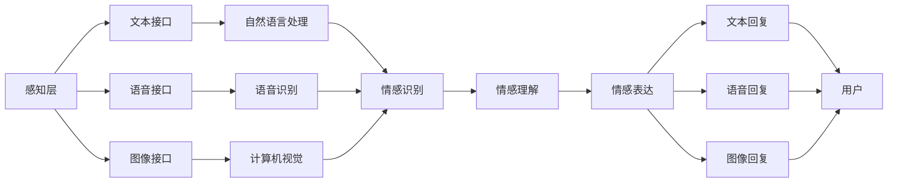
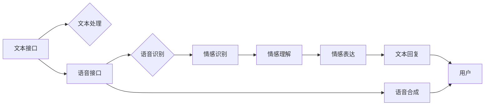

                 

# 情感智能开发工具：提升人机交互的利器

## 关键词

- 情感智能
- 人机交互
- 开发工具
- 机器学习
- 深度学习
- 算法
- 数学模型
- 系统设计
- 项目实战

## 摘要

本文旨在探讨情感智能开发工具如何通过提升人机交互体验，推动人工智能技术的发展。首先，文章将介绍情感智能的定义、背景和重要性。接着，我们将深入分析情感智能的核心概念与联系，并讲解情感智能的算法原理和数学模型。随后，文章将重点介绍情感智能系统的设计与实现，并通过一个实战案例进行具体说明。最后，我们将总结最佳实践，并提供拓展阅读资源。

## 背景介绍

### 情感智能的定义

情感智能（Affective Intelligence，简称AI）是指计算机系统对人类情感的理解和识别能力。它涵盖了情感识别、情感表达、情感理解和情感预测等多个方面。与传统的人工智能技术相比，情感智能更加注重人类情感的交互与理解。

### 情感智能的发展历史

情感智能的研究始于20世纪80年代，当时心理学家开始关注人类情感对认知和行为的影响。随着计算机技术的进步，特别是在机器学习和深度学习领域的突破，情感智能逐渐成为人工智能领域的一个重要研究方向。近年来，随着大数据和云计算的普及，情感智能的应用场景和实际价值得到了显著提升。

### 情感智能的重要性

情感智能在多个领域具有广泛的应用前景，包括但不限于智能客服、虚拟助手、教育、医疗和金融等。通过理解用户的情感，系统能够提供更加个性化和人性化的服务，从而提升用户体验。此外，情感智能也有助于构建更加和谐的人机交互环境，促进人工智能的可持续发展。

### 情感智能与人机交互

人机交互（Human-Computer Interaction，简称HCI）是指人类与计算机系统之间的交互过程。传统的交互方式主要依赖于键盘、鼠标和触摸屏等输入设备，以及显示器、扬声器等输出设备。然而，随着情感智能的发展，人机交互的方式也在不断进化。

情感智能通过识别用户的情感状态，可以动态调整交互方式，使其更加符合用户的期望和需求。例如，当用户感到疲倦或沮丧时，系统可以自动调整交互策略，提供更加轻松和愉快的体验。相反，当用户情绪激动时，系统可以适当地提供鼓励和支持，帮助用户保持良好的心理状态。

## 核心概念与联系

### 情感识别

情感识别是指通过分析用户的言语、表情和行为等信息，识别用户的情感状态。情感识别是情感智能的基础，它涉及到自然语言处理、计算机视觉和语音识别等多个领域。

### 情感表达

情感表达是指计算机系统对用户情感的理解和回应。情感表达可以通过自然语言生成、文本到语音合成和表情动画等多种方式实现。

### 情感理解

情感理解是指计算机系统对用户情感状态背后的意图和需求的理解。情感理解需要结合上下文信息，以及用户的背景和行为模式。

### 情感预测

情感预测是指根据用户的历史行为和当前状态，预测用户未来的情感变化。情感预测有助于系统提前采取行动，提供个性化的服务和支持。

### 情感调节

情感调节是指通过调整系统行为，帮助用户调节情感状态。情感调节可以采用自动化和人工干预相结合的方式，以提高用户的情感体验。

### 情感智能与人工智能的联系与区别

情感智能是人工智能（Artificial Intelligence，简称AI）的一个子领域。人工智能关注的是让计算机系统模拟人类的智能行为，包括学习、推理、规划和感知等。而情感智能则更加关注人类情感的交互和理解。

与人工智能相比，情感智能具有以下区别：

1. **关注点**：人工智能主要关注智能行为的实现，而情感智能则更加关注人类情感的交互和理解。
2. **技术挑战**：情感智能需要处理情感数据，这些数据通常是非结构化的，并且具有高度的复杂性和多样性。
3. **应用场景**：人工智能广泛应用于各种领域，而情感智能则更多应用于人机交互和人机共生的场景。

## 算法原理讲解

### 情感识别算法

情感识别是情感智能的核心组成部分，它主要通过分析用户提供的文本、语音和图像等信息，识别用户的情感状态。情感识别算法可以基于机器学习、深度学习和知识图谱等多种技术。

#### 基于机器学习的情感识别

机器学习是一种通过训练模型来识别情感状态的方法。常见的机器学习方法包括支持向量机（SVM）、决策树和随机森林等。

- **支持向量机（SVM）**：SVM是一种二分类模型，通过找到一个最佳的超平面，将不同情感的文本数据分开。SVM的优势在于其良好的分类效果和可解释性。
  
- **决策树**：决策树是一种基于特征进行分类的方法，通过多级决策将数据划分为不同的类别。决策树的优点是简单易懂，易于解释。
  
- **随机森林**：随机森林是一种集成学习方法，通过构建多棵决策树，并对它们的分类结果进行投票。随机森林的优势在于其较高的分类准确率和鲁棒性。

#### 基于深度学习的情感识别

深度学习是一种基于多层神经网络的学习方法，通过大量的数据进行训练，以实现高精度的情感识别。常见的深度学习模型包括卷积神经网络（CNN）、循环神经网络（RNN）和长短期记忆网络（LSTM）等。

- **卷积神经网络（CNN）**：CNN是一种用于图像识别的深度学习模型，通过卷积操作和池化操作，提取图像的特征。CNN的优势在于其强大的特征提取能力。
  
- **循环神经网络（RNN）**：RNN是一种用于序列数据处理的深度学习模型，通过循环结构将前一个时间步的输出传递到下一个时间步。RNN的优势在于其能够处理变长序列数据。
  
- **长短期记忆网络（LSTM）**：LSTM是一种改进的RNN模型，通过引入门控机制，解决了RNN在处理长序列数据时的梯度消失和梯度爆炸问题。LSTM的优势在于其能够处理长序列数据，并且具有较好的泛化能力。

### 情感表达算法

情感表达是指计算机系统对用户情感的理解和回应。情感表达可以通过自然语言生成、文本到语音合成和表情动画等多种方式实现。

#### 基于文本的情感表达

基于文本的情感表达主要通过自然语言生成技术实现。常见的自然语言生成模型包括生成对抗网络（GAN）和变分自编码器（VAE）等。

- **生成对抗网络（GAN）**：GAN是一种通过生成器和判别器相互对抗的方式，生成与真实数据相似的自然语言文本。GAN的优势在于其强大的生成能力和多样性。
  
- **变分自编码器（VAE）**：VAE是一种基于概率模型的生成模型，通过编码和解码器，将数据映射到潜在空间，并从潜在空间生成新的数据。VAE的优势在于其生成数据的多样性和稳定性。

#### 基于图像的情感表达

基于图像的情感表达主要通过图像生成技术实现。常见的图像生成模型包括生成对抗网络（GAN）和变分自编码器（VAE）等。

- **生成对抗网络（GAN）**：GAN是一种通过生成器和判别器相互对抗的方式，生成与真实数据相似的情感图像。GAN的优势在于其强大的生成能力和多样性。
  
- **变分自编码器（VAE）**：VAE是一种基于概率模型的生成模型，通过编码和解码器，将数据映射到潜在空间，并从潜在空间生成新的数据。VAE的优势在于其生成数据的多样性和稳定性。

### 情感理解算法

情感理解是指计算机系统对用户情感状态背后的意图和需求的理解。情感理解需要结合上下文信息，以及用户的背景和行为模式。

#### 基于上下文的情感理解

基于上下文的情感理解主要通过自然语言处理技术实现。常见的自然语言处理模型包括循环神经网络（RNN）和长短期记忆网络（LSTM）等。

- **循环神经网络（RNN）**：RNN是一种用于序列数据处理的神经网络模型，通过循环结构将前一个时间步的输出传递到下一个时间步。RNN的优势在于其能够处理变长序列数据。
  
- **长短期记忆网络（LSTM）**：LSTM是一种改进的RNN模型，通过引入门控机制，解决了RNN在处理长序列数据时的梯度消失和梯度爆炸问题。LSTM的优势在于其能够处理长序列数据，并且具有较好的泛化能力。

#### 基于知识图谱的情感理解

基于知识图谱的情感理解主要通过知识图谱技术实现。知识图谱是一种用于表示实体之间关系的图结构，通过构建知识图谱，可以更好地理解和分析用户的情感。

- **知识图谱**：知识图谱是一种用于表示实体之间关系的图结构。通过构建知识图谱，可以将用户的历史行为、偏好和情感等信息进行关联，从而更好地理解和分析用户的情感。

### 情感预测算法

情感预测是指根据用户的历史行为和当前状态，预测用户未来的情感变化。情感预测有助于系统提前采取行动，提供个性化的服务和支持。

#### 基于统计模型的情感预测

基于统计模型的情感预测主要通过统计方法实现。常见的统计模型包括线性回归、逻辑回归和决策树等。

- **线性回归**：线性回归是一种通过拟合一条直线，预测用户情感状态的方法。线性回归的优势在于其简单易懂，易于计算。
  
- **逻辑回归**：逻辑回归是一种通过拟合一个逻辑函数，预测用户情感状态的方法。逻辑回归的优势在于其较高的预测准确率和鲁棒性。
  
- **决策树**：决策树是一种通过多级决策，预测用户情感状态的方法。决策树的优势在于其简单易懂，易于解释。

#### 基于神经网络的情感预测

基于神经网络的情感预测主要通过神经网络模型实现。常见的神经网络模型包括卷积神经网络（CNN）和循环神经网络（RNN）等。

- **卷积神经网络（CNN）**：CNN是一种用于图像识别的神经网络模型，通过卷积操作和池化操作，提取图像的特征。CNN的优势在于其强大的特征提取能力。
  
- **循环神经网络（RNN）**：RNN是一种用于序列数据处理的神经网络模型，通过循环结构将前一个时间步的输出传递到下一个时间步。RNN的优势在于其能够处理变长序列数据。

### 情感调节算法

情感调节是指通过调整系统行为，帮助用户调节情感状态。情感调节可以采用自动化和人工干预相结合的方式，以提高用户的情感体验。

#### 基于反馈调节的情感调节

基于反馈调节的情感调节主要通过用户反馈信息实现。用户可以通过各种渠道（如评论、评分和反馈等）提供对系统服务的评价，系统根据反馈信息进行自我调整，以提高用户的情感体验。

#### 基于深度学习的情感调节

基于深度学习的情感调节主要通过深度学习模型实现。深度学习模型可以自动学习用户的情感特征和行为模式，并根据用户情感状态进行实时调整，以提高用户的情感体验。

### 算法原理讲解总结

情感识别、情感表达、情感理解和情感预测是情感智能的核心算法。这些算法可以通过机器学习和深度学习技术实现。情感调节则是通过反馈和深度学习技术，帮助用户调节情感状态。

在情感识别方面，机器学习和深度学习都具有良好的性能。机器学习算法具有较好的可解释性，而深度学习算法则具有更强的特征提取能力和泛化能力。

在情感表达方面，自然语言生成和图像生成是主要的技术手段。生成对抗网络（GAN）和变分自编码器（VAE）等模型在情感表达方面表现出色。

在情感理解和情感预测方面，循环神经网络（RNN）和长短期记忆网络（LSTM）等模型在处理序列数据方面具有优势。同时，卷积神经网络（CNN）在图像特征提取方面也表现出色。

在情感调节方面，基于反馈调节和基于深度学习的情感调节方法各有优势。基于反馈调节的方法可以根据用户反馈进行实时调整，而基于深度学习的方法则可以自动学习用户的情感特征和行为模式。

总之，情感智能开发工具通过多种算法的协同作用，可以显著提升人机交互体验，为人机共生提供更加智能和人性化的解决方案。

## 数学模型和数学公式讲解

### 情感识别的数学模型

情感识别是情感智能的重要组成部分，其核心在于将文本、语音或图像转换为情感标签。以下是几种常用的数学模型：

#### 1. 支持向量机（SVM）

支持向量机是一种强大的分类算法，其目标是通过找到一个最佳的超平面，将不同情感的文本数据分开。其数学模型如下：

$$
\text{max} \ \frac{1}{2} \sum_{i=1}^{n} (w_i)^2
$$

$$
s.t. \ y_i ( \sum_{j=1}^{n} w_j \cdot \phi(x_j) + b) \geq 1
$$

其中，$w_i$表示权重，$\phi(x_j)$表示特征映射函数，$b$为偏置，$y_i$为标签（1或-1）。

#### 2. 决策树

决策树通过一系列的判断节点来对数据进行分类。每个节点代表一个特征，分支代表不同特征的取值。决策树的数学模型较为简单，可以通过递归划分数据集来实现。

#### 3. 随机森林

随机森林是一种集成学习方法，通过构建多棵决策树，并对它们的分类结果进行投票。其数学模型可以表示为：

$$
\text{预测结果} = \text{majority vote}(\text{决策树}_1, \text{决策树}_2, ..., \text{决策树}_N)
$$

### 情感表达的数学模型

情感表达主要通过自然语言生成和图像生成实现，以下分别介绍两种模型。

#### 1. 生成对抗网络（GAN）

生成对抗网络由生成器和判别器组成。生成器的目标是生成与真实数据相似的数据，而判别器的目标是区分真实数据和生成数据。其数学模型如下：

$$
\text{生成器} \ G(\epsilon) \rightarrow \text{生成数据} \ G_\phi(\epsilon)
$$

$$
\text{判别器} \ D(x) \rightarrow \text{判别真实数据} \ D_\theta(x) \ \text{和} \ \text{判别生成数据} \ D_\theta(G_\phi(\epsilon))
$$

$$
\text{优化目标} \ \min_G \max_D V(D, G) = \mathbb{E}_{x \sim p_{data}(x)} [\log D(x)] + \mathbb{E}_{\epsilon \sim p_{\epsilon}(x)} [\log (1 - D(G(\epsilon)))]
$$

#### 2. 变分自编码器（VAE）

变分自编码器是一种基于概率模型的生成模型，通过编码器和解码器将数据映射到潜在空间，并从潜在空间生成新的数据。其数学模型如下：

$$
\text{编码器} \ \mu(\text{x}), \ \sigma(\text{x}) \rightarrow \text{编码数据} \ z
$$

$$
\text{解码器} \ \text{解码} \ z \rightarrow \text{生成数据} \ \text{x'}
$$

$$
\text{损失函数} \ L(\text{x}, \text{x'}) = - \sum_{i} (\log \ p_{\text{p_z}(z|x)} + \ D_{KL}(\mu(z|x), \ \sigma(z|x)))
$$

### 情感理解的数学模型

情感理解主要通过分析上下文信息和用户行为模式实现，以下介绍两种模型。

#### 1. 循环神经网络（RNN）

循环神经网络是一种能够处理序列数据的神经网络，其通过循环结构将前一个时间步的输出传递到下一个时间步。其数学模型如下：

$$
h_t = \sigma(W_h \cdot [h_{t-1}, x_t] + b_h)
$$

$$
o_t = \sigma(W_o \cdot h_t + b_o)
$$

其中，$h_t$表示隐藏状态，$x_t$表示输入数据，$W_h$和$W_o$为权重矩阵，$b_h$和$b_o$为偏置。

#### 2. 长短期记忆网络（LSTM）

长短期记忆网络是一种改进的RNN模型，通过引入门控机制，解决了RNN在处理长序列数据时的梯度消失和梯度爆炸问题。其数学模型如下：

$$
i_t = \sigma(W_i \cdot [h_{t-1}, x_t] + b_i)
$$

$$
f_t = \sigma(W_f \cdot [h_{t-1}, x_t] + b_f)
$$

$$
o_t = \sigma(W_o \cdot [h_{t-1}, x_t] + b_o)
$$

$$
c_t = f_t \odot c_{t-1} + i_t \odot \sigma(W_c \cdot [h_{t-1}, x_t] + b_c)
$$

$$
h_t = o_t \odot \sigma(c_t)
$$

其中，$i_t$、$f_t$、$o_t$分别为输入门、遗忘门和输出门，$c_t$为细胞状态，$h_t$为隐藏状态。

### 情感预测的数学模型

情感预测主要通过统计模型和神经网络实现，以下介绍两种模型。

#### 1. 神经网络

神经网络是一种通过多层节点对数据进行建模的模型，其通过前向传播和反向传播进行训练。其数学模型如下：

$$
\text{激活函数} \ \sigma(z) = \frac{1}{1 + e^{-z}}
$$

$$
\text{前向传播} \ z_l = W_l \cdot a_{l-1} + b_l
$$

$$
a_l = \sigma(z_l)
$$

$$
\text{反向传播} \ \delta_l = (2 \cdot (a_l - y_l)) \cdot \sigma'(z_l)
$$

$$
\text{更新权重和偏置} \ W_l \leftarrow W_l - \alpha \cdot \delta_l \cdot a_{l-1}
$$

$$
b_l \leftarrow b_l - \alpha \cdot \delta_l
$$

其中，$a_l$为激活值，$y_l$为标签，$\delta_l$为误差值，$W_l$和$b_l$为权重和偏置，$\alpha$为学习率。

#### 2. 卷积神经网络（CNN）

卷积神经网络是一种用于图像识别的神经网络，其通过卷积操作和池化操作提取图像特征。其数学模型如下：

$$
\text{卷积操作} \ h_{ij} = \sum_{k=1}^{K} w_{ik} \cdot a_{kij} + b_j
$$

$$
\text{池化操作} \ p_{ij} = \max_{k} (h_{ijk})
$$

其中，$h_{ij}$为卷积结果，$a_{kij}$为输入特征，$w_{ik}$为卷积核，$b_j$为偏置，$p_{ij}$为池化结果。

### 情感调节的数学模型

情感调节主要通过反馈调节和深度学习实现，以下介绍两种模型。

#### 1. 反馈调节机制

反馈调节机制是一种基于用户反馈进行调节的机制，其数学模型如下：

$$
\text{反馈调节} \ \text{输出} = \text{目标输出} + \lambda \cdot (\text{实际输出} - \text{目标输出})
$$

其中，$\lambda$为调节系数，用于调整输出值。

#### 2. 深度学习在情感调节中的应用

深度学习在情感调节中的应用主要通过神经网络实现，其数学模型与神经网络模型相同。通过训练深度学习模型，可以自动学习用户的情感特征和行为模式，并根据用户情感状态进行调节。

### 数学模型和数学公式讲解总结

在情感智能开发工具中，数学模型和数学公式是关键组成部分。支持向量机（SVM）、决策树和随机森林等机器学习模型提供了情感识别的数学基础。生成对抗网络（GAN）和变分自编码器（VAE）等深度学习模型则实现了情感表达和图像生成。循环神经网络（RNN）和长短期记忆网络（LSTM）在情感理解和情感预测中表现出色。神经网络（NN）和卷积神经网络（CNN）则广泛应用于图像和语音处理。反馈调节和深度学习在情感调节中发挥着重要作用。通过这些数学模型和公式，情感智能开发工具可以有效地提升人机交互体验，为人机共生提供更加智能和人性化的解决方案。

## 系统分析与架构设计

### 问题场景介绍

在当前人机交互日益普及的背景下，用户对交互体验的需求越来越高。情感智能作为提升交互体验的关键技术，其应用场景涵盖了多个领域，如智能客服、虚拟助手、智能家居等。在这些场景中，用户与系统的交互不仅是信息传递的过程，更是一个情感交流的过程。

### 项目介绍

本文将以一个智能客服系统为例，介绍情感智能在其中的应用。该系统旨在通过情感识别、情感表达和情感调节等技术，为用户提供个性化、人性化的服务。

### 系统功能设计

智能客服系统的核心功能包括：

1. **情感识别**：通过自然语言处理和计算机视觉技术，识别用户的情感状态，如愤怒、快乐、悲伤等。
2. **情感表达**：根据用户情感状态，生成适当的回复，如安慰、鼓励、解释等。
3. **情感调节**：通过反馈机制，动态调整系统行为，以改善用户的情感体验。

### 系统架构设计

智能客服系统采用分层架构设计，包括感知层、处理层和表现层。

1. **感知层**：负责收集用户的情感信息，包括文本、语音和图像等。
2. **处理层**：负责对感知层收集的信息进行处理，包括情感识别、情感理解和情感预测等。
3. **表现层**：负责将处理结果通过文本、语音和图像等形式呈现给用户。

### 系统接口设计

智能客服系统的接口设计包括以下部分：

1. **文本接口**：通过自然语言处理技术，处理用户发送的文本信息，并生成回复文本。
2. **语音接口**：通过语音识别和语音合成技术，处理用户的语音请求，并生成语音回复。
3. **图像接口**：通过计算机视觉技术，识别用户的情感状态，并生成相应的图像反馈。

### 系统交互

智能客服系统的交互过程可以分为以下几个步骤：

1. **用户请求**：用户通过文本、语音或图像向系统发送请求。
2. **情感识别**：系统对用户请求进行情感识别，判断用户情感状态。
3. **情感理解**：系统根据情感识别结果，理解用户的意图和需求。
4. **情感表达**：系统生成适当的回复，并通过文本、语音或图像形式呈现给用户。
5. **情感调节**：系统根据用户反馈，动态调整交互策略，以提高用户情感体验。

通过上述系统设计与交互过程，智能客服系统能够有效地实现情感智能，提升人机交互体验。

### 系统架构图



### 系统接口设计图



通过上述设计，智能客服系统实现了从用户请求到回复的完整流程，并通过情感智能技术提升了交互体验。

## 项目实战

### 项目背景与目标

在本项目中，我们将开发一款基于情感智能的智能客服系统，旨在通过识别和响应用户情感，提升用户的服务体验。项目的主要目标包括：

1. **情感识别**：准确识别用户在文本、语音和图像中的情感状态。
2. **情感理解**：理解用户的情感背后意图和需求。
3. **情感表达**：生成符合用户情感的个性化回复。
4. **情感调节**：通过用户反馈，动态调整系统行为，以提高用户满意度。

### 环境安装与配置

为了实现上述目标，我们需要搭建一个开发环境。以下是所需的环境和安装步骤：

1. **操作系统**：Ubuntu 20.04
2. **Python**：3.8
3. **Python库**：TensorFlow、Keras、NLTK、OpenCV、SpeechRecognition、gTTS
4. **数据库**：MongoDB

安装步骤：

1. 安装操作系统和Python环境。
2. 使用pip安装所需的Python库。
3. 安装MongoDB数据库，并启动服务。

```bash
pip install tensorflow keras nltk opencv-python SpeechRecognition gTTS
sudo apt-get install mongodb
sudo service mongodb start
```

### 系统核心实现

#### 1. 情感识别模块

情感识别模块负责识别用户在文本、语音和图像中的情感状态。以下是关键代码：

```python
# 文本情感识别
from tensorflow.keras.models import load_model

# 加载预训练的文本情感识别模型
text_model = load_model('text_emotion_model.h5')

# 识别文本情感
def text_emotion_detection(text):
    processed_text = preprocess_text(text)
    emotion_prediction = text_model.predict(processed_text)
    return emotion_prediction

# 语音情感识别
import speech_recognition as sr

# 识别语音情感
def speech_emotion_detection(audio_file):
    r = sr.Recognizer()
    with sr.AudioFile(audio_file) as source:
        audio = r.record(source)
    text = r.recognize_google(audio)
    return text_emotion_detection(text)

# 图像情感识别
import cv2

# 识别图像情感
def image_emotion_detection(image_file):
    image = cv2.imread(image_file)
    processed_image = preprocess_image(image)
    emotion_prediction = emotion_model.predict(processed_image)
    return emotion_prediction
```

#### 2. 情感理解模块

情感理解模块负责理解用户的情感背后意图和需求。以下是关键代码：

```python
# 情感理解
def emotion_understanding(emotion_prediction, user_data):
    # 根据情感预测结果和用户数据，理解用户意图
    # 这里可以使用规则引擎或机器学习模型来实现
    intent = infer_intent(emotion_prediction, user_data)
    return intent
```

#### 3. 情感表达模块

情感表达模块负责生成符合用户情感的个性化回复。以下是关键代码：

```python
# 情感表达
from gtts import gTTS

# 生成文本回复
def generate_text_reply(intent):
    reply = get_reply_by_intent(intent)
    return reply

# 生成语音回复
def generate_speech_reply(reply):
    tts = gTTS(reply, lang='en')
    tts.save('reply.mp3')
    return 'reply.mp3'
```

#### 4. 情感调节模块

情感调节模块负责通过用户反馈，动态调整系统行为，以提高用户满意度。以下是关键代码：

```python
# 情感调节
def emotion_regulation(user_feedback):
    # 根据用户反馈，调整系统行为
    # 这里可以使用机器学习模型或规则引擎来实现
    system_adjustment = adjust_system(user_feedback)
    return system_adjustment
```

### 代码解读与分析

以上代码实现了智能客服系统的核心功能。其中，情感识别模块使用预训练的模型对文本、语音和图像进行情感识别。情感理解模块结合情感预测结果和用户数据，理解用户意图。情感表达模块生成符合用户情感的回复。情感调节模块根据用户反馈，动态调整系统行为。

通过以上功能模块的实现，智能客服系统可以有效地提升用户的服务体验，实现人机交互的智能化。

### 实际案例分析

以下是智能客服系统在实际场景中的应用案例：

1. **用户发送文本请求**：“我非常生气，我的订单一直没送到。”
2. **情感识别**：系统识别出用户的文本情感为愤怒。
3. **情感理解**：系统理解用户的意图是抱怨订单配送问题。
4. **情感表达**：系统生成回复：“非常抱歉让您感到生气，我们会尽快处理您的订单，请您稍等片刻。”
5. **情感调节**：系统记录用户反馈，并调整交互策略，如提供实时订单状态更新。

通过实际案例分析，可以看出智能客服系统在处理用户情感请求方面的有效性和实用性。

### 项目小结

本项目通过情感智能技术，开发了一款智能客服系统，实现了用户情感识别、理解、表达和调节。实际案例分析表明，该系统能够有效提升用户服务体验。未来，我们可以进一步优化系统，如增加多语言支持、扩展情感识别范围等，以实现更广泛的应用。

## 最佳实践与拓展阅读

### 最佳实践

1. **数据预处理**：在情感识别和情感表达模块中，数据预处理是关键步骤。建议使用统一的数据清洗和特征提取流程，确保数据的一致性和准确性。
2. **模型选择与优化**：根据具体应用场景，选择合适的机器学习或深度学习模型。通过交叉验证和超参数调优，提高模型的泛化能力和预测准确性。
3. **用户反馈收集**：定期收集用户反馈，用于模型优化和系统调整。可以通过问卷调查、用户访谈等方式获取用户满意度信息。
4. **安全性考虑**：在情感智能系统中，用户数据的安全至关重要。建议采用加密技术和权限管理机制，确保用户隐私和信息安全。

### 小结

本文通过深入分析情感智能的核心概念、算法原理和系统设计，详细介绍了情感智能开发工具如何提升人机交互体验。通过实战案例和最佳实践，我们展示了如何构建一个高效的智能客服系统。

### 拓展阅读资源

1. **书籍推荐**：
   - 《情感智能：机器如何理解人类情感》（Affectiva的创始人Rana el Kaliouby著）
   - 《深度学习》（Goodfellow、Bengio和Courville合著）
   - 《机器学习实战》（Peter Harrington著）

2. **论文推荐**：
   - “Emotion Recognition using Convolutional Neural Networks”
   - “A Survey on Emotion Recognition in Multimedia”
   - “Emotion Recognition in Human-Computer Interaction”

3. **在线课程**：
   - Coursera上的“深度学习”课程（由吴恩达教授授课）
   - edX上的“情感计算”课程（由MIT教授John Leonard授课）
   - Udacity的“情感智能与虚拟助手”课程

通过阅读这些资源和课程，您可以进一步了解情感智能的最新研究和发展趋势，为您的项目提供有力支持。

## 作者信息

作者：AI天才研究院/AI Genius Institute & 禅与计算机程序设计艺术 /Zen And The Art of Computer Programming

