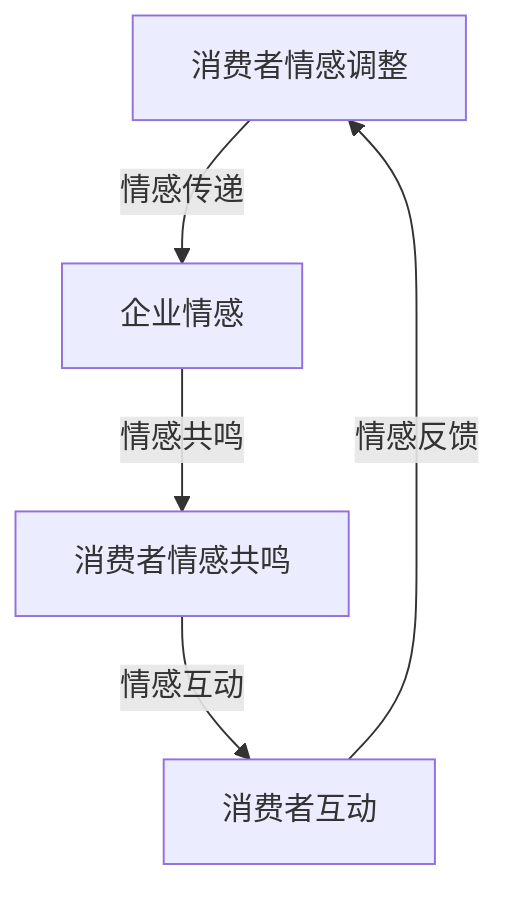

                 

# 情感经济生态圈：感性价值的商业网络构建

## 关键词

- 情感经济
- 商业网络
- 感性价值
- 生态圈
- 商业策略
- 消费者行为

## 摘要

本文深入探讨了情感经济生态圈的构建，以及如何在商业网络中实现感性价值的提升。文章从情感经济的定义和背景出发，逐步分析了情感经济生态圈的基础理论，并提出了构建感性价值商业网络的系统方法。通过案例分析，本文展示了理论在实践中的应用，并提供了实用的操作指南。文章最后总结了全书内容，并对未来情感经济生态圈的发展趋势进行了展望。

## 1. 引言

### 1.1 问题的提出

在当今数字经济时代，消费者行为和市场趋势发生了显著变化。传统的商业逻辑已经无法完全解释新的消费模式，尤其是情感在经济决策中的作用日益凸显。情感经济，作为一种新的商业模式，正逐渐成为企业竞争的新战场。然而，如何构建一个有效的情感经济生态圈，实现感性价值的最大化，成为了企业和学者共同关注的焦点。

### 1.2 书籍的目标与结构

本书旨在为企业和个人提供一套系统化的理论框架和实践指南，帮助他们在情感经济时代取得成功。全书分为七个章节，包括引言、核心概念与联系、情感经济生态圈基础理论、感性价值的商业网络构建方法、案例分析、实践指南和总结与展望。

### 1.3 目标读者

本书适合以下读者群体：

- 市场营销和商业策略专业人士
- 企业高管和创业家
- 对情感经济感兴趣的学者和研究者
- 对消费者行为和市场趋势有浓厚兴趣的读者

## 2. 核心概念与联系

### 2.1 情感经济的定义

情感经济是一种以情感为核心驱动的商业模式，它强调情感在消费者决策中的重要作用。与传统的理性经济不同，情感经济关注的是消费者在购买过程中的情感体验和情感投资。

### 2.2 生态圈的概念

生态圈是指由多个参与者（如企业、消费者、供应商等）组成的复杂网络，这些参与者通过相互关系和互动形成了一个有机的整体。在情感经济中，生态圈不仅是企业开展业务的环境，也是企业获取和维系客户的重要平台。

### 2.3 感性价值的解析

感性价值是指消费者在情感体验过程中获得的心理满足和情感收益。它超越了产品的实际功能和物质价值，关注消费者在购买和使用过程中的情感体验。感性价值是情感经济生态圈的核心，是企业创造竞争优势的关键。

### 2.4 三者之间的联系

情感经济、生态圈和感性价值之间存在着紧密的联系。情感经济为生态圈提供了驱动力，而生态圈则为情感经济的实施提供了平台。感性价值是情感经济和生态圈共同的核心，是实现商业成功的关键。通过以下Mermaid ER实体关系图，我们可以更直观地看到三者之间的联系：

```mermaid
erDiagram
  Entity A[情感经济] ||--|{ Entity B[生态圈] } : 驱动
  Entity B ||--|{ Entity C[感性价值] } : 核心
```

## 3. 情感经济生态圈基础理论

### 3.1 情感经济生态圈的理论基础

情感经济生态圈的理论基础主要源于情感心理学、社会网络理论和商业生态学。情感心理学揭示了情感在人类行为中的重要作用，社会网络理论提供了理解和分析生态圈中互动关系的工具，商业生态学则为情感经济生态圈的构建提供了理论框架。

### 3.2 生态圈中的情感交互机制

在情感经济生态圈中，情感交互机制至关重要。这些机制包括情感传递、情感共鸣、情感互动和情感反馈等。通过以下Mermaid流程图，我们可以更好地理解这些机制：



### 3.3 感性价值在商业中的作用

感性价值在商业中的作用不可忽视。它不仅能够提升消费者的忠诚度和品牌形象，还能为企业创造持续的经济收益。通过以下表格，我们可以比较理性价值和感性价值的属性特征：

| 特征       | 理性价值                | 感性价值                |
| ---------- | --------------------- | --------------------- |
| 取决因素   | 产品功能、价格、质量    | 情感体验、心理满足、品牌认同 |
| 影响范围   | 短期购买决策            | 长期品牌关系             |
| 商业策略   | 产品优化、成本控制      | 情感营销、品牌建设          |

## 4. 感性价值的商业网络构建方法

### 4.1 商业网络的概述

商业网络是指由多个商业实体（如企业、消费者、供应商等）通过交易、合作和竞争等互动关系形成的复杂系统。在情感经济中，商业网络是构建情感经济生态圈的基础。

### 4.2 构建感性价值商业网络的原则

构建感性价值商业网络需要遵循以下原则：

- **以消费者为中心**：将消费者情感需求放在首位，以满足消费者的情感体验为目标。
- **多方协同**：通过建立多方合作关系，实现资源的共享和优势互补。
- **动态调整**：根据市场变化和消费者反馈，不断优化和调整商业网络。

### 4.3 商业网络构建的具体步骤

构建感性价值商业网络可以分为以下步骤：

1. **明确目标**：确定构建感性价值商业网络的愿景和目标。
2. **分析需求**：了解消费者的情感需求和市场趋势。
3. **搭建平台**：建立一个高效、灵活的商业平台，以支持各方互动。
4. **建立合作**：通过合作和交易，构建多方参与的商业网络。
5. **优化调整**：根据实际运营效果，不断优化和调整商业网络。

### 4.4 商业网络的管理与优化

商业网络的管理与优化是确保其有效运行的关键。以下是一些管理优化建议：

- **数据驱动**：利用大数据和人工智能技术，分析消费者行为和情感需求，为决策提供依据。
- **客户关系管理**：建立和维护良好的客户关系，提高客户忠诚度。
- **持续创新**：不断推出新的情感产品和服务，以满足消费者的情感需求。

## 5. 案例分析

### 5.1 案例一：某某公司如何构建情感经济生态圈

某某公司是一家专注于情感消费的科技公司，其通过以下方式构建了情感经济生态圈：

1. **了解消费者需求**：通过市场调研和数据分析，了解消费者的情感需求和消费习惯。
2. **搭建情感互动平台**：开发了情感互动平台，为消费者提供了情感交流和分享的空间。
3. **打造情感产品**：推出了一系列情感产品，如情感玩具、情感化内容等，满足了消费者的情感需求。
4. **建立情感品牌**：通过情感化营销，建立了情感品牌形象，提高了品牌知名度和美誉度。

### 5.2 案例二：某某品牌如何利用感性价值提升品牌形象

某某品牌是一家高端时尚品牌，其通过以下方式利用感性价值提升品牌形象：

1. **情感营销**：通过情感化广告和营销活动，与消费者建立情感联系。
2. **情感产品**：推出了一系列情感化产品，如定制化珠宝、情感化服装等，满足了消费者的情感需求。
3. **客户关系管理**：通过客户关系管理系统，维护与消费者的长期关系，提高客户忠诚度。
4. **品牌社区**：建立了品牌社区，为消费者提供了一个交流和分享情感的平台。

### 5.3 案例三：某某电商平台如何通过情感经济获得成功

某某电商平台通过以下方式通过情感经济获得成功：

1. **情感购物体验**：通过虚拟试衣间、情感化推荐系统等，提升消费者的购物体验。
2. **情感化营销**：通过情感化广告和营销活动，吸引消费者关注和购买。
3. **客户关系管理**：通过客户关系管理系统，提高客户忠诚度和复购率。
4. **社区互动**：建立了用户社区，为消费者提供了一个交流和分享情感的平台。

## 6. 实践指南

### 6.1 建立情感经济生态圈的步骤

1. **确定目标**：明确构建情感经济生态圈的目标和愿景。
2. **分析需求**：了解消费者的情感需求和消费习惯。
3. **搭建平台**：建立情感互动平台，为消费者提供情感交流和分享的空间。
4. **打造情感产品**：推出情感产品，满足消费者的情感需求。
5. **建立合作**：与各方建立合作关系，实现资源的共享和优势互补。
6. **优化调整**：根据市场变化和消费者反馈，不断优化和调整生态圈。

### 6.2 提升感性价值的策略

1. **情感营销**：通过情感化广告和营销活动，与消费者建立情感联系。
2. **情感产品**：推出情感化产品，满足消费者的情感需求。
3. **客户关系管理**：通过客户关系管理系统，维护与消费者的长期关系。
4. **品牌建设**：建立情感品牌形象，提高品牌知名度和美誉度。

### 6.3 商业网络运营的最佳实践

1. **数据驱动**：利用大数据和人工智能技术，分析消费者行为和情感需求。
2. **客户关系管理**：建立和维护良好的客户关系，提高客户忠诚度。
3. **持续创新**：不断推出新的情感产品和服务，以满足消费者的情感需求。
4. **合作共赢**：与各方建立合作关系，实现资源的共享和优势互补。

## 7. 总结与展望

### 7.1 全书总结

本书从情感经济的定义和背景出发，逐步分析了情感经济生态圈的基础理论，提出了构建感性价值商业网络的系统方法。通过案例分析，展示了理论在实践中的应用。最后，提供了实用的操作指南，帮助企业和个人在情感经济时代取得成功。

### 7.2 情感经济生态圈的发展趋势

随着数字技术和人工智能的不断发展，情感经济生态圈将呈现以下趋势：

1. **个性化和定制化**：情感经济生态圈将更加注重个性化和定制化，以满足消费者的情感需求。
2. **智能化**：利用人工智能技术，实现更智能的情感交互和推荐。
3. **跨界融合**：不同行业之间的融合，将推动情感经济生态圈的发展。

### 7.3 未来研究的方向

未来的研究可以从以下几个方面展开：

1. **情感经济生态圈的机制研究**：深入分析情感经济生态圈中的情感交互机制和运行规律。
2. **情感价值评估方法**：研究如何评估和量化感性价值，为企业提供决策依据。
3. **跨学科研究**：结合心理学、社会学、经济学等多学科知识，为情感经济生态圈提供理论支持。

## 作者信息

作者：AI天才研究院/AI Genius Institute & 禅与计算机程序设计艺术 /Zen And The Art of Computer Programming

（待续...）

