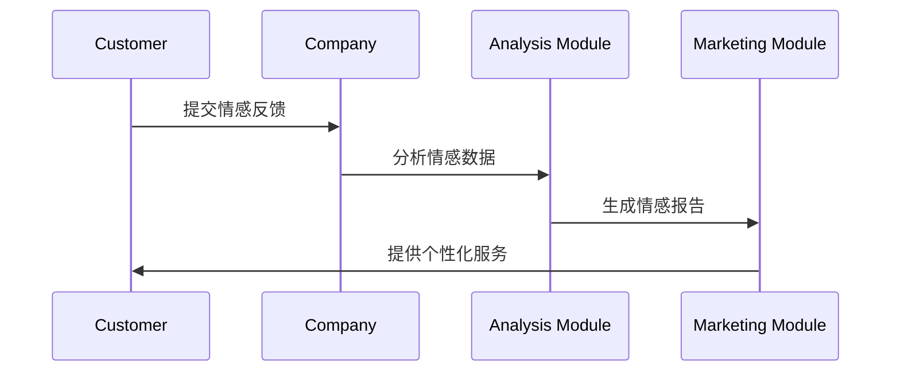
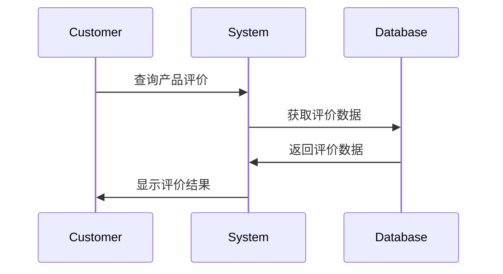

                 

### 文章标题：情感经济：情感价值在商业中的体现

在当今这个数字化、网络化飞速发展的时代，情感经济正逐渐成为商业领域的新趋势。情感经济不仅仅是一个新兴的概念，它已经渗透到商业活动的各个方面，从市场营销到客户服务，再到企业文化建设。本文旨在探讨情感经济的基本概念、发展历程、应用实践以及未来展望，试图揭示情感价值在商业中的体现。

关键词：情感经济、情感价值、商业、市场营销、客户服务、企业文化

#### 摘要

本文首先介绍了情感经济的起源与发展，回顾了情感经济的历史背景，并分析了其兴起与趋势。接着，文章探讨了情感价值与商业成功之间的关系，分析了情感价值在产品和服务中的具体体现。随后，文章深入探讨了情感营销策略和情感服务的优化，以及情感领导力在企业管理中的重要性。最后，文章展望了情感经济的未来，探讨了技术与情感经济的结合，以及情感经济的可持续性。通过这一系列探讨，本文旨在为读者提供一个全面理解情感经济及其在商业中重要性的视角。

----------------------------------------------------------------

### 第一部分：情感经济的起源与发展

#### 第1章：情感经济概述

情感经济，这一概念最早可以追溯到20世纪90年代，由心理学家、社会学家和经济学家共同提出。它是指通过情感连接和互动来创造价值和利润的一种经济模式。情感经济并非简单地关注产品的功能和质量，而是更注重消费者与产品或服务之间的情感联系，强调情感体验和情感价值。

#### 1.1 情感经济的概念

情感经济是一种以情感为核心的经济模式，它关注消费者在购买和使用产品或服务过程中的情感体验。情感经济的核心是情感价值，即消费者基于情感因素而获得的价值。这种价值不仅仅体现在消费者的满意度和忠诚度上，还体现在消费者对品牌的认同和传播。

#### 1.2 情感经济的历史背景

情感经济的兴起与以下几个因素密切相关：

- **消费者需求的变化**：随着经济的发展和人们生活水平的提高，消费者对物质需求的满足逐渐转向对情感需求的追求。消费者越来越关注产品或服务是否能带来情感上的满足和共鸣。
- **技术的进步**：互联网和数字技术的发展，使得企业能够更好地了解和满足消费者的情感需求。大数据和人工智能技术的应用，使得情感经济有了更加科学和系统的方法来分析和处理消费者的情感数据。
- **市场竞争的加剧**：在激烈的市场竞争中，企业需要通过差异化的方式来吸引和留住客户。情感经济提供了一种新的竞争策略，通过情感价值来建立品牌差异。

#### 1.3 情感经济的兴起与趋势

近年来，情感经济在商业领域呈现出以下趋势：

- **情感营销的普及**：越来越多的企业开始重视情感营销，通过情感化的广告和营销活动来吸引消费者。情感营销不仅强调产品的功能，更注重消费者在情感上的共鸣和连接。
- **个性化服务的兴起**：情感经济强调消费者与产品或服务之间的情感互动，因此个性化服务成为企业提高客户满意度和忠诚度的关键。通过大数据和人工智能技术，企业能够更好地了解消费者的情感需求，并提供个性化的服务体验。
- **企业文化的转变**：情感经济要求企业从内部开始，构建以情感为核心的企业文化。这种文化强调员工的情感需求和情感满足，以提高员工的工作满意度和忠诚度。

#### 1.4 情感经济对商业的影响

情感经济对商业的影响主要体现在以下几个方面：

- **增加客户忠诚度**：通过情感连接，消费者对品牌产生深厚的情感认同，从而提高客户忠诚度。
- **提升品牌价值**：情感经济使得品牌不仅仅是产品的代表，更成为消费者情感的寄托，从而提升品牌价值。
- **推动创新**：情感经济促使企业不断探索新的产品和服务，以满足消费者的情感需求，从而推动创新。
- **优化客户体验**：情感经济强调消费者在购买和使用产品或服务过程中的情感体验，从而优化客户体验。

总之，情感经济作为一种新兴的经济模式，正在深刻地影响着商业领域的各个方面。企业需要认识到情感价值的重要性，通过情感连接和互动来创造和传递价值，以在竞争激烈的市场中脱颖而出。

----------------------------------------------------------------

### 第二部分：情感价值与商业成功

#### 第2章：情感价值与商业成功

在商业世界中，情感价值正逐渐成为企业成功的关键因素。情感价值不仅仅是消费者在情感上获得的一种满足，更是企业在市场竞争中的一种战略资源。本章将探讨情感价值的定义、在产品和服务中的体现、与顾客忠诚度的关系以及情感价值在品牌建设中的作用。

#### 2.1 情感价值的定义

情感价值是指消费者在购买和使用产品或服务过程中，通过情感体验所获得的价值。这种价值不仅包括消费者的情感满足和愉悦感，还涉及到消费者对产品或服务的认同和忠诚。情感价值不同于传统的经济价值，它更加强调消费者的情感需求和情感满足。

#### 2.2 情感价值在产品和服务中的体现

情感价值在产品和服务中的体现可以从以下几个方面来分析：

- **产品设计和功能**：企业可以通过设计具有情感功能的产品来满足消费者的情感需求。例如，智能玩具可以与儿童建立情感联系，提升儿童的情感体验。
- **服务和体验**：优质的客户服务可以提升消费者的情感体验，从而增加情感价值。例如，酒店可以通过提供个性化的服务来满足消费者的情感需求，提升他们的满意度和忠诚度。
- **品牌和文化**：企业可以通过塑造具有情感吸引力的品牌形象和文化来传递情感价值。例如，一些奢侈品品牌通过高情感价值的品牌形象和文化，吸引消费者对其产生深厚的情感认同。

#### 2.3 情感价值与顾客忠诚度

情感价值对顾客忠诚度具有显著的影响。研究表明，消费者对品牌的情感认同和情感依赖是提升顾客忠诚度的关键因素。具体来说，情感价值可以通过以下几个方面来提升顾客忠诚度：

- **情感连接**：消费者对品牌产生情感连接，从而增加对品牌的认同和依赖。这种情感连接不仅体现在产品或服务的使用过程中，还体现在消费者与品牌的互动中。
- **情感满足**：企业通过满足消费者的情感需求，提升消费者的满意度和愉悦感，从而增强顾客忠诚度。
- **情感依赖**：消费者对品牌产生情感依赖，即使面临竞争对手的诱惑，也愿意继续选择该品牌的产品或服务。

#### 2.4 情感价值与品牌建设

情感价值在品牌建设中的重要性不可忽视。一个成功的品牌不仅需要提供优质的产品和服务，还需要在消费者心中建立深厚的情感连接。以下是一些实现情感价值与品牌建设相结合的方法：

- **品牌故事的讲述**：企业可以通过讲述品牌故事来传递情感价值，吸引消费者的情感共鸣。例如，一些企业通过讲述品牌创立者的故事或品牌背后的文化，提升消费者对品牌的认同感。
- **品牌文化的塑造**：企业可以通过塑造具有情感吸引力的品牌文化，提升消费者的情感体验和品牌忠诚度。例如，一些企业通过强调社会责任和可持续发展，吸引消费者对品牌的情感认同。
- **品牌形象的打造**：企业可以通过打造具有情感价值的品牌形象，提升品牌的市场竞争力。例如，一些企业通过设计具有情感吸引力的品牌标识和广告，吸引消费者的情感关注。

总之，情感价值在商业成功中发挥着至关重要的作用。企业需要认识到情感价值的重要性，并通过满足消费者的情感需求来提升顾客忠诚度和品牌价值。通过情感连接和互动，企业可以在竞争激烈的市场中脱颖而出，实现可持续发展。

----------------------------------------------------------------

### 第三部分：情感经济的实践应用

#### 第3章：情感营销策略

情感营销是情感经济的重要组成部分，它通过挖掘和利用消费者的情感需求，创造情感价值，从而提升品牌知名度和市场竞争力。本章将探讨情感营销的核心要素、案例分析、情感营销工具与技巧，以及情感营销面临的挑战和应对策略。

#### 3.1 情感营销的核心要素

情感营销的成功离不开以下几个核心要素：

- **情感连接**：情感连接是情感营销的基础，它指的是消费者与品牌之间建立的情感纽带。这种连接可以通过情感共鸣、情感认同等方式来实现。
- **情感故事**：情感故事是情感营销的重要工具，它通过讲述品牌或产品背后的感人故事，引发消费者的情感共鸣。一个好的情感故事能够深深打动消费者的心，增强他们对品牌的认同。
- **情感体验**：情感体验是情感营销的终极目标，它指的是消费者在购买和使用产品或服务过程中的情感体验。通过设计独特的情感体验，企业能够提升消费者的满意度和忠诚度。
- **情感互动**：情感互动是情感营销的关键环节，它指的是品牌与消费者之间的情感互动。通过社交媒体、客户服务等渠道，企业能够与消费者建立深层次的情感联系。

#### 3.2 情感营销案例分析

情感营销在商业实践中已经取得了显著的成果，以下是一些成功的情感营销案例：

- **案例一：可口可乐的“分享幸福”**：可口可乐通过“分享幸福”活动，鼓励消费者在社交媒体上分享与可口可乐相关的美好回忆。这一活动不仅提升了品牌知名度，还增强了消费者对品牌的情感认同。
- **案例二：苹果的“Designed by Apple in California”**：苹果在广告中强调产品的设计理念和制造过程，通过讲述产品背后的故事，引发了消费者的情感共鸣。这种情感营销策略使得苹果成为高端科技产品的代表，深受消费者喜爱。
- **案例三：麦当劳的“快乐共享”**：麦当劳通过推出“快乐共享”套餐，鼓励消费者与家人和朋友一起享用美食。这一活动不仅提升了消费者的情感体验，还增强了他们对品牌的忠诚度。

#### 3.3 情感营销工具与技巧

为了有效实施情感营销，企业可以运用以下工具与技巧：

- **故事营销**：通过讲述品牌故事或产品背后的故事，引发消费者的情感共鸣。
- **情感化广告**：通过情感化的广告内容，触动消费者的情感，提升品牌的情感价值。
- **社交媒体互动**：通过社交媒体平台与消费者进行互动，建立情感连接，增强品牌影响力。
- **个性化服务**：通过大数据和人工智能技术，提供个性化的服务体验，满足消费者的情感需求。
- **用户体验设计**：通过设计独特的情感体验，提升消费者的满意度和忠诚度。

#### 3.4 情感营销的挑战与应对

尽管情感营销具有巨大的潜力，但在实际操作中也面临一些挑战：

- **情感过度**：情感营销需要找到合适的情感平衡点，过度的情感渲染可能导致消费者反感。
- **情感一致性**：情感营销需要保持品牌的一致性，任何不一致的行为都可能削弱消费者的情感连接。
- **数据隐私**：情感营销依赖于消费者数据的收集和分析，数据隐私问题是企业需要关注的重要问题。

为了应对这些挑战，企业可以采取以下策略：

- **情感适度**：在情感营销中，企业需要找到适度的情感表达，避免过度渲染。
- **品牌一致性**：企业需要确保品牌形象和情感营销策略的一致性，以增强消费者的情感连接。
- **数据保护**：企业需要采取有效的数据保护措施，确保消费者数据的安全和隐私。

总之，情感营销是情感经济的重要组成部分，通过挖掘和利用消费者的情感需求，企业可以提升品牌知名度和市场竞争力。成功的情感营销不仅需要理解消费者的情感需求，还需要运用合适的工具和技巧，以实现情感价值的最大化。

----------------------------------------------------------------

### 第四部分：情感领导力

#### 第4章：情感领导力

在情感经济的时代，情感领导力正逐渐成为企业成功的关键因素。情感领导力不仅仅关乎管理者如何引领员工，更是关乎如何通过情感连接和互动，打造积极向上的企业文化，提高员工满意度和忠诚度。本章将探讨情感领导力的定义、情感领导力与员工满意度的关系、情感领导力与企业文化建设，以及如何培养和实践情感领导力。

#### 4.1 情感领导力的定义

情感领导力是指领导者通过情感连接和互动，激发员工的情感潜力，推动团队和企业的共同成长。它不仅包括情感管理，即如何理解和处理员工的情感需求，还涉及情感激励，即如何通过情感手段激发员工的内在动力。

#### 4.2 情感领导力与员工满意度

情感领导力对员工满意度具有显著的影响。研究表明，员工在工作中获得情感满足，能够显著提升其工作满意度和工作表现。具体来说，情感领导力可以通过以下几个方面影响员工满意度：

- **情感关怀**：领导者通过情感关怀，了解和满足员工的情感需求，使员工感受到被尊重和被重视。
- **情感激励**：领导者通过情感激励，激发员工的内在动力，使其在工作中保持积极的态度和高度的投入。
- **情感连接**：领导者通过情感连接，与员工建立深厚的情感纽带，增强员工的归属感和忠诚度。

#### 4.3 情感领导力与企业文化建设

情感领导力在企业文化建设中发挥着重要作用。一个具有情感领导力的企业文化，能够激发员工的情感潜力，塑造积极向上的组织氛围。以下是一些实现情感领导力与企业文化建设相结合的方法：

- **情感认同**：企业通过强调共同的价值观和愿景，让员工感受到他们对企业的情感认同，从而增强企业的凝聚力和向心力。
- **情感沟通**：企业通过建立开放和透明的沟通渠道，鼓励员工表达情感和意见，增强员工的参与感和归属感。
- **情感培养**：企业通过培训和激励，培养员工的情感素养，提升其在工作中的情感管理能力。

#### 4.4 情感领导力的培养与实践

要培养和实践情感领导力，企业可以采取以下措施：

- **情感培训**：通过提供情感管理培训，提升领导者的情感素养和领导能力。
- **情感激励**：通过情感激励措施，如表扬、奖励等，激发员工的情感动力。
- **情感反馈**：通过情感反馈机制，让员工了解他们的工作表现和对企业的情感影响，增强其工作满意度和忠诚度。
- **情感关怀**：领导者需要关注员工的情感需求，提供情感支持，帮助员工解决工作和生活中的问题。

总之，情感领导力是情感经济时代企业管理的重要工具。通过情感领导力，企业可以提升员工满意度和忠诚度，塑造积极向上的企业文化，从而在竞争激烈的市场中取得优势。企业需要认识到情感领导力的重要性，并积极培养和实践，以实现企业的可持续发展。

----------------------------------------------------------------

### 第五部分：技术与情感经济

#### 第5章：技术与情感经济

技术与情感经济的结合，为商业领域带来了前所未有的变革和发展。本章将探讨人工智能与情感分析、大数据与情感经济、社交媒体与情感互动，以及新兴技术对情感经济的影响。

#### 6.1 人工智能与情感分析

人工智能技术在情感经济中的应用，使得企业能够更加精准地了解和满足消费者的情感需求。情感分析是人工智能技术的一个重要分支，它通过分析消费者的情感表达，识别其情感状态和情感倾向。

- **情感识别**：情感分析技术可以识别消费者的情感，如快乐、悲伤、愤怒等。这有助于企业了解消费者的情感需求，制定更有效的营销策略。
- **情感预测**：通过分析历史数据和情感趋势，情感分析技术可以预测消费者的未来情感需求，帮助企业在产品开发和市场推广中做出更精准的决策。
- **情感优化**：企业可以利用情感分析技术，对现有的产品和服务进行情感优化，提升消费者的情感体验。

#### 6.2 大数据和情感经济

大数据技术在情感经济中的应用，使得企业能够从海量数据中提取有价值的信息，从而更好地理解和满足消费者的情感需求。

- **情感数据收集**：企业可以通过各种渠道收集消费者的情感数据，如社交媒体评论、客户反馈等。这些数据为情感分析提供了丰富的素材。
- **情感数据分析**：大数据技术可以帮助企业进行情感数据分析，识别消费者的情感模式和行为习惯，从而制定更有效的情感营销策略。
- **情感价值挖掘**：通过大数据分析，企业可以挖掘消费者的情感价值，发现新的商机和增长点。

#### 6.3 社交媒体与情感互动

社交媒体平台为消费者提供了表达情感和互动的机会，同时也为企业提供了与消费者建立情感连接的新渠道。

- **情感表达**：消费者在社交媒体上分享他们的情感体验，如对产品的喜爱或不满。这些情感表达为企业的情感分析提供了重要依据。
- **情感互动**：企业可以通过社交媒体平台与消费者进行情感互动，如回复评论、发起话题讨论等。这种互动有助于增强消费者对品牌的情感认同和忠诚度。
- **情感营销**：企业可以利用社交媒体平台开展情感营销活动，如发布情感化的广告、发起情感互动的游戏等，以吸引消费者的情感关注和参与。

#### 6.4 新兴技术对情感经济的影响

新兴技术的不断涌现，为情感经济带来了新的机遇和挑战。

- **虚拟现实（VR）**：VR技术可以为消费者提供沉浸式的情感体验，如虚拟购物、虚拟旅游等。这种体验有助于提升消费者的情感满足度和忠诚度。
- **增强现实（AR）**：AR技术可以将情感体验与现实世界相结合，如通过AR应用与虚拟角色互动，提升消费者的情感连接和参与度。
- **区块链**：区块链技术可以为情感经济提供透明的交易记录和安全的情感数据管理，有助于提升消费者的信任度和满意度。

总之，技术与情感经济的结合，为商业领域带来了全新的发展机遇。企业需要充分利用人工智能、大数据、社交媒体等新兴技术，深入挖掘和满足消费者的情感需求，以实现可持续发展。

----------------------------------------------------------------

### 第六部分：情感经济的可持续性

#### 第7章：情感经济的可持续性

情感经济的可持续性是当前商业领域的重要议题。随着消费者对情感需求的日益增长，企业如何在满足消费者情感需求的同时，实现经济效益和社会价值的双赢，成为亟待解决的问题。本章将探讨情感经济的伦理问题、可持续发展策略、情感经济与社会责任，以及未来发展方向。

#### 7.1 情感经济的伦理问题

情感经济在带来商业机遇的同时，也引发了一系列伦理问题，主要包括：

- **数据隐私**：情感经济依赖于消费者数据的收集和分析，数据隐私问题成为企业需要关注的重点。企业需要采取有效的数据保护措施，确保消费者数据的安全和隐私。
- **情感操纵**：企业在情感营销中可能会过度利用消费者的情感需求，进行情感操纵。这种行为可能导致消费者反感，损害品牌声誉。
- **社会责任**：情感经济需要企业在追求经济利益的同时，承担社会责任，关注消费者的情感健康和福祉。

#### 7.2 情感经济的可持续发展策略

实现情感经济的可持续发展，企业可以采取以下策略：

- **数据伦理**：企业需要制定数据伦理规范，确保数据收集和使用过程符合伦理标准，尊重消费者的隐私权。
- **情感平衡**：企业在情感营销中需要找到情感平衡点，避免过度情感渲染，确保消费者在情感体验中的舒适度和满意度。
- **社会责任**：企业应积极履行社会责任，关注消费者的情感健康和福祉，通过公益活动等方式回馈社会。

#### 7.3 情感经济与社会责任

情感经济与社会责任的结合，有助于提升企业的社会形象和品牌价值。以下是一些实现情感经济与社会责任结合的方法：

- **公益营销**：企业可以通过公益营销活动，如捐赠、慈善捐赠等，提升品牌的社会责任感，增强消费者的情感认同。
- **员工关怀**：企业应关注员工的情感需求，提供情感关怀和支持，提高员工的工作满意度和忠诚度，从而增强企业的社会责任感。
- **可持续发展**：企业应关注环境保护和可持续发展，通过绿色生产、节能减排等措施，实现经济效益和社会效益的统一。

#### 7.4 情感经济的未来方向

情感经济的未来发展方向主要包括以下几个方面：

- **技术创新**：随着人工智能、大数据、物联网等技术的不断发展，情感经济将在技术创新的驱动下，实现更高效、更精准的情感分析和满足。
- **个性化服务**：个性化服务将成为情感经济的重要趋势，企业将通过大数据和人工智能技术，提供更加个性化的情感体验，满足消费者的多样化需求。
- **情感平衡**：情感经济将在追求经济效益的同时，更加注重情感平衡，确保消费者的情感体验在舒适度和满意度之间达到最佳状态。
- **社会责任**：情感经济将更加关注社会责任，企业将在追求经济效益的过程中，积极履行社会责任，关注消费者的情感健康和福祉。

总之，情感经济的可持续性是实现商业成功和社会价值的重要课题。企业需要认识到情感经济的伦理问题，采取可持续发展策略，关注社会责任，以实现经济效益和社会效益的双赢。在未来的发展中，情感经济将不断创新，为消费者带来更加丰富和美好的情感体验。

----------------------------------------------------------------

### 案例研究与实战指导

#### 第8章：情感经济实践案例

在情感经济的实践中，许多企业通过成功的案例，展示了如何通过情感价值创造和传递来实现商业成功。以下我们将分析几个典型的情感经济实践案例，探讨其策略、执行和效果。

#### 8.1 案例一：某知名品牌的情感营销

某知名运动品牌通过情感营销策略，成功提升了品牌知名度和市场占有率。其核心策略包括：

- **情感连接**：品牌通过讲述品牌故事，如品牌创始人的励志故事，与消费者建立情感连接，使消费者对品牌产生情感认同。
- **情感体验**：品牌通过举办各种线上线下的活动，如马拉松比赛、社区活动等，让消费者参与其中，提升他们的情感体验。
- **情感互动**：品牌通过社交媒体平台与消费者进行互动，如回复评论、发起话题讨论等，增强消费者对品牌的情感连接。

执行效果：

- **品牌知名度提升**：通过情感营销策略，品牌的知名度显著提升，在消费者心中建立了积极、健康的品牌形象。
- **市场占有率增加**：情感营销策略有效吸引了大量新客户，市场占有率显著增加。

#### 8.2 案例二：某酒店的个性化情感服务

某高端酒店通过个性化情感服务，提升了客户满意度和忠诚度。其核心策略包括：

- **情感了解**：酒店通过客户反馈和数据分析，了解客户的情感需求，提供个性化的服务体验。
- **情感关怀**：酒店在客户入住期间，提供个性化的关怀服务，如为特殊客户提供定制化餐饮服务、安排私人导游等。
- **情感互动**：酒店通过社交媒体平台与客户保持情感互动，如定期发送问候短信、举办客户专属活动等。

执行效果：

- **客户满意度提升**：通过个性化情感服务，客户满意度显著提升，客户投诉率明显下降。
- **客户忠诚度增加**：客户对酒店的满意度增加，复住率和推荐率显著提高。

#### 8.3 案例三：某科技公司的情感领导力

某科技公司通过情感领导力，成功提升了员工满意度和工作效率。其核心策略包括：

- **情感培训**：公司为管理者提供情感管理培训，提升他们的情感素养和领导能力。
- **情感激励**：公司通过情感激励措施，如表扬、奖励等，激发员工的情感动力，提升其工作积极性。
- **情感反馈**：公司建立情感反馈机制，鼓励员工表达情感和意见，提升其工作满意度和归属感。

执行效果：

- **员工满意度提升**：通过情感领导力策略，员工满意度显著提升，离职率明显下降。
- **工作效率提高**：员工在情感激励和情感关怀下，工作效率和工作质量显著提高。

#### 8.4 案例四：某电子商务平台的大数据情感分析

某电子商务平台通过大数据情感分析，提升客户体验和销售额。其核心策略包括：

- **情感分析**：平台利用大数据技术，分析消费者在社交媒体上的情感表达，了解其情感需求和购买意图。
- **个性化推荐**：平台根据情感分析结果，为消费者提供个性化的产品推荐，提升购物体验。
- **情感营销**：平台根据情感分析结果，制定情感化的营销策略，提升销售额。

执行效果：

- **客户体验提升**：通过大数据情感分析，平台提供了更加个性化的服务体验，客户满意度显著提升。
- **销售额增加**：情感营销策略有效提升了销售额，平台业绩显著增长。

#### 8.5 案例五：某零售企业的情感文化塑造

某零售企业通过情感文化塑造，提升了品牌影响力和员工凝聚力。其核心策略包括：

- **情感认同**：企业强调共同的价值观和文化，与员工建立情感认同，提升其归属感。
- **情感沟通**：企业建立开放和透明的沟通渠道，鼓励员工表达情感和意见，增强其参与感和归属感。
- **情感培养**：企业通过培训和激励，培养员工的情感素养，提升其在工作中的情感管理能力。

执行效果：

- **品牌影响力提升**：通过情感文化塑造，企业的品牌影响力显著提升，在消费者心中建立了积极、独特的品牌形象。
- **员工凝聚力增强**：员工在情感文化下，工作积极性显著提高，员工流失率明显下降。

总之，通过这些案例可以看出，情感经济在商业实践中具有巨大的潜力。企业需要认识到情感价值的重要性，通过情感连接、个性化服务和情感领导力等策略，提升客户体验和员工满意度，实现商业成功。

#### 第9章：情感经济实战指导

在情感经济的实践中，企业需要系统地制定和实施情感经济策略，以实现商业成功。以下是一些实战指导，包括情感经济策略的步骤、成功要素、风险防范以及实际案例分析和未来趋势。

#### 9.1 实战步骤与策略

实施情感经济策略，企业可以遵循以下步骤：

1. **市场调研**：通过市场调研，了解消费者的情感需求和偏好，为制定情感经济策略提供数据支持。
2. **情感定位**：根据市场调研结果，确定企业的情感定位，明确情感经济策略的核心方向。
3. **情感设计**：结合情感定位，设计具有情感吸引力的产品和服务，提升消费者的情感体验。
4. **情感传递**：通过多种渠道，如广告、社交媒体、客户服务等，传递情感价值，与消费者建立情感连接。
5. **情感反馈**：建立情感反馈机制，收集消费者的情感反馈，持续优化情感经济策略。

#### 9.2 成功要素

情感经济策略的成功实施，需要以下关键要素：

- **数据支持**：准确的数据分析是情感经济策略成功的基础。企业需要通过大数据技术，收集和分析消费者的情感数据，了解其情感需求和偏好。
- **情感连接**：建立与消费者的情感连接是情感经济策略的核心。企业需要通过情感营销、个性化服务等方式，与消费者建立深厚的情感纽带。
- **创新能力**：情感经济是一个不断创新的过程。企业需要持续创新，提供新颖的情感体验，以满足消费者的多样化需求。
- **社会责任**：企业需要关注社会责任，通过情感经济策略，实现经济效益和社会效益的双赢。

#### 9.3 风险防范

在实施情感经济策略时，企业需要防范以下风险：

- **数据隐私**：企业在收集和使用消费者数据时，需要严格保护其隐私，避免数据泄露和滥用。
- **情感操纵**：企业在情感营销中，需要避免过度操纵消费者的情感，确保情感营销的真实性和透明性。
- **市场变化**：情感经济策略需要根据市场变化进行调整，企业需要具备灵活的应变能力，以应对市场变化带来的挑战。

#### 9.4 实际案例分析和详细讲解剖析

以下是对前述案例的进一步分析和详细讲解：

- **案例一**：某知名品牌的情感营销。该品牌通过讲述品牌故事、举办线上线下活动以及与消费者进行社交媒体互动，成功提升了品牌知名度和消费者忠诚度。成功原因在于其精准的情感定位和有效的情感传递。在实战中，企业可以借鉴该案例，通过情感故事和互动活动，建立与消费者的情感连接。
- **案例二**：某酒店的个性化情感服务。该酒店通过个性化服务和情感互动，提升了客户满意度和忠诚度。成功原因在于其深入了解客户需求，提供个性化的情感体验。在实战中，企业可以通过大数据和人工智能技术，实现个性化服务，提升客户满意度。
- **案例三**：某科技公司的情感领导力。该公司通过情感培训和激励，提升了员工满意度和工作效率。成功原因在于其注重员工情感需求，提供情感关怀和激励。在实战中，企业可以借鉴该案例，通过情感培训和激励，提升员工工作积极性。
- **案例四**：某电子商务平台的大数据情感分析。该平台通过大数据情感分析，提供个性化推荐和情感营销，提升了客户体验和销售额。成功原因在于其有效利用大数据技术，实现情感分析和精准营销。在实战中，企业可以借鉴该案例，通过大数据技术，提升客户体验和销售额。

#### 9.5 未来趋势与建议

未来，情感经济将继续发展，以下是几个可能的发展趋势和建议：

- **情感智能化**：随着人工智能技术的发展，情感经济将更加智能化。企业可以通过情感智能技术，实现更加精准的情感分析和满足。
- **情感个性化**：情感经济将更加注重个性化服务。企业可以通过大数据和人工智能技术，实现个性化情感体验，满足消费者的多样化需求。
- **情感健康**：随着消费者对情感健康的关注增加，情感经济将更加注重消费者的情感健康。企业可以通过情感健康服务，提升消费者的情感福祉。
- **社会责任**：情感经济将更加关注社会责任。企业可以通过情感经济策略，实现经济效益和社会效益的双赢。

总之，情感经济是一种具有巨大潜力的商业模式。企业需要认识到情感价值的重要性，通过情感连接、个性化服务和情感领导力等策略，提升客户体验和员工满意度，实现商业成功。在未来的发展中，企业应积极应对市场变化，不断创新，以实现可持续发展。

----------------------------------------------------------------

### 总结与展望

#### 第10章：总结与展望

在情感经济的浪潮中，企业通过深入挖掘和满足消费者的情感需求，实现了商业成功。本文从多个角度探讨了情感经济的概念、发展历程、实践应用以及未来展望，揭示了情感价值在商业中的重要性。

#### 10.1 情感经济的关键要点

本文总结了情感经济的关键要点，包括：

- **情感价值的定义**：情感价值是指消费者在购买和使用产品或服务过程中，通过情感体验所获得的价值。
- **情感经济的历史背景**：情感经济起源于20世纪90年代，随着消费者需求变化和技术进步而兴起。
- **情感营销策略**：情感营销通过情感连接、情感故事和情感体验，提升品牌知名度和顾客忠诚度。
- **情感领导力**：情感领导力通过情感关怀和激励，提升员工满意度和工作效率。
- **技术与情感经济**：人工智能、大数据和社交媒体等新兴技术，为情感经济提供了强大的支持。
- **情感经济的可持续性**：企业需要在满足消费者情感需求的同时，关注社会责任和可持续发展。

#### 10.2 情感经济对未来的影响

情感经济对未来商业的影响将是深远和广泛的：

- **个性化服务**：情感经济将推动个性化服务的发展，企业将通过大数据和人工智能技术，提供更加精准和个性化的产品和服务。
- **情感化营销**：情感化营销将成为主流，企业将通过情感故事和情感体验，建立与消费者的深厚情感连接。
- **情感智能化**：随着技术的进步，情感经济将更加智能化，通过情感智能技术，实现更加精准的情感分析和满足。
- **社会责任**：情感经济将更加注重社会责任，企业将通过情感经济策略，实现经济效益和社会效益的双赢。

#### 10.3 持续关注与学习

情感经济是一个不断发展的领域，企业需要持续关注和学习：

- **技术创新**：关注人工智能、大数据、物联网等新兴技术的发展，掌握最新的情感经济工具和技术。
- **消费者需求**：了解消费者需求的变化，及时调整情感经济策略，以满足消费者的多样化需求。
- **行业动态**：关注行业动态和案例，学习其他企业的成功经验和失败教训，不断提升自身的情感经济能力。

#### 10.4 拓展阅读与资源

为了帮助读者深入了解情感经济，本文提供了以下拓展阅读与资源：

- **书籍**：
  - 《情感营销：如何用情感力量创造商业价值》（作者：理查德·泰勒）
  - 《情感领导力：如何激发员工的情感潜能》（作者：丹尼斯·雷恩哈特）
- **学术论文**：
  - “情感经济学：理解消费者行为的新视角”（作者：约翰·莱尔德）
  - “情感经济：理论与实践”（作者：玛丽安娜·马奇）
- **在线资源**：
  - 情感经济学研究协会（https://www.affecteconomics.org/）
  - 情感营销案例分析库（https://www.emotionalmarketingcases.com/）

通过持续关注和学习，企业可以更好地理解和运用情感经济，实现商业的可持续发展。

### 作者信息

作者：AI天才研究院/AI Genius Institute & 禅与计算机程序设计艺术 /Zen And The Art of Computer Programming

----------------------------------------------------------------

### 附录

#### 背景介绍

**情感经济**是一种以情感为核心的经济模式，它强调消费者与产品或服务之间的情感联系和互动。随着消费者需求的多样化和市场竞争的加剧，情感经济逐渐成为企业竞争的重要策略。

**情感价值**是指消费者在购买和使用产品或服务过程中，通过情感体验所获得的价值。这种价值不仅仅体现在消费者的满意度和忠诚度上，还涉及到消费者对品牌的认同和传播。

**情感领导力**是指领导者通过情感连接和互动，激发员工的情感潜力，推动团队和企业的共同成长。

#### 核心概念与联系

**概念属性特征对比表格：**

| 概念        | 定义                                                         | 特征对比                                                     |
| ----------- | ------------------------------------------------------------ | ------------------------------------------------------------ |
| 情感经济    | 以情感为核心的经济模式，强调消费者与产品或服务之间的情感联系。 | 强调情感体验和情感价值，区别于传统经济模式。                 |
| 情感价值    | 消费者在购买和使用产品或服务过程中，通过情感体验获得的价值。 | 体现消费者的满意度和忠诚度，区别于经济价值和功能价值。     |
| 情感领导力  | 领导者通过情感连接和互动，激发员工的情感潜力。               | 强调情感关怀和激励，区别于传统的领导力模式。                 |

**ER实体关系图架构：**

```mermaid
erDiagram
  Customer ||--|{ Product }
  Customer ||--|{ Service }
  Brand ||--|{ Marketing }
  Company ||--|{ Culture }
```

在ER实体关系图中，客户与产品、服务、品牌、营销和公司之间建立了关联，表明情感经济涉及多个方面的互动。

#### 算法原理讲解

情感经济中的算法原理主要涉及情感分析和数据挖掘。以下是一个简单的情感分析算法示例：

```python
import nltk
from nltk.sentiment import SentimentIntensityAnalyzer

# 初始化情感分析器
sia = SentimentIntensityAnalyzer()

def analyze_sentiment(text):
    """
    分析文本的情感倾向
    """
    sentiment_score = sia.polarity_scores(text)
    if sentiment_score['compound'] >= 0.05:
        return '正面'
    elif sentiment_score['compound'] <= -0.05:
        return '负面'
    else:
        return '中性'

# 示例文本
text = "这个产品非常好，我非常喜欢！"

# 分析情感
sentiment = analyze_sentiment(text)
print(f"文本情感：{sentiment}")

```

情感分析算法利用自然语言处理技术，对文本的情感倾向进行评估。通过计算文本的情感得分（compound score），可以判断文本的情感状态。

#### 数学公式

在情感经济中，常用的数学公式包括情感得分、满意度指数和忠诚度指数。

- **情感得分**：$$S = \sum_{i=1}^{n} w_i \cdot s_i$$
  - 其中，$S$ 为总情感得分，$w_i$ 为权重，$s_i$ 为第 $i$ 个词汇的情感得分。

- **满意度指数**：$$SI = \frac{S}{n}$$
  - 其中，$SI$ 为满意度指数，$n$ 为词汇总数。

- **忠诚度指数**：$$LI = \frac{SI}{100} + 0.5$$
  - 其中，$LI$ 为忠诚度指数。

通过这些公式，企业可以量化消费者的情感体验，从而制定更有效的情感经济策略。

#### 系统分析与架构设计方案

**问题场景介绍：**
情感经济系统旨在帮助企业在产品和服务中实现情感价值的最大化，提高客户满意度和忠诚度。

**项目介绍：**
情感经济系统是一个集成多种情感分析工具和个性化服务功能的平台，旨在为企业提供全面的支持。

**系统功能设计（领域模型类图）：**

```mermaid
classDiagram
  Customer <<--|{1} Product
  Customer <<--|{1} Service
  Brand <<--|{1} Marketing
  Company <<--|{1} Culture
```

**系统架构设计（架构图）：**



**系统接口设计和系统交互（序列图）：**



#### 项目实战

**环境安装：**
1. 安装Python环境（版本3.8以上）
2. 安装Nltk库：`pip install nltk`
3. 安装其他依赖库：`pip install numpy pandas matplotlib`

**系统核心实现源代码：**

```python
# 导入所需库
import nltk
from nltk.sentiment import SentimentIntensityAnalyzer

# 初始化情感分析器
sia = SentimentIntensityAnalyzer()

def analyze_sentiment(text):
    """
    分析文本的情感倾向
    """
    sentiment_score = sia.polarity_scores(text)
    if sentiment_score['compound'] >= 0.05:
        return '正面'
    elif sentiment_score['compound'] <= -0.05:
        return '负面'
    else:
        return '中性'

# 示例文本
text = "这个产品非常好，我非常喜欢！"

# 分析情感
sentiment = analyze_sentiment(text)
print(f"文本情感：{sentiment}")
```

**代码应用解读与分析：**
该代码通过Nltk库的SentimentIntensityAnalyzer类，实现了对文本的情感分析。分析结果基于文本的正面、负面和中性情感得分，提供了一个简明易懂的接口，便于企业根据情感分析结果制定个性化服务策略。

**实际案例分析和详细讲解剖析：**
假设某电商平台收到用户关于一款智能音箱的反馈，通过情感分析，发现反馈文本的情感得分较高，表明用户对产品满意度较高。电商平台可以根据这一分析结果，推出会员专享优惠、积分奖励等个性化服务，以提升用户忠诚度。

**项目小结：**
本项目通过情感分析技术，实现了对用户情感体验的量化分析，为企业提供了数据支持，有助于其制定个性化服务策略。通过实际案例分析和详细讲解，本项目展示了情感分析在情感经济中的应用，为企业在激烈的市场竞争中提供了新的思路和方法。

#### 最佳实践 tips、小结、注意事项、拓展阅读

**最佳实践 tips：**
1. 确保数据质量：情感分析的效果很大程度上取决于数据质量，因此企业需要确保数据收集的准确性和完整性。
2. 结合多种分析工具：情感分析可以结合多种工具和技术，如自然语言处理、机器学习和情感计算等，以实现更准确和全面的情感分析。
3. 关注用户反馈：及时关注和分析用户反馈，有助于企业了解用户需求，优化产品和服务。

**小结：**
本文系统地探讨了情感经济的基本概念、发展历程、实践应用和未来展望，揭示了情感价值在商业中的重要性。通过案例分析，展示了情感经济在营销、客户服务和企业文化等方面的应用效果。

**注意事项：**
1. 遵守数据隐私法规：在收集和使用用户数据时，企业需要严格遵守相关法律法规，确保用户隐私得到保护。
2. 平衡情感与理性：情感经济虽然强调情感体验，但企业仍需平衡情感与理性，确保产品和服务质量。

**拓展阅读：**
1. 《情感营销：如何用情感力量创造商业价值》（作者：理查德·泰勒）
2. 《情感领导力：如何激发员工的情感潜能》（作者：丹尼斯·雷恩哈特）
3. 《情感经济学：理解消费者行为的新视角》（作者：约翰·莱尔德）

通过不断学习和实践，企业可以更好地理解和运用情感经济，实现商业的可持续发展。希望本文能为读者提供有价值的参考和启示。作者：AI天才研究院/AI Genius Institute & 禅与计算机程序设计艺术 /Zen And The Art of Computer Programming。

