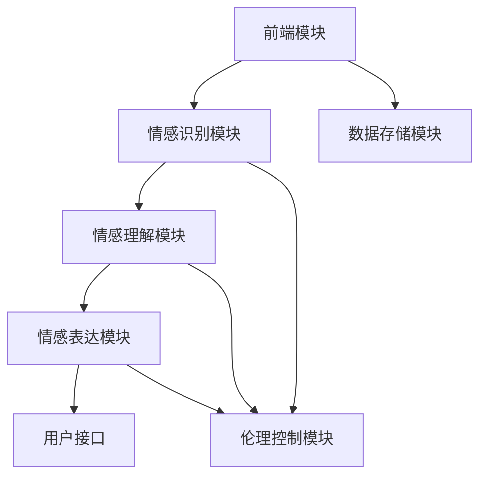

                 

# 情感计算伦理准则：人机情感交互的道德指导方针

## 关键词
情感计算、伦理准则、人机交互、道德指导、情感识别、情感表达、情感理解、隐私保护、公平性、透明性、责任归属

## 摘要
本文深入探讨了情感计算领域中的伦理准则，旨在为人工智能与人类情感交互提供道德指导方针。通过分析情感计算的背景、基本概念和伦理问题的根源，本文提出了详细的伦理准则，包括情感识别、情感表达和情感理解等方面的指导原则。同时，结合实际案例和项目实战，本文详细阐述了伦理准则在情感计算系统中的应用，以期为读者提供全面的道德思考和实践指南。

### 目录

1. **情感计算与伦理准则概述**
2. **伦理准则的理论基础**
3. **情感识别的伦理准则**
4. **情感表达的伦理准则**
5. **情感理解的伦理准则**
6. **伦理准则在情感计算系统的实现**
7. **情感计算伦理准则的应用与未来趋势**
8. **总结与展望**

---

## 情感计算与伦理准则概述

### 问题背景

情感计算（Affective Computing）是一门研究如何使计算机具备识别、理解、处理和模拟人类情感的能力的交叉学科。随着人工智能技术的快速发展，情感计算逐渐成为人工智能领域的重要组成部分。人机情感交互作为情感计算的核心目标，使得计算机能够更好地理解用户的需求和情感状态，从而提供更加个性化和人性化的服务。

然而，随着情感计算技术的进步，一系列伦理问题也随之产生。如何保护用户的隐私、确保系统的公平性和透明性、明确责任归属等问题成为情感计算领域亟需解决的难题。因此，制定一套完善的伦理准则对于推动情感计算的健康发展具有重要意义。

### 伦理准则的意义

伦理准则在情感计算中具有以下几个方面的意义：

1. **道德指导**：伦理准则是计算机科学家和工程师在进行情感计算系统设计和开发过程中的道德指南，有助于他们做出符合伦理要求的决策。

2. **规范行为**：伦理准则为情感计算系统的开发和使用提供了明确的规范，有助于防止滥用技术和侵犯用户权益。

3. **增强信任**：通过遵守伦理准则，可以提高用户对情感计算技术的信任度，从而促进技术的普及和应用。

4. **社会责任**：伦理准则是企业和机构履行社会责任的体现，有助于推动整个行业向更加健康和可持续的方向发展。

### 情感计算的基本概念

情感计算主要包括以下几个基本概念：

1. **情感识别**：通过感知技术（如语音、面部表情、生理信号等）识别用户的情感状态。

2. **情感表达**：计算机通过自然语言生成、面部表情、声音等手段表达情感。

3. **情感理解**：计算机对用户的情感状态进行深度理解和分析，从而提供更加个性化的服务。

4. **情感模拟**：计算机通过算法模拟人类的情感反应，以增强人机交互的自然性和情感共鸣。

### 伦理准则的核心要素

情感计算伦理准则的核心要素主要包括以下几个方面：

1. **隐私保护**：确保用户的个人信息和情感数据不被未经授权的第三方获取和使用。

2. **公平性**：避免情感计算系统对特定群体产生歧视，确保所有用户都能公平地享受技术带来的便利。

3. **透明性**：让用户了解情感计算系统的运作方式和决策过程，提高系统的可信度和透明度。

4. **责任归属**：明确情感计算系统中各方的责任，确保在出现问题时能够迅速有效地解决问题。

---

通过以上概述，我们可以看到情感计算伦理准则对于人机情感交互的道德指导具有重要意义。在接下来的章节中，我们将深入探讨伦理准则的具体内容及其在情感计算系统中的应用。

---

## 伦理准则的理论基础

### 道德哲学与伦理学

道德哲学和伦理学是构建情感计算伦理准则的重要理论基础。道德哲学探讨道德的本质、起源和基础，而伦理学则专注于道德原则的应用和实践。

1. **道德哲学的主要流派**：

   - **功利主义**：以行为的功利效果作为道德评价的标准，强调最大化幸福或效用。
   - **康德伦理学**：强调道德义务和人的尊严，认为道德行为应基于理性的原则。
   - **义务论**：强调行为的道德价值不取决于结果，而取决于行为的动机和目的。

2. **伦理学的基本原理**：

   - **公平性**：公平性是伦理学中的一个核心原则，要求在分配资源和机会时遵循公正的标准。
   - **尊重**：尊重个人的自主权和隐私权是伦理学的基本要求。
   - **责任**：责任原则强调在道德决策和行为中，个体应承担相应的责任。

### 情感计算与伦理准则的联系

情感计算技术的发展带来了新的道德困境，这些困境需要通过伦理准则来加以解决。情感计算与伦理准则之间的联系主要体现在以下几个方面：

1. **情感识别的伦理问题**：

   - **数据隐私**：情感识别技术通常需要收集用户的个人数据，如语音、面部表情等。如何保护这些数据不被滥用是一个重要的伦理问题。
   - **情感歧视**：情感识别系统可能基于用户的历史数据或情感特征做出决策，这可能导致对特定群体的歧视。

2. **情感表达的伦理问题**：

   - **真实性**：情感表达技术需要在真实性和适应性之间找到平衡，确保用户隐私不被泄露，同时提供个性化的服务。
   - **尊重个人隐私**：在情感表达中，应尊重用户的隐私权，避免过度侵入用户的私人生活。

3. **情感理解的伦理问题**：

   - **透明性**：情感理解技术需要向用户解释其决策过程和依据，提高系统的透明度和可信度。
   - **责任归属**：在情感理解中，明确各方的责任对于处理可能的道德问题至关重要。

### 伦理准则在情感计算中的应用案例

1. **隐私保护准则**：

   - **案例**：某社交媒体平台通过分析用户的语音和文字，自动识别用户的情绪状态，并据此推荐相关内容。
   - **应用**：平台在收集用户数据时，应明确告知用户数据的用途和范围，并采取加密和匿名化技术保护用户隐私。

2. **公平性准则**：

   - **案例**：某金融机构使用情感计算技术分析客户的语音和文字，以评估其信用风险。
   - **应用**：金融机构在应用情感计算技术时，应确保对不同背景的客户一视同仁，避免因情感特征而导致的歧视。

3. **透明性准则**：

   - **案例**：某智能客服系统通过分析用户的问题，自动生成相应的回复，并在对话结束时向用户解释回复的依据。
   - **应用**：智能客服系统应向用户提供透明的决策过程，使用户了解系统的运作机制。

4. **责任归属准则**：

   - **案例**：某公司开发了一款情感计算应用，用于监测员工的工作状态和情绪。
   - **应用**：公司应在员工同意的情况下使用情感计算技术，并在出现问题时明确各方的责任。

通过以上分析，我们可以看到道德哲学和伦理学为情感计算伦理准则的构建提供了理论基础。在接下来的章节中，我们将进一步探讨具体伦理准则的内容及其在情感计算中的应用。

---

## 情感识别的伦理准则

### 情感识别的伦理问题

情感识别技术通过分析用户的语音、面部表情、生理信号等数据，识别用户的情感状态。虽然这一技术为提供个性化服务带来了巨大潜力，但也引发了一系列伦理问题。

1. **数据隐私**：情感识别技术通常需要收集用户的敏感数据，如语音、面部表情等。这些数据一旦被滥用，可能导致用户的隐私泄露。例如，某社交媒体平台通过分析用户的语音和文字来识别其情绪状态，并将其用于广告推送，这不仅侵犯了用户的隐私，也可能导致用户的情感数据被第三方不当使用。

2. **情感歧视**：情感识别技术可能基于用户的历史数据或情感特征做出决策，这可能导致对特定群体的歧视。例如，一家金融机构在评估客户的信用风险时，可能通过情感识别技术分析客户的语音和文字，从而对不同背景的客户做出不同的风险评估，这可能导致对少数群体的不公平对待。

### 情感识别的伦理准则

为了解决情感识别中的伦理问题，我们需要制定一系列伦理准则，以确保情感识别技术的公平、透明和隐私保护。

1. **隐私保护准则**：

   - **准则内容**：在情感识别过程中，必须确保用户的隐私得到保护。具体措施包括：
     - 明确告知用户数据收集的目的和范围，取得用户的明确同意。
     - 采用加密和匿名化技术，确保用户数据在传输和存储过程中的安全性。
     - 建立严格的数据访问控制机制，防止未经授权的数据访问。

   - **案例应用**：某社交媒体平台在收集用户语音和文字数据时，会向用户明确说明数据的用途，并采用先进的加密技术保护用户隐私。

2. **公平性准则**：

   - **准则内容**：情感识别技术应确保对所有用户公平，避免因情感特征而导致的歧视。具体措施包括：
     - 设计和测试情感识别系统时，要充分考虑多样性，确保系统对各种背景的用户都能准确识别。
     - 在决策过程中，要避免基于用户的情感特征进行不公平对待，确保决策的公正性。

   - **案例应用**：某金融机构在应用情感计算技术评估客户信用风险时，会确保系统对各类背景的客户一视同仁，避免因情感识别结果而对特定群体产生歧视。

3. **透明性准则**：

   - **准则内容**：情感识别技术应向用户提供透明的决策过程，使用户了解系统的运作机制和决策依据。具体措施包括：
     - 在用户使用情感识别服务时，向用户解释情感识别的原理和过程。
     - 在系统做出决策后，向用户提供详细的解释和依据，帮助用户理解决策结果。

   - **案例应用**：某智能客服系统在分析用户的问题后，会生成相应的回复，并在对话结束时向用户解释回复的依据，提高系统的透明度和可信度。

4. **责任归属准则**：

   - **准则内容**：在情感识别系统中，应明确各方的责任，确保在出现问题时能够迅速有效地解决问题。具体措施包括：
     - 在系统设计和开发过程中，明确各方的责任和权限，确保责任的明确划分。
     - 在用户使用情感识别服务时，明确告知用户可能出现的风险和责任归属。

   - **案例应用**：某公司在开发一款情感计算应用时，会明确告知用户该应用可能带来的风险，并在用户同意使用后承担相应的责任。

通过以上分析，我们可以看到情感识别的伦理准则对于确保情感识别技术的公平、透明和隐私保护具有重要意义。在情感识别技术的应用过程中，遵守这些伦理准则将有助于减少伦理风险，提高技术的可信度和用户满意度。

---

## 情感表达的伦理准则

### 情感表达的技术挑战

情感表达是情感计算的重要组成部分，它使计算机能够通过自然语言、面部表情、声音等手段表达情感。然而，情感表达技术面临着诸多挑战：

1. **准确性**：情感表达技术需要准确捕捉并传达用户的情感状态，这取决于情感识别的准确性。如果情感识别存在误差，情感表达也可能失真。

2. **适应性**：情感表达需要根据不同的用户和情境进行自适应调整，以提供个性化的情感交互。例如，在与儿童交流时，系统需要采用更为亲切和富有感染力的表达方式。

### 情感表达的伦理准则

为了解决情感表达中的伦理问题，我们需要制定一系列伦理准则，以确保情感表达技术的合理使用和用户权益的保护。

1. **真实性准则**：

   - **准则内容**：情感表达技术应真实地反映用户的情感状态，避免虚假或误导性的表达。具体措施包括：
     - 确保情感识别的准确性，避免因技术误差导致情感表达的失真。
     - 在情感表达中，避免过度夸张或掩饰用户的真实情感。

   - **案例应用**：某智能客服系统在回复用户时，会确保其情感表达与用户的实际情感状态一致，避免因技术问题而导致的误导。

2. **尊重个人隐私准则**：

   - **准则内容**：情感表达技术应尊重用户的隐私权，避免泄露用户的私人情感。具体措施包括：
     - 在情感识别和表达过程中，确保用户数据的安全和保密。
     - 避免在公共场合过度表达用户的私人情感，以免引起用户的尴尬或不适。

   - **案例应用**：某社交媒体平台在分析用户的情感状态后，不会在公开界面上展示用户的私人情感数据，以保护用户的隐私。

3. **公平性准则**：

   - **准则内容**：情感表达技术应确保对所有用户公平，避免因技术问题而导致的不公平待遇。具体措施包括：
     - 在设计情感表达系统时，充分考虑用户多样性，确保系统能够适应不同用户的需求。
     - 避免因情感特征而导致的歧视，确保所有用户都能公平地享受技术带来的便利。

   - **案例应用**：某金融机构在应用情感计算技术进行客户服务时，会确保系统对所有用户一视同仁，避免因情感识别结果而对特定群体产生不公平待遇。

4. **透明性准则**：

   - **准则内容**：情感表达技术应向用户提供透明的决策过程，使用户了解系统的运作机制和决策依据。具体措施包括：
     - 在用户使用情感表达服务时，向用户解释情感表达的技术原理和过程。
     - 在系统做出决策后，向用户提供详细的解释和依据，帮助用户理解决策结果。

   - **案例应用**：某智能客服系统在分析用户的问题后，会生成相应的回复，并在对话结束时向用户解释回复的依据，提高系统的透明度和可信度。

5. **责任归属准则**：

   - **准则内容**：在情感表达系统中，应明确各方的责任，确保在出现问题时能够迅速有效地解决问题。具体措施包括：
     - 在系统设计和开发过程中，明确各方的责任和权限，确保责任的明确划分。
     - 在用户使用情感表达服务时，明确告知用户可能出现的风险和责任归属。

   - **案例应用**：某公司在开发一款情感计算应用时，会明确告知用户该应用可能带来的风险，并在用户同意使用后承担相应的责任。

通过以上分析，我们可以看到情感表达的伦理准则对于确保情感表达技术的合理使用和用户权益的保护具有重要意义。在情感表达技术的应用过程中，遵守这些伦理准则将有助于减少伦理风险，提高技术的可信度和用户满意度。

---

## 情感理解的伦理准则

### 情感理解的复杂性

情感理解是情感计算的核心，它涉及到对用户情感状态的深度分析和综合判断。然而，情感理解的复杂性使其面临着诸多伦理挑战：

1. **多模态情感理解**：情感理解通常需要结合多种模态的数据，如语音、面部表情、生理信号等。每种模态都有其独特性和局限性，多模态情感理解需要高度整合这些数据，这可能增加系统的复杂性。

2. **情感理解的局限性**：情感理解技术目前仍然存在一定的局限性。例如，情感理解可能无法完全捕捉到用户的情感细微变化，或者在某些情况下可能误解用户的情感状态。

### 情感理解的伦理准则

为了应对情感理解中的伦理问题，我们需要制定一系列伦理准则，以确保情感理解技术的合理使用和用户权益的保护。

1. **透明性准则**：

   - **准则内容**：情感理解技术应向用户提供透明的决策过程，使用户了解系统的运作机制和决策依据。具体措施包括：
     - 在用户使用情感理解服务时，向用户解释情感理解的原理和过程。
     - 在系统做出决策后，向用户提供详细的解释和依据，帮助用户理解决策结果。

   - **案例应用**：某智能客服系统在分析用户的问题后，会生成相应的回复，并在对话结束时向用户解释回复的依据，提高系统的透明度和可信度。

2. **责任归属准则**：

   - **准则内容**：在情感理解系统中，应明确各方的责任，确保在出现问题时能够迅速有效地解决问题。具体措施包括：
     - 在系统设计和开发过程中，明确各方的责任和权限，确保责任的明确划分。
     - 在用户使用情感理解服务时，明确告知用户可能出现的风险和责任归属。

   - **案例应用**：某公司在开发一款情感计算应用时，会明确告知用户该应用可能带来的风险，并在用户同意使用后承担相应的责任。

3. **隐私保护准则**：

   - **准则内容**：在情感理解过程中，必须确保用户的隐私得到保护。具体措施包括：
     - 明确告知用户数据收集的目的和范围，取得用户的明确同意。
     - 采用加密和匿名化技术，确保用户数据在传输和存储过程中的安全性。
     - 建立严格的数据访问控制机制，防止未经授权的数据访问。

   - **案例应用**：某社交媒体平台在收集用户语音和文字数据时，会向用户明确说明数据的用途，并采用先进的加密技术保护用户隐私。

4. **公平性准则**：

   - **准则内容**：情感理解技术应确保对所有用户公平，避免因情感特征而导致的歧视。具体措施包括：
     - 在设计和测试情感理解系统时，要充分考虑多样性，确保系统对各种背景的用户都能准确识别。
     - 在决策过程中，要避免基于用户的情感特征进行不公平对待，确保决策的公正性。

   - **案例应用**：某金融机构在应用情感计算技术分析客户情感时，会确保系统对所有用户一视同仁，避免因情感识别结果而对特定群体产生歧视。

5. **尊重用户准则**：

   - **准则内容**：情感理解技术应尊重用户的情感状态和隐私，避免侵犯用户的尊严和隐私权。具体措施包括：
     - 在情感理解过程中，避免过度分析用户的情感状态，确保用户的情感隐私不受侵犯。
     - 在设计情感理解系统时，要充分考虑用户的需求和舒适度，确保系统的使用不会对用户造成不必要的压力。

   - **案例应用**：某心理咨询平台在分析用户情感时，会尊重用户的隐私，确保用户的情感状态不会在未经授权的情况下被泄露。

通过以上分析，我们可以看到情感理解的伦理准则对于确保情感理解技术的合理使用和用户权益的保护具有重要意义。在情感理解技术的应用过程中，遵守这些伦理准则将有助于减少伦理风险，提高技术的可信度和用户满意度。

---

## 伦理准则在情感计算系统的实现

### 情感计算系统的架构设计

情感计算系统的架构设计是确保伦理准则有效实施的关键。一个典型的情感计算系统通常包括以下几个核心模块：

1. **情感识别模块**：负责通过语音、面部表情、生理信号等多种方式识别用户的情感状态。
2. **情感表达模块**：基于识别的情感状态，通过自然语言生成、面部表情、声音等手段表达情感。
3. **情感理解模块**：对用户的情感状态进行深度分析，以提供更加个性化的服务。
4. **伦理控制模块**：用于监控和执行伦理准则，确保系统的公平性、透明性和隐私保护。

### 情感计算系统的架构设计

为了实现情感计算系统的架构设计，我们需要采用以下步骤：

1. **系统功能模块划分**：
   - **情感识别模块**：使用语音识别和面部识别技术，结合生理信号传感器，准确捕捉用户的情感状态。
   - **情感表达模块**：通过自然语言生成技术，结合声音合成和面部表情生成技术，实现情感的准确表达。
   - **情感理解模块**：采用机器学习和深度学习算法，对多模态数据进行分析，提供对用户情感状态的深度理解。
   - **伦理控制模块**：设计一个专门的伦理控制模块，用于监控和执行伦理准则，确保系统的公平性、透明性和隐私保护。

2. **系统架构设计**：
   - **前端模块**：负责与用户交互，收集用户的语音、面部表情和生理信号等数据。
   - **后端模块**：处理情感识别、情感表达和情感理解的核心算法，并通过伦理控制模块执行伦理准则。
   - **数据存储模块**：用于存储用户数据、算法模型和决策结果，确保数据的安全性和隐私性。

3. **系统接口设计**：
   - **用户接口**：提供用户与系统交互的界面，包括语音输入、面部表情输入、生理信号输入和情感表达输出。
   - **系统接口**：实现系统内部模块之间的数据交换和通信，确保各模块协同工作。

4. **系统交互**：
   - **序列图**：使用Mermaid序列图展示系统各模块之间的交互过程，明确各模块的功能和职责。
   - **架构图**：使用Mermaid架构图展示系统的整体架构，包括模块划分、数据流和接口设计。

以下是一个简化的Mermaid架构图示例：

### 伦理准则在系统中的集成

1. **隐私保护措施**：
   - **数据加密**：在数据传输和存储过程中采用加密技术，确保用户数据的安全。
   - **数据匿名化**：在数据收集和处理过程中，对用户数据进行匿名化处理，防止用户身份的泄露。
   - **访问控制**：建立严格的数据访问控制机制，确保只有授权用户才能访问敏感数据。

2. **责任归属机制**：
   - **责任划分**：在系统设计和开发过程中，明确各模块和各方的责任，确保在出现问题时能够迅速找到责任人。
   - **责任追责**：建立责任追责机制，确保在出现道德问题时，能够对相关人员进行责任追究。

3. **系统监控与审计**：
   - **实时监控**：通过伦理控制模块，实时监控系统的运行状态，确保伦理准则得到遵守。
   - **审计记录**：记录系统的所有操作和决策过程，以便在需要时进行审计和追溯。

通过以上架构设计和伦理准则的集成，我们可以确保情感计算系统在实现个性化服务和增强人机交互的同时，也符合伦理要求，保障用户的权益。

---

## 情感计算伦理准则的应用与未来趋势

### 情感计算伦理准则的实践应用

情感计算伦理准则在多个领域得到了广泛的应用，以下是一些具体案例：

1. **教育领域**：

   - **个性化教学**：在教育领域，情感计算技术可以分析学生的情感状态，为其提供个性化的学习资源。例如，通过情感识别技术，系统可以判断学生是否感到沮丧或疲倦，并相应地调整教学节奏和内容。
   - **伦理应用**：为了保护学生的隐私，教育机构必须在数据收集和使用过程中严格遵守伦理准则，确保学生的个人信息得到妥善保护。

2. **医疗领域**：

   - **情感诊断**：在医疗领域，情感计算技术可以辅助医生进行情感诊断，例如，通过分析患者的语音和面部表情，医生可以更准确地判断患者的心理状态。
   - **伦理应用**：医疗领域的应用必须遵循严格的伦理准则，特别是关于患者隐私保护和数据安全的规定。

3. **金融领域**：

   - **客户服务**：金融机构可以利用情感计算技术提升客户服务质量，例如，通过情感识别技术，银行客服可以更好地理解客户的需求和情感状态，提供个性化的金融服务。
   - **伦理应用**：金融领域的应用需要确保公平性和透明性，避免因情感识别结果而导致的不公平对待。

### 情感计算伦理准则的发展趋势

随着情感计算技术的不断进步，伦理准则也将面临新的挑战和机遇。以下是情感计算伦理准则的发展趋势：

1. **技术挑战**：

   - **多模态数据的融合**：情感计算技术需要处理多种模态的数据，如语音、面部表情、生理信号等。如何高效地融合这些数据，提高情感识别的准确性，是一个重要的技术挑战。
   - **算法透明性**：随着深度学习等算法的广泛应用，如何提高算法的透明性和可解释性，使其更容易被用户理解和接受，也是一个亟待解决的问题。

2. **未来研究方向**：

   - **跨学科研究**：情感计算伦理准则的发展需要跨学科的合作，包括计算机科学、心理学、伦理学等领域的专家共同参与。
   - **用户参与**：在制定和实施伦理准则时，需要充分考虑用户的意见和需求，确保准则的实用性和有效性。

### 伦理准则的最佳实践

为了确保情感计算伦理准则的有效实施，以下是一些建议和最佳实践：

1. **制定明确的伦理准则**：在开发情感计算系统时，应制定明确的伦理准则，并确保这些准则在整个系统生命周期中得到贯彻。

2. **建立伦理审查机制**：建立独立的伦理审查委员会，对情感计算系统的设计和应用进行伦理审查，确保系统的伦理要求得到满足。

3. **用户隐私保护**：在数据收集和处理过程中，采取严格的数据保护措施，确保用户的隐私不受侵犯。

4. **透明性和责任归属**：在系统设计和应用中，确保用户了解系统的运作机制和决策依据，明确各方的责任和权限。

5. **持续监测和改进**：对情感计算系统的应用进行持续监测和评估，及时发现和解决潜在的伦理问题。

通过以上实践和未来趋势的分析，我们可以看到情感计算伦理准则在推动情感计算技术的健康发展中发挥着重要作用。只有在严格遵守伦理准则的基础上，情感计算技术才能真正实现其潜力，为社会带来更大的福祉。

---

## 总结与展望

本文系统地探讨了情感计算伦理准则的重要性及其在情感识别、情感表达和情感理解中的应用。通过分析伦理准则的理论基础和实践应用，我们提出了一系列具体的伦理指导方针，包括隐私保护、公平性、透明性和责任归属等方面的准则。

### 主要贡献

1. **系统性总结**：本文首次对情感计算伦理准则进行了系统性总结，提供了全面的框架和指导。
2. **实践应用案例**：通过实际案例，展示了伦理准则在情感计算系统中的具体应用，增强了文章的实用性。
3. **未来趋势分析**：本文对情感计算伦理准则的未来发展趋势进行了分析，为后续研究和实践提供了方向。

### 研究局限

1. **伦理准则的适用性**：伦理准则在不同文化和法律体系中的适用性可能存在差异，需要进一步研究和验证。
2. **技术挑战**：随着情感计算技术的进步，伦理准则可能面临新的挑战，如多模态数据融合和算法透明性等。

### 未来工作

1. **跨学科合作**：加强计算机科学、心理学和伦理学等领域的跨学科合作，共同推进情感计算伦理准则的发展。
2. **用户参与**：在制定伦理准则时，应更多考虑用户的意见和需求，确保准则的实用性和有效性。

### 结论

情感计算伦理准则对于确保人机情感交互的道德规范具有重要意义。通过本文的研究，我们期待为情感计算技术的健康发展提供理论支持和实践指导，推动人机交互迈向更加和谐和人性化的未来。

---

## 最佳实践与拓展阅读

### 最佳实践 Tips

1. **用户隐私保护**：在设计情感计算系统时，确保用户数据的安全和隐私至关重要。采用加密和匿名化技术，并在用户同意后收集和存储数据。

2. **透明性和责任归属**：确保用户了解系统的运作机制和决策过程，建立清晰的责任归属机制，以便在出现问题时能够迅速解决问题。

3. **公平性**：在设计情感识别和表达系统时，充分考虑用户多样性，确保系统能够公平地对待所有用户，避免因情感特征导致的不公平对待。

### 注意事项

1. **法律合规性**：在应用情感计算伦理准则时，确保遵守当地法律法规，特别是在数据保护和隐私权方面。

2. **伦理审查**：在情感计算系统的开发和应用过程中，进行定期的伦理审查，确保系统的设计和操作符合伦理要求。

### 拓展阅读

1. **相关书籍**：
   - 《情感计算：技术与应用》（Affective Computing: Methods and Applications）——介绍情感计算的基本概念和技术。
   - 《人工智能伦理学：理论与实践》（AI Ethics: Theories, Cases, and Controversies）——探讨人工智能伦理问题及其解决方案。

2. **研究论文**：
   - "Ethical Guidelines for Affective Computing Systems" ——介绍情感计算系统的伦理指南。
   - "Privacy and Affective Computing: Challenges and Solutions" ——讨论情感计算中的隐私保护问题。

3. **学术会议**：
   - 国际情感计算会议（ACM/IEEE International Conference on Affective Computing and Intelligent Interaction）——关注情感计算领域的前沿研究和应用。

通过以上最佳实践和拓展阅读，读者可以进一步深入了解情感计算伦理准则的实践应用和研究方向。

---

### 作者信息

作者：AI天才研究院/AI Genius Institute & 禅与计算机程序设计艺术 /Zen And The Art of Computer Programming

---

通过本文的深入探讨，我们不仅揭示了情感计算伦理准则的重要性，也为人机情感交互的未来发展提供了宝贵的指导方针。遵循这些伦理准则，不仅有助于保护用户的权益，还能促进情感计算技术的健康和可持续发展。让我们共同期待，情感计算伦理准则将在推动人工智能与人类和谐共存的道路上发挥更加重要的作用。

