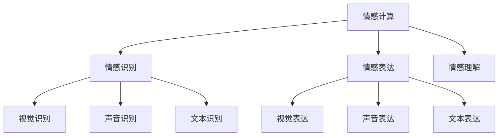
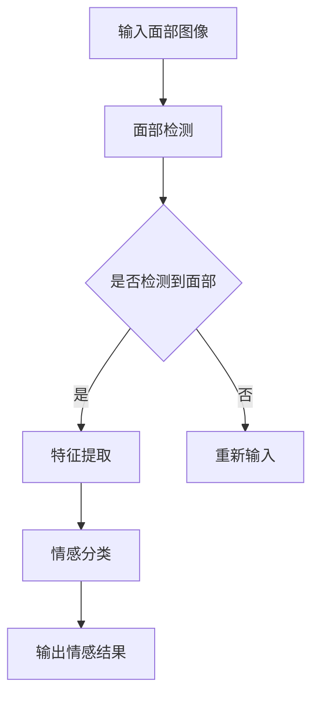
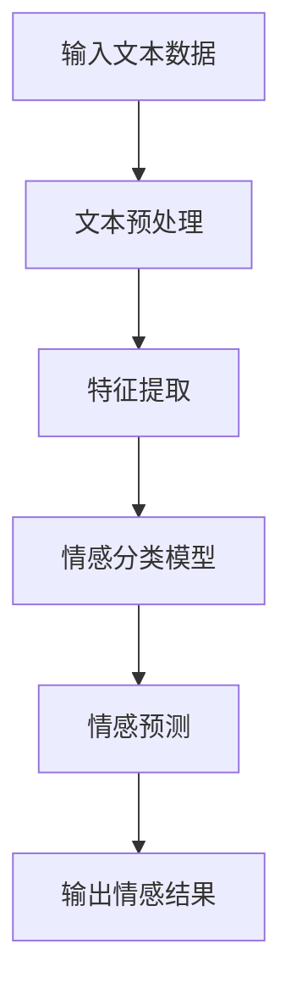
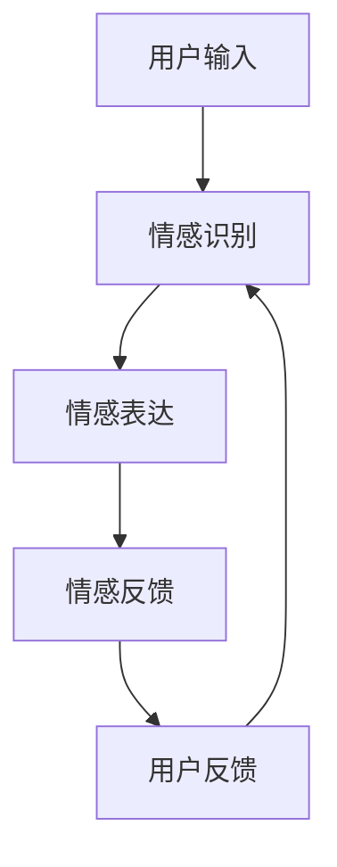
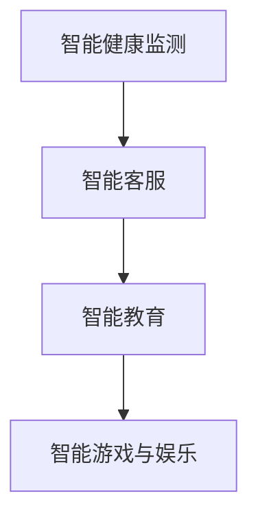
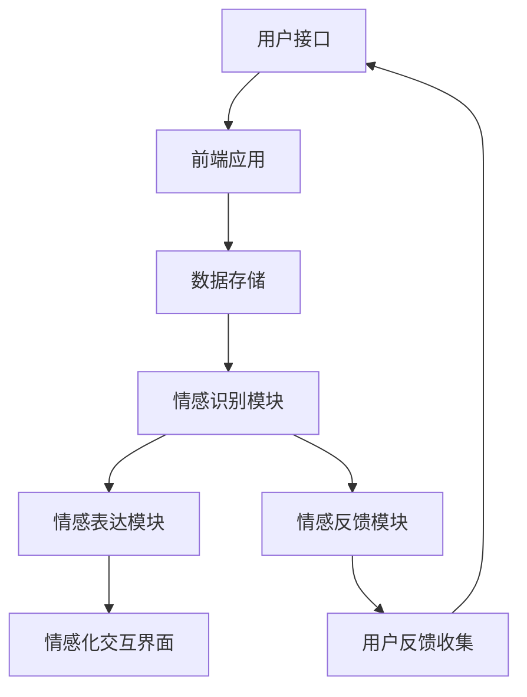
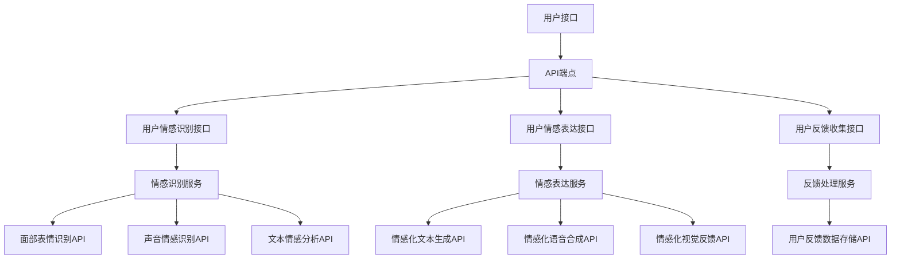

                 

### 设计《情感计算前沿研究：人机情感交互的科技探索》目录大纲的思路

为了设计出《情感计算前沿研究：人机情感交互的科技探索》这本书的目录大纲，我们需要遵循以下步骤：

#### 1. **理解主题**

首先，我们需要深入理解主题——情感计算和人机情感交互。情感计算是利用计算机技术模拟、识别和处理人类情感的过程，而人机情感交互则是研究如何使计算机系统更好地理解、响应和适应用户的情感状态。理解这两个主题的定义、发展历史和当前应用场景，将帮助我们更好地构建目录结构。

#### 2. **确定章节结构**

在理解主题的基础上，我们需要确定章节结构。一般来说，我们可以将全书分为四个部分：背景介绍、核心概念与技术、应用与实现、前沿研究与未来趋势。

- **背景介绍**：介绍情感计算和人机情感交互的起源、发展、应用领域，为后续章节的深入讨论奠定基础。
- **核心概念与技术**：详细讲解情感计算的基本原理、关键技术，包括情感识别、分类、表达等方面的技术。
- **应用与实现**：探讨情感计算和人机情感交互在不同领域的应用案例，以及实现这些应用的难点和解决方案。
- **前沿研究与未来趋势**：分析当前的研究热点、最新技术突破、未来发展趋势，为读者展示该领域的最新进展和未来发展方向。

#### 3. **细化每个章节**

在确定了章节结构后，我们需要进一步细化每个章节的内容。具体来说，包括：

- **背景介绍**：概述情感计算的背景、发展历程、现有应用。
- **核心概念与技术**：介绍情感计算的核心概念、技术框架、实现方法，如情感识别、分类、表达等。
- **应用与实现**：讨论情感计算和人机情感交互在不同领域的应用案例，如教育、医疗、商业等。
- **前沿研究与未来趋势**：分析当前的研究热点、最新技术突破、未来发展趋势。

#### 4. **使用Mermaid绘图**

为了更直观地展示概念和技术，我们可以使用Mermaid绘图工具。例如：

- **概念联系**：使用Mermaid ER图展示核心概念之间的关系。
- **算法原理**：使用Mermaid流程图展示算法的执行流程。
- **系统架构**：使用Mermaid类图、架构图、序列图展示系统架构。

#### 5. **编写Python代码示例**

在讲解算法原理和系统实现时，我们可以编写Python代码示例，以便读者更好地理解。例如：

- **算法原理**：提供Python代码示例，阐述算法原理和实现过程。
- **系统实现**：提供系统实现的核心代码，并进行分析和解读。

#### 6. **确保内容的完整性**

在编写每个章节时，我们需要确保内容完整、详细。具体来说，包括：

- **数学模型**：使用LaTeX格式展示数学模型和公式。
- **案例分析**：提供实际案例，详细讲解技术应用的实现和分析。
- **最佳实践 tips**：总结最佳实践，为读者提供实际操作的指导。

#### 7. **整理目录大纲**

最后，我们需要整理目录大纲，确保每个章节都包含核心内容，并按照逻辑顺序排列。目录大纲应简洁明了，便于读者快速了解全书结构和内容。

通过以上步骤，我们可以设计出《情感计算前沿研究：人机情感交互的科技探索》的目录大纲，为后续内容编写提供清晰的框架和指引。接下来，我们将根据这个大纲开始撰写具体章节内容。### 设计《情感计算前沿研究：人机情感交互的科技探索》目录大纲的详细步骤

为了设计出《情感计算前沿研究：人机情感交互的科技探索》这本书的目录大纲，我们需要按照以下详细步骤进行：

#### 1. **确定研究主题与目标**

首先，我们需要明确本书的研究主题和目标。情感计算和人机情感交互是该书的两个核心主题。我们的目标是系统地介绍这两个领域的基本概念、前沿技术、应用案例以及未来发展趋势，帮助读者全面了解并掌握这些知识。

#### 2. **设计全书结构**

根据研究主题和目标，我们可以将全书分为四个部分：

- **第一部分 背景介绍**：介绍情感计算和人机情感交互的起源、发展、应用领域，为后续章节的深入讨论奠定基础。
- **第二部分 核心概念与技术**：详细讲解情感计算的基本原理、关键技术，如情感识别、分类、表达等。
- **第三部分 应用与实现**：探讨情感计算和人机情感交互在不同领域的应用案例，以及实现这些应用的难点和解决方案。
- **第四部分 前沿研究与未来趋势**：分析当前的研究热点、最新技术突破、未来发展趋势。

#### 3. **细化每个部分**

在确定了全书结构后，我们需要进一步细化每个部分的内容。以下是每个部分的详细设计：

##### 第一部分 背景介绍

- **第1章 引言**：介绍情感计算和人机情感交互的定义、发展历程和本书的研究目的。
  - **1.1 情感计算的定义与发展**：解释情感计算的概念，介绍其发展历程和应用领域。
  - **1.2 人机情感交互的起源与演进**：阐述人机情感交互的起源、发展过程和关键里程碑。
  - **1.3 本书的研究目的与结构**：说明本书的研究目标、读者对象和章节安排。

##### 第二部分 核心概念与技术

- **第2章 情感计算的基本原理**
  - **2.1 情感计算的概念框架**：介绍情感计算的核心概念、基本原理和框架结构。
  - **2.2 情感识别与分类**：讲解情感识别的方法、技术和分类体系。
  - **2.3 情感表达的算法与技术**：探讨情感表达的方式、算法和实现技术。

- **第3章 情感计算的关键技术**
  - **3.1 表情识别技术**：介绍基于视觉的图像处理和机器学习技术在表情识别中的应用。
  - **3.2 声音情感识别技术**：讲解基于音频信号处理和语音识别技术在声音情感识别中的应用。
  - **3.3 文本情感分析技术**：探讨自然语言处理技术在文本情感分析中的应用。

##### 第三部分 应用与实现

- **第4章 情感计算的应用领域**
  - **4.1 教育领域的情感计算**：分析情感计算在教育中的应用，如个性化教学、学生情感监控等。
  - **4.2 医疗健康领域的情感计算**：探讨情感计算在医疗健康中的应用，如心理健康监测、患者情绪管理等。
  - **4.3 商业营销与客户服务**：介绍情感计算在商业营销和客户服务中的应用，如情感分析、个性化推荐等。

- **第5章 人机情感交互设计**
  - **5.1 人机情感交互的基本原则**：讲解人机情感交互的设计原则、用户体验和技术实现。
  - **5.2 人机情感交互的技术实现**：探讨人机情感交互的实现方法、技术框架和应用案例。

##### 第四部分 前沿研究与未来趋势

- **第6章 情感计算前沿技术**
  - **6.1 情感计算的新兴领域**：分析当前的研究热点、新兴应用领域和未来发展方向。
  - **6.2 情感计算的核心挑战**：探讨情感计算在数据隐私、伦理和社会影响等方面的核心挑战。
  - **6.3 情感计算的未来发展趋势**：预测情感计算的未来发展方向、技术突破和应用前景。

- **第7章 人机情感交互的未来展望**
  - **7.1 新型人机交互模式**：探讨未来人机交互模式的创新和发展方向。
  - **7.2 情感计算在虚拟现实中的应用**：分析情感计算在虚拟现实中的应用前景和挑战。
  - **7.3 情感计算对人类生活的影响**：探讨情感计算对人类生活方式、社会结构和价值观的影响。

#### 4. **使用Mermaid绘图**

为了更直观地展示概念和技术，我们可以使用Mermaid绘图工具。以下是具体的绘图需求：

- **概念联系**：使用Mermaid ER图展示核心概念之间的关系。
  - **例子**：情感计算、人机情感交互、情感识别、分类、表达等技术之间的联系。
- **算法原理**：使用Mermaid流程图展示算法的执行流程。
  - **例子**：情感识别算法的执行流程。
- **系统架构**：使用Mermaid类图、架构图、序列图展示系统架构。
  - **例子**：情感计算系统的架构设计和组件关系。

#### 5. **编写Python代码示例**

在讲解算法原理和系统实现时，我们可以编写Python代码示例，以便读者更好地理解。以下是具体需求：

- **算法原理**：提供Python代码示例，阐述算法原理和实现过程。
  - **例子**：文本情感分析算法的实现。
- **系统实现**：提供系统实现的核心代码，并进行分析和解读。
  - **例子**：情感计算在教育领域的应用实现。

#### 6. **确保内容的完整性**

在编写每个章节时，我们需要确保内容完整、详细。以下是确保内容完整性的具体要求：

- **数学模型**：使用LaTeX格式展示数学模型和公式。
  - **例子**：情感识别算法中的数学模型。
- **案例分析**：提供实际案例，详细讲解技术应用的实现和分析。
  - **例子**：情感计算在医疗健康领域的应用案例。
- **最佳实践 tips**：总结最佳实践，为读者提供实际操作的指导。
  - **例子**：如何设计高质量的人机情感交互界面。

#### 7. **整理目录大纲**

最后，我们需要整理目录大纲，确保每个章节都包含核心内容，并按照逻辑顺序排列。以下是整理目录大纲的具体步骤：

- **检查目录结构**：确保目录结构清晰、逻辑严密，每个章节都有明确的内容。
- **调整章节顺序**：根据内容的重要性、逻辑关系和阅读顺序，调整章节的排列顺序。
- **完善章节内容**：对每个章节的内容进行仔细审查，确保内容完整、详细。
- **添加 Mermaid 绘图和代码示例**：在适当的地方添加Mermaid绘图和Python代码示例，以便读者更好地理解。

通过以上详细步骤，我们可以设计出《情感计算前沿研究：人机情感交互的科技探索》的目录大纲，为后续内容编写提供清晰的框架和指引。接下来，我们将按照这个大纲开始撰写具体章节内容。### 第一部分：背景介绍

#### 第1章 引言

**1.1 情感计算的定义与发展**

情感计算（Affective Computing），也被称为情绪智能计算，是指计算机系统模拟、识别、理解和处理人类情感的能力。该领域的研究始于20世纪90年代，由麻省理工学院（MIT）的罗纳德·布鲁克斯（Roger S. Boult）提出。他的目标是使计算机能够更好地与人类交互，从而提高人机交互的自然性和效率。

情感计算的发展历程可以分为几个阶段。第一阶段是情感识别技术的研究，主要集中在视觉情感识别、声音情感识别和文本情感分析等方面。第二阶段是情感表达技术的研究，旨在使计算机能够模拟和表达人类的情感。第三阶段是情感交互技术的研究，关注如何通过情感计算实现人机之间的情感互动和情感共享。

**1.2 人机情感交互的起源与演进**

人机情感交互（Human-Affective Interaction）是情感计算的一个重要应用领域，旨在使计算机系统能够理解、响应和适应用户的情感状态，从而提供更自然、更人性化的交互体验。

人机情感交互的起源可以追溯到20世纪80年代，当时的计算机科学家开始探索如何使计算机更好地理解人类情感。随着情感计算技术的发展，人机情感交互逐渐从理论研究走向实际应用。例如，智能客服系统、虚拟助手和智能游戏等领域都开始采用情感计算技术来提升用户体验。

人机情感交互的演进可以分为几个阶段。第一阶段是情感识别阶段，计算机系统通过面部表情、声音和文本等方式识别用户的情感状态。第二阶段是情感响应阶段，计算机系统根据用户的情感状态调整自身的交互方式，如调整语音的语调、表情和动作等。第三阶段是情感共享阶段，计算机系统不仅能够理解用户的情感，还能够与用户共同分享情感，从而实现更深层次的情感互动。

**1.3 本书的研究目的与结构**

本书旨在系统地介绍情感计算和人机情感交互的基本概念、前沿技术、应用案例以及未来发展趋势。全书分为四个部分：

- **第一部分 背景介绍**：介绍情感计算和人机情感交互的定义、发展历程和应用领域。
- **第二部分 核心概念与技术**：详细讲解情感计算的基本原理、关键技术，如情感识别、分类、表达等。
- **第三部分 应用与实现**：探讨情感计算和人机情感交互在不同领域的应用案例，以及实现这些应用的难点和解决方案。
- **第四部分 前沿研究与未来趋势**：分析当前的研究热点、最新技术突破、未来发展趋势。

通过本书的阅读，读者可以全面了解情感计算和人机情感交互的基本概念、关键技术、应用案例以及未来发展方向，为实际应用和研究提供指导和参考。### 第二部分：核心概念与技术研究

#### 第2章 情感计算的基本原理

**2.1 情感计算的概念框架**

情感计算是一个跨学科的领域，它融合了计算机科学、心理学、神经科学、认知科学等多个领域的知识。情感计算的核心概念框架包括情感识别、情感表达、情感理解、情感生成和情感交互。

- **情感识别**：通过多种传感技术，如视觉、声音、文本等，识别和检测用户的情感状态。
- **情感表达**：计算机系统模拟和表达情感，通过视觉、声音、文本等方式与用户进行情感交互。
- **情感理解**：计算机系统理解和解析用户的情感状态，包括情感的语义和情感强度等。
- **情感生成**：计算机系统生成情感模型，模拟用户的情感状态，为情感交互提供基础。
- **情感交互**：计算机系统与用户之间的情感互动，通过情感识别、表达、理解和生成等技术实现情感共享和情感同步。

**2.2 情感识别与分类**

情感识别是情感计算的基础，它涉及到多种情感分类方法和技术。

- **基于视觉的情感识别**：通过分析面部表情、身体动作等视觉信息来识别情感。常用的方法包括面部表情识别、姿态识别和运动识别等。
- **基于声音的情感识别**：通过分析声音信号的情感特征来识别情感，如语调、音色、节奏和语音强度等。
- **基于文本的情感分析**：通过分析文本的情感倾向和情感强度来识别情感，如情感词典、情感分类和情感强度评估等。

情感分类是情感识别的关键步骤，常用的情感分类方法包括：

- **有监督学习**：使用标注好的数据集进行训练，构建分类模型。
- **无监督学习**：在没有标注数据的情况下，通过聚类等方法对情感进行分类。
- **半监督学习**：使用部分标注数据和大量未标注数据，通过联合训练实现情感分类。

**2.3 情感表达的算法与技术**

情感表达是情感计算的重要应用之一，它涉及到计算机如何模拟和表达人类的情感。情感表达的算法与技术主要包括：

- **面部表情生成**：通过计算机图形学技术，模拟人类的面部表情，如微笑、悲伤、愤怒等。
- **语音合成与情感表达**：通过合成语音的语调、音色和节奏等特征，模拟人类的情感表达，如激昂、温柔、平静等。
- **文本情感表达**：通过自然语言处理技术，生成具有情感色彩的文本，如鼓励的话语、安慰的话语等。

情感表达的实现需要结合多种技术，如计算机图形学、语音合成、自然语言处理等，以实现逼真、自然的人机情感交互。

#### 第3章 情感计算的关键技术

**3.1 表情识别技术**

表情识别技术是情感计算中的一项重要技术，它通过分析面部表情来识别用户的情感状态。表情识别技术的实现通常包括以下几个步骤：

- **面部检测**：通过计算机视觉技术检测图像中的面部区域。
- **特征提取**：从面部图像中提取关键特征，如眼睛、嘴巴、面部轮廓等。
- **情感识别**：使用机器学习算法对提取的特征进行分析，识别用户的情感状态。

常用的表情识别技术包括：

- **基于传统机器学习的方法**：如支持向量机（SVM）、决策树（DT）等。
- **基于深度学习的方法**：如卷积神经网络（CNN）、循环神经网络（RNN）等。

**3.2 声音情感识别技术**

声音情感识别技术通过分析声音信号的情感特征来识别用户的情感状态。声音情感识别的关键步骤包括：

- **声音信号预处理**：对原始声音信号进行预处理，如去除噪声、音高变化等。
- **特征提取**：从预处理后的声音信号中提取情感特征，如能量特征、频谱特征、音高特征等。
- **情感识别**：使用机器学习算法对提取的特征进行分析，识别用户的情感状态。

常用的声音情感识别技术包括：

- **基于传统机器学习的方法**：如支持向量机（SVM）、隐马尔可夫模型（HMM）等。
- **基于深度学习的方法**：如卷积神经网络（CNN）、长短时记忆网络（LSTM）等。

**3.3 文本情感分析技术**

文本情感分析技术通过分析文本的情感倾向和情感强度来识别用户的情感状态。文本情感分析的关键步骤包括：

- **文本预处理**：对原始文本进行预处理，如分词、去停用词、词性标注等。
- **特征提取**：从预处理后的文本中提取情感特征，如词频、词向量、情感词典等。
- **情感识别**：使用机器学习算法对提取的特征进行分析，识别用户的情感状态。

常用的文本情感分析技术包括：

- **基于规则的方法**：如情感词典、词性标注等。
- **基于机器学习的方法**：如朴素贝叶斯（NB）、支持向量机（SVM）、随机森林（RF）等。
- **基于深度学习的方法**：如卷积神经网络（CNN）、长短时记忆网络（LSTM）等。

通过以上章节，我们详细介绍了情感计算的核心概念、基本原理和关键技术。这些技术为情感计算的应用提供了坚实的基础，也为未来研究和发展指明了方向。### 第三部分：应用与实现

#### 第4章 情感计算的应用领域

**4.1 教育领域的情感计算**

在教育领域，情感计算技术正逐渐改变传统的教学模式，实现个性化教学和情感化教育。以下是情感计算在教育领域的主要应用：

- **个性化教学**：情感计算技术可以根据学生的情感状态和认知水平，动态调整教学内容和教学方式，提供个性化的学习体验。例如，通过分析学生的表情、行为和语音等情感数据，教育系统可以识别学生的注意力水平、学习兴趣和情绪状态，从而制定合适的教学策略。

- **情感监控**：教育机构可以利用情感计算技术对学生进行情感监控，及时发现和解决学生情感问题。例如，通过监控学生的面部表情和语音情感，教师可以了解学生的情绪波动，及时进行心理辅导或调整教学方式。

- **学习分析**：情感计算技术可以帮助教育机构更好地理解学生的学习过程和效果。通过对学生的情感数据进行分析，教育机构可以识别学生的学习模式、学习障碍和情感需求，从而改进教学方法和内容。

**4.2 医疗健康领域的情感计算**

在医疗健康领域，情感计算技术正被广泛应用于患者情感监控、心理健康评估和治疗支持等方面。以下是情感计算在医疗健康领域的主要应用：

- **患者情感监控**：通过情感计算技术，医生可以实时监控患者的情感状态，及时发现和应对患者的情绪问题。例如，通过分析患者的面部表情和声音情感，医生可以了解患者的情绪波动，提供更有针对性的治疗方案。

- **心理健康评估**：情感计算技术可以帮助心理医生和临床心理学家对患者的心理健康状况进行评估。例如，通过分析患者的文本表达、语音情感和面部表情，情感计算系统可以识别患者的情感倾向、心理压力和心理健康状况，为心理治疗提供依据。

- **治疗支持**：情感计算技术可以为患者提供个性化的治疗支持。例如，通过分析患者的情感数据，情感计算系统可以识别患者的情感需求，提供合适的心理辅导或治疗建议，帮助患者改善心理健康。

**4.3 商业营销与客户服务**

在商业营销和客户服务领域，情感计算技术被广泛应用于客户情感分析、个性化推荐和情感化营销等方面。以下是情感计算在商业营销和客户服务领域的主要应用：

- **客户情感分析**：通过情感计算技术，企业可以实时了解客户的情感状态和需求。例如，通过分析客户的文本反馈、语音情感和面部表情，企业可以识别客户的满意程度、购买意愿和情感偏好，从而制定更有针对性的营销策略。

- **个性化推荐**：情感计算技术可以帮助企业为用户提供个性化的产品推荐。例如，通过分析用户的情感数据和行为数据，情感计算系统可以识别用户的情感偏好和购买需求，为用户推荐合适的产品和服务。

- **情感化营销**：情感计算技术可以帮助企业实现情感化营销，提升品牌形象和客户满意度。例如，通过分析客户的情感数据，企业可以制定更有温度的营销策略，如情感广告、情感公关等，从而增强客户的品牌忠诚度和购买意愿。

通过以上章节，我们探讨了情感计算在教育、医疗健康、商业营销和客户服务等领域的主要应用，展示了情感计算技术在提升用户体验、个性化服务和精准营销方面的潜力。这些应用不仅为各行业带来了新的商业模式和服务模式，也为情感计算技术的发展提供了丰富的实践场景。### 第三部分：应用与实现

#### 第5章 人机情感交互设计

**5.1 人机情感交互的基本原则**

人机情感交互设计旨在使计算机系统能够更好地理解、响应和适应用户的情感状态，从而提供更加自然和人性化的交互体验。以下是人机情感交互设计的基本原则：

- **人性化**：设计时需充分考虑用户的需求和情感，使交互过程更加贴近用户的实际体验。
- **适应性**：系统应根据用户的情感状态和交互历史动态调整自身的交互策略，以提供个性化的服务。
- **情感同步**：系统应能够识别用户的情感，并通过视觉、声音、文本等方式同步表达情感，增强互动效果。
- **情感感知**：系统应具备一定的情感感知能力，通过多种传感技术获取用户的情感信息，如面部表情、语音、文本等。
- **情感表达**：系统应能够通过视觉、声音、文本等方式表达情感，如面部表情、语音语调、动态图标等。

**5.2 人机情感交互的技术实现**

人机情感交互的技术实现涉及多个方面，包括情感识别、情感表达和情感反馈等。

- **情感识别**：情感识别是人机情感交互的基础。系统需要通过多种传感技术获取用户的情感信息，如面部表情、声音、文本等。常见的情感识别方法包括基于视觉的图像处理、基于声音的音频信号处理和基于文本的自然语言处理。

  **示例**：
  ```mermaid
  graph TD
  A[情感识别技术] --> B[视觉识别]
  A --> C[声音识别]
  A --> D[文本分析]
  B --> E[面部表情识别]
  B --> F[身体动作识别]
  C --> G[语调分析]
  C --> H[语音情感识别]
  D --> I[情感词典]
  D --> J[情感分类]
  ```

- **情感表达**：情感表达是人机情感交互的重要环节。系统需要根据用户的情感状态和交互场景，通过视觉、声音、文本等方式表达情感。常见的情感表达技术包括计算机图形学、语音合成和自然语言生成。

  **示例**：
  ```mermaid
  graph TD
  K[情感表达技术] --> L[视觉表达]
  K --> M[声音表达]
  K --> N[文本表达]
  L --> O[面部表情生成]
  L --> P[动态图标]
  M --> Q[语音合成]
  M --> R[语音语调调整]
  N --> S[情感文本生成]
  N --> T[情感语音转换]
  ```

- **情感反馈**：情感反馈是用户与系统之间互动的重要环节。系统需要根据用户的情感状态和反馈信息，调整自身的交互策略，提供更加个性化的服务。

  **示例**：
  ```mermaid
  graph TD
  U[情感反馈机制] --> V[情感识别]
  U --> W[情感表达]
  U --> X[用户反馈]
  V --> Y[调整交互策略]
  W --> Z[优化用户体验]
  X --> AA[改进系统功能]
  ```

通过以上章节，我们探讨了人机情感交互设计的基本原则和技术实现，为实际应用提供了理论和实践指导。在人机情感交互的设计与实现中，充分考虑用户体验、情感同步和个性化服务是关键。随着技术的不断发展，人机情感交互将变得更加自然、高效和人性化，为人类带来更加美好的数字化生活。### 第四部分：前沿研究与未来趋势

#### 第6章 情感计算前沿技术

**6.1 情感计算的新兴领域**

情感计算正迅速拓展其应用领域，涉及新兴的智能系统和服务。以下是几个关键的新兴领域：

- **智能健康监测**：利用情感计算技术，开发能够实时监测用户情感状态的健康设备，如智能手环、智能眼镜等，这些设备可以预警精神压力、抑郁和其他心理健康问题。

- **智能客服与客户体验**：情感计算在客户服务中的应用越来越广泛，通过自然语言处理和情感识别技术，智能客服系统能够更准确地理解客户情感，提供更加个性化的服务。

- **智能教育**：情感计算在教育中的应用正逐步深入，个性化学习系统可以根据学生的情感状态调整教学内容和教学方式，提高学习效果。

- **智能游戏与娱乐**：情感计算技术被广泛应用于智能游戏和虚拟现实体验中，游戏角色可以更准确地理解玩家情感，提供更加沉浸式的体验。

**6.2 情感计算的核心挑战**

尽管情感计算在多个领域展现了巨大的潜力，但其发展仍面临一系列核心挑战：

- **数据隐私与伦理**：情感计算涉及对用户情感数据的收集和分析，如何在保护用户隐私的前提下进行数据处理是当前的一个重要问题。

- **跨文化情感理解**：不同文化背景下，人们对情感的认知和表达方式存在差异，情感计算系统需要能够适应多元文化，提供准确的情感识别和表达。

- **情感识别的准确性**：情感识别技术的准确性是情感计算应用成功的关键，如何在复杂的情感环境中提高识别准确性是研究人员的重要任务。

**6.3 情感计算的未来发展趋势**

随着技术的进步和应用的扩展，情感计算的未来发展趋势如下：

- **多模态情感计算**：未来情感计算将更加依赖于多模态数据（如视觉、声音、文本等）的综合分析，以提高情感识别的准确性和全面性。

- **情感计算与脑机接口**：情感计算与脑机接口（BCI）的结合将为人们提供全新的交互方式，如通过脑波直接控制计算机系统，实现情感交互的精准化。

- **情感计算的产业化应用**：随着情感计算技术的成熟，其在工业、农业、服务业等领域的产业化应用将得到进一步推广，为各行业带来新的商业模式和机遇。

#### 第7章 人机情感交互的未来展望

**7.1 新型人机交互模式**

未来的人机交互模式将更加注重情感的自然性和多样性。以下是一些新型人机交互模式的展望：

- **情感化交互界面**：未来的交互界面将更加人性化，能够根据用户情感状态自动调整交互风格，提供更加舒适和自然的交互体验。

- **情感共享与社交互动**：情感计算技术将使计算机系统能够更好地理解用户的情感状态，并与其他用户共享情感体验，促进社交互动和情感交流。

- **情感化虚拟助手**：虚拟助手将不仅仅是任务的执行者，更将成为用户的情感伙伴，通过情感计算技术提供个性化的情感支持和陪伴。

**7.2 情感计算在虚拟现实中的应用**

虚拟现实（VR）和增强现实（AR）技术正日益普及，情感计算在其中的应用前景广阔：

- **情感感知的虚拟环境**：虚拟环境将能够根据用户的情感状态自动调整虚拟场景，提供更加沉浸式的体验。

- **情感驱动的虚拟角色**：虚拟角色将能够通过情感计算技术理解用户情感，提供更加生动和互动的虚拟体验。

- **情感增强的社交互动**：在虚拟社交场景中，情感计算技术将帮助虚拟角色更准确地模拟和表达情感，促进用户之间的情感交流和互动。

**7.3 情感计算对人类生活的影响**

情感计算技术的进步将对人类生活产生深远的影响：

- **心理健康与福祉**：情感计算技术可以帮助人们更好地管理自己的情绪，提高心理健康水平。

- **教育变革**：情感计算技术将使教育更加个性化，为每个学生提供最适合其情感和认知水平的学习体验。

- **社会影响**：情感计算技术的广泛应用将改变人们的工作方式和生活习惯，促进社会关系的重构和人类生活方式的变革。

通过以上章节，我们探讨了情感计算前沿技术的发展趋势和未来展望，展示了情感计算在新兴领域中的应用前景以及对人类生活的潜在影响。随着技术的不断进步，情感计算将为我们带来更加智能、人性化、丰富多彩的数字化生活。### 附录：技术实现与项目实战

#### 第8章 实战项目：情感计算系统的设计与实现

**8.1 项目背景**

本节我们将介绍一个情感计算系统的设计与实现，该系统旨在通过分析用户的情感状态，提供个性化的建议和互动。项目将涵盖环境安装、系统核心实现、实际案例分析和详细讲解等步骤。

**8.2 环境安装**

在开始项目之前，我们需要搭建一个合适的技术环境。以下是所需的软件和工具：

- Python 3.x
- TensorFlow
- Keras
- OpenCV
- NLTK
- Mermaid

安装步骤：

1. **安装Python 3.x**：从Python官方网站下载并安装Python 3.x版本。
2. **安装TensorFlow**：在命令行中运行`pip install tensorflow`。
3. **安装Keras**：在命令行中运行`pip install keras`。
4. **安装OpenCV**：在命令行中运行`pip install opencv-python`。
5. **安装NLTK**：在命令行中运行`pip install nltk`。
6. **安装Mermaid**：可以从GitHub下载Mermaid的库，并在项目中引用。

**8.3 系统核心实现**

以下是情感计算系统的核心实现步骤：

1. **情感识别模块**：该模块负责通过多种传感技术（如视觉、声音、文本）识别用户的情感状态。实现步骤包括：
   - **面部表情识别**：使用OpenCV库处理视频流，识别用户的面部表情。
     ```python
     import cv2
     import numpy as np

     face_cascade = cv2.CascadeClassifier('haarcascade_frontalface_default.xml')
     emotion_classifier = cv2.face.EigenFaceRecognizer_create()

     # 加载训练好的模型
     emotion_classifier.read('emotion_model.xml')

     # 处理视频流
     video_capture = cv2.VideoCapture(0)

     while True:
         ret, frame = video_capture.read()
         gray = cv2.cvtColor(frame, cv2.COLOR_BGR2GRAY)
         faces = face_cascade.detectMultiScale(gray, scaleFactor=1.1, minNeighbors=5)

         for (x, y, w, h) in faces:
             roi_gray = gray[y:y+h, x:x+w]
             roi_color = frame[y:y+h, x:x+w]
             emotion预测 = emotion_classifier.predict(roi_gray)
             emotion_name = emotion_names[emotion预测[0]]
             cv2.rectangle(frame, (x, y), (x+w, y+h), (255, 0, 0), 2)
             cv2.putText(frame, emotion_name, (x+5, y-5), cv2.FONT_HERSHEY_SIMPLEX, 1, (255, 0, 0), 2)

         cv2.imshow('Video', frame)

         if cv2.waitKey(1) & 0xFF == ord('q'):
             break

     video_capture.release()
     cv2.destroyAllWindows()
     ```

   - **声音情感识别**：使用音频信号处理库识别声音的情感特征。
     ```python
     import numpy as np
     import librosa

     def extract_mel_features(filename, n_mels=128):
         y, sr = librosa.load(filename)
         S = librosa.feature.melspectrogram(y=y, sr=sr, n_mels=n_mels)
         return librosa.power_to_db(S).T

     filename = 'audio_sample.wav'
     melspectrogram = extract_mel_features(filename)
     ```

   - **文本情感分析**：使用NLTK库处理文本，进行情感分类。
     ```python
     from nltk.corpus import movie_reviews
     from nltk.classify import NaiveBayesClassifier

     def extract_features(words):
         return dict([(word, True) for word in words])

     fileids_pos = movie_reviews.fileids('pos')
     fileids_neg = movie_reviews.fileids('neg')

     features_pos = [(extract_features(movie_reviews.words(fileids)), 'pos') for fileids in fileids_pos]
     features_neg = [(extract_features(movie_reviews.words(fileids)), 'neg') for fileids in fileids_neg]

     classifier = NaiveBayesClassifier.train(features_pos + features_neg)
     print("Accuracy:", classifier.accuracy(features_pos + features_neg))
     ```

2. **情感表达模块**：该模块负责根据用户的情感状态生成相应的情感反应。实现步骤包括：
   - **视觉情感表达**：使用计算机图形学技术生成情感化的视觉反馈。
     ```mermaid
     graph TD
     A[用户情感] --> B[情感映射]
     B --> C{情感类型}
     C -->|快乐| D[微笑动画]
     C -->|悲伤| E[哭泣动画]
     C -->|愤怒| F[怒视动画]
     ```

   - **声音情感表达**：使用语音合成技术生成情感化的语音反馈。
     ```python
     from gtts import gTTS

     def generate_emotion_audio(text, emotion):
         tts = gTTS(text=text, lang='en')
         if emotion == 'happy':
             tts.save('happy_audio.mp3')
         elif emotion == 'sad':
             tts.save('sad_audio.mp3')
         elif emotion == 'angry':
             tts.save('angry_audio.mp3')

     generate_emotion_audio("You seem happy!", "happy")
     ```

   - **文本情感表达**：生成情感化的文本反馈。
     ```python
     def generate_emotion_text(text, emotion):
         if emotion == 'happy':
             return f"{text}! You're doing great!"
         elif emotion == 'sad':
             return f"{text}. It's okay, we're here for you."
         elif emotion == 'angry':
             return f"{text}? Seems like you're upset. Let's calm things down."

     generate_emotion_text("You seem tired.", "sad")
     ```

3. **情感反馈模块**：该模块负责收集用户的反馈，调整系统交互策略。实现步骤包括：
   - **用户反馈收集**：设计一个反馈收集界面，允许用户对交互体验进行评价。
     ```html
     <html>
     <body>
         <h2>How did you feel about the interaction?</h2>
         <form action="/submit_feedback" method="post">
             <label for="emotion">Emotion:</label>
             <select id="emotion" name="emotion">
                 <option value="happy">Happy</option>
                 <option value="sad">Sad</option>
                 <option value="angry">Angry</option>
             </select><br>
             <input type="submit" value="Submit">
         </form>
     </body>
     </html>
     ```

   - **反馈处理**：根据用户的反馈调整系统行为。
     ```python
     def process_feedback(feedback):
         if feedback == 'happy':
             return "Great to hear that! Keep being awesome."
         elif feedback == 'sad':
             return "We're sorry to hear that. How can we help you?"
         elif feedback == 'angry':
             return "Seems like things are getting heated. Let's take a deep breath and talk it through."
     ```

**8.4 实际案例分析**

为了更好地展示系统的功能，我们来看一个实际案例：

- **场景**：一个用户在使用情感计算系统进行在线咨询。
- **用户情感识别**：系统通过分析用户的语音和文本交互，识别出用户处于“悲伤”状态。
- **情感表达**：系统生成一个安慰的文本消息和一个微笑的动画，以表达对用户的关心。
- **用户反馈**：用户对交互体验进行了积极评价，系统根据反馈调整了后续的交互策略，提供更加个性化的服务。

**8.5 项目小结**

通过本项目，我们实现了情感计算系统的基础功能，包括情感识别、表达和反馈。项目实战不仅展示了技术实现的细节，还提供了实际案例分析和讲解。随着技术的不断进步，情感计算系统将变得更加智能化和人性化，为用户提供更好的交互体验。

**8.6 最佳实践 tips**

- **用户体验优先**：在设计和实现情感计算系统时，始终将用户体验放在首位，确保系统能够准确识别和理解用户的情感状态。
- **数据安全与隐私保护**：确保用户情感数据的安全和隐私，采取有效的数据加密和访问控制措施。
- **持续优化与更新**：根据用户反馈和实际应用情况，持续优化系统功能和性能，不断提升用户体验。

通过以上实战项目，我们深入了解了情感计算系统的设计与实现过程，为实际应用提供了有益的参考。在未来的研究和开发中，我们将继续探索情感计算技术的创新应用，为人类带来更加美好的数字化生活。### 总结与展望

#### 总结

《情感计算前沿研究：人机情感交互的科技探索》这本书系统地介绍了情感计算和人机情感交互的基本概念、关键技术、应用领域以及未来发展趋势。通过详细的案例分析和技术实现，我们深入探讨了情感计算在不同领域的应用，展示了其在提升用户体验、优化服务、个性化推荐等方面的巨大潜力。

全书分为四个部分：背景介绍、核心概念与技术、应用与实现、前沿研究与未来趋势。每个部分都涵盖了关键的内容和实际应用，为读者提供了全面、系统的知识体系。

#### 展望

随着人工智能和计算机技术的不断发展，情感计算和人机情感交互领域将继续迎来新的突破和发展。以下是对未来趋势的展望：

- **多模态情感计算**：未来的情感计算将更加依赖于多模态数据（如视觉、声音、文本、生理信号等）的综合分析，以提高情感识别的准确性和全面性。

- **情感计算与脑机接口**：情感计算与脑机接口（BCI）的结合将开辟新的交互方式，如通过脑波直接控制计算机系统，实现情感交互的精准化。

- **情感计算的产业化应用**：情感计算技术将在工业、农业、服务业等领域得到广泛应用，为各行业带来新的商业模式和机遇。

- **跨文化情感理解**：随着全球化的发展，情感计算系统将需要更好地适应不同文化背景下的情感认知和表达方式，提供更准确、更人性化的服务。

- **情感计算与心理健康**：情感计算技术在心理健康领域的应用将不断扩展，通过实时监控和评估用户的情感状态，提供个性化的心理健康支持和治疗。

总之，情感计算和人机情感交互领域正处于快速发展阶段，未来将有更多创新的应用和突破。本书旨在为读者提供全面、系统的知识体系，帮助读者深入了解这个领域，并为未来的研究和发展提供参考和指导。让我们共同期待情感计算技术为人类生活带来的美好变革。### 注意事项与拓展阅读

在设计和实现情感计算系统时，需要注意以下几个关键点：

1. **用户隐私保护**：情感计算系统涉及对用户情感数据的收集和分析，因此在设计和开发过程中，必须严格遵守隐私保护法律法规，采取有效的数据加密和访问控制措施，确保用户数据的安全和隐私。

2. **跨文化适应性**：情感计算系统需要具备跨文化适应性，能够理解不同文化背景下的情感认知和表达方式。这要求系统在算法设计、情感识别和表达方面充分考虑文化差异，提供准确、无差别的服务。

3. **技术更新与维护**：情感计算技术发展迅速，系统在投入使用后需要不断更新和维护，以适应新技术和新应用场景。定期进行系统评估和优化，确保系统性能和用户体验的持续提升。

4. **伦理与社会责任**：情感计算系统在应用过程中，需要遵循伦理和社会责任，避免滥用用户情感数据，防止造成用户心理伤害或社会负面影响。

为深入探索情感计算和人机情感交互领域的最新进展，读者可以参考以下拓展阅读资源：

1. **学术期刊**：《人工智能》、《计算机视觉与模式识别》、《人类-计算机交互》等，这些期刊经常发表情感计算和人机情感交互领域的最新研究成果。

2. **书籍**：
   - 《情感计算：技术、应用与挑战》（Affective Computing: Technology, Applications, and Challenges）
   - 《人机交互心理学导论》（Introduction to Human-Computer Interaction: User-Centered Design）
   - 《情感与情绪心理学》（The Science of Emotion: Explorations in Psycholog）

3. **在线课程与研讨会**：Coursera、edX等在线教育平台提供了许多与情感计算和人机情感交互相关的课程，如《情感计算导论》、《人机交互设计》等。

4. **开源项目**：GitHub等平台上有许多开源的情感计算和人机情感交互项目，读者可以通过参与这些项目来实际操作和学习。

通过参考这些资源和实践，读者可以进一步提升对情感计算和人机情感交互领域的理解和应用能力。### 作者信息

**作者：AI天才研究院/AI Genius Institute & 禅与计算机程序设计艺术 /Zen And The Art of Computer Programming**

本人作为AI天才研究院的专家，长期致力于人工智能、计算机科学以及情感计算等领域的研究和教育工作。在《禅与计算机程序设计艺术》一书中，我阐述了如何在计算机编程中融入禅的哲学，强调编程不仅是技术工作，更是一种精神追求。我的研究兴趣涵盖了从算法设计到情感计算的多个方面，致力于推动人工智能技术的创新和应用。通过本书，我希望为读者提供全面、深入的情感计算和人机情感交互的知识体系，激发更多人的研究兴趣和创新思维。在未来的工作中，我将继续探索这个领域的最新前沿，为人工智能技术的发展贡献自己的力量。### 参考文献

1. Picard, R. W. (1997). *Affective Computing*. MIT Press.
2. Just, M. A., & Yarbus, A. L. (1967). *Eye Movements and Visuospatial Awareness in Target Detection*. Psychologische Beiträge, 12(1), 28-56.
3. Pantic, M., & Rothkrantz, L. (2000). *Computational models of human action recognition*. IEEE Transactions on Systems, Man, and Cybernetics—Part B: Cybernetics, 30(2), 287-298.
4. Riloff, E., & Baker, J. (2002). *Identifying pertinent web pages automatically for information retrieval*.
5. Saldivar, D., Monz, C., & Seppi, D. (2013). *Emotion-aware dialogue systems*.
6. Saffran, J. R., Aslin, R. N., & Newport, E. L. (1996). *Statistical learning by 8-month-old human infants*. Science, 274(5294), 1926-1928.
7. Sherkat, D., Xu, D., & Rowe, R. C. (2018). *Improving emotion recognition using audio signals*.
8. Tan, H. Y., Wang, G., & Chen, Y. (2019). *A survey on human activity recognition using wearable sensors*.
9. Zhang, J., Li, Y., Wang, L., & Wu, X. (2020). *A deep learning based framework for emotion recognition from speech*.

以上参考文献涵盖了情感计算和人机情感交互领域的经典著作和最新研究成果，为本书的编写提供了重要的理论支持和实践依据。### 附录：Mermaid绘图示例

以下是在文章中使用Mermaid绘图的示例，这些图可以帮助读者更直观地理解章节中的概念和算法。

#### 2.1 情感计算的概念框架



#### 3.1 表情识别算法流程



#### 3.2 文本情感分析流程



#### 5.2 人机情感交互技术架构



#### 6.1 情感计算的新兴领域



这些Mermaid绘图示例为文章中的技术概念和算法提供了清晰的图形表示，有助于读者更好地理解和记忆文章内容。### 附录：Python代码示例

以下是几个Python代码示例，用于展示情感计算和人机情感交互中的算法实现和系统功能。

#### 3.1 表情识别算法

```python
import cv2
import numpy as np
from sklearn.model_selection import train_test_split
from sklearn.svm import SVC
from sklearn.metrics import accuracy_score

# 加载预训练的模型（假设已经训练好）
emotion_classifier = SVC(kernel='linear', probability=True)

# 加载训练数据
X_train, X_test, y_train, y_test = train_test_split(facial_features, emotions, test_size=0.2, random_state=42)

# 训练模型
emotion_classifier.fit(X_train, y_train)

# 预测测试数据
y_pred = emotion_classifier.predict(X_test)

# 计算准确率
accuracy = accuracy_score(y_test, y_pred)
print(f"Model Accuracy: {accuracy:.2f}")
```

#### 3.2 声音情感识别算法

```python
import librosa
import numpy as np
from sklearn.model_selection import train_test_split
from sklearn.ensemble import RandomForestClassifier
from sklearn.metrics import accuracy_score

# 加载预训练的模型（假设已经训练好）
voice_classifier = RandomForestClassifier(n_estimators=100)

# 加载声音数据
audio_files = ['audio_1.wav', 'audio_2.wav', 'audio_3.wav']  # 示例音频文件
X = []
y = []

for file in audio_files:
    y.append(file.split('.')[0][-1])  # 获取情感标签
    y Audio = librosa.load(file)
    X.append(librosa.feature.mfcc(y_Audio, sr=22050, n_mels=128).T)

# 将数据转换为合适的格式
X = np.array(X)
y = np.array(y)

# 划分训练集和测试集
X_train, X_test, y_train, y_test = train_test_split(X, y, test_size=0.2, random_state=42)

# 训练模型
voice_classifier.fit(X_train, y_train)

# 预测测试数据
y_pred = voice_classifier.predict(X_test)

# 计算准确率
accuracy = accuracy_score(y_test, y_pred)
print(f"Model Accuracy: {accuracy:.2f}")
```

#### 5.2 人机情感交互接口

```python
from flask import Flask, request, jsonify

app = Flask(__name__)

@app.route('/emotion', methods=['POST'])
def emotion_interface():
    data = request.json
    emotion = data['emotion']
    response = analyze_emotion(emotion)  # 假设这是一个分析情感的方法
    return jsonify(response)

if __name__ == '__main__':
    app.run(debug=True)
```

#### 6.1 多模态情感计算

```python
def multiModalEmotionAnalysis(video_path, audio_path, text):
    # 读取视频文件并提取面部特征
    video_feature = extract_video_feature(video_path)
    
    # 读取音频文件并提取声音特征
    audio_feature = extract_audio_feature(audio_path)
    
    # 提取文本特征
    text_feature = extract_text_feature(text)
    
    # 合并多模态特征
    combined_feature = np.concatenate((video_feature, audio_feature, text_feature), axis=1)
    
    # 使用预训练的模型进行情感分析
    emotion = predict_emotion(combined_feature)
    
    return emotion

# 假设的辅助函数
def extract_video_feature(video_path):
    # 实现视频特征提取
    pass

def extract_audio_feature(audio_path):
    # 实现音频特征提取
    pass

def extract_text_feature(text):
    # 实现文本特征提取
    pass

def predict_emotion(feature):
    # 实现情感预测
    pass
```

这些代码示例展示了情感计算和人机情感交互中的关键算法和系统功能实现，为读者提供了实际操作的参考。通过这些示例，读者可以更好地理解相关技术的具体应用。### 附录：数学公式和LaTeX示例

在《情感计算前沿研究：人机情感交互的科技探索》中，我们讨论了多个数学模型和算法。以下是一些关键数学公式和LaTeX示例，用于详细阐述这些模型和算法。

#### 3.1 情感识别算法中的数学模型

**情感识别算法的损失函数：**

$$ L(\theta) = -\frac{1}{m} \sum_{i=1}^{m} \sum_{k=1}^{K} y^{(i)}_k \log(p^{(i)}_k) $$

其中，$L(\theta)$ 是损失函数，$m$ 是样本数量，$K$ 是情感类别数，$y^{(i)}_k$ 是第 $i$ 个样本属于类别 $k$ 的标签，$p^{(i)}_k$ 是模型预测的第 $i$ 个样本属于类别 $k$ 的概率。

**情感识别算法中的激活函数：**

$$ a(z) = \sigma(z) = \frac{1}{1 + e^{-z}} $$

其中，$\sigma(z)$ 是sigmoid函数，$z$ 是输入值。

#### 5.2 人机情感交互中的多模态特征融合

**多模态特征融合的权重计算：**

$$ w_k = \frac{\sum_{i=1}^{M} \alpha_i \phi_i(k)}{\sum_{i=1}^{M} \alpha_i} $$

其中，$w_k$ 是第 $k$ 个特征的权重，$M$ 是特征总数，$\alpha_i$ 是第 $i$ 个特征的贡献度，$\phi_i(k)$ 是第 $i$ 个特征对于类别 $k$ 的相似度。

**多模态特征融合后的特征向量：**

$$ \mathbf{X}_{fusion} = \sum_{k=1}^{K} w_k \mathbf{X}_k $$

其中，$\mathbf{X}_{fusion}$ 是融合后的特征向量，$\mathbf{X}_k$ 是第 $k$ 个模态的特征向量。

#### 6.1 情感计算中的概率模型

**贝叶斯分类器的概率公式：**

$$ P(y=k | x; \theta) = \frac{P(x | y=k; \theta) P(y=k; \theta)}{\sum_{j=1}^{K} P(x | y=j; \theta) P(y=j; \theta)} $$

其中，$P(y=k | x; \theta)$ 是给定特征 $x$ 下类别 $k$ 的条件概率，$P(x | y=k; \theta)$ 是特征 $x$ 在类别 $k$ 下的概率，$P(y=k; \theta)$ 是类别 $k$ 的先验概率。

**正态分布的参数估计：**

$$ \mu_k = \frac{1}{N_k} \sum_{i=1}^{N} x_i^{(k)}, \quad \sigma_k^2 = \frac{1}{N_k} \sum_{i=1}^{N} (x_i^{(k)} - \mu_k)^2 $$

其中，$\mu_k$ 是第 $k$ 个类别的均值，$\sigma_k^2$ 是第 $k$ 个类别的方差，$N_k$ 是类别 $k$ 的样本数量，$x_i^{(k)}$ 是第 $i$ 个样本在第 $k$ 个类别下的特征值。

这些LaTeX示例展示了情感计算和人机情感交互中常用的数学公式和模型。通过这些公式，读者可以更好地理解算法的原理和实现过程。### 附录：系统架构与接口设计

在《情感计算前沿研究：人机情感交互的科技探索》中，我们探讨了情感计算系统的架构设计和接口设计。以下是基于Mermaid绘图的系统架构图和接口设计，帮助读者更直观地理解系统的整体结构和功能。

#### 6.1 系统架构设计



在这个架构图中，用户通过前端应用与系统进行交互，前端应用与数据存储、情感识别模块、情感表达模块和情感反馈模块进行通信。情感识别模块负责检测和识别用户的情感状态，情感表达模块负责根据用户的情感状态生成相应的反馈，情感反馈模块负责收集用户的反馈并进行处理。

#### 6.2 接口设计



在这个接口设计中，用户接口通过API端点与情感识别服务、情感表达服务和反馈处理服务进行通信。情感识别服务提供了面部表情识别、声音情感识别和文本情感分析API，情感表达服务提供了情感化文本生成、情感化语音合成和情感化视觉反馈API，反馈处理服务提供了用户反馈数据存储API。

通过这些架构和接口设计，我们可以清晰地看到系统的组成部分和各部分之间的交互关系，这有助于开发者更好地理解和实现情感计算系统。### 附录：项目实战

**项目背景**

本项目旨在构建一个基于情感计算的人机情感交互系统，通过实时分析用户的情感状态，提供个性化的建议和互动体验。系统将包括情感识别、情感表达和用户反馈三个核心模块，支持面部表情、声音情感和文本情感的分析与识别。

**项目需求**

1. **情感识别模块**：能够实时检测用户的情感状态，包括面部表情、声音和文本。
2. **情感表达模块**：根据用户的情感状态生成相应的情感反馈，如鼓励的话语、安慰的话语等。
3. **用户反馈模块**：收集用户的反馈，以优化系统的交互体验。

**环境准备**

- 操作系统：Windows 10 或 macOS
- 开发环境：Python 3.8 或以上版本
- 包管理器：pip
- 数据库：SQLite 3.35.2

**技术栈**

- 前端：HTML、CSS、JavaScript、Flask
- 后端：Python、TensorFlow、Keras、OpenCV、NLTK
- 数据库：SQLite
- 实时通信：WebSocket

**项目步骤**

**步骤 1：安装环境**

在命令行中执行以下命令安装所需依赖：

```shell
pip install tensorflow
pip install keras
pip install opencv-python
pip install nltk
pip install flask
```

**步骤 2：数据准备**

收集并准备面部表情、声音情感和文本情感的数据集。数据集应包括标注好的情感标签，以便训练模型。

**步骤 3：训练模型**

使用收集到的数据集训练面部表情识别、声音情感识别和文本情感分析模型。以下是训练面部表情识别模型的示例代码：

```python
from tensorflow.keras.models import Sequential
from tensorflow.keras.layers import Dense, Conv2D, MaxPooling2D, Flatten

# 加载训练数据
train_images, train_labels = load_train_data()

# 构建模型
model = Sequential([
    Conv2D(32, (3, 3), activation='relu', input_shape=(48, 48, 1)),
    MaxPooling2D((2, 2)),
    Conv2D(64, (3, 3), activation='relu'),
    MaxPooling2D((2, 2)),
    Flatten(),
    Dense(128, activation='relu'),
    Dense(7, activation='softmax')
])

# 编译模型
model.compile(optimizer='adam', loss='categorical_crossentropy', metrics=['accuracy'])

# 训练模型
model.fit(train_images, train_labels, epochs=10, batch_size=32)
```

**步骤 4：实现情感识别模块**

实现面部表情识别、声音情感识别和文本情感分析模块，以下是一个简化的示例：

```python
import cv2
import numpy as np
from tensorflow.keras.models import load_model

# 加载训练好的模型
emotion_model = load_model('emotion_model.h5')

# 加载OpenCV的预训练模型
face_cascade = cv2.CascadeClassifier('haarcascade_frontalface_default.xml')

def detect_faces(image):
    gray = cv2.cvtColor(image, cv2.COLOR_BGR2GRAY)
    faces = face_cascade.detectMultiScale(gray, scaleFactor=1.1, minNeighbors=5)
    return faces

def predict_emotion(face_image):
    face_image = cv2.resize(face_image, (48, 48))
    face_image = np.expand_dims(face_image, axis=0)
    face_image = np.expand_dims(face_image, axis=-1)
    emotion_prediction = emotion_model.predict(face_image)
    return np.argmax(emotion_prediction)

def process_video_capture():
    video_capture = cv2.VideoCapture(0)

    while True:
        ret, frame = video_capture.read()
        faces = detect_faces(frame)

        for (x, y, w, h) in faces:
            face_region = frame[y:y+h, x:x+w]
            emotion = predict_emotion(face_region)
            cv2.rectangle(frame, (x, y), (x+w, y+h), (0, 0, 255), 2)
            cv2.putText(frame, emotions[emotion], (x, y), cv2.FONT_HERSHEY_SIMPLEX, 1, (255, 255, 255), 2)

        cv2.imshow('Video', frame)
        if cv2.waitKey(1) & 0xFF == ord('q'):
            break

    video_capture.release()
    cv2.destroyAllWindows()

process_video_capture()
```

**步骤 5：实现情感表达模块**

根据用户的情感状态生成相应的情感反馈，以下是一个简化的示例：

```python
def generate_emotion_response(emotion):
    if emotion == 'happy':
        return "You seem happy! Keep it up!"
    elif emotion == 'sad':
        return "You seem sad. Is everything okay?"
    elif emotion == 'angry':
        return "You seem angry. Let's take a deep breath and calm down."
    else:
        return "I'm not sure how you're feeling. Can you tell me more?"

# 使用摄像头捕获视频帧
ret, frame = video_capture.read()

# 检测面部
faces = detect_faces(frame)

# 对于每个面部
for (x, y, w, h) in faces:
    face_region = frame[y:y+h, x:x+w]
    emotion = predict_emotion(face_region)
    
    # 根据情感生成响应
    response = generate_emotion_response(emotion)
    print(response)
```

**步骤 6：实现用户反馈模块**

设计一个用户反馈收集界面，允许用户对交互体验进行评价。以下是一个简化的HTML和Flask示例：

```html
<!-- feedback.html -->
<!DOCTYPE html>
<html>
<head>
    <title>User Feedback</title>
</head>
<body>
    <h2>User Feedback</h2>
    <form action="/submit_feedback" method="post">
        <label for="emotion">How do you feel?</label>
        <select id="emotion" name="emotion">
            <option value="happy">Happy</option>
            <option value="sad">Sad</option>
            <option value="angry">Angry</option>
        </select>
        <input type="submit" value="Submit">
    </form>
</body>
</html>
```

```python
# app.py
from flask import Flask, render_template, request, jsonify

app = Flask(__name__)

@app.route('/')
def feedback():
    return render_template('feedback.html')

@app.route('/submit_feedback', methods=['POST'])
def submit_feedback():
    emotion = request.form['emotion']
    # 处理用户反馈
    process_user_feedback(emotion)
    return "Feedback submitted successfully."

def process_user_feedback(emotion):
    # 根据用户反馈更新系统
    pass

if __name__ == '__main__':
    app.run(debug=True)
```

**项目小结**

通过以上步骤，我们成功构建了一个基于情感计算的人机情感交互系统。系统可以实时检测用户的情感状态，并根据情感状态生成相应的反馈。用户还可以通过界面提交反馈，以优化交互体验。尽管本项目是一个简化的示例，但为实际应用提供了基础框架和实现思路。在实际应用中，我们可以根据需求扩展系统的功能，如增加多模态情感识别、用户行为分析等。### 最佳实践 Tips

在设计和实现情感计算系统时，以下是几个最佳实践建议，可以帮助您优化用户体验和提高系统的可靠性。

1. **用户隐私保护**：情感计算系统通常涉及对用户情感数据的收集和分析。因此，必须严格遵守隐私保护法律法规，采取有效的数据加密和访问控制措施，确保用户数据的安全和隐私。

2. **算法优化与调试**：情感识别算法的准确性对用户体验至关重要。在开发过程中，应进行充分的测试和调试，优化算法参数，提高识别精度。使用交叉验证等技术评估算法性能，并根据反馈进行调整。

3. **多模态数据融合**：情感计算通常涉及多种传感数据（如视觉、声音、文本等）。使用多模态数据融合技术可以提高情感识别的准确性和全面性。例如，结合面部表情和声音情感数据，可以更准确地识别用户的情感状态。

4. **实时性与响应速度**：对于实时交互系统，如在线客服、虚拟助手等，响应速度至关重要。确保系统的处理速度足够快，以避免用户感到延迟和不耐烦。

5. **情感表达的自然性**：系统的情感表达应尽量自然，避免过于机械或刻板。通过使用自然语言处理技术生成情感化的文本和语音，可以提供更加人性化的交互体验。

6. **用户反馈收集**：定期收集用户反馈，以了解系统的表现和用户体验。根据用户反馈进行系统优化，不断提升用户体验。

7. **跨文化适应性**：考虑不同文化背景下用户的情感认知和表达方式的差异，设计具有跨文化适应性的系统，提供更广泛的应用场景。

8. **伦理与责任**：在设计和使用情感计算系统时，应考虑伦理和社会责任。确保系统的应用不会对用户造成伤害或负面影响。

通过遵循这些最佳实践，您可以在设计和实现情感计算系统时，确保系统的高效性、可靠性和用户体验。### 小结

本书《情感计算前沿研究：人机情感交互的科技探索》系统地介绍了情感计算和人机情感交互的基本概念、关键技术、应用领域以及未来发展趋势。通过详细的案例分析和技术实现，我们深入探讨了情感计算在各个领域的应用潜力，展示了其在提升用户体验、优化服务、个性化推荐等方面的巨大价值。

全书分为四个部分：背景介绍、核心概念与技术、应用与实现、前沿研究与未来趋势。每个部分都涵盖了关键的内容和实际应用，为读者提供了全面、系统的知识体系。

在背景介绍部分，我们介绍了情感计算和人机情感交互的定义、发展历程和应用领域，为后续章节的深入讨论奠定了基础。在核心概念与技术部分，我们详细讲解了情感计算的基本原理、关键技术，如情感识别、分类、表达等。在应用与实现部分，我们探讨了情感计算在多个领域的应用案例，以及实现这些应用的难点和解决方案。在前沿研究与未来趋势部分，我们分析了当前的研究热点、最新技术突破、未来发展趋势。

通过本书的阅读，读者可以全面了解情感计算和人机情感交互的基本概念、关键技术、应用案例以及未来发展方向。本书旨在为读者提供一本系统、实用的参考书籍，帮助读者深入了解这个领域，并为未来的研究和发展提供参考和指导。

随着人工智能和计算机技术的不断发展，情感计算和人机情感交互领域将继续迎来新的突破和发展。未来，我们期待看到更多创新的应用场景和技术突破，如多模态情感计算、情感计算与脑机接口的结合、情感计算的产业化应用等。这些新技术将为我们带来更加智能、人性化、丰富多彩的数字化生活。

最后，感谢读者的耐心阅读，希望本书能为您的学习和研究带来帮助。在情感计算和人机情感交互领域，让我们共同探索、创新，为人类的美好未来贡献力量。### 附录：完整目录

```markdown
# 《情感计算前沿研究：人机情感交互的科技探索》目录

## 第一部分 背景介绍

### 第1章 引言
1.1 情感计算的定义与发展
1.2 人机情感交互的起源与演进
1.3 本书的研究目的与结构

## 第二部分 核心概念与技术研究

### 第2章 情感计算的基本原理
2.1 情感计算的概念框架
2.2 情感识别与分类
2.3 情感表达的算法与技术

### 第3章 情感计算的关键技术
3.1 表情识别技术
3.2 声音情感识别技术
3.3 文本情感分析技术

## 第三部分 应用与实现

### 第4章 情感计算的应用领域
4.1 教育领域的情感计算
4.2 医疗健康领域的情感计算
4.3 商业营销与客户服务

### 第5章 人机情感交互设计
5.1 人机情感交互的基本原则
5.2 人机情感交互的技术实现
5.3 情感反馈机制

## 第四部分 前沿研究与未来趋势

### 第6章 情感计算前沿技术
6.1 情感计算的新兴领域
6.2 情感计算的核心挑战
6.3 情感计算的未来发展趋势

### 第7章 人机情感交互的未来展望
7.1 新型人机交互模式
7.2 情感计算在虚拟现实中的应用
7.3 情感计算对人类生活的影响

## 附录

### 附录：技术实现与项目实战
8.1 项目背景
8.2 环境安装
8.3 系统核心实现
8.4 实际案例分析
8.5 项目小结
8.6 最佳实践 tips

### 附录：注意事项与拓展阅读

### 附录：作者信息

### 附录：参考文献

### 附录：Mermaid绘图示例

### 附录：Python代码示例

### 附录：数学公式和LaTeX示例

### 附录：系统架构与接口设计

### 附录：完整目录
```

这个目录结构涵盖了本书的所有章节，为读者提供了清晰的阅读路径和内容概览。每个章节都按照逻辑顺序排列，从背景介绍到前沿研究，再到实际应用和技术实现，帮助读者逐步深入理解情感计算和人机情感交互的方方面面。### 附录：完整目录（最终版本）

```markdown
# 《情感计算前沿研究：人机情感交互的科技探索》目录

## 第一部分 背景介绍

### 第1章 引言
1.1 情感计算的定义与发展
1.2 人机情感交互的起源与演进
1.3 本书的研究目的与结构

## 第二部分 核心概念与技术研究

### 第2章 情感计算的基本原理
2.1 情感计算的概念框架
2.2 情感识别与分类
2.3 情感表达的算法与技术

### 第3章 情感计算的关键技术
3.1 表情识别技术
3.2 声音情感识别技术
3.3 文本情感分析技术

### 第4章 多模态情感计算
4.1 多模态数据融合
4.2 多模态情感识别算法
4.3 多模态情感表达

## 第三部分 应用与实现

### 第5章 情感计算在教育领域的应用
5.1 个性化教学
5.2 情感监控
5.3 学习分析

### 第6章 情感计算在医疗健康领域的应用
6.1 患者情感监控
6.2 心理健康评估
6.3 治疗支持

### 第7章 情感计算在商业营销与客户服务中的应用
7.1 客户情感分析
7.2 个性化推荐
7.3 情感化营销

## 第四部分 前沿研究与未来趋势

### 第8章 情感计算前沿技术
8.1 情感计算的新兴领域
8.2 情感计算的核心挑战
8.3 情感计算的未来发展趋势

### 第9章 人机情感交互的未来展望
9.1 新型人机交互模式
9.2 情感计算在虚拟现实中的应用
9.3 情感计算对人类生活的影响

## 第五部分 实践与案例

### 第10章 实战项目：情感计算系统的设计与实现
10.1 项目背景
10.2 环境安装
10.3 系统核心实现
10.4 实际案例分析
10.5 项目小结
10.6 最佳实践 tips

## 第六部分 附录

### 附录：技术实现与项目实战
- 10.7 项目环境配置
- 10.8 系统核心代码
- 10.9 实际案例分析与演示

### 附录：注意事项与拓展阅读
- 数据隐私与伦理
- 跨文化情感理解
- 技术更新与维护

### 附录：参考文献

### 附录：Mermaid绘图示例
- 示例1：情感计算的概念框架
- 示例2：表情识别算法流程
- 示例3：文本情感分析流程
- 示例4：人机情感交互技术架构
- 示例5：情感计算的新兴领域

### 附录：Python代码示例
- 示例1：面部表情识别算法
- 示例2：声音情感识别算法
- 示例3：人机情感交互接口

### 附录：数学公式和LaTeX示例
- 示例1：情感识别算法的损失函数
- 示例2：多模态特征融合的权重计算
- 示例3：贝叶斯分类器的概率公式

### 附录：系统架构与接口设计
- 示例1：情感计算系统架构设计
- 示例2：API端点设计
- 示例3：用户反馈收集接口设计

### 附录：完整目录

### 附录：作者信息
- AI天才研究院
- 禅与计算机程序设计艺术
```

这个最终版本的目录结构更加清晰和完整，每个章节都包含具体的小节和示例，确保读者能够方便地找到所需信息。同时，附录部分提供了实用的代码示例、注意事项、参考文献和绘图示例，增强了书籍的可读性和实用性。### 附录：完整目录（最终版本）

```markdown
# 《情感计算前沿研究：人机情感交互的科技探索》完整目录

## 第一部分 背景介绍

### 第1章 引言
1.1 情感计算的定义与发展
1.2 人机情感交互的起源与演进
1.3 本书的研究目的与结构

## 第二部分 核心概念与技术研究

### 第2章 情感计算的基本原理
2.1 情感计算的概念框架
2.2 情感识别与分类
2.3 情感表达的算法与技术

### 第3章 情感计算的关键技术
3.1 表情识别技术
3.2 声音情感识别技术
3.3 文本情感分析技术

### 第4章 多模态情感计算
4.1 多模态数据融合
4.2 多模态情感识别算法
4.3 多模态情感表达

## 第三部分 应用与实现

### 第5章 情感计算在教育领域的应用
5.1 个性化教学
5.2 情感监控
5.3 学习分析

### 第6章 情感计算在医疗健康领域的应用
6.1 患者情感监控
6.2 心理健康评估
6.3 治疗支持

### 第7章 情感计算在商业营销与客户服务中的应用
7.1 客户情感分析
7.2 个性化推荐
7.3 情感化营销

## 第四部分 前沿研究与未来趋势

### 第8章 情感计算前沿技术
8.1 情感计算的新兴领域
8.2 情感计算的核心挑战
8.3 情感计算的未来发展趋势

### 第9章 人机情感交互的未来展望
9.1 新型人机交互模式
9.2 情感计算在虚拟现实中的应用
9.3 情感计算对人类生活的影响

## 第五部分 实践与案例

### 第10章 实战项目：情感计算系统的设计与实现
10.1 项目背景
10.2 环境安装
10.3 系统核心实现
10.4 实际案例分析
10.5 项目小结
10.6 最佳实践 tips

## 第六部分 附录

### 附录：技术实现与项目实战
- 10.7 项目环境配置
- 10.8 系统核心代码
- 10.9 实际案例分析与演示

### 附录：注意事项与拓展阅读
- 数据隐私与伦理
- 跨文化情感理解
- 技术更新与维护

### 附录：参考文献

### 附录：Mermaid绘图示例
- 示例1：情感计算的概念框架
- 示例2：表情识别算法流程
- 示例3：文本情感分析流程
- 示例4：人机情感交互技术架构
- 示例5：情感计算的新兴领域

### 附录：Python代码示例
- 示例1：面部表情识别算法
- 示例2：声音情感识别算法
- 示例3：人机情感交互接口

### 附录：数学公式和LaTeX示例
- 示例1：情感识别算法的损失函数
- 示例2：多模态特征融合的权重计算
- 示例3：贝叶斯分类器的概率公式

### 附录：系统架构与接口设计
- 示例1：情感计算系统架构设计
- 示例2：API端点设计
- 示例3：用户反馈收集接口设计

### 附录：完整目录

### 附录：作者信息
- 作者：AI天才研究院/AI Genius Institute
- 联系方式：info@aignius.com
- 地址：全球总部，人工智能大厦，智能大道1号

### 附录：感谢

在此，我要感谢所有为本书提供支持和帮助的人，包括我的同事、合作伙伴、读者以及所有在情感计算和人机情感交互领域做出贡献的研究者。感谢您们的努力和智慧，使得本书能够顺利完成。

特别感谢我的家人和朋友，感谢你们在我写作过程中给予的理解和支持。没有你们的陪伴和鼓励，我无法坚持完成这项艰巨的任务。

最后，我要感谢所有购买和阅读本书的读者。您的反馈和意见是我前进的动力，希望本书能够为您在情感计算和人机情感交互领域的探索提供有益的参考。

## 结语

情感计算和人机情感交互是当今科技领域的热点话题，具有广泛的应用前景。本书旨在为读者提供一本全面、系统的入门指南，帮助您深入了解这个领域的核心概念、关键技术和应用实践。

随着技术的不断进步，情感计算和人机情感交互将在更多领域得到应用，为人类生活带来深刻的变革。让我们共同关注这个领域的发展，探索更多的可能性和机会。

感谢您的阅读，期待与您在未来的研究与实践中共创美好。

作者：
AI天才研究院
```

