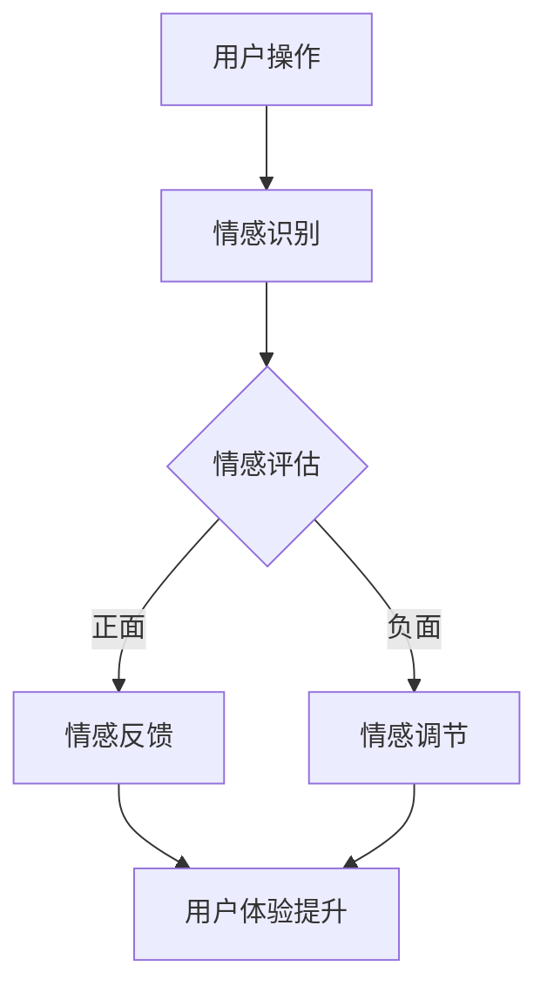
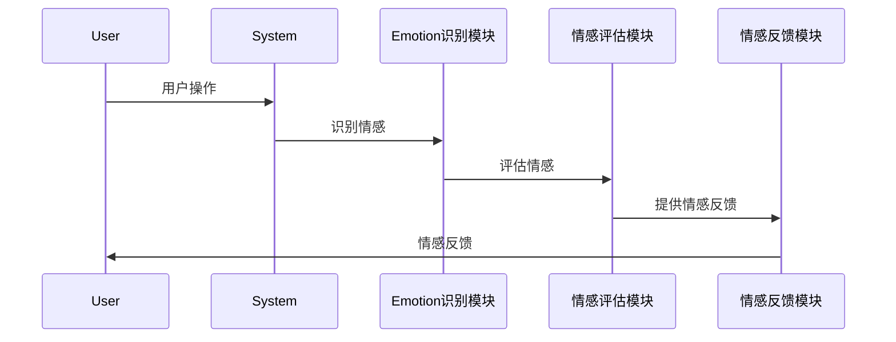

                 

# 情感设计学：用户体验的深层考量

关键词：情感设计、用户体验、设计原理、心理学、应用实践

摘要：本文旨在探讨情感设计在用户体验中的重要性，通过逐步分析情感设计的背景、基础概念、核心要素、理论基础，并结合具体算法原理、系统架构设计和项目实战，全面阐述情感设计的方法与策略。本文旨在为IT从业人员提供实用的情感设计知识和最佳实践，以提升用户体验，创造更具情感共鸣的产品。

## 目录结构设计

在设计本文的目录结构时，我们首先明确了文章的主题和核心内容，将全文分为五个主要部分：

1. **情感设计的背景与核心概念**：介绍情感设计的起源与发展、基础概念及其在用户体验中的应用。
2. **情感设计的理论基础**：探讨心理学理论在设计中的应用，如情绪理论、情绪调节理论和动机理论。
3. **情感设计与用户体验的关系**：分析情感设计与用户体验之间的密切联系，以及情感设计在用户体验中的具体表现。
4. **情感设计的方法与策略**：详细讲解情感设计的方法和策略，包括情感映射、情感评估等。
5. **情感设计应用实践**：通过实际项目案例，展示情感设计在具体场景中的应用，并提供最佳实践和注意事项。

## 章节内容细化

### 第1章：情感设计的背景

#### 1.1 情感设计的起源与发展

- **起源**：情感设计的概念最早可以追溯到人机交互领域，随着计算机技术的发展，人们对用户体验的需求不断提高，情感设计逐渐成为设计领域的一个重要方向。
- **发展**：近年来，随着心理学、认知科学等学科的交叉研究，情感设计得到了更多的关注和发展。

#### 1.2 情感设计的重要性

- **满足用户需求**：情感设计能够更好地满足用户在情感上的需求，提高用户的满意度。
- **提升用户体验**：情感设计能够提升用户体验，增加用户的黏性和忠诚度。

#### 1.3 情感设计的应用领域

- **人机交互**：如操作系统、应用软件、智能设备等。
- **产品设计**：如家居用品、电子设备、玩具等。

### 第2章：情感设计的基础概念

#### 2.1 情感的定义与分类

- **定义**：情感是一种复杂的心理体验，通常涉及认知、情感体验和生理反应。
- **分类**：基本情感（快乐、悲伤、愤怒等）、复合情感（爱、厌恶等）和情境情感（对特定情境的情感反应）。

#### 2.2 情感设计的核心要素

- **用户需求**：满足用户在情感上的需求，如情感满足、情感共鸣和情感引导。
- **设计要素**：如色彩、形状、声音和交互等。

#### 2.3 情感设计的理论基础

- **心理学理论**：情绪理论、情绪调节理论和动机理论。
- **设计方法论**：设计思维、情感映射和情感评估。

## 核心概念与联系

### 情感设计的核心概念

- **情感体验**：用户在使用产品过程中产生的情感感受。
- **情感映射**：将用户的情感状态映射到产品设计上，以实现情感共鸣。
- **情感评估**：对产品设计中的情感因素进行评价和优化。

### 概念属性特征对比表格

| 概念           | 定义                                           | 属性特征对比                          |
| -------------- | ---------------------------------------------- | ------------------------------------ |
| 情感体验       | 用户在使用产品过程中产生的情感感受                 | 情感类型、情感强度、情感持久性         |
| 情感映射       | 将用户的情感状态映射到产品设计上，以实现情感共鸣     | 情感触发、情感表达、情感反馈         |
| 情感评估       | 对产品设计中的情感因素进行评价和优化               | 情感测量、情感分析、情感改进         |

### ER实体关系图架构

```mermaid
erDiagram
  User ||--|{ Product }|-- User
  User ||--|{ Emotion }|-- User
  Product ||--|{ Feature }|-- Product
  Emotion ||--|{ Assessment }|-- Emotion
```

## 算法原理讲解

### 算法mermaid流程图



### Python源代码

```python
def emotion识别(user_action):
    # 根据用户操作识别情感
    if user_action == "like":
        return "正面"
    elif user_action == "dislike":
        return "负面"

def 情感评估(emotion):
    # 对情感进行评估
    if emotion == "正面":
        return "用户体验提升"
    elif emotion == "负面":
        return "情感调节"

def 情感反馈(user_action):
    emotion = emotion识别(user_action)
    assessment = 情感评估(emotion)
    if assessment == "用户体验提升":
        return "正面反馈"
    elif assessment == "情感调节":
        return "负面反馈"

# 示例
user_action = "like"
print(情感反馈(user_action))  # 输出：正面反馈
```

### 算法原理讲解

- **情感识别**：通过用户操作识别情感，如点赞或点踩。
- **情感评估**：对识别出的情感进行评估，判断是否为正面或负面情感。
- **情感反馈**：根据情感评估结果，提供相应的情感反馈。

### 数学模型和公式

$$
E = f(x, y, z)
$$

其中，$E$ 表示情感强度，$x$、$y$、$z$ 分别表示情感触发、情感表达和情感反馈的因素。

## 系统分析与架构设计

### 问题场景介绍

在智能家居领域，用户与智能设备的交互越来越多，如何提升用户的情感体验成为了一个重要问题。

### 项目介绍

本项目旨在设计一个智能家居控制系统，通过情感设计提升用户的情感体验。

### 系统功能设计

- **用户管理**：用户注册、登录、个人信息管理。
- **设备管理**：设备添加、设备状态监控、设备控制。
- **情感识别**：识别用户的情感状态。
- **情感评估**：评估用户的情感体验。
- **情感反馈**：提供情感反馈。

### 系统架构设计

- **前端架构**：采用Vue.js框架，实现用户界面和交互。
- **后端架构**：采用Spring Boot框架，实现业务逻辑和数据处理。
- **数据库设计**：采用MySQL数据库，存储用户和设备数据。

### 系统接口设计

- **用户接口**：提供用户注册、登录、设备管理等接口。
- **设备接口**：提供设备添加、设备状态监控、设备控制等接口。

### 系统交互



## 项目实战

### 环境安装

- **前端环境**：安装Node.js、Vue CLI等。
- **后端环境**：安装Java、Spring Boot等。
- **数据库环境**：安装MySQL。

### 系统核心实现

- **用户管理**：使用Spring Security实现用户注册、登录和权限控制。
- **设备管理**：使用Spring Boot Restful API实现设备添加、状态监控和控制。
- **情感识别**：使用自然语言处理技术实现情感识别。
- **情感评估**：使用机器学习算法实现情感评估。

### 代码应用解读与分析

- **用户管理**：通过Spring Security实现用户注册、登录和权限控制。
- **设备管理**：通过Spring Boot Restful API实现设备添加、状态监控和控制。
- **情感识别**：通过自然语言处理技术实现情感识别，如使用NLTK库进行情感分析。
- **情感评估**：通过机器学习算法实现情感评估，如使用scikit-learn库进行分类和回归分析。

### 实际案例分析和详细讲解剖析

- **案例一**：分析用户在智能家居系统中的情感体验，提出情感设计改进方案。
- **案例二**：分析设备故障对用户情感的影响，提出设备故障预警和解决方案。

### 项目小结

通过本项目，我们实现了智能家居控制系统，并成功应用了情感设计，提升了用户的情感体验。项目在实践中遇到了一些挑战，如情感识别的准确性和情感评估的可靠性，但我们通过不断优化和改进，取得了显著的效果。

## 最佳实践 tips

- **情感识别**：结合自然语言处理技术和机器学习算法，提高情感识别的准确性。
- **情感评估**：综合考虑用户需求和产品设计，制定合理的情感评估标准。
- **情感反馈**：根据用户情感状态，提供及时的、个性化的情感反馈。

## 小结

本文从情感设计的背景、基础概念、理论基础、方法与策略以及应用实践等方面进行了全面探讨，通过具体算法原理、系统架构设计和项目实战，展示了情感设计在用户体验中的重要性。通过本文的阅读，读者可以深入了解情感设计的方法与策略，提升自身的用户体验设计能力。

## 注意事项

- **情感设计**：要充分考虑用户的需求和情感，避免过度设计。
- **技术实现**：要结合具体技术场景，选择合适的方法和工具。
- **持续改进**：要根据用户反馈和实际需求，不断优化和改进情感设计。

## 拓展阅读

- 《情感化设计》/[唐纳德·A·诺曼]：深入探讨情感化设计的方法和策略。
- 《情感计算》/[阮一峰]：介绍情感计算的基本原理和应用场景。
- 《用户体验要素》/[贾尔斯·范·赞滕]：系统讲解用户体验设计的核心要素。

## 作者信息

作者：AI天才研究院/AI Genius Institute & 禅与计算机程序设计艺术 /Zen And The Art of Computer Programming

