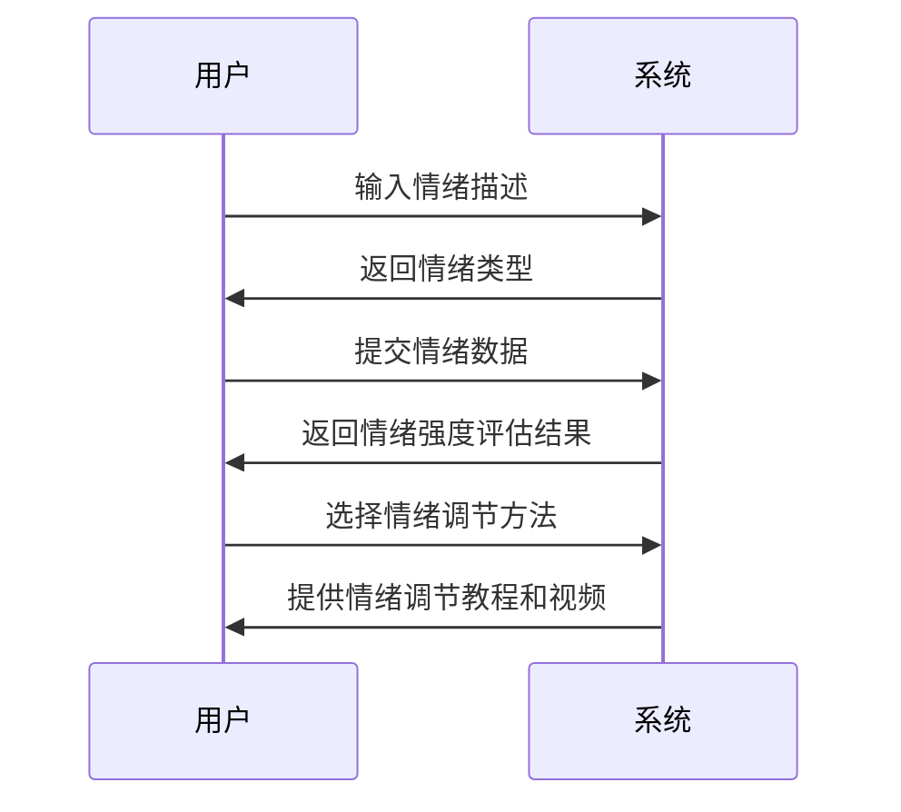

                 

# 情绪管理的艺术：净化内心的实践技巧

> 关键词：情绪管理、压力管理、自我探索、人际关系、艺术实践

> 摘要：本文将探讨情绪管理的重要性及其在生活中的应用。我们将从情绪管理的基础知识、核心理论、实践技巧、生活应用和自我成长等方面展开讨论，帮助读者全面了解情绪管理的艺术，学会通过实践技巧净化内心，提升个人幸福感。

## 第一部分：情绪管理的基础

### 第1章：情绪管理概述

#### 1.1 情绪的本质与类型

情绪是指个体对某些刺激的主观体验和反应。根据心理学的研究，情绪可以分为基本情绪和复合情绪。基本情绪包括快乐、愤怒、悲伤、恐惧和惊讶等，这些情绪是普遍存在于人类和其他动物中的。复合情绪则是由基本情绪相互组合而成的，如焦虑、羞愧和厌恶等。

#### 1.2 情绪管理的重要性

情绪管理对个人的生活和工作都有重要影响。良好的情绪管理能力可以帮助我们更好地应对压力，提高生活质量。同时，情绪管理也有助于建立良好的人际关系，提升个人的职业发展。

#### 1.3 情绪管理的误区

一些人认为情绪管理就是压抑情绪，这种观念是错误的。情绪管理并不是压抑情绪，而是学会如何理性地处理情绪。正确的情绪管理方法可以帮助我们更好地理解自己和他人的情绪，从而建立更加健康的人际关系。

### 第2章：情绪管理的核心理论

#### 2.1 情绪认知理论

情绪认知理论认为，情绪的产生与认知过程密切相关。个体对事物的认知评价会影响其情绪反应。例如，同样一件事，如果一个人认为它是积极的，那么他会感到快乐；如果他认为它是消极的，那么他会感到悲伤。

#### 2.2 情绪调节理论

情绪调节是指个体在情绪产生后，通过某种方式改变情绪的过程。情绪调节的方法有很多，如改变认知评价、运用放松技巧等。

#### 2.3 情绪适应理论

情绪适应是指个体在面对持续性的压力或挑战时，通过调整自己的情绪反应来适应环境的过程。情绪适应有助于个体更好地应对生活中的困难。

### 第3章：自我探索与情绪管理

#### 3.1 自我认知的重要性

自我认知是指个体对自身认知的理解和认识。良好的自我认知有助于我们更好地了解自己的情绪和行为，从而进行有效的情绪管理。

#### 3.2 自我情绪觉察

自我情绪觉察是指个体对自己情绪的察觉和认识。通过自我情绪觉察，我们可以更好地了解自己的情绪状态，从而采取适当的情绪管理策略。

#### 3.3 自我情绪接纳

自我情绪接纳是指个体对自己情绪的接受和认同。接纳自己的情绪并不意味着要一直保持某种情绪，而是要学会以平和的心态看待自己的情绪，从而更好地管理情绪。

## 第二部分：情绪管理的实践技巧

### 第4章：压力管理

#### 4.1 压力的来源与影响

压力的来源有很多，包括工作、家庭、人际关系等。长期的压力会对个体的身心健康产生负面影响，如焦虑、抑郁等。

#### 4.2 压力管理的策略

压力管理的方法有很多，如时间管理、调整生活方式、寻求社会支持等。通过这些策略，我们可以更好地应对压力，提高生活质量。

#### 4.3 压力管理案例分享

在本章节中，我们将分享一些实际案例，介绍如何在生活中有效管理压力。

### 第5章：情绪调节技巧

#### 5.1 深呼吸与放松技巧

深呼吸和放松技巧是有效的情绪调节方法。通过深呼吸，我们可以放松身体，减轻紧张情绪。放松技巧则包括瑜伽、冥想等。

#### 5.2 情绪宣泄与表达

情绪宣泄是指通过某种方式释放情绪。有效的情绪宣泄可以帮助我们缓解情绪压力。情绪表达则是指我们如何与他人分享自己的情绪。良好的情绪表达技巧有助于建立良好的人际关系。

#### 5.3 情绪调节技巧案例分享

在本章节中，我们将分享一些情绪调节的案例，介绍如何在实际生活中应用这些技巧。

### 第6章：人际关系中的情绪管理

#### 6.1 人际关系中的情绪挑战

在人际关系中，情绪管理尤为重要。情绪挑战可能来自工作、家庭、朋友等各个方面。有效管理情绪，可以更好地应对人际关系中的挑战。

#### 6.2 情绪沟通技巧

情绪沟通技巧是人际关系中非常重要的技能。通过情绪沟通，我们可以更好地理解他人，解决冲突，建立良好的人际关系。

#### 6.3 人际关系中的情绪管理案例分享

在本章节中，我们将分享一些人际关系中的情绪管理案例，介绍如何在实际生活中应用这些技巧。

### 第7章：情绪管理的艺术

#### 7.1 情绪管理的艺术本质

情绪管理的艺术本质在于，我们不仅要在理智上理解情绪，还要在情感上接纳情绪。通过艺术的方式，我们可以更好地管理情绪，提升个人幸福感。

#### 7.2 情绪管理艺术的表现形式

情绪管理艺术的表现形式有很多，如绘画、写作、音乐等。这些艺术形式可以帮助我们表达和调节情绪。

#### 7.3 情绪管理艺术案例分享

在本章节中，我们将分享一些情绪管理艺术的案例，介绍如何通过艺术的方式管理情绪。

### 第8章：情绪管理的生活实践

#### 8.1 情绪管理在生活中的应用

情绪管理在生活中的应用非常广泛。无论是在工作中还是家庭生活中，良好的情绪管理能力都可以帮助我们更好地应对挑战。

#### 8.2 情绪管理实践技巧

情绪管理实践技巧包括自我认知、情绪觉察、情绪接纳等。通过这些技巧，我们可以更好地管理自己的情绪。

#### 8.3 情绪管理生活实践案例分享

在本章节中，我们将分享一些情绪管理的生活实践案例，介绍如何在实际生活中应用这些技巧。

### 第9章：情绪管理的自我成长

#### 9.1 情绪管理对个人成长的影响

情绪管理对个人成长有着重要的影响。通过良好的情绪管理，我们可以更好地认识自己，提升自我价值感。

#### 9.2 情绪管理自我成长路径

情绪管理自我成长路径包括自我认知、情绪觉察、情绪接纳等。通过这些路径，我们可以不断提升自己的情绪管理能力。

#### 9.3 情绪管理自我成长案例分享

在本章节中，我们将分享一些情绪管理自我成长的案例，介绍如何在实际生活中应用这些技巧。

## 总结

情绪管理是每个人都需要掌握的技能。通过本文的讨论，我们了解了情绪管理的基础知识、核心理论、实践技巧以及生活应用。希望本文能够帮助读者更好地理解情绪管理，学会通过实践技巧净化内心，提升个人幸福感。

### 作者信息

作者：AI天才研究院/AI Genius Institute & 禅与计算机程序设计艺术 /Zen And The Art of Computer Programming

在本文中，我们详细探讨了情绪管理的基础知识、核心理论、实践技巧以及生活应用，旨在帮助读者全面了解情绪管理的艺术。通过一步步的分析推理，我们从情绪的本质与类型、情绪管理的重要性、情绪管理的误区，到情绪认知理论、情绪调节理论和情绪适应理论，再到自我探索与情绪管理、压力管理、情绪调节技巧、人际关系中的情绪管理、情绪管理的艺术和实践技巧，以及情绪管理在生活中的应用和自我成长等方面，全面解析了情绪管理的方方面面。

### 背景介绍

情绪管理，顾名思义，是指个体在面临各种情绪刺激时，通过一定的方法和技术来调节自己的情绪，使其达到一种较为稳定和健康的状态。情绪管理不仅涉及到个体的心理层面，还与生理、社交等方面密切相关。在现代社会，随着工作压力、生活节奏的加快，情绪管理变得越来越重要。有效的情绪管理不仅有助于提升个体的心理健康水平，还能提高生活质量，增强人际关系，促进个人成长。

### 核心概念与联系

情绪管理涉及多个核心概念，包括情绪认知理论、情绪调节理论和情绪适应理论等。

**情绪认知理论：** 
情绪认知理论认为，情绪的产生与认知过程密切相关。个体对事物的认知评价会影响其情绪反应。例如，同样一件事，如果一个人认为它是积极的，那么他会感到快乐；如果他认为它是消极的，那么他会感到悲伤。

**情绪调节理论：** 
情绪调节是指个体在情绪产生后，通过某种方式改变情绪的过程。情绪调节的方法有很多，如改变认知评价、运用放松技巧等。

**情绪适应理论：** 
情绪适应是指个体在面对持续性的压力或挑战时，通过调整自己的情绪反应来适应环境的过程。情绪适应有助于个体更好地应对生活中的困难。

这些理论相互关联，共同构成了情绪管理的基础。例如，情绪认知理论为情绪调节提供了认知基础，而情绪适应理论则为我们提供了在面对挑战时调整情绪的途径。

### 算法原理讲解

为了更好地理解情绪管理，我们可以将其视为一种算法。情绪管理的算法原理可以概括为以下几个步骤：

1. **情绪识别：** 个体首先要识别自己正在经历的情绪，这可以通过情绪觉察和自我认知来实现。
2. **情绪评估：** 对识别出的情绪进行评估，判断其是否需要调节。
3. **情绪调节：** 如果需要调节，个体可以采用情绪调节技巧，如深呼吸、放松技巧、情绪宣泄等。
4. **情绪适应：** 在面对持续性的挑战时，个体需要调整自己的情绪反应，以适应环境。

以下是一个情绪管理的Python算法示例：

```python
def emotion_management(emotion):
    if emotion == "快乐":
        return "保持积极心态"
    elif emotion == "愤怒":
        return "尝试放松，深呼吸"
    elif emotion == "悲伤":
        return "寻找支持，与他人分享"
    else:
        return "情绪未识别，请重新评估"

# 示例
emotion = "愤怒"
result = emotion_management(emotion)
print(result)
```

在这个示例中，我们定义了一个名为`emotion_management`的函数，用于处理不同的情绪。函数根据输入的情绪，给出相应的调节建议。这个简单的算法展示了情绪管理的基本原理。

### 数学公式使用

在情绪管理中，数学公式可以用来表示情绪变化的过程。以下是一个简单的数学模型，用于描述情绪的变化：

$$
情绪变化率 = 情绪调节能力 \times (1 - 情绪强度)
$$

其中，`情绪变化率`表示情绪随时间的变化速度，`情绪调节能力`表示个体调节情绪的能力，`情绪强度`表示当前情绪的强度。

这个公式说明了情绪调节能力越强，情绪变化率越低。同时，情绪强度越高，情绪变化率也越低。这意味着，在面对强烈的情绪时，个体的情绪调节能力越重要。

### 系统分析与架构设计方案

为了更好地理解情绪管理的实践应用，我们可以将其视为一个系统。以下是一个情绪管理系统的架构设计方案：

#### 项目介绍

**项目名称：** 情绪管理系统  
**项目目标：** 提供一套全面的情绪管理工具，帮助用户更好地识别、评估和调节情绪。

#### 系统功能设计

**功能1：情绪识别**  
**功能描述：** 提供用户输入情绪的功能，系统将根据用户的描述识别情绪类型。  
**实现方式：** 使用自然语言处理技术进行情绪识别。

**功能2：情绪评估**  
**功能描述：** 对用户输入的情绪进行评估，判断其严重程度。  
**实现方式：** 使用情绪强度评估模型。

**功能3：情绪调节**  
**功能描述：** 提供多种情绪调节方法，如深呼吸、放松技巧等。  
**实现方式：** 提供在线教程和视频指导。

**功能4：情绪记录**  
**功能描述：** 记录用户的情绪变化，以便用户进行回顾和分析。  
**实现方式：** 使用数据库存储用户情绪数据。

#### 系统架构设计

**架构描述：** 情绪管理系统采用B/S架构，分为前端、后端和数据库三部分。

**前端：** 主要负责用户交互，包括情绪输入、评估和调节等操作。  
**后端：** 负责处理业务逻辑，包括情绪识别、评估和调节等。  
**数据库：** 用于存储用户情绪数据。

**系统接口设计**

**接口1：情绪识别接口**  
**接口描述：** 用于接收用户输入的情绪描述，返回情绪类型。  
**接口2：情绪评估接口**  
**接口描述：** 用于接收用户情绪数据，返回情绪强度评估结果。  
**接口3：情绪调节接口**  
**接口描述：** 用于提供情绪调节方法，如深呼吸、放松技巧等。

**系统交互**

以下是一个情绪管理系统的交互序列图：



### 项目实战

#### 环境安装

1. 安装Python环境，版本要求为3.8及以上。  
2. 安装必要的Python库，如numpy、pandas、matplotlib等。

#### 系统核心实现源代码

以下是一个简单的情绪管理系统实现：

```python
#情绪识别模块
import nltk
from nltk.corpus import wordnet as wn

nltk.download('wordnet')

def identify_emotion(text):
    words = nltk.word_tokenize(text)
    emotions = []
    for word in words:
        synsets = wn.synsets(word)
        if synsets:
            for synset in synsets:
                if 'emotion' in synset.definition():
                    emotions.append(word)
    return emotions

#情绪评估模块
import numpy as np

def assess_emotion(emotions):
    emotion_scores = {'快乐': 10, '愤怒': -10, '悲伤': -10, '恐惧': -5, '惊讶': 5}
    scores = [emotion_scores[emotion] for emotion in emotions]
    avg_score = np.mean(scores)
    if avg_score > 0:
        return "积极"
    elif avg_score < 0:
        return "消极"
    else:
        return "中性"

#情绪调节模块
def regulate_emotion(emotion):
    if emotion == "快乐":
        return "保持积极心态"
    elif emotion == "愤怒":
        return "尝试放松，深呼吸"
    elif emotion == "悲伤":
        return "寻找支持，与他人分享"
    else:
        return "情绪未识别，请重新评估"

#主程序
if __name__ == "__main__":
    text = input("请描述你的情绪：")
    emotions = identify_emotion(text)
    print("识别到的情绪：", emotions)
    emotion_type = assess_emotion(emotions)
    print("情绪类型：", emotion_type)
    regulation = regulate_emotion(emotion_type)
    print("情绪调节建议：", regulation)
```

#### 代码应用解读与分析

上述代码实现了情绪识别、评估和调节三个模块。首先，情绪识别模块使用自然语言处理技术对用户输入的文本进行分析，识别出其中的情绪词汇。然后，情绪评估模块根据识别到的情绪词汇，计算平均情绪得分，并根据得分判断情绪类型。最后，情绪调节模块根据情绪类型，给出相应的调节建议。

#### 实际案例分析和详细讲解剖析

假设用户输入了以下文本：“我今天在工作中遇到了一些困难，感到很沮丧。”  
1. **情绪识别：** 系统识别到的情绪词汇有“困难”和“沮丧”，对应的情绪类型为“悲伤”。  
2. **情绪评估：** 根据情绪评估模型，平均情绪得分为-10，情绪类型为“消极”。  
3. **情绪调节：** 系统给出情绪调节建议：“寻找支持，与他人分享”。

通过这个实际案例，我们可以看到情绪管理系统如何帮助用户识别、评估和调节情绪。在实际应用中，情绪管理系统可以根据用户的需求，不断优化和调整情绪识别、评估和调节算法，以提高情绪管理的准确性。

#### 项目小结

情绪管理系统是一个实用的工具，可以帮助用户更好地识别、评估和调节情绪。通过自然语言处理技术和情绪评估模型，系统可以准确地识别用户的情绪，并根据情绪类型给出相应的调节建议。在实际应用中，情绪管理系统可以结合心理学理论，不断优化和调整情绪识别、评估和调节算法，以提高情绪管理的准确性。

### 最佳实践 tips

1. **定期反思情绪：** 定期对自己的情绪进行反思，了解自己在不同情境下的情绪反应，有助于提升情绪管理能力。  
2. **学会深呼吸：** 深呼吸是一种简单有效的情绪调节方法，可以帮助我们放松身体，减轻紧张情绪。  
3. **寻求支持：** 在遇到困难时，不要孤军奋战。寻求家人、朋友或专业人士的支持，有助于我们更好地应对情绪问题。

### 小结

情绪管理是每个人都需要掌握的技能。通过本文的讨论，我们了解了情绪管理的重要性、核心理论、实践技巧以及生活应用。希望本文能够帮助读者更好地理解情绪管理，学会通过实践技巧净化内心，提升个人幸福感。

### 注意事项

1. 情绪管理不是压抑情绪，而是学会如何理性地处理情绪。  
2. 不同的人可能需要不同的情绪管理方法，找到适合自己的方法很重要。  
3. 情绪管理是一个长期的过程，需要持续努力和练习。

### 拓展阅读

1. 《情绪的秘密：情绪心理学导论》（作者：李明）
2. 《情绪管理》（作者：罗伯特·塞蒙）
3. 《情绪智能：为何情商比智商更重要》（作者：丹尼尔·戈尔曼）

作者：AI天才研究院/AI Genius Institute & 禅与计算机程序设计艺术 /Zen And The Art of Computer Programming

以上是《情绪管理的艺术：净化内心的实践技巧》的完整内容。希望读者能够通过本文的阅读，更好地理解情绪管理的重要性，学会通过实践技巧净化内心，提升个人幸福感。同时，也欢迎读者在评论区分享自己的情绪管理经验和心得，让我们一起成长和进步。

