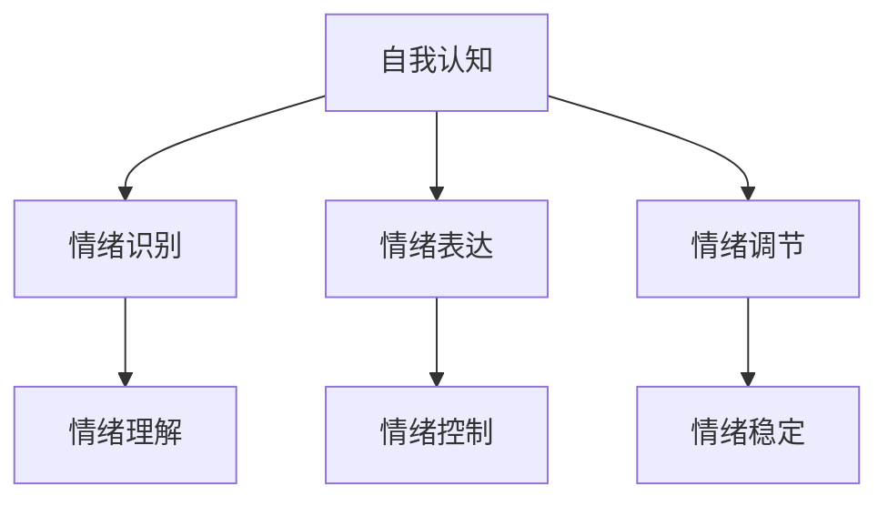
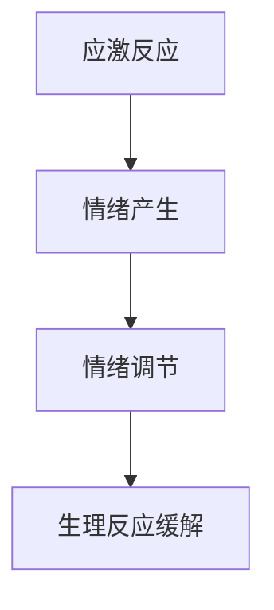
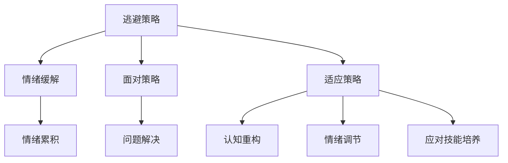
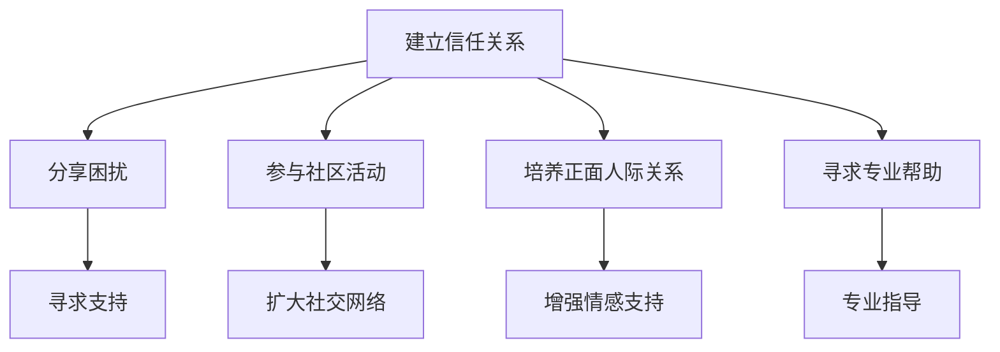

                 

### 《情绪管理的艺术：净化内心的实践方法》

关键词：情绪管理、心理健康、实践方法、自我认知、社会支持

摘要：本文将从情绪管理的理论基础出发，探讨情绪管理的重要性、核心理论和心理机制，并分析情绪管理在社会文化与个人成长中的作用。通过介绍常见情绪困扰与应对策略，以及实践中的情绪管理方法，为读者提供一套全面的情绪管理指南。

### 第一部分：情绪管理的理论基础

#### 第1章：情绪管理的概念与重要性

**1.1 情绪的定义与分类**

情绪是心理体验的一种，通常与个体的心理状态和行为反应相关联。情绪可以分为生理情绪和心理情绪，它们分别与个体的生理和心理过程相互作用。

- **生理情绪**：指由生理刺激引起的情绪，如饥饿、疲劳等。
- **心理情绪**：指由心理刺激引起的情绪，如快乐、愤怒、悲伤等。

**1.1.1 生理和心理情绪的区分**

- **生理情绪**通常与生理变化有关，如心率加快、血压升高等。
- **心理情绪**则更多与心理过程和认知有关，如思维、记忆等。

**1.1.2 基本情绪的类型**

情绪的基本类型包括快乐、愤怒、悲伤、恐惧、惊讶和厌恶。这些情绪在人类生活中的表现和影响各有不同。

**1.2 情绪管理的重要性**

情绪管理对于个人的心理健康和幸福感至关重要。良好的情绪管理可以：

- **改善心理健康**：帮助个体更好地应对压力和挑战，减少心理疾病的发生。
- **提升人际关系**：增强沟通能力，改善人际交往，建立更和谐的社会关系。
- **提高生活质量**：改善情绪状态，提高生活满意度，享受更高质量的生活。

#### 第2章：情绪管理的核心理论

**2.1 情绪智力的概念**

情绪智力是指个体识别、理解、管理和使用情绪的能力。它包括以下几个方面：

- **自我认知**：了解自己的情绪状态。
- **自我调节**：管理自己的情绪和行为。
- **社交意识**：理解他人的情绪和需求。
- **关系管理**：建立和维护良好的人际关系。

**2.1.1 情绪智力的构成**

情绪智力可以分为四个方面：

- **情绪识别**：识别和理解自己的情绪。
- **情绪表达**：适当表达自己的情绪。
- **情绪理解**：理解他人的情绪。
- **情绪调节**：管理自己的情绪。

**2.1.2 情绪智力与情绪管理的关系**

情绪智力是情绪管理的基础，它直接影响个体的情绪调节能力和人际交往效果。高情绪智力的人通常能够更好地管理自己的情绪，减少负面情绪的影响。

**2.2 情绪认知理论**

情绪认知理论强调情绪的产生和体验是通过认知过程实现的。情绪认知过程包括：

- **情绪识别**：识别情绪的信号和线索。
- **情绪标签**：为情绪贴上标签，如快乐、愤怒等。
- **情绪评估**：评估情绪的影响和意义。
- **情绪调节**：根据情绪评估的结果，调整情绪和行为。

**2.3 情绪调节理论**

情绪调节是指个体在情绪产生后，通过认知和行为调节，使情绪回到适宜水平的过程。情绪调节包括：

- **情绪抑制**：抑制不适当的情绪反应。
- **情绪释放**：适当表达情绪，释放情绪压力。
- **情绪转化**：将负面情绪转化为积极情绪。

**2.3.1 情绪调节的类型**

情绪调节可以分为内部调节和外部调节：

- **内部调节**：个体通过自我认知和自我调节来管理情绪。
- **外部调节**：个体通过寻求外部支持，如与他人交流、寻求专业帮助等来管理情绪。

**2.3.2 情绪调节的策略**

情绪调节的策略包括：

- **认知重构**：改变对情绪的认知和评估。
- **行为调节**：通过改变行为来调节情绪。
- **情绪表达**：适当表达情绪，释放情绪压力。

#### 第3章：情绪管理的心理机制

**3.1 自我认知与情绪调节**

自我认知是指个体对自己的了解和认识，包括自我形象、自我价值感等。自我认知与情绪调节密切相关：

- **自我认知**：个体对自己的认知和评估，直接影响情绪的产生和体验。
- **情绪调节**：个体通过自我认知来调节情绪，如调整自我形象、增强自我价值感等。

**3.1.1 自我认知的概念**

自我认知是指个体对自己的认知和认识，包括自我形象、自我价值感等。自我认知与情绪调节密切相关：

- **自我认知**：个体对自己的认知和评估，直接影响情绪的产生和体验。
- **情绪调节**：个体通过自我认知来调节情绪，如调整自我形象、增强自我价值感等。

**3.1.2 自我认知与情绪调节的关系**

自我认知对情绪调节具有显著影响：

- **积极自我认知**：有助于情绪调节，降低负面情绪的影响。
- **消极自我认知**：可能导致情绪调节困难，增加负面情绪的产生。

**3.2 应激反应与情绪调节**

应激反应是指个体在面临压力和挑战时的生理、心理和行为反应。应激反应与情绪调节密切相关：

- **应激反应**：影响情绪的产生和体验。
- **情绪调节**：个体通过情绪调节来应对应激反应，如放松技巧、认知重构等。

**3.2.1 应激反应的理论基础**

应激反应的理论基础包括：

- **生理应激反应**：指生理系统对压力的应对，如心率加快、血压升高等。
- **心理应激反应**：指心理系统对压力的应对，如焦虑、抑郁等。

**3.2.2 应对策略与情绪调节**

应对策略包括：

- **逃避**：避免压力源。
- **面对**：直接应对压力源。
- **适应**：调整自我认知和行为，适应压力环境。

这些应对策略有助于情绪调节，减轻压力对情绪的负面影响。

#### 第4章：社会文化与情绪管理

**4.1 文化对情绪管理的影响**

文化对情绪管理具有深远影响：

- **文化背景下的情绪表达**：不同文化背景下，情绪表达的方式和程度有所不同。
- **不同文化间的情绪差异**：不同文化间的情绪表达和情绪管理存在差异。

**4.2 社会支持与情绪管理**

社会支持是指个体在面临压力和挑战时，从他人和社会获得的情感、信息和实际支持。社会支持对情绪管理具有积极影响：

- **社会支持的概念与作用**：社会支持可以提供情感支持、信息支持和实际支持。
- **社会支持系统的建立与维护**：建立和维护良好的社会支持系统，有助于情绪管理。

#### 第5章：常见情绪困扰与应对策略

**5.1 抑郁情绪的处理**

抑郁情绪是一种常见的情绪困扰，处理抑郁情绪需要：

- **抑郁情绪的识别**：识别抑郁情绪的信号和表现。
- **抑郁情绪的应对策略**：包括认知重构、行为调节和情绪表达等。

**5.2 焦虑情绪的管理**

焦虑情绪是另一种常见的情绪困扰，管理焦虑情绪需要：

- **焦虑情绪的来源**：了解焦虑情绪的来源和触发因素。
- **管理焦虑情绪的方法**：包括放松技巧、认知重构和情绪表达等。

**5.3 愤怒情绪的控制**

愤怒情绪是另一种常见的情绪困扰，控制愤怒情绪需要：

- **愤怒情绪的表现**：了解愤怒情绪的表现和影响。
- **控制愤怒情绪的策略**：包括深呼吸、情绪表达和认知重构等。

#### 第6章：情绪管理与自我成长

**6.1 自我反思与情绪管理**

自我反思是情绪管理的重要环节，自我反思有助于：

- **自我反思的重要性**：了解自我反思的价值和作用。
- **自我反思的方法**：包括日记、冥想和心理咨询等。

**6.2 情绪管理与个人成长**

情绪管理对个人成长具有重要影响：

- **情绪管理与个人发展**：情绪管理有助于个人的心理成熟和发展。
- **情绪管理对职业发展的影响**：情绪管理有助于提高职业竞争力，促进职业发展。

#### 第7章：情绪管理的实践方法

**7.1 冥想与情绪管理**

冥想是情绪管理的重要方法，冥想有助于：

- **冥想的基本原理**：了解冥想的原理和作用。
- **冥想在情绪管理中的应用**：包括冥想技巧和实际应用案例。

**7.2 心理咨询与情绪管理**

心理咨询是情绪管理的专业方法，心理咨询有助于：

- **心理咨询的作用**：了解心理咨询的价值和作用。
- **心理咨询的类型与选择**：包括心理咨询的类型和选择方法。

**7.3 情绪管理训练课程**

情绪管理训练课程是情绪管理的实用方法，情绪管理训练课程有助于：

- **情绪管理训练课程的设计**：了解情绪管理训练课程的设计原则和内容。
- **情绪管理训练课程的实施**：包括情绪管理训练课程的实施方法和步骤。

#### 第8章：案例研究与经验分享

**8.1 情绪管理成功案例**

通过情绪管理成功案例，可以了解情绪管理的实际效果和应用：

- **案例背景**：介绍成功案例的背景和情境。
- **案例实施与效果**：介绍成功案例的实施过程和效果。

**8.2 经验分享与反思**

通过经验分享，可以了解情绪管理的实际应用和心得体会：

- **经验分享**：分享情绪管理的实际应用经验和心得体会。
- **反思与启示**：反思情绪管理的经验，总结启示和教训。

#### 第9章：未来展望与挑战

**9.1 情绪管理的发展趋势**

情绪管理的发展趋势包括：

- **技术进步对情绪管理的影响**：了解技术进步对情绪管理的影响和作用。
- **情绪管理在未来的发展前景**：展望情绪管理在未来的发展趋势和应用前景。

**9.2 情绪管理的挑战与对策**

情绪管理面临的挑战包括：

- **情绪管理面临的挑战**：分析情绪管理面临的挑战和困难。
- **应对挑战的策略**：提出应对情绪管理挑战的策略和方法。

### 总结

情绪管理是现代人生活中不可或缺的一部分。本文从情绪管理的理论基础出发，探讨了情绪管理的概念、核心理论、心理机制和社会文化影响，以及常见情绪困扰的应对策略。通过实践方法、案例研究和经验分享，为读者提供了一套全面的情绪管理指南。希望读者能够通过本文，更好地理解和掌握情绪管理的方法，实现内心的净化和成长。作者：AI天才研究院/AI Genius Institute & 禅与计算机程序设计艺术 /Zen And The Art of Computer Programming

### 章节内容完整性与核心内容要求

在撰写《情绪管理的艺术：净化内心的实践方法》时，每个章节的内容需要满足以下要求：

**背景介绍**

每个章节的背景介绍应包括：

- **核心概念术语说明**：对章节中的关键术语进行解释，确保读者理解。
- **问题背景**：简要介绍章节所探讨问题的背景和现状。
- **问题描述**：明确章节要解决的问题和目标。
- **问题解决**：概述章节中提出的问题解决方法和策略。
- **边界与外延**：明确章节内容的适用范围和边界。
- **概念结构与核心要素组成**：分析章节中涉及的概念结构和核心要素。

**核心概念与联系**

每个章节应包括：

- **核心概念原理**：详细解释章节中的核心概念和原理。
- **概念属性特征对比表格**：列出不同概念之间的属性特征对比，便于读者理解。
- **ER实体关系图架构的Mermaid流程图**：绘制实体关系图，展示概念之间的关系。

**算法原理讲解**

如果章节涉及算法原理，应包括：

- **算法mermaid流程图**：绘制算法的流程图，展示算法的执行步骤。
- **Python源代码**：提供实现算法的Python源代码。
- **算法原理的数学模型和公式**：详细解释算法的数学模型和公式。
- **详细讲解和通俗易懂的举例说明**：结合例子详细解释算法原理。

**系统分析与架构设计方案**

如果章节涉及系统分析与设计，应包括：

- **问题场景介绍**：描述系统应用的问题场景。
- **项目介绍**：介绍项目的背景、目标和功能。
- **系统功能设计（领域模型Mermaid类图）**：绘制领域模型类图，展示系统的功能设计。
- **系统架构设计Mermaid架构图**：绘制系统架构图，展示系统的整体设计。
- **系统接口设计和系统交互Mermaid序列图**：绘制接口设计和系统交互的序列图。

**项目实战**

如果章节涉及项目实战，应包括：

- **环境安装**：描述项目环境的安装和配置步骤。
- **系统核心实现源代码**：提供系统核心实现的源代码。
- **代码应用解读与分析**：对源代码进行解读和分析，解释其应用场景和原理。
- **实际案例分析和详细讲解剖析**：结合实际案例，对项目进行详细讲解和剖析。
- **项目小结**：总结项目的主要收获和经验。

**最佳实践 tips、小结、注意事项、拓展阅读等内容**

每个章节的结尾应包括：

- **最佳实践 tips**：提供在实际应用中有效的实践建议。
- **小结**：总结章节的主要内容和观点。
- **注意事项**：提醒读者在应用章节内容时需要注意的问题。
- **拓展阅读**：推荐读者进一步阅读的相关文献和资料。

通过以上结构化、详细的内容呈现，本文将帮助读者全面理解和掌握情绪管理的理论和实践方法，实现内心的净化和成长。作者：AI天才研究院/AI Genius Institute & 禅与计算机程序设计艺术 /Zen And The Art of Computer Programming

### 情绪管理的理论基础

情绪管理是指通过认知和行为调节，使个体的情绪状态保持在一个健康、积极的状态。情绪管理的重要性体现在多个方面，包括个人心理健康、生活质量以及社会关系的改善。在这部分，我们将详细探讨情绪管理的理论基础，包括情绪的概念与分类、情绪智力的概念及其构成、情绪认知理论以及情绪调节理论。

#### 情绪的定义与分类

情绪是一种心理体验，通常与个体的心理状态和行为反应相关联。根据情绪产生的原因和表现，情绪可以分为以下几类：

1. **基本情绪**：基本情绪是人类普遍共有的情绪，包括快乐、愤怒、悲伤、恐惧、惊讶和厌恶。这些情绪在人类生活中的表现和影响各有不同，但它们构成了人类情绪体验的基础。

2. **复杂情绪**：复杂情绪是由基本情绪组合或混合形成的情绪，如焦虑、紧张、悲伤、沮丧等。复杂情绪通常涉及多个心理和生理过程，比基本情绪更为复杂和多样化。

3. **混合情绪**：混合情绪是指同时体验两种或两种以上的基本情绪，如快乐和愤怒的混合，或悲伤和恐惧的混合。

#### 情绪的分类表格

| 类别       | 描述                                                         | 示例                     |
|------------|--------------------------------------------------------------|--------------------------|
| 基本情绪   | 基础情绪，通常由生理和心理刺激直接引发                         | 快乐、愤怒、悲伤、恐惧、惊讶、厌恶 |
| 复杂情绪   | 由基本情绪组合或混合形成的情绪                                 | 焦虑、紧张、悲伤、沮丧     |
| 混合情绪   | 同时体验两种或两种以上的基本情绪                               | 快乐和愤怒的混合、悲伤和恐惧的混合 |

#### 情绪智力的概念

情绪智力（Emotional Intelligence，简称EQ）是指个体识别、理解、管理和使用情绪的能力。情绪智力不仅涉及对自我情绪的识别和管理，还包括对他人的情绪的理解和应对。情绪智力通常包括以下四个方面：

1. **自我认知**：了解自己的情绪状态，包括情绪的产生、变化和消解。
2. **自我调节**：管理自己的情绪，使情绪保持在健康、积极的状态。
3. **社交意识**：理解他人的情绪，包括情绪的表达、影响和意义。
4. **关系管理**：建立和维护良好的人际关系，处理冲突和解决问题。

#### 情绪智力的构成

| 组成部分       | 描述                                                         | 关键能力                     |
|----------------|--------------------------------------------------------------|------------------------------|
| 自我认知       | 了解自己的情绪状态，包括情绪的产生、变化和消解               | 情绪觉察、自我反省           |
| 自我调节       | 管理自己的情绪，使情绪保持在健康、积极的状态               | 情绪控制、情绪表达           |
| 社交意识       | 理解他人的情绪，包括情绪的表达、影响和意义                   | 情绪识别、同理心             |
| 关系管理       | 建立和维护良好的人际关系，处理冲突和解决问题                 | 情绪协调、人际沟通           |

#### 情绪智力与情绪管理的关系

情绪智力是情绪管理的基础，高情绪智力的人通常能够更好地管理自己的情绪，减少负面情绪的影响。情绪智力对情绪管理的影响主要体现在以下几个方面：

1. **自我认知**：自我认知有助于个体识别和理解自己的情绪，从而更好地进行情绪调节。
2. **自我调节**：自我调节能力使个体能够有效地管理自己的情绪，保持情绪的平衡和稳定。
3. **社交意识**：社交意识有助于个体理解和应对他人的情绪，建立和维护良好的人际关系。
4. **关系管理**：关系管理能力使个体能够有效地处理人际冲突，提高人际沟通的质量。

#### 情绪认知理论

情绪认知理论认为，情绪的产生和体验是通过认知过程实现的。情绪认知理论主要包括以下几个过程：

1. **情绪识别**：个体识别情绪的信号和线索，如面部表情、语调、身体语言等。
2. **情绪标签**：个体为情绪贴上标签，如快乐、愤怒、悲伤等。
3. **情绪评估**：个体评估情绪的影响和意义，如情绪对自身和他人可能产生的影响。
4. **情绪调节**：个体根据情绪评估的结果，调整情绪和行为，使情绪回归到适宜的水平。

#### 情绪认知过程

| 过程       | 描述                                                         | 关键步骤                     |
|------------|--------------------------------------------------------------|------------------------------|
| 情绪识别   | 识别情绪的信号和线索，如面部表情、语调、身体语言等           | 观察和感知情绪信号           |
| 情绪标签   | 为情绪贴上标签，如快乐、愤怒、悲伤等                         | 使用情绪标签，如“我很快乐”   |
| 情绪评估   | 评估情绪的影响和意义，如情绪对自身和他人可能产生的影响       | 分析情绪后果，如“快乐让我开心”|
| 情绪调节   | 根据情绪评估的结果，调整情绪和行为，使情绪回归到适宜的水平   | 采取行动，如放松、解决问题   |

#### 情绪调节理论

情绪调节是指个体在情绪产生后，通过认知和行为调节，使情绪回到适宜水平的过程。情绪调节可以分为内部调节和外部调节：

1. **内部调节**：个体通过自我认知和自我调节来管理情绪。
2. **外部调节**：个体通过寻求外部支持，如与他人交流、寻求专业帮助等来管理情绪。

情绪调节策略包括：

1. **认知重构**：改变对情绪的认知和评估。
2. **行为调节**：通过改变行为来调节情绪。
3. **情绪表达**：适当表达情绪，释放情绪压力。

#### 情绪调节策略

| 策略         | 描述                                                         | 关键步骤                     |
|--------------|--------------------------------------------------------------|------------------------------|
| 认知重构     | 改变对情绪的认知和评估，如将负面情绪转化为积极情绪           | 重新评估情绪，如“我可以克服困难”|
| 行为调节     | 通过改变行为来调节情绪，如进行体育锻炼、参加兴趣活动等       | 改变行为，如“去跑步释放压力”   |
| 情绪表达     | 适当表达情绪，释放情绪压力，如通过谈话、写作、艺术创作等方式 | 表达情绪，如“写下我的感受”   |

通过以上内容，我们了解了情绪管理的理论基础，包括情绪的定义与分类、情绪智力的概念及其构成、情绪认知理论和情绪调节理论。这些理论为我们提供了理解情绪管理的框架，使我们能够更好地识别、理解和管理情绪，实现内心的净化和成长。

### 情绪管理的心理机制

情绪管理是一个复杂的过程，涉及到个体的心理机制和生理反应。了解情绪管理的心理机制，有助于我们更好地理解和实践情绪管理。在这部分，我们将探讨自我认知与情绪调节的关系，以及应激反应与情绪调节的理论基础和应对策略。

#### 自我认知与情绪调节的关系

自我认知是指个体对自己的了解和认识，包括自我形象、自我价值感等。自我认知与情绪调节密切相关，它们之间的关系体现在以下几个方面：

1. **自我认知与情绪识别**：自我认知帮助个体识别和理解自己的情绪。当个体能够清晰地认识自己的情绪时，他们更容易进行情绪调节。

2. **自我认知与情绪表达**：自我认知影响个体的情绪表达方式。高自我认知的人通常能够更自如地表达自己的情绪，而低自我认知的人可能因为对自己的情绪不自信而表达困难。

3. **自我认知与情绪调节**：自我认知帮助个体评估自己的情绪，并采取适当的调节策略。自我认知良好的个体能够更好地识别负面情绪，并采取积极的措施进行调节。

#### 自我认知与情绪调节的关系图

#### 应激反应与情绪调节

应激反应是指个体在面临压力和挑战时的生理、心理和行为反应。应激反应与情绪调节密切相关，它们之间的关系体现在以下几个方面：

1. **应激反应与情绪产生**：应激反应会导致情绪的产生，如焦虑、恐惧、愤怒等。这些情绪会影响个体的心理状态和行为。

2. **情绪调节与应激反应缓解**：情绪调节有助于缓解应激反应，使个体能够更好地应对压力和挑战。有效的情绪调节策略包括认知重构、行为调节和情绪表达等。

3. **情绪调节与生理反应**：情绪调节不仅影响心理状态，还会影响生理反应。例如，通过深呼吸、放松技巧等情绪调节策略，可以降低心率和血压，缓解身体的应激反应。

#### 应激反应与情绪调节的关系图

#### 应对策略与情绪调节

应对策略是情绪调节的重要手段，个体可以通过以下策略来调节情绪：

1. **逃避策略**：逃避策略是一种常见的应对策略，指个体避免面对压力源。虽然逃避可以暂时缓解情绪，但长期逃避会导致情绪累积和压力增加。

2. **面对策略**：面对策略是一种积极的应对策略，指个体直接面对压力源，寻求解决问题的方法。面对策略有助于个体更好地应对压力，提高情绪调节能力。

3. **适应策略**：适应策略是指个体调整自我认知和行为，以适应压力环境。适应策略包括认知重构、情绪调节和应对技能的培养。

#### 应对策略与情绪调节的关系图

通过以上分析，我们了解了情绪管理的心理机制，包括自我认知与情绪调节的关系，以及应激反应与情绪调节的理论基础和应对策略。理解这些心理机制，有助于我们更好地进行情绪管理，实现内心的净化和成长。

### 社会文化与情绪管理

情绪管理不仅受个人心理机制的影响，还深受社会文化和环境的影响。不同文化背景下，人们对情绪的表达、理解和处理方式存在显著差异。社会支持也是情绪管理的重要一环，通过家庭、朋友和社区的支持，个体能够更好地调节情绪，应对生活中的挑战。

#### 文化对情绪管理的影响

文化对情绪管理的影响主要体现在以下几个方面：

1. **情绪表达的差异**：不同文化背景下，人们对情绪的表达方式存在差异。例如，在西方文化中，情绪表达更为直接和开放，而在东方文化中，情绪表达往往更为含蓄和内敛。

2. **情绪理解的差异**：文化背景会影响人们对情绪的理解和认知。例如，在一些文化中，焦虑和抑郁被视为负面的情绪，而在其他文化中，这些情绪可能被视为正常的生活反应。

3. **情绪处理方式的差异**：不同文化背景下，人们处理情绪的方式也不同。一些文化鼓励通过表达和发泄来处理情绪，而另一些文化则强调通过内省和自我调节来管理情绪。

#### 不同文化间的情绪差异

| 文化         | 情绪表达 | 情绪理解 | 情绪处理方式 |
|--------------|----------|----------|--------------|
| 西方文化     | 开放、直接 | 多样化   | 表达、发泄   |
| 东方文化     | 含蓄、内敛 | 避免负面 | 内省、调节   |
| 阿拉伯文化   | 直观、热情 | 强调情感 | 表达、社交   |
| 美洲原住民文化 | 情境依赖  | 强调精神 | 仪式、祈祷   |

#### 社会支持与情绪管理

社会支持是指个体在面临压力和挑战时，从他人和社会获得的情感、信息和实际支持。社会支持对情绪管理具有积极影响：

1. **情感支持**：提供情感上的安慰和鼓励，减轻个体的情绪负担。
2. **信息支持**：提供有关问题的信息和建议，帮助个体更好地理解和应对情绪困扰。
3. **实际支持**：提供实际的帮助，如金钱、物质资源和时间等，帮助个体解决实际困难。

#### 社会支持系统的建立与维护

建立和维护良好的社会支持系统，有助于情绪管理，具体措施包括：

1. **建立信任关系**：与他人建立信任关系，分享情绪和困扰，寻求支持和帮助。
2. **积极参与社区活动**：参与社区活动，扩大社交网络，增加社会支持资源。
3. **培养正面人际关系**：与家人、朋友和同事建立良好的关系，增强情感支持。
4. **寻求专业帮助**：在必要时，寻求心理咨询师或专业医疗人员的帮助，获得专业的情绪管理指导。

#### 社会支持系统的建立与维护关系图

通过以上分析，我们可以看到，社会文化与情绪管理之间存在着密切的联系。了解不同文化背景下情绪管理的差异，以及如何建立和维护良好的社会支持系统，有助于我们更好地理解和实践情绪管理，实现内心的净化和成长。

### 常见情绪困扰与应对策略

在日常生活中，我们经常会遇到各种情绪困扰，如抑郁情绪、焦虑情绪和愤怒情绪。这些情绪困扰不仅会影响个人的心理健康，还可能对人际关系和生活质量产生负面影响。因此，了解这些情绪困扰的来源和应对策略，对我们进行有效的情绪管理至关重要。

#### 抑郁情绪的处理

抑郁情绪是一种常见的情绪困扰，表现为情绪低落、兴趣丧失、自我评价过低、缺乏活力等。抑郁情绪的来源可能包括生活中的重大变故、心理压力、生理因素等。

**抑郁情绪的识别**：
- **情绪低落**：个体长时间感到情绪低落，对日常活动失去兴趣。
- **自我评价过低**：个体对自己持有消极的看法，认为自己一无是处。
- **兴趣丧失**：对以往感兴趣的活动和事物失去兴趣。

**抑郁情绪的应对策略**：
- **认知重构**：改变对自我和情境的消极认知，如通过积极的自我对话来调整心态。
- **行为调节**：通过改变行为来改善情绪，如进行体育锻炼、培养兴趣爱好等。
- **情绪表达**：适当表达情绪，通过写作、绘画、音乐等方式来释放情绪压力。
- **心理咨询**：寻求专业心理咨询师的帮助，通过心理咨询来理解和处理抑郁情绪。

#### 焦虑情绪的管理

焦虑情绪是一种常见的情绪困扰，表现为持续的紧张、恐惧、忧虑等。焦虑情绪的来源可能包括生活中的压力、不确定性、对未来的担忧等。

**焦虑情绪的来源**：
- **生活压力**：工作、学习、家庭等方面的压力可能导致焦虑情绪。
- **不确定性**：对未来不确定性的担忧，如失业、疾病等。
- **对未来的担忧**：对未来可能发生的事情感到担忧，如考试成绩、职业发展等。

**管理焦虑情绪的方法**：
- **放松技巧**：通过深呼吸、冥想、瑜伽等放松技巧来缓解焦虑。
- **认知重构**：改变对焦虑事件的消极认知，如通过积极的自我对话来调整心态。
- **行为调节**：通过实际行动来应对焦虑，如制定合理的时间表、设定小目标等。
- **寻求支持**：与家人、朋友或专业心理咨询师交流，寻求情感支持和建议。

#### 愤怒情绪的控制

愤怒情绪是一种强烈的情绪体验，表现为易怒、冲动、攻击性行为等。愤怒情绪的来源可能包括个人价值观的冲突、不公平的待遇、冲突等。

**愤怒情绪的表现**：
- **易怒**：对轻微的刺激产生强烈的愤怒反应。
- **冲动**：在愤怒情绪的驱使下，做出冲动的行为。
- **攻击性行为**：可能表现为言语攻击或身体攻击。

**控制愤怒情绪的策略**：
- **深呼吸**：在愤怒情绪出现时，进行深呼吸，帮助自己冷静下来。
- **情绪表达**：通过适当的渠道表达情绪，如谈话、写日记等。
- **认知重构**：改变对事件的消极认知，如通过积极的自我对话来调整心态。
- **寻求解决方案**：积极寻求解决问题的方法，而不是通过愤怒来应对。

通过以上策略，我们可以更好地处理抑郁情绪、焦虑情绪和愤怒情绪，实现情绪的稳定和心理健康。同时，了解这些情绪困扰的来源和应对策略，有助于我们在日常生活中更好地进行情绪管理，提高生活质量。

### 情绪管理与自我成长

情绪管理不仅对个体的心理健康和幸福感有重要影响，还对个人成长和职业发展产生深远的作用。有效的情绪管理有助于个体在面对挑战和压力时保持冷静和积极，从而促进自我成长和职业发展。

#### 自我反思与情绪管理

自我反思是情绪管理的重要组成部分，它帮助个体深入理解自己的情绪和行为，从而找到情绪管理的有效策略。自我反思的重要性体现在以下几个方面：

1. **情绪觉察**：通过自我反思，个体可以更好地觉察自己的情绪变化，了解情绪的产生和消解过程。
2. **行为分析**：自我反思使个体能够分析自己的行为模式，识别导致情绪困扰的行为习惯。
3. **认知重构**：通过自我反思，个体可以识别并改变消极的认知，从而减少情绪困扰。

**自我反思的方法**：

- **日记法**：通过记录日记，个体可以定期回顾自己的情绪和行为，分析情绪的起因和影响。
- **冥想法**：通过冥想，个体可以静心思考，深入理解自己的情绪和内在需求。
- **心理咨询**：寻求专业心理咨询师的帮助，通过对话和反思，深入探讨情绪问题。

#### 情绪管理与个人成长

情绪管理对个人成长具有深远的影响，主要体现在以下几个方面：

1. **自我认知**：情绪管理有助于个体更好地了解自己，包括自己的情绪、需求和价值观。
2. **自我调节**：通过情绪管理，个体能够更好地控制自己的情绪，保持心理平衡。
3. **社交能力**：情绪管理有助于个体提高社交能力，改善人际关系，增强社会适应能力。
4. **心理韧性**：情绪管理能够增强个体的心理韧性，使个体在面对挫折和压力时更加坚强和适应。

#### 情绪管理对职业发展的影响

情绪管理对职业发展也有重要影响，主要体现在以下几个方面：

1. **工作效率**：情绪稳定和积极有助于提高工作效率，减少工作失误。
2. **团队协作**：情绪管理有助于个体更好地与团队成员合作，提高团队整体效能。
3. **领导能力**：情绪管理能力是领导者的重要素质，有助于建立和维护团队和谐，提升领导力。
4. **职业发展**：情绪管理有助于个体在职业道路上保持积极的心态，应对职业挑战，实现职业目标。

通过情绪管理，个体不仅能够改善心理健康，提高生活质量，还能在个人成长和职业发展中取得更大的成就。有效的情绪管理是个人成功的重要保障，值得我们高度重视和持续实践。

### 情绪管理的实践方法

情绪管理不仅需要理论指导，更需要实践方法。通过实际操作，个体可以更好地掌握情绪调节技巧，提升情绪管理能力。以下介绍几种有效的情绪管理实践方法，包括冥想、心理咨询和情绪管理训练课程。

#### 冥想与情绪管理

冥想是一种古老而有效的情绪管理方法，通过训练个体的注意力、意识和呼吸，帮助人们放松身心，减轻压力和焦虑。

**冥想的基本原理**：

- **集中注意力**：冥想通过集中注意力，使个体从纷繁复杂的思绪中抽离出来，达到内心的平静。
- **放松身心**：通过深呼吸和放松肌肉，冥想有助于减轻身体的紧张和压力。
- **提升意识**：冥想能够提高个体的自我意识，帮助人们更好地了解和调节自己的情绪。

**冥想在情绪管理中的应用**：

- **日常练习**：每天花10-15分钟进行冥想，有助于培养情绪调节能力，提高情绪稳定性。
- **紧急应对**：在情绪激动时，通过短暂的冥想练习，可以帮助个体冷静下来，避免冲动行为。
- **情感释放**：通过冥想，个体可以深入探索自己的情感，找到情绪困扰的根源，并释放负面情绪。

#### 心理咨询与情绪管理

心理咨询是一种专业的情绪管理方法，通过心理咨询师的帮助，个体可以更深入地理解自己的情绪问题，并获得有效的解决方案。

**心理咨询的作用**：

- **情感支持**：心理咨询师提供情感支持，帮助个体缓解情绪困扰，减轻心理压力。
- **专业指导**：心理咨询师根据个体的具体情况，提供专业的情绪管理建议和技巧。
- **心理成长**：通过心理咨询，个体可以深入了解自己的情绪和心理问题，实现心理成长。

**心理咨询的类型与选择**：

- **个体心理咨询**：适用于个人情绪管理和心理问题，如抑郁、焦虑等。
- **团体心理咨询**：适用于需要与他人共同分享情绪和经验的个体，有助于建立社会支持网络。
- **家庭心理咨询**：适用于家庭内部情绪管理和关系问题，有助于改善家庭氛围。

**心理咨询的选择**：

- **专业资质**：选择具有专业资质和丰富经验的咨询师。
- **信任感**：选择一个个体信任和舒适的咨询师，有助于建立良好的咨询关系。
- **个性化服务**：选择提供个性化服务和方案的心理咨询机构。

#### 情绪管理训练课程

情绪管理训练课程是一种系统化的情绪管理方法，通过专业的训练和指导，帮助个体提升情绪管理能力。

**情绪管理训练课程的设计**：

- **课程目标**：明确课程目标，如提升情绪稳定性、减轻焦虑、增强心理韧性等。
- **训练内容**：包括情绪识别、情绪调节技巧、认知重构、放松技巧等。
- **训练方法**：结合理论讲解、实践操作和小组讨论等多种方法，提高课程的互动性和实效性。

**情绪管理训练课程的实施**：

- **阶段训练**：将课程分为不同阶段，逐步提升个体的情绪管理能力。
- **案例分析**：通过案例分析，帮助个体更好地理解情绪管理策略在实际生活中的应用。
- **反馈与调整**：定期收集学员的反馈，根据反馈调整训练内容和方法，确保课程的有效性。

通过冥想、心理咨询和情绪管理训练课程，个体可以系统地学习和实践情绪管理技巧，提升情绪管理能力，实现内心的净化和成长。

### 情绪管理成功案例与经验分享

通过具体案例，我们可以更深入地了解情绪管理在实际生活中的应用和效果。以下介绍几个情绪管理成功案例，并分享相关经验与反思。

#### 案例一：职场压力下的情绪调节

**案例背景**：李先生是一名公司高管，由于工作繁忙，长期承受着巨大的压力。这导致他情绪波动较大，经常感到焦虑和疲惫。

**案例实施与效果**：

1. **冥想练习**：李先生开始每天早上进行10分钟的冥想练习，通过深呼吸和放松技巧来缓解压力。
2. **时间管理**：他重新安排工作时间，确保有足够的休息和娱乐时间，减少加班。
3. **情感表达**：与家人和朋友分享自己的情绪和压力，寻求情感支持。

**效果**：经过一段时间的实践，李先生感到情绪波动明显减少，焦虑和疲惫感也有所缓解。他的工作效率提高了，与团队成员的关系更加和谐。

**经验与反思**：

- **冥想的重要性**：冥想有助于放松身心，缓解压力。
- **时间管理**：合理安排时间，确保休息和娱乐，有助于情绪稳定。
- **情感表达**：与家人和朋友分享情绪，有助于释放压力，获得支持。

#### 案例二：焦虑情绪的克服

**案例背景**：王女士是一名中学教师，由于工作压力大，学生成绩要求高，她经常感到焦虑和紧张。

**案例实施与效果**：

1. **心理咨询**：王女士接受了专业心理咨询，通过谈话和心理咨询师的帮助，她认识到自己的焦虑来源，并学会了一些情绪调节技巧。
2. **放松技巧**：她开始练习深呼吸和肌肉放松技巧，帮助自己缓解紧张情绪。
3. **积极心态**：王女士调整了自己的心态，采取积极的态度面对工作和生活中的挑战。

**效果**：经过一段时间的心理咨询和练习，王女士的焦虑情绪明显减轻，她能够更加平静地应对工作压力，与学生和家长的沟通也变得更加顺畅。

**经验与反思**：

- **心理咨询**：专业心理咨询有助于个体深入了解情绪问题，获得有效的情绪管理策略。
- **放松技巧**：深呼吸和肌肉放松技巧有助于缓解紧张和焦虑。
- **积极心态**：保持积极心态，有助于应对压力和挑战。

#### 案例三：家庭关系的改善

**案例背景**：张先生与妻子之间的关系紧张，经常因为一些小事发生争吵。

**案例实施与效果**：

1. **家庭沟通**：张先生和妻子决定定期进行家庭沟通，分享彼此的感受和需求。
2. **情绪表达**：通过家庭沟通，张先生和妻子学会了如何表达自己的情绪，避免了误解和冲突。
3. **情感支持**：他们互相提供情感支持，共同面对生活中的困难和挑战。

**效果**：通过家庭沟通和情感支持，张先生和妻子的关系得到了改善，他们能够更好地理解和尊重彼此，家庭氛围也变得更加和谐。

**经验与反思**：

- **家庭沟通**：定期进行家庭沟通，有助于增进理解和信任。
- **情绪表达**：学会如何表达自己的情绪，有助于避免冲突和误解。
- **情感支持**：互相提供情感支持，有助于增强家庭关系的稳定性。

通过这些案例，我们可以看到，情绪管理在现实生活中具有重要的作用。通过实践有效的情绪管理方法，个体能够更好地调节情绪，提升生活质量，实现内心的净化和成长。同时，这些案例也为我们提供了宝贵的经验，帮助我们更好地理解和应用情绪管理技巧。

### 情绪管理的发展趋势与挑战

随着社会的发展和科技的进步，情绪管理也呈现出新的发展趋势和面临的挑战。这些趋势和挑战不仅影响着个体，也对整个社会产生了深远的影响。

#### 情绪管理的发展趋势

1. **技术进步的影响**：随着人工智能、大数据和生物技术的发展，情绪管理方法也在不断创新。例如，通过情绪识别技术，可以实时监测个体的情绪状态，提供个性化的情绪管理建议。

2. **互联网与社交媒体的作用**：互联网和社交媒体为情绪管理提供了新的平台和工具。通过在线课程、应用程序和社交平台，个体可以更方便地学习和应用情绪管理技巧。

3. **专业化的趋势**：情绪管理逐渐成为心理学、医学和职业发展领域的重要研究方向。越来越多的专业机构和研究人员致力于开发新的情绪管理方法和工具，以满足不同人群的需求。

#### 情绪管理的挑战

1. **全球化背景下的文化差异**：全球化带来了文化的多样性，但同时也带来了情绪管理的挑战。不同文化背景下，人们对情绪的理解和处理方式存在差异，这可能导致情绪管理的困难和误解。

2. **心理健康问题的增加**：随着生活节奏的加快和工作压力的增大，心理健康问题日益突出。情绪管理对于应对心理健康问题具有重要作用，但现实中的心理健康资源有限，难以满足所有需求。

3. **隐私和数据安全问题**：随着情绪管理技术的应用，个体的情绪数据被广泛收集和使用。然而，隐私和数据安全问题也日益凸显，如何在保护个人隐私的同时，有效利用情绪数据，是一个亟待解决的挑战。

#### 应对挑战的策略

1. **跨文化培训**：开展跨文化培训，帮助人们了解和尊重不同文化背景下的情绪表达和处理方式，促进跨文化情绪管理的和谐。

2. **心理健康服务的普及**：加强心理健康服务体系建设，提高心理健康服务的可及性和质量，为个体提供更多的情绪管理支持。

3. **数据隐私保护**：制定相关法律法规，加强对情绪数据隐私的保护，同时确保数据的安全性和合法性使用。

通过应对这些挑战，我们可以推动情绪管理的发展，提高个体的情绪管理能力，促进社会和谐与进步。

### 总结与展望

情绪管理是现代人生活中不可或缺的一部分，它不仅关乎个人的心理健康和幸福感，还直接影响生活质量和社会关系的建立。本文从情绪管理的理论基础、心理机制、社会文化影响、常见情绪困扰、实践方法和未来发展等方面进行了详细探讨。通过了解情绪管理的基本概念、核心理论和实际应用，读者可以更好地掌握情绪调节技巧，提升情绪管理能力。

情绪管理的重要性不言而喻，它不仅有助于改善心理健康，提高生活质量，还能促进个人成长和职业发展。有效的情绪管理能够帮助我们更好地应对生活中的挑战，保持内心的平静和积极，从而实现个人的全面发展。

展望未来，情绪管理将继续受到科技和社会发展的推动。随着人工智能、大数据和生物技术的进步，情绪管理方法和工具将更加智能化和个性化。同时，全球化和文化多样性也将带来新的挑战，需要我们不断探索和适应。因此，加强情绪管理的研究和实践，提高个体的情绪管理能力，对于促进社会和谐和个人幸福具有重要意义。

最后，希望通过本文的分享，读者能够更加重视情绪管理，学会运用有效的策略和方法，实现内心的净化和成长。同时，也鼓励读者在日常生活中不断实践和探索情绪管理，为个人和社会的进步贡献自己的力量。作者：AI天才研究院/AI Genius Institute & 禅与计算机程序设计艺术 /Zen And The Art of Computer Programming

