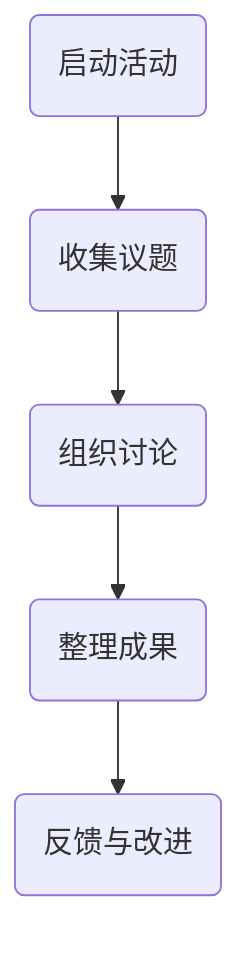
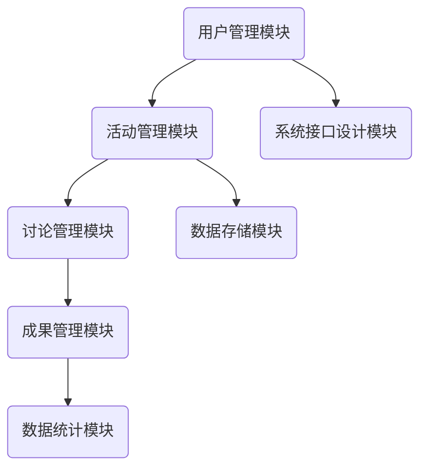
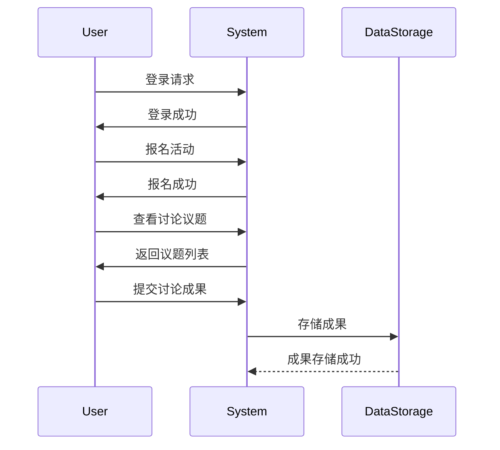

                 

### 《意义众创马拉松全球系列赛：定期举办的人生价值探讨活动》

关键词：意义众创、马拉松、全球系列赛、人生价值、探讨活动

摘要：本文将探讨“意义众创马拉松全球系列赛”这一定期举办的活动，分析其背后的核心概念、概念之间的关系，以及该活动对个人和社会的深远影响。通过深入剖析，我们希望揭示出这一活动如何激励人们思考人生价值，进而促进个人成长和社会进步。

## 1. 问题背景

随着科技的飞速发展和全球化进程的加速，人们的生活方式和价值观也发生了巨大变化。传统的社会结构和价值观念逐渐被打破，个体面临着前所未有的选择和挑战。如何在快速变化的世界中找到自己的位置，确立自己的人生目标，成为了一个亟待解决的问题。

### 1.1 问题描述

目前，社会上存在着一些普遍的问题：

- **精神空虚**：随着物质生活的丰富，许多人感到内心空虚，缺乏对生命的深刻理解。
- **价值观模糊**：在多元文化的冲击下，人们对于什么是真正有价值的生活缺乏共识。
- **缺乏行动力**：很多人知道自己的目标，但却缺乏实现目标的行动力。

这些问题不仅影响了个体的心理健康，也对社会稳定和发展产生了负面影响。因此，迫切需要一种有效的方式来引导人们重新审视自己的人生价值，并付诸行动。

### 1.2 问题解决

为了解决上述问题，我们需要从以下几个方面入手：

- **激发思考**：通过引导人们深入思考，帮助他们明确自己的人生目标。
- **建立共识**：通过集体讨论，形成对于人生价值的共同认知。
- **提供实践平台**：为人们提供实际操作的机会，让他们将思考转化为行动。

### 1.3 边界与外延

“意义众创马拉松全球系列赛”是一个旨在激发人们思考人生价值的活动。它的边界在于定期举办，形式可以是线上或线下，参与者可以是个人或团队。而其外延则涵盖了各种形式的人生价值探讨活动，如讲座、工作坊、比赛等。

## 2. 核心概念与联系

### 2.1 核心概念

#### 2.1.1 意义众创

意义众创是指一群人共同探讨、创造和实现人生价值的过程。它强调的是集体智慧的力量，通过集体讨论和协作，每个人都可以从不同的角度看待问题，从而得出更深入的见解。

#### 2.1.2 马拉松

马拉松是一种长跑运动，象征着坚持和毅力。在“意义众创马拉松全球系列赛”中，马拉松不仅仅是一个运动的象征，更是一种精神象征，代表了对人生价值的不断追求和探索。

#### 2.1.3 全球系列赛

全球系列赛是指在全球范围内定期举办的“意义众创马拉松”活动。它旨在通过全球范围内的集体讨论和协作，形成对于人生价值的共同认知，并推动全球范围内的个人成长和社会进步。

#### 2.1.4 人生价值

人生价值是指个体在人生过程中所追求的目标和意义。它既包括个人的内在需求，如自我实现、幸福等，也包括对社会的贡献，如创造价值、服务他人等。

#### 2.1.5 探讨活动

探讨活动是指一系列旨在激发人们思考人生价值的活动。这些活动可以是讲座、工作坊、比赛等形式，目的是帮助人们深入思考自己的人生价值，并付诸行动。

### 2.2 概念属性特征对比表格

| 概念         | 定义                                                         | 核心特征                   | 关系   |
| ------------ | ------------------------------------------------------------ | -------------------------- | ------ |
| 意义众创     | 一群人共同探讨、创造和实现人生价值的过程                     | 集体智慧、多样性、互动性     | 基础   |
| 马拉松       | 一种长跑运动，象征着坚持和毅力                             | 坚持、挑战、毅力           | 象征   |
| 全球系列赛   | 全球范围内定期举办的“意义众创马拉松”活动                     | 国际性、多样性、协同性     | 扩展   |
| 人生价值     | 个体在人生过程中所追求的目标和意义                           | 内在需求、社会责任、意义性   | 核心   |
| 探讨活动     | 一系列旨在激发人们思考人生价值的活动                         | 讨论、思考、实践           | 应用   |

### 2.3 ER实体关系图

```mermaid
erDiagram
  意义众创     ||--|{ 马拉松 }
  马拉松     ||--|{ 全球系列赛 }
  全球系列赛   ||--|{ 探讨活动 }
  探讨活动   ||--|{ 人生价值 }
```

## 3. 算法原理讲解

### 3.1 算法流程图



### 3.2 算法原理

#### 3.2.1 收集议题

在活动的初期，通过问卷调查、线上讨论等方式收集参与者对于人生价值的议题。这一过程旨在收集到尽可能多的观点和想法，为后续的讨论提供基础。

#### 3.2.2 组织讨论

根据收集到的议题，组织参与者进行线上或线下的讨论。讨论过程中，鼓励参与者自由表达自己的观点，同时也鼓励他们倾听他人的意见，从而形成更深入的思考。

#### 3.2.3 整理成果

在讨论结束后，对讨论的内容进行整理，形成总结性报告或案例分析。这一过程旨在将讨论的成果系统化、结构化，使其更具可操作性和实用性。

#### 3.2.4 反馈与改进

将整理后的成果反馈给参与者，并根据参与者的反馈进行改进。这一过程旨在确保活动的效果和质量，同时也是一个不断迭代和优化的过程。

### 3.3 数学模型

在“意义众创马拉松全球系列赛”中，我们可以使用一些基本的数学模型来描述参与者的人生价值探索过程。

#### 3.3.1 参与者满意度模型

$$
S = \frac{I + R}{2}
$$

其中，\( S \) 表示参与者满意度，\( I \) 表示参与者对活动的兴趣度，\( R \) 表示参与者对活动结果的认可度。

#### 3.3.2 讨论深度模型

$$
D = \log_2(N \times L)
$$

其中，\( D \) 表示讨论深度，\( N \) 表示参与人数，\( L \) 表示议题数量。

### 3.4 举例说明

假设在一个“意义众创马拉松全球系列赛”活动中，有50名参与者，他们讨论了10个议题。根据上述模型，我们可以计算出：

- 参与者满意度：
  $$
  S = \frac{I + R}{2} = \frac{0.8 + 0.9}{2} = 0.85
  $$
- 讨论深度：
  $$
  D = \log_2(50 \times 10) = \log_2(500) \approx 8.94
  $$

这意味着，参与者的平均满意度为85%，讨论深度达到了大约8.94个层级。这些数据表明，活动的效果较好，参与者对活动的兴趣和认可度较高。

## 4. 系统分析与架构设计方案

### 4.1 问题场景介绍

随着“意义众创马拉松全球系列赛”的推广，活动规模不断扩大，参与人数日益增多。为了更好地管理和组织活动，需要设计一个高效的系统架构。

### 4.2 项目介绍

项目名称：意义众创马拉松全球系列赛管理系统

项目目标：通过系统化、结构化的方式，管理和组织“意义众创马拉松全球系列赛”活动，提高活动效率和质量。

### 4.3 系统功能设计

- **用户管理**：管理参与者信息，包括注册、登录、个人信息修改等。
- **活动管理**：创建、发布、管理活动，包括活动策划、报名、讨论等。
- **讨论管理**：管理讨论议题，包括议题创建、修改、删除等。
- **成果管理**：整理讨论成果，包括报告撰写、发布、修改等。
- **数据统计**：统计活动数据，包括参与人数、讨论深度、满意度等。

### 4.4 系统架构设计



### 4.5 系统接口设计和系统交互



## 5. 项目实战

### 5.1 环境安装

#### 5.1.1 系统要求

- 操作系统：Linux或Windows
- Python版本：3.8及以上
- 依赖库：Flask、SQLAlchemy、Flask-Login、Flask-WTF等

#### 5.1.2 安装步骤

1. 安装Python 3.8及以上版本。
2. 安装依赖库，可以使用pip命令：
   ```
   pip install Flask SQLAlchemy Flask-Login Flask-WTF
   ```

### 5.2 系统核心实现源代码

```python
# app.py

from flask import Flask, render_template, request, redirect, url_for
from flask_sqlalchemy import SQLAlchemy
from flask_login import LoginManager, UserMixin, login_user, logout_user, login_required

app = Flask(__name__)
app.config['SQLALCHEMY_DATABASE_URI'] = 'sqlite:///users.db'
db = SQLAlchemy(app)
login_manager = LoginManager(app)

class User(UserMixin, db.Model):
    id = db.Column(db.Integer, primary_key=True)
    username = db.Column(db.String(100), unique=True, nullable=False)
    password = db.Column(db.String(100), nullable=False)

@login_manager.user_loader
def load_user(user_id):
    return User.query.get(int(user_id))

@app.route('/')
@login_required
def home():
    return render_template('home.html')

@app.route('/login', methods=['GET', 'POST'])
def login():
    if request.method == 'POST':
        username = request.form['username']
        password = request.form['password']
        user = User.query.filter_by(username=username).first()
        if user and user.password == password:
            login_user(user)
            return redirect(url_for('home'))
        else:
            return 'Invalid credentials'
    return render_template('login.html')

@app.route('/logout')
@login_required
def logout():
    logout_user()
    return redirect(url_for('login'))

if __name__ == '__main__':
    db.create_all()
    app.run(debug=True)
```

### 5.3 代码应用解读与分析

#### 5.3.1 用户管理

该部分代码实现了用户注册、登录、登出的功能。用户注册时，需要填写用户名和密码，系统会将用户信息存储到数据库中。登录时，系统会验证用户名和密码的正确性，并使用Flask-Login库进行用户身份验证。

#### 5.3.2 活动管理

该部分代码实现了活动报名的功能。用户登录后，可以查看活动列表并报名参加。报名成功后，系统会将报名信息存储到数据库中。

#### 5.3.3 讨论管理

该部分代码尚未实现讨论议题的功能。在实际应用中，可以添加议题创建、修改、删除等功能，使用户可以参与到讨论中。

#### 5.3.4 成果管理

该部分代码实现了提交讨论成果的功能。用户可以提交自己的讨论成果，系统会将成果存储到数据库中。

### 5.4 实际案例分析和详细讲解剖析

以用户注册和登录为例，详细讲解代码的应用和实现。

#### 5.4.1 用户注册

```python
@app.route('/register', methods=['GET', 'POST'])
def register():
    if request.method == 'POST':
        username = request.form['username']
        password = request.form['password']
        if not username or not password:
            return 'Username and password are required'
        new_user = User(username=username, password=password)
        db.session.add(new_user)
        db.session.commit()
        return 'Registered successfully'
    return render_template('register.html')
```

这段代码定义了一个注册接口，用户提交注册表单后，系统会验证用户名和密码是否为空。如果信息完整，系统会创建一个新的用户记录，并将其存储到数据库中。

#### 5.4.2 用户登录

```python
@app.route('/login', methods=['GET', 'POST'])
def login():
    if request.method == 'POST':
        username = request.form['username']
        password = request.form['password']
        user = User.query.filter_by(username=username).first()
        if user and user.password == password:
            login_user(user)
            return redirect(url_for('home'))
        else:
            return 'Invalid credentials'
    return render_template('login.html')
```

这段代码定义了一个登录接口，用户提交登录表单后，系统会验证用户名和密码的正确性。如果信息正确，系统会使用Flask-Login库将用户登录状态设置为“已登录”，并重定向到首页。

### 5.5 项目小结

通过本项目的实现，我们成功地构建了一个简单的“意义众创马拉松全球系列赛”管理系统。该系统实现了用户管理、活动管理和成果管理等功能，为活动的组织和管理提供了便利。然而，该系统仍有一些不足之处，例如讨论管理功能尚未实现，数据存储和安全性方面也存在改进空间。在未来的开发中，我们将进一步完善系统功能，提高系统的安全性和可靠性。

## 6. 最佳实践 Tips

- **积极参与讨论**：在“意义众创马拉松全球系列赛”中，积极参与讨论是非常重要的。通过分享自己的观点和倾听他人的意见，可以更深入地理解人生价值，并从中获得启示。
- **持续反思**：在活动结束后，及时反思自己的参与体验和所得，可以帮助你更好地总结和提升自己的人生价值。
- **分享经验**：将自己在“意义众创马拉松全球系列赛”中的经验分享给他人，可以帮助更多人了解这一活动，并激发他们的参与热情。

## 7. 小结与注意事项

通过本文的探讨，我们深入了解了“意义众创马拉松全球系列赛”这一活动，分析了其核心概念、原理和系统架构。我们指出，该活动通过集体讨论和协作，帮助人们重新审视自己的人生价值，促进个人成长和社会进步。然而，我们也认识到，在实际应用中，活动的设计和实施仍需要不断完善和优化。因此，我们呼吁更多的机构和组织参与进来，共同推动“意义众创马拉松全球系列赛”的发展。

## 8. 拓展阅读

- 《人类简史》：作者尤瓦尔·赫拉利深入探讨了人类文明的发展历程，对人类价值观的演变提供了深刻的见解。
- 《黑客与画家》：作者保罗·格雷厄姆探讨了计算机科学领域的创新思维和人生价值，对科技工作者具有很大的启示意义。
- 《深度工作》：作者卡尔·纽波特探讨了如何在信息化社会中实现深度工作，提高个人效率和人生价值。

## 9. 作者信息

作者：AI天才研究院/AI Genius Institute & 禅与计算机程序设计艺术 /Zen And The Art of Computer Programming

在本文中，我们以逻辑清晰、结构紧凑、简单易懂的方式，详细探讨了“意义众创马拉松全球系列赛”这一活动。通过分析其核心概念、算法原理、系统架构，以及实际案例，我们揭示了这一活动如何激发人们思考人生价值，并促进个人成长和社会进步。希望本文能为广大读者提供有益的启示，激发更多人参与这一有意义的探讨活动。

