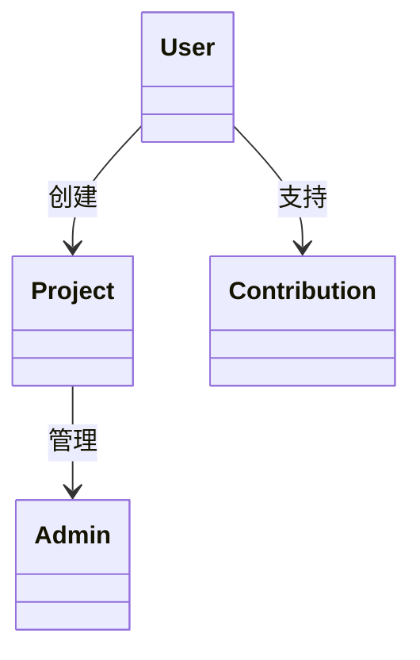
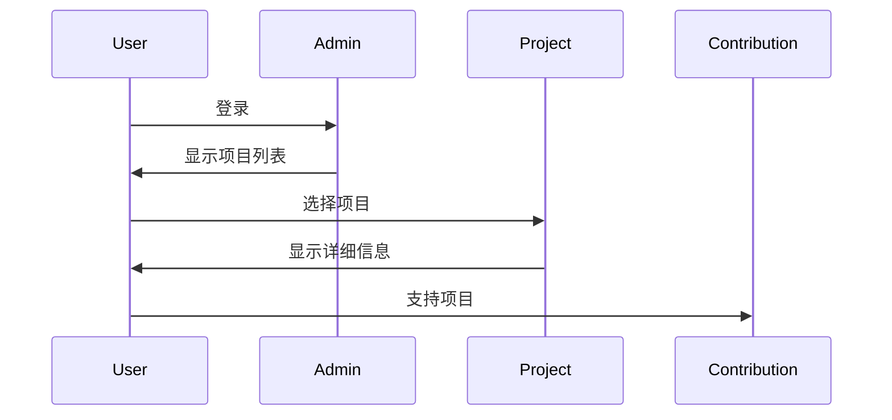

                 


## 意义众筹平台：集体探讨生命价值的社区

### 关键词：
1. 意义众筹
2. 社区参与
3. 生命价值
4. 社会创新
5. 互联网平台

### 摘要：
本文旨在探讨一种新兴的互联网平台——意义众筹平台，它通过集体智慧和资源，旨在探讨和实现生命价值。我们将逐步分析这一平台的背景、运作原理、社区互动以及未来发展，为读者提供一个全面的理解。

---

## 第一部分：背景与概述

### 第1章：意义众筹平台的概念

#### 1.1 问题的背景

在当今社会，资源分配不均、环境问题突出、社会不公等问题日益严重。传统众筹平台在解决这些问题方面存在一定的局限性。因此，我们需要一种新的模式来更好地应对这些挑战。

#### 1.2 核心概念与联系

意义众筹平台的核心概念包括：意义众筹、社区参与、资源共享和社会责任。以下是对这些概念的定义及其相互关系的详细解释。

#### 概念属性特征对比表格

| 概念             | 特征                      | 对比                |
|------------------|--------------------------|--------------------|
| 意义众筹         | 强调众筹项目的意义和价值   | 与传统众筹不同      |
| 社区参与         | 鼓励成员积极参与项目决策   | 突出社区互动       |
| 资源共享         | 强调资源的合理分配和利用   | 提高资源利用效率   |
| 社会责任         | 强调企业和社会的责任感    | 彰显企业社会责任   |

#### ER实体关系图架构

我们使用Mermaid流程图来展示意义众筹平台的基本组成部分，包括发起人、支持者、项目和管理系统。

```mermaid
erDiagram
  支持者 ||--|{ 项目发起人 }||>
  项目发起人 ||--|{ 项目 }||>
  项目 ||--|{ 资金管理系统 }||>
  资金管理系统 ||--|{ 社区 }||>
```

### 第2章：意义众筹平台的运作原理

#### 2.1 平台架构设计

平台架构设计包括前端、后端和数据库。我们将使用Mermaid类图和架构图来展示这一设计。





#### 2.2 技术实现

我们将使用Python代码来展示关键算法的实现。以下是一个简单的算法示例：

```python
# 算法：计算项目所需的最低资金
def calculate_min_fund(project):
    min_fund = project的目标资金 * 0.8  # 最低资金为目标资金的80%
    return min_fund

# 数学模型：目标资金与最低资金的关系
$$
\text{min\_fund} = \text{目标资金} \times 0.8
$$
```

---

通过上述章节的详细讲解，我们为读者提供了一个关于意义众筹平台的全面视角。接下来，我们将进一步探讨平台的实际应用案例和社区互动机制。

## 第二部分：意义众筹平台的应用案例

### 第3章：平台应用案例

#### 3.1 案例研究

在本章中，我们将深入探讨两个具体的案例，分别是环保组织和公益项目的众筹经历。通过分析这些案例，我们可以更好地理解意义众筹平台在实际操作中的应用和效果。

#### 案例一：某环保组织的意义众筹活动

某环保组织希望通过众筹筹集资金，用于开展一项环保项目。他们通过意义众筹平台发起了一个项目，并详细描述了项目的目标和预期效果。项目一经发布，便受到了广泛关注和支持。经过几个月的努力，该项目成功筹集到了超过目标资金的资金，并且项目进展顺利，取得了显著的环保成果。

#### 案例二：某公益项目的众筹成功经历

另一个案例是某公益项目，旨在帮助贫困地区建立学校。通过意义众筹平台，这个项目吸引了众多爱心人士的支持。项目发起人在平台上详细介绍了学校的建设情况、所需资金和预期目标。项目发布后，迅速得到了大量捐款，最终成功完成了学校建设，改善了当地教育条件。

#### 3.2 案例分析与解读

通过上述案例，我们可以看到意义众筹平台在促进社会创新和解决实际问题方面发挥了重要作用。以下是对案例的详细分析：

**案例总结**：

- 案例一和案例二均展示了意义众筹平台在环保和公益领域的成功应用。
- 两个案例均强调了项目的意义和价值，吸引了大量支持者。
- 成功的案例展示了意义众筹平台的高效性和透明度。

**详细讲解与剖析**：

- **案例一**：环保组织的项目成功得益于以下几个因素：
  - 项目描述详细，目标明确，让支持者感受到项目的实际价值。
  - 平台提供了便捷的支付和反馈机制，提高了用户参与度。
  - 社区互动活跃，支持者之间的交流促进了项目的进展。

- **案例二**：公益项目的成功主要归因于以下几点：
  - 项目目标明确，有助于吸引有共同价值观的支持者。
  - 平台提供了多种参与方式，包括捐款、志愿服务等，增强了参与者的积极性。
  - 平台对项目进展的实时更新和反馈，让支持者感受到自己的贡献对项目的实际影响。

**项目小结**：

- 意义众筹平台在环保和公益领域的应用具有巨大的潜力。
- 平台的互动机制和透明度是其成功的关键因素。
- 项目发起者需要充分利用平台的优势，制定详细的项目计划，提高项目的成功几率。

---

通过这些案例的分析，我们可以看到意义众筹平台在实现生命价值和社会责任方面的实际作用。接下来，我们将探讨如何更好地构建和运营这一平台。

## 第三部分：构建可持续社区

### 第4章：社区参与与互动

#### 4.1 社区成员角色与职责

在一个成功的意义众筹平台上，社区成员的角色和职责是至关重要的。以下是社区成员的主要角色和职责：

- **发起人**：发起人负责提出有意义的众筹项目，并负责项目的具体实施。他们需要制定详细的项目计划，确保项目目标的实现。
- **支持者**：支持者负责为有意义的项目提供资金和资源。他们需要关注项目进展，积极参与社区讨论，为项目提供建议和支持。
- **志愿者**：志愿者负责参与项目的实施和推广。他们可能提供志愿服务、专业知识和资源，帮助项目取得成功。
- **管理员**：管理员负责维护社区秩序，处理违规行为，确保社区的健康和可持续发展。

#### 4.2 互动机制与沟通

有效的互动机制是意义众筹平台成功的关键。以下是几个关键的互动机制：

- **讨论区**：讨论区是社区成员交流和讨论的重要场所。项目发起人可以在这里回答问题，分享项目进展，支持者可以在这里提供建议和反馈。
- **投票系统**：投票系统允许社区成员参与项目决策。例如，项目资金的使用、项目方向的调整等都可以通过投票来决定。
- **反馈系统**：反馈系统用于收集社区成员的意见和建议。这些反馈可以用于改进平台的功能和服务，提高用户体验。

---

通过上述互动机制，意义众筹平台能够激发社区成员的参与热情，促进项目的成功实施。接下来，我们将探讨如何构建一个可持续的社区。

### 第5章：构建可持续社区

#### 5.1 社区治理

社区治理是构建可持续社区的重要环节。以下是一些关键要素：

- **规章制度**：建立健全的规章制度，确保社区成员的行为规范和项目执行的透明度。规章制度应包括项目发起标准、资金管理规范、社区互动准则等。
- **决策机制**：建立公正、透明的决策机制，确保项目决策的合理性和民主性。可以采用投票、讨论等方式进行决策，确保所有社区成员的声音都能得到尊重。

#### 5.2 激励机制

有效的激励机制能够激发社区成员的参与热情，促进社区的可持续发展。以下是一些激励机制：

- **奖励制度**：对积极参与项目的成员给予奖励，如项目奖金、荣誉证书等。奖励制度应与项目目标相一致，鼓励成员为实现项目目标而努力。
- **荣誉体系**：建立荣誉体系，表彰在社区治理、项目实施等方面做出突出贡献的成员。荣誉体系可以增强成员的归属感和责任感。

#### 5.3 价值观的培育

价值观的培育是构建可持续社区的基础。以下是一些关键步骤：

- **宣传教育**：通过宣传教育，传播意义众筹的理念和价值观。可以举办讲座、研讨会等活动，提高社区成员对意义众筹的认识和认同。
- **社区活动**：举办各类社区活动，如志愿活动、公益项目等，增强社区成员之间的联系和互动，共同践行价值观。

#### 5.4 社会责任

社会责任是意义众筹平台的重要使命。以下是一些社会责任的体现：

- **环境保护**：支持环保项目，推动可持续发展。可以通过众筹资金支持环保项目，或直接参与环保活动。
- **公益活动**：参与公益活动，帮助弱势群体。可以通过众筹资金支持教育、医疗等公益活动，改善社会福祉。
- **社区参与**：鼓励社区成员参与社会事务，提高社会参与度。可以通过组织社区活动、提供参与渠道等方式，增强社区成员的社会责任感。

---

通过上述措施，意义众筹平台可以构建一个可持续、健康的社区，实现生命价值的共同探讨和实现。

## 第四部分：未来展望

### 第6章：意义众筹平台的发展趋势

#### 6.1 技术趋势

随着技术的发展，意义众筹平台将越来越多地采用先进技术，以提高平台的效率和用户体验。以下是一些可能的技术趋势：

- **区块链技术**：区块链技术可以提高众筹平台的透明度和安全性，确保资金流向的透明和可追溯。
- **人工智能**：人工智能技术可以用于项目评估、风险控制和智能推荐，提高项目的成功率和支持者的满意度。
- **大数据分析**：大数据分析可以帮助平台更好地理解用户需求和项目趋势，为项目发起人和支持者提供更有针对性的服务。

#### 6.2 市场分析

随着社会对社会责任和可持续发展的关注日益增加，意义众筹平台的市场需求也在不断增长。以下是对市场需求的几点分析：

- **社会需求**：随着人们对环境保护、社会公益等问题的关注增加，意义众筹平台将成为满足这些需求的重要途径。
- **技术创新**：技术的不断进步将推动意义众筹平台的发展，使其能够更好地满足市场需求。
- **政策支持**：政府政策的支持将有助于意义众筹平台的发展，鼓励更多企业和个人参与社会创新和公益活动。

### 第7章：结论与展望

#### 7.1 总结

本文对意义众筹平台进行了全面的分析和探讨，从背景介绍、核心概念、平台架构、实际应用案例、社区互动到未来展望，为读者提供了一个系统而深入的视角。我们强调了意义众筹平台在实现生命价值和社会责任方面的独特价值。

#### 7.2 未来展望

随着技术的进步和社会需求的变化，意义众筹平台有望成为推动社会创新和可持续发展的重要力量。未来，平台将更加注重技术创新和用户体验，为社会带来更多的积极影响。我们期待意义众筹平台能够继续发展，为构建一个更美好、更有意义的世界贡献力量。

---

## 结语

### 作者：AI天才研究院/AI Genius Institute & 禅与计算机程序设计艺术 /Zen And The Art of Computer Programming

本文由AI天才研究院和《禅与计算机程序设计艺术》联合撰写，旨在为读者提供一个全面而深入的理解意义众筹平台。我们希望通过这篇文章，能够激发读者对这一新兴模式的兴趣和思考，为未来的社会创新贡献力量。

在文章的最后，我们想提醒读者，意义众筹不仅仅是一种商业模式，更是一种价值观和生活方式的体现。它鼓励我们共同探讨生命价值，通过集体智慧和资源实现更大的社会效益。让我们携手努力，共同构建一个更有意义、更美好的世界。感谢您的阅读，期待与您在未来的讨论中相见。

