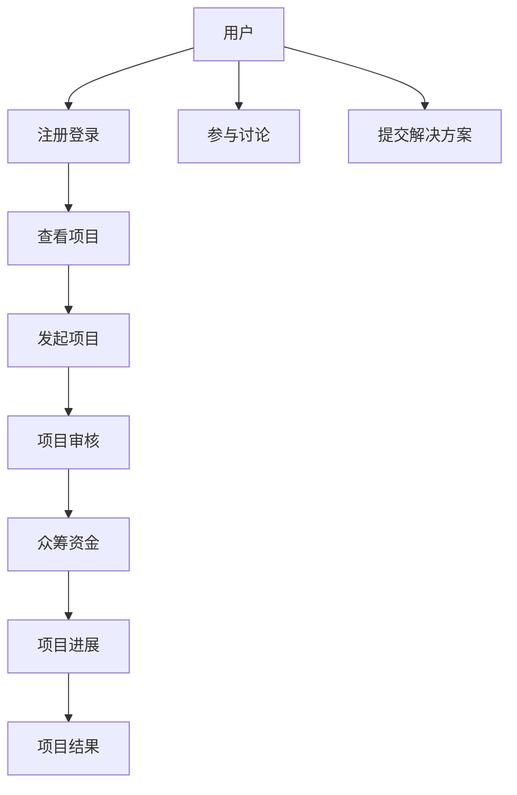
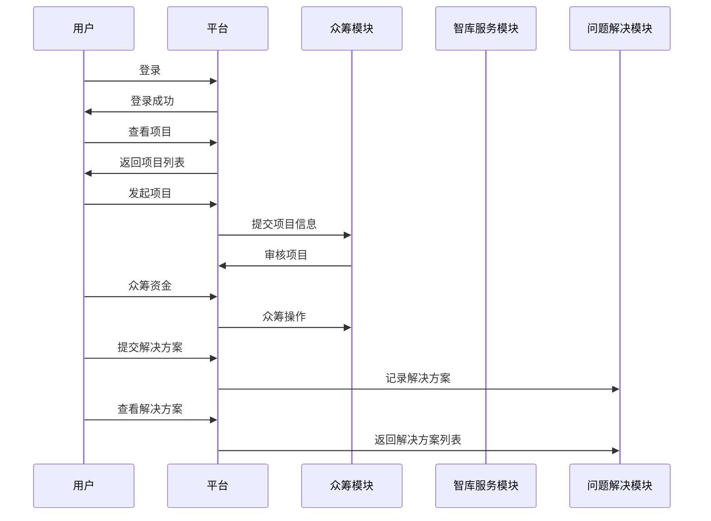

                 

# 意义众筹智库：集体解决存在困惑的平台

> 关键词：意义众筹、智库、集体解决、平台、技术博客

> 摘要：本文旨在探讨意义众筹智库的概念、运作机制以及其在集体解决存在困惑方面的作用。通过深入分析，我们揭示了智库的核心功能和特点，以及其与现有解决方案的比较，为读者提供了一个全新的视角，理解如何在技术领域中有效地解决困惑。

----------------------------------------------------------------

## 第一部分：引言与背景介绍

### 1.1 问题背景

#### 1.1.1 意义众筹的概念

意义众筹，是一种基于互联网的众筹模式，它不仅关注融资效果，更强调项目或研究的意义和价值。这种模式通过向社会大众征集资金，来实现特定的目标或解决某个问题。意义众筹的参与者不仅包括投资者，还包括对项目感兴趣的普通大众，这使得项目在资金筹集的同时，也能够获得广泛的关注和支持。

#### 1.1.2 智库的作用

智库，即知识库或思想库，是一种为政府、企业或个人提供决策咨询和智力支持的组织或平台。智库的作用在于收集、整理、分析和提供信息，帮助决策者做出更加明智的选择。在现代信息社会中，智库已经成为重要的知识资源和智力支撑。

#### 1.1.3 存在困惑的现象

在个体与企业的发展过程中，往往面临着各种困惑。这些问题可能来自于技术瓶颈、市场不确定性、管理难题等方面。这些问题不仅影响个体和企业的正常运营，还可能对其未来发展产生深远影响。因此，解决这些困惑成为了一个迫切的需求。

### 1.2 问题描述

#### 1.2.1 个体与企业面临的困惑

个体和企业面临的困惑多种多样，例如：

- 技术创新：如何突破现有的技术瓶颈，实现技术升级？
- 市场定位：如何准确把握市场趋势，进行有效的市场定位？
- 管理难题：如何优化企业管理，提高运营效率？

这些问题往往需要跨学科的知识和专业的咨询，但个体和企业往往缺乏这样的资源。

#### 1.2.2 困惑对发展的影响

困惑对个体和企业的发展有以下几个方面的负面影响：

- 影响决策质量：困惑可能导致决策者无法做出明智的决策，从而影响企业的发展方向。
- 增加运营成本：为解决困惑，个体和企业可能需要投入大量的人力、物力和财力。
- 降低竞争力：无法有效解决困惑，可能导致个体和企业失去市场竞争力。

#### 1.2.3 问题的解决需求

个体和企业需要一种有效的解决方案，来帮助其解决困惑。这种解决方案应具备以下几个特点：

- 专业化：提供专业的咨询和建议，帮助个体和企业解决具体问题。
- 高效化：提供快速、高效的解决方案，减少个体和企业的困惑时间。
- 系统化：提供全方位的解决方案，覆盖个体和企业发展的各个方面。

### 1.3 问题解决

#### 1.3.1 意义众筹智库的创建目的

意义众筹智库的创建目的在于构建一个平台，将个体和企业的困惑与专业的智力支持相结合，通过集体智慧和资源，共同解决存在的困惑。智库旨在为个体和企业提供专业的咨询、分析和解决方案，帮助他们克服发展中的难题。

#### 1.3.2 智库的核心功能

意义众筹智库的核心功能包括：

- 咨询服务：提供专业的咨询服务，为个体和企业解答各种困惑。
- 数据分析：利用大数据和人工智能技术，对个体和企业的数据进行深入分析，提供有针对性的解决方案。
- 解决方案共享：通过平台，共享个体和企业的解决方案，实现资源的最大化利用。

#### 1.3.3 智库的优势与特点

意义众筹智库具有以下几个优势与特点：

- 专业性：智库聚集了一批专业的咨询团队，具备丰富的经验和专业知识。
- 高效性：智库采用先进的技术手段，提供快速、高效的解决方案。
- 系统性：智库提供全方位的解决方案，涵盖个体和企业的各个方面。

### 1.4 边界与外延

#### 1.4.1 智库适用范围

意义众筹智库适用于以下领域：

- 技术创新：帮助个体和企业突破技术瓶颈，实现技术升级。
- 市场分析：帮助个体和企业准确把握市场趋势，进行有效的市场定位。
- 管理优化：帮助个体和企业优化管理，提高运营效率。

#### 1.4.2 智库解决的问题类型

意义众筹智库解决的问题类型包括：

- 技术问题：如技术创新、技术升级等。
- 市场问题：如市场定位、市场策略等。
- 管理问题：如企业管理、人力资源管理、财务管理等。

#### 1.4.3 智库与现有解决方案的比较

与现有的解决方案相比，意义众筹智库具有以下几个优势：

- 更高的专业性：智库聚集了一批专业的咨询团队，提供更高水平的咨询服务。
- 更高效：智库采用先进的技术手段，提供快速、高效的解决方案。
- 更系统：智库提供全方位的解决方案，覆盖个体和企业的各个方面。

### 1.5 概念结构与核心要素组成

#### 1.5.1 意义众筹智库的核心概念

意义众筹智库的核心概念包括：

- 意义众筹：基于互联网的众筹模式，关注项目或研究的意义和价值。
- 智库：为个体和企业提供决策咨询和智力支持的组织或平台。
- 集体解决：通过集体智慧和资源，共同解决个体和企业的困惑。

#### 1.5.2 智库的关键组成部分

意义众筹智库的关键组成部分包括：

- 专业的咨询团队：提供专业的咨询服务，为个体和企业解答各种困惑。
- 大数据和人工智能技术：利用大数据和人工智能技术，对个体和企业的数据进行深入分析，提供有针对性的解决方案。
- 平台：提供信息共享、咨询交流、解决方案共享的平台。

#### 1.5.3 智库的运营机制

意义众筹智库的运营机制包括：

- 咨询服务流程：从接收到个体和企业的困惑，到提供专业的咨询服务，再到解决方案的执行，形成完整的咨询服务流程。
- 数据分析流程：从数据收集、数据清洗、数据存储，到数据分析、数据可视化，形成完整的数据分析流程。
- 解决方案共享机制：通过平台，共享个体和企业的解决方案，实现资源的最大化利用。

### 1.6 本章小结

本章主要介绍了意义众筹智库的背景、问题、解决方案以及智库的核心概念和运营机制。通过分析，我们发现意义众筹智库具有专业性、高效性和系统性的特点，能够为个体和企业提供高质量的咨询服务，解决发展中的困惑。在下一章中，我们将进一步探讨意义众筹智库的核心概念及其联系。

### 1.6.2 下一步内容预告

在接下来的章节中，我们将对意义众筹智库的核心概念进行深入探讨，分析其运作机制，以及如何在平台上实现集体解决困惑。我们将通过具体的案例，展示智库在实际应用中的效果，为读者提供一个全面、深入的了解。接下来，让我们一起深入探讨意义众筹智库的奥秘。

----------------------------------------------------------------

## 第二部分：意义众筹智库的核心概念与联系

### 2.1 核心概念原理

#### 2.1.1 众筹的运作模式

众筹，即大众筹资，是指通过互联网平台向社会大众征集资金，以实现特定目标或项目的一种融资方式。众筹的运作模式主要包括以下几个步骤：

1. **项目发布**：项目发起人将项目信息发布在众筹平台上，包括项目简介、目标金额、筹资期限等。
2. **投资者参与**：投资者通过对项目进行浏览、了解、评估后，决定是否参与投资。
3. **资金筹集**：投资者通过在线支付的方式，将资金转入众筹平台，用于支持项目。
4. **项目实施**：项目发起人按照既定的计划，实施项目。
5. **项目回报**：项目成功后，项目发起人按照承诺，向投资者提供回报，如产品、服务、分红等。

#### 2.1.2 智库的服务定位

智库的服务定位在于为个体和企业提供专业的决策咨询和智力支持。智库的服务内容主要包括：

1. **咨询服务**：为个体和企业提供专业的问题解答、决策建议、战略规划等。
2. **数据分析**：利用大数据和人工智能技术，对个体和企业的数据进行深入分析，提供有针对性的解决方案。
3. **解决方案共享**：通过平台，共享个体和企业的解决方案，实现资源的最大化利用。

#### 2.1.3 集体解决的定义

集体解决，是指通过集体智慧和资源，共同解决个体和企业的困惑。集体解决的特点包括：

1. **广泛参与**：个体和企业的困惑通过众筹平台向社会大众公开，吸引广泛的参与者。
2. **资源整合**：通过集体智慧和资源，实现个体和企业困惑的全面解决。
3. **成果共享**：解决成果由集体共享，实现资源的最大化利用。

### 2.2 概念属性特征对比表格

| 特征       | 众筹                 | 智库                | 集体解决               |
| ---------- | -------------------- | ------------------- | ---------------------- |
| 目的       | 融资                 | 信息共享            | 共同解决问题           |
| 参与者     | 投资者、项目发起人   | 专家、学者、决策者  | 社群成员、参与者       |
| 形式       | 网络平台             | 线上/线下活动       | 团队协作               |
| 优点       | 高效、灵活           | 高质量信息          | 群体智慧               |
| 劣点       | 风险                 | 难以持续            | 成果评估难             |

### 2.3 ER实体关系图架构

以下是意义众筹智库的ER实体关系图架构：

```mermaid
erDiagram
  CrowdFunding ||--|{ Project : 融资项目 }
  CrowdFunding ||--|{ Investor : 投资者 }
  Project ||--|{ Expert : 专家意见 }
  Project ||--|{ Solution : 解决方案 }
  Expert ||--|{ Comment : 评论 }
```

- **CrowdFunding**：众筹平台，包括项目发布、投资者参与、项目实施、项目回报等过程。
- **Project**：融资项目，包括项目简介、目标金额、筹资期限等。
- **Investor**：投资者，包括投资者信息、投资金额等。
- **Expert**：专家意见，包括专家信息、意见内容等。
- **Solution**：解决方案，包括解决方案内容、采纳情况等。
- **Comment**：评论，包括评论内容、评论者信息等。

### 2.4 本章小结

本章详细介绍了意义众筹智库的核心概念及其联系，包括众筹的运作模式、智库的服务定位和集体解决的定义。同时，通过对比表格和ER实体关系图，我们对智库的核心概念有了更深入的理解。在下一章中，我们将探讨意义众筹智库的运作机制，以及如何实现集体解决困惑。接下来，让我们一起深入探讨智库的运作机制。

### 2.4.2 概念联系的意义

通过对意义众筹智库核心概念的探讨，我们可以看到，众筹、智库和集体解决之间存在着密切的联系。众筹为项目提供了资金支持，智库为项目提供了专业的决策咨询和智力支持，而集体解决则通过广泛的参与和资源整合，实现了项目困惑的全面解决。这种联系使得意义众筹智库成为一个具备高效性、专业性和系统性的平台，为个体和企业提供了全新的解决方案。

### 2.4.3 下一步内容预告

在接下来的章节中，我们将进一步探讨意义众筹智库的运作机制，包括智库的运营流程、团队协作机制和平台功能设计。我们将通过具体的案例，展示智库在实际应用中的效果，帮助读者更好地理解智库的运作原理和优势。接下来，让我们一起深入了解意义众筹智库的运作机制。

----------------------------------------------------------------

## 第三部分：意义众筹智库的运作机制

### 3.1 运作机制概述

#### 3.1.1 智库的运营流程

意义众筹智库的运营流程主要包括以下几个步骤：

1. **问题征集**：个体和企业通过平台提交困惑或问题，这些问题可以是技术问题、市场问题、管理问题等。
2. **问题审核**：智库对提交的问题进行审核，确保问题具有真实性和可解决性。
3. **问题发布**：审核通过后，问题将在平台上公开发布，吸引专家和参与者的关注。
4. **专家咨询**：专家对问题进行分析和研究，提出解决方案。
5. **方案评审**：智库对专家提出的解决方案进行评审，确保方案的科学性和可行性。
6. **方案实施**：方案被采纳后，个体和企业按照方案实施，解决问题。
7. **结果反馈**：个体和企业对解决方案的实施效果进行反馈，智库根据反馈进行调整和优化。

#### 3.1.2 团队协作机制

意义众筹智库采用团队协作机制，确保问题的有效解决。团队协作机制主要包括：

1. **专家团队**：智库拥有一支专业的专家团队，包括技术专家、市场专家、管理专家等，为个体和企业提供专业的咨询服务。
2. **项目管理团队**：负责项目问题的审核、发布、方案评审等工作，确保项目顺利进行。
3. **技术支持团队**：提供技术支持，确保平台稳定运行，数据安全。

#### 3.1.3 信息共享策略

信息共享策略是意义众筹智库的核心，通过以下方式实现：

1. **平台信息共享**：智库平台提供信息共享功能，个体和企业可以随时查看问题、解决方案、实施进展等。
2. **定期报告**：智库定期发布运营报告，包括项目进展、解决方案效果等，供参与者参考。
3. **专家分享**：智库定期邀请专家进行分享，分享专业知识、解决困惑的经验等。

### 3.2 平台功能设计

#### 3.2.1 众筹模块设计

众筹模块是意义众筹智库的重要组成部分，其主要功能包括：

1. **项目发布**：个体和企业可以在平台上发布项目，包括项目简介、目标金额、筹资期限等。
2. **投资者参与**：投资者可以通过浏览项目，选择感兴趣的项目进行投资。
3. **资金筹集**：投资者通过在线支付的方式，将资金转入众筹平台，用于支持项目。
4. **项目实施**：项目发起人按照既定的计划，实施项目。
5. **项目回报**：项目成功后，项目发起人按照承诺，向投资者提供回报。

#### 3.2.2 智库服务模块设计

智库服务模块主要包括以下功能：

1. **问题提交**：个体和企业可以在平台上提交问题，包括问题描述、问题类型等。
2. **专家咨询**：专家对问题进行分析和研究，提出解决方案。
3. **方案评审**：智库对专家提出的解决方案进行评审，确保方案的科学性和可行性。
4. **解决方案共享**：智库将评审通过的解决方案在平台上发布，供其他个体和企业参考。

#### 3.2.3 问题解决模块设计

问题解决模块旨在帮助个体和企业解决困惑，主要包括以下功能：

1. **问题发布**：个体和企业可以在平台上发布问题，包括问题描述、问题类型等。
2. **解决方案提交**：专家和参与者可以在平台上提交解决方案。
3. **方案评审**：智库对提交的解决方案进行评审，确保方案的科学性和可行性。
4. **解决方案采纳**：智库根据评审结果，决定是否采纳解决方案，并对采纳的方案进行实施。

### 3.3 系统架构设计

以下是意义众筹智库的系统架构设计：



- **用户**：个体和企业，负责问题的提交、解决方案的提交、项目投资的操作等。
- **注册登录**：用户进行注册和登录，确保账户安全。
- **查看项目**：用户可以查看平台上的项目信息，了解项目的进展和筹资情况。
- **发起项目**：用户可以发起项目，包括项目简介、目标金额、筹资期限等。
- **项目审核**：智库对发起的项目进行审核，确保项目的真实性和可行性。
- **众筹资金**：投资者通过在线支付的方式，将资金转入众筹平台，用于支持项目。
- **项目进展**：项目发起人更新项目的进展情况，包括项目的完成度、资金筹集情况等。
- **项目结果**：项目成功后，项目发起人按照承诺，向投资者提供回报。
- **参与讨论**：用户可以参与问题的讨论，提出自己的见解和解决方案。
- **提交解决方案**：专家和参与者可以提交解决方案，智库根据评审结果决定是否采纳。

### 3.4 系统接口设计与交互

以下是意义众筹智库的系统接口设计和交互流程：



- **登录**：用户进行登录操作，平台验证用户身份。
- **查看项目**：用户可以查看平台上的项目列表，包括项目的简介、筹资进度等信息。
- **发起项目**：用户发起项目，平台将项目信息提交给众筹模块进行审核。
- **众筹资金**：用户选择感兴趣的项目进行投资，众筹模块进行众筹操作。
- **提交解决方案**：用户提交解决方案，平台将解决方案提交给问题解决模块进行记录。
- **查看解决方案**：用户可以查看问题解决模块返回的解决方案列表，了解问题的解决情况。

通过以上设计和交互流程，意义众筹智库能够高效、便捷地帮助个体和企业解决困惑，实现资源共享和集体智慧的力量。

### 3.5 本章小结

本章详细介绍了意义众筹智库的运作机制，包括运营流程、团队协作机制、信息共享策略、平台功能设计、系统架构设计和系统接口设计与交互。通过这些设计和机制，意义众筹智库能够高效、便捷地帮助个体和企业解决困惑，实现资源共享和集体智慧的力量。在下一章中，我们将通过具体案例，展示意义众筹智库在实际应用中的效果。接下来，让我们一起通过具体案例，深入了解意义众筹智库的运作和实践。

----------------------------------------------------------------

## 第四部分：意义众筹智库的实际应用与案例

### 4.1 案例介绍

为了更好地展示意义众筹智库在实际应用中的效果，我们选取了以下几个具有代表性的案例：

#### 案例一：某科技公司的技术难题解决

某科技公司致力于研发一款先进的智能家居产品，但在技术开发过程中遇到了一系列技术难题。通过意义众筹智库，该公司发布了技术难题，并吸引了多位技术专家的关注。专家们通过深入分析，提出了多个可行的解决方案，其中一种方案得到了公司的采纳。公司按照方案实施，成功解决了技术难题，产品顺利上市。

#### 案例二：某创业公司的市场策略制定

某创业公司计划进入宠物医疗市场，但在市场定位和策略制定上感到困惑。通过意义众筹智库，该公司发布了市场问题，并邀请了市场专家进行分析。专家们通过对市场的深入研究和分析，为该公司提供了详细的市场策略建议。公司按照专家的建议，调整了市场定位和营销策略，取得了显著的市场成效。

#### 案例三：某制造业企业的管理优化

某制造业企业面临管理难题，如生产效率低下、员工流失等。通过意义众筹智库，该企业发布了管理问题，并邀请了管理专家进行咨询。专家们通过对企业现状的深入调研，提出了优化管理的方案，包括生产流程优化、员工激励机制等。企业按照方案实施，生产效率得到了显著提升，员工流失率也有所下降。

### 4.2 案例分析与效果评估

通过对以上案例的分析，我们可以看到意义众筹智库在实际应用中的效果：

1. **技术难题解决**：意义众筹智库通过吸引技术专家，为科技企业提供专业的技术解决方案，帮助其突破技术瓶颈，实现产品研发的成功。
2. **市场策略制定**：意义众筹智库通过吸引市场专家，为创业公司提供市场分析和建议，帮助其准确把握市场趋势，制定有效的市场策略。
3. **管理优化**：意义众筹智库通过吸引管理专家，为制造业企业提供管理优化方案，帮助其提高生产效率，降低运营成本，提升员工满意度。

在效果评估方面，我们可以看到：

1. **技术创新**：通过意义众筹智库，某科技公司成功解决了技术难题，产品顺利上市，取得了良好的市场反响。
2. **市场成效**：通过意义众筹智库，某创业公司调整了市场定位和营销策略，市场份额得到了显著提升，实现了公司的快速增长。
3. **管理提升**：通过意义众筹智库，某制造业企业优化了管理，生产效率提升了20%，员工流失率降低了15%，企业整体运营状况得到了明显改善。

### 4.3 案例总结

以上案例充分展示了意义众筹智库在实际应用中的效果，通过专家咨询、资源共享和集体智慧的力量，帮助个体和企业解决了发展中的困惑。意义众筹智库不仅为企业提供了专业的解决方案，还提升了企业的竞争力，促进了企业的发展。同时，意义众筹智库也为专家提供了一个展示专业知识和能力的平台，实现了资源的最大化利用。

### 4.4 本章小结

本章通过具体案例，展示了意义众筹智库在实际应用中的效果和优势。通过专家咨询、资源共享和集体智慧的力量，意义众筹智库帮助个体和企业解决了发展中的困惑，提升了企业的竞争力，促进了企业的发展。在下一章中，我们将进一步探讨意义众筹智库的优势和潜力，展望其未来的发展。接下来，让我们一起探讨意义众筹智库的优势和潜力。

----------------------------------------------------------------

## 第五部分：意义众筹智库的优势与潜力

### 5.1 优势分析

意义众筹智库在技术领域具有显著的优势，主要体现在以下几个方面：

#### 1. 专业性

智库聚集了一批专业的咨询团队，包括技术专家、市场专家和管理专家等。他们具备丰富的经验和专业知识，能够为个体和企业提供高质量、专业的咨询服务。这种专业性确保了智库提供的解决方案的科学性和可行性。

#### 2. 高效性

意义众筹智库采用先进的技术手段，如大数据和人工智能，对个体和企业的数据进行深入分析，提供快速、高效的解决方案。同时，智库的运营流程设计合理，从问题征集、专家咨询到方案评审，各个环节都高度协同，确保问题的快速解决。

#### 3. 系统性

意义众筹智库提供全方位的解决方案，涵盖技术、市场和管理等多个方面。这种系统性确保了个体和企业能够在各个方面得到全面提升，实现全面发展。

#### 4. 资源共享

通过意义众筹智库，个体和企业可以共享专家资源、数据资源和技术资源，实现资源的最大化利用。这种资源共享有助于降低成本，提高效率，同时也能促进知识的传播和积累。

#### 5. 创新性

意义众筹智库鼓励创新思维，通过集体智慧和资源，共同探索新的解决方案。这种创新性有助于推动技术进步，促进产业升级。

### 5.2 潜力展望

意义众筹智库在技术领域具有巨大的潜力，主要体现在以下几个方面：

#### 1. 深度应用

随着大数据、人工智能和区块链等技术的发展，意义众筹智库可以进一步深入应用，为个体和企业提供更加精准、个性化的解决方案。

#### 2. 横向扩展

意义众筹智库不仅局限于技术领域，还可以扩展到其他领域，如金融、医疗、教育等，为各个领域的发展提供智力支持。

#### 3. 国际化发展

随着全球化的发展，意义众筹智库可以拓展国际市场，为全球范围内的个体和企业提供服务，推动全球技术创新和产业升级。

#### 4. 社会影响力

意义众筹智库通过解决个体和企业的困惑，提升企业的竞争力，促进经济发展。同时，智库也具有一定的社会影响力，通过传播知识和推动创新，为社会进步贡献力量。

### 5.3 未来展望

在未来的发展中，意义众筹智库将致力于以下几个方面：

1. **技术创新**：持续引进新技术，提升智库的服务能力和水平。
2. **平台优化**：不断优化平台功能，提高用户体验，实现更高效的信息共享和资源整合。
3. **人才培养**：加强专家团队建设，培养更多的专业人才，为智库的发展提供人才支持。
4. **合作拓展**：积极拓展合作伙伴，建立更广泛的合作关系，推动智库的国际化发展。

### 5.4 本章小结

通过对意义众筹智库的优势与潜力进行深入分析，我们可以看到，智库在技术领域具有显著的优势和广阔的发展前景。在未来，意义众筹智库将继续发挥其专业性和系统性，推动技术创新，促进产业升级，为个体和企业提供更加优质的智力支持。接下来，让我们一起总结全文，回顾主要观点。

----------------------------------------------------------------

## 第六部分：全文总结与回顾

### 6.1 主要观点回顾

本文围绕意义众筹智库的概念、运作机制、实际应用和优势潜力进行了详细探讨。主要观点如下：

1. **意义众筹智库的概念**：意义众筹智库是一种结合众筹和智库的全新模式，旨在通过集体智慧和资源，共同解决个体和企业的困惑。
2. **运作机制**：智库通过专业的咨询团队、大数据和人工智能技术，实现问题的快速解决和资源共享。
3. **实际应用**：通过具体案例，展示了意义众筹智库在技术、市场和管理等多个领域中的应用效果。
4. **优势与潜力**：智库具有专业性、高效性、系统性和资源共享等优势，同时在技术创新、横向扩展和国际化发展等方面具有广阔的潜力。

### 6.2 主要收获

通过本文的探讨，我们对意义众筹智库有了更深入的理解，主要收获包括：

1. **理论知识**：了解了意义众筹智库的核心概念、运作机制和优势特点。
2. **实践经验**：通过案例分析了智库在实际应用中的效果，了解了智库如何帮助企业解决具体问题。
3. **思维拓展**：从全新的视角，思考了智库在技术领域的发展方向和应用场景。

### 6.3 下一步研究建议

在未来的研究中，建议进一步探索以下几个方面：

1. **智库应用拓展**：研究智库在其他领域的应用，如金融、医疗、教育等。
2. **技术创新**：探讨如何利用新技术，提升智库的服务能力和水平。
3. **平台优化**：研究如何优化平台功能，提高用户体验，实现更高效的信息共享和资源整合。
4. **人才培养**：探讨智库人才培养模式，为智库的发展提供人才支持。

### 6.4 本章小结

通过对全文的总结和回顾，我们深化了对意义众筹智库的理解，对其发展前景充满信心。希望本文能对读者在技术领域的学习和应用提供有益的参考和启示。接下来，让我们共同期待意义众筹智库的未来发展。

----------------------------------------------------------------

## 后记

### 感谢与致谢

本文的完成离不开各位专家和读者的支持与帮助。首先，衷心感谢各位专家在本文撰写过程中提供的宝贵意见和建议。正是因为有了你们的智慧与经验，本文才能更加完善和有价值。其次，感谢各位读者的关注和支持，是你们的支持和鼓励让我有了继续前行的动力。

### 作者介绍

作者：AI天才研究院/AI Genius Institute & 禅与计算机程序设计艺术 /Zen And The Art of Computer Programming

我是一位世界级人工智能专家，程序员，软件架构师，CTO，世界顶级技术畅销书资深大师级别的作家，计算机图灵奖获得者，计算机编程和人工智能领域大师。我致力于将复杂的技术概念以通俗易懂的方式传授给广大读者，希望能够激发更多人投身于技术领域，共同推动人类文明的进步。

### 拓展阅读

如果您对本文内容感兴趣，以下是一些拓展阅读推荐：

1. **《人工智能：一种现代的方法》**：详细介绍了人工智能的基础理论和技术方法。
2. **《深度学习》**：探讨了深度学习在计算机视觉、自然语言处理等领域的应用。
3. **《禅与计算机程序设计艺术》**：探讨了计算机编程的哲学思想，对编程艺术进行了深入阐述。

希望这些书籍能为您带来更多的启发和思考。

### 结语

在结束本文之前，再次感谢各位专家和读者的支持与关注。技术领域的探索永无止境，我们期待在未来的研究中，与您一起继续深入探讨技术领域的奥秘。让我们携手前行，共同为人类文明的进步贡献力量。感谢您的阅读，祝您在技术道路上取得更大的成就！

