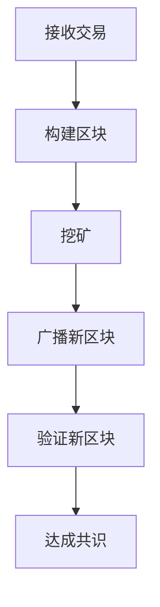
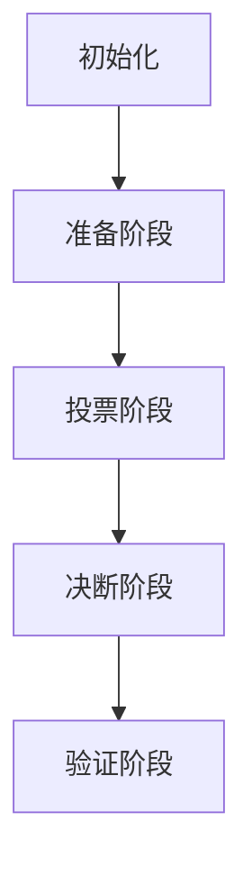
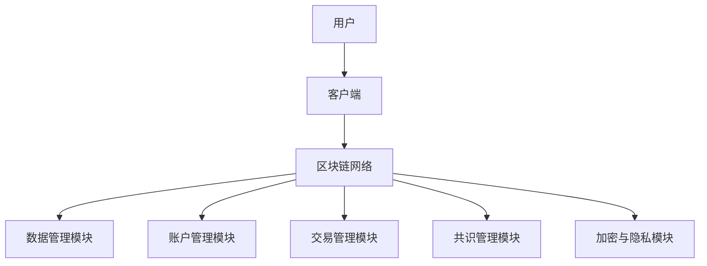
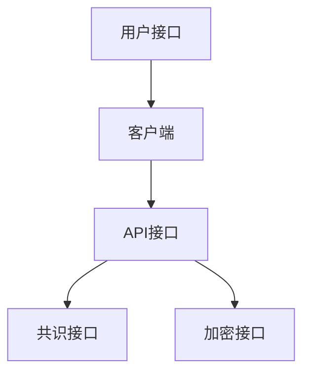
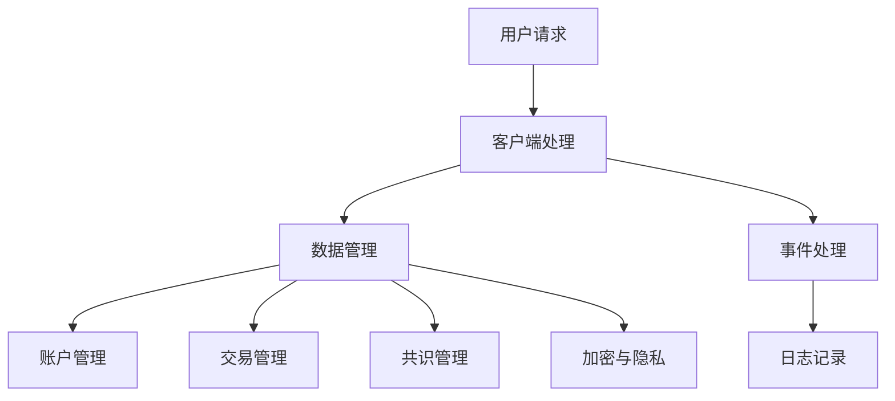

                 

### 摘要

区块链生态系统，作为一个去中心化的价值交换网络，正逐渐改变着传统的商业和社会运作模式。本文旨在深入探讨区块链生态系统的基本概念、核心组件、关键算法以及其实际应用，以帮助读者全面理解这一前沿技术。文章首先介绍区块链的定义和其演变历程，接着详细解析区块链生态系统中的核心概念，如去中心化和价值交换网络。然后，我们通过对比表格和实体关系图，加深对概念的理解。接下来，文章逐步讲解区块链生态系统中的关键算法，包括共识算法和加密算法，通过流程图和代码示例，使读者能够直观地理解其工作原理。文章进一步深入分析区块链生态系统的架构设计，包括功能模块、系统架构图、接口设计等，并通过具体项目实战案例，展示区块链生态系统的实际应用和实现细节。最后，文章总结最佳实践和注意事项，提供拓展阅读资源，帮助读者进一步探索这一领域。通过本文的逐步分析，读者将能够全面、深入地理解区块链生态系统，为其在实践中的应用奠定坚实基础。

## 背景介绍

区块链，作为一种分布式账本技术，最初由中本聪（Satoshi Nakamoto）在2008年提出，并在2009年实现了第一个区块链系统——比特币（Bitcoin）。区块链的核心在于去中心化，通过加密技术和共识算法，确保数据的不可篡改和可靠传输。随着比特币的成功，区块链技术逐渐被学术界和产业界关注，并在多个领域得到应用和发展。

### 区块链的定义

区块链可以看作是一种由多个数据区块串联而成的链式结构，每个区块包含一定数量的交易记录，并通过密码学技术确保其不可篡改。每个区块都与前一个区块通过加密方式链接，形成一个完整的区块链。这种链接机制不仅保证了数据的完整性，也防止了任何未经授权的篡改。

### 区块链的发展历程

区块链的发展可以分为几个阶段：

1. **区块链1.0（货币阶段）**：以比特币为代表，区块链主要被用作数字货币的底层技术，实现了去中心化的货币交易。

2. **区块链2.0（智能合约阶段）**：以太坊（Ethereum）的推出，使得区块链不再局限于货币交易，通过智能合约，实现了更复杂的去中心化应用。

3. **区块链3.0（生态系统阶段）**：区块链技术逐渐应用于更多领域，如供应链管理、身份认证、数字资产等，形成了完整的区块链生态系统。

### 区块链的原理与特点

区块链的原理主要包括三个核心部分：分布式账本、共识算法和加密技术。

1. **分布式账本**：区块链通过多个节点（计算机）共同维护一个共享账本，确保数据的透明和不可篡改。

2. **共识算法**：共识算法是区块链网络中节点达成一致的重要机制，通过算法，节点能够确定哪个交易是有效的，从而更新账本。

3. **加密技术**：区块链使用加密技术确保数据的安全性和隐私性，包括哈希函数、数字签名和加密算法等。

区块链的特点包括：

- **去中心化**：区块链不依赖于任何中央机构，而是通过分布式网络维护数据，提高了系统的容错性和抗攻击能力。

- **不可篡改性**：区块链的数据一旦被记录，就几乎无法被篡改，确保了数据的真实性和可靠性。

- **透明性**：区块链上的数据对所有节点可见，提高了交易的透明度，减少了信息不对称。

- **安全性**：区块链使用加密技术保护数据，确保了数据的安全性和隐私性。

### 区块链生态系统的组成

区块链生态系统包括多个组成部分，其中关键部分有：

- **区块链网络**：由多个节点组成，共同维护区块链数据。

- **节点**：节点是区块链网络的基本组成单位，负责验证交易、维护区块链数据等。

- **挖矿**：在区块链网络中，节点通过解决数学难题（如工作量证明算法），获取新区块的记账权。

- **智能合约**：智能合约是区块链上的可编程合约，自动执行满足条件的交易。

- **去中心化应用（DApp）**：DApp是基于区块链的应用程序，利用区块链的特性实现去中心化服务。

### 区块链与其他技术的融合

区块链技术不仅独立发展，还与其他技术深度融合，形成了更强大的生态系统。这些技术包括：

- **物联网（IoT）**：区块链可以用于物联网设备之间的安全通信和数据交换。

- **人工智能（AI）**：区块链可以为AI系统提供一个可信的数据来源，确保数据的一致性和安全性。

- **大数据**：区块链可以用于存储和验证大数据，确保数据的安全性和可靠性。

- **云计算**：区块链与云计算的结合，可以提供更高效、安全的分布式计算服务。

### 区块链在现实世界中的应用案例

区块链技术已经在多个领域得到应用，以下是几个典型的应用案例：

- **供应链管理**：区块链技术可以用于跟踪商品从生产到销售的整个过程，确保供应链的透明和高效。

- **数字身份认证**：区块链可以用于建立去中心化的身份认证系统，确保用户的隐私和安全。

- **数字资产交易**：区块链可以为数字资产提供一个安全、透明的交易环境，如加密货币和数字股票。

- **医疗记录管理**：区块链可以用于存储和管理医疗记录，确保数据的安全性和隐私性。

通过上述背景介绍，我们可以看到，区块链生态系统不仅具有强大的技术基础，还在不断拓展其应用领域，逐渐改变着传统的商业和社会运作模式。接下来，我们将进一步深入探讨区块链生态系统的核心概念和关键算法。

### 去中心化与价值交换网络

去中心化和价值交换网络是区块链生态系统中的两个核心概念，它们共同构成了区块链技术的核心优势，也是区块链区别于传统中心化系统的重要特征。

#### 去中心化的定义与优势

去中心化（Decentralization）是指系统或组织的管理和控制权力分散到多个参与者手中，而非集中于单一实体。在区块链生态系统中，去中心化意味着：

- **无中心机构**：区块链网络由多个节点组成，每个节点都可以参与网络的维护和数据的验证，不存在单一的权威机构。
- **去信任**：在去中心化系统中，节点之间无需互信即可进行数据交换，而是依赖于共识算法和加密技术确保数据的一致性和安全性。
- **抗攻击性**：由于没有单一的中心点，区块链系统在遭受攻击时具有更强的抗攻击性。

去中心化带来了多方面的优势：

1. **提高容错性**：由于数据分布在多个节点，即使某些节点出现故障，系统仍能正常运行。
2. **降低信任成本**：去中心化减少了依赖中心机构的信任成本，使得系统更加高效和可信。
3. **减少单点故障**：去中心化降低了系统因单点故障而崩溃的风险。

#### 去中心化的挑战

尽管去中心化具有诸多优势，但其在实际应用中也面临着一些挑战：

1. **性能瓶颈**：区块链作为分布式系统，在处理大量交易时可能会出现性能瓶颈，如比特币的每秒交易数（TPS）较低。
2. **安全性问题**：尽管区块链具有高度的安全性，但节点之间的恶意行为和网络攻击仍是不可忽视的风险。
3. **监管问题**：去中心化系统可能难以进行有效监管，特别是在涉及金融和信息安全等领域。

#### 价值交换网络的定义与实现

价值交换网络是指在去中心化系统中，参与者通过区块链技术进行价值（如货币、数字资产、服务等）的交换和转移。价值交换网络的关键在于：

- **透明性**：所有交易记录都存储在区块链上，透明且不可篡改，确保交易的公正和可信。
- **安全性**：通过加密技术和共识算法，确保交易过程的安全性和数据完整性。
- **自动执行**：智能合约使得交易条件一旦满足，即可自动执行，减少了人为干预和中介成本。

实现价值交换网络的关键步骤包括：

1. **共识机制**：节点通过共识算法达成一致，确保交易的顺序和有效性。
2. **智能合约**：智能合约编写交易规则，自动执行交易。
3. **加密技术**：使用加密技术保护交易数据和参与者隐私。

#### 去中心化应用（DApp）的开发与部署

去中心化应用（DApp）是基于区块链的应用程序，旨在利用区块链的特性实现去中心化服务。开发与部署DApp的主要步骤如下：

1. **需求分析**：确定DApp的业务需求和功能。
2. **设计智能合约**：编写智能合约，实现业务逻辑。
3. **前端开发**：开发用户界面，使用JavaScript框架（如React、Vue等）。
4. **后端服务**：提供与区块链节点的通信服务，实现数据的上链和查询。
5. **部署与测试**：部署DApp到区块链网络，进行功能测试和安全审计。
6. **上线与运营**：DApp上线后，进行用户培训和运营管理。

通过上述分析，我们可以看到，去中心化和价值交换网络是区块链生态系统的核心概念，它们共同构建了一个去中心化、透明、安全的网络环境，为各种应用场景提供了全新的解决方案。在接下来的部分，我们将进一步深入探讨区块链生态系统中的关键算法，如共识算法和加密算法，帮助读者更全面地理解这一前沿技术。

### 核心概念解析与联系

在深入探讨区块链生态系统之前，我们有必要详细解析其中的核心概念，并分析它们之间的联系。以下是区块链生态系统的关键概念及其相互关系。

#### 区块链与分布式账本

区块链是一种分布式账本技术，它通过多个节点共同维护一个共享的账本，确保数据的透明性和不可篡改性。分布式账本的关键在于其去中心化特性，即不存在单一的中央控制机构，所有节点都具有相同的权限和义务。区块链与分布式账本之间的联系在于，区块链是实现分布式账本的一种具体技术手段。

#### 去中心化与共识算法

去中心化是区块链的核心特征，意味着系统权力分散到多个参与者手中。而共识算法是去中心化网络中确保所有节点达成一致的重要机制。共识算法通过数学难题（如工作量证明算法）和决策过程，确保网络中的所有节点对同一数据进行一致性处理。因此，去中心化与共识算法紧密相关，前者依赖后者来实现数据的可靠性和安全性。

#### 智能合约与价值交换网络

智能合约是一种嵌入在区块链中的可执行代码，它能够根据预设的条件自动执行特定的操作。智能合约使得区块链不仅仅是用于记录交易，还能够实现复杂的业务逻辑。价值交换网络是基于区块链的一种去中心化应用，它通过智能合约实现价值的交换和转移。因此，智能合约是价值交换网络的基石，而价值交换网络扩展了智能合约的应用场景。

#### 加密技术与数据隐私

加密技术是区块链安全性的重要保障，通过哈希函数、非对称加密和数字签名等手段，确保数据的完整性和隐私性。在区块链生态系统中，加密技术不仅用于保护交易数据，还用于验证参与者的身份和确保数据不被未授权访问。数据隐私与加密技术之间的联系在于，加密技术提供了实现数据隐私的技术手段。

#### 区块链与物联网

物联网（IoT）是连接物理设备和数字世界的网络，而区块链可以为物联网设备提供一个安全的通信和数据交换平台。区块链与物联网之间的联系在于，区块链可以确保物联网设备之间的数据传输是可信和安全的，同时，物联网设备生成的数据可以存储在区块链上，确保数据的一致性和不可篡改性。

#### 区块链与人工智能

人工智能（AI）在数据分析和决策支持方面具有显著优势，而区块链可以为AI系统提供一个可信的数据来源。区块链与人工智能之间的联系在于，区块链确保了数据的完整性和安全性，使得AI系统能够依赖于这些可信数据进行更准确的决策。此外，智能合约可以与AI算法结合，实现自动化的交易和执行。

#### 概念属性特征对比表格

为了更直观地理解这些核心概念，我们设计了一张概念属性特征对比表格：

| 概念       | 定义                                                         | 关键特性                                                       | 作用域                                       |
| ---------- | ------------------------------------------------------------ | ------------------------------------------------------------ | ------------------------------------------ |
| 区块链     | 分布式账本，由多个节点共同维护                               | 去中心化、不可篡改、透明性、安全性                           | 数据记录与验证                                 |
| 分布式账本 | 数据分布在多个节点上，无需中央机构控制                       | 去中心化、容错性、高可用性                                   | 数据存储与共享                                 |
| 去中心化   | 权力分散到多个参与者，不存在中心机构                          | 无中心点、去信任、抗攻击性                                   | 系统架构与安全性                               |
| 共识算法   | 确保网络中所有节点对同一数据进行一致性处理                    | 可靠性、安全性、高效性                                       | 数据同步与验证                                 |
| 智能合约   | 嵌入在区块链中的可执行代码，根据预设条件自动执行特定操作       | 自动执行、灵活性、减少中介成本                               | 业务逻辑实现与执行                             |
| 加密技术   | 使用加密算法保护数据完整性、隐私性和安全性                     | 不可逆、匿名性、数字签名                                     | 数据保护与验证                                 |
| 物联网     | 连接物理设备和数字世界的网络                                 | 高可靠性、实时性、自动性                                     | 设备通信与数据处理                             |
| 人工智能    | 利用数据分析和机器学习实现智能决策                            | 自动化、精确性、可扩展性                                     | 数据分析与决策支持                             |

#### ER实体关系图

为了更清晰地展示这些核心概念之间的联系，我们设计了一个ER（实体关系）图，如下图所示：

```mermaid
erDiagram
  区块链 ||--|{ 分布式账本 }
  区块链 ||--|{ 去中心化 }
  区块链 ||--|{ 共识算法 }
  区块链 ||--|{ 智能合约 }
  区块链 ||--|{ 加密技术 }
  区块链 ||--|{ 物联网 }
  区块链 ||--|{ 人工智能 }
  分布式账本 ||--|{ 数据记录与验证 }
  去中心化 ||--|{ 无中心点 }
  去中心化 ||--|{ 去信任 }
  去中心化 ||--|{ 抗攻击性 }
  共识算法 ||--|{ 数据同步与验证 }
  智能合约 ||--|{ 自动执行 }
  智能合约 ||--|{ 灵活性 }
  加密技术 ||--|{ 数据保护与验证 }
  物联网 ||--|{ 设备通信与数据处理 }
  人工智能 ||--|{ 数据分析与决策支持 }
```

通过上述解析与联系，我们可以更全面地理解区块链生态系统的核心概念，它们相互交织，共同构成了一个高效、安全、去中心化的网络环境。接下来，我们将深入探讨区块链生态系统中的关键算法，进一步揭示其工作原理和技术细节。

### 区块链核心算法详解

区块链生态系统中的核心算法包括共识算法和加密算法，它们是区块链安全性和去中心化特性的关键保障。下面，我们将详细解析这些算法，并通过流程图和代码示例，帮助读者深入理解其工作原理。

#### 工作量证明算法

工作量证明（Proof of Work，PoW）算法是区块链中最常见的共识算法，用于确保网络中的节点达成一致。PoW算法的基本原理是，节点需要通过解决一个数学难题来获取新区块的记账权。以下是PoW算法的基本步骤：

1. **节点接收交易**：节点从网络中接收未确认的交易，并将这些交易存储在内存池中。
2. **构建区块**：节点从内存池中选择一定数量的交易，构建一个待确认的区块。
3. **挖矿**：节点对区块进行挖矿，即通过计算找到一个新的随机数（nonce），使得区块的哈希值满足特定的条件（如小于目标难度）。
4. **广播新区块**：一旦找到合适的随机数，节点将新区块广播到网络中的其他节点。
5. **验证新区块**：其他节点接收新区块后，验证其有效性，如检查交易的有效性、区块的哈希值是否符合要求。
6. **达成共识**：如果新区块被大多数节点接受，网络达成共识，更新区块链。

以下是PoW算法的mermaid流程图：



#### 拜占庭容错算法

拜占庭容错算法（Byzantine Fault Tolerance，BFT）是一种专门为分布式系统设计的共识算法，用于处理网络中的恶意节点。BFT算法的基本原理是通过多个副本和投票机制，确保系统在存在恶意节点的情况下仍能达成一致。以下是BFT算法的基本步骤：

1. **初始化**：系统启动时，每个节点生成一个唯一标识，并与其他节点进行通信，建立网络拓扑结构。
2. **准备阶段**：每个节点准备发送一个准备消息（Prepare Message），包含它选择的值和证明。
3. **投票阶段**：收到准备消息后，节点发送一个承诺消息（Commit Message），表明它对某个值的支持。
4. **决断阶段**：如果大多数节点承诺了同一个值，则该值被确定为最终结果。
5. **验证阶段**：最终结果被广播到所有节点，节点验证其正确性，并更新本地状态。

以下是BFT算法的mermaid流程图：



#### 加密算法的应用

加密算法在区块链中用于保护数据的安全性和隐私性。以下是几种常用的加密算法：

1. **非对称加密算法**：非对称加密算法使用一对密钥（公钥和私钥），其中公钥用于加密，私钥用于解密。常见的非对称加密算法包括RSA和ECC。
   
   以下是一个使用Python实现RSA加密和解密的简单示例：

   ```python
   from Crypto.PublicKey import RSA
   from Crypto.Cipher import PKCS1_OAEP
   
   # 生成RSA密钥
   key = RSA.generate(2048)
   private_key = key.export_key()
   public_key = key.publickey().export_key()
   
   # 加密
   cipher = PKCS1_OAEP.new(RSA.import_key(public_key))
   encrypted_data = cipher.encrypt(b'Hello, World!')
   
   # 解密
   cipher = PKCS1_OAEP.new(RSA.import_key(private_key))
   decrypted_data = cipher.decrypt(encrypted_data)
   
   print(f'Encrypted: {encrypted_data.hex()}')
   print(f'Decrypted: {decrypted_data}')
   ```

2. **对称加密算法**：对称加密算法使用相同的密钥进行加密和解密。常见的对称加密算法包括AES和DES。

   以下是一个使用Python实现AES加密和解密的简单示例：

   ```python
   from Crypto.Cipher import AES
   from Crypto.Util.Padding import pad, unpad
   
   # 加密
   key = b'mysecretkey123'
   cipher = AES.new(key, AES.MODE_CBC)
   ct_bytes = cipher.encrypt(pad(b'Hello, World!', AES.block_size))
   iv = cipher.iv
   print(f'Encrypted: {ct_bytes.hex()}')
   print(f'IV: {iv.hex()}')
   
   # 解密
   cipher = AES.new(key, AES.MODE_CBC, iv)
   pt = unpad(cipher.decrypt(ct_bytes), AES.block_size)
   print(f'Decrypted: {pt}')
   ```

3. **哈希算法**：哈希算法用于确保数据的完整性和一致性，常见的哈希算法包括SHA-256和SHA-3。

   以下是一个使用Python实现SHA-256哈希的简单示例：

   ```python
   import hashlib
   
   # 哈希
   data = b'Hello, World!'
   hash_object = hashlib.sha256(data)
   hex_dig = hash_object.hexdigest()
   print(f'Hash: {hex_dig}')
   ```

通过上述解析和示例，我们可以看到区块链核心算法在确保区块链安全性、去中心化特性方面的重要作用。这些算法共同构建了区块链生态系统的基础，为各种去中心化应用提供了可靠的技术支持。在下一部分，我们将深入分析区块链生态系统的系统架构设计，探讨其功能模块、系统架构图、接口设计等。

### 区块链生态系统架构设计

区块链生态系统架构设计是确保系统功能实现、性能优化和安全保障的关键。本部分将详细讨论区块链生态系统的功能设计、系统架构设计、接口设计以及系统交互设计，通过具体的图示和代码分析，帮助读者全面理解区块链生态系统的架构。

#### 功能设计

区块链生态系统的功能设计涵盖了系统的主要模块和功能，这些模块共同构成了系统的整体功能。以下是区块链生态系统的主要功能模块：

1. **数据管理模块**：负责处理区块链的数据存储、检索和验证。
2. **账户管理模块**：负责用户身份验证、账户创建、权限管理等功能。
3. **交易管理模块**：负责处理区块链中的交易记录，包括交易创建、验证和广播。
4. **共识管理模块**：负责实现区块链的共识算法，确保网络中的所有节点达成一致。
5. **加密与隐私模块**：负责数据的加密和解密，确保数据的安全性和隐私性。

#### 系统架构设计

区块链生态系统的系统架构设计决定了系统的扩展性、可维护性和安全性。以下是一个简化的区块链生态系统架构图：



1. **数据管理模块**：数据管理模块负责处理区块链的数据存储、检索和验证。它通常包含以下几个子模块：
   - **区块管理**：处理区块的创建、存储和验证。
   - **交易管理**：处理交易记录的创建、验证和存储。
   - **数据索引**：提供快速检索和查询区块链数据的能力。

2. **账户管理模块**：账户管理模块负责用户身份验证、账户创建、权限管理等功能。它通常包含以下几个子模块：
   - **用户身份验证**：通过密码学技术验证用户的身份。
   - **账户创建**：为用户创建数字身份和账户。
   - **权限管理**：处理用户权限的分配和管理。

3. **交易管理模块**：交易管理模块负责处理区块链中的交易记录，包括交易创建、验证和广播。它通常包含以下几个子模块：
   - **交易创建**：根据用户需求创建交易记录。
   - **交易验证**：验证交易的有效性和合法性。
   - **交易广播**：将验证后的交易记录广播到网络中的其他节点。

4. **共识管理模块**：共识管理模块负责实现区块链的共识算法，确保网络中的所有节点达成一致。它通常包含以下几个子模块：
   - **共识算法实现**：根据不同的共识算法（如PoW、BFT）实现具体的共识逻辑。
   - **区块生成**：生成新的区块，并添加到区块链中。
   - **共识验证**：验证新区块的有效性，确保其符合共识规则。

5. **加密与隐私模块**：加密与隐私模块负责数据的加密和解密，确保数据的安全性和隐私性。它通常包含以下几个子模块：
   - **加密算法**：使用非对称加密和对称加密算法进行数据的加密和解密。
   - **数字签名**：使用数字签名技术验证数据的完整性和来源。
   - **隐私保护**：通过加密技术保护用户隐私，防止数据泄露。

#### 接口设计

区块链生态系统的接口设计决定了系统与其他系统或应用的交互方式。以下是区块链生态系统的主要接口设计：

1. **用户接口**：用户通过客户端与区块链系统进行交互，客户端提供友好的用户界面，支持用户操作和查询。
2. **API接口**：区块链系统提供API接口，供其他应用程序或系统调用，实现数据交换和功能调用。
3. **共识接口**：共识模块提供共识接口，供其他模块实现共识算法，确保网络一致性。
4. **加密接口**：加密与隐私模块提供加密接口，供其他模块进行数据加密和解密。

以下是区块链生态系统的接口设计图：



#### 系统交互设计

区块链生态系统的系统交互设计决定了系统内部模块之间的通信和数据流动。以下是区块链生态系统的主要交互设计：

1. **数据流**：区块链系统中的数据流包括交易记录、区块、用户请求等。数据流通过系统接口和模块之间的通信实现。
2. **控制流**：区块链系统的控制流包括用户操作、系统事件、共识决策等。控制流通过模块之间的消息传递和状态更新实现。
3. **事件流**：区块链系统中的事件流包括新区块生成、交易验证、用户登录等。事件流通过事件触发和响应机制实现。

以下是区块链生态系统的系统交互设计图：



通过上述分析，我们可以看到区块链生态系统架构设计的复杂性。每个模块都有其特定的功能，并通过接口和交互设计实现系统整体的功能。在下一部分，我们将通过具体的项目实战案例，展示区块链生态系统的实际应用和实现细节。

### 区块链生态系统项目实战

在本节中，我们将通过一个具体的项目实战案例，详细展示区块链生态系统在实际应用中的实现细节和操作流程。本案例将基于以太坊（Ethereum）平台，实现一个简单的去中心化应用（DApp），该DApp将提供一个基本的拍卖功能，用户可以在区块链上发布拍卖物品，其他用户可以参与竞价。

#### 项目背景与目标

该项目的目标是构建一个去中心化的在线拍卖平台，用户可以在这个平台上发布物品并设定起拍价，其他用户可以参与竞价，最终由出价最高者获得物品所有权。去中心化的拍卖平台将消除传统拍卖中的中介环节，提高交易效率，并确保交易过程的透明和安全。

#### 环境安装与配置

在开始项目之前，我们需要安装和配置开发环境。以下是环境安装与配置的步骤：

1. **安装Node.js**：Node.js是一个基于Chrome V8引擎的JavaScript运行环境，用于开发以太坊客户端和DApp前端。

   ```bash
   npm install -g nodejs
   ```

2. **安装Ganache**：Ganache是一个以太坊的本地测试网络，用于快速部署和测试智能合约。

   ```bash
   npm install -g ganache-cli
   ganache
   ```

3. **安装Truffle**：Truffle是一个以太坊开发框架，提供智能合约的开发、编译、部署和测试功能。

   ```bash
   npm install -g truffle
   ```

4. **安装Metamask**：Metamask是一个浏览器扩展插件，用于与以太坊网络进行交互。

   ```bash
   chrome web store search Metamask
   ```

   安装并配置Metamask，确保浏览器扩展已正确连接到本地测试网络。

#### 系统核心实现

该项目的核心实现包括智能合约编写、前端界面设计和后端服务部署。以下是详细步骤：

1. **智能合约编写**：

   我们将使用Truffle框架编写和部署智能合约。以下是简单的拍卖合约代码示例：

   ```solidity
   // SPDX-License-Identifier: MIT
   pragma solidity ^0.8.0;

   contract Auction {
       address public owner;
       uint public endAt;
       uint public highestBid;
       address public highestBidder;

       constructor(uint _duration) {
           owner = msg.sender;
           endAt = now + _duration;
       }

       function bid() public payable {
           require(now < endAt, "Auction ended.");
           require(msg.value > highestBid, "Bid too low.");

           if (highestBidder != address(0)) {
               payable(highestBidder).transfer(highestBid);
           }

           highestBid = msg.value;
           highestBidder = msg.sender;
       }

       function withdraw() public {
           require(msg.sender == owner, "Only owner can withdraw.");
           payable(owner).transfer(address(this).balance);
       }
   }
   ```

   在Truffle项目中，我们还需要编写一个` migrations`文件夹，用于定义智能合约的部署脚本。

2. **前端界面设计**：

   使用React框架实现DApp的前端界面。以下是简单的拍卖前端代码示例：

   ```jsx
   import React, { useState, useEffect } from 'react';
   import Web3 from 'web3';
   import { Contract } from 'ethers';

   const Auction = () => {
       const [web3, setWeb3] = useState(null);
       const [auction, setAuction] = useState(null);

       useEffect(() => {
           if (window.ethereum) {
               const web3 = new Web3(window.ethereum);
               setWeb3(web3);
           }
       }, []);

       const connectWallet = () => {
           window.ethereum.request({ method: 'eth_requestAccounts' });
       };

       const startAuction = async () => {
           if (web3) {
               const auctionContract = new web3.eth.Contract(AUCTION_ABI, AUCTION_ADDRESS);
               const duration = 3600; // 1 hour
               const tx = await auctionContract.methods.startAuction(duration).send({ from: web3.selectedAddress, value: web3.utils.toWei('0.01', 'ether') });
               setAuction(tx.events.AuctionStart.returnValues);
           }
       };

       const bid = async () => {
           if (web3) {
               const auctionContract = new web3.eth.Contract(AUCTION_ABI, AUCTION_ADDRESS);
               const tx = await auctionContract.methods.bid().send({ from: web3.selectedAddress, value: web3.utils.toWei('0.05', 'ether') });
               setAuction(tx.events.Bid.returnValues);
           }
       };

       return (
           <div>
               <button onClick={connectWallet}>Connect Wallet</button>
               <button onClick={startAuction}>Start Auction</button>
               <button onClick={bid}>Bid</button>
           </div>
       );
   };

   export default Auction;
   ```

3. **后端服务部署**：

   使用Express框架实现DApp的后端服务。以下是简单的后端代码示例：

   ```javascript
   const express = require('express');
   const bodyParser = require('body-parser');
   const cors = require('cors');

   const app = express();
   app.use(cors());
   app.use(bodyParser.json());

   app.post('/start-auction', async (req, res) => {
       // 获取请求参数，调用智能合约方法启动拍卖
       // 返回拍卖详情
   });

   app.post('/bid', async (req, res) => {
       // 获取请求参数，调用智能合约方法竞价
       // 返回竞价结果
   });

   const PORT = process.env.PORT || 5000;
   app.listen(PORT, () => {
       console.log(`Server is running on port ${PORT}`);
   });
   ```

#### 实际案例分析

在实际项目中，我们需要考虑以下关键点和注意事项：

1. **智能合约安全性**：智能合约代码必须经过严格审查和测试，以防止潜在的安全漏洞。
2. **前端与后端通信**：前端与后端服务之间的通信必须确保安全性和可靠性，可以使用WebSocket等技术实现实时通信。
3. **用户体验**：界面设计应注重用户体验，提供简单易用的操作流程和清晰的信息展示。
4. **测试与部署**：在部署前进行充分的测试，确保系统的稳定性和性能。

通过上述实际案例分析，我们可以看到区块链生态系统在项目中的应用和实现细节。这一项目不仅展示了区块链去中心化的优势，还展示了智能合约和DApp的开发与部署过程。在下一部分，我们将总结最佳实践和注意事项，帮助读者更好地应用区块链技术。

### 最佳实践与注意事项

在区块链生态系统的实际应用中，遵循最佳实践和注意事项对于确保系统的安全性、稳定性和可靠性至关重要。以下是一些关键的最佳实践和注意事项：

#### 安全性最佳实践

1. **智能合约代码审查**：在部署智能合约前，必须进行严格的代码审查和测试，以发现并修复潜在的安全漏洞。使用自动化工具和社区资源进行代码审计。
2. **多因素身份验证**：对于关键操作（如提现、转账等），应采用多因素身份验证，确保只有授权用户能够执行。
3. **定期更新和维护**：定期更新区块链节点和DApp前端后端服务，修复已知漏洞并优化性能。
4. **数据备份与恢复**：定期备份数据，并制定数据恢复计划，以应对潜在的数据丢失风险。

#### 性能优化

1. **合理设计智能合约**：优化智能合约代码，减少不必要的计算和状态变化，以提高交易处理速度。
2. **使用分片技术**：对于大规模数据处理的区块链，考虑使用分片技术，将数据分布在多个链上，提高系统的并发处理能力。
3. **优化网络带宽**：确保网络带宽充足，减少节点之间的数据传输延迟。

#### 拓展阅读资源

1. **区块链技术白皮书**：阅读区块链技术的原始白皮书，如比特币和以太坊的白皮书，深入了解区块链的原理和设计。
2. **开源区块链项目**：参与开源区块链项目，如Hyperledger Fabric、Ethereum等，学习社区的最佳实践和代码架构。
3. **区块链社区和论坛**：加入区块链相关的社区和论坛，如Reddit、Stack Overflow等，获取最新的技术动态和解决方案。

通过遵循这些最佳实践和注意事项，我们可以更好地利用区块链技术，构建安全、稳定和高效的去中心化应用。在区块链技术的不断发展和创新中，持续学习和实践是关键。

### 总结

通过本文的逐步分析，我们从背景介绍到核心概念，再到关键算法和系统架构设计，最终通过项目实战展示了区块链生态系统的实际应用和实现细节。区块链技术以其去中心化、不可篡改和安全透明的特性，正在逐步改变着传统的商业和社会运作模式。去中心化的价值交换网络，通过智能合约和共识算法，为各种应用场景提供了全新的解决方案。

本文首先介绍了区块链的定义和发展历程，详细解析了去中心化和价值交换网络的概念，并通过属性特征对比表格和ER实体关系图加深了对这些概念的理解。接着，我们详细讲解了区块链生态系统中的关键算法，包括PoW和拜占庭容错算法，以及加密技术的应用。随后，通过系统架构设计和接口设计，展示了区块链生态系统的整体设计思路。

在项目实战部分，我们通过一个简单的拍卖DApp案例，展示了区块链技术的实际应用过程，包括智能合约编写、前端界面设计和后端服务部署。通过这个案例，读者可以更直观地理解区块链技术在实际项目中的应用和实现细节。

本文旨在为读者提供一个全面、系统的区块链生态系统概述，帮助读者深入理解这一前沿技术。然而，区块链技术仍在快速发展中，其应用场景和技术细节也在不断拓展和深化。为了更好地掌握这一技术，读者可以进一步阅读相关文献，参与开源项目，以及加入区块链社区进行学习和交流。

通过本文的学习，希望读者能够对区块链生态系统有更全面、深入的理解，并能够在实践中更好地应用这一技术，推动去中心化应用的发展和创新。未来，随着区块链技术的不断进步，我们期待它能够在更多领域发挥重要作用，为人类社会带来更多价值。

### 作者信息

作者：AI天才研究院/AI Genius Institute & 禅与计算机程序设计艺术 /Zen And The Art of Computer Programming

AI天才研究院（AI Genius Institute）是一家专注于人工智能和区块链技术研究与开发的机构，致力于推动技术创新和产业应用。禅与计算机程序设计艺术（Zen And The Art of Computer Programming）是作者在计算机编程领域的重要著作，深入探讨了计算机程序的哲学与艺术。

