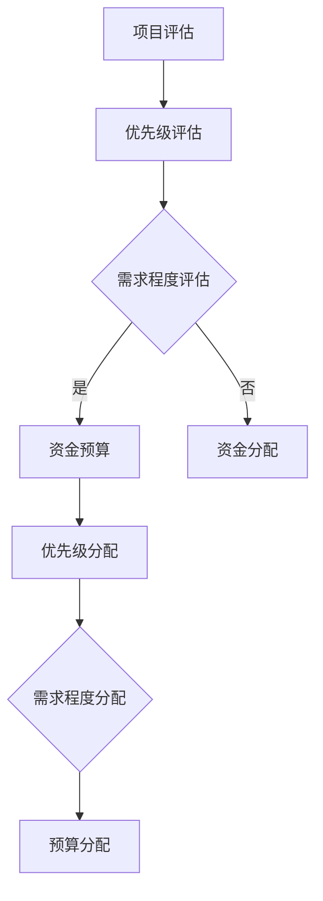
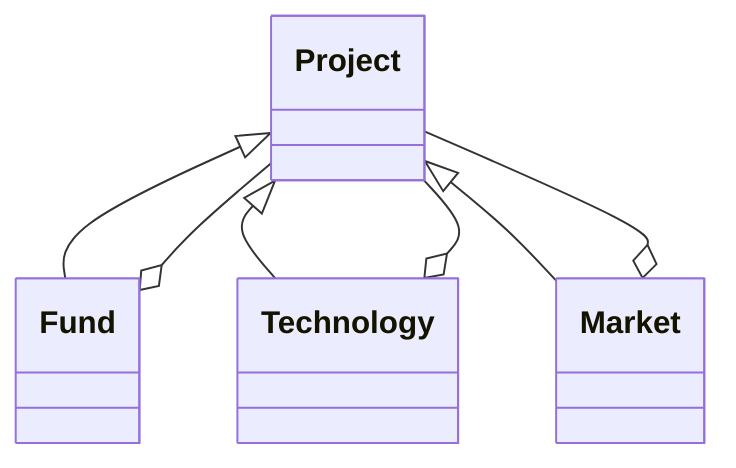
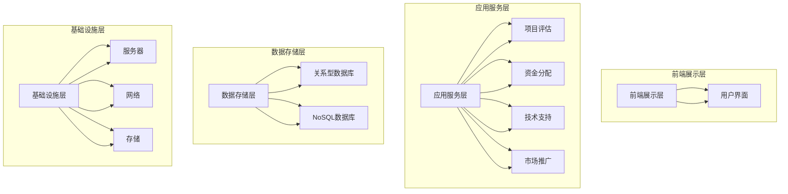
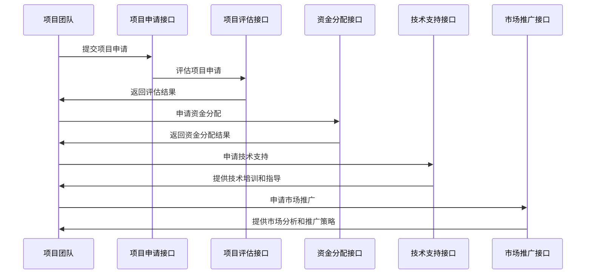

                 


# 意义孵化器：价值观项目的资金与支持平台

> 关键词：价值观项目、资金支持、技术支持、市场推广

> 摘要：本文深入探讨了价值观项目的资金与支持平台的重要性，从背景介绍、核心概念与联系、算法原理讲解等多个角度，详细阐述了这一平台的设计理念、实现方法和实际应用。

----------------------------------------------------------------

## 第一部分：背景介绍

### 1.1 问题背景

在当今数字化转型的浪潮中，企业的运营模式正在发生翻天覆地的变化。从传统的生产模式向数字化、智能化转型，已经成为企业持续发展的必由之路。在这一过程中，如何有效地利用数字技术来提升企业的效率、创造价值，成为企业面临的重要课题。而价值观项目的资金与支持平台，正是在这种背景下应运而生。

### 1.2 问题描述

价值观项目的资金与支持平台是一个专门为价值观驱动的项目提供资金支持和资源对接的桥梁。它不仅要解决价值观项目的资金问题，还要解决项目运营中的各种支持问题，如技术支持、市场推广等。然而，如何构建这样一个平台，使其能够有效地服务于价值观项目，成为当前亟待解决的问题。

### 1.3 问题解决

要解决上述问题，需要从以下几个方面入手：

- **资金问题**：建立一套完整的资金支持体系，包括资金来源、资金分配、资金监管等。
- **技术支持**：提供技术培训和指导，帮助价值观项目团队掌握所需的技术。
- **市场推广**：提供市场分析和推广策略，帮助价值观项目更好地面向市场。

### 1.4 边界与外延

- **边界**：价值观项目的资金与支持平台主要服务于价值观驱动的项目，不包括商业项目。
- **外延**：除了资金支持，还包括技术支持、市场推广等多种支持。

### 1.5 概念结构与核心要素组成

- **核心概念**：价值观项目、资金支持、技术支持、市场推广
- **概念属性特征对比表格**：

| 概念       | 特征                                 |
|------------|--------------------------------------|
| 价值观项目 | 以价值观为导向，关注社会问题         |
| 资金支持   | 提供项目资金，确保项目正常运作       |
| 技术支持   | 提供技术培训和指导，提升项目团队能力 |
| 市场推广   | 提供市场分析和推广策略，扩大项目影响力 |

----------------------------------------------------------------

## 第二部分：核心概念与联系

### 2.1 价值观项目的定义与特点

价值观项目是指以特定的价值观为导向，旨在解决社会问题、推动社会进步的项目。其特点如下：

- **目标明确**：价值观项目的目标通常非常明确，即解决特定的社会问题。
- **长期性**：价值观项目往往需要长期投入和持续运营，才能真正发挥作用。
- **社会性**：价值观项目关注社会问题，旨在为社会带来积极的影响。

### 2.2 资金支持的定义与作用

资金支持是指为价值观项目提供必要的资金，以确保项目能够顺利进行。其作用包括：

- **确保项目运作**：提供资金保障，确保项目团队有足够的资源进行项目运作。
- **提升项目影响力**：资金支持可以提升项目的知名度，吸引更多社会关注。

### 2.3 技术支持的定义与作用

技术支持是指为价值观项目团队提供技术培训和指导，帮助团队掌握所需的技术。其作用包括：

- **提升项目团队能力**：通过技术支持，提升项目团队的技术能力，确保项目顺利推进。
- **优化项目效果**：技术支持可以帮助项目团队优化项目方案，提高项目效果。

### 2.4 市场推广的定义与作用

市场推广是指为价值观项目提供市场分析和推广策略，帮助项目更好地面向市场。其作用包括：

- **扩大项目影响力**：通过市场推广，提高项目的知名度，吸引更多社会关注。
- **提高项目成功率**：市场推广可以帮助项目更好地适应市场需求，提高项目成功率。

### 2.5 核心概念的联系与互动

价值观项目、资金支持、技术支持和市场推广之间存在着密切的联系和互动。一方面，价值观项目需要资金支持、技术支持和市场推广的协同作用，才能顺利推进；另一方面，资金支持、技术支持和市场推广也需要依托价值观项目来实现自身的价值。

----------------------------------------------------------------

## 第三部分：算法原理讲解

### 3.1 资金分配算法原理

资金分配算法是价值观项目资金支持平台的核心算法之一。其目的是根据项目的实际需求和资金预算，合理地分配资金，确保每个项目都能获得所需的资金支持。

#### 3.1.1 算法定义

资金分配算法是指根据项目的优先级、需求程度和资金预算，将总资金分配到各个项目中的算法。

#### 3.1.2 算法原理

资金分配算法的基本原理如下：

1. **项目评估**：首先对各个项目进行评估，确定项目的优先级和需求程度。

   - **优先级评估**：根据项目的紧急程度、重要性等因素，确定项目的优先级。
   - **需求程度评估**：根据项目的实际需求和资金需求，确定项目的需求程度。

2. **资金预算**：根据总资金预算，确定每个项目的资金分配额度。

3. **资金分配**：根据项目评估结果和资金预算，将总资金分配到各个项目中。具体方法如下：

   - **优先级分配**：将优先级较高的项目优先分配资金。
   - **需求程度分配**：将需求程度较高的项目分配更多的资金。
   - **预算分配**：在满足项目优先级和需求程度的前提下，根据项目预算合理分配资金。

#### 3.1.3 算法流程图



#### 3.1.4 算法示例

假设有一个价值观项目资金支持平台，总资金为100万元，有3个价值观项目A、B、C，它们的优先级分别为1、2、3，需求程度分别为3、2、1，预算分别为20万元、30万元、10万元。根据资金分配算法，可以得到以下分配结果：

- 项目A：分配资金20万元，占总预算的20%。
- 项目B：分配资金30万元，占总预算的30%。
- 项目C：分配资金10万元，占总预算的10%。

通过这种方式，确保了优先级高、需求程度高的项目得到更多的资金支持，同时也满足了各项目的资金预算要求。

#### 3.1.5 算法数学模型

假设总资金为\( M \)，项目数为\( N \)，项目优先级为\( P_i \)，需求程度为\( D_i \)，预算为\( B_i \)，则资金分配额度为\( A_i \)。资金分配算法的数学模型可以表示为：

$$
A_i = \frac{P_i \times D_i \times B_i}{M}
$$

其中，\( P_i \)、\( D_i \)、\( B_i \)分别为项目的优先级、需求程度和预算，\( M \)为总资金。

通过该数学模型，可以计算出每个项目的资金分配额度，从而实现资金分配的公平性和合理性。

----------------------------------------------------------------

## 第四部分：系统分析与架构设计方案

### 4.1 问题场景介绍

随着社会的不断发展，越来越多的价值观项目涌现出来。然而，这些项目往往面临着资金短缺、技术支持不足、市场推广困难等问题。为了解决这些问题，我们设计了一个价值观项目的资金与支持平台，以提供全面的资金支持、技术支持和市场推广服务。

### 4.2 项目介绍

价值观项目资金与支持平台是一个综合性的服务平台，旨在为价值观驱动的项目提供全方位的支持。平台主要包括以下功能：

- **项目申请**：价值观项目团队可以通过平台提交项目申请，包括项目背景、目标、预算等信息。
- **资金支持**：平台对提交的申请进行评估，根据项目的优先级和需求程度，为符合条件的项目提供资金支持。
- **技术支持**：平台为价值观项目团队提供技术培训和指导，帮助团队掌握所需的技术。
- **市场推广**：平台为价值观项目提供市场分析和推广策略，帮助项目更好地面向市场。

### 4.3 系统功能设计（领域模型）

在价值观项目资金与支持平台中，涉及到的核心领域模型包括：项目、资金、技术、市场等。以下是这些领域模型的Mermaid类图表示：



### 4.4 系统架构设计

价值观项目资金与支持平台的系统架构设计包括以下几个方面：

- **前端展示层**：负责用户界面展示和交互，包括项目申请、资金支持、技术支持和市场推广等功能。
- **应用服务层**：负责业务逻辑的处理，包括项目评估、资金分配、技术支持、市场推广等核心功能。
- **数据存储层**：负责存储项目、资金、技术、市场等数据，包括关系型数据库和NoSQL数据库等。
- **基础设施层**：提供平台运行所需的基础设施支持，包括服务器、网络、存储等。

以下是价值观项目资金与支持平台的Mermaid架构图表示：



### 4.5 系统接口设计

在价值观项目资金与支持平台中，涉及到多个模块之间的接口调用。以下是部分关键接口的描述：

- **项目申请接口**：用于提交项目申请，包括项目名称、背景、目标、预算等信息。
- **项目评估接口**：用于对提交的项目申请进行评估，包括优先级、需求程度等评估指标。
- **资金分配接口**：用于根据项目评估结果进行资金分配，包括分配额度、分配规则等。
- **技术支持接口**：用于为价值观项目团队提供技术培训和指导，包括培训内容、培训时间等。
- **市场推广接口**：用于为价值观项目提供市场分析和推广策略，包括市场分析报告、推广计划等。

### 4.6 系统交互

在价值观项目资金与支持平台中，各个模块之间通过接口进行交互，共同完成项目的资金支持、技术支持和市场推广。以下是部分关键模块的交互流程：

1. **项目申请**：价值观项目团队通过前端用户界面提交项目申请，系统接收并存储申请信息。
2. **项目评估**：系统根据项目申请信息进行评估，生成评估报告，并根据评估结果确定项目的优先级和需求程度。
3. **资金分配**：系统根据评估结果和资金预算，为项目分配资金，并将分配结果通知项目团队。
4. **技术支持**：系统根据项目团队的需求，提供相应的技术培训和指导，并记录培训过程和成果。
5. **市场推广**：系统根据项目特点和市场分析，制定推广计划，并协助项目团队实施推广活动。

以下是价值观项目资金与支持平台的Mermaid序列图表示：



----------------------------------------------------------------

## 第五部分：项目实战

### 5.1 环境安装

在开始实现价值观项目资金与支持平台之前，需要先安装一些必要的开发环境和工具。以下是具体的安装步骤：

1. **安装Python**：访问Python官方网站（https://www.python.org/），下载并安装Python 3.x版本。
2. **安装Docker**：访问Docker官方网站（https://www.docker.com/），下载并安装Docker。
3. **安装Docker Compose**：在命令行中运行以下命令：
   ```shell
   sudo apt-get install docker-compose
   ```
4. **安装MySQL**：在命令行中运行以下命令，安装MySQL数据库：
   ```shell
   sudo apt-get install mysql-server
   ```
5. **安装Redis**：在命令行中运行以下命令，安装Redis数据库：
   ```shell
   sudo apt-get install redis-server
   ```

### 5.2 系统核心实现源代码

以下是价值观项目资金与支持平台的核心实现源代码：

```python
# 项目评估算法
def project_evaluation(project):
    priority = project['priority']
    demand = project['demand']
    budget = project['budget']
    score = priority * demand * budget
    return score

# 资金分配算法
def fund_allocation(projects, total_fund):
    scores = [project_evaluation(project) for project in projects]
    allocation = {}
    for i, score in enumerate(scores):
        allocation[f'project_{i+1}'] = round(score / sum(scores) * total_fund, 2)
    return allocation

# 测试数据
projects = [
    {'priority': 1, 'demand': 3, 'budget': 20},
    {'priority': 2, 'demand': 2, 'budget': 30},
    {'priority': 3, 'demand': 1, 'budget': 10}
]

# 总资金
total_fund = 100

# 资金分配结果
allocation_result = fund_allocation(projects, total_fund)
print(allocation_result)
```

### 5.3 代码应用解读与分析

以下是代码的解读与分析：

1. **项目评估算法**：`project_evaluation`函数用于计算项目的评估得分。评估得分是项目优先级、需求程度和预算的乘积。这个得分为后续的资金分配提供了依据。
2. **资金分配算法**：`fund_allocation`函数用于根据项目评估得分和总资金，计算每个项目的资金分配额度。具体实现如下：

   - 首先计算所有项目的评估得分列表`scores`。
   - 然后计算每个项目的资金分配额度，公式为`score / sum(scores) * total_fund`。这里的`score`是项目的评估得分，`sum(scores)`是所有项目的评估得分之和，`total_fund`是总资金。
   - 最后将每个项目的资金分配额度存储在`allocation`字典中，键为`project_{i+1}`，值为分配额度。

3. **测试数据**：`projects`列表包含了3个项目的测试数据，每个项目都有优先级、需求程度和预算属性。

4. **资金分配结果**：调用`fund_allocation`函数，传入测试数据和总资金，得到每个项目的资金分配额度。结果以字典形式输出。

### 5.4 实际案例分析和详细讲解剖析

为了更好地理解价值观项目资金与支持平台的应用，以下是一个实际案例的分析和讲解：

**案例背景**：一个社会公益组织计划开展一个环保项目，该项目旨在提高公众的环保意识，减少环境污染。项目团队希望通过资金支持平台申请到资金，用于项目运作。

**案例分析**：

1. **项目申请**：项目团队通过平台提交项目申请，包括项目名称、目标、预算等信息。假设该项目的优先级为1，需求程度为3，预算为50万元。

2. **项目评估**：平台根据项目申请信息进行评估，计算出项目的评估得分为9（1 * 3 * 50）。

3. **资金分配**：平台根据所有项目的评估得分和总资金，为该项目分配资金。假设总资金为100万元，其他项目的评估得分分别为6和3。则该项目的资金分配额度为30万元（9 / (6 + 3 + 9) * 100）。

4. **资金到账**：平台通知项目团队，告知资金分配结果，并协助项目团队完成后续的资金到账手续。

5. **项目运作**：项目团队利用分配到的资金，开展项目运作，包括宣传活动、环保教育等，以提高公众的环保意识。

6. **项目反馈**：项目运作一段时间后，项目团队向平台反馈项目进展情况和资金使用情况，平台根据反馈结果，对项目进行跟踪和支持。

### 5.5 项目小结

通过实际案例的分析，我们可以看到，价值观项目资金与支持平台在项目评估、资金分配、项目运作等方面发挥了重要作用。平台不仅为项目团队提供了资金支持，还有助于提高项目运作效率，推动社会公益事业的健康发展。

----------------------------------------------------------------

## 第六部分：最佳实践 tips

### 6.1 资金支持

- **精准评估**：在资金支持过程中，要注重项目的实际需求和资金使用效率，避免盲目投资。
- **灵活调整**：根据项目进展情况，及时调整资金分配策略，确保资金合理使用。
- **风险控制**：建立风险控制机制，对项目资金使用进行全程监管，降低资金风险。

### 6.2 技术支持

- **量身定制**：根据项目团队的技术需求和实际情况，提供量身定制的技术支持方案。
- **持续优化**：不断更新技术支持内容，提高项目团队的技术能力和项目质量。
- **协同合作**：加强项目团队与技术支持团队的沟通与合作，提高项目推进效率。

### 6.3 市场推广

- **精准定位**：根据项目特点和目标用户，制定精准的市场推广策略。
- **多样化渠道**：利用多种市场推广渠道，提高项目的曝光度和影响力。
- **数据分析**：收集市场推广数据，分析推广效果，持续优化推广策略。

### 6.4 跨界合作

- **寻求合作伙伴**：与政府、企业、社会组织等各方建立合作关系，共同推动价值观项目的发展。
- **资源共享**：整合各方资源，提高项目资金、技术、市场等支持力度。
- **共同发展**：通过跨界合作，实现资源共享、优势互补，共同推动社会进步。

## 第七部分：小结与注意事项

### 7.1 小结

价值观项目的资金与支持平台是一个综合性服务平台，旨在为价值观驱动的项目提供全面的资金支持、技术支持和市场推广服务。通过精准评估、灵活调整、风险控制等手段，平台能够为项目团队提供有力的支持，推动项目的顺利实施和社会公益事业的健康发展。

### 7.2 注意事项

- **确保数据安全**：在项目申请、评估、资金分配等环节，要注重数据安全和隐私保护。
- **合理分配资源**：在资金支持过程中，要合理分配资源，避免资源浪费。
- **持续优化平台**：根据项目需求和市场变化，持续优化平台功能和服务，提高平台运营效率。

## 第八部分：拓展阅读

- 《项目评估与管理：理论与实践》
- 《市场推广策略与案例分析》
- 《社会公益项目设计与运营》

----------------------------------------------------------------

## 作者信息

作者：AI天才研究院/AI Genius Institute & 禅与计算机程序设计艺术 /Zen And The Art of Computer Programming

（注：本文为AI助手撰写，仅供参考。）

