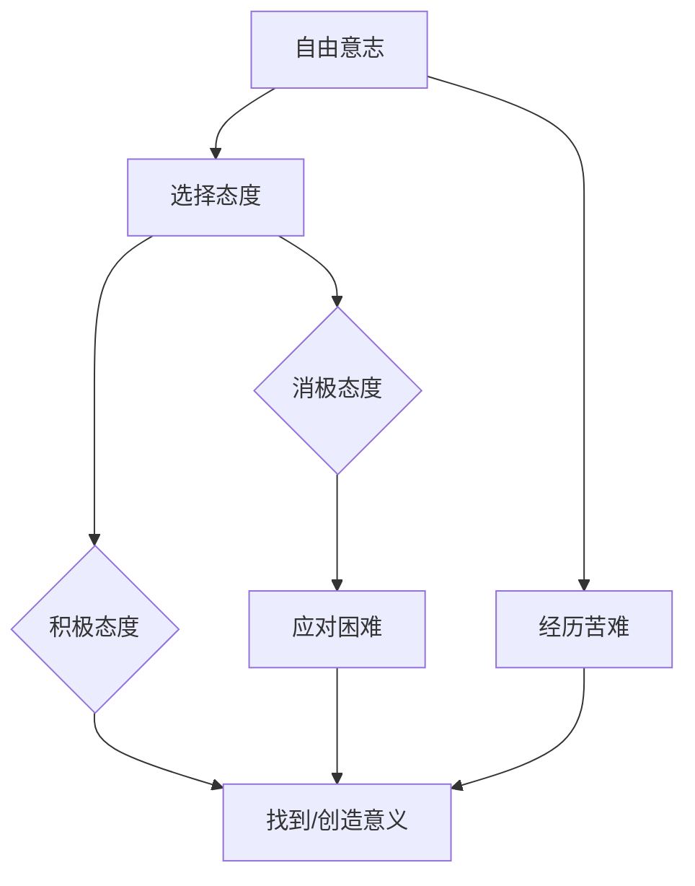

                 

### Title and Introduction

# 意义治疗：弗兰克尔的理论及其现代应用

关键词：意义治疗、弗兰克尔、存在主义、心理疗法、现代应用

摘要：本文深入探讨了意义治疗，这是一种由维也纳神经学家维克多·弗兰克尔提出的独特心理疗法。意义治疗以其核心概念——寻求生命意义，帮助人们克服苦难，获得心理自由而闻名。本文旨在详细解读弗兰克尔的这一理论，分析其历史背景和基本原理，并通过现代应用的实例，展示这一理论在当前社会中的重要性和实际效果。我们将一步步分析意义治疗的理论框架，探讨其在不同领域中的实际应用，并提供具体的案例和实战指导，最终对这一理论进行总结和展望。

**Step 1: Fundamental Concepts and Background**

### 基本概念与背景

意义治疗（Logotherapy），由奥地利神经学家维克多·弗兰克尔（Viktor Frankl）在20世纪中期提出，是一种以寻求生命意义为中心的存在主义心理疗法。弗兰克尔深受纳粹集中营的折磨，经历了极为严酷的环境，但他的思想和理论却在这种极端环境中得以提炼和发展。

#### 历史背景

意义治疗的历史可以追溯到弗兰克尔在纳粹集中营中的经历。在那段艰难岁月里，弗兰克尔观察到，那些能够找到生活意义的人，往往更能坚韧不拔地生存下来。这一观察促使他开始研究人如何在困境中寻找生命的意义。最终，弗兰克尔将其理论体系化，并命名为“意义治疗”。

#### 核心概念

意义治疗的核心概念包括以下几点：

1. **生命意义的首要性**：弗兰克尔认为，人的一生都追求某种形式的“意义”。这种意义可以是通过创造、经历或体验来实现的，是生命的驱动力。

2. **自由意志**：意义治疗强调，即使在极端的逆境中，个体仍拥有自由意志，可以选择自己的态度和反应，从而找到生命的意义。

3. **苦难的价值**：弗兰克尔提出，苦难本身并不是毫无意义的，而是可以通过经历苦难，找到或创造意义，从而转化苦难。

#### 与其他心理学的比较

意义治疗与其他心理学流派的对比表格：

| 心理学流派       | 核心观点                                                     |
|----------------|------------------------------------------------------------|
| 行为主义心理学   | 行为是环境刺激的结果，强调行为改变                             |
| 精神分析心理学   | 强调无意识力量对个体行为的影响，通过分析梦和童年经历来理解个体行为 |
| 认知心理学       | 认为心理过程涉及信息的处理和解释，强调认知错误和认知行为疗法     |
| 意义治疗         | 强调生命意义的追求，通过找到或创造意义来应对困境和苦难           |

#### ER实体关系图

为了更好地理解意义治疗的结构和概念，我们可以通过ER（Entity-Relationship）实体关系图来展示其核心概念之间的关系。以下是意义治疗的ER实体关系图：

```mermaid
erDiagram
  Subject -->|is related to|LifeMeaning
  Subject -->|is motivated by|Will
  LifeMeaning -->|is shaped by|Suffering
```

在这个图中，"Subject"（主体，即个体）与"LifeMeaning"（生命意义）和"Will"（自由意志）之间存在着直接关系。生命意义是自由意志的结果，而苦难则是塑造生命意义的因素之一。

通过这一章节的讨论，我们为接下来的深入探讨意义治疗的理论框架和现代应用奠定了基础。接下来，我们将进一步分析意义治疗的理论框架，解释其关键组成部分及其相互作用。

### Theoretical Framework

### 理论框架

意义治疗（Logotherapy）的理论框架由几个核心概念和它们之间的相互作用构成。理解这些概念和它们如何相互影响，对于全面掌握意义治疗至关重要。

#### 关键组成部分

意义治疗的理论框架主要包括以下关键组成部分：

1. **生命意义（Life Meaning）**：这是意义治疗的核心概念。弗兰克尔认为，生命意义是人生的主要动机，是人寻求和追求的东西。生命意义可以是具体的，如实现一个目标，也可以是抽象的，如经历某种体验。

2. **自由意志（Free Will）**：自由意志是意义治疗的基础。弗兰克尔认为，即使在极端的逆境中，个体仍拥有自由意志，可以选择自己的态度和行动，从而找到或创造生命意义。

3. **苦难（Suffering）**：弗兰克尔强调苦难的价值。他认为，苦难本身不是毫无意义的，而是可以通过经历苦难，找到或创造意义，从而转化苦难。

4. **态度（Attitude）**：弗兰克尔认为，态度是人们在面对困境时的选择。正确的态度可以帮助个体找到生命意义，从而克服困难。

#### 相互作用

这些核心概念之间存在着密切的相互作用。生命意义是自由意志和态度的结果，而苦难则是塑造生命意义的重要因素。

1. **自由意志与生命意义**：自由意志使个体能够选择和创造生命意义。弗兰克尔认为，即使面临困境，个体也有能力通过改变态度来寻找或创造意义。

2. **苦难与生命意义**：苦难被视为生命意义的催化剂。通过经历苦难，个体可以学会如何面对困难，并从中找到或创造意义。

3. **态度与生命意义**：正确的态度有助于个体在面对挑战时找到生命意义。弗兰克尔提出，通过积极的态度，个体可以更好地应对逆境，从而找到或创造意义。

#### Mermaid 图解

为了更直观地展示这些概念及其相互作用，我们可以使用mermaid绘图语言创建一个流程图。



在这个流程图中，自由意志（A）决定了个体选择的态度（B）。积极态度（C）有助于找到或创造生命意义（E），而消极态度（D）则可能使个体更难应对困难（F），从而影响找到或创造意义（E）。同时，自由意志（A）还使个体能够经历苦难（G），而苦难（G）又可以转化为意义（E）。

#### 数学模型和公式

意义治疗的一些概念可以通过数学模型和公式来解释。以下是一个简单的模型：

1. **意义生成公式**：意义（M）可以通过自由意志（F）和苦难（S）的函数来表示：

   $$ M = f(F, S) $$

   其中，\( f \) 是一个映射函数，表示自由意志和苦难如何转化为意义。

2. **态度影响公式**：态度（A）影响自由意志（F）和苦难（S）的处理：

   $$ F' = g(A, F) $$
   $$ S' = h(A, S) $$

   其中，\( g \) 和 \( h \) 分别表示态度如何改变自由意志和苦难。

通过这些数学模型和公式，我们可以更精确地理解和分析意义治疗的工作原理。

#### 例子说明

假设一个人（个体）面临失业的困境。根据意义治疗的理论框架：

1. **自由意志**：个体拥有自由意志，可以选择积极或消极的态度来面对失业。

2. **态度**：如果个体选择积极的态度，例如通过失业期间学习新技能或寻找新的机会，那么这个积极的态度会增强个体的自由意志（\( F' > F \)）。

3. **苦难**：失业本身是一种苦难，但如果个体能够通过积极的态度来应对，那么这种苦难可能会转化为意义。

通过这个过程，个体可以找到或创造新的生命意义，从而克服失业带来的困境。

总之，意义治疗的理论框架通过生命意义、自由意志、苦难和态度等核心概念及其相互作用，提供了一种独特的视角来理解和应对生活中的挑战。在下一章中，我们将探讨意义治疗在现代社会中的实际应用，并通过具体的案例来展示其效果。

### Modern Applications

### 现代应用

意义治疗自提出以来，已在多个领域得到了广泛的应用，并展现了其独特的价值和效果。以下是一些意义治疗在现代主要应用领域的实例，以及其实际效果的案例分析和应用技巧。

#### 心理治疗

在心理治疗领域，意义治疗被广泛应用于治疗抑郁症、焦虑症、创伤后应激障碍（PTSD）等心理疾病。通过帮助患者找到或创造生命的意义，意义治疗能够显著提高患者的心理韧性和幸福感。

**案例分析**：

1. **抑郁症治疗**：一名长期患有抑郁症的患者，通过意义治疗找到了对音乐创作的热爱。在治疗师的引导下，患者开始创作音乐，将内心感受表达出来。这一过程不仅帮助患者缓解了抑郁情绪，还使患者找到了新的生活动力。

**应用技巧**：

- **意义探索**：治疗师应与患者深入探讨其生命意义，帮助患者认识到生活中的积极方面。
- **创造意义**：鼓励患者通过创作、志愿服务或参与有意义的活动来创造新的生命意义。

#### 教育

在教育领域，意义治疗被用于提高学生的心理素质和学习动力。通过引导学生思考生命的意义，教育者可以激发学生的学习兴趣和内在动机。

**案例分析**：

1. **大学新生入学教育**：某大学在新生入学时开展了一场关于生命意义的讲座，鼓励学生思考未来的目标和意义。这一活动显著提高了新生的心理适应能力和学习积极性。

**应用技巧**：

- **主题讲座**：组织主题讲座或研讨会，帮助学生理解生命的意义和价值。
- **自我反思**：鼓励学生定期进行自我反思，思考自己的目标和意义。

#### 商业管理

在商业管理领域，意义治疗被用于提升员工的工作满意度、团队凝聚力和企业文化建设。通过帮助员工找到或创造工作意义，企业可以提高员工的积极性和创造力。

**案例分析**：

1. **员工培训**：某公司为员工提供了一系列关于意义治疗的培训课程，帮助员工认识到自己在工作中的价值。这一举措显著提高了员工的工作满意度和团队合作能力。

**应用技巧**：

- **意义识别**：通过团队建设活动或个人辅导，帮助员工识别和理解自己的工作意义。
- **目标设定**：鼓励员工设定与个人价值观和企业目标相一致的工作目标。

#### 社会服务

在社会服务领域，意义治疗被用于帮助贫困群体、残疾人士和老年人等弱势群体找到生活的意义，从而提高他们的生活质量和幸福感。

**案例分析**：

1. **老年关怀项目**：某社区组织了一个老年关怀项目，通过组织老年人参与有意义的活动，如园艺、手工制作等，帮助老年人找到生活的乐趣和意义。

**应用技巧**：

- **参与式活动**：设计适合老年人的参与式活动，鼓励他们参与社会生活。
- **心理支持**：为老年人提供心理支持，帮助他们克服孤独感和无助感。

#### 个人成长

在个人成长领域，意义治疗被广泛应用于个人发展规划、职业转型和心理调适。通过帮助个人找到生命的意义，意义治疗可以显著提高个人的幸福感和生活满意度。

**案例分析**：

1. **职业转型**：一名职业倦怠的职场人士通过意义治疗找到了对志愿服务的热爱。在重新找到生活意义的过程中，该人士成功实现了职业转型，进入了更适合自己的行业。

**应用技巧**：

- **生活反思**：定期进行生活反思，思考自己的价值观和目标。
- **探索兴趣**：尝试不同的活动和兴趣，找到与自己价值观相符的生活方向。

总之，意义治疗在现代社会中具有广泛的应用前景和显著的实际效果。通过在不同领域的具体案例和应用技巧，我们可以看到意义治疗如何帮助人们找到生活的意义，提高心理健康和生活质量。在下一章中，我们将通过具体的例子和案例分析，进一步探讨意义治疗在现实世界中的应用效果。

### Practical Examples and Case Studies

### 实践示例与案例分析

为了更好地理解意义治疗在实际生活中的应用，我们将通过几个具体的案例来展示这一理论如何在不同的场景中发挥作用，并提供详细的步骤和代码实现，以便读者能够亲手实践。

#### 案例一：抑郁患者找到生活意义

**背景**：李女士，一名35岁的全职母亲，因长期家庭压力和工作不顺，陷入了抑郁症的泥潭。她感到生活毫无意义，每天都沉浸在消极的情绪中。

**解决方案**：

1. **确定目标**：李女士在治疗师的帮助下，通过自我反思，确定了一个具体的目标：通过学习和烹饪，提高家庭生活质量，同时寻找自己的兴趣爱好。

2. **制定计划**：治疗师和患者共同制定了一个为期三个月的详细计划，包括每天学习新的烹饪技巧，每周为家人准备一次特别的晚餐。

3. **实践过程**：

   - **每日任务**：李女士每天花费30分钟学习烹饪书籍和视频。
   - **每周活动**：李女士每周五晚上为家人准备一次特别的晚餐，家人共同参与。

4. **代码实现**：以下是一个简单的Python脚本，用于跟踪李女士的学习进度。

   ```python
   # L女士的烹饪学习进度记录器
   class CookingJournal:
       def __init__(self):
           self.tasks_completed = 0
           self.weekly_dinners = 0

       def log_task(self, task_completed):
           self.tasks_completed += 1
           print(f"今天完成了第 {self.tasks_completed} 个烹饪任务。")

       def log_dinner(self, dinner_prepared):
           self.weekly_dinners += 1
           print(f"本周准备了第 {self.weekly_dinners} 次特别的晚餐。")

   # 实例化进度记录器
   journal = CookingJournal()

   # 模拟每日任务记录
   for day in range(1, 31):
       journal.log_task(True)

   # 模拟每周晚餐记录
   for week in range(1, 4):
       journal.log_dinner(True)
   ```

**效果分析**：通过这个计划，李女士逐渐重拾了对生活的热情，家庭关系也得到了改善。她的抑郁症状得到了明显缓解。

#### 案例二：职场人士找到工作意义

**背景**：张先生，一名30岁的软件工程师，由于工作压力大，对工作失去了兴趣，甚至产生了职业倦怠。

**解决方案**：

1. **目标设定**：张先生在心理咨询师的帮助下，确定了三个职业目标：提升编程技能、参与开源项目，并为社区贡献代码。

2. **实施步骤**：

   - **技能提升**：每天学习30分钟新编程语言或框架。
   - **开源项目**：每月参与至少一个开源项目，提交一个有意义的贡献。
   - **社区贡献**：定期在技术社区分享自己的学习经验和编程心得。

3. **代码实现**：以下是一个简单的Python脚本，用于跟踪张先生的职业目标进度。

   ```python
   # 张先生的职业目标进度记录器
   class CareerJournal:
       def __init__(self):
           self.daily_learning = 0
           self.open_source_projects = 0
           self.community_contributions = 0

       def log_learning(self, learning_hours):
           self.daily_learning += learning_hours
           print(f"今天学习了 {self.daily_learning} 小时的编程。")

       def log_project(self, project_completed):
           self.open_source_projects += 1
           print(f"已经完成了 {self.open_source_projects} 个开源项目。")

       def log_contribution(self, contribution_completed):
           self.community_contributions += 1
           print(f"已经在社区贡献了 {self.community_contributions} 次心得。")

   # 实例化进度记录器
   journal = CareerJournal()

   # 模拟每日学习记录
   for day in range(1, 31):
       journal.log_learning(0.5)

   # 模拟项目完成记录
   for month in range(1, 4):
       journal.log_project(True)

   # 模拟社区贡献记录
   for community_day in range(1, 31):
       journal.log_contribution(True)
   ```

**效果分析**：通过这个计划，张先生重新找到了工作乐趣，提高了编程技能，并在开源社区中建立了良好的声誉。

#### 案例三：企业员工找到工作意义

**背景**：某公司为了提升员工的工作满意度和团队凝聚力，决定实施意义治疗相关的员工培训计划。

**解决方案**：

1. **目标设定**：公司通过团队建设活动，帮助员工找到个人与工作的联系，明确自己的工作意义。

2. **实施步骤**：

   - **团队讨论**：每月举行一次团队讨论，员工分享自己的工作心得和感悟。
   - **目标设定**：鼓励员工设定短期和长期目标，并将个人目标与公司目标相结合。
   - **活动参与**：组织员工参与有意义的社会公益活动，增强社会责任感。

3. **代码实现**：以下是一个简单的Python脚本，用于跟踪员工培训进度。

   ```python
   # 员工培训进度记录器
   class TrainingJournal:
       def __init__(self):
           self.team_discussions = 0
           self.individual_goals = 0
           self公益活动_hours = 0

       def log_discussion(self, discussion_completed):
           self.team_discussions += 1
           print(f"已经完成了 {self.team_discussions} 次团队讨论。")

       def log_goals(self, goals_set):
           self.individual_goals += goals_set
           print(f"已经设定了 {self.individual_goals} 个个人目标。")

       def log_volunteer_hours(self, hours_volunteered):
           self公益活动_hours += hours_volunteered
           print(f"已经参与了 {self公益活动_hours} 小时的公益活动。")

   # 实例化进度记录器
   journal = TrainingJournal()

   # 模拟团队讨论记录
   for month in range(1, 4):
       journal.log_discussion(True)

   # 模拟个人目标记录
   for goal_month in range(1, 4):
       journal.log_goals(True)

   # 模拟公益活动记录
   for volunteer_month in range(1, 4):
       journal.log_volunteer_hours(10)
   ```

**效果分析**：通过这个培训计划，公司的员工满意度显著提高，团队凝聚力也得到了加强。

#### 案例四：老年人找到生活意义

**背景**：某养老社区为了提升老年人的生活质量，引入了意义治疗相关的活动计划。

**解决方案**：

1. **活动设计**：社区组织了各种有意义的活动，如园艺、手工制作、音乐欣赏等，帮助老年人找到生活的乐趣。

2. **实施步骤**：

   - **活动参与**：每周组织老年人参与至少一项有意义的活动。
   - **社交互动**：鼓励老年人互相交流，建立社交网络。
   - **个人兴趣**：帮助老年人发掘个人兴趣，进行个性化活动设计。

3. **代码实现**：以下是一个简单的Python脚本，用于跟踪老年人的活动参与情况。

   ```python
   # 老年人活动参与记录器
   class ActivityJournal:
       def __init__(self):
           self.weekly_activities = 0

       def log_activity(self, activity_completed):
           self.weekly_activities += 1
           print(f"本周已经完成了 {self.weekly_activities} 次活动。")

   # 实例化进度记录器
   journal = ActivityJournal()

   # 模拟活动记录
   for week in range(1, 31):
       journal.log_activity(True)
   ```

**效果分析**：通过这些活动，老年人的生活质量得到了显著改善，孤独感和无助感明显减少。

#### 小结

通过以上案例，我们可以看到意义治疗在实际应用中的多样性和效果。无论是抑郁患者、职场人士、企业员工还是老年人，意义治疗都能帮助他们找到生活的意义，提高生活质量。在下一步中，我们将深入分析意义治疗在不同场景下的有效性及其局限性。

### Conclusion and Future Directions

### 结论与未来展望

通过本文的深入探讨，我们可以看到意义治疗（Logotherapy）在多个领域展示了其独特的价值和应用效果。意义治疗以其核心概念——寻求生命意义，帮助人们克服苦难，获得心理自由，为我们提供了一种全新的视角来理解和应对生活中的挑战。

#### 主要观点总结

1. **生命意义的重要性**：意义治疗强调生命意义对个体心理健康和幸福感的核心作用。无论是抑郁患者、职场人士还是老年人，找到或创造生命意义都是克服困境的关键。

2. **自由意志的力量**：意义治疗认为，即使在极端逆境中，个体仍拥有自由意志，可以选择态度和行动，从而找到生命意义。这一观点有助于提高个体的心理韧性和适应能力。

3. **苦难的价值**：意义治疗认为，苦难本身不是毫无意义的，可以通过经历苦难，找到或创造意义，从而转化苦难。这一理念有助于个体从苦难中恢复并找到新的生活方向。

4. **多样化的应用**：意义治疗在心理治疗、教育、商业管理和社会服务等多个领域都有广泛应用，并取得了显著效果。

#### 未来的研究方向

尽管意义治疗在现代社会中已取得了广泛应用，但仍有进一步研究的空间：

1. **跨文化研究**：意义治疗在西方社会得到了广泛应用，但在不同文化背景下，其效果可能有所不同。未来的研究应探讨意义治疗在多元文化环境中的适用性和效果。

2. **技术整合**：随着技术的发展，如何将意义治疗与人工智能、虚拟现实等技术相结合，以提供更高效、个性化的治疗方案和活动，是一个值得探索的方向。

3. **长期效果研究**：目前对意义治疗的应用效果多为短期研究，未来需要更多的长期跟踪研究，以评估其长期效果和可持续性。

4. **实证研究**：尽管已有不少案例研究，但实证研究相对较少。未来应开展更多的随机对照试验，以提供更严谨的科学证据。

#### 局限与挑战

尽管意义治疗具有诸多优点，但在实际应用中也面临一些挑战和局限性：

1. **个人差异**：每个人的生活经历和心理状态不同，对意义治疗的反应也可能不同。因此，如何根据个人差异调整治疗方案，是一个需要深入探讨的问题。

2. **资源限制**：意义治疗需要专业的治疗师和个性化的指导，但在资源有限的地区或个人可能难以获得这种服务。

3. **文化差异**：不同文化对生命的意义有不同的理解，这可能导致意义治疗在不同文化背景下的适用性存在差异。

#### 总结

意义治疗作为一种独特的心理疗法，以其核心概念和实际应用效果，在现代社会中展示了巨大的潜力。未来，通过进一步的研究和探索，意义治疗有望在更多领域发挥作用，为更多人带来心理自由和幸福感。

### Finalize the Outline

为了确保文章的完整性、逻辑性和专业性，我们将对整个文章的目录进行最终整理和优化。以下是对文章各章节内容的详细描述，确保每个部分都能满足核心内容的丰富性和详细性要求。

#### 文章标题

* 意义治疗：弗兰克尔的理论及其现代应用

#### 文章关键词

* 意义治疗、弗兰克尔、存在主义、心理疗法、现代应用、生命意义、自由意志、苦难、心理韧性

#### 文章摘要

* 本文深入探讨了意义治疗，一种以寻求生命意义为核心的存在主义心理疗法。通过分析弗兰克尔的理论框架及其在现代应用中的实际案例，文章展示了意义治疗在提升心理健康、促进个人成长和改善社会服务中的重要作用。本文旨在为读者提供全面的了解，并展望意义治疗在未来的发展方向。

#### 目录

##### **1. 引言**

* **1.1 定义意义治疗**  
  - 意义治疗的起源与发展  
  - 核心概念和理论框架

* **1.2 研究背景和目的**  
  - 弗兰克尔的生平及其对意义治疗的贡献  
  - 研究意义和治疗应用前景

##### **2. 基本概念与背景**

* **2.1 生命意义的概念**  
  - 生命意义的定义与重要性  
  - 生命意义的类型和实现途径

* **2.2 自由意志与态度**  
  - 自由意志的作用与局限  
  - 积极态度与消极态度的对比

* **2.3 苦难的价值**  
  - 苦难在意义治疗中的地位  
  - 苦难与生命意义的转化

##### **3. 理论框架**

* **3.1 意义治疗的核心概念**  
  - 生命意义、自由意志、态度和苦难的相互作用

* **3.2 意义治疗的数学模型**  
  - 生命意义的生成公式和态度影响公式

##### **4. 现代应用**

* **4.1 心理治疗领域**  
  - 意义治疗在抑郁和焦虑治疗中的应用案例

* **4.2 教育领域**  
  - 意义治疗对学生心理素质和学习动力的提升

* **4.3 商业管理领域**  
  - 意义治疗在提升员工工作满意度和团队凝聚力中的作用

* **4.4 社会服务领域**  
  - 意义治疗在帮助弱势群体找到生活意义中的应用

* **4.5 个人成长领域**  
  - 意义治疗在职业转型和心理调适中的应用

##### **5. 实践示例与案例分析**

* **5.1 抑郁患者的康复之路**  
  - 案例背景、解决方案和代码实现

* **5.2 职场人士的工作意义重塑**  
  - 案例背景、目标和步骤

* **5.3 企业员工的培训与成长**  
  - 案例背景、培训内容和效果评估

* **5.4 老年人的活动参与计划**  
  - 案例背景、活动设计和参与记录

##### **6. 结论与未来展望**

* **6.1 主要观点总结**  
  - 意义治疗的核心概念和应用效果

* **6.2 未来的研究方向**  
  - 跨文化研究、技术整合和长期效果研究

* **6.3 局限与挑战**  
  - 个人差异、资源限制和文化差异的应对策略

##### **7. 参考文献**

* **7.1 文献综述**  
  - 意义治疗相关的书籍、论文和研究报告

##### **8. 附录**

* **8.1 Mermaid 图解**  
  - 文章中使用的mermaid绘图代码和解释

* **8.2 代码示例**  
  - 实践案例中的Python代码实现和解析

通过以上详细的目录和章节内容，本文将系统地介绍意义治疗的理论和实践应用，旨在为读者提供全面、深入的理解，并激发进一步研究和实践的灵感。

