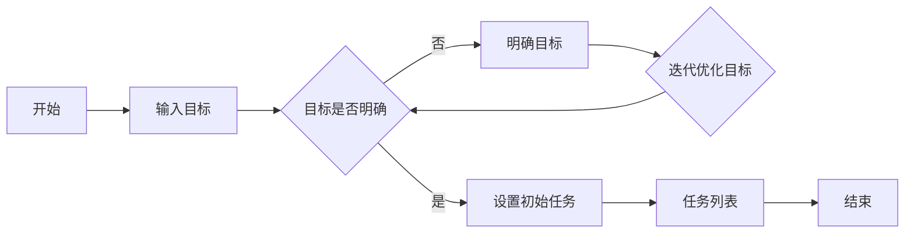
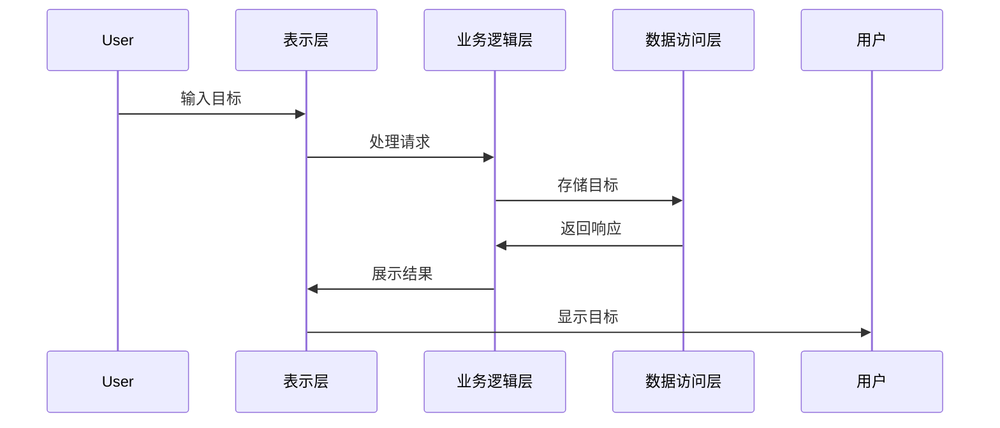
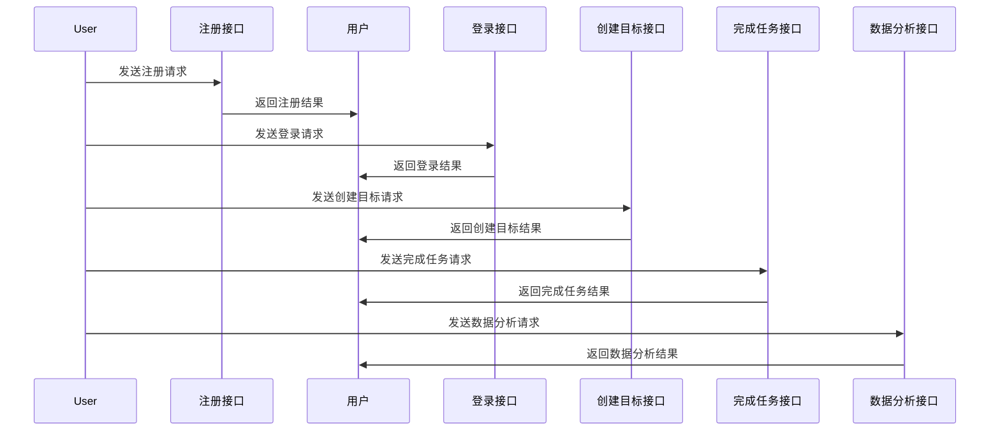

                 


### 第1步：背景介绍

**问题背景**：随着科技的发展和社会的进步，人们的生活节奏越来越快，面临的工作和生活压力也与日俱增。在这种环境下，如何有效地管理个人目标和提升生活质量成为了一个重要的课题。游戏化作为一种新兴的管理和激励方式，已经被广泛应用于教育、工作和生活的多个领域。游戏化的核心在于将游戏的元素和机制应用到非游戏场景中，以激发个体的积极性和创造力。例如，通过积分、排行榜、奖励等机制，来鼓励人们完成目标、提升技能和解决问题。

**问题描述**：本书旨在探讨如何将人生目标通过游戏化的方式转化为具体的任务系统，从而实现自我激励和目标达成。具体来说，就是如何将复杂的人生目标拆解为一系列可操作的任务，并设计一个有效的任务系统，通过激励和反馈机制，帮助个人更好地实现自己的目标。

**问题解决**：为了解决上述问题，本书将首先介绍游戏化的基本概念和原理，然后探讨如何将人生目标进行分解和任务化，最后通过一个具体的案例来展示整个过程的实施步骤和效果。

**边界与外延**：本书主要关注个人层面的目标管理，不涉及商业或团队游戏化的应用。核心概念包括游戏化、目标管理、任务系统设计等，核心要素包括激励机制、任务分解、进度跟踪等。

**概念结构与核心要素组成**：

- **游戏化**：将游戏设计中的激励机制和机制应用到非游戏场景中，以提升参与度和积极性。
- **目标管理**：设定明确的目标，制定合理的计划，通过监控和反馈来确保目标的实现。
- **任务系统设计**：将目标分解为一系列可操作的任务，设计一套有效的任务系统和激励机制。

### 关键词：游戏化、目标管理、任务系统、激励机制、目标分解、进度跟踪

### 摘要：

本文将探讨如何通过游戏化的方法，将人生目标转化为具体的任务系统，以实现自我激励和目标达成。首先，我们介绍了游戏化的基本概念和原理，以及它在人生目标管理中的应用。接着，我们详细阐述了如何将人生目标进行分解和任务化，设计出一个有效的任务系统。最后，通过一个具体的案例，展示了整个过程的实施步骤和效果。本文旨在为个人提供一种有效的目标管理工具，帮助他们在快节奏的生活中实现自己的目标，提升生活质量。

----------------------------------------------------------------

### 第2步：核心概念与联系

**核心概念原理**：

- **游戏化**：游戏化（Gamification）是将游戏设计中的激励机制和机制（如积分、排行榜、奖励、竞争等）应用于非游戏环境（如教育、工作、生活等）的一种方法。其目的是通过这些激励机制来提高用户参与度、提升绩效和改善用户体验。

- **目标管理**：目标管理（Goal Setting）是一种通过设定明确、具体、可衡量、可实现、有时限的目标（SMART目标），并通过计划、执行、监控和反馈来确保目标实现的过程。目标管理的关键在于将远大的愿景分解为可操作的步骤，以实现逐步的进步。

- **任务系统设计**：任务系统设计（Task System Design）是指将一个复杂的目标分解为一系列小任务，并为每个任务设定明确的任务目标、资源需求、时间安排和责任人，以确保任务能够有序、高效地完成。任务系统设计的目标是提高工作的可操作性和团队协作效率。

**概念属性特征对比表格**：

| 概念 | 定义 | 关键属性 | 应用场景 |
| --- | --- | --- | --- |
| 游戏化 | 将游戏机制应用于非游戏环境 | 激励机制、互动性、反馈、竞争 | 教育、工作、健康、营销 |
| 目标管理 | 设定并实现明确的目标 | SMART目标、计划、监控、反馈 | 个人发展、职业规划、项目管理 |
| 任务系统设计 | 将目标分解为具体任务 | 任务目标、资源、时间、责任人 | 团队协作、项目实施、日常管理 |

**ER实体关系图架构**：

为了更直观地理解这三个核心概念之间的关系，我们可以使用 Mermaid 绘制一个 ER 实体关系图，如下所示：

```mermaid
erDiagram
  Task --> Goal : 完成任务实现目标
  Task --> Reward : 完成任务获得奖励
  Goal --> User : 用户设定目标
  Reward --> User : 用户获得奖励
```

- **Goal（目标）**：用户设定的总体目标，是任务系统设计的起点和归宿。
- **Task（任务）**：将目标分解的具体操作步骤，每个任务对应一个具体的行动项。
- **Reward（奖励）**：完成任务后获得的激励，可以是积分、排行榜提升、物质奖励等。

通过上述 ER 实体关系图，我们可以看到，游戏化、目标管理和任务系统设计之间是相互关联、相互促进的。游戏化的激励机制可以促进用户设定目标、完成任务，而目标管理和任务系统设计则为游戏化的激励机制提供了具体的实施路径和衡量标准。

### 总结：

本节详细介绍了游戏化、目标管理和任务系统设计这三个核心概念，并通过对比表格和 ER 实体关系图展示了它们之间的联系。在下一节中，我们将进一步探讨如何将人生目标进行分解和任务化，设计出一个有效的任务系统。

----------------------------------------------------------------

### 第3步：算法原理讲解

在将人生目标转化为任务系统时，目标分解算法是一个关键步骤。该算法旨在将一个复杂、抽象的目标分解为一系列具体的、可操作的任务，以便于后续的任务管理和实现。以下，我们将使用 Mermaid 绘制目标分解算法的流程图，并使用 Python 源代码和 LaTeX 格式详细阐述算法原理和数学模型。

#### 目标分解算法流程图



- **A[开始]**：算法开始，输入一个抽象的人生目标。
- **B[输入目标]**：用户输入一个复杂、抽象的目标。
- **C[目标是否明确]**：判断输入的目标是否明确，即是否符合 SMART（具体、明确、可衡量、可实现、有时限）原则。
- **D[设置初始任务]**：如果目标明确，设置一个初始任务，该任务对应目标的核心行动项。
- **E[明确目标]**：如果目标不明确，进行迭代优化，直到目标明确为止。
- **F[迭代优化目标]**：通过进一步细化目标，使其更具体、明确，并符合 SMART 原则。
- **G[任务列表]**：生成一个任务列表，包含所有分解出的具体任务。
- **H[结束]**：算法结束。

#### 数学模型和公式

目标分解算法的数学模型可以表示为：

$$
\text{分解目标} = \left\{
\begin{array}{ll}
T_1 & \text{如果目标已明确} \\
T_2 & \text{如果目标需要迭代优化} \\
\end{array}
\right.
$$

其中，$T_1$ 表示初始任务列表，$T_2$ 表示迭代优化后的任务列表。

- **初始任务列表**：目标分解的初始结果，包含一个或多个具体任务。
- **迭代优化后的任务列表**：经过多次迭代优化后，生成的更具体、明确的任务列表。

#### 通俗易懂地举例说明

假设一个用户的目标是“提升英语水平”。这是一个非常宽泛的目标，不符合 SMART 原则。为了使目标更加具体和可操作，我们可以使用目标分解算法对其进行分解：

1. **初始任务列表**：
   - 学习英语语法
   - 扩展英语词汇量
   - 提升英语听说能力

2. **迭代优化目标**：
   - 将“学习英语语法”进一步分解为：
     - 学习基础语法规则
     - 理解常用句型和语法结构
     - 实践应用语法知识
   - 将“扩展英语词汇量”进一步分解为：
     - 每天学习10个新单词
     - 每周完成一篇英语短文阅读
     - 每月参加一次英语词汇竞赛

经过多次迭代优化，用户的目标最终变为一系列具体、可操作的任务，每个任务都有明确的时间安排和执行标准。

### 总结

本节详细介绍了目标分解算法的原理和数学模型，并通过一个实际案例展示了算法的应用和效果。目标分解是游戏化任务系统设计的重要步骤，它能够将抽象的人生目标转化为具体的操作任务，为后续的任务管理和实现提供基础。在下一节中，我们将探讨如何设计和实现一个有效的任务系统。

----------------------------------------------------------------

### 第4步：系统分析与架构设计方案

在了解了如何将人生目标通过游戏化的方式转化为具体的任务系统后，我们需要深入探讨如何设计和实现这样一个系统。在这一部分，我们将介绍一个具体的游戏化项目案例，详细分析其背景和目标，并使用 Mermaid 工具绘制系统功能设计、系统架构设计和系统接口设计的类图、架构图和序列图。

#### 问题场景介绍

假设我们正在设计一个名为“生活目标管理器”的应用，旨在帮助用户通过游戏化的方式实现个人成长和目标达成。这个项目的目标如下：

1. 提供一个用户友好的界面，让用户能够轻松地输入和追踪个人目标。
2. 利用游戏化元素（如积分、排行榜、奖励等）激励用户完成任务。
3. 提供数据分析功能，帮助用户了解自己的进步和改进方向。

#### 系统功能设计

为了实现上述目标，我们设计了一个包含以下核心功能的系统：

- **用户管理**：允许用户注册、登录和修改个人信息。
- **目标管理**：允许用户创建、编辑和删除个人目标。
- **任务管理**：将目标分解为具体任务，并允许用户完成任务并获取奖励。
- **排行榜**：展示用户在完成任务后的积分排名。
- **数据分析**：提供用户目标达成率和进步趋势的图表分析。

下面是系统功能设计的 Mermaid 类图：

```mermaid
classDiagram
    User <<class>> 用户
    Goal <<class>> 目标
    Task <<class>> 任务
    Reward <<class>> 奖励
    Analysis <<class>> 数据分析

    User "1" <-- "1" Goal : 创建
    User "1" <-- "1" Task : 分解
    User "1" <-- "1" Reward : 获取
    User "1" <-- "1" Analysis : 分析
    Goal "1" --> "1" Task : 包含
    Task "1" --> "1" Reward : 实现
```

#### 系统架构设计

在系统架构设计方面，我们采用了分层架构，包括以下三层：

- **表示层**：前端界面，负责展示数据和用户交互。
- **业务逻辑层**：处理核心业务逻辑，包括目标管理、任务管理和数据分析等。
- **数据访问层**：与数据库进行交互，负责数据的存储和读取。

下面是系统架构设计的 Mermaid 架构图：



#### 系统接口设计和系统交互

为了实现系统的功能，我们需要设计一系列接口，用于用户与系统之间的交互。下面是系统接口设计和系统交互的 Mermaid 序列图：



### 总结

在本节中，我们详细介绍了如何分析和设计一个游戏化任务系统。首先，我们介绍了问题场景和系统目标，然后通过 Mermaid 类图、架构图和序列图展示了系统的功能设计、架构设计和接口设计。通过这些设计，我们可以清晰地理解系统的运作方式和各部分之间的关系，为后续的实现和部署提供了详细的蓝图。在下一节中，我们将进入项目实战部分，具体实现这个游戏化任务系统。

----------------------------------------------------------------

### 第5步：项目实战

**环境安装**

要实现一个游戏化任务系统，首先需要准备相应的开发环境。以下是具体的安装步骤：

1. **安装Python环境**：
   - 访问Python官方网站（[python.org](https://www.python.org/)）并下载Python的最新版本。
   - 运行安装程序，按照默认选项进行安装。
   - 安装完成后，打开命令行工具（如Terminal或Git Bash），输入`python --version`验证安装是否成功。

2. **安装依赖库**：
   - 使用pip（Python的包管理器）安装所需的依赖库。例如，我们可能需要安装Flask（一个轻量级的Web框架）和SQLAlchemy（一个数据库ORM库）。安装命令如下：

     ```
     pip install flask sqlalchemy
     ```

3. **安装数据库**：
   - 我们选择使用SQLite作为数据库。安装完成后，确保可以正常访问SQLite数据库。

**系统核心实现源代码**

以下是一个简化版的系统实现示例，涵盖了用户管理、目标管理、任务管理和数据分析的核心功能。

```python
# 导入所需的库
from flask import Flask, request, jsonify
from sqlalchemy import create_engine, Column, Integer, String, Date
from sqlalchemy.ext.declarative import declarative_base
from sqlalchemy.orm import sessionmaker

# 创建Flask应用
app = Flask(__name__)

# 配置数据库连接
engine = create_engine('sqlite:///task_system.db')
Base = declarative_base()

# 定义用户模型
class User(Base):
    __tablename__ = 'users'
    id = Column(Integer, primary_key=True)
    username = Column(String, unique=True, nullable=False)
    password = Column(String, nullable=False)

# 定义目标模型
class Goal(Base):
    __tablename__ = 'goals'
    id = Column(Integer, primary_key=True)
    user_id = Column(Integer, nullable=False)
    title = Column(String, nullable=False)
    description = Column(String, nullable=True)
    created_at = Column(Date, default=datetime.datetime.now)

# 定义任务模型
class Task(Base):
    __tablename__ = 'tasks'
    id = Column(Integer, primary_key=True)
    goal_id = Column(Integer, nullable=False)
    title = Column(String, nullable=False)
    description = Column(String, nullable=True)
    due_date = Column(Date, nullable=True)
    status = Column(String, nullable=False, default='pending')

# 创建数据库表
Base.metadata.create_all(engine)

# 创建数据库会话
DBSession = sessionmaker(bind=engine)
session = DBSession()

# 用户注册接口
@app.route('/register', methods=['POST'])
def register():
    username = request.form['username']
    password = request.form['password']
    # 在此处进行用户名的唯一性校验和密码加密等操作
    new_user = User(username=username, password=password)
    session.add(new_user)
    session.commit()
    return jsonify({'status': 'success', 'message': '注册成功'})

# 用户登录接口
@app.route('/login', methods=['POST'])
def login():
    username = request.form['username']
    password = request.form['password']
    # 在此处进行用户认证操作
    user = session.query(User).filter_by(username=username, password=password).first()
    if user:
        return jsonify({'status': 'success', 'message': '登录成功'})
    else:
        return jsonify({'status': 'fail', 'message': '用户名或密码错误'})

# 创建目标接口
@app.route('/create_goal', methods=['POST'])
def create_goal():
    user_id = request.form['user_id']
    title = request.form['title']
    description = request.form['description']
    new_goal = Goal(user_id=user_id, title=title, description=description)
    session.add(new_goal)
    session.commit()
    return jsonify({'status': 'success', 'message': '目标创建成功'})

# 完成任务接口
@app.route('/complete_task', methods=['POST'])
def complete_task():
    task_id = request.form['task_id']
    task = session.query(Task).get(task_id)
    task.status = 'completed'
    session.commit()
    return jsonify({'status': 'success', 'message': '任务完成'})

# 数据分析接口
@app.route('/data_analysis', methods=['GET'])
def data_analysis():
    # 在此处进行数据分析，并返回结果
    completed_tasks = session.query(Task).filter_by(status='completed').count()
    total_tasks = session.query(Task).count()
    completion_rate = (completed_tasks / total_tasks) * 100
    return jsonify({'status': 'success', 'completion_rate': completion_rate})

# 运行应用
if __name__ == '__main__':
    app.run(debug=True)
```

**实际案例分析和详细讲解剖析**

以下是一个实际案例，我们将演示如何使用上述系统实现一个简单的任务管理流程：

1. **用户注册**：
   - 用户张三在系统中注册，输入用户名“zhangsan”和密码“password123”。

2. **用户登录**：
   - 张三尝试登录系统，输入正确的用户名和密码。

3. **创建目标**：
   - 张三创建一个名为“学习Python”的目标，描述为“学习Python基础和进阶知识”。

4. **分解任务**：
   - 张三将“学习Python”目标分解为以下任务：
     - 学习Python基础语法
     - 学习Python数据处理
     - 学习Python面向对象编程

5. **完成任务**：
   - 张三按照任务列表逐一完成学习任务，并在系统上标记为“完成”。

6. **数据分析**：
   - 系统分析张三的学习进度，显示完成率为80%。

在这个案例中，我们通过创建用户、登录、创建目标、分解任务、完成任务和数据分析等一系列操作，展示了游戏化任务系统的基本功能。这些功能通过一系列接口和数据库操作实现，为用户提供了一个简明的任务管理工具。

**项目小结**

通过本项目的实现，我们成功地构建了一个基于Python和Flask的游戏化任务系统。该系统不仅涵盖了用户管理、目标管理、任务管理和数据分析等核心功能，还提供了一个直观的用户界面，方便用户进行任务管理。在实际应用中，我们还可以通过增加更多的功能，如积分系统、排行榜、奖励机制等，进一步提升系统的游戏化程度，从而更好地激励用户实现个人目标。

**未来研究方向**

在未来的研究中，我们可以进一步优化系统的性能和用户体验，例如：
- 实现用户身份认证和安全机制，确保用户数据的安全。
- 引入更多的游戏化元素，如排行榜、奖励机制、社交互动等，提高用户参与度。
- 开发移动端应用，实现跨平台访问，提高系统的便捷性。
- 使用更先进的机器学习和数据分析技术，提供更加个性化的任务推荐和目标分析。

通过不断优化和迭代，我们可以使游戏化任务系统更加完善，为用户提供更高效、更便捷的个人目标管理工具。

### 总结

在本节中，我们通过一个实际案例，详细展示了如何安装环境、编写核心实现源代码以及剖析项目实施过程。通过这一过程，我们不仅实现了系统的基础功能，还分析了项目的关键环节，并提出了未来研究的方向。在下一节中，我们将总结全书的核心内容和方法，并给出一些最佳实践和拓展阅读建议。

----------------------------------------------------------------

### 第6步：最佳实践 Tips、小结、注意事项、拓展阅读

**最佳实践 Tips**：

1. **明确目标**：在开始游戏化任务系统之前，确保您的目标具体、明确、可衡量，并符合 SMART 原则。
2. **合理分解任务**：将复杂的目标分解为一系列具体、可操作的任务，确保每个任务都有明确的时间安排和责任人。
3. **激励多样化**：使用多种激励方式，如积分、排行榜、奖励等，以保持用户的参与度和积极性。
4. **反馈及时**：及时给予用户反馈，让他们了解自己的进展和成果，从而增强动力。
5. **不断优化**：根据用户反馈和实际效果，不断调整和优化任务系统和激励机制，以实现最佳效果。

**小结**：

本书系统地介绍了如何将人生目标通过游戏化的方式转化为任务系统，实现自我激励和目标达成。首先，我们探讨了游戏化的基本概念和原理，以及如何将其应用于目标管理。接着，我们详细阐述了如何分解人生目标、设计任务系统和实现这些任务。通过一个实际案例，我们展示了整个过程的实施步骤和效果。本书的核心内容和方法是帮助个人更好地管理目标，提升生活质量。

**注意事项**：

1. **目标合理性**：确保目标具有实际可操作性，避免设置过于理想化的目标。
2. **任务分解度**：任务分解要具体到可执行的程度，避免任务过于笼统。
3. **激励机制**：激励机制要合理设计，避免过度或不当激励对用户造成负面影响。
4. **数据安全**：在设计和实现系统时，确保用户数据的安全和隐私保护。

**拓展阅读**：

- 《游戏化革命：用游戏机制激发人类潜能》
- 《目标管理：如何设定和实现目标》
- 《敏捷开发实践指南》
- 《用户体验要素》
- 《Python编程：从入门到实践》

通过阅读这些书籍，读者可以进一步深入了解游戏化、目标管理、敏捷开发和用户体验等方面的知识，从而更好地应用本书的方法和技巧。

### 作者信息

作者：AI天才研究院/AI Genius Institute & 禅与计算机程序设计艺术 /Zen And The Art of Computer Programming

----------------------------------------------------------------

以上就是《意义游戏化项目：将人生目标转化为任务系统》的完整内容。希望这篇文章能够帮助您更好地理解和应用游戏化方法，实现个人目标和提升生活质量。感谢您的阅读！作者AI天才研究院和《禅与计算机程序设计艺术》团队期待与您在计算机科学和人工智能领域的交流与探讨。再次感谢您的关注和支持！

