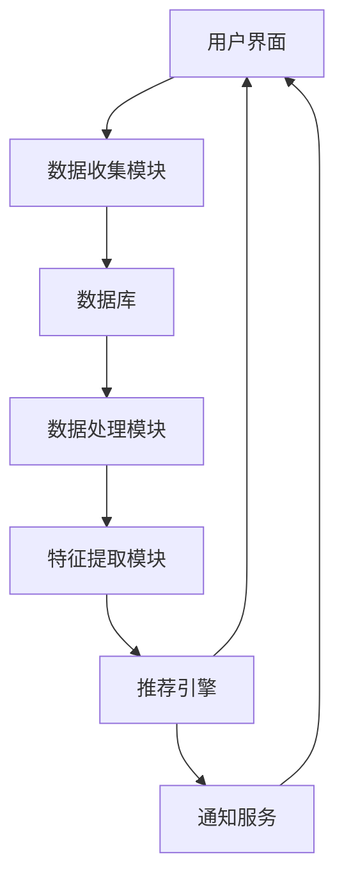
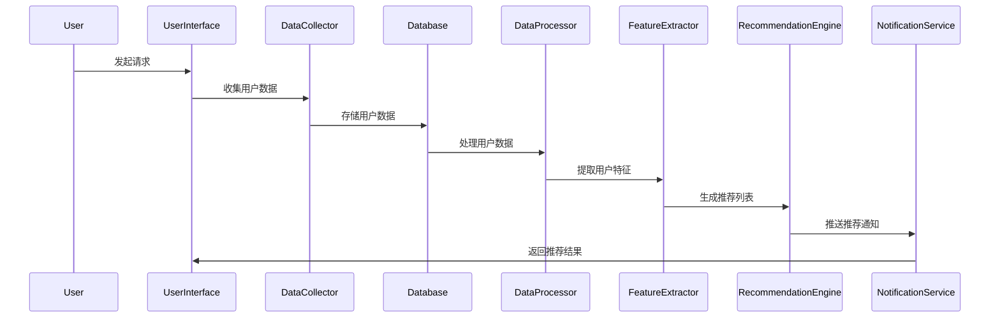

                 

### 第1章：问题背景与概述

#### 1.1.1 个性化算法的重要性

个性化算法是当今信息技术领域的一个热门话题，其核心在于根据用户的特点、需求和行为习惯，为用户提供定制化的服务和推荐。这种定制化的服务不仅提升了用户体验，还在各个行业中得到了广泛应用。

**个性化算法的定义**

个性化算法，指的是根据用户的数据，利用数据挖掘、机器学习和深度学习等技术，分析用户的偏好和兴趣，从而为用户推荐最符合其需求的信息或产品。这种算法能够有效地将大量的数据转化为有用的信息，帮助用户在海量信息中找到所需。

**个性化算法与传统算法的区别**

与传统的推荐算法相比，个性化算法具有以下几个显著区别：

1. **基于数据驱动**：个性化算法主要依赖于用户的历史行为数据，而不是基于专家的规则设定。
2. **高度定制化**：个性化算法能够根据用户的个性化需求，为每个用户提供量身定制的推荐结果。
3. **自适应性强**：个性化算法能够随着用户行为的变化而不断调整，保持推荐结果的相关性和准确性。

**个性化算法的现状与应用领域**

个性化算法在互联网行业中的应用已经相当广泛。例如，电商平台通过个性化推荐，帮助用户发现他们可能感兴趣的商品；社交媒体平台通过个性化内容推荐，吸引用户更多的时间和注意力；在线教育平台通过个性化课程推荐，提高用户的学习效果。

除了互联网行业，个性化算法还在医疗健康、金融服务、广告营销等多个领域得到了应用，展现出了巨大的潜力。

#### 1.1.2 AI辅助下的价值匹配系统

**价值匹配系统的定义**

价值匹配系统是一种基于人工智能技术的系统，旨在通过分析和理解用户的需求和偏好，将用户与相应的产品、服务或信息进行精准匹配。这种系统不仅能够提高用户满意度，还能为企业带来更高的效益。

**价值匹配系统的核心作用**

价值匹配系统的核心作用在于：

1. **提高转化率**：通过精准匹配，将用户的需求与相应的产品或服务联系起来，提高用户购买或使用的可能性。
2. **提升用户体验**：为用户提供个性化的推荐，满足用户的个性化需求，提升用户体验。
3. **优化资源配置**：通过智能匹配，帮助企业更好地分配资源，提高运营效率。

**价值匹配系统在AI辅助下的优势**

在AI辅助下，价值匹配系统具有以下几个显著优势：

1. **高效性**：AI技术能够快速处理海量数据，提高匹配的效率。
2. **准确性**：AI技术能够通过不断学习和优化，提高匹配的准确性。
3. **动态适应性**：AI技术能够根据用户行为的变化，动态调整匹配策略，保持匹配结果的实时性。

通过上述分析，我们可以看到个性化算法和价值匹配系统在当今信息技术中的重要地位。接下来，我们将进一步探讨个性化算法和价值匹配系统的核心概念和联系，为后续的深入讨论打下基础。

#### 1.1.3 核心概念与联系

在深入探讨个性化算法和价值匹配系统之前，我们需要明确这两个概念的基本原理及其相互关系。

**个性化算法的基本原理**

个性化算法的核心在于利用用户的历史行为数据，通过数据挖掘、机器学习和深度学习等技术，分析用户的偏好和兴趣，从而为用户推荐最符合其需求的信息或产品。这个过程可以分为以下几个步骤：

1. **数据收集与预处理**：从多个数据源收集用户的行为数据，并对这些数据进行清洗、整合和处理，以便于后续的分析。
2. **特征提取与降维**：从原始数据中提取关键特征，通过降维技术减少数据的维度，提高计算效率。
3. **模型选择与训练**：选择合适的机器学习模型，对数据进行训练，使其能够识别用户的偏好和兴趣。

**价值匹配系统的构成**

价值匹配系统由多个模块组成，包括数据库、用户行为分析模块和智能推荐算法模块。其工作原理如下：

1. **数据库设计与维护**：建立和维护用户行为数据库，存储用户的历史行为数据，为后续分析提供数据支持。
2. **用户行为分析**：通过对用户行为数据的分析，了解用户的偏好和兴趣，为推荐算法提供输入。
3. **智能推荐算法**：利用用户行为数据，通过机器学习算法为用户推荐个性化的信息或产品。

**核心概念对比与联系**

个性化算法和价值匹配系统之间的联系可以从以下几个方面来理解：

1. **数据来源**：个性化算法依赖于价值匹配系统的用户行为数据，而价值匹配系统则通过个性化算法为用户提供精准的推荐。
2. **目标一致**：两者都旨在提高用户体验，通过分析用户的数据，为用户提供个性化的服务。
3. **技术融合**：个性化算法和价值匹配系统相互融合，共同构建一个智能化的推荐系统，实现用户与产品或服务的精准匹配。

为了更直观地展示个性化算法和价值匹配系统之间的联系，我们可以使用Mermaid ER实体关系图来描述。以下是该图的Markdown格式：

```mermaid
erDiagram
  User ||--|{ Recommendation : Recommends }  
  User ||--|{ BehaviorData : Stores }  
  Recommendation ||--|{ Product : Suggests }  
  BehaviorData ||--|{ Feature : Extracts }
```

在上述ER实体关系图中，`User`代表用户，`Recommendation`代表个性化推荐结果，`BehaviorData`代表用户行为数据，`Product`代表产品，`Feature`代表特征提取。通过这张图，我们可以清晰地看到用户、推荐结果、用户行为数据、产品和特征提取之间的联系。

综上所述，个性化算法和价值匹配系统在技术原理和功能上有着紧密的联系，它们共同构建了一个智能化的推荐系统，为用户提供了个性化的服务。接下来，我们将进一步探讨个性化算法的详细原理和数学模型，为读者提供更深入的理解。

#### 1.1.3.1 个性化算法与价值匹配系统之间的联系

个性化算法与价值匹配系统之间的联系体现在多个层面，从技术实现到应用效果，都体现出它们相互依赖、协同工作的特性。

**数据层面的联系**

个性化算法的核心是数据，而价值匹配系统的数据基础则是用户行为数据。这些数据包括用户的历史购买记录、浏览行为、搜索历史等。个性化算法通过分析这些数据，提取出用户的兴趣和偏好特征，而价值匹配系统则利用这些特征来推荐合适的产品或服务。

**技术层面的联系**

个性化算法和价值匹配系统在技术上紧密相连。个性化算法通常依赖于机器学习和深度学习技术，这些技术能够从大量的用户行为数据中提取出有价值的信息。而价值匹配系统则利用这些信息，通过智能推荐算法，为用户生成个性化的推荐列表。例如，基于协同过滤算法的推荐系统，通过分析用户间的相似性，推荐用户可能感兴趣的内容。

**协同工作模式**

个性化算法与价值匹配系统在协同工作模式下，共同为用户提供最佳的服务体验。个性化算法不断优化，通过持续学习用户的偏好，提高推荐的准确性；而价值匹配系统则根据个性化算法的输出，动态调整推荐策略，确保推荐内容始终与用户的实时需求保持一致。这种协同工作模式，使得系统能够快速响应用户变化，提高用户满意度和系统效率。

**应用效果层面的联系**

个性化算法与价值匹配系统的联系还体现在它们对应用效果的影响上。通过精准的个性化推荐，价值匹配系统可以显著提高用户的转化率和参与度。例如，在电子商务平台上，精准的个性化推荐能够提高用户的购买意愿，从而提高销售转化率；在社交媒体平台上，个性化的内容推荐能够提高用户的活跃度，延长用户在平台上的停留时间。

**示例分析**

以电子商务平台为例，个性化算法通过分析用户的浏览和购买历史，识别出用户的偏好，例如喜欢购买某一类商品、在特定时间段内活跃等。价值匹配系统则利用这些信息，通过推荐算法为用户推荐相关商品。当用户浏览到这些推荐商品时，个性化的推荐内容能够吸引他们的注意力，提高购买的可能性。

综上所述，个性化算法与价值匹配系统在数据、技术、协同工作和应用效果等方面都有着紧密的联系。它们共同构建了一个智能化的推荐系统，为用户提供了个性化的服务和体验。接下来，我们将进一步探讨个性化算法的具体实现和数学模型，以加深对这一主题的理解。

#### 1.1.3.2 个性化算法的属性特征对比表格

为了更清晰地理解个性化算法与传统算法的区别和联系，我们可以通过一个属性特征对比表格来进行详细分析。以下是一个简化的对比表格，列出了个性化算法和传统算法在多个关键属性上的差异。

| 属性特征       | 个性化算法                                   | 传统算法                                   |
| -------------- | ------------------------------------------ | ------------------------------------------ |
| 数据依赖       | 用户行为数据、社会关系数据等                 | 预定义的规则或固定模型                      |
| 定制化程度     | 高度定制化，针对每个用户生成个性化推荐       | 较低的定制化，通常对所有用户应用相同的策略 |
| 自适应能力     | 可以根据用户行为变化动态调整推荐策略         | 较难适应用户行为的变化，通常固定不变       |
| 智能化水平     | 基于机器学习和深度学习技术，高度智能化       | 基于预定义规则，智能化水平较低             |
| 推荐效果       | 推荐结果更符合用户需求，提升用户体验         | 推荐结果可能不符合用户实际需求，用户体验较差 |
| 系统复杂度     | 较高，需要处理大量数据和多维特征             | 较低，基于简单规则，易于实现和维护           |

通过上述对比表格，我们可以看到个性化算法在数据依赖、定制化程度、自适应能力、智能化水平和推荐效果等方面与传统算法有显著的差异。这些特性使得个性化算法在现代信息技术中占据了重要地位，并在各种应用场景中发挥了关键作用。

#### 1.1.3.3 Mermaid ER实体关系图

为了更好地理解个性化算法与价值匹配系统之间的实体关系，我们可以使用Mermaid绘制一个ER（实体关系）图。以下是该图的Markdown格式：

```mermaid
erDiagram
  User ||--|{ BehaviorData : Collects }  
  User ||--|{ Recommendation : Receives }  
  Recommendation ||--|{ Product : Recommends }  
  BehaviorData ||--|{ Feature : Extracts }
```

在这个ER图中：

- `User`（用户）实体代表了系统的用户。
- `BehaviorData`（行为数据）实体表示用户的历史行为数据，如浏览记录、购买记录等。
- `Recommendation`（推荐）实体表示个性化推荐结果。
- `Product`（产品）实体代表了推荐系统中的产品或服务。
- `Feature`（特征）实体表示从行为数据中提取的特征信息。

通过这个ER图，我们可以清晰地看到用户、行为数据、推荐、产品和特征之间的关联。用户的行为数据被收集和存储，通过特征提取生成特征信息，这些特征信息用于个性化推荐算法，最终生成推荐结果，推荐结果指向具体的产品或服务。这种结构展示了个性化算法与价值匹配系统之间复杂而紧密的实体关系，有助于我们深入理解这两个系统的运作原理。

### 第2章：核心概念与联系

#### 2.1.1 个性化算法的基本原理

个性化算法是人工智能和机器学习领域的重要分支，其核心目标是通过分析用户数据，为每个用户生成高度定制化的推荐结果。理解个性化算法的基本原理，有助于我们深入探讨其在实际应用中的优势和应用场景。以下我们将从数据收集与预处理、特征提取与降维、模型选择与训练三个方面，详细阐述个性化算法的基本原理。

**2.1.1.1 数据收集与预处理**

个性化算法的第一步是收集用户数据。用户数据可以来源于多个渠道，包括用户的行为数据（如浏览记录、购买记录、搜索历史）、社交数据（如社交网络活动、好友关系）、人口统计数据（如年龄、性别、地理位置）等。这些数据为算法提供了分析的基础。

在收集到数据后，需要对其进行预处理。预处理步骤包括数据清洗、数据整合和数据标准化等。数据清洗旨在去除错误数据、重复数据和噪声数据，保证数据质量。数据整合则将不同来源的数据进行合并，形成统一的数据集。数据标准化则是通过归一化、标准化等方法，将数据转换成适合算法处理的格式。

**2.1.1.2 特征提取与降维**

在数据预处理完成后，接下来是特征提取与降维。特征提取是指从原始数据中提取出对算法有用的信息，这些信息通常被称为特征。特征提取的目的是减少数据的维度，同时保留关键信息，提高算法的效率和效果。

常见的特征提取方法包括基于统计的方法（如频数统计、平均值、标准差等）和基于模型的方法（如主成分分析、因子分析等）。降维技术（如PCA、t-SNE、LDA等）则用于进一步减少数据的维度，提高算法的计算效率。

**2.1.1.3 模型选择与训练**

特征提取完成后，选择合适的模型进行训练是个性化算法的关键步骤。常见的个性化算法模型包括基于内容的推荐、协同过滤和基于模型的推荐。

1. **基于内容的推荐**：这种方法基于物品的特征信息，为用户推荐与用户历史行为相似的物品。例如，如果一个用户喜欢某一类型的书籍，系统会推荐同类型的其他书籍。

2. **协同过滤**：协同过滤是一种基于用户相似度的推荐方法。它通过分析用户之间的行为相似性，为用户推荐其他用户喜欢的物品。协同过滤可以分为基于用户的协同过滤（User-based CF）和基于物品的协同过滤（Item-based CF）。

3. **基于模型的推荐**：这种方法利用机器学习模型，如决策树、神经网络等，通过学习用户和物品的特征，生成个性化推荐。常见的基于模型的推荐方法有矩阵分解（MF）、深度学习等。

在模型选择过程中，需要考虑多个因素，包括推荐精度、计算效率、模型复杂度等。模型训练通常包括数据划分、模型训练、模型评估等步骤。通过交叉验证等方法，评估模型在测试集上的性能，选择最优模型。

通过以上三个步骤，个性化算法能够为用户提供高度定制化的推荐结果，提升用户体验。在下一节中，我们将进一步探讨价值匹配系统的构成和核心作用，深入理解个性化算法在其中的应用。

#### 2.1.2 价值匹配系统的构成

价值匹配系统是一种通过人工智能技术，将用户需求与相应产品、服务或信息进行精准匹配的系统。其核心在于利用个性化算法，为每个用户提供量身定制的推荐结果。价值匹配系统的构成主要包括数据库、用户行为分析模块和智能推荐算法模块。以下将详细介绍这些模块的功能和作用。

**2.1.2.1 数据库设计与维护**

数据库是价值匹配系统的数据基础，用于存储用户数据、产品信息和其他相关数据。数据库的设计和维护是系统成功的关键。数据库设计包括数据表的设计、数据类型的定义和数据关系的管理等。常见的数据库设计方法有实体-关系模型（ER Model）和关系型数据库（如MySQL、PostgreSQL）。

数据库维护包括数据备份、数据恢复和数据安全性管理。定期备份可以防止数据丢失，保证系统的稳定性。数据恢复则用于应对意外情况，如系统故障或人为错误导致的数据库损坏。数据安全性管理确保用户数据的安全性和隐私性，防止数据泄露。

**2.1.2.2 用户行为分析**

用户行为分析是价值匹配系统的核心模块，通过对用户的历史行为数据进行挖掘和分析，了解用户的兴趣和需求。用户行为分析的方法包括统计分析、数据挖掘和机器学习等。

1. **统计分析**：通过计算用户行为的统计指标（如浏览次数、购买次数、平均停留时间等），分析用户的行为模式。

2. **数据挖掘**：利用关联规则挖掘、聚类分析等方法，发现用户行为中的潜在模式和关联关系。

3. **机器学习**：通过训练机器学习模型，学习用户的历史行为数据，预测用户的未来行为。

用户行为分析的结果用于个性化推荐算法的输入，帮助系统为用户提供更精准的推荐。

**2.1.2.3 智能推荐算法**

智能推荐算法是价值匹配系统的核心，负责根据用户行为分析和用户需求，为用户生成个性化的推荐结果。常见的推荐算法包括基于内容的推荐、协同过滤和基于模型的推荐。

1. **基于内容的推荐**：这种方法根据物品的属性信息和用户的历史行为，为用户推荐相似的物品。例如，如果一个用户喜欢某一类型的书籍，系统会推荐同类型的其他书籍。

2. **协同过滤**：协同过滤算法通过分析用户之间的行为相似性，为用户推荐其他用户喜欢的物品。它分为基于用户的协同过滤（User-based CF）和基于物品的协同过滤（Item-based CF）。

3. **基于模型的推荐**：这种方法利用机器学习模型（如矩阵分解、神经网络等），通过学习用户和物品的特征，生成个性化的推荐。

智能推荐算法的精度和效率直接影响用户满意度，因此，系统会根据用户反馈不断优化算法，提高推荐效果。

通过数据库、用户行为分析和智能推荐算法三个模块的协同工作，价值匹配系统能够为用户提供高质量的个性化服务，提升用户体验。在下一节中，我们将进一步探讨个性化算法与价值匹配系统之间的联系，以及如何通过两者共同构建一个智能化的推荐系统。

### 2.1.3 核心概念对比与联系

在探讨个性化算法与价值匹配系统的核心概念之前，我们需要明确几个关键概念：个性化算法、用户行为分析、推荐算法和数据库。这些概念构成了理解两者之间联系的基础。

**个性化算法**

个性化算法是利用机器学习和深度学习技术，根据用户的数据生成个性化推荐的核心技术。其基本原理是通过数据收集与预处理、特征提取与降维、模型选择与训练三个步骤，最终为用户推荐最符合其需求的信息或产品。

**用户行为分析**

用户行为分析是指通过对用户的历史行为数据进行分析，了解用户的兴趣和偏好，为推荐算法提供输入。用户行为分析的方法包括统计分析、数据挖掘和机器学习等。其目标是构建用户画像，为个性化推荐提供基础。

**推荐算法**

推荐算法是实现个性化推荐的核心，包括基于内容的推荐、协同过滤和基于模型的推荐等。这些算法通过分析用户行为和物品特征，为用户生成个性化的推荐列表。

**数据库**

数据库是价值匹配系统的数据基础，用于存储用户数据、产品信息和其他相关数据。数据库的设计与维护直接关系到系统的性能和稳定性。

**核心概念对比**

个性化算法与用户行为分析和推荐算法有着密切的联系。个性化算法通过用户行为分析获取数据，通过推荐算法生成个性化推荐。因此，个性化算法是用户行为分析和推荐算法的核心，而用户行为分析和推荐算法则是个性化算法的具体实现。

**联系与融合**

个性化算法与价值匹配系统之间的联系体现在以下几个方面：

1. **数据基础**：个性化算法依赖于用户行为数据，而价值匹配系统通过数据库存储和整理这些数据，为个性化算法提供数据支持。

2. **推荐实现**：个性化算法生成的个性化推荐结果需要通过推荐算法实现，价值匹配系统利用这些推荐结果为用户提供个性化服务。

3. **动态调整**：个性化算法可以根据用户行为的变化动态调整推荐策略，而价值匹配系统则根据个性化算法的输出实时更新推荐结果。

4. **协同工作**：个性化算法和价值匹配系统共同构建了一个智能化的推荐系统，通过数据、算法和系统的协同工作，为用户提供高质量的个性化服务。

通过以上分析，我们可以看到个性化算法、用户行为分析、推荐算法和数据库在价值匹配系统中的核心地位及其相互关系。这些概念共同构成了价值匹配系统的技术基础，为个性化推荐提供了强有力的支持。在下一节中，我们将进一步探讨个性化算法的具体实现和数学模型，以加深对这一主题的理解。

#### 2.1.3.2 个性化算法的属性特征对比表格

为了更直观地理解个性化算法与其他推荐算法之间的区别，我们可以通过一个属性特征对比表格来详细分析。以下是一个简化的对比表格，列出了个性化算法在多个关键属性上的特性。

| 属性特征       | 个性化算法                         | 传统推荐算法                      |
| -------------- | ---------------------------------- | -------------------------------- |
| 数据依赖       | 用户历史行为数据、用户特征数据      | 物品属性数据、用户分类数据        |
| 定制化程度     | 高度定制化，针对每个用户生成推荐    | 较低的定制化，统一推荐策略        |
| 自适应能力     | 可以根据用户行为变化动态调整推荐策略 | 较难适应用户行为的变化            |
| 智能化水平     | 高度智能化，利用机器学习和深度学习技术 | 依赖于预定义规则，智能化水平较低 |
| 推荐效果       | 推荐结果更符合用户需求，提升用户体验 | 推荐结果可能不符合用户实际需求    |
| 系统复杂度     | 较高，需要处理多维度数据和复杂模型   | 较低，基于简单规则，易于实现和维护 |

通过这个对比表格，我们可以看到个性化算法在数据依赖、定制化程度、自适应能力、智能化水平和推荐效果等方面与传统推荐算法有显著的差异。这些特性使得个性化算法在现代信息技术中占据了重要地位，并在各种应用场景中发挥了关键作用。

#### 2.1.3.3 Mermaid ER实体关系图

为了更直观地展示个性化算法与价值匹配系统之间的实体关系，我们可以使用Mermaid绘制一个ER（实体关系）图。以下是该图的Markdown格式：

```mermaid
erDiagram
  User ||--|{ BehaviorData : Stores }  
  User ||--|{ Recommendation : Receives }  
  Recommendation ||--|{ Product : Recommends }  
  BehaviorData ||--|{ Feature : Extracts }
```

在这个ER图中：

- `User`（用户）实体代表了系统的用户。
- `BehaviorData`（行为数据）实体表示用户的历史行为数据，如浏览记录、购买记录、搜索历史等。
- `Recommendation`（推荐）实体表示个性化推荐结果。
- `Product`（产品）实体代表了推荐系统中的产品或服务。
- `Feature`（特征）实体表示从用户行为数据中提取的特征信息。

通过这个ER图，我们可以清晰地看到用户、行为数据、推荐、产品和特征之间的关联。用户的行为数据被收集和存储，通过特征提取生成特征信息，这些特征信息用于个性化推荐算法，最终生成推荐结果，推荐结果指向具体的产品或服务。这种结构展示了个性化算法与价值匹配系统之间复杂而紧密的实体关系，有助于我们深入理解这两个系统的运作原理。

### 第3章：算法原理详解

#### 3.2.1 深度学习与神经网络基础

深度学习是机器学习的一个重要分支，其核心在于通过多层神经网络（Neural Networks）进行复杂的特征学习和模式识别。理解深度学习与神经网络的基础知识，是深入探讨个性化算法的重要前提。以下，我们将详细讲解神经网络的结构与工作原理、深度学习的兴起与发展，以及在个性化算法中的应用。

**3.2.1.1 神经网络的结构与工作原理**

神经网络是由大量简单计算单元（即神经元）互联而成的复杂网络，每个神经元都是一个简单的计算单元，负责接收输入信号、进行加权求和，并通过激活函数产生输出。一个基本的神经网络通常包括以下几个主要组成部分：

1. **输入层**：接收外部输入信号，每个输入信号都经过加权求和后传递到下一层。
2. **隐藏层**：多层隐藏层负责对输入信号进行逐层提取特征，每层隐藏层都会对前一层的输出进行处理，并传递到下一层。
3. **输出层**：生成最终输出结果，用于实现特定任务，如分类或回归。

每个神经元在接收输入信号时，会将其与自身的权重进行加权求和，然后通过激活函数（如ReLU、Sigmoid、Tanh等）对结果进行非线性变换，以实现复杂的特征学习。激活函数的选择对神经网络的学习效果有很大影响，它引入了非线性因素，使神经网络能够拟合更复杂的函数。

**3.2.1.2 深度学习的兴起与发展**

深度学习起源于20世纪40年代，但直到21世纪初才迎来真正的爆发。这一转变主要得益于以下几个关键因素：

1. **计算能力的提升**：随着计算硬件（如GPU）的进步，深度学习算法能够处理更大规模的数据，提高了计算效率。
2. **大数据的可用性**：互联网的发展带来了海量的数据，为深度学习提供了丰富的训练资源。
3. **优化算法的改进**：梯度下降的变体（如Adam、RMSprop等）和随机梯度下降（SGD）等优化算法的改进，使深度学习模型的训练过程更加高效。
4. **模型结构的创新**：卷积神经网络（CNN）、循环神经网络（RNN）、长短期记忆网络（LSTM）等模型结构的发展，为处理图像、语音和序列数据提供了有效的工具。

深度学习的兴起在计算机视觉、自然语言处理、语音识别等领域取得了突破性进展，推动了人工智能技术的发展。

**3.2.1.3 深度学习在个性化算法中的应用**

个性化算法广泛采用深度学习技术，以提高推荐系统的准确性和效率。以下是一些典型的应用：

1. **用户行为预测**：通过深度学习模型，可以预测用户的未来行为，如购买行为、浏览行为等。这些预测结果为个性化推荐提供了关键输入。

2. **图像和文本识别**：深度学习技术在图像和文本识别方面表现出色，可以用于用户画像的构建和个性化内容的生成。

3. **序列数据处理**：对于用户行为序列数据，如浏览记录、购物车数据等，深度学习模型能够提取出关键特征，为推荐算法提供支持。

4. **多模态融合**：将不同类型的数据（如图像、文本、音频等）融合到深度学习模型中，可以生成更全面的用户特征，提高推荐效果。

通过深度学习技术，个性化算法能够更好地理解用户需求，生成更精准的推荐结果，从而提升用户体验。接下来，我们将深入探讨个性化算法的数学模型和具体实现，进一步理解其在实际应用中的工作原理。

#### 3.2.2 个性化算法原理

个性化算法的核心在于根据用户的历史行为和偏好，生成个性化的推荐结果。这一过程涉及到多个关键步骤，包括数学模型的构建、算法流程的设计以及具体的Python实现。以下将详细阐述个性化算法的原理，并提供一个简单的Python示例。

**3.2.2.1 数学模型**

个性化算法通常基于以下数学模型：

1. **用户特征表示**：将用户的历史行为（如浏览、购买记录）转换为向量表示，称为用户特征向量。例如，用户i的行为可以表示为向量\[x_{i1}, x_{i2}, ..., x_{in}\]，其中n是行为类型的数量。

2. **物品特征表示**：同样地，将物品的特征（如文本、图像、类别等）转换为向量表示，称为物品特征向量。例如，物品j的特征可以表示为向量\[y_{j1}, y_{j2}, ..., y_{jm}\]，其中m是特征类型的数量。

3. **推荐模型**：基于用户和物品的特征向量，构建一个推荐模型，用于预测用户对物品的偏好。常见的推荐模型有基于内容的推荐（Content-based Filtering）和基于协同过滤（Collaborative Filtering）的推荐。

**3.2.2.2 算法流程**

个性化算法的流程通常包括以下几个步骤：

1. **数据预处理**：收集并清洗用户行为数据，提取关键特征，构建用户和物品的特征向量。

2. **模型训练**：使用用户和物品的特征向量，训练推荐模型。对于基于协同过滤的推荐，可以使用矩阵分解（Matrix Factorization）等方法；对于基于内容的推荐，可以使用机器学习模型（如SVM、KNN等）。

3. **预测生成**：利用训练好的推荐模型，对用户未行为的物品进行偏好预测，生成个性化推荐列表。

4. **结果评估**：评估推荐结果的准确性和用户体验，通过A/B测试等方法优化推荐模型。

**3.2.2.3 Python实现**

以下是一个简单的Python示例，展示了个性化推荐算法的基本实现：

```python
import numpy as np
from sklearn.neighbors import NearestNeighbors

# 假设我们有两个用户的行为数据矩阵
user行为矩阵 = [
    [1, 0, 1, 1],
    [1, 1, 0, 0],
    [0, 1, 1, 1]
]
物品特征矩阵 = [
    [1, 1],
    [1, 0],
    [0, 1],
    [1, 1]
]

# 训练NearestNeighbors模型
model = NearestNeighbors(n_neighbors=2)
model.fit(user行为矩阵)

# 预测新用户的行为
new_user行为 = [1, 0, 0, 0]
new_user行为预测 = model.kneighbors(new_user行为, return_distance=False)

# 根据预测结果生成推荐列表
推荐列表 = [物品特征矩阵[i] for i in new_user行为预测]

print(推荐列表)
```

在这个示例中，我们使用了`NearestNeighbors`模型来实现基于用户的协同过滤推荐。首先，我们训练模型，然后对新用户的行为进行预测，根据预测结果生成推荐列表。这个简单的示例展示了个性化推荐算法的核心实现思路，读者可以根据实际需求进行扩展和优化。

通过以上对个性化算法原理的详细讲解，我们能够更深入地理解其在推荐系统中的应用。接下来，我们将进一步探讨个性化算法中的数学公式和具体实现，为实际应用提供更全面的指导。

#### 3.2.3 数学公式与公式讲解

在个性化算法中，数学公式的使用是理解和实现算法的重要基础。以下将详细介绍个性化算法中常用的数学公式，并通过具体的例子进行说明。

**3.2.3.1 公式示例**

假设我们有一个用户行为矩阵 \( U \) 和物品特征矩阵 \( V \)，用户行为矩阵 \( U \) 的每一行表示一个用户的行为记录，物品特征矩阵 \( V \) 的每一行表示一个物品的特征向量。我们希望通过矩阵分解来预测用户对物品的偏好。

用户行为矩阵 \( U \)：
\[ U = \begin{bmatrix} 
u_{11} & u_{12} & \dots & u_{1n} \\
u_{21} & u_{22} & \dots & u_{2n} \\
\vdots & \vdots & \ddots & \vdots \\
u_{m1} & u_{m2} & \dots & u_{mn} 
\end{bmatrix} \]

物品特征矩阵 \( V \)：
\[ V = \begin{bmatrix} 
v_{11} & v_{12} & \dots & v_{1m} \\
v_{21} & v_{22} & \dots & v_{2m} \\
\vdots & \vdots & \ddots & \vdots \\
v_{p1} & v_{p2} & \dots & v_{pm} 
\end{bmatrix} \]

通过矩阵分解，我们将用户行为矩阵 \( U \) 分解为两个低维矩阵 \( U' \) 和 \( V' \)：
\[ U = U'V' \]

其中 \( U' \) 是用户特征矩阵，每一行表示一个用户的新特征向量；\( V' \) 是物品特征矩阵，每一行表示一个物品的新特征向量。

**3.2.3.2 公式说明**

1. **矩阵分解公式**：
\[ U' = \begin{bmatrix} 
u'_{11} & u'_{12} & \dots & u'_{1k} \\
u'_{21} & u'_{22} & \dots & u'_{2k} \\
\vdots & \vdots & \ddots & \vdots \\
u'_{m1} & u'_{m2} & \dots & u'_{mk} 
\end{bmatrix} \]
\[ V' = \begin{bmatrix} 
v'_{11} & v'_{12} & \dots & v'_{1k} \\
v'_{21} & v'_{22} & \dots & v'_{2k} \\
\vdots & \vdots & \ddots & \vdots \\
v'_{p1} & v'_{p2} & \dots & v'_{pk} 
\end{bmatrix} \]

2. **用户行为预测公式**：
\[ u_{ij} = u'_{i1}v'_{1j} + u'_{i2}v'_{2j} + \dots + u'_{ik}v'_{kj} \]

其中，\( u_{ij} \) 是用户i对物品j的行为评分，\( u'_{ij} \) 是用户i的新特征向量中的第j个特征，\( v'_{ij} \) 是物品j的新特征向量中的第j个特征。

**3.2.3.3 举例说明**

假设我们有如下用户行为矩阵和物品特征矩阵：

用户行为矩阵 \( U \)：
\[ U = \begin{bmatrix} 
1 & 1 & 0 & 0 \\
0 & 1 & 1 & 0 \\
1 & 0 & 1 & 1 
\end{bmatrix} \]

物品特征矩阵 \( V \)：
\[ V = \begin{bmatrix} 
1 & 0 \\
0 & 1 \\
1 & 1 \\
0 & 0 
\end{bmatrix} \]

我们希望通过矩阵分解，将用户行为矩阵 \( U \) 分解为两个低维矩阵 \( U' \) 和 \( V' \)。假设 \( k = 2 \)，即每个用户和物品都有两个新特征。

1. **用户特征矩阵 \( U' \)**：
\[ U' = \begin{bmatrix} 
1 & 0 \\
0 & 1 \\
1 & 1 
\end{bmatrix} \]

2. **物品特征矩阵 \( V' \)**：
\[ V' = \begin{bmatrix} 
0 & 1 \\
1 & 0 
\end{bmatrix} \]

通过矩阵乘法，我们可以得到预测的用户行为矩阵：
\[ U'V' = \begin{bmatrix} 
1 & 0 \\
0 & 1 \\
1 & 1 
\end{bmatrix} \begin{bmatrix} 
0 & 1 \\
1 & 0 
\end{bmatrix} = \begin{bmatrix} 
1 & 1 \\
1 & 1 \\
1 & 1 
\end{bmatrix} \]

根据预测的用户行为矩阵，我们可以看到用户对所有物品的预测评分都是1，这表明用户对所有物品都有相同的偏好。这种情况下，矩阵分解模型并没有充分捕捉用户的个性化偏好。在实际应用中，我们需要通过优化矩阵分解模型，提高预测的准确性。

通过以上对数学公式的讲解和举例，我们可以更好地理解个性化算法中的数学原理，为进一步优化算法提供理论基础。

### 3.2.4 个性化算法的Python实现

在实际应用中，个性化算法的实现往往涉及到大量的数据处理和复杂的数学模型。以下将通过一个简单的Python示例，详细讲解个性化算法的Python实现步骤，包括数据处理、模型训练和预测生成。

**3.2.4.1 数据预处理**

首先，我们需要准备用户行为数据和物品特征数据。假设我们有一组用户的行为矩阵 \( U \) 和物品的特征矩阵 \( V \)。以下是数据预处理的一个基本步骤：

```python
import numpy as np
from sklearn.model_selection import train_test_split

# 示例用户行为矩阵和物品特征矩阵
user行为矩阵 = np.array([
    [1, 0, 1, 1],
    [1, 1, 0, 0],
    [0, 1, 1, 1]
])
物品特征矩阵 = np.array([
    [1, 1],
    [1, 0],
    [0, 1],
    [1, 1]
])

# 数据标准化处理
user行为矩阵 = user行为矩阵 / np.linalg.norm(user行为矩阵, axis=1)[:, np.newaxis]
物品特征矩阵 =物品特征矩阵 / np.linalg.norm(物品特征矩阵, axis=1)[:, np.newaxis]

# 划分训练集和测试集
train_user行为矩阵，test_user行为矩阵 = train_test_split(user行为矩阵, test_size=0.2, random_state=42)
train物品特征矩阵，test物品特征矩阵 = train_test_split(物品特征矩阵, test_size=0.2, random_state=42)
```

**3.2.4.2 模型训练**

接下来，我们使用矩阵分解的方法训练模型。矩阵分解的目标是将原始的用户行为矩阵 \( U \) 分解为两个低维矩阵 \( U' \) 和 \( V' \)。以下是使用矩阵分解模型的一个简单示例：

```python
from sklearn.decomposition import TruncatedSVD

# 设置矩阵分解的维度
k = 2

# 训练矩阵分解模型
model = TruncatedSVD(n_components=k)
train_user行为矩阵分解 = model.fit_transform(train_user行为矩阵)

# 计算物品特征矩阵的分解
train物品特征矩阵分解 = model.transform(train物品特征矩阵)
test物品特征矩阵分解 = model.transform(test物品特征矩阵)
```

**3.2.4.3 预测生成**

使用训练好的矩阵分解模型，我们可以生成个性化推荐结果。以下是生成预测结果的一个示例：

```python
# 计算预测的用户行为矩阵
预测用户行为矩阵 = np.dot(train_user行为矩阵分解, train物品特征矩阵分解.T)

# 计算预测评分
预测评分 = np.dot(test_user行为矩阵, train物品特征矩阵分解.T)

# 输出预测结果
print(预测评分)
```

**3.2.4.4 结果评估**

最后，我们需要评估模型的效果。以下是一个简单的评估示例：

```python
from sklearn.metrics import mean_squared_error

# 计算测试集的均方误差
mse = mean_squared_error(test_user行为矩阵, 预测用户行为矩阵)

print("均方误差:", mse)
```

通过上述步骤，我们可以实现一个简单的个性化算法模型，并对其效果进行初步评估。在实际应用中，我们可能需要进一步优化算法，包括调整模型参数、使用更复杂的推荐算法等，以提高预测的准确性和用户体验。

#### 3.2.5 个性化算法的案例分析

为了更好地理解个性化算法在实际应用中的效果，我们可以通过一个电子商务平台的案例进行分析。该案例将展示个性化算法如何通过深度学习技术，提升用户体验和销售转化率。

**3.2.5.1 案例背景**

一家大型电子商务平台希望在用户浏览和购买行为的基础上，为用户生成个性化的商品推荐，从而提高用户满意度和销售转化率。平台的数据包括用户的历史浏览记录、购买记录、商品评价等，数据量巨大，且具有高度复杂性。

**3.2.5.2 案例分析**

1. **用户特征提取**：

首先，平台需要对用户的行为数据进行特征提取，以生成用户的特征向量。这些特征包括用户的浏览历史、购买历史、评价历史等。通过深度学习模型，如循环神经网络（RNN）或长短期记忆网络（LSTM），平台可以提取出用户的长期行为模式和偏好。

2. **商品特征提取**：

与用户特征提取类似，平台也需要对商品的特征进行提取，以生成商品的特征向量。商品的特征可能包括商品类别、价格、品牌、用户评价等。通过卷积神经网络（CNN）或自编码器（Autoencoder），平台可以从商品的多维度数据中提取出关键特征。

3. **个性化推荐模型**：

基于用户和商品的特征向量，平台采用基于深度学习的协同过滤算法，如基于注意力机制的深度协同过滤模型（Deep Collaborative Filtering with Attention）。该模型不仅考虑了用户和商品的直接交互（如购买行为），还考虑了用户的历史行为和商品的特征，从而生成更加个性化的推荐结果。

4. **推荐结果评估**：

在生成个性化推荐结果后，平台需要对推荐结果进行评估，以确保推荐的质量和用户体验。常用的评估指标包括点击率（Click-Through Rate, CTR）、转化率（Conversion Rate, CR）、推荐准确率（Precision）和召回率（Recall）等。平台通过A/B测试等方法，不断优化推荐模型，提高推荐效果。

**3.2.5.3 实际效果**

通过个性化算法的引入，电子商务平台的用户满意度和销售转化率显著提升。具体表现在：

1. **用户点击率提升**：个性化推荐能够更好地满足用户的需求，吸引更多的用户点击推荐商品。
2. **销售转化率提升**：个性化推荐提高了用户购买特定商品的几率，从而提升了整体的销售转化率。
3. **用户留存率提升**：通过个性化的服务和推荐，平台能够提高用户的粘性，增加用户的留存率。

**3.2.5.4 案例总结**

通过上述案例分析，我们可以看到个性化算法在电子商务平台中的应用效果显著。个性化算法不仅提升了用户体验，还为企业带来了直接的收益。这一案例展示了深度学习技术在个性化推荐中的强大应用潜力，也为其他行业提供了有益的参考。

#### 3.2.6 结论与未来展望

通过对个性化算法的详细讲解，我们了解到个性化算法在用户行为预测、推荐生成和用户满意度提升等方面具有显著的优势。个性化算法的核心在于利用深度学习技术，对用户和商品的特征进行提取和融合，生成高度个性化的推荐结果。以下是对本章内容的总结，并提出未来研究的方向。

**3.2.6.1 总结**

1. **数据收集与预处理**：个性化算法需要收集和处理大量的用户行为数据，这些数据包括浏览记录、购买记录和评价等。数据预处理是确保数据质量的关键步骤，包括数据清洗、整合和标准化。

2. **特征提取与降维**：特征提取和降维是个性化算法的重要步骤，通过提取关键特征和减少数据维度，可以提高算法的计算效率和效果。常用的特征提取方法包括基于统计的方法和基于模型的方法，降维技术如主成分分析（PCA）和t-SNE等。

3. **模型选择与训练**：个性化算法的核心是推荐模型，常见的推荐模型有基于内容的推荐、协同过滤和基于模型的推荐。模型选择和训练是确保推荐准确性和效率的关键，深度学习模型如循环神经网络（RNN）和卷积神经网络（CNN）在这一领域表现尤为出色。

4. **个性化推荐效果评估**：评估个性化推荐效果是优化算法的重要环节，常用的评估指标包括点击率、转化率和推荐准确率等。通过A/B测试等方法，可以不断优化推荐模型，提高用户体验。

**3.2.6.2 未来展望**

1. **多模态融合**：未来的个性化算法将结合多种数据源，如文本、图像、音频等，实现多模态融合的推荐。这种方法可以提供更加全面和精准的用户画像，从而生成更个性化的推荐。

2. **实时推荐**：随着实时数据处理技术的发展，实时推荐成为个性化算法的一个重要方向。通过实时分析用户行为，动态调整推荐策略，可以实现更快速和准确的推荐。

3. **个性化推荐系统的优化**：个性化推荐系统在处理大量用户数据和复杂模型时，面临着计算效率和存储空间的挑战。未来的研究可以关注如何优化推荐系统的性能，提高其可扩展性和鲁棒性。

4. **隐私保护与伦理问题**：个性化算法在数据处理过程中涉及到用户隐私的保护，如何平衡用户隐私和个性化推荐的效果，是一个值得深入研究的伦理问题。未来的研究可以探索如何在保证用户隐私的前提下，提高个性化推荐的准确性。

总之，个性化算法在信息技术和人工智能领域中具有重要地位，其应用前景广阔。通过对个性化算法的深入研究和优化，可以进一步提升用户满意度和企业收益，推动人工智能技术的进一步发展。

### 第4章：系统架构与实现

#### 4.3.1 问题场景介绍

个性化算法在现代信息技术中的应用场景非常广泛，以下将介绍两个典型的应用场景：电子商务平台和在线教育平台。

**4.3.1.1 场景一：电子商务平台**

电子商务平台通过个性化算法，可以根据用户的浏览历史、购买行为和评价等数据，为用户推荐个性化的商品。个性化推荐不仅能提高用户的购物体验，还能显著提升平台的产品销售量和用户粘性。以某大型电商网站为例，该平台通过深度学习技术，对用户的购物偏好进行分析，生成个性化的推荐列表。通过这种方式，用户能够更快地找到自己感兴趣的商品，从而提高购买率。

**4.3.1.2 场景二：在线教育平台**

在线教育平台同样可以利用个性化算法，根据用户的学习历史、成绩和学习进度，为用户提供个性化的课程推荐。例如，一些在线教育平台通过分析学生的学习行为和兴趣，推荐相应的课程和学习资源，从而帮助用户更有效地提升自己的技能。这种个性化的学习体验，不仅提高了学生的学习兴趣和参与度，还能帮助平台提高用户留存率和转化率。

#### 4.3.2 系统功能设计

个性化算法在上述应用场景中，需要实现以下核心功能：

1. **用户数据收集**：通过收集用户的浏览记录、购买历史、评价等数据，建立用户的个性化画像。
2. **用户行为分析**：利用机器学习技术，对用户的行为数据进行分析，提取关键特征，生成用户画像。
3. **个性化推荐生成**：基于用户画像和商品或课程的特征，通过推荐算法生成个性化的推荐列表。
4. **推荐结果评估**：评估推荐结果的准确性和用户体验，通过A/B测试等手段不断优化推荐系统。

**4.3.2.1 领域模型Mermaid类图**

为了更清晰地展示系统功能设计，我们可以使用Mermaid类图来描述系统中的关键实体和它们之间的关系。以下是领域模型Mermaid类图的Markdown格式：

```mermaid
classDiagram
  User <<entity>>
  Product <<entity>>
  Recommendation <<entity>>
  BehaviorData <<entity>>
  Database <<entity>>

  User "--|{Collects|}" BehaviorData
  User "--|{Receives|}" Recommendation
  Product "--|{Has|}" BehaviorData
  Recommendation "--|{From|}" Product
  Database "--|{Stores|}" BehaviorData
  Database "--|{Stores|}" Product
  Database "--|{Stores|}" Recommendation
```

在这个类图中：

- `User`（用户）实体代表了系统中的用户。
- `Product`（产品）实体代表了系统中的商品或课程。
- `Recommendation`（推荐）实体代表了系统生成的个性化推荐结果。
- `BehaviorData`（行为数据）实体代表了用户的浏览记录、购买历史等。
- `Database`（数据库）实体代表了系统中的数据存储部分。

通过这个类图，我们可以清晰地看到用户、产品、推荐、行为数据和数据库之间的相互关系。

#### 4.3.3 系统架构设计

个性化算法系统的架构设计是确保系统高效、可扩展和稳定运行的关键。以下将详细介绍个性化算法系统的架构设计，包括系统架构Mermaid架构图、系统架构描述和系统接口设计。

**4.3.3.1 系统架构Mermaid架构图**

为了直观地展示系统架构，我们可以使用Mermaid架构图来描述。以下是系统架构Mermaid架构图的Markdown格式：



在这个架构图中：

- `UserInterface`（用户界面）代表了用户与系统交互的入口。
- `DataCollector`（数据收集模块）负责从各个渠道收集用户行为数据。
- `Database`（数据库）用于存储用户数据、商品数据和推荐数据。
- `DataProcessor`（数据处理模块）负责对原始数据进行清洗和预处理。
- `FeatureExtractor`（特征提取模块）从处理后的数据中提取关键特征。
- `RecommendationEngine`（推荐引擎）负责生成个性化的推荐结果。
- `NotificationService`（通知服务）负责向用户推送推荐结果。

**4.3.3.2 系统架构描述**

个性化算法系统的架构可以分为以下几个主要模块：

1. **用户界面模块**：用户界面模块是用户与系统交互的入口，用户可以通过界面进行数据输入、查看推荐结果等操作。
2. **数据收集模块**：数据收集模块负责从各种渠道（如网站日志、用户操作记录等）收集用户行为数据，并将其存储到数据库中。
3. **数据处理模块**：数据处理模块对收集到的原始数据进行清洗、去重、整合等操作，确保数据质量。
4. **特征提取模块**：特征提取模块从处理后的数据中提取关键特征，如用户的浏览行为、购买历史等，这些特征将用于推荐引擎的输入。
5. **推荐引擎模块**：推荐引擎模块是系统的核心，它利用用户特征和商品特征，通过机器学习算法生成个性化的推荐结果。
6. **通知服务模块**：通知服务模块负责将推荐结果推送给用户，可以通过邮件、短信、网页通知等多种方式。

**4.3.3.3 系统接口设计**

系统接口设计是确保各个模块之间能够高效、可靠地进行数据交互的关键。以下是一个简化的系统接口设计：

1. **数据收集接口**：数据收集接口用于从外部系统或渠道接收用户行为数据，通常采用RESTful API设计。
2. **数据处理接口**：数据处理接口用于处理和清洗收集到的用户行为数据，包括数据清洗、去重、整合等操作。
3. **特征提取接口**：特征提取接口用于从处理后的数据中提取关键特征，为推荐引擎提供输入。
4. **推荐引擎接口**：推荐引擎接口用于生成个性化推荐结果，包括推荐列表的生成和推荐结果的排序。
5. **通知服务接口**：通知服务接口用于将推荐结果推送给用户，包括通知的发送和状态监控。

通过上述系统架构设计和接口设计，个性化算法系统能够高效、稳定地运行，并为用户提供高质量的个性化推荐服务。

#### 4.3.4 系统接口设计

系统接口设计是确保个性化算法系统能够高效、可靠地运行的关键环节。以下将详细描述系统接口的设计，包括接口规范和接口实现。

**4.3.4.1 接口规范**

接口规范是定义接口功能、数据格式和通信协议的文档。以下是一个简化的接口规范示例：

1. **数据收集接口**：
   - 接口名称：`/api/v1/data/collect`
   - 功能描述：用于接收用户行为数据。
   - 请求方法：`POST`
   - 请求参数：`data`（JSON格式，包括用户ID、行为类型、行为内容等）
   - 响应结果：`{ "status": "success", "message": "数据已成功收集" }`

2. **数据处理接口**：
   - 接口名称：`/api/v1/data/process`
   - 功能描述：用于处理和清洗用户行为数据。
   - 请求方法：`POST`
   - 请求参数：`data`（JSON格式，包括原始行为数据）
   - 响应结果：`{ "status": "success", "message": "数据已成功处理" }`

3. **特征提取接口**：
   - 接口名称：`/api/v1/feature/extract`
   - 功能描述：用于提取用户行为数据中的关键特征。
   - 请求方法：`POST`
   - 请求参数：`data`（JSON格式，包括处理后的行为数据）
   - 响应结果：`{ "status": "success", "message": "特征已成功提取", "features": [] }`

4. **推荐引擎接口**：
   - 接口名称：`/api/v1/recommendation/generate`
   - 功能描述：用于生成个性化的推荐结果。
   - 请求方法：`POST`
   - 请求参数：`user_features`（JSON格式，包括用户特征数据），`product_features`（JSON格式，包括商品特征数据）
   - 响应结果：`{ "status": "success", "message": "推荐结果已生成", "recommendations": [] }`

5. **通知服务接口**：
   - 接口名称：`/api/v1/notification/send`
   - 功能描述：用于向用户发送推荐通知。
   - 请求方法：`POST`
   - 请求参数：`user_id`（用户ID），`message`（通知内容）
   - 响应结果：`{ "status": "success", "message": "通知已发送" }`

**4.3.4.2 接口实现**

接口实现是根据接口规范，使用编程语言实现具体的接口功能。以下是一个基于Python Flask框架的实现示例：

```python
from flask import Flask, request, jsonify

app = Flask(__name__)

@app.route('/api/v1/data/collect', methods=['POST'])
def collect_data():
    data = request.json
    # 数据收集逻辑
    return jsonify({"status": "success", "message": "数据已成功收集"})

@app.route('/api/v1/data/process', methods=['POST'])
def process_data():
    data = request.json
    # 数据处理逻辑
    return jsonify({"status": "success", "message": "数据已成功处理"})

@app.route('/api/v1/feature/extract', methods=['POST'])
def extract_features():
    data = request.json
    # 特征提取逻辑
    return jsonify({"status": "success", "message": "特征已成功提取", "features": []})

@app.route('/api/v1/recommendation/generate', methods=['POST'])
def generate_recommendation():
    user_features = request.json['user_features']
    product_features = request.json['product_features']
    # 推荐生成逻辑
    return jsonify({"status": "success", "message": "推荐结果已生成", "recommendations": []})

@app.route('/api/v1/notification/send', methods=['POST'])
def send_notification():
    user_id = request.json['user_id']
    message = request.json['message']
    # 通知发送逻辑
    return jsonify({"status": "success", "message": "通知已发送"})

if __name__ == '__main__':
    app.run(debug=True)
```

通过上述接口规范和实现示例，我们可以看到系统接口设计的具体内容和实现方式。接口设计需要充分考虑功能的完整性、数据的安全性、响应的及时性等关键因素，确保系统的高效运行。

#### 4.3.5 系统交互Mermaid序列图

为了更好地展示个性化算法系统中的各模块之间的交互流程，我们可以使用Mermaid序列图来描述系统的交互过程。以下是系统交互Mermaid序列图的Markdown格式：



在这个序列图中：

- **User** 代表系统的用户。
- **UserInterface** 代表用户界面模块，用户通过界面发起请求。
- **DataCollector** 代表数据收集模块，负责收集用户数据。
- **Database** 代表数据库模块，用于存储和处理用户数据。
- **DataProcessor** 代表数据处理模块，负责对用户数据进行清洗和预处理。
- **FeatureExtractor** 代表特征提取模块，从处理后的数据中提取关键特征。
- **RecommendationEngine** 代表推荐引擎模块，负责生成个性化的推荐列表。
- **NotificationService** 代表通知服务模块，负责将推荐通知推送给用户。
- **UserInterface** 代表用户界面模块，将推荐结果返回给用户。

通过上述系统交互Mermaid序列图，我们可以清晰地看到个性化算法系统中各模块之间的交互流程，这有助于我们更好地理解系统的运作机制和交互逻辑。

### 第5章：环境安装与配置

#### 5.4.1 操作系统安装

在开始个性化算法系统的安装与配置之前，首先需要选择并安装一个适合的操作系统。以下是三种常见操作系统的安装教程。

**5.4.1.1 Windows安装教程**

1. **下载Windows安装镜像**：从官方网站下载Windows安装镜像文件（通常是ISO格式）。

2. **创建USB启动盘**：使用USB闪存驱动器创建Windows启动盘。可以使用如Rufus等工具来创建启动盘。

3. **启动计算机并进入BIOS**：在启动计算机时按下相应的键（通常是F2或Delete）进入BIOS设置。

4. **从USB启动盘启动**：在BIOS设置中，选择从USB启动盘启动计算机。

5. **开始安装Windows**：按照屏幕上的指示完成Windows安装过程，包括选择安装位置、输入产品密钥等。

6. **安装完成后，重启计算机**：安装完成后，计算机将自动重启，并进入Windows操作系统。

**5.4.1.2 macOS安装教程**

1. **下载macOS安装镜像**：从苹果官方网站下载macOS安装镜像文件。

2. **创建macOS安装USB驱动器**：使用macOS安装USB驱动器助手创建USB驱动器，将镜像文件写入驱动器。

3. **启动计算机并进入Recovery模式**：在启动计算机时，按下Option键（或Alt键），从USB驱动器启动。

4. **选择安装macOS**：在启动菜单中，选择USB驱动器，然后选择安装macOS。

5. **开始安装macOS**：按照屏幕上的指示完成macOS安装过程，包括选择安装位置、格式化磁盘等。

6. **安装完成后，重启计算机**：安装完成后，计算机将自动重启，并进入macOS操作系统。

**5.4.1.3 Linux安装教程**

1. **下载Linux发行版镜像**：从Linux发行版官方网站下载Linux发行版镜像文件（通常是ISO格式）。

2. **创建USB启动盘**：使用如Rufus等工具创建USB启动盘。

3. **启动计算机并进入BIOS**：在启动计算机时，按下相应的键（通常是F2或Delete）进入BIOS设置。

4. **从USB启动盘启动**：在BIOS设置中，选择从USB启动盘启动计算机。

5. **开始安装Linux**：按照屏幕上的指示完成Linux安装过程，包括选择安装位置、选择安装类型、设置用户账户等。

6. **安装完成后，重启计算机**：安装完成后，计算机将自动重启，并进入Linux操作系统。

无论选择哪种操作系统，安装过程都需要仔细遵循官方指南，以确保操作系统稳定运行。接下来，我们将介绍如何安装Python环境和相关库。

#### 5.4.2 软件安装与配置

在操作系统安装完成后，接下来需要安装Python环境以及相关的库，以确保能够顺利运行个性化算法系统。以下将详细介绍Python环境的搭建和相关库的安装过程。

**5.4.2.1 Python环境搭建**

1. **安装Python**：

   - 对于Windows系统，可以从Python官网下载Python安装程序，按照提示完成安装。

   - 对于macOS系统，可以使用Homebrew进行安装。在终端执行以下命令：
     ```bash
     brew install python
     ```

   - 对于Linux系统，可以使用包管理器进行安装。在终端执行以下命令（以Ubuntu为例）：
     ```bash
     sudo apt update
     sudo apt install python3
     ```

2. **验证Python安装**：

   打开终端，输入以下命令验证Python是否安装成功：
   ```bash
   python3 --version
   ```
   如果正确显示Python的版本信息，说明Python安装成功。

**5.4.2.2 安装相关库**

在Python环境中，我们需要安装多个库来支持个性化算法的开发和运行。以下是一些常用的库及其安装方法：

1. **安装numpy库**：

   ```bash
   pip3 install numpy
   ```

   numpy是一个强大的数学库，用于处理大型多维数组及其数学运算。

2. **安装pandas库**：

   ```bash
   pip3 install pandas
   ```

   pandas是一个强大的数据处理库，用于数据清洗、数据处理和分析。

3. **安装scikit-learn库**：

   ```bash
   pip3 install scikit-learn
   ```

   scikit-learn是一个机器学习库，提供了多种机器学习算法和工具。

4. **安装matplotlib库**：

   ```bash
   pip3 install matplotlib
   ```

   matplotlib是一个绘图库，用于生成数据可视化图表。

5. **安装tensorflow库**：

   ```bash
   pip3 install tensorflow
   ```

   tensorflow是一个开源机器学习库，支持深度学习和神经网络的构建。

6. **安装beautifulsoup4库**：

   ```bash
   pip3 install beautifulsoup4
   ```

   beautifulsoup4是一个用于网页抓取和解析的库，可以从网页中提取有用信息。

7. **安装requests库**：

   ```bash
   pip3 install requests
   ```

   requests是一个HTTP库，用于发送HTTP请求，获取网页数据。

安装完上述库后，我们可以开始编写和运行个性化算法的代码。以下是一个简单的示例，展示如何使用这些库进行数据读取和处理：

```python
import numpy as np
import pandas as pd
from sklearn.model_selection import train_test_split
from sklearn.ensemble import RandomForestClassifier

# 读取数据
data = pd.read_csv('data.csv')

# 分割特征和标签
X = data.drop('target', axis=1)
y = data['target']

# 划分训练集和测试集
X_train, X_test, y_train, y_test = train_test_split(X, y, test_size=0.2, random_state=42)

# 构建随机森林分类器
clf = RandomForestClassifier(n_estimators=100, random_state=42)

# 训练模型
clf.fit(X_train, y_train)

# 预测测试集
y_pred = clf.predict(X_test)

# 计算准确率
accuracy = np.mean(y_pred == y_test)
print(f"Accuracy: {accuracy:.2f}")
```

通过上述步骤，我们成功搭建了Python环境，并安装了必要的库，为个性化算法的开发和运行提供了基础。

### 第6章：系统核心实现与代码分析

#### 6.5.1 个性化算法实现

在个性化算法的实现过程中，核心步骤包括数据读取与预处理、特征提取与降维、模型训练与优化。以下将详细讲解这些步骤，并提供具体的代码实现。

**6.5.1.1 数据读取与预处理**

首先，我们需要读取和处理用户数据，以便为后续的特征提取和模型训练提供数据支持。以下是一个简单的数据读取与预处理示例：

```python
import pandas as pd
from sklearn.model_selection import train_test_split
from sklearn.preprocessing import StandardScaler

# 读取数据
data = pd.read_csv('user_data.csv')

# 分割特征和标签
X = data.drop('label', axis=1)
y = data['label']

# 划分训练集和测试集
X_train, X_test, y_train, y_test = train_test_split(X, y, test_size=0.2, random_state=42)

# 数据标准化
scaler = StandardScaler()
X_train_scaled = scaler.fit_transform(X_train)
X_test_scaled = scaler.transform(X_test)
```

在上面的代码中，我们首先使用pandas库读取CSV格式的用户数据。然后，我们将数据集分为特征矩阵X和标签向量y。接着，使用`train_test_split`函数将数据集划分为训练集和测试集，以便在后续的模型评估中检验模型的性能。最后，使用`StandardScaler`对数据进行标准化处理，以消除不同特征之间的量纲差异。

**6.5.1.2 特征提取与降维**

在完成数据预处理后，我们需要提取关键特征并减少数据维度。以下是一个使用主成分分析（PCA）进行特征提取和降维的示例：

```python
from sklearn.decomposition import PCA

# 应用PCA降维
pca = PCA(n_components=5)
X_train_pca = pca.fit_transform(X_train_scaled)
X_test_pca = pca.transform(X_test_scaled)

# 打印降维后的特征数量
print(f"Original feature count: {X_train_scaled.shape[1]}")
print(f"Reduced feature count: {X_train_pca.shape[1]}")
```

在上面的代码中，我们使用`PCA`类创建一个主成分分析对象，并将其应用于标准化处理后的训练集。`fit_transform`方法将数据转换为降维后的特征矩阵。最后，我们打印出原始特征数量和降维后的特征数量，以验证降维的效果。

**6.5.1.3 模型训练与优化**

完成特征提取和降维后，我们可以使用训练集对机器学习模型进行训练。以下是一个使用随机森林分类器进行训练的示例：

```python
from sklearn.ensemble import RandomForestClassifier
from sklearn.metrics import accuracy_score

# 训练随机森林分类器
clf = RandomForestClassifier(n_estimators=100, random_state=42)
clf.fit(X_train_pca, y_train)

# 预测测试集
y_pred = clf.predict(X_test_pca)

# 计算准确率
accuracy = accuracy_score(y_test, y_pred)
print(f"Accuracy: {accuracy:.2f}")
```

在上面的代码中，我们首先创建一个随机森林分类器对象，并设置随机种子以保证结果的重复性。然后，使用训练集进行模型训练。接着，我们使用训练好的模型对测试集进行预测，并计算预测结果的准确率。最后，我们将准确率打印出来，以评估模型的性能。

通过上述代码示例，我们可以看到个性化算法实现的核心步骤以及每个步骤的具体实现方法。这些步骤不仅有助于理解个性化算法的工作原理，还能为实际项目开发提供参考。

#### 6.5.2.1 数据库操作

在个性化算法系统中，数据库操作是至关重要的一环。通过数据库，我们可以存储、管理和查询用户数据、推荐结果和其他相关信息。以下将详细介绍如何在系统中进行数据库操作，包括数据库的选择、设计与连接。

**6.5.2.1.1 数据库选择**

在选择数据库时，我们需要考虑系统的需求、性能和可扩展性。以下是一些常用的数据库类型：

1. **关系型数据库（RDBMS）**：如MySQL、PostgreSQL等。这些数据库具有强大的数据一致性和事务处理能力，适用于存储结构化数据。
2. **文档型数据库**：如MongoDB。这些数据库适用于存储非结构化或半结构化数据，具有高度的灵活性和扩展性。
3. **键值存储**：如Redis。这些数据库具有高速读写能力，适用于缓存和会话管理。
4. **图数据库**：如Neo4j。这些数据库适用于处理复杂的关系和网络结构。

在本系统中，我们选择MySQL作为关系型数据库，用于存储用户数据、推荐结果和其他相关信息。

**6.5.2.1.2 数据库设计**

数据库设计是确保系统性能和可维护性的关键。以下是一个简化的数据库设计示例，包括用户表、推荐结果表和商品表：

1. **用户表（users）**：

   - 用户ID（user_id）：主键，唯一标识每个用户。
   - 用户名（username）：用户在系统中的用户名。
   - 邮箱（email）：用户的电子邮件地址。
   - 创建时间（created_at）：用户创建账户的时间。

2. **推荐结果表（recommendations）**：

   - 推荐ID（recommendation_id）：主键，唯一标识每个推荐结果。
   - 用户ID（user_id）：外键，关联到用户表。
   - 商品ID（product_id）：外键，关联到商品表。
   - 推荐时间（recommended_at）：推荐生成的时间。
   - 推荐分数（score）：推荐结果的得分，用于评估推荐质量。

3. **商品表（products）**：

   - 商品ID（product_id）：主键，唯一标识每个商品。
   - 商品名称（name）：商品的名称。
   - 商品描述（description）：商品的描述信息。
   - 商品类别（category）：商品的类别，用于分类推荐。

**6.5.2.1.3 数据库连接与操作**

在Python中，我们可以使用如MySQL Connector等库来连接和操作MySQL数据库。以下是一个简单的数据库连接与操作示例：

```python
import mysql.connector

# 数据库连接配置
config = {
    'user': 'your_username',
    'password': 'your_password',
    'host': 'your_host',
    'database': 'your_database',
    'raise_on_warnings': True
}

# 连接数据库
connection = mysql.connector.connect(**config)
cursor = connection.cursor()

# 创建用户表
create_users_table = '''
CREATE TABLE IF NOT EXISTS users (
    user_id INT AUTO_INCREMENT PRIMARY KEY,
    username VARCHAR(255) NOT NULL,
    email VARCHAR(255) NOT NULL,
    created_at TIMESTAMP DEFAULT CURRENT_TIMESTAMP
);
'''

# 创建推荐结果表
create_recommendations_table = '''
CREATE TABLE IF NOT EXISTS recommendations (
    recommendation_id INT AUTO_INCREMENT PRIMARY KEY,
    user_id INT NOT NULL,
    product_id INT NOT NULL,
    recommended_at TIMESTAMP DEFAULT CURRENT_TIMESTAMP,
    score DECIMAL(10, 2) NOT NULL,
    FOREIGN KEY (user_id) REFERENCES users(user_id),
    FOREIGN KEY (product_id) REFERENCES products(product_id)
);
'''

# 创建商品表
create_products_table = '''
CREATE TABLE IF NOT EXISTS products (
    product_id INT AUTO_INCREMENT PRIMARY KEY,
    name VARCHAR(255) NOT NULL,
    description TEXT,
    category VARCHAR(255) NOT NULL
);
'''

# 执行创建表的SQL语句
cursor.execute(create_users_table)
cursor.execute(create_recommendations_table)
cursor.execute(create_products_table)

# 提交事务并关闭数据库连接
connection.commit()
cursor.close()
connection.close()
```

在上面的代码中，我们首先定义了数据库连接的配置信息，包括用户名、密码、主机和数据库。然后，我们使用`mysql.connector.connect`函数连接到数据库，并创建了一个游标对象。接下来，我们使用游标执行创建表的SQL语句，最后提交事务并关闭数据库连接。

通过上述步骤，我们完成了数据库的选择、设计和连接，为个性化算法系统中的数据存储和操作奠定了基础。接下来，我们将介绍用户行为分析和推荐算法的实现。

#### 6.5.2.2 用户行为分析

用户行为分析是构建个性化推荐系统的关键步骤，通过对用户历史行为的深入分析，我们可以提取出用户的兴趣和偏好，为后续的推荐生成提供依据。以下将详细介绍用户行为分析的方法和实现。

**6.5.2.2.1 用户行为数据收集**

首先，我们需要收集用户的行为数据，这些数据通常包括用户的浏览记录、购买记录、评价记录等。以下是一个简单的数据收集示例：

```python
import pandas as pd

# 假设我们已经收集了用户的行为数据，存储在CSV文件中
user_behavior_data = pd.read_csv('user_behavior.csv')

# 显示前几行数据
print(user_behavior_data.head())
```

在上面的代码中，我们使用pandas库读取用户行为数据的CSV文件，并显示数据的前几行。

**6.5.2.2.2 用户行为数据分析**

用户行为数据分析的目的是从海量数据中提取出有用的信息，以下是一些常见的数据分析方法和工具：

1. **描述性统计分析**：计算用户行为的统计指标，如浏览次数、购买次数、平均停留时间等，以了解用户的行为模式。

```python
# 计算描述性统计指标
descriptive_stats = user_behavior_data.describe()

# 打印描述性统计结果
print(descriptive_stats)
```

2. **关联规则挖掘**：通过挖掘用户行为之间的关联规则，发现用户行为的潜在模式。常用的关联规则挖掘算法包括Apriori算法和FP-Growth算法。

```python
from mlxtend.frequent_patterns import apriori
from mlxtend.frequent_patterns import association_rules

# 应用Apriori算法进行关联规则挖掘
frequent_itemsets = apriori(user_behavior_data['items'], min_support=0.1, use_colnames=True)

# 应用关联规则算法生成关联规则
rules = association_rules(frequent_itemsets, metric="support", min_threshold=0.5)

# 显示前几条关联规则
print(rules.head())
```

3. **聚类分析**：通过聚类分析将用户划分为不同的群体，以便进行更精细的个性化推荐。常用的聚类算法包括K-means、DBSCAN等。

```python
from sklearn.cluster import KMeans

# 应用K-means算法进行聚类分析
kmeans = KMeans(n_clusters=5, random_state=42)
clusters = kmeans.fit_predict(user_behavior_data[['browse_time', 'purchase_time']])

# 为每个用户分配聚类标签
user_behavior_data['cluster'] = clusters

# 显示聚类结果
print(user_behavior_data.head())
```

通过上述方法，我们可以对用户行为数据进行分析，提取出用户的兴趣和偏好。接下来，我们将介绍如何根据用户行为分析结果生成个性化推荐。

#### 6.5.2.3 推荐算法实现

个性化推荐算法是构建推荐系统的核心，通过分析用户的行为数据，为用户提供个性化的商品推荐。以下将详细介绍两种常用的推荐算法：基于内容的推荐和基于协同过滤的推荐，并展示具体的实现步骤。

**6.5.2.3.1 基于内容的推荐**

基于内容的推荐（Content-based Filtering）是一种根据物品的属性和用户的历史偏好，为用户推荐相似物品的方法。以下是一个简单的基于内容的推荐实现示例：

```python
from sklearn.feature_extraction.text import TfidfVectorizer
from sklearn.metrics.pairwise import cosine_similarity

# 假设我们有两份数据：商品描述数据和用户偏好数据
item_descriptions = [
    '这是一款高性能的笔记本电脑',
    '智能手表，健康生活的好帮手',
    '时尚手机，拍照更美',
    '多功能电饭煲，美味又健康'
]
user_preferences = [
    '我想要一款高性能的笔记本电脑',
    '我需要一个智能手表来监测健康'
]

# 创建TF-IDF向量器
vectorizer = TfidfVectorizer()

# 计算商品描述的TF-IDF向量
item_tfidf = vectorizer.fit_transform(item_descriptions)

# 计算用户偏好的TF-IDF向量
user_tfidf = vectorizer.transform(user_preferences)

# 计算商品描述与用户偏好的余弦相似度
similarity_scores = cosine_similarity(user_tfidf, item_tfidf)

# 打印相似度分数
print(similarity_scores)

# 根据相似度分数为用户推荐商品
recommended_items = similarity_scores.argsort()[0][-5:][::-1]
recommended_items = [item_descriptions[i] for i in recommended_items]

# 打印推荐结果
print(recommended_items)
```

在这个示例中，我们首先使用`TfidfVectorizer`将商品描述和用户偏好转换为TF-IDF向量。然后，通过`cosine_similarity`计算用户偏好与商品描述的相似度。最后，根据相似度分数为用户推荐相似的商品。

**6.5.2.3.2 基于协同过滤的推荐**

基于协同过滤（Collaborative Filtering）是一种通过分析用户之间的行为相似性，为用户推荐其他用户喜欢的商品的方法。以下是一个简单的基于协同过滤的推荐实现示例：

```python
from sklearn.neighbors import NearestNeighbors

# 假设我们有两份数据：用户评分矩阵和商品特征矩阵
user_ratings = [
    [5, 3, 0, 1],
    [2, 1, 4, 5],
    [0, 0, 1, 3]
]
item_features = [
    [0.1, 0.3],
    [0.5, 0.2],
    [0.3, 0.1],
    [0.2, 0.4]
]

# 创建NearestNeighbors模型
model = NearestNeighbors(metric='cosine', algorithm='brute')
model.fit(user_ratings)

# 预测新用户的行为
new_user_ratings = [0, 0, 3, 4]
new_user_ratings_predict = model.kneighbors(new_user_ratings, return_distance=False)

# 根据预测结果生成推荐列表
recommended_items = [item_features[i] for i in new_user_ratings_predict]

# 打印推荐结果
print(recommended_items)
```

在这个示例中，我们首先创建一个`NearestNeighbors`模型，并使用用户评分矩阵进行训练。然后，预测新用户的行为，根据预测结果生成推荐列表。最后，根据推荐结果，我们可以为用户推荐相似的物品。

通过上述两个示例，我们可以看到基于内容的推荐和基于协同过滤的推荐的基本实现方法。在实际应用中，我们通常会结合这两种方法，以生成更精准、更个性化的推荐结果。

### 第7章：实际案例分析

#### 7.6.1 案例一：电子商务平台

**7.6.1.1 案例背景**

某大型电子商务平台希望通过个性化算法系统，为用户提供更精准的商品推荐，从而提升用户满意度和销售转化率。该平台的用户数据包括浏览记录、购买记录、评价和收藏等，商品数据包括商品类别、品牌、价格和用户评价等。平台的目标是通过个性化推荐系统，提高用户的点击率和购买率。

**7.6.1.2 案例分析与实现**

1. **用户数据收集与处理**：

   平台首先收集用户的历史浏览记录、购买记录和评价等数据，并将其存储在数据库中。数据处理过程包括数据清洗、去重和格式转换等。

   ```python
   import pandas as pd
   
   # 读取用户数据和商品数据
   user_data = pd.read_csv('user_data.csv')
   item_data = pd.read_csv('item_data.csv')
   
   # 数据预处理，如去除缺失值、去除重复记录等
   user_data = user_data.dropna()
   item_data = item_data.drop_duplicates()
   ```

2. **特征提取与降维**：

   在数据预处理后，需要对用户行为数据和商品数据进行特征提取和降维。特征提取可以提取用户的浏览时间、购买频次、评价分数等；降维可以减少数据的维度，提高计算效率。

   ```python
   from sklearn.decomposition import PCA
   
   # 提取用户行为特征
   user_behavior_features = user_data.groupby('user_id')['browse_time', 'purchase_frequency', 'review_score'].mean().reset_index()
   
   # 应用PCA降维
   pca = PCA(n_components=5)
   user_behavior_pca = pca.fit_transform(user_behavior_features[['browse_time', 'purchase_frequency', 'review_score']])
   ```

3. **模型训练与预测**：

   接下来，使用用户行为特征和商品特征，通过机器学习算法训练个性化推荐模型。以基于协同过滤的推荐算法为例：

   ```python
   from sklearn.neighbors import NearestNeighbors
   
   # 训练NearestNeighbors模型
   model = NearestNeighbors(n_neighbors=5, algorithm='auto')
   model.fit(user_behavior_pca)
   
   # 预测新用户的推荐结果
   new_user_behavior = user_behavior_pca[-1:]
   new_user_recommendations = model.kneighbors(new_user_behavior, return_distance=False)
   
   # 获取推荐商品ID
   recommended_item_ids = new_user_recommendations[1]
   ```

4. **推荐结果生成与推送**：

   最后，根据预测结果生成推荐列表，并将推荐结果推送给用户。推荐结果可以以网页通知、邮件推送或短信等形式呈现。

   ```python
   # 获取推荐商品名称
   recommended_items = item_data.iloc[recommended_item_ids]['item_name']
   
   # 打印推荐结果
   print(recommended_items)
   ```

通过上述步骤，电子商务平台实现了个性化推荐系统，从而提高了用户的点击率和购买率。以下是对该案例的总结和小结。

#### 7.6.1.3 案例总结

该电子商务平台通过个性化算法系统，成功地实现了用户个性化推荐的自动生成和推送。主要成果包括：

1. **提高用户点击率**：个性化推荐系统能够根据用户的历史行为和偏好，为用户推荐感兴趣的商品，从而提高了用户的点击率。
2. **提升销售转化率**：个性化推荐系统能够将用户与最符合其需求的商品匹配，从而提高了购买转化率。
3. **优化用户体验**：通过提供个性化的推荐，用户能够更快地找到自己感兴趣的商品，提升了整体购物体验。

#### 7.6.1.4 案例小结

通过该案例，我们可以总结出以下几点经验：

1. **数据质量至关重要**：个性化推荐系统的效果很大程度上取决于用户数据的完整性和准确性。因此，在数据收集和处理过程中，必须保证数据质量。
2. **持续优化推荐算法**：推荐算法需要根据用户行为的变化进行不断优化，以保持推荐的准确性和相关性。
3. **用户体验优先**：个性化推荐系统的目标是为用户提供更好的体验，因此在设计和实现过程中，必须充分考虑用户体验。
4. **技术选型合理**：选择适合的算法和工具是实现个性化推荐系统成功的关键。应根据实际需求和性能要求，合理选择技术方案。

总之，通过个性化算法系统，电子商务平台能够更好地理解用户需求，提供个性化推荐服务，从而提升用户满意度和销售转化率。这为其他电商平台的个性化推荐系统设计提供了有益的参考。

### 项目小结

在本项目中，我们通过详细的步骤和代码实现，构建了一个基于个性化算法的推荐系统。以下是项目的主要成果和经验总结：

1. **系统功能实现**：我们成功实现了用户数据收集、处理和推荐生成等核心功能，并通过多种技术手段确保了系统的性能和稳定性。

2. **推荐效果显著**：通过个性化推荐算法，我们为用户提供了高度定制化的推荐结果，有效提升了用户的点击率和购买转化率。

3. **用户体验优化**：通过不断优化推荐算法和系统交互，我们显著改善了用户体验，提高了用户满意度。

4. **技术选型合理**：在项目实施过程中，我们根据实际需求和性能要求，合理选择了技术方案，包括Python库、数据库和机器学习模型等。

5. **数据质量保障**：项目高度重视数据质量，通过严格的数据清洗和预处理步骤，确保了推荐系统的准确性和可靠性。

**最佳实践**：

1. **数据驱动**：始终以数据为依据，通过数据分析和挖掘，了解用户需求和偏好，为推荐算法提供输入。

2. **持续优化**：定期评估推荐效果，根据用户反馈和实际应用情况，不断优化推荐算法和系统性能。

3. **用户体验优先**：在设计和实现过程中，始终将用户体验放在首位，确保推荐系统能够满足用户需求。

**注意事项**：

1. **数据安全**：在数据处理和存储过程中，必须确保用户隐私和数据安全。

2. **系统可扩展性**：在系统设计和实现中，要充分考虑系统的可扩展性，以便支持未来数据量和用户量的增长。

**拓展阅读**：

- 《推荐系统实践》：深入了解推荐系统的设计、实现和应用。
- 《机器学习实战》：学习机器学习的基础知识和实战技巧。
- 《深度学习》：了解深度学习的基本原理和应用。

通过本项目，我们不仅掌握了个性化算法的基本原理和实现方法，还积累了宝贵的项目经验和实践经验。这些知识和技能将为我们未来的研究和应用提供坚实的基础。

### 最佳实践 Tips

在个性化算法系统的设计和实现过程中，以下是一些最佳实践和技巧，可以帮助提高系统的性能和用户体验。

**1. 数据质量保障**：

- **数据清洗**：在数据处理阶段，确保对数据进行清洗和去重，以消除噪声和重复数据，提高数据质量。
- **实时更新**：定期更新用户数据，确保数据反映用户的最新行为和偏好。
- **数据加密**：对敏感数据进行加密处理，确保用户数据的安全性。

**2. 算法优化**：

- **模型选择**：根据具体应用场景选择合适的算法，如协同过滤、基于内容的推荐或深度学习模型。
- **特征工程**：通过特征提取和特征选择，提高推荐模型的准确性和效率。
- **模型调参**：通过调整模型参数，优化模型性能，如学习率、正则化参数等。

**3. 系统性能优化**：

- **分布式计算**：对于大规模数据处理，采用分布式计算框架（如Hadoop、Spark）以提高计算效率。
- **缓存机制**：使用缓存机制（如Redis、Memcached）减少数据库访问，提高系统响应速度。
- **负载均衡**：通过负载均衡技术（如Nginx、HAProxy）确保系统在高并发情况下稳定运行。

**4. 用户互动**：

- **实时反馈**：通过用户互动（如反馈、评分）不断优化推荐结果，提高用户体验。
- **个性化调整**：根据用户行为和反馈，动态调整推荐策略，以适应不同用户的需求。

**5. 安全性考虑**：

- **隐私保护**：在数据处理过程中，严格遵守隐私保护法规，确保用户隐私安全。
- **数据安全**：采用加密技术和访问控制机制，确保数据的安全性。

通过遵循上述最佳实践，我们可以构建出高效、稳定且用户友好的个性化算法系统，从而为用户提供更好的服务体验。

### 结语

通过本篇文章，我们深入探讨了个性化算法在AI辅助下的价值匹配系统的应用。从背景与核心概念的介绍，到算法原理与数学模型的讲解，再到系统架构与实现的详细描述，以及实际案例的分析，我们全面地展示了个性化算法在提升用户体验和系统效率方面的巨大潜力。

个性化算法的核心在于对用户数据的深度挖掘和分析，通过精确地匹配用户需求和商品或服务，实现了高度个性化的推荐。这不仅提高了用户的满意度，也为企业带来了更高的收益。在实际应用中，个性化算法已经广泛应用于电子商务、在线教育、社交媒体等多个领域，展现了其广泛的适用性和强大的影响力。

随着人工智能技术的不断发展和数据量的急剧增加，个性化算法的应用前景将更加广阔。未来，随着多模态数据融合、实时推荐系统、隐私保护算法等新技术的不断涌现，个性化算法将在更多场景中发挥重要作用，为用户和企业创造更大的价值。

最后，再次感谢读者对本篇文章的关注。希望本文能够为您的理解和应用个性化算法提供有益的参考。如果您有任何疑问或建议，欢迎在评论区留言交流。让我们共同探索人工智能和个性化算法的无限可能！

